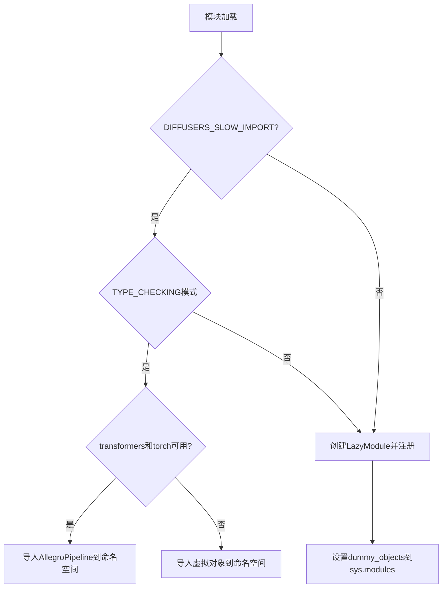
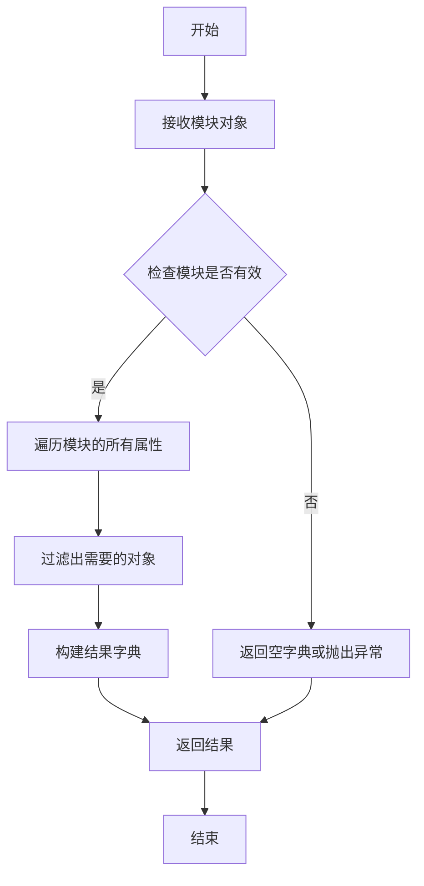
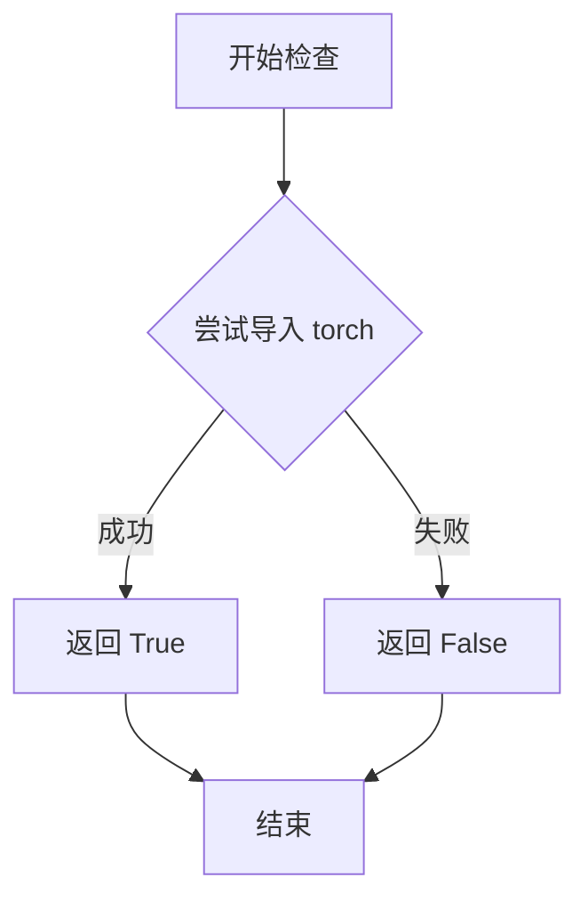
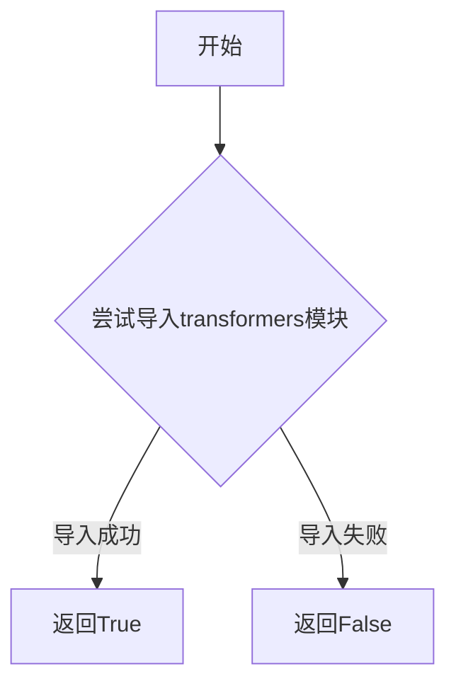

# `diffusers\src\diffusers\pipelines\allegro\__init__.py` 详细设计文档

这是Diffusers库中AllegroPipeline的延迟加载模块初始化文件，通过LazyModule机制实现可选依赖（transformers和torch）的条件导入，当依赖不可用时使用虚拟对象保持API兼容性。

## 整体流程



## 类结构

```
allegro/__init__.py (入口模块)
├── _LazyModule (延迟加载机制)
├── OptionalDependencyNotAvailable (可选依赖异常)
├── get_objects_from_module (获取虚拟对象)
└── AllegroPipeline (实际管道类，被条件导入)
```

## 全局变量及字段


### `_dummy_objects`
    
存储虚拟对象的字典，用于可选依赖不可用时的占位符

类型：`dict`
    


### `_import_structure`
    
定义模块导入结构的字典，键为模块路径，值为导出对象列表

类型：`dict`
    


### `DIFFUSERS_SLOW_IMPORT`
    
标志是否启用慢速导入模式的布尔值

类型：`bool`
    


### `TYPE_CHECKING`
    
Python typing模块的类型检查标志，用于类型提示

类型：`bool`
    


### `_LazyModule.__name__`
    
模块名称

类型：`str`
    


### `_LazyModule.__file__`
    
模块文件路径

类型：`str`
    


### `_LazyModule._import_structure`
    
模块的导入结构定义

类型：`dict`
    


### `_LazyModule.module_spec`
    
模块规格对象，包含模块的元数据

类型：`ModuleSpec`
    
    

## 全局函数及方法


### `get_objects_from_module`

该函数是一个工具函数，用于从给定的模块中提取所有对象（通常是类或函数），并返回一个可迭代的数据结构（通常为字典），以便进行后续的模块懒加载和依赖处理。

参数：

- `module`：`module`，要从中提取对象的模块对象

返回值：`dict` 或可迭代对象，返回模块中包含的对象集合，通常为字典形式，键为对象名称，值为对象本身

#### 流程图



#### 带注释源码

```python
# 从 utils 模块导入的外部函数
# 该函数定义在 .../utils 模块中，此处仅为导入使用
from ...utils import get_objects_objects

# 使用示例（在当前代码中）
_dummy_objects.update(get_objects_from_module(dummy_torch_and_transformers_objects))
# 参数：dummy_torch_and_transformers_objects - 模块对象
# 返回值：模块中的所有对象（字典形式）
# 作用：将模块中的所有虚拟对象添加到 _dummy_objects 字典中
#       用于在可选依赖不可用时提供替代对象
```

> **注意**：由于 `get_objects_from_module` 函数定义在 `.../utils` 模块中，而非当前代码文件内，因此无法从给定代码片段中提取其完整实现源码。以上信息基于函数在代码中的使用方式推断得出。


### `is_torch_available`

该函数用于检查当前环境中 PyTorch 库是否可用，通过尝试导入 `torch` 模块来判断，返回布尔值以表示 PyTorch 是否已安装可用。

参数：
- 无

返回值：`bool`，返回 `True` 表示 PyTorch 可用，返回 `False` 表示 PyTorch 不可用。

#### 流程图



#### 带注释源码

```python
def is_torch_available():
    """
    检查 PyTorch 是否可用。
    
    尝试通过 try-except 块导入 torch 模块，如果导入成功则返回 True，
    否则捕获 ImportError 并返回 False。
    """
    try:
        import torch  # noqa F401
        return True
    except ImportError:
        return False
```


### `is_transformers_available`

该函数是 `diffusers` 库中的一个工具函数，用于运行时检查 `transformers` 库是否已安装且可用。这是通过尝试动态导入 `transformers` 模块来实现的，常用于实现可选依赖的延迟加载。

参数：

- 该函数无参数

返回值：`bool`，返回 `True` 表示 `transformers` 库可用且已安装；返回 `False` 表示不可用或未安装

#### 流程图



#### 带注释源码

```python
def is_transformers_available():
    """
    检查 transformers 库是否可用。
    
    该函数通过尝试导入 transformers 模块来检查库是否已安装。
    如果导入成功返回 True，否则返回 False。
    
    Returns:
        bool: transformers 库是否可用
    """
    try:
        # 尝试导入 transformers 模块
        import transformers
        # 如果导入成功，库可用
        return True
    except ImportError:
        # 如果导入失败，说明未安装或不可用
        return False
```


### `setattr` (在模块初始化中使用)

在模块初始化阶段，将虚拟对象动态绑定到当前模块的属性上，以便在可选依赖不可用时保持模块接口完整性。

参数：

- `obj`：`sys.modules[__name__]` (模块对象)，表示要设置属性的目标对象，即当前模块
- `name`：`str` (字符串)，从字典键获取的属性名称，代表虚拟对象的名称
- `value`：任意类型，从字典值获取的属性值，代表虚拟对象本身

返回值：`None`，无返回值（Python内置函数setattr返回None）

#### 流程图

```mermaid
flowchart TD
    A[开始遍历 _dummy_objects 字典] --> B{字典是否还有未处理的键值对?}
    B -->|是| C[取出当前键值对: name, value]
    C --> D[调用 setattr sys.modules[__name__], name, value]
    D --> E[将虚拟对象动态设置为模块属性]
    E --> B
    B -->|否| F[结束循环]
    
    style D fill:#f9f,stroke:#333,stroke-width:2px
    style E fill:#9f9,stroke:#333,stroke-width:2px
```

#### 带注释源码

```python
# 遍历 _dummy_objects 字典中的所有键值对
# _dummy_objects 包含当可选依赖不可用时的虚拟对象
for name, value in _dummy_objects.items():
    # 使用 setattr 内置函数动态设置模块属性
    # 参数1: sys.modules[__name__] - 当前模块对象
    # 参数2: name - 要设置的属性名（字符串）
    # 参数3: value - 要设置的属性值（虚拟对象）
    # 作用: 将虚拟对象（如 AllegroPipeline 的替代品）注入到当前模块
    #       使得在依赖不可用时，模块仍能保持一致的接口结构
    setattr(sys.modules[__name__], name, value)
```

---

### 上下文补充信息

**文件整体运行流程：**

该文件是Diffusers库的`__init__.py`模块，采用延迟导入（Lazy Loading）模式处理可选依赖。核心流程：

1. 检查`transformers`和`torch`是否可用
2. 如果都可用，将`AllegroPipeline`加入导入结构
3. 如果任一依赖不可用，从虚拟对象模块获取占位符
4. 将模块注册为`_LazyModule`实现延迟加载
5. **使用`setattr`将虚拟对象动态绑定到模块属性**

**关键组件：**

| 组件 | 描述 |
|------|------|
| `_dummy_objects` | 存储可选依赖不可用时的虚拟对象 |
| `_import_structure` | 定义模块的合法导入结构 |
| `_LazyModule` | 延迟加载机制的实现类 |
| `setattr` | 动态属性绑定，将虚拟对象注入模块命名空间 |

**潜在技术债务/优化空间：**

1. **魔法字符串**：`sys.modules[__name__]`依赖隐式约定，可提取为显式变量
2. **循环遍历开销**：对于大型虚拟对象集合，可考虑批量处理或缓存机制
3. **缺乏错误处理**：未检查`setattr`调用是否成功，缺乏容错设计

## 关键组件


### 延迟加载模块（_LazyModule）

利用`_LazyModule`实现模块的惰性加载，延迟导入`AllegroPipeline`，提高库的整体导入性能。

### 可选依赖检查机制

通过`is_transformers_available()`和`is_torch_available()`检查torch和transformers是否可用，并在依赖不满足时抛出`OptionalDependencyNotAvailable`异常。

### 虚拟对象占位符（_dummy_objects）

当torch和transformers依赖不可用时，使用`dummy_torch_and_transformers_objects`模块中的虚拟对象进行占位，确保模块结构完整性。

### 导入结构定义（_import_structure）

定义模块的公共接口结构，声明`AllegroPipeline`属于`pipeline_allegro`子模块的导出项。

### TYPE_CHECKING 条件导入

在类型检查或慢速导入模式下，直接导入`AllegroPipeline`类供静态分析和IDE使用。


## 问题及建议


### 已知问题

-   **重复的依赖检查逻辑**：在第17行和第25行存在完全相同的可选依赖检查代码（`if not (is_transformers_available() and is_torch_available())`），违反了DRY（Don't Repeat Yourself）原则，增加维护成本。
-   **全局可变状态管理风险**：`_dummy_objects`和`_import_structure`作为模块级全局字典，在运行时可能被意外修改，缺乏 encapsulation。
-   **静默失败风险**：调用`get_objects_from_module`获取dummy objects时未检查返回值是否为空，若`dummy_torch_and_transformers_objects`模块不存在或无导出对象，代码将静默失败。
-   **魔法字符串/硬编码**：pipeline名称`"AllegroPipeline"`和`"pipeline_allegro"`以硬编码形式存在，不利于扩展新pipeline。
-   **冗余的LazyModule注册**：在非TYPE_CHECKING分支中，重复注册了dummy objects到sys.modules，可能导致模块状态不一致。

### 优化建议

-   **提取公共依赖检查逻辑**：将可选依赖检查封装为独立函数或常量，消除重复代码。例如：
    ```python
    def _check_dependencies():
        return is_transformers_available() and is_torch_available()
    ```
-   **引入配置驱动机制**：将pipeline名称映射到import_structure，实现配置化添加新pipeline，减少硬编码。
-   **增强错误处理**：在获取dummy objects后添加验证逻辑，确保获取到有效对象，必要时抛出明确的异常信息。
-   **优化模块初始化**：考虑将dummy objects的注册与LazyModule的创建分离，确保状态一致性。
-   **添加类型注解和文档**：为全局变量添加类型注解和文档字符串，提升代码可读性和可维护性。


## 其它


### 设计目标与约束

本模块的设计目标是实现Diffusers库中AllegroPipeline的延迟加载机制，确保在运行时环境中仅在满足依赖条件时才加载pipeline模块，同时保持类型检查时的完整性。约束包括：必须同时依赖torch和transformers两个可选库，遵循Diffusers库的模块导入规范，使用_LazyModule实现惰性加载，并维护与现有导入结构的一致性。

### 错误处理与异常设计

本模块采用分层异常处理策略：首先是可选依赖检查，使用`OptionalDependencyNotAvailable`异常标识缺失的torch或transformers依赖；其次是条件导入分支，在TYPE_CHECKING或DIFFUSERS_SLOW_IMPORT模式下进行不同的导入路径选择；最后是运行时模块替换，通过`sys.modules`动态注册虚拟对象到当前模块命名空间。异常处理流程确保了在依赖不可用时不会导致程序崩溃，而是提供虚拟对象保持API可用性。

### 数据流与状态机

模块初始化数据流分为三个主要状态：初始状态时_import_structure和_dummy_objects被初始化为空；依赖检查状态时判断is_transformers_available()和is_torch_available()的返回值；最终状态根据依赖可用性选择填充_import_structure或从dummy模块获取虚拟对象。状态转换由DIFFUSERS_SLOW_IMPORT标志和TYPE_CHECKING常量共同控制，决定是否执行LazyModule初始化或保持原位导入。

### 外部依赖与接口契约

本模块的外部依赖包括：torch库（is_torch_available()检查）、transformers库（is_transformers_available()检查）、diffusers.utils中的_DummyModule、_LazyModule、get_objects_from_module等工具函数，以及pipeline_allegro模块中的AllegroPipeline类。接口契约规定：模块必须导出pipeline_allegro.AllegroPipeline类，在依赖不可用时应导出同名虚拟对象，且符合Diffusers库的模块导入规范。

### 模块初始化顺序

模块初始化遵循特定的顺序执行：首先导入类型检查和工具函数，然后定义_import_structure和_dummy_objects两个空字典，接着执行依赖可用性检查并填充_import_structure或获取虚拟对象，随后根据TYPE_CHECKING或DIFFUSERS_SLOW_IMPORT标志决定导入路径，最后在非类型检查模式下注册LazyModule并绑定虚拟对象到sys.modules。

### 版本兼容性考虑

本模块需要考虑Python版本兼容性（主要支持Python 3.8+），以及Diffusers库版本的向前兼容性。TYPE_CHECKING的使用需要确保与旧版Python兼容，LazyModule的API可能在不同版本间有细微差异。模块设计时需保留对未来新增pipeline的扩展性，通过在_import_structure字典中添加新条目即可无缝集成。

### 性能特征分析

延迟加载机制的性能收益主要体现在：首次导入时如果依赖不可用可以快速失败，LazyModule只在实际访问属性时才触发真实导入，避免了启动时的全量依赖检查开销。但需要注意TYPE_CHECKING模式下会立即执行真实导入，可能影响类型检查速度。模块本身的执行时间复杂度为O(1)，主要是条件分支判断和字典操作。


    