# `diffusers\src\diffusers\pipelines\allegro\pipeline_allegro.py` 详细设计文档

AllegroPipeline 是一个用于文本到视频生成的 Diffusers 管道，继承自 DiffusionPipeline，利用 T5 文本编码器、AllegroTransformer3DModel 和 VAE 模型，通过去噪过程生成视频。

## 整体流程

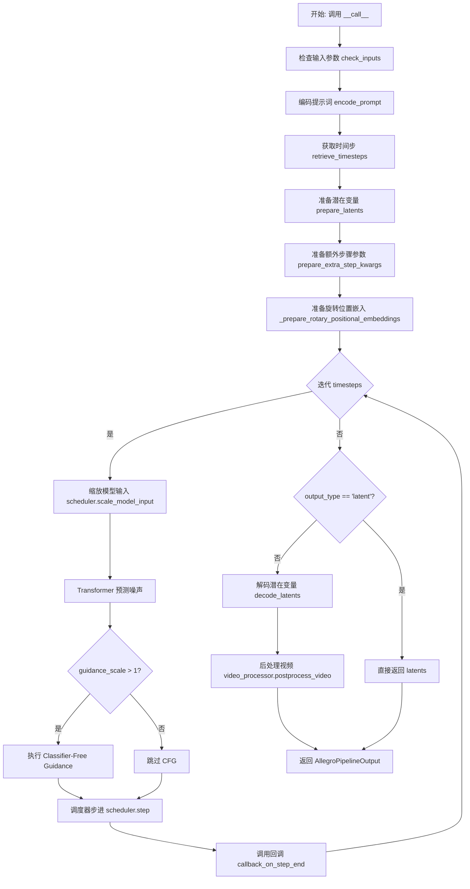

## 类结构

```
DiffusionPipeline (基类)
└── AllegroPipeline
```

## 全局变量及字段


### `XLA_AVAILABLE`
    
Boolean flag indicating whether PyTorch XLA is available for TPU support

类型：`bool`
    


### `logger`
    
Module-level logger for tracking pipeline execution and warnings

类型：`logging.Logger`
    


### `EXAMPLE_DOC_STRING`
    
Example usage documentation string demonstrating how to use the AllegroPipeline for text-to-video generation

类型：`str`
    


### `AllegroPipeline.bad_punct_regex`
    
Compiled regex pattern for filtering bad punctuation and special characters from text captions

类型：`re.Pattern`
    


### `AllegroPipeline._optional_components`
    
List of optional pipeline components that may not be required for all configurations

类型：`list`
    


### `AllegroPipeline.model_cpu_offload_seq`
    
String defining the sequence order for CPU offloading of models (text_encoder->transformer->vae)

类型：`str`
    


### `AllegroPipeline._callback_tensor_inputs`
    
List of tensor input names that can be passed to callback functions during inference

类型：`list`
    


### `AllegroPipeline.vae_scale_factor_spatial`
    
Spatial scaling factor for VAE latent space, derived from VAE block out channels

类型：`int`
    


### `AllegroPipeline.vae_scale_factor_temporal`
    
Temporal scaling factor for VAE latent space compression ratio

类型：`int`
    


### `AllegroPipeline.video_processor`
    
Video processor instance for post-processing generated video frames

类型：`VideoProcessor`
    


### `AllegroPipeline.tokenizer`
    
T5 tokenizer for converting text prompts to token IDs

类型：`T5Tokenizer`
    


### `AllegroPipeline.text_encoder`
    
Frozen T5 text encoder model for generating text embeddings from tokenized prompts

类型：`T5EncoderModel`
    


### `AllegroPipeline.vae`
    
Variational Autoencoder (VAE) model for encoding images to latent space and decoding latents to video frames

类型：`AutoencoderKLAllegro`
    


### `AllegroPipeline.transformer`
    
Allegro transformer model for denoising video latents conditioned on text embeddings

类型：`AllegroTransformer3DModel`
    


### `AllegroPipeline.scheduler`
    
Diffusion scheduler for managing the denoising schedule during inference

类型：`KarrasDiffusionSchedulers`
    


### `AllegroPipeline._guidance_scale`
    
Classifier-free guidance scale for controlling text prompt influence on generation

类型：`float`
    


### `AllegroPipeline._num_timesteps`
    
Total number of diffusion timesteps used in the current generation process

类型：`int`
    


### `AllegroPipeline._current_timestep`
    
Current timestep during the denoising loop for tracking progress

类型：`int`
    


### `AllegroPipeline._interrupt`
    
Flag to interrupt the generation process when set to True

类型：`bool`
    
    

## 全局函数及方法


### `retrieve_timesteps`

该函数是调度器时间步获取工具函数，通过调用调度器的 `set_timesteps` 方法生成或设置时间步序列，并返回时间步张量及推理步数。支持自定义时间步（timesteps）或自定义噪声强度（sigmas），同时兼容任意调度器类型。

参数：

- `scheduler`：`SchedulerMixin`，用于获取时间步的调度器实例
- `num_inference_steps`：`int | None`，生成样本时使用的扩散推理步数，若使用则 `timesteps` 必须为 `None`
- `device`：`str | torch.device | None`，时间步要移动到的设备，若为 `None` 则不移动
- `timesteps`：`list[int] | None`，用于覆盖调度器时间步间隔策略的自定义时间步，若传入则 `num_inference_steps` 和 `sigmas` 必须为 `None`
- `sigmas`：`list[float] | None`，用于覆盖调度器时间步间隔策略的自定义噪声强度，若传入则 `num_inference_steps` 和 `timesteps` 必须为 `None`
- `**kwargs`：任意关键字参数，将传递给 `scheduler.set_timesteps` 方法

返回值：`tuple[torch.Tensor, int]`，元组第一个元素为调度器的时间步序列，第二个元素为推理步数

#### 流程图

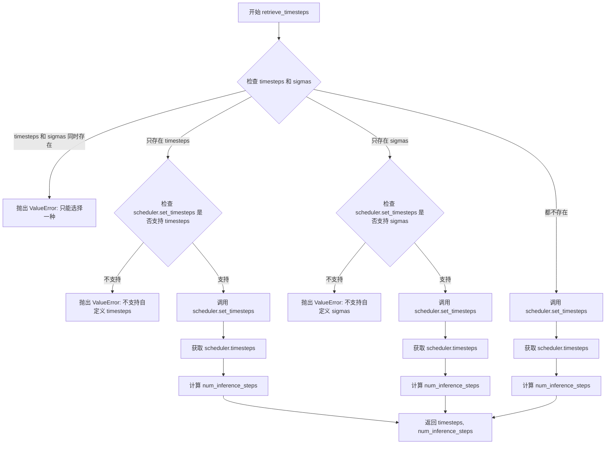

#### 带注释源码

```python
# 从 diffusers.pipelines.stable_diffusion.pipeline_stable_diffusion 复制的 retrieve_timesteps
def retrieve_timesteps(
    scheduler,  # SchedulerMixin: 调度器对象，用于生成时间步
    num_inference_steps: int | None = None,  # int | None: 推理步数
    device: str | torch.device | None = None,  # str | torch.device | None: 目标设备
    timesteps: list[int] | None = None,  # list[int] | None: 自定义时间步列表
    sigmas: list[float] | None = None,  # list[float] | None: 自定义噪声强度列表
    **kwargs,  # 传递给 scheduler.set_timesteps 的额外关键字参数
):
    r"""
    调用调度器的 `set_timesteps` 方法并在调用后从调度器获取时间步。处理自定义时间步。
    任何 kwargs 都将提供给 `scheduler.set_timesteps`。

    Args:
        scheduler (`SchedulerMixin`):
            用于获取时间步的调度器。
        num_inference_steps (`int`):
            使用预训练模型生成样本时使用的扩散步骤数。如果使用，则 `timesteps` 必须为 `None`。
        device (`str` or `torch.device`, *optional*):
            时间步应移动到的设备。如果为 `None`，则不移动时间步。
        timesteps (`list[int]`, *optional*):
            用于覆盖调度器时间步间隔策略的自定义时间步。如果传入 `timesteps`，则 `num_inference_steps`
            和 `sigmas` 必须为 `None`。
        sigmas (`list[float]`, *optional*):
            用于覆盖调度器时间步间隔策略的自定义 sigmas。如果传入 `sigmas`，则 `num_inference_steps`
            和 `timesteps` 必须为 `None`。

    Returns:
        `tuple[torch.Tensor, int]`: 元组，其中第一个元素是调度器的时间步序列，第二个元素是推理步骤数。
    """
    # 校验：timesteps 和 sigmas 不能同时传入
    if timesteps is not None and sigmas is not None:
        raise ValueError("Only one of `timesteps` or `sigmas` can be passed. Please choose one to set custom values")
    
    # 处理自定义 timesteps 的情况
    if timesteps is not None:
        # 检查调度器是否支持自定义 timesteps 参数
        accepts_timesteps = "timesteps" in set(inspect.signature(scheduler.set_timesteps).parameters.keys())
        if not accepts_timesteps:
            raise ValueError(
                f"The current scheduler class {scheduler.__class__}'s `set_timesteps` does not support custom"
                f" timestep schedules. Please check whether you are using the correct scheduler."
            )
        # 调用调度器的 set_timesteps 方法设置自定义时间步
        scheduler.set_timesteps(timesteps=timesteps, device=device, **kwargs)
        # 从调度器获取实际的时间步张量
        timesteps = scheduler.timesteps
        # 计算推理步数（时间步的数量）
        num_inference_steps = len(timesteps)
    
    # 处理自定义 sigmas 的情况
    elif sigmas is not None:
        # 检查调度器是否支持自定义 sigmas 参数
        accept_sigmas = "sigmas" in set(inspect.signature(scheduler.set_timesteps).parameters.keys())
        if not accept_sigmas:
            raise ValueError(
                f"The current scheduler class {scheduler.__class__}'s `set_timesteps` does not support custom"
                f" sigmas schedules. Please check whether you are using the correct scheduler."
            )
        # 调用调度器的 set_timesteps 方法设置自定义 sigmas
        scheduler.set_timesteps(sigmas=sigmas, device=device, **kwargs)
        # 从调度器获取时间步
        timesteps = scheduler.timesteps
        # 计算推理步数
        num_inference_steps = len(timesteps)
    
    # 默认情况：根据 num_inference_steps 生成时间步
    else:
        scheduler.set_timesteps(num_inference_steps, device=device, **kwargs)
        timesteps = scheduler.timesteps
    
    # 返回时间步张量和推理步数
    return timesteps, num_inference_steps
```


### `AllegroPipeline.__init__`

该方法是`AllegroPipeline`类的构造函数，用于初始化文本到视频生成管道的各个核心组件，包括分词器、文本编码器、VAE模型、变换器模型和调度器，并配置VAE的缩放因子和视频处理器。

参数：

- `tokenizer`：`T5Tokenizer`，T5分词器，用于将文本输入转换为token序列
- `text_encoder`：`T5EncoderModel`，T5文本编码器模型，用于将token序列编码为文本嵌入向量
- `vae`：`AutoencoderKLAllegro`，Allegro变分自编码器，用于编码和解码视频潜在表示
- `transformer`：`AllegroTransformer3DModel`，Allegro 3D变换器模型，用于对视频潜在表示进行去噪
- `scheduler`：`KarrasDiffusionSchedulers`，Karras扩散调度器，用于控制去噪过程的噪声调度

返回值：`None`，无返回值，该方法为构造函数

#### 流程图

```mermaid
flowchart TD
    A[开始 __init__] --> B[调用父类 DiffusionPipeline.__init__]
    B --> C[register_modules: 注册 tokenizer, text_encoder, vae, transformer, scheduler]
    C --> D{检查 vae 是否存在}
    D -->|是| E[计算 vae_scale_factor_spatial: 2^(len(vae.config.block_out_channels)-1)]
    D -->|否| F[vae_scale_factor_spatial = 8]
    E --> G{检查 vae 是否存在}
    G -->|是| H[vae_scale_factor_temporal = vae.config.temporal_compression_ratio]
    G -->|否| I[vae_scale_factor_temporal = 4]
    H --> J[创建 VideoProcessor: vae_scale_factor=vae_scale_factor_spatial]
    I --> J
    J --> K[结束 __init__]
```

#### 带注释源码

```python
def __init__(
    self,
    tokenizer: T5Tokenizer,
    text_encoder: T5EncoderModel,
    vae: AutoencoderKLAllegro,
    transformer: AllegroTransformer3DModel,
    scheduler: KarrasDiffusionSchedulers,
):
    """
    初始化 AllegroPipeline 管道
    
    参数:
        tokenizer: T5 分词器
        text_encoder: T5 文本编码器
        vae: Allegro VAE 模型
        transformer: Allegro 3D 变换器
        scheduler: Karras 扩散调度器
    """
    # 调用父类 DiffusionPipeline 的初始化方法
    # 继承基础管道功能
    super().__init__()

    # 注册所有模块，使它们可以通过管道对象访问
    self.register_modules(
        tokenizer=tokenizer, 
        text_encoder=text_encoder, 
        vae=vae, 
        transformer=transformer, 
        scheduler=scheduler
    )
    
    # 计算 VAE 空间缩放因子
    # 用于将像素空间转换为潜在空间
    # 基于 VAE 的块输出通道数计算 (2^(n-1))
    self.vae_scale_factor_spatial = (
        2 ** (len(self.vae.config.block_out_channels) - 1) if getattr(self, "vae", None) else 8
    )
    
    # 计算 VAE 时间缩放因子
    # 用于时间维度的压缩
    self.vae_scale_factor_temporal = (
        self.vae.config.temporal_compression_ratio if getattr(self, "vae", None) else 4
    )

    # 创建视频处理器
    # 用于视频的后处理（潜在空间到像素空间的转换）
    self.video_processor = VideoProcessor(vae_scale_factor=self.vae_scale_factor_spatial)
```


### AllegroPipeline.encode_prompt

该方法负责将文本提示编码为文本编码器的隐藏状态（embedding），支持分类器自由引导（Classifier-Free Guidance），并处理正向和负向提示的嵌入生成。

参数：

- `prompt`：`str | list[str]`，要编码的提示词
- `negative_prompt`：`str`，不参与引导图像生成的负向提示词，默认为空字符串
- `do_classifier_free_guidance`：`bool`，是否使用分类器自由引导，默认为True
- `num_videos_per_prompt`：`int`，每个提示词生成的视频数量，默认为1
- `device`：`torch.device | None`，用于放置生成embeddings的设备
- `prompt_embeds`：`torch.Tensor | None`，预生成的文本embeddings，用于微调文本输入
- `negative_prompt_embeds`：`torch.Tensor | None`，预生成的负向文本embeddings
- `prompt_attention_mask`：`torch.Tensor | None`，文本embeddings的预生成注意力掩码
- `negative_prompt_attention_mask`：`torch.Tensor | None`，负向文本embeddings的注意力掩码
- `clean_caption`：`bool`，是否在编码前清理和预处理提示词，默认为False
- `max_sequence_length`：`int`，提示词使用的最大序列长度，默认为512

返回值：`tuple[torch.Tensor, torch.Tensor, torch.Tensor, torch.Tensor]`，返回包含prompt_embeds、prompt_attention_mask、negative_prompt_embeds和negative_prompt_attention_mask的元组

#### 流程图

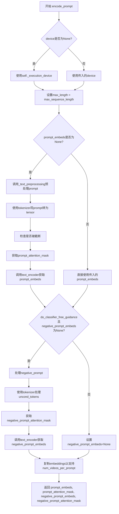

#### 带注释源码

```python
def encode_prompt(
    self,
    prompt: str | list[str],
    do_classifier_free_guidance: bool = True,
    negative_prompt: str = "",
    num_videos_per_prompt: int = 1,
    device: torch.device | None = None,
    prompt_embeds: torch.Tensor | None = None,
    negative_prompt_embeds: torch.Tensor | None = None,
    prompt_attention_mask: torch.Tensor | None = None,
    negative_prompt_attention_mask: torch.Tensor | None = None,
    clean_caption: bool = False,
    max_sequence_length: int = 512,
    **kwargs,
):
    r"""
    Encodes the prompt into text encoder hidden states.

    Args:
        prompt (`str` or `list[str]`, *optional*):
            prompt to be encoded
        negative_prompt (`str` or `list[str]`, *optional*):
            The prompt not to guide the image generation. If not defined, one has to pass `negative_prompt_embeds`
            instead. Ignored when not using guidance (i.e., ignored if `guidance_scale` is less than `1`). For
            PixArt-Alpha, this should be "".
        do_classifier_free_guidance (`bool`, *optional*, defaults to `True`):
            whether to use classifier free guidance or not
        num_videos_per_prompt (`int`, *optional*, defaults to 1):
            number of images that should be generated per prompt
        device: (`torch.device`, *optional*):
            torch device to place the resulting embeddings on
        prompt_embeds (`torch.Tensor`, *optional*):
            Pre-generated text embeddings. Can be used to easily tweak text inputs, *e.g.* prompt weighting. If not
            provided, text embeddings will be generated from `prompt` input argument.
        negative_prompt_embeds (`torch.Tensor`, *optional*):
            Pre-generated negative text embeddings. For PixArt-Alpha, it's should be the embeddings of the ""
            string.
        clean_caption (`bool`, defaults to `False`):
            If `True`, the function will preprocess and clean the provided caption before encoding.
        max_sequence_length (`int`, defaults to 512): Maximum sequence length to use for the prompt.
    """

    # 检查是否传入了已废弃的mask_feature参数
    if "mask_feature" in kwargs:
        deprecation_message = "The use of `mask_feature` is deprecated. It is no longer used in any computation and that doesn't affect the end results. It will be removed in a future version."
        deprecate("mask_feature", "1.0.0", deprecation_message, standard_warn=False)

    # 如果未指定device，使用执行设备
    if device is None:
        device = self._execution_device

    # See Section 3.1. of the paper.
    # 设置最大长度，默认使用max_sequence_length
    max_length = max_sequence_length

    # 如果没有预生成的prompt_embeds，则需要从prompt生成
    if prompt_embeds is None:
        # 文本预处理：清理和规范化prompt
        prompt = self._text_preprocessing(prompt, clean_caption=clean_caption)
        # 使用tokenizer将prompt转为模型输入格式
        text_inputs = self.tokenizer(
            prompt,
            padding="max_length",
            max_length=max_length,
            truncation=True,
            add_special_tokens=True,
            return_tensors="pt",
        )
        text_input_ids = text_inputs.input_ids
        # 获取未截断的输入用于检查
        untruncated_ids = self.tokenizer(prompt, padding="longest", return_tensors="pt").input_ids

        # 检查文本是否被截断，如果是则记录警告
        if untruncated_ids.shape[-1] >= text_input_ids.shape[-1] and not torch.equal(
            text_input_ids, untruncated_ids
        ):
            removed_text = self.tokenizer.batch_decode(untruncated_ids[:, max_length - 1 : -1])
            logger.warning(
                "The following part of your input was truncated because T5 can only handle sequences up to"
                f" {max_length} tokens: {removed_text}"
            )

        # 获取attention mask并移至device
        prompt_attention_mask = text_inputs.attention_mask
        prompt_attention_mask = prompt_attention_mask.to(device)

        # 通过text_encoder获取prompt embeddings
        prompt_embeds = self.text_encoder(text_input_ids.to(device), attention_mask=prompt_attention_mask)
        prompt_embeds = prompt_embeds[0]  # 取hidden states而非loss

    # 确定dtype优先级：text_encoder > transformer > None
    if self.text_encoder is not None:
        dtype = self.text_encoder.dtype
    elif self.transformer is not None:
        dtype = self.transformer.dtype
    else:
        dtype = None

    # 将prompt_embeds转换为指定dtype和device
    prompt_embeds = prompt_embeds.to(dtype=dtype, device=device)

    # 获取batch size和序列长度
    bs_embed, seq_len, _ = prompt_embeds.shape
    # duplicate text embeddings and attention mask for each generation per prompt, using mps friendly method
    # 为每个prompt复制多个video的embeddings
    prompt_embeds = prompt_embeds.repeat(1, num_videos_per_prompt, 1)
    prompt_embeds = prompt_embeds.view(bs_embed * num_videos_per_prompt, seq_len, -1)
    prompt_attention_mask = prompt_attention_mask.repeat(1, num_videos_per_prompt)
    prompt_attention_mask = prompt_attention_mask.view(bs_embed * num_videos_per_prompt, -1)

    # get unconditional embeddings for classifier free guidance
    # 如果使用CFG且没有预生成的negative_prompt_embeds，则生成无条件embeddings
    if do_classifier_free_guidance and negative_prompt_embeds is None:
        # 处理negative_prompt，支持字符串或列表
        uncond_tokens = [negative_prompt] * bs_embed if isinstance(negative_prompt, str) else negative_prompt
        # 预处理negative_prompt
        uncond_tokens = self._text_preprocessing(uncond_tokens, clean_caption=clean_caption)
        max_length = prompt_embeds.shape[1]
        # tokenize negative_prompt
        uncond_input = self.tokenizer(
            uncond_tokens,
            padding="max_length",
            max_length=max_length,
            truncation=True,
            return_attention_mask=True,
            add_special_tokens=True,
            return_tensors="pt",
        )
        negative_prompt_attention_mask = uncond_input.attention_mask
        negative_prompt_attention_mask = negative_prompt_attention_mask.to(device)

        # 获取negative embeddings
        negative_prompt_embeds = self.text_encoder(
            uncond_input.input_ids.to(device), attention_mask=negative_prompt_attention_mask
        )
        negative_prompt_embeds = negative_prompt_embeds[0]

    # 处理CFG：复制negative embeddings
    if do_classifier_free_guidance:
        # duplicate unconditional embeddings for each generation per prompt, using mps friendly method
        seq_len = negative_prompt_embeds.shape[1]

        negative_prompt_embeds = negative_prompt_embeds.to(dtype=dtype, device=device)

        negative_prompt_embeds = negative_prompt_embeds.repeat(1, num_videos_per_prompt, 1)
        negative_prompt_embeds = negative_prompt_embeds.view(bs_embed * num_videos_per_prompt, seq_len, -1)

        negative_prompt_attention_mask = negative_prompt_attention_mask.repeat(1, num_videos_per_prompt)
        negative_prompt_attention_mask = negative_prompt_attention_mask.view(bs_embed * num_videos_per_prompt, -1)
    else:
        # 不使用CFG时，设为None
        negative_prompt_embeds = None
        negative_prompt_attention_mask = None

    # 返回4个tensor：prompt_embeds, prompt_attention_mask, negative_prompt_embeds, negative_prompt_attention_mask
    return prompt_embeds, prompt_attention_mask, negative_prompt_embeds, negative_prompt_attention_mask
```


### `AllegroPipeline.prepare_extra_step_kwargs`

该方法用于为调度器（scheduler）的 `step` 方法准备额外的关键字参数。由于不同的调度器具有不同的签名，该方法通过反射检查调度器是否接受 `eta` 和 `generator` 参数，并动态构建需要传递的参数字典。

参数：

- `generator`：`torch.Generator | list[torch.Generator] | None`，用于确保生成过程确定性的随机数生成器
- `eta`：`float`，DDIM 调度器专用的噪声调度参数，对应 DDIM 论文中的 η (eta)，取值范围应在 [0, 1] 之间

返回值：`dict`，包含调度器 `step` 方法所需的关键字参数（如 `eta` 和/或 `generator`）

#### 流程图

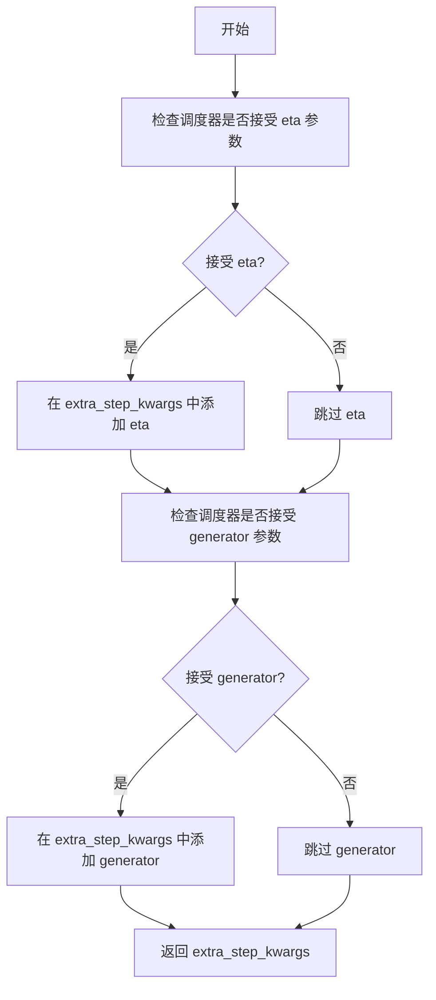

#### 带注释源码

```python
def prepare_extra_step_kwargs(self, generator, eta):
    """
    准备调度器步骤所需的额外关键字参数。

    由于并非所有调度器都具有相同的签名，此方法通过检查调度器的 step 方法签名来动态确定
    需要传递哪些参数。eta (η) 仅用于 DDIMScheduler，其他调度器会忽略此参数。
    eta 对应 DDIM 论文 (https://huggingface.co/papers/2010.02502) 中的参数，
    取值范围应为 [0, 1]。

    Args:
        generator: torch.Generator 或其列表，用于确保生成过程确定性，可选
        eta: float，DDIM 调度器的噪声调度参数，默认为 0.0

    Returns:
        dict: 包含调度器 step 方法所需参数（如 eta 和/或 generator）的字典
    """
    # 通过 inspect 检查调度器的 step 方法是否接受 eta 参数
    accepts_eta = "eta" in set(inspect.signature(self.scheduler.step).parameters.keys())
    
    # 初始化空字典用于存储额外参数
    extra_step_kwargs = {}
    
    # 如果调度器接受 eta 参数，则将其添加到参数字典中
    if accepts_eta:
        extra_step_kwargs["eta"] = eta

    # 检查调度器是否接受 generator 参数
    accepts_generator = "generator" in set(inspect.signature(self.scheduler.step).parameters.keys())
    
    # 如果调度器接受 generator 参数，则将其添加到参数字典中
    if accepts_generator:
        extra_step_kwargs["generator"] = generator
        
    # 返回构建好的参数字典
    return extra_step_kwargs
```


### `AllegroPipeline.check_inputs`

该方法用于验证文本到视频生成管道的输入参数是否合法，包括检查帧数、分辨率、提示词嵌入和注意力掩码的合法性，并抛出相应的错误信息。

参数：

- `self`：`AllegroPipeline` 实例，管道对象本身
- `prompt`：`str | list[str] | None`，用户输入的文本提示词
- `num_frames`：`int`，生成的视频帧数
- `height`：`int`，生成的视频高度（像素）
- `width`：`int`，生成的视频宽度（像素）
- `callback_on_step_end_tensor_inputs`：`list[str] | None`，回调函数在每个推理步骤结束时需要的张量输入列表
- `negative_prompt`：`str | list[str] | None`，负面提示词，用于引导生成内容
- `prompt_embeds`：`torch.Tensor | None`，预计算的文本嵌入向量
- `negative_prompt_embeds`：`torch.Tensor | None`，预计算的负面文本嵌入向量
- `prompt_attention_mask`：`torch.Tensor | None`，文本嵌入的注意力掩码
- `negative_prompt_attention_mask`：`torch.Tensor | None`，负面文本嵌入的注意力掩码

返回值：`None`，该方法不返回值，若验证失败则抛出 `ValueError` 异常

#### 流程图

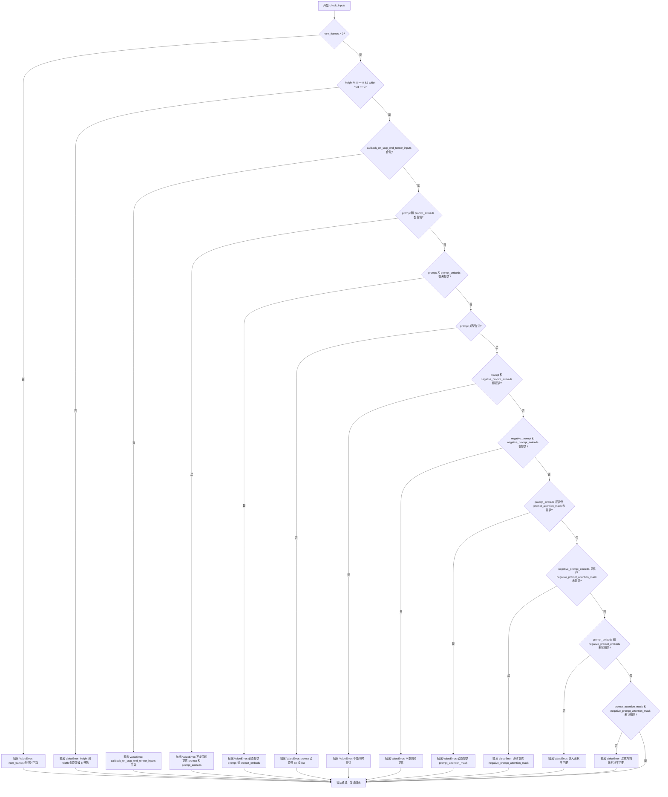

#### 带注释源码

```python
def check_inputs(
    self,
    prompt,
    num_frames,
    height,
    width,
    callback_on_step_end_tensor_inputs,
    negative_prompt=None,
    prompt_embeds=None,
    negative_prompt_embeds=None,
    prompt_attention_mask=None,
    negative_prompt_attention_mask=None,
):
    # 检查帧数是否为正数
    if num_frames <= 0:
        raise ValueError(f"`num_frames` have to be positive but is {num_frames}.")
    
    # 检查高度和宽度是否可以被 8 整除（VAE 要求）
    if height % 8 != 0 or width % 8 != 0:
        raise ValueError(f"`height` and `width` have to be divisible by 8 but are {height} and {width}.")

    # 检查回调函数张量输入是否在允许的列表中
    if callback_on_step_end_tensor_inputs is not None and not all(
        k in self._callback_tensor_inputs for k in callback_on_step_end_tensor_inputs
    ):
        raise ValueError(
            f"`callback_on_step_end_tensor_inputs` has to be in {self._callback_tensor_inputs}, but found {[k for k in callback_on_step_end_tensor_inputs if k not in self._callback_tensor_inputs]}"
        )

    # 检查 prompt 和 prompt_embeds 不能同时提供
    if prompt is not None and prompt_embeds is not None:
        raise ValueError(
            f"Cannot forward both `prompt`: {prompt} and `prompt_embeds`: {prompt_embeds}. Please make sure to"
            " only forward one of the two."
        )
    # 检查至少提供一个
    elif prompt is None and prompt_embeds is None:
        raise ValueError(
            "Provide either `prompt` or `prompt_embeds`. Cannot leave both `prompt` and `prompt_embeds` undefined."
        )
    # 检查 prompt 类型是否合法
    elif prompt is not None and (not isinstance(prompt, str) and not isinstance(prompt, list)):
        raise ValueError(f"`prompt` has to be of type `str` or `list` but is {type(prompt)}")

    # 检查 prompt 和 negative_prompt_embeds 不能同时提供
    if prompt is not None and negative_prompt_embeds is not None:
        raise ValueError(
            f"Cannot forward both `prompt`: {prompt} and `negative_prompt_embeds`:"
            f" {negative_prompt_embeds}. Please make sure to only forward one of the two."
        )

    # 检查 negative_prompt 和 negative_prompt_embeds 不能同时提供
    if negative_prompt is not None and negative_prompt_embeds is not None:
        raise ValueError(
            f"Cannot forward both `negative_prompt`: {negative_prompt} and `negative_prompt_embeds`:"
            f" {negative_prompt_embeds}. Please make sure to only forward one of the two."
        )

    # 检查 prompt_embeds 必须配套提供 prompt_attention_mask
    if prompt_embeds is not None and prompt_attention_mask is None:
        raise ValueError("Must provide `prompt_attention_mask` when specifying `prompt_embeds`.")

    # 检查 negative_prompt_embeds 必须配套提供 negative_prompt_attention_mask
    if negative_prompt_embeds is not None and negative_prompt_attention_mask is None:
        raise ValueError("Must provide `negative_prompt_attention_mask` when specifying `negative_prompt_embeds`.")

    # 检查 prompt_embeds 和 negative_prompt_embeds 形状一致性
    if prompt_embeds is not None and negative_prompt_embeds is not None:
        if prompt_embeds.shape != negative_prompt_embeds.shape:
            raise ValueError(
                "`prompt_embeds` and `negative_prompt_embeds` must have the same shape when passed directly, but"
                f" got: `prompt_embeds` {prompt_embeds.shape} != `negative_prompt_embeds`"
                f" {negative_prompt_embeds.shape}."
            )
        # 检查注意力掩码形状一致性
        if prompt_attention_mask.shape != negative_prompt_attention_mask.shape:
            raise ValueError(
                "`prompt_attention_mask` and `negative_prompt_attention_mask` must have the same shape when passed directly, but"
                f" got: `prompt_attention_mask` {prompt_attention_mask.shape} != `negative_prompt_attention_mask`"
                f" {negative_prompt_attention_mask.shape}."
            )
```


### `AllegroPipeline._text_preprocessing`

该方法用于对输入的文本提示进行预处理，包括可选的清理操作（如HTML标签清理、特殊字符处理等）或简单的 lowercase 和 strip 处理。

参数：

- `text`：`str | list[str] | tuple`，需要预处理的原始文本，可以是单个字符串或字符串列表/元组
- `clean_caption`：`bool`，是否执行深度清理（需要 bs4 和 ftfy 库），默认为 False

返回值：`list[str]`，处理后的文本列表

#### 流程图

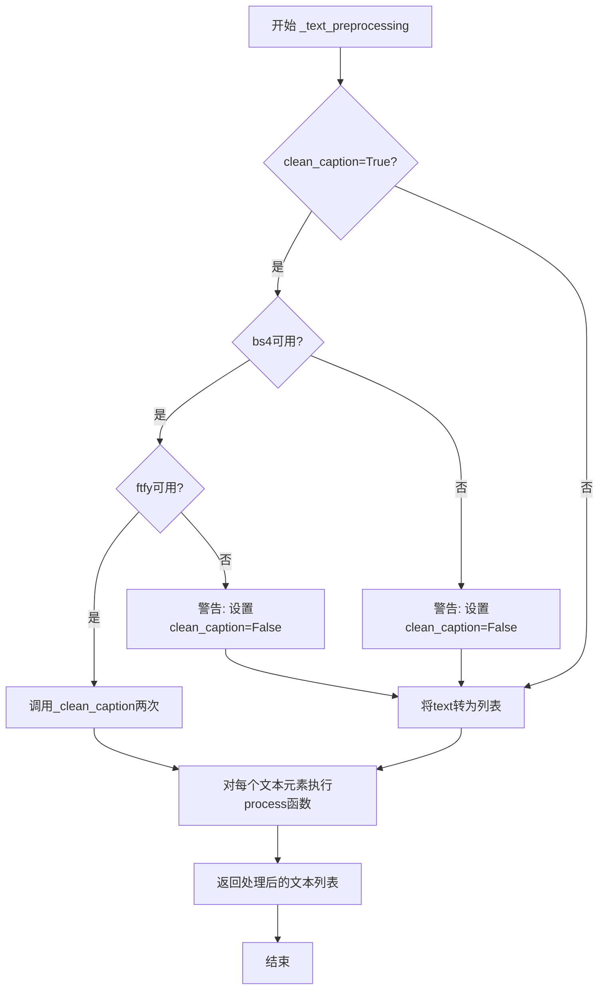

#### 带注释源码

```python
# Copied from diffusers.pipelines.deepfloyd_if.pipeline_if.IFPipeline._text_preprocessing
def _text_preprocessing(self, text, clean_caption=False):
    """
    对输入的文本进行预处理，支持简单的 lowercase/strip 或深度清理
    
    Args:
        text: 输入文本，str/list/tuple 类型
        clean_caption: 是否执行深度清理（需要 bs4 和 ftfy）
    
    Returns:
        处理后的文本列表
    """
    
    # 检查 bs4 是否可用，如果不可用则禁用 clean_caption
    if clean_caption and not is_bs4_available():
        logger.warning(BACKENDS_MAPPING["bs4"][-1].format("Setting `clean_caption=True`"))
        logger.warning("Setting `clean_caption` to False...")
        clean_caption = False

    # 检查 ftfy 是否可用，如果不可用则禁用 clean_caption
    if clean_caption and not is_ftfy_available():
        logger.warning(BACKENDS_MAPPING["ftfy"][-1].format("Setting `clean_caption=True`"))
        logger.warning("Setting `clean_caption` to False...")
        clean_caption = False

    # 统一转为列表处理
    if not isinstance(text, (tuple, list)):
        text = [text]

    # 定义内部处理函数
    def process(text: str):
        if clean_caption:
            # 执行两次深度清理（去HTML、去特殊字符等）
            text = self._clean_caption(text)
            text = self._clean_caption(text)
        else:
            # 简单处理：转小写并去除首尾空白
            text = text.lower().strip()
        return text

    # 对每个文本元素应用处理函数
    return [process(t) for t in text]
```


### `AllegroPipeline._clean_caption`

该方法用于清理和预处理视频生成的标题（caption），通过移除 URL、HTML 标签、特殊字符、不必要的标点符号、IP 地址、文件扩展名等噪声内容，并进行文本规范化处理，以提高文本编码的质量。

参数：

- `caption`：`str`，需要清理的输入标题文本

返回值：`str`，清理并规范化后的标题文本

#### 流程图

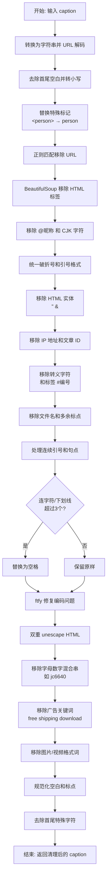

#### 带注释源码

```python
def _clean_caption(self, caption):
    # 将输入转换为字符串并使用 URL plus 解码（处理 %20 等编码）
    caption = str(caption)
    caption = ul.unquote_plus(caption)
    
    # 去除首尾空白并转换为小写
    caption = caption.strip().lower()
    
    # 将 <person> 标签替换为普通单词 person
    caption = re.sub("<person>", "person", caption)
    
    # ====== URL 移除 ======
    # 匹配 http/https 开头的 URL
    caption = re.sub(
        r"\b((?:https?:(?:\/{1,3}|[a-zA-Z0-9%])|[a-zA-Z0-9.\-]+[.](?:com|co|ru|net|org|edu|gov|it)[\w/-]*\b\/?(?!@)))",  # noqa
        "",
        caption,
    )  # regex for urls
    
    # 匹配 www 开头的 URL
    caption = re.sub(
        r"\b((?:www:(?:\/{1,3}|[a-zA-Z0-9%])|[a-zA-Z0-9.\-]+[.](?:com|co|ru|net|org|edu|gov|it)[\w/-]*\b\/?(?!@)))",  # noqa
        "",
        caption,
    )  # regex for urls
    
    # ====== HTML 标签移除 ======
    # 使用 BeautifulSoup 解析并提取纯文本
    caption = BeautifulSoup(caption, features="html.parser").text

    # ====== @ 昵称移除 ======
    # 移除 @username 格式的昵称
    caption = re.sub(r"@[\w\d]+\b", "", caption)

    # ====== CJK Unicode 字符范围移除 ======
    # 31C0—31EF CJK Strokes
    # 31F0—31FF Katakana Phonetic Extensions
    # 3200—32FF Enclosed CJK Letters and Months
    # 3300—33FF CJK Compatibility
    # 3400—4DBF CJK Unified Ideographs Extension A
    # 4DC0—4DFF Yijing Hexagram Symbols
    # 4E00—9FFF CJK Unified Ideographs
    caption = re.sub(r"[\u31c0-\u31ef]+", "", caption)
    caption = re.sub(r"[\u31f0-\u31ff]+", "", caption)
    caption = re.sub(r"[\u3200-\u32ff]+", "", caption)
    caption = re.sub(r"[\u3300-\u33ff]+", "", caption)
    caption = re.sub(r"[\u3400-\u4dbf]+", "", caption)
    caption = re.sub(r"[\u4dc0-\u4dff]+", "", caption)
    caption = re.sub(r"[\u4e00-\u9fff]+", "", caption)
    #######################################################

    # ====== 破折号统一 ======
    # 所有类型的破折号统一替换为 "-"
    caption = re.sub(
        r"[\u002D\u058A\u05BE\u1400\u1806\u2010-\u2015\u2E17\u2E1A\u2E3A\u2E3B\u2E40\u301C\u3030\u30A0\uFE31\uFE32\uFE58\uFE63\uFF0D]+",  # noqa
        "-",
        caption,
    )

    # ====== 引号统一 ======
    # 各种语言的引号统一为双引号或单引号
    caption = re.sub(r"[`´«»""]¨]", '"', caption)
    caption = re.sub(r"['']", "'", caption)

    # ====== HTML 实体移除 ======
    caption = re.sub(r"&quot;?", "", caption)  # &quot;
    caption = re.sub(r"&amp", "", caption)     # &amp

    # ====== IP 地址移除 ======
    caption = re.sub(r"\d{1,3}\.\d{1,3}\.\d{1,3}\.\d{1,3}", " ", caption)

    # ====== 文章 ID 移除 ======
    # 匹配 "数字:数字" 结尾的模式
    caption = re.sub(r"\d:\d\d\s+$", "", caption)

    # ====== 转义字符移除 ======
    caption = re.sub(r"\\n", " ", caption)

    # ====== 标签和编号移除 ======
    caption = re.sub(r"#\d{1,3}\b", "", caption)      # "#123"
    caption = re.sub(r"#\d{5,}\b", "", caption)       # "#12345.."
    caption = re.sub(r"\b\d{6,}\b", "", caption)      # "123456.."
    
    # ====== 文件名移除 ======
    caption = re.sub(r"[\S]+\.(?:png|jpg|jpeg|bmp|webp|eps|pdf|apk|mp4)", "", caption)

    # ====== 多余标点处理 ======
    caption = re.sub(r"[\"']{2,}", r'"', caption)     # 多个引号合并为双引号
    caption = re.sub(r"[\.]{2,}", r" ", caption)      # 多个句点替换为空格

    # ====== 不良标点移除 ======
    caption = re.sub(self.bad_punct_regex, r" ", caption)  # 处理 ***AUSVERKAUFT*** 等
    caption = re.sub(r"\s+\.\s+", r" ", caption)           # " . " 格式清理

    # ====== 连字符/下划线处理 ======
    # 如果超过3个连字符或下划线，替换为空格
    regex2 = re.compile(r"(?:\-|\_)")
    if len(re.findall(regex2, caption)) > 3:
        caption = re.sub(regex2, " ", caption)

    # ====== 文本修复 ======
    # 使用 ftfy 修复编码问题
    caption = ftfy.fix_text(caption)
    # 双重 HTML unescape 处理嵌套实体
    caption = html.unescape(html.unescape(caption))

    # ====== 字母数字混合串移除 ======
    caption = re.sub(r"\b[a-zA-Z]{1,3}\d{3,15}\b", "", caption)    # 如 jc6640
    caption = re.sub(r"\b[a-zA-Z]+\d+[a-zA-Z]+\b", "", caption)    # 如 jc6640vc
    caption = re.sub(r"\b\d+[a-zA-Z]+\d+\b", "", caption)          # 如 6640vc231

    # ====== 广告关键词移除 ======
    caption = re.sub(r"(worldwide\s+)?(free\s+)?shipping", "", caption)
    caption = re.sub(r"(free\s)?download(\sfree)?", "", caption)
    caption = re.sub(r"\bclick\b\s(?:for|on)\s\w+", "", caption)

    # ====== 媒体格式词移除 ======
    caption = re.sub(r"\b(?:png|jpg|jpeg|bmp|webp|eps|pdf|apk|mp4)(\simage[s]?)?", "", caption)
    caption = re.sub(r"\bpage\s+\d+\b", "", caption)

    # ====== 复杂字母数字串移除 ======
    caption = re.sub(r"\b\d*[a-zA-Z]+\d+[a-zA-Z]+\d+[a-zA-Z\d]*\b", r" ", caption)  # 如 j2d1a2a...

    # ====== 尺寸规格移除 ======
    caption = re.sub(r"\b\d+\.?\d*[xх×]\d+\.?\d*\b", "", caption)

    # ====== 空白和标点规范化 ======
    caption = re.sub(r"\b\s+\:\s+", r": ", caption)
    caption = re.sub(r"(\D[,\./])\b", r"\1 ", caption)
    caption = re.sub(r"\s+", " ", caption)

    # ====== 首尾字符清理 ======
    caption.strip()  # 去除首尾空白（结果未使用）

    caption = re.sub(r"^[\"\']([\w\W]+)[\"\']$", r"\1", caption)  # 去除首尾引号
    caption = re.sub(r"^[\'\_,\-\:;]", r"", caption)              # 去除开头特殊字符
    caption = re.sub(r"[\'\_,\-\:\-\+]$", r"", caption)           # 去除结尾特殊字符
    caption = re.sub(r"^\.\S+$", "", caption)                     # 去除以点开头的单词

    return caption.strip()  # 返回最终清理后的文本
```


### `AllegroPipeline.prepare_latents`

该方法用于在视频生成管道中准备初始的噪声潜在张量（latents）。它根据批次大小、帧数、高度和宽度计算潜在张量的形状，如果未提供潜在张量则使用随机噪声生成，否则将提供的潜在张量移动到指定设备，最后根据调度器的初始噪声标准差对潜在张量进行缩放。

参数：

- `batch_size`：`int`，批次大小，指定要生成的视频数量
- `num_channels_latents`：`int`，潜在通道数，对应于变换器模型的输入通道数
- `num_frames`：`int`，视频帧数，要生成的视频的帧数
- `height`：`int`，生成视频的高度（像素）
- `width`：`int`，生成视频的宽度（像素）
- `dtype`：`torch.dtype`，潜在张量的数据类型
- `device`：`torch.device`，潜在张量存放的设备
- `generator`：`torch.Generator | list[torch.Generator] | None`，随机数生成器，用于确保生成的可重复性
- `latents`：`torch.Tensor | None`，可选的预生成噪声潜在张量，如果为 None 则随机生成

返回值：`torch.Tensor`，处理并缩放后的潜在张量，可用于去噪过程

#### 流程图

```mermaid
flowchart TD
    A[开始准备潜在张量] --> B{检查生成器列表长度是否匹配批次大小}
    B -->|不匹配| C[抛出 ValueError 异常]
    B -->|匹配| D{num_frames 是偶数?}
    D -->|是| E[num_frames = ceil(num_frames / vae_scale_factor_temporal)]
    D -->|否| F[num_frames = ceil((num_frames - 1) / vae_scale_factor_temporal) + 1]
    E --> G[计算潜在张量形状]
    F --> G
    G --> H{latents 参数是否为 None?}
    H -->|是| I[使用 randn_tensor 生成随机潜在张量]
    H -->|否| J[将提供的 latents 移动到指定设备]
    I --> K[使用调度器的 init_noise_sigma 缩放潜在张量]
    J --> K
    K --> L[返回处理后的潜在张量]
```

#### 带注释源码

```python
def prepare_latents(
    self, batch_size, num_channels_latents, num_frames, height, width, dtype, device, generator, latents=None
):
    # 检查当传入生成器列表时，其长度是否与批次大小匹配
    if isinstance(generator, list) and len(generator) != batch_size:
        raise ValueError(
            f"You have passed a list of generators of length {len(generator)}, but requested an effective batch"
            f" size of {batch_size}. Make sure the batch size matches the length of the generators."
        )

    # 根据 VAE 的时间压缩比例调整帧数
    # 如果帧数为偶数，直接除以时间压缩比例并向上取整
    if num_frames % 2 == 0:
        num_frames = math.ceil(num_frames / self.vae_scale_factor_temporal)
    else:
        # 如果帧数为奇数，需要特殊处理以确保覆盖所有帧
        num_frames = math.ceil((num_frames - 1) / self.vae_scale_factor_temporal) + 1

    # 计算潜在张量的形状
    # 形状维度: [batch_size, channels, num_frames, height/vae_scale_factor_spatial, width/vae_scale_factor_spatial]
    shape = (
        batch_size,
        num_channels_latents,
        num_frames,
        height // self.vae_scale_factor_spatial,
        width // self.vae_scale_factor_spatial,
    )

    # 如果未提供潜在张量，则随机生成
    if latents is None:
        latents = randn_tensor(shape, generator=generator, device=device, dtype=dtype)
    else:
        # 将提供的潜在张量移动到指定设备
        latents = latents.to(device)

    # 根据调度器要求的初始噪声标准差缩放潜在张量
    # 这是扩散模型去噪过程的重要初始化步骤
    latents = latents * self.scheduler.init_noise_sigma
    return latents
```


### `AllegroPipeline.decode_latents`

该方法负责将扩散模型生成的潜在表示（latents）解码为实际的视频帧数据，是文本到视频生成流程的最后一步inverse操作。通过VAE解码器将缩放后的潜在向量转换为可视化的帧序列，并调整维度顺序以适配后续处理流程。

参数：

- `latents`：`torch.Tensor`，输入的潜在表示张量，通常是扩散模型在去噪过程结束时输出的特征表示，形状为 [batch_size, channels, num_frames, height, width]

返回值：`torch.Tensor`，解码后的视频帧张量，形状为 [batch_size, num_frames, channels, height, width]

#### 流程图

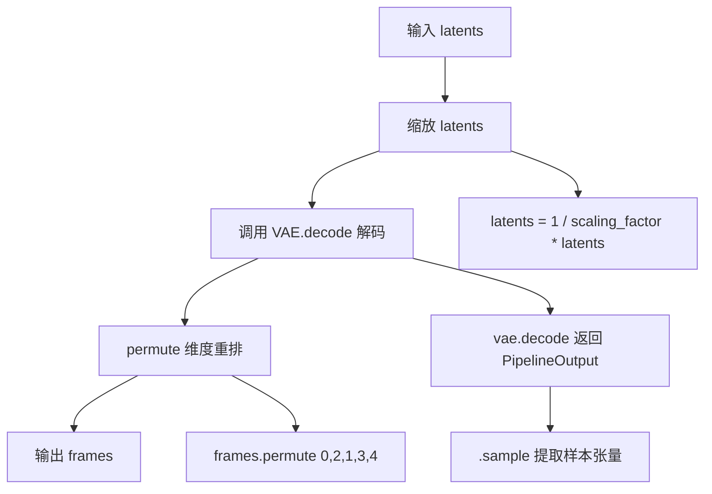

#### 带注释源码

```python
def decode_latents(self, latents: torch.Tensor) -> torch.Tensor:
    """
    将潜在表示解码为视频帧
    
    参数:
        latents: 潜在表示张量，形状 [batch_size, channels, num_frames, height, width]
        
    返回:
        解码后的视频帧，形状 [batch_size, num_frames, channels, height, width]
    """
    # 步骤1: 反缩放潜在表示
    # VAE 在编码时会对 latent 使用 scaling_factor 进行缩放以稳定训练
    # 解码时需要除以该因子恢复到原始scale
    latents = 1 / self.vae.config.scaling_factor * latents
    
    # 步骤2: 使用 VAE 解码器将潜在表示转换为图像/视频特征
    # vae.decode 返回一个包含 sample 属性的 PipelineOutput 对象
    # sample 形状: [batch_size, channels, num_frames, height, width]
    frames = self.vae.decode(latents).sample
    
    # 步骤3: 调整维度顺序
    # 从 [batch_size, channels, num_frames, height, width]
    # 转换为 [batch_size, num_frames, channels, height, width]
    # 这样排列更符合视频数据的标准格式 (时间维在通道维之前)
    frames = frames.permute(0, 2, 1, 3, 4)  # [batch_size, channels, num_frames, height, width]
    
    # 返回解码后的视频帧
    return frames
```


### AllegroPipeline._prepare_rotary_positional_embeddings

该方法用于准备3D旋转位置嵌入（Rotary Positional Embeddings），通过计算视频帧、宽度和高度维度的频率和网格坐标，为AllegroTransformer3DModel的3D注意力机制提供位置信息。

参数：

- `self`：`AllegroPipeline` 实例，Pipeline对象本身
- `batch_size`：`int`，批次大小，用于确定生成嵌入的数量
- `height`：`int`，生成视频的高度（像素）
- `width`：`int`，生成视频的宽度（像素）
- `num_frames`：`int`，生成视频的帧数
- `device`：`torch.device`，计算设备

返回值：`tuple`，包含两个元组：
- 第一个元组 `(freqs_t, freqs_h, freqs_w)`：时间、高度、宽度维度的旋转频率
- 第二个元组 `(grid_t, grid_h, grid_w)`：时间、高度、宽度维度的网格坐标

#### 流程图

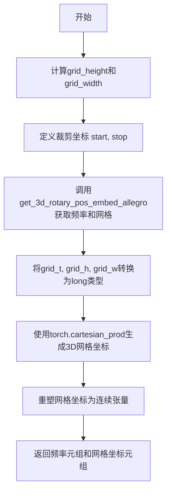

#### 带注释源码

```python
def _prepare_rotary_positional_embeddings(
    self,
    batch_size: int,
    height: int,
    width: int,
    num_frames: int,
    device: torch.device,
):
    """
    准备3D旋转位置嵌入，用于视频生成的Transformer模型
    
    参数:
        batch_size: 批次大小
        height: 视频高度
        width: 视频宽度  
        num_frames: 视频帧数
        device: 计算设备
    """
    # 计算网格的高度和宽度（按VAE缩放因子和patch大小划分）
    grid_height = height // (self.vae_scale_factor_spatial * self.transformer.config.patch_size)
    grid_width = width // (self.vae_scale_factor_spatial * self.transformer.config.patch_size)

    # 定义裁剪坐标（从(0,0)开始到(grid_height, grid_width)）
    start, stop = (0, 0), (grid_height, grid_width)
    
    # 调用外部函数获取3D旋转位置嵌入
    # 返回频率向量(freqs_t, freqs_h, freqs_w)和网格坐标(grid_t, grid_h, grid_w)
    freqs_t, freqs_h, freqs_w, grid_t, grid_h, grid_w = get_3d_rotary_pos_embed_allegro(
        embed_dim=self.transformer.config.attention_head_dim,  # 注意力头维度
        crops_coords=(start, stop),  # 裁剪坐标
        grid_size=(grid_height, grid_width),  # 空间网格大小
        temporal_size=num_frames,  # 时间维度大小
        interpolation_scale=(  # 插值缩放因子
            self.transformer.config.interpolation_scale_t,
            self.transformer.config.interpolation_scale_h,
            self.transformer.config.interpolation_scale_w,
        ),
        device=device,
    )

    # 将网格坐标转换为long类型（整数索引）
    grid_t = grid_t.to(dtype=torch.long)
    grid_h = grid_h.to(dtype=torch.long)
    grid_w = grid_w.to(dtype=torch.long)

    # 使用笛卡尔积生成完整的3D网格坐标组合
    pos = torch.cartesian_prod(grid_t, grid_h, grid_w)
    
    # 重塑坐标张量形状：
    # 从 (grid_t * grid_h * grid_w, 3) 转置为 (3, 1, -1)
    # 然后使用contiguous()确保内存连续
    pos = pos.reshape(-1, 3).transpose(0, 1).reshape(3, 1, -1).contiguous()
    grid_t, grid_h, grid_w = pos

    # 返回两个元组：
    # 1. 旋转频率 (freqs_t, freqs_h, freqs_w) - 用于计算旋转位置嵌入
    # 2. 网格坐标 (grid_t, grid_h, grid_w) - 用于索引和定位
    return (freqs_t, freqs_h, freqs_w), (grid_t, grid_h, grid_w)
```


### AllegroPipeline.enable_vae_slicing

该方法用于启用VAE（变分自编码器）的切片解码功能。当启用此选项时，VAE会将输入张量分割成多个切片，分多步计算解码。这有助于节省内存并允许更大的批处理大小。需要注意的是，该方法已在0.40.0版本中被弃用，建议直接使用`pipe.vae.enable_slicing()`。

参数：
- 无

返回值：`None`，无返回值

#### 流程图

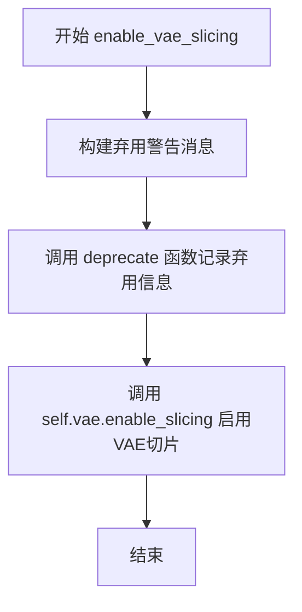

#### 带注释源码

```
def enable_vae_slicing(self):
    r"""
    Enable sliced VAE decoding. When this option is enabled, the VAE will split the input tensor in slices to
    compute decoding in several steps. This is useful to save some memory and allow larger batch sizes.
    """
    # 构建弃用警告消息，提示用户该方法已弃用，应使用 pipe.vae.enable_slicing() 替代
    depr_message = f"Calling `enable_vae_slicing()` on a `{self.__class__.__name__}` is deprecated and this method will be removed in a future version. Please use `pipe.vae.enable_slicing()`."
    
    # 调用 deprecate 函数记录弃用信息，参数包括：方法名、弃用版本号、警告消息
    deprecate(
        "enable_vae_slicing",
        "0.40.0",
        depr_message,
    )
    
    # 实际执行操作：调用 VAE 模型的 enable_slicing 方法启用切片解码功能
    self.vae.enable_slicing()
```


### `AllegroPipeline.disable_vae_slicing`

该方法用于禁用 VAE（变分自编码器）的分片解码功能。如果之前启用了 `enable_vae_slicing`，调用此方法后将恢复为单步解码。此方法已被弃用，推荐直接使用 `pipe.vae.disable_slicing()`。

参数：此方法无参数。

返回值：`None`，该方法不返回任何值。

#### 流程图

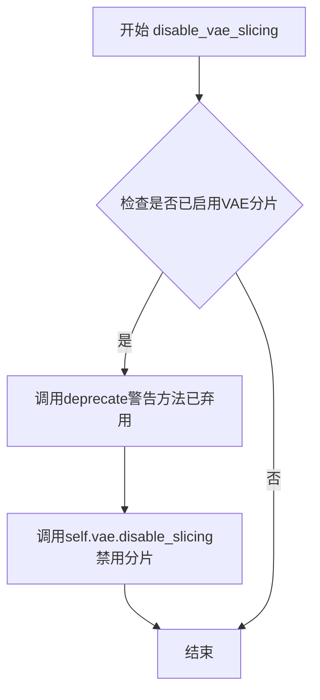

#### 带注释源码

```python
def disable_vae_slicing(self):
    r"""
    Disable sliced VAE decoding. If `enable_vae_slicing` was previously enabled, this method will go back to
    computing decoding in one step.
    """
    # 构建弃用警告消息，包含当前类名并提示用户使用新方法
    depr_message = f"Calling `disable_vae_slicing()` on a `{self.__class__.__name__}` is deprecated and this method will be removed in a future version. Please use `pipe.vae.disable_slicing()`."
    
    # 调用deprecate函数记录弃用警告，指定在0.40.0版本移除
    deprecate(
        "disable_vae_slicing",      # 被弃用的功能名称
        "0.40.0",                   # 计划移除的版本
        depr_message,               # 弃用说明消息
    )
    
    # 调用VAE模型的disable_slicing方法，禁用分片解码功能
    # 这将使VAE恢复为一次性解码整个输入
    self.vae.disable_slicing()
```


### `AllegroPipeline.enable_vae_tiling`

启用瓦片式 VAE 解码。当启用此选项时，VAE 会将输入张量分割成瓦片，以多个步骤计算解码和编码。这对于节省大量内存并允许处理更大的图像非常有用。

参数：
- 该方法没有显式参数（除 `self` 外）

返回值：`None`，无返回值

#### 流程图

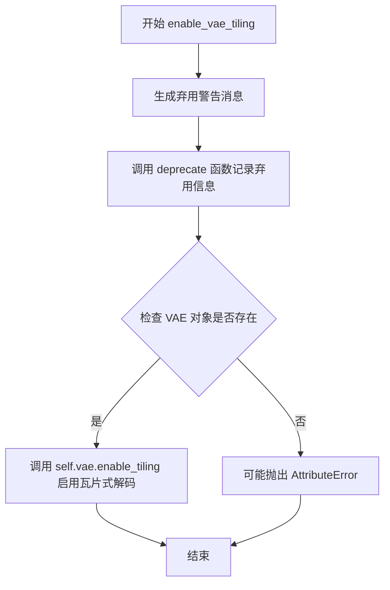

#### 带注释源码

```python
def enable_vae_tiling(self):
    r"""
    Enable tiled VAE decoding. When this option is enabled, the VAE will split the input tensor into tiles to
    compute decoding and encoding in several steps. This is useful for saving a large amount of memory and to allow
    processing larger images.
    """
    # 构建弃用警告消息，提示用户该方法已被弃用，应使用 pipe.vae.enable_tiling() 替代
    depr_message = f"Calling `enable_vae_tiling()` on a `{self.__class__.__name__}` is deprecated and this method will be removed in a future version. Please use `pipe.vae.enable_tiling()`."
    
    # 调用 deprecate 函数记录弃用信息，用于在将来版本中移除此方法
    deprecate(
        "enable_vae_tiling",      # 被弃用的功能名称
        "0.40.0",                 # 计划移除的版本号
        depr_message,             # 弃用原因说明
    )
    
    # 实际启用 VAE 瓦片式解码功能，委托给 VAE 模型本身的方法
    self.vae.enable_tiling()
```


### `AllegroPipeline.disable_vae_tiling`

禁用VAE平铺解码。如果之前启用了`enable_vae_tiling`，此方法将返回到单步计算解码。

参数：
- 无

返回值：`None`，无返回值（方法默认返回None）

#### 流程图

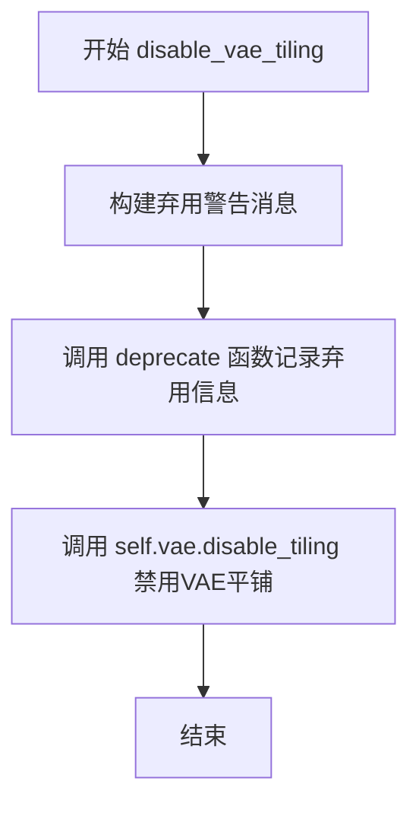

#### 带注释源码

```python
def disable_vae_tiling(self):
    r"""
    Disable tiled VAE decoding. If `enable_vae_tiling` was previously enabled, this method will go back to
    computing decoding in one step.
    """
    # 构建弃用警告消息，提示用户该方法将在未来版本中移除
    # 建议使用 pipe.vae.disable_tiling() 代替
    depr_message = f"Calling `disable_vae_tiling()` on a `{self.__class__.__name__}` is deprecated and this method will be removed in a future version. Please use `pipe.vae.disable_tiling()`."
    
    # 调用 deprecate 函数记录弃用信息
    # 参数: 方法名, 弃用版本号, 警告消息
    deprecate(
        "disable_vae_tiling",
        "0.40.0",
        depr_message,
    )
    
    # 调用底层 VAE 模型的 disable_tiling 方法
    # 实际执行禁用平铺解码的操作
    self.vae.disable_tiling()
```


### `AllegroPipeline.__call__`

该方法是 AllegroPipeline 的核心调用方法，用于根据文本提示（prompt）生成视频。通过编码提示、准备噪声潜向量、执行去噪循环并解码潜向量，最终输出生成的视频帧序列。

参数：

- `prompt`：`str | list[str]`，要指导视频生成的提示词，如果未定义则必须传递 prompt_embeds
- `negative_prompt`：`str`，不参与视频生成的提示词，仅在 guidance_scale >= 1 时生效
- `num_inference_steps`：`int`，去噪步数，默认为 100，步数越多视频质量越高但推理越慢
- `timesteps`：`list[int]`，自定义去噪时间步，如果未定义则使用等间距的 num_inference_steps 个时间步
- `guidance_scale`：`float`，分类器自由扩散引导（CFG）比例，默认为 7.5，值越大与文本提示关联越紧密
- `num_frames`：`int`，生成视频的帧数，默认为 None（由配置决定）
- `height`：`int`，生成视频的高度（像素），默认为 None（由配置决定）
- `width`：`int`，生成视频的宽度（像素），默认为 None（由配置决定）
- `num_videos_per_prompt`：`int`，每个提示词生成的视频数量，默认为 1
- `eta`：`float`，DDIM 论文中的 eta 参数，仅对 DDIMScheduler 有效，默认为 0.0
- `generator`：`torch.Generator | list[torch.Generator]`，随机数生成器，用于确保生成可复现
- `latents`：`torch.Tensor`，预生成的噪声潜向量，如果未提供则使用随机生成
- `prompt_embeds`：`torch.Tensor`，预生成的文本嵌入，可用于调整提示词权重
- `prompt_attention_mask`：`torch.Tensor`，文本嵌入的注意力掩码
- `negative_prompt_embeds`：`torch.Tensor`，预生成的负面文本嵌入
- `negative_prompt_attention_mask`：`torch.Tensor`，负面文本嵌入的注意力掩码
- `output_type`：`str`，输出格式，默认为 "pil"，可选 "latent"
- `return_dict`：`bool`，是否返回 AllegroPipelineOutput，默认为 True
- `callback_on_step_end`：`Callable | PipelineCallback | MultiPipelineCallbacks`，每步结束后调用的回调函数
- `callback_on_step_end_tensor_inputs`：`list[str]`，回调函数可访问的张量输入列表
- `clean_caption`：`bool`，是否在创建嵌入前清理提示词，默认为 True
- `max_sequence_length`：`int`，提示词最大序列长度，默认为 512

返回值：`AllegroPipelineOutput | tuple`，如果 return_dict 为 True 返回 AllegroPipelineOutput 对象，否则返回元组（第一个元素为生成的视频列表）

#### 流程图

```mermaid
flowchart TD
    A[开始 __call__] --> B[检查并设置默认参数: num_frames, height, width]
    B --> C[调用 check_inputs 验证输入参数]
    C --> D[设置 guidance_scale, _current_timestep, _interrupt]
    E[根据 prompt 类型确定 batch_size] --> D
    D --> F[判断是否使用分类器自由引导 do_classifier_free_guidance]
    F --> G[调用 encode_prompt 编码提示词]
    G --> H[如果使用 CFG, 拼接 negative_prompt_embeds 和 prompt_embeds]
    H --> I[调用 retrieve_timesteps 获取时间步]
    I --> J[调用 prepare_latents 准备潜向量]
    J --> K[调用 prepare_extra_step_kwargs 准备额外参数]
    K --> L[调用 _prepare_rotary_positional_embeddings 准备旋转位置嵌入]
    L --> M[进入去噪循环 for i, t in enumerate(timesteps)]
    M --> N{检查 interrupt 标志}
    N -->|True| O[continue 跳过本次循环]
    N -->|False| P[设置当前时间步 _current_timestep]
    P --> Q[根据是否使用 CFG 复制 latent_model_input]
    Q --> R[调用 scheduler.scale_model_input 缩放输入]
    R --> S[扩展 timestep 到 batch 维度]
    S --> T[调用 transformer 预测噪声 noise_pred]
    T --> U{do_classifier_free_guidance?}
    U -->|True| V[分离并计算引导后的噪声预测]
    U -->|False| W[直接使用 noise_pred]
    V --> X[计算上一步: latents = scheduler.step]
    W --> X
    X --> Y{callback_on_step_end?}
    Y -->|True| Z[调用回调函数处理 latents 和 prompt_embeds]
    Y -->|False| AA[更新进度条]
    Z --> AA
    AA --> BB{是否最后一步或热身完成?}
    BB -->|True| CC[进度条更新]
    BB -->|False| DD{XLA_AVAILABLE?}
    DD -->|True| EE[调用 xm.mark_step]
    DD -->|False| M
    EE --> M
    CC --> M
    FF[去噪循环结束] --> GG{output_type == 'latent'?}
    GG -->|False| HH[解码潜向量: decode_latents]
    HH --> II[裁剪视频到正确帧数和尺寸]
    II --> JJ[调用 video_processor 后处理视频]
    JJ --> KK[设置 video = 处理后的视频]
    GG -->|True| LL[直接使用 latents 作为视频]
    LL --> KK
    KK --> MM[调用 maybe_free_model_hooks 释放模型]
    MM --> NN{return_dict?}
    NN -->|True| OO[返回 AllegroPipelineOutput]
    NN -->|False| PP[返回元组 (video,)]
    OO --> QQ[结束]
    PP --> QQ
```

#### 带注释源码

```python
@torch.no_grad()
@replace_example_docstring(EXAMPLE_DOC_STRING)
def __call__(
    self,
    prompt: str | list[str] = None,
    negative_prompt: str = "",
    num_inference_steps: int = 100,
    timesteps: list[int] = None,
    guidance_scale: float = 7.5,
    num_frames: int | None = None,
    height: int | None = None,
    width: int | None = None,
    num_videos_per_prompt: int = 1,
    eta: float = 0.0,
    generator: torch.Generator | list[torch.Generator] | None = None,
    latents: torch.Tensor | None = None,
    prompt_embeds: torch.Tensor | None = None,
    prompt_attention_mask: torch.Tensor | None = None,
    negative_prompt_embeds: torch.Tensor | None = None,
    negative_prompt_attention_mask: torch.Tensor | None = None,
    output_type: str | None = "pil",
    return_dict: bool = True,
    callback_on_step_end: Callable[[int, int], None] | PipelineCallback | MultiPipelineCallbacks | None = None,
    callback_on_step_end_tensor_inputs: list[str] = ["latents"],
    clean_caption: bool = True,
    max_sequence_length: int = 512,
) -> AllegroPipelineOutput | tuple:
    """
    Function invoked when calling the pipeline for generation.

    Args:
        prompt: The prompt or prompts to guide the video generation.
        negative_prompt: The prompt or prompts not to guide the video generation.
        num_inference_steps: The number of denoising steps.
        timesteps: Custom timesteps to use for the denoising process.
        guidance_scale: Guidance scale as defined in Classifier-Free Diffusion Guidance.
        num_frames: The number controls the generated video frames.
        height: The height in pixels of the generated video.
        width: The width in pixels of the generated video.
        num_videos_per_prompt: The number of videos to generate per prompt.
        eta: Corresponds to parameter eta (η) in the DDIM paper.
        generator: One or a list of torch generator(s) to make generation deterministic.
        latents: Pre-generated noisy latents, sampled from a Gaussian distribution.
        prompt_embeds: Pre-generated text embeddings.
        prompt_attention_mask: Pre-generated attention mask for text embeddings.
        negative_prompt_embeds: Pre-generated negative text embeddings.
        negative_prompt_attention_mask: Pre-generated attention mask for negative text embeddings.
        output_type: The output format of the generate video.
        return_dict: Whether or not to return a AllegroPipelineOutput instead of a plain tuple.
        callback: A function that will be called every callback_steps steps during inference.
        callback_steps: The frequency at which the callback function will be called.
        clean_caption: Whether or not to clean the caption before creating embeddings.
        max_sequence_length: Maximum sequence length to use with the prompt.
    """

    # 如果使用回调类而非函数，则从回调对象获取张量输入列表
    if isinstance(callback_on_step_end, (PipelineCallback, MultiPipelineCallbacks)):
        callback_on_step_end_tensor_inputs = callback_on_step_end.tensor_inputs

    # 强制设置为 1，可能是因为当前版本仅支持每个提示生成一个视频
    num_videos_per_prompt = 1

    # 1. 检查输入参数，如果不正确则抛出错误
    # 如果未提供 num_frames/height/width，则使用模型配置中的默认值
    num_frames = num_frames or self.transformer.config.sample_frames * self.vae_scale_factor_temporal
    height = height or self.transformer.config.sample_height * self.vae_scale_factor_spatial
    width = width or self.transformer.config.sample_width * self.vae_scale_factor_spatial

    # 验证输入参数的有效性
    self.check_inputs(
        prompt,
        num_frames,
        height,
        width,
        callback_on_step_end_tensor_inputs,
        negative_prompt,
        prompt_embeds,
        negative_prompt_embeds,
        prompt_attention_mask,
        negative_prompt_attention_mask,
    )
    
    # 设置引导比例和当前时间步
    self._guidance_scale = guidance_scale
    self._current_timestep = None
    self._interrupt = False

    # 2. 默认高度和宽度来自 transformer 配置
    # 根据 prompt 类型确定 batch_size
    if prompt is not None and isinstance(prompt, str):
        batch_size = 1
    elif prompt is not None and isinstance(prompt, list):
        batch_size = len(prompt)
    else:
        # 如果没有 prompt，则使用预计算嵌入的 batch_size
        batch_size = prompt_embeds.shape[0]

    # 获取执行设备
    device = self._execution_device

    # 3. 确定是否使用分类器自由引导（CFG）
    # guidance_scale > 1.0 时启用 CFG，类似于 Imagen 论文中的权重 w
    do_classifier_free_guidance = guidance_scale > 1.0

    # 4. 编码输入提示词
    (
        prompt_embeds,
        prompt_attention_mask,
        negative_prompt_embeds,
        negative_prompt_attention_mask,
    ) = self.encode_prompt(
        prompt,
        do_classifier_free_guidance,
        negative_prompt=negative_prompt,
        num_videos_per_prompt=num_videos_per_prompt,
        device=device,
        prompt_embeds=prompt_embeds,
        negative_prompt_embeds=negative_prompt_embeds,
        prompt_attention_mask=prompt_attention_mask,
        negative_prompt_attention_mask=negative_prompt_attention_mask,
        clean_caption=clean_caption,
        max_sequence_length=max_sequence_length,
    )
    
    # 如果使用 CFG，将无条件嵌入和条件嵌入拼接在一起
    if do_classifier_free_guidance:
        prompt_embeds = torch.cat([negative_prompt_embeds, prompt_embeds], dim=0)
        prompt_attention_mask = torch.cat([negative_prompt_attention_mask, prompt_attention_mask], dim=0)
    
    # 调整维度以匹配模型期望的形状
    if prompt_embeds.ndim == 3:
        prompt_embeds = prompt_embeds.unsqueeze(1)  # b l d -> b 1 l d

    # 5. 准备时间步
    if XLA_AVAILABLE:
        timestep_device = "cpu"
    else:
        timestep_device = device
    
    # 从调度器获取时间步
    timesteps, num_inference_steps = retrieve_timesteps(
        self.scheduler, num_inference_steps, timestep_device, timesteps
    )
    # 设置调度器的时间步
    self.scheduler.set_timesteps(num_inference_steps, device=device)

    # 6. 准备潜向量
    latent_channels = self.transformer.config.in_channels
    latents = self.prepare_latents(
        batch_size * num_videos_per_prompt,
        latent_channels,
        num_frames,
        height,
        width,
        prompt_embeds.dtype,
        device,
        generator,
        latents,
    )

    # 7. 准备额外的时间步参数
    extra_step_kwargs = self.prepare_extra_step_kwargs(generator, eta)

    # 8. 准备旋转位置嵌入
    image_rotary_emb = self._prepare_rotary_positional_embeddings(
        batch_size, height, width, latents.size(2), device
    )

    # 9. 去噪循环
    num_warmup_steps = max(len(timesteps) - num_inference_steps * self.scheduler.order, 0)
    self._num_timesteps = len(timesteps)

    # 进度条上下文管理器
    with self.progress_bar(total=num_inference_steps) as progress_bar:
        for i, t in enumerate(timesteps):
            # 检查是否中断
            if self._interrupt:
                continue

            # 更新当前时间步
            self._current_timestep = t
            
            # 为 CFG 准备输入（复制潜向量用于无条件和条件预测）
            latent_model_input = torch.cat([latents] * 2) if do_classifier_free_guidance else latents
            latent_model_input = self.scheduler.scale_model_input(latent_model_input, t)

            # 广播到 batch 维度以兼容 ONNX/Core ML
            timestep = t.expand(latent_model_input.shape[0])

            # 预测噪声
            noise_pred = self.transformer(
                hidden_states=latent_model_input,
                encoder_hidden_states=prompt_embeds,
                encoder_attention_mask=prompt_attention_mask,
                timestep=timestep,
                image_rotary_emb=image_rotary_emb,
                return_dict=False,
            )[0]

            # 执行引导
            if do_classifier_free_guidance:
                noise_pred_uncond, noise_pred_text = noise_pred.chunk(2)
                # CFG 公式: noise_pred = noise_pred_uncond + guidance_scale * (noise_pred_text - noise_pred_uncond)
                noise_pred = noise_pred_uncond + guidance_scale * (noise_pred_text - noise_pred_uncond)

            # 计算上一步：x_t -> x_t-1
            latents = self.scheduler.step(noise_pred, t, latents, **extra_step_kwargs, return_dict=False)[0]

            # 调用回调函数（如果提供）
            if callback_on_step_end is not None:
                callback_kwargs = {}
                for k in callback_on_step_end_tensor_inputs:
                    callback_kwargs[k] = locals()[k]
                callback_outputs = callback_on_step_end(self, i, t, callback_kwargs)

                # 更新可能被回调修改的值
                latents = callback_outputs.pop("latents", latents)
                prompt_embeds = callback_outputs.pop("prompt_embeds", prompt_embeds)
                negative_prompt_embeds = callback_outputs.pop("negative_prompt_embeds", negative_prompt_embeds)

            # 更新进度条（最后一步或热身完成后）
            if i == len(timesteps) - 1 or ((i + 1) > num_warmup_steps and (i + 1) % self.scheduler.order == 0):
                progress_bar.update()

            # XLA 特定：标记步骤
            if XLA_AVAILABLE:
                xm.mark_step()

    # 重置当前时间步
    self._current_timestep = None

    # 10. 解码潜向量（如果不是输出 latent）
    if not output_type == "latent":
        # 转换到 VAE 的 dtype
        latents = latents.to(self.vae.dtype)
        # 解码潜向量到视频
        video = self.decode_latents(latents)
        # 裁剪到正确的帧数和尺寸
        video = video[:, :, :num_frames, :height, :width]
        # 后处理视频
        video = self.video_processor.postprocess_video(video=video, output_type=output_type)
    else:
        video = latents

    # 释放所有模型
    self.maybe_free_model_hooks()

    # 11. 返回结果
    if not return_dict:
        return (video,)

    return AllegroPipelineOutput(frames=video)
```

## 关键组件


### 张量索引与惰性加载

Pipeline通过`prepare_latents`方法管理潜在张量的初始化与缩放，采用延迟加载策略优化内存使用。在`decode_latents`中通过`latents = latents.to(self.vae.dtype)`实现张量类型转换，并使用VAE slicing和tiling技术（`enable_vae_slicing`/`enable_vae_tiling`）实现分块解码，避免一次性加载整个视频到内存。

### 反量化支持

`decode_latents`方法实现了从潜在空间到像素空间的反量化过程，通过`latents = 1 / self.vae.config.scaling_factor * latents`进行尺度还原，然后调用`self.vae.decode(latents)`执行实际的解码操作，最后通过`frames.permute`调整输出维度顺序以符合视频格式要求。

### 量化策略

Pipeline支持多种量化策略以适应不同的硬件和精度需求。通过`torch_dtype`参数指定模型精度（`torch.float32`、`torch.bfloat16`等），在`encode_prompt`中使用`prompt_embeds = prompt_embeds.to(dtype=dtype, device=device)`进行张量类型转换，在解码阶段使用`latents = latents.to(self.vae.dtype)`确保VAE在适当的精度下运行。

### 3D旋转位置嵌入

`_prepare_rotary_positional_embeddings`方法为3D视频生成准备旋转位置编码，通过`get_3d_rotary_pos_embed_allegro`函数计算时空频率，并使用`torch.cartesian_prod`生成三维位置网格，支持时间、空间维度的插值缩放。

### 调度器与时间步管理

`retrieve_timesteps`函数封装了调度器的时间步获取逻辑，支持自定义timesteps和sigmas。在主循环中通过`timestep = t.expand(latent_model_input.shape[0])`将单个时间步广播到batch维度，配合`scheduler.scale_model_input`进行噪声调度。


## 问题及建议


### 已知问题

- **硬编码的正则表达式重复**: `_clean_caption`方法中存在大量硬编码的正则表达式（如CJK字符范围、URL匹配等），这些可以提取为类常量或配置文件
- **`num_videos_per_prompt`参数被忽略**: 在`__call__`方法中，接收的`num_videos_per_prompt`参数直接被重置为1，导致传入的值无效
- **`_text_preprocessing`重复调用**: `_text_preprocessing`中对同一文本调用了两次`_clean_caption`（第二次是多余的）
- **VAE切片/平铺方法已废弃但保留**: `enable_vae_slicing`、`disable_vae_slicing`、`enable_vae_tiling`、`disable_vae_tiling`方法已被标记为deprecated但仍然存在，增加了代码冗余
- **`encode_prompt`方法过长**: 该方法承担了过多职责（文本预处理、tokenize、编码、条件/无条件embed处理），导致代码难以维护
- **潜在的类型转换问题**: 在`decode_latents`中使用固定除以`scaling_factor`，但未检查`vae.config.scaling_factor`是否存在
- **`prepare_latents`中奇数帧处理逻辑**: 当`num_frames`为奇数时，增加1帧的处理逻辑可能导致不必要的额外计算
- **缺失的torch.compile优化**: 未使用`torch.compile`对transformer模型进行编译优化
- **`check_inputs`验证不完整**: 未验证`prompt_attention_mask`和`negative_prompt_attention_mask`与`prompt_embeds`/`negative_prompt_embeds`的长度一致性

### 优化建议

- 将正则表达式提取为模块级或类级常量，提高可维护性
- 修复`num_videos_per_prompt`参数，使其正确生效
- 删除`_text_preprocessing`中重复的`_clean_caption`调用
- 移除已废弃的VAE切片/平铺包装方法，直接调用`self.vae`对应方法
- 拆分`encode_prompt`方法为更小的子方法（如`tokenize`、`encode`、`prepare_unconditional`）
- 添加对`vae.config.scaling_factor`存在性的检查
- 考虑添加`torch.compile`支持以提升推理性能
- 完善`check_inputs`中的参数验证逻辑
- 将`XLA_AVAILABLE`的检查移到更优的位置，避免在循环中重复检查

## 其它


### 设计目标与约束

本Pipeline的核心设计目标是实现高质量的文本到视频（Text-to-Video）生成功能。主要约束包括：1）支持最长512个token的文本输入；2）视频帧数必须为正数且高宽必须能被8整除；3）仅支持PyTorch作为计算后端；4）推荐使用CUDA设备以获得最佳性能；5）依赖T5文本编码器进行文本特征提取；6）仅支持KarrasDiffusionSchedulers调度器。

### 错误处理与异常设计

Pipeline实现了多层次的错误检查机制。在`check_inputs`方法中进行了完整的输入验证：检查num_frames必须为正数、height和width必须能被8整除、prompt和prompt_embeds不能同时提供、negative_prompt和negative_prompt_embeds不能同时提供、prompt_embeds和negative_prompt_embeds形状必须匹配、prompt_attention_mask和negative_prompt_attention_mask形状必须匹配。在`retrieve_timesteps`函数中检查timesteps和sigmas不能同时使用，以及调度器是否支持自定义timesteps或sigmas。生成器列表长度必须与batch_size匹配。

### 数据流与状态机

Pipeline的数据流向如下：1）输入文本prompt经过encode_prompt处理，通过T5Tokenizer分词和T5EncoderModel编码生成prompt_embeds和attention_mask；2）根据num_frames、height、width初始化噪声latents；3）通过retrieve_timesteps获取扩散时间步；4）在去噪循环中，latents经过transformer预测噪声，使用scheduler.step更新latents；5）最后通过decode_latents将latents解码为实际视频帧。状态机包含：初始化状态→编码提示→准备潜空间→去噪循环→解码输出。

### 外部依赖与接口契约

核心依赖包括：transformers库的T5EncoderModel和T5Tokenizer；diffusers内部的AllegroTransformer3DModel、AutoencoderKLAllegro、KarrasDiffusionSchedulers；视频处理相关的VideoProcessor；可选依赖bs4（beautifulsoup4）和ftfy用于文本清洗。模型组件通过register_modules注册，支持模型卸载（model_cpu_offload_seq）和VAE切片/平铺优化。

### 性能优化建议

代码已实现多种性能优化：1）模型CPU卸载机制（model_cpu_offload_seq）；2）VAE切片解码（enable_vae_slicing）节省内存；3）VAE平铺解码（enable_vae_tiling）支持更大分辨率；4）XLA设备支持（当torch_xla可用时）；5）潜在的空间/时间压缩因子计算优化。潜在优化方向包括：1）使用FP16/BF16混合精度；2）启用梯度检查点；3）支持分布式推理；4）批处理多个prompts。

### 安全性考虑

代码未包含显式的NSFW内容过滤机制。negative_prompt参数可用于引导生成方向。文本预处理（_clean_caption）会清理URL、HTML标签、特殊字符等潜在风险内容。建议在生产环境中集成额外的内容安全过滤器。用户需注意生成的视频可能受版权法约束。

### 配置与参数说明

关键配置参数包括：guidance_scale（默认7.5）控制分类器自由引导强度；num_inference_steps（默认100）控制去噪步数；max_sequence_length（默认512）限制文本编码长度；num_videos_per_prompt（默认1）控制每个prompt生成的视频数量；eta（默认0.0）仅对DDIM调度器有效；output_type支持"pil"、"latent"或"np"格式。vae_scale_factor_spatial和vae_scale_factor_temporal分别控制空间和时间维度的压缩比。

### 使用示例与注意事项

基础用法需要先加载VAE和Pipeline模型，启用VAE平铺以支持高分辨率生成，调用时指定prompt、guidance_scale和max_sequence_length。注意事项：1）推荐使用bfloat16精度；2）生成视频帧数由transformer配置和vae_scale_factor_temporal共同决定；3）当output_type为"latents"时返回未经解码的潜在向量；4）callback_on_step_end可用于自定义后处理；5）clean_caption=True需要安装bs4和ftfy库。

    