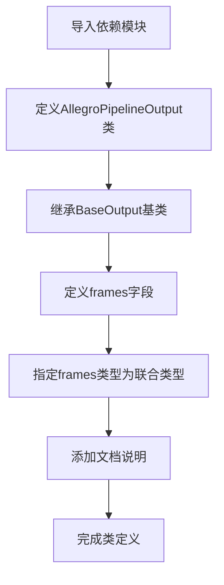

# `diffusers\src\diffusers\pipelines\allegro\pipeline_output.py` 详细设计文档

这是一个用于Allegro视频生成管道的输出类，通过dataclass装饰器定义了一个标准化的数据结构，用于封装模型生成的视频帧输出，支持torch.Tensor、np.ndarray和list[list[PIL.Image.Image]]三种格式。

## 整体流程



## 类结构

```
BaseOutput (抽象基类，由diffusers提供)
└── AllegroPipelineOutput (数据类，继承自BaseOutput)
```

## 全局变量及字段


### `AllegroPipelineOutput.frames`
    
视频输出帧，可以是Torch张量、NumPy数组或PIL图像列表，形状为(batch_size, num_frames, channels, height, width)

类型：`torch.Tensor | np.ndarray | list[list[PIL.Image.Image]]`
    
    

## 全局函数及方法


## 关键组件


### AllegroPipelineOutput

 AllegroPipelineOutput是一个数据类，继承自diffusers库的BaseOutput，用于封装Allegro视频生成管道的输出结果。

### frames字段

 frames字段是AllegroPipelineOutput的核心成员，支持三种数据类型：torch.Tensor（PyTorch张量）、np.ndarray（NumPy数组）或list[list[PIL.Image.Image]]（嵌套PIL图像列表），用于存储批量视频帧数据，形状为(batch_size, num_frames, channels, height, width)。


## 问题及建议


### 已知问题

- **类型提示兼容性问题**：使用 `torch.Tensor | np.ndarray | list[list[PIL.Image.Image]]` 联合类型语法，该语法在 Python 3.10+ 才被正式支持，在 Python 3.9 及以下版本中可能需要回退为 `Union` 写法以确保兼容性。
- **运行时类型验证缺失**：`frames` 字段接受三种完全不同的数据类型（Torch tensor、NumPy array、PIL Image 列表），但没有任何运行时验证逻辑，可能导致后续处理逻辑需要大量类型检查代码。
- **文档字符串不完整**：类级别缺少描述性文档字符串，仅有内部 `Output class for Allegro pipelines` 的注释，不足以帮助使用者快速理解该类的设计意图和使用场景。
- **API 扩展性不足**：作为输出类，仅提供数据存储功能，缺少常用的辅助方法（如 `to_numpy()`、`to_torch()`、`to_pil()` 等格式转换方法），增加使用者的心智负担和重复代码。
- **类型注解反射支持**：在某些场景下使用 `dataclasses.fields()` 或 `typing.get_type_hints()` 时，Python 3.9 及以下版本可能无法正确解析 `|` 语法的类型注解。

### 优化建议

- **统一类型定义**：考虑使用 `typing.Union` 替代 `|` 运算符以兼容更低版本的 Python，或者明确标注项目支持的 Python 版本要求。
- **添加数据验证**：在 `__post_init__` 方法中添加对 `frames` 类型的运行时验证，确保数据符合预期格式，并提供清晰的错误信息。
- **完善文档**：为类添加文档字符串，说明其用途、支持的帧格式以及常见使用模式。
- **扩展辅助方法**：根据实际使用场景，添加格式转换和处理的便捷方法，提升 API 的易用性。
- **考虑类型安全**：评估是否可引入 Pydantic 等库提供更强的类型安全和数据验证能力。


## 其它


### 设计目标与约束

设计目标是为Allegro视频生成管道提供标准化的输出结构，支持多种帧数据格式（PyTorch张量、NumPy数组或PIL图像列表），确保管道输出的一致性和类型安全。约束方面，该类仅支持3D及以上张量（batch_size, num_frames, channels）或多层嵌套列表结构，不支持音频或其他媒体类型，且frames字段为只读属性。

### 错误处理与异常设计

类型验证在初始化时进行，若frames类型不属于torch.Tensor、np.ndarray或list[list[PIL.Image.Image]]，将抛出TypeError。维度验证方面，若为张量或数组，其维度应至少为5D（batch_size, num_frames, channels, height, width），若为列表，需验证内层列表元素为PIL.Image.Image类型，否则抛出ValueError。空值检查需确保frames不为None且非空，否则抛出ValueError("frames cannot be None or empty")。

### 数据流与状态机

该类作为管道输出端点，数据流为：扩散模型推理 → 后处理 → AllegroPipelineOutput封装 → 返回给调用者。无状态机设计，仅作为数据容器。调用方可通过output.frames直接访问原始帧数据，无需状态转换。

### 外部依赖与接口契约

依赖包括torch（PyTorch张量）、numpy（NumPy数组）、PIL（PIL.Image图像）、diffusers.utils.BaseOutput（基础输出类）。接口契约要求frames字段必须提供，类型为三种之一；继承自BaseOutput以保持与diffusers管道输出的一致性；支持dataclass的标准特性（__post_init__可扩展、frozen=False可实例化修改）。

### 使用示例与API调用约定

实例化方式为output = AllegroPipelineOutput(frames=frames_tensor)，其中frames为任一支持类型。访问方式为frames = output.frames。批量处理时，batch_size维度由调用方管理，该类不做额外处理。建议使用from diffusers import AllegroPipeline配合使用。

### 版本兼容性要求

Python版本需≥3.8（支持dataclass和类型联合语法）。PyTorch版本需≥1.9.0。NumPy版本需≥1.20.0。Pillow版本需≥8.0.0。diffusers版本需≥0.14.0（确保BaseOutput存在）。

### 序列化与反序列化

支持dataclass的标准pickle序列化。可通过output.__dict__手动转为字典。在分布式训练场景下，需确保frames张量设备一致性（.tosame_device()）。

### 线程安全性

该类为不可变数据容器（dataclass未设置frozen=True，默认可变），在多线程场景下建议深拷贝后使用：import copy; output_copy = copy.deepcopy(output)。

### 性能注意事项

frames为引用传递，非深拷贝。大批量视频生成时注意内存占用，frames张量/数组会保留在显存/内存中。建议在不需要时及时释放：del output。

### 测试策略建议

单元测试应覆盖：三种类型的正常初始化、类型错误抛出、维度错误抛出、None/空值抛出、属性访问、pickle序列化/反序列化、与其他BaseOutput子类的兼容性。

### 扩展性设计

可继承该类添加元数据字段（如pipeline_version、seed、prompt）。可重写__post_init__添加自定义验证逻辑。若需支持更多格式，可在BaseOutput基础上扩展或在pipeline内部进行格式转换。


    