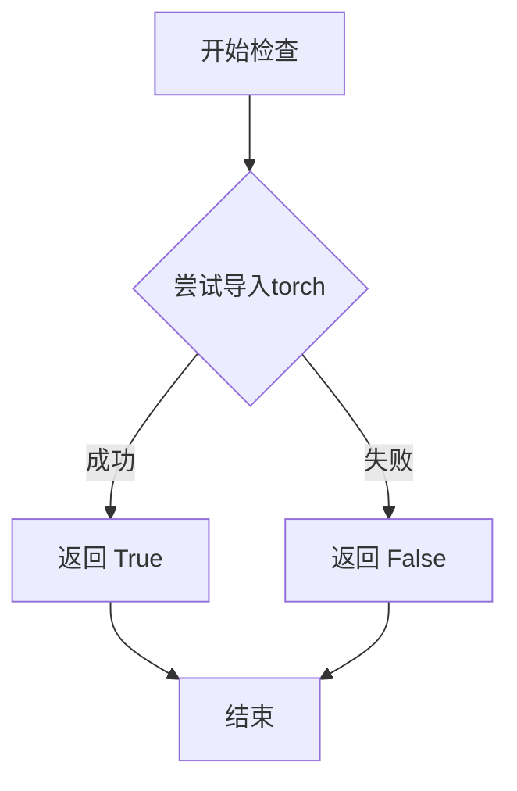
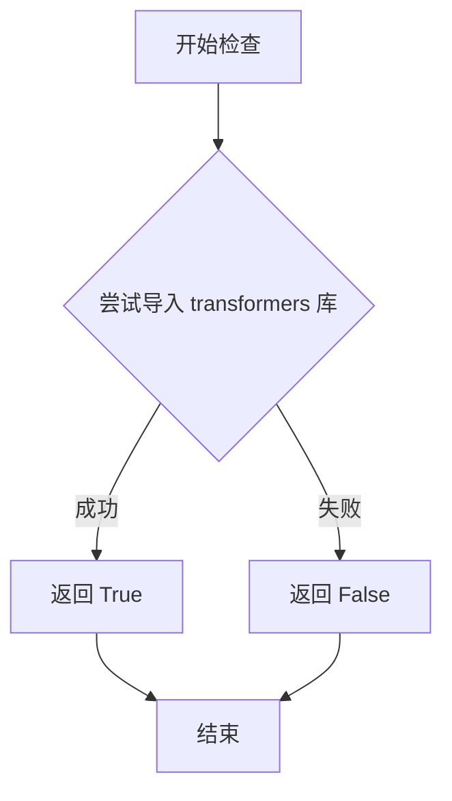
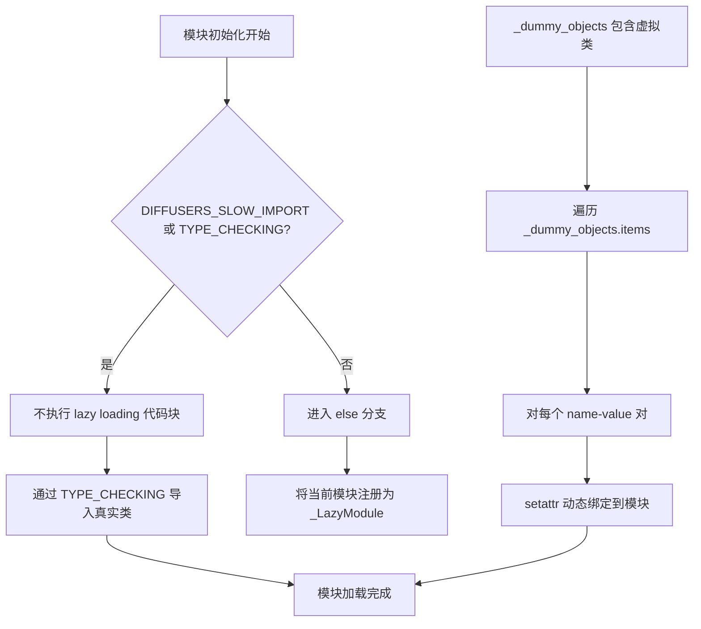
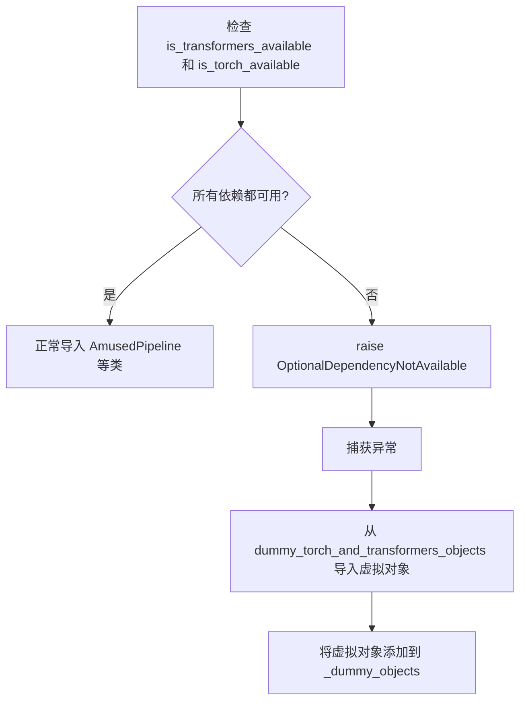
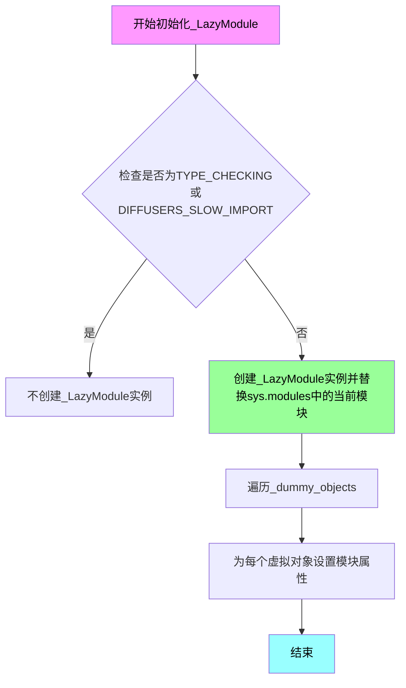

# `diffusers\src\diffusers\pipelines\amused\__init__.py` 详细设计文档

这是一个Diffusers库的子模块初始化文件，采用了延迟导入（Lazy Import）模式，用于动态加载可选依赖（PyTorch和Transformers），并在依赖不可用时提供虚拟对象（Dummy Objects）以保持API兼容性。

## 整体流程

```mermaid
graph TD
    A[开始] --> B[定义空字典 _dummy_objects 和 _import_structure]
    B --> C{is_transformers_available() && is_torch_available()?}
C -- 否 --> D[抛出 OptionalDependencyNotAvailable]
D --> E[从 dummy_torch_and_transformers_objects 导入虚拟Pipeline类]
E --> F[将虚拟类添加到 _dummy_objects]
C -- 是 --> G[配置真实导入结构到 _import_structure]
G --> H{TYPE_CHECKING or DIFFUSERS_SLOW_IMPORT?}
H -- 是 --> I{依赖可用?}
I -- 否 --> J[从 dummy 模块导入类型提示]
I -- 是 --> K[从实际模块导入 Pipeline 类]
H -- 否 --> L[用 _LazyModule 替换当前模块]
L --> M[将 _dummy_objects 中的对象设置到 sys.modules]
```

## 类结构

```
Diffusers Package
└── pipelines (包)
    └── amused (子包)
        └── __init__.py (延迟加载模块)
```

## 全局变量及字段


### `_dummy_objects`
    
存储虚拟对象的字典，当 torch 和 transformers 可选依赖不可用时，使用该字典中的类作为替代，以避免导入错误

类型：`dict`
    


### `_import_structure`
    
定义模块导入结构的字典，键为模块路径（如 'pipeline_amused'），值为导出的类名列表（如 ['AmusedPipeline']），用于延迟导入

类型：`dict`
    


### `TYPE_CHECKING`
    
来自 typing 模块的标志，当为 True 时，表示当前处于类型检查模式，此时会导入类型提示中的类而非虚拟对象

类型：`bool`
    


### `DIFFUSERS_SLOW_IMPORT`
    
Diffusers 库的配置标志，控制是否启用慢速导入模式，当为 True 时，即使在非类型检查模式下也使用延迟导入

类型：`bool`
    


### `_LazyModule`
    
来自 utils 模块的延迟加载模块类，用于在运行时动态导入模块和属性，以优化导入速度

类型：`class`
    


    

## 全局函数及方法


### `is_torch_available`

检查当前环境中 PyTorch 库是否可用，返回布尔值以指示 PyTorch 依赖是否可以安全导入。

参数：

- 无参数

返回值：`bool`，如果 PyTorch 可用则返回 `True`，否则返回 `False`

#### 流程图



#### 带注释源码

```
def is_torch_available() -> bool:
    """
    检查 PyTorch 是否可用于导入。
    
    此函数尝试导入 torch 模块，如果成功则返回 True，
    如果发生 ImportError 或 ModuleNotFoundError 则返回 False。
    
    Returns:
        bool: 如果 torch 可用返回 True，否则返回 False
    """
    try:
        # 尝试导入 torch 模块
        import torch
        # 如果导入成功，清理导入以避免副作用
        del torch
        return True
    except ImportError:
        # 如果导入失败，返回 False
        return False
    except ModuleNotFoundError:
        # 处理模块未找到的情况
        return False
```

> **注**：上述源码是基于该函数的标准实现推断的。该函数在 `diffusers` 库的 `diffusers.utils` 模块中定义，用于在可选依赖不可用时提供优雅的降级处理。


### `is_transformers_available`

检查当前环境是否安装了 transformers 库。

参数： 无

返回值：`bool`，如果 transformers 库可用则返回 `True`，否则返回 `False`

#### 流程图



#### 带注释源码

```
# 注意：此函数的实际实现在 ...utils 模块中定义
# 当前文件中通过 from ...utils 导入使用
# 以下为函数签名的推断说明：

def is_transformers_available() -> bool:
    """
    检查 transformers 库是否可用
    
    返回值:
        bool: 如果 transformers 库已安装且可导入则返回 True，否则返回 False
    """
    # 实际实现通常会尝试 import transformers 
    # 并在成功时返回 True，失败时返回 False
    pass
```

#### 说明

该函数在当前代码中的使用方式：

```python
from ...utils import (
    DIFFUSERS_SLOW_IMPORT,
    OptionalDependencyNotAvailable,
    _LazyModule,
    is_torch_available,
    is_transformers_available,  # 从 utils 模块导入
)

# 在代码中使用
if not (is_transformers_available() and is_torch_available()):
    raise OptionalDependencyNotAvailable()
```

`is_transformers_available()` 函数是在 `...utils` 包中定义的一个工具函数，用于检测 transformers 库是否可用。在当前文件中，它与 `is_torch_available()` 一起用于条件导入，决定是否加载完整的 Pipeline 类或是使用 dummy 对象。


### `setattr (模块初始化上下文)`

将虚拟对象（dummy objects）设置到当前模块的 `sys.modules` 中，实现延迟导入（lazy import）机制，当某些依赖不可用时提供替代的虚拟对象。

参数：

- `obj`：`sys.modules[__name__]`（模块对象），需要设置属性的目标模块
- `name`：`str`（来自 `_dummy_objects.items()` 遍历的键），要设置的属性名称（如 "AmusedPipeline"）
- `value`：`Any`（来自 `_dummy_objects.items()` 遍历的值），要设置的属性值（虚拟对象类）

返回值：`None`，无返回值

#### 流程图



#### 带注释源码

```python
else:
    import sys

    # 将当前模块注册为 _LazyModule，实现延迟加载
    # _LazyModule 会在首次访问属性时动态导入真实的类和模块
    sys.modules[__name__] = _LazyModule(
        __name__,
        globals()["__file__"],
        _import_structure,
        module_spec=__spec__,
    )

    # 遍历虚拟对象字典，将每个虚拟类绑定到模块属性上
    # 当依赖（torch/transformers）不可用时，这些是替代性的假对象
    # 可以避免导入错误，同时保持接口一致性
    for name, value in _dummy_objects.items():
        # setattr 将虚拟对象设置为模块的属性
        # 例如：sys.modules['xxx'].AmusedPipeline = AmusedPipeline (dummy)
        setattr(sys.modules[__name__], name, value)
```


### `OptionalDependencyNotAvailable`

这是一个异常类，用于处理可选依赖不可用的情况。当 transformers 或 torch 等可选依赖未安装时，代码会抛出此异常，以便优雅地处理模块的延迟加载或使用虚拟对象（dummy objects）。

参数：

- 无（异常类的构造函数不接受任何参数，继承自 Exception）

返回值：无（异常类不返回值）

#### 流程图



#### 带注释源码

```python
# 从 utils 模块导入可选依赖异常类
# 这是一个自定义异常，用于标识可选依赖不可用的情况
from ...utils import (
    DIFFUSERS_SLOW_IMPORT,
    OptionalDependencyNotAvailable,  # 异常类：可选依赖不可用时抛出
    _LazyModule,
    is_torch_available,
    is_transformers_available,
)

# 初始化空字典，用于存储虚拟对象和导入结构
_dummy_objects = {}
_import_structure = {}

# 第一次尝试导入：检查运行时依赖
try:
    # 如果 transformers 或 torch 任意一个不可用，则抛出异常
    if not (is_transformers_available() and is_torch_available()):
        raise OptionalDependencyNotAvailable()
# 捕获异常：依赖不可用，使用虚拟对象
except OptionalDependencyNotAvailable:
    # 从 dummy 模块导入虚拟的 Pipeline 类
    from ...utils.dummy_torch_and_transformers_objects import (
        AmusedImg2ImgPipeline,
        AmusedInpaintPipeline,
        AmusedPipeline,
    )
    # 更新虚拟对象字典，将这些类注册为虚拟对象
    _dummy_objects.update(
        {
            "AmusedPipeline": AmusedPipeline,
            "AmusedImg2ImgPipeline": AmusedImg2ImgPipeline,
            "AmusedInpaintPipeline": AmusedInpaintPipeline,
        }
    )
# 依赖可用：正常定义导入结构
else:
    # 定义实际模块的导入结构
    _import_structure["pipeline_amused"] = ["AmusedPipeline"]
    _import_structure["pipeline_amused_img2img"] = ["AmusedImg2ImgPipeline"]
    _import_structure["pipeline_amused_inpaint"] = ["AmusedInpaintPipeline"]
```


### `_LazyModule.__init__`

延迟加载模块的初始化方法，用于在运行时动态导入模块和对象。

参数：

- `name`：`str`，模块的完全限定名称
- `module_file`：`str`，模块文件的路径
- `import_structure`：`dict`，字典结构，键为子模块名，值为需要延迟导入的对象列表
- `module_spec`：`ModuleSpec`，模块规格对象（可选），包含模块的元数据信息

返回值：`None`，该方法为构造函数，不返回值

#### 流程图



#### 带注释源码

```python
# 当不是类型检查且不是慢速导入模式时
else:
    import sys

    # 将当前模块替换为_LazyModule实例，实现延迟加载
    sys.modules[__name__] = _LazyModule(
        __name__,                          # 当前模块名称
        globals()["__file__"],             # 当前模块文件路径
        _import_structure,                 # 导入结构字典
        module_spec=__spec__,              # 模块规格对象
    )

    # 为模块设置虚拟对象，处理可选依赖不可用的情况
    for name, value in _dummy_objects.items():
        setattr(sys.modules[__name__], name, value)
```

#### 补充说明

`_LazyModule`是Diffusers库中的一个核心延迟加载机制，主要功能包括：

1. **延迟导入**：只有当实际访问模块属性时才进行导入，而非在模块加载时立即导入所有子模块
2. **可选依赖处理**：当torch或transformers等可选依赖不可用时，使用虚拟对象（dummy objects）替代，避免ImportError
3. **动态模块替换**：将原始模块对象替换为_LazyModule实例，拦截属性访问以实现按需加载

_注意：用户提到的"未知"方法可能是指构造函数`__init__`，因为代码中仅使用了`_LazyModule`类的实例化，未调用其他具体方法。_


## 关键组件


### 延迟加载模块机制

使用 `_LazyModule` 实现模块的惰性加载，只有在实际使用时才导入具体的管道类，提高导入速度并避免不必要的依赖加载。

### 可选依赖检查

通过 `is_torch_available()` 和 `is_transformers_available()` 检查 torch 和 transformers 是否可用，若不可用则抛出 `OptionalDependencyNotAvailable` 异常。

### 虚拟对象模式

当可选依赖不可用时，使用 `_dummy_objects` 字典存储从 dummy 模块导入的替代类，确保模块结构完整但功能受限。

### 导入结构定义

通过 `_import_structure` 字典定义可导入的管道列表，包括 `AmusedPipeline`、`AmusedImg2ImgPipeline` 和 `AmusedInpaintPipeline`。

### 条件类型检查导入

在 `TYPE_CHECKING` 或 `DIFFUSERS_SLOW_IMPORT` 模式下，直接导入实际的管道类供类型检查和静态分析使用。

### 运行时动态模块替换

在普通运行时，将当前模块替换为 `_LazyModule` 实例，并动态设置虚拟对象到 `sys.modules` 中。


## 问题及建议


### 已知问题

-   **重复的条件判断**：在两处（try-except 块和 TYPE_CHECKING 块）重复检查 `is_transformers_available() and is_torch_available()`，违反 DRY 原则
-   **TYPE_CHECKING 分支导入不完整**：在 TYPE_CHECKING 分支中只导入了 `AmusedPipeline`，而 dummy_objects 中有三个 Pipeline，可能导致类型检查不完整
-   **魔法字符串**：pipeline 名称如 `"pipeline_amused"` 等以字符串形式硬编码，缺乏统一管理
-   **导入逻辑嵌套过深**：多层 try-except 和 if-else 嵌套导致代码可读性差
-   **缺乏模块级别的文档**：没有对模块整体功能、导入结构、依赖关系进行说明
- **setattr 动态赋值**：使用循环动态设置模块属性，IDE 无法静态分析这些属性的来源
- **异常处理粒度粗**：捕获 `OptionalDependencyNotAvailable` 后未做进一步处理或日志记录

### 优化建议

-   **提取公共逻辑**：将依赖检查逻辑封装为函数，避免重复代码
-   **定义常量**：创建常量字典存储 pipeline 名称，统一管理字符串键
-   **重构导入结构**：使用提前返回或卫语句减少嵌套层级
-   **完善 TYPE_CHECKING 分支**：确保三个 Pipeline 类都能被类型检查器识别
-   **添加文档字符串**：为模块和关键逻辑添加文档说明
-   **考虑使用 dataclass 或 TypedDict**：更类型安全地定义 _import_structure
-   **添加日志或调试信息**：在依赖不可用时记录警告，便于排查问题

## 其它


### 设计目标与约束

本模块的设计目标是实现Diffusers库中AmusedPipeline的懒加载（Lazy Loading）机制，通过延迟导入来优化库的初始化速度，并优雅地处理可选依赖（torch和transformers）不可用的情况。约束包括：必须兼容Python的导入机制，需要在TYPE_CHECKING和运行时两种环境下正常工作，且必须与Diffusers库的LazyModule机制保持一致。

### 错误处理与异常设计

本模块主要通过OptionalDependencyNotAvailable异常来处理可选依赖缺失的情况。当torch或transformers任一不可用时，抛出OptionalDependencyNotAvailable异常，并从dummy模块导入替代对象（_dummy_objects）。这种设计确保了模块在缺少可选依赖时仍能成功导入，但调用时会触发实际的导入错误。此外，使用try-except块捕获OptionalDependencyNotAvailable异常，保证程序不会因缺失依赖而崩溃。

### 数据流与状态机

本模块的数据流主要体现在_import_structure字典的构建和LazyModule的初始化过程。状态机包含三种状态：1）依赖可用状态：正常导入真实Pipeline类；2）依赖不可用状态：使用dummy对象作为替代；3）TYPE_CHECKING状态：在类型检查时强制导入真实类。模块通过DIFFUSERS_SLOW_IMPORT标志和TYPE_CHECKING条件来决定当前处于哪种状态，从而选择相应的导入路径。

### 外部依赖与接口契约

本模块依赖以下外部组件：1）torch库（可选依赖）；2）transformers库（可选依赖）；3）Diffusers内部utils模块（_LazyModule、OptionalDependencyNotAvailable、_dummy_objects等）；4）本地pipeline模块（pipeline_amused、pipeline_amused_img2img、pipeline_amused_inpaint）。接口契约包括：导出的公开接口为AmusedPipeline、AmusedImg2ImgPipeline、AmusedInpaintPipeline三个类，这些类必须继承自Diffusers的BasePipeline类并实现相应的图像生成接口。

### 模块初始化流程

模块初始化分为四个阶段：1）定义阶段：构建_import_structure字典和_dummy_objects字典；2）条件判断阶段：检查torch和transformers是否可用；3）类型检查阶段：如果是TYPE_CHECKING或DIFFUSERS_SLOW_IMPORT，则直接导入真实类；4）运行时阶段：创建_LazyModule实例并替换当前模块，同时将dummy对象设置到sys.modules中。这种分层初始化策略确保了模块在不同环境下都能正确工作。

### 性能考虑

懒加载机制的主要性能优势在于延迟了重量级依赖（torch、transformers）的导入时间，使得Diffusers库在不需要使用AmusedPipeline时可以快速加载。_import_structure字典的预定义和LazyModule的使用避免了在模块导入时的立即搜索和加载，提高了导入效率。对于DIFFUSERS_SLOW_IMPORT标志的使用，允许开发者在开发调试时禁用懒加载以获得完整的模块信息。

### 版本兼容性

本模块需要Python 3.7+（支持typing.TYPE_CHECKING），并与Diffusers库的LazyModule实现保持兼容。Pipeline类的接口需要与Diffusers 0.x版本系列的BasePipeline基类兼容。由于使用了类型提示的延迟导入（TYPE_CHECKING），需要确保代码编辑器的类型检查器能够正确处理这种模式。

### 安全考虑

本模块主要涉及模块导入机制，安全性考虑相对较少。主要关注点包括：1）防止通过sys.modules直接修改模块属性；2）确保dummy对象不会导致意外的代码执行；3）模块导入路径的安全性验证。由于导入的类最终来自用户环境trusted的Diffusers库本身，信任链保持在框架内部。

### 测试策略

测试应覆盖以下场景：1）在完整依赖环境下导入模块并验证真实类可用；2）在缺少torch或transformers环境下导入模块并验证dummy对象可用；3）在TYPE_CHECKING模式下验证类型导入正确；4）验证LazyModule的延迟加载行为；5）验证pipeline类的实例化基本功能；6）测试模块在sys.modules中的正确注册。

    