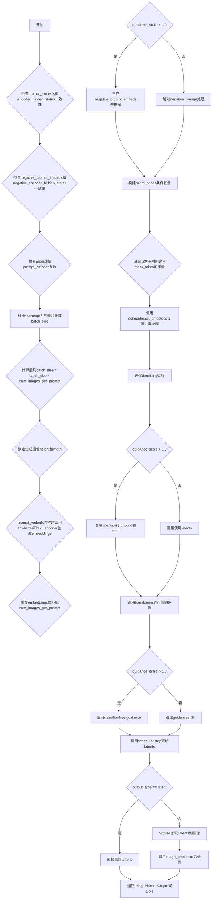
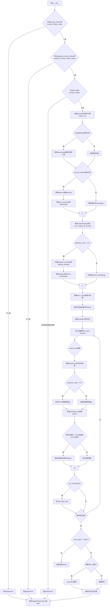
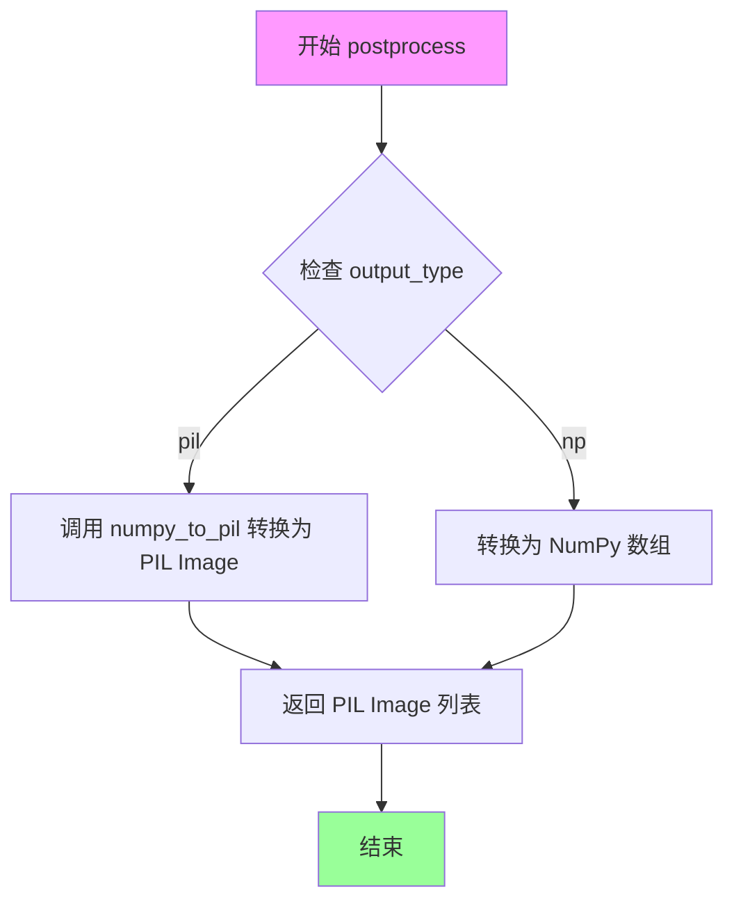
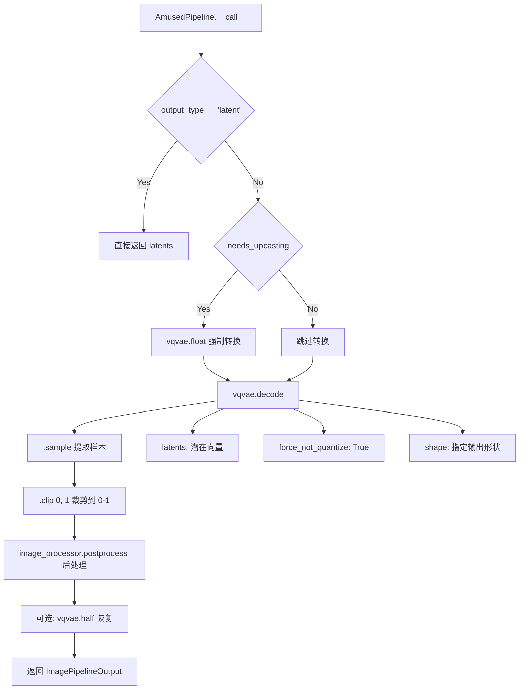
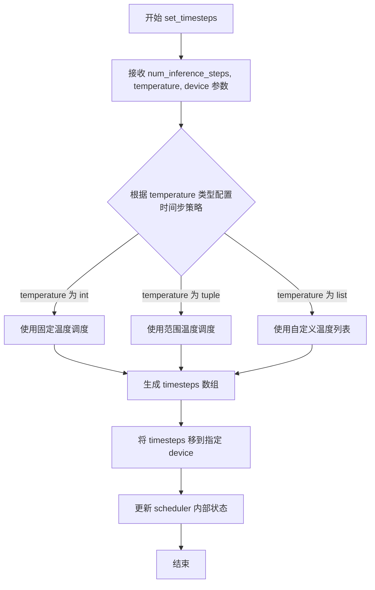

# `diffusers\src\diffusers\pipelines\amused\pipeline_amused.py` 详细设计文档

AmusedPipeline是一个基于扩散模型的文本到图像生成管道，整合了CLIP文本编码器、UVit2D Transformer、VQVAE解码器和AmusedScheduler调度器，通过多步去噪过程将文本提示转换为图像。

## 整体流程



## 类结构

```
DiffusionPipeline (抽象基类)
└── DeprecatedPipelineMixin (混入类)
    └── AmusedPipeline (具体实现类)
```

## 全局变量及字段


### `XLA_AVAILABLE`
    
Indicates whether torch_xla is available for XLA device support

类型：`bool`
    


### `EXAMPLE_DOC_STRING`
    
Example documentation string showing usage of AmusedPipeline for image generation

类型：`str`
    


### `is_torch_xla_available`
    
Utility function to check if torch_xla is available in the environment

类型：`Callable`
    


### `replace_example_docstring`
    
Decorator function to replace example docstrings in pipeline methods

类型：`Callable`
    


### `AmusedPipeline.image_processor`
    
Processes VAE decoded images for post-processing and output formatting

类型：`VaeImageProcessor`
    


### `AmusedPipeline.vqvae`
    
VQ-VAE model for encoding images to latent vectors and decoding latents back to images

类型：`VQModel`
    


### `AmusedPipeline.tokenizer`
    
CLIP tokenizer for converting text prompts into token IDs

类型：`CLIPTokenizer`
    


### `AmusedPipeline.text_encoder`
    
CLIP text encoder with projection for generating text embeddings from token IDs

类型：`CLIPTextModelWithProjection`
    


### `AmusedPipeline.transformer`
    
UVit2D transformer model for denoising latent vectors during diffusion process

类型：`UVit2DModel`
    


### `AmusedPipeline.scheduler`
    
Amused scheduler for managing diffusion sampling steps and timesteps

类型：`AmusedScheduler`
    


### `AmusedPipeline.model_cpu_offload_seq`
    
Defines the sequence of models for CPU offloading to manage memory usage

类型：`str`
    


### `AmusedPipeline.vae_scale_factor`
    
Scaling factor for converting between pixel space and VAE latent space dimensions

类型：`int`
    


### `AmusedPipeline._last_supported_version`
    
Stores the last supported version of the pipeline for compatibility checking

类型：`str`
    
    

## 全局函数及方法


### `AmusedPipeline.__init__`

这是 AmusedPipeline 类的构造函数，用于初始化文本到图像生成管道所需的各个组件，包括 VQVAE 模型、CLIP 文本编码器、UVit2D 变换器、调度器以及图像处理器。

参数：

- `vqvae`：`VQModel`，向量量化变分自编码器模型，用于将潜在向量解码为图像
- `tokenizer`：`CLIPTokenizer`，CLIP 文本分词器，用于将文本 prompts 转换为 token IDs
- `text_encoder`：`CLIPTextModelWithProjection`，CLIP 文本编码器模型，将 token IDs 转换为文本嵌入向量
- `transformer`：`UVit2DModel`，UVit2D 变换器模型，用于执行主要的扩散变换过程
- `scheduler`：`AmusedScheduler`，Amused 扩散调度器，用于控制去噪过程的参数

返回值：`None`，构造函数无返回值

#### 流程图

```mermaid
flowchart TD
    A[开始 __init__] --> B[调用父类 DiffusionPipeline.__init__]
    B --> C[注册所有模块: vqvae, tokenizer, text_encoder, transformer, scheduler]
    C --> D{检查 vqvae 是否存在}
    D -->|是| E[计算 vae_scale_factor = 2^(len(vqvae.config.block_out_channels) - 1)]
    D -->|否| F[设置 vae_scale_factor = 8]
    E --> G[创建 VaeImageProcessor 实例]
    F --> G
    G --> H[结束 __init__]
```

#### 带注释源码

```python
def __init__(
    self,
    vqvae: VQModel,
    tokenizer: CLIPTokenizer,
    text_encoder: CLIPTextModelWithProjection,
    transformer: UVit2DModel,
    scheduler: AmusedScheduler,
):
    """
    初始化 AmusedPipeline 管道。
    
    参数:
        vqvae: VQVAE 模型，用于图像的编解码
        tokenizer: CLIP 分词器，用于文本分词
        text_encoder: CLIP 文本编码器，用于生成文本嵌入
        transformer: UVit2D 变换器模型，用于扩散过程
        scheduler: Amused 调度器，用于控制去噪步骤
    """
    # 调用父类 DiffusionPipeline 的初始化方法
    # 设置管道的基本配置和设备管理
    super().__init__()

    # 使用 register_modules 方法注册所有子模块
    # 这样可以让这些模块支持 getattr 访问和设备管理
    self.register_modules(
        vqvae=vqvae,
        tokenizer=tokenizer,
        text_encoder=text_encoder,
        transformer=transformer,
        scheduler=scheduler,
    )
    
    # 计算 VAE 缩放因子，用于调整潜在空间的尺寸
    # 如果 vqvae 存在，根据其配置计算；否则使用默认值 8
    # block_out_channels 通常为 [128, 256, 512, 512]，所以值为 2^3 = 8
    self.vae_scale_factor = (
        2 ** (len(self.vqvae.config.block_out_channels) - 1) if getattr(self, "vqvae", None) else 8
    )
    
    # 创建 VAE 图像处理器
    # do_normalize=False 表示不进行归一化处理
    self.image_processor = VaeImageProcessor(vae_scale_factor=self.vae_scale_factor, do_normalize=False)
```


### `AmusedPipeline.__call__`

AmusedPipeline的推理入口方法，实现文本到图像的生成功能。该方法接收文本提示或预计算的文本嵌入，经过多步去噪迭代生成图像潜码，最后通过VQVAE解码器将潜码解码为最终图像。支持分类器自由引导（CFG）、微条件控制、美学评分调节等高级特性，并提供灵活的输出格式和回调机制。

参数：

- `prompt`：`list[str] | str | None`，用于引导图像生成的文本提示。若未定义，则需提供prompt_embeds。
- `height`：`int | None`，生成图像的高度（像素），默认值为transformer.config.sample_size * vae_scale_factor。
- `width`：`int | None`，生成图像的宽度（像素），默认值为transformer.config.sample_size * vae_scale_factor。
- `num_inference_steps`：`int`，去噪迭代步数，默认为12，步数越多图像质量越高但推理速度越慢。
- `guidance_scale`：`float`，引导尺度，用于控制图像与文本提示的关联程度，默认为10.0，大于1时启用CFG。
- `negative_prompt`：`str | list[str] | None`，用于引导图像中不应包含的内容的负向提示。
- `num_images_per_prompt`：`int`，每个提示生成的图像数量，默认为1。
- `generator`：`torch.Generator | None`，用于控制生成随机性的PyTorch随机数生成器。
- `latents`：`torch.IntTensor | None`，预生成的VQVAE潜码向量，若不提供则使用全masked的起始潜码。
- `prompt_embeds`：`torch.Tensor | None`，预生成的文本嵌入，用于轻松调整文本输入权重。
- `encoder_hidden_states`：`torch.Tensor | None`，文本编码器的倒数第二个隐藏状态，用于额外的文本条件。
- `negative_prompt_embeds`：`torch.Tensor | None`，预生成的负向文本嵌入。
- `negative_encoder_hidden_states`：`torch.Tensor | None`，负向提示对应的encoder隐藏状态。
- `output_type`：`str`，输出格式，可选"pil"或"latent"，默认为"pil"。
- `return_dict`：`bool`，是否返回ImagePipelineOutput而非元组，默认为True。
- `callback`：`Callable[[int, int, torch.Tensor], None] | None`，每callback_steps步调用的回调函数，接收step、timestep和latents参数。
- `callback_steps`：`int`，回调函数被调用的频率，默认为1。
- `cross_attention_kwargs`：`dict[str, Any] | None`，传递给注意力处理器的额外关键字参数。
- `micro_conditioning_aesthetic_score`：`int`，目标美学评分，默认为6，用于微条件控制。
- `micro_conditioning_crop_coord`：`tuple[int, int]`，目标裁剪坐标，默认为(0, 0)。
- `temperature`：`int | tuple[int, int] | list[int]`，温度调度器配置，默认为(2, 0)。

返回值：`ImagePipelineOutput | tuple`，当return_dict为True时返回ImagePipelineOutput，否则返回包含生成图像列表的元组。

#### 流程图



#### 带注释源码

```python
@torch.no_grad()
@replace_example_docstring(EXAMPLE_DOC_STRING)
def __call__(
    self,
    prompt: list[str] | str | None = None,
    height: int | None = None,
    width: int | None = None,
    num_inference_steps: int = 12,
    guidance_scale: float = 10.0,
    negative_prompt: str | list[str] | None = None,
    num_images_per_prompt: int | None = 1,
    generator: torch.Generator | None = None,
    latents: torch.IntTensor | None = None,
    prompt_embeds: torch.Tensor | None = None,
    encoder_hidden_states: torch.Tensor | None = None,
    negative_prompt_embeds: torch.Tensor | None = None,
    negative_encoder_hidden_states: torch.Tensor | None = None,
    output_type="pil",
    return_dict: bool = True,
    callback: Callable[[int, int, torch.Tensor], None] | None = None,
    callback_steps: int = 1,
    cross_attention_kwargs: dict[str, Any] | None = None,
    micro_conditioning_aesthetic_score: int = 6,
    micro_conditioning_crop_coord: tuple[int, int] = (0, 0),
    temperature: int | tuple[int, int] | list[int] = (2, 0),
):
    """
    The call function to the pipeline for generation.

    Args:
        prompt (`str` or `list[str]`, *optional*):
            The prompt or prompts to guide image generation. If not defined, you need to pass `prompt_embeds`.
        height (`int`, *optional*, defaults to `self.transformer.config.sample_size * self.vae_scale_factor`):
            The height in pixels of the generated image.
        width (`int`, *optional*, defaults to `self.unet.config.sample_size * self.vae_scale_factor`):
            The width in pixels of the generated image.
        num_inference_steps (`int`, *optional*, defaults to 16):
            The number of denoising steps. More denoising steps usually lead to a higher quality image at the
            expense of slower inference.
        guidance_scale (`float`, *optional*, defaults to 10.0):
            A higher guidance scale value encourages the model to generate images closely linked to the text
            `prompt` at the expense of lower image quality. Guidance scale is enabled when `guidance_scale > 1`.
        negative_prompt (`str` or `list[str]`, *optional*):
            The prompt or prompts to guide what to not include in image generation. If not defined, you need to
            pass `negative_prompt_embeds` instead. Ignored when not using guidance (`guidance_scale < 1`).
        num_images_per_prompt (`int`, *optional*, defaults to 1):
            The number of images to generate per prompt.
        generator (`torch.Generator`, *optional*):
            A [`torch.Generator`](https://pytorch.org/docs/stable/generated/torch.Generator.html) to make
            generation deterministic.
        latents (`torch.IntTensor`, *optional*):
            Pre-generated tokens representing latent vectors in `self.vqvae`, to be used as inputs for image
            generation. If not provided, the starting latents will be completely masked.
        prompt_embeds (`torch.Tensor`, *optional*):
            Pre-generated text embeddings. Can be used to easily tweak text inputs (prompt weighting). If not
            provided, text embeddings are generated from the `prompt` input argument. A single vector from the
            pooled and projected final hidden states.
        encoder_hidden_states (`torch.Tensor`, *optional*):
            Pre-generated penultimate hidden states from the text encoder providing additional text conditioning.
        negative_prompt_embeds (`torch.Tensor`, *optional*):
            Pre-generated negative text embeddings. Can be used to easily tweak text inputs (prompt weighting). If
            not provided, `negative_prompt_embeds` are generated from the `negative_prompt` input argument.
        negative_encoder_hidden_states (`torch.Tensor`, *optional*):
            Analogous to `encoder_hidden_states` for the positive prompt.
        output_type (`str`, *optional*, defaults to `"pil"`):
            The output format of the generated image. Choose between `PIL.Image` or `np.array`.
        return_dict (`bool`, *optional*, defaults to `True`):
            Whether or not to return a [`~pipelines.stable_diffusion.StableDiffusionPipelineOutput`] instead of a
            plain tuple.
        callback (`Callable`, *optional*):
            A function that calls every `callback_steps` steps during inference. The function is called with the
            following arguments: `callback(step: int, timestep: int, latents: torch.Tensor)`.
        callback_steps (`int`, *optional*, defaults to 1):
            The frequency at which the `callback` function is called. If not specified, the callback is called at
            every step.
        cross_attention_kwargs (`dict`, *optional*):
            A kwargs dictionary that if specified is passed along to the [`AttentionProcessor`] as defined in
            [`self.processor`](https://github.com/huggingface/diffusers/blob/main/src/diffusers/models/attention_processor.py).
        micro_conditioning_aesthetic_score (`int`, *optional*, defaults to 6):
            The targeted aesthetic score according to the laion aesthetic classifier. See
            https://laion.ai/blog/laion-aesthetics/ and the micro-conditioning section of
            https://huggingface.co/papers/2307.01952.
        micro_conditioning_crop_coord (`tuple[int]`, *optional*, defaults to (0, 0)):
            The targeted height, width crop coordinates. See the micro-conditioning section of
            https://huggingface.co/papers/2307.01952.
        temperature (`int | tuple[int, int, list[int]]`, *optional*, defaults to (2, 0)):
            Configures the temperature scheduler on `self.scheduler` see `AmusedScheduler#set_timesteps`.

    Examples:

    Returns:
        [`~pipelines.pipeline_utils.ImagePipelineOutput`] or `tuple`:
            If `return_dict` is `True`, [`~pipelines.pipeline_utils.ImagePipelineOutput`] is returned, otherwise a
            `tuple` is returned where the first element is a list with the generated images.
    """
    # 验证prompt_embeds和encoder_hidden_states必须同时提供或同时不提供
    if (prompt_embeds is not None and encoder_hidden_states is None) or (
        prompt_embeds is None and encoder_hidden_states is not None
    ):
        raise ValueError("pass either both `prompt_embeds` and `encoder_hidden_states` or neither")

    # 验证negative_prompt_embeds和negative_encoder_hidden_states必须同时提供或同时不提供
    if (negative_prompt_embeds is not None and negative_encoder_hidden_states is None) or (
        negative_prompt_embeds is None and negative_encoder_hidden_states is not None
    ):
        raise ValueError(
            "pass either both `negatve_prompt_embeds` and `negative_encoder_hidden_states` or neither"
        )

    # 验证prompt和prompt_embeds只能提供其中一个
    if (prompt is None and prompt_embeds is None) or (prompt is not None and prompt_embeds is not None):
        raise ValueError("pass only one of `prompt` or `prompt_embeds`")

    # 将单个prompt字符串转换为列表以支持批量处理
    if isinstance(prompt, str):
        prompt = [prompt]

    # 计算批处理大小：基于prompt数量或embeddings的batch维度
    if prompt is not None:
        batch_size = len(prompt)
    else:
        batch_size = prompt_embeds.shape[0]

    # 乘以每prompt生成的图像数量以支持单次调用生成多张图像
    batch_size = batch_size * num_images_per_prompt

    # 如果未指定高度和宽度，使用transformer配置和VAE缩放因子计算默认值
    if height is None:
        height = self.transformer.config.sample_size * self.vae_scale_factor

    if width is None:
        width = self.transformer.config.sample_size * self.vae_scale_factor

    # 如果未提供prompt_embeds，则从prompt生成文本嵌入
    if prompt_embeds is None:
        # 使用tokenizer将prompt编码为input_ids
        input_ids = self.tokenizer(
            prompt,
            return_tensors="pt",
            padding="max_length",
            truncation=True,
            max_length=self.tokenizer.model_max_length,
        ).input_ids.to(self._execution_device)

        # 通过text_encoder生成text_embeds和encoder_hidden_states
        outputs = self.text_encoder(input_ids, return_dict=True, output_hidden_states=True)
        prompt_embeds = outputs.text_embeds  # 池化后的文本嵌入
        encoder_hidden_states = outputs.hidden_states[-2]  # 倒数第二层隐藏状态

    # 重复embeddings以匹配num_images_per_prompt
    prompt_embeds = prompt_embeds.repeat(num_images_per_prompt, 1)
    encoder_hidden_states = encoder_hidden_states.repeat(num_images_per_prompt, 1, 1)

    # 如果启用分类器自由引导（guidance_scale > 1），处理negative_prompt
    if guidance_scale > 1.0:
        if negative_prompt_embeds is None:
            if negative_prompt is None:
                negative_prompt = [""] * len(prompt)

            if isinstance(negative_prompt, str):
                negative_prompt = [negative_prompt]

            # 编码negative_prompt
            input_ids = self.tokenizer(
                negative_prompt,
                return_tensors="pt",
                padding="max_length",
                truncation=True,
                max_length=self.tokenizer.model_max_length,
            ).input_ids.to(self._execution_device)

            outputs = self.text_encoder(input_ids, return_dict=True, output_hidden_states=True)
            negative_prompt_embeds = outputs.text_embeds
            negative_encoder_hidden_states = outputs.hidden_states[-2]

        # 重复negative embeddings以匹配num_images_per_prompt
        negative_prompt_embeds = negative_prompt_embeds.repeat(num_images_per_prompt, 1)
        negative_encoder_hidden_states = negative_encoder_hidden_states.repeat(num_images_per_prompt, 1, 1)

        # 将negative和positive embeddings拼接，用于CFG
        # 顺序为 [negative_prompt_embeds, prompt_embeds]
        prompt_embeds = torch.concat([negative_prompt_embeds, prompt_embeds])
        encoder_hidden_states = torch.concat([negative_encoder_hidden_states, encoder_hidden_states])

    # 构建微条件张量，包含宽、高、裁剪坐标和美学评分
    # 注意：微条件的宽高顺序与原始代码一致，即width在前
    micro_conds = torch.tensor(
        [
            width,
            height,
            micro_conditioning_crop_coord[0],
            micro_conditioning_crop_coord[1],
            micro_conditioning_aesthetic_score,
        ],
        device=self._execution_device,
        dtype=encoder_hidden_states.dtype,
    )
    micro_conds = micro_conds.unsqueeze(0)  # 添加batch维度
    # 扩展微条件以匹配CFG的2倍batch或普通batch
    micro_conds = micro_conds.expand(2 * batch_size if guidance_scale > 1.0 else batch_size, -1)

    # 计算潜码的shape（VAE缩放后的空间尺寸）
    shape = (batch_size, height // self.vae_scale_factor, width // self.vae_scale_factor)

    # 如果未提供latents，使用全masked的起始潜码
    if latents is None:
        latents = torch.full(
            shape, self.scheduler.config.mask_token_id, dtype=torch.long, device=self._execution_device
        )

    # 设置scheduler的时间步和温度
    self.scheduler.set_timesteps(num_inference_steps, temperature, self._execution_device)

    # 计算预热步数（scheduler总步数减去实际推理步数乘以order）
    num_warmup_steps = len(self.scheduler.timesteps) - num_inference_steps * self.scheduler.order
    
    # 进入去噪主循环
    with self.progress_bar(total=num_inference_steps) as progress_bar:
        for i, timestep in enumerate(self.scheduler.timesteps):
            # 如果启用CFG，将latents复制两份（uncond和cond）
            if guidance_scale > 1.0:
                model_input = torch.cat([latents] * 2)
            else:
                model_input = latents

            # 调用transformer进行前向传播
            model_output = self.transformer(
                model_input,
                micro_conds=micro_conds,
                pooled_text_emb=prompt_embeds,
                encoder_hidden_states=encoder_hidden_states,
                cross_attention_kwargs=cross_attention_kwargs,
            )

            # 如果启用CFG，应用分类器自由引导
            if guidance_scale > 1.0:
                uncond_logits, cond_logits = model_output.chunk(2)  # 分离uncond和cond输出
                # CFG公式：uncond + scale * (cond - uncond)
                model_output = uncond_logits + guidance_scale * (cond_logits - uncond_logits)

            # 调用scheduler进行去噪步骤
            latents = self.scheduler.step(
                model_output=model_output,
                timestep=timestep,
                sample=latents,
                generator=generator,
            ).prev_sample

            # 如果是最后一个step或完成了预热且是order的倍数，更新进度条
            if i == len(self.scheduler.timesteps) - 1 or (
                (i + 1) > num_warmup_steps and (i + 1) % self.scheduler.order == 0
            ):
                progress_bar.update()
                # 如果提供了callback且满足callback_steps条件，调用callback
                if callback is not None and i % callback_steps == 0:
                    step_idx = i // getattr(self.scheduler, "order", 1)
                    callback(step_idx, timestep, latents)

            # 如果使用XLA（TPU），执行mark_step以优化计算
            if XLA_AVAILABLE:
                xm.mark_step()

    # 根据output_type处理输出
    if output_type == "latent":
        output = latents  # 直接返回潜码
    else:
        # 检查是否需要对VAE进行上采样（float16强制上采样）
        needs_upcasting = self.vqvae.dtype == torch.float16 and self.vqvae.config.force_upcast

        if needs_upcasting:
            self.vqvae.float()  # 上采样为float32以避免精度问题

        # 调用VQVAE解码器将潜码解码为图像
        output = self.vqvae.decode(
            latents,
            force_not_quantize=True,
            shape=(
                batch_size,
                height // self.vae_scale_factor,
                width // self.vae_scale_factor,
                self.vqvae.config.latent_channels,
            ),
        ).sample.clip(0, 1)  # 裁剪到[0, 1]范围
        # 后处理：将输出转换为PIL.Image或np.array
        output = self.image_processor.postprocess(output, output_type)

        if needs_upcasting:
            self.vqvae.half()  # 恢复为float16

    # 释放模型钩子（如果启用了模型卸载）
    self.maybe_free_model_hooks()

    # 根据return_dict返回结果
    if not return_dict:
        return (output,)

    return ImagePipelineOutput(output)
```


### VaeImageProcessor.postprocess

该方法是图像后处理工具，负责将VAE解码器输出的张量转换为最终的图像格式（PIL Image或NumPy数组），并根据配置执行归一化处理。

参数：

- `self`：`VaeImageProcessor`实例，图像处理器对象本身
- `images`：`torch.Tensor`，VAE解码器输出的图像张量，通常为float32类型，值域在[0, 1]范围内
- `output_type`：`str`，期望的输出图像格式，支持"pil"（PIL.Image）或"np"（NumPy数组），默认值为"pil"

返回值：`PIL.Image.Image | np.ndarray`，返回处理后的图像，若output_type为"pil"返回PIL图像列表，若为"np"返回NumPy数组

#### 流程图



#### 带注释源码

```python
# 在 AmusedPipeline 中的调用方式：
# VaeImageProcessor.postprocess(output, output_type)

# 调用位置位于 AmusedPipeline.__call__ 方法的末尾：
# 1. 首先通过 vqvae.decode 解码 latents 得到 output
# 2. 对 output 进行 clip(0, 1) 裁剪到 [0, 1] 范围
# 3. 调用 image_processor.postprocess 进行后处理转换

# 具体代码片段：
output = self.vqvae.decode(
    latents,
    force_not_quantize=True,
    shape=(
        batch_size,
        height // self.vae_scale_factor,
        width // self.vae_scale_factor,
        self.vqvae.config.latent_channels,
    ),
).sample.clip(0, 1)  # 将输出裁剪到 [0, 1] 范围

# 调用 postprocess 进行最终格式转换
output = self.image_processor.postprocess(output, output_type)

# VaeImageProcessor 的初始化（在 AmusedPipeline.__init__ 中）：
self.vae_scale_factor = (
    2 ** (len(self.vqvae.config.block_out_channels) - 1) if getattr(self, "vqvae", None) else 8
)
self.image_processor = VaeImageProcessor(vae_scale_factor=self.vae_scale_factor, do_normalize=False)
# 注意：do_normalize=False 表示不进行归一化处理
```

#### 关键组件信息

| 组件名称 | 一句话描述 |
|---------|-----------|
| VaeImageProcessor | VAE图像处理器，负责将VAE解码后的张量转换为PIL或NumPy格式 |
| image_processor | AmusedPipeline中的图像处理实例，用于后处理 |

#### 技术债务与优化空间

1. **外部依赖不透明**：`VaeImageProcessor`类从`...image_processor`导入，其`postprocess`方法的具体实现不可见，建议补充该方法的完整源码或链接到外部实现文档。
2. **输出类型硬编码**：当前`output_type`默认为"pil"，缺少对"pt"（PyTorch张量）输出类型的支持。
3. **归一化配置隐藏**：`do_normalize=False`的配置逻辑在类外部设置，可能导致使用者忽略图像是否经过归一化。

#### 补充说明

根据代码调用上下文分析，`postprocess`方法的典型使用场景如下：
- 输入：形状为`(batch_size, channels, height, width)`的PyTorch张量，值域[0, 1]
- 输出：根据`output_type`参数转换为PIL Image列表或NumPy数组
- 关联配置：`vae_scale_factor`决定图像尺寸的缩放比例，`do_normalize`控制是否进行归一化


### VQModel.decode

该方法在 AmusedPipeline 中被调用，用于将 VQ-VAE 的潜在向量解码为最终图像。这是图像生成流程的最后一步，将去噪后的潜在表示转换回像素空间。

参数：

- `latents`：`torch.Tensor`，VQGVAE 解码器的潜在向量输入，通常是经过去噪处理的潜在表示
- `force_not_quantize`：`bool`，是否强制不解量化，设为 True 确保解码过程不使用量化
- `shape`：`tuple[int, int, int, int]`，输出张量的形状 (batch_size, height//vae_scale_factor, width//vae_scale_factor, latent_channels)

返回值：`torch.Tensor`，解码后的图像张量，值域被 clip 到 [0, 1] 范围

#### 流程图



#### 带注释源码

```python
# 在 AmusedPipeline.__call__ 方法末尾的调用

# 检查是否需要上转换（当 VQVAE 为 float16 且强制上转换时）
needs_upcasting = self.vqvae.dtype == torch.float16 and self.vqvae.config.force_upcast

# 如果需要上转换，先将 VQVAE 转换为 float32
if needs_upcasting:
    self.vqvae.float()

# 调用 VQVAE decode 方法进行解码
# latents: 经过去噪后的潜在向量
# force_not_quantize=True: 强制不解量化，确保解码质量
# shape: 指定输出的 4D 张量形状 (batch, H/scale, W/scale, latent_channels)
output = self.vqvae.decode(
    latents,
    force_not_quantize=True,
    shape=(
        batch_size,
        height // self.vae_scale_factor,
        width // self.vae_scale_factor,
        self.vqvae.config.latent_channels,
    ),
).sample.clip(0, 1)  # 提取 sample 并裁剪到 [0,1]

# 后处理：根据 output_type 转换为 PIL.Image 或 numpy 数组
output = self.image_processor.postprocess(output, output_type)

# 如果之前进行了上转换，现在恢复为 float16
if needs_upcasting:
    self.vqvae.half()
```

> **注意**：代码中仅展示了 `VQModel.decode` 的调用点，未包含 `VQModel` 类的完整定义。`VQModel` 是 diffusers 库中的标准组件，decode 方法遵循 VQ-VAE 的解码器逻辑，将离散的潜在码本索引映射回像素空间。


### `AmusedScheduler.set_timesteps`

该方法用于配置调度器的时间步长（timesteps）和温度参数，控制扩散模型的推理过程。

参数：

- `num_inference_steps`：`int`，推理步数，决定去噪过程的迭代次数
- `temperature`：`int | tuple[int, int] | list[int]`，温度参数，用于配置时间步长的调度策略
- `device`：`torch.device`，指定计算设备

返回值：`None`，该方法直接修改调度器内部状态，不返回任何值

#### 流程图



#### 带注释源码

```python
# 注意：以下源码为基于调用的推断，实际实现需参考 AmusedScheduler 类
# 以下是调用点的代码示例

# 在 AmusedPipeline.__call__ 方法中调用 set_timesteps:
self.scheduler.set_timesteps(num_inference_steps, temperature, self._execution_device)

# 参数说明：
# - num_inference_steps: 推理步数（默认值为12）
# - temperature: 温度参数（默认值为 (2, 0)），用于控制时间步长的分布
# - self._execution_device: 执行设备（CPU/CUDA）
```

> **注意**：提供的代码中仅包含对此方法的调用，实际的 `AmusedScheduler.set_timesteps` 方法实现位于 `...schedulers` 模块中，未在当前代码片段中给出。上述信息基于调用上下文推断。


### AmusedScheduler.step

该方法是 AmusedScheduler 调度器的核心去噪步骤方法，负责根据模型输出和当前时间步计算前一个时间步的潜在向量（latents），是扩散模型推理过程中实现图像生成的关键步骤。

参数：

- `model_output`：`torch.Tensor`，模型（transformer）预测的输出，包含潜向量空间的预测结果
- `timestep`：`int`，当前扩散过程的时间步，用于调度器计算噪声调度和返回前一个时间步
- `sample`：`torch.Tensor`，当前时刻的潜向量样本（latents），是调度器的输入
- `generator`：`torch.Generator | None`，可选的 PyTorch 随机数生成器，用于确保生成的可重复性

返回值：`StepOutput`，返回一个包含 `prev_sample` 属性的对象，其中 `prev_sample` 是前一个时间步计算得到的潜向量

#### 流程图

```mermaid
flowchart TD
    A[开始 step 方法] --> B{检查 guidance_scale > 1}
    B -->|是| C[计算 classifier-free guidance]
    B -->|否| D[直接使用 model_output]
    C --> E[uncond_logits + guidance_scale * (cond_logits - uncond_logits)]
    D --> F[获取当前时间步的噪声调度参数]
    E --> F
    F --> G[根据调度算法计算 prev_sample]
    G --> H[应用噪声调度: sample_prev = sample - alpha * noise]
    H --> I[返回包含 prev_sample 的 StepOutput]
```

#### 带注释源码

```
# 在 AmusedPipeline.__call__ 方法中调用 scheduler.step 的方式:
# 这是代码中实际使用 AmusedScheduler.step 的位置

latents = self.scheduler.step(
    model_output=model_output,    # torch.Tensor, transformer 模型的输出
    timestep=timestep,             # int, 当前扩散时间步
    sample=latents,               # torch.Tensor, 当前潜向量
    generator=generator,           # torch.Generator | None, 随机生成器
).prev_sample                      # 从返回值中提取前一个时间步的潜向量

# 说明:
# - model_output: 由 transformer 模型预测的输出张量
# - timestep: 来自 scheduler.timesteps 数组的当前时间步
# - sample (latents): 当前迭代的潜向量，开始时为全 mask_token
# - scheduler.step 返回一个 StepOutput 对象，包含:
#   - prev_sample: 计算得到的前一个时间步的潜向量
#   - 可能还包含其他如 pred_original_sample 等属性
```

注意：实际的 `AmusedScheduler.step` 方法实现位于 `diffusers` 库的调度器模块中，未包含在当前代码文件中。上述源码展示了该方法在管道中的调用方式及其参数和返回值的使用。


## 关键组件


### 张量索引与惰性加载

在`__call__`方法中，latents张量通过`torch.full`初始化为mask_token_id，随后在去噪循环中通过`scheduler.step`逐步更新。模型输入通过`torch.cat`与负向promptembeds拼接实现条件张量索引。

### 反量化支持

`vqvae.decode`调用时显式传入`force_not_quantize=True`参数，强制跳过量化流程以确保解码精度。同时包含`needs_upcasting`逻辑：当VQVAE为float16且配置`force_upcast`时，会临时将模型转换为float32进行解码，完成后再恢复float16。

### 量化策略

代码中通过`torch_dtype=torch.float16`支持半精度推理，并在VQVAE解码阶段实现条件性精度转换：检测到float16与`force_upcast`配置时，执行`float()`和`half()`的动态切换以平衡性能与数值稳定性。

### 文本编码与条件处理

文本prompt通过`CLIPTokenizer` token化后送入`CLIPTextModelWithProjection`编码，提取`text_embeds`作为pooled_text_emb和`hidden_states[-2]`作为encoder_hidden_states。负向prompt采用相同流程处理后通过`torch.concat`与正向条件拼接。

### 微条件(Micro-Conditioning)

通过`micro_conditioning_aesthetic_score`和`micro_conditioning_crop_coord`构建micro_conds张量，包含宽高、裁剪坐标和美学评分，用于精细控制生成图像属性。

### 引导扩散机制

当`guidance_scale > 1.0`时，模型输出被分割为无条件部分和条件部分，通过`uncond_logits + guidance_scale * (cond_logits - uncond_logits)`公式实现CFG引导生成。

### 图像后处理管线

`VaeImageProcessor`负责将VQVAE解码输出的浮点张量转换为PIL.Image或numpy数组格式，包含denormalize和tensor到image的转换流程。

### 调度器与温度控制

`AmusedScheduler`通过`set_timesteps`方法配置去噪步骤数和温度参数，温度支持int、tuple和list多种格式用于控制噪声调度策略。


## 问题及建议


### 已知问题

- **文档与实现不一致**：`num_inference_steps`参数文档描述默认值为16，但实际默认值为12；`width`参数文档引用`self.unet.config.sample_size`但实际使用`self.transformer.config.sample_size`
- **类型提示不够精确**：`latents`参数类型标注为`torch.IntTensor`，但实际可能需要处理`torch.long`类型；`temperature`参数支持`tuple[int, int]`和`list[int]`但文档只描述了前者
- **代码重复**：positive prompt和negative prompt的tokenizer与text_encoder调用逻辑重复，可提取为私有方法
- **XLA支持不完善**：仅在可用时执行`xm.mark_step()`，缺乏完整的XLA设备迁移和内存优化策略
- **缺少混合精度优化**：未使用`torch.cuda.amp.autocast`进行推理优化
- **错误处理不完整**：未对`temperature`参数为list类型时进行完整验证；未对`height`和`width`为非正数进行校验

### 优化建议

- 修正文档字符串中的默认值描述以匹配实际代码实现
- 将tokenizer和text_encoder调用逻辑提取为私有方法如`_encode_prompt()`以减少代码重复
- 添加参数校验逻辑，验证`height`、`width`为正整数以及`temperature`参数格式
- 考虑添加torch.compile支持或混合精度推理选项以提升性能
- 增强XLA支持，添加更全面的设备管理和内存优化策略
- 改进类型提示，使用`Union`类型更准确地描述`latents`和`temperature`参数

## 其它


### 设计目标与约束

该Pipeline的设计目标是实现高效的文本到图像生成功能，支持基于VQVAE的离散潜在空间生成。设计约束包括：1) 仅支持FP16推理以优化内存使用；2) 固定12步去噪迭代以平衡质量与速度；3) 依赖transformers库的CLIP模型进行文本编码；4) 必须与diffusers框架的Pipeline基类兼容。

### 错误处理与异常设计

代码包含以下错误处理机制：1) 参数校验错误 - 当prompt_embeds与encoder_hidden_states不匹配时抛出ValueError；2) 负向提示词校验 - 检查negative_prompt_embeds与negative_encoder_hidden_states的一致性；3) 输入互斥校验 - 确保prompt和prompt_embeds二选一；4) XLA设备处理 - 条件导入torch_xla并在可用时使用mark_step()进行计算图优化。

### 数据流与状态机

数据流如下：1) 文本输入阶段：prompt→tokenizer→text_encoder→prompt_embeds+encoder_hidden_states；2) 条件准备阶段：处理micro_conditioning参数构建micro_conds张量；3) 潜在向量初始化：创建全mask_token的latents；4) 去噪循环阶段：latents→transformer→scheduler.step()迭代更新；5) 解码阶段：latents→vqvae.decode()→图像后处理→最终输出。状态转换通过AmusedScheduler的timesteps控制。

### 外部依赖与接口契约

核心依赖包括：1) torch - 张量运算和自动求导；2) transformers.CLIPTextModelWithProjection - 文本编码；3) transformers.CLIPTokenizer - 文本分词；4) diffusers.models.VQModel - VQVAE解码器；5) diffusers.models.UVit2DModel - 扩散变换器；6) diffusers.schedulers.AmusedScheduler - 调度器；7) diffusers.image_processor.VaeImageProcessor - 图像后处理。接口契约遵循DiffusionPipeline标准接口，__call__方法返回ImagePipelineOutput或tuple。

### 配置与参数设计

关键配置参数包括：1) model_cpu_offload_seq定义模型卸载顺序为"text_encoder->transformer->vqvae"；2) vae_scale_factor根据vqvae.config.block_out_channels计算；3) micro_conditioning_aesthetic_score默认值为6用于美学评分控制；4) micro_conditioning_crop_coord默认(0,0)用于裁剪坐标；5) temperature参数控制调度器的时间步长设置。

### 性能考量与优化建议

性能优化点：1) 使用@torch.no_grad()装饰器禁用梯度计算；2) 支持torch.float16半精度推理；3) 支持XLA设备加速（条件导入）；4) 支持CPU offload和模型卸载；5) 通过num_images_per_prompt参数支持批量生成。潜在优化空间：1) 可以添加torch.compile()支持；2) 可以支持ONNX导出；3) 可以添加KV cache优化。

### 版本兼容性与迁移指南

_last_supported_version = "0.33.1"标识了该Pipeline最后支持的版本。继承自DeprecatedPipelineMixin表明该类可能已被标记为弃用。新版本可能已迁移至新的API设计，使用时需参考diffusers库的版本发布说明。建议迁移至新版本的标准DiffusionPipeline接口以获得更好的维护支持。

### 安全考量与使用限制

安全考虑：1) 模型输出经过clip(0,1)操作确保像素值在有效范围内；2) 支持negative_prompt用于过滤不当内容；3) 图像生成内容受限于底层模型的训练数据。使用限制：1) 文本编码器最大长度受tokenizer.model_max_length限制；2) 批量大小受GPU显存限制；3) 输出分辨率受transformer.config.sample_size和vae_scale_factor约束。

### 测试策略与验证方法

测试应覆盖：1) 单prompt和批量prompt生成；2) 有/无negative_prompt的生成；3) 自定义latents的生成；4) 不同output_type(pil/numpy/latent)的输出；5) callback函数的调用；6) guidance_scale不同值的行为；7) micro_conditioning参数的效果验证。集成测试应验证生成的图像质量和尺寸正确性。

### 部署与环境要求

环境要求：1) Python 3.8+；2) PyTorch 2.0+；3) diffusers库；4) transformers库；5) 可选的torch_xla用于TPU加速。部署时需注意：1) CUDA设备推荐用于FP16推理；2) 模型权重需从HuggingFace Hub下载；3) 首次运行需下载tokenizer和模型文件。

    