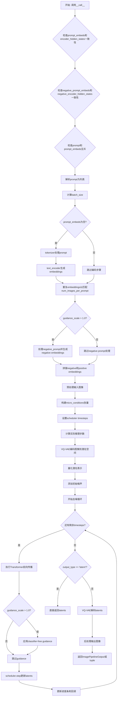
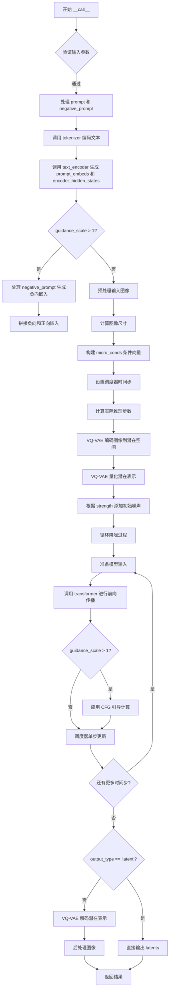

# `diffusers\src\diffusers\pipelines\amused\pipeline_amused_img2img.py` 详细设计文档

AmusedImg2ImgPipeline是一个基于扩散模型的图像到图像生成管道,接收文本提示和输入图像,通过VQ-VAE编码、Transformer去噪和CLIP文本编码,在潜在空间中执行去噪过程后通过VQ-VAE解码器重建输出图像,可实现基于文本提示对图像进行风格迁移、内容替换或创意改编。

## 整体流程



## 类结构

```
DiffusionPipeline (基类)
├── DeprecatedPipelineMixin (混入类)
└── AmusedImg2ImgPipeline (实现类)
```

## 全局变量及字段


### `XLA_AVAILABLE`
    
指示Torch XLA是否可用的全局标志

类型：`bool`
    


### `EXAMPLE_DOC_STRING`
    
管道使用示例的文档字符串

类型：`str`
    


### `AmusedImg2ImgPipeline.image_processor`
    
VAE图像处理器,用于图像预处理和后处理

类型：`VaeImageProcessor`
    


### `AmusedImg2ImgPipeline.vqvae`
    
VQ-VAE模型,负责图像编码和解码

类型：`VQModel`
    


### `AmusedImg2ImgPipeline.tokenizer`
    
CLIP分词器,将文本转换为token ID

类型：`CLIPTokenizer`
    


### `AmusedImg2ImgPipeline.text_encoder`
    
CLIP文本编码器,生成文本embedding

类型：`CLIPTextModelWithProjection`
    


### `AmusedImg2ImgPipeline.transformer`
    
UVit2D Transformer模型,执行去噪过程

类型：`UVit2DModel`
    


### `AmusedImg2ImgPipeline.scheduler`
    
噪声调度器,控制去噪步骤和时间步

类型：`AmusedScheduler`
    


### `AmusedImg2ImgPipeline.model_cpu_offload_seq`
    
CPU卸载顺序字符串

类型：`str`
    


### `AmusedImg2ImgPipeline._exclude_from_cpu_offload`
    
需排除CPU卸载的模块列表

类型：`list`
    


### `AmusedImg2ImgPipeline.vae_scale_factor`
    
VAE缩放因子,基于VQ-VAE配置计算

类型：`int`
    


### `AmusedImg2ImgPipeline._last_supported_version`
    
最后支持的管道版本号

类型：`str`
    
    

## 全局函数及方法


### `AmusedImg2ImgPipeline.__init__`

构造函数，初始化AmusedImg2ImgPipeline的所有模块组件，包括VQVAE tokenizer、text_encoder、transformer和scheduler，并配置图像处理器。

参数：

- `self`：实例本身，隐式参数
- `vqvae`：`VQModel`，VQ-VAE模型，用于图像的编码和解码
- `tokenizer`：`CLIPTokenizer`，CLIP分词器，用于将文本提示转换为token序列
- `text_encoder`：`CLIPTextModelWithProjection`，CLIP文本编码器，将token序列编码为文本嵌入
- `transformer`：`UVit2DModel`，UVit2D变换器模型，用于去噪过程
- `scheduler`：`AmusedScheduler`，调度器，控制去噪步骤中的噪声调度

返回值：`None`，构造函数无返回值，直接初始化实例属性

#### 流程图

```mermaid
flowchart TD
    A[开始 __init__] --> B[调用 super().__init__ 初始化基类]
    B --> C[调用 register_modules 注册5个模块组件]
    C --> D{检查 vqvae 是否存在}
    D -->|是| E[根据 vqvae.config.block_out_channels 计算 vae_scale_factor]
    D -->|否| F[设置 vae_scale_factor = 8]
    E --> G[创建 VaeImageProcessor 实例]
    F --> G
    G --> H[结束 __init__]
```

#### 带注释源码

```python
def __init__(
    self,
    vqvae: VQModel,                                  # VQ-VAE模型，用于图像编码/解码
    tokenizer: CLIPTokenizer,                       # CLIP分词器，处理文本输入
    text_encoder: CLIPTextModelWithProjection,      # CLIP文本编码器，生成文本嵌入
    transformer: UVit2DModel,                        # UVit2D变换器，执行去噪
    scheduler: AmusedScheduler,                      # 噪声调度器，管理去噪步骤
):
    """
    初始化AmusedImg2ImgPipeline的所有组件
    
    参数:
        vqvae: VQ-VAE模型，用于图像的量化编码和解码
        tokenizer: CLIP分词器，将文本转换为token ID
        text_encoder: CLIP文本编码器，生成文本嵌入向量
        transformer: UVit2D变换器模型，执行主要的去噪推理
        scheduler: AmusedScheduler调度器，控制扩散过程
    """
    
    # 调用父类DeprecatedPipelineMixin和DiffusionPipeline的初始化方法
    # 设置基础pipeline属性和配置
    super().__init__()
    
    # 使用register_modules方法注册所有子模块
    # 这些模块将可以通过pipeline.xx方式访问
    # 同时支持模型卸载和设备管理等高级功能
    self.register_modules(
        vqvae=vqvae,
        tokenizer=tokenizer,
        text_encoder=text_encoder,
        transformer=transformer,
        scheduler=scheduler,
    )
    
    # 计算VAE缩放因子，用于调整图像尺寸
    # 基于VQVAE的block_out_channels配置计算下采样比例
    # 例如: 如果block_out_channels=[128, 256, 512], 则结果为 2^(3-1) = 4
    self.vae_scale_factor = (
        2 ** (len(self.vqvae.config.block_out_channels) - 1) 
        if getattr(self, "vqvae", None) else 8  # 默认值8作为后备
    )
    
    # 初始化图像预处理器
    # vae_scale_factor: VAE的下采样因子，用于正确处理图像尺寸
    # do_normalize=False: 不对图像进行归一化（保持原始[0,1]范围）
    self.image_processor = VaeImageProcessor(
        vae_scale_factor=self.vae_scale_factor, 
        do_normalize=False
    )
```


### `AmusedImg2ImgPipeline.__call__`

执行完整的图像到图像（Img2Img）生成流程，将输入图像根据文本提示词和降噪步骤转换为目标图像，输出符合指定格式的图像结果。

参数：

- `prompt`：`list[str] | str | None`，用于指导图像生成的文本提示词，若未定义需传入 `prompt_embeds`
- `image`：`PipelineImageInput`，用于作为起点的输入图像，支持张量、PIL图像、numpy数组或列表
- `strength`：`float`，默认值 0.5，表示转换输入图像的程度，取值范围 0 到 1
- `num_inference_steps`：`int`，默认值 12，降噪步数，越多图像质量越高但推理越慢
- `guidance_scale`：`float`，默认值 10.0，文本引导比例，越高越贴近提示词但可能降低质量
- `negative_prompt`：`str | list[str] | None`，指导不包含内容的负面提示词
- `num_images_per_prompt`：`int`，默认值 1，每个提示词生成的图像数量
- `generator`：`torch.Generator | None`，用于生成确定性结果的随机生成器
- `prompt_embeds`：`torch.Tensor | None`，预生成的文本嵌入，可用于提示词加权
- `encoder_hidden_states`：`torch.Tensor | None`，文本编码器的倒数第二个隐藏状态
- `negative_prompt_embeds`：`torch.Tensor | None`，预生成的负面文本嵌入
- `negative_encoder_hidden_states`：`torch.Tensor | None`，负面提示的编码器隐藏状态
- `output_type`：`str`，默认值 "pil"，输出格式，可选 "pil" 或 "np.array"
- `return_dict`：`bool`，默认值 True，是否返回 `ImagePipelineOutput` 而非元组
- `callback`：`Callable[[int, int, torch.Tensor], None] | None`，每 `callback_steps` 步调用的回调函数
- `callback_steps`：`int`，默认值 1，回调函数调用频率
- `cross_attention_kwargs`：`dict[str, Any] | None`，传递给注意力处理器的额外参数
- `micro_conditioning_aesthetic_score`：`int`，默认值 6，目标美学评分（laion美学分类器）
- `micro_conditioning_crop_coord`：`tuple[int, int]`，默认值 (0, 0)，裁剪坐标
- `temperature`：`int | tuple[int, int] | list[int]`，默认值 (2, 0)，调度器温度参数

返回值：`ImagePipelineOutput` 或 `tuple`，生成的图像结果，若 `return_dict` 为 True 返回 `ImagePipelineOutput`，否则返回元组

#### 流程图



#### 带注释源码

```python
@torch.no_grad()
@replace_example_docstring(EXAMPLE_DOC_STRING)
def __call__(
    self,
    prompt: list[str] | str | None = None,
    image: PipelineImageInput = None,
    strength: float = 0.5,
    num_inference_steps: int = 12,
    guidance_scale: float = 10.0,
    negative_prompt: str | list[str] | None = None,
    num_images_per_prompt: int | None = 1,
    generator: torch.Generator | None = None,
    prompt_embeds: torch.Tensor | None = None,
    encoder_hidden_states: torch.Tensor | None = None,
    negative_prompt_embeds: torch.Tensor | None = None,
    negative_encoder_hidden_states: torch.Tensor | None = None,
    output_type="pil",
    return_dict: bool = True,
    callback: Callable[[int, int, torch.Tensor], None] | None = None,
    callback_steps: int = 1,
    cross_attention_kwargs: dict[str, Any] | None = None,
    micro_conditioning_aesthetic_score: int = 6,
    micro_conditioning_crop_coord: tuple[int, int] = (0, 0),
    temperature: int | tuple[int, int] | list[int] = (2, 0),
):
    """
    The call function to the pipeline for generation.
    """
    # 步骤1: 验证参数一致性 - prompt_embeds 和 encoder_hidden_states 必须同时提供或都不提供
    if (prompt_embeds is not None and encoder_hidden_states is None) or (
        prompt_embeds is None and encoder_hidden_states is not None
    ):
        raise ValueError("pass either both `prompt_embeds` and `encoder_hidden_states` or neither")

    # 步骤2: 验证负面提示词嵌入的一致性
    if (negative_prompt_embeds is not None and negative_encoder_hidden_states is None) or (
        negative_prompt_embeds is None and negative_encoder_hidden_states is not None
    ):
        raise ValueError(
            "pass either both `negative_prompt_embeds` and `negative_encoder_hidden_states` or neither"
        )

    # 步骤3: 确保只提供 prompt 或 prompt_embeds 之一
    if (prompt is None and prompt_embeds is None) or (prompt is not None and prompt_embeds is not None):
        raise ValueError("pass only one of `prompt` or `prompt_embeds`")

    # 步骤4: 将单个字符串 prompt 转换为列表
    if isinstance(prompt, str):
        prompt = [prompt]

    # 步骤5: 确定批次大小
    if prompt is not None:
        batch_size = len(prompt)
    else:
        batch_size = prompt_embeds.shape[0]

    # 步骤6: 考虑每张图片生成数量的批次大小
    batch_size = batch_size * num_images_per_prompt

    # 步骤7: 如果没有提供 prompt_embeds，则从 prompt 生成
    if prompt_embeds is None:
        # 使用 tokenizer 将文本转换为 token IDs
        input_ids = self.tokenizer(
            prompt,
            return_tensors="pt",
            padding="max_length",
            truncation=True,
            max_length=self.tokenizer.model_max_length,
        ).input_ids.to(self._execution_device)

        # 使用 text_encoder 生成文本嵌入和隐藏状态
        outputs = self.text_encoder(input_ids, return_dict=True, output_hidden_states=True)
        prompt_embeds = outputs.text_embeds  # 池化后的文本嵌入
        encoder_hidden_states = outputs.hidden_states[-2]  # 倒数第二层隐藏状态

    # 步骤8: 重复嵌入以匹配 num_images_per_prompt
    prompt_embeds = prompt_embeds.repeat(num_images_per_prompt, 1)
    encoder_hidden_states = encoder_hidden_states.repeat(num_images_per_prompt, 1, 1)

    # 步骤9: 处理负面提示词（当启用引导时）
    if guidance_scale > 1.0:
        if negative_prompt_embeds is None:
            if negative_prompt is None:
                negative_prompt = [""] * len(prompt)

            if isinstance(negative_prompt, str):
                negative_prompt = [negative_prompt]

            # 编码负面提示词
            input_ids = self.tokenizer(
                negative_prompt,
                return_tensors="pt",
                padding="max_length",
                truncation=True,
                max_length=self.tokenizer.model_max_length,
            ).input_ids.to(self._execution_device)

            outputs = self.text_encoder(input_ids, return_dict=True, output_hidden_states=True)
            negative_prompt_embeds = outputs.text_embeds
            negative_encoder_hidden_states = outputs.hidden_states[-2]

        # 重复负面嵌入
        negative_prompt_embeds = negative_prompt_embeds.repeat(num_images_per_prompt, 1)
        negative_encoder_hidden_states = negative_encoder_hidden_states.repeat(num_images_per_prompt, 1, 1)

        # 步骤10: 拼接负面和正面嵌入（用于 Classifier-Free Guidance）
        prompt_embeds = torch.concat([negative_prompt_embeds, prompt_embeds])
        encoder_hidden_states = torch.concat([negative_encoder_hidden_states, encoder_hidden_states])

    # 步骤11: 预处理输入图像
    image = self.image_processor.preprocess(image)

    # 步骤12: 获取图像尺寸
    height, width = image.shape[-2:]

    # 步骤13: 构建微观条件向量（美学评分、裁剪坐标等）
    micro_conds = torch.tensor(
        [
            width,
            height,
            micro_conditioning_crop_coord[0],
            micro_conditioning_crop_coord[1],
            micro_conditioning_aesthetic_score,
        ],
        device=self._execution_device,
        dtype=encoder_hidden_states.dtype,
    )

    micro_conds = micro_conds.unsqueeze(0)
    # 扩展以匹配批次大小（CFG 需要两倍大小）
    micro_conds = micro_conds.expand(2 * batch_size if guidance_scale > 1.0 else batch_size, -1)

    # 步骤14: 设置调度器的时间步
    self.scheduler.set_timesteps(num_inference_steps, temperature, self._execution_device)
    
    # 步骤15: 根据 strength 计算实际推理步数
    num_inference_steps = int(len(self.scheduler.timesteps) * strength)
    start_timestep_idx = len(self.scheduler.timesteps) - num_inference_steps

    # 步骤16: 处理 VQ-VAE 的数据类型转换（float16 需要向上转换）
    needs_upcasting = self.vqvae.dtype == torch.float16 and self.vqvae.config.force_upcast

    if needs_upcasting:
        self.vqvae.float()

    # 步骤17: 使用 VQ-VAE 编码图像到潜在空间
    latents = self.vqvae.encode(image.to(dtype=self.vqvae.dtype, device=self._execution_device)).latents
    
    # 步骤18: 量化潜在表示
    latents_bsz, channels, latents_height, latents_width = latents.shape
    latents = self.vqvae.quantize(latents)[2][2].reshape(latents_bsz, latents_height, latents_width)
    
    # 步骤19: 根据 strength 添加初始噪声
    latents = self.scheduler.add_noise(
        latents, self.scheduler.timesteps[start_timestep_idx - 1], generator=generator
    )
    
    # 步骤20: 重复 latents 以匹配 num_images_per_prompt
    latents = latents.repeat(num_images_per_prompt, 1, 1)

    # 步骤21: 降噪循环
    with self.progress_bar(total=num_inference_steps) as progress_bar:
        for i in range(start_timestep_idx, len(self.scheduler.timesteps)):
            timestep = self.scheduler.timesteps[i]

            # 为 CFG 准备模型输入
            if guidance_scale > 1.0:
                model_input = torch.cat([latents] * 2)  # 拼接负向和正向输入
            else:
                model_input = latents

            # 调用 transformer 进行前向传播
            model_output = self.transformer(
                model_input,
                micro_conds=micro_conds,
                pooled_text_emb=prompt_embeds,
                encoder_hidden_states=encoder_hidden_states,
                cross_attention_kwargs=cross_attention_kwargs,
            )

            # 应用 Classifier-Free Guidance
            if guidance_scale > 1.0:
                uncond_logits, cond_logits = model_output.chunk(2)
                model_output = uncond_logits + guidance_scale * (cond_logits - uncond_logits)

            # 调度器单步更新
            latents = self.scheduler.step(
                model_output=model_output,
                timestep=timestep,
                sample=latents,
                generator=generator,
            ).prev_sample

            # 更新进度条和调用回调
            if i == len(self.scheduler.timesteps) - 1 or ((i + 1) % self.scheduler.order == 0):
                progress_bar.update()
                if callback is not None and i % callback_steps == 0:
                    step_idx = i // getattr(self.scheduler, "order", 1)
                    callback(step_idx, timestep, latents)

            # XLA 设备同步
            if XLA_AVAILABLE:
                xm.mark_step()

    # 步骤22: 根据 output_type 处理输出
    if output_type == "latent":
        output = latents  # 直接返回潜在表示
    else:
        # 解码潜在表示为图像
        output = self.vqvae.decode(
            latents,
            force_not_quantize=True,
            shape=(
                batch_size,
                height // self.vae_scale_factor,
                width // self.vae_scale_factor,
                self.vqvae.config.latent_channels,
            ),
        ).sample.clip(0, 1)
        
        # 后处理图像
        output = self.image_processor.postprocess(output, output_type)

        # 如果之前进行了上转换，则恢复
        if needs_upcasting:
            self.vqvae.half()

    # 步骤23: 释放模型钩子
    self.maybe_free_model_hooks()

    # 步骤24: 返回结果
    if not return_dict:
        return (output,)

    return ImagePipelineOutput(output)
```

## 关键组件


### 张量索引与惰性加载

管道使用 `@torch.no_grad()` 装饰器确保推理时不计算梯度，减少内存占用。通过 XLA 的 `xm.mark_step()` 在每个推理步骤结束时标记执行步骤，实现惰性加载与设备同步。latents 通过索引切片访问 `self.scheduler.timesteps[i]` 获取当前时间步，并通过 `.chunk(2)` 分离无条件和条件 logits 实现 guidance。

### 反量化支持

VQVAE 编码后的 latent 通过 `self.vqvae.quantize(latents)[2][2]` 执行量化操作，其中 `[2][2]` 索引访问量化码本索引。在解码阶段，使用 `force_not_quantize=True` 参数强制跳过量化直接解码，绕过量化过程中的 embedding weight 惰性加载问题，确保 meta device 上的参数正确加载。

### 量化策略

`VQModel` 负责离散潜在空间的量化工作，通过 `vqvae.quantize()` 方法将连续 latent 转换为离散码本索引。`latent_channels` 配置控制潜在空间的通道数，`vae_scale_factor` 根据 `block_out_channels` 计算下采样比例。FP16 模式下根据 `force_upcast` 配置决定是否需要将 VQVAE 浮点转换以避免精度问题。

### 微条件（Micro-Conditioning）

代码实现了美学评分和裁剪坐标的微条件机制，通过构建 `micro_conds` 张量包含 `[width, height, crop_x, crop_y, aesthetic_score]`，并扩展至 batch 维度。美学评分对应 laion 美学分类器，裁剪坐标控制目标图像的宽高裁剪位置，这些条件通过 micro_conds 传递给 transformer 进行条件生成。

### 调度器与温度控制

`AmusedScheduler` 通过 `set_timesteps()` 方法配置推理步数和温度参数。温度可以接受整数、元组或列表形式，控制噪声调度的时间步分布。根据 `strength` 参数计算实际推理步数：`num_inference_steps = int(len(self.scheduler.timesteps) * strength)`，从完整时间步序列中截取起始索引 `start_timestep_idx`。

### 图像预处理与后处理

`VaeImageProcessor` 负责图像的预处理（`preprocess`）和后处理（`postprocess`）。预处理将 PIL 图像、numpy 数组或张量统一转换为张量格式并归一化到 [0,1]；后处理根据 `output_type` 参数将输出转换为 PIL 图像或 numpy 数组。`do_normalize=False` 禁用了 VAE 输出的小数归一化。

### CPU 卸载机制

通过 `model_cpu_offload_seq = "text_encoder->transformer->vqvae"` 定义模型组件的卸载顺序序列。`_exclude_from_cpu_offload = ["vqvae"]` 将 VQVAE 排除在自动 CPU 卸载之外，原因是其 quantize 方法在 forward 前访问 embedding weight 导致 hook 无法正确触发设备迁移。

### 无分类器指导（Classifier-Free Guidance）

当 `guidance_scale > 1.0` 时启用指导机制，将 negative 和 positive prompt embeddings 沿 batch 维度拼接，negative_prompt_embeds 重复后与 prompt_embeds concat。模型输出通过 `uncond_logits + guidance_scale * (cond_logits - uncond_logits)` 公式计算最终预测，实现无条件与条件 logit 的线性组合。


## 问题及建议


### 已知问题

- **TODO 注释中提到的 offload 问题**：在调用 `self.vqvae.quantize` 时，会使用 `self.vqvae.quantize.embedding.weight` 在 forward 方法之前，导致 hook 不会被调用来将参数从 meta device 移开，目前通过将 vqvae 排除在 CPU offload 之外来规避，但这不是最优解。
- **代码重复**：处理 `prompt_embeds`/`encoder_hidden_states` 和 `negative_prompt_embeds`/`negative_encoder_hidden_states` 的逻辑几乎完全相同，存在显著的代码重复。
- **类型提示不一致**：`temperature` 参数类型声明为 `int | tuple[int, int] | list[int]`，但文档字符串中描述的是 `tuple[int, int, list[int]]`，两者不匹配。
- **动态计算的推理步数**：`num_inference_steps` 是根据 `strength` 动态计算的，但返回值描述中未明确说明这一点，可能导致调用者困惑。
- **缺少输入验证**：对于 `image` 输入的格式和数值范围缺少明确的运行时验证，仅依赖文档描述。

### 优化建议

- **重构文本编码逻辑**：将重复的文本编码逻辑提取为私有方法（如 `_encode_prompt` 和 `_encode_negative_prompt`），减少代码冗余并提高可维护性。
- **修复类型提示**：统一 `temperature` 参数的类型声明与文档描述，确保类型安全。
- **显式处理图像验证**：在预处理前添加显式的图像类型和数值范围检查，提供更友好的错误信息。
- **优化 VQVAE quantize 调用**：考虑在模型层面添加 hook 或修改量化逻辑，使 vqvae 可以被正确地纳入 CPU offload 管理。
- **文档完善**：补充关于动态 `num_inference_steps` 的说明，帮助调用者理解实际执行的步数可能小于请求的步数。

## 其它


### 设计目标与约束

本管道旨在实现基于文本提示的图像到图像转换（Image-to-Image），利用AMUSE架构（包含VQVAE、Transformer和CLIP文本编码器）进行图像生成与编辑。设计约束包括：1) 支持FP16推理以降低显存占用；2) 兼容PyTorch和PyTorch XLA；3) 遵循Diffusers库的Pipeline标准接口；4) 支持CPU卸载和模型并行；5) 最大支持512x512分辨率输出。

### 错误处理与异常设计

管道在以下场景抛出ValueError：1) prompt_embeds和encoder_hidden_states参数不匹配；2) negative_prompt_embeds和negative_encoder_hidden_states参数不匹配；3) prompt和prompt_embeds同时提供或都未提供。潜在异常包括：1) VQVAE编码/解码失败；2) 文本编码器推理异常；3) Transformer前向传播数值不稳定；4) 调度器步进异常；5) XLA设备通信超时。需使用try-except捕获并提供有意义的错误信息。

### 数据流与状态机

数据流如下：输入图像 → VQVAE.encode()编码为latents → quantize()量化 → scheduler.add_noise()添加噪声 → Transformer循环去噪（每步：模型预测 → scheduler.step()更新latents） → VQVAE.decode()解码 → 后处理输出。状态机包含：初始化态、编码态、去噪态（迭代）、解码态、完成态。micro_conditioning贯穿整个去噪过程。

### 外部依赖与接口契约

核心依赖：1) torch>=1.9；2) transformers>=4.30；3) diffusers主库；4) amused调度器(AmusedScheduler)；5) VQVAE模型(VQModel)；6) UVit2DModel Transformer；7) CLIPTextModelWithProjection文本编码器。输入契约：prompt可为str/list/None，image需为PIL/np.array/tensor且值域[0,1]。输出契约：返回ImagePipelineOutput或tuple(images)。

### 性能考虑与资源需求

显存估算：1) 文本编码器约需1GB；2) Transformer约需4-8GB（取决于参数量）；3) VQVAE编码器约需2GB；4) 解码器约需3GB。建议：使用FP16变体、启用CPU卸载、梯度检查点可选。推理速度：12步去噪约需3-8秒（RTX 3090）。批处理时需注意显存线性增长。

### 安全性考虑

文本输入需过滤敏感内容。生成的图像可能包含水印或AI生成标识。用户输入的URL需验证来源可靠性。图像预处理阶段需防止路径遍历攻击。建议在生产环境添加输入验证层和内容审核API。

### 版本兼容性

_last_supported_version = "0.33.1"，需与diffusers库版本同步更新。scheduler.timesteps结构需与AmusedScheduler版本匹配。VQVAE配置字段（block_out_channels、latent_channels）需兼容。CLIPTokenizer.model_max_length可能随transformers版本变化。

### 配置与参数管理

关键配置参数：1) vae_scale_factor由vqvae.config.block_out_channels计算；2) micro_conditioning_aesthetic_score默认6；3) micro_conditioning_crop_coord默认(0,0)；4) temperature调度参数。参数验证：strength必须在[0,1]，num_inference_steps需为正整数，guidance_scale影响分类器自由引导。

### 测试策略

单元测试：1) 参数验证逻辑测试；2) 各模块独立前向测试；3) 调度器步进测试。集成测试：1) 端到端推理测试（给定固定seed）；2) CPU/GPU兼容性测试；3) XLA设备测试；4) FP16/FP32精度对比。基准测试：不同分辨率和步数下的显存占用和推理时间。

### 部署注意事项

生产部署需：1) 模型缓存预热；2) GPU显存池管理；3) 并发请求队列控制；4) 监控指标采集（推理延迟、显存使用、错误率）。建议使用docker容器化部署。API服务需实现健康检查端点和优雅关闭。日志需记录关键参数和异常堆栈。

    