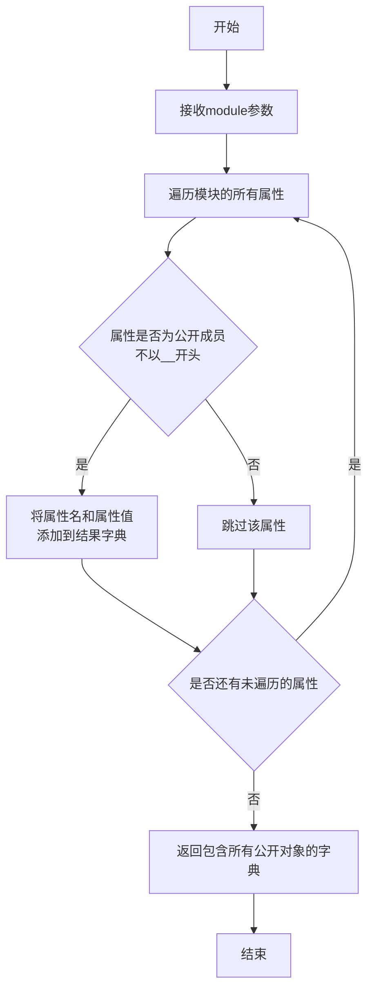
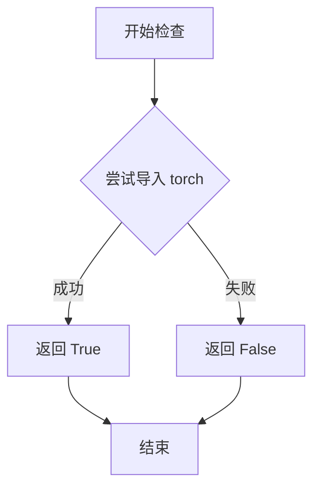
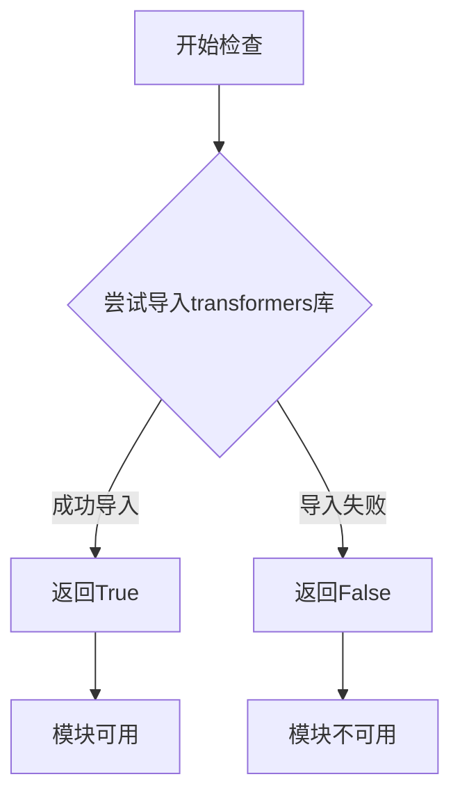

# `diffusers\src\diffusers\pipelines\animatediff\__init__.py` 详细设计文档

这是一个延迟加载的模块初始化文件，用于在Diffusers库中条件性地导入AnimateDiff相关的Pipeline类。该模块通过检查torch和transformers依赖的可用性，动态决定导入真实的Pipeline实现或虚拟的占位对象，从而实现了依赖的懒加载机制。

## 整体流程

```mermaid
graph TD
    A[模块加载] --> B{DIFFUSERS_SLOW_IMPORT or TYPE_CHECKING?}
    B -- 否 --> C[使用LazyModule机制]
    B -- 是 --> D{is_torch_available() && is_transformers_available()?}
    D -- 否 --> E[导入dummy虚拟对象]
    D -- 是 --> F[导入真实Pipeline类]
    C --> G[设置sys.modules为_LazyModule]
    E --> H[更新_dummy_objects并设置模块属性]
    F --> I[从子模块导入真实类]
```

## 类结构

```
AnimateDiffModule (延迟加载模块)
├── AnimateDiffPipeline (基础动画扩散Pipeline)
├── AnimateDiffControlNetPipeline (带ControlNet的动画Pipeline)
├── AnimateDiffSDXLPipeline (SDXL动画Pipeline)
├── AnimateDiffSparseControlNetPipeline (稀疏ControlNet动画Pipeline)
├── AnimateDiffVideoToVideoPipeline (视频转视频Pipeline)
└── AnimateDiffVideoToVideoControlNetPipeline (视频ControlNet Pipeline)
```

## 全局变量及字段


### `_dummy_objects`
    
存储虚拟对象的字典，用于在可选依赖不可用时提供替代品

类型：`dict`
    


### `_import_structure`
    
定义模块的导入结构，将模块名映射到可导出的对象列表

类型：`dict`
    


### `DIFFUSERS_SLOW_IMPORT`
    
标志位，控制是否使用延迟导入模式

类型：`bool`
    


### `OptionalDependencyNotAvailable`
    
可选依赖不可用时抛出的异常类

类型：`Exception`
    


### `_LazyModule`
    
延迟模块类，用于实现模块的延迟加载

类型：`type`
    


### `get_objects_from_module`
    
从指定模块中获取所有可导出对象的函数

类型：`function`
    


### `is_torch_available`
    
检查PyTorch是否可用的函数

类型：`function`
    


### `is_transformers_available`
    
检查Transformers库是否可用的函数

类型：`function`
    


    

## 全局函数及方法


### `get_objects_from_module`

从指定模块中提取所有对象（类、函数、变量），通常用于延迟加载机制中获取虚拟对象（dummy objects），以便在依赖不可用时保持模块接口完整性。

参数：

-  `module`：模块对象（module），需要从中提取所有导出对象的模块

返回值：`dict`，键为对象名称，值为对象本身，用于批量更新到 `_dummy_objects` 中

#### 流程图



#### 带注释源码

```python
# 该函数定义在 .../utils/__init__.py 或 utils 模块中
# 下面是基于代码用法的推断实现

def get_objects_from_module(module):
    """
    从给定模块中提取所有公开对象
    
    参数:
        module: Python模块对象
        
    返回:
        dict: 模块中所有公开对象的字典
    """
    objects = {}
    
    # 遍历模块的所有属性
    for attr_name in dir(module):
        # 过滤掉以双下划线开头的私有/特殊属性
        # 只保留公开的API（如类、函数、变量）
        if not attr_name.startswith('_'):
            attr_value = getattr(module, attr_name)
            objects[attr_name] = attr_value
    
    return objects


# 在当前文件中的实际使用方式：
# _dummy_objects = {}
# _dummy_objects.update(get_objects_from_module(dummy_torch_and_transformers_objects))
# 将模块中的所有虚拟对象添加到 _dummy_objects 字典中
# 后续通过 setattr(sys.modules[__name__], name, value) 动态绑定到当前模块
```

#### 补充说明

- **设计目标**：实现可选依赖的延迟加载，当 `torch` 或 `transformers` 不可用时，使用虚拟对象填充模块接口，避免导入错误
- **错误处理**：依赖于 `OptionalDependencyNotAvailable` 异常来判断依赖是否可用
- **外部依赖**：
  - `is_torch_available()`：检查 torch 是否可用
  - `is_transformers_available()`：检查 transformers 是否可用
- **数据流**：
  1. 尝试导入时检查依赖可用性
  2. 如果依赖不可用，从 `dummy_torch_and_transformers_objects` 模块获取虚拟对象
  3. 将虚拟对象注册到当前模块的 `_dummy_objects` 中
  4. 使用 `_LazyModule` 实现懒加载


### `is_torch_available`

检查当前 Python 环境中 PyTorch 库是否已安装且可用，用于条件导入和延迟加载相关模块。

参数：此函数无参数

返回值：`bool`，如果 PyTorch 可用返回 `True`，否则返回 `False`

#### 流程图



#### 带注释源码

```
# is_torch_available 函数的实现（在 ...utils 模块中定义）
# 以下为推断的实现方式

def is_torch_available() -> bool:
    """
    检查 PyTorch 库是否在当前环境中可用。
    
    此函数用于条件导入：
    - 当需要根据 torch 可用性决定是否加载某些模块时调用
    - 支持延迟加载（Lazy Loading）机制
    
    返回值:
        bool: 
            - True: torch 已安装且可导入
            - False: torch 未安装或无法导入
    """
    # 实现方式1：直接尝试导入
    try:
        import torch
        return True
    except ImportError:
        return False
    
    # 或实现方式2：检查已安装的包
    # import importlib.util
    # spec = importlib.util.find_spec("torch")
    # return spec is not None
```


### `is_transformers_available`

检查 Transformers 库是否已安装并可用，返回布尔值以决定是否加载相关的 Transformers 集成模块。

参数：
- 该函数不接受任何参数（无参数）

返回值：`bool`，返回 `True` 如果 Transformers 库可用，否则返回 `False`

#### 流程图



#### 带注释源码

```python
# is_transformers_available 函数的典型实现方式
# （该实现位于 ...utils 模块中，此处为推断的源码）

def is_transformers_available() -> bool:
    """
    检查 Transformers 库是否可用。
    
    该函数尝试导入 transformers 包，如果成功则返回 True，
    如果发生 ImportError 或任何其他异常则返回 False。
    
    Returns:
        bool: 如果 transformers 库已安装且可导入则返回 True，否则返回 False
    """
    try:
        # 尝试导入 transformers 库
        import transformers
        # 如果导入成功，返回 True
        return True
    except ImportError:
        # 如果导入失败（库未安装），返回 False
        return False
    except Exception:
        # 捕获其他可能的异常，返回 False
        return False


# 在当前代码中的实际使用方式：
# if not (is_transformers_available() and is_torch_available()):
#     raise OptionalDependencyNotAvailable()
```

> **注意**：由于 `is_transformers_available` 是从 `...utils` 导入的外部函数，上述源码为基于常见模式的推断实现。该函数的主要作用是在 `diffusers` 库的延迟加载机制中，检查可选依赖（Transformers 和 Torch）是否可用，以决定是否导入实际的管道类或使用虚拟对象（dummy objects）。

## 关键组件


### _dummy_objects

用于存储虚拟对象的字典，当torch或transformers可选依赖不可用时，这些虚拟对象将被设置到模块中，以保持API的一致性。

### _import_structure

定义模块的导入结构字典，包含可选的pipeline输出类以及在依赖可用时导出的各种AnimateDiff管道类。

### _LazyModule

延迟加载模块的封装类，用于实现Diffusers库的懒加载机制，提高导入速度并处理循环导入问题。

### AnimateDiffPipeline

AnimateDiff基础管道类，用于生成动画扩散模型输出，包含文本到视频的核心推理逻辑。

### AnimateDiffControlNetPipeline

结合ControlNet的AnimateDiff管道，支持通过控制网络引导动画生成，提供更精细的生成控制。

### AnimateDiffSDXLPipeline

基于Stable Diffusion XL的AnimateDiff管道，利用SDXL模型的高质量特性进行动画生成。

### AnimateDiffSparseControlNetPipeline

使用稀疏控制网络的AnimateDiff管道，通过稀疏采样减少计算开销同时保持控制能力。

### AnimateDiffVideoToVideoPipeline

视频到视频的AnimateDiff管道，将输入视频转换为动画风格，支持视频风格迁移。

### AnimateDiffVideoToVideoControlNetPipeline

结合ControlNet的视频到视频管道，提供基于控制网络的视频动画生成能力。

### AnimateDiffPipelineOutput

AnimateDiff管道的输出数据类，封装模型生成的动画结果。


## 问题及建议


### 已知问题

-   **重复的依赖检查逻辑**：代码在两处重复检查 `is_transformers_available() and is_torch_available()`，一处用于填充 `_import_structure`，另一处用于 `TYPE_CHECKING` 块，违反了 DRY 原则
-   **硬编码的依赖条件**：依赖检查条件被硬编码多次（至少3处），如需修改需同步更新多处
-   **缺少 `__spec__` 的空值检查**：代码使用 `module_spec=__spec__` 但未检查 `__spec__` 是否为 `None`，在某些动态导入场景下可能导致 `AttributeError`
-   **魔法字符串分散**：管道类名作为字符串字面量分散在 `_import_structure` 字典定义和后续的导入语句中，缺乏统一管理
-   **无版本兼容性检查**：仅检查依赖是否可用，未检查 torch 和 transformers 的版本是否与当前代码兼容
-   **模块重载潜在问题**：如果模块被重新加载，`_dummy_objects` 可能未正确清理，存在潜在的内存泄漏风险

### 优化建议

-   **提取依赖检查为常量或函数**：将依赖检查逻辑提取为模块级函数或布尔常量，例如 `_deps_available = is_transformers_available() and is_torch_available()`，在多处复用
-   **增加 `__spec__` 空值保护**：在使用 `__spec__` 前添加检查 `module_spec=__spec__ if __spec__ else None`
-   **集中管理导入结构**：考虑使用配置驱动的方式定义管道映射关系，减少硬编码字符串
-   **添加版本检查**：在依赖可用性检查后，增加版本兼容性验证逻辑
-   **实现模块清理机制**：在模块级别添加 `_reload` 或 `_cleanup` 函数，确保重载时正确清理旧状态
-   **使用枚举或常量类**：定义管道名称常量类，避免字符串散落各处


## 其它


### 设计目标与约束

本模块采用延迟加载（Lazy Loading）模式，主要目标是在保证功能完整性的同时最小化启动时的依赖加载。模块设计遵循以下约束：1）仅在torch和transformers都可用时才导入实际的pipeline类；2）使用_dummy_objects机制提供统一的导入接口，使得可选依赖不可用时模块仍可被导入；3）通过LazyModule实现按需加载，避免不必要的内存占用。

### 错误处理与异常设计

模块主要通过OptionalDependencyNotAvailable异常处理可选依赖。当torch或transformers任一不可用时，捕获该异常并使用dummy对象填充导入结构。_dummy_objects字典存储所有可能导出的类，在可选依赖不可用时通过setattr动态添加到sys.modules中，确保后续代码引用这些类时不会抛出ImportError。

### 数据流与状态机

本模块不涉及运行时数据流，其主要作用是管理模块加载状态。导入过程遵循以下状态转换：1）INITIAL状态：模块首次被导入，检查依赖可用性；2）DEPENDENCY_CHECK状态：验证torch和transformers是否可用；3）LAZY_MODE或EAGER_MODE状态：根据DIFFUSERS_SLOW_IMPORT标志决定立即导入或延迟加载；4）READY状态：完成模块初始化，sys.modules中注册LazyModule或实际对象。

### 外部依赖与接口契约

模块外部依赖包括：1）torch：深度学习框架基础依赖；2）transformers：Hugging Face Transformer模型库；3）diffusers.utils：提供_dummy_objects、_LazyModule、get_objects_from_module等工具函数。接口契约方面，本模块通过_import_structure字典定义可导出对象的结构，遵循diffusers框架的模块导入规范，所有pipeline类必须实现标准diffusers pipeline接口。

### 版本兼容性考虑

代码通过is_torch_available()和is_transformers_available()函数动态检测依赖版本兼容性，未硬编码特定版本要求。TYPE_CHECKING分支确保类型检查工具（如mypy）在缺少运行时依赖时仍能工作。建议在项目requirements中明确torch和transformers的最低版本要求以保证兼容性。

### 性能考虑

采用LazyModule延迟加载实际pipeline实现类，只有在真正访问模块属性时才触发导入。对于不支持的依赖组合，使用_dummy_objects避免每次访问时重复检查依赖。DIFFUSERS_SLOW_IMPORT标志允许在开发调试时禁用延迟加载以便于断点调试。

### 安全考虑

模块本身不涉及用户输入处理或网络请求，安全性主要依赖于依赖库（torch、transformers）的安全更新。建议定期更新依赖版本以获取安全补丁。

### 配置管理

模块通过_import_structure字典集中管理所有可导出项的配置，包含pipeline_output和pipeline_animatediff两个子模块分组。配置具有可扩展性，添加新pipeline只需在对应位置添加导入条目。

### 关键组件信息

| 组件名称 | 一句话描述 |
| --- | --- |
| _LazyModule | diffusers框架的延迟加载模块实现类 |
| get_objects_from_module | 从模块获取所有可导出对象的工具函数 |
| OptionalDependencyNotAvailable | 可选依赖不可用时的异常类 |
| _import_structure | 定义模块导入结构的字典变量 |
| _dummy_objects | 存储可选依赖不可用时的替代对象 |

### 潜在技术债务与优化空间

1. 重复的依赖检查代码出现在两处（try-except块和TYPE_CHECKING分支），可抽取为独立函数减少重复；2. 当前硬编码了6个pipeline类，扩展性较差，可考虑配置文件驱动；3. dummy对象的导入路径使用通配符导入（from...import *），不符合显式导入的Python最佳实践；4. 缺少对依赖版本范围的显式声明。

### 其它项目

本模块属于diffusers框架的AnimateDiff扩展，主要遵循diffusers库的模块组织规范。文档应说明与主diffusers库版本的兼容要求，以及各AnimateDiff pipeline的具体用途（文生视频、ControlNet控制、SDXL支持、视频到视频转换等）。

    