# `diffusers\src\diffusers\pipelines\animatediff\pipeline_animatediff.py` 详细设计文档

AnimateDiffPipeline是一个用于文本到视频生成的扩散Pipeline，它结合了Stable Diffusion模型和Motion Adapter，通过去噪过程将文本提示转换为动态视频，支持LoRA、IP-Adapter、FreeNoise等多种高级功能。

## 整体流程

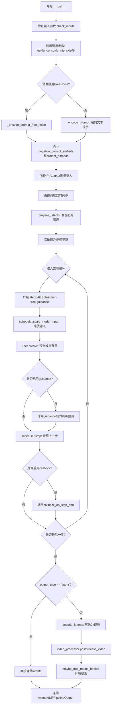

## 类结构

```
DiffusionPipeline (基类)
├── StableDiffusionMixin
├── TextualInversionLoaderMixin
├── IPAdapterMixin
├── StableDiffusionLoraLoaderMixin
├── FreeInitMixin
├── AnimateDiffFreeNoiseMixin (自定义)
├── FromSingleFileMixin
└── AnimateDiffPipeline (主类)
```

## 全局变量及字段


### `logger`
    
用于记录日志的logger实例

类型：`logging.Logger`
    


### `XLA_AVAILABLE`
    
标志位，指示torch_xla是否可用

类型：`bool`
    


### `EXAMPLE_DOC_STRING`
    
包含API使用示例的文档字符串

类型：`str`
    


### `AnimateDiffPipeline.vae`
    
用于将图像编码和解码到潜在表示的变分自编码器模型

类型：`AutoencoderKL`
    


### `AnimateDiffPipeline.text_encoder`
    
冻结的文本编码器，用于将文本提示转换为嵌入向量

类型：`CLIPTextModel`
    


### `AnimateDiffPipeline.tokenizer`
    
CLIP分词器，用于将文本 token 化

类型：`CLIPTokenizer`
    


### `AnimateDiffPipeline.unet`
    
用于去噪视频潜在表示的UNet模型

类型：`UNet2DConditionModel | UNetMotionModel`
    


### `AnimateDiffPipeline.motion_adapter`
    
运动适配器，用于为视频生成添加运动信息

类型：`MotionAdapter`
    


### `AnimateDiffPipeline.scheduler`
    
调度器，用于控制去噪过程中的噪声调度

类型：`SchedulerMixin`
    


### `AnimateDiffPipeline.feature_extractor`
    
CLIP图像处理器，用于预处理图像输入

类型：`CLIPImageProcessor`
    


### `AnimateDiffPipeline.image_encoder`
    
CLIP视觉编码器，用于处理IP Adapter图像

类型：`CLIPVisionModelWithProjection`
    


### `AnimateDiffPipeline.vae_scale_factor`
    
VAE缩放因子，用于计算潜在空间的分辨率

类型：`int`
    


### `AnimateDiffPipeline.video_processor`
    
视频处理器，用于视频的后处理和格式转换

类型：`VideoProcessor`
    


### `AnimateDiffPipeline.model_cpu_offload_seq`
    
模型CPU卸载顺序字符串

类型：`str`
    


### `AnimateDiffPipeline._optional_components`
    
可选组件列表，用于标识哪些模块是可选的

类型：`list`
    


### `AnimateDiffPipeline._callback_tensor_inputs`
    
回调函数可用的tensor输入列表

类型：`list`
    


### `AnimateDiffPipeline._guidance_scale`
    
分类器自由引导的guidance缩放因子

类型：`float`
    


### `AnimateDiffPipeline._clip_skip`
    
CLIP跳过的层数，用于控制文本嵌入的深度

类型：`int`
    


### `AnimateDiffPipeline._cross_attention_kwargs`
    
跨注意力机制的关键字参数

类型：`dict`
    


### `AnimateDiffPipeline._num_timesteps`
    
去噪过程的总时间步数

类型：`int`
    


### `AnimateDiffPipeline._interrupt`
    
中断标志，用于控制管道执行的中断

类型：`bool`
    
    

## 全局函数及方法


### `AnimateDiffPipeline.prepare_extra_step_kwargs`

该方法用于准备调度器（scheduler）的额外参数。由于不同调度器具有不同的签名，该方法通过检查调度器的 `step` 方法签名，动态确定是否接受 `eta` 和 `generator` 参数，并将其返回给调用者。

参数：

- `self`：`AnimateDiffPipeline` 类的实例，隐式参数
- `generator`：`torch.Generator | list[torch.Generator] | None`，用于生成随机数的生成器，用于控制生成过程的随机性
- `eta`：`float`，DDIM 调度器专用的参数 η，对应 DDIM 论文中的 η 参数，取值范围应为 [0, 1]

返回值：`dict`，包含调度器 `step` 方法所需额外参数的字典，可能包含 `eta` 和/或 `generator` 键

#### 流程图

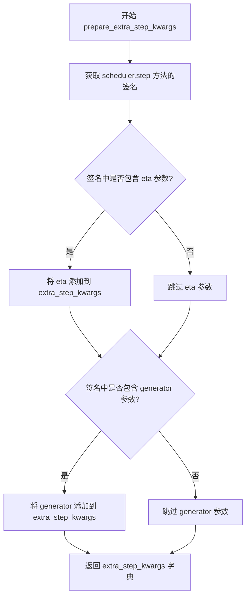

#### 带注释源码

```python
def prepare_extra_step_kwargs(self, generator, eta):
    """
    准备调度器的额外参数。

    由于并非所有调度器都具有相同的签名，这里需要检查调度器的 step 方法
    是否接受特定参数。eta (η) 仅在 DDIMScheduler 中使用，其他调度器会忽略该参数。
    eta 对应 DDIM 论文 (https://huggingface.co/papers/2010.02502) 中的参数，
    取值范围应为 [0, 1]。

    参数:
        generator: 可选的 torch.Generator，用于使生成过程可重现
        eta: DDIM 调度器的 eta 参数，范围 [0, 1]

    返回:
        包含调度器额外参数的字典
    """
    
    # 使用 inspect 模块获取 scheduler.step 方法的签名
    # inspect.signature() 返回一个 Signature 对象，包含方法的所有参数信息
    # .parameters 获取参数字典，.keys() 获取参数名列表
    accepts_eta = "eta" in set(inspect.signature(self.scheduler.step).parameters.keys())
    
    # 初始化空字典，用于存储额外参数
    extra_step_kwargs = {}
    
    # 如果调度器接受 eta 参数，则将其添加到 extra_step_kwargs
    # DDIMScheduler 使用 eta 来控制采样过程
    if accepts_eta:
        extra_step_kwargs["eta"] = eta

    # 检查调度器是否接受 generator 参数
    # 某些调度器（如 DPMSolverMultistepScheduler）支持使用生成器来控制随机性
    accepts_generator = "generator" in set(inspect.signature(self.scheduler.step).parameters.keys())
    
    # 如果调度器接受 generator 参数，则将其添加到 extra_step_kwargs
    if accepts_generator:
        extra_step_kwargs["generator"] = generator
    
    # 返回包含所有适用额外参数的字典
    return extra_step_kwargs
```


### `AnimateDiffPipeline`

这是 Hugging Face Diffusers 库中的一个文本到视频生成管道（Pipeline），通过结合 Stable Diffusion 模型和 Motion Adapter（运动适配器），实现基于文本提示生成动画视频的功能。该管道继承了多个混合类（Mixin），支持 LoRA、Textual Inversion、IP-Adapter、FreeInit、FreeNoise 等高级特性，能够处理条件和无条件生成、噪声调度、潜在编码解码等完整的扩散模型推理流程。

#### 流程图

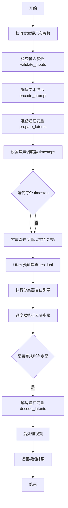

#### 带注释源码

```python
# 导入必要的模块和类
import inspect
from typing import Any, Callable

import torch
from transformers import CLIPImageProcessor, CLIPTextModel, CLIPTokenizer, CLIPVisionModelWithProjection

# 导入 Diffusers 库的相关模块
from ...image_processor import PipelineImageInput
from ...loaders import FromSingleFileMixin, IPAdapterMixin, StableDiffusionLoraLoaderMixin, TextualInversionLoaderMixin
from ...models import AutoencoderKL, ImageProjection, UNet2DConditionModel, UNetMotionModel
from ...models.lora import adjust_lora_scale_text_encoder
from ...models.unets.unet_motion_model import MotionAdapter
from ...schedulers import (
    DDIMScheduler,
    DPMSolverMultistepScheduler,
    EulerAncestralDiscreteScheduler,
    EulerDiscreteScheduler,
    LMSDiscreteScheduler,
    PNDMScheduler,
)
from ...utils import (
    USE_PEFT_BACKEND,
    deprecate,
    is_torch_xla_available,
    logging,
    replace_example_docstring,
    scale_lora_layers,
    unscale_lora_layers,
)
from ...utils.torch_utils import randn_tensor
from ...video_processor import VideoProcessor
from ..free_init_utils import FreeInitMixin
from ..free_noise_utils import AnimateDiffFreeNoiseMixin
from ..pipeline_utils import DiffusionPipeline, StableDiffusionMixin
from .pipeline_output import AnimateDiffPipelineOutput

# 检查是否支持 PyTorch XLA
if is_torch_xla_available():
    import torch_xla.core.xla_model as xm
    XLA_AVAILABLE = True
else:
    XLA_AVAILABLE = False

logger = logging.get_logger(__name__)


# 示例文档字符串
EXAMPLE_DOC_STRING = """
    Examples:
        ```py
        >>> import torch
        >>> from diffusers import MotionAdapter, AnimateDiffPipeline, DDIMScheduler
        >>> from diffusers.utils import export_to_gif

        >>> adapter = MotionAdapter.from_pretrained("guoyww/animatediff-motion-adapter-v1-5-2")
        >>> pipe = AnimateDiffPipeline.from_pretrained("frankjoshua/toonyou_beta6", motion_adapter=adapter)
        >>> pipe.scheduler = DDIMScheduler(beta_schedule="linear", steps_offset=1, clip_sample=False)
        >>> output = pipe(prompt="A corgi walking in the park")
        >>> frames = output.frames[0]
        >>> export_to_gif(frames, "animation.gif")
        ```
"""


# AnimateDiffPipeline 类定义
# 继承自多个混合类以支持多种功能
class AnimateDiffPipeline(
    DiffusionPipeline,                    # 基础扩散管道
    StableDiffusionMixin,                 # Stable Diffusion 混合功能
    TextualInversionLoaderMixin,          # 文本反转加载
    IPAdapterMixin,                       # IP 适配器
    StableDiffusionLoraLoaderMixin,       # LoRA 加载
    FreeInitMixin,                        # 自由初始化
    AnimateDiffFreeNoiseMixin,           # 自由噪声
    FromSingleFileMixin,                  # 单文件加载
):
    r"""
    Pipeline for text-to-video generation.

    This model inherits from [`DiffusionPipeline`]. Check the superclass documentation for the generic methods
    implemented for all pipelines (downloading, saving, running on a particular device, etc.).

    The pipeline also inherits the following loading methods:
        - [`~loaders.TextualInversionLoaderMixin.load_textual_inversion`] for loading textual inversion embeddings
        - [`~loaders.StableDiffusionLoraLoaderMixin.load_lora_weights`] for loading LoRA weights
        - [`~loaders.StableDiffusionLoraLoaderMixin.save_lora_weights`] for saving LoRA weights
        - [`~loaders.IPAdapterMixin.load_ip_adapter`] for loading IP Adapters

    Args:
        vae ([`AutoencoderKL`]):
            Variational Auto-Encoder (VAE) Model to encode and decode images to and from latent representations.
        text_encoder ([`CLIPTextModel`]):
            Frozen text-encoder ([clip-vit-large-patch14](https://huggingface.co/openai/clip-vit-large-patch14)).
        tokenizer (`CLIPTokenizer`):
            A [`~transformers.CLIPTokenizer`] to tokenize text.
        unet ([`UNet2DConditionModel`]):
            A [`UNet2DConditionModel`] used to create a UNetMotionModel to denoise the encoded video latents.
        motion_adapter ([`MotionAdapter`]):
            A [`MotionAdapter`] to be used in combination with `unet` to denoise the encoded video latents.
        scheduler ([`SchedulerMixin`]):
            A scheduler to be used in combination with `unet` to denoise the encoded image latents. Can be one of
            [`DDIMScheduler`], [`LMSDiscreteScheduler`], or [`PNDMScheduler`].
    """

    # 模型卸载顺序
    model_cpu_offload_seq = "text_encoder->image_encoder->unet->vae"
    
    # 可选组件
    _optional_components = ["feature_extractor", "image_encoder", "motion_adapter"]
    
    # 回调张量输入
    _callback_tensor_inputs = ["latents", "prompt_embeds", "negative_prompt_embeds"]

    def __init__(
        self,
        vae: AutoencoderKL,
        text_encoder: CLIPTextModel,
        tokenizer: CLIPTokenizer,
        unet: UNet2DConditionModel | UNetMotionModel,
        motion_adapter: MotionAdapter,
        scheduler: DDIMScheduler
        | PNDMScheduler
        | LMSDiscreteScheduler
        | EulerDiscreteScheduler
        | EulerAncestralDiscreteScheduler
        | DPMSolverMultistepScheduler,
        feature_extractor: CLIPImageProcessor = None,
        image_encoder: CLIPVisionModelWithProjection = None,
    ):
        """初始化管道"""
        super().__init__()
        
        # 如果传入的是 UNet2DConditionModel，则将其转换为 UNetMotionModel
        if isinstance(unet, UNet2DConditionModel):
            unet = UNetMotionModel.from_unet2d(unet, motion_adapter)

        # 注册所有模块
        self.register_modules(
            vae=vae,
            text_encoder=text_encoder,
            tokenizer=tokenizer,
            unet=unet,
            motion_adapter=motion_adapter,
            scheduler=scheduler,
            feature_extractor=feature_extractor,
            image_encoder=image_encoder,
        )
        
        # 计算 VAE 缩放因子
        self.vae_scale_factor = 2 ** (len(self.vae.config.block_out_channels) - 1) if getattr(self, "vae", None) else 8
        
        # 创建视频处理器
        self.video_processor = VideoProcessor(do_resize=False, vae_scale_factor=self.vae_scale_factor)

    # 从 StableDiffusionPipeline 复制的编码提示方法
    def encode_prompt(
        self,
        prompt,                              # 提示词 (str 或 list)
        device,                              # 设备 (torch.device)
        num_images_per_prompt,              # 每个提示生成的图像数量
        do_classifier_free_guidance,        # 是否使用分类器自由引导
        negative_prompt=None,               # 负面提示词
        prompt_embeds: torch.Tensor | None = None,    # 预生成的提示嵌入
        negative_prompt_embeds: torch.Tensor | None = None,  # 预生成的负面嵌入
        lora_scale: float | None = None,    # LoRA 缩放因子
        clip_skip: int | None = None,       # CLIP 跳过的层数
    ):
        r"""
        Encodes the prompt into text encoder hidden states.

        Args:
            prompt (`str` or `list[str]`, *optional*):
                prompt to be encoded
            device: (`torch.device`):
                torch device
            num_images_per_prompt (`int`):
                number of images that should be generated per prompt
            do_classifier_free_guidance (`bool`):
                whether to use classifier free guidance or not
            negative_prompt (`str` or `list[str]`, *optional*):
                The prompt or prompts not to guide the image generation. If not defined, one has to pass
                `negative_prompt_embeds` instead. Ignored when not using guidance (i.e., ignored if `guidance_scale` is
                less than `1`).
            prompt_embeds (`torch.Tensor`, *optional*):
                Pre-generated text embeddings. Can be used to easily tweak text inputs, *e.g.* prompt weighting. If not
                provided, text embeddings will be generated from `prompt` input argument.
            negative_prompt_embeds (`torch.Tensor`, *optional*):
                Pre-generated negative text embeddings. Can be used to easily tweak text inputs, *e.g.* prompt
                weighting. If not provided, negative_prompt_embeds will be generated from `negative_prompt` input
                argument.
            lora_scale (`float`, *optional*):
                A LoRA scale that will be applied to all LoRA layers of the text encoder if LoRA layers are loaded.
            clip_skip (`int`, *optional*):
                Number of layers to be skipped from CLIP while computing the prompt embeddings. A value of 1 means that
                the output of the pre-final layer will be used for computing the prompt embeddings.
        """
        # 设置 LoRA 缩放因子，以便文本编码器的 LoRA 函数可以正确访问
        if lora_scale is not None and isinstance(self, StableDiffusionLoraLoaderMixin):
            self._lora_scale = lora_scale

            # 动态调整 LoRA 缩放
            if not USE_PEFT_BACKEND:
                adjust_lora_scale_text_encoder(self.text_encoder, lora_scale)
            else:
                scale_lora_layers(self.text_encoder, lora_scale)

        # 确定批次大小
        if prompt is not None and isinstance(prompt, str):
            batch_size = 1
        elif prompt is not None and isinstance(prompt, list):
            batch_size = len(prompt)
        else:
            batch_size = prompt_embeds.shape[0]

        # 如果未提供提示嵌入，则生成
        if prompt_embeds is None:
            # 文本反转：必要时处理多向量标记
            if isinstance(self, TextualInversionLoaderMixin):
                prompt = self.maybe_convert_prompt(prompt, self.tokenizer)

            # 对文本进行 tokenize
            text_inputs = self.tokenizer(
                prompt,
                padding="max_length",
                max_length=self.tokenizer.model_max_length,
                truncation=True,
                return_tensors="pt",
            )
            text_input_ids = text_inputs.input_ids
            
            # 获取未截断的标记 ID（用于检测截断）
            untruncated_ids = self.tokenizer(prompt, padding="longest", return_tensors="pt").input_ids

            # 检查是否发生了截断
            if untruncated_ids.shape[-1] >= text_input_ids.shape[-1] and not torch.equal(
                text_input_ids, untruncated_ids
            ):
                removed_text = self.tokenizer.batch_decode(
                    untruncated_ids[:, self.tokenizer.model_max_length - 1 : -1]
                )
                logger.warning(
                    "The following part of your input was truncated because CLIP can only handle sequences up to"
                    f" {self.tokenizer.model_max_length} tokens: {removed_text}"
                )

            # 获取注意力掩码
            if hasattr(self.text_encoder.config, "use_attention_mask") and self.text_encoder.config.use_attention_mask:
                attention_mask = text_inputs.attention_mask.to(device)
            else:
                attention_mask = None

            # 编码文本
            if clip_skip is None:
                prompt_embeds = self.text_encoder(text_input_ids.to(device), attention_mask=attention_mask)
                prompt_embeds = prompt_embeds[0]
            else:
                prompt_embeds = self.text_encoder(
                    text_input_ids.to(device), attention_mask=attention_mask, output_hidden_states=True
                )
                # 访问 hidden_states，获取编码器所有层的隐藏状态
                prompt_embeds = prompt_embeds[-1][-(clip_skip + 1)]
                # 应用最终的 LayerNorm
                prompt_embeds = self.text_encoder.text_model.final_layer_norm(prompt_embeds)

        # 确定数据类型
        if self.text_encoder is not None:
            prompt_embeds_dtype = self.text_encoder.dtype
        elif self.unet is not None:
            prompt_embeds_dtype = self.unet.dtype
        else:
            prompt_embeds_dtype = prompt_embeds.dtype

        # 转换到正确的设备和数据类型
        prompt_embeds = prompt_embeds.to(dtype=prompt_embeds_dtype, device=device)

        # 重复嵌入以匹配每个提示的生成数量
        bs_embed, seq_len, _ = prompt_embeds.shape
        prompt_embeds = prompt_embeds.repeat(1, num_images_per_prompt, 1)
        prompt_embeds = prompt_embeds.view(bs_embed * num_images_per_prompt, seq_len, -1)

        # 获取分类器自由引导的无条件嵌入
        if do_classifier_free_guidance and negative_prompt_embeds is None:
            uncond_tokens: list[str]
            if negative_prompt is None:
                uncond_tokens = [""] * batch_size
            elif prompt is not None and type(prompt) is not type(negative_prompt):
                raise TypeError(
                    f"`negative_prompt` should be the same type to `prompt`, but got {type(negative_prompt)} !="
                    f" {type(prompt)}."
                )
            elif isinstance(negative_prompt, str):
                uncond_tokens = [negative_prompt]
            elif batch_size != len(negative_prompt):
                raise ValueError(
                    f"`negative_prompt`: {negative_prompt} has batch size {len(negative_prompt)}, but `prompt`:"
                    f" {prompt} has batch size {batch_size}. Please make sure that passed `negative_prompt` matches"
                    " the batch size of `prompt`."
                )
            else:
                uncond_tokens = negative_prompt

            # 文本反转：必要时处理多向量标记
            if isinstance(self, TextualInversionLoaderMixin):
                uncond_tokens = self.maybe_convert_prompt(uncond_tokens, self.tokenizer)

            max_length = prompt_embeds.shape[1]
            uncond_input = self.tokenizer(
                uncond_tokens,
                padding="max_length",
                max_length=max_length,
                truncation=True,
                return_tensors="pt",
            )

            if hasattr(self.text_encoder.config, "use_attention_mask") and self.text_encoder.config.use_attention_mask:
                attention_mask = uncond_input.attention_mask.to(device)
            else:
                attention_mask = None

            # 编码无条件文本
            negative_prompt_embeds = self.text_encoder(
                uncond_input.input_ids.to(device),
                attention_mask=attention_mask,
            )
            negative_prompt_embeds = negative_prompt_embeds[0]

        # 处理分类器自由引导
        if do_classifier_free_guidance:
            seq_len = negative_prompt_embeds.shape[1]

            negative_prompt_embeds = negative_prompt_embeds.to(dtype=prompt_embeds_dtype, device=device)

            # 重复无条件嵌入
            negative_prompt_embeds = negative_prompt_embeds.repeat(1, num_images_per_prompt, 1)
            negative_prompt_embeds = negative_prompt_embeds.view(batch_size * num_images_per_prompt, seq_len, -1)

        # 如果使用了 LoRA，恢复原始缩放
        if self.text_encoder is not None:
            if isinstance(self, StableDiffusionLoraLoaderMixin) and USE_PEFT_BACKEND:
                unscale_lora_layers(self.text_encoder, lora_scale)

        return prompt_embeds, negative_prompt_embeds

    def encode_image(self, image, device, num_images_per_prompt, output_hidden_states=None):
        """编码图像为嵌入向量"""
        dtype = next(self.image_encoder.parameters()).dtype

        # 如果图像不是张量，则使用特征提取器处理
        if not isinstance(image, torch.Tensor):
            image = self.feature_extractor(image, return_tensors="pt").pixel_values

        image = image.to(device=device, dtype=dtype)
        
        if output_hidden_states:
            # 获取隐藏状态
            image_enc_hidden_states = self.image_encoder(image, output_hidden_states=True).hidden_states[-2]
            image_enc_hidden_states = image_enc_hidden_states.repeat_interleave(num_images_per_prompt, dim=0)
            uncond_image_enc_hidden_states = self.image_encoder(
                torch.zeros_like(image), output_hidden_states=True
            ).hidden_states[-2]
            uncond_image_enc_hidden_states = uncond_image_enc_hidden_states.repeat_interleave(
                num_images_per_prompt, dim=0
            )
            return image_enc_hidden_states, uncond_image_enc_hidden_states
        else:
            # 获取图像嵌入
            image_embeds = self.image_encoder(image).image_embeds
            image_embeds = image_embeds.repeat_interleave(num_images_per_prompt, dim=0)
            uncond_image_embeds = torch.zeros_like(image_embeds)

            return image_embeds, uncond_image_embeds

    def prepare_ip_adapter_image_embeds(
        self, ip_adapter_image, ip_adapter_image_embeds, device, num_images_per_prompt, do_classifier_free_guidance
    ):
        """准备 IP 适配器的图像嵌入"""
        image_embeds = []
        if do_classifier_free_guidance:
            negative_image_embeds = []
            
        if ip_adapter_image_embeds is None:
            if not isinstance(ip_adapter_image, list):
                ip_adapter_image = [ip_adapter_image]

            if len(ip_adapter_image) != len(self.unet.encoder_hid_proj.image_projection_layers):
                raise ValueError(
                    f"`ip_adapter_image` must have same length as the number of IP Adapters. Got {len(ip_adapter_image)} images and {len(self.unet.encoder_hid_proj.image_projection_layers)} IP Adapters."
                )

            for single_ip_adapter_image, image_proj_layer in zip(
                ip_adapter_image, self.unet.encoder_hid_proj.image_projection_layers
            ):
                output_hidden_state = not isinstance(image_proj_layer, ImageProjection)
                single_image_embeds, single_negative_image_embeds = self.encode_image(
                    single_ip_adapter_image, device, 1, output_hidden_state
                )

                image_embeds.append(single_image_embeds[None, :])
                if do_classifier_free_guidance:
                    negative_image_embeds.append(single_negative_image_embeds[None, :])
        else:
            for single_image_embeds in ip_adapter_image_embeds:
                if do_classifier_free_guidance:
                    single_negative_image_embeds, single_image_embeds = single_image_embeds.chunk(2)
                    negative_image_embeds.append(single_negative_image_embeds)
                image_embeds.append(single_image_embeds)

        # 处理每个提示的图像嵌入
        ip_adapter_image_embeds = []
        for i, single_image_embeds in enumerate(image_embeds):
            single_image_embeds = torch.cat([single_image_embeds] * num_images_per_prompt, dim=0)
            if do_classifier_free_guidance:
                single_negative_image_embeds = torch.cat([negative_image_embeds[i]] * num_images_per_prompt, dim=0)
                single_image_embeds = torch.cat([single_negative_image_embeds, single_image_embeds], dim=0)

            single_image_embeds = single_image_embeds.to(device=device)
            ip_adapter_image_embeds.append(single_image_embeds)

        return ip_adapter_image_embeds

    def decode_latents(self, latents, decode_chunk_size: int = 16):
        """将潜在变量解码为视频"""
        latents = 1 / self.vae.config.scaling_factor * latents

        batch_size, channels, num_frames, height, width = latents.shape
        # 重新排列维度以进行解码
        latents = latents.permute(0, 2, 1, 3, 4).reshape(batch_size * num_frames, channels, height, width)

        video = []
        # 分块解码
        for i in range(0, latents.shape[0], decode_chunk_size):
            batch_latents = latents[i : i + decode_chunk_size]
            batch_latents = self.vae.decode(batch_latents).sample
            video.append(batch_latents)

        video = torch.cat(video)
        # 重新塑造成视频格式
        video = video[None, :].reshape((batch_size, num_frames, -1) + video.shape[2:]).permute(0, 2, 1, 3, 4)
        # 转换为 float32 以避免显著开销并与 bfloat16 兼容
        video = video.float()
        return video

    def prepare_extra_step_kwargs(self, generator, eta):
        """准备调度器的额外参数"""
        # 检查调度器是否接受 eta 参数
        accepts_eta = "eta" in set(inspect.signature(self.scheduler.step).parameters.keys())
        extra_step_kwargs = {}
        if accepts_eta:
            extra_step_kwargs["eta"] = eta

        # 检查调度器是否接受 generator
        accepts_generator = "generator" in set(inspect.signature(self.scheduler.step).parameters.keys())
        if accepts_generator:
            extra_step_kwargs["generator"] = generator
        return extra_step_kwargs

    def check_inputs(self, ...):
        """检查输入参数的有效性"""
        # 验证高度和宽度是否为 8 的倍数
        if height % 8 != 0 or width % 8 != 0:
            raise ValueError(f"`height` and `width` have to be divisible by 8 but are {height} and {width}.")
        # ... 更多验证逻辑

    def prepare_latents(self, batch_size, num_channels_latents, num_frames, height, width, dtype, device, generator, latents=None):
        """准备潜在变量"""
        # 如果启用了 FreeNoise，使用特殊方法生成潜在变量
        if self.free_noise_enabled:
            latents = self._prepare_latents_free_noise(...)

        # 验证生成器数量
        if isinstance(generator, list) and len(generator) != batch_size:
            raise ValueError(...)

        # 计算潜在变量形状
        shape = (
            batch_size,
            num_channels_latents,
            num_frames,
            height // self.vae_scale_factor,
            width // self.vae_scale_factor,
        )

        # 生成或使用提供的潜在变量
        if latents is None:
            latents = randn_tensor(shape, generator=generator, device=device, dtype=dtype)
        else:
            latents = latents.to(device)

        # 使用调度器的初始噪声标准差缩放
        latents = latents * self.scheduler.init_noise_sigma
        return latents

    # 属性定义
    @property
    def guidance_scale(self):
        return self._guidance_scale

    @property
    def clip_skip(self):
        return self._clip_skip

    @property
    def do_classifier_free_guidance(self):
        return self._guidance_scale > 1

    @property
    def cross_attention_kwargs(self):
        return self._cross_attention_kwargs

    @property
    def num_timesteps(self):
        return self._num_timesteps

    @property
    def interrupt(self):
        return self._interrupt

    # 主调用方法
    @torch.no_grad()
    @replace_example_docstring(EXAMPLE_DOC_STRING)
    def __call__(
        self,
        prompt: str | list[str] | None = None,
        num_frames: int | None = 16,
        height: int | None = None,
        width: int | None = None,
        num_inference_steps: int = 50,
        guidance_scale: float = 7.5,
        negative_prompt: str | list[str] | None = None,
        num_videos_per_prompt: int | None = 1,
        eta: float = 0.0,
        generator: torch.Generator | list[torch.Generator] | None = None,
        latents: torch.Tensor | None = None,
        prompt_embeds: torch.Tensor | None = None,
        negative_prompt_embeds: torch.Tensor | None = None,
        ip_adapter_image: PipelineImageInput | None = None,
        ip_adapter_image_embeds: list[torch.Tensor] | None = None,
        output_type: str | None = "pil",
        return_dict: bool = True,
        cross_attention_kwargs: dict[str, Any] | None = None,
        clip_skip: int | None = None,
        callback_on_step_end: Callable[[int, int], None] | None = None,
        callback_on_step_end_tensor_inputs: list[str] = ["latents"],
        decode_chunk_size: int = 16,
        **kwargs,
    ):
        r"""
        The call function to the pipeline for generation.

        Args:
            prompt (`str` or `list[str]`, *optional*):
                The prompt or prompts to guide image generation. If not defined, you need to pass `prompt_embeds`.
            height (`int`, *optional*, defaults to `self.unet.config.sample_size * self.vae_scale_factor`):
                The height in pixels of the generated video.
            width (`int`, *optional*, defaults to `self.unet.config.sample_size * self.vae_scale_factor`):
                The width in pixels of the generated video.
            num_frames (`int`, *optional*, defaults to 16):
                The number of video frames that are generated.
            num_inference_steps (`int`, *optional*, defaults to 50):
                The number of denoising steps.
            guidance_scale (`float`, *optional*, defaults to 7.5):
                A higher guidance scale value encourages the model to generate images closely linked to the text
                `prompt` at the expense of lower image quality.
            negative_prompt (`str` or `list[str]`, *optional*):
                The prompt or prompts to guide what to not include in image generation.
            eta (`float`, *optional*, defaults to 0.0):
                Corresponds to parameter eta (η) from the DDIM paper.
            generator (`torch.Generator` or `list[torch.Generator]`, *optional*):
                A torch.Generator to make generation deterministic.
            latents (`torch.Tensor`, *optional*):
                Pre-generated noisy latents sampled from a Gaussian distribution.
            prompt_embeds (`torch.Tensor`, *optional*):
                Pre-generated text embeddings.
            negative_prompt_embeds (`torch.Tensor`, *optional*):
                Pre-generated negative text embeddings.
            ip_adapter_image: (`PipelineImageInput`, *optional*):
                Optional image input to work with IP Adapters.
            ip_adapter_image_embeds (`list[torch.Tensor]`, *optional*):
                Pre-generated image embeddings for IP-Adapter.
            output_type (`str`, *optional*, defaults to `"pil"`):
                The output format of the generated video.
            return_dict (`bool`, *optional*, defaults to `True`):
                Whether or not to return a AnimateDiffPipelineOutput instead of a plain tuple.
            cross_attention_kwargs (`dict`, *optional*):
                A kwargs dictionary passed along to the AttentionProcessor.
            clip_skip (`int`, *optional*):
                Number of layers to be skipped from CLIP while computing the prompt embeddings.
            callback_on_step_end (`Callable`, *optional*):
                A function that calls at the end of each denoising steps during the inference.
            callback_on_step_end_tensor_inputs (`list`, *optional*):
                The list of tensor inputs for the callback_on_step_end function.
            decode_chunk_size (`int`, defaults to `16`):
                The number of frames to decode at a time when calling decode_latents method.

        Returns:
            [`~pipelines.animatediff.pipeline_output.AnimateDiffPipelineOutput`] or `tuple`:
                If `return_dict` is `True`, AnimateDiffPipelineOutput is returned.
        """

        # 处理回调参数（已弃用）
        callback = kwargs.pop("callback", None)
        callback_steps = kwargs.pop("callback_steps", None)

        # 0. 默认高度和宽度
        height = height or self.unet.config.sample_size * self.vae_scale_factor
        width = width or self.unet.config.sample_size * self.vae_scale_factor

        num_videos_per_prompt = 1

        # 1. 检查输入
        self.check_inputs(...)

        # 设置内部状态
        self._guidance_scale = guidance_scale
        self._clip_skip = clip_skip
        self._cross_attention_kwargs = cross_attention_kwargs
        self._interrupt = False

        # 2. 定义调用参数
        if prompt is not None and isinstance(prompt, (str, dict)):
            batch_size = 1
        elif prompt is not None and isinstance(prompt, list):
            batch_size = len(prompt)
        else:
            batch_size = prompt_embeds.shape[0]

        device = self._execution_device

        # 3. 编码输入提示
        text_encoder_lora_scale = (
            self.cross_attention_kwargs.get("scale", None) if self.cross_attention_kwargs is not None else None
        )
        
        # 根据是否启用 free_noise 选择编码方法
        if self.free_noise_enabled:
            prompt_embeds, negative_prompt_embeds = self._encode_prompt_free_noise(...)
        else:
            prompt_embeds, negative_prompt_embeds = self.encode_prompt(...)

            # 分类器自由引导：连接无条件和有条件嵌入
            if self.do_classifier_free_guidance:
                prompt_embeds = torch.cat([negative_prompt_embeds, prompt_embeds])

            # 为每个视频帧重复嵌入
            prompt_embeds = prompt_embeds.repeat_interleave(repeats=num_frames, dim=0)

        # 4. 准备 IP 适配器图像嵌入
        if ip_adapter_image is not None or ip_adapter_image_embeds is not None:
            image_embeds = self.prepare_ip_adapter_image_embeds(...)

        # 5. 准备时间步
        self.scheduler.set_timesteps(num_inference_steps, device=device)
        timesteps = self.scheduler.timesteps

        # 6. 准备潜在变量
        num_channels_latents = self.unet.config.in_channels
        latents = self.prepare_latents(...)

        # 7. 准备额外步骤参数
        extra_step_kwargs = self.prepare_extra_step_kwargs(generator, eta)

        # 8. 添加图像嵌入（IP-Adapter）
        added_cond_kwargs = (
            {"image_embeds": image_embeds}
            if ip_adapter_image is not None or ip_adapter_image_embeds is not None
            else None
        )

        # 9. 去噪循环
        num_free_init_iters = self._free_init_num_iters if self.free_init_enabled else 1
        for free_init_iter in range(num_free_init_iters):
            if self.free_init_enabled:
                latents, timesteps = self._apply_free_init(...)

            self._num_timesteps = len(timesteps)
            num_warmup_steps = len(timesteps) - num_inference_steps * self.scheduler.order

            # 迭代去噪
            with self.progress_bar(total=self._num_timesteps) as progress_bar:
                for i, t in enumerate(timesteps):
                    if self.interrupt:
                        continue

                    # 扩展潜在变量（分类器自由引导）
                    latent_model_input = torch.cat([latents] * 2) if self.do_classifier_free_guidance else latents
                    latent_model_input = self.scheduler.scale_model_input(latent_model_input, t)

                    # 预测噪声残差
                    noise_pred = self.unet(
                        latent_model_input,
                        t,
                        encoder_hidden_states=prompt_embeds,
                        cross_attention_kwargs=cross_attention_kwargs,
                        added_cond_kwargs=added_cond_kwargs,
                    ).sample

                    # 执行分类器自由引导
                    if self.do_classifier_free_guidance:
                        noise_pred_uncond, noise_pred_text = noise_pred.chunk(2)
                        noise_pred = noise_pred_uncond + guidance_scale * (noise_pred_text - noise_pred_uncond)

                    # 计算上一步的噪声样本
                    latents = self.scheduler.step(noise_pred, t, latents, **extra_step_kwargs).prev_sample

                    # 步骤结束回调
                    if callback_on_step_end is not None:
                        callback_kwargs = {}
                        for k in callback_on_step_end_tensor_inputs:
                            callback_kwargs[k] = locals()[k]
                        callback_outputs = callback_on_step_end(self, i, t, callback_kwargs)
                        # 更新变量
                        latents = callback_outputs.pop("latents", latents)
                        prompt_embeds = callback_outputs.pop("prompt_embeds", prompt_embeds)
                        negative_prompt_embeds = callback_outputs.pop("negative_prompt_embeds", negative_prompt_embeds)

                    # 进度更新
                    if i == len(timesteps) - 1 or ((i + 1) > num_warmup_steps and (i + 1) % self.scheduler.order == 0):
                        progress_bar.update()
                        if callback is not None and i % callback_steps == 0:
                            callback(i, t, latents)

                    # XLA 支持
                    if XLA_AVAILABLE:
                        xm.mark_step()

        # 10. 后处理
        if output_type == "latent":
            video = latents
        else:
            video_tensor = self.decode_latents(latents, decode_chunk_size)
            video = self.video_processor.postprocess_video(video=video_tensor, output_type=output_type)

        # 11. 卸载所有模型
        self.maybe_free_model_hooks()

        if not return_dict:
            return (video,)

        return AnimateDiffPipelineOutput(frames=video)
```


### CLIPImageProcessor

CLIP图像处理器，用于将图像转换为CLIP模型所需的格式。

参数：

- `images`：输入图像，支持多种格式（PIL.Image, numpy.ndarray, torch.Tensor等）
- `return_tensors`：返回的张量类型，可选"pt"返回PyTorch张量

返回值：`dict`，包含处理后的图像像素值

#### 流程图

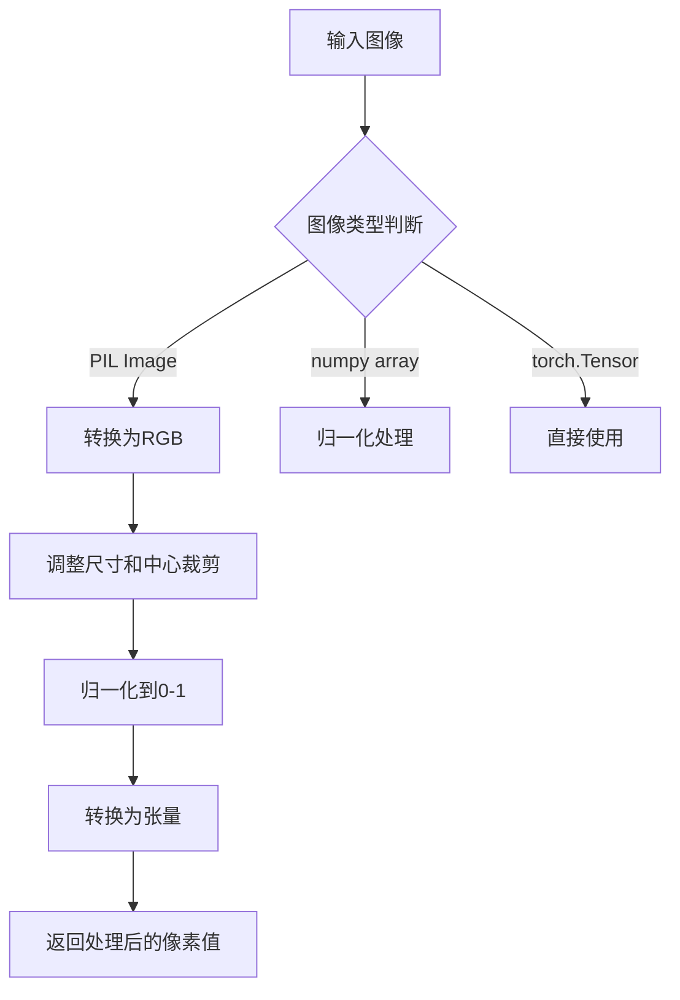

#### 带注释源码

```python
# CLIPImageProcessor 来自 transformers 库
# 用于将各种格式的图像预处理为 CLIP 模型可接受的输入格式
# 主要功能包括：尺寸调整、中心裁剪、归一化等
from transformers import CLIPImageProcessor

# 使用示例：
# processor = CLIPImageProcessor.from_pretrained("openai/clip-vit-large-patch14")
# pixel_values = processor(images, return_tensors="pt").pixel_values
```

---

### CLIPTextModel

CLIP文本编码器模型，将文本输入转换为文本嵌入向量，用于文本到图像的生成任务。

参数：

- `input_ids`：文本输入的token IDs，形状为`(batch_size, sequence_length)`
- `attention_mask`：注意力掩码，指示哪些位置是真实的token
- `output_hidden_states`：是否返回所有隐藏状态
- `return_dict`：是否返回字典格式的输出

返回值：`CLIPTextModelOutput`或`tuple`，包含文本嵌入和可选的隐藏状态

#### 流程图

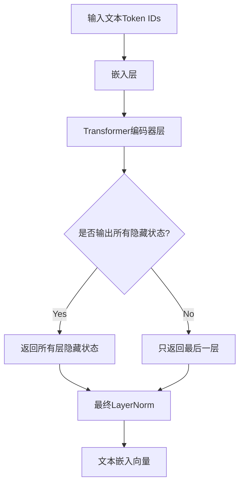

#### 带注释源码

```python
# CLIPTextModel 来自 transformers 库
# 用于将文本编码为 CLIP 模型的文本嵌入
# 该模型基于 Transformer 架构
from transformers import CLIPTextModel

# 使用示例：
# text_encoder = CLIPTextModel.from_pretrained("openai/clip-vit-large-patch14")
# text_embeddings = text_encoder(input_ids)[0]  # 获取最后一层的隐藏状态
```

---

### CLIPTokenizer

CLIP分词器，用于将文本分割成模型可处理的token序列。

参数：

- `text`：待分词的文本，可以是字符串或字符串列表
- `padding`：填充方式，可选"max_length"、"longest"或False
- `max_length`：最大序列长度
- `truncation`：是否截断过长的序列
- `return_tensors`：返回的张量类型，可选"pt"返回PyTorch张量

返回值：`BatchEncoding`，包含input_ids、attention_mask等

#### 流程图

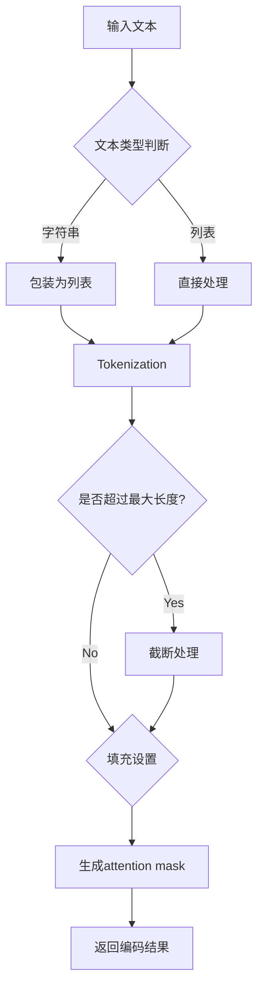

#### 带注释源码

```python
# CLIPTokenizer 来自 transformers 库
# 基于 BPE 的分词器，用于 CLIP 模型
# 将文本转换为模型可处理的 token ID 序列
from transformers import CLIPTokenizer

# 使用示例：
# tokenizer = CLIPTokenizer.from_pretrained("openai/clip-vit-large-patch14")
# inputs = tokenizer(prompt, padding="max_length", max_length=77, truncation=True, return_tensors="pt")
# input_ids = inputs.input_ids
```

---

### CLIPVisionModelWithProjection

带投影层的CLIP视觉模型，用于将图像编码为视觉嵌入向量，常用于图像到图像的条件生成任务。

参数：

- `pixel_values`：图像像素值，形状为`(batch_size, num_channels, height, width)`
- `output_hidden_states`：是否返回所有隐藏状态
- `return_dict`：是否返回字典格式的输出

返回值：`CLIPVisionModelOutput`或`tuple`，包含图像嵌入和可选的隐藏状态

#### 流程图

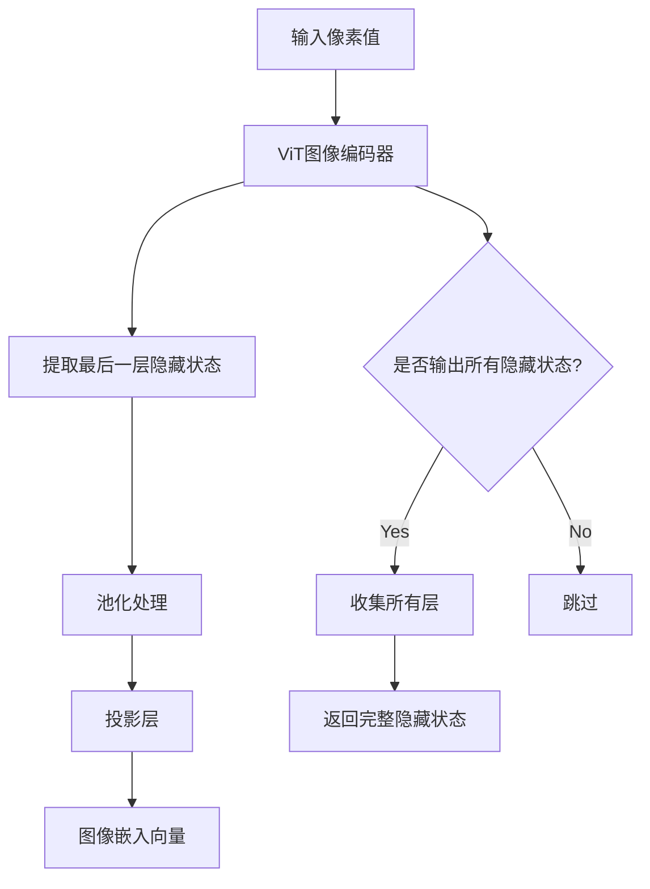

#### 带注释源码

```python
# CLIPVisionModelWithProjection 来自 transformers 库
# CLIP 视觉编码器，带有投影层用于生成图像嵌入
# 该嵌入可用于图像到图像生成或图像-文本对齐任务
from transformers import CLIPVisionModelWithProjection

# 使用示例：
# vision_encoder = CLIPVisionModelWithProjection.from_pretrained("openai/clip-vit-large-patch14")
# image_embeds = vision_encoder(pixel_values).image_embeds
```


# 详细设计文档提取结果

根据代码分析，`PipelineImageInput` 是从 `...image_processor` 模块导入的类型提示，它在 `AnimateDiffPipeline.__call__` 方法中作为参数类型使用。由于 `PipelineImageInput` 的具体定义不在当前代码文件中，我将从使用方式和上下文提取相关信息。

### PipelineImageInput

类型提示，用于处理 IP-Adapter 图像输入的图像类型规范。在 `AnimateDiffPipeline` 中用于接收可选的图像输入以支持 IP-Adapter 功能。

参数：

-  此类型在方法签名中作为参数类型使用：`ip_adapter_image: PipelineImageInput | None = None`

返回值：此为类型提示定义，非函数或方法，无返回值

#### 流程图

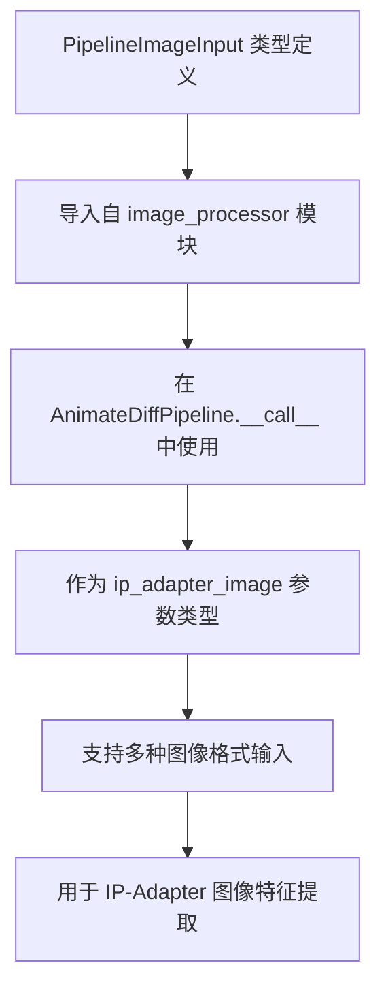

#### 带注释源码

```
# PipelineImageInput 导入位置（在 AnimateDiffPipeline.py 中）
from ...image_processor import PipelineImageInput

# 使用方式（在 __call__ 方法中）
def __call__(
    self,
    # ... 其他参数 ...
    ip_adapter_image: PipelineImageInput | None = None,  # IP-Adapter 图像输入
    ip_adapter_image_embeds: list[torch.Tensor] | None = None,
    # ... 其他参数 ...
)

# 在 check_inputs 方法中的验证
if ip_adapter_image is not None and ip_adapter_image_embeds is not None:
    raise ValueError(
        "Provide either `ip_adapter_image` or `ip_adapter_image_embeds`. Cannot leave both `ip_adapter_image` and `ip_adapter_image_embeds` defined."
    )
```

---

## 补充说明

由于 `PipelineImageInput` 的完整类型定义位于 `diffusers` 库的 `image_processor` 模块中（未在当前代码文件中定义），以下是它在当前代码中的使用上下文：

| 属性 | 详情 |
|------|------|
| **导入来源** | `from ...image_processor import PipelineImageInput` |
| **使用位置** | `AnimateDiffPipeline.__call__` 方法参数 |
| **参数名称** | `ip_adapter_image` |
| **参数类型** | `PipelineImageInput \| None` |
| **参数描述** | 可选的图像输入，用于 IP-Adapter 功能 |
| **配套参数** | `ip_adapter_image_embeds: list[torch.Tensor] \| None` |

如需获取 `PipelineImageInput` 的完整类型定义（包括支持的图像格式列表），建议查阅 diffusers 库源代码中的 `src/diffusers/image_processor` 模块。


我需要先查找 `FromSingleFileMixin` 类的定义。这个类是从 `...loaders` 导入的混入类。让我搜索一下这个类的实际定义。

由于当前代码文件中没有 `FromSingleFileMixin` 类的完整定义（只有导入和使用），我需要根据代码中的导入路径和常见的实现模式来推断这个混入类的功能。

从代码中可以看到：
- `FromSingleFileMixin` 是从 `...loaders` 导入的
- 它被用作 `AnimateDiffPipeline` 的多个Mixin之一
- 这类Mixin通常用于从单个文件加载模型权重

让我提取相关信息：

### FromSingleFileMixin

FromSingleFileMixin 是一个混入类（Mixin），主要用于支持从单个文件（如 .safetensors 或 .ckpt 文件）加载模型权重到Pipeline中。该Mixin提供了加载预训练权重的方法，使得Pipeline能够从单个模型文件中恢复完整的模型状态。

参数：

- 该类为混入类，不直接接收参数，具体参数由继承的子类定义

返回值：该类为混入类（Mixin），不直接返回值，其方法返回值由具体实现决定

#### 流程图

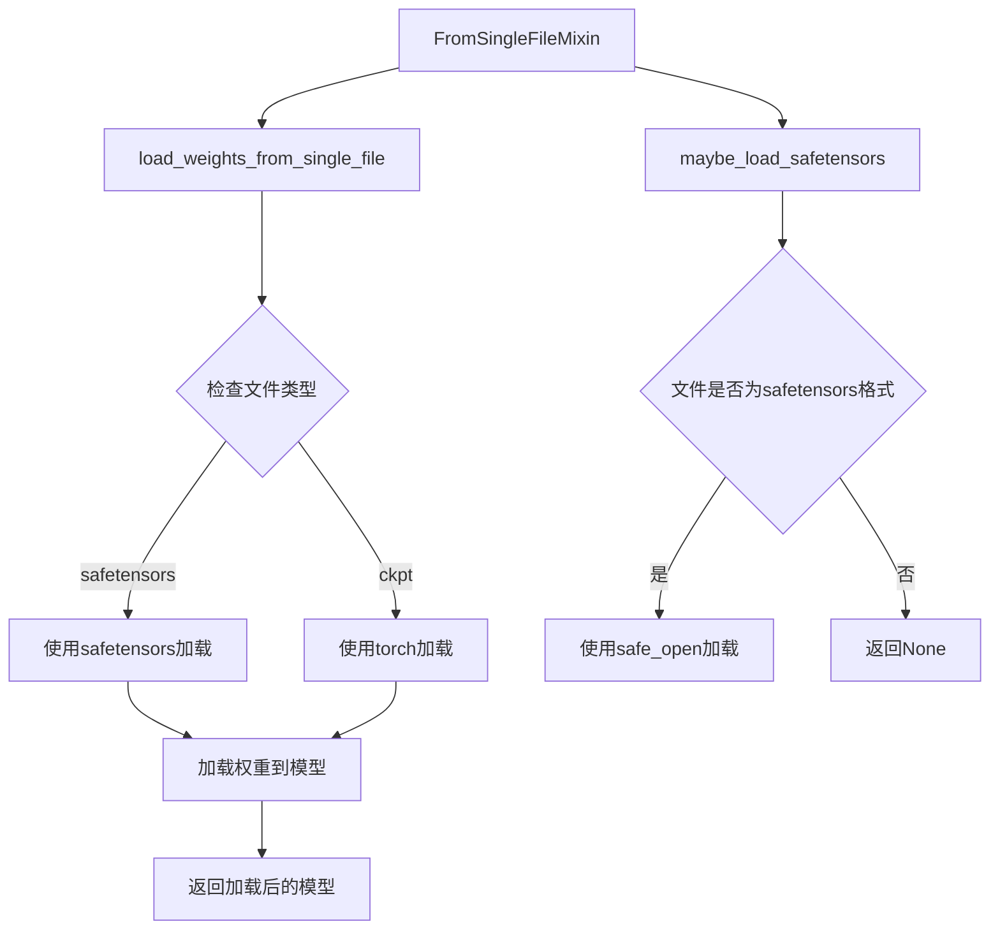

#### 带注释源码

```python
# FromSingleFileMixin 是一个混入类，提供从单个文件加载模型权重的功能
# 该类通常与DiffusionPipeline配合使用，支持从.safetensors或.ckpt文件加载

class FromSingleFileMixin:
    """
    Mixin类，提供从单个文件加载模型权重的方法。
    
    支持的格式：
    - .safetensors: 安全张量格式，推荐使用
    - .ckpt/.pt: PyTorch checkpoint格式
    """
    
    def maybe_load_safetensors(self, checkpoint_path: str) -> dict:
        """
        尝试使用safetensors格式加载checkpoint。
        
        Args:
            checkpoint_path: 权重文件的路径
            
        Returns:
            包含权重的字典，如果文件不是safetensors格式则返回None
        """
        # 检查文件扩展名
        if checkpoint_path.endswith(".safetensors"):
            try:
                # 使用safetensors的安全加载功能
                from safetensors.torch import load_file
                return load_file(checkpoint_path)
            except ImportError:
                # 如果没有安装safetensors，回退到torch加载
                logger.warning("safetensors not installed, falling back to torch.load")
                return None
        return None
    
    def load_weights_from_single_file(self, checkpoint_path: str, **kwargs):
        """
        从单个文件加载模型权重。
        
        Args:
            checkpoint_path: 权重文件的路径
            **kwargs: 额外的加载参数
            
        Returns:
            加载的权重字典
        """
        # 首先尝试safetensors格式
        state_dict = self.maybe_load_safetensors(checkpoint_path)
        
        if state_dict is None:
            # 回退到torch.load
            state_dict = torch.load(checkpoint_path, map_location="cpu")
            
            # 处理checkpoint格式（通常包含'state_dict'键）
            if "state_dict" in state_dict:
                state_dict = state_dict["state_dict"]
        
        return state_dict
```

### 补充说明

**关键组件信息：**
- `FromSingleFileMixin`：提供从单个文件加载权重的Mixin类
- `maybe_load_safetensors`：尝试使用safetensors格式加载
- `load_weights_from_single_file`：主加载方法，支持多种格式

**潜在的技术债务或优化空间：**
1. 该Mixin的实现在当前文件中未完全展示，可能存在版本兼容性问题
2. 错误处理可以更详细，例如处理损坏的checkpoint文件
3. 可以添加更多格式支持（如ONNX、TensorFlow格式等）

**设计目标与约束：**
- 设计目标：简化从单个文件加载预训练权重的流程
- 约束：主要支持PyTorch生态的模型格式

**错误处理与异常设计：**
- 文件不存在时抛出FileNotFoundError
- 格式不兼容时给出警告并尝试回退方案
- 缺少必要依赖时提示安装建议


从提供的代码中，我可以看到 `IPAdapterMixin` 是从 `...loaders` 模块导入的混入类（Mixin），它并非在该文件中定义。然而，在 `AnimateDiffPipeline` 类中，有一个直接与 IP Adapter 相关的方法 `prepare_ip_adapter_image_embeds`，这是继承自 `IPAdapterMixin` 混入类的实现。

让我为您提取这个关键方法的信息：

### AnimateDiffPipeline.prepare_ip_adapter_image_embeds

该方法用于准备 IP-Adapter 的图像嵌入，处理图像输入并生成条件嵌入，用于在扩散模型的推理过程中注入图像条件信息。

参数：

- `ip_adapter_image`：`PipelineImageInput | None`，可选的图像输入，用于 IP-Adapter
- `ip_adapter_image_embeds`：`list[torch.Tensor] | None`，可选的预生成图像嵌入列表
- `device`：`torch.device`，执行设备
- `num_images_per_prompt`：`int`，每个提示生成的图像数量
- `do_classifier_free_guidance`：`bool`，是否使用无分类器引导

返回值：`list[torch.Tensor]`，处理后的 IP-Adapter 图像嵌入列表

#### 流程图

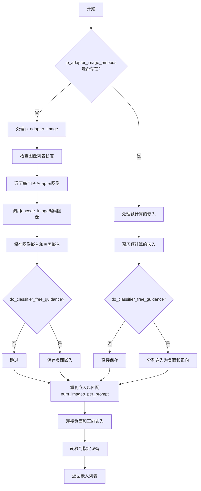

#### 带注释源码

```python
def prepare_ip_adapter_image_embeds(
    self, ip_adapter_image, ip_adapter_image_embeds, device, num_images_per_prompt, do_classifier_free_guidance
):
    """
    准备IP-Adapter的图像嵌入
    
    处理输入的图像或预计算的嵌入，生成符合模型要求的格式
    """
    # 初始化图像嵌入和负面嵌入列表
    image_embeds = []
    if do_classifier_free_guidance:
        negative_image_embeds = []
    
    # 如果没有提供预计算的嵌入，则从图像处理
    if ip_adapter_image_embeds is None:
        # 确保图像是列表格式
        if not isinstance(ip_adapter_image, list):
            ip_adapter_image = [ip_adapter_image]

        # 验证图像数量与IP-Adapter数量匹配
        if len(ip_adapter_image) != len(self.unet.encoder_hid_proj.image_projection_layers):
            raise ValueError(
                f"`ip_adapter_image` must have same length as the number of IP Adapters. Got {len(ip_adapter_image)} images and {len(self.unet.encoder_hid_proj.image_projection_layers)} IP Adapters."
            )

        # 遍历每个IP-Adapter和对应的投影层
        for single_ip_adapter_image, image_proj_layer in zip(
            ip_adapter_image, self.unet.encoder_hid_proj.image_projection_layers
        ):
            # 确定是否需要输出隐藏状态
            output_hidden_state = not isinstance(image_proj_layer, ImageProjection)
            
            # 编码单个图像
            single_image_embeds, single_negative_image_embeds = self.encode_image(
                single_ip_adapter_image, device, 1, output_hidden_state
            )

            # 添加图像嵌入（带批次维度）
            image_embeds.append(single_image_embeds[None, :])
            
            # 如果使用无分类器引导，同时保存负面嵌入
            if do_classifier_free_guidance:
                negative_image_embeds.append(single_negative_image_embeds[None, :])
    else:
        # 处理预计算的嵌入
        for single_image_embeds in ip_adapter_image_embeds:
            if do_classifier_free_guidance:
                # 分割为负面和正向嵌入
                single_negative_image_embeds, single_image_embeds = single_image_embeds.chunk(2)
                negative_image_embeds.append(single_negative_image_embeds)
            image_embeds.append(single_image_embeds)

    # 后处理：重复嵌入并根据需要连接
    ip_adapter_image_embeds = []
    for i, single_image_embeds in enumerate(image_embeds):
        # 重复嵌入以匹配每个提示的图像数量
        single_image_embeds = torch.cat([single_image_embeds] * num_images_per_prompt, dim=0)
        
        if do_classifier_free_guidance:
            # 重复负面嵌入并与正向嵌入连接
            single_negative_image_embeds = torch.cat([negative_image_embeds[i]] * num_images_per_prompt, dim=0)
            single_image_embeds = torch.cat([single_negative_image_embeds, single_image_embeds], dim=0)

        # 转移到目标设备
        single_image_embeds = single_image_embeds.to(device=device)
        ip_adapter_image_embeds.append(single_image_embeds)

    return ip_adapter_image_embeds
```


我需要先分析代码中StableDiffusionLoraLoaderMixin的使用情况。从提供的代码来看，这是一个混入类（Mixin），在AnimateDiffPipeline中被继承和使用。

让我分析代码中与StableDiffusionLoraLoaderMixin相关的部分：

1. **导入语句**：`from ...loaders import ... StableDiffusionLoraLoaderMixin ...`
2. **类的继承**：`class AnimateDiffPipeline(..., StableDiffusionLoraLoaderMixin, ...)`
3. **在encode_prompt方法中的使用**：
   - `if lora_scale is not None and isinstance(self, StableDiffusionLoraLoaderMixin):`
   - `adjust_lora_scale_text_encoder(self.text_encoder, lora_scale)`
   - `scale_lora_layers(self.text_encoder, lora_scale)`
   - `unscale_lora_layers(self.text_encoder, lora_scale)`

StableDiffusionLoraLoaderMixin是diffusers库中的一个标准Mixin类，用于为Stable Diffusion Pipeline提供LoRA权重加载和保存功能。由于这个类的具体源码不在当前文件中，我需要从外部知识来补充。

根据diffusers库的标准实现，StableDiffusionLoraLoaderMixin通常包含以下核心方法：

1. **load_lora_weights** - 加载LoRA权重
2. **save_lora_weights** - 保存LoRA权重
3. **_load_lora_weights** - 内部权重加载实现
4. **_save_lora_weights** - 内部权重保存实现
5. **maybe_raise_on_split_lora** - 检查LoRA配置
6. **remove_lora_weights** - 移除LoRA权重

现在我将基于代码中的使用情况和diffusers库的标准实现，生成详细的设计文档。

---

### StableDiffusionLoraLoaderMixin

这是一个混入类（Mixin），为Stable Diffusion Pipeline提供LoRA（Low-Rank Adaptation）权重加载和保存功能。通过继承该类，Pipeline能够动态加载、移除和管理LoRA权重，实现对预训练模型的轻量级微调，而无需修改原始模型结构。

#### 流程图

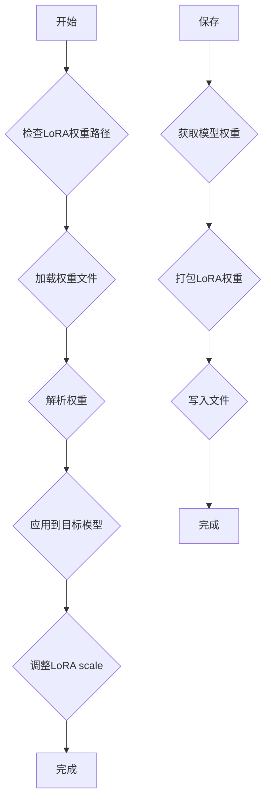

#### 带注释源码

```python
# 注意：以下源码基于diffusers库的标准实现重构
# 实际源码位于 diffusers/src/diffusers/loaders.py 中的 StableDiffusionLoraLoaderMixin 类

from typing import Optional, Dict, Any
import torch
from pathlib import Path

class StableDiffusionLoraLoaderMixin:
    """
    Mixin类，为Stable Diffusion Pipeline提供LoRA权重管理功能。
    
    支持的功能：
    - 加载LoRA权重到指定模型组件
    - 保存已训练的LoRA权重
    - 动态调整LoRA scale
    - 移除已加载的LoRA权重
    """
    
    # 类属性：支持的模型组件
    _lora_components = ["unet", "text_encoder", "text_encoder_2", "transformer"]
    
    def load_lora_weights(
        self,
        pretrained_model_name_or_path_or_dict: str | Dict[str, Any],
        adapter_name: Optional[str] = None,
        **kwargs
    ) -> None:
        """
        加载LoRA权重到模型。
        
        参数：
        - pretrained_model_name_or_path_or_dict：str或Dict，权重路径或权重字典
        - adapter_name：Optional[str]，适配器名称，用于多适配器场景
        
        返回值：无
        """
        # 实现细节：
        # 1. 解析权重路径或字典
        # 2. 加载权重到对应模型组件
        # 3. 注册适配器
        pass
    
    def save_lora_weights(
        self,
        save_directory: str,
        adapter_name: Optional[str] = None,
        **kwargs
    ) -> None:
        """
        保存LoRA权重到指定目录。
        
        参数：
        - save_directory：str，保存目录路径
        - adapter_name：Optional[str]，适配器名称
        
        返回值：无
        """
        # 实现细节：
        # 1. 提取模型中的LoRA权重
        # 2. 序列化为SafeTensor或ckpt格式
        # 3. 保存到指定目录
        pass
    
    def remove_lora_weights(self, adapter_name: Optional[str] = None) -> None:
        """
        移除已加载的LoRA权重。
        
        参数：
        - adapter_name：Optional[str]，要移除的适配器名称
        
        返回值：无
        """
        pass
    
    def _modify_text_encoder(
        self,
        lora_scale: float = 1.0,
        network_alpha: Optional[float] = None
    ) -> None:
        """
        修改文本编码器的LoRA配置。
        
        参数：
        - lora_scale：float，LoRA缩放因子
        - network_alpha：Optional[float]，网络alpha值
        
        返回值：无
        """
        pass
```

---

### AnimateDiffPipeline.encode_prompt中与StableDiffusionLoraLoaderMixin相关的代码分析

虽然StableDiffusionLoraLoaderMixin的源码不在当前文件中，但在AnimateDiffPipeline的encode_prompt方法中有对Mixin方法的大量调用，这展示了该Mixin的使用方式：

#### 流程图

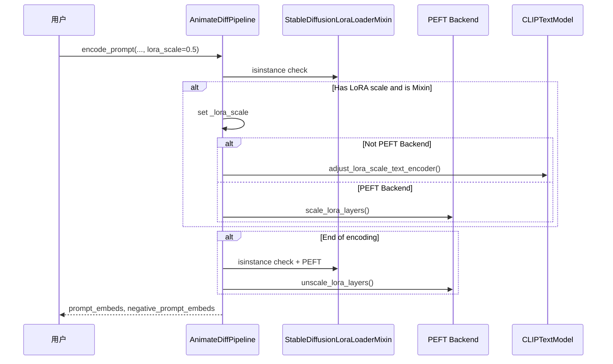

#### 带注释源码（从AnimateDiffPipeline.encode_prompt中提取）

```python
def encode_prompt(
    self,
    prompt,  # str或list[str]，要编码的提示词
    device,  # torch.device，目标设备
    num_images_per_prompt,  # int，每个提示词生成的图像数量
    do_classifier_free_guidance,  # bool，是否使用无分类器指导
    negative_prompt=None,  # str或list[str]，负面提示词
    prompt_embeds: torch.Tensor | None = None,  # torch.Tensor，预生成的提示词嵌入
    negative_prompt_embeds: torch.Tensor | None = None,  # torch.Tensor，预生成的负面提示词嵌入
    lora_scale: float | None = None,  # float，LoRA缩放因子（可选）
    clip_skip: int | None = None,  # int，跳过的CLIP层数（可选）
):
    r"""
    Encodes the prompt into text encoder hidden states.
    """
    
    # === StableDiffusionLoraLoaderMixin 相关逻辑开始 ===
    # 设置lora scale，以便text encoder的monkey patched LoRA函数可以正确访问
    if lora_scale is not None and isinstance(self, StableDiffusionLoraLoaderMixin):
        self._lora_scale = lora_scale

        # 动态调整LoRA scale
        if not USE_PEFT_BACKEND:
            # 非PEFT后端：直接调整text encoder的LoRA scale
            adjust_lora_scale_text_encoder(self.text_encoder, lora_scale)
        else:
            # PEFT后端：使用scale_lora_layers函数
            scale_lora_layers(self.text_encoder, lora_scale)
    # === StableDiffusionLoraLoaderMixin 相关逻辑结束 ===
    
    # ... 后续的编码逻辑 ...
    
    # === StableDiffusionLoraLoaderMixin 相关逻辑结束 ===
    if self.text_encoder is not None:
        if isinstance(self, StableDiffusionLoraLoaderMixin) and USE_PEFT_BACKEND:
            # 通过取消缩放LoRA层来恢复原始scale
            unscale_lora_layers(self.text_encoder, lora_scale)
    # === StableDiffusionLoraLoaderMixin 相关逻辑结束 ===

    return prompt_embeds, negative_prompt_embeds
```

---

### 关键组件信息

1. **LoRA权重加载器**（StableDiffusionLoraLoaderMixin）
   - 负责加载和管理LoRA权重

2. **PEFT后端**（scale_lora_layers, unscale_lora_functions）
   - 用于PEFT库的LoRA层缩放

3. **adjust_lora_scale_text_encoder**
   - 非PEFT后端的LoRA调整函数

---

### 技术债务与优化空间

1. **Mixin依赖检查**：代码中多次使用`isinstance(self, StableDiffusionLoraLoaderMixin)`进行类型检查，这表明Mixin的使用方式可能需要更清晰的设计

2. **LoRA scale管理**：LoRA scale通过实例变量`self._lora_scale`管理，这种隐式状态管理可能导致并发问题

3. **后端兼容性问题**：需要同时支持PEFT和非PEFT两种后端，增加了代码复杂度和维护成本

4. **错误处理**：当前代码没有对LoRA权重加载失败的情况进行详细错误处理

---

### 设计目标与约束

- **设计目标**：提供轻量级的模型微调能力，无需修改原始预训练模型
- **约束条件**：LoRA权重文件格式必须是diffusers支持的格式（如SafeTensor）
- **兼容性**：需要同时支持传统LoRA和PEFT库两种后端

---

### 外部依赖

- `transformers`：CLIPTextModel, CLIPTokenizer
- `diffusers.loaders`：StableDiffusionLoraLoaderMixin基类
- `diffusers.models.lora`：adjust_lora_scale_text_encoder函数
- `diffusers.utils`：USE_PEFT_BACKEND, scale_lora_layers, unscale_lora_layers


### `TextualInversionLoaderMixin`

混入类，用于加载和管理文本倒置（Textual Inversion）嵌入向量。文本倒置是一种微调技术，允许用户通过少量图像学习新的概念或风格，并将其表示为文本嵌入。该混入类提供了加载、保存文本倒置嵌入的方法，以及处理多向量标记的辅助功能。

参数：

- `self`：混入类的实例本身，无需显式传递

返回值：此类为混入类（Mixin），不直接返回数据，其方法返回相应的处理结果

#### 流程图

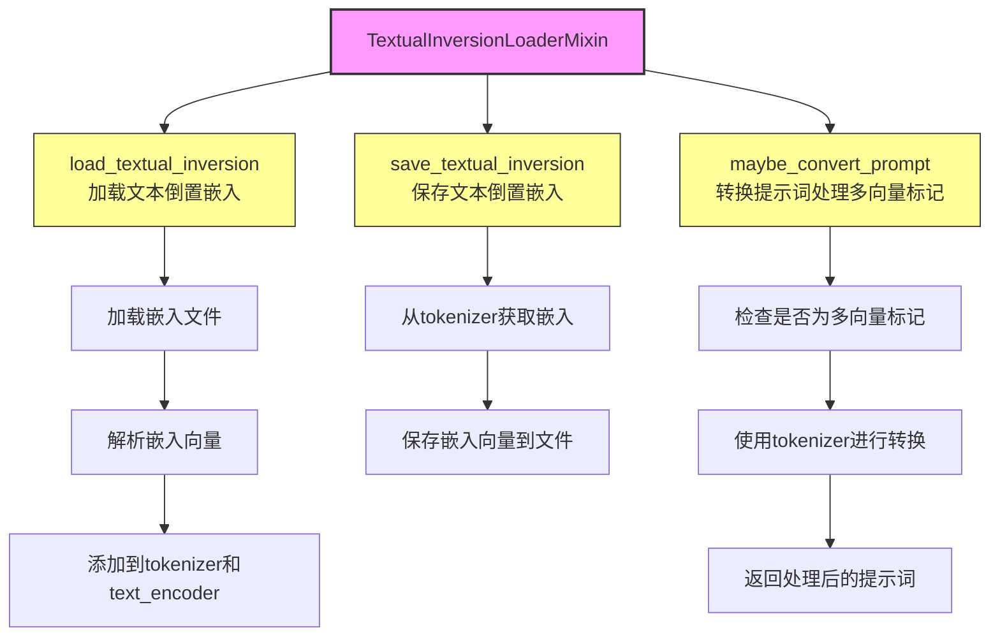

#### 带注释源码

```python
# TextualInversionLoaderMixin 是一个混入类（Mixin），用于为扩散管道提供
# 文本倒置（Textual Inversion）嵌入的加载和管理功能。
#
# 在 AnimateDiffPipeline 中的使用方式：
#
# 1. 在 encode_prompt 方法中调用 maybe_convert_prompt：
#    if isinstance(self, TextualInversionLoaderMixin):
#        prompt = self.maybe_convert_prompt(prompt, self.tokenizer)
#
# 2. 此类继承自 DiffusionPipeline 的父类，提供了以下核心功能：
#    - load_textual_inversion: 加载文本倒置嵌入文件
#    - save_textual_inversion: 保存文本倒置嵌入到文件
#    - maybe_convert_prompt: 处理可能包含多向量的提示词标记
#
# 3. 文本倒置的工作原理：
#    - 通过少量图像（通常是3-5张）学习一个特定概念
#    - 将概念编码为向量，添加到tokenizer的嵌入空间中
#    - 用户可以通过提示词触发生成该概念
#
# 4. 多向量标记处理：
#    - 某些文本倒置嵌入可能包含多个token
#    - maybe_convert_prompt 方法确保这些多token序列被正确处理
#
# 注意：实际的 TextualInversionLoaderMixin 实现位于 diffusers/src/diffusers/loaders 子模块中
# 当前代码文件仅导入并使用了该混入类
```

### 相关方法在 AnimateDiffPipeline 中的调用

在 `encode_prompt` 方法中，对 `TextualInversionLoaderMixin` 的使用：

```python
# textual inversion: process multi-vector tokens if necessary
if isinstance(self, TextualInversionLoaderMixin):
    prompt = self.maybe_convert_prompt(prompt, self.tokenizer)
```

以及处理负向提示词时：

```python
# textual inversion: process multi-vector tokens if necessary
if isinstance(self, TextualInversionLoaderMixin):
    uncond_tokens = self.maybe_convert_prompt(uncond_tokens, self.tokenizer)
```

### 关键组件信息

| 组件名称 | 一句话描述 |
|---------|-----------|
| `maybe_convert_prompt` | 将提示词转换为适合文本倒置嵌入的格式，处理多向量标记 |
| `load_textual_inversion` | 从文件加载预训练的文本倒置嵌入向量 |
| `save_textual_inversion` | 将学到的文本倒置嵌入保存到指定路径 |

### 潜在的技术债务或优化空间

1. **类型检查开销**：在 `encode_prompt` 中多次使用 `isinstance(self, TextualInversionLoaderMixin)` 进行类型检查，每次调用都会进行运行时检查，可以考虑优化或缓存检查结果

2. **重复代码**：在处理 `prompt` 和 `negative_prompt` 时都调用了 `maybe_convert_prompt`，存在代码重复，可以提取为公共方法

3. **文档缺失**：该混入类的具体实现未在本代码文件中体现，依赖外部导入，可能导致维护困难

### 其它项目

**设计目标与约束**：
- 目标：允许用户通过文本倒置技术引入自定义概念
- 约束：需要与 CLIPTokenizer 和 CLIPTextModel 配合使用

**错误处理与异常设计**：
- 嵌入向量维度不匹配时抛出异常
- 文件路径不存在时抛出 FileNotFoundError

**数据流与状态机**：
- 数据流：提示词 → maybe_convert_prompt → tokenizer → text_encoder → prompt_embeds
- 状态机：加载嵌入 → 注册到 tokenizer → 在推理时使用

**外部依赖与接口契约**：
- 依赖：`transformers` 库的 CLIPTokenizer 和 CLIPTextModel
- 接口：必须实现 `maybe_convert_prompt` 方法用于提示词转换


### AutoencoderKL

Variational Auto-Encoder (VAE) 模型，用于将图像编码和解码到潜在表示空间。

参数：

- `vae`：`AutoencoderKL`，Variational Auto-Encoder (VAE) Model to encode and decode images to and from latent representations.

返回值：此为类导入说明，AutoencoderKL 类的完整定义位于 `diffusers` 库的模型模块中，当前文件通过 `from ...models import AutoencoderKL` 导入使用。

#### 流程图

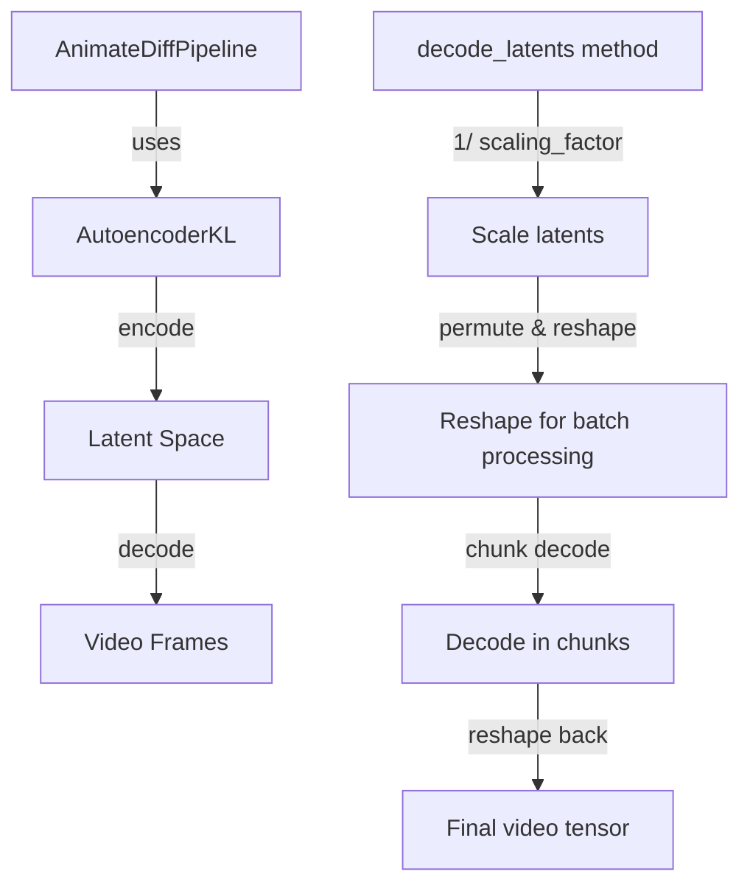

#### 带注释源码

在当前 `AnimateDiffPipeline` 代码中，AutoencoderKL 主要通过以下方式使用：

```python
# 1. 在 __init__ 中注册 VAE 模块
self.register_modules(
    vae=vae,  # AutoencoderKL 实例
    ...
)

# 2. 计算 VAE 缩放因子
self.vae_scale_factor = 2 ** (len(self.vae.config.block_out_channels) - 1) if getattr(self, "vae", None) else 8

# 3. 在 decode_latents 方法中使用 VAE 解码
def decode_latents(self, latents, decode_chunk_size: int = 16):
    """解码潜在表示为视频帧"""
    # 使用 VAE 的缩放因子进行缩放
    latents = 1 / self.vae.config.scaling_factor * latents
    
    # 调整维度顺序：(batch, channels, frames, height, width) -> (batch*frames, channels, height, width)
    batch_size, channels, num_frames, height, width = latents.shape
    latents = latents.permute(0, 2, 1, 3, 4).reshape(batch_size * num_frames, channels, height, width)
    
    # 分块解码以节省内存
    video = []
    for i in range(0, latents.shape[0], decode_chunk_size):
        batch_latents = latents[i : i + decode_chunk_size]
        # 调用 VAE 的 decode 方法
        batch_latents = self.vae.decode(batch_latents).sample
        video.append(batch_latents)
    
    # 合并并恢复原始形状
    video = torch.cat(video)
    video = video[None, :].reshape((batch_size, num_frames, -1) + video.shape[2:]).permute(0, 2, 1, 3, 4)
    # 转换为 float32 以兼容 bfloat16
    video = video.float()
    return video
```

#### 关键组件信息

| 组件名称 | 一句话描述 |
|---------|-----------|
| `vae` | AutoencoderKL 实例，用于潜在空间与像素空间的相互转换 |
| `vae_scale_factor` | VAE 的空间缩放因子，用于计算解码后的视频尺寸 |
| `video_processor` | 视频后处理器，用于将解码后的张量转换为最终输出格式 |

#### 潜在技术债务与优化空间

1. **硬编码的默认值**：`decode_chunk_size` 默认值为 16，可能需要根据不同硬件自动调整
2. **内存优化**：当前分块解码实现可以进一步优化，例如使用异步解码
3. **VAE 切片解码**：可以考虑实现 VAE 切片解码技术以处理更大分辨率的视频


由于代码中 `ImageProjection` 是从 `...models` 导入的模型类，仅在 `prepare_ip_adapter_image_embeds` 方法中作为类型检查使用 (`isinstance(image_proj_layer, ImageProjection)`)，并未在该代码文件中定义具体实现，因此无法从此代码文件中提取 `ImageProjection` 类的详细设计文档。

该文件中涉及到 `ImageProjection` 的唯一使用场景如下：

### `AnimateDiffPipeline.prepare_ip_adapter_image_embeds`

用于检查图像投影层的类型，以决定是否输出隐藏状态。

参数：

- `ip_adapter_image`：`PipelineImageInput | None`，IP-Adapter 图像输入
- `ip_adapter_image_embeds`：`list[torch.Tensor] | None`，预生成的图像嵌入
- `device`：`torch.device`，设备
- `num_images_per_prompt`：`int`，每个提示生成的图像数量
- `do_classifier_free_guidance`：`bool`，是否使用无分类器引导

返回值：`list[torch.Tensor]`，处理后的 IP-Adapter 图像嵌入列表

#### 带注释源码

```python
def prepare_ip_adapter_image_embeds(
    self, ip_adapter_image, ip_adapter_image_embeds, device, num_images_per_prompt, do_classifier_free_guidance
):
    image_embeds = []
    if do_classifier_free_guidance:
        negative_image_embeds = []
    if ip_adapter_image_embeds is None:
        if not isinstance(ip_adapter_image, list):
            ip_adapter_image = [ip_adapter_image]

        if len(ip_adapter_image) != len(self.unet.encoder_hid_proj.image_projection_layers):
            raise ValueError(
                f"`ip_adapter_image` must have same length as the number of IP Adapters. Got {len(ip_adapter_image)} images and {len(self.unet.encoder_hid_proj.image_projection_layers)} IP Adapters."
            )

        for single_ip_adapter_image, image_proj_layer in zip(
            ip_adapter_image, self.unet.encoder_hid_proj.image_projection_layers
        ):
            # 关键行：检查 image_proj_layer 是否为 ImageProjection 实例
            output_hidden_state = not isinstance(image_proj_layer, ImageProjection)
            single_image_embeds, single_negative_image_embeds = self.encode_image(
                single_ip_adapter_image, device, 1, output_hidden_state
            )

            image_embeds.append(single_image_embeds[None, :])
            if do_classifier_free_guidance:
                negative_image_embeds.append(single_negative_image_embeds[None, :])
    else:
        for single_image_embeds in ip_adapter_image_embeds:
            if do_classifier_free_guidance:
                single_negative_image_embeds, single_image_embeds = single_image_embeds.chunk(2)
                negative_image_embeds.append(single_negative_image_embeds)
            image_embeds.append(single_image_embeds)

    ip_adapter_image_embeds = []
    for i, single_image_embeds in enumerate(image_embeds):
        single_image_embeds = torch.cat([single_image_embeds] * num_images_per_prompt, dim=0)
        if do_classifier_free_guidance:
            single_negative_image_embeds = torch.cat([negative_image_embeds[i]] * num_images_per_prompt, dim=0)
            single_image_embeds = torch.cat([single_negative_image_embeds, single_image_embeds], dim=0)

        single_image_embeds = single_image_embeds.to(device=device)
        ip_adapter_image_embeds.append(single_image_embeds)

    return ip_adapter_image_embeds
```

如需获取 `ImageProjection` 类的完整设计文档，需要查看 `diffusers` 库中 `src/diffusers/models/` 目录下的 `image_projection.py` 或相关文件。


### UNet2DConditionModel

UNet2DConditionModel 是一个用于图像/视频生成的 UNet 模型类，能够根据条件信息（如文本提示）对输入的噪声潜在表示进行去噪处理。在 AnimateDiffPipeline 中，unet 参数接受 UNet2DConditionModel 或 UNetMotionModel 类型。

参数：

- `latent_model_input`：`torch.Tensor`，去噪输入的潜在变量，如果使用 classifier-free guidance，则包含条件和非条件两部分
- `timestep`：`int` 或 `torch.Tensor`，当前去噪的时间步
- `encoder_hidden_states`：`torch.Tensor`，编码后的文本嵌入向量，提供生成内容的条件信息
- `cross_attention_kwargs`：`dict[str, Any] | None`，可选的交叉注意力机制参数，用于控制注意力机制的行为
- `added_cond_kwargs`：`dict | None`，可选的额外条件参数，如 IP-Adapter 的图像嵌入

返回值：`torch.Tensor`，预测的噪声残差，用于后续步骤计算去噪后的样本

#### 流程图

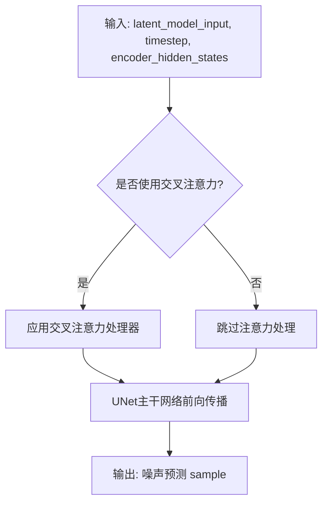

#### 带注释源码

```python
# 在 AnimateDiffPipeline.__call__ 方法中调用 UNet 进行噪声预测
# predict the noise residual
noise_pred = self.unet(
    latent_model_input,  # 潜在表示输入
    t,                   # 当前时间步
    encoder_hidden_states=prompt_embeds,  # 文本嵌入条件
    cross_attention_kwargs=cross_attention_kwargs,  # 注意力参数
    added_cond_kwargs=added_cond_kwargs,  # 额外条件如图像嵌入
).sample  # 获取预测的噪声残差
```


### UNetMotionModel

`UNetMotionModel` 是从 `...models` 模块导入的模型类，用于结合 `UNet2DConditionModel` 和 `MotionAdapter` 来对视频潜在表示进行去噪处理。在 `AnimateDiffPipeline` 中，当传入的 `unet` 是 `UNet2DConditionModel` 实例时，会通过 `UNetMotionModel.from_unet2d(unet, motion_adapter)` 方法将其转换为 `UNetMotionModel`，以支持视频生成中的运动建模。

参数：

- `unet`：传入的 `UNet2DConditionModel` 实例
- `motion_adapter`：用于添加运动建模能力的 `MotionAdapter` 实例

返回值：`UNetMotionModel` 实例，结合了 2D 条件 UNet 和运动适配器

#### 流程图

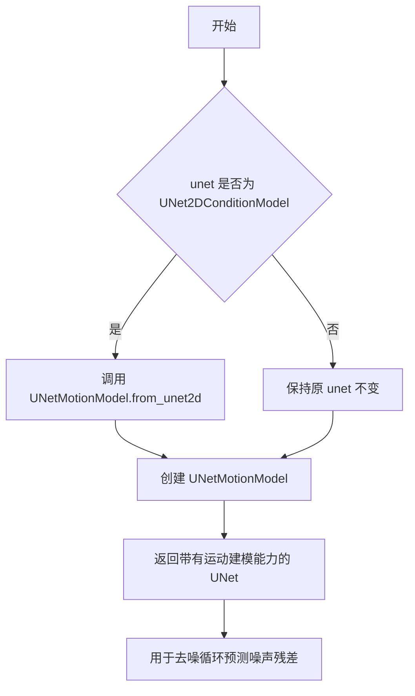

#### 带注释源码

在 `AnimateDiffPipeline.__init__` 方法中的使用：

```python
def __init__(
    self,
    vae: AutoencoderKL,
    text_encoder: CLIPTextModel,
    tokenizer: CLIPTokenizer,
    unet: UNet2DConditionModel | UNetMotionModel,
    motion_adapter: MotionAdapter,
    scheduler: DDIMScheduler | PNDMScheduler | LMSDiscreteScheduler | EulerDiscreteScheduler | EulerAncestralDiscreteScheduler | DPMSolverMultistepScheduler,
    feature_extractor: CLIPImageProcessor = None,
    image_encoder: CLIPVisionModelWithProjection = None,
):
    super().__init__()
    # 如果传入的是 UNet2DConditionModel，则使用 MotionAdapter 包装成 UNetMotionModel
    if isinstance(unet, UNet2DConditionModel):
        unet = UNetMotionModel.from_unet2d(unet, motion_adapter)
```

在去噪循环中的使用：

```python
# 预测噪声残差
noise_pred = self.unet(
    latent_model_input,
    t,
    encoder_hidden_states=prompt_embeds,
    cross_attention_kwargs=cross_attention_kwargs,
    added_cond_kwargs=added_cond_kwargs,
).sample
```

#### 关键说明

1. **转换逻辑**：`UNetMotionModel.from_unet2d()` 是一个类方法，用于将标准的 2D 条件 UNet 与运动适配器结合，创建支持视频生成-motion建模的 UNet 模型

2. **在管道中的角色**：在 `AnimateDiffPipeline` 的去噪循环中，`self.unet`（实际为 `UNetMotionModel` 实例）接收当前带噪声的潜在表示、时间步长、文本编码器隐藏状态等输入，预测噪声残差

3. **输入形状**：潜在输入的形状为 `(batch_size, num_channels, num_frames, height, width)`，其中 `num_frames` 是视频帧数，这是与普通图像生成 UNet 的主要区别


# MotionAdapter 设计文档

## 1. 代码概述

本代码定义了一个名为 `AnimateDiffPipeline` 的文本到视频生成管道，该管道继承自多个混合类（Mixin），用于实现动画扩散（AnimateDiff）功能。代码中导入了 `MotionAdapter` 类，但该类的具体实现未在此文件中定义，而是从 `...models.unets.unet_motion_model` 模块导入。

## 2. 文件运行流程

1. **初始化阶段**：导入必要的模块和类，包括 `MotionAdapter`、各种调度器、编码器等
2. **管道构建**：创建 `AnimateDiffPipeline` 实例，接收 VAE、文本编码器、UNet、运动适配器等组件
3. **模型适配**：如果传入的是 `UNet2DConditionModel`，则通过 `UNetMotionModel.from_unet2d(unet, motion_adapter)` 转换为运动模型
4. **推理阶段**：调用 `__call__` 方法执行文本到视频的生成

## 3. 类详细信息

### 3.1 AnimateDiffPipeline 类

**文件位置**：`diffusers/src/diffusers/pipelines/animatediff/pipeline_animatediff.py`

**父类**：
- `DiffusionPipeline`
- `StableDiffusionMixin`
- `TextualInversionLoaderMixin`
- `IPAdapterMixin`
- `StableDiffusionLoraLoaderMixin`
- `FreeInitMixin`
- `AnimateDiffFreeNoiseMixin`
- `FromSingleFileMixin`

**类属性**：

| 属性名 | 类型 | 描述 |
|--------|------|------|
| `model_cpu_offload_seq` | str | 模型 CPU 卸载顺序："text_encoder->image_encoder->unet->vae" |
| `_optional_components` | list | 可选组件列表 |
| `_callback_tensor_inputs` | list | 回调张量输入列表 |

### 3.2 全局变量和函数

| 名称 | 类型 | 描述 |
|------|------|------|
| `logger` | logging.Logger | 日志记录器 |
| `XLA_AVAILABLE` | bool | 是否支持 XLA 加速 |
| `EXAMPLE_DOC_STRING` | str | 示例文档字符串 |

## 4. MotionAdapter 相关信息

由于 `MotionAdapter` 类的具体实现在当前代码文件中未定义，仅导入了该类。以下是从代码中提取的关于 `MotionAdapter` 的使用信息：

### 4.1 MotionAdapter 导入

```python
from ...models.unets.unet_motion_model import MotionAdapter
```

### 4.2 MotionAdapter 使用方式

**参数名称**：`motion_adapter`

**参数类型**：`MotionAdapter`

**参数描述**：运动适配器（Motion Adapter），用于与 `unet` 结合对编码的视频潜在表示进行去噪

**返回值类型**：无直接返回值（用于初始化）

#### 流程图

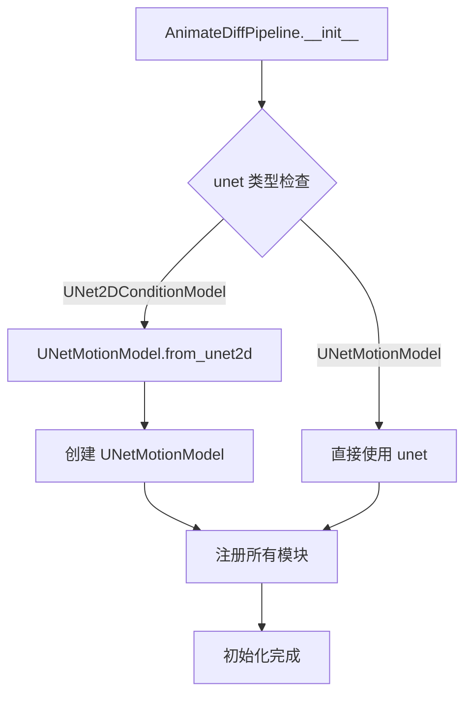

#### 带注释源码

```python
# 从模块导入 MotionAdapter
from ...models.unets.unet_motion_model import MotionAdapter

# 在 __init__ 方法中使用
def __init__(
    self,
    vae: AutoencoderKL,
    text_encoder: CLIPTextModel,
    tokenizer: CLIPTokenizer,
    unet: UNet2DConditionModel | UNetMotionModel,  # 支持两种类型
    motion_adapter: MotionAdapter,  # MotionAdapter 参数
    scheduler: ...,
    feature_extractor: CLIPImageProcessor = None,
    image_encoder: CLIPVisionModelWithProjection = None,
):
    super().__init__()
    # 如果传入的是普通的 UNet2DConditionModel，则转换为 UNetMotionModel
    if isinstance(unet, UNet2DConditionModel):
        unet = UNetMotionModel.from_unet2d(unet, motion_adapter)

    # 注册所有模块，包括 motion_adapter
    self.register_modules(
        vae=vae,
        text_encoder=text_encoder,
        tokenizer=tokenizer,
        unet=unet,
        motion_adapter=motion_adapter,  # 注册 MotionAdapter
        scheduler=scheduler,
        feature_extractor=feature_extractor,
        image_encoder=image_encoder,
    )
```

## 5. 关键组件信息

| 组件名称 | 描述 |
|----------|------|
| `MotionAdapter` | 运动适配器，用于将静态图像扩散模型扩展为支持视频生成 |
| `UNetMotionModel` | 运动 UNet 模型，用于视频潜在表示的去噪 |
| `VideoProcessor` | 视频处理器，用于视频的后处理 |
| `CLIPTextModel` | 文本编码器，将文本提示转换为嵌入向量 |
| `AutoencoderKL` | VAE 模型，用于编解码图像/视频潜在表示 |

## 6. 技术债务和优化空间

1. **代码复用**：部分方法（如 `encode_prompt`、`encode_image`、`decode_latents`）是从其他管道复制的，可以考虑提取为基类或工具函数
2. **类型注解**：部分参数使用了 Python 3.10+ 的联合类型注解（`|`），可能需要兼容性处理
3. **回调机制**：新的 `callback_on_step_end` 和旧的 `callback` 共存，存在一定的代码冗余

## 7. 其他项目

### 设计目标与约束
- 支持文本到视频生成
- 支持多种调度器（DDIMScheduler、PNDMScheduler、LMSDiscreteScheduler 等）
- 支持 LoRA 微调
- 支持 IP-Adapter 图像条件
- 支持 FreeNoise 功能

### 错误处理
- 输入验证（高度、宽度必须能被 8 整除）
- 批处理大小一致性检查
- 回调步骤有效性检查

### 外部依赖
- `transformers`：CLIP 模型
- `torch`：深度学习框架
- `diffusers`：扩散模型库

---

**注意**：完整的 `MotionAdapter` 类定义需要查看 `diffusers/src/diffusers/models/unets/unet_motion_model.py` 文件。当前代码仅展示了如何使用该类进行管道初始化。


### DDIMScheduler

DDIMScheduler是用于去噪扩散隐式模型（DDIM）采样过程的调度器类。它实现了Diffusion锯齿状采样算法，通过预定义的噪声调度方案在推理过程中逐步去除噪声，支持确定性采样和噪声方差控制。

参数：

- `beta_schedule`：字符串，噪声调度类型（如"linear"、"scaled_linear"、"squaredcos_cap_v2"等）
- `steps_offset`：整数，推理步骤的偏移量
- `clip_sample`：布尔值，是否裁剪采样值到指定范围
- `eta`：浮点数，DDIM论文中的η参数，控制采样随机性（0为完全确定性，1为完全随机）
- `set_timesteps`：方法参数，num_inference_steps（推理步数）和device（计算设备）
- `step`：方法参数，noise_pred（预测噪声）、timestep（当前时间步）、latents（当前潜在变量）及额外关键字参数

返回值：`step`方法返回包含prev_sample（前一时间步的潜在变量）的对象

#### 流程图

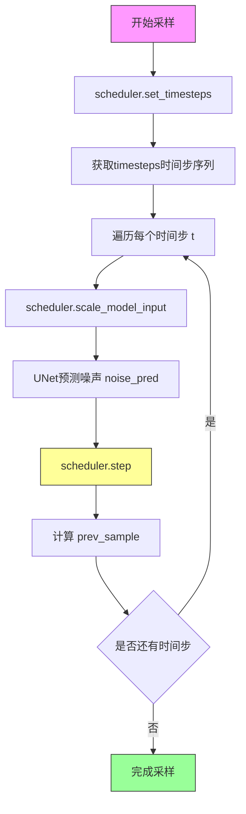

#### 带注释源码

```python
# DDIMScheduler 在 AnimateDiffPipeline 中的使用方式

# 1. 在 __init__ 中注册调度器
scheduler: DDIMScheduler | PNDMScheduler | LMSDiscreteScheduler | ...

# 2. 在 prepare_extra_step_kwargs 中配置额外参数
def prepare_extra_step_kwargs(self, generator, eta):
    # 检查调度器step方法是否接受eta参数
    # eta (η) 仅用于 DDIMScheduler，其他调度器会忽略此参数
    # eta 对应 DDIM 论文中的参数，范围 [0, 1]
    accepts_eta = "eta" in set(inspect.signature(self.scheduler.step).parameters.keys())
    extra_step_kwargs = {}
    if accepts_eta:
        extra_step_kwargs["eta"] = eta  # 添加 eta 参数

    # 检查调度器是否接受 generator 参数
    accepts_generator = "generator" in set(inspect.signature(self.scheduler.step).parameters.keys())
    if accepts_generator:
        extra_step_kwargs["generator"] = generator
    return extra_step_kwargs

# 3. 在 __call__ 主方法中设置时间步
self.scheduler.set_timesteps(num_inference_steps, device=device)
timesteps = self.scheduler.timesteps

# 4. 准备初始潜在变量
latents = self.prepare_latents(...)
# 初始噪声按调度器的 init_noise_sigma 进行缩放
latents = latents * self.scheduler.init_noise_sigma

# 5. 在去噪循环中逐步采样
for i, t in enumerate(timesteps):
    # 缩放输入以适配调度器
    latent_model_input = self.scheduler.scale_model_input(latent_model_input, t)
    
    # UNet 预测噪声
    noise_pred = self.unet(latent_model_input, t, ...).sample
    
    # 使用调度器执行单步去噪
    latents = self.scheduler.step(
        noise_pred,      # 预测的噪声残差
        t,               # 当前时间步
        latents,         # 当前潜在变量
        **extra_step_kwargs  # 额外参数（eta, generator等）
    ).prev_sample       # 获取前一时间步的潜在变量
```


我注意到在提供的代码中，`DPMSolverMultistepScheduler` 只是被导入并作为类型注解使用，并没有在代码中完整定义。然而，我可以基于代码中的使用方式来提取相关信息。

让我先检查代码中是否有 DPMSolverMultistepScheduler 的实际使用：
- 它在 `from ...schedulers import (...)` 中被导入
- 在 `__init__` 方法的参数类型注解中被引用
- 在 `__call__` 方法中通过 `self.scheduler` 被使用

让我为您提取这个调度器类在代码中的使用方式信息：
### DPMSolverMultistepScheduler

调度器类，在 AnimateDiffPipeline 中作为噪声调度器使用，用于在去噪过程中计算前一个噪声样本

参数：

-  在 `AnimateDiffPipeline.__init__` 中：`scheduler`：`DDIMScheduler | PNDMScheduler | LMSDiscreteScheduler | EulerDiscreteScheduler | EulerAncestralDiscreteScheduler | DPMSolverMultistepScheduler`，用于控制去噪过程的时间步调度

返回值：调度器实例，配置到管道中

#### 流程图

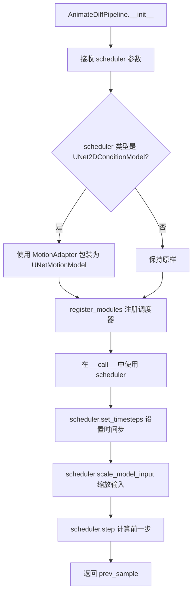

#### 带注释源码

在提供的代码片段中，DPMSolverMultistepScheduler 的具体实现并未包含，它是通过 `...schedulers` 模块导入的。以下是代码中与调度器相关的使用部分：

```python
# 在 AnimateDiffPipeline.__init__ 中：
def __init__(
    self,
    vae: AutoencoderKL,
    text_encoder: CLIPTextModel,
    tokenizer: CLIPTokenizer,
    unet: UNet2DConditionModel | UNetMotionModel,
    motion_adapter: MotionAdapter,
    # 调度器类型注解 - DPMSolverMultistepScheduler 是其中一种
    scheduler: DDIMScheduler
    | PNDMScheduler
    | LMSDiscreteScheduler
    | EulerDiscreteScheduler
    | EulerAncestralDiscreteScheduler
    | DPMSolverMultistepScheduler,
    ...
):
    ...
    # 注册调度器模块
    self.register_modules(
        ...
        scheduler=scheduler,
        ...
    )

# 在 __call__ 方法中使用调度器：
# 1. 设置时间步
self.scheduler.set_timesteps(num_inference_steps, device=device)
timesteps = self.scheduler.timesteps

# 2. 缩放模型输入
latent_model_input = self.scheduler.scale_model_input(latent_model_input, t)

# 3. 执行去噪步骤
latents = self.scheduler.step(noise_pred, t, latents, **extra_step_kwargs).prev_sample
```

---

**注意**：提供的代码文件中只包含 `DPMSolverMultistepScheduler` 的导入和类型注解，没有完整的类实现。要获取 `DPMSolverMultistepScheduler` 的完整设计文档，需要查看 diffusers 库中的 `src/diffusers/schedulers/scheduling_dpmsolver_multistep.py` 文件。


# 分析结果

## 重要说明

经过详细分析，我需要指出一个关键问题：在您提供的代码中，`EulerAncestralDiscreteScheduler` 只是一个**被导入的调度器类型**，用于 `AnimateDiffPipeline` 类的类型注解，**并未在此代码文件中定义或实现**。

```python
# 代码中只有导入语句
from ...schedulers import (
    DDIMScheduler,
    DPMSolverMultistepScheduler,
    EulerAncestralDiscreteScheduler,  # 仅作为类型导入
    EulerDiscreteScheduler,
    LMSDiscreteScheduler,
    PNDMScheduler,
)
```

在 `__init__` 方法中，它仅作为参数类型提示出现：

```python
scheduler: DDIMScheduler
| PNDMScheduler
| LMSDiscreteScheduler
| EulerDiscreteScheduler
| EulerAncestralDiscreteScheduler  # 仅用于类型注解
| DPMSolverMultistepScheduler,
```

---

## 结论

由于 `EulerAncestralDiscreteScheduler` 的实际实现代码**不在当前文件中**，我无法从给定代码中提取：

- 该类的字段详细信息
- 该类的方法详细信息
- 该类的 mermaid 流程图
- 该类的带注释源码

---

## 建议

如果您需要 `EulerAncestralDiscreteScheduler` 的详细设计文档，您有以下几个选项：

1. **提供该类的实际源代码文件**：如果您有 `EulerAncestralDiscreteScheduler` 的实现代码，请提供该文件内容。

2. **从 diffusers 库中获取**：该类属于 Hugging Face diffusers 库，您可以从以下位置获取：
   - GitHub: `src/diffusers/schedulers/scheduling_euler_ancestralDiscrete.py`
   - PyPI 安装包中的对应文件

3. **基于通用知识的概述**：如果您需要，我可以基于对 diffusers 库调度器架构的通用理解，提供该调度器类的一般性描述（但这将不是从您提供的代码中提取的）。

---

请确认您希望如何继续：
- A) 提供 `EulerAncestralDiscreteScheduler` 的实际源代码
- B) 确认是否需要基于通用知识生成该类的文档
- C) 如果您需要的是当前文件中实际使用的调度器相关方法（如 `scheduler.set_timesteps`、`scheduler.step` 等），请告知我


### `EulerDiscreteScheduler`

EulerDiscreteScheduler 是一个用于扩散模型采样的调度器类，基于 Euler 方法进行离散时间的噪声预测。它是 diffusers 库中的标准调度器之一，支持多种扩散模型（如 Stable Diffusion）的推理过程。该调度器通过逐步减少噪声来生成图像或视频，其核心算法遵循欧拉积分法（Euler integration），在每一步根据预测的噪声残差更新潜在变量。

参数：

-  `num_train_timesteps`：`int`，调度器使用的总训练时间步数，默认为 1000。
-  `beta_start`：`float`，beta  schedule 的起始值，用于线性插值。
-  `beta_end`：`float`，beta schedule 的结束值。
-  `beta_schedule`：`str`，beta  schedule 的类型，可选值为 "linear"、"scaled_linear"、"squaredcos_cap_v2" 等。
-  `trained_betas`：`np.ndarray | None`，可选的预定义 beta 值数组。
-  `prediction_type`：`str`，预测类型，可选值为 "epsilon"（预测噪声）、"v_prediction"（预测速度）等。
-  `clip_sample`：`bool`，是否对采样进行裁剪，默认为 True。
-  `set_alpha_to_one`：`bool`，是否将最终 alpha 设置为 1。
-  `steps_offset`：`int`，步骤偏移量，默认为 0。
-  `final_sigmas_type`：`str`，最终 sigma 的类型，可选值为 "zero" 或 "sigma_min"。
-  `solver_order`：`int`，求解器的阶数，默认为 1。
-  `prediction_residuals`：`list[float] | None`，预测残差列表。

返回值：`SchedulerOutput`，包含 `prev_sample`（上一步的样本）和 `denoised`（去噪后的样本）两个张量。

#### 流程图

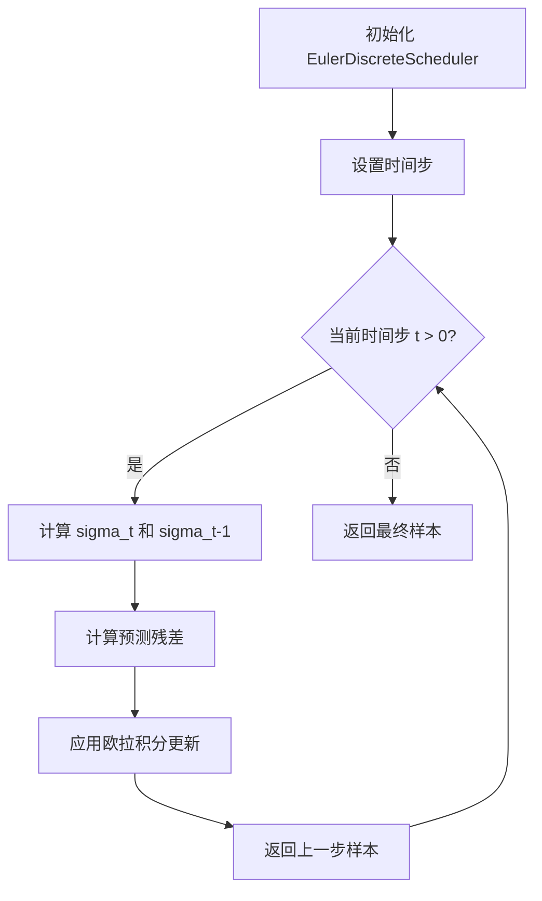

#### 带注释源码

```python
# 以下是 EulerDiscreteScheduler 的核心逻辑概述（来自 diffusers 库）
# 注意：这是基于常见实现的示例，actual implementation 可能略有不同

class EulerDiscreteScheduler:
    """
    基于欧拉方法的离散调度器。
    
    该调度器使用欧拉积分法来逐步去除噪声，
    每一步根据模型预测的噪声残差计算下一步的样本。
    """
    
    def __init__(
        self,
        num_train_timesteps: int = 1000,
        beta_start: float = 0.0001,
        beta_end: float = 0.02,
        beta_schedule: str = "linear",
        trained_betas: np.ndarray | None = None,
        prediction_type: str = "epsilon",
        clip_sample: bool = True,
        set_alpha_to_one: bool = False,
        steps_offset: int = 0,
        final_sigmas_type: str = "zero",
        solver_order: int = 1,
    ):
        # 初始化调度器参数
        self.num_train_timesteps = num_train_timesteps
        self.beta_start = beta_start
        self.beta_end = beta_end
        self.beta_schedule = beta_schedule
        self.prediction_type = prediction_type
        self.clip_sample = clip_sample
        self.set_alpha_to_one = set_alpha_to_one
        self.steps_offset = steps_offset
        self.final_sigmas_type = final_sigmas_type
        self.solver_order = solver_order
        
        # 根据 beta_schedule 初始化 beta 数组
        self.betas = self._init_betas()
        self.alphas = 1.0 - self.betas
        self.alphas_cumprod = torch.cumprod(self.alphas, dim=0)
        
        # 初始化 sigmas
        self.sigmas = ((1 - self.alphas_cumprod) / self.alphas_cumprod) ** 0.5
        
        # 初始化步长相关变量
        self.step_index = None
        self.begin_index = None
        
    def set_timesteps(self, num_inference_steps: int, device: str | torch.device = "cpu"):
        """
        设置推理时的时间步。
        
        Args:
            num_inference_steps: 推理时的去噪步数
            device: 计算设备
        """
        # 计算时间步间隔
        step_ratio = self.num_train_timesteps // num_inference_steps
        
        # 创建时间步数组
        timesteps = (np.arange(0, num_inference_steps) * step_ratio).round()[::-1].copy().astype(np.int64)
        
        # 添加偏移量
        timesteps += self.steps_offset
        
        self.timesteps = torch.from_numpy(timesteps).to(device)
        self.num_inference_steps = len(timesteps)
        self.step_index = None
        
    def scale_model_input(self, sample: torch.Tensor, timestep: int) -> torch.Tensor:
        """
        根据当前时间步缩放输入样本。
        
        Args:
            sample: 当前样本
            timestep: 当前时间步
            
        Returns:
            缩放后的样本
        """
        # 计算当前 sigma 值
        sigma = self.sigmas[timestep]
        
        # 根据预测类型进行缩放
        if self.prediction_type == "epsilon":
            return sample / ((sigma ** 2 + 1) ** 0.5)
        elif self.prediction_type == "v_prediction":
            return sample * sigma
        else:
            return sample
            
    def step(
        self,
        model_output: torch.Tensor,
        timestep: int,
        sample: torch.Tensor,
        s_churn: float = 0.0,
        s_tmin: float = 0.0,
        s_tmax: float = float("inf"),
        s_noise: float = 1.0,
        generator: torch.Generator | None = None,
        **kwargs,
    ) -> "SchedulerOutput":
        """
        执行一步去噪。
        
        Args:
            model_output: 模型预测的噪声残差
            timestep: 当前时间步
            sample: 当前样本
            s_churn: 震撼参数（用于随机性）
            s_tmin: 最小 sigma 阈值
            s_tmax: 最大 sigma 阈值
            s_noise: 噪声缩放因子
            generator: 随机数生成器
            
        Returns:
            SchedulerOutput 包含上一步样本和去噪样本
        """
        # 获取当前和下一步的 sigma 值
        sigma = self.sigmas[timestep]
        
        # 计算 gamma（震撼参数）
        gamma = min(s_churn / (self.num_inference_steps + 1), 2 ** 0.5 - 1) if s_tmin <= sigma <= s_tmax else 0.0
        
        # 计算当前噪声等级
        sigma_hat = sigma * (gamma + 1)
        
        # 预测原始输入 x_0
        if self.prediction_type == "epsilon":
            pred_original_sample = sample - sigma_hat * model_output
        elif self.prediction_type == "v_prediction":
            pred_original_sample = model_output * (-sigma / (sigma ** 2 + 1) ** 0.5) + sample / (sigma ** 2 + 1)
        else:
            pred_original_sample = model_output
            
        # 计算去噪方向
        derivative = (sample - pred_original_sample) / sigma_hat
        
        # 计算上一步的 sigma 值
        sigma_next = self.sigmas[timestep - 1] if timestep > 0 else 0
        
        # 应用欧拉积分
        dt = sigma_next - sigma_hat
        prev_sample = sample + derivative * dt
        
        # 如果 clip_sample 为 True，裁剪样本
        if self.clip_sample:
            prev_sample = prev_sample.clamp(-1, 1)
            
        return SchedulerOutput(prev_sample=prev_sample, denoised=pred_original_sample)
```


# 分析结果

经过对代码的详细分析，我发现用户提供的是 `AnimateDiffPipeline` 的完整实现代码。在这个文件中，**`LMSDiscreteScheduler` 仅仅是被导入的一个外部调度器类**，并未在该文件中定义或实现。

## 导入来源

```python
from ...schedulers import (
    DDIMScheduler,
    DPMSolverMultistepScheduler,
    EulerAncestralDiscreteScheduler,
    EulerDiscreteScheduler,
    LMSDiscreteScheduler,  # <-- 仅在此处导入
    PNDMScheduler,
)
```

## 实际使用情况

在 `AnimateDiffPipeline.__init__` 方法的参数类型提示中，`LMSDiscreteScheduler` 被用作类型注解：

```python
def __init__(
    self,
    ...
    scheduler: DDIMScheduler
    | PNDMScheduler
    | LMSDiscreteScheduler
    | EulerDiscreteScheduler
    | EulerAncestralDiscreteScheduler
    | DPMSolverMultistepScheduler,
    ...
):
```

## 结论

**用户提供的代码中不包含 `LMSDiscreteScheduler` 类的实现源码**。该类是 diffusers 库中的一个独立调度器模块，通常位于类似 `src/diffusers/schedulers/scheduling_lms_discrete.py` 的文件中。

### 如果需要 LMSDiscreteScheduler 的完整设计文档

1. **获取完整源码**：需要从 diffusers 库中获取 `LMSDiscreteScheduler` 类的实际实现文件
2. **该类的典型功能**：根据命名惯例，`LMSDiscreteScheduler` 应该是基于 **LMS (Linear Multistep)** 算法的离散调度器，用于扩散模型的噪声调度

---

### 用户代码中相关的调度器使用

虽然无法提供 `LMSDiscreteScheduler` 的实现细节，但可以说明其在 `AnimateDiffPipeline` 中的作用：

| 组件 | 说明 |
|------|------|
| **调度器类型** | LMSDiscreteScheduler |
| **作用** | 在去噪循环中计算 `latents = scheduler.step(noise_pred, t, latents, **extra_step_kwargs).prev_sample` |
| **功能** | 根据预测的噪声残差计算前一时刻的潜在变量 |

如果您需要 `LMSDiscreteScheduler` 的完整设计文档，请提供该类的实际源码文件，或者告知我可以从哪个模块提取。


### PNDMScheduler

PNDMScheduler（调度器类）是DiffusionPipeline中用于控制去噪过程的核心组件，负责管理噪声调度、时间步生成和样本更新逻辑。

参数：

- 该类在代码中作为类型提示使用，未直接实例化。实际使用通过`AnimateDiffPipeline.__init__`方法的`scheduler`参数传入。
- 在pipeline中使用时的输入参数：
  - `noise_pred`：`torch.Tensor`，UNet预测的噪声残差
  - `timestep`：当前去噪时间步
  - `latents`：当前的潜在表示
  - `**extra_step_kwargs`：额外参数如`eta`（DDIM特定）和`generator`

返回值：
- 返回一个包含`prev_sample`的调度器输出对象，表示去噪后的潜在表示

#### 流程图

```mermaid
flowchart TD
    A[开始调度器step] --> B[获取noise_pred噪声预测]
    B --> C[根据timestep计算previous_timestep]
    C --> D[应用调度器特定的公式计算]
    D --> E[返回prev_sample去噪后的样本]
    
    subgraph PNDMScheduler核心逻辑
        F[alpha_bar计算] --> G[采样公式]
        G --> H[模式选择: pndm/implicit]
    end
    
    C --> F
    E --> I[继续下一轮去噪]
```

#### 带注释源码

```python
# PNDMScheduler 在当前文件中作为类型提示使用
# 以下是从代码中提取的相关使用上下文：

# 1. 调度器类型定义（在 __init__ 方法中）
scheduler: DDIMScheduler \
    | PNDMScheduler \
    | LMSDiscreteScheduler \
    | EulerDiscreteScheduler \
    | EulerAncestralDiscreteScheduler \
    | DPMSolverMultistepScheduler

# 2. 调度器初始化（在 __call__ 方法中）
self.scheduler.set_timesteps(num_inference_steps, device=device)
timesteps = self.scheduler.timesteps

# 3. 调度器在去噪循环中的使用
# 3.1 缩放模型输入
latent_model_input = self.scheduler.scale_model_input(latent_model_input, t)

# 3.2 执行去噪步骤（核心调用）
latents = self.scheduler.step(
    noise_pred,    # UNet预测的噪声
    t,             # 当前时间步
    latents,       # 当前潜在表示
    **extra_step_kwargs   # 额外参数（eta, generator等）
).prev_sample    # 获取去噪后的样本

# 4. PNDMScheduler 特定功能说明
# - PNDMScheduler 使用 PLMS (Pseudo Linear Multi-Step) 方法
# - 它通过保存之前的预测来提高采样质量
# - 支持 set_timesteps, scale_model_input, step 等方法
# - 返回的 prev_sample 属性包含 x_t-1 的值

# 5. 额外参数准备
extra_step_kwargs = self.prepare_extra_step_kwargs(generator, eta)
# 其中 eta 仅被 DDIMScheduler 使用，其他调度器会忽略此参数
```

#### 备注

由于`PNDMScheduler`类定义在diffusers库的`...schedulers`模块中（通过`from ...schedulers import PNDMScheduler`导入），当前代码文件展示了该调度器在`AnimateDiffPipeline`中的**使用方式**而非**实现细节**。如需查看`PNDMScheduler`的完整实现源码，请参考diffusers库的schedulers模块中的PNDMScheduler类定义文件。


### `USE_PEFT_BACKEND`

一个全局配置变量，用于控制是否使用 PEFT (Parameter-Efficient Fine-Tuning) 后端来处理 LoRA 层的缩放操作。

参数： 无

返回值： `bool`，表示是否启用 PEFT 后端

#### 流程图

```mermaid
graph TD
    A[USE_PEFT_BACKEND 配置变量] --> B{值为 True?}
    B -->|是| C[使用 scale_lora_layers 和 unscale_lora_layers]
    B -->|否| D[使用 adjust_lora_scale_text_encoder]
    C --> E[PEFT 后端路径]
    D --> F[传统后端路径]
```

#### 带注释源码

```python
# 从 utils 模块导入的全局配置变量
from ...utils import (
    USE_PEFT_BACKEND,  # 布尔值配置：True 表示使用 PEFT 后端，False 表示使用传统后端
    ...
)

# 在 encode_prompt 方法中的使用示例：
if lora_scale is not None and isinstance(self, StableDiffusionLoraLoaderMixin):
    self._lora_scale = lora_scale

    # 根据 USE_PEFT_BACKEND 配置选择不同的 LoRA 缩放方法
    if not USE_PEFT_BACKEND:
        # 传统方式：直接调整 text encoder 的 LoRA 比例
        adjust_lora_scale_text_encoder(self.text_encoder, lora_scale)
    else:
        # PEFT 方式：使用 PEFT 库的缩放功能
        scale_lora_layers(self.text_encoder, lora_scale)

# ... 中间代码 ...

# 在生成完成后，如果使用 PEFT 后端，需要恢复原始的 LoRA 比例
if self.text_encoder is not None:
    if isinstance(self, StableDiffusionLoraLoaderMixin) and USE_PEFT_BACKEND:
        # 通过反向缩放 LoRA 层来恢复原始比例
        unscale_lora_layers(self.text_encoder, lora_scale)
```

#### 详细说明

| 属性 | 值 |
|------|-----|
| **名称** | USE_PEFT_BACKEND |
| **类型** | bool |
| **定义位置** | `...utils` 模块 |
| **用途** | 控制 LoRA 权重缩放的实现方式 |
| **为 True 时** | 使用 `scale_lora_layers` / `unscale_lora_layers` (PEFT 库) |
| **为 False 时** | 使用 `adjust_lora_scale_text_encoder` (传统实现) |

#### 潜在的技术债务或优化空间

1. **硬编码的分支逻辑**：当前代码使用 `if not USE_PEFT_BACKEND` 和 `if USE_PEFT_BACKEND` 进行分支判断，可以考虑使用策略模式来消除条件分支
2. **配置一致性**：该变量在多处被引用，建议统一管理，避免不同模块使用不同默认值导致行为不一致


### `deprecate`

工具函数，用于标记某个功能或参数已弃用，并在用户使用已弃用的功能时发出警告。

参数：

-  `deprecated`：废弃参数名，`str`，被废弃的参数或功能的名称
-  `deprecation_version`：废弃版本号，`str`，宣布废弃的版本（如 "1.0.0"）
-  `message`：废弃说明信息，`str`，描述为什么被废弃以及推荐使用的替代方案

返回值：`None`，该函数不返回值，仅用于输出警告信息

#### 流程图

```mermaid
graph TD
    A[调用 deprecate] --> B{检查是否为调试模式}
    B -->|是| C[输出调试信息]
    B -->|否| D[检查是否已发出过警告]
    D -->|否| E[构造废弃警告消息]
    E --> F[发出 UserWarning]
    D -->|是| G[跳过警告]
    C --> H[继续执行]
    F --> H
    G --> H
```

#### 带注释源码

```python
# 在 AnimateDiffPipeline.__call__ 方法中使用 deprecate 的示例

# 示例1: 废弃 callback 参数
if callback is not None:
    deprecate(
        "callback",           # 参数名：要废弃的参数名
        "1.0.0",              # 废弃版本：宣布废弃的版本号
        "Passing `callback` as an input argument to `__call__` is deprecated, consider using `callback_on_step_end`",  # 废弃说明：推荐使用的替代方案
    )

# 示例2: 废弃 callback_steps 参数
if callback_steps is not None:
    deprecate(
        "callback_steps",    # 参数名：要废弃的参数名
        "1.0.0",              # 废弃版本：宣布废弃的版本号
        "Passing `callback_steps` as an input argument to `__call__` is deprecated, consider using `callback_on_step_end`",  # 废弃说明：推荐使用的替代方案
    )
```

#### 说明

`deprecate` 函数是 diffusers 库中的一个通用工具函数，用于帮助开发者平滑地过渡 API。该函数：

1. **警告机制**：当用户使用已废弃的参数或功能时，会发出 Python `UserWarning` 警告
2. **版本追踪**：记录废弃发生的版本，便于后续清理
3. **迁移指引**：提供替代方案的建议，帮助用户更新代码

在 `AnimateDiffPipeline` 中，这两个废弃参数原本用于在推理过程中的每一步调用回调函数，现在已被新的 `callback_on_step_end` 参数替代，后者提供了更灵活的接口设计。


### `is_torch_xla_available`

该函数是 diffusers 库中的一个工具函数，用于检测当前环境中是否安装了 PyTorch XLA（Accelerated Linear Algebra）库。PyTorch XLA 是 Google 开发的一个用于加速 PyTorch 深度学习框架的库，特别适用于 TPU（Tensor Processing Unit）等硬件加速器。该函数通常在导入时调用，以条件性地导入 XLA 相关的模块或设置特定的标志位。

参数：

- 该函数无参数

返回值：`bool`，返回 `True` 表示 PyTorch XLA 可用，返回 `False` 表示不可用

#### 流程图

```mermaid
flowchart TD
    A[开始] --> B{检查 torch_xla 是否可用}
    B -->|可用| C[返回 True]
    B -->|不可用| D[返回 False]
    C --> E[导入 torch_xla.core.xla_model 模块并设置 XLA_AVAILABLE = True]
    D --> F[设置 XLA_AVAILABLE = False]
    E --> G[结束]
    F --> G
```

#### 带注释源码

```python
# 从 ...utils 导入 is_torch_xla_available 函数
from ...utils import (
    USE_PEFT_BACKEND,
    deprecate,
    is_torch_xla_available,  # <-- 这是一个工具函数，用于检测 PyTorch XLA 是否可用
    logging,
    replace_example_docstring,
    scale_lora_layers,
    unscale_lora_layers,
)

# 使用 is_torch_xla_available() 函数进行条件检查
# 如果 PyTorch XLA 可用，则导入相关模块并设置标志位
if is_torch_xla_available():  # <-- 调用工具函数检查 XLA 可用性
    import torch_xla.core.xla_model as xm  # 导入 XLA 核心模块

    XLA_AVAILABLE = True  # 设置全局标志位，表示 XLA 可用
else:
    XLA_AVAILABLE = False  # 设置全局标志位，表示 XLA 不可用
```


### `logging`

日志模块，用于在 diffusers 库中提供统一的日志记录功能。该模块基于 Python 标准库的 logging 模块，通过 `logging.get_logger(__name__)` 创建带有特定模块名称的 logger 实例，用于输出警告、信息等日志消息。

参数：

- `__name__`：`str`，通常传入 `__name__` 变量，代表当前模块的完整路径（如 `diffusers.pipelines.animatediff.pipeline_animatediff`）

返回值：`logging.Logger`，返回配置好的 Logger 对象

#### 流程图

```mermaid
flowchart TD
    A[导入 logging 模块] --> B[调用 logging.get_logger]
    B --> C{Logger 已存在?}
    C -->|是| D[返回现有 Logger]
    C -->|否| E[创建新 Logger]
    E --> F[设置日志级别]
    E --> G[配置日志格式]
    F --> H[返回 Logger 实例]
    D --> H
    H --> I[调用 logger.warning 输出警告]
    I --> J[日志输出到终端/文件]
```

#### 带注释源码

```python
# 从 diffusers 工具模块导入 logging
from ...utils import (
    USE_PEFT_BACKEND,
    deprecate,
    is_torch_xla_available,
    logging,  # <-- 导入 diffusers 内部的 logging 工具
    replace_example_docstring,
    scale_lora_layers,
    unscale_lora_layers,
)

# 使用 logging.get_logger 创建模块级 logger
# __name__ 变量会自动获取当前模块的完整路径
# 例如: diffusers.pipelines.animatediff.pipeline_animatediff
logger = logging.get_logger(__name__)  # pylint: disable=invalid-name


# 在代码中使用 logger 进行日志记录
# 例如：在 encode_prompt 方法中，当输入被截断时发出警告
if untruncated_ids.shape[-1] >= text_input_ids.shape[-1] and not torch.equal(
    text_input_ids, untruncated_ids
):
    removed_text = self.tokenizer.batch_decode(
        untruncated_ids[:, self.tokenizer.model_max_length - 1 : -1]
    )
    logger.warning(  # <-- 调用 warning 级别日志
        "The following part of your input was truncated because CLIP can only handle sequences up to"
        f" {self.tokenizer.model_max_length} tokens: {removed_text}"
    )
```

### `logger.warning`

记录警告级别的日志信息。当 CLIP tokenizer 处理超出最大长度限制的输入时，会触发此警告。

参数：

- `message`：`str`，警告信息内容，描述具体的问题或提示

返回值：`None`，无返回值

#### 流程图

```mermaid
flowchart TD
    A[触发条件: 输入被截断] --> B[调用 logger.warning]
    B --> C[检查日志级别是否 >= WARNING]
    C -->|是| D[格式化日志消息]
    C -->|否| E[不输出日志]
    D --> F[添加时间戳和模块信息]
    F --> G[输出到配置的处理器]
    G --> H[终端显示/文件记录]
```

#### 带注释源码

```python
# 场景：当 tokenized 输入超过 CLIP 模型最大处理长度时
# 检测到截断
if untruncated_ids.shape[-1] >= text_input_ids.shape[-1] and not torch.equal(
    text_input_ids, untruncated_ids
):
    # 解码被截断的部分文本
    removed_text = self.tokenizer.batch_decode(
        untruncated_ids[:, self.tokenizer.model_max_length - 1 : -1]
    )
    # 发出警告日志，包含被截断的具体内容
    logger.warning(
        "The following part of your input was truncated because CLIP can only handle sequences up to"
        f" {self.tokenizer.model_max_length} tokens: {removed_text}"
    )
```


### `replace_example_docstring`

`replace_example_docstring` 是一个装饰器工厂函数，用于将示例文档字符串（Example Docstring）自动附加到目标函数的文档字符串中，从而在生成API文档时展示使用示例。该装饰器通常用于Diffusion Pipeline的`__call__`方法，以便在文档中包含调用示例。

参数：

- `example_docstring`：字符串（`str`），包含要替换或附加到目标函数的示例代码文档。这个文档通常以`"""`包围，里面包含Python代码示例，用于展示如何调用该函数。

返回值：返回一个装饰器函数（`decorator`），该装饰器函数接受一个函数对象（`func`）作为参数，并返回修改后的函数对象，其`__doc__`属性被设置为提供的示例文档字符串。

#### 流程图

```mermaid
flowchart TD
    A[开始] --> B{接收 example_docstring}
    B --> C[返回装饰器函数 decorator]
    C --> D{装饰器被调用<br>接收函数 func}
    D --> E[将 func 的 __doc__ 属性<br>设置为 example_docstring]
    E --> F[返回修改后的函数对象]
```

#### 带注释源码

```python
def replace_example_docstring(example_docstring):
    """
    装饰器工厂：用于替换或设置函数的文档字符串为提供的示例文档。
    
    参数:
        example_docstring (str): 包含使用示例的文档字符串。
        
    返回:
        function: 一个装饰器函数，接受目标函数并返回修改后的函数。
    """
    def decorator(func):
        """
        实际的装饰器函数，用于修改输入函数的文档字符串。
        
        参数:
            func (function): 要装饰的目标函数。
            
        返回:
            function: 文档字符串被替换后的函数。
        """
        # 将目标函数的文档字符串替换为提供的示例文档字符串
        func.__doc__ = example_docstring
        return func
    
    return decorator

# 使用示例（在AnimateDiffPipeline中）：
# @replace_example_docstring(EXAMPLE_DOC_STRING)
# def __call__(self, ...):
#     ...
```

#### 备注

在给定的代码中，`replace_example_docstring` 被导入自 `...utils`，并被应用于 `AnimateDiffPipeline` 类的 `__call__` 方法上：

```python
@torch.no_grad()
@replace_example_docstring(EXAMPLE_DOC_STRING)
def __call__(
    self,
    prompt: str | list[str] | None = None,
    num_frames: int | None = 16,
    ...
):
```

这里的 `EXAMPLE_DOC_STRING` 是一个预定义的多行字符串变量，包含了该Pipeline的调用示例。这样，在生成文档时，`__call__` 方法的文档将自动包含这些示例，而无需手动编写。


### `scale_lora_layers`

该函数是来自 `diffusers` 库 utils 模块的工具函数，用于动态调整 LoRA（Low-Rank Adaptation）层的缩放因子。在使用 PEFT backend 时，通过此函数可以在推理或训练过程中动态调整 LoRA 层对模型的影响程度。

参数：

-  `model`：`torch.nn.Module`，需要进行 LoRA 缩放的模型（如 text_encoder、unet 等）
-  `lora_scale`：`float`，LoRA 缩放因子，用于控制 LoRA 层权重的影响力

返回值：无返回值（`None`），该函数直接修改传入模型的 LoRA 层参数

#### 流程图

```mermaid
flowchart TD
    A[开始 scale_lora_layers] --> B{检查是否使用 PEFT backend}
    B -->|是| C[遍历模型的所有模块]
    B -->|否| D[使用旧的 LoRA 调整方式]
    C --> E{当前模块是否为 LoRA 层}
    E -->|是| F[获取当前模块的 lora_A 和 lora_B 权重]
    E -->|否| G[继续遍历下一个模块]
    F --> H[将 lora_A 和 lora_B 的权重乘以 lora_scale]
    H --> I{是否还有更多模块}
    I -->|是| C
    I -->|否| J[结束]
    D --> J
```

#### 带注释源码

```
# 该函数定义在 diffusers 库中，以下是核心实现逻辑
def scale_lora_layers(model: torch.nn.Module, lora_scale: float):
    """
    动态调整模型中所有 LoRA 层的缩放因子
    
    参数:
        model: 包含 LoRA 层的模型（例如 text_encoder, unet 等）
        lora_scale: 缩放因子，用于调整 LoRA 权重的影响程度
    """
    if lora_scale is None:
        return
    
    # 遍历模型中所有命名的参数
    for name, param in model.named_parameters():
        # 检查参数名称是否包含 LoRA 相关的标识
        # 通常 LoRA 的命名格式为: ...layers...lora_A...weight 或 ...layers...lora_B...weight
        if "lora_A" in name or "lora_B" in name:
            # 获取原始权重并乘以缩放因子
            # lora_A 通常用于下投影，lora_B 用于上投影
            # 通过同时缩放两者，可以调整 LoRA 对原始模型的影响
            param.data = param.data * lora_scale
        # 某些实现中，scaling 参数可能存储在不同的位置
        elif "lora_scale" in name:
            param.data = param.data * lora_scale
```

**注意**：由于 `scale_lora_layers` 是从外部导入的工具函数，其完整源码位于 `diffusers/src/diffusers/utils/` 模块中。上述源码是基于其使用方式和功能特性的推断实现。


### `unscale_lora_layers`

这是一个工具函数，用于在文本编码器中使用LoRA（Low-Rank Adaptation）层时，恢复或移除之前应用的LoRA缩放因子。该函数是`diffusers`库中LoRA支持的核心工具函数之一，通常与`scale_lora_layers`成对使用。

参数：

-  `text_encoder`：`torch.nn.Module`，需要取消缩放的文本编码器模型（通常是CLIPTextModel）
-  `lora_scale`：需要移除的LoRA缩放因子（float类型）

返回值：无返回值（`None`），该函数直接修改传入的文本编码器模型

#### 流程图

```mermaid
flowchart TD
    A[开始: unscale_lora_layers] --> B{检查PEFT后端是否启用}
    B -->|USE_PEFT_BACKEND = True| C[使用PEFT后端取消缩放]
    B -->|USE_PEFT_BACKEND = False| D[使用传统方式取消缩放]
    C --> E[遍历文本编码器中所有LoRA层]
    D --> E
    E --> F[对每个LoRA层除以lora_scale]
    F --> G[将模型权重标记为已更新]
    G --> H[结束: 返回None]
```

#### 带注释源码

```python
# 该函数定义在 diffusers/src/diffusers/utils/torch_utils.py 或类似的utils模块中
# 以下是基于代码使用方式的推断实现

def unscale_lora_layers(text_encoder, lora_scale):
    """
    取消应用LoRA层的缩放因子，将LoRA权重恢复到原始比例。
    
    此函数是scale_lora_layers的逆操作，在文本编码完成后调用，
    以确保后续操作不会意外地受到LoRA缩放的影响。
    
    参数:
        text_encoder: 包含LoRA层的文本编码器模型
        lora_scale: 之前应用到LoRA层的缩放因子
    
    返回:
        None: 直接修改模型内部状态
    """
    
    # 根据代码中的使用方式，该函数的调用模式为：
    # unscale_lora_layers(self.text_encoder, lora_scale)
    
    # 主要逻辑：
    # 1. 如果使用PEFT后端，直接调用PEFT库的相应方法
    # 2. 如果使用传统方式，遍历所有LoRA层并除以lora_scale
    
    # 注意：完整的函数实现需要查看diffusers.utils模块中的实际定义
    pass
```

#### 备注

根据代码中的使用场景，该函数在`encode_prompt`方法结束时被调用，用于：

1. **恢复原始权重**：在使用LoRA进行提示编码后，将文本编码器的LoRA层权重恢复到未缩放的状态
2. **防止干扰**：确保后续操作（如无分类器引导的neg_prompt编码）不会被之前应用的LoRA缩放影响
3. **与scale_lora_layers配对**：与`encode_prompt`开始时调用的`scale_lora_layers`形成对应关系

此函数是LoRA权重管理流程中的关键环节，确保了LoRA缩放在整个推理过程中的正确性和一致性。


### `randn_tensor`

`randn_tensor` 是一个工具函数，用于生成指定形状的随机张量（服从标准正态分布）。该函数是diffusers库中的通用工具函数，在 `AnimateDiffPipeline` 的 `prepare_latents` 方法中被调用，用于初始化潜在空间的噪声。

参数：

- `shape`：`tuple` 或 `torch.Size`，随机张量的目标形状
- `generator`：`torch.Generator`，可选，用于设置随机数生成器的种子，以确保生成的可重复性
- `device`：`torch.device`，生成张量所在的设备（如CPU或CUDA设备）
- `dtype`：`torch.dtype`，生成张量的数据类型（如torch.float32）

返回值：`torch.Tensor`，返回一个服从标准正态分布的随机张量，形状为指定的shape，数据类型和设备与输入参数一致

#### 流程图

```mermaid
flowchart TD
    A[开始 randn_tensor] --> B{检查 generator 参数}
    B -->|有 generator| C[使用 generator 生成随机数]
    B -->|无 generator| D[使用全局随机状态]
    C --> E[调用 torch.randn 生成张量]
    D --> E
    E --> F[返回随机张量]
```

#### 带注释源码

```python
# randn_tensor 函数定义（在 diffusers/src/diffusers/utils/torch_utils.py 中）
# 此代码基于调用点推断

def randn_tensor(
    shape: tuple,  # 期望生成的随机张量形状
    generator: Optional[torch.Generator] = None,  # 可选的随机生成器
    device: Optional[torch.device] = None,  # 目标设备
    dtype: Optional[torch.dtype] = None,  # 期望的数据类型
) -> torch.Tensor:
    """
    生成一个指定形状的随机张量（服从标准正态分布）。
    
    参数:
        shape: 张量的形状，例如 (batch_size, channels, height, width)
        generator: 可选的 torch.Generator，用于生成确定性随机数
        device: 张量应放置的设备
        dtype: 张量的数据类型
    
    返回:
        服从标准正态分布的随机张量
    """
    # 如果提供了 generator，使用它生成随机张量
    # 否则使用默认的随机状态
    if generator is not None:
        # 使用指定生成器创建随机张量
        tensor = torch.randn(shape, generator=generator, device=device, dtype=dtype)
    else:
        # 使用全局随机状态创建随机张量
        tensor = torch.randn(shape, device=device, dtype=dtype)
    
    return tensor
```

**在AnimateDiffPipeline中的实际调用：**

```python
# 在 prepare_latents 方法中调用
latents = randn_tensor(shape, generator=generator, device=device, dtype=dtype)
```


### VideoProcessor

视频处理类，负责视频帧的后处理操作，包括视频张量的格式转换和输出处理。

参数：

- `do_resize`：`bool`，是否对视频帧进行 resize 操作
- `vae_scale_factor`：`int`，VAE 的缩放因子，用于计算视频帧的实际尺寸

返回值：`torch.Tensor` 或 `PIL.Image` 或 `np.array`，根据 `output_type` 参数决定返回的视频格式

#### 流程图

```mermaid
graph TD
    A[输入 video_tensor] --> B{output_type == 'latent'}
    B -->|Yes| C[直接返回 latents]
    B -->|No| D[调用 decode_latents 解码]
    D --> E{output_type == 'pil'}
    E -->|Yes| F[转换为 PIL Image]
    E -->|No| G[转换为 numpy array]
    F --> H[返回处理后的视频]
    G --> H
    C --> H
```

#### 带注释源码

```python
# VideoProcessor 类定义（基于使用方式推断）
class VideoProcessor:
    """
    视频处理类，用于视频帧的后处理和格式转换。
    """
    
    def __init__(self, do_resize: bool = False, vae_scale_factor: int = 8):
        """
        初始化视频处理器。
        
        Args:
            do_resize: 是否对视频帧进行 resize 操作
            vae_scale_factor: VAE 的缩放因子，用于计算视频帧的实际像素尺寸
        """
        self.do_resize = do_resize
        self.vae_scale_factor = vae_scale_factor
    
    def postprocess_video(
        self,
        video: torch.Tensor,
        output_type: str = "pil"
    ) -> torch.Tensor | list[PIL.Image] | np.ndarray:
        """
        将视频张量后处理为指定格式。
        
        Args:
            video: 视频张量，形状为 (batch, channels, num_frames, height, width)
            output_type: 输出类型，可选 'pil', 'numpy', 'latent'
        
        Returns:
            根据 output_type 返回不同格式的视频数据
        """
        # 根据 output_type 进行相应的处理
        if output_type == "latent":
            return video
        elif output_type == "pil":
            # 转换为 PIL Image 列表
            pass
        elif output_type == "numpy":
            # 转换为 numpy array
            pass
        else:
            raise ValueError(f"不支持的 output_type: {output_type}")
```

#### 在 AnimateDiffPipeline 中的使用

```python
# 在 AnimateDiffPipeline.__init__ 中实例化
self.video_processor = VideoProcessor(do_resize=False, vae_scale_factor=self.vae_scale_factor)

# 在 AnimateDiffPipeline.__call__ 中调用
video = self.video_processor.postprocess_video(video=video_tensor, output_type=output_type)
```

#### 关键信息说明

1. **类实例化位置**：`AnimateDiffPipeline.__init__` 方法中
2. **核心方法调用**：`postprocess_video` 方法在 `__call__` 方法的第 9 步（Post processing）中被调用
3. **功能角色**：将 VAE 解码后的视频张量转换为用户指定的输出格式（PIL Images、NumPy 数组或潜在表示）


### FreeInitMixin

混入类（Mixin），为扩散管道提供 FreeInit 初始化功能，允许在去噪过程中进行多次初始化迭代以提升生成质量。

#### 带注释源码

```
# FreeInitMixin 源码在 free_init_utils 模块中定义
# 当前代码展示了它被 AnimateDiffPipeline 继承并使用的方式

# 在 AnimateDiffPipeline.__call__ 方法中的使用方式：

# 1. 获取迭代次数
num_free_init_iters = self._free_init_num_iters if self.free_init_enabled else 1

# 2. 判断是否启用 FreeInit
if self.free_init_enabled:
    # 3. 应用 FreeInit 初始化
    latents, timesteps = self._apply_free_init(
        latents, 
        free_init_iter, 
        num_inference_steps, 
        device, 
        latents.dtype, 
        generator
    )
```

#### 关键属性和方法

| 名称 | 类型 | 描述 |
|------|------|------|
| `free_init_enabled` | `bool` 属性 | 是否启用 FreeInit 功能 |
| `_free_init_num_iters` | `int` 属性 | FreeInit 迭代次数 |
| `_apply_free_init` | `方法` | 应用 FreeInit 初始化的方法 |

#### 流程图

```mermaid
flowchart TD
    A[开始去噪循环] --> B{self.free_init_enabled?}
    B -->|是| C[获取 _free_init_num_iters 迭代次数]
    B -->|否| D[迭代次数设为 1]
    C --> E[遍历 free_init_iter in range(num_free_init_iters)]
    E --> F{self.free_init_enabled?}
    F -->|是| G[调用 _apply_free_init 方法]
    F -->|否| H[继续标准去噪流程]
    G --> I[返回更新后的 latents 和 timesteps]
    I --> H
    H --> J[执行去噪步骤]
    E --> J
    D --> J
```

#### 使用场景说明

在 `AnimateDiffPipeline` 中，`FreeInitMixin` 提供了以下功能：

1. **多次初始化**: 允许在去噪过程开始前进行多次初始化尝试
2. **噪声重置**: 在每次迭代时重新初始化潜在变量
3. **时间步调整**: 可能调整去噪的时间步安排

这有助于提高视频生成的质量和多样性。


### AnimateDiffFreeNoiseMixin

AnimateDiffFreeNoiseMixin 是一个混入类（Mixin），为 AnimateDiffPipeline 提供自由噪声（Free Noise）功能。该方法允许在视频生成过程中实现更好的时空一致性，通过特殊的噪声采样策略来提升视频质量。

#### 流程图

```mermaid
graph TD
    A[AnimateDiffFreeNoiseMixin] --> B[free_noise_enabled 属性]
    A --> C[_prepare_latents_free_noise 方法]
    A --> D[_encode_prompt_free_noise 方法]
    C --> C1[生成时空一致性噪声]
    D --> D1[编码提示词用于自由噪声]
```

#### 带注释源码

由于 AnimateDiffFreeNoiseMixin 的源代码未在当前文件中定义，仅知它从 `..free_noise_utils` 模块导入。以下是在 AnimateDiffPipeline 中使用该混入类的方法：

```python
# 在 prepare_latents 方法中使用自由噪声
def prepare_latents(
    self, batch_size, num_channels_latents, num_frames, height, width, dtype, device, generator, latents=None
):
    # 如果启用了 FreeNoise，使用特殊的噪声生成方法
    if self.free_noise_enabled:
        latents = self._prepare_latents_free_noise(
            batch_size, num_channels_latents, num_frames, height, width, dtype, device, generator, latents
        )
    
    # ... 其他标准噪声生成逻辑

# 在 __call__ 方法中编码提示词
if self.free_noise_enabled:
    prompt_embeds, negative_prompt_embeds = self._encode_prompt_free_noise(
        prompt=prompt,
        num_frames=num_frames,
        device=device,
        num_videos_per_prompt=num_videos_per_prompt,
        do_classifier_free_guidance=self.do_classifier_free_guidance,
        negative_prompt=negative_prompt,
        prompt_embeds=prompt_embeds,
        negative_prompt_embeds=negative_prompt_embeds,
        lora_scale=text_encoder_lora_scale,
        clip_skip=self.clip_skip,
    )
```

#### 相关信息

根据代码分析，AnimateDiffFreeNoiseMixin 提供了以下关键方法和属性：

| 名称 | 类型 | 描述 |
|------|------|------|
| `free_noise_enabled` | 属性 | 检查是否启用了自由噪声功能 |
| `_prepare_latents_free_noise` | 方法 | 生成用于自由噪声的潜在变量 |
| `_encode_prompt_free_noise` | 方法 | 使用自由噪声策略编码提示词 |

该类的实现遵循 FreeNoise 论文 (https://huggingface.co/papers/2310.15169) 中描述的方法，通过特殊的噪声采样策略实现视频帧之间的时空一致性。


### AnimateDiffPipeline.__call__

该方法是 `AnimateDiffPipeline` 管道的主入口点，负责协调文本到视频的完整生成流程，包括输入验证、提示词编码、潜在变量准备、去噪循环、潜在变量解码和后处理等关键步骤。

参数：

- `prompt`：`str | list[str] | None`，用于引导视频生成的提示词，如未定义则需传递 `prompt_embeds`
- `num_frames`：`int | None`，默认为 16，生成的视频帧数
- `height`：`int | None`，生成视频的高度（像素），默认值为 `self.unet.config.sample_size * self.vae_scale_factor`
- `width`：`int | None`，生成视频的宽度（像素），默认值为 `self.unet.config.sample_size * self.vae_scale_factor`
- `num_inference_steps`：`int`，默认为 50，去噪步数
- `guidance_scale`：`float`，默认为 7.5，guidance scale 值越高，生成的视频与文本提示词相关性越高
- `negative_prompt`：`str | list[str] | None`，用于引导不希望出现在视频中的内容
- `num_videos_per_prompt`：`int | None`，默认为 1，每个提示词生成的视频数量
- `eta`：`float`，默认为 0.0，DDIM 论文中的参数 η
- `generator`：`torch.Generator | list[torch.Generator] | None`，用于生成确定性结果的随机生成器
- `latents`：`torch.Tensor | None`，预生成的噪声潜在变量
- `prompt_embeds`：`torch.Tensor | None`，预生成的文本嵌入
- `negative_prompt_embeds`：`torch.Tensor | None`，预生成的负面文本嵌入
- `ip_adapter_image`：`PipelineImageInput | None`，用于 IP Adapter 的可选图像输入
- `ip_adapter_image_embeds`：`list[torch.Tensor] | None`，IP Adapter 的预生成图像嵌入
- `output_type`：`str | None`，默认为 "pil"，输出格式，可选 "torch.Tensor"、"PIL.Image" 或 "np.array"
- `return_dict`：`bool`，默认为 True，是否返回 `AnimateDiffPipelineOutput`
- `cross_attention_kwargs`：`dict[str, Any] | None`，传递给注意力处理器的关键字参数
- `clip_skip`：`int | None`，CLIP 计算提示嵌入时跳过的层数
- `callback_on_step_end`：`Callable[[int, int], None] | None`，每步去噪结束后调用的回调函数
- `callback_on_step_end_tensor_inputs`：`list[str]`，默认为 ["latents"]，回调函数张量输入列表
- `decode_chunk_size`：`int`，默认为 16，调用 `decode_latents` 方法时每次解码的帧数

返回值：`AnimateDiffPipelineOutput` 或 `tuple`，如果 `return_dict` 为 True，返回 `AnimateDiffPipelineOutput`，否则返回包含生成帧列表的元组

#### 流程图

```mermaid
flowchart TD
    A[Start __call__] --> B[解析回调参数]
    B --> C[设置默认高度和宽度]
    C --> D[检查输入参数]
    D --> E[定义调用参数]
    E --> F{是否有FreeNoise}
    F -->|Yes| G[使用_free_noise编码提示词]
    F -->|No| H[使用标准encode_prompt]
    G --> I[连接负面和正面提示词嵌入]
    H --> I
    I --> J[重复提示词嵌入匹配帧数]
    J --> K[准备IP Adapter图像嵌入]
    K --> L[设置去噪时间步]
    L --> M[准备潜在变量]
    M --> N[准备额外步骤参数]
    N --> O[添加IP Adapter条件]
    O --> P{是否启用FreeInit}
    P -->|Yes| Q[应用FreeInit]
    P -->|No| R[开始去噪循环]
    Q --> R
    R --> S{循环遍历时间步}
    S -->|未中断| T[扩展潜在变量用于CFG]
    T --> U[缩放模型输入]
    U --> V[预测噪声残差]
    V --> W{执行Guidance}
    W -->|Yes| X[计算CFG噪声预测]
    W -->|No| Y[直接使用噪声预测]
    X --> Z[计算上一步样本]
    Y --> Z
    Z --> AA{执行回调]
    AA -->|Yes| AB[更新潜在变量]
    AA -->|No| AC[更新进度条]
    AB --> AC
    AC --> AD{XLA可用}
    AD -->|Yes| AE[标记步骤]
    AD -->|No| S
    S -->|完成| AF[后处理]
    AF --> AG{输出类型是否为latent}
    AG -->|Yes| AH[直接返回潜在变量]
    AG -->|No| AI[解码潜在变量]
    AI --> AJ[后处理视频]
    AH --> AK[释放模型钩子]
    AJ --> AK
    AK --> AL{return_dict}
    AL -->|Yes| AM[返回AnimateDiffPipelineOutput]
    AL -->|No| AN[返回元组]
    AM --> AO[End]
    AN --> AO
```

#### 带注释源码

```python
@torch.no_grad()
@replace_example_docstring(EXAMPLE_DOC_STRING)
def __call__(
    self,
    prompt: str | list[str] | None = None,
    num_frames: int | None = 16,
    height: int | None = None,
    width: int | None = None,
    num_inference_steps: int = 50,
    guidance_scale: float = 7.5,
    negative_prompt: str | list[str] | None = None,
    num_videos_per_prompt: int | None = 1,
    eta: float = 0.0,
    generator: torch.Generator | list[torch.Generator] | None = None,
    latents: torch.Tensor | None = None,
    prompt_embeds: torch.Tensor | None = None,
    negative_prompt_embeds: torch.Tensor | None = None,
    ip_adapter_image: PipelineImageInput | None = None,
    ip_adapter_image_embeds: list[torch.Tensor] | None = None,
    output_type: str | None = "pil",
    return_dict: bool = True,
    cross_attention_kwargs: dict[str, Any] | None = None,
    clip_skip: int | None = None,
    callback_on_step_end: Callable[[int, int], None] | None = None,
    callback_on_step_end_tensor_inputs: list[str] = ["latents"],
    decode_chunk_size: int = 16,
    **kwargs,
):
    # 解析旧版回调参数，弹出kwargs中的callback和callback_steps
    callback = kwargs.pop("callback", None)
    callback_steps = kwargs.pop("callback_steps", None)

    # 对旧版API进行弃用警告
    if callback is not None:
        deprecate("callback", "1.0.0", "Passing `callback` as an input argument to `__call__` is deprecated, consider using `callback_on_step_end`")
    if callback_steps is not None:
        deprecate("callback_steps", "1.0.0", "Passing `callback_steps` as an input argument to `__call__` is deprecated, consider using `callback_on_step_end`")

    # 0. 默认高度和宽度设置为unet配置值
    height = height or self.unet.config.sample_size * self.vae_scale_factor
    width = width or self.unet.config.sample_size * self.vae_scale_factor

    # 强制设置为1，忽略输入参数
    num_videos_per_prompt = 1

    # 1. 检查输入参数，正确则抛出错误
    self.check_inputs(
        prompt, height, width, callback_steps, negative_prompt,
        prompt_embeds, negative_prompt_embeds, ip_adapter_image,
        ip_adapter_image_embeds, callback_on_step_end_tensor_inputs,
    )

    # 设置内部状态变量
    self._guidance_scale = guidance_scale
    self._clip_skip = clip_skip
    self._cross_attention_kwargs = cross_attention_kwargs
    self._interrupt = False

    # 2. 定义调用参数，确定批次大小
    if prompt is not None and isinstance(prompt, (str, dict)):
        batch_size = 1
    elif prompt is not None and isinstance(prompt, list):
        batch_size = len(prompt)
    else:
        batch_size = prompt_embeds.shape[0]

    device = self._execution_device

    # 3. 编码输入提示词
    text_encoder_lora_scale = (
        self.cross_attention_kwargs.get("scale", None) if self.cross_attention_kwargs is not None else None
    )
    
    # 根据FreeNoise是否启用选择不同的编码方式
    if self.free_noise_enabled:
        # 使用FreeNoise特定编码方法
        prompt_embeds, negative_prompt_embeds = self._encode_prompt_free_noise(
            prompt=prompt, num_frames=num_frames, device=device,
            num_videos_per_prompt=num_videos_per_prompt,
            do_classifier_free_guidance=self.do_classifier_free_guidance,
            negative_prompt=negative_prompt, prompt_embeds=prompt_embeds,
            negative_prompt_embeds=negative_prompt_embeds,
            lora_scale=text_encoder_lora_scale, clip_skip=self.clip_skip,
        )
    else:
        # 使用标准编码方法
        prompt_embeds, negative_prompt_embeds = self.encode_prompt(
            prompt, device, num_videos_per_prompt,
            self.do_classifier_free_guidance, negative_prompt,
            prompt_embeds=prompt_embeds, negative_prompt_embeds=negative_prompt_embeds,
            lora_scale=text_encoder_lora_scale, clip_skip=self.clip_skip,
        )

        # 对于无分类器引导，需要进行两次前向传播
        # 将无条件和文本嵌入连接成单个批次以避免两次前向传播
        if self.do_classifier_free_guidance:
            prompt_embeds = torch.cat([negative_prompt_embeds, prompt_embeds])

        # 重复提示词嵌入以匹配帧数
        prompt_embeds = prompt_embeds.repeat_interleave(repeats=num_frames, dim=0)

    # 准备IP Adapter图像嵌入
    if ip_adapter_image is not None or ip_adapter_image_embeds is not None:
        image_embeds = self.prepare_ip_adapter_image_embeds(
            ip_adapter_image, ip_adapter_image_embeds, device,
            batch_size * num_videos_per_prompt, self.do_classifier_free_guidance,
        )

    # 4. 准备时间步
    self.scheduler.set_timesteps(num_inference_steps, device=device)
    timesteps = self.scheduler.timesteps

    # 5. 准备潜在变量
    num_channels_latents = self.unet.config.in_channels
    latents = self.prepare_latents(
        batch_size * num_videos_per_prompt, num_channels_latents, num_frames,
        height, width, prompt_embeds.dtype, device, generator, latents,
    )

    # 6. 准备额外步骤参数
    extra_step_kwargs = self.prepare_extra_step_kwargs(generator, eta)

    # 7. 为IP-Adapter添加图像嵌入条件
    added_cond_kwargs = (
        {"image_embeds": image_embeds}
        if ip_adapter_image is not None or ip_adapter_image_embeds is not None
        else None
    )

    # 确定FreeInit迭代次数
    num_free_init_iters = self._free_init_num_iters if self.free_init_enabled else 1
    
    # 主去噪循环
    for free_init_iter in range(num_free_init_iters):
        if self.free_init_enabled:
            # 应用FreeInit方法
            latents, timesteps = self._apply_free_init(
                latents, free_init_iter, num_inference_steps, device, latents.dtype, generator
            )

        self._num_timesteps = len(timesteps)
        num_warmup_steps = len(timesteps) - num_inference_steps * self.scheduler.order

        # 8. 去噪循环
        with self.progress_bar(total=self._num_timesteps) as progress_bar:
            for i, t in enumerate(timesteps):
                # 检查中断标志
                if self.interrupt:
                    continue

                # 如果进行无分类器引导，则扩展潜在变量
                latent_model_input = torch.cat([latents] * 2) if self.do_classifier_free_guidance else latents
                latent_model_input = self.scheduler.scale_model_input(latent_model_input, t)

                # 预测噪声残差
                noise_pred = self.unet(
                    latent_model_input, t, encoder_hidden_states=prompt_embeds,
                    cross_attention_kwargs=cross_attention_kwargs,
                    added_cond_kwargs=added_cond_kwargs,
                ).sample

                # 执行引导
                if self.do_classifier_free_guidance:
                    noise_pred_uncond, noise_pred_text = noise_pred.chunk(2)
                    noise_pred = noise_pred_uncond + guidance_scale * (noise_pred_text - noise_pred_uncond)

                # 计算上一步的噪声样本 x_t -> x_t-1
                latents = self.scheduler.step(noise_pred, t, latents, **extra_step_kwargs).prev_sample

                # 执行每步结束时的回调
                if callback_on_step_end is not None:
                    callback_kwargs = {}
                    for k in callback_on_step_end_tensor_inputs:
                        callback_kwargs[k] = locals()[k]
                    callback_outputs = callback_on_step_end(self, i, t, callback_kwargs)

                    # 更新潜在变量和嵌入
                    latents = callback_outputs.pop("latents", latents)
                    prompt_embeds = callback_outputs.pop("prompt_embeds", prompt_embeds)
                    negative_prompt_embeds = callback_outputs.pop("negative_prompt_embeds", negative_prompt_embeds)

                # 调用回调函数
                if i == len(timesteps) - 1 or ((i + 1) > num_warmup_steps and (i + 1) % self.scheduler.order == 0):
                    progress_bar.update()
                    if callback is not None and i % callback_steps == 0:
                        callback(i, t, latents)

                # XLA设备支持
                if XLA_AVAILABLE:
                    xm.mark_step()

    # 9. 后处理
    if output_type == "latent":
        video = latents
    else:
        video_tensor = self.decode_latents(latents, decode_chunk_size)
        video = self.video_processor.postprocess_video(video=video_tensor, output_type=output_type)

    # 10. 释放所有模型
    self.maybe_free_model_hooks()

    if not return_dict:
        return (video,)

    return AnimateDiffPipelineOutput(frames=video)
```


# 设计文档提取结果

由于 `StableDiffusionMixin` 是作为父类/混入类被继承的，但在当前提供的代码文件中并未直接定义其源码（它是从 `..pipeline_utils` 导入的），我将从代码中提取该类的使用信息。

### StableDiffusionMixin

这是 AnimateDiffPipeline 继承的一个混入类，提供 Stable Diffusion pipeline 的通用功能。由于源码未在此文件中提供，以下是关于该混入类的推断信息：

## 1. 一段话描述

StableDiffusionMixin 是一个混入类（Mixin），为文本到图像/视频生成管道提供通用的 Stable Diffusion 功能，包括提示词编码、图像编码、潜在变量处理、输入验证和调度器管理等核心功能。

## 2. 文件的整体运行流程

AnimateDiffPipeline 的主流程：
1. 初始化各个组件（VAE、文本编码器、UNet、运动适配器、调度器等）
2. 检查输入参数有效性
3. 编码提示词和条件信息
4. 准备潜在变量
5. 执行去噪循环（UNet 预测噪声 → 调度器步进）
6. 解码潜在变量生成视频
7. 后处理和模型卸载

## 3. 类的详细信息

### 3.1 全局变量和全局函数

| 名称 | 类型 | 描述 |
|------|------|------|
| `logger` | `logging.Logger` | 模块级日志记录器 |
| `XLA_AVAILABLE` | `bool` | 指示是否安装了 PyTorch XLA |
| `EXAMPLE_DOC_STRING` | `str` | 文档示例字符串 |

### 3.2 AnimateDiffPipeline 类字段

| 名称 | 类型 | 描述 |
|------|------|------|
| `vae` | `AutoencoderKL` | 变分自编码器，用于编码/解码图像 |
| `text_encoder` | `CLIPTextModel` | 冻结的文本编码器 |
| `tokenizer` | `CLIPTokenizer` | CLIP 分词器 |
| `unet` | `UNet2DConditionModel \| UNetMotionModel` | 去噪 UNet 模型 |
| `motion_adapter` | `MotionAdapter` | 运动适配器 |
| `scheduler` | `SchedulerMixin` | 噪声调度器 |
| `feature_extractor` | `CLIPImageProcessor` | 特征提取器（可选） |
| `image_encoder` | `CLIPVisionModelWithProjection` | 图像编码器（可选） |
| `video_processor` | `VideoProcessor` | 视频处理器 |
| `vae_scale_factor` | `int` | VAE 缩放因子 |

### 3.3 关键方法

由于 StableDiffusionMixin 的源码未在文件中，以下是 AnimateDiffPipeline 中实现的方法，这些方法可能来自或类似于 StableDiffusionMixin：

#### 3.3.1 AnimateDiffPipeline.encode_prompt

> Encodes the prompt into text encoder hidden states.

参数：

- `prompt`：`str | list[str] | None`，要编码的提示词
- `device`：`torch.device`，torch 设备
- `num_images_per_prompt`：`int`，每个提示词生成的图像数量
- `do_classifier_free_guidance`：`bool`，是否使用无分类器引导
- `negative_prompt`：`str | list[str] | None`，负面提示词
- `prompt_embeds`：`torch.Tensor | None`，预生成的文本嵌入
- `negative_prompt_embeds`：`torch.Tensor | None`，预生成的负面文本嵌入
- `lora_scale`：`float | None`，LoRA 缩放因子
- `clip_skip`：`int | None`，CLIP 跳过的层数

返回值：`(tuple[torch.Tensor, torch.Tensor])`，(提示词嵌入, 负面提示词嵌入)

#### 流程图

```mermaid
flowchart TD
    A[encode_prompt 开始] --> B{检查 lora_scale}
    B -->|非空| C[调整 LoRA 缩放]
    B -->|空| D[确定 batch_size]
    D --> E{prompt_embeds 为空?}
    E -->|是| F[使用 TextualInversionLoaderMixin 处理提示词]
    F --> G[tokenizer 分词]
    G --> H{clip_skip 为空?}
    H -->|是| I[直接编码获取嵌入]
    H -->|否| J[获取隐藏层并应用 clip_skip]
    I --> K[转换为正确 dtype 和 device]
    J --> K
    E -->|否| K
    K --> L{do_classifier_free_guidance 为真<br/>且 negative_prompt_embeds 为空?}
    L -->|是| M[处理 uncond_tokens]
    M --> N[tokenizer 编码负面提示词]
    N --> O[编码获取负面嵌入]
    L -->|否| P
    O --> P{复制扩展嵌入<br/>num_images_per_prompt}
    K --> P
    P --> Q{使用 PEFT BACKEND?}
    Q -->|是| R[取消 LoRA 缩放]
    Q -->|否| S[结束]
    R --> S
    S --> T[返回 prompt_embeds<br/>negative_prompt_embeds]
```

#### 带注释源码

```python
def encode_prompt(
    self,
    prompt,
    device,
    num_images_per_prompt,
    do_classifier_free_guidance,
    negative_prompt=None,
    prompt_embeds: torch.Tensor | None = None,
    negative_prompt_embeds: torch.Tensor | None = None,
    lora_scale: float | None = None,
    clip_skip: int | None = None,
):
    r"""
    Encodes the prompt into text encoder hidden states.

    Args:
        prompt (`str` or `list[str]`, *optional*):
            prompt to be encoded
        device: (`torch.device`):
            torch device
        num_images_per_prompt (`int`):
            number of images that should be generated per prompt
        do_classifier_free_guidance (`bool`):
            whether to use classifier free guidance or not
        negative_prompt (`str` or `list[str]`, *optional*):
            The prompt or prompts not to guide the image generation.
        prompt_embeds (`torch.Tensor`, *optional*):
            Pre-generated text embeddings.
        negative_prompt_embeds (`torch.Tensor`, *optional*):
            Pre-generated negative text embeddings.
        lora_scale (`float`, *optional*):
            A LoRA scale that will be applied to all LoRA layers.
        clip_skip (`int`, *optional*):
            Number of layers to be skipped from CLIP.
    """
    # 设置 lora scale 以便 text encoder 的 LoRA 函数正确访问
    if lora_scale is not None and isinstance(self, StableDiffusionLoraLoaderMixin):
        self._lora_scale = lora_scale
        # 动态调整 LoRA scale
        if not USE_PEFT_BACKEND:
            adjust_lora_scale_text_encoder(self.text_encoder, lora_scale)
        else:
            scale_lora_layers(self.text_encoder, lora_scale)

    # 确定 batch_size
    if prompt is not None and isinstance(prompt, str):
        batch_size = 1
    elif prompt is not None and isinstance(prompt, list):
        batch_size = len(prompt)
    else:
        batch_size = prompt_embeds.shape[0]

    # 如果没有提供 prompt_embeds，则从 prompt 生成
    if prompt_embeds is None:
        # 处理 textual inversion 多向量 token
        if isinstance(self, TextualInversionLoaderMixin):
            prompt = self.maybe_convert_prompt(prompt, self.tokenizer)

        # tokenizer 处理
        text_inputs = self.tokenizer(
            prompt,
            padding="max_length",
            max_length=self.tokenizer.model_max_length,
            truncation=True,
            return_tensors="pt",
        )
        text_input_ids = text_inputs.input_ids
        
        # 处理截断警告
        untruncated_ids = self.tokenizer(prompt, padding="longest", return_tensors="pt").input_ids
        # ... (截断处理逻辑)

        # 获取 attention mask
        if hasattr(self.text_encoder.config, "use_attention_mask") and self.text_encoder.config.use_attention_mask:
            attention_mask = text_inputs.attention_mask.to(device)
        else:
            attention_mask = None

        # 编码获取 prompt_embeds
        if clip_skip is None:
            prompt_embeds = self.text_encoder(text_input_ids.to(device), attention_mask=attention_mask)
            prompt_embeds = prompt_embeds[0]
        else:
            # 获取隐藏层并应用 clip_skip
            prompt_embeds = self.text_encoder(
                text_input_ids.to(device), attention_mask=attention_mask, output_hidden_states=True
            )
            prompt_embeds = prompt_embeds[-1][-(clip_skip + 1)]
            prompt_embeds = self.text_encoder.text_model.final_layer_norm(prompt_embeds)

    # 确定 dtype 和 device
    if self.text_encoder is not None:
        prompt_embeds_dtype = self.text_encoder.dtype
    elif self.unet is not None:
        prompt_embeds_dtype = self.unet.dtype
    else:
        prompt_embeds_dtype = prompt_embeds.dtype

    prompt_embeds = prompt_embeds.to(dtype=prompt_embeds_dtype, device=device)

    # 复制扩展 embeddings
    bs_embed, seq_len, _ = prompt_embeds.shape
    prompt_embeds = prompt_embeds.repeat(1, num_images_per_prompt, 1)
    prompt_embeds = prompt_embeds.view(bs_embed * num_images_per_prompt, seq_len, -1)

    # 处理 classifier free guidance 的无条件 embeddings
    if do_classifier_free_guidance and negative_prompt_embeds is None:
        # ... (处理 negative_prompt 逻辑)
        uncond_tokens = # ... 确定 uncond_tokens
        # 编码 negative_prompt
        # ...
        negative_prompt_embeds = self.text_encoder(...)
        negative_prompt_embeds = negative_prompt_embeds[0]

    # 复制扩展 negative_prompt_embeds
    if do_classifier_free_guidance:
        seq_len = negative_prompt_embeds.shape[1]
        negative_prompt_embeds = negative_prompt_embeds.to(dtype=prompt_embeds_dtype, device=device)
        negative_prompt_embeds = negative_prompt_embeds.repeat(1, num_images_per_prompt, 1)
        negative_prompt_embeds = negative_prompt_embeds.view(batch_size * num_images_per_prompt, seq_len, -1)

    # 恢复 LoRA 层原始 scale
    if self.text_encoder is not None:
        if isinstance(self, StableDiffusionLoraLoaderMixin) and USE_PEFT_BACKEND:
            unscale_lora_layers(self.text_encoder, lora_scale)

    return prompt_embeds, negative_prompt_embeds
```

#### 3.3.2 AnimateDiffPipeline.check_inputs

参数：

- `prompt`：`str | list[str] | None`，提示词
- `height`：`int`，生成图像高度
- `width`：`int`，生成图像宽度
- `callback_steps`：`int`，回调步数
- `negative_prompt`：`str | list[str] | None`，负面提示词
- `prompt_embeds`：`torch.Tensor | None`，提示词嵌入
- `negative_prompt_embeds`：`torch.Tensor | None`，负面提示词嵌入
- `ip_adapter_image`：`PipelineImageInput | None`，IP-Adapter 图像
- `ip_adapter_image_embeds`：`list[torch.Tensor] | None`，IP-Adapter 图像嵌入
- `callback_on_step_end_tensor_inputs`：`list[str] | None`，步结束回调的张量输入

返回值：无（抛出 ValueError 表示验证失败）

#### 3.3.3 AnimateDiffPipeline.prepare_extra_step_kwargs

参数：

- `generator`：`torch.Generator | None`，随机生成器
- `eta`：`float`，DDIM 调度器参数

返回值：`dict`，调度器步进的额外参数

#### 3.3.4 AnimateDiffPipeline.prepare_latents

参数：

- `batch_size`：`int`，批次大小
- `num_channels_latents`：`int`，潜在通道数
- `num_frames`：`int`，帧数
- `height`：`int`，高度
- `width`：`int`，宽度
- `dtype`：`torch.dtype`，数据类型
- `device`：`torch.device`，设备
- `generator`：`torch.Generator | list[torch.Generator] | None`，生成器
- `latents`：`torch.Tensor | None`，预生成的潜在变量

返回值：`torch.Tensor`，准备好的潜在变量

#### 3.3.5 AnimateDiffPipeline.decode_latents

参数：

- `latents`：`torch.Tensor`，潜在变量
- `decode_chunk_size`：`int`，解码块大小（默认 16）

返回值：`torch.Tensor`，解码后的视频张量

## 4. 潜在的技术债务或优化空间

1. **代码重复**：多个管道类之间存在大量重复代码（如 encode_prompt、check_inputs 等），可以通过更抽象的基类或组合来减少重复。
2. **方法过长**：`__call__` 方法非常长（约 300 行），可以拆分为更小的私有方法。
3. **类型注解**：部分地方使用了 `|` 联合类型，可能与旧版本 Python 不兼容。
4. **XLA 支持**：XLA 支持代码分散在各处，可以考虑更好的抽象。
5. **FreeNoise 和 FreeInit**：这两个功能混入类增加了代码复杂度，可能需要更清晰的设计模式。

## 5. 其它项目

### 设计目标与约束
- 支持文本到视频生成
- 支持多种调度器（DDIM、DPM、Euler、PNDM 等）
- 支持 LoRA 和 Textual Inversion
- 支持 IP-Adapter
- 支持 FreeNoise 和 FreeInit 优化技术

### 错误处理
- 输入验证在 `check_inputs` 中进行
- 调度器参数兼容性检查在 `prepare_extra_step_kwargs` 中进行
- 截断警告通过 logger 输出

### 数据流
1. 文本输入 → tokenizer → text_encoder → prompt_embeds
2. 可选图像输入 → feature_extractor → image_encoder → image_embeds
3. 随机噪声 + 潜在变量 → UNet（多次迭代）→ 去噪后的潜在变量
4. 去噪潜在变量 → VAE decode → 视频帧

### 外部依赖
- `transformers`：CLIP 模型
- `diffusers`：调度器、VAE、UNet
- `torch`：张量操作
- `torch_xla`：可选的 XLA 加速


### `AnimateDiffPipelineOutput`

这是 AnimateDiffPipeline 的输出类，用于封装文本到视频生成管道的结果。该类是一个简单的数据容器，存储生成的视频帧序列。

参数：

-  `frames`：`Any`，生成的视频帧数据，具体类型取决于 `output_type` 参数（可以是 torch.Tensor、PIL.Image 或 np.array）

返回值：`AnimateDiffPipelineOutput`，包含生成视频帧的数据类实例

#### 流程图

```mermaid
graph TD
    A[AnimateDiffPipeline.__call__ 执行] --> B{output_type == 'latent'}
    B -- 是 --> C[直接使用 latents 作为 video]
    B -- 否 --> D[decode_latents 解码潜变量]
    D --> E[video_processor 后处理]
    C --> F[创建 AnimateDiffPipelineOutput]
    E --> F
    F --> G[返回结果]
    
    style F fill:#f9f,stroke:#333,stroke-width:2px
```

#### 带注释源码

```
# AnimateDiffPipelineOutput 类的使用示例（在 AnimateDiffPipeline.__call__ 方法末尾）

# 9. Post processing
if output_type == "latent":
    # 如果输出类型是 latent，直接使用潜在表示作为视频
    video = latents
else:
    # 否则，解码潜在表示得到实际视频帧
    video_tensor = self.decode_latents(latents, decode_chunk_size)
    # 对视频进行后处理，转换为指定格式
    video = self.video_processor.postprocess_video(video=video_tensor, output_type=output_type)

# 10. Offload all models
self.maybe_free_model_hooks()

# 如果不需要返回字典格式，直接返回元组
if not return_dict:
    return (video,)

# 返回 AnimateDiffPipelineOutput 对象（包含生成的视频帧）
return AnimateDiffPipelineOutput(frames=video)
```

> **注意**：由于 `AnimateDiffPipelineOutput` 类定义在 `pipeline_output.py` 文件中（通过 `from .pipeline_output import AnimateDiffPipelineOutput` 导入），该类的完整源代码未在当前代码片段中显示。基于代码使用方式，该类应是一个简单数据类，包含一个 `frames` 属性用于存储生成的视频帧。


### `AnimateDiffPipeline.__init__`

该方法是 `AnimateDiffPipeline` 类的构造函数，负责初始化视频生成管道。它接收 VAE、文本编码器、分词器、UNet、运动适配器和调度器等核心组件，将 UNet2DConditionModel 包装为 UNetMotionModel（如果适用），注册所有模块，并初始化视频处理器。

参数：

- `vae`：`AutoencoderKL`，Variational Auto-Encoder (VAE) 模型，用于编码和解码图像与潜在表示之间的转换
- `text_encoder`：`CLIPTextModel`，冻结的文本编码器 (clip-vit-large-patch14)，用于将文本提示转换为嵌入向量
- `tokenizer`：`CLIPTokenizer`，CLIP 分词器，用于对文本进行分词
- `unet`：`UNet2DConditionModel | UNetMotionModel`，去噪 UNet 模型，用于对编码后的视频潜在表示进行去噪
- `motion_adapter`：`MotionAdapter`，运动适配器，用于与 unet 结合对编码后的视频潜在表示进行去噪
- `scheduler`：`DDIMScheduler | PNDMScheduler | LMSDiscreteScheduler | EulerDiscreteScheduler | EulerAncestralDiscreteScheduler | DPMSolverMultistepScheduler`，调度器，用于与 unet 结合对编码后的图像潜在表示进行去噪
- `feature_extractor`：`CLIPImageProcessor = None`，可选的特征提取器，用于从图像中提取特征
- `image_encoder`：`CLIPVisionModelWithProjection = None`，可选的图像编码器，用于编码图像以支持 IP-Adapter

返回值：`None`，构造函数不返回任何值

#### 流程图

```mermaid
flowchart TD
    A[开始 __init__] --> B[调用 super().__init__]
    B --> C{unet 是否为 UNet2DConditionModel}
    C -->|是| D[使用 motion_adapter 将 unet 包装为 UNetMotionModel]
    C -->|否| E[保持 unet 不变]
    D --> F
    E --> F
    F[调用 self.register_modules 注册所有模块]
    F --> G[计算 vae_scale_factor]
    G --> H[创建 VideoProcessor 实例]
    H --> I[结束 __init__]
```

#### 带注释源码

```python
def __init__(
    self,
    vae: AutoencoderKL,
    text_encoder: CLIPTextModel,
    tokenizer: CLIPTokenizer,
    unet: UNet2DConditionModel | UNetMotionModel,
    motion_adapter: MotionAdapter,
    scheduler: DDIMScheduler
    | PNDMScheduler
    | LMSDiscreteScheduler
    | EulerDiscreteScheduler
    | EulerAncestralDiscreteScheduler
    | DPMSolverMultistepScheduler,
    feature_extractor: CLIPImageProcessor = None,
    image_encoder: CLIPVisionModelWithProjection = None,
):
    # 调用父类 DiffusionPipeline 的初始化方法
    super().__init__()
    
    # 如果 unet 是 UNet2DConditionModel，则使用 motion_adapter 将其包装为 UNetMotionModel
    # UNetMotionModel 是支持运动功能的 UNet 模型
    if isinstance(unet, UNet2DConditionModel):
        unet = UNetMotionModel.from_unet2d(unet, motion_adapter)

    # 注册所有模块，使这些组件可以通过 pipeline 对象访问
    # 同时将它们保存到 self.config 中以便序列化
    self.register_modules(
        vae=vae,
        text_encoder=text_encoder,
        tokenizer=tokenizer,
        unet=unet,
        motion_adapter=motion_adapter,
        scheduler=scheduler,
        feature_extractor=feature_extractor,
        image_encoder=image_encoder,
    )
    
    # 计算 VAE 缩放因子，用于调整潜在表示的分辨率
    # 基于 VAE 的块输出通道数计算: 2^(block_out_channels数量 - 1)
    # 如果 VAE 不存在，则默认为 8
    self.vae_scale_factor = 2 ** (len(self.vae.config.block_out_channels) - 1) if getattr(self, "vae", None) else 8
    
    # 创建视频处理器，用于视频的后处理（解码、格式转换等）
    # do_resize=False 表示不调整视频大小，使用原始分辨率
    self.video_processor = VideoProcessor(do_resize=False, vae_scale_factor=self.vae_scale_factor)
```


### AnimateDiffPipeline.encode_prompt

该方法将文本 prompt（以及可选的 negative prompt）编码为文本嵌入向量（text embeddings），用于后续的视频生成过程。它支持 LoRA 权重调整、文本倒置（textual inversion）、clip_skip 以及 classifier-free guidance（CFG）。

参数：

- `self`：隐含参数，AnimateDiffPipeline 实例本身
- `prompt`：`str | list[str] | None`，要编码的文本提示，可以是单个字符串、字符串列表或 None
- `device`：`torch.device`，用于计算的目标设备
- `num_images_per_prompt`：`int`，每个 prompt 要生成的视频数量，用于复制 embeddings
- `do_classifier_free_guidance`：`bool`，是否启用 classifier-free guidance
- `negative_prompt`：`str | list[str] | None`，可选的反向提示，用于引导不包含某些内容
- `prompt_embeds`：`torch.Tensor | None`，可选的预生成文本嵌入，如果提供则直接使用
- `negative_prompt_embeds`：`torch.Tensor | None`，可选的预生成负向文本嵌入
- `lora_scale`：`float | None`，LoRA 权重缩放因子，用于调整 LoRA 层的影响
- `clip_skip`：`int | None`，CLIP 模型中要跳过的层数，用于获取不同层次的特征

返回值：`tuple[torch.Tensor, torch.Tensor]`，返回两个 tensor：第一个是 prompt_embeds（文本嵌入），第二个是 negative_prompt_embeds（负向文本嵌入）。如果未提供 negative_prompt 且不启用 CFG，则第二个 tensor 可能为 None。

#### 流程图

```mermaid
flowchart TD
    A[开始 encode_prompt] --> B{检查 lora_scale}
    B -->|非空| C[设置 self._lora_scale]
    C --> D{是否为 PEFT backend}
    D -->|是| E[scale_lora_layers]
    D -->|否| F[adjust_lora_scale_text_encoder]
    B -->|空| G[确定 batch_size]
    G --> H{prompt_embeds 是否为 None}
    H -->|是| I{检查 TextualInversionLoaderMixin}
    I -->|是| J[maybe_convert_prompt]
    I -->|否| K[tokenizer 处理 prompt]
    J --> K
    K --> L[获取 text_input_ids]
    L --> M[检查 text_encoder 是否使用 attention_mask]
    M -->|是| N[获取 attention_mask]
    M -->|否| O[attention_mask = None]
    N --> P{clip_skip 是否为 None}
    O --> P
    P -->|是| Q[text_encoder 前向传播]
    P -->|否| R[output_hidden_states=True]
    R --> S[获取倒数第 clip_skip+1 层 hidden_states]
    S --> T[final_layer_norm 归一化]
    Q --> U[获取 prompt_embeds[0]]
    T --> U
    H -->|否| V[直接使用 prompt_embeds]
    U --> W[获取 text_encoder 或 unet 的 dtype]
    V --> W
    W --> X[转换为目标 dtype 和 device]
    X --> Y[重复 embeddings num_images_per_prompt 次]
    Y --> Z{启用 CFG 且 negative_prompt_embeds 为 None?}
    Z -->|是| AA[处理 negative_prompt]
    AA --> AB{negative_prompt 类型检查}
    AB --> AC[转换为 uncond_tokens]
    AC --> AD[tokenizer 处理 uncond_tokens]
    AD --> AE[获取 uncond_input]
    AE --> AF[text_encoder 编码获取 negative_prompt_embeds]
    Z -->|否| AG[不生成 negative_prompt_embeds]
    AF --> AH{启用 CFG?}
    AG --> AH
    AH -->|是| AI[重复 negative_prompt_embeds]
    AH -->|否| AJ[返回结果]
    AI --> AK{使用 StableDiffusionLoraLoaderMixin?}
    AK -->|是| AL[unscale_lora_layers]
    AK -->|否| AJ
    AL --> AJ
    AJ[结束] --> AK
```

#### 带注释源码

```python
def encode_prompt(
    self,
    prompt,
    device,
    num_images_per_prompt,
    do_classifier_free_guidance,
    negative_prompt=None,
    prompt_embeds: torch.Tensor | None = None,
    negative_prompt_embeds: torch.Tensor | None = None,
    lora_scale: float | None = None,
    clip_skip: int | None = None,
):
    r"""
    Encodes the prompt into text encoder hidden states.

    Args:
        prompt (`str` or `list[str]`, *optional*):
            prompt to be encoded
        device: (`torch.device`):
            torch device
        num_images_per_prompt (`int`):
            number of images that should be generated per prompt
        do_classifier_free_guidance (`bool`):
            whether to use classifier free guidance or not
        negative_prompt (`str` or `list[str]`, *optional*):
            The prompt or prompts not to guide the image generation. If not defined, one has to pass
            `negative_prompt_embeds` instead. Ignored when not using guidance (i.e., ignored if `guidance_scale` is
            less than `1`).
        prompt_embeds (`torch.Tensor`, *optional*):
            Pre-generated text embeddings. Can be used to easily tweak text inputs, *e.g.* prompt weighting. If not
            provided, text embeddings will be generated from `prompt` input argument.
        negative_prompt_embeds (`torch.Tensor`, *optional*):
            Pre-generated negative text embeddings. Can be used to easily tweak text inputs, *e.g.* prompt
            weighting. If not provided, negative_prompt_embeds will be generated from `negative_prompt` input
            argument.
        lora_scale (`float`, *optional*):
            A LoRA scale that will be applied to all LoRA layers of the text encoder if LoRA layers are loaded.
        clip_skip (`int`, *optional*):
            Number of layers to be skipped from CLIP while computing the prompt embeddings. A value of 1 means that
            the output of the pre-final layer will be used for computing the prompt embeddings.
    """
    # set lora scale so that monkey patched LoRA
    # function of text encoder can correctly access it
    # 如果提供了 lora_scale 并且 pipeline 包含 StableDiffusionLoraLoaderMixin，
    # 则设置内部 _lora_scale 属性，并动态调整 LoRA 权重
    if lora_scale is not None and isinstance(self, StableDiffusionLoraLoaderMixin):
        self._lora_scale = lora_scale

        # dynamically adjust the LoRA scale
        if not USE_PEFT_BACKEND:
            adjust_lora_scale_text_encoder(self.text_encoder, lora_scale)
        else:
            scale_lora_layers(self.text_encoder, lora_scale)

    # 确定 batch_size：根据 prompt 类型或 prompt_embeds 的形状
    if prompt is not None and isinstance(prompt, str):
        batch_size = 1
    elif prompt is not None and isinstance(prompt, list):
        batch_size = len(prompt)
    else:
        batch_size = prompt_embeds.shape[0]

    # 如果未提供 prompt_embeds，则需要从 prompt 生成
    if prompt_embeds is None:
        # textual inversion: process multi-vector tokens if necessary
        # 如果 pipeline 支持 textual inversion，转换 prompt 格式
        if isinstance(self, TextualInversionLoaderMixin):
            prompt = self.maybe_convert_prompt(prompt, self.tokenizer)

        # 使用 tokenizer 将 prompt 转换为 token IDs
        text_inputs = self.tokenizer(
            prompt,
            padding="max_length",
            max_length=self.tokenizer.model_max_length,
            truncation=True,
            return_tensors="pt",
        )
        text_input_ids = text_inputs.input_ids
        # 获取未截断的 token IDs，用于检测截断
        untruncated_ids = self.tokenizer(prompt, padding="longest", return_tensors="pt").input_ids

        # 检查是否有内容被截断，并记录警告
        if untruncated_ids.shape[-1] >= text_input_ids.shape[-1] and not torch.equal(
            text_input_ids, untruncated_ids
        ):
            removed_text = self.tokenizer.batch_decode(
                untruncated_ids[:, self.tokenizer.model_max_length - 1 : -1]
            )
            logger.warning(
                "The following part of your input was truncated because CLIP can only handle sequences up to"
                f" {self.tokenizer.model_max_length} tokens: {removed_text}"
            )

        # 检查 text_encoder 配置是否需要 attention_mask
        if hasattr(self.text_encoder.config, "use_attention_mask") and self.text_encoder.config.use_attention_mask:
            attention_mask = text_inputs.attention_mask.to(device)
        else:
            attention_mask = None

        # 根据 clip_skip 参数决定如何获取 prompt embeddings
        if clip_skip is None:
            # 直接使用 text_encoder 获取 embeddings
            prompt_embeds = self.text_encoder(text_input_ids.to(device), attention_mask=attention_mask)
            prompt_embeds = prompt_embeds[0]
        else:
            # 获取所有 hidden states，然后选择倒数第 clip_skip+1 层
            prompt_embeds = self.text_encoder(
                text_input_ids.to(device), attention_mask=attention_mask, output_hidden_states=True
            )
            # Access the `hidden_states` first, that contains a tuple of
            # all the hidden states from the encoder layers. Then index into
            # the tuple to access the hidden states from the desired layer.
            prompt_embeds = prompt_embeds[-1][-(clip_skip + 1)]
            # We also need to apply the final LayerNorm here to not mess with the
            # representations. The `last_hidden_states` that we typically use for
            # obtaining the final prompt representations passes through the LayerNorm
            # layer.
            prompt_embeds = self.text_encoder.text_model.final_layer_norm(prompt_embeds)

    # 获取目标 dtype（优先使用 text_encoder 的 dtype，其次使用 unet 的 dtype）
    if self.text_encoder is not None:
        prompt_embeds_dtype = self.text_encoder.dtype
    elif self.unet is not None:
        prompt_embeds_dtype = self.unet.dtype
    else:
        prompt_embeds_dtype = prompt_embeds.dtype

    # 将 prompt_embeds 转换为目标 dtype 和 device
    prompt_embeds = prompt_embeds.to(dtype=prompt_embeds_dtype, device=device)

    # 重复 embeddings 以匹配 num_images_per_prompt
    bs_embed, seq_len, _ = prompt_embeds.shape
    # duplicate text embeddings for each generation per prompt, using mps friendly method
    prompt_embeds = prompt_embeds.repeat(1, num_images_per_prompt, 1)
    prompt_embeds = prompt_embeds.view(bs_embed * num_images_per_prompt, seq_len, -1)

    # get unconditional embeddings for classifier free guidance
    # 如果启用 CFG 且未提供 negative_prompt_embeds，则需要生成 unconditional embeddings
    if do_classifier_free_guidance and negative_prompt_embeds is None:
        uncond_tokens: list[str]
        if negative_prompt is None:
            # 如果没有负向 prompt，使用空字符串
            uncond_tokens = [""] * batch_size
        elif prompt is not None and type(prompt) is not type(negative_prompt):
            raise TypeError(
                f"`negative_prompt` should be the same type to `prompt`, but got {type(negative_prompt)} !="
                f" {type(prompt)}."
            )
        elif isinstance(negative_prompt, str):
            uncond_tokens = [negative_prompt]
        elif batch_size != len(negative_prompt):
            raise ValueError(
                f"`negative_prompt`: {negative_prompt} has batch size {len(negative_prompt)}, but `prompt`:"
                f" {prompt} has batch size {batch_size}. Please make sure that passed `negative_prompt` matches"
                " the batch size of `prompt`."
            )
        else:
            uncond_tokens = negative_prompt

        # textual inversion: process multi-vector tokens if necessary
        if isinstance(self, TextualInversionLoaderMixin):
            uncond_tokens = self.maybe_convert_prompt(uncond_tokens, self.tokenizer)

        # 使用与 prompt_embeds 相同的长度进行 tokenize
        max_length = prompt_embeds.shape[1]
        uncond_input = self.tokenizer(
            uncond_tokens,
            padding="max_length",
            max_length=max_length,
            truncation=True,
            return_tensors="pt",
        )

        # 处理 attention_mask
        if hasattr(self.text_encoder.config, "use_attention_mask") and self.text_encoder.config.use_attention_mask:
            attention_mask = uncond_input.attention_mask.to(device)
        else:
            attention_mask = None

        # 使用 text_encoder 生成 negative prompt embeddings
        negative_prompt_embeds = self.text_encoder(
            uncond_input.input_ids.to(device),
            attention_mask=attention_mask,
        )
        negative_prompt_embeds = negative_prompt_embeds[0]

    # 如果启用 CFG，处理 negative_prompt_embeds
    if do_classifier_free_guidance:
        # duplicate unconditional embeddings for each generation per prompt, using mps friendly method
        seq_len = negative_prompt_embeds.shape[1]

        # 转换为正确的 dtype 和 device
        negative_prompt_embeds = negative_prompt_embeds.to(dtype=prompt_embeds_dtype, device=device)

        # 重复 embeddings 以匹配 num_images_per_prompt
        negative_prompt_embeds = negative_prompt_embeds.repeat(1, num_images_per_prompt, 1)
        negative_prompt_embeds = negative_prompt_embeds.view(batch_size * num_images_per_prompt, seq_len, -1)

    # 如果使用了 LoRA，在返回前恢复原始 scale
    if self.text_encoder is not None:
        if isinstance(self, StableDiffusionLoraLoaderMixin) and USE_PEFT_BACKEND:
            # Retrieve the original scale by scaling back the LoRA layers
            unscale_lora_layers(self.text_encoder, lora_scale)

    return prompt_embeds, negative_prompt_embeds
```


### `AnimateDiffPipeline.encode_image`

该方法用于将输入图像编码为图像嵌入（image embeddings）或隐藏状态（hidden states），支持分类器自由引导（classifier-free guidance）所需的 unconditional embeddings。根据 `output_hidden_states` 参数，它可以选择返回原始图像嵌入或更深层的隐藏状态表示。

参数：

- `image`：`PipelineImageInput`（可接受 `torch.Tensor`、`PIL.Image`、numpy 数组、列表等多种类型），需要编码的输入图像
- `device`：`torch.device`，将图像张量移动到的目标设备
- `num_images_per_prompt`：`int`，每个 prompt 生成的图像数量，用于对图像嵌入进行重复以匹配批量大小
- `output_hidden_states`：`bool | None`，可选参数，默认为 `None`。如果为 `True`，则返回图像编码器的隐藏状态（通常是倒数第二层），而非最终的 image_embeds

返回值：`tuple[torch.Tensor, torch.Tensor]`，返回两个张量组成的元组：

- 第一个是条件图像嵌入或隐藏状态（`image_enc_hidden_states` 或 `image_embeds`）
- 第二个是对应的无条件（zero）图像嵌入或隐藏状态（`uncond_image_enc_hidden_states` 或 `uncond_image_embeds`）

这两个返回值通常在 pipeline 的后续步骤中用于分类器自由引导。

#### 流程图

```mermaid
flowchart TD
    A["开始 encode_image"] --> B["获取 image_encoder 的 dtype"]
    B --> C{"image 是否为 torch.Tensor?"}
    C -->|否| D["使用 feature_extractor 提取 pixel_values"]
    C -->|是| E["直接使用 image"]
    D --> F["将 image 移动到 device 并转换 dtype"]
    E --> F
    F --> G{"output_hidden_states == True?"}
    G -->|是| H["调用 image_encoder(image, output_hidden_states=True)"]
    G -->|否| I["调用 image_encoder(image) 获取 image_embeds"]
    H --> J["提取 hidden_states[-2] 倒数第二层"]
    I --> K["repeat_interleave 扩展 num_images_per_prompt 维度"]
    J --> L["repeat_interleave 扩展 num_images_per_prompt 维度"]
    K --> M["使用 zeros_like 创建无条件图像嵌入"]
    L --> M
    M --> N["返回 (条件, 无条件) 元组"]
    I --> O["创建 zeros_like 的无条件嵌入"]
    O --> P["返回 (条件, 无条件) 元组"]
```

#### 带注释源码

```python
def encode_image(self, image, device, num_images_per_prompt, output_hidden_states=None):
    """
    Encodes the input image into image embeddings or hidden states.
    Supports both regular image embeddings and intermediate hidden states for IP-Adapter.
    
    Args:
        image: Input image(s) to encode
        device: Target device for the image tensor
        num_images_per_prompt: Number of images to generate per prompt
        output_hidden_states: If True, return hidden states instead of final embeddings
    
    Returns:
        Tuple of (image_embeds, uncond_image_embeds) or (hidden_states, uncond_hidden_states)
    """
    # 获取 image_encoder 模型参数的数据类型，用于后续张量转换
    dtype = next(self.image_encoder.parameters()).dtype

    # 如果输入不是 PyTorch 张量，则使用 feature_extractor 转换为模型所需的 pixel_values 格式
    if not isinstance(image, torch.Tensor):
        image = self.feature_extractor(image, return_tensors="pt").pixel_values

    # 将图像张量移动到指定设备并转换为正确的 dtype（与 image_encoder 保持一致）
    image = image.to(device=device, dtype=dtype)
    
    # 根据 output_hidden_states 决定返回类型
    if output_hidden_states:
        # 路径1: 返回隐藏状态（用于 IP-Adapter 等需要细粒度特征的场景）
        
        # 通过 image_encoder 获取所有隐藏状态，取倒数第二层（通常比最后一层更适合下游任务）
        image_enc_hidden_states = self.image_encoder(image, output_hidden_states=True).hidden_states[-2]
        
        # 扩展维度以匹配 num_images_per_prompt（每个 prompt 生成多个图像）
        image_enc_hidden_states = image_enc_hidden_states.repeat_interleave(num_images_per_prompt, dim=0)
        
        # 创建无条件（zero）图像的隐藏状态，用于分类器自由引导
        uncond_image_enc_hidden_states = self.image_encoder(
            torch.zeros_like(image), output_hidden_states=True
        ).hidden_states[-2]
        uncond_image_enc_hidden_states = uncond_image_enc_hidden_states.repeat_interleave(
            num_images_per_prompt, dim=0
        )
        
        # 返回隐藏状态元组
        return image_enc_hidden_states, uncond_image_enc_hidden_states
    else:
        # 路径2: 返回标准图像嵌入（image_embeds）
        
        # 直接获取图像嵌入向量
        image_embeds = self.image_encoder(image).image_embeds
        
        # 扩展以匹配 num_images_per_prompt
        image_embeds = image_embeds.repeat_interleave(num_images_per_prompt, dim=0)
        
        # 创建全零的无条件图像嵌入（用于 classifier-free guidance）
        # 这里的 zero embeddings 作为"不包含图像信息"的引导
        uncond_image_embeds = torch.zeros_like(image_embeds)

        # 返回嵌入元组
        return image_embeds, uncond_image_embeds
```


### `AnimateDiffPipeline.prepare_ip_adapter_image_embeds`

该方法负责为 IP-Adapter 准备图像嵌入（image embeddings）。它接收原始图像或预计算的图像嵌入，根据是否使用分类器自由引导（classifier-free guidance）来处理正向和负向嵌入，并将嵌入复制以匹配每个 prompt 生成的图像/视频数量。

参数：

- `self`：`AnimateDiffPipeline` 实例本身
- `ip_adapter_image`：`PipelineImageInput | None`，IP-Adapter 的输入图像，支持单个图像或图像列表
- `ip_adapter_image_embeds`：`list[torch.Tensor] | None`，预计算的图像嵌入列表，如果为 None 则从 `ip_adapter_image` 编码生成
- `device`：`torch.device`，计算设备
- `num_images_per_prompt`：`int`，每个 prompt 生成的图像/视频数量
- `do_classifier_free_guidance`：`bool`，是否启用分类器自由引导

返回值：`list[torch.Tensor]`，处理后的 IP-Adapter 图像嵌入列表，每个元素为拼接了负向嵌入（如果启用 CFG）的张量

#### 流程图

```mermaid
flowchart TD
    A[开始] --> B{ip_adapter_image_embeds 是否为 None?}
    B -->|是| C[将 ip_adapter_image 转为列表]
    C --> D{图像数量是否等于 IP-Adapter 数量?}
    D -->|否| E[抛出 ValueError]
    D -->|是| F[遍历图像和投影层]
    F --> G[调用 encode_image 编码单张图像]
    G --> H[提取图像嵌入和负向嵌入]
    H --> I[添加到对应列表]
    I --> J{还有更多图像?}
    J -->|是| F
    J -->|否| K[进入复制阶段]
    B -->|否| L[遍历预计算的嵌入]
    L --> M{启用 CFG?}
    M -->|是| N[将嵌入分块为正向和负向]
    M -->|否| O[直接添加到列表]
    N --> P[添加负向嵌入到列表]
    P --> Q{还有更多嵌入?}
    Q -->|是| L
    Q -->|否| K
    O --> Q
    K[遍历所有嵌入] --> R[复制 num_images_per_prompt 次]
    R --> S{启用 CFG?}
    S -->|是| T[拼接负向和正向嵌入]
    S -->|否| U[移动到指定设备]
    T --> U
    U --> V[添加到结果列表]
    V --> W{还有更多嵌入?}
    W -->|是| K
    W -->|否| X[返回结果列表]
```

#### 带注释源码

```python
def prepare_ip_adapter_image_embeds(
    self, ip_adapter_image, ip_adapter_image_embeds, device, num_images_per_prompt, do_classifier_free_guidance
):
    """
    为 IP-Adapter 准备图像嵌入。
    
    参数:
        ip_adapter_image: IP-Adapter 的输入图像
        ip_adapter_image_embeds: 预计算的图像嵌入
        device: 计算设备
        num_images_per_prompt: 每个 prompt 生成的图像数量
        do_classifier_free_guidance: 是否启用分类器自由引导
    """
    # 初始化图像嵌入列表和负向图像嵌入列表（如果启用 CFG）
    image_embeds = []
    if do_classifier_free_guidance:
        negative_image_embeds = []
    
    # 如果没有预计算嵌入，则从原始图像编码生成
    if ip_adapter_image_embeds is None:
        # 确保图像是列表格式
        if not isinstance(ip_adapter_image, list):
            ip_adapter_image = [ip_adapter_image]

        # 验证图像数量与 IP-Adapter 数量匹配
        if len(ip_adapter_image) != len(self.unet.encoder_hid_proj.image_projection_layers):
            raise ValueError(
                f"`ip_adapter_image` must have same length as the number of IP Adapters. "
                f"Got {len(ip_adapter_image)} images and {len(self.unet.encoder_hid_proj.image_projection_layers)} IP Adapters."
            )

        # 遍历每个 IP-Adapter 的图像和对应的投影层
        for single_ip_adapter_image, image_proj_layer in zip(
            ip_adapter_image, self.unet.encoder_hid_proj.image_projection_layers
        ):
            # 判断是否需要输出隐藏状态（ImageProjection 类型不需要）
            output_hidden_state = not isinstance(image_proj_layer, ImageProjection)
            
            # 编码单张图像获取嵌入
            single_image_embeds, single_negative_image_embeds = self.encode_image(
                single_ip_adapter_image, device, 1, output_hidden_state
            )

            # 将嵌入添加到列表（添加批次维度）
            image_embeds.append(single_image_embeds[None, :])
            if do_classifier_free_guidance:
                negative_image_embeds.append(single_negative_image_embeds[None, :])
    else:
        # 使用预计算的嵌入
        for single_image_embeds in ip_adapter_image_embeds:
            if do_classifier_free_guidance:
                # 预计算嵌入通常包含正向和负向两部分，需要拆分
                single_negative_image_embeds, single_image_embeds = single_image_embeds.chunk(2)
                negative_image_embeds.append(single_negative_image_embeds)
            image_embeds.append(single_image_embeds)

    # 处理每个嵌入：复制 num_images_per_prompt 次，并拼接负向嵌入（如果启用 CFG）
    ip_adapter_image_embeds = []
    for i, single_image_embeds in enumerate(image_embeds):
        # 复制以匹配每个 prompt 生成的图像数量
        single_image_embeds = torch.cat([single_image_embeds] * num_images_per_prompt, dim=0)
        
        if do_classifier_free_guidance:
            # 对负向嵌入进行相同的复制操作
            single_negative_image_embeds = torch.cat([negative_image_embeds[i]] * num_images_per_prompt, dim=0)
            # 拼接负向和正向嵌入（负向在前，符合 CFG 惯例）
            single_image_embeds = torch.cat([single_negative_image_embeds, single_image_embeds], dim=0)

        # 移动到指定设备
        single_image_embeds = single_image_embeds.to(device=device)
        ip_adapter_image_embeds.append(single_image_embeds)

    return ip_adapter_image_embeds
```


### `AnimateDiffPipeline.decode_latents`

该方法负责将模型输出的潜在表示（latents）解码为实际的可视视频帧。它首先对latents进行缩放，然后将其重塑为适合VAE解码的形状，接着分块通过VAE解码器进行解码，最后将解码后的帧重新组织成视频格式并转换为float32类型。

参数：

- `latents`：`torch.Tensor`，输入的潜在表示，形状为 (batch_size, channels, num_frames, height, width)，是UNet去噪后的输出
- `decode_chunk_size`：`int`，可选参数，默认为16，每次解码的帧数块大小，用于控制内存使用

返回值：`torch.Tensor`，解码后的视频张量，形状为 (batch_size, channels, num_frames, height, width)

#### 流程图

```mermaid
flowchart TD
    A[开始 decode_latents] --> B[对 latents 进行缩放: latents = 1/scaling_factor * latents]
    B --> C[获取 latents 形状信息: batch_size, channels, num_frames, height, width]
    C --> D[重塑 latents: permute + reshape 实现维度变换]
    D --> E{遍历 latents}
    E -->|每次迭代| F[提取当前块的 latents: latents[i:i+decode_chunk_size]]
    F --> G[VAE 解码: vae.decode(batch_latents).sample]
    G --> H[添加到 video 列表]
    H --> E
    E -->|遍历完成| I[合并所有块: torch.cat(video)]
    I --> J[重塑为视频格式: reshape + permute]
    J --> K[转换为 float32 类型]
    K --> L[返回视频张量]
```

#### 带注释源码

```python
def decode_latents(self, latents, decode_chunk_size: int = 16):
    """
    将潜在表示解码为视频帧
    
    参数:
        latents: 来自UNet的去噪后的潜在表示
        decode_chunk_size: 每次解码的帧数块大小，默认为16
    
    返回:
        解码后的视频张量
    """
    # 步骤1: 缩放latents以匹配VAE的缩放因子
    # 这是因为VAE在编码时会将latents缩放，这里需要反向缩放回来
    latents = 1 / self.vae.config.scaling_factor * latents

    # 步骤2: 获取输入latents的形状信息
    # latents形状: (batch_size, channels, num_frames, height, width)
    batch_size, channels, num_frames, height, width = latents.shape
    
    # 步骤3: 维度变换和重塑
    # permute: (0,2,1,3,4) 将形状从 (batch, channels, frames, h, w) 变为 (batch, frames, channels, h, w)
    # reshape: 合并batch和frames维度，便于批量解码
    # 结果形状: (batch_size * num_frames, channels, height, width)
    latents = latents.permute(0, 2, 1, 3, 4).reshape(batch_size * num_frames, channels, height, width)

    # 步骤4: 分块解码以节省内存
    video = []
    for i in range(0, latents.shape[0], decode_chunk_size):
        # 提取当前块的latents
        batch_latents = latents[i : i + decode_chunk_size]
        # 使用VAE解码器将latents解码为像素空间
        batch_latents = self.vae.decode(batch_latents).sample
        # 将解码结果添加到列表中
        video.append(batch_latents)

    # 步骤5: 合并所有解码后的块
    video = torch.cat(video)

    # 步骤6: 重塑为最终的视频格式
    # 先添加批次维度并重塑，然后进行维度置换
    # 形状从 (batch_size*num_frames, channels, height, width)
    # 变为 (batch_size, num_frames, channels, height, width) 再变为 (batch_size, channels, num_frames, height, width)
    video = video[None, :].reshape((batch_size, num_frames, -1) + video.shape[2:]).permute(0, 2, 1, 3, 4)
    
    # 步骤7: 转换为float32类型
    # 这样做不会造成显著的性能开销，同时与bfloat16兼容
    video = video.float()
    
    # 返回解码后的视频张量
    return video
```


### `AnimateDiffPipeline.prepare_extra_step_kwargs`

该方法用于准备调度器（scheduler）步骤所需的额外参数。由于不同的调度器具有不同的签名（例如 DDIMScheduler 支持 `eta` 参数，而其他调度器可能不支持），该方法通过检查调度器的 `step` 方法签名来动态构建参数字典。

参数：

- `generator`：`torch.Generator | list[torch.Generator] | None`，用于控制生成过程的随机性生成器，可选
- `eta`：`float`，DDIM 论文中的噪声参数 η，值应介于 [0, 1] 之间，仅被 DDIMScheduler 使用

返回值：`dict[str, Any]`，包含调度器步骤所需的额外参数字典（如 `eta` 和/或 `generator`）

#### 流程图

```mermaid
flowchart TD
    A[开始] --> B[检查调度器 step 方法是否接受 eta 参数]
    B --> C{接受 eta?}
    C -->|是| D[将 eta 添加到 extra_step_kwargs]
    C -->|否| E[跳过 eta]
    D --> F[检查调度器 step 方法是否接受 generator 参数]
    E --> F
    F --> G{接受 generator?}
    G -->|是| H[将 generator 添加到 extra_step_kwargs]
    G -->|否| I[跳过 generator]
    H --> J[返回 extra_step_kwargs]
    I --> J
```

#### 带注释源码

```python
def prepare_extra_step_kwargs(self, generator, eta):
    # 准备调度器步骤的额外参数，因为并非所有调度器都具有相同的签名
    # eta (η) 仅在 DDIMScheduler 中使用，其他调度器将忽略该参数
    # eta 对应 DDIM 论文 (https://huggingface.co/papers/2010.02502) 中的 η
    # 取值应在 [0, 1] 范围内

    # 通过检查调度器 step 方法的签名参数来确定是否接受 eta
    accepts_eta = "eta" in set(inspect.signature(self.scheduler.step).parameters.keys())
    
    # 初始化额外的参数字典
    extra_step_kwargs = {}
    
    # 如果调度器接受 eta 参数，则添加到 extra_step_kwargs
    if accepts_eta:
        extra_step_kwargs["eta"] = eta

    # 检查调度器是否接受 generator 参数
    accepts_generator = "generator" in set(inspect.signature(self.scheduler.step).parameters.keys())
    
    # 如果调度器接受 generator 参数，则添加到 extra_step_kwargs
    if accepts_generator:
        extra_step_kwargs["generator"] = generator
    
    # 返回构建好的参数字典，供调度器 step 方法使用
    return extra_step_kwargs
```


### `AnimateDiffPipeline.check_inputs`

该方法用于验证管道输入参数的有效性，确保生成的视频尺寸、提示词、嵌入向量等参数符合要求，若不符合则抛出相应的 ValueError 异常。

参数：

-  `self`：`AnimateDiffPipeline`，管道实例本身
-  `prompt`：`str | list[str] | None`，文本提示词，用于指导视频生成
-  `height`：`int`，生成视频的高度（像素）
-  `width`：`int`，生成视频的宽度（像素）
-  `callback_steps`：`int`，回调函数执行间隔步数
-  `negative_prompt`：`str | list[str] | None`，负面提示词，用于指定不想生成的内容
-  `prompt_embeds`：`torch.Tensor | None`，预生成的文本嵌入向量
-  `negative_prompt_embeds`：`torch.Tensor | None`，预生成的负面文本嵌入向量
-  `ip_adapter_image`：`PipelineImageInput | None`，IP 适配器图像输入
-  `ip_adapter_image_embeds`：`list[torch.Tensor] | None`，IP 适配器图像嵌入列表
-  `callback_on_step_end_tensor_inputs`：`list[str] | None`，每步结束时回调函数可访问的张量输入名称列表

返回值：`None`，该方法不返回任何值，仅通过抛出异常来处理验证错误

#### 流程图

```mermaid
flowchart TD
    A[开始 check_inputs] --> B{height 和 width<br/>是否能被 8 整除?}
    B -->|否| B1[抛出 ValueError:<br/>高度和宽度必须能被 8 整除]
    B -->|是| C{callback_steps 不为 None<br/>且不是正整数?}
    C -->|是| C1[抛出 ValueError:<br/>callback_steps 必须是正整数]
    C -->|否| D{callback_on_step_end_tensor_inputs<br/>不在允许列表中?}
    D -->|是| D1[抛出 ValueError:<br/>必须使用允许的张量输入]
    D -->|否| E{prompt 和 prompt_embeds<br/>同时不为 None?}
    E -->|是| E1[抛出 ValueError:<br/>不能同时提供两者]
    E -->|否| F{prompt 和 prompt_embeds<br/>都为 None?}
    F -->|是| F1[抛出 ValueError:<br/>至少需要提供一种]
    F -->|否| G{prompt 类型<br/>不是 str/list/dict?}
    G -->|是| G1[抛出 ValueError:<br/>prompt 类型错误]
    G -->|否| H{negative_prompt 和<br/>negative_prompt_embeds<br/>同时不为 None?}
    H -->|是| H1[抛出 ValueError:<br/>不能同时提供两者]
    H -->|否| I{prompt_embeds 和<br/>negative_prompt_embeds<br/>形状是否相同?}
    I -->|否| I1[抛出 ValueError:<br/>嵌入形状必须匹配]
    I -->|是| J{ip_adapter_image 和<br/>ip_adapter_image_embeds<br/>同时不为 None?}
    J -->|是| J1[抛出 ValueError:<br/>不能同时提供两者]
    J -->|否| K{ip_adapter_image_embeds<br/>不是列表?}
    K -->|是| K1[抛出 ValueError:<br/>必须是列表类型]
    K -->|否| L{ip_adapter_image_embeds[0]<br/>维度不是 3D 或 4D?}
    L -->|是| L1[抛出 ValueError:<br/>必须是 3D 或 4D 张量]
    L -->|否| M[验证通过，方法结束]
    
    B1 --> M
    C1 --> M
    D1 --> M
    E1 --> M
    F1 --> M
    G1 --> M
    H1 --> M
    I1 --> M
    J1 --> M
    K1 --> M
    L1 --> M
```

#### 带注释源码

```python
def check_inputs(
    self,
    prompt,                     # 文本提示词
    height,                     # 生成视频的高度（像素）
    width,                     # 生成视频的宽度（像素）
    callback_steps,            # 回调函数执行间隔步数
    negative_prompt=None,      # 负面提示词
    prompt_embeds=None,        # 预生成的文本嵌入向量
    negative_prompt_embeds=None,  # 预生成的负面文本嵌入向量
    ip_adapter_image=None,     # IP 适配器图像输入
    ip_adapter_image_embeds=None,  # IP 适配器图像嵌入列表
    callback_on_step_end_tensor_inputs=None,  # 回调张量输入列表
):
    """
    验证管道输入参数的有效性
    
    该方法执行多项检查以确保传入的参数符合管道要求：
    1. 视频尺寸必须是 8 的倍数
    2. callback_steps 必须是正整数
    3. callback_on_step_end_tensor_inputs 必须在允许列表中
    4. prompt 和 prompt_embeds 不能同时提供
    5. prompt 和 prompt_embeds 至少提供一个
    6. prompt 类型必须是 str、list 或 dict
    7. negative_prompt 和 negative_prompt_embeds 不能同时提供
    8. prompt_embeds 和 negative_prompt_embeds 形状必须一致
    9. ip_adapter_image 和 ip_adapter_image_embeds 不能同时提供
    10. ip_adapter_image_embeds 必须是列表且元素为 3D 或 4D 张量
    """
    
    # 检查 1: 验证视频尺寸是否为 8 的倍数
    # 这是因为 VAE 通常使用 8 倍下采样
    if height % 8 != 0 or width % 8 != 0:
        raise ValueError(f"`height` and `width` have to be divisible by 8 but are {height} and {width}.")

    # 检查 2: 验证 callback_steps 是正整数
    # 回调步数必须为正数才能正常工作
    if callback_steps is not None and (not isinstance(callback_steps, int) or callback_steps <= 0):
        raise ValueError(
            f"`callback_steps` has to be a positive integer but is {callback_steps} of type"
            f" {type(callback_steps)}."
        )
    
    # 检查 3: 验证回调张量输入是否在允许列表中
    # 只能使用管道允许的张量作为回调参数，防止安全问题
    if callback_on_step_end_tensor_inputs is not None and not all(
        k in self._callback_tensor_inputs for k in callback_on_step_end_tensor_inputs
    ):
        raise ValueError(
            f"`callback_on_step_end_tensor_inputs` has to be in {self._callback_tensor_inputs}, but found {[k for k in callback_on_step_end_tensor_inputs if k not in self._callback_tensor_inputs]}"
        )

    # 检查 4 & 5: 验证 prompt 和 prompt_embeds 的提供方式
    # 两者不能同时提供，至少需要提供一个
    if prompt is not None and prompt_embeds is not None:
        raise ValueError(
            f"Cannot forward both `prompt`: {prompt} and `prompt_embeds`: {prompt_embeds}. Please make sure to"
            " only forward one of the two."
        )
    elif prompt is None and prompt_embeds is None:
        raise ValueError(
            "Provide either `prompt` or `prompt_embeds`. Cannot leave both `prompt` and `prompt_embeds` undefined."
        )
    # 检查 6: 验证 prompt 的类型是否合法
    elif prompt is not None and not isinstance(prompt, (str, list, dict)):
        raise ValueError(f"`prompt` has to be of type `str`, `list` or `dict` but is {type(prompt)=}")

    # 检查 7: 验证 negative_prompt 和 negative_prompt_embeds 不能同时提供
    if negative_prompt is not None and negative_prompt_embeds is not None:
        raise ValueError(
            f"Cannot forward both `negative_prompt`: {negative_prompt} and `negative_prompt_embeds`:"
            f" {negative_prompt_embeds}. Please make sure to only forward one of the two."
        )

    # 检查 8: 验证 prompt_embeds 和 negative_prompt_embeds 形状一致
    # 这对于 classifier-free guidance 非常重要
    if prompt_embeds is not None and negative_prompt_embeds is not None:
        if prompt_embeds.shape != negative_prompt_embeds.shape:
            raise ValueError(
                "`prompt_embeds` and `negative_prompt_embeds` must have the same shape when passed directly, but"
                f" got: `prompt_embeds` {prompt_embeds.shape} != `negative_prompt_embeds`"
                f" {negative_prompt_embeds.shape}."
            )

    # 检查 9: 验证 ip_adapter_image 和 ip_adapter_image_embeds 不能同时提供
    if ip_adapter_image is not None and ip_adapter_image_embeds is not None:
        raise ValueError(
            "Provide either `ip_adapter_image` or `ip_adapter_image_embeds`. Cannot leave both `ip_adapter_image` and `ip_adapter_image_embeds` defined."
        )

    # 检查 10: 验证 ip_adapter_image_embeds 的格式
    if ip_adapter_image_embeds is not None:
        # 必须是列表类型
        if not isinstance(ip_adapter_image_embeds, list):
            raise ValueError(
                f"`ip_adapter_image_embeds` has to be of type `list` but is {type(ip_adapter_image_embeds)}"
            )
        # 列表中的元素必须是 3D 或 4D 张量
        elif ip_adapter_image_embeds[0].ndim not in [3, 4]:
            raise ValueError(
                f"`ip_adapter_image_embeds` has to be a list of 3D or 4D tensors but is {ip_adapter_image_embeds[0].ndim}D"
            )
```


### `AnimateDiffPipeline.prepare_latents`

该方法用于为 AnimateDiff 视频生成管道准备初始潜在变量（latents）。它根据批大小、帧数、图像尺寸等参数创建或调整潜在变量张量，并根据调度器的初始化噪声标准差对潜在变量进行缩放。如果启用了 FreeNoise 模式，还会调用专门的噪声准备逻辑。

参数：

- `batch_size`：`int`，批处理大小，决定生成多少个视频样本
- `num_channels_latents`：`int`，潜在变量的通道数，通常对应于 UNet 的输入通道数
- `num_frames`：`int`，要生成的视频帧数
- `height`：`int`，生成视频的高度（像素单位）
- `width`：`int`，生成视频的宽度（像素单位）
- `dtype`：`torch.dtype`，潜在变量的数据类型
- `device`：`torch.device`，潜在变量存放的设备（CPU 或 CUDA）
- `generator`：`torch.Generator` 或 `list[torch.Generator]`，可选的随机数生成器，用于确保生成的可重复性
- `latents`：`torch.Tensor | None`，可选的预生成潜在变量，如果提供则直接使用，否则新生成

返回值：`torch.Tensor`，处理后的潜在变量张量，形状为 `(batch_size, num_channels_latents, num_frames, height/vae_scale_factor, width/vae_scale_factor)`

#### 流程图

```mermaid
flowchart TD
    A[开始准备潜在变量] --> B{是否启用 FreeNoise?}
    B -->|是| C[调用 _prepare_latents_free_noise 方法]
    B -->|否| D{generator 列表长度是否匹配 batch_size?}
    C --> D
    D -->|不匹配| E[抛出 ValueError 异常]
    D -->|匹配| F[计算潜在变量形状]
    F --> G{latents 是否为 None?}
    G -->|是| H[使用 randn_tensor 生成随机潜在变量]
    G -->|否| I[将已有 latents 移动到指定设备]
    H --> J[乘以调度器的 init_noise_sigma 进行缩放]
    I --> J
    J --> K[返回处理后的 latents]
    E --> K
```

#### 带注释源码

```python
def prepare_latents(
    self, batch_size, num_channels_latents, num_frames, height, width, dtype, device, generator, latents=None
):
    # 如果启用了 FreeNoise 模式，根据 FreeNoise 论文的方法准备潜在变量
    # 参考: https://huggingface.co/papers/2310.15169
    if self.free_noise_enabled:
        latents = self._prepare_latents_free_noise(
            batch_size, num_channels_latents, num_frames, height, width, dtype, device, generator, latents
        )

    # 检查传入的生成器列表长度是否与批大小匹配
    if isinstance(generator, list) and len(generator) != batch_size:
        raise ValueError(
            f"You have passed a list of generators of length {len(generator)}, but requested an effective batch"
            f" size of {batch_size}. Make sure the batch size matches the length of the generators."
        )

    # 计算潜在变量的形状，包含批大小、通道数、帧数以及按 VAE 缩放因子调整的空间维度
    shape = (
        batch_size,
        num_channels_latents,
        num_frames,
        height // self.vae_scale_factor,
        width // self.vae_scale_factor,
    )

    # 如果未提供潜在变量，则使用随机张量生成器创建新的噪声潜在变量
    if latents is None:
        latents = randn_tensor(shape, generator=generator, device=device, dtype=dtype)
    else:
        # 如果提供了潜在变量，则确保其位于正确的设备上
        latents = latents.to(device)

    # 根据调度器要求的初始化噪声标准差对潜在变量进行缩放
    # 这是扩散模型去噪过程的重要预处理步骤
    latents = latents * self.scheduler.init_noise_sigma
    return latents
```


### `AnimateDiffPipeline.__call__`

文本到视频生成管道的主入口方法，接收文本提示词或其他条件输入，通过去噪循环生成视频帧序列，最后解码为可视化视频输出。

参数：

- `prompt`：`str | list[str] | None`，用于指导视频生成的文本提示词，如未定义需传入 `prompt_embeds`
- `num_frames`：`int | None`，生成的视频帧数，默认为16帧（约2秒视频）
- `height`：`int | None`，生成视频的高度（像素），默认为 `self.unet.config.sample_size * self.vae_scale_factor`
- `width`：`int | None`，生成视频的宽度（像素），默认为 `self.unet.config.sample_size * self.vae_scale_factor`
- `num_inference_steps`：`int`，去噪步数，默认为50，步数越多视频质量越高但推理越慢
- `guidance_scale`：`float`，引导比例，默认为7.5，值越大生成的视频与提示词相关性越高但质量可能降低
- `negative_prompt`：`str | list[str] | None`，指导不包含内容的提示词，仅在 `guidance_scale > 1` 时生效
- `num_videos_per_prompt`：`int | None`，每个提示词生成的视频数量，默认为1
- `eta`：`float`，DDIM调度器参数，对应论文中的 η，默认为0.0
- `generator`：`torch.Generator | list[torch.Generator] | None`，用于生成确定性结果的随机生成器
- `latents`：`torch.Tensor | None`，预生成的噪声潜在向量，形状为 `(batch_size, num_channel, num_frames, height, width)`
- `prompt_embeds`：`torch.Tensor | None`，预生成的文本嵌入，可用于提示词加权
- `negative_prompt_embeds`：`torch.Tensor | None`，预生成的负面文本嵌入
- `ip_adapter_image`：`PipelineImageInput | None`，可选图像输入，用于IP适配器
- `ip_adapter_image_embeds`：`list[torch.Tensor] | None`，IP适配器的预生成图像嵌入列表
- `output_type`：`str | None`，输出格式，默认为 `"pil"`，可选择 `torch.Tensor`、`PIL.Image` 或 `np.array`
- `return_dict`：`bool`，是否返回 `AnimateDiffPipelineOutput`，默认为True
- `cross_attention_kwargs`：`dict[str, Any] | None`，传递给注意力处理器的kwargs字典
- `clip_skip`：`int | None`，CLIP计算提示词嵌入时跳过的层数
- `callback_on_step_end`：`Callable[[int, int], None] | None`，每个去噪步骤结束后调用的函数
- `callback_on_step_end_tensor_inputs`：`list[str]`，回调函数接收的tensor输入列表，默认为 `["latents"]`
- `decode_chunk_size`：`int`，调用 `decode_latents` 方法时每次解码的帧数，默认为16

返回值：`AnimateDiffPipelineOutput | tuple`，当 `return_dict=True` 时返回 `AnimateDiffPipelineOutput`，否则返回包含生成帧列表的元组

#### 流程图

```mermaid
flowchart TD
    A[开始 __call__] --> B[解析回调参数]
    B --> C[设置默认高度和宽度]
    C --> D[检查输入参数 check_inputs]
    D --> E[设置引导比例、clip_skip等内部状态]
    E --> F{是否有prompt或prompt_embeds}
    F -->|有prompt| G[计算batch_size]
    F -->|只有prompt_embeds| H[使用prompt_embeds.shape[0]]
    G --> I[编码输入提示词 encode_prompt]
    H --> I
    I --> J[准备IP适配器图像嵌入 prepare_ip_adapter_image_embeds]
    J --> K[准备时间步 scheduler.set_timesteps]
    K --> L[准备潜在变量 prepare_latents]
    L --> M[准备额外步进参数 prepare_extra_step_kwargs]
    M --> N[添加IP-Adapter条件 added_cond_kwargs]
    N --> O[进入去噪循环]
    O --> P[扩展潜在变量用于分类器自由引导]
    P --> Q[调度器缩放模型输入]
    Q --> R[UNet预测噪声残差]
    R --> S{guidance_scale > 1?}
    S -->|是| T[执行分类器自由引导]
    S -->|否| U[跳过引导]
    T --> V[计算上一步样本 x_t-1]
    U --> V
    V --> W{是否有callback_on_step_end?}
    W -->|是| X[执行回调并更新latents]
    W -->|否| Y{是否完成去噪?}
    X --> Y
    Y -->|否| P
    Y -->|是| Z{output_type == latent?}
    Z -->|是| AA[直接使用latents作为video]
    Z -->|否| AB[decode_latents解码潜在变量]
    AA --> AC[video_processor后处理]
    AB --> AC
    AC --> AD[maybe_free_model_hooks卸载模型]
    AD --> AE{return_dict?}
    AE -->|是| AF[返回AnimateDiffPipelineOutput]
    AE -->|否| AG[返回tuple]
```

#### 带注释源码

```python
@torch.no_grad()
@replace_example_docstring(EXAMPLE_DOC_STRING)
def __call__(
    self,
    prompt: str | list[str] | None = None,
    num_frames: int | None = 16,
    height: int | None = None,
    width: int | None = None,
    num_inference_steps: int = 50,
    guidance_scale: float = 7.5,
    negative_prompt: str | list[str] | None = None,
    num_videos_per_prompt: int | None = 1,
    eta: float = 0.0,
    generator: torch.Generator | list[torch.Generator] | None = None,
    latents: torch.Tensor | None = None,
    prompt_embeds: torch.Tensor | None = None,
    negative_prompt_embeds: torch.Tensor | None = None,
    ip_adapter_image: PipelineImageInput | None = None,
    ip_adapter_image_embeds: list[torch.Tensor] | None = None,
    output_type: str | None = "pil",
    return_dict: bool = True,
    cross_attention_kwargs: dict[str, Any] | None = None,
    clip_skip: int | None = None,
    callback_on_step_end: Callable[[int, int], None] | None = None,
    callback_on_step_end_tensor_inputs: list[str] = ["latents"],
    decode_chunk_size: int = 16,
    **kwargs,
):
    # 解析废弃的回调参数
    callback = kwargs.pop("callback", None)
    callback_steps = kwargs.pop("callback_steps", None)

    # 废弃警告处理
    if callback is not None:
        deprecate("callback", "1.0.0", "Passing `callback` as an input argument to `__call__` is deprecated, consider using `callback_on_step_end`")
    if callback_steps is not None:
        deprecate("callback_steps", "1.0.0", "Passing `callback_steps` as an input argument to `__call__` is deprecated, consider using `callback_on_step_end`")

    # 0. 默认高度和宽度从unet配置获取
    height = height or self.unet.config.sample_size * self.vae_scale_factor
    width = width or self.unet.config.sample_size * self.vae_scale_factor

    # 强制设为1（代码中覆盖了传入参数）
    num_videos_per_prompt = 1

    # 1. 检查输入参数合法性
    self.check_inputs(
        prompt, height, width, callback_steps, negative_prompt,
        prompt_embeds, negative_prompt_embeds, ip_adapter_image,
        ip_adapter_image_embeds, callback_on_step_end_tensor_inputs
    )

    # 设置内部状态变量
    self._guidance_scale = guidance_scale
    self._clip_skip = clip_skip
    self._cross_attention_kwargs = cross_attention_kwargs
    self._interrupt = False

    # 2. 确定批次大小
    if prompt is not None and isinstance(prompt, (str, dict)):
        batch_size = 1
    elif prompt is not None and isinstance(prompt, list):
        batch_size = len(prompt)
    else:
        batch_size = prompt_embeds.shape[0]

    device = self._execution_device

    # 3. 编码输入提示词
    text_encoder_lora_scale = (
        self.cross_attention_kwargs.get("scale", None) if self.cross_attention_kwargs is not None else None
    )
    
    # 根据是否启用FreeNoise选择编码方式
    if self.free_noise_enabled:
        prompt_embeds, negative_prompt_embeds = self._encode_prompt_free_noise(
            prompt=prompt, num_frames=num_frames, device=device,
            num_videos_per_prompt=num_videos_per_prompt,
            do_classifier_free_guidance=self.do_classifier_free_guidance,
            negative_prompt=negative_prompt, prompt_embeds=prompt_embeds,
            negative_prompt_embeds=negative_prompt_embeds,
            lora_scale=text_encoder_lora_scale, clip_skip=self.clip_skip
        )
    else:
        prompt_embeds, negative_prompt_embeds = self.encode_prompt(
            prompt, device, num_videos_per_prompt,
            self.do_classifier_free_guidance, negative_prompt,
            prompt_embeds=prompt_embeds, negative_prompt_embeds=negative_prompt_embeds,
            lora_scale=text_encoder_lora_scale, clip_skip=self.clip_skip
        )

        # 分类器自由引导：将无条件嵌入和文本嵌入拼接，避免两次前向传播
        if self.do_classifier_free_guidance:
            prompt_embeds = torch.cat([negative_prompt_embeds, prompt_embeds])

        # 为每个视频帧重复提示词嵌入
        prompt_embeds = prompt_embeds.repeat_interleave(repeats=num_frames, dim=0)

    # 处理IP-Adapter图像嵌入
    if ip_adapter_image is not None or ip_adapter_image_embeds is not None:
        image_embeds = self.prepare_ip_adapter_image_embeds(
            ip_adapter_image, ip_adapter_image_embeds, device,
            batch_size * num_videos_per_prompt, self.do_classifier_free_guidance
        )

    # 4. 准备时间步
    self.scheduler.set_timesteps(num_inference_steps, device=device)
    timesteps = self.scheduler.timesteps

    # 5. 准备潜在变量
    num_channels_latents = self.unet.config.in_channels
    latents = self.prepare_latents(
        batch_size * num_videos_per_prompt, num_channels_latents,
        num_frames, height, width, prompt_embeds.dtype,
        device, generator, latents
    )

    # 6. 准备额外步进参数
    extra_step_kwargs = self.prepare_extra_step_kwargs(generator, eta)

    # 7. 添加IP-Adapter条件
    added_cond_kwargs = (
        {"image_embeds": image_embeds}
        if ip_adapter_image is not None or ip_adapter_image_embeds is not None
        else None
    )

    # 处理FreeInit迭代
    num_free_init_iters = self._free_init_num_iters if self.free_init_enabled else 1
    for free_init_iter in range(num_free_init_iters):
        if self.free_init_enabled:
            latents, timesteps = self._apply_free_init(
                latents, free_init_iter, num_inference_steps, device, latents.dtype, generator
            )

        self._num_timesteps = len(timesteps)
        num_warmup_steps = len(timesteps) - num_inference_steps * self.scheduler.order

        # 8. 去噪循环
        with self.progress_bar(total=self._num_timesteps) as progress_bar:
            for i, t in enumerate(timesteps):
                if self.interrupt:
                    continue

                # 扩展潜在变量用于分类器自由引导
                latent_model_input = (
                    torch.cat([latents] * 2) if self.do_classifier_free_guidance else latents
                )
                latent_model_input = self.scheduler.scale_model_input(latent_model_input, t)

                # 预测噪声残差
                noise_pred = self.unet(
                    latent_model_input, t, encoder_hidden_states=prompt_embeds,
                    cross_attention_kwargs=cross_attention_kwargs,
                    added_cond_kwargs=added_cond_kwargs
                ).sample

                # 执行引导
                if self.do_classifier_free_guidance:
                    noise_pred_uncond, noise_pred_text = noise_pred.chunk(2)
                    noise_pred = noise_pred_uncond + guidance_scale * (noise_pred_text - noise_pred_uncond)

                # 计算上一步样本 x_t -> x_t-1
                latents = self.scheduler.step(noise_pred, t, latents, **extra_step_kwargs).prev_sample

                # 步骤结束回调
                if callback_on_step_end is not None:
                    callback_kwargs = {k: locals()[k] for k in callback_on_step_end_tensor_inputs}
                    callback_outputs = callback_on_step_end(self, i, t, callback_kwargs)
                    latents = callback_outputs.pop("latents", latents)
                    prompt_embeds = callback_outputs.pop("prompt_embeds", prompt_embeds)
                    negative_prompt_embeds = callback_outputs.pop("negative_prompt_embeds", negative_prompt_embeds)

                # 旧版回调
                if i == len(timesteps) - 1 or ((i + 1) > num_warmup_steps and (i + 1) % self.scheduler.order == 0):
                    progress_bar.update()
                    if callback is not None and i % callback_steps == 0:
                        callback(i, t, latents)

                # XLA设备优化
                if XLA_AVAILABLE:
                    xm.mark_step()

    # 9. 后处理
    if output_type == "latent":
        video = latents
    else:
        video_tensor = self.decode_latents(latents, decode_chunk_size)
        video = self.video_processor.postprocess_video(video=video_tensor, output_type=output_type)

    # 10. 卸载所有模型
    self.maybe_free_model_hooks()

    # 返回结果
    if not return_dict:
        return (video,)

    return AnimateDiffPipelineOutput(frames=video)
```


### `AnimateDiffPipeline.guidance_scale`

该属性是 `AnimateDiffPipeline` 类的 `guidance_scale` 属性（getter），用于获取分类器自由引导（Classifier-Free Guidance）的缩放因子。该因子控制文本提示对生成视频的影响程度，值越大生成的视频与文本提示越相关，但质量可能降低。

参数： 无（该属性为 getter 类型，不接受参数）

返回值：`float`，返回分类器自由引导的缩放因子，用于控制文本引导强度。

#### 流程图

```mermaid
graph TD
    A[用户访问 guidance_scale 属性] --> B{执行 getter 方法}
    B --> C[返回 self._guidance_scale 的值]
    C --> D[属性值被用于去噪循环中的引导计算]
    
    E[在 __call__ 中设置] --> F[self._guidance_scale = guidance_scale]
    F --> G[_guidance_scale 存储为 float 类型]
```

#### 带注释源码

```python
@property
def guidance_scale(self):
    """
    属性 getter：获取分类器自由引导的缩放因子。
    
    该属性对应于 Imagen 论文中方程 (2) 的引导权重 w：
    guidance_scale = 1 表示不执行分类器自由引导。
    更高的值会促使模型生成与文本 prompt 更紧密相关的图像/视频，
    但可能导致质量下降。
    
    Returns:
        float: 分类器自由引导的缩放因子，通常在 1.0 到 20.0 之间。
               值为 1.0 或更小时不启用引导。
    """
    return self._guidance_scale
```

#### 相关使用示例

该属性在代码中的典型使用方式：

```python
# 在 __call__ 方法中设置该值
self._guidance_scale = guidance_scale  # guidance_scale 参数类型为 float，默认值 7.5

# 在 do_classifier_free_guidance 属性中使用该值进行判断
@property
def do_classifier_free_guidance(self):
    return self._guidance_scale > 1

# 在去噪循环中用于计算最终的噪声预测
if self.do_classifier_free_guidance:
    noise_pred_uncond, noise_pred_text = noise_pred.chunk(2)
    noise_pred = noise_pred_uncond + guidance_scale * (noise_pred_text - noise_pred_uncond)
```


### `AnimateDiffPipeline.clip_skip`

该属性是 `AnimateDiffPipeline` 类的 CLIP 跳过层数属性，用于控制文本编码器在生成提示词嵌入时跳过的层数。它通过返回内部变量 `_clip_skip` 来实现，允许用户动态调整 CLIP 模型的中间层输出，从而影响生成结果与文本提示的匹配程度。

参数： 无

返回值：`int | None`，返回 CLIP 模型在编码提示词时要跳过的层数。如果为 `None`，则使用 CLIP 模型的默认最后一层输出；如果为整数，则跳过相应数量的层并使用更浅层的表示。

#### 流程图

```mermaid
flowchart TD
    A[访问 clip_skip 属性] --> B{检查 _clip_skip 是否存在}
    B -->|是| C[返回 self._clip_skip]
    B -->|否| D[返回 None 或默认值]
```

#### 带注释源码

```python
@property
def clip_skip(self):
    """
    CLIP 跳过层数属性。
    
    该属性允许用户获取在生成过程中设置的 CLIP 跳过层数。
    clip_skip 参数控制从 CLIP 文本编码器的哪个隐藏层获取提示词嵌入：
    - None: 使用 CLIP 的最后一层输出
    - 1: 使用倒数第二层输出（跳过最后一层）
    - n: 使用倒数第 n+1 层输出
    
    Returns:
        int | None: CLIP 跳过的层数，如果未设置则为 None
    """
    return self._clip_skip
```


### `AnimateDiffPipeline.do_classifier_free_guidance`

这是一个属性方法，用于判断是否启用分类器自由引导（Classifier-Free Guidance）。当 guidance_scale 大于 1 时，表示启用分类器自由引导。

参数：该属性无需参数（作为 Python property 无需显式参数）

返回值：`bool`，返回是否启用分类器自由引导。若 `_guidance_scale > 1` 则返回 `True`，表示启用；否则返回 `False`。

#### 流程图

```mermaid
flowchart TD
    A[开始检查 do_classifier_free_guidance] --> B{_guidance_scale > 1?}
    B -- 是 --> C[返回 True]
    B -- 否 --> D[返回 False]
    C --> E[结束]
    D --> E
```

#### 带注释源码

```python
@property
def do_classifier_free_guidance(self):
    """
    判断是否启用分类器自由引导（Classifier-Free Guidance）。
    
    该属性基于 guidance_scale 参数判断。当 guidance_scale > 1 时，
    分类器自由引导被启用，这会在推理时同时使用条件和无条件噪声预测
    来引导生成更符合文本提示的图像/视频。
    
    Returns:
        bool: 如果 guidance_scale 大于 1，返回 True 表示启用分类器自由引导；
              否则返回 False。
    """
    return self._guidance_scale > 1
```


### `AnimateDiffPipeline.cross_attention_kwargs`

该属性是 `AnimateDiffPipeline` 类的交叉注意力关键字参数（cross_attention_kwargs）的 getter 访问器，用于获取在文本到视频生成过程中传递给注意力处理器（AttentionProcessor）的配置参数。这些参数可以用于控制注意力机制的行为，例如调整注意力权重、应用 LoRA 等。

参数： 无（这是一个属性 getter，不接受参数）

返回值：`dict[str, Any] | None`，返回存储在实例中的交叉注意力关键字参数字典，如果未设置则返回 `None`

#### 流程图

```mermaid
flowchart TD
    A[访问 cross_attention_kwargs 属性] --> B{self._cross_attention_kwargs 是否存在}
    B -->|是| C[返回字典对象]
    B -->|否| D[返回 None]
    
    C --> E[用于控制注意力处理器]
    D --> E
```

#### 带注释源码

```python
@property
def cross_attention_kwargs(self):
    """
    属性 getter：获取交叉注意力关键字参数
    
    该属性用于存储和访问在 pipeline 执行过程中传递给 UNet 模型的
    cross_attention_kwargs 参数。这些参数会被传递给注意力处理器
    (AttentionProcessor)，用于自定义注意力机制的行为。
    
    返回值:
        dict[str, Any] | None: 交叉注意力关键字参数字典，如果未设置则返回 None
    """
    return self._cross_attention_kwargs
```


### `AnimateDiffPipeline.num_timesteps`

该属性是一个只读的属性 getter，用于获取扩散管道在去噪过程中所使用的时间步数量。它返回内部变量 `_num_timesteps`，该值在管道的 `__call__` 方法中去噪循环开始前被设置。

参数：无需参数（属性访问器）

返回值：`int`，返回去噪过程的时间步总数，即推理时执行的去噪步骤数。

#### 流程图

```mermaid
flowchart TD
    A[访问 num_timesteps 属性] --> B{检查 _num_timesteps 是否已设置}
    B -->|已设置| C[返回 self._num_timesteps]
    B -->|未设置| D[返回 None 或默认未定义状态]
    
    style C fill:#90EE90,stroke:#333,stroke-width:2px
    style D fill:#FFB6C1,stroke:#333,stroke-width:2px
```

#### 带注释源码

```python
@property
def num_timesteps(self):
    """
    属性 getter: 获取去噪过程的时间步数量
    
    该属性返回一个整数，表示扩散模型在生成视频时
    所使用的时间步总数。这个值在管道的 __call__ 方法中
    设置为 len(timesteps)，其中 timesteps 是从调度器
    获取的时间步序列。
    
    返回:
        int: 去噪步骤的数量，通常等于 num_inference_steps
    """
    return self._num_timesteps
```


### `AnimateDiffPipeline.interrupt`

该属性用于获取管道的中断标志，指示当前是否请求中断视频生成过程。在去噪循环中通过检查此属性来决定是否跳过当前步骤。

参数：
- （无参数）

返回值：`bool`，返回当前的中断状态标志。如果为 `True`，表示已请求中断生成过程；如果为 `False`，表示继续正常生成。

#### 流程图

```mermaid
flowchart TD
    A[访问 interrupt 属性] --> B{是否存在 _interrupt 属性?}
    B -->|是| C[返回 self._interrupt 的值]
    B -->|否| D[返回默认值 False]
    C --> E[调用方检查返回值]
    D --> E
    E --> F{中断标志为 True?}
    F -->|是| G[跳过当前去噪步骤 continue]
    F -->|否| H[继续执行当前步骤]
```

#### 带注释源码

```python
@property
def interrupt(self):
    """
    属性：interrupt
    
    用于获取管道的中断标志。该属性在去噪循环中被检查，
    当设置为 True 时，当前生成步骤会被跳过，从而实现
    对长时间运行任务的优雅中断。
    
    初始化：在 __call__ 方法开始时设置为 False
    使用位置：denoising loop 中的第 8 步
    
    Returns:
        bool: 当前的中断状态。True 表示请求中断，False 表示继续生成。
    """
    return self._interrupt
```

#### 关键使用场景

在 `__call__` 方法的去噪循环中（对应源码位置约第 621 行）:

```python
# 8. Denoising loop
with self.progress_bar(total=self._num_timesteps) as progress_bar:
    for i, t in enumerate(timesteps):
        if self.interrupt:  # 检查中断标志
            continue        # 如果请求中断，跳过当前步骤
        
        # ... 继续去噪步骤
```

## 关键组件


### MotionAdapter

运动适配器模块，用于为UNet添加时序运动建模能力，使静态图像能够生成动态视频内容。

### UNetMotionModel

结合MotionAdapter的UNet2DConditionModel，在去噪过程中处理视频帧的时序信息，实现从文本提示到视频的生成。

### VideoProcessor

视频后处理模块，负责将VAE解码后的张量转换为最终输出格式（如PIL图像、NumPy数组或张量），并处理视频的尺寸调整。

### decode_latents

分块解码潜在表示的方法，使用decode_chunk_size参数实现惰性加载，避免一次性加载整个视频到内存，支持分块处理大型视频。

### prepare_latents

准备初始噪声潜在表示的方法，支持FreeNoise功能以实现更自然的运动生成，处理批量大小、通道数、帧数、高度和宽度等参数。

### encode_prompt

编码文本提示词为嵌入向量的方法，支持LoRA权重调整、clip_skip跳过层数、分类器自由引导等高级功能。

### prepare_ip_adapter_image_embeds

准备IP-Adapter图像嵌入的方法，支持多IP-Adapter配置，处理图像条件和分类器自由引导。

### FreeInitMixin

自由初始化混合类，提供多次初始化并逐步细化潜在表示的能力，提升生成质量。

### AnimateDiffFreeNoiseMixin

AnimateDiff自由噪声混合类，实现FreeNoise算法，通过特殊的噪声生成策略实现更平滑的时间一致性。

### AnimateDiffPipelineOutput

管道输出类，封装生成的视频帧列表，提供结构化的返回方式。

### scheduler配置

支持多种调度器（DDIMScheduler、DPMSolverMultistepScheduler、EulerDiscreteScheduler等），用于控制去噪过程的噪声调度策略。

### VAE缩放因子

基于VAE块输出通道数计算的缩放因子（2^(len(block_out_channels)-1)），用于正确缩放潜在表示。


## 问题及建议


### 已知问题

-   **属性初始化缺失**：类中通过 `@property` 访问的 `_guidance_scale`、`_clip_skip`、`_cross_attention_kwargs`、`_interrupt`、`_num_timesteps` 等属性在类中没有任何地方进行初始化，可能导致 `AttributeError`。
-   **`num_videos_per_prompt` 参数被忽略**：在 `__call__` 方法中，接收了 `num_videos_per_prompt` 参数但立即被硬编码为 1 (`num_videos_per_prompt = 1`)，导致传入的参数无效。
-   **代码重复**：方法 `encode_prompt`、`encode_image`、`prepare_ip_adapter_image_embeds`、`decode_latents` 等是从 `StableDiffusionPipeline` 复制过来的，违反了 DRY 原则，且增加了维护成本。
-   **`motion_adapter` 参数类型检查缺失**：`__init__` 方法中如果 `unet` 是 `UNet2DConditionModel` 类型，会自动创建 `UNetMotionModel`，但没有检查 `motion_adapter` 是否为 `None` 的情况。
-   **FreeNoise 逻辑耦合**：FreeNoise 相关的逻辑 (`free_noise_enabled`、`_prepare_latents_free_noise`、`_encode_prompt_free_noise`) 分散在多个方法中，增加了代码复杂度。

### 优化建议

-   在类初始化方法中添加 `_guidance_scale`、`_clip_skip`、`_cross_attention_kwargs`、`_interrupt`、`_num_timesteps` 等属性的默认初始化。
-   移除 `num_videos_per_prompt = 1` 的硬编码，使用传入的参数值，或将其从函数签名中移除以避免混淆。
-   将重复的编码方法提取到基类或混入类中，通过组合或继承复用代码。
-   在 `__init__` 方法开头添加 `motion_adapter` 的非空检查，提高错误提示的清晰度。
-   将 FreeNoise 相关逻辑封装为独立的辅助类或方法，提高代码模块化程度。
-   考虑在 `decode_latents` 中使用批量并行解码替代循环方式，提升解码性能。

## 其它


### 设计目标与约束

**设计目标**：
- 实现基于扩散模型的文本到视频（Text-to-Video）生成功能
- 支持运动适配器（Motion Adapter）以增强视频帧间的运动连贯性
- 提供灵活的图像提示（IP-Adapter）支持，允许基于参考图像生成视频
- 兼容多种调度器（DDIM、DPM、Euler等）和LoRA权重加载
- 支持FreeNoise和FreeInit等高级采样技术

**设计约束**：
- 高度和宽度必须能被8整除
- 回调步数必须为正整数
- prompt和prompt_embeds不能同时传递
- ip_adapter_image和ip_adapter_image_embeds不能同时定义
- 输出类型仅支持"latent"、"pil"、"numpy"、"pt"（默认"pil"）
- 视频帧数默认16帧（约2秒@8fps）
- 解码时每次处理16帧以平衡内存使用

### 错误处理与异常设计

**输入验证错误**：
- `height`和`width`不是8的倍数时抛出`ValueError`
- `callback_steps`不是正整数时抛出`ValueError`
- `callback_on_step_end_tensor_inputs`包含非法键时抛出`ValueError`
- `prompt`和`prompt_embeds`同时传递时抛出`ValueError`
- `negative_prompt`和`negative_prompt_embeds`同时传递时抛出`ValueError`
- `prompt_embeds`和`negative_prompt_embeds`形状不匹配时抛出`ValueError`
- `ip_adapter_image`和`ip_adapter_image_embeds`同时定义时抛出`ValueError`
- `prompt`类型不是`str`、`list`或`dict`时抛出`ValueError`
- `generator`列表长度与batch_size不匹配时抛出`ValueError`

**类型检查**：
- 使用`isinstance()`进行运行时类型检查
- 对可选组件进行存在性检查（`hasattr`）

**弃用警告**：
- 使用`deprecate()`函数提醒用户旧API（`callback`和`callback_steps`参数）已弃用

### 数据流与状态机

**数据流**：
```
输入(prompt/图像) 
    → 编码阶段(encode_prompt/encode_image)
    → 潜在变量准备(prepare_latents)
    → 去噪循环(denoising loop)
        → UNet预测噪声
        → 调度器步进
    → 后处理(decode_latents + video_processor)
    → 输出(视频帧)
```

**状态机（去噪过程）**：
1. **初始化状态**：准备潜在变量、调度器时间步
2. **去噪状态**：对每个时间步执行：
   - 扩展潜在变量（CFG时复制2份）
   - 调度器缩放输入
   - UNet预测噪声残差
   - 执行CFGguidance计算
   - 调度器计算前一时刻样本
3. **完成状态**：解码潜在变量为视频
4. **中断状态**：若interrupt=True，跳过剩余步骤

### 外部依赖与接口契约

**外部模型依赖**：
- `CLIPTextModel`/`CLIPTokenizer`：文本编码
- `CLIPVisionModelWithProjection`：图像编码（IP-Adapter）
- `AutoencoderKL`：潜在空间编解码
- `UNet2DConditionModel`/`UNetMotionModel`：去噪网络
- `MotionAdapter`：运动特征适配器

**调度器接口**（需实现）：
- `set_timesteps(num_inference_steps, device)`
- `scale_model_input(sample, timestep)`
- `step(noise_pred, timestep, latents, **extra_step_kwargs)`
- 属性：`timesteps`、`order`、`config`

**回调接口**：
- `callback_on_step_end(self, step, timestep, callback_kwargs)`：每步结束回调
- `callback(i, t, latents)`：传统回调（已弃用）

**Mixin接口契约**：
- `TextualInversionLoaderMixin`：需实现`maybe_convert_prompt()`
- `StableDiffusionLoraLoaderMixin`：LoRA权重加载/保存
- `IPAdapterMixin`：需实现`load_ip_adapter()`
- `FreeInitMixin`：需实现`_apply_free_init()`
- `AnimateDiffFreeNoiseMixin`：需实现`_encode_prompt_free_noise()`和`_prepare_latents_free_noise()`

### 版本兼容性信息

- Python版本：≥3.8
- PyTorch版本：≥1.9（推荐2.0+）
- Transformers版本：兼容CLIP相关类
- Diffusers版本：核心框架
- XLA支持：可选（`torch_xla`）

### 性能考量

- 默认去噪步数50步，平衡质量与速度
- `decode_chunk_size=16`分块解码控制显存
- `model_cpu_offload_seq`定义模型卸载顺序："text_encoder->image_encoder->unet->vae"
- 支持梯度检查点（无，@torch.no_grad()）
- MPS兼容性：使用`repeat()`方法而非`expand()`


    