# `diffusers\src\diffusers\pipelines\animatediff\pipeline_animatediff_controlnet.py` 详细设计文档

AnimateDiffControlNetPipeline是一个用于文本到视频生成的ControlNet引导pipeline，结合动作适配器实现高质量的视频合成与控制。

## 整体流程

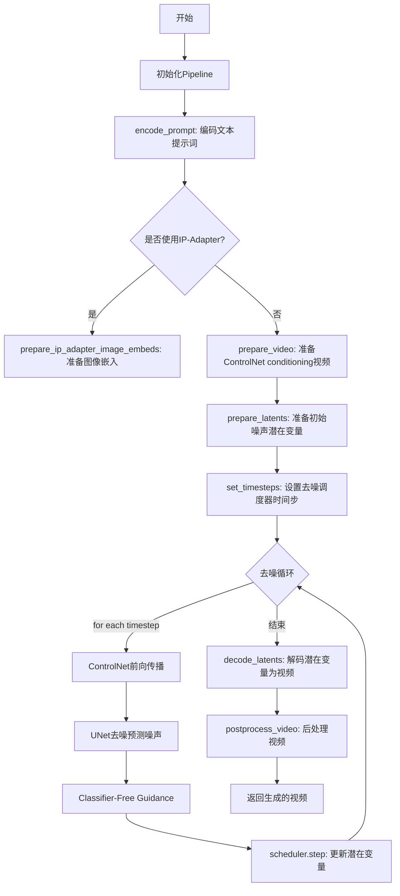

## 类结构

```
DiffusionPipeline (基类)
├── StableDiffusionMixin
├── TextualInversionLoaderMixin
├── IPAdapterMixin
├── StableDiffusionLoraLoaderMixin
├── FreeInitMixin
├── AnimateDiffFreeNoiseMixin
├── FromSingleFileMixin
└── AnimateDiffControlNetPipeline
```

## 全局变量及字段


### `XLA_AVAILABLE`
    
指示是否安装了PyTorch XLA（用于TPU加速）

类型：`bool`
    


### `logger`
    
用于记录管道运行日志的logger实例

类型：`logging.Logger`
    


### `EXAMPLE_DOC_STRING`
    
包含AnimateDiffControlNetPipeline使用示例的文档字符串

类型：`str`
    


### `AnimateDiffControlNetPipeline.vae`
    
变分自编码器模型，用于将图像编码和解码到潜在表示空间

类型：`AutoencoderKL`
    


### `AnimateDiffControlNetPipeline.text_encoder`
    
冻结的CLIP文本编码器，用于将文本提示转换为嵌入向量

类型：`CLIPTextModel`
    


### `AnimateDiffControlNetPipeline.tokenizer`
    
CLIP分词器，用于将文本分割成token序列

类型：`CLIPTokenizer`
    


### `AnimateDiffControlNetPipeline.unet`
    
条件UNet模型，用于根据文本嵌入和潜在变量去噪生成视频

类型：`UNet2DConditionModel | UNetMotionModel`
    


### `AnimateDiffControlNetPipeline.motion_adapter`
    
运动适配器模块，为UNet添加时间维度建模能力以生成动态视频

类型：`MotionAdapter`
    


### `AnimateDiffControlNetPipeline.controlnet`
    
ControlNet模型或多个ControlNet的组合，用于根据条件帧引导生成过程

类型：`ControlNetModel | MultiControlNetModel`
    


### `AnimateDiffControlNetPipeline.scheduler`
    
扩散调度器，管理去噪过程中的噪声调度和时间步

类型：`KarrasDiffusionSchedulers`
    


### `AnimateDiffControlNetPipeline.feature_extractor`
    
CLIP图像处理器，用于从图像中提取特征（可选组件）

类型：`CLIPImageProcessor | None`
    


### `AnimateDiffControlNetPipeline.image_encoder`
    
CLIP视觉编码器，用于IP-Adapter图像提示（可选组件）

类型：`CLIPVisionModelWithProjection | None`
    


### `AnimateDiffControlNetPipeline.vae_scale_factor`
    
VAE缩放因子，用于计算潜在空间的降采样比例

类型：`int`
    


### `AnimateDiffControlNetPipeline.video_processor`
    
视频后处理器，用于将潜在表示转换为最终视频输出

类型：`VideoProcessor`
    


### `AnimateDiffControlNetPipeline.control_video_processor`
    
ControlNet条件视频预处理器，用于处理输入的条件帧

类型：`VideoProcessor`
    


### `AnimateDiffControlNetPipeline.model_cpu_offload_seq`
    
模型CPU卸载顺序字符串，定义模型卸载到CPU的序列

类型：`str`
    


### `AnimateDiffControlNetPipeline._optional_components`
    
可选组件列表，包含feature_extractor和image_encoder

类型：`list`
    


### `AnimateDiffControlNetPipeline._callback_tensor_inputs`
    
回调函数可用的张量输入列表，用于step结束回调

类型：`list`
    
    

## 全局函数及方法


### `is_torch_xla_available`

该函数用于检查当前环境是否支持 PyTorch XLA（用于 TPU 和高性能计算）。如果支持则导入相关模块并设置全局标志，否则标记为不可用。

参数：无需参数

返回值：`bool`，返回 `True` 表示 PyTorch XLA 可用并已导入相关模块，返回 `False` 表示不可用

#### 流程图

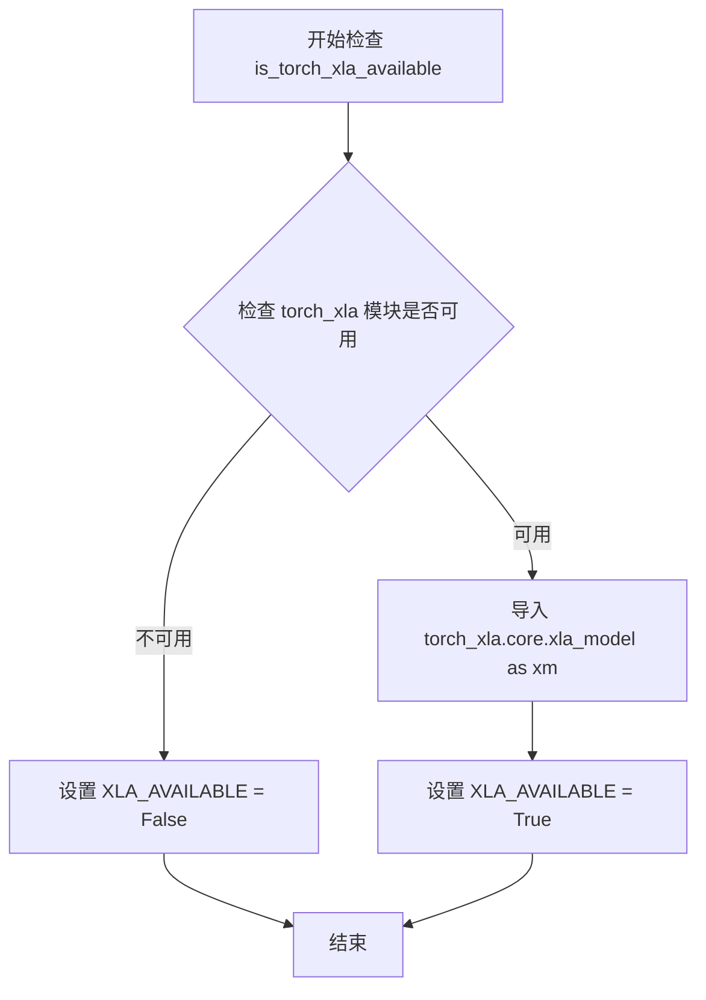

#### 带注释源码

```python
# is_torch_xla_available 函数的定义（位于 diffusers.utils 模块中）
# 以下是使用该函数的代码示例：

if is_torch_xla_available():  # 检查 XLA 是否可用
    import torch_xla.core.xla_model as xm  # 导入 XLA 核心模块
    XLA_AVAILABLE = True  # 设置全局标志为 True
else:
    XLA_AVAILABLE = False  # 设置全局标志为 False

# 后续使用：
if XLA_AVAILABLE:
    xm.mark_step()  # 在 TPU 上标记计算步骤
```

#### 详细说明

| 项目 | 描述 |
|------|------|
| **函数位置** | `diffusers.utils.is_torch_xla_available` |
| **函数类型** | 工具函数/条件检查函数 |
| **使用场景** | 在需要 TPU 加速或 XLA 编译的管道中检查运行时环境 |
| **依赖模块** | `torch_xla`（可选安装） |
| **副作用** | 导入 `torch_xla.core.xla_model` 模块；设置 `XLA_AVAILABLE` 全局变量 |
| **在管道中的应用** | 用于优化 TPU 设备上的推理步骤（`xm.mark_step()`） |


### `is_compiled_module`

检测给定模块是否是由 `torch.compile` 编译的 PyTorch 模块（即 `torch._dynamo.eval_frame.OptimizedModule`）。如果是编译模块，返回 `True`；否则返回 `False`。

参数：

-  `module`：`torch.nn.Module`，需要检查的 PyTorch 模块

返回值：`bool`，如果模块是编译模块返回 `True`，否则返回 `False`

#### 流程图

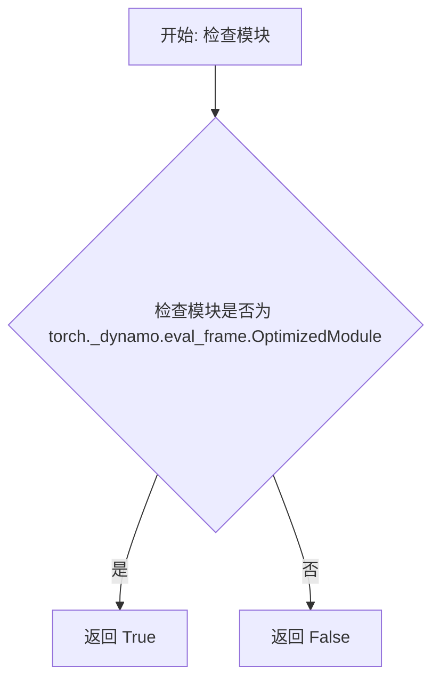

#### 带注释源码

```python
# 注: 以下为基于使用方式和 PyTorch 内部实现的推测源码
# 实际定义位于 diffusers/src/diffusers/utils/torch_utils.py

def is_compiled_module(module: torch.nn.Module) -> bool:
    """
    检测模块是否由 torch.compile 编译。
    
    torch.compile 会将原始模块包装为 torch._dynamo.eval_frame.OptimizedModule，
    同时保留原始模块的引用在 _orig_mod 属性中。
    
    Args:
        module: 需要检查的 PyTorch 模块
        
    Returns:
        bool: 如果模块是编译模块返回 True，否则返回 False
    """
    # 检查模块是否是 torch._dynamo.eval_frame.OptimizedModule 的实例
    # OptimizedModule 是 torch.compile 编译后的模块的内部表示
    return isinstance(module, torch._dynamo.eval_frame.OptimizedModule)
```

#### 使用示例

在 `AnimateDiffControlNetPipeline.__call__` 方法中的使用：

```python
# 检查 controlnet 是否为编译模块
# 如果是编译模块，获取其原始未编译的模块
controlnet = self.controlnet._orig_mod if is_compiled_module(self.controlnet) else self.controlnet
```

#### 技术说明

| 属性 | 值 |
|------|-----|
| 函数类型 | 工具函数 / 辅助函数 |
| 依赖 | `torch._dynamo.eval_frame.OptimizedModule` |
| PyTorch 版本要求 | >= 2.0 (torch.compile 功能) |
| 用途 | 兼容 torch.compile 编译后的模块与原始模块的处理 |


### `randn_tensor`

生成一个指定形状的随机张量（从标准正态分布采样），用于为扩散模型的潜在变量初始化噪声。在diffusers管道中常用于创建初始潜在变量，支持通过生成器控制随机性。

参数：

-  `shape`：`tuple` 或 `int`，输出张量的形状，通常为 (batch_size, num_channels, num_frames, height, width)
-  `generator`：`torch.Generator` 或 `list[torch.Generator]` 或 `None`，可选的随机数生成器，用于确保可重复性
-  `device`：`torch.device`，生成张量所在的设备
-  `dtype`：`torch.dtype`，生成张量的数据类型（如 torch.float32、torch.float16）

返回值：`torch.Tensor`，符合指定形状、设备和数据类型的随机正态分布张量

#### 流程图

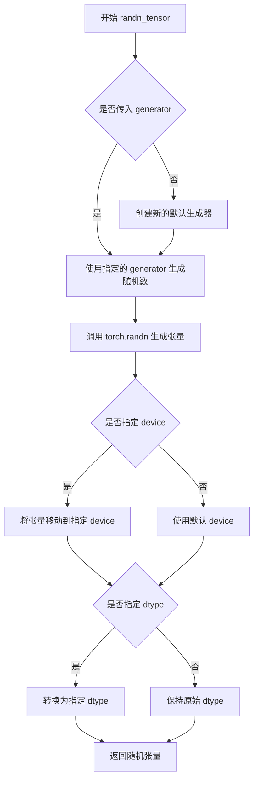

#### 带注释源码

```python
# 源代码位于 diffusers/src/diffusers/utils/torch_utils.py
# 以下为函数定义和说明

def randn_tensor(
    shape: tuple,
    generator: Optional[Union[List["torch.Generator"], "torch.Generator"]] = None,
    device: Optional["torch.device"] = None,
    dtype: Optional["torch.dtype"] = None,
) -> "torch.Tensor":
    """
    生成一个随机张量（从标准正态分布采样）。
    
    该函数是 torch.randn 的包装器，提供了更友好的接口，
    支持通过生成器控制随机性以实现可重复的采样。
    
    Args:
        shape: 张量的形状，对于视频扩散模型通常是 
            (batch_size, num_channels_latents, num_frames, height, width)
        generator: 可选的 torch.Generator 对象或生成器列表，用于控制随机性。
            如果传入生成器，相同种子下会产生相同的随机数序列。
        device: 张量应该放置的设备（cpu/cuda）。
        dtype: 张量的数据类型（float32/float16/bfloat16等）。
    
    Returns:
        torch.Tensor: 符合指定形状、设备和数据类型的随机张量
    """
    # 1. 如果传入了生成器列表（每个batch元素一个生成器）
    if isinstance(generator, list):
        # 初始化结果张量
        tensor = torch.empty(shape, device=device, dtype=dtype)
        
        # 为每个batch元素使用对应的生成器填充随机数
        for i, gen in enumerate(generator):
            # 计算当前batch元素的切片
            batch_size = shape[0] // len(generator)
            start_idx = i * batch_size
            end_idx = start_idx + batch_size
            
            # 使用特定生成器生成随机数并填充到对应位置
            # view 操作确保正确处理多维张量
            tensor[start_idx:end_idx] = torch.randn(
                [shape[0] // len(generator)] + list(shape[1:]),
                generator=gen,
                device=device,
                dtype=dtype,
            )
        return tensor
    
    # 2. 单个生成器或无生成器情况
    # 使用 torch.randn 生成标准正态分布的随机张量
    # tensor 会在 (batch_size, channels, frames, height, width) 维度生成随机值
    tensor = torch.randn(
        shape,
        generator=generator,  # 如果为 None，则使用全局随机状态
        device=device,         # 指定设备，None 则使用默认设备
        dtype=dtype,           # 指定数据类型，None 则使用默认类型
    )
    
    return tensor
```


### `scale_lora_layers`

该函数是diffusers库中的工具函数，用于根据传入的缩放因子动态调整（缩放）LoRA层的权重。在`encode_prompt`方法中，当使用PEFT后端时，调用此函数来应用LoRA缩放。

参数：

-  `model`：`torch.nn.Module`，需要应用LoRA缩放的模型（通常为`text_encoder`）
-  `scale`：`float`，LoRA层的缩放因子

返回值：`None`，该函数直接修改传入模型的LoRA层权重

#### 流程图

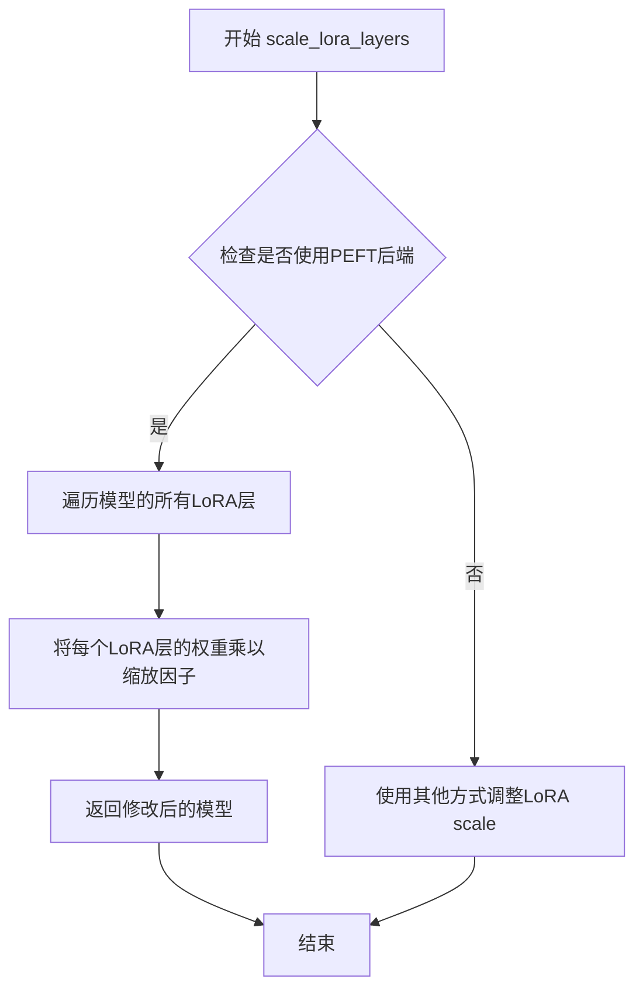

#### 带注释源码

```python
# scale_lora_layers 函数定义在 diffusers/src/diffusers/utils/torch_utils.py 中
# 此处展示在当前代码中的调用方式

# 在 AnimateDiffControlNetPipeline.encode_prompt 方法中调用：
if lora_scale is not None and isinstance(self, StableDiffusionLoraLoaderMixin):
    self._lora_scale = lora_scale

    # dynamically adjust the LoRA scale
    if not USE_PEFT_BACKEND:
        # 非PEFT后端：使用自定义函数调整
        adjust_lora_scale_text_encoder(self.text_encoder, lora_scale)
    else:
        # PEFT后端：使用scale_lora_layers函数缩放LoRA层
        scale_lora_layers(self.text_encoder, lora_scale)
```

> **注意**：由于`scale_lora_layers`是从`...utils`模块导入的外部函数，其完整源码定义在diffusers库的其他位置，当前代码段仅展示其使用方式。该函数通常遍历模型中所有已注册的LoRA适配器层，并将指定的缩放因子应用到这些层的权重上。


### `unscale_lora_layers`（导入函数）

用于撤销之前对 LoRA 层的缩放操作，将文本编码器的 LoRA 层恢复到原始 scale 状态。该函数通常在完成文本嵌入编码后调用，以确保后续操作使用未缩放的模型权重。

参数：

-  `text_encoder`：`CLIPTextModel`，需要进行 unscale 操作的文本编码器模型实例
-  `lora_scale`：`float`，之前应用到 LoRA 层的缩放因子，用于逆向恢复原始权重

返回值：`None`，该函数直接修改传入的 `text_encoder` 模型权重，无返回值

#### 流程图

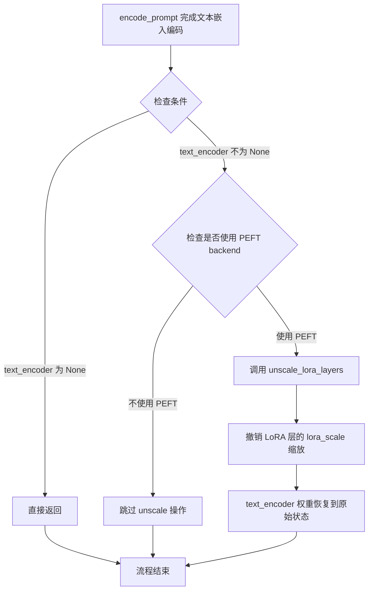

#### 带注释源码

```python
# 在文件头部的导入语句
from ...utils import USE_PEFT_BACKEND, is_torch_xla_available, logging, scale_lora_layers, unscale_lora_layers

# 在 encode_prompt 方法中的调用位置（约第 260-262 行）
if self.text_encoder is not None:
    if isinstance(self, StableDiffusionLoraLoaderMixin) and USE_PEFT_BACKEND:
        # Retrieve the original scale by scaling back the LoRA layers
        # 撤销之前对 text_encoder 应用的 LoRA 缩放，使其恢复到原始状态
        unscale_lora_layers(self.text_encoder, lora_scale)
```

---

> **注意**：由于 `unscale_lora_layers` 函数定义在 `diffusers` 库的 `...utils` 模块中（完整路径为 `src/diffusers/utils.py`），其具体实现源码未在此文件中展示。以上信息是基于函数调用上下文和导入语句推断得出。


### `adjust_lora_scale_text_encoder`

该函数用于在非 PEFT 后端模式下调整（缩放）文本编码器（Text Encoder）的 LoRA（Low-Rank Adaptation）权重。它是 diffusers 库中处理 LoRA 权重缩放的辅助函数，确保在使用传统 LoRA 方法时能正确应用缩放因子。

参数：

- `text_encoder`：`torch.nn.Module`（具体为 `CLIPTextModel`），需要调整 LoRA 权重的文本编码器模型实例
- `lora_scale`：`float | None`，LoRA 缩放因子，用于控制 LoRA 权重对原始模型的影响程度

返回值：`None`，该函数直接修改传入的 `text_encoder` 模型对象的 LoRA 权重，不返回任何值

#### 流程图

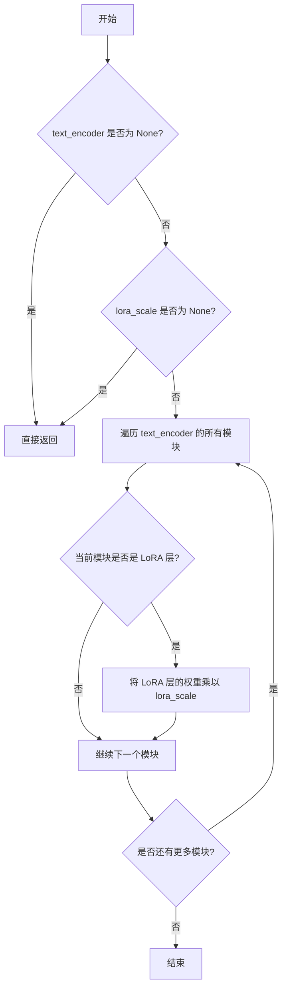

#### 带注释源码

```
# 该函数定义在 ...models.lora 模块中（推断的源码实现）
# 函数用于调整文本编码器的 LoRA 缩放因子

def adjust_lora_scale_text_encoder(text_encoder, lora_scale):
    """
    调整文本编码器的 LoRA 权重缩放因子。
    
    此函数在非 PEFT 后端模式下被调用，用于动态调整已加载的
    LoRA 权重对模型输出的影响程度。
    
    参数:
        text_encoder: 文本编码器模型实例（通常是 CLIPTextModel）
        lora_scale: 浮点数缩放因子，用于控制 LoRA 权重的影响
    """
    # 参数校验：如果没有提供缩放因子或文本编码器，则直接返回
    if lora_scale is None or text_encoder is None:
        return
    
    # 遍历文本编码器的所有子模块
    for name, module in text_encoder.named_modules():
        # 检查模块名称中是否包含 LoRA 相关的标识
        # 不同的 LoRA 实现可能有不同的命名约定（如 "lora", "lora_A", "lora_B" 等）
        if "lora" in name.lower():
            # 尝试访问并调整 LoRA 层的权重
            # 通常 LoRA 层会有 'lora_A.weight' 和 'lora_B.weight' 参数
            for param_name, param in module.named_parameters():
                if "lora" in param_name.lower() and "weight" in param_name.lower():
                    # 将 LoRA 权重乘以缩放因子
                    # 注意：某些实现可能只调整部分权重或使用不同的缩放方式
                    param.data *= lora_scale
                    
    # 注意：实际的 diffusers 实现可能使用更复杂的方法，
    # 包括直接访问特定的 LoRA 层类或使用其他缩放机制
```


### AnimateDiffControlNetPipeline.__init__

这是 `AnimateDiffControlNetPipeline` 类的构造函数，负责初始化用于文本到视频生成的完整Pipeline。它接收VAE、文本编码器、分词器、UNet、motion adapter、ControlNet和scheduler等核心组件，并进行必要的类型检查和模块注册，同时初始化视频处理器。

参数：

- `vae`：`AutoencoderKL`，Variational Auto-Encoder (VAE) 模型，用于编码和解码图像到潜在表示
- `text_encoder`：`CLIPTextModel`，冻结的文本编码器 (clip-vit-large-patch14)
- `tokenizer`：`CLIPTokenizer`，用于对文本进行分词的 CLIPTokenizer
- `unet`：`UNet2DConditionModel | UNetMotionModel`，用于去噪编码视频潜在变量的 UNet 模型
- `motion_adapter`：`MotionAdapter`，与 `unet` 结合使用来去噪编码视频潜在变量的 MotionAdapter
- `controlnet`：`ControlNetModel | list[ControlNetModel] | tuple[ControlNetModel] | MultiControlNetModel`，ControlNet 模型，用于提供额外的条件引导
- `scheduler`：`KarrasDiffusionSchedulers`，与 `unet` 结合使用来去噪编码图像潜在变量的调度器
- `feature_extractor`：`CLIPImageProcessor | None = None`，可选的特征提取器，用于 IP-Adapter 功能
- `image_encoder`：`CLIPVisionModelWithProjection | None = None`，可选的图像编码器，用于 IP-Adapter 功能

返回值：无（构造函数）

#### 流程图

```mermaid
flowchart TD
    A[开始 __init__] --> B[调用 super().__init__]
    B --> C{unet 是 UNet2DConditionModel?}
    C -->|是| D[使用 motion_adapter 创建 UNetMotionModel]
    C -->|否| E[保持原 unet 不变]
    D --> F{controlnet 是 list 或 tuple?}
    E --> F
    F -->|是| G[创建 MultiControlNetModel]
    F -->|否| H[保持原 controlnet 不变]
    G --> I[register_modules 注册所有模块]
    H --> I
    I --> J[计算 vae_scale_factor]
    J --> K[创建 video_processor]
    K --> L[创建 control_video_processor]
    L --> M[结束 __init__]
```

#### 带注释源码

```python
def __init__(
    self,
    vae: AutoencoderKL,
    text_encoder: CLIPTextModel,
    tokenizer: CLIPTokenizer,
    unet: UNet2DConditionModel | UNetMotionModel,
    motion_adapter: MotionAdapter,
    controlnet: ControlNetModel | list[ControlNetModel] | tuple[ControlNetModel] | MultiControlNetModel,
    scheduler: KarrasDiffusionSchedulers,
    feature_extractor: CLIPImageProcessor | None = None,
    image_encoder: CLIPVisionModelWithProjection | None = None,
):
    # 调用父类 DiffusionPipeline 的初始化方法
    super().__init__()
    
    # 如果 unet 是普通的 UNet2DConditionModel，则使用 motion_adapter 将其转换为 UNetMotionModel
    # 这样可以为静态图像模型添加运动生成能力
    if isinstance(unet, UNet2DConditionModel):
        unet = UNetMotionModel.from_unet2d(unet, motion_adapter)

    # 如果 controlnet 是列表或元组形式，则包装为 MultiControlNetModel
    # 以支持多个 ControlNet 联合使用
    if isinstance(controlnet, (list, tuple)):
        controlnet = MultiControlNetModel(controlnet)

    # 使用 register_modules 方法注册所有组件模块
    # 这使得 Pipeline 可以统一管理这些模块的设备和 dtype
    self.register_modules(
        vae=vae,
        text_encoder=text_encoder,
        tokenizer=tokenizer,
        unet=unet,
        motion_adapter=motion_adapter,
        controlnet=controlnet,
        scheduler=scheduler,
        feature_extractor=feature_extractor,
        image_encoder=image_encoder,
    )
    
    # 计算 VAE 缩放因子，用于调整潜在空间的维度
    # 基于 VAE 的 block_out_channels 计算下采样的倍数
    # 默认为 8 (2^(3-1) = 4, 但代码中有 fallback 逻辑)
    self.vae_scale_factor = 2 ** (len(self.vae.config.block_out_channels) - 1) if getattr(self, "vae", None) else 8
    
    # 创建视频处理器，用于将潜在变量解码为视频帧
    # 使用计算得到的 vae_scale_factor
    self.video_processor = VideoProcessor(vae_scale_factor=self.vae_scale_factor)
    
    # 创建用于处理 ControlNet 输入视频的处理器
    # 设置 do_convert_rgb=True 以确保输入转换为 RGB 格式
    # 设置 do_normalize=False 因为 ControlNet 不需要归一化
    self.control_video_processor = VideoProcessor(
        vae_scale_factor=self.vae_scale_factor, do_convert_rgb=True, do_normalize=False
    )
```


### `AnimateDiffControlNetPipeline.encode_prompt`

该方法负责将文本提示（prompt）编码为文本编码器的隐藏状态（hidden states），支持 LoRA 权重调整、clip_skip、分类器自由引导（Classifier-Free Guidance）等功能。

参数：

- `prompt`：`str | list[str] | None`，要编码的提示文本
- `device`：`torch.device`，PyTorch 设备
- `num_images_per_prompt`：`int`，每个提示生成的图像数量
- `do_classifier_free_guidance`：`bool`，是否使用分类器自由引导
- `negative_prompt`：`str | list[str] | None`，负向提示文本，用于引导不包含在图像生成中的内容
- `prompt_embeds`：`torch.Tensor | None`，预生成的文本嵌入，可用于轻松调整文本输入
- `negative_prompt_embeds`：`torch.Tensor | None`，预生成的负向文本嵌入
- `lora_scale`：`float | None`，要应用于文本编码器所有 LoRA 层的 LoRA 缩放因子
- `clip_skip`：`int | None`，计算提示嵌入时要从 CLIP 跳过的层数

返回值：`tuple[torch.Tensor, torch.Tensor]`，返回 (prompt_embeds, negative_prompt_embeds) 元组，分别表示正向和负向的文本嵌入张量。

#### 流程图

```mermaid
flowchart TD
    A[开始 encode_prompt] --> B{检查 lora_scale}
    B -->|非空| C[设置 self._lora_scale]
    B -->|空| D[跳过 LoRA 调整]
    C --> D
    D --> E{判断 batch_size}
    E -->|prompt 是 str| F[batch_size = 1]
    E -->|prompt 是 list| G[batch_size = len(prompt)]
    E -->|其他| H[batch_size = prompt_embeds.shape[0]]
    F --> I{prompt_embeds 为空?}
    G --> I
    H --> I
    I -->|是| J[检查 TextualInversionLoaderMixin]
    J -->|是| K[maybe_convert_prompt 处理多向量 token]
    J -->|否| L
    K --> L[tokenizer 编码 prompt]
    L --> M{text_encoder 使用 attention_mask?}
    M -->|是| N[获取 attention_mask]
    M -->|否| O[attention_mask = None]
    N --> P
    O --> P
    P{clip_skip 为空?}
    P -->|是| Q[直接调用 text_encoder 获取最后一层]
    P -->|否| R[调用 text_encoder 获取所有隐藏状态]
    R --> S[根据 clip_skip 选择对应层的隐藏状态]
    S --> T[应用 final_layer_norm]
    Q --> T
    T --> U[确定 prompt_embeds_dtype]
    U --> V[转换 prompt_embeds dtype 和 device]
    V --> W[重复 prompt_embeds num_images_per_prompt 次]
    W --> X{do_classifier_free_guidance 且 negative_prompt_embeds 为空?}
    X -->|是| Y[处理 negative_prompt]
    X -->|否| Z
    Y --> AA[检查 negative_prompt 类型和长度]
    AA --> AB[tokenizer 编码 uncond_tokens]
    AB --> AC{text_encoder 使用 attention_mask?}
    AC -->|是| AD[获取 attention_mask]
    AC -->|否| AE[attention_mask = None]
    AD --> AF
    AE --> AF
    AF --> AG[调用 text_encoder 获取负向嵌入]
    AG --> AH[转换 dtype 和 device]
    AH --> Z
    Z{do_classifier_free_guidance?}
    Z -->|是| AI[重复 negative_prompt_embeds]
    Z -->|否| AJ
    AI --> AJ
    AJ{使用 PEFT backend 且有 LoRA?}
    AJ -->|是| AK[unscale_lora_layers 恢复原始 scale]
    AJ -->|否| AL
    AK --> AL
    AL[返回 prompt_embeds, negative_prompt_embeds]
```

#### 带注释源码

```python
def encode_prompt(
    self,
    prompt,
    device,
    num_images_per_prompt,
    do_classifier_free_guidance,
    negative_prompt=None,
    prompt_embeds: torch.Tensor | None = None,
    negative_prompt_embeds: torch.Tensor | None = None,
    lora_scale: float | None = None,
    clip_skip: int | None = None,
):
    r"""
    Encodes the prompt into text encoder hidden states.

    Args:
        prompt (`str` or `list[str]`, *optional*):
            prompt to be encoded
        device: (`torch.device`):
            torch device
        num_images_per_prompt (`int`):
            number of images that should be generated per prompt
        do_classifier_free_guidance (`bool`):
            whether to use classifier free guidance or not
        negative_prompt (`str` or `list[str]`, *optional*):
            The prompt or prompts not to guide the image generation. If not defined, one has to pass
            `negative_prompt_embeds` instead. Ignored when not using guidance (i.e., ignored if `guidance_scale` is
            less than `1`).
        prompt_embeds (`torch.Tensor`, *optional*):
            Pre-generated text embeddings. Can be used to easily tweak text inputs, *e.g.* prompt weighting. If not
            provided, text embeddings will be generated from `prompt` input argument.
        negative_prompt_embeds (`torch.Tensor`, *optional*):
            Pre-generated negative text embeddings. Can be used to easily tweak text inputs, *e.g.* prompt
            weighting. If not provided, negative_prompt_embeds will be generated from `negative_prompt` input
            argument.
        lora_scale (`float`, *optional*):
            A LoRA scale that will be applied to all LoRA layers of the text encoder if LoRA layers are loaded.
        clip_skip (`int`, *optional*):
            Number of layers to be skipped from CLIP while computing the prompt embeddings. A value of 1 means that
            the output of the pre-final layer will be used for computing the prompt embeddings.
    """
    # 设置 lora scale，以便 text encoder 的 monkey patched LoRA 函数可以正确访问
    if lora_scale is not None and isinstance(self, StableDiffusionLoraLoaderMixin):
        self._lora_scale = lora_scale

        # 动态调整 LoRA scale
        if not USE_PEFT_BACKEND:
            adjust_lora_scale_text_encoder(self.text_encoder, lora_scale)
        else:
            scale_lora_layers(self.text_encoder, lora_scale)

    # 确定 batch_size
    if prompt is not None and isinstance(prompt, str):
        batch_size = 1
    elif prompt is not None and isinstance(prompt, list):
        batch_size = len(prompt)
    else:
        batch_size = prompt_embeds.shape[0]

    # 如果没有提供 prompt_embeds，则从 prompt 生成
    if prompt_embeds is None:
        # textual inversion: 如果需要，处理多向量 tokens
        if isinstance(self, TextualInversionLoaderMixin):
            prompt = self.maybe_convert_prompt(prompt, self.tokenizer)

        # 使用 tokenizer 将 prompt 转换为 token IDs
        text_inputs = self.tokenizer(
            prompt,
            padding="max_length",
            max_length=self.tokenizer.model_max_length,
            truncation=True,
            return_tensors="pt",
        )
        text_input_ids = text_inputs.input_ids
        # 获取未截断的 token IDs 用于检测截断
        untruncated_ids = self.tokenizer(prompt, padding="longest", return_tensors="pt").input_ids

        # 检测并警告截断的文本
        if untruncated_ids.shape[-1] >= text_input_ids.shape[-1] and not torch.equal(
            text_input_ids, untruncated_ids
        ):
            removed_text = self.tokenizer.batch_decode(
                untruncated_ids[:, self.tokenizer.model_max_length - 1 : -1]
            )
            logger.warning(
                "The following part of your input was truncated because CLIP can only handle sequences up to"
                f" {self.tokenizer.model_max_length} tokens: {removed_text}"
            )

        # 获取 attention_mask（如果 text_encoder 支持）
        if hasattr(self.text_encoder.config, "use_attention_mask") and self.text_encoder.config.use_attention_mask:
            attention_mask = text_inputs.attention_mask.to(device)
        else:
            attention_mask = None

        # 根据 clip_skip 参数决定如何获取 prompt embeddings
        if clip_skip is None:
            prompt_embeds = self.text_encoder(text_input_ids.to(device), attention_mask=attention_mask)
            prompt_embeds = prompt_embeds[0]
        else:
            prompt_embeds = self.text_encoder(
                text_input_ids.to(device), attention_mask=attention_mask, output_hidden_states=True
            )
            # 访问 hidden_states，获取所有编码器层的隐藏状态元组
            # 然后索引到元组中获取所需层的隐藏状态
            prompt_embeds = prompt_embeds[-1][-(clip_skip + 1)]
            # 还需要应用最终的 LayerNorm，以免干扰表示
            # 用于获取最终提示表示的 last_hidden_states 会通过 LayerNorm 层
            prompt_embeds = self.text_encoder.text_model.final_layer_norm(prompt_embeds)

    # 确定 prompt_embeds 的 dtype（优先使用 text_encoder 的 dtype）
    if self.text_encoder is not None:
        prompt_embeds_dtype = self.text_encoder.dtype
    elif self.unet is not None:
        prompt_embeds_dtype = self.unet.dtype
    else:
        prompt_embeds_dtype = prompt_embeds.dtype

    # 转换 prompt_embeds 到正确的 dtype 和 device
    prompt_embeds = prompt_embeds.to(dtype=prompt_embeds_dtype, device=device)

    bs_embed, seq_len, _ = prompt_embeds.shape
    # 为每个 prompt 复制文本 embeddings（使用 mps 友好的方法）
    prompt_embeds = prompt_embeds.repeat(1, num_images_per_prompt, 1)
    prompt_embeds = prompt_embeds.view(bs_embed * num_images_per_prompt, seq_len, -1)

    # 获取分类器自由引导的无条件 embeddings
    if do_classifier_free_guidance and negative_prompt_embeds is None:
        uncond_tokens: list[str]
        if negative_prompt is None:
            uncond_tokens = [""] * batch_size
        elif prompt is not None and type(prompt) is not type(negative_prompt):
            raise TypeError(
                f"`negative_prompt` should be the same type to `prompt`, but got {type(negative_prompt)} !="
                f" {type(prompt)}."
            )
        elif isinstance(negative_prompt, str):
            uncond_tokens = [negative_prompt]
        elif batch_size != len(negative_prompt):
            raise ValueError(
                f"`negative_prompt`: {negative_prompt} has batch size {len(negative_prompt)}, but `prompt`:"
                f" {prompt} has batch size {batch_size}. Please make sure that passed `negative_prompt` matches"
                " the batch size of `prompt`."
            )
        else:
            uncond_tokens = negative_prompt

        # textual inversion: 如果需要，处理多向量 tokens
        if isinstance(self, TextualInversionLoaderMixin):
            uncond_tokens = self.maybe_convert_prompt(uncond_tokens, self.tokenizer)

        max_length = prompt_embeds.shape[1]
        uncond_input = self.tokenizer(
            uncond_tokens,
            padding="max_length",
            max_length=max_length,
            truncation=True,
            return_tensors="pt",
        )

        # 获取 attention_mask
        if hasattr(self.text_encoder.config, "use_attention_mask") and self.text_encoder.config.use_attention_mask:
            attention_mask = uncond_input.attention_mask.to(device)
        else:
            attention_mask = None

        # 编码无条件 embeddings
        negative_prompt_embeds = self.text_encoder(
            uncond_input.input_ids.to(device),
            attention_mask=attention_mask,
        )
        negative_prompt_embeds = negative_prompt_embeds[0]

    # 如果使用分类器自由引导，复制无条件 embeddings
    if do_classifier_free_guidance:
        seq_len = negative_prompt_embeds.shape[1]

        negative_prompt_embeds = negative_prompt_embeds.to(dtype=prompt_embeds_dtype, device=device)

        negative_prompt_embeds = negative_prompt_embeds.repeat(1, num_images_per_prompt, 1)
        negative_prompt_embeds = negative_prompt_embeds.view(batch_size * num_images_per_prompt, seq_len, -1)

    # 如果使用 PEFT backend，恢复 LoRA layers 的原始 scale
    if self.text_encoder is not None:
        if isinstance(self, StableDiffusionLoraLoaderMixin) and USE_PEFT_BACKEND:
            # 通过缩放回 LoRA layers 来检索原始 scale
            unscale_lora_layers(self.text_encoder, lora_scale)

    return prompt_embeds, negative_prompt_embeds
```


### `AnimateDiffControlNetPipeline.encode_image`

该方法用于将输入图像编码为图像嵌入向量（image embeddings），支持条件图像嵌入和无条件图像嵌入的生成，常用于 IP-Adapter 等图像条件引导功能。

参数：

- `image`：`PipelineImageInput` 或 `torch.Tensor`，待编码的输入图像
- `device`：`torch.device`，目标计算设备
- `num_images_per_prompt`：`int`，每个 prompt 生成的图像数量，用于嵌入的重复扩展
- `output_hidden_states`：`bool | None`，是否输出隐藏状态（用于更细粒度的图像特征）

返回值：`tuple[torch.Tensor, torch.Tensor]`，返回两个张量——条件图像嵌入（image_embeds 或 image_enc_hidden_states）和无条件图像嵌入（uncond_image_embeds 或 uncond_image_enc_hidden_states）

#### 流程图

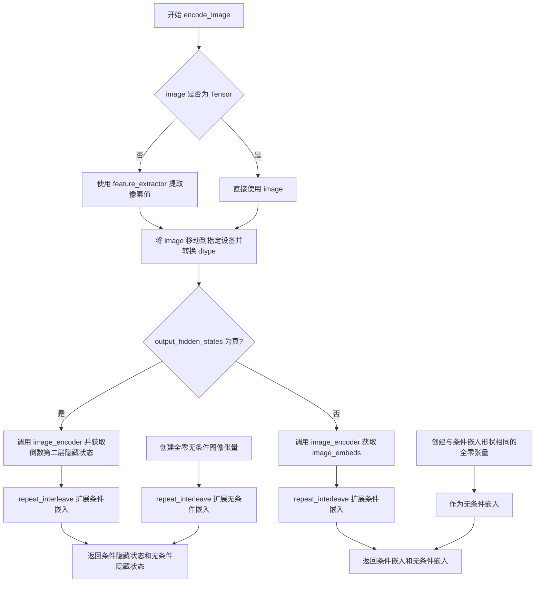

#### 带注释源码

```python
def encode_image(self, image, device, num_images_per_prompt, output_hidden_states=None):
    """
    将输入图像编码为图像嵌入向量，用于 IP-Adapter 等图像条件引导。
    
    参数:
        image: 输入图像，支持 torch.Tensor 或其他图像格式
        device: 目标设备
        num_images_per_prompt: 每个 prompt 生成的视频/图像数量
        output_hidden_states: 是否返回隐藏状态（更细粒度的特征）
    
    返回:
        tuple: (条件嵌入, 无条件嵌入)
    """
    # 获取 image_encoder 的数据类型
    dtype = next(self.image_encoder.parameters()).dtype

    # 如果输入不是 Tensor，使用 feature_extractor 转换为像素值
    if not isinstance(image, torch.Tensor):
        image = self.feature_extractor(image, return_tensors="pt").pixel_values

    # 将图像移动到目标设备并转换数据类型
    image = image.to(device=device, dtype=dtype)
    
    # 根据 output_hidden_states 参数选择不同的编码路径
    if output_hidden_states:
        # 路径1: 输出隐藏状态（更细粒度的特征）
        # 编码图像获取隐藏状态，取倒数第二层（-2）
        image_enc_hidden_states = self.image_encoder(image, output_hidden_states=True).hidden_states[-2]
        # 沿着 batch 维度重复扩展，以匹配 num_images_per_prompt
        image_enc_hidden_states = image_enc_hidden_states.repeat_interleave(num_images_per_prompt, dim=0)
        
        # 创建全零的"无条件"隐藏状态（用于 classifier-free guidance）
        uncond_image_enc_hidden_states = self.image_encoder(
            torch.zeros_like(image), output_hidden_states=True
        ).hidden_states[-2]
        uncond_image_enc_hidden_states = uncond_image_enc_hidden_states.repeat_interleave(
            num_images_per_prompt, dim=0
        )
        return image_enc_hidden_states, uncond_image_enc_hidden_states
    else:
        # 路径2: 输出图像嵌入（image_embeds）
        image_embeds = self.image_encoder(image).image_embeds
        # 扩展条件嵌入
        image_embeds = image_embeds.repeat_interleave(num_images_per_prompt, dim=0)
        
        # 创建全零无条件嵌入（用于 classifier-free guidance）
        uncond_image_embeds = torch.zeros_like(image_embeds)

        return image_embeds, uncond_image_embeds
```


### `AnimateDiffControlNetPipeline.prepare_ip_adapter_image_embeds`

该方法用于准备 IP-Adapter 的图像嵌入。它处理两种输入情况：当未预计算嵌入时，对输入图像进行编码；当已提供嵌入时，直接使用提供的嵌入，并根据是否启用无分类器自由引导（classifier-free guidance）来处理负样本嵌入，最终返回适合扩散模型使用的图像嵌入列表。

参数：

- `self`：`AnimateDiffControlNetPipeline`，Pipeline 实例本身
- `ip_adapter_image`：`PipelineImageInput | None`，IP-Adapter 的输入图像，可以是单张图像或图像列表
- `ip_adapter_image_embeds`：`list[torch.Tensor] | None`，预计算的图像嵌入列表，如果为 None 则从 ip_adapter_image 编码生成
- `device`：`torch.device`，计算设备
- `num_images_per_prompt`：`int`，每个提示词生成的图像数量，用于嵌入的重复复制
- `do_classifier_free_guidance`：`bool`，是否启用无分类器自由引导，决定是否生成负样本嵌入

返回值：`list[torch.Tensor]`，处理后的 IP-Adapter 图像嵌入列表，每个元素为拼接了负样本（如果启用 CFG）的嵌入张量

#### 流程图

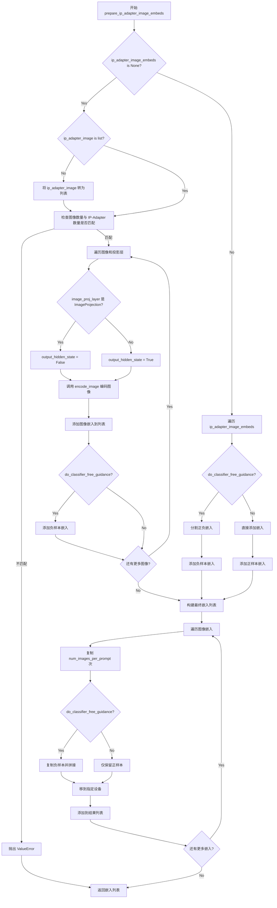

#### 带注释源码

```python
def prepare_ip_adapter_image_embeds(
    self, ip_adapter_image, ip_adapter_image_embeds, device, num_images_per_prompt, do_classifier_free_guidance
):
    """
    准备 IP-Adapter 的图像嵌入。
    
    该方法处理两种输入情况：
    1. 当 ip_adapter_image_embeds 为 None 时，从 ip_adapter_image 编码生成嵌入
    2. 当 ip_adapter_image_embeds 已提供时，直接使用提供的嵌入
    
    参数:
        ip_adapter_image: IP-Adapter 的输入图像
        ip_adapter_image_embeds: 预计算的图像嵌入
        device: 计算设备
        num_images_per_prompt: 每个提示词生成的图像数量
        do_classifier_free_guidance: 是否启用无分类器自由引导
    
    返回:
        处理后的 IP-Adapter 图像嵌入列表
    """
    # 初始化嵌入列表
    image_embeds = []
    # 如果启用 CFG，需要处理负样本嵌入
    if do_classifier_free_guidance:
        negative_image_embeds = []
    
    # 情况1：未预计算嵌入，需要从图像编码
    if ip_adapter_image_embeds is None:
        # 确保输入是列表形式
        if not isinstance(ip_adapter_image, list):
            ip_adapter_image = [ip_adapter_image]

        # 验证图像数量与 IP-Adapter 数量匹配
        if len(ip_adapter_image) != len(self.unet.encoder_hid_proj.image_projection_layers):
            raise ValueError(
                f"`ip_adapter_image` must have same length as the number of IP Adapters. Got {len(ip_adapter_image)} images and {len(self.unet.encoder_hid_proj.image_projection_layers)} IP Adapters."
            )

        # 遍历每个 IP-Adapter 的图像和对应的投影层
        for single_ip_adapter_image, image_proj_layer in zip(
            ip_adapter_image, self.unet.encoder_hid_proj.image_projection_layers
        ):
            # 判断是否需要输出隐藏状态
            # ImageProjection 层不需要隐藏状态，其他类型需要
            output_hidden_state = not isinstance(image_proj_layer, ImageProjection)
            
            # 编码单张图像，获取嵌入
            single_image_embeds, single_negative_image_embeds = self.encode_image(
                single_ip_adapter_image, device, 1, output_hidden_state
            )

            # 添加批次维度 [batch, seq_len, dim] -> [1, seq_len, dim]
            image_embeds.append(single_image_embeds[None, :])
            
            # 如果启用 CFG，同时保存负样本嵌入
            if do_classifier_free_guidance:
                negative_image_embeds.append(single_negative_image_embeds[None, :])
    else:
        # 情况2：已预计算嵌入，直接使用
        for single_image_embeds in ip_adapter_image_embeds:
            if do_classifier_free_guidance:
                # 预计算的嵌入通常包含正负样本各一半
                # chunk(2) 将嵌入分成两部分：[neg, pos]
                single_negative_image_embeds, single_image_embeds = single_image_embeds.chunk(2)
                negative_image_embeds.append(single_negative_image_embeds)
            image_embeds.append(single_image_embeds)

    # 第二步：根据 num_images_per_prompt 复制嵌入，并处理 CFG 情况
    ip_adapter_image_embeds = []
    for i, single_image_embeds in enumerate(image_embeds):
        # 复制正样本嵌入 num_images_per_prompt 次
        single_image_embeds = torch.cat([single_image_embeds] * num_images_per_prompt, dim=0)
        
        if do_classifier_free_guidance:
            # 复制负样本嵌入 num_images_per_prompt 次
            single_negative_image_embeds = torch.cat([negative_image_embeds[i]] * num_images_per_prompt, dim=0)
            # 拼接负样本和正样本：[neg, pos]
            single_image_embeds = torch.cat([single_negative_image_embeds, single_image_embeds], dim=0)

        # 确保嵌入在正确的设备上
        single_image_embeds = single_image_embeds.to(device=device)
        ip_adapter_image_embeds.append(single_image_embeds)

    return ip_adapter_image_embeds
```


### `AnimateDiffControlNetPipeline.decode_latents`

该方法负责将 VAE 的潜在表示（latents）解码为实际的视频帧。它通过分块处理的方式来解码大量帧，以减少显存占用，并将潜在张量从 (batch_size, channels, num_frames, height, width) 的形状转换为 (batch_size, channels, num_frames, height, width) 的视频张量。

参数：

- `self`：AnimateDiffControlNetPipeline 实例本身
- `latents`：`torch.Tensor`，形状为 (batch_size, channels, num_frames, height, width) 的潜在表示张量，需要被解码为实际视频
- `decode_chunk_size`：`int`，每次解码的帧数量，用于控制显存使用，默认为 16

返回值：`torch.Tensor`，解码后的视频张量，形状为 (batch_size, channels, num_frames, height, width)，数据类型为 float32

#### 流程图

```mermaid
flowchart TD
    A[开始 decode_latents] --> B[对 latents 进行缩放: latents = 1 / scaling_factor * latents]
    B --> C[获取 latents 形状: batch_size, channels, num_frames, height, width]
    C --> D[维度重排: permute 改为 batch_size, num_frames, channels, height, width]
    D --> E[reshape 为批量帧: batch_size * num_frames, channels, height, width]
    E --> F{是否还有未处理帧?}
    F -->|是| G[按 decode_chunk_size 分块]
    G --> H[使用 VAE.decode 解码当前块]
    H --> I[将解码结果添加到 video 列表]
    I --> F
    F -->|否| J[合并所有解码块: torch.cat(video)]
    J --> K[reshape 恢复形状并 permute 回原始维度顺序]
    K --> L[转换为 float32 类型]
    L --> M[返回解码后的视频张量]
```

#### 带注释源码

```python
def decode_latents(self, latents, decode_chunk_size: int = 16):
    """
    将 VAE 潜在表示解码为实际视频帧
    
    参数:
        latents: 形状为 (batch_size, channels, num_frames, height, width) 的潜在张量
        decode_chunk_size: 每次解码的帧数，用于控制显存使用
    
    返回:
        形状为 (batch_size, channels, num_frames, height, width) 的视频张量
    """
    # 第一步：使用 VAE 的缩放因子对 latents 进行反缩放
    # VAE 在编码时会乘以 scaling_factor，这里需要除以它来恢复原始 latent 空间
    latents = 1 / self.vae.config.scaling_factor * latents

    # 第二步：获取输入 latents 的形状信息
    # latents 形状: (batch_size, channels, num_frames, height, width)
    batch_size, channels, num_frames, height, width = latents.shape

    # 第三步：维度重排和reshape，为批量解码做准备
    # permute: (batch_size, channels, num_frames, height, width) -> (batch_size, num_frames, channels, height, width)
    # reshape: 合并 batch 和 num_frames 维度，变为 (batch_size * num_frames, channels, height, width)
    # 这样可以将所有帧平铺开来，依次通过 VAE 解码器
    latents = latents.permute(0, 2, 1, 3, 4).reshape(batch_size * num_frames, channels, height, width)

    # 第四步：分块解码以节省显存
    video = []
    for i in range(0, latents.shape[0], decode_chunk_size):
        # 取出当前块的 latents
        batch_latents = latents[i : i + decode_chunk_size]
        # 使用 VAE 解码器将 latent 转换为实际图像/帧
        # .sample 获取解码后的样本
        batch_latents = self.vae.decode(batch_latents).sample
        # 将解码结果添加到列表中
        video.append(batch_latents)

    # 第五步：合并所有解码后的帧
    video = torch.cat(video)

    # 第六步：恢复原始维度顺序
    # 先添加回批次维度: video[None, :] 变成 (1, total_frames, channels, height, width)
    # reshape: 分离出 batch_size 和 num_frames，得到 (batch_size, num_frames, channels, height, width)
    # permute: (batch_size, num_frames, channels, height, width) -> (batch_size, channels, num_frames, height, width)
    video = video[None, :].reshape((batch_size, num_frames, -1) + video.shape[2:]).permute(0, 2, 1, 3, 4)

    # 第七步：转换为 float32 类型
    # 这是因为 float32 不会引起显著的性能开销，同时与 bfloat16 兼容
    video = video.float()
    
    return video
```


### `AnimateDiffControlNetPipeline.prepare_extra_step_kwargs`

该方法用于为调度器（scheduler）的 `step` 方法准备额外的关键字参数。由于不同的调度器具有不同的签名，该方法通过反射检查调度器是否支持 `eta` 和 `generator` 参数，并将支持的值传递给调度器。

参数：

- `self`：`AnimateDiffControlNetPipeline` 实例，管道对象本身
- `generator`：`torch.Generator | list[torch.Generator] | None`，用于控制随机数生成的可选生成器，确保推理过程的可重复性
- `eta`：`float`，DDIM 调度器专用的 eta 参数（对应 DDIM 论文中的 η），值应在 [0, 1] 范围内，其他调度器会忽略此参数

返回值：`dict[str, Any]`，包含调度器 `step` 方法所需额外参数（如 `eta` 和 `generator`）的字典

#### 流程图

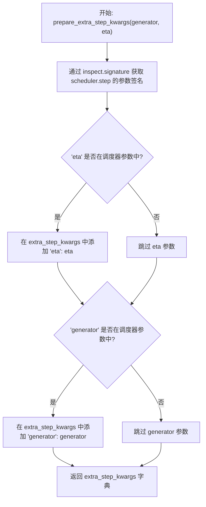

#### 带注释源码

```python
def prepare_extra_step_kwargs(self, generator, eta):
    # 该方法用于为调度器的 step 方法准备额外参数
    # 因为并非所有调度器都具有相同的签名
    
    # 通过 inspect 模块获取调度器 step 方法的参数签名
    accepts_eta = "eta" in set(inspect.signature(self.scheduler.step).parameters.keys())
    
    # 初始化额外的关键字参数字典
    extra_step_kwargs = {}
    
    # 如果调度器接受 eta 参数，则将其添加到 extra_step_kwargs
    # eta (η) 仅用于 DDIMScheduler，其他调度器会忽略此参数
    # eta 对应 DDIM 论文中的 η，值应在 [0, 1] 范围内
    if accepts_eta:
        extra_step_kwargs["eta"] = eta

    # 检查调度器是否接受 generator 参数
    accepts_generator = "generator" in set(inspect.signature(self.scheduler.step).parameters.keys())
    
    # 如果调度器接受 generator 参数，则将其添加到 extra_step_kwargs
    # generator 用于控制随机数生成，确保推理过程的可重复性
    if accepts_generator:
        extra_step_kwargs["generator"] = generator
    
    # 返回包含额外参数的字典，供调度器 step 方法使用
    return extra_step_kwargs
```


### `AnimateDiffControlNetPipeline.check_inputs`

该方法用于验证 AnimateDiffControlNetPipeline 的输入参数是否合法，在 pipeline 执行前进行全面的参数校验，确保高度和宽度能被8整除、prompt 和 prompt_embeds 不能同时提供、控制网的图像输入类型和长度正确、控制网条件缩放参数有效，以及控制引导的起止范围合理。

#### 参数

- `self`：`AnimateDiffControlNetPipeline` 实例，管道对象本身
- `prompt`：`str | list[str] | None`，正向提示词，用于指导视频生成
- `height`：`int`，生成视频的高度（像素），必须是8的倍数
- `width`：`int`，生成视频的宽度（像素），必须是8的倍数
- `num_frames`：`int`，要生成的视频帧数
- `negative_prompt`：`str | list[str] | None`，负向提示词，用于避免生成不希望的内容
- `prompt_embeds`：`torch.Tensor | None`，预生成的正向文本嵌入
- `negative_prompt_embeds`：`torch.Tensor | None`，预生成的负向文本嵌入
- `callback_on_step_end_tensor_inputs`：`list[str] | None`，在每个去噪步骤结束时回调的张量输入列表
- `video`：`list[PipelineImageInput] | None`，控制网的输入图像/视频帧列表
- `controlnet_conditioning_scale`：`float | list[float]`，控制网输出乘以的缩放因子
- `control_guidance_start`：`float | list[float]`，控制网开始应用的推理步骤百分比
- `control_guidance_end`：`float | list[float]`，控制网停止应用的推理步骤百分比

#### 返回值

- `None`，该方法不返回任何值，通过抛出 ValueError 或 TypeError 来表示校验失败

#### 流程图

```mermaid
flowchart TD
    A[开始 check_inputs] --> B{height % 8 == 0<br/>width % 8 == 0?}
    B -->|否| C[抛出 ValueError]
    B -->|是| D{callback_on_step_end_tensor_inputs<br/>是否在允许列表中?}
    D -->|否| E[抛出 ValueError]
    D -->|是| F{prompt 和 prompt_embeds<br/>是否同时提供?}
    F -->|是| G[抛出 ValueError]
    F -->|否| H{prompt 和 prompt_embeds<br/>是否都未提供?}
    H -->|是| I[抛出 ValueError]
    H -->|否| J{prompt 类型<br/>是否为 str/list/dict?}
    J -->|否| K[抛出 ValueError]
    J -->|是| L{negative_prompt 和<br/>negative_prompt_embeds<br/>是否同时提供?}
    L -->|是| M[抛出 ValueError]
    L -->|否| N{prompt_embeds 和<br/>negative_prompt_embeds<br/>形状是否一致?}
    N -->|否| O[抛出 ValueError]
    N -->|是| P{控制网类型是否为<br/>MultiControlNetModel?}
    P -->|是| Q[检查 prompt 列表长度并记录警告]
    P -->|否| R{控制网是否为单个<br/>ControlNetModel 或编译版本?}
    R -->|是| S{video 是否为 list 类型?}
    S -->|否| T[抛出 TypeError]
    S -->|是| U{video 长度是否<br/>等于 num_frames?}
    U -->|否| V[抛出 ValueError]
    U -->|是| W[继续检查 controlnet_conditioning_scale]
    R -->|否| X{控制网是否为<br/>MultiControlNetModel?}
    X -->|是| Y{video 是否为 list of lists?}
    Y -->|否| Z[抛出 TypeError]
    Y -->|是| AA{video[0] 长度是否<br/>等于 num_frames?}
    AA -->|否| AB[抛出 ValueError]
    AA -->|是| AC{所有 video 子列表<br/>长度是否相同?]
    AC -->|否| AD[抛出 ValueError]
    AC -->|是| W
    X -->|否| AE[抛出断言错误]
    W --> AF{controlnet_conditioning_scale<br/>类型是否正确?}
    AF -->|否| AG[抛出 TypeError 或 ValueError]
    AF -->|是| AH{control_guidance_start 和<br/>control_guidance_end 类型?}
    AH -->|是| AI[转换为列表]
    AH -->|否| AJ{control_guidance_start 长度<br/>等于 control_guidance_end?}
    AJ -->|否| AK[抛出 ValueError]
    AJ -->|是| AL{是否为 MultiControlNetModel?}
    AL -->|是| AM{control_guidance_start 长度<br/>等于控制网数量?}
    AM -->|否| AN[抛出 ValueError]
    AM -->|是| AO{遍历每个 start/end 对}
    AO --> AP{start >= end?}
    AP -->|是| AQ[抛出 ValueError]
    AP -->|否| AR{start < 0 或 end > 1?}
    AR -->|是| AS[抛出 ValueError]
    AR -->|否| AT[继续下一个]
    AT --> AO
    AO --> AU[结束 check_inputs]
    AL -->|否| AU
```

#### 带注释源码

```python
def check_inputs(
    self,
    prompt,
    height,
    width,
    num_frames,
    negative_prompt=None,
    prompt_embeds=None,
    negative_prompt_embeds=None,
    callback_on_step_end_tensor_inputs=None,
    video=None,
    controlnet_conditioning_scale=1.0,
    control_guidance_start=0.0,
    control_guidance_end=1.0,
):
    # 步骤1: 检查高度和宽度是否能被8整除
    # 这是因为 VAE 和 UNet 的下采样因子通常是8
    if height % 8 != 0 or width % 8 != 0:
        raise ValueError(f"`height` and `width` have to be divisible by 8 but are {height} and {width}.")

    # 步骤2: 检查回调张量输入是否在允许的列表中
    # 这确保了回调函数只能访问管道允许的张量，防止越界访问
    if callback_on_step_end_tensor_inputs is not None and not all(
        k in self._callback_tensor_inputs for k in callback_on_step_end_tensor_inputs
    ):
        raise ValueError(
            f"`callback_on_step_end_tensor_inputs` has to be in {self._callback_tensor_inputs}, but found {[k for k in callback_on_step_end_tensor_inputs if k not in self._callback_tensor_inputs]}"
        )

    # 步骤3: 检查 prompt 和 prompt_embeds 不能同时提供
    # 两者是互斥的输入方式，只能选择其中一种
    if prompt is not None and prompt_embeds is not None:
        raise ValueError(
            f"Cannot forward both `prompt`: {prompt} and `prompt_embeds`: {prompt_embeds}. Please make sure to"
            " only forward one of the two."
        )
    # 步骤4: 检查至少提供一个 prompt 输入
    elif prompt is None and prompt_embeds is None:
        raise ValueError(
            "Provide either `prompt` or `prompt_embeds`. Cannot leave both `prompt` and `prompt_embeds` undefined."
        )
    # 步骤5: 检查 prompt 的类型是否合法
    elif prompt is not None and not isinstance(prompt, (str, list, dict)):
        raise ValueError(f"`prompt` has to be of type `str`, `list` or `dict` but is {type(prompt)}")

    # 步骤6: 检查 negative_prompt 和 negative_prompt_embeds 不能同时提供
    if negative_prompt is not None and negative_prompt_embeds is not None:
        raise ValueError(
            f"Cannot forward both `negative_prompt`: {negative_prompt} and `negative_prompt_embeds`:"
            f" {negative_prompt_embeds}. Please make sure to only forward one of the two."
        )

    # 步骤7: 检查 prompt_embeds 和 negative_prompt_embeds 形状必须一致
    # 这确保了它们可以在批处理中正确配对
    if prompt_embeds is not None and negative_prompt_embeds is not None:
        if prompt_embeds.shape != negative_prompt_embeds.shape:
            raise ValueError(
                "`prompt_embeds` and `negative_prompt_embeds` must have the same shape when passed directly, but"
                f" got: `prompt_embeds` {prompt_embeds.shape} != `negative_prompt_embeds`"
                f" {negative_prompt_embeds.shape}."
            )

    # 步骤8: 检查多个控制网时的提示词处理
    # 如果有多个控制网，条件将在所有提示词之间固定
    if isinstance(self.controlnet, MultiControlNetModel):
        if isinstance(prompt, list):
            logger.warning(
                f"You have {len(self.controlnet.nets)} ControlNets and you have passed {len(prompt)}"
                " prompts. The conditionings will be fixed across the prompts."
            )

    # 步骤9: 检查控制网的图像/视频输入
    # 根据控制网类型（单个或多个）验证 video 参数的类型和长度
    is_compiled = hasattr(F, "scaled_dot_product_attention") and isinstance(
        self.controlnet, torch._dynamo.eval_frame.OptimizedModule
    )
    # 单个控制网的情况
    if (
        isinstance(self.controlnet, ControlNetModel)
        or is_compiled
        and isinstance(self.controlnet._orig_mod, ControlNetModel)
    ):
        if not isinstance(video, list):
            raise TypeError(f"For single controlnet, `image` must be of type `list` but got {type(video)}")
        if len(video) != num_frames:
            raise ValueError(f"Excepted image to have length {num_frames} but got {len(video)=}")
    # 多个控制网的情况
    elif (
        isinstance(self.controlnet, MultiControlNetModel)
        or is_compiled
        and isinstance(self.controlnet._orig_mod, MultiControlNetModel)
    ):
        if not isinstance(video, list) or not isinstance(video[0], list):
            raise TypeError(f"For multiple controlnets: `image` must be type list of lists but got {type(video)=}")
        if len(video[0]) != num_frames:
            raise ValueError(f"Expected length of image sublist as {num_frames} but got {len(video[0])=}")
        if any(len(img) != len(video[0]) for img in video):
            raise ValueError("All conditioning frame batches for multicontrolnet must be same size")
    else:
        assert False

    # 步骤10: 检查控制网条件缩放参数
    # 验证 controlnet_conditioning_scale 的类型和长度是否符合控制网数量
    if (
        isinstance(self.controlnet, ControlNetModel)
        or is_compiled
        and isinstance(self.controlnet._orig_mod, ControlNetModel)
    ):
        if not isinstance(controlnet_conditioning_scale, float):
            raise TypeError("For single controlnet: `controlnet_conditioning_scale` must be type `float`.")
    elif (
        isinstance(self.controlnet, MultiControlNetModel)
        or is_compiled
        and isinstance(self.controlnet._orig_mod, MultiControlNetModel)
    ):
        if isinstance(controlnet_conditioning_scale, list):
            if any(isinstance(i, list) for i in controlnet_conditioning_scale):
                raise ValueError("A single batch of multiple conditionings are supported at the moment.")
        elif isinstance(controlnet_conditioning_scale, list) and len(controlnet_conditioning_scale) != len(
            self.controlnet.nets
        ):
            raise ValueError(
                "For multiple controlnets: When `controlnet_conditioning_scale` is specified as `list`, it must have"
                " the same length as the number of controlnets"
            )
    else:
        assert False

    # 步骤11: 检查控制引导的起止参数
    # 将单个值转换为列表以便统一处理
    if not isinstance(control_guidance_start, (tuple, list)):
        control_guidance_start = [control_guidance_start]

    if not isinstance(control_guidance_end, (tuple, list)):
        control_guidance_end = [control_guidance_end]

    # 步骤12: 检查起止列表长度必须一致
    if len(control_guidance_start) != len(control_guidance_end):
        raise ValueError(
            f"`control_guidance_start` has {len(control_guidance_start)} elements, but `control_guidance_end` has {len(control_guidance_end)} elements. Make sure to provide the same number of elements to each list."
        )

    # 步骤13: 对于多控制网，检查引导列表长度必须等于控制网数量
    if isinstance(self.controlnet, MultiControlNetModel):
        if len(control_guidance_start) != len(self.controlnet.nets):
            raise ValueError(
                f"`control_guidance_start`: {control_guidance_start} has {len(control_guidance_start)} elements but there are {len(self.controlnet.nets)} controlnets available. Make sure to provide {len(self.controlnet.nets)}."
            )

    # 步骤14: 检查每个控制引导范围的有效性
    for start, end in zip(control_guidance_start, control_guidance_end):
        if start >= end:
            raise ValueError(
                f"control guidance start: {start} cannot be larger or equal to control guidance end: {end}."
            )
        if start < 0.0:
            raise ValueError(f"control guidance start: {start} can't be smaller than 0.")
        if end > 1.0:
            raise ValueError(f"control guidance end: {end} can't be larger than 1.0.")
```


### AnimateDiffControlNetPipeline.prepare_latents

该方法用于准备视频生成的潜在变量（latents），包括处理FreeNoise功能、验证生成器批次大小、创建或转移潜在变量到目标设备，并根据调度器的初始噪声标准差对潜在变量进行缩放。

参数：

- `batch_size`：`int`，批量大小，即每次生成视频的数量
- `num_channels_latents`：`int`，潜在变量的通道数，通常对应于UNet的输入通道数
- `num_frames`：`int`，要生成的视频帧数
- `height`：`int`，生成视频的高度（像素）
- `width`：`int`，生成视频的宽度（像素）
- `dtype`：`torch.dtype`，潜在变量的数据类型
- `device`：`torch.device`，潜在变量存放的设备
- `generator`：`torch.Generator | list[torch.Generator] | None`，用于生成随机数的生成器，用于确保可重复性
- `latents`：`torch.Tensor | None`，可选的预生成潜在变量，如果提供则直接使用，否则随机生成

返回值：`torch.Tensor`，处理后的潜在变量张量，形状为 `(batch_size, num_channels_latents, num_frames, height/vae_scale_factor, width/vae_scale_factor)`

#### 流程图

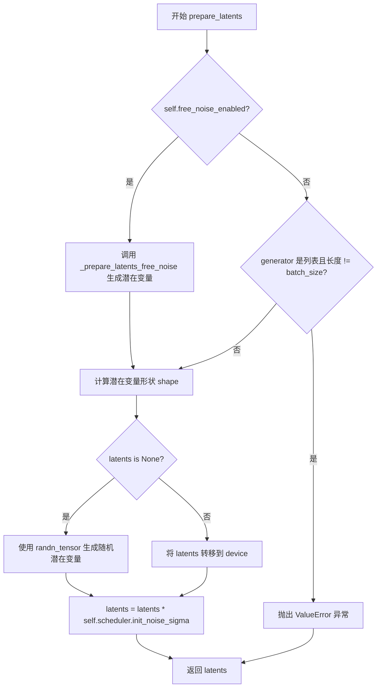

#### 带注释源码

```python
def prepare_latents(
    self, batch_size, num_channels_latents, num_frames, height, width, dtype, device, generator, latents=None
):
    # 如果启用了 FreeNoise 功能，按照 FreeNoise 论文中的方法生成潜在变量
    # 论文地址: https://huggingface.co/papers/2310.15169
    if self.free_noise_enabled:
        latents = self._prepare_latents_free_noise(
            batch_size, num_channels_latents, num_frames, height, width, dtype, device, generator, latents
        )

    # 验证生成器列表长度与批次大小是否匹配
    if isinstance(generator, list) and len(generator) != batch_size:
        raise ValueError(
            f"You have passed a list of generators of length {len(generator)}, but requested an effective batch"
            f" size of {batch_size}. Make sure the batch size matches the length of the generators."
        )

    # 计算潜在变量的形状，考虑 VAE 缩放因子
    # 形状: (batch_size, num_channels_latents, num_frames, height/vae_scale_factor, width/vae_scale_factor)
    shape = (
        batch_size,
        num_channels_latents,
        num_frames,
        height // self.vae_scale_factor,
        width // self.vae_scale_factor,
    )

    # 如果未提供潜在变量，则随机生成；否则转移到目标设备
    if latents is None:
        latents = randn_tensor(shape, generator=generator, device=device, dtype=dtype)
    else:
        latents = latents.to(device)

    # 根据调度器的初始噪声标准差对潜在变量进行缩放
    # 这是扩散模型去噪过程的重要初始化步骤
    latents = latents * self.scheduler.init_noise_sigma
    return latents
```


### `AnimateDiffControlNetPipeline.prepare_video`

该方法负责将输入的视频 conditioning frames 进行预处理、维度变换和批次复制，以适配 ControlNet 的输入格式要求。包括视频帧的缩放、通道维度调整、批次扩展以及在 classifier-free guidance 模式下的条件/非条件帧拼接。

参数：

- `self`：实例本身，AnimateDiffControlNetPipeline 类的实例
- `video`：`PipelineImageInput`，需要预处理的原始视频 conditioning frames 输入
- `width`：`int`，目标输出视频的宽度像素值
- `height`：`int`，目标输出视频的高度像素值
- `batch_size`：`int`，批处理大小，用于确定视频帧的重复次数
- `num_videos_per_prompt`：`int`，每个 prompt 生成的视频数量
- `device`：`torch.device`，目标计算设备（CPU/CUDA）
- `dtype`：`torch.dtype`，目标数据类型（如 float16）
- `do_classifier_free_guidance`：`bool`，是否启用 classifier-free guidance（默认 False）
- `guess_mode`：`bool`，ControlNet 的 guess mode 标志（默认 False）

返回值：`torch.Tensor`，处理完成的视频张量，形状为 `(batch_size * num_videos_per_prompt * (2 if cfg else 1), C, F, H, W)`

#### 流程图

```mermaid
flowchart TD
    A[开始: prepare_video] --> B[调用 control_video_processor.preprocess_video 预处理视频]
    B --> C[将视频张量转换为 float32]
    C --> D[执行 permute: 0,2,1,3,4 变换通道维度]
    D --> E[flatten 展平帧和批次维度]
    E --> F{检查 video_batch_size == 1?}
    F -->|是| G[repeat_by = batch_size]
    F -->|否| H[repeat_by = num_videos_per_prompt]
    G --> I[repeat_interleave 扩展视频批次]
    H --> I
    I --> J[移动张量到指定 device 和 dtype]
    J --> K{do_classifier_free_guidance && !guess_mode?}
    K -->|是| L[torch.cat [video] * 2 拼接条件与非条件帧]
    K -->|否| M[直接返回 video]
    L --> N[结束: 返回处理后的视频张量]
    M --> N
```

#### 带注释源码

```python
def prepare_video(
    self,
    video,                                  # 输入: 原始 conditioning 视频帧
    width,                                  # 输入: 目标宽度
    height,                                 # 输入: 目标高度
    batch_size,                             # 输入: 批处理大小
    num_videos_per_prompt,                  # 输入: 每个 prompt 的视频数
    device,                                 # 输入: 目标设备
    dtype,                                  # 输入: 目标数据类型
    do_classifier_free_guidance=False,      # 输入: 是否启用 CFG
    guess_mode=False,                       # 输入: guess mode 标志
):
    # Step 1: 预处理视频 - 调用专用的 control_video_processor 进行缩放、归一化等处理
    video = self.control_video_processor.preprocess_video(video, height=height, width=width).to(
        dtype=torch.float32  # 预处理阶段使用 float32 以保证精度
    )
    
    # Step 2: 维度变换 - 将 [B, C, F, H, W] 转换为 [B*F, C, H, W]
    # permute(0, 2, 1, 3, 4) 将通道维度移至第2维，然后 flatten(0, 1) 合并批次和帧维度
    video = video.permute(0, 2, 1, 3, 4).flatten(0, 1)
    video_batch_size = video.shape[0]  # 获取展平后的视频帧数量

    # Step 3: 确定重复倍数 - 根据原始视频帧数量决定如何扩展批次
    if video_batch_size == 1:
        # 如果只有一帧 conditioning 图像，则按 batch_size 重复（每个 prompt 都用同一帧）
        repeat_by = batch_size
    else:
        # 否则按 num_videos_per_prompt 重复（每个 prompt 生成多个视频时使用）
        repeat_by = num_videos_per_prompt

    # Step 4: 批次扩展 - 按 repeat_by 重复视频帧
    video = video.repeat_interleave(repeat_by, dim=0)
    
    # Step 5: 设备与数据类型转换 - 转换到目标设备和张量类型
    video = video.to(device=device, dtype=dtype)

    # Step 6: Classifier-Free Guidance 处理
    # 当启用 CFG 且不在 guess_mode 时，需要同时提供条件帧和无条件帧
    if do_classifier_free_guidance and not guess_mode:
        # 将视频帧复制两份：前半部分作为无条件输入，后半部分作为条件输入
        video = torch.cat([video] * 2)

    return video  # 返回处理完成的视频张量
```


### `AnimateDiffControlNetPipeline.__call__`

这是AnimateDiffControlNetPipeline的核心推理方法，负责执行文本到视频的生成任务，结合ControlNet进行条件控制，并通过Motion Adapter实现动画效果。该方法完成了从输入验证、提示编码、条件帧处理、去噪循环到最终视频后处理的完整流程。

参数：

- `prompt`：`str | list[str] | None`，用于引导视频生成的文本提示，若未定义则需传入`prompt_embeds`
- `num_frames`：`int | None`，生成的视频帧数，默认为16帧（在8fps下相当于2秒视频）
- `height`：`int | None`，生成视频的高度（像素），默认为`self.unet.config.sample_size * self.vae_scale_factor`
- `width`：`int | None`，生成视频的宽度（像素），默认为`self.unet.config.sample_size * self.vae_scale_factor`
- `num_inference_steps`：`int`，去噪步数，默认为50，步数越多通常视频质量越高但推理速度越慢
- `guidance_scale`：`float`，引导尺度值，默认为7.5，用于控制生成图像与文本提示的相关性
- `negative_prompt`：`str | list[str] | None`，用于引导不包含内容的负面提示
- `num_videos_per_prompt`：`int | None`，每个提示生成的视频数量，默认为1
- `eta`：`float`，DDIM论文中的参数η，默认为0.0，仅适用于DDIMScheduler
- `generator`：`torch.Generator | list[torch.Generator] | None`，用于使生成确定性的随机生成器
- `latents`：`torch.Tensor | None`，预生成的噪声潜在变量，形状为`(batch_size, num_channel, num_frames, height, width)`
- `prompt_embeds`：`torch.Tensor | None`，预生成的文本嵌入，用于方便调整文本输入
- `negative_prompt_embeds`：`torch.Tensor | None`，预生成的负面文本嵌入
- `ip_adapter_image`：`PipelineImageInput | None`，用于IP Adapters的可选图像输入
- `ip_adapter_image_embeds`：`PipelineImageInput | None`，IP-Adapter的预生成图像嵌入列表
- `conditioning_frames`：`list[PipelineImageInput] | None`，ControlNet输入条件帧，用于引导unet生成
- `output_type`：`str | None`，生成视频的输出格式，可选`torch.Tensor`、`PIL.Image`或`np.array`，默认为`"pil"`
- `return_dict`：`bool`，是否返回`AnimateDiffPipelineOutput`而非元组，默认为True
- `cross_attention_kwargs`：`dict[str, Any] | None`，传递给AttentionProcessor的kwargs字典
- `controlnet_conditioning_scale`：`float | list[float]`，ControlNet输出乘数，默认为1.0
- `guess_mode`：`bool`，ControlNet编码器尝试识别输入图像内容，默认为False
- `control_guidance_start`：`float | list[float]`，ControlNet开始应用的总步数百分比，默认为0.0
- `control_guidance_end`：`float | list[float]`，ControlNet停止应用的总步数百分比，默认为1.0
- `clip_skip`：`int | None`，CLIP计算提示嵌入时跳过的层数
- `callback_on_step_end`：`Callable[[int, int], None] | None`，每个去噪步骤结束时调用的函数
- `callback_on_step_end_tensor_inputs`：`list[str]`，回调函数使用的张量输入列表，默认为`["latents"]`
- `decode_chunk_size`：`int`，解码潜在变量时的块大小，默认为16

返回值：`AnimateDiffPipelineOutput | tuple`，若`return_dict`为True返回`AnimateDiffPipelineOutput`，否则返回包含生成帧列表的元组

#### 流程图

```mermaid
flowchart TD
    A[开始 __call__] --> B[获取controlnet原始模块]
    B --> C[对齐control_guidance格式]
    C --> D[设置默认height和width]
    D --> E[设置num_videos_per_prompt=1]
    E --> F[调用check_inputs验证输入]
    F --> G[设置内部状态变量<br/>_guidance_scale, _clip_skip, _cross_attention_kwargs, _interrupt]
    G --> H[确定batch_size]
    H --> I[处理controlnet_conditioning_scale]
    I --> J{是否启用free_noise?}
    J -->|Yes| K[调用_encode_prompt_free_noise]
    J -->|No| L[调用encode_prompt]
    K --> M[处理IP-Adapter图像嵌入]
    L --> M
    M --> N[准备conditioning_frames视频]
    N --> O[设置scheduler时间步]
    O --> P[调用prepare_latents准备潜在变量]
    P --> Q[调用prepare_extra_step_kwargs]
    Q --> R[创建added_cond_kwargs]
    R --> S[创建controlnet_keep列表]
    S --> T{是否有free_init迭代?}
    T -->|Yes| U[应用free_init]
    T -->|No| V[进入去噪循环]
    U --> V
    V --> W[展开latents进行classifier free guidance]
    W --> X[scale_model_input]
    X --> Y{guess_mode && CFG?}
    Y -->|Yes| Z[仅对条件批推理ControlNet]
    Y -->|No| AA[正常处理]
    Z --> AB[调用controlnet]
    AA --> AB
    AB --> AC[调用unet预测噪声残差]
    AC --> AD{do_classifier_free_guidance?}
    AD -->|Yes| AE[执行guidance计算]
    AD -->|No| AF[跳过guidance]
    AE --> AG[调用scheduler.step计算上一步样本]
    AF --> AG
    AG --> AH[调用callback_on_step_end]
    AH --> AI{是否为最后一个步骤或热身步骤?}
    AI -->|Yes| AJ[更新进度条]
    AI -->|No| AK[继续循环]
    AJ --> AL{是否还有剩余时间步?}
    AK --> AL
    AL -->|Yes| V
    AL -->|No| AM{output_type == 'latent'?}
    AM -->|Yes| AN[video = latents]
    AM -->|No| AO[decode_latents解码]
    AO --> AP[postprocess_video后处理]
    AN --> AP
    AP --> AQ[maybe_free_model_hooks释放模型]
    AQ --> AR{return_dict?}
    AR -->|Yes| AS[返回AnimateDiffPipelineOutput]
    AR -->|No| AT[返回tuple]
    AS --> AU[结束]
    AT --> AU
```

#### 带注释源码

```python
@torch.no_grad()
def __call__(
    self,
    prompt: str | list[str] = None,
    num_frames: int | None = 16,
    height: int | None = None,
    width: int | None = None,
    num_inference_steps: int = 50,
    guidance_scale: float = 7.5,
    negative_prompt: str | list[str] | None = None,
    num_videos_per_prompt: int | None = 1,
    eta: float = 0.0,
    generator: torch.Generator | list[torch.Generator] | None = None,
    latents: torch.Tensor | None = None,
    prompt_embeds: torch.Tensor | None = None,
    negative_prompt_embeds: torch.Tensor | None = None,
    ip_adapter_image: PipelineImageInput | None = None,
    ip_adapter_image_embeds: PipelineImageInput | None = None,
    conditioning_frames: list[PipelineImageInput] | None = None,
    output_type: str | None = "pil",
    return_dict: bool = True,
    cross_attention_kwargs: dict[str, Any] | None = None,
    controlnet_conditioning_scale: float | list[float] = 1.0,
    guess_mode: bool = False,
    control_guidance_start: float | list[float] = 0.0,
    control_guidance_end: float | list[float] = 1.0,
    clip_skip: int | None = None,
    callback_on_step_end: Callable[[int, int], None] | None = None,
    callback_on_step_end_tensor_inputs: list[str] = ["latents"],
    decode_chunk_size: int = 16,
):
    # 1. 获取controlnet的原始模块（如果是编译过的模块）
    controlnet = self.controlnet._orig_mod if is_compiled_module(self.controlnet) else self.controlnet

    # 2. 对齐control_guidance的格式，确保start和end都是列表
    if not isinstance(control_guidance_start, list) and isinstance(control_guidance_end, list):
        control_guidance_start = len(control_guidance_end) * [control_guidance_start]
    elif not isinstance(control_guidance_end, list) and isinstance(control_guidance_start, list):
        control_guidance_end = len(control_guidance_start) * [control_guidance_end]
    elif not isinstance(control_guidance_start, list) and not isinstance(control_guidance_end, list):
        # 根据controlnet数量扩展
        mult = len(controlnet.nets) if isinstance(controlnet, MultiControlNetModel) else 1
        control_guidance_start, control_guidance_end = (
            mult * [control_guidance_start],
            mult * [control_guidance_end],
        )

    # 3. 设置默认height和width（如果未提供）
    height = height or self.unet.config.sample_size * self.vae_scale_factor
    width = width or self.unet.config.sample_size * self.vae_scale_factor

    # 4. 强制设置num_videos_per_prompt为1
    num_videos_per_prompt = 1

    # 5. 验证输入参数
    self.check_inputs(
        prompt=prompt,
        height=height,
        width=width,
        num_frames=num_frames,
        negative_prompt=negative_prompt,
        callback_on_step_end_tensor_inputs=callback_on_step_end_tensor_inputs,
        prompt_embeds=prompt_embeds,
        negative_prompt_embeds=negative_prompt_embeds,
        video=conditioning_frames,
        controlnet_conditioning_scale=controlnet_conditioning_scale,
        control_guidance_start=control_guidance_start,
        control_guidance_end=control_guidance_end,
    )

    # 6. 设置内部状态变量
    self._guidance_scale = guidance_scale
    self._clip_skip = clip_skip
    self._cross_attention_kwargs = cross_attention_kwargs
    self._interrupt = False

    # 7. 根据prompt类型确定batch_size
    if prompt is not None and isinstance(prompt, (str, dict)):
        batch_size = 1
    elif prompt is not None and isinstance(prompt, list):
        batch_size = len(prompt)
    else:
        batch_size = prompt_embeds.shape[0]

    # 8. 获取执行设备
    device = self._execution_device

    # 9. 处理controlnet_conditioning_scale为列表（如果是MultiControlNetModel）
    if isinstance(controlnet, MultiControlNetModel) and isinstance(controlnet_conditioning_scale, float):
        controlnet_conditioning_scale = [controlnet_conditioning_scale] * len(controlnet.nets)

    # 10. 确定是否使用guess_mode
    global_pool_conditions = (
        controlnet.config.global_pool_conditions
        if isinstance(controlnet, ControlNetModel)
        else controlnet.nets[0].config.global_pool_conditions
    )
    guess_mode = guess_mode or global_pool_conditions

    # 11. 编码输入提示
    text_encoder_lora_scale = (
        cross_attention_kwargs.get("scale", None) if cross_attention_kwargs is not None else None
    )
    
    # 12. 根据是否启用free_noise选择编码方法
    if self.free_noise_enabled:
        prompt_embeds, negative_prompt_embeds = self._encode_prompt_free_noise(
            prompt=prompt,
            num_frames=num_frames,
            device=device,
            num_videos_per_prompt=num_videos_per_prompt,
            do_classifier_free_guidance=self.do_classifier_free_guidance,
            negative_prompt=negative_prompt,
            prompt_embeds=prompt_embeds,
            negative_prompt_embeds=negative_prompt_embeds,
            lora_scale=text_encoder_lora_scale,
            clip_skip=self.clip_skip,
        )
    else:
        prompt_embeds, negative_prompt_embeds = self.encode_prompt(
            prompt,
            device,
            num_videos_per_prompt,
            self.do_classifier_free_guidance,
            negative_prompt,
            prompt_embeds=prompt_embeds,
            negative_prompt_embeds=negative_prompt_embeds,
            lora_scale=text_encoder_lora_scale,
            clip_skip=self.clip_skip,
        )

        # 13. 对于classifier free guidance，拼接无条件和有条件embeddings
        if self.do_classifier_free_guidance:
            prompt_embeds = torch.cat([negative_prompt_embeds, prompt_embeds])

        # 14. 重复prompt_embeds以匹配帧数
        prompt_embeds = prompt_embeds.repeat_interleave(repeats=num_frames, dim=0)

    # 15. 处理IP-Adapter图像嵌入
    if ip_adapter_image is not None or ip_adapter_image_embeds is not None:
        image_embeds = self.prepare_ip_adapter_image_embeds(
            ip_adapter_image,
            ip_adapter_image_embeds,
            device,
            batch_size * num_videos_per_prompt,
            self.do_classifier_free_guidance,
        )

    # 16. 准备conditioning_frames视频
    if isinstance(controlnet, ControlNetModel):
        conditioning_frames = self.prepare_video(
            video=conditioning_frames,
            width=width,
            height=height,
            batch_size=batch_size * num_videos_per_prompt * num_frames,
            num_videos_per_prompt=num_videos_per_prompt,
            device=device,
            dtype=controlnet.dtype,
            do_classifier_free_guidance=self.do_classifier_free_guidance,
            guess_mode=guess_mode,
        )
    elif isinstance(controlnet, MultiControlNetModel):
        cond_prepared_videos = []
        for frame_ in conditioning_frames:
            prepared_video = self.prepare_video(
                video=frame_,
                width=width,
                height=height,
                batch_size=batch_size * num_videos_per_prompt * num_frames,
                num_videos_per_prompt=num_videos_per_prompt,
                device=device,
                dtype=controlnet.dtype,
                do_classifier_free_guidance=self.do_classifier_free_guidance,
                guess_mode=guess_mode,
            )
            cond_prepared_videos.append(prepared_video)
        conditioning_frames = cond_prepared_videos
    else:
        assert False

    # 17. 准备timesteps
    self.scheduler.set_timesteps(num_inference_steps, device=device)
    timesteps = self.scheduler.timesteps

    # 18. 准备latent变量
    num_channels_latents = self.unet.config.in_channels
    latents = self.prepare_latents(
        batch_size * num_videos_per_prompt,
        num_channels_latents,
        num_frames,
        height,
        width,
        prompt_embeds.dtype,
        device,
        generator,
        latents,
    )

    # 19. 准备extra_step_kwargs
    extra_step_kwargs = self.prepare_extra_step_kwargs(generator, eta)

    # 20. 创建IP-Adapter的added_cond_kwargs
    added_cond_kwargs = (
        {"image_embeds": image_embeds}
        if ip_adapter_image is not None or ip_adapter_image_embeds is not None
        else None
    )

    # 21. 创建controlnet_keep列表（控制每个时间步是否使用ControlNet）
    controlnet_keep = []
    for i in range(len(timesteps)):
        keeps = [
            1.0 - float(i / len(timesteps) < s or (i + 1) / len(timesteps) > e)
            for s, e in zip(control_guidance_start, control_guidance_end)
        ]
        controlnet_keep.append(keeps[0] if isinstance(controlnet, ControlNetModel) else keeps)

    # 22. FreeInit迭代循环
    num_free_init_iters = self._free_init_num_iters if self.free_init_enabled else 1
    for free_init_iter in range(num_free_init_iters):
        if self.free_init_enabled:
            latents, timesteps = self._apply_free_init(
                latents, free_init_iter, num_inference_steps, device, latents.dtype, generator
            )

        self._num_timesteps = len(timesteps)
        num_warmup_steps = len(timesteps) - num_inference_steps * self.scheduler.order

        # 23. 去噪循环
        with self.progress_bar(total=self._num_timesteps) as progress_bar:
            for i, t in enumerate(timesteps):
                # 检查是否中断
                if self.interrupt:
                    continue

                # 24. 展开latents（如果使用CFG）
                latent_model_input = torch.cat([latents] * 2) if self.do_classifier_free_guidance else latents
                latent_model_input = self.scheduler.scale_model_input(latent_model_input, t)

                # 25. guess_mode处理
                if guess_mode and self.do_classifier_free_guidance:
                    control_model_input = latents
                    control_model_input = self.scheduler.scale_model_input(control_model_input, t)
                    controlnet_prompt_embeds = prompt_embeds.chunk(2)[1]
                else:
                    control_model_input = latent_model_input
                    controlnet_prompt_embeds = prompt_embeds

                # 26. 计算ControlNet的条件尺度
                if isinstance(controlnet_keep[i], list):
                    cond_scale = [c * s for c, s in zip(controlnet_conditioning_scale, controlnet_keep[i])]
                else:
                    controlnet_cond_scale = controlnet_conditioning_scale
                    if isinstance(controlnet_cond_scale, list):
                        controlnet_cond_scale = controlnet_cond_scale[0]
                    cond_scale = controlnet_cond_scale * controlnet_keep[i]

                # 27. 调整ControlNet输入维度
                control_model_input = torch.transpose(control_model_input, 1, 2)
                control_model_input = control_model_input.reshape(
                    (-1, control_model_input.shape[2], control_model_input.shape[3], control_model_input.shape[4])
                )

                # 28. 调用ControlNet
                down_block_res_samples, mid_block_res_sample = self.controlnet(
                    control_model_input,
                    t,
                    encoder_hidden_states=controlnet_prompt_embeds,
                    controlnet_cond=conditioning_frames,
                    conditioning_scale=cond_scale,
                    guess_mode=guess_mode,
                    return_dict=False,
                )

                # 29. 预测噪声残差
                noise_pred = self.unet(
                    latent_model_input,
                    t,
                    encoder_hidden_states=prompt_embeds,
                    cross_attention_kwargs=self.cross_attention_kwargs,
                    added_cond_kwargs=added_cond_kwargs,
                    down_block_additional_residuals=down_block_res_samples,
                    mid_block_additional_residual=mid_block_res_sample,
                ).sample

                # 30. 执行guidance
                if self.do_classifier_free_guidance:
                    noise_pred_uncond, noise_pred_text = noise_pred.chunk(2)
                    noise_pred = noise_pred_uncond + guidance_scale * (noise_pred_text - noise_pred_uncond)

                # 31. 计算上一步的样本
                latents = self.scheduler.step(noise_pred, t, latents, **extra_step_kwargs).prev_sample

                # 32. 调用callback_on_step_end
                if callback_on_step_end is not None:
                    callback_kwargs = {}
                    for k in callback_on_step_end_tensor_inputs:
                        callback_kwargs[k] = locals()[k]
                    callback_outputs = callback_on_step_end(self, i, t, callback_kwargs)

                    latents = callback_outputs.pop("latents", latents)
                    prompt_embeds = callback_outputs.pop("prompt_embeds", prompt_embeds)
                    negative_prompt_embeds = callback_outputs.pop("negative_prompt_embeds", negative_prompt_embeds)

                # 33. 更新进度条
                if i == len(timesteps) - 1 or ((i + 1) > num_warmup_steps and (i + 1) % self.scheduler.order == 0):
                    progress_bar.update()

                # 34. XLA设备标记步骤
                if XLA_AVAILABLE:
                    xm.mark_step()

    # 35. 后处理
    if output_type == "latent":
        video = latents
    else:
        video_tensor = self.decode_latents(latents, decode_chunk_size)
        video = self.video_processor.postprocess_video(video=video_tensor, output_type=output_type)

    # 36. 释放模型
    self.maybe_free_model_hooks()

    # 37. 返回结果
    if not return_dict:
        return (video,)

    return AnimateDiffPipelineOutput(frames=video)
```


### `AnimateDiffControlNetPipeline.guidance_scale`

该属性是一个只读属性，用于返回当前管道的 guidance_scale 值，该值控制分类器自由引导（Classifier-Free Guidance）的强度，决定生成内容与文本提示的匹配程度。

参数：

- 该属性无显式参数（隐式参数 `self` 为实例本身）

返回值：`float`，返回当前的 guidance_scale 值，用于控制文本prompt对生成视频的影响程度。

#### 流程图

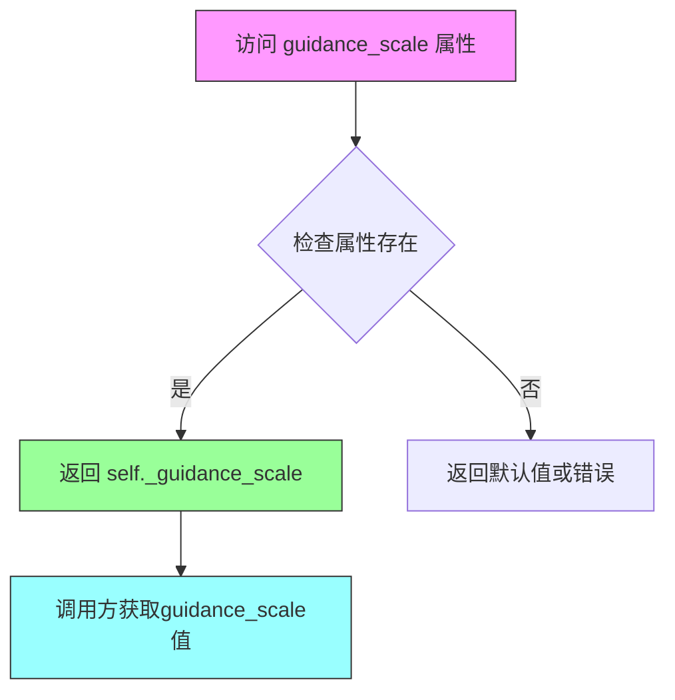

#### 带注释源码

```python
@property
def guidance_scale(self):
    """
    guidance_scale 属性 getter 方法
    
    该属性返回一个浮点数，表示当前分类器自由引导（Classifier-Free Guidance）的权重。
    在扩散模型中，guidance_scale 用于控制生成图像/视频与文本提示的匹配程度：
    - guidance_scale = 1.0: 不使用引导
    - guidance_scale > 1.0: 使用引导，值越大越严格遵守prompt
    
    该值在 __call__ 方法中被设置为 self._guidance_scale:
        self._guidance_scale = guidance_scale
    
    Returns:
        float: 当前管道的 guidance_scale 值
    """
    return self._guidance_scale
```


### `AnimateDiffControlNetPipeline.clip_skip`

该属性是 `AnimateDiffControlNetPipeline` 类的 CLIP 跳过层数属性（property），用于返回在文本编码时跳过的 CLIP 层数。该值在调用 pipeline 时通过 `clip_skip` 参数设置，用于控制从 CLIP 文本编码器的哪个隐藏层获取文本嵌入。

参数：

- （无参数）

返回值：`int | None`，返回 CLIP 跳过层数，如果未设置则为 `None`。

#### 流程图

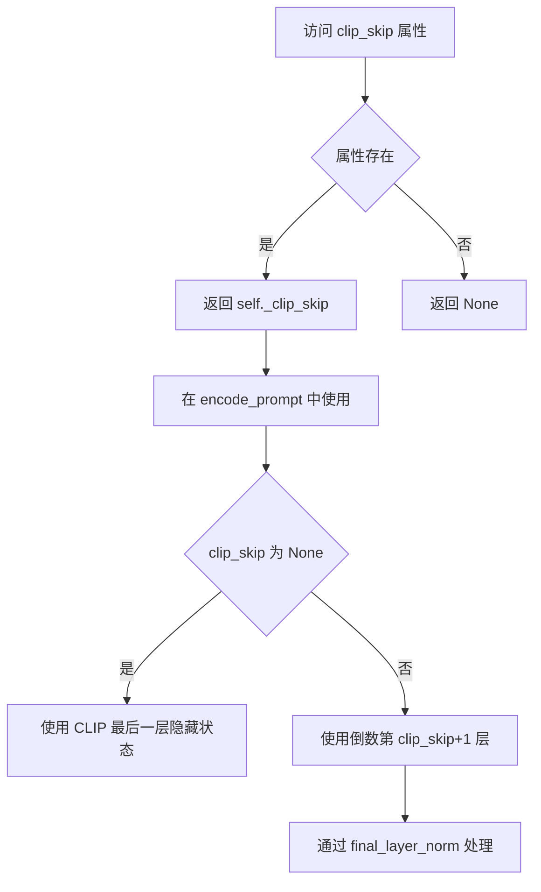

#### 带注释源码

```python
@property
def clip_skip(self):
    """
    返回 CLIP 跳过的层数。
    
    该属性在调用 pipeline 时被设置（self._clip_skip = clip_skip），
    用于控制文本编码器隐藏层的选择：
    - None: 使用 CLIP 的最后一层输出
    - 其他值: 跳过指定层数，使用更深层的隐藏状态
    
    在 encode_prompt 方法中的使用逻辑：
    - 如果 clip_skip 为 None，直接使用 text_encoder 的输出
    - 如果 clip_skip 不为 None，设置 output_hidden_states=True，
      然后通过 prompt_embeds[-1][-(clip_skip+1)] 选择对应层的隐藏状态，
      最后通过 final_layer_norm 进行归一化处理
    """
    return self._clip_skip
```


### `AnimateDiffControlNetPipeline.do_classifier_free_guidance`

该属性用于判断当前管道是否启用无分类器引导（Classifier-Free Guidance，CFG）。它通过检查内部属性 `_guidance_scale` 是否大于 1 来返回布尔值。当 guidance_scale > 1 时，扩散模型会在去噪过程中同时预测有条件和无条件的噪声，从而生成更符合文本提示的图像。

参数： 无

返回值：`bool`，如果 `guidance_scale > 1` 则返回 `True`（启用 CFG），否则返回 `False`（禁用 CFG）

#### 流程图

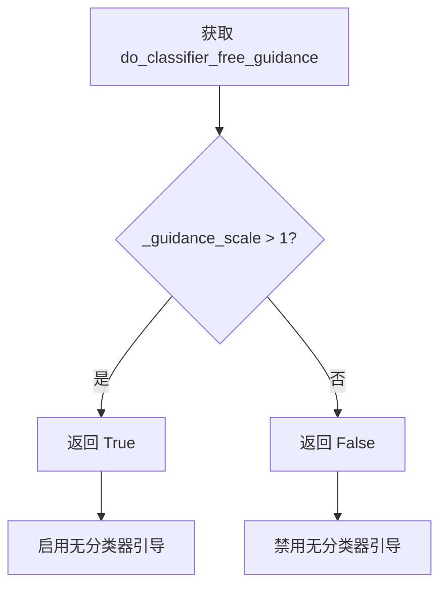

#### 带注释源码

```python
@property
def do_classifier_free_guidance(self):
    """
    属性：判断是否启用无分类器引导（Classifier-Free Guidance）
    
    该属性是一个只读属性，用于在扩散模型推理过程中
    动态判断是否需要进行无分类器引导。
    
    原理：
    - 当 guidance_scale > 1 时，CFG 启用
    - guidance_scale = 1 时，相当于不使用 CFG
    - guidance_scale < 1 的情况在实践中很少使用
    
    返回值：
        bool: 是否启用 CFG
    """
    return self._guidance_scale > 1
```


### `AnimateDiffControlNetPipeline.cross_attention_kwargs`

该属性是一个只读的 getter 属性，用于获取在管道调用时设置的交叉注意力关键字参数（cross_attention_kwargs）。这些参数会被传递给 UNet 模型的注意力处理器，用于控制注意力机制的行为，例如 LoRA 权重、注意力缩放等。

参数：无（仅 `self`）

返回值：`dict[str, Any] | None`，返回交叉注意力关键字参数字典，如果未设置则返回 `None`

#### 流程图

```mermaid
flowchart TD
    A[调用 cross_attention_kwargs 属性] --> B{检查 _cross_attention_kwargs 是否已设置}
    B -->|已设置| C[返回 self._cross_attention_kwargs]
    B -->|未设置| D[返回 None]
    C --> E[传递给 UNet 的注意力处理器]
    D --> E
```

#### 带注释源码

```python
@property
def cross_attention_kwargs(self):
    """
    获取交叉注意力关键字参数。
    
    该属性返回在管道调用时通过 __call__ 方法的 cross_attention_kwargs 参数
    设置的值。这些参数会被传递给 UNet 模型的注意力处理器（AttentionProcessor），
    用于控制注意力机制的各种行为，例如：
    - LoRA 权重缩放（通过 "scale" 键）
    - 自定义注意力实现
    - 注意力门控等
    
    Returns:
        dict[str, Any] | None: 交叉注意力关键字参数字典，如果未设置则返回 None。
    """
    return self._cross_attention_kwargs
```


### `AnimateDiffControlNetPipeline.num_timesteps`

该属性是一个只读的Python property，用于获取当前扩散管道执行过程中的时间步数量。它返回在推理过程中实际使用的时间步总数，该值在调用`__call__`方法时根据调度器的时间步设置动态确定。

参数：无（属性getter不接受任何参数）

返回值：`int`，返回推理过程中使用的时间步总数，即`len(timesteps)`的值，通常等于`num_inference_steps`。

#### 流程图

```mermaid
flowchart TD
    A[访问 num_timesteps 属性] --> B{读取 _num_timesteps}
    B --> C[返回时间步数量]
```

#### 带注释源码

```python
@property
def num_timesteps(self):
    """
    返回当前扩散管道的时间步数量。
    
    该属性是一个只读属性，返回在 pipeline __call__ 执行过程中
    设置的 _num_timesteps 值。该值表示实际推理时使用的时间步总数，
    通常等于 num_inference_steps 参数（除非调度器进行了调整）。
    
    Returns:
        int: 推理过程中使用的时间步数量
    """
    return self._num_timesteps
```

#### 相关上下文

该属性在`__call__`方法中被赋值：

```python
# 在 __call__ 方法的 denoising loop 开始前设置
self._num_timesteps = len(timesteps)
```

其中 `timesteps` 来自调度器：
```python
# 4. Prepare timesteps
self.scheduler.set_timesteps(num_inference_steps, device=device)
timesteps = self.scheduler.timesteps
```

这意味着 `num_timesteps` 反映了调度器实际生成的时间步数组的长度，可能与请求的 `num_inference_steps` 有所不同（取决于调度器的实现，例如某些调度器可能会调整步数）。


### `AnimateDiffControlNetPipeline.interrupt`

该属性是一个只读的访问器，用于获取当前管道的运行状态。当外部需要提前终止扩散过程时，可通过检查此属性的返回值判断是否应立即中断去噪循环。

参数：なし（なし）

戻り値：`bool`，返回当前的中断标志状态。如果为 `True`，表示外部请求中断管道执行，循环将继续执行但跳过推理逻辑。

#### 流程图

```mermaid
flowchart TD
    A[获取 interrupt 属性] --> B{读取 self._interrupt}
    B -->|True| C[返回 True - 需要中断]
    B -->|False| D[返回 False - 继续执行]
    
    E[__call__ 方法循环] --> F{self.interrupt == True?}
    F -->|是| G[continue - 跳过当前步]
    F -->|否| H[继续正常推理]
```

#### 带注释源码

```python
@property
def interrupt(self):
    """
    属性访问器，用于获取管道的运行状态。
    
    该属性在 __call__ 方法的去噪循环中被检查：
        if self.interrupt:
            continue
    
    外部调用者可以通过设置 self._interrupt = True 来请求提前终止扩散过程。
    
    Returns:
        bool: 当前的中断标志状态。默认在 __call__ 开始时设置为 False。
    """
    return self._interrupt
```

## 关键组件


### AnimateDiffControlNetPipeline

用于文本到视频生成的ControlNet管道，结合运动适配器实现动画生成。

### MotionAdapter

运动适配器模块，用于为UNet2DConditionModel添加时间维度的运动建模能力，将2D扩散模型扩展为时空模型。

### MultiControlNetModel

多ControlNet支持，允许同时使用多个ControlNet进行条件引导，可对不同控制信号进行加权融合。

### VideoProcessor

视频处理模块，负责视频帧的预处理（resize、normalize、convert_rgb）和后处理（解码后的latent转为视频格式）。

### FreeNoiseMixin (AnimateDiffFreeNoiseMixin)

自由噪声混合特质，提供基于FreeNoise算法的latent初始化，通过特定噪声策略提升视频生成的时间一致性。

### IPAdapterMixin

IP适配器混合特质，支持图像提示（Image Prompt）功能，允许通过额外图像输入引导生成。

### StableDiffusionLoraLoaderMixin

LoRA权重加载混合特质，支持低秩适配器权重的动态加载和调整，用于模型微调和风格迁移。

### 张量索引与惰性加载

在decode_latents方法中实现，通过decode_chunk_size参数分块解码latents，避免一次性处理整个视频序列的内存开销。

### 条件帧处理 (prepare_video)

对ControlNet conditioning frames进行预处理，包括维度变换、batch重复和classifier-free guidance的unconditional复制。

### Scheduler集成

支持KarrasDiffusionSchedulers系列调度器，提供多种噪声调度策略（DDIM、LMS、PNDM等）。

### Classifier-Free Guidance

在去噪循环中实现，通过拆分unconditional和text embeddings进行CFG引导，支持guess_mode推测模式。

### 回调与中断机制

通过callback_on_step_end和interrupt属性支持推理过程的中断和每步回调自定义处理。


## 问题及建议


### 已知问题

-   **断言用于错误处理**：`check_inputs` 和 `__call__` 方法中使用 `assert False` 进行错误处理，这不是最佳实践，应该使用 `raise ValueError` 或 `raise TypeError`。
-   **硬编码的解码块大小**：`decode_latents` 方法中 `decode_chunk_size` 默认值为 16，没有提供动态调整机制，可能导致内存使用效率不佳。
-   **未使用的参数**：`num_videos_per_prompt` 参数在 `__call__` 方法中被硬编码为 1，但仍然作为参数存在，增加了 API 的复杂性且未实现其功能。
-   **重复的张量操作逻辑**：多处存在相似的张量处理逻辑（如 `repeat_interleave`、`chunk`、`cat` 操作），可以在工具函数中复用。
-   **类型检查复杂性**：`check_inputs` 方法过长，包含大量 `isinstance` 检查和条件分支，可读性和维护性较差。
-   **缺失的错误处理**：在 `prepare_ip_adapter_image_embeds` 中，当 `ip_adapter_image` 和 `ip_adapter_image_embeds` 都为 `None` 时没有显式处理。
-   **潜在的内存问题**：`__call__` 方法中创建了多个大张量（如 `prompt_embeds.repeat_interleave(repeats=num_frames, dim=0)`），没有明显的内存优化措施。

### 优化建议

-   **重构类型检查逻辑**：将 `check_inputs` 方法拆分为多个较小的私有方法，每个方法负责特定类型的验证，提高可读性和可维护性。
-   **添加动态解码块大小配置**：允许用户通过构造函数或配置参数调整 `decode_chunk_size`，以适应不同的硬件配置。
-   **实现 `num_videos_per_prompt` 功能或移除参数**：如果当前版本不需要该功能，应从 API 中移除；如果需要，应实现其逻辑。
-   **提取张量操作工具函数**：将重复的张量操作（如 `repeat_interleave`、`chunk` 等）封装为工具函数，减少代码重复。
-   **将断言替换为异常**：将所有 `assert False` 替换为适当的 `raise` 语句，提高错误处理的一致性。
-   **添加内存优化提示**：在处理大张量时考虑使用 `torch.cuda.empty_cache()` 或其他内存管理技术。
-   **增加类型注解完整性**：为一些缺少类型注解的局部变量添加类型注解，提高代码的可读性和静态分析能力。

## 其它


### 设计目标与约束

该管道的设计目标是实现基于文本提示和 ControlNet 引导的文本到视频生成功能，支持运动适配器（Motion Adapter）来添加动态效果。设计约束包括：1）输入的 height 和 width 必须能被 8 整除；2）num_frames 默认为 16，配合 8fps 生成 2 秒视频；3）支持单 ControlNet 和 MultiControlNet 模式；4）依赖 HuggingFace Diffusers 框架的标准化组件；5）仅支持 PyTorch 后端，支持 XLA 加速；6）guidance_scale > 1 时启用 classifier-free guidance。

### 错误处理与异常设计

管道在多个关键点进行输入验证：1）check_inputs 方法验证 height/width 可被 8 整除、prompt 与 prompt_embeds 不能同时传递、conditioning_frames 数量与 num_frames 匹配；2）MultiControlNet 场景下验证 controlnet_conditioning_scale 列表长度与 ControlNet 数量一致；3）control_guidance_start 和 control_guidance_end 必须为有效范围 [0, 1] 且 start < end；4）IP-Adapter 数量与 image_projection_layers 数量必须匹配；5）batch_size 与 generator 列表长度必须一致；6）FreeNoise 模式下的特殊验证。

### 数据流与状态机

管道的数据流如下：1）初始化阶段加载 VAE、Text Encoder、Tokenizer、UNet、Motion Adapter、ControlNet、Scheduler；2）编码阶段将 prompt 编码为 prompt_embeds，negative_prompt 编码为 negative_prompt_embeds，conditioning_frames 预处理为 ControlNet 条件输入；3）潜在变量准备阶段生成或接收 latents；4）去噪循环阶段在每个 timestep 执行：扩展 latents（CFG 模式下）、ControlNet 前向传播获取中间特征、UNet 预测噪声、scheduler step 更新 latents；5）后处理阶段将 latents 解码为视频帧。状态机包括：idle → encoding → preparing_latents → denoising → postprocessing → completed。

### 外部依赖与接口契约

核心依赖包括：torch、transformers（CLIPTextModel、CLIPTokenizer、CLIPImageProcessor、CLIPVisionModelWithProjection）、diffusers（DiffusionPipeline、KarrasDiffusionSchedulers、AutoencoderKL、ControlNetModel、UNet2DConditionModel、UNetMotionModel、MotionAdapter）。可选依赖包括：torch_xla（XLA 加速）、PEFT backend（LoRA 权重管理）、controlnet_aux（条件图预处理）。接口契约：pipeline 必须实现 __call__ 方法返回 AnimateDiffPipelineOutput 或 tuple；encode_prompt 方法返回 (prompt_embeds, negative_prompt_embeds) 元组；decode_latents 方法返回解码后的视频张量。

### 性能考虑与优化空间

性能优化点包括：1）使用 decode_chunk_size 分块解码视频潜在变量，减少显存占用；2）支持 XLA 编译加速（is_torch_xla_available）；3）支持模型 CPU offload（model_cpu_offload_seq）；4）支持 PyTorch 2.0 的 compile 优化（is_compiled_module）；5）IP-Adapter 图像嵌入可预计算缓存。优化空间：1）当前在每个去噪步骤都进行 ControlNet 前向传播，可考虑条件帧的缓存策略；2）多 ControlNet 场景下的并行计算优化；3）FreeNoise 模式下的潜在变量生成算法优化；4）支持 ONNX 导出以进一步加速推理。

### 安全性考虑

安全措施包括：1）LoRA 权重加载时的 scale 管理，确保 Lora scale 在合理范围内；2）CLIPTokenizer 对输入文本的长度限制（model_max_length），防止超长输入；3）通过 prompt_embeds 和 negative_prompt_embeds 的形状验证防止维度不匹配；4）模型权重下载时的安全校验（通过 from_pretrained）。潜在风险：1）用户提供的 conditioning_frames 未经过滤，可能包含不当内容；2）文本提示注入攻击风险，建议在生产环境添加内容过滤层。

### 配置文件与参数说明

关键配置参数：1）vae_scale_factor：VAE 下采样因子，默认从 vae.config.block_out_channels 计算；2）motion_adapter：运动适配器配置，用于将 2D UNet 转换为运动模型；3）controlnet：支持单 ControlNet 或 MultiControlNet；4）scheduler：扩散调度器，支持 KarrasDiffusionSchedulers 系列；5）feature_extractor：CLIP 图像处理器，用于 IP-Adapter；6）image_encoder：CLIP 视觉编码器，用于提取图像嵌入。可选组件：feature_extractor、image_encoder 用于 IP-Adapter 功能。

### 使用示例与最佳实践

最佳实践：1）使用 MotionAdapter.from_pretrained 加载预训练运动权重；2）使用 LCMScheduler 加速推理；3）使用 load_lora_weights 加载 LoRA 权重后通过 set_adapters 设置适配器权重；4）conditioning_frames 需要使用 controlnet_aux 进行预处理（如 ZoeDetector）；5）使用 progress_bar 监控生成进度；6）推荐 guidance_scale 在 2.0-7.5 之间；7）推荐 num_inference_steps 在 10-50 之间。示例：参考 EXAMPLE_DOC_STRING 中的完整使用流程，包括视频加载、条件帧提取、pipeline 调用和 GIF 导出。

### 版本历史与兼容性

兼容性说明：1）需要 diffusers >= 0.21.0 版本；2）需要 transformers 库支持；3）UNet2DConditionModel 在检测到时会自动转换为 UNetMotionModel；4）支持从单文件（from_single_file）和预训练格式（from_pretrained）加载 ControlNet；5）支持 Textual Inversion、LoRA、IP-Adapter 等多种 embedding 加载方式；6）FreeInitMixin 和 AnimateDiffFreeNoiseMixin 提供初始化增强功能。版本演进：支持 FreeNoise 和 FreeInit 功能，支持 XLA 加速，支持 compiled module 优化。

### 测试策略

测试覆盖点：1）输入验证测试：height/width 整除性、prompt 与 embeds 互斥、batch_size 一致性；2）多 ControlNet 场景测试；3）IP-Adapter 集成测试；4）FreeNoise 模式测试；5）LoRA 权重加载与切换测试；6）输出类型测试：latent、pil、tensor；7）XLA 加速测试；8）模型 offload 测试；9）跨平台兼容性测试（CUDA/CPU）；10）端到端生成质量测试。

### 部署注意事项

部署建议：1）模型内存占用较高，建议使用 model_cpu_offload_seq 进行显存管理；2）推理速度受 num_inference_steps 和 num_frames 影响较大，建议根据需求调整；3）批量生成时可设置 num_videos_per_prompt > 1；4）生产环境建议使用 fp16 精度以减少显存占用；5）长时间运行需注意显存泄漏，建议定期清理缓存；6）多卡部署时可使用 accelerate 库进行分布式推理；7）监控 XLA_AVAILABLE 标志以启用 TPU 加速；8）建议在容器环境中设置 CUDA_VISIBLE_DEVICES 以正确识别 GPU 设备。

    