# `diffusers\src\diffusers\pipelines\animatediff\pipeline_animatediff_sdxl.py` 详细设计文档

AnimateDiffSDXLPipeline是用于基于Stable Diffusion XL实现文本到视频(动画)生成的扩散管道。该pipeline整合了运动适配器(Motion Adapter)、双文本编码器(CLIP)和条件U-Net模型,通过去噪过程从文本提示生成动态图像序列。

## 整体流程

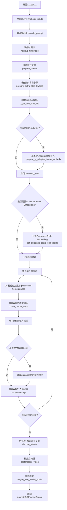

## 类结构

```
DiffusionPipeline (抽象基类)
├── StableDiffusionMixin
├── FromSingleFileMixin
├── StableDiffusionXLLoraLoaderMixin
├── TextualInversionLoaderMixin
├── IPAdapterMixin
├── FreeInitMixin
└── AnimateDiffSDXLPipeline (主实现类)
```

## 全局变量及字段


### `logger`
    
模块级日志记录器，用于输出调试和信息日志

类型：`logging.Logger`
    


### `EXAMPLE_DOC_STRING`
    
包含AnimateDiffSDXLPipeline使用示例的文档字符串

类型：`str`
    


### `XLA_AVAILABLE`
    
标识torch_xla是否可用的布尔值，用于条件导入和TPU支持

类型：`bool`
    


### `AnimateDiffSDXLPipeline.model_cpu_offload_seq`
    
指定模型组件CPU到GPU卸载顺序的字符串

类型：`str`
    


### `AnimateDiffSDXLPipeline._optional_components`
    
可选组件名称列表，包括tokenizer、text_encoder、image_encoder等

类型：`list[str]`
    


### `AnimateDiffSDXLPipeline._callback_tensor_inputs`
    
支持回调的tensor输入名称列表，用于推理过程中的中间结果访问

类型：`list[str]`
    


### `AnimateDiffSDXLPipeline.vae`
    
变分自编码器模型，用于图像/视频的潜在空间编码和解码

类型：`AutoencoderKL`
    


### `AnimateDiffSDXLPipeline.text_encoder`
    
冻结的CLIP文本编码器，用于将文本提示转换为embedding

类型：`CLIPTextModel`
    


### `AnimateDiffSDXLPipeline.text_encoder_2`
    
第二个冻结的CLIP文本编码器，包含projection层用于SDXL

类型：`CLIPTextModelWithProjection`
    


### `AnimateDiffSDXLPipeline.tokenizer`
    
第一个CLIP分词器，用于将文本转换为token IDs

类型：`CLIPTokenizer`
    


### `AnimateDiffSDXLPipeline.tokenizer_2`
    
第二个CLIP分词器，用于SDXL双文本编码器架构

类型：`CLIPTokenizer`
    


### `AnimateDiffSDXLPipeline.unet`
    
条件U-Net模型，在潜在空间中执行去噪操作生成视频

类型：`UNet2DConditionModel | UNetMotionModel`
    


### `AnimateDiffSDXLPipeline.motion_adapter`
    
运动适配器模块，为SDXL添加时间维度动画能力

类型：`MotionAdapter`
    


### `AnimateDiffSDXLPipeline.scheduler`
    
去噪调度器，控制扩散过程中的噪声调度策略

类型：`SchedulerMixin`
    


### `AnimateDiffSDXLPipeline.image_encoder`
    
可选的CLIP图像编码器，用于IP-Adapter图像提示

类型：`CLIPVisionModelWithProjection | None`
    


### `AnimateDiffSDXLPipeline.feature_extractor`
    
可选的CLIP图像特征提取器，用于预处理IP-Adapter图像

类型：`CLIPImageProcessor | None`
    


### `AnimateDiffSDXLPipeline.vae_scale_factor`
    
VAE缩放因子，基于VAE块输出通道数计算用于潜在空间缩放

类型：`int`
    


### `AnimateDiffSDXLPipeline.video_processor`
    
视频后处理器，处理解码后的latent并转换为输出格式

类型：`VideoProcessor`
    


### `AnimateDiffSDXLPipeline.default_sample_size`
    
默认采样尺寸，基于UNet配置或默认128计算得到

类型：`int`
    


### `AnimateDiffSDXLPipeline._guidance_scale`
    
分类器自由引导强度，控制文本提示对生成结果的影响程度

类型：`float`
    


### `AnimateDiffSDXLPipeline._guidance_rescale`
    
引导重缩放因子，用于修复过曝问题改善图像质量

类型：`float`
    


### `AnimateDiffSDXLPipeline._clip_skip`
    
CLIP跳过的层数，控制使用CLIP的哪一层输出作为embedding

类型：`int | None`
    


### `AnimateDiffSDXLPipeline._cross_attention_kwargs`
    
交叉注意力关键字参数，传递给注意力处理器自定义行为

类型：`dict[str, Any] | None`
    


### `AnimateDiffSDXLPipeline._denoising_end`
    
去噪结束阈值，允许提前终止去噪过程用于混合管道

类型：`float | None`
    


### `AnimateDiffSDXLPipeline._num_timesteps`
    
推理步数，记录当前管道执行的总去噪步骤数

类型：`int`
    


### `AnimateDiffSDXLPipeline._interrupt`
    
中断标志，用于在去噪循环中请求提前终止

类型：`bool`
    
    

## 全局函数及方法


### `rescale_noise_cfg`

该函数用于根据 `guidance_rescale` 参数重新缩放噪声预测张量，以改善图像质量并修复过度曝光问题。该方法基于论文 "Common Diffusion Noise Schedules and Sample Steps are Flawed" 第 3.4 节的理论，通过计算噪声预测的标准差并进行缩放和混合操作，实现更稳定的扩散过程。

参数：

- `noise_cfg`：`torch.Tensor`，引导扩散过程中预测的噪声张量
- `noise_pred_text`：`torch.Tensor`，文本引导扩散过程中预测的噪声张量
- `guidance_rescale`：`float`，应用于噪声预测的缩放因子（可选，默认为 0.0）

返回值：`torch.Tensor`，重新缩放后的噪声预测张量

#### 流程图

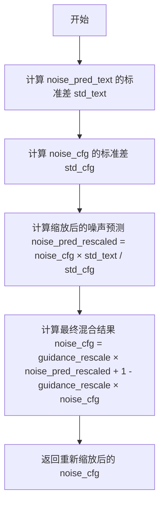

#### 带注释源码

```python
def rescale_noise_cfg(noise_cfg, noise_pred_text, guidance_rescale=0.0):
    r"""
    Rescales `noise_cfg` tensor based on `guidance_rescale` to improve image quality and fix overexposure. Based on
    Section 3.4 from [Common Diffusion Noise Schedules and Sample Steps are
    Flawed](https://huggingface.co/papers/2305.08891).

    Args:
        noise_cfg (`torch.Tensor`):
            The predicted noise tensor for the guided diffusion process.
        noise_pred_text (`torch.Tensor`):
            The predicted noise tensor for the text-guided diffusion process.
        guidance_rescale (`float`, *optional*, defaults to 0.0):
            A rescale factor applied to the noise predictions.

    Returns:
        noise_cfg (`torch.Tensor`): The rescaled noise prediction tensor.
    """
    # 计算文本预测噪声的标准差（沿除批次维度外的所有维度）
    std_text = noise_pred_text.std(dim=list(range(1, noise_pred_text.ndim)), keepdim=True)
    # 计算配置噪声预测的标准差（沿除批次维度外的所有维度）
    std_cfg = noise_cfg.std(dim=list(range(1, noise_cfg.ndim)), keepdim=True)
    
    # 使用文本噪声的标准差重新缩放噪声配置（修复过度曝光问题）
    noise_pred_rescaled = noise_cfg * (std_text / std_cfg)
    
    # 通过 guidance_rescale 因子混合原始结果和重新缩放后的结果
    # 以避免产生"平淡无奇"的图像
    noise_cfg = guidance_rescale * noise_pred_rescaled + (1 - guidance_rescale) * noise_cfg
    
    return noise_cfg
```


### `retrieve_timesteps`

该函数用于调用调度器的 `set_timesteps` 方法并在调用后从调度器中检索时间步。它处理自定义时间步，并会将任何 kwargs 传递给 `scheduler.set_timesteps`。

参数：

-  `scheduler`：`SchedulerMixin`，要获取时间步的调度器
-  `num_inference_steps`：`int | None`，使用预训练模型生成样本时使用的扩散步数。如果使用此参数，则 `timesteps` 必须为 `None`
-  `device`：`str | torch.device | None`，时间步应移动到的设备。如果为 `None`，则不移动时间步
-  `timesteps`：`list[int] | None`，用于覆盖调度器时间步间隔策略的自定义时间步。如果传入 `timesteps`，则 `num_inference_steps` 和 `sigmas` 必须为 `None`
-  `sigmas`：`list[float] | None`，用于覆盖调度器时间步间隔策略的自定义 sigmas。如果传入 `sigmas`，则 `num_inference_steps` 和 `timesteps` 必须为 `None`
-  `**kwargs`：任意关键字参数，将提供给 `scheduler.set_timesteps`

返回值：`tuple[torch.Tensor, int]`，元组中第一个元素是调度器的时间步计划，第二个元素是推理步数

#### 流程图

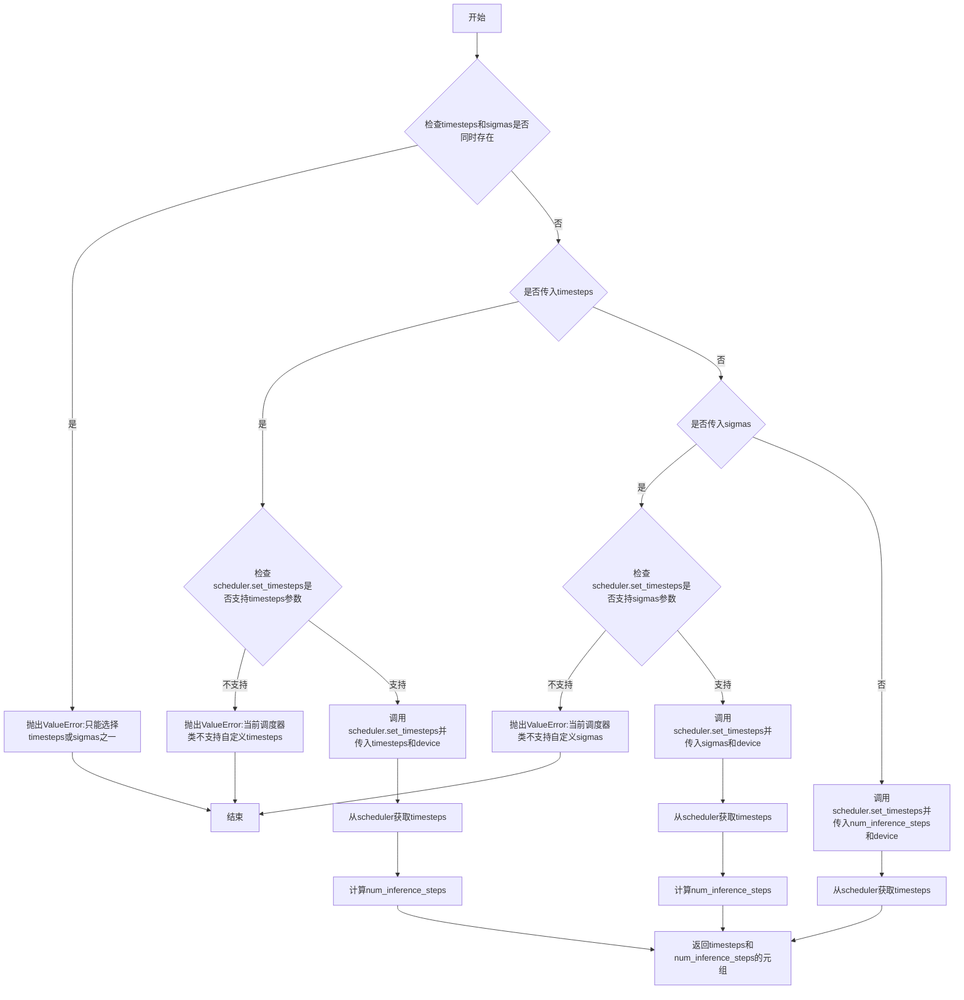

#### 带注释源码

```python
# Copied from diffusers.pipelines.stable_diffusion.pipeline_stable_diffusion.retrieve_timesteps
def retrieve_timesteps(
    scheduler,
    num_inference_steps: int | None = None,
    device: str | torch.device | None = None,
    timesteps: list[int] | None = None,
    sigmas: list[float] | None = None,
    **kwargs,
):
    r"""
    Calls the scheduler's `set_timesteps` method and retrieves timesteps from the scheduler after the call. Handles
    custom timesteps. Any kwargs will be supplied to `scheduler.set_timesteps`.

    Args:
        scheduler (`SchedulerMixin`):
            The scheduler to get timesteps from.
        num_inference_steps (`int`):
            The number of diffusion steps used when generating samples with a pre-trained model. If used, `timesteps`
            must be `None`.
        device (`str` or `torch.device`, *optional*):
            The device to which the timesteps should be moved to. If `None`, the timesteps are not moved.
        timesteps (`list[int]`, *optional*):
            Custom timesteps used to override the timestep spacing strategy of the scheduler. If `timesteps` is passed,
            `num_inference_steps` and `sigmas` must be `None`.
        sigmas (`list[float]`, *optional*):
            Custom sigmas used to override the timestep spacing strategy of the scheduler. If `sigmas` is passed,
            `num_inference_steps` and `timesteps` must be `None`.

    Returns:
        `tuple[torch.Tensor, int]`: A tuple where the first element is the timestep schedule from the scheduler and the
        second element is the number of inference steps.
    """
    # 检查是否同时传入了timesteps和sigmas，只能选择其中一种方式设置自定义值
    if timesteps is not None and sigmas is not None:
        raise ValueError("Only one of `timesteps` or `sigmas` can be passed. Please choose one to set custom values")
    
    # 如果传入了自定义timesteps
    if timesteps is not None:
        # 检查scheduler.set_timesteps是否接受timesteps参数
        accepts_timesteps = "timesteps" in set(inspect.signature(scheduler.set_timesteps).parameters.keys())
        if not accepts_timesteps:
            raise ValueError(
                f"The current scheduler class {scheduler.__class__}'s `set_timesteps` does not support custom"
                f" timestep schedules. Please check whether you are using the correct scheduler."
            )
        # 调用scheduler的set_timesteps方法设置自定义timesteps
        scheduler.set_timesteps(timesteps=timesteps, device=device, **kwargs)
        # 从scheduler获取更新后的timesteps
        timesteps = scheduler.timesteps
        # 计算推理步数
        num_inference_steps = len(timesteps)
    # 如果传入了自定义sigmas
    elif sigmas is not None:
        # 检查scheduler.set_timesteps是否接受sigmas参数
        accept_sigmas = "sigmas" in set(inspect.signature(scheduler.set_timesteps).parameters.keys())
        if not accept_sigmas:
            raise ValueError(
                f"The current scheduler class {scheduler.__class__}'s `set_timesteps` does not support custom"
                f" sigmas schedules. Please check whether you are using the correct scheduler."
            )
        # 调用scheduler的set_timesteps方法设置自定义sigmas
        scheduler.set_timesteps(sigmas=sigmas, device=device, **kwargs)
        # 从scheduler获取更新后的timesteps
        timesteps = scheduler.timesteps
        # 计算推理步数
        num_inference_steps = len(timesteps)
    # 如果没有传入自定义timesteps或sigmas，则使用默认的num_inference_steps
    else:
        scheduler.set_timesteps(num_inference_steps, device=device, **kwargs)
        timesteps = scheduler.timesteps
    
    # 返回timesteps和num_inference_steps的元组
    return timesteps, num_inference_steps
```


### AnimateDiffSDXLPipeline.__init__

这是 AnimateDiffSDXLPipeline 类的构造函数，负责初始化整个 Stable Diffusion XL 动画生成管道。该方法接收所有必要的模型组件（VAE、文本编码器、UNet、调度器、运动适配器等），完成模块注册、VAE 缩放因子计算、视频处理器初始化以及默认采样尺寸的设置，为后续的视频生成任务做好准备工作。

参数：

- `vae`：`AutoencoderKL`，Variational Auto-Encoder (VAE) 模型，用于编码和解码图像与潜在表示之间的转换
- `text_encoder`：`CLIPTextModel`，冻结的文本编码器，Stable Diffusion XL 使用 CLIP 的文本部分
- `text_encoder_2`：`CLIPTextModelWithProjection`，第二个冻结的文本编码器，用于获取池化输出
- `tokenizer`：`CLIPTokenizer`，第一个分词器，用于将文本转换为 token
- `tokenizer_2`：`CLIPTokenizer`，第二个分词器，用于双文本编码器架构
- `unet`：`UNet2DConditionModel | UNetMotionModel`，条件 U-Net 架构，用于对编码后的图像潜在表示进行去噪
- `motion_adapter`：`MotionAdapter`，运动适配器模块，用于为静态 SDXL 模型添加动画生成能力
- `scheduler`：`DDIMScheduler | PNDMScheduler | LMSDiscreteScheduler | EulerDiscreteScheduler | EulerAncestralDiscreteScheduler | DPMSolverMultistepScheduler`，调度器，用于与 UNet 结合对图像潜在表示进行去噪
- `image_encoder`：`CLIPVisionModelWithProjection`（可选），图像编码器，用于 IP-Adapter 功能
- `feature_extractor`：`CLIPImageProcessor`（可选），特征提取器，用于处理图像输入
- `force_zeros_for_empty_prompt`：`bool`（可选，默认 True），是否将负向提示词嵌入强制设置为 0

返回值：无（`None`），构造函数不返回任何值，仅初始化实例属性

#### 流程图

```mermaid
flowchart TD
    A[__init__ 开始] --> B[调用 super().__init__ 初始化父类]
    B --> C{unet 是否为 UNet2DConditionModel?}
    C -->|是| D[将 UNet 转换为 UNetMotionModel]
    C -->|否| E[保持原样]
    D --> F
    E --> F
    F[调用 register_modules 注册所有模块]
    F --> G[调用 register_to_config 注册 force_zeros_for_empty_prompt]
    G --> H[计算 vae_scale_factor]
    H --> I[创建 VideoProcessor 实例]
    I --> J[设置 default_sample_size]
    J --> K[__init__ 结束]
```

#### 带注释源码

```python
def __init__(
    self,
    vae: AutoencoderKL,
    text_encoder: CLIPTextModel,
    text_encoder_2: CLIPTextModelWithProjection,
    tokenizer: CLIPTokenizer,
    tokenizer_2: CLIPTokenizer,
    unet: UNet2DConditionModel | UNetMotionModel,
    motion_adapter: MotionAdapter,
    scheduler: DDIMScheduler
    | PNDMScheduler
    | LMSDiscreteScheduler
    | EulerDiscreteScheduler
    | EulerAncestralDiscreteScheduler
    | DPMSolverMultistepScheduler,
    image_encoder: CLIPVisionModelWithProjection = None,
    feature_extractor: CLIPImageProcessor = None,
    force_zeros_for_empty_prompt: bool = True,
):
    # 1. 调用父类构造函数，初始化 DiffusionPipeline 基类
    super().__init__()

    # 2. 检查并转换 UNet：如果传入的是普通 UNet2DConditionModel，
    #    则使用 motion_adapter 将其包装为支持动画的 UNetMotionModel
    if isinstance(unet, UNet2DConditionModel):
        unet = UNetMotionModel.from_unet2d(unet, motion_adapter)

    # 3. 注册所有模块：DiffusionPipeline 会通过 register_modules 
    #    管理这些组件的引用，便于后续调用和保存/加载
    self.register_modules(
        vae=vae,
        text_encoder=text_encoder,
        text_encoder_2=text_encoder_2,
        tokenizer=tokenizer,
        tokenizer_2=tokenizer_2,
        unet=unet,
        motion_adapter=motion_adapter,
        scheduler=scheduler,
        image_encoder=image_encoder,
        feature_extractor=feature_extractor,
    )

    # 4. 将 force_zeros_for_empty_prompt 注册到配置中
    #    该参数控制当提示词为空时是否强制使用零向量
    self.register_to_config(force_zeros_for_empty_prompt=force_zeros_for_empty_prompt)

    # 5. 计算 VAE 缩放因子：VAE 将图像编码到潜在空间时需要缩放
    #    缩放因子通常为 2^(num_layers-1)，对于 SDXL 通常为 8
    self.vae_scale_factor = 2 ** (len(self.vae.config.block_out_channels) - 1) if getattr(self, "vae", None) else 8

    # 6. 创建视频处理器：用于在潜在空间和像素空间之间转换视频数据
    self.video_processor = VideoProcessor(vae_scale_factor=self.vae_scale_factor)

    # 7. 设置默认采样尺寸：从 UNet 配置中获取 sample_size
    #    如果 UNet 不可用或没有该配置，则使用默认值 128
    self.default_sample_size = (
        self.unet.config.sample_size
        if hasattr(self, "unet") and self.unet is not None and hasattr(self.unet.config, "sample_size")
        else 128
    )
```


### `AnimateDiffSDXLPipeline.encode_prompt`

该方法负责将文本提示词编码为文本编码器的隐藏状态，是AnimateDiffSDXL视频生成管道的核心组成部分。它支持双文本编码器架构（CLIP Text Encoder和CLIP Text Encoder with Projection），处理正向和负向提示词，并支持LoRA权重调节、CLIP跳过层以及无分类器引导（Classifier-Free Guidance）。

参数：

- `prompt`：`str | list[str] | None`，要编码的主提示词，可以是单个字符串或字符串列表
- `prompt_2`：`str | list[str] | None`，发送给第二个文本编码器的提示词，若未指定则使用prompt
- `device`：`torch.device | None`，执行编码的torch设备，若为None则使用执行设备
- `num_videos_per_prompt`：`int`，每个提示词生成的视频数量，默认为1
- `do_classifier_free_guidance`：`bool`，是否启用无分类器引导，默认为True
- `negative_prompt`：`str | list[str] | None`，不引导视频生成的负向提示词
- `negative_prompt_2`：`str | list[str] | None`，发送给第二个文本编码器的负向提示词
- `prompt_embeds`：`torch.Tensor | None`，预生成的正向文本嵌入，若提供则跳过从prompt生成
- `negative_prompt_embeds`：`torch.Tensor | None`，预生成的负向文本嵌入
- `pooled_prompt_embeds`：`torch.Tensor | None`，预生成的池化文本嵌入
- `negative_pooled_prompt_embeds`：`torch.Tensor | None`，预生成的负向池化文本嵌入
- `lora_scale`：`float | None`，应用于所有LoRA层的缩放因子
- `clip_skip`：`int | None`，计算提示词嵌入时从CLIP跳过的层数

返回值：`tuple[torch.Tensor, torch.Tensor, torch.Tensor, torch.Tensor]`，包含四个张量——正向提示词嵌入、负向提示词嵌入、正向池化嵌入、负向池化嵌入

#### 流程图

```mermaid
flowchart TD
    A[开始 encode_prompt] --> B{检查 lora_scale 参数}
    B -->|非None| C[设置 self._lora_scale 并调整LoRA层权重]
    B -->|None| D[跳过LoRA调整]
    C --> D
    D --> E[标准化 prompt 为列表]
    E --> F{判断 batch_size}
    F -->|prompt非空| G[batch_size = len(prompt)]
    F -->|prompt为空| H[batch_size = prompt_embeds.shape[0]]
    G --> I[获取 tokenizers 和 text_encoders 列表]
    I --> J{prompt_embeds 为 None?}
    J -->|是| K[处理双文本编码器流程]
    J -->|否| L[跳过编码直接使用嵌入]
    K --> M[对 prompt 和 prompt_2 分别编码]
    M --> N[提取 hidden_states 和 pooled_output]
    N --> O[根据 clip_skip 选择隐藏层]
    O --> P[拼接两个编码器的输出]
    L --> Q{do_classifier_free_guidance 为真且 negative_prompt_embeds 为空?}
    P --> Q
    Q -->|是且 zero_out_negative_prompt| R[创建全零负向嵌入]
    Q -->|是但需编码负向提示| S[编码 negative_prompt 和 negative_prompt_2]
    Q -->|否| T[使用提供的负向嵌入]
    R --> U
    S --> U[拼接负向嵌入]
    T --> U
    U{text_encoder_2 存在?}
    U -->|是| V[转换为 text_encoder_2 的 dtype 和 device]
    U -->|否| W[转换为 unet 的 dtype 和 device]
    V --> X
    W --> X[复制嵌入以匹配 num_videos_per_prompt]
    X --> Y{do_classifier_free_guidance?}
    Y -->|是| Z[复制负向嵌入并调整维度]
    Y -->|否| AA[跳过负向嵌入处理]
    Z --> AB
    AA --> AB[恢复 LoRA 层权重]
    AB --> AC[返回四元组嵌入]
```

#### 带注释源码

```python
def encode_prompt(
    self,
    prompt: str,
    prompt_2: str | None = None,
    device: torch.device | None = None,
    num_videos_per_prompt: int = 1,
    do_classifier_free_guidance: bool = True,
    negative_prompt: str | None = None,
    negative_prompt_2: str | None = None,
    prompt_embeds: torch.Tensor | None = None,
    negative_prompt_embeds: torch.Tensor | None = None,
    pooled_prompt_embeds: torch.Tensor | None = None,
    negative_pooled_prompt_embeds: torch.Tensor | None = None,
    lora_scale: float | None = None,
    clip_skip: int | None = None,
):
    r"""
    Encodes the prompt into text encoder hidden states.

    Args:
        prompt (`str` or `list[str]`, *optional*):
            prompt to be encoded
        prompt_2 (`str` or `list[str]`, *optional*):
            The prompt or prompts to be sent to the `tokenizer_2` and `text_encoder_2`. If not defined, `prompt` is
            used in both text-encoders
        device: (`torch.device`):
            torch device
        num_videos_per_prompt (`int`):
            number of images that should be generated per prompt
        do_classifier_free_guidance (`bool`):
            whether to use classifier free guidance or not
        negative_prompt (`str` or `list[str]`, *optional*):
            The prompt or prompts not to guide the image generation. If not defined, one has to pass
            `negative_prompt_embeds` instead. Ignored when not using guidance (i.e., ignored if `guidance_scale` is
            less than `1`).
        negative_prompt_2 (`str` or `list[str]`, *optional*):
            The prompt or prompts not to guide the image generation to be sent to `tokenizer_2` and
            `text_encoder_2`. If not defined, `negative_prompt` is used in both text-encoders
        prompt_embeds (`torch.Tensor`, *optional*):
            Pre-generated text embeddings. Can be used to easily tweak text inputs, *e.g.* prompt weighting. If not
            provided, text embeddings will be generated from `prompt` input argument.
        negative_prompt_embeds (`torch.Tensor`, *optional*):
            Pre-generated negative text embeddings. Can be used to easily tweak text inputs, *e.g.* prompt
            weighting. If not provided, negative_prompt_embeds will be generated from `negative_prompt` input
            argument.
        pooled_prompt_embeds (`torch.Tensor`, *optional*):
            Pre-generated pooled text embeddings. Can be used to easily tweak text inputs, *e.g.* prompt weighting.
            If not provided, pooled text embeddings will be generated from `prompt` input argument.
        negative_pooled_prompt_embeds (`torch.Tensor`, *optional*):
            Pre-generated negative pooled text embeddings. Can be used to easily tweak text inputs, *e.g.* prompt
            weighting. If not provided, pooled negative_prompt_embeds will be generated from `negative_prompt`
            input argument.
        lora_scale (`float`, *optional*):
            A lora scale that will be applied to all LoRA layers of the text encoder if LoRA layers are loaded.
        clip_skip (`int`, *optional*):
            Number of layers to be skipped from CLIP while computing the prompt embeddings. A value of 1 means that
            the output of the pre-final layer will be used for computing the prompt embeddings.
    """
    # 确定执行设备，未指定则使用pipeline的默认执行设备
    device = device or self._execution_device

    # 设置LoRA缩放因子，使text encoder的LoRA函数可以正确访问
    # 只有当lora_scale非空且对象实现了StableDiffusionXLLoraLoaderMixin时才处理
    if lora_scale is not None and isinstance(self, StableDiffusionXLLoraLoaderMixin):
        self._lora_scale = lora_scale

        # 动态调整LoRA缩放因子
        if self.text_encoder is not None:
            if not USE_PEFT_BACKEND:
                # 非PEFT后端：直接调整text encoder的LoRA权重
                adjust_lora_scale_text_encoder(self.text_encoder, lora_scale)
            else:
                # PEFT后端：使用scale_lora_layers函数
                scale_lora_layers(self.text_encoder, lora_scale)

        if self.text_encoder_2 is not None:
            if not USE_PEFT_BACKEND:
                adjust_lora_scale_text_encoder(self.text_encoder_2, lora_scale)
            else:
                scale_lora_layers(self.text_encoder_2, lora_scale)

    # 将prompt标准化为列表形式，便于批量处理
    prompt = [prompt] if isinstance(prompt, str) else prompt

    # 确定批次大小
    if prompt is not None:
        batch_size = len(prompt)
    else:
        batch_size = prompt_embeds.shape[0]

    # 定义tokenizers和text encoders列表
    # 支持单文本编码器或双文本编码器配置
    tokenizers = [self.tokenizer, self.tokenizer_2] if self.tokenizer is not None else [self.tokenizer_2]
    text_encoders = (
        [self.text_encoder, self.text_encoder_2] if self.text_encoder is not None else [self.text_encoder_2]
    )

    # 如果未提供prompt_embeds，则从prompt生成
    if prompt_embeds is None:
        # prompt_2默认为prompt
        prompt_2 = prompt_2 or prompt
        prompt_2 = [prompt_2] if isinstance(prompt_2, str) else prompt_2

        # 用于存储文本嵌入的列表
        prompt_embeds_list = []
        prompts = [prompt, prompt_2]
        
        # 遍历两个prompt、tokenizer和text_encoder进行编码
        for prompt, tokenizer, text_encoder in zip(prompts, tokenizers, text_encoders):
            # 如果实现了TextualInversionLoaderMixin，转换prompt中的多向量token
            if isinstance(self, TextualInversionLoaderMixin):
                prompt = self.maybe_convert_prompt(prompt, tokenizer)

            # 使用tokenizer将prompt转换为token IDs
            text_inputs = tokenizer(
                prompt,
                padding="max_length",
                max_length=tokenizer.model_max_length,
                truncation=True,
                return_tensors="pt",
            )

            text_input_ids = text_inputs.input_ids
            
            # 获取未截断的token IDs用于检查是否被截断
            untruncated_ids = tokenizer(prompt, padding="longest", return_tensors="pt").input_ids

            # 检查是否发生截断，若是则记录警告信息
            if untruncated_ids.shape[-1] >= text_input_ids.shape[-1] and not torch.equal(
                text_input_ids, untruncated_ids
            ):
                removed_text = tokenizer.batch_decode(untruncated_ids[:, tokenizer.model_max_length - 1 : -1])
                logger.warning(
                    "The following part of your input was truncated because CLIP can only handle sequences up to"
                    f" {tokenizer.model_max_length} tokens: {removed_text}"
                )

            # 通过文本编码器获取隐藏状态
            prompt_embeds = text_encoder(text_input_ids.to(device), output_hidden_states=True)

            # 从最终文本编码器提取pooled输出（用于SDXL的条件注入）
            if pooled_prompt_embeds is None and prompt_embeds[0].ndim == 2:
                pooled_prompt_embeds = prompt_embeds[0]

            # 根据clip_skip选择隐藏层
            if clip_skip is None:
                # 默认使用倒数第二层（-2）
                prompt_embeds = prompt_embeds.hidden_states[-2]
            else:
                # SDXL总是从倒数第clip_skip+2层索引（因为索引从倒数第二层开始）
                prompt_embeds = prompt_embeds.hidden_states[-(clip_skip + 2)]

            prompt_embeds_list.append(prompt_embeds)

        # 沿最后一维拼接两个文本编码器的输出
        prompt_embeds = torch.concat(prompt_embeds_list, dim=-1)

    # 获取无分类器引导的 unconditional embeddings
    # 检查是否需要强制将负向提示嵌入设为零
    zero_out_negative_prompt = negative_prompt is None and self.config.force_zeros_for_empty_prompt
    
    if do_classifier_free_guidance and negative_prompt_embeds is None and zero_out_negative_prompt:
        # 当没有负向提示且配置要求强制为零时，创建全零张量
        negative_prompt_embeds = torch.zeros_like(prompt_embeds)
        negative_pooled_prompt_embeds = torch.zeros_like(pooled_prompt_embeds)
    elif do_classifier_free_guidance and negative_prompt_embeds is None:
        # 需要从负向提示生成嵌入
        negative_prompt = negative_prompt or ""
        negative_prompt_2 = negative_prompt_2 or negative_prompt

        # 标准化为列表
        negative_prompt = batch_size * [negative_prompt] if isinstance(negative_prompt, str) else negative_prompt
        negative_prompt_2 = (
            batch_size * [negative_prompt_2] if isinstance(negative_prompt_2, str) else negative_prompt_2
        )

        # 类型检查
        uncond_tokens: list[str]
        if prompt is not None and type(prompt) is not type(negative_prompt):
            raise TypeError(
                f"`negative_prompt` should be the same type to `prompt`, but got {type(negative_prompt)} !="
                f" {type(prompt)}."
            )
        elif batch_size != len(negative_prompt):
            raise ValueError(
                f"`negative_prompt`: {negative_prompt} has batch size {len(negative_prompt)}, but `prompt`:"
                f" {prompt} has batch size {batch_size}. Please make sure that passed `negative_prompt` matches"
                " the batch size of `prompt`."
            )
        else:
            uncond_tokens = [negative_prompt, negative_prompt_2]

        # 编码负向提示
        negative_prompt_embeds_list = []
        for negative_prompt, tokenizer, text_encoder in zip(uncond_tokens, tokenizers, text_encoders):
            # 转换负向prompt（如TextualInversion）
            if isinstance(self, TextualInversionLoaderMixin):
                negative_prompt = self.maybe_convert_prompt(negative_prompt, tokenizer)

            # 使用与正向相同的长度进行tokenize
            max_length = prompt_embeds.shape[1]
            uncond_input = tokenizer(
                negative_prompt,
                padding="max_length",
                max_length=max_length,
                truncation=True,
                return_tensors="pt",
            )

            # 编码负向文本
            negative_prompt_embeds = text_encoder(
                uncond_input.input_ids.to(device),
                output_hidden_states=True,
            )

            # 提取pooled输出
            if negative_pooled_prompt_embeds is None and negative_prompt_embeds[0].ndim == 2:
                negative_pooled_prompt_embeds = negative_prompt_embeds[0]
            
            # 使用倒数第二层
            negative_prompt_embeds = negative_prompt_embeds.hidden_states[-2]

            negative_prompt_embeds_list.append(negative_prompt_embeds)

        # 拼接负向嵌入
        negative_prompt_embeds = torch.concat(negative_prompt_embeds_list, dim=-1)

    # 转换dtype和device
    if self.text_encoder_2 is not None:
        prompt_embeds = prompt_embeds.to(dtype=self.text_encoder_2.dtype, device=device)
    else:
        prompt_embeds = prompt_embeds.to(dtype=self.unet.dtype, device=device)

    # 获取嵌入的形状信息
    bs_embed, seq_len, _ = prompt_embeds.shape
    
    # 复制正向嵌入以支持每个prompt生成多个视频（MPS友好的方法）
    prompt_embeds = prompt_embeds.repeat(1, num_videos_per_prompt, 1)
    prompt_embeds = prompt_embeds.view(bs_embed * num_videos_per_prompt, seq_len, -1)

    # 处理无分类器引导的负向嵌入
    if do_classifier_free_guidance:
        # 复制负向嵌入
        seq_len = negative_prompt_embeds.shape[1]

        if self.text_encoder_2 is not None:
            negative_prompt_embeds = negative_prompt_embeds.to(dtype=self.text_encoder_2.dtype, device=device)
        else:
            negative_prompt_embeds = negative_prompt_embeds.to(dtype=self.unet.dtype, device=device)

        negative_prompt_embeds = negative_prompt_embeds.repeat(1, num_videos_per_prompt, 1)
        negative_prompt_embeds = negative_prompt_embeds.view(batch_size * num_videos_per_prompt, seq_len, -1)

    # 复制pooled嵌入
    pooled_prompt_embeds = pooled_prompt_embeds.repeat(1, num_videos_per_prompt).view(
        bs_embed * num_videos_per_prompt, -1
    )
    
    if do_classifier_free_guidance:
        negative_pooled_prompt_embeds = negative_pooled_prompt_embeds.repeat(1, num_videos_per_prompt).view(
            bs_embed * num_videos_per_prompt, -1
        )

    # 如果使用PEFT后端，恢复LoRA层到原始缩放因子
    if self.text_encoder is not None:
        if isinstance(self, StableDiffusionXLLoraLoaderMixin) and USE_PEFT_BACKEND:
            # 通过取消缩放LoRA层恢复原始权重
            unscale_lora_layers(self.text_encoder, lora_scale)

    if self.text_encoder_2 is not None:
        if isinstance(self, StableDiffusionXLLoraLoaderMixin) and USE_PEFT_BACKEND:
            unscale_lora_layers(self.text_encoder_2, lora_scale)

    # 返回四个嵌入张量：正向、负向、池化正向、池化负向
    return prompt_embeds, negative_prompt_embeds, pooled_prompt_embeds, negative_pooled_prompt_embeds
```


### `AnimateDiffSDXLPipeline.encode_image`

该方法用于将输入图像编码为图像嵌入向量，支持有条件（guidance）和无条件两种嵌入，用于后续的图像到图像生成或IP-Adapter功能。当启用 classifier-free guidance 时，会同时返回条件嵌入和零向量作为无条件嵌入。

参数：

- `self`：`AnimateDiffSDXLPipeline`，隐含的实例本身
- `image`：`PipelineImageInput`（`torch.Tensor` | `PIL.Image.Image` | `list`），待编码的输入图像，支持多种格式
- `device`：`torch.device`，图像数据要移动到的目标设备
- `num_images_per_prompt`：`int`，每个 prompt 生成的图像数量，用于批量复制嵌入向量
- `output_hidden_states`：`bool | None`，可选参数，是否返回编码器的隐藏状态而非池化后的图像嵌入

返回值：`tuple[torch.Tensor, torch.Tensor]`，返回两个 `torch.Tensor`：
- 第一个元素是条件图像嵌入（image_embeds 或 image_enc_hidden_states），形状为 `(batch_size * num_images_per_prompt, embed_dim)`
- 第二个元素是无条件图像嵌入（uncond_image_embeds 或 uncond_image_enc_hidden_states)，形状相同，用于 classifier-free guidance

#### 流程图

```mermaid
flowchart TD
    A[开始 encode_image] --> B{image 是否为 torch.Tensor}
    B -->|否| C[使用 feature_extractor 提取像素值]
    B -->|是| D[直接使用 image]
    C --> E[将 image 移动到指定 device 和 dtype]
    D --> E
    E --> F{output_hidden_states 为 True?}
    F -->|是| G[调用 image_encoder 获取隐藏状态]
    F -->|否| H[调用 image_encoder 获取 image_embeds]
    G --> I[取倒数第二层隐藏状态 hidden_states[-2]]
    H --> J[提取 image_embeds]
    I --> K[repeat_interleave 复制 num_images_per_prompt 次]
    J --> L[repeat_interleave 复制 num_images_per_prompt 次]
    K --> M[生成零张量作为无条件嵌入]
    L --> M
    M --> N[返回条件嵌入和无条件嵌入元组]
```

#### 带注释源码

```python
def encode_image(self, image, device, num_images_per_prompt, output_hidden_states=None):
    """
    将输入图像编码为图像嵌入向量，用于图像引导生成或IP-Adapter。
    
    Args:
        image: 输入图像，支持torch.Tensor、PIL.Image或列表格式
        device: 目标设备
        num_images_per_prompt: 每个prompt生成的图像数量
        output_hidden_states: 是否返回隐藏状态而非池化嵌入
    
    Returns:
        Tuple of (条件嵌入, 无条件嵌入)
    """
    # 获取图像编码器的参数数据类型，用于后续数据类型转换
    dtype = next(self.image_encoder.parameters()).dtype

    # 如果输入不是torch.Tensor，则使用feature_extractor进行预处理
    # 将图像转换为pixel_values张量
    if not isinstance(image, torch.Tensor):
        image = self.feature_extractor(image, return_tensors="pt").pixel_values

    # 将图像数据移动到指定设备，并转换为编码器所需的数据类型
    image = image.to(device=device, dtype=dtype)
    
    # 根据output_hidden_states参数决定返回隐藏状态还是池化嵌入
    if output_hidden_states:
        # 获取编码器的隐藏状态（倒数第二层）
        # hidden_states[-2] 通常是倒数第二层，包含了丰富的图像特征
        image_enc_hidden_states = self.image_encoder(image, output_hidden_states=True).hidden_states[-2]
        
        # 按num_images_per_prompt复制嵌入，实现每个prompt生成多个图像
        image_enc_hidden_states = image_enc_hidden_states.repeat_interleave(num_images_per_prompt, dim=0)
        
        # 生成零张量作为无条件嵌入，用于classifier-free guidance
        # 使用torch.zeros_like创建与条件嵌入相同形状的零张量
        uncond_image_enc_hidden_states = self.image_encoder(
            torch.zeros_like(image), output_hidden_states=True
        ).hidden_states[-2]
        uncond_image_enc_hidden_states = uncond_image_enc_hidden_states.repeat_interleave(
            num_images_per_prompt, dim=0
        )
        
        # 返回隐藏状态形式的条件嵌入和无条件嵌入
        return image_enc_hidden_states, uncond_image_enc_hidden_states
    else:
        # 直接获取池化后的图像嵌入（image_embeds）
        image_embeds = self.image_encoder(image).image_embeds
        
        # 按num_images_per_prompt复制嵌入
        image_embeds = image_embeds.repeat_interleave(num_images_per_prompt, dim=0)
        
        # 生成零张量作为无条件嵌入
        # 这是classifier-free guidance的关键：无条件嵌入全为零
        uncond_image_embeds = torch.zeros_like(image_embeds)

        # 返回池化嵌入形式的条件嵌入和无条件嵌入
        return image_embeds, uncond_image_embeds
```


### `AnimateDiffSDXLPipeline.prepare_ip_adapter_image_embeds`

该方法用于准备IP Adapter的图像嵌入向量，处理输入图像或预计算的图像嵌入，并根据是否使用无分类器引导来组织输出Embedding。

参数：

- `ip_adapter_image`：`PipelineImageInput | None`，要用于IP Adapter的输入图像
- `ip_adapter_image_embeds`：`list[torch.Tensor] | None`，预计算的IP Adapter图像嵌入
- `device`：`torch.device`，用于计算的设备
- `num_images_per_prompt`：`int`，每个提示生成的图像数量
- `do_classifier_free_guidance`：`bool`，是否使用无分类器引导

返回值：`list[torch.Tensor]`，处理后的IP Adapter图像嵌入列表

#### 流程图

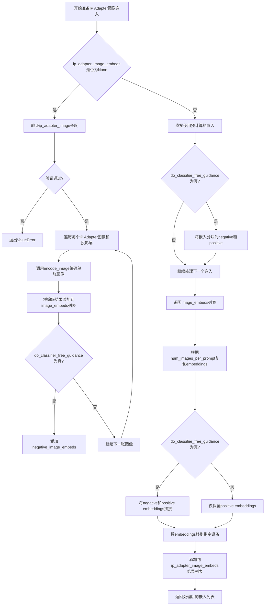

#### 带注释源码

```python
def prepare_ip_adapter_image_embeds(
    self, 
    ip_adapter_image,  # 输入的IP Adapter图像
    ip_adapter_image_embeds,  # 预计算的图像嵌入（可选）
    device,  # 计算设备
    num_images_per_prompt,  # 每个prompt生成的图像数量
    do_classifier_free_guidance  # 是否使用无分类器引导
):
    # 初始化用于存储图像嵌入的列表
    image_embeds = []
    
    # 如果使用无分类器引导，还需要存储负向嵌入
    if do_classifier_free_guidance:
        negative_image_embeds = []
    
    # 如果没有预计算的嵌入，则需要从图像编码
    if ip_adapter_image_embeds is None:
        # 确保输入图像是列表格式
        if not isinstance(ip_adapter_image, list):
            ip_adapter_image = [ip_adapter_image]
        
        # 验证图像数量与IP Adapter数量匹配
        if len(ip_adapter_image) != len(self.unet.encoder_hid_proj.image_projection_layers):
            raise ValueError(
                f"`ip_adapter_image` must have same length as the number of IP Adapters. "
                f"Got {len(ip_adapter_image)} images and "
                f"{len(self.unet.encoder_hid_proj.image_projection_layers)} IP Adapters."
            )
        
        # 遍历每个IP Adapter的图像和对应的投影层
        for single_ip_adapter_image, image_proj_layer in zip(
            ip_adapter_image, 
            self.unet.encoder_hid_proj.image_projection_layers
        ):
            # 判断是否需要输出隐藏状态（根据投影层类型决定）
            output_hidden_state = not isinstance(image_proj_layer, ImageProjection)
            
            # 编码单张图像获取嵌入向量
            single_image_embeds, single_negative_image_embeds = self.encode_image(
                single_ip_adapter_image, 
                device, 
                1,  # 每张图像生成1个嵌入
                output_hidden_state  # 是否输出隐藏状态
            )
            
            # 将图像嵌入添加到列表（添加批次维度）
            image_embeds.append(single_image_embeds[None, :])
            
            # 如果使用无分类器引导，也保存负向嵌入
            if do_classifier_free_guidance:
                negative_image_embeds.append(single_negative_image_embeds[None, :])
    else:
        # 使用预计算的嵌入向量
        for single_image_embeds in ip_adapter_image_embeds:
            if do_classifier_free_guidance:
                # 将嵌入按chunk分块：前半部分为负向，后半部分为正向
                single_negative_image_embeds, single_image_embeds = single_image_embeds.chunk(2)
                negative_image_embeds.append(single_negative_image_embeds)
            image_embeds.append(single_image_embeds)
    
    # 处理嵌入向量：根据num_images_per_prompt复制，并处理无分类器引导
    ip_adapter_image_embeds = []
    for i, single_image_embeds in enumerate(image_embeds):
        # 复制embedings以匹配每个prompt生成的图像数量
        single_image_embeds = torch.cat([single_image_embeds] * num_images_per_prompt, dim=0)
        
        if do_classifier_free_guidance:
            # 同样复制负向嵌入
            single_negative_image_embeds = torch.cat([negative_image_embeds[i]] * num_images_per_prompt, dim=0)
            # 将负向和正向嵌入拼接（负向在前，符合无分类器引导的惯例）
            single_image_embeds = torch.cat([single_negative_image_embeds, single_image_embeds], dim=0)
        
        # 将嵌入移动到指定设备
        single_image_embeds = single_image_embeds.to(device=device)
        ip_adapter_image_embeds.append(single_image_embeds)
    
    return ip_adapter_image_embeds
```


### AnimateDiffSDXLPipeline.decode_latents

该方法负责将VAE的潜在表示（latents）解码为实际的视频帧数据。它首先对潜在变量进行缩放，然后通过维度重排以适应VAE的解码器要求，解码后再将图像重新组织成视频张量格式，最后转换为float32类型以确保兼容性。

参数：

- `latents`：`torch.Tensor`，输入的潜在表示张量，形状为 (batch_size, channels, num_frames, height, width)，包含从扩散过程生成的潜在编码

返回值：`torch.Tensor`，解码后的视频张量，形状为 (batch_size, channels, num_frames, height, width)，其中 channels 通常为 3（RGB 通道）

#### 流程图

```mermaid
flowchart TD
    A[开始 decode_latents] --> B[缩放 latents: latents = 1/scaling_factor * latents]
    B --> C[获取 latents 形状: batch_size, channels, num_frames, height, width]
    C --> D[维度重排: permute 和 reshape 合并帧维度]
    D --> E[VAE 解码: vae.decode(latents).sample]
    E --> F[重建视频维度: reshape 和 permute 恢复原始布局]
    F --> G[类型转换: video.float转为float32]
    G --> H[返回视频张量]
```

#### 带注释源码

```python
def decode_latents(self, latents):
    """
    将VAE潜在表示解码为视频帧

    Args:
        latents: 潜在表示张量，形状为 (batch_size, channels, num_frames, height, width)

    Returns:
        video: 解码后的视频张量，形状为 (batch_size, channels, num_frames, height, width)
    """
    # 步骤1: 反缩放潜在变量
    # VAE 使用 scaling_factor 对潜在表示进行缩放以提高数值稳定性
    # 这里需要逆向操作恢复到原始尺度
    latents = 1 / self.vae.config.scaling_factor * latents

    # 步骤2: 获取输入形状信息
    # latents 原始形状: (batch_size, channels, num_frames, height, width)
    batch_size, channels, num_frames, height, width = latents.shape

    # 步骤3: 维度重排和展平
    # 将 (batch, channels, frames, h, w) 转换为 (batch*frames, channels, h, w)
    # 以便 VAE 可以逐帧解码，VAE 原本设计处理单张图像
    # permute(0, 2, 1, 3, 4) 将通道维度移到最后，形状变为 (batch, frames, channels, h, w)
    # reshape 合并 batch 和 frames 维度
    latents = latents.permute(0, 2, 1, 3, 4).reshape(batch_size * num_frames, channels, height, width)

    # 步骤4: VAE 解码
    # 使用变分自编码器将潜在表示解码为实际图像
    # .sample 表示从 VAE 的分布中采样生成图像
    image = self.vae.decode(latents).sample

    # 步骤5: 重建视频张量形状
    # 将解码后的图像重新组织为 5D 视频张量 (batch, channels, frames, height, width)
    # image 形状: (batch*frames, channels, h, w)
    # 恢复原始的 batch 和 num_frames 维度
    video = image[None, :].reshape((batch_size, num_frames, -1) + image.shape[2:]).permute(0, 2, 1, 3, 4)

    # 步骤6: 类型转换为 float32
    # VAE 解码可能在 float16/bfloat16 下运行，但 float32 更通用且不会引起显著性能开销
    # 这也与 bfloat16 兼容
    video = video.float()

    # 返回解码后的视频张量
    return video
```


### `AnimateDiffSDXLPipeline.prepare_extra_step_kwargs`

该方法用于为调度器（scheduler）的 step 方法准备额外的关键字参数。由于不同的调度器具有不同的签名，该方法通过检查调度器的 `step` 方法是否接受 `eta` 和 `generator` 参数来动态构建额外的参数字典。

参数：

- `generator`：`torch.Generator | list[torch.Generator] | None`，用于控制生成过程的随机性，确保可重复性
- `eta`：`float`，DDIM 调度器的 η 参数，值应在 [0, 1] 范围内

返回值：`dict[str, Any]`，包含要传递给调度器 step 方法的额外关键字参数字典

#### 流程图

```mermaid
flowchart TD
    A[开始] --> B[获取调度器 step 方法的签名]
    B --> C{eta 参数是否被接受?}
    C -->|是| D[extra_step_kwargs['eta'] = eta]
    C -->|否| E[跳过 eta]
    D --> F{generator 参数是否被接受?}
    E --> F
    F -->|是| G[extra_step_kwargs['generator'] = generator]
    F -->|否| H[跳过 generator]
    G --> I[返回 extra_step_kwargs]
    H --> I
```

#### 带注释源码

```python
def prepare_extra_step_kwargs(self, generator, eta):
    """
    准备调度器 step 方法的额外参数。

    由于并非所有调度器都具有相同的签名，该方法通过检查调度器的 step 方法
    来确定支持的参数。eta (η) 仅用于 DDIMScheduler，其他调度器会忽略该参数。
    eta 对应 DDIM 论文中的 η 参数：https://huggingface.co/papers/2010.02502
    """
    # 检查调度器的 step 方法是否接受 eta 参数
    accepts_eta = "eta" in set(inspect.signature(self.scheduler.step).parameters.keys())
    
    # 初始化额外的参数字典
    extra_step_kwargs = {}
    
    # 如果调度器接受 eta，则将其添加到 extra_step_kwargs
    if accepts_eta:
        extra_step_kwargs["eta"] = eta

    # 检查调度器的 step 方法是否接受 generator 参数
    accepts_generator = "generator" in set(inspect.signature(self.scheduler.step).parameters.keys())
    
    # 如果调度器接受 generator，则将其添加到 extra_step_kwargs
    if accepts_generator:
        extra_step_kwargs["generator"] = generator
    
    # 返回包含额外参数的字典
    return extra_step_kwargs
```


### `AnimateDiffSDXLPipeline.check_inputs`

该方法用于验证 AnimateDiffSDXLPipeline 的输入参数是否合法，确保在执行扩散模型推理之前，所有必需的参数都已正确提供且符合约束条件。

参数：

- `self`：隐式参数，指向 `AnimateDiffSDXLPipeline` 类的实例。
- `prompt`：`str | list[str] | None`，用于指导视频生成的主提示词。若未定义，则必须提供 `prompt_embeds`。
- `prompt_2`：`str | list[str] | None`，发送给第二个分词器和文本编码器的提示词，若未定义则使用 `prompt`。
- `height`：`int`，生成视频的高度（像素），必须是 8 的倍数。
- `width`：`int`，生成视频的宽度（像素），必须是 8 的倍数。
- `negative_prompt`：`str | list[str] | None`，不参与视频生成的负面提示词，仅在启用引导时生效。
- `negative_prompt_2`：`str | list[str] | None`，发送给第二个分词器和文本编码器的负面提示词。
- `prompt_embeds`：`torch.Tensor | None`，预生成的文本嵌入，可用于调整提示词权重。
- `negative_prompt_embeds`：`torch.Tensor | None`，预生成的负面文本嵌入。
- `pooled_prompt_embeds`：`torch.Tensor | None`，预生成的池化文本嵌入，当提供 `prompt_embeds` 时必须同时提供。
- `negative_pooled_prompt_embeds`：`torch.Tensor | None`，预生成的负面池化文本嵌入，当提供 `negative_prompt_embeds` 时必须同时提供。
- `callback_on_step_end_tensor_inputs`：`list[str] | None`，在推理步骤结束时调用的回调函数所允许的 tensor 输入列表。

返回值：无（`None`），该方法不返回任何值，仅通过抛出 `ValueError` 异常来处理验证失败的情况。

#### 流程图

```mermaid
flowchart TD
    A[开始 check_inputs] --> B{检查 height % 8 == 0 且 width % 8 == 0}
    B -->|否| C[抛出 ValueError: height 和 width 必须能被 8 整除]
    B -->|是| D{检查 callback_on_step_end_tensor_inputs}
    D -->|不合法| E[抛出 ValueError: 无效的 tensor inputs]
    D -->|合法| F{检查 prompt 和 prompt_embeds 不能同时提供}
    F -->|同时提供| G[抛出 ValueError: 不能同时提供 prompt 和 prompt_embeds]
    F -->|否| H{检查 prompt_2 和 prompt_embeds 不能同时提供}
    H -->|同时提供| I[抛出 ValueError: 不能同时提供 prompt_2 和 prompt_embeds]
    H -->|否| J{prompt 和 prompt_embeds 至少提供一个}
    J -->|都不提供| K[抛出 ValueError: 必须提供 prompt 或 prompt_embeds]
    J -->|是| L{prompt 类型检查]
    L -->|类型错误| M[抛出 ValueError: prompt 类型必须是 str 或 list]
    L -->|正确| N{prompt_2 类型检查]
    N -->|类型错误| O[抛出 ValueError: prompt_2 类型必须是 str 或 list]
    N -->|正确| P{检查 negative_prompt 和 negative_prompt_embeds}
    P -->|同时提供| Q[抛出 ValueError: 不能同时提供两者]
    P -->|否| R{检查 negative_prompt_2 和 negative_prompt_embeds}
    R -->|同时提供| S[抛出 ValueError: 不能同时提供两者]
    R -->|否| T{检查 prompt_embeds 和 negative_prompt_embeds 形状一致性}
    T -->|形状不一致| U[抛出 ValueError: 形状不匹配]
    T -->|一致| V{提供 prompt_embeds 时必须提供 pooled_prompt_embeds}
    V -->|未提供| W[抛出 ValueError: 需要 pooled_prompt_embeds]
    V -->|已提供| X{提供 negative_prompt_embeds 时必须提供 negative_pooled_prompt_embeds}
    X -->|未提供| Y[抛出 ValueError: 需要 negative_pooled_prompt_embeds]
    X -->|已提供| Z[验证通过，方法结束]
```

#### 带注释源码

```python
def check_inputs(
    self,
    prompt,
    prompt_2,
    height,
    width,
    negative_prompt=None,
    negative_prompt_2=None,
    prompt_embeds=None,
    negative_prompt_embeds=None,
    pooled_prompt_embeds=None,
    negative_pooled_prompt_embeds=None,
    callback_on_step_end_tensor_inputs=None,
):
    """
    验证输入参数的合法性。
    
    检查项包括：
    1. height 和 width 必须是 8 的倍数
    2. callback_on_step_end_tensor_inputs 必须是合法的 tensor 输入列表
    3. prompt 和 prompt_embeds 不能同时提供（互斥）
    4. prompt_2 和 prompt_embeds 不能同时提供（互斥）
    5. prompt 和 prompt_embeds 至少提供一个
    6. prompt 和 prompt_2 必须是 str 或 list 类型
    7. negative_prompt 和 negative_prompt_embeds 不能同时提供
    8. negative_prompt_2 和 negative_prompt_embeds 不能同时提供
    9. prompt_embeds 和 negative_prompt_embeds 形状必须一致
    10. 如果提供 prompt_embeds，必须同时提供 pooled_prompt_embeds
    11. 如果提供 negative_prompt_embeds，必须同时提供 negative_pooled_prompt_embeds
    """
    
    # 检查图像尺寸是否为 8 的倍数（VAE 和 UNet 的要求）
    if height % 8 != 0 or width % 8 != 0:
        raise ValueError(f"`height` and `width` have to be divisible by 8 but are {height} and {width}.")

    # 检查回调函数接收的 tensor 输入是否在允许列表中
    if callback_on_step_end_tensor_inputs is not None and not all(
        k in self._callback_tensor_inputs for k in callback_on_step_end_tensor_inputs
    ):
        raise ValueError(
            f"`callback_on_step_end_tensor_inputs` has to be in {self._callback_tensor_inputs}, but found {[k for k in callback_on_step_end_tensor_inputs if k not in self._callback_tensor_inputs]}"
        )

    # 检查 prompt 和 prompt_embeds 互斥（不能同时提供原始提示和预计算嵌入）
    if prompt is not None and prompt_embeds is not None:
        raise ValueError(
            f"Cannot forward both `prompt`: {prompt} and `prompt_embeds`: {prompt_embeds}. Please make sure to"
            " only forward one of the two."
        )
    # 检查 prompt_2 和 prompt_embeds 互斥
    elif prompt_2 is not None and prompt_embeds is not None:
        raise ValueError(
            f"Cannot forward both `prompt_2`: {prompt_2} and `prompt_embeds`: {prompt_embeds}. Please make sure to"
            " only forward one of the two."
        )
    # 至少需要提供 prompt 或 prompt_embeds 之一
    elif prompt is None and prompt_embeds is None:
        raise ValueError(
            "Provide either `prompt` or `prompt_embeds`. Cannot leave both `prompt` and `prompt_embeds` undefined."
        )
    # 检查 prompt 类型（必须是字符串或字符串列表）
    elif prompt is not None and (not isinstance(prompt, str) and not isinstance(prompt, list)):
        raise ValueError(f"`prompt` has to be of type `str` or `list` but is {type(prompt)}")
    # 检查 prompt_2 类型
    elif prompt_2 is not None and (not isinstance(prompt_2, str) and not isinstance(prompt_2, list)):
        raise ValueError(f"`prompt_2` has to be of type `str` or `list` but is {type(prompt_2)}")

    # 检查负面提示词和负面嵌入的互斥关系
    if negative_prompt is not None and negative_prompt_embeds is not None:
        raise ValueError(
            f"Cannot forward both `negative_prompt`: {negative_prompt} and `negative_prompt_embeds`:"
            f" {negative_prompt_embeds}. Please make sure to only forward one of the two."
        )
    elif negative_prompt_2 is not None and negative_prompt_embeds is not None:
        raise ValueError(
            f"Cannot forward both `negative_prompt_2`: {negative_prompt_2} and `negative_prompt_embeds`:"
            f" {negative_prompt_embeds}. Please make sure to only forward one of the two."
        )

    # 检查正向和负向文本嵌入的形状一致性（用于分类器自由引导）
    if prompt_embeds is not None and negative_prompt_embeds is not None:
        if prompt_embeds.shape != negative_prompt_embeds.shape:
            raise ValueError(
                "`prompt_embeds` and `negative_prompt_embeds` must have the same shape when passed directly, but"
                f" got: `prompt_embeds` {prompt_embeds.shape} != `negative_prompt_embeds`"
                f" {negative_prompt_embeds.shape}."
            )

    # 如果提供预计算的 prompt_embeds，必须同时提供对应的 pooled_prompt_embeds（SDXL 需要）
    if prompt_embeds is not None and pooled_prompt_embeds is None:
        raise ValueError(
            "If `prompt_embeds` are provided, `pooled_prompt_embeds` also have to be passed. Make sure to generate `pooled_prompt_embeds` from the same text encoder that was used to generate `prompt_embeds`."
        )

    # 如果提供预计算的 negative_prompt_embeds，必须同时提供对应的 negative_pooled_prompt_embeds
    if negative_prompt_embeds is not None and negative_pooled_prompt_embeds is None:
        raise ValueError(
            "If `negative_prompt_embeds` are provided, `negative_pooled_prompt_embeds` also have to be passed. Make sure to generate `negative_pooled_prompt_embeds` from the same text encoder that was used to generate `negative_prompt_embeds`."
        )
```


### `AnimateDiffSDXLPipeline.prepare_latents`

该方法用于为视频生成准备初始潜在变量（latents），根据指定的批次大小、帧数、分辨率等参数创建或处理潜在张量，并根据调度器的初始噪声标准差进行缩放。

参数：

- `batch_size`：`int`，批次大小，即一次生成的数量
- `num_channels_latents`：`int`，潜在变量的通道数，通常对应UNet的输入通道数
- `num_frames`：`int`，要生成的视频帧数
- `height`：`int`，生成视频的高度（像素）
- `width`：`int`，生成视频的宽度（像素）
- `dtype`：`torch.dtype`，潜在变量的数据类型
- `device`：`torch.device`，潜在变量存放的设备
- `generator`：`torch.Generator | list[torch.Generator]`，可选的随机数生成器，用于确保可重复性
- `latents`：`torch.Tensor | None`，可选的预生成潜在变量，如果为None则随机生成

返回值：`torch.Tensor`，处理后的潜在变量张量，形状为 (batch_size, num_channels_latents, num_frames, height/vae_scale_factor, width/vae_scale_factor)

#### 流程图

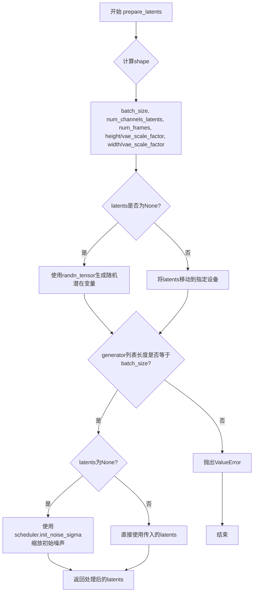

#### 带注释源码

```python
def prepare_latents(
    self,
    batch_size: int,
    num_channels_latents: int,
    num_frames: int,
    height: int,
    width: int,
    dtype: torch.dtype,
    device: torch.device,
    generator: torch.Generator | list[torch.Generator],
    latents: torch.Tensor | None = None
):
    """
    准备用于视频生成的潜在变量张量。
    
    该方法根据传入的参数计算潜在变量的形状，如果未提供潜在变量则使用随机噪声生成，
    否则使用提供的潜在变量并将其移动到指定设备。最后根据调度器的初始噪声标准差进行缩放。
    
    参数:
        batch_size: 批次大小
        num_channels_latents: UNet的输入通道数
        num_frames: 视频帧数
        height: 图像高度
        width: 图像宽度
        dtype: 潜在变量的数据类型
        device: 计算设备
        generator: 随机数生成器，用于可重复生成
        latents: 可选的预生成潜在变量
    
    返回:
        处理后的潜在变量张量
    """
    # 计算潜在变量的形状，考虑VAE的缩放因子
    # 形状: [batch_size, channels, frames, height/vae_scale, width/vae_scale]
    shape = (
        batch_size,
        num_channels_latents,
        num_frames,
        height // self.vae_scale_factor,
        width // self.vae_scale_factor,
    )
    
    # 检查generator列表长度是否与batch_size匹配
    if isinstance(generator, list) and len(generator) != batch_size:
        raise ValueError(
            f"You have passed a list of generators of length {len(generator)}, but requested an effective batch"
            f" size of {batch_size}. Make sure the batch size matches the length of the generators."
        )

    # 如果未提供潜在变量，则随机生成
    if latents is None:
        # 使用randn_tensor生成标准正态分布的随机噪声
        latents = randn_tensor(shape, generator=generator, device=device, dtype=dtype)
    else:
        # 将已存在的潜在变量移动到指定设备
        latents = latents.to(device)

    # 使用调度器的初始噪声标准差缩放潜在变量
    # 这确保了噪声水平与调度器的训练配置一致
    latents = latents * self.scheduler.init_noise_sigma
    
    return latents
```


### `AnimateDiffSDXLPipeline._get_add_time_ids`

该方法用于生成 Stable Diffusion XL 所需的额外时间标识（additional time IDs），这些标识包含原始图像尺寸、裁剪坐标和目标尺寸，用于微条件（micro-conditioning）以控制图像生成的宽高比和裁剪区域。

参数：

- `self`：AnimateDiffSDXLPipeline 实例
- `original_size`：`tuple[int, int]`，原始图像尺寸 (高度, 宽度)
- `crops_coords_top_left`：`tuple[int, int]`，裁剪坐标起点 (x, y)
- `target_size`：`tuple[int, int]`，目标图像尺寸 (高度, 宽度)
- `dtype`：`torch.dtype`，输出张量的数据类型
- `text_encoder_projection_dim`：`int | None`，文本编码器投影维度，若为 None 则使用 pooled_prompt_embeds 的最后一维

返回值：`torch.Tensor`，形状为 [1, 6] 的张量，包含拼接后的时间标识

#### 流程图

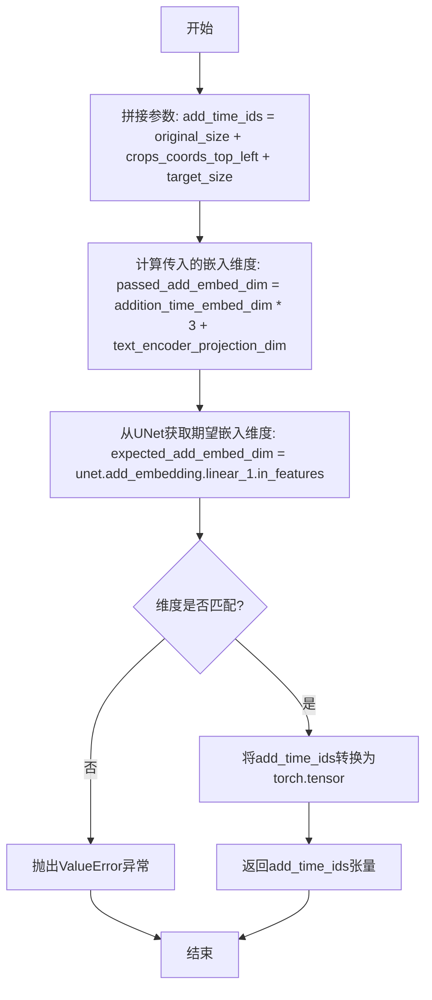

#### 带注释源码

```python
def _get_add_time_ids(
    self, original_size, crops_coords_top_left, target_size, dtype, text_encoder_projection_dim=None
):
    """
    生成 Stable Diffusion XL 所需的额外时间标识
    
    参数:
        original_size: 原始图像尺寸元组 (height, width)
        crops_coords_top_left: 裁剪左上角坐标 (x, y)
        target_size: 目标图像尺寸 (height, width)
        dtype: 输出张量的数据类型
        text_encoder_projection_dim: 文本编码器投影维度，为None时使用pooled_prompt_embeds的维度
    
    返回:
        torch.Tensor: 形状为 [1, 6] 的时间标识张量
    """
    
    # 步骤1: 将三个尺寸参数拼接成一个列表 [original_h, original_w, crop_x, crop_y, target_h, target_w]
    add_time_ids = list(original_size + crops_coords_top_left + target_size)

    # 步骤2: 计算传入的嵌入维度
    # 期望格式: addition_time_embed_dim * 参数数量(3个) + text_encoder_projection_dim
    passed_add_embed_dim = (
        self.unet.config.addition_time_embed_dim * len(add_time_ids) + text_encoder_projection_dim
    )
    
    # 步骤3: 从UNet配置中获取期望的嵌入维度
    expected_add_embed_dim = self.unet.add_embedding.linear_1.in_features

    # 步骤4: 验证维度是否匹配
    if expected_add_embed_dim != passed_add_embed_dim:
        raise ValueError(
            f"Model expects an added time embedding vector of length {expected_add_embed_dim}, but a vector of {passed_add_embed_dim} was created. The model has an incorrect config. Please check `unet.config.time_embedding_type` and `text_encoder_2.config.projection_dim`."
        )

    # 步骤5: 将列表转换为PyTorch张量
    add_time_ids = torch.tensor([add_time_ids], dtype=dtype)
    
    # 步骤6: 返回张量
    return add_time_ids
```


### `AnimateDiffSDXLPipeline.upcast_vae`

该方法用于将 VAE 模型从 float16 转换为 float32，以避免在解码过程中出现数值溢出。如果使用了 Torch 2.0 或 XFormers 注意力处理器，则将部分层保留在原始数据类型以节省显存。

参数：无（仅包含隐式参数 `self`）

返回值：`None`，无返回值

#### 流程图

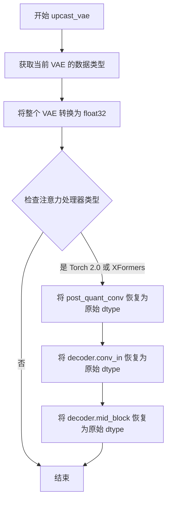

#### 带注释源码

```python
def upcast_vae(self):
    """
    将 VAE 转换为 float32 以避免在解码时发生数值溢出。
    如果使用 Torch 2.0 或 XFormers 注意力处理器，则部分层可保留在原始 dtype 以节省显存。
    """
    # 获取当前 VAE 的数据类型（通常是 torch.float16）
    dtype = self.vae.dtype
    
    # 将整个 VAE 模型转换为 float32，防止解码时溢出
    self.vae.to(dtype=torch.float32)
    
    # 检查 VAE 解码器的中间块是否使用了高效注意力处理器
    use_torch_2_0_or_xformers = isinstance(
        self.vae.decoder.mid_block.attentions[0].processor,  # 获取注意力处理器实例
        (
            AttnProcessor2_0,       # Torch 2.0 注意力处理器
            XFormersAttnProcessor,  # XFormers 注意力处理器
            FusedAttnProcessor2_0, # 融合的注意力处理器
        ),
    )
    
    # 如果使用了高效注意力处理器，注意力块不需要保持在 float32
    # 这样可以节省大量显存
    if use_torch_2_0_or_xformers:
        # 将后量化卷积层恢复为原始数据类型
        self.vae.post_quant_conv.to(dtype)
        # 将解码器输入卷积层恢复为原始数据类型
        self.vae.decoder.conv_in.to(dtype)
        # 将解码器中间块恢复为原始数据类型
        self.vae.decoder.mid_block.to(dtype)
```


### `AnimateDiffSDXLPipeline.get_guidance_scale_embedding`

该方法用于生成引导比例（guidance scale）的嵌入向量，通过将guidance scale值映射到高维空间，以便后续 Enrich timestep embeddings，提升扩散模型的生成质量。该实现基于VDM论文中的频率编码方法。

参数：

- `self`：`AnimateDiffSDXLPipeline` 类实例，隐式参数
- `w`：`torch.Tensor`，一维张量，表示要生成嵌入向量的引导比例值（guidance scale）
- `embedding_dim`：`int`，可选，默认值为 512，表示生成的嵌入向量的维度
- `dtype`：`torch.dtype`，可选，默认值为 `torch.float32`，生成嵌入向量的数据类型

返回值：`torch.Tensor`，形状为 `(len(w), embedding_dim)` 的嵌入向量张量

#### 流程图

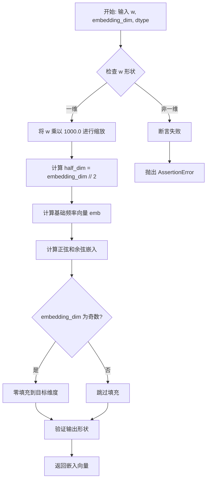

#### 带注释源码

```python
def get_guidance_scale_embedding(
    self, w: torch.Tensor, embedding_dim: int = 512, dtype: torch.dtype = torch.float32
) -> torch.Tensor:
    """
    生成guidance scale的嵌入向量，用于增强timestep embeddings。
    基于 https://github.com/google-research/vdm/blob/dc27b98a554f65cdc654b800da5aa1846545d41b/model_vdm.py#L298
    
    参数:
        w: 一维张量，引导比例值
        embedding_dim: 嵌入向量维度，默认512
        dtype: 输出数据类型，默认float32
    
    返回:
        形状为 (len(w), embedding_dim) 的嵌入向量张量
    """
    # 确保输入是一维张量
    assert len(w.shape) == 1
    
    # 将guidance scale缩放1000倍，与训练时的timestep范围对齐
    w = w * 1000.0
    
    # 计算嵌入向量的一半维度（用于正弦和余弦编码）
    half_dim = embedding_dim // 2
    
    # 计算基础频率向量：log(10000) / (half_dim - 1)
    # 这创建一个从大到小的频率衰减序列
    emb = torch.log(torch.tensor(10000.0)) / (half_dim - 1)
    
    # 生成指数衰减的频率向量：[0, 1, 2, ..., half_dim-1] * -emb
    emb = torch.exp(torch.arange(half_dim, dtype=dtype) * -emb)
    
    # 将w与频率向量相乘，创建加权的正弦/余弦输入
    # w[:, None] 将w从 (n,) 扩展为 (n, 1)
    # emb[None, :] 将emb从 (half_dim,) 扩展为 (1, half_dim)
    # 结果形状为 (n, half_dim)
    emb = w.to(dtype)[:, None] * emb[None, :]
    
    # 拼接正弦和余弦编码，形成完整的嵌入向量
    # 形状: (n, half_dim) -> (n, 2*half_dim)
    emb = torch.cat([torch.sin(emb), torch.cos(emb)], dim=1)
    
    # 如果目标维度为奇数，需要零填充一个维度
    if embedding_dim % 2 == 1:
        emb = torch.nn.functional.pad(emb, (0, 1))
    
    # 最终验证输出形状
    assert emb.shape == (w.shape[0], embedding_dim)
    
    return emb
```


### `AnimateDiffSDXLPipeline.__call__`

该方法是AnimateDiffSDXLPipeline的核心调用函数，负责执行完整的文本到视频生成流程。它接收文本提示词、视频参数、调度器配置等，依次完成提示词编码、潜在向量准备、去噪循环、最终解码等步骤，输出生成的视频帧序列。

参数：

- `prompt`：`str | list[str] | None`，要引导视频生成的提示词，若未定义则必须传递prompt_embeds
- `prompt_2`：`str | list[str] | None`，发送给tokenizer_2和text_encoder_2的提示词，若未定义则使用prompt
- `num_frames`：`int = 16`，生成的视频帧数，默认为16帧（约2秒8fps视频）
- `height`：`int | None`，生成视频的高度（像素），默认为unet.config.sample_size * vae_scale_factor
- `width`：`int | None`，生成视频的宽度（像素），默认为unet.config.sample_size * vae_scale_factor
- `num_inference_steps`：`int = 50`，去噪步数，步数越多视频质量越高但推理越慢
- `timesteps`：`list[int] | None`，自定义时间步，用于支持timesteps的调度器
- `sigmas`：`list[float] | None`，自定义sigmas，用于支持sigmas的调度器
- `denoising_end`：`float | None`，当指定时，确定去噪过程完成的分数（0.0-1.0），用于提前终止
- `guidance_scale`：`float = 5.0`，分类器自由引导比例，定义为Imagen论文中的w，>1时启用引导
- `negative_prompt`：`str | list[str] | None`，不引导视频生成的负面提示词
- `negative_prompt_2`：`str | list[str] | None`，发送给tokenizer_2和text_encoder_2的负面提示词
- `num_videos_per_prompt`：`int | None = 1`，每个提示词生成的视频数量
- `eta`：`float = 0.0`，DDIM论文中的η参数，仅适用于DDIMScheduler
- `generator`：`torch.Generator | list[torch.Generator] | None`，随机生成器，用于确定性生成
- `latents`：`torch.Tensor | None`，预生成的噪声潜在向量，可用于微调相同生成
- `prompt_embeds`：`torch.Tensor | None`，预生成的文本嵌入，可用于提示词加权
- `negative_prompt_embeds`：`torch.Tensor | None`，预生成的负面文本嵌入
- `pooled_prompt_embeds`：`torch.Tensor | None`，预生成的池化文本嵌入
- `negative_pooled_prompt_embeds`：`torch.Tensor | None`，预生成的负面池化文本嵌入
- `ip_adapter_image`：`PipelineImageInput | None`，IP适配器的可选图像输入
- `ip_adapter_image_embeds`：`list[torch.Tensor] | None`，IP适配器的预生成图像嵌入
- `output_type`：`str | None = "pil"`，输出格式，可选"pil"或np.array
- `return_dict`：`bool = True`，是否返回AnimateDiffPipelineOutput而非元组
- `cross_attention_kwargs`：`dict[str, Any] | None`，传递给AttentionProcessor的kwargs字典
- `guidance_rescale`：`float = 0.0`，引导重缩放因子，用于修复过曝
- `original_size`：`tuple[int, int] | None`，原始尺寸，默认为(height, width)
- `crops_coords_top_left`：`tuple[int, int] = (0, 0)`，裁剪坐标左上角
- `target_size`：`tuple[int, int] | None`，目标尺寸，默认为(height, width)
- `negative_original_size`：`tuple[int, int] | None`，负面条件原始尺寸
- `negative_crops_coords_top_left`：`tuple[int, int] = (0, 0)`，负面裁剪坐标
- `negative_target_size`：`tuple[int, int] | None`，负面目标尺寸
- `clip_skip`：`int | None`，CLIP计算嵌入时跳过的层数
- `callback_on_step_end`：`Callable[[int, int], None] | None`，每步结束时调用的回调函数
- `callback_on_step_end_tensor_inputs`：`list[str] = ["latents"]`，回调函数张量输入列表

返回值：`AnimateDiffPipelineOutput | tuple`，若return_dict为True返回AnimateDiffPipelineOutput对象，否则返回元组，第一个元素为生成的帧列表

#### 流程图

```mermaid
flowchart TD
    A[开始 __call__] --> B[1. 设置默认高度和宽度]
    B --> C[2. 检查输入参数有效性]
    C --> D[3. 定义批次大小和设备]
    D --> E[4. 编码输入提示词]
    E --> F[5. 准备时间步]
    F --> G[6. 准备潜在变量]
    G --> H[7. 准备额外步骤参数]
    H --> I[8. 准备添加的时间ID和嵌入]
    I --> J{是否有IP适配器图像?}
    J -->|是| K[准备IP适配器图像嵌入]
    J -->|否| L[应用denoising_end]
    K --> L
    L --> M[获取引导比例嵌入]
    M --> N{是否启用FreeInit?}
    N -->|是| O[应用FreeInit迭代]
    N -->|否| P[进入去噪循环]
    O --> P
    P --> Q[遍历每个时间步]
    Q --> R{是否中断?}
    R -->|是| Q
    R -->|否| S[扩展潜在向量]
    S --> T[缩放模型输入]
    T --> U[预测噪声残差]
    U --> V{是否使用引导?}
    V -->|是| W[执行分类器自由引导]
    V -->|否| X[计算上一步]
    W --> X
    X --> Y{是否有回调?}
    Y -->|是| Z[执行回调函数]
    Y -->|否| AA[更新进度条]
    Z --> AA
    AA --> BB{还有更多时间步?}
    BB -->|是| Q
    BB -->|否| CC[检查VAE是否需要上转换]
    CC --> DD{需要上转换?}
    DD -->|是| EE[上转换VAE]
    DD -->|否| FF[后处理]
    EE --> FF
    FF --> GG{output_type是否为latent?}
    GG -->|是| HH[直接返回latents]
    GG -->|否| II[解码潜在向量]
    II --> JJ[视频后处理]
    JJ --> HH
    HH --> KK[卸载所有模型]
    KK --> LL{return_dict是否为True?}
    LL -->|是| MM[返回AnimateDiffPipelineOutput]
    LL -->|否| NN[返回元组]
    MM --> OO[结束]
    NN --> OO
```

#### 带注释源码

```python
@torch.no_grad()
@replace_example_docstring(EXAMPLE_DOC_STRING)
def __call__(
    self,
    prompt: str | list[str] = None,
    prompt_2: str | list[str] | None = None,
    num_frames: int = 16,
    height: int | None = None,
    width: int | None = None,
    num_inference_steps: int = 50,
    timesteps: list[int] = None,
    sigmas: list[float] = None,
    denoising_end: float | None = None,
    guidance_scale: float = 5.0,
    negative_prompt: str | list[str] | None = None,
    negative_prompt_2: str | list[str] | None = None,
    num_videos_per_prompt: int | None = 1,
    eta: float = 0.0,
    generator: torch.Generator | list[torch.Generator] | None = None,
    latents: torch.Tensor | None = None,
    prompt_embeds: torch.Tensor | None = None,
    negative_prompt_embeds: torch.Tensor | None = None,
    pooled_prompt_embeds: torch.Tensor | None = None,
    negative_pooled_prompt_embeds: torch.Tensor | None = None,
    ip_adapter_image: PipelineImageInput | None = None,
    ip_adapter_image_embeds: list[torch.Tensor] | None = None,
    output_type: str | None = "pil",
    return_dict: bool = True,
    cross_attention_kwargs: dict[str, Any] | None = None,
    guidance_rescale: float = 0.0,
    original_size: tuple[int, int] | None = None,
    crops_coords_top_left: tuple[int, int] = (0, 0),
    target_size: tuple[int, int] | None = None,
    negative_original_size: tuple[int, int] | None = None,
    negative_crops_coords_top_left: tuple[int, int] = (0, 0),
    negative_target_size: tuple[int, int] | None = None,
    clip_skip: int | None = None,
    callback_on_step_end: Callable[[int, int], None] | None = None,
    callback_on_step_end_tensor_inputs: list[str] = ["latents"],
):
    r"""
    Function invoked when calling the pipeline for generation.

    Args:
        prompt: The prompt or prompts to guide the video generation.
        prompt_2: The prompt or prompts to be sent to the `tokenizer_2` and `text_encoder_2`.
        num_frames: The number of video frames that are generated. Defaults to 16 frames.
        height: The height in pixels of the generated video.
        width: The width in pixels of the generated video.
        num_inference_steps: The number of denoising steps.
        timesteps: Custom timesteps to use for the denoising process.
        sigmas: Custom sigmas to use for the denoising process.
        denoising_end: When specified, determines the fraction of the total denoising process to be completed.
        guidance_scale: Guidance scale as defined in Classifier-Free Diffusion Guidance.
        negative_prompt: The prompt or prompts not to guide the video generation.
        negative_prompt_2: The negative prompt or prompts for the second text encoder.
        num_videos_per_prompt: The number of videos to generate per prompt.
        eta: Corresponds to parameter eta (η) in the DDIM paper.
        generator: One or a list of torch generator(s) to make generation deterministic.
        latents: Pre-generated noisy latents, sampled from a Gaussian distribution.
        prompt_embeds: Pre-generated text embeddings.
        negative_prompt_embeds: Pre-generated negative text embeddings.
        pooled_prompt_embeds: Pre-generated pooled text embeddings.
        negative_pooled_prompt_embeds: Pre-generated negative pooled text embeddings.
        ip_adapter_image: Optional image input to work with IP Adapters.
        ip_adapter_image_embeds: Pre-generated image embeddings for IP-Adapter.
        output_type: The output format of the generated video.
        return_dict: Whether or not to return a AnimateDiffPipelineOutput instead of a plain tuple.
        cross_attention_kwargs: A kwargs dictionary passed along to the AttentionProcessor.
        guidance_rescale: Guidance rescale factor proposed by Common Diffusion Noise Schedules and Sample Steps are Flawed.
        original_size: If `original_size` is not the same as `target_size` the image will appear to be down- or upsampled.
        crops_coords_top_left: `crops_coords_top_left` can be used to generate an image that appears to be cropped.
        target_size: For most cases, `target_size` should be set to the desired height and width of the generated image.
        negative_original_size: To negatively condition the generation process based on a specific image resolution.
        negative_crops_coords_top_left: To negatively condition the generation process based on a specific crop coordinates.
        negative_target_size: To negatively condition the generation process based on a target image resolution.
        clip_skip: Number of layers to be skipped from CLIP while computing the prompt embeddings.
        callback_on_step_end: A function that calls at the end of each denoising steps during the inference.
        callback_on_step_end_tensor_inputs: The list of tensor inputs for the `callback_on_step_end` function.
    """

    # 0. Default height and width to unet
    # 如果未指定高度和宽度，使用默认样本大小乘以VAE缩放因子
    height = height or self.default_sample_size * self.vae_scale_factor
    width = width or self.default_sample_size * self.vae_scale_factor

    # 强制设置为1，与SDXL pipeline保持一致
    num_videos_per_prompt = 1

    # 设置默认的原始尺寸和目标尺寸
    original_size = original_size or (height, width)
    target_size = target_size or (height, width)

    # 1. Check inputs. Raise error if not correct
    # 验证输入参数的有效性，包括尺寸对齐、提示词与嵌入的互斥性等
    self.check_inputs(
        prompt,
        prompt_2,
        height,
        width,
        negative_prompt,
        negative_prompt_2,
        prompt_embeds,
        negative_prompt_embeds,
        pooled_prompt_embeds,
        negative_pooled_prompt_embeds,
        callback_on_step_end_tensor_inputs,
    )

    # 保存引导比例和其他配置参数到实例变量
    self._guidance_scale = guidance_scale
    self._guidance_rescale = guidance_rescale
    self._clip_skip = clip_skip
    self._cross_attention_kwargs = cross_attention_kwargs
    self._denoising_end = denoising_end
    self._interrupt = False

    # 2. Define call parameters
    # 根据提示词类型确定批次大小
    if prompt is not None and isinstance(prompt, str):
        batch_size = 1
    elif prompt is not None and isinstance(prompt, list):
        batch_size = len(prompt)
    else:
        batch_size = prompt_embeds.shape[0]

    # 获取执行设备
    device = self._execution_device

    # 3. Encode input prompt
    # 从cross_attention_kwargs中获取LoRA比例
    lora_scale = (
        self.cross_attention_kwargs.get("scale", None) if self.cross_attention_kwargs is not None else None
    )

    # 编码提示词，生成文本嵌入
    (
        prompt_embeds,
        negative_prompt_embeds,
        pooled_prompt_embeds,
        negative_pooled_prompt_embeds,
    ) = self.encode_prompt(
        prompt=prompt,
        prompt_2=prompt_2,
        device=device,
        num_videos_per_prompt=num_videos_per_prompt,
        do_classifier_free_guidance=self.do_classifier_free_guidance,
        negative_prompt=negative_prompt,
        negative_prompt_2=negative_prompt_2,
        prompt_embeds=prompt_embeds,
        negative_prompt_embeds=negative_prompt_embeds,
        pooled_prompt_embeds=pooled_prompt_embeds,
        negative_pooled_prompt_embeds=negative_pooled_prompt_embeds,
        lora_scale=lora_scale,
        clip_skip=self.clip_skip,
    )

    # 4. Prepare timesteps
    # 从调度器获取时间步
    timesteps, num_inference_steps = retrieve_timesteps(
        self.scheduler, num_inference_steps, device, timesteps, sigmas
    )

    # 5. Prepare latent variables
    # 获取UNet的输入通道数，准备潜在变量
    num_channels_latents = self.unet.config.in_channels
    latents = self.prepare_latents(
        batch_size * num_videos_per_prompt,
        num_channels_latents,
        num_frames,
        height,
        width,
        prompt_embeds.dtype,
        device,
        generator,
        latents,
    )

    # 6. Prepare extra step kwargs. TODO: Logic should ideally just be moved out of the pipeline
    # 准备调度器额外参数，如eta和generator
    extra_step_kwargs = self.prepare_extra_step_kwargs(generator, eta)

    # 7. Prepare added time ids & embeddings
    # 准备SDXL所需的时间ID和文本嵌入
    add_text_embeds = pooled_prompt_embeds
    if self.text_encoder_2 is None:
        text_encoder_projection_dim = int(pooled_prompt_embeds.shape[-1])
    else:
        text_encoder_projection_dim = self.text_encoder_2.config.projection_dim

    # 生成添加的时间ID
    add_time_ids = self._get_add_time_ids(
        original_size,
        crops_coords_top_left,
        target_size,
        dtype=prompt_embeds.dtype,
        text_encoder_projection_dim=text_encoder_projection_dim,
    )
    # 为负面条件生成额外的时间ID
    if negative_original_size is not None and negative_target_size is not None:
        negative_add_time_ids = self._get_add_time_ids(
            negative_original_size,
            negative_crops_coords_top_left,
            negative_target_size,
            dtype=prompt_embeds.dtype,
            text_encoder_projection_dim=text_encoder_projection_dim,
        )
    else:
        negative_add_time_ids = add_time_ids

    # 如果使用分类器自由引导，将负面和正面嵌入连接
    if self.do_classifier_free_guidance:
        prompt_embeds = torch.cat([negative_prompt_embeds, prompt_embeds], dim=0)
        add_text_embeds = torch.cat([negative_pooled_prompt_embeds, add_text_embeds], dim=0)
        add_time_ids = torch.cat([negative_add_time_ids, add_time_ids], dim=0)

    # 重复提示词嵌入以匹配帧数
    prompt_embeds = prompt_embeds.repeat_interleave(repeats=num_frames, dim=0)

    # 将张量移到设备上
    prompt_embeds = prompt_embeds.to(device)
    add_text_embeds = add_text_embeds.to(device)
    add_time_ids = add_time_ids.to(device).repeat(batch_size * num_videos_per_prompt, 1)

    # 准备IP适配器图像嵌入
    if ip_adapter_image is not None or ip_adapter_image_embeds is not None:
        image_embeds = self.prepare_ip_adapter_image_embeds(
            ip_adapter_image,
            ip_adapter_image_embeds,
            device,
            batch_size * num_videos_per_prompt,
            self.do_classifier_free_guidance,
        )

    # 7.1 Apply denoising_end
    # 如果指定了denoising_end，提前终止去噪过程
    if (
        self.denoising_end is not None
        and isinstance(self.denoising_end, float)
        and self.denoising_end > 0
        and self.denoising_end < 1
    ):
        discrete_timestep_cutoff = int(
            round(
                self.scheduler.config.num_train_timesteps
                - (self.denoising_end * self.scheduler.config.num_train_timesteps)
            )
        )
        num_inference_steps = len(list(filter(lambda ts: ts >= discrete_timestep_cutoff, timesteps)))
        timesteps = timesteps[:num_inference_steps]

    # 8. Optionally get Guidance Scale Embedding
    # 如果UNet配置了time_cond_proj_dim，生成引导比例嵌入
    timestep_cond = None
    if self.unet.config.time_cond_proj_dim is not None:
        guidance_scale_tensor = torch.tensor(self.guidance_scale - 1).repeat(batch_size * num_videos_per_prompt)
        timestep_cond = self.get_guidance_scale_embedding(
            guidance_scale_tensor, embedding_dim=self.unet.config.time_cond_proj_dim
        ).to(device=device, dtype=latents.dtype)

    # FreeInit迭代（如果启用）
    num_free_init_iters = self._free_init_num_iters if self.free_init_enabled else 1
    for free_init_iter in range(num_free_init_iters):
        if self.free_init_enabled:
            # 应用FreeInit方法
            latents, timesteps = self._apply_free_init(
                latents, free_init_iter, num_inference_steps, device, latents.dtype, generator
            )

        self._num_timesteps = len(timesteps)

        # 9. Denoising loop
        # 主去噪循环
        with self.progress_bar(total=self._num_timesteps) as progress_bar:
            for i, t in enumerate(timesteps):
                # 检查是否中断
                if self.interrupt:
                    continue

                # 扩展潜在向量（如果使用分类器自由引导）
                latent_model_input = torch.cat([latents] * 2) if self.do_classifier_free_guidance else latents

                # 缩放模型输入
                latent_model_input = self.scheduler.scale_model_input(latent_model_input, t)

                # 预测噪声残差
                added_cond_kwargs = {"text_embeds": add_text_embeds, "time_ids": add_time_ids}
                if ip_adapter_image is not None or ip_adapter_image_embeds:
                    added_cond_kwargs["image_embeds"] = image_embeds

                # 调用UNet进行噪声预测
                noise_pred = self.unet(
                    latent_model_input,
                    t,
                    encoder_hidden_states=prompt_embeds,
                    timestep_cond=timestep_cond,
                    cross_attention_kwargs=self.cross_attention_kwargs,
                    added_cond_kwargs=added_cond_kwargs,
                    return_dict=False,
                )[0]

                # 执行引导
                if self.do_classifier_free_guidance:
                    noise_pred_uncond, noise_pred_text = noise_pred.chunk(2)
                    noise_pred = noise_pred_uncond + self.guidance_scale * (noise_pred_text - noise_pred_uncond)

                # 应用引导重缩放
                if self.do_classifier_free_guidance and self.guidance_rescale > 0.0:
                    # Based on 3.4. in https://huggingface.co/papers/2305.08891
                    noise_pred = rescale_noise_cfg(
                        noise_pred, noise_pred_text, guidance_rescale=self.guidance_rescale
                    )

                # 计算上一步的噪声样本 x_t -> x_t-1
                latents = self.scheduler.step(noise_pred, t, latents, **extra_step_kwargs, return_dict=False)[0]

                # 执行回调函数
                if callback_on_step_end is not None:
                    callback_kwargs = {}
                    for k in callback_on_step_end_tensor_inputs:
                        callback_kwargs[k] = locals()[k]
                    callback_outputs = callback_on_step_end(self, i, t, callback_kwargs)

                    # 更新回调返回的张量
                    latents = callback_outputs.pop("latents", latents)
                    prompt_embeds = callback_outputs.pop("prompt_embeds", prompt_embeds)
                    negative_prompt_embeds = callback_outputs.pop("negative_prompt_embeds", negative_prompt_embeds)
                    add_text_embeds = callback_outputs.pop("add_text_embeds", add_text_embeds)
                    negative_pooled_prompt_embeds = callback_outputs.pop(
                        "negative_pooled_prompt_embeds", negative_pooled_prompt_embeds
                    )
                    add_time_ids = callback_outputs.pop("add_time_ids", add_time_ids)
                    negative_add_time_ids = callback_outputs.pop("negative_add_time_ids", negative_add_time_ids)

                # 更新进度条
                progress_bar.update()

                # XLA设备支持
                if XLA_AVAILABLE:
                    xm.mark_step()

    # 确保VAE在float32模式，避免float16溢出
    needs_upcasting = self.vae.dtype == torch.float16 and self.vae.config.force_upcast

    if needs_upcasting:
        self.upcast_vae()
        latents = latents.to(next(iter(self.vae.post_quant_conv.parameters())).dtype)

    # 10. Post processing
    # 后处理
    if output_type == "latent":
        video = latents
    else:
        # 解码潜在向量到视频
        video_tensor = self.decode_latents(latents)
        video = self.video_processor.postprocess_video(video=video_tensor, output_type=output_type)

    # 如果需要上转换，恢复fp16
    if needs_upcasting:
        self.vae.to(dtype=torch.float16)

    # 11. Offload all models
    # 卸载所有模型
    self.maybe_free_model_hooks()

    # 返回结果
    if not return_dict:
        return (video,)

    return AnimateDiffPipelineOutput(frames=video)
```


### `AnimateDiffSDXLPipeline.guidance_scale`

该属性是 `AnimateDiffSDXLPipeline` 类的 `guidance_scale` 属性 getter 方法，用于获取当前 pipeline 的 guidance_scale 值。guidance_scale 是分类器自由引导（Classifier-Free Guidance）的权重参数，用于控制生成图像与文本提示的相关性，值越大生成的图像越紧跟提示词。

参数：

- `self`：`AnimateDiffSDXLPipeline` 实例，隐含的实例参数，用于访问类的属性

返回值：`float`，返回当前设置的 guidance_scale 数值，用于控制扩散模型生成过程中对文本提示的引导强度。

#### 流程图

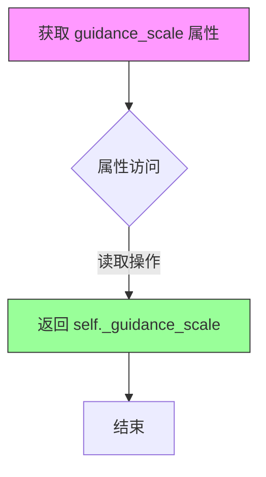

#### 带注释源码

```python
@property
def guidance_scale(self):
    """
    获取当前的 guidance_scale 值。
    
    guidance_scale 定义在 Imagen 论文中，类似于方程 (2) 中的权重 w。
    guidance_scale = 1 表示不使用分类器自由引导。
    较高的 guidance_scale 值会鼓励生成与文本 prompt 更紧密相关的图像，
    通常以较低的图像质量为代价。
    
    Returns:
        float: 当前 pipeline 的 guidance_scale 值。
    """
    return self._guidance_scale
```


### `AnimateDiffSDXLPipeline.guidance_rescale`

这是一个属性 getter 方法，用于获取 guidance_rescale 值。该值用于控制噪声预测的重新缩放，以改善图像质量并修复过度曝光问题。

参数：

- 无参数（属性 getter）

返回值：`float`，返回 guidance_rescale 值，用于在扩散过程中重新缩放噪声预测。

#### 流程图

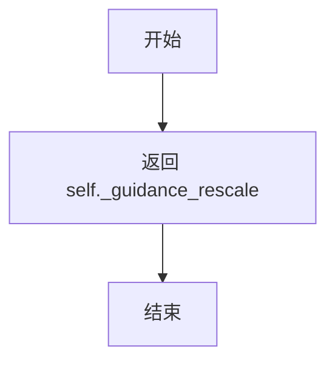

#### 带注释源码

```python
@property
def guidance_rescale(self):
    """
    属性 getter 方法，用于获取 guidance_rescale 值。
    
    guidance_rescale 是根据 Common Diffusion Noise Schedules and Sample Steps are Flawed 论文
    (https://huggingface.co/papers/2305.08891) 提出的重新缩放因子，用于改善图像质量并修复过度曝光问题。
    
    该值在 __call__ 方法中被设置为 self._guidance_rescale，
    并在噪声预测计算过程中通过 rescale_noise_cfg 函数应用。
    
    Returns:
        float: guidance_rescale 值，默认为 0.0
    """
    return self._guidance_rescale
```


### `AnimateDiffSDXLPipeline.clip_skip`

这是一个属性 getter 方法，用于获取在文本编码过程中从 CLIP 模型跳过的层数。该属性允许用户控制使用 CLIP 模型的哪一层隐藏状态来计算提示嵌入，值为 `None` 时使用倒数第二层，否则跳过指定层数。

参数： 无

返回值：`int | None`，返回 CLIP 跳过的层数，如果为 `None` 则使用默认行为（倒数第二层）。

#### 流程图

```mermaid
flowchart TD
    A[访问 clip_skip 属性] --> B{self._clip_skip 是否已设置?}
    B -->|是| C[返回 self._clip_skip 值]
    B -->|否| D[返回 None]
    C --> E[在 encode_prompt 中使用]
    D --> E
    E --> F{clip_skip 为 None?}
    F -->|是| G[使用 hidden_states[-2]]
    F -->|否| H[使用 hidden_states[-(clip_skip + 2)]]
```

#### 带注释源码

```python
@property
def clip_skip(self):
    r"""
    属性 getter：获取 CLIP 跳过的层数。

    该属性控制 text_encoder 在编码提示词时跳过的层数。
    - 当 clip_skip 为 None 时，encode_prompt 方法会使用倒数第二层 hidden states
    - 当 clip_skip 为具体数值时，会跳过相应层数并使用更浅层的特征

    返回:
        int | None: 跳过的层数，None 表示使用默认行为
    """
    return self._clip_skip
```

#### 相关上下文

该属性在以下位置被使用：

1. **在 `__call__` 方法中设置**：
```python
self._clip_skip = clip_skip
```

2. **在 `encode_prompt` 方法中使用**：
```python
if clip_skip is None:
    prompt_embeds = prompt_embeds.hidden_states[-2]
else:
    # "2" because SDXL always indexes from the penultimate layer.
    prompt_embeds = prompt_embeds.hidden_states[-(clip_skip + 2)]
```


### `AnimateDiffSDXLPipeline.do_classifier_free_guidance`

该属性用于判断当前管道是否启用无分类器引导（Classifier-Free Guidance）功能。它通过检查 `guidance_scale` 是否大于 1 且 UNet 的 `time_cond_proj_dim` 是否为空来确定是否需要进行无分类器引导。

参数：无（该属性只使用隐式的 `self` 参数）

返回值：`bool`，返回 `True` 表示启用无分类器引导，返回 `False` 表示不启用

#### 流程图

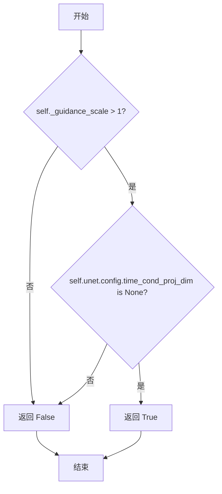

#### 带注释源码

```python
@property
def do_classifier_free_guidance(self):
    """
    属性：判断是否执行无分类器引导
    
    根据 Imagen 论文中的定义，guidance_scale 对应于方程 (2) 中的权重 w。
    当 guidance_scale = 1 时，表示不执行无分类器引导。
    """
    # 检查两个条件：
    # 1. guidance_scale > 1：只有当引导比例大于1时才启用引导
    # 2. unet.config.time_cond_proj_dim is None：当UNet不使用时间条件投影维度时
    return self._guidance_scale > 1 and self.unet.config.time_cond_proj_dim is None
```


### `AnimateDiffSDXLPipeline.cross_attention_kwargs`

这是一个属性 getter 方法，用于获取在扩散管道调用过程中传入的交叉注意力关键字参数（cross_attention_kwargs）。这些参数会被传递给 UNet 模型以控制注意力机制的行为，例如添加 ControlNet 条件、LoRA 权重调节或其他自定义注意力处理。

参数： 无（属性 getter 不接受参数）

返回值：`dict[str, Any] | None`，返回存储在实例中的交叉注意力关键字参数字典。如果未设置，则为 `None`。该字典通常包含如 `scale`（LoRA 权重）、`added_cond_kwargs`（额外条件）等键，用于在去噪过程中向 UNet 传递额外的注意力控制信息。

#### 流程图

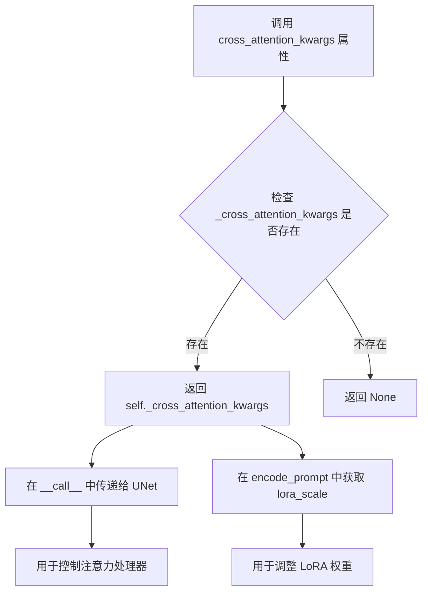

#### 带注释源码

```python
@property
def cross_attention_kwargs(self):
    r"""
    属性 getter 方法，用于获取交叉注意力关键字参数。

    这个属性在管道调用时通过 __call__ 方法的 cross_attention_kwargs 参数设置。
    返回的值会被传递给 UNet 模型的 forward 方法，用于控制注意力机制的行为。
    
    常见用途：
    - 传递 LoRA 权重调节因子 (scale)
    - 传递 ControlNet 的额外条件
    - 传递自定义的 AttentionProcessor 配置
    
    Returns:
        dict[str, Any] | None: 交叉注意力关键字参数字典，如果未设置则为 None
    """
    return self._cross_attention_kwargs
```

#### 相关使用上下文

在 `__call__` 方法中，该属性被设置和使用：

```python
# 在 __call__ 方法中设置
self._cross_attention_kwargs = cross_attention_kwargs

# 在 encode_prompt 中用于获取 LoRA scale
lora_scale = (
    self.cross_attention_kwargs.get("scale", None) if self.cross_attention_kwargs is not None else None
)

# 在去噪循环中传递给 UNet
noise_pred = self.unet(
    latent_model_input,
    t,
    encoder_hidden_states=prompt_embeds,
    timestep_cond=timestep_cond,
    cross_attention_kwargs=self.cross_attention_kwargs,  # 使用该属性
    added_cond_kwargs=added_cond_kwargs,
    return_dict=False,
)[0]
```


### `AnimateDiffSDXLPipeline.denoising_end`

这是一个属性（property）getter方法，用于获取去噪结束（denoising_end）的配置值。该属性允许在"多去噪器混合"（Mixture of Denoisers）管道设置中提前终止去噪过程，从而保留一定程度的噪声。

参数：无（除了隐式的 `self`）

返回值：`float | None`，返回去噪结束的值。当设置此值时，它表示在总去噪过程完成之前终止的比例（介于 0.0 和 1.0 之间）。

#### 流程图

```mermaid
graph TD
    A[访问 denoising_end 属性] --> B{检查 _denoising_end 是否存在}
    B -->|是| C[返回 self._denoising_end 的值]
    B -->|否| D[返回 None]
```

#### 带注释源码

```python
@property
def denoising_end(self):
    """
    属性 getter: 获取去噪结束阈值
    
    当在管道调用中通过 denoising_end 参数设置此值时，
    可以提前终止去噪过程。这在"Mixture of Denoisers"多管道
    设置中特别有用，允许部分去噪的输出作为后续管道的输入。
    
    返回:
        float | None: 去噪结束值，范围 0.0-1.0，表示去噪过程
                      终止时的总进度比例。None 表示不使用提前终止。
    """
    return self._denoising_end
```


### `AnimateDiffSDXLPipeline.num_timesteps`

这是一个只读属性（property），用于获取当前扩散管道执行过程中的时间步数量。在扩散模型推理过程中，时间步决定了去噪的次数和采样进度。

参数：无（此属性不接受任何参数）

返回值：`int`，返回当前推理过程的时间步总数，即去噪循环的迭代次数。

#### 流程图

```mermaid
flowchart TD
    A[访问 num_timesteps 属性] --> B{检查 _num_timesteps 是否已设置}
    B -->|已设置| C[返回 self._num_timesteps]
    B -->|未设置| D[返回默认值或 0]
    
    style C fill:#90EE90
    style D fill:#FFB6C1
```

#### 带注释源码

```python
@property
def num_timesteps(self):
    """
    只读属性，返回当前扩散管道的时间步数量。
    
    该属性在 __call__ 方法的执行过程中被设置（self._num_timesteps = len(timesteps)），
    用于跟踪和管理去噪循环的进度。
    
    Returns:
        int: 推理过程中使用的时间步总数，通常等于 num_inference_steps。
    """
    return self._num_timesteps
```


### `AnimateDiffSDXLPipeline.interrupt`

这是一个属性 getter 方法，用于返回管道的中断标志状态。该属性允许外部代码在去噪循环执行过程中请求中断生成过程，从而实现用户取消或提前终止视频生成的能力。

参数：无需参数（属性访问器）

返回值：`bool`，返回当前的中断标志状态。当返回 `True` 时，表示外部已请求中断去噪循环；当返回 `False` 时，表示继续正常执行。

#### 流程图

```mermaid
flowchart TD
    A[外部代码访问 interrupt 属性] --> B{获取 self._interrupt 值}
    B --> C[返回布尔值]
    C --> D{值为 True?}
    D -->|是| E[去噪循环中的 __call__ 方法执行 continue 跳过当前迭代]
    D -->|否| F[去噪循环继续执行]
```

#### 带注释源码

```python
@property
def interrupt(self):
    """
    属性 getter：返回管道的中断标志。
    
    该属性在去噪循环中被检查（位于 __call__ 方法中）:
    ```python
    for i, t in enumerate(timesteps):
        if self.interrupt:
            continue  # 跳过当前迭代，实现中断
    ```
    
    外部可以通过设置 pipeline._interrupt = True 来请求中断。
    
    Returns:
        bool: 中断标志状态。True 表示请求中断，False 表示继续执行。
    """
    return self._interrupt
```

#### 相关上下文代码

在 `__call__` 方法中，该属性的初始化和使用：

```python
# 初始化阶段（在 __call__ 方法开始时）
self._interrupt = False  # 初始设为 False，允许生成开始

# 在去噪循环中检查中断标志
for i, t in enumerate(timesteps):
    if self.interrupt:  # 检查中断标志
        continue       # 如果请求中断，跳过当前时间步
    # ... 继续去噪逻辑
```

## 关键组件


### MotionAdapter

运动适配器模块，用于为Stable Diffusion XL模型添加动画生成能力，将静态图像生成扩展到视频帧序列

### UNetMotionModel

基于UNet2DConditionModel的条件去噪网络，支持时间维度的处理，用于在潜在空间中预测噪声残差

### AutoencoderKL

变分自编码器，负责将图像编码到潜在空间以及从潜在空间解码回图像/视频帧

### CLIPTextModel / CLIPTextModelWithProjection

双文本编码器系统，用于将文本提示编码为embedding，支持SDXL的双文本编码器架构

### VideoProcessor

视频后处理模块，负责将潜在表示转换为最终视频输出，支持多种输出格式

### Scheduler (DDIMScheduler等)

噪声调度器家族，控制去噪过程中的噪声添加和去除策略

### IPAdapterMixin

图像提示适配器混合类，支持通过图像输入增强文本生成能力

### FreeInitMixin

自由初始化混合类，提供额外的噪声初始化策略以改善生成质量

### TextualInversionLoaderMixin

文本反转嵌入加载器，支持加载自定义概念embedding

### StableDiffusionXLLoraLoaderMixin

LoRA权重加载器，支持SDXL模型的LoRA微调和权重应用

### encode_prompt

将文本提示编码为文本embedding，包含正向和负向prompt处理，支持classifier-free guidance

### prepare_latents

准备初始潜在变量，根据batch_size、帧数、分辨率生成随机噪声或使用提供的latents

### decode_latents

将潜在表示解码为视频帧，处理VAE的缩放因子和维度重排

### __call__

主生成方法，执行完整的文本到视频Pipeline，包括：输入验证、prompt编码、时间步准备、去噪循环、潜在解码和后处理

## 问题及建议


### 已知问题

-   **`num_videos_per_prompt` 参数被硬编码**：在 `__call__` 方法中，`num_videos_per_prompt` 被直接赋值为 1（第 716 行），尽管该参数在函数签名中存在且 `encode_prompt` 方法已支持此功能，导致用户无法通过此参数控制每个提示生成的视频数量。
-   **缺少 `num_frames` 验证**：`check_inputs` 方法验证了 `height` 和 `width` 必须能被 8 整除，但没有对 `num_frames` 进行任何有效性检查，可能导致后续处理出现异常。
-   **大量代码重复**：多处方法（如 `encode_prompt`、`encode_image`、`decode_latents` 等）通过 "Copied from" 注释标记，表明是从其他 Pipeline 复制的代码，这增加了维护成本且容易导致代码不一致。
-   **潜在的类型转换开销**：在 `encode_prompt` 方法中，重复使用 `torch.concat` 和 `repeat` 操作处理 `prompt_embeds`，这些操作在视频生成场景下会进一步扩展维度，可能带来不必要的内存开销。
-   **调度器参数检测使用 `inspect` 模块**：在 `retrieve_timesteps` 和 `prepare_extra_step_kwargs` 中使用 `inspect.signature` 动态检测调度器参数，这在每次调用时都会产生一定性能开销。
-   **属性初始化不明确**：类中使用了多个带下划线前缀的私有属性（如 `_guidance_scale`、`_guidance_rescale`、`_clip_skip` 等），但这些属性在类定义中未初始化，依赖于 `__call__` 方法动态设置，可能导致 IDE 静态分析困难。
-   **IP Adapter 支持可能不完整**：虽然代码包含 IP Adapter 相关的编码和准备方法，但在 `__call__` 方法的主循环中没有完整处理 `image_embeds` 的条件注入逻辑（仅在准备阶段调用但后续使用方式可能不完整）。

### 优化建议

-   移除 `num_videos_per_prompt = 1` 的硬编码，使用函数参数的实际值。
-   在 `check_inputs` 中添加 `num_frames` 的有效性检查（如大于 0、是否为合理范围等）。
-   考虑将通用的方法（如 `encode_prompt`、`decode_latents` 等）提取到基类或混入类（Mixin）中，减少代码重复。
-   考虑缓存调度器的参数签名检测结果，避免每次调用都进行 `inspect` 操作。
-   明确初始化所有使用的私有属性，或使用 `__post_init__` 方法进行统一的属性初始化。
-   优化 `encode_prompt` 中的张量操作，在视频生成场景下考虑使用更高效的维度处理方式。
-   补充 IP Adapter 在去噪循环中的完整集成逻辑，确保图像条件能够正确影响生成过程。

## 其它


### 设计目标与约束

本Pipeline的设计目标是利用Stable Diffusion XL模型和Motion Adapter实现高质量的文本到视频(Text-to-Video)生成功能。核心约束包括：1) 输入图像尺寸必须能被8整除；2) 默认分辨率为1024x1024，低于512像素会影响生成质量；3) 默认生成16帧（2秒@8fps）；4) guidance_scale>1时启用classifier-free guidance；5) 仅支持指定的调度器类型（DDIMScheduler、PNDMScheduler、LMSDiscreteScheduler、EulerDiscreteScheduler、EulerAncestralDiscreteScheduler、DPMSolverMultistepScheduler）。

### 错误处理与异常设计

代码采用分层异常处理机制：**输入验证层**通过check_inputs方法集中处理，涵盖尺寸校验(prompt/negative_prompt与embeds互斥检查、尺寸8的倍数校验)、类型校验(prompt类型检查)、维度一致性校验(prompt_embeds与negative_prompt_embeds形状匹配)、必要参数校验(pooled_prompt_embeds与negative_pooled_prompt_embeds必须成对提供)；**调度器兼容性验证**在retrieve_timesteps中检查set_timesteps方法是否支持自定义timesteps或sigmas；**资源匹配验证**在prepare_latents中校验generator列表长度与batch_size的一致性；**IP Adapter验证**检查ip_adapter_image数量与projection_layers数量的匹配。所有异常均抛出ValueError并携带描述性错误信息。

### 数据流与状态机

Pipeline执行流程分为11个主要阶段：**阶段0-默认值初始化**：设置默认height/width；**阶段1-输入校验**：调用check_inputs验证所有输入参数；**阶段2-调用参数定义**：确定batch_size和device；**阶段3-提示词编码**：调用encode_prompt生成prompt_embeds、negative_prompt_embeds、pooled_prompt_embeds、negative_pooled_prompt_embeds；**阶段4-时间步准备**：通过retrieve_timesteps获取调度器时间步；**阶段5-潜在变量准备**：调用prepare_latents生成或加载初始噪声；**阶段6-额外参数准备**：prepare_extra_step_kwargs处理scheduler特定参数；**阶段7-时间ID与Embedding准备**：_get_add_time_ids生成SDXL微条件参数；**阶段7.1-去噪结束控制**：根据denoising_end截断时间步；**阶段8-去噪循环**：迭代执行UNet噪声预测、CFGguidance应用、scheduler步进；**阶段9-VAE上采样**：需要时进行float16到float32转换；**阶段10-后处理**：decode_latents解码latents为视频，video_processor后处理；**阶段11-模型卸载**：调用maybe_free_model_hooks释放资源。状态转换由scheduler的timesteps驱动，每个timestep执行一次UNet前向传播和scheduler.step。

### 外部依赖与接口契约

**核心依赖模块**：transformers(CLIPTextModel、CLIPTextModelWithProjection、CLIPTokenizer、CLIPVisionModelWithProjection、CLIPImageProcessor)；diffusers内部模块(PipelineImageInput、FromSingleFileMixin、IPAdapterMixin、StableDiffusionXLLoraLoaderMixin、TextualInversionLoaderMixin、AutoencoderKL、ImageProjection、MotionAdapter、UNet2DConditionModel、UNetMotionModel、各类AttnProcessor、调度器)；torch；inspect。**输入接口契约**：prompt支持str或list[str]；negative_prompt支持str或list[str]；height/width必须为8的倍数；num_frames默认为16；num_inference_steps默认为50；guidance_scale默认为5.0；generator支持单个或列表；latents支持预加载tensor；ip_adapter_image支持PipelineImageInput或列表。**输出接口契约**：返回AnimateDiffPipelineOutput(frames属性)或tuple，视频格式由output_type控制(支持"pil"、"np"、"latent"等)；callback_on_step_end在每个去噪步骤结束后触发，可通过callback_on_step_end_tensor_inputs控制传递的tensor列表。

### 并发与异步特性

代码支持以下并发特性：**XLA设备支持**：通过is_torch_xla_available检测XLA环境，若可用则在去噪循环中调用xm.mark_step()进行设备同步；**模型CPU卸载**：model_cpu_offload_seq定义了推荐的卸载顺序(text_encoder->text_encoder_2->image_encoder->unet->vae)；**FreeInit支持**：通过FreeInitMixin和_apply_free_init方法支持FreeInit初始化技术，可在去噪前应用自定义初始化；**VAE切片与平铺**：示例代码中启用pipe.enable_vae_slicing()和pipe.enable_vae_tiling()以节省显存。Pipeline本身为同步执行，通过torch.no_grad()装饰器禁用梯度计算以提升推理性能。

### 配置与可扩展性

**可选组件定义**：_optional_components列表声明了tokenizer、tokenizer_2、text_encoder、text_encoder_2、image_encoder、feature_extractor为可选组件；**回调张量输入**：_callback_tensor_inputs定义了callback_on_step_end可访问的tensor列表(latents、prompt_embeds、negative_prompt_embeds、add_text_embeds、add_time_ids、negative_pooled_prompt_embeds、negative_add_time_ids)；**属性动态访问**：通过@property装饰器暴露guidance_scale、guidance_rescale、clip_skip、do_classifier_free_guidance、cross_attention_kwargs、denoising_end、num_timesteps、interrupt等运行时状态；**调度器兼容性**：prepare_extra_step_kwargs通过inspect签名检查动态适配不同调度器的参数签名(eta、generator等)。

### 内存与性能优化策略

代码实现了多项内存优化：**动态dtype转换**：text_encoder_2优先用于dtype确定，若无则使用unet dtype；**VAE上采样**：当vae为float16且force_upcast为True时，执行upcast_vae()将decoder转入float32以防止溢出；**LoRA缩放管理**：使用scale_lora_layers和unscale_lora_layers动态调整LoRA权重；**内存效率技术**：支持VAE slicing(将VAE解码分块处理)、VAE tiling(分块处理大分辨率)、xformers内存优化注意力；**Prompt复制优化**：使用repeat_interleave而非重复复制以提高MPS兼容性；**Latent缩放**：decode_latents中对latents除以scaling_factor进行缩放，prepare_latents中乘以init_noise_sigma进行噪声缩放。


    