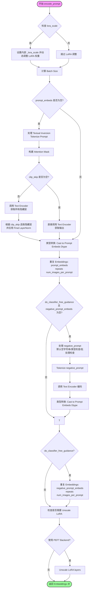
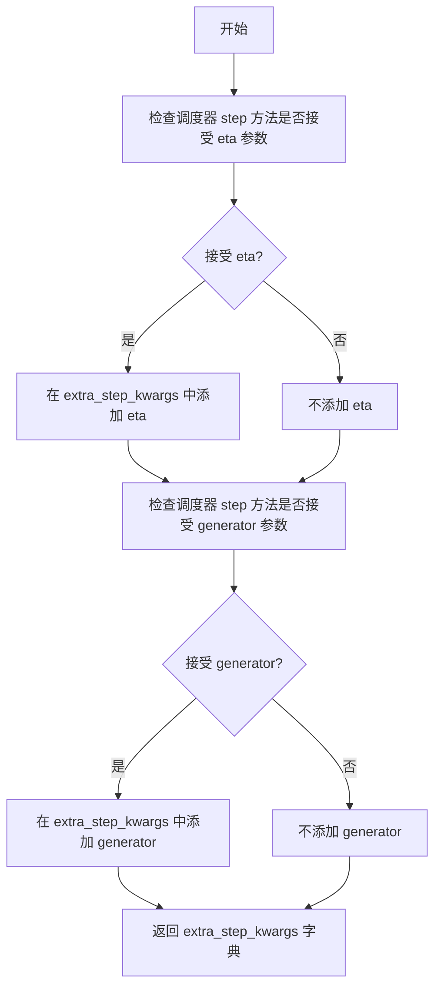
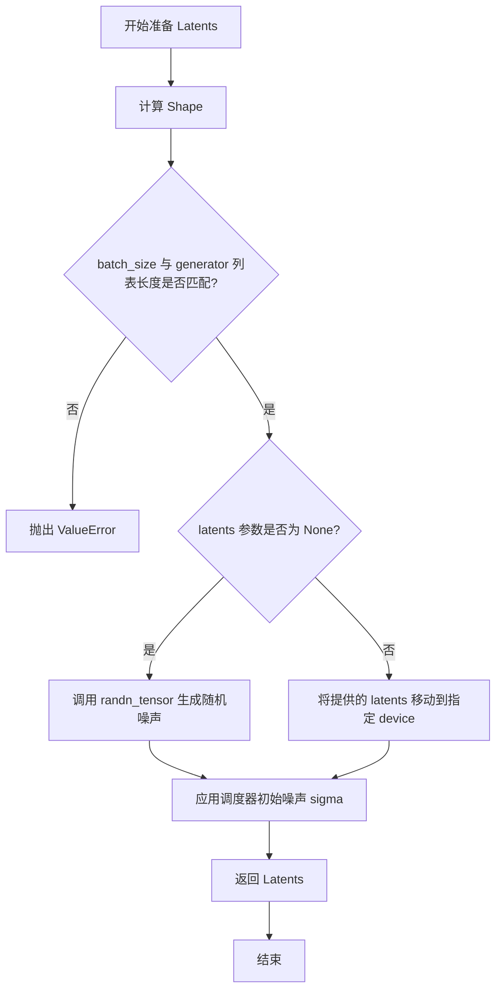
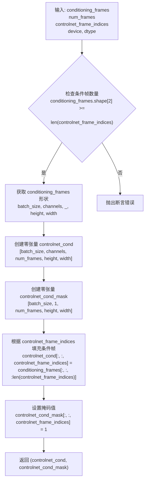
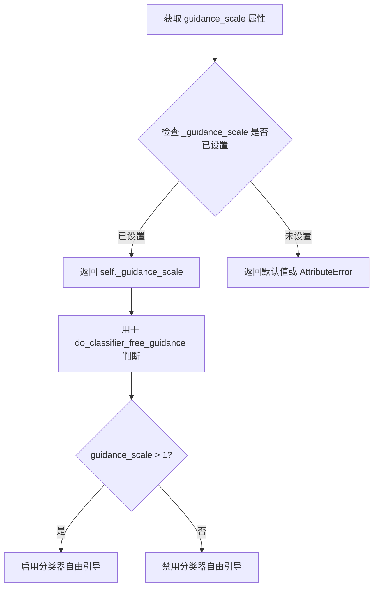
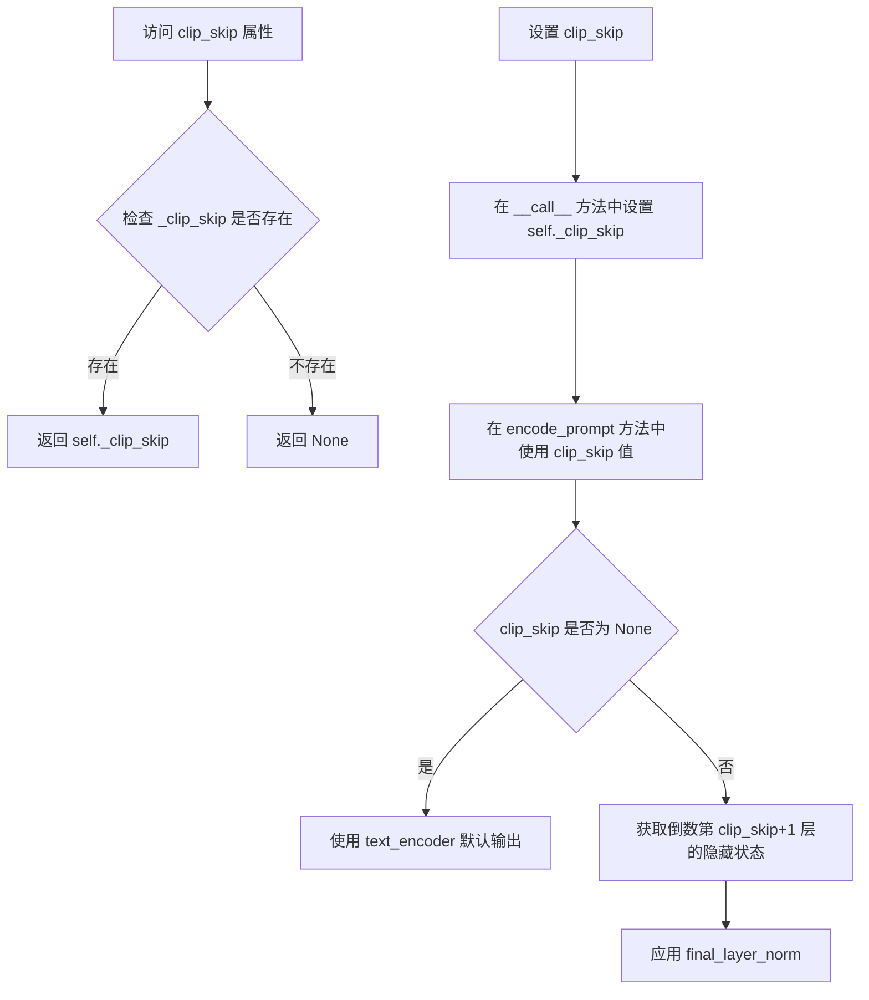
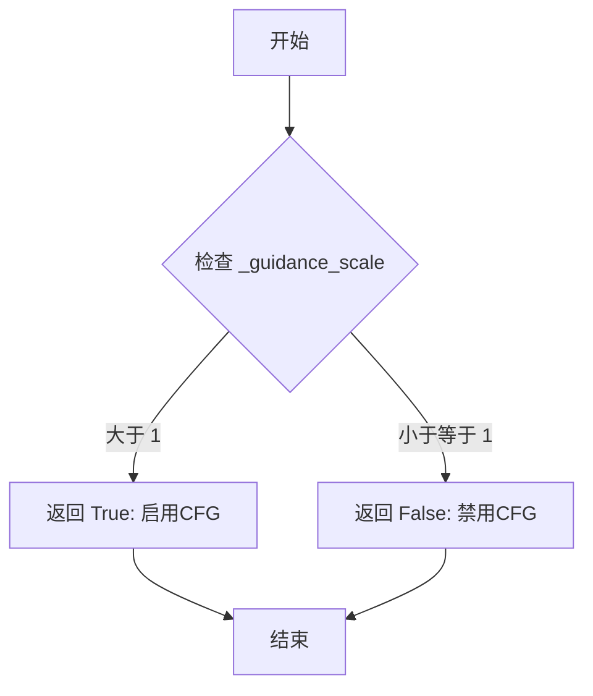
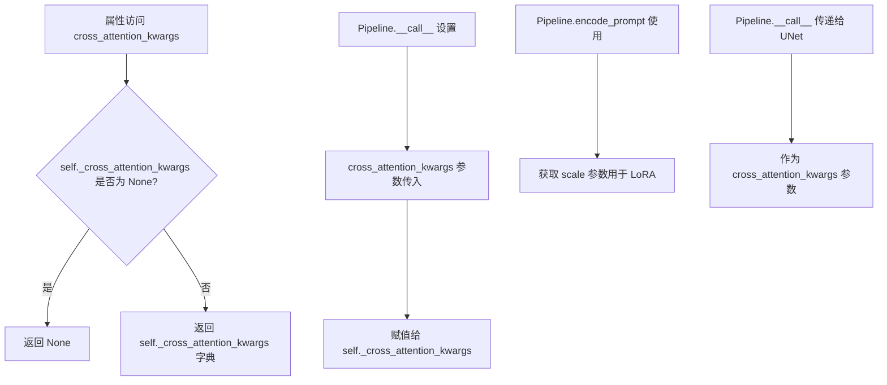
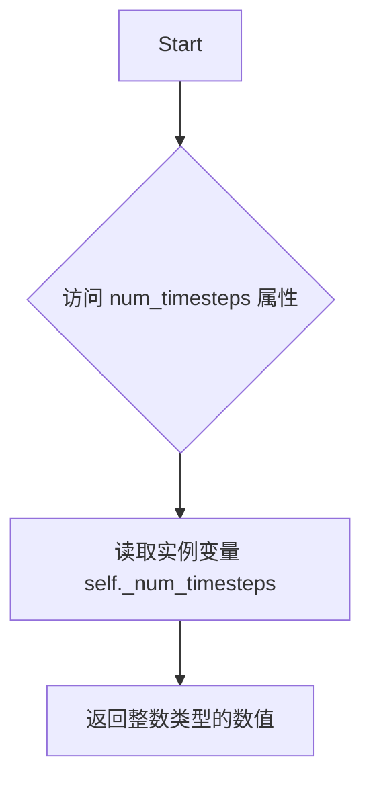
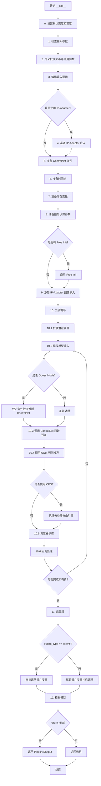

# `diffusers\src\diffusers\pipelines\animatediff\pipeline_animatediff_sparsectrl.py` 详细设计文档

AnimateDiffSparseControlNetPipeline 是一个结合了 Stable Diffusion、AnimateDiff 运动适配器和 SparseControlNet 的文本到视频生成管道，它通过稀疏的关键帧（如涂鸦或图像）来控制视频生成，同时支持 Lora、IP-Adapter 等高级功能。

## 整体流程

```mermaid
graph TD
    A[用户调用 pipe()] --> B{检查输入 check_inputs}
    B --> C[编码提示词 encode_prompt]
    C --> D[准备IP适配器 prepare_ip_adapter_image_embeds]
    D --> E[准备控制图像 prepare_image]
    E --> F[准备稀疏控制条件 prepare_sparse_control_conditioning]
    F --> G[准备潜在向量 prepare_latents]
    G --> H[去噪循环 Denoising Loop]
    H --> I[扩展潜在向量 & 缩放模型输入]
    I --> J[运行 SparseControlNet]
    J --> K[运行 UNet 预测噪声]
    K --> L{是否使用 CFG?}
    L -- 是 --> M[执行分类器自由指导]
    L -- 否 --> N[跳过 CFG]
    M --> O[调度器步进 scheduler.step]
    N --> O
    O --> P{还有剩余步骤?}
    P -- 是 --> H
    P -- 否 --> Q[解码潜在向量 decode_latents]
    Q --> R[后处理视频 video_processor.postprocess_video]
    R --> S[返回 AnimateDiffPipelineOutput]
```

## 类结构

```
DiffusionPipeline (基类)
├── StableDiffusionMixin
├── TextualInversionLoaderMixin
├── IPAdapterMixin
├── StableDiffusionLoraLoaderMixin
├── FreeInitMixin
├── FromSingleFileMixin
└── AnimateDiffSparseControlNetPipeline (主类)
```

## 全局变量及字段


### `logger`
    
模块日志记录器

类型：`logging.Logger`
    


### `EXAMPLE_DOC_STRING`
    
使用示例文档字符串

类型：`str`
    


### `XLA_AVAILABLE`
    
标志位，指示是否启用 PyTorch XLA

类型：`bool`
    


### `AnimateDiffSparseControlNetPipeline.vae`
    
变分自编码器，用于图像/潜在空间转换

类型：`AutoencoderKL`
    


### `AnimateDiffSparseControlNetPipeline.text_encoder`
    
冻结的文本编码器

类型：`CLIPTextModel`
    


### `AnimateDiffSparseControlNetPipeline.tokenizer`
    
分词器

类型：`CLIPTokenizer`
    


### `AnimateDiffSparseControlNetPipeline.unet`
    
去噪网络

类型：`UNet2DConditionModel | UNetMotionModel`
    


### `AnimateDiffSparseControlNetPipeline.motion_adapter`
    
运动适配器模块

类型：`MotionAdapter`
    


### `AnimateDiffSparseControlNetPipeline.controlnet`
    
稀疏控制网络

类型：`SparseControlNetModel`
    


### `AnimateDiffSparseControlNetPipeline.scheduler`
    
扩散调度器

类型：`KarrasDiffusionSchedulers`
    


### `AnimateDiffSparseControlNetPipeline.video_processor`
    
视频后处理器

类型：`VideoProcessor`
    


### `AnimateDiffSparseControlNetPipeline.control_image_processor`
    
控制图像预处理器

类型：`VaeImageProcessor`
    


### `AnimateDiffSparseControlNetPipeline.vae_scale_factor`
    
VAE 缩放因子

类型：`int`
    


### `AnimateDiffSparseControlNetPipeline._guidance_scale`
    
引导比例 (属性)

类型：`float`
    


### `AnimateDiffSparseControlNetPipeline._clip_skip`
    
跳过的CLIP层数 (属性)

类型：`int`
    


### `AnimateDiffSparseControlNetPipeline._cross_attention_kwargs`
    
交叉注意力参数 (属性)

类型：`dict`
    


### `AnimateDiffSparseControlNetPipeline._num_timesteps`
    
时间步数 (属性)

类型：`int`
    
    

## 全局函数及方法


### `retrieve_latents`

从编码器输出中提取潜在向量，支持 sample（采样）和 argmax（取众数）两种模式，返回提取后的潜在向量张量。

参数：

- `encoder_output`：`torch.Tensor`，编码器的输出对象，可能包含 `latent_dist` 或 `latents` 属性
- `generator`：`torch.Generator | None`，随机数生成器，用于采样模式下的随机采样
- `sample_mode`：`str`，采样模式，可选值为 `"sample"`（从分布中采样）或 `"argmax"`（取分布的众数）

返回值：`torch.Tensor`，从编码器输出中提取的潜在向量

#### 流程图

```mermaid
flowchart TD
    A[开始: retrieve_latents] --> B{encoder_output 是否有 latent_dist 属性?}
    B -- 是 --> C{sample_mode == 'sample'?}
    C -- 是 --> D[返回 encoder_output.latent_dist.sample<br/>/generator)]
    C -- 否 --> E{sample_mode == 'argmax'?}
    E -- 是 --> F[返回 encoder_output.latent_dist.mode]
    E -- 否 --> G{encoder_output 是否有 latents 属性?}
    B -- 否 --> G
    G -- 是 --> H[返回 encoder_output.latents]
    G -- 否 --> I[抛出 AttributeError<br/>'Could not access latents of provided encoder_output']
    D --> J[结束]
    F --> J
    H --> J
```

#### 带注释源码

```python
def retrieve_latents(
    encoder_output: torch.Tensor, generator: torch.Generator | None = None, sample_mode: str = "sample"
):
    # 检查 encoder_output 是否具有 latent_dist 属性（表示输出为分布形式）
    if hasattr(encoder_output, "latent_dist") and sample_mode == "sample":
        # 如果采样模式为 'sample'，从潜在分布中采样
        # generator 用于控制随机采样过程，确保可复现性
        return encoder_output.latent_dist.sample(generator)
    elif hasattr(encoder_output, "latent_dist") and sample_mode == "argmax":
        # 如果采样模式为 'argmax'，取潜在分布的众数（最大概率值对应的潜在向量）
        return encoder_output.latent_dist.mode()
    elif hasattr(encoder_output, "latents"):
        # 如果 encoder_output 直接包含 latents 属性，直接返回
        return encoder_output.latents
    else:
        # 如果无法从 encoder_output 中获取潜在向量，抛出属性错误
        raise AttributeError("Could not access latents of provided encoder_output")
```


### `AnimateDiffSparseControlNetPipeline.__init__`

初始化 AnimateDiffSparseControlNetPipeline 管道类，接收 VAE、文本编码器、分词器、UNet、运动适配器、ControlNet、调度器等核心组件，并注册所有模块、计算 VAE 缩放因子，同时初始化视频处理器和控制图像处理器。

参数：

- `vae`：`AutoencoderKL`，Variational Auto-Encoder (VAE) Model，用于编码和解码图像到潜在表示
- `text_encoder`：`CLIPTextModel`，冻结的文本编码器 (clip-vit-large-patch14)
- `tokenizer`：`CLIPTokenizer`，用于文本分词的 CLIPTokenizer
- `unet`：`UNet2DConditionModel | UNetMotionModel`，用于去噪编码视频潜在表示的 UNet
- `motion_adapter`：`MotionAdapter`，与 unet 结合使用以去噪编码视频潜在表示的运动适配器
- `controlnet`：`SparseControlNetModel`，SparseCtrl 控制网络模型
- `scheduler`：`KarrasDiffusionSchedulers`，与 unet 结合使用以去噪编码图像潜在表示的调度器
- `feature_extractor`：`CLIPImageProcessor = None`，可选的 CLIP 图像处理器
- `image_encoder`：`CLIPVisionModelWithProjection = None`，可选的 CLIP 视觉模型

返回值：`None`，该方法为初始化方法，无返回值

#### 流程图

```mermaid
flowchart TD
    A[开始 __init__] --> B[调用 super().__init__]
    B --> C{unet 是 UNet2DConditionModel?}
    C -->|是| D[使用 motion_adapter 将 unet 转换为 UNetMotionModel]
    C -->|否| E[保持原 unet 不变]
    D --> F[register_modules 注册所有模块]
    E --> F
    F --> G[计算 vae_scale_factor]
    G --> H[初始化 VideoProcessor]
    H --> I[初始化 VaeImageProcessor]
    I --> J[结束 __init__]
```

#### 带注释源码

```python
def __init__(
    self,
    vae: AutoencoderKL,
    text_encoder: CLIPTextModel,
    tokenizer: CLIPTokenizer,
    unet: UNet2DConditionModel | UNetMotionModel,
    motion_adapter: MotionAdapter,
    controlnet: SparseControlNetModel,
    scheduler: KarrasDiffusionSchedulers,
    feature_extractor: CLIPImageProcessor = None,
    image_encoder: CLIPVisionModelWithProjection = None,
):
    """
    初始化 AnimateDiffSparseControlNetPipeline 管道
    
    参数:
        vae: 变分自编码器模型，用于图像与潜在表示之间的编码和解码
        text_encoder: CLIP文本编码器，用于将文本转换为embedding
        tokenizer: CLIP分词器，用于将文本分词
        unet: UNet2DConditionModel或UNetMotionModel，用于去噪
        motion_adapter: 运动适配器，用于视频生成
        controlnet: SparseControlNetModel，用于稀疏控制
        scheduler: 调度器，用于去噪过程
        feature_extractor: 可选的CLIP图像处理器
        image_encoder: 可选的CLIP视觉模型
    """
    # 调用父类初始化方法
    super().__init__()
    
    # 如果unet是UNet2DConditionModel，则使用motion_adapter将其转换为UNetMotionModel
    if isinstance(unet, UNet2DConditionModel):
        unet = UNetMotionModel.from_unet2d(unet, motion_adapter)

    # 注册所有模块到管道中
    self.register_modules(
        vae=vae,
        text_encoder=text_encoder,
        tokenizer=tokenizer,
        unet=unet,
        motion_adapter=motion_adapter,
        controlnet=controlnet,
        scheduler=scheduler,
        feature_extractor=feature_extractor,
        image_encoder=image_encoder,
    )
    
    # 计算VAE缩放因子，基于VAE的block_out_channels
    # 如果vae存在，使用2^(len(block_out_channels)-1)，否则默认为8
    self.vae_scale_factor = 2 ** (len(self.vae.config.block_out_channels) - 1) if getattr(self, "vae", None) else 8
    
    # 初始化视频处理器，不进行resize，使用vae_scale_factor
    self.video_processor = VideoProcessor(do_resize=False, vae_scale_factor=self.vae_scale_factor)
    
    # 初始化控制图像处理器
    # vae_scale_factor: VAE缩放因子
    # do_convert_rgb: 转换为RGB
    # do_normalize: 不进行归一化
    self.control_image_processor = VaeImageProcessor(
        vae_scale_factor=self.vae_scale_factor, do_convert_rgb=True, do_normalize=False
    )
```


### `AnimateDiffSparseControlNetPipeline.encode_prompt`

该方法负责将用户输入的文本提示（Prompt）和负面提示（Negative Prompt）编码为文本编码器（CLIP Text Encoder）的隐藏状态向量（Embeddings）。它在 pipelines 中起到预处理输入的关键作用，处理了包括 LoRA 权重调整、分类器自由引导（CFG）所需的无条件嵌入生成、CLIP 层跳过（clip_skip）以及针对批量生成的嵌入复制等逻辑。

参数：

- `self`：隐式参数，指向 `AnimateDiffSparseControlNetPipeline` 实例本身。
- `prompt`：`str` 或 `list[str]`，可选。需要被编码的文本提示。
- `device`：`torch.device`。执行编码操作的设备（CPU/CUDA）。
- `num_images_per_prompt`：`int`。每个提示词需要生成的图像/视频数量，用于扩展嵌入维度。
- `do_classifier_free_guidance`：`bool`。是否启用分类器自由引导。
- `negative_prompt`：`str` 或 `list[str]`，可选。用于指导不生成内容的负面提示。
- `prompt_embeds`：`torch.Tensor`，可选。预先生成的文本嵌入，如果提供此参数则直接跳过文本编码步骤。
- `negative_prompt_embeds`：`torch.Tensor`，可选。预先生成的负面文本嵌入。
- `lora_scale`：`float`，可选。应用于 Text Encoder 上所有 LoRA 层的缩放因子。
- `clip_skip`：`int`，可选。计算提示嵌入时需要从 CLIP 模型末尾跳过的层数。

返回值：`tuple[torch.Tensor, torch.Tensor]`，返回编码后的 `prompt_embeds`（正向提示嵌入）和 `negative_prompt_embeds`（负向提示嵌入）。

#### 流程图



#### 带注释源码

```python
def encode_prompt(
    self,
    prompt,
    device,
    num_images_per_prompt,
    do_classifier_free_guidance,
    negative_prompt=None,
    prompt_embeds: torch.Tensor | None = None,
    negative_prompt_embeds: torch.Tensor | None = None,
    lora_scale: float | None = None,
    clip_skip: int | None = None,
):
    r"""
    Encodes the prompt into text encoder hidden states.
    ...
    """
    # 1. 设置 LoRA 缩放，以便 Text Encoder 的 LoRA 函数可以正确访问
    if lora_scale is not None and isinstance(self, StableDiffusionLoraLoaderMixin):
        self._lora_scale = lora_scale

        # 动态调整 LoRA 缩放
        if not USE_PEFT_BACKEND:
            adjust_lora_scale_text_encoder(self.text_encoder, lora_scale)
        else:
            scale_lora_layers(self.text_encoder, lora_scale)

    # 2. 确定 Batch Size
    if prompt is not None and isinstance(prompt, str):
        batch_size = 1
    elif prompt is not None and isinstance(prompt, list):
        batch_size = len(prompt)
    else:
        batch_size = prompt_embeds.shape[0]

    # 3. 处理正向提示嵌入 (Prompt Embeds)
    if prompt_embeds is None:
        # 如果有 Textual Inversion，进行转换
        if isinstance(self, TextualInversionLoaderMixin):
            prompt = self.maybe_convert_prompt(prompt, self.tokenizer)

        # Tokenize
        text_inputs = self.tokenizer(
            prompt,
            padding="max_length",
            max_length=self.tokenizer.model_max_length,
            truncation=True,
            return_tensors="pt",
        )
        text_input_ids = text_inputs.input_ids
        # 获取未截断的 token 以便检查是否被截断
        untruncated_ids = self.tokenizer(prompt, padding="longest", return_tensors="pt").input_ids

        # 警告用户截断问题
        if untruncated_ids.shape[-1] >= text_input_ids.shape[-1] and not torch.equal(
            text_input_ids, untruncated_ids
        ):
            removed_text = self.tokenizer.batch_decode(
                untruncated_ids[:, self.tokenizer.model_max_length - 1 : -1]
            )
            logger.warning(
                "The following part of your input was truncated because CLIP can only handle sequences up to"
                f" {self.tokenizer.model_max_length} tokens: {removed_text}"
            )

        # 处理 Attention Mask
        if hasattr(self.text_encoder.config, "use_attention_mask") and self.text_encoder.config.use_attention_mask:
            attention_mask = text_inputs.attention_mask.to(device)
        else:
            attention_mask = None

        # 编码文本
        if clip_skip is None:
            prompt_embeds = self.text_encoder(text_input_ids.to(device), attention_mask=attention_mask)
            prompt_embeds = prompt_embeds[0]
        else:
            # 获取所有隐藏层并根据 clip_skip 选择
            prompt_embeds = self.text_encoder(
                text_input_ids.to(device), attention_mask=attention_mask, output_hidden_states=True
            )
            prompt_embeds = prompt_embeds[-1][-(clip_skip + 1)]
            # 应用最终的 LayerNorm
            prompt_embeds = self.text_encoder.text_model.final_layer_norm(prompt_embeds)

    # 4. 确定数据类型并转换设备
    if self.text_encoder is not None:
        prompt_embeds_dtype = self.text_encoder.dtype
    elif self.unet is not None:
        prompt_embeds_dtype = self.unet.dtype
    else:
        prompt_embeds_dtype = prompt_embeds.dtype

    prompt_embeds = prompt_embeds.to(dtype=prompt_embeds_dtype, device=device)

    # 5. 扩展正向嵌入以匹配生成的图像数量 (bs_embed * num_images_per_prompt)
    bs_embed, seq_len, _ = prompt_embeds.shape
    prompt_embeds = prompt_embeds.repeat(1, num_images_per_prompt, 1)
    prompt_embeds = prompt_embeds.view(bs_embed * num_images_per_prompt, seq_len, -1)

    # 6. 处理负向提示嵌入 (Negative Prompt Embeds) - 用于 Classifier Free Guidance
    if do_classifier_free_guidance and negative_prompt_embeds is None:
        uncond_tokens: list[str]
        if negative_prompt is None:
            uncond_tokens = [""] * batch_size
        elif prompt is not None and type(prompt) is not type(negative_prompt):
            raise TypeError(...)
        elif isinstance(negative_prompt, str):
            uncond_tokens = [negative_prompt]
        elif batch_size != len(negative_prompt):
            raise ValueError(...)
        else:
            uncond_tokens = negative_prompt

        # Textual Inversion
        if isinstance(self, TextualInversionLoaderMixin):
            uncond_tokens = self.maybe_convert_prompt(uncond_tokens, self.tokenizer)

        max_length = prompt_embeds.shape[1]
        uncond_input = self.tokenizer(
            uncond_tokens,
            padding="max_length",
            max_length=max_length,
            truncation=True,
            return_tensors="pt",
        )

        # 处理 Mask
        if hasattr(self.text_encoder.config, "use_attention_mask") and self.text_encoder.config.use_attention_mask:
            attention_mask = uncond_input.attention_mask.to(device)
        else:
            attention_mask = None

        # 编码负向文本
        negative_prompt_embeds = self.text_encoder(
            uncond_input.input_ids.to(device),
            attention_mask=attention_mask,
        )
        negative_prompt_embeds = negative_prompt_embeds[0]

    # 7. 如果启用 CFG，扩展负向嵌入
    if do_classifier_free_guidance:
        seq_len = negative_prompt_embeds.shape[1]
        negative_prompt_embeds = negative_prompt_embeds.to(dtype=prompt_embeds_dtype, device=device)
        negative_prompt_embeds = negative_prompt_embeds.repeat(1, num_images_per_prompt, 1)
        negative_prompt_embeds = negative_prompt_embeds.view(batch_size * num_images_per_prompt, seq_len, -1)

    # 8. 清理 LoRA 状态
    if self.text_encoder is not None:
        if isinstance(self, StableDiffusionLoraLoaderMixin) and USE_PEFT_BACKEND:
            # 恢复原始缩放
            unscale_lora_layers(self.text_encoder, lora_scale)

    return prompt_embeds, negative_prompt_embeds
```


### `AnimateDiffSparseControlNetPipeline.encode_image`

该方法用于将输入图像编码为嵌入向量，是 IP-Adapter 图像提示功能的核心组件。它支持两种编码模式：直接输出图像嵌入（image_embeds）或输出隐藏状态（hidden_states），并为每个图像生成条件和非条件嵌入，以支持无分类器自由引导（classifier-free guidance）。

参数：

- `image`：`PipelineImageInput`（PIL.Image、torch.Tensor、numpy.ndarray 或它们的列表），待编码的输入图像
- `device`：`torch.device`，目标计算设备
- `num_images_per_prompt`：`int`，每个提示要生成的图像数量，用于批量处理时的嵌入复制
- `output_hidden_states`：`bool | None`，是否输出图像编码器的隐藏状态而非直接的图像嵌入

返回值：`tuple[torch.Tensor, torch.Tensor]`，返回两个张量元组。当 `output_hidden_states=False` 时，返回 (image_embeds, uncond_image_embeds)；当 `output_hidden_states=True` 时，返回 (image_enc_hidden_states, uncond_image_enc_hidden_states)。两个返回值分别对应条件图像嵌入和非条件（零）图像嵌入，用于 classifier-free guidance。

#### 流程图

```mermaid
flowchart TD
    A[开始 encode_image] --> B[获取 image_encoder 的数据类型 dtype]
    B --> C{image 是否为 torch.Tensor?}
    C -->|否| D[使用 feature_extractor 提取图像特征]
    C -->|是| E[直接使用 image]
    D --> F[将图像移动到指定设备并转换 dtype]
    E --> F
    F --> G{output_hidden_states 为 True?}
    G -->|是| H[调用 image_encoder 获取隐藏状态 hidden_states]
    G -->|否| I[调用 image_encoder 获取 image_embeds]
    H --> J[取倒数第二层隐藏状态 hidden_states[-2]]
    J --> K[repeat_interleave 复制嵌入]
    K --> L[对零图像编码获取 uncond 嵌入]
    I --> M[repeat_interleave 复制 image_embeds]
    M --> N[创建零张量作为 uncond_image_embeds]
    L --> O[返回 tuple 嵌入]
    N --> O
```

#### 带注释源码

```python
def encode_image(self, image, device, num_images_per_prompt, output_hidden_states=None):
    """
    Encode image into embeddings for IP-Adapter.
    
    Args:
        image: Input image (PIL Image, torch.Tensor, numpy.ndarray or list)
        device: Target torch device
        num_images_per_prompt: Number of images to generate per prompt
        output_hidden_states: If True, return hidden states instead of image embeddings
    
    Returns:
        Tuple of (image_embeds, uncond_image_embeds) or (image_enc_hidden_states, uncond_image_enc_hidden_states)
    """
    # 获取 image_encoder 的参数数据类型，用于保持一致的精度
    dtype = next(self.image_encoder.parameters()).dtype

    # 如果输入不是 tensor，使用 feature_extractor 转换为 tensor
    if not isinstance(image, torch.Tensor):
        image = self.feature_extractor(image, return_tensors="pt").pixel_values

    # 将图像数据移动到指定设备并转换数据类型
    image = image.to(device=device, dtype=dtype)
    
    # 根据 output_hidden_states 参数选择不同的编码路径
    if output_hidden_states:
        # 路径1：输出隐藏状态（通常取倒数第二层用于更好的特征表示）
        image_enc_hidden_states = self.image_encoder(image, output_hidden_states=True).hidden_states[-2]
        # 为每个 prompt 复制对应的图像嵌入
        image_enc_hidden_states = image_enc_hidden_states.repeat_interleave(num_images_per_prompt, dim=0)
        
        # 对零图像（噪声）进行编码，获取非条件嵌入
        uncond_image_enc_hidden_states = self.image_encoder(
            torch.zeros_like(image), output_hidden_states=True
        ).hidden_states[-2]
        uncond_image_enc_hidden_states = uncond_image_enc_hidden_states.repeat_interleave(
            num_images_per_prompt, dim=0
        )
        return image_enc_hidden_states, uncond_image_enc_hidden_states
    else:
        # 路径2：直接输出图像嵌入
        image_embeds = self.image_encoder(image).image_embeds
        image_embeds = image_embeds.repeat_interleave(num_images_per_prompt, dim=0)
        
        # 创建全零的非条件图像嵌入（用于 classifier-free guidance）
        uncond_image_embeds = torch.zeros_like(image_embeds)

        return image_embeds, uncond_image_embeds
```


### `AnimateDiffSparseControlNetPipeline.prepare_ip_adapter_image_embeds`

准备IP-Adapter的图像嵌入，将输入图像转换为可用于UNet的图像嵌入向量，支持多个IP-Adapter同时工作，并在需要时生成无分类器引导所需的负样本嵌入。

参数：

- `self`：`AnimateDiffSparseControlNetPipeline` 实例本身
- `ip_adapter_image`：`PipelineImageInput | None`，输入的IP-Adapter图像，支持PIL.Image、torch.Tensor、numpy.ndarray或它们的列表
- `ip_adapter_image_embeds`：`list[torch.Tensor] | None`，预计算的图像嵌入，如果提供则直接使用，否则从图像编码生成
- `device`：`torch.device`，计算设备（CPU/CUDA）
- `num_images_per_prompt`：`int`，每个prompt生成的图像/视频数量，用于复制嵌入向量
- `do_classifier_free_guidance`：`bool`，是否启用无分类器引导，如果为True则需要生成负样本嵌入

返回值：`list[torch.Tensor]`，处理后的IP-Adapter图像嵌入列表，每个元素对应一个IP-Adapter，形状为 `(batch_size * num_images_per_prompt, ...)` 或 `(2 * batch_size * num_images_per_prompt, ...)`（当启用CFG时）

#### 流程图

```mermaid
flowchart TD
    A[开始 prepare_ip_adapter_image_embeds] --> B{ip_adapter_image_embeds<br/>是否为None?}
    
    B -->|是| C{ip_adapter_image<br/>是否为list?}
    C -->|否| D[将ip_adapter_image<br/>转换为list]
    C -->|是| E[检查ip_adapter_image长度<br/>与IP-Adapter数量是否匹配]
    
    D --> E
    E --> F{长度不匹配?}
    F -->|是| G[抛出ValueError]
    F -->|否| H[遍历每个IP-Adapter图像和投影层]
    
    H --> I[调用encode_image<br/>生成图像嵌入]
    I --> J{do_classifier_free_guidance?}
    J -->|是| K[同时生成负样本嵌入]
    J -->|否| L[仅生成正样本嵌入]
    
    K --> M[将嵌入添加到列表]
    L --> M
    
    B -->|否| N[直接使用预计算的嵌入<br/>遍历ip_adapter_image_embeds]
    
    N --> O{do_classifier_free_guidance?}
    O -->|是| P[将嵌入按chunk(2)分割<br/>分别得到负样本和正样本]
    O -->|否| Q[仅使用正样本嵌入]
    
    P --> M
    Q --> M
    
    M --> R[遍历所有嵌入<br/>按num_images_per_prompt复制]
    
    R --> S{do_classifier_free_guidance?}
    S -->|是| T[拼接负样本和正样本<br/>形成CFG格式]
    S -->|否| U[仅保留正样本]
    
    T --> V[将处理后的嵌入<br/>移动到目标设备]
    U --> V
    
    V --> W[返回ip_adapter_image_embeds列表]
```

#### 带注释源码

```python
def prepare_ip_adapter_image_embeds(
    self, ip_adapter_image, ip_adapter_image_embeds, device, num_images_per_prompt, do_classifier_free_guidance
):
    """
    准备IP-Adapter的图像嵌入向量
    
    参数:
        ip_adapter_image: 输入的IP-Adapter图像，支持单张或列表
        ip_adapter_image_embeds: 预计算的嵌入，如果为None则从图像编码
        device: 计算设备
        num_images_per_prompt: 每个prompt生成的图像数量
        do_classifier_free_guidance: 是否启用无分类器引导
    
    返回:
        处理后的图像嵌入列表
    """
    # 初始化正样本和负样本嵌入列表
    image_embeds = []
    if do_classifier_free_guidance:
        negative_image_embeds = []
    
    # 情况1: 未提供预计算嵌入，需要从图像编码
    if ip_adapter_image_embeds is None:
        # 确保图像是列表格式（支持单张图像输入）
        if not isinstance(ip_adapter_image, list):
            ip_adapter_image = [ip_adapter_image]

        # 验证图像数量与IP-Adapter数量匹配
        if len(ip_adapter_image) != len(self.unet.encoder_hid_proj.image_projection_layers):
            raise ValueError(
                f"`ip_adapter_image` must have same length as the number of IP Adapters. "
                f"Got {len(ip_adapter_image)} images and {len(self.unet.encoder_hid_proj.image_projection_layers)} IP Adapters."
            )

        # 遍历每个IP-Adapter对应的图像和投影层
        for single_ip_adapter_image, image_proj_layer in zip(
            ip_adapter_image, self.unet.encoder_hid_proj.image_projection_layers
        ):
            # 判断是否需要输出隐藏状态（ImageProjection层不需要）
            output_hidden_state = not isinstance(image_proj_layer, ImageProjection)
            
            # 调用encode_image生成嵌入向量
            # num_images_per_prompt=1 因为后面会手动复制
            single_image_embeds, single_negative_image_embeds = self.encode_image(
                single_ip_adapter_image, device, 1, output_hidden_state
            )

            # 添加批次维度 [batch, ...] -> [1, batch, ...]
            image_embeds.append(single_image_embeds[None, :])
            
            # 如果启用CFG，同时保存负样本嵌入
            if do_classifier_free_guidance:
                negative_image_embeds.append(single_negative_image_embeds[None, :])
    else:
        # 情况2: 已提供预计算嵌入，直接使用
        for single_image_embeds in ip_adapter_image_embeds:
            if do_classifier_free_guidance:
                # 预计算嵌入通常已包含CFG的正负样本，按chunk(2)分割
                single_negative_image_embeds, single_image_embeds = single_image_embeds.chunk(2)
                negative_image_embeds.append(single_negative_image_embeds)
            image_embeds.append(single_image_embeds)

    # 第二阶段：处理num_images_per_prompt和CFG
    ip_adapter_image_embeds = []
    for i, single_image_embeds in enumerate(image_embeds):
        # 根据num_images_per_prompt复制正样本嵌入
        # [batch, ...] -> [batch * num_images_per_prompt, ...]
        single_image_embeds = torch.cat([single_image_embeds] * num_images_per_prompt, dim=0)
        
        if do_classifier_free_guidance:
            # 同样复制负样本嵌入
            single_negative_image_embeds = torch.cat([negative_image_embeds[i]] * num_images_per_prompt, dim=0)
            # 拼接负样本和正样本：先负后正 [2*batch, ...]
            # 这是CFG的标准格式：前半部分是条件引导的负样本，后半部分是正样本
            single_image_embeds = torch.cat([single_negative_image_embeds, single_image_embeds], dim=0)

        # 确保嵌入在正确的设备上
        single_image_embeds = single_image_embeds.to(device=device)
        ip_adapter_image_embeds.append(single_image_embeds)

    return ip_adapter_image_embeds
```


### `AnimateDiffSparseControlNetPipeline.decode_latents`

将潜在向量（latents）通过 VAE 解码器转换为视频张量（video tensor），完成从潜在空间到像素空间的转换。

参数：

- `latents`：`torch.Tensor`，输入的潜在向量，形状为 `(batch_size, channels, num_frames, height, width)`，表示批量生成的视频帧的潜在表示

返回值：`torch.Tensor`，解码后的视频张量，形状为 `(batch_size, channels, num_frames, height, width)`，像素值类型为 float32

#### 流程图

```mermaid
flowchart TD
    A[输入 latents] --> B[缩放 latents: latents = 1/scaling_factor * latents]
    B --> C[获取形状: batch_size, channels, num_frames, height, width]
    C --> D[重塑 latents: permute + reshape -> batch_size*num_frames, channels, height, width]
    D --> E[VAE 解码: vae.decode(latents).sample]
    E --> F[重塑为视频: reshape + permute -> batch_size, channels, num_frames, height, width]
    F --> G[转换为 float32]
    G --> H[返回 video 张量]
```

#### 带注释源码

```python
def decode_latents(self, latents):
    """
    将潜在向量解码为视频张量
    
    参数:
        latents: 潜在向量，形状为 (batch_size, channels, num_frames, height, width)
    
    返回:
        video: 解码后的视频张量，形状为 (batch_size, channels, num_frames, height, width)
    """
    # 第一步：缩放潜在向量
    # VAE 在编码时会将潜在向量乘以 scaling_factor，这里需要除以它来还原
    latents = 1 / self.vae.config.scaling_factor * latents

    # 第二步：获取输入形状信息
    batch_size, channels, num_frames, height, width = latents.shape
    
    # 第三步：重塑张量以适应 VAE 解码器
    # 将 (batch_size, channels, num_frames, height, width) 转换为
    # (batch_size * num_frames, channels, height, width)
    # 这样可以将所有帧展开为批量维度，由 VAE 并行处理
    latents = latents.permute(0, 2, 1, 3, 4).reshape(batch_size * num_frames, channels, height, width)

    # 第四步：使用 VAE 解码器将潜在向量解码为图像
    # vae.decode 接受潜在向量并返回重建的图像
    image = self.vae.decode(latents).sample
    
    # 第五步：将解码后的图像重塑为视频张量
    # 从 (batch_size*num_frames, channels, height, width) 转换回
    # (batch_size, channels, num_frames, height, width)
    video = image[None, :].reshape((batch_size, num_frames, -1) + image.shape[2:]).permute(0, 2, 1, 3, 4)
    
    # 第六步：转换为 float32 类型
    # 这不会导致显著的性能开销，并且与 bfloat16 兼容
    video = video.float()
    
    return video
```


### `AnimateDiffSparseControlNetPipeline.prepare_extra_step_kwargs`

为调度器准备额外的关键字参数。由于不同的调度器（如 DDIMScheduler、LMSDiscreteScheduler 等）具有不同的 `step` 方法签名，该方法通过检查调度器实际支持的参数（eta 和 generator），动态构建并返回包含所需参数的超参字典，以确保与各种调度器兼容。

参数：

- `self`：`AnimateDiffSparseControlNetPipeline` 实例，管道对象本身
- `generator`：`torch.Generator | None`，可选的 PyTorch 随机数生成器，用于确保生成过程的可重复性
- `eta`：`float`，DDIM 调度器专用的 eta 参数（η），取值范围通常在 [0, 1] 之间，用于控制随机性

返回值：`dict`，包含调度器 `step` 方法所需额外参数（如 `eta` 和/或 `generator`）的字典

#### 流程图



#### 带注释源码

```python
def prepare_extra_step_kwargs(self, generator, eta):
    # 准备调度器步骤所需的额外参数，因为并非所有调度器都具有相同的函数签名。
    # eta (η) 仅与 DDIMScheduler 一起使用，其他调度器将忽略它。
    # eta 对应于 DDIM 论文 (https://huggingface.co/papers/2010.02502) 中的参数 η，值应介于 [0, 1] 之间。

    # 使用 inspect 模块检查调度器的 step 方法签名，确定其是否接受 eta 参数
    accepts_eta = "eta" in set(inspect.signature(self.scheduler.step).parameters.keys())
    
    # 初始化空字典用于存储额外的调度器参数
    extra_step_kwargs = {}
    
    # 如果调度器支持 eta 参数，则将其添加到参数字典中
    if accepts_eta:
        extra_step_kwargs["eta"] = eta

    # 检查调度器是否接受 generator 参数（用于某些调度器支持确定性生成）
    accepts_generator = "generator" in set(inspect.signature(self.scheduler.step).parameters.keys())
    
    # 如果调度器支持 generator 参数，则将其添加到参数字典中
    if accepts_generator:
        extra_step_kwargs["generator"] = generator
    
    # 返回包含调度器所需额外参数的字典
    return extra_step_kwargs
```


### `AnimateDiffSparseControlNetPipeline.check_inputs`

检查输入参数的有效性，确保传入的参数符合管道要求，如果参数无效则抛出相应的异常。

参数：

- `prompt`：`str | list[str] | None`，正向提示词，用于引导图像/视频生成
- `height`：`int`，生成视频的高度（像素），必须能被8整除
- `width`：`int`，生成视频的宽度（像素），必须能被8整除
- `negative_prompt`：`str | list[str] | None`，负向提示词，用于引导不包含的内容
- `prompt_embeds`：`torch.Tensor | None`，预生成的文本嵌入，与prompt二选一
- `negative_prompt_embeds`：`torch.Tensor | None`，预生成的负向文本嵌入
- `ip_adapter_image`：`PipelineImageInput | None`，IP适配器图像输入
- `ip_adapter_image_embeds`：`list[torch.Tensor] | None`，预生成的IP适配器图像嵌入
- `callback_on_step_end_tensor_inputs`：`list[str] | None`，每步结束时回调的Tensor输入列表
- `image`：`PipelineImageInput | None`，控制网的 conditioning 图像输入
- `controlnet_conditioning_scale`：`float`，控制网条件缩放因子，默认为1.0

返回值：`None`，该方法无返回值，通过抛出异常来处理错误

#### 流程图

```mermaid
flowchart TD
    A[开始 check_inputs] --> B{height % 8 == 0<br/>width % 8 == 0?}
    B -->|否| C[抛出 ValueError:<br/>height和width必须能被8整除]
    B -->|是| D{callback_on_step_end_tensor_inputs<br/>是否在允许列表中?}
    D -->|否| E[抛出 ValueError:<br/>callback参数无效]
    D -->|是| F{prompt和prompt_embeds<br/>同时提供?}
    F -->|是| G[抛出 ValueError:<br/>不能同时提供两者]
    F -->|否| H{prompt和prompt_embeds<br/>都未提供?}
    H -->|是| I[抛出 ValueError:<br/>必须提供至少一个]
    H -->|否| J{prompt类型<br/>是str或list?}
    J -->|否| K[抛出 ValueError:<br/>prompt类型无效]
    J -->|是| L{negative_prompt和<br/>negative_prompt_embeds<br/>同时提供?}
    L -->|是| M[抛出 ValueError:<br/>不能同时提供两者]
    L -->|否| N{prompt_embeds和<br/>negative_prompt_embeds<br/>形状是否一致?}
    N -->|否| O[抛出 ValueError:<br/>形状不匹配]
    N -->|是| P{ip_adapter_image和<br/>ip_adapter_image_embeds<br/>同时提供?}
    P -->|是| Q[抛出 ValueError:<br/>不能同时提供两者]
    P -->|否| R{ip_adapter_image_embeds<br/>是否为list?}
    R -->|否| S[抛出 ValueError:<br/>必须是list类型]
    R -->|是| T{ip_adapter_image_embeds[0]<br/>是3D或4D tensor?}
    T -->|否| U[抛出 ValueError:<br/>维度无效]
    T -->|是| V{controlnet是否为<br/>SparseControlNetModel?}
    V -->|是| W[调用 check_image<br/>验证图像输入]
    V -->|否| X[断言失败 assert False]
    W --> Y{controlnet_conditioning_scale<br/>是否为float?}
    Y -->|否| Z[抛出 TypeError:<br/>必须是float类型]
    Y -->|是| AA[验证通过<br/>方法结束]
    C --> AA
    E --> AA
    G --> AA
    I --> AA
    K --> AA
    M --> AA
    O --> AA
    Q --> AA
    S --> AA
    U --> AA
    X --> AA
    Z --> AA
```

#### 带注释源码

```python
def check_inputs(
    self,
    prompt,                          # str | list[str] | None: 正向提示词
    height,                          # int: 输出高度
    width,                           # int: 输出宽度
    negative_prompt=None,            # str | list[str] | None: 负向提示词
    prompt_embeds=None,              # torch.Tensor | None: 预生成文本嵌入
    negative_prompt_embeds=None,     # torch.Tensor | None: 预生成负向文本嵌入
    ip_adapter_image=None,           # PipelineImageInput | None: IP适配器图像
    ip_adapter_image_embeds=None,   # list[torch.Tensor] | None: IP适配器图像嵌入
    callback_on_step_end_tensor_inputs=None,  # list[str] | None: 回调tensor输入
    image=None,                      # PipelineImageInput | None: 控制网 conditioning 图像
    controlnet_conditioning_scale: float = 1.0,  # float: 控制网条件缩放因子
):
    # 1. 检查高度和宽度是否可以被8整除（VAE的下采样因子要求）
    if height % 8 != 0 or width % 8 != 0:
        raise ValueError(f"`height` and `width` have to be divisible by 8 but are {height} and {width}.")

    # 2. 检查回调tensor输入是否在允许的列表中
    if callback_on_step_end_tensor_inputs is not None and not all(
        k in self._callback_tensor_inputs for k in callback_on_step_end_tensor_inputs
    ):
        raise ValueError(
            f"`callback_on_step_end_tensor_inputs` has to be in {self._callback_tensor_inputs}, but found {[k for k in callback_on_step_end_tensor_inputs if k not in self._callback_tensor_inputs]}"
        )

    # 3. 检查prompt和prompt_embeds不能同时提供
    if prompt is not None and prompt_embeds is not None:
        raise ValueError(
            f"Cannot forward both `prompt`: {prompt} and `prompt_embeds`: {prompt_embeds}. Please make sure to"
            " only forward one of the two."
        )
    # 4. 检查至少提供一个prompt相关参数
    elif prompt is None and prompt_embeds is None:
        raise ValueError(
            "Provide either `prompt` or `prompt_embeds`. Cannot leave both `prompt` and `prompt_embeds` undefined."
        )
    # 5. 检查prompt的类型是否有效
    elif prompt is not None and (not isinstance(prompt, str) and not isinstance(prompt, list)):
        raise ValueError(f"`prompt` has to be of type `str` or `list` but is {type(prompt)}")

    # 6. 检查negative_prompt和negative_prompt_embeds不能同时提供
    if negative_prompt is not None and negative_prompt_embeds is not None:
        raise ValueError(
            f"Cannot forward both `negative_prompt`: {negative_prompt} and `negative_prompt_embeds`:"
            f" {negative_prompt_embeds}. Please make sure to only forward one of the two."
        )

    # 7. 检查prompt_embeds和negative_prompt_embeds形状必须一致
    if prompt_embeds is not None and negative_prompt_embeds is not None:
        if prompt_embeds.shape != negative_prompt_embeds.shape:
            raise ValueError(
                "`prompt_embeds` and `negative_prompt_embeds` must have the same shape when passed directly, but"
                f" got: `prompt_embeds` {prompt_embeds.shape} != `negative_prompt_embeds`"
                f" {negative_prompt_embeds.shape}."
            )

    # 8. 检查IP适配器图像和嵌入不能同时提供
    if ip_adapter_image is not None and ip_adapter_image_embeds is not None:
        raise ValueError(
            "Provide either `ip_adapter_image` or `ip_adapter_image_embeds`. Cannot leave both `ip_adapter_image` and `ip_adapter_image_embeds` defined."
        )

    # 9. 检查IP适配器嵌入的格式
    if ip_adapter_image_embeds is not None:
        if not isinstance(ip_adapter_image_embeds, list):
            raise ValueError(
                f"`ip_adapter_image_embeds` has to be of type `list` but is {type(ip_adapter_image_embeds)}"
            )
        elif ip_adapter_image_embeds[0].ndim not in [3, 4]:
            raise ValueError(
                f"`ip_adapter_image_embeds` has to be a list of 3D or 4D tensors but is {ip_adapter_image_embeds[0].ndim}D"
            )

    # 10. 检查是否为编译后的模块
    is_compiled = hasattr(F, "scaled_dot_product_attention") and isinstance(
        self.controlnet, torch._dynamo.eval_frame.OptimizedModule
    )

    # 11. 检查controlnet图像输入（仅支持SparseControlNetModel）
    if (
        isinstance(self.controlnet, SparseControlNetModel)
        or is_compiled
        and isinstance(self.controlnet._orig_mod, SparseControlNetModel)
    ):
        if isinstance(image, list):
            # 遍历检查列表中的每个图像
            for image_ in image:
                self.check_image(image_, prompt, prompt_embeds)
        else:
            self.check_image(image, prompt, prompt_embeds)
    else:
        assert False  # 只支持SparseControlNetModel

    # 12. 检查controlnet_conditioning_scale的类型
    if (
        isinstance(self.controlnet, SparseControlNetModel)
        or is_compiled
        and isinstance(self.controlnet._orig_mod, SparseControlNetModel)
    ):
        if not isinstance(controlnet_conditioning_scale, float):
            raise TypeError("For single controlnet: `controlnet_conditioning_scale` must be type `float`.")
    else:
        assert False
```


### `AnimateDiffSparseControlNetPipeline.check_image`

该方法用于检查控制图像的有效性，确保输入的图像类型符合要求（PIL Image、torch.Tensor、numpy array 或它们的列表），并验证图像批次大小与提示词批次大小的一致性。如果图像类型无效或批次大小不匹配，将抛出相应的异常。

参数：

- `image`：图像输入，支持 PIL Image、torch.Tensor、numpy array 或它们的列表，表示需要检查的控制图像
- `prompt`：字符串或字符串列表，表示用于生成的文本提示词
- `prompt_embeds`：torch.Tensor，可选，预生成的文本嵌入，用于替代 prompt

返回值：`None`，该方法通过抛出异常来处理无效输入，不返回任何值

#### 流程图

```mermaid
flowchart TD
    A[开始检查图像] --> B{判断图像类型}
    B -->|PIL Image| C[设置 image_batch_size = 1]
    B -->|Tensor/NumPy/列表| D[设置 image_batch_size = 列表长度]
    B -->|其他类型| E[抛出 TypeError 异常]
    C --> F{判断提示词类型}
    D --> F
    F -->|字符串| G[设置 prompt_batch_size = 1]
    F -->|列表| H[设置 prompt_batch_size = 列表长度]
    F -->|有 prompt_embeds| I[设置 prompt_batch_size = prompt_embeds.shape[0]]
    G --> J{验证批次大小}
    H --> J
    I --> J
    J -->|image_batch_size != 1 且 != prompt_batch_size| K[抛出 ValueError 异常]
    J -->|通过验证| L[结束检查]
    E --> L
    K --> L
```

#### 带注释源码

```python
def check_image(self, image, prompt, prompt_embeds):
    """
    检查控制图像的有效性。
    
    该方法验证输入图像是否符合管道要求：
    1. 图像必须是 PIL Image、torch.Tensor、numpy array 或者是它们的列表
    2. 如果图像批次大小不为 1，则必须与提示词批次大小匹配
    
    参数:
        image: 控制网络所需的输入图像，支持多种格式
        prompt: 文本提示词
        prompt_embeds: 预计算的文本嵌入
    
    异常:
        TypeError: 图像类型不在支持的范围之内
        ValueError: 图像批次大小与提示词批次大小不匹配
    """
    # 检查图像是否为 PIL Image
    image_is_pil = isinstance(image, PIL.Image.Image)
    # 检查图像是否为 torch.Tensor
    image_is_tensor = isinstance(image, torch.Tensor)
    # 检查图像是否为 numpy array
    image_is_np = isinstance(image, np.ndarray)
    # 检查是否为 PIL Image 列表
    image_is_pil_list = isinstance(image, list) and isinstance(image[0], PIL.Image.Image)
    # 检查是否为 torch.Tensor 列表
    image_is_tensor_list = isinstance(image, list) and isinstance(image[0], torch.Tensor)
    # 检查是否为 numpy array 列表
    image_is_np_list = isinstance(image, list) and isinstance(image[0], np.ndarray)

    # 验证图像类型是否合法
    if (
        not image_is_pil
        and not image_is_tensor
        and not image_is_np
        and not image_is_pil_list
        and not image_is_tensor_list
        and not image_is_np_list
    ):
        raise TypeError(
            f"image must be passed and be one of PIL image, numpy array, torch tensor, list of PIL images, list of numpy arrays or list of torch tensors, but is {type(image)}"
        )

    # 确定图像批次大小
    if image_is_pil:
        image_batch_size = 1
    else:
        image_batch_size = len(image)

    # 确定提示词批次大小
    if prompt is not None and isinstance(prompt, str):
        prompt_batch_size = 1
    elif prompt is not None and isinstance(prompt, list):
        prompt_batch_size = len(prompt)
    elif prompt_embeds is not None:
        prompt_batch_size = prompt_embeds.shape[0]

    # 验证批次大小一致性
    if image_batch_size != 1 and image_batch_size != prompt_batch_size:
        raise ValueError(
            f"If image batch size is not 1, image batch size must be same as prompt batch size. image batch size: {image_batch_size}, prompt batch size: {prompt_batch_size}"
        )
```


### `AnimateDiffSparseControlNetPipeline.prepare_latents`

该方法是 AnimateDiffSparseControlNetPipeline 的核心组件之一，负责为视频生成流程准备初始的噪声潜在向量（Latents）。它根据视频的尺寸、VAE 的缩放因子以及调度器的初始化参数，计算并生成（或转移）用于去噪过程的初始张量。

参数：

- `self`：`AnimateDiffSparseControlNetPipeline`，Pipeline 类的实例，包含 VAE、Scheduler 等模型组件。
- `batch_size`：`int`，整数，表示并行生成的视频数量。
- `num_channels_latents`：`int`，整数，表示潜在空间的通道数（通常为 4，对应于 Stable Diffusion 的标准潜在维度）。
- `num_frames`：`int`，整数，表示每个视频生成的帧数。
- `height`：`int`，整数，目标视频的高度（像素）。
- `width`：`int`，整数，目标视频的宽度（像素）。
- `dtype`：`torch.dtype`，PyTorch 数据类型，用于指定生成张量的精度（如 `torch.float16`）。
- `device`：`torch.device`，PyTorch 设备对象，指定张量生成在 CPU 还是 CUDA 上。
- `generator`：`torch.Generator | list[torch.Generator] | None`，随机数生成器，用于确保可重复性。如果传入列表，其长度必须等于 `batch_size`。
- `latents`：`torch.Tensor | None`，可选参数。如果提供，则直接使用该张量作为初始潜在向量（通常用于图像到视频的延续或修复）；如果为 `None`，则随机生成噪声。

返回值：`torch.Tensor`，返回处理后的潜在向量张量，其形状为 `(batch_size, num_channels_latents, num_frames, height // vae_scale_factor, width // vae_scale_factor)`，并已乘以调度器的初始噪声标准差。

#### 流程图



#### 带注释源码

```python
def prepare_latents(
    self, batch_size, num_channels_latents, num_frames, height, width, dtype, device, generator, latents=None
):
    # 1. 计算潜在向量的目标形状
    # 形状维度: (batch, channels, frames, height_scaled, width_scaled)
    # height // self.vae_scale_factor: 根据 VAE 的缩放因子（例如 8）调整潜在空间的高度
    shape = (
        batch_size,
        num_channels_latents,
        num_frames,
        height // self.vae_scale_factor,
        width // self.vae_scale_factor,
    )

    # 2. 校验生成器列表的长度
    # 如果传入了一个生成器列表，其长度必须与批次大小严格匹配，以确保每个样本都有独立的随机状态
    if isinstance(generator, list) and len(generator) != batch_size:
        raise ValueError(
            f"You have passed a list of generators of length {len(generator)}, but requested an effective batch"
            f" size of {batch_size}. Make sure the batch size matches the length of the generators."
        )

    # 3. 处理 latent 向量
    if latents is None:
        # 如果没有提供 latent，则使用 randn_tensor 生成标准正态分布的随机噪声
        # generator 参数确保了噪声的可重复性
        latents = randn_tensor(shape, generator=generator, device=device, dtype=dtype)
    else:
        # 如果提供了 latent（例如用于图像到视频的转换），则将其移动到指定的设备上
        # 注意：这里假设提供的 latents 形状已经预处理过，或者只是简单的迁移
        latents = latents.to(device)

    # 4. 缩放初始噪声
    # 根据 DDIM, DDPM 等扩散模型的论文，初始噪声通常需要根据调度器的 sigma 曲线进行缩放
    # 这一步确保了 latent 在 t=T (通常是噪声最大的时候) 的方差符合预期
    latents = latents * self.scheduler.init_noise_sigma
    
    return latents
```


### `AnimateDiffSparseControlNetPipeline.prepare_image`

该方法负责将输入的控制图像进行预处理，包括图像尺寸调整、类型转换，并根据ControlNet的配置选择是否进行VAE编码，最终输出符合扩散模型输入格式的条件帧张量。

参数：

- `image`：`PipelineImageInput`，待预处理的支持PIL图像、NumPy数组、PyTorch张量或列表格式的控制图像
- `width`：`int`，目标输出宽度（像素）
- `height`：`int`，目标输出高度（像素）
- `device`：`torch.device`，图像张量要迁移到的目标计算设备
- `dtype`：`torch.dtype`，图像张量的目标数据类型

返回值：`torch.Tensor`，预处理后的条件帧，形状为 `[batch_size, channels, num_frames, height, width]` 的5D张量

#### 流程图

```mermaid
flowchart TD
    A[开始: prepare_image] --> B[使用control_image_processor预处理图像]
    B --> C[添加batch维度并转移到目标设备]
    C --> D{controlnet.use_simplified_condition_embedding?}
    D -->|Yes| E[reshape为4D: batch*frames x c x h x w]
    E --> F[归一化到[-1, 1]范围: 2*image - 1]
    F --> G[VAE编码获取latents]
    G --> H[乘以scaling_factor进行缩放]
    H --> I[reshape回5D: batch x frames x 4 x h//scale x w//scale]
    D -->|No| J[直接使用controlnet_images]
    I --> K[维度重排: b x c x f x h x w]
    J --> K
    K --> L[返回conditioning_frames]
```

#### 带注释源码

```python
def prepare_image(self, image, width, height, device, dtype):
    """
    预处理控制图像，为ControlNet准备条件输入
    
    Args:
        image: 输入的原始图像，支持多种格式
        width: 目标宽度
        height: 目标高度  
        device: 目标设备
        dtype: 目标数据类型
    Returns:
        conditioning_frames: 预处理后的条件帧张量
    """
    # 步骤1: 使用VaeImageProcessor对图像进行预处理
    # 包括尺寸调整、归一化、格式转换等操作
    image = self.control_image_processor.preprocess(image, height=height, width=width)
    
    # 步骤2: 添加batch维度并移动到指定设备
    # preprocess返回的shape: [num_frames, channels, height, width]
    # unsqueeze(0)添加batch维度 -> [1, num_frames, c, h, w]
    controlnet_images = image.unsqueeze(0).to(device, dtype)
    
    # 获取图像的形状信息
    batch_size, num_frames, channels, height, width = controlnet_images.shape

    # 断言检查: 确保图像像素值在[0, 1]范围内
    # TODO: remove below line - 这行代码应该在生产环境中移除
    assert controlnet_images.min() >= 0 and controlnet_images.max() <= 1

    # 步骤3: 根据ControlNet配置选择处理路径
    if self.controlnet.use_simplified_condition_embedding:
        # 简化条件嵌入模式: 使用VAE将图像编码为latent空间
        # 这种方式可以减少内存占用并加速推理
        
        # Reshape为4D张量: [batch*frames, c, h, w]
        # 合并batch和frame维度以便批量处理
        controlnet_images = controlnet_images.reshape(batch_size * num_frames, channels, height, width)
        
        # 将[0,1]范围的像素值归一化到[-1, 1]范围
        # 这是VAE编码的标准预处理步骤
        controlnet_images = 2 * controlnet_images - 1
        
        # 使用VAE编码图像到latent空间
        # retrieve_latents函数从encoder_output中提取latent向量
        conditioning_frames = retrieve_latents(self.vae.encode(controlnet_images)) * self.vae.config.scaling_factor
        
        # Reshape回5D张量，同时调整空间分辨率
        # latent空间的尺寸是原图的1/vae_scale_factor (通常为8)
        conditioning_frames = conditioning_frames.reshape(
            batch_size, num_frames, 4, height // self.vae_scale_factor, width // self.vae_scale_factor
        )
    else:
        # 标准模式: 直接使用预处理后的图像作为条件
        # 不经过VAE编码，保持原始像素空间
        conditioning_frames = controlnet_images

    # 步骤4: 调整维度顺序
    # 当前: [batch, num_frames, channels, height, width]
    # 输出: [batch, channels, num_frames, height, width]
    # 符合DiffusionPipeline中约定的维度顺序
    conditioning_frames = conditioning_frames.permute(0, 2, 1, 3, 4)  # [b, c, f, h, w]
    
    return conditioning_frames
```


### `AnimateDiffSparseControlNetPipeline.prepare_sparse_control_conditioning`

该方法负责生成稀疏控制条件和对应的掩码，根据指定的帧索引将条件帧映射到完整的视频帧序列中，返回控制网络所需的条件张量和掩码张量。

参数：

- `self`：`AnimateDiffSparseControlNetPipeline` 实例自身
- `conditioning_frames`：`torch.Tensor`，预处理后的条件帧张量，形状为 `[batch_size, channels, num_conditioning_frames, height, width]`
- `num_frames`：`int`，目标视频的总帧数
- `controlnet_frame_indices`：`int`，需要应用条件帧的帧索引列表，指定哪些帧位置需要使用条件帧
- `device`：`torch.device`，目标计算设备
- `dtype`：`torch.dtype`，目标数据类型

返回值：`tuple[torch.Tensor, torch.Tensor]`，包含两个张量的元组：
- 第一个元素为 `controlnet_cond`：完整视频帧序列的控制条件，形状为 `[batch_size, channels, num_frames, height, width]`
- 第二个元素为 `controlnet_cond_mask`：控制条件的稀疏掩码，形状为 `[batch_size, 1, num_frames, height, width]`，仅在指定索引处为 1

#### 流程图



#### 带注释源码

```python
def prepare_sparse_control_conditioning(
    self,
    conditioning_frames: torch.Tensor,
    num_frames: int,
    controlnet_frame_indices: int,
    device: torch.device,
    dtype: torch.dtype,
) -> tuple[torch.Tensor, torch.Tensor]:
    """
    生成稀疏控制条件和掩码，用于 SparseControlNet 的控制生成。
    
    Args:
        conditioning_frames: 预处理后的条件帧，形状 [batch_size, channels, num_cond_frames, height, width]
        num_frames: 目标视频的总帧数
        controlnet_frame_indices: 指定哪些帧位置应用条件帧的索引列表
        device: 计算设备
        dtype: 数据类型
    
    Returns:
        (controlnet_cond, controlnet_cond_mask): 
            - controlnet_cond: 完整视频序列的控制条件，形状 [batch_size, channels, num_frames, height, width]
            - controlnet_cond_mask: 稀疏掩码，形状 [batch_size, 1, num_frames, height, width]
    """
    # 断言：条件帧数量必须不少于指定的控制帧索引数量
    # 确保输入的条件帧足以覆盖所有需要控制的帧位置
    assert conditioning_frames.shape[2] >= len(controlnet_frame_indices)

    # 从输入张量中提取维度信息
    # conditioning_frames 形状: [batch_size, channels, num_conditioning_frames, height, width]
    batch_size, channels, _, height, width = conditioning_frames.shape
    
    # 初始化全零控制条件张量，用于存储完整的视频帧控制信号
    # 形状: [batch_size, channels, num_frames, height, width]
    controlnet_cond = torch.zeros(
        (batch_size, channels, num_frames, height, width), 
        dtype=dtype, 
        device=device
    )
    
    # 初始化全零掩码张量，用于标识哪些帧位置有控制条件
    # 形状: [batch_size, 1, num_frames, height, width]
    # 使用通道数为1，因为掩码是单通道的
    controlnet_cond_mask = torch.zeros(
        (batch_size, 1, num_frames, height, width), 
        dtype=dtype, 
        device=device
    )
    
    # 将条件帧数据填充到对应帧索引位置
    # 只复制指定数量的条件帧到控制条件张量中
    controlnet_cond[:, :, controlnet_frame_indices] = conditioning_frames[:, :, : len(controlnet_frame_indices)]
    
    # 在掩码的指定帧索引位置设置为1，表示该位置有有效的控制条件
    # 这样 SparseControlNet 就能识别需要使用控制条件的帧位置
    controlnet_cond_mask[:, :, controlnet_frame_indices] = 1

    # 返回控制条件和对应的掩码
    return controlnet_cond, controlnet_cond_mask
```


### `AnimateDiffSparseControlNetPipeline.guidance_scale`

该属性用于返回当前管道的引导比例（guidance scale），该值控制分类器自由引导（Classifier-Free Guidance）的强度，决定生成内容与文本提示的相关程度。

参数： 无

返回值： `float`，返回存储在 `self._guidance_scale` 中的引导比例数值。

#### 流程图



#### 带注释源码

```python
@property
def guidance_scale(self):
    """
    属性用于获取分类器自由引导的权重系数。
    
    该值在 __call__ 方法中被设置，默认值为 7.5。
    guidance_scale 越大，生成结果越接近文本提示，但可能降低图像质量。
    guidance_scale = 1 时，等同于不使用分类器自由引导。
    
    Returns:
        float: 引导比例系数，用于控制文本引导强度
    """
    return self._guidance_scale
```

#### 相关代码片段

```python
# 在 __call__ 方法中设置该属性
self._guidance_scale = guidance_scale  # 默认值 7.5

# 使用该属性判断是否启用分类器自由引导
@property
def do_classifier_free_guidance(self):
    return self._guidance_scale > 1

# 在去噪循环中使用该值进行引导
if self.do_classifier_free_guidance:
    noise_pred_uncond, noise_pred_text = noise_pred.chunk(2)
    noise_pred = noise_pred_uncond + guidance_scale * (noise_pred_text - noise_pred_uncond)
```

#### 技术说明

| 项目 | 说明 |
|------|------|
| 属性类型 | 只读属性（Read-only Property） |
| 存储变量 | `self._guidance_scale` |
| 设置位置 | `__call__` 方法的参数 `guidance_scale` |
| 默认值 | 7.5（在 `__call__` 方法中定义） |
| 用途 | 控制分类器自由引导的强度，影响噪声预测的加权组合 |


### `AnimateDiffSparseControlNetPipeline.clip_skip`

该属性是 `AnimateDiffSparseControlNetPipeline` 类的属性，用于获取 CLIP 文本编码器在计算提示嵌入时需要跳过的层数。该属性返回在管道调用时设置的 `_clip_skip` 实例变量的值，该值控制文本编码器中间层输出的使用。

参数： 无

返回值： `int | None`，返回 CLIP 文本编码器要跳过的层数。如果未设置，则返回 `None`。

#### 流程图



#### 带注释源码

```python
@property
def clip_skip(self):
    """
    属性 getter：获取 CLIP 文本编码器跳过的层数。
    
    该属性返回在管道调用时通过 __call__ 方法的 clip_skip 参数
    设置的 _clip_skip 实例变量。该值用于控制 encode_prompt 方法
    中文本编码器的行为：
    - 当 clip_skip 为 None 时，使用 CLIP 的最后一层输出
    - 当 clip_skip 有值时，使用倒数第 (clip_skip + 1) 层的隐藏状态，
      然后通过 final_layer_norm 处理得到最终的提示嵌入
    
    Returns:
        int | None: CLIP 编码器要跳过的层数，None 表示使用默认行为
    """
    return self._clip_skip


# 在 __call__ 方法中设置该属性：
self._clip_skip = clip_skip

# 在 encode_prompt 方法中使用该属性：
if clip_skip is None:
    prompt_embeds = self.text_encoder(text_input_ids.to(device), attention_mask=attention_mask)
    prompt_embeds = prompt_embeds[0]
else:
    prompt_embeds = self.text_encoder(
        text_input_ids.to(device), attention_mask=attention_mask, output_hidden_states=True
    )
    # 从隐藏状态元组中获取倒数第 clip_skip + 1 层的输出
    prompt_embeds = prompt_embeds[-1][-(clip_skip + 1)]
    # 应用最终的 LayerNorm 以确保表示一致性
    prompt_embeds = self.text_encoder.text_model.final_layer_norm(prompt_embeds)
```


### `AnimateDiffSparseControlNetPipeline.do_classifier_free_guidance`

该属性是一个只读属性，用于判断当前管道是否启用了无分类器引导（Classifier-Free Guidance，CFG）。它通过检查内部属性 `_guidance_scale` 是否大于 1 来决定返回值。当 `guidance_scale > 1` 时，CFG 被启用，模型会同时考虑正面提示和负面提示来生成更符合文本描述的图像；当 `guidance_scale <= 1` 时，CFG 被禁用，模型仅根据正面提示生成图像。

参数：无（该属性不接受任何参数）

返回值：`bool`，返回 `True` 表示启用无分类器引导，返回 `False` 表示禁用无分类器引导

#### 流程图



#### 带注释源码

```python
@property
def do_classifier_free_guidance(self):
    """
    属性方法，用于判断是否启用无分类器引导（Classifier-Free Guidance）。
    
    该属性的设计参考了 Imagen 论文（https://huggingface.co/papers/2205.11487）中的方程 (2)，
    其中 guidance_scale 对应于权重 w。当 guidance_scale = 1 时，等同于不使用无分类器引导。
    
    注意：此属性为只读属性，其值由 __call__ 方法中的 guidance_scale 参数决定。
    在调用管道时，self._guidance_scale 会被设置为传入的 guidance_scale 值。
    
    返回:
        bool: 如果 guidance_scale > 1 则返回 True（启用CFG），否则返回 False（禁用CFG）
    """
    return self._guidance_scale > 1
```


### `AnimateDiffSparseControlNetPipeline.cross_attention_kwargs`

该属性是 `AnimateDiffSparseControlNetPipeline` 类的交叉注意力参数_getter_方法，用于返回在pipeline调用时设置的交叉注意力 kwargs。这些参数会被传递给 UNet 模型的注意力处理器，以控制注意力机制的行为（如 LoRA scale 等）。

参数：无（属性 getter不接受显式参数）

返回值：`dict[str, Any] | None`，返回存储在实例变量 `_cross_attention_kwargs` 中的字典，如果未设置则为 `None`。

#### 流程图



#### 带注释源码

```python
@property
def cross_attention_kwargs(self):
    r"""
    返回交叉注意力参数字典。

    该属性返回在 pipeline 调用时通过 `__call__` 方法的 `cross_attention_kwargs` 参数
    设置的交叉注意力关键字参数。这些参数会被传递给 UNet 模型的注意力处理器（AttentionProcessor），
    用于自定义注意力机制的行为，例如：
    - LoRA 权重缩放因子 (scale)
    - 其它自定义注意力控制参数

    Returns:
        dict[str, Any] | None: 交叉注意力参数字典，如果未设置则返回 None。
    """
    return self._cross_attention_kwargs
```

#### 相关上下文源码

```python
# 在 __call__ 方法中设置该属性
self._cross_attention_kwargs = cross_attention_kwargs

# 在 encode_prompt 中使用该属性获取 LoRA scale
text_encoder_lora_scale = (
    self.cross_attention_kwargs.get("scale", None) if self.cross_attention_kwargs is not None else None
)

# 在 UNet 推理时传递交叉注意力参数
noise_pred = self.unet(
    latent_model_input,
    t,
    encoder_hidden_states=prompt_embeds,
    cross_attention_kwargs=cross_attention_kwargs,  # 传递给 UNet
    added_cond_kwargs=added_cond_kwargs,
    down_block_additional_residuals=down_block_res_samples,
    mid_block_additional_residual=mid_block_res_sample,
).sample
```


### `AnimateDiffSparseControlNetPipeline.num_timesteps`

该属性是一个只读的 `@property` 方法，用于获取扩散管道在生成视频/图像时所使用的时间步（timesteps）总数。该值反映了推理过程中的去噪步数，通常在管道执行入口（`__call__` 方法）中被设置为调度器时间步列表的长度。

参数：
- 无（仅包含隐式参数 `self`）

返回值：`int`，返回推理过程中所使用的时间步总数（例如 50 或 100）。

#### 流程图



#### 带注释源码

```python
@property
def num_timesteps(self):
    """
    返回推理过程中的时间步总数。

    说明：
    该属性返回内部变量 _num_timesteps 的值。在调用 pipeline 的 __call__ 方法时，
    该变量会被设置为 scheduler 生成的时间步列表的长度 (len(timesteps))，
    用于记录当前的推理步数或配置步数。

    返回:
        int: 时间步的总数。
    """
    return self._num_timesteps
```


### `AnimateDiffSparseControlNetPipeline.__call__`

主生成方法，执行完整的文本到视频流程，结合 SparseControlNet 实现对视频生成的结构控制，支持 LoRA、IP-Adapter 等高级功能。

参数：

- `prompt`：`str | list[str] | None`，用于指导视频生成的文本提示，若未定义需传入 `prompt_embeds`
- `height`：`int | None`，生成视频的高度（像素），默认为 `self.unet.config.sample_size * self.vae_scale_factor`
- `width`：`int | None`，生成视频的宽度（像素），默认为 `self.unet.config.sample_size * self.vae_scale_factor`
- `num_frames`：`int`，生成的视频帧数，默认为 16 帧（8 帧/秒相当于 2 秒视频）
- `num_inference_steps`：`int`，去噪步数，越多通常视频质量越高但推理越慢，默认为 50
- `guidance_scale`：`float`，引导比例，值越大越接近文本提示但可能降低图像质量，默认为 7.5
- `negative_prompt`：`str | list[str] | None`，负面提示，指导不包含的内容，guidance_scale < 1 时忽略
- `num_videos_per_prompt`：`int`，每个提示生成的视频数量，默认为 1
- `eta`：`float`，DDIM 论文中的参数 η，仅适用于 DDIMScheduler，默认为 0.0
- `generator`：`torch.Generator | list[torch.Generator] | None`，用于生成确定性结果的随机生成器
- `latents`：`torch.Tensor | None`，预生成的噪声潜在向量，形状为 `(batch_size, num_channel, num_frames, height, width)`
- `prompt_embeds`：`torch.Tensor | None`，预生成的文本嵌入，可用于提示加权
- `negative_prompt_embeds`：`torch.Tensor | None`，预生成的负面文本嵌入
- `ip_adapter_image`：`PipelineImageInput | None`，IP-Adapter 的可选图像输入
- `ip_adapter_image_embeds`：`list[torch.Tensor] | None`，IP-Adapter 的预生成图像嵌入列表
- `conditioning_frames`：`list[PipelineImageInput] | None`，SparseControlNet 的条件帧输入
- `output_type`：`str`，输出格式，可选 `torch.Tensor`、`PIL.Image` 或 `np.array`，默认为 "pil"
- `return_dict`：`bool`，是否返回 PipelineOutput 对象而非元组，默认为 True
- `cross_attention_kwargs`：`dict[str, Any] | None`，传递给 AttentionProcessor 的参数字典
- `controlnet_conditioning_scale`：`float | list[float]`，ControlNet 输出乘数，默认为 1.0
- `controlnet_frame_indices`：`list[int]`，条件帧应用的帧索引，默认为 [0]
- `guess_mode`：`bool`，是否使用猜测模式，默认为 False
- `clip_skip`：`int | None`，CLIP 计算提示嵌入时跳过的层数
- `callback_on_step_end`：`Callable[[int, int], None] | None`，每步结束后调用的回调函数
- `callback_on_step_end_tensor_inputs`：`list[str]`，回调函数需要的张量输入列表，默认为 ["latents"]

返回值：`AnimateDiffPipelineOutput | tuple`，若 `return_dict` 为 True 返回包含生成帧的 `AnimateDiffPipelineOutput`，否则返回元组

#### 流程图



#### 带注释源码

```python
@torch.no_grad()
@replace_example_docstring(EXAMPLE_DOC_STRING)
def __call__(
    self,
    prompt: str | list[str] | None = None,
    height: int | None = None,
    width: int | None = None,
    num_frames: int = 16,
    num_inference_steps: int = 50,
    guidance_scale: float = 7.5,
    negative_prompt: str | list[str] | None = None,
    num_videos_per_prompt: int = 1,
    eta: float = 0.0,
    generator: torch.Generator | list[torch.Generator] | None = None,
    latents: torch.Tensor | None = None,
    prompt_embeds: torch.Tensor | None = None,
    negative_prompt_embeds: torch.Tensor | None = None,
    ip_adapter_image: PipelineImageInput | None = None,
    ip_adapter_image_embeds: list[torch.Tensor] | None = None,
    conditioning_frames: list[PipelineImageInput] | None = None,
    output_type: str = "pil",
    return_dict: bool = True,
    cross_attention_kwargs: dict[str, Any] | None = None,
    controlnet_conditioning_scale: float | list[float] = 1.0,
    controlnet_frame_indices: list[int] = [0],
    guess_mode: bool = False,
    clip_skip: int | None = None,
    callback_on_step_end: Callable[[int, int], None] | None = None,
    callback_on_step_end_tensor_inputs: list[str] = ["latents"],
):
    # 获取原始的 controlnet 模块（如果是编译后的模块）
    controlnet = self.controlnet._orig_mod if is_compiled_module(self.controlnet) else self.controlnet

    # 0. 默认高度和宽度设置为 unet 的配置值
    height = height or self.unet.config.sample_size * self.vae_scale_factor
    width = width or self.unet.config.sample_size * self.vae_scale_factor
    num_videos_per_prompt = 1

    # 1. 检查输入参数，如果不合规则抛出错误
    self.check_inputs(
        prompt=prompt,
        height=height,
        width=width,
        negative_prompt=negative_prompt,
        prompt_embeds=prompt_embeds,
        negative_prompt_embeds=negative_prompt_embeds,
        ip_adapter_image=ip_adapter_image,
        ip_adapter_image_embeds=ip_adapter_image_embeds,
        callback_on_step_end_tensor_inputs=callback_on_step_end_tensor_inputs,
        image=conditioning_frames,
        controlnet_conditioning_scale=controlnet_conditioning_scale,
    )

    # 保存引导比例、clip 跳过层数和交叉注意力参数
    self._guidance_scale = guidance_scale
    self._clip_skip = clip_skip
    self._cross_attention_kwargs = cross_attention_kwargs

    # 2. 定义调用参数：确定批次大小
    if prompt is not None and isinstance(prompt, str):
        batch_size = 1
    elif prompt is not None and isinstance(prompt, list):
        batch_size = len(prompt)
    else:
        batch_size = prompt_embeds.shape[0]

    # 获取执行设备
    device = self._execution_device

    # 确定是否使用全局池化条件
    global_pool_conditions = (
        controlnet.config.global_pool_conditions
        if isinstance(controlnet, SparseControlNetModel)
        else controlnet.nets[0].config.global_pool_conditions
    )
    # guess_mode 或全局池化条件都启用猜测模式
    guess_mode = guess_mode or global_pool_conditions

    # 3. 编码输入提示
    text_encoder_lora_scale = (
        self.cross_attention_kwargs.get("scale", None) if self.cross_attention_kwargs is not None else None
    )
    # 调用 encode_prompt 方法生成文本嵌入
    prompt_embeds, negative_prompt_embeds = self.encode_prompt(
        prompt,
        device,
        num_videos_per_prompt,
        self.do_classifier_free_guidance,
        negative_prompt,
        prompt_embeds=prompt_embeds,
        negative_prompt_embeds=negative_prompt_embeds,
        lora_scale=text_encoder_lora_scale,
        clip_skip=self.clip_skip,
    )
    
    # 对于分类器自由引导，需要两次前向传播
    # 这里将无条件嵌入和文本嵌入拼接成单个批次，避免两次前向传播
    if self.do_classifier_free_guidance:
        prompt_embeds = torch.cat([negative_prompt_embeds, prompt_embeds])

    # 为每个提示重复嵌入（因为需要生成多帧）
    prompt_embeds = prompt_embeds.repeat_interleave(repeats=num_frames, dim=0)

    # 4. 准备 IP-Adapter 嵌入（如果使用）
    if ip_adapter_image is not None or ip_adapter_image_embeds is not None:
        image_embeds = self.prepare_ip_adapter_image_embeds(
            ip_adapter_image,
            ip_adapter_image_embeds,
            device,
            batch_size * num_videos_per_prompt,
            self.do_classifier_free_guidance,
        )

    # 5. 准备 ControlNet 条件
    # 预处理条件帧图像
    conditioning_frames = self.prepare_image(conditioning_frames, width, height, device, controlnet.dtype)
    # 准备稀疏控制条件（指定帧位置的条件）
    controlnet_cond, controlnet_cond_mask = self.prepare_sparse_control_conditioning(
        conditioning_frames, num_frames, controlnet_frame_indices, device, controlnet.dtype
    )

    # 6. 准备时间步
    self.scheduler.set_timesteps(num_inference_steps, device=device)
    timesteps = self.scheduler.timesteps

    # 7. 准备潜在变量
    num_channels_latents = self.unet.config.in_channels
    latents = self.prepare_latents(
        batch_size * num_videos_per_prompt,
        num_channels_latents,
        num_frames,
        height,
        width,
        prompt_embeds.dtype,
        device,
        generator,
        latents,
    )

    # 8. 准备额外步骤参数
    extra_step_kwargs = self.prepare_extra_step_kwargs(generator, eta)

    # 9. 为 IP-Adapter 添加图像嵌入
    added_cond_kwargs = (
        {"image_embeds": image_embeds}
        if ip_adapter_image is not None or ip_adapter_image_embeds is not None
        else None
    )

    # 处理 Free Init 迭代
    num_free_init_iters = self._free_init_num_iters if self.free_init_enabled else 1
    for free_init_iter in range(num_free_init_iters):
        if self.free_init_enabled:
            # 应用 Free Init 方法
            latents, timesteps = self._apply_free_init(
                latents, free_init_iter, num_inference_steps, device, latents.dtype, generator
            )

        self._num_timesteps = len(timesteps)
        num_warmup_steps = len(timesteps) - num_inference_steps * self.scheduler.order

        # 10. 去噪循环
        with self.progress_bar(total=self._num_timesteps) as progress_bar:
            for i, t in enumerate(timesteps):
                # 扩展潜在变量以进行分类器自由引导
                latent_model_input = torch.cat([latents] * 2) if self.do_classifier_free_guidance else latents
                latent_model_input = self.scheduler.scale_model_input(latent_model_input, t)

                # Guess mode 特殊处理：仅为条件批次推断 ControlNet
                if guess_mode and self.do_classifier_free_guidance:
                    control_model_input = latents
                    control_model_input = self.scheduler.scale_model_input(control_model_input, t)
                    controlnet_prompt_embeds = prompt_embeds.chunk(2)[1]
                else:
                    control_model_input = latent_model_input
                    controlnet_prompt_embeds = prompt_embeds

                # 调用 ControlNet 获取中间残差
                down_block_res_samples, mid_block_res_sample = self.controlnet(
                    control_model_input,
                    t,
                    encoder_hidden_states=controlnet_prompt_embeds,
                    controlnet_cond=controlnet_cond,
                    conditioning_mask=controlnet_cond_mask,
                    conditioning_scale=controlnet_conditioning_scale,
                    guess_mode=guess_mode,
                    return_dict=False,
                )

                # 预测噪声残差
                noise_pred = self.unet(
                    latent_model_input,
                    t,
                    encoder_hidden_states=prompt_embeds,
                    cross_attention_kwargs=cross_attention_kwargs,
                    added_cond_kwargs=added_cond_kwargs,
                    down_block_additional_residuals=down_block_res_samples,
                    mid_block_additional_residual=mid_block_res_sample,
                ).sample

                # 执行分类器自由引导
                if self.do_classifier_free_guidance:
                    noise_pred_uncond, noise_pred_text = noise_pred.chunk(2)
                    noise_pred = noise_pred_uncond + guidance_scale * (noise_pred_text - noise_pred_uncond)

                # 计算前一个噪声样本 x_t -> x_t-1
                latents = self.scheduler.step(noise_pred, t, latents, **extra_step_kwargs).prev_sample

                # 步结束后回调处理
                if callback_on_step_end is not None:
                    callback_kwargs = {}
                    for k in callback_on_step_end_tensor_inputs:
                        callback_kwargs[k] = locals()[k]
                    callback_outputs = callback_on_step_end(self, i, t, callback_kwargs)

                    # 更新潜在变量和嵌入
                    latents = callback_outputs.pop("latents", latents)
                    prompt_embeds = callback_outputs.pop("prompt_embeds", prompt_embeds)
                    negative_prompt_embeds = callback_outputs.pop("negative_prompt_embeds", negative_prompt_embeds)

                # 进度条更新和 XLA 标记
                if i == len(timesteps) - 1 or ((i + 1) > num_warmup_steps and (i + 1) % self.scheduler.order == 0):
                    progress_bar.update()

                if XLA_AVAILABLE:
                    xm.mark_step()

    # 11. 后处理
    if output_type == "latent":
        video = latents
    else:
        # 解码潜在变量为视频
        video_tensor = self.decode_latents(latents)
        video = self.video_processor.postprocess_video(video=video_tensor, output_type=output_type)

    # 12. 释放所有模型
    self.maybe_free_model_hooks()

    # 返回结果
    if not return_dict:
        return (video,)

    return AnimateDiffPipelineOutput(frames=video)
```

## 关键组件


### AnimateDiffSparseControlNetPipeline

核心text-to-video生成pipeline，继承自DiffusionPipeline，结合SparseCtrl稀疏控制网络技术实现可控视频生成。

### SparseControlNetModel

稀疏控制网络模型，用于从条件帧提取稀疏控制信号，支持简化条件嵌入模式（use_simplified_condition_embedding）。

### MotionAdapter

运动适配器模块，与UNet2DConditionModel组合生成UNetMotionModel，为视频生成添加时间维度建模能力。

### AutoencoderKL (VAE)

变分自编码器，负责将图像编码为latent表示以及将latent解码回图像，支持视频帧的批量处理和形状变换。

### CLIPTextModel

冻结的文本编码器，将文本prompt编码为hidden states，用于引导视频生成。

### UNetMotionModel

时序UNet去噪网络，接受latent、timestep、encoder_hidden_states等输入，预测噪声残差。

### retrieve_latents

全局函数，从encoder_output中提取latent分布样本，支持sample和argmax两种模式。

### VideoProcessor

视频后处理器，将latent解码后的tensor转换为PIL图像或numpy数组格式。

### VaeImageProcessor

VAE图像预处理器，用于控制网络输入的图像预处理，包括resize和RGB转换。

### prepare_sparse_control_conditioning

核心方法，构建稀疏控制条件掩码，将条件帧映射到指定帧索引位置，支持"fill-in-the-gaps"插值生成。

### encode_prompt

编码文本prompt为embeddings，支持LoRA权重加载、clip_skip、classifier-free guidance等特性。

### prepare_latents

准备初始噪声latent，支持随机生成或使用用户提供的latent，应用scheduler的init_noise_sigma。

### decode_latents

将latent解码为视频tensor，处理batch和frame维度的重排，确保VAE解码的内存效率。

### prepare_image

预处理控制网络输入图像，支持简化条件嵌入模式（将图像编码为VAE latent）。

### IPAdapterMixin

图像提示适配器混合类，支持通过图像embeddings增强文本生成。

### FreeInitMixin

自由初始化混合类，支持在去噪循环中应用自定义初始化策略。

### conditioning_frames

条件帧列表，作为SparseCtrl的控制信号输入，提供视频结构和内容引导。

### controlnet_frame_indices

控制网络帧索引列表，指定条件帧在生成视频中的位置，实现稀疏时序控制。

### classifier_free_guidance

无分类器引导实现，通过concat条件/非条件embeddings并在推理时加权组合，提升生成质量。

### cross_attention_kwargs

交叉注意力关键字参数，传递给UNet的注意力处理器，支持自定义注意力机制。

### Video Latent处理流程

处理4D/5D latents的维度变换逻辑，将(batch, channels, frames, height, width)转换为(batch*frames, channels, height, width)以适配VAE decode。

### SparseCtrl稀疏控制机制

通过conditioning_mask标记有效控制帧位置，允许模型在指定关键帧之间进行插值，实现高效的视频控制。

## 问题及建议


### 已知问题

-   **参数覆盖Bug**: 在 `__call__` 方法中，`num_videos_per_prompt = 1` 被硬编码覆盖了传入的参数值，导致用户传入的 `num_videos_per_prompt` 参数被忽略。
-   **类型检查不完整**: `check_inputs` 方法中对 `controlnet_conditioning_scale` 只检查了 `float` 类型，但在类定义中允许 `float | list[float]`，当传入列表时会报错。
-   **硬编码断言**: `prepare_image` 方法中使用 `assert controlnet_images.min() >= 0 and controlnet_images.max() <= 1` 进行数值范围检查，这种方式不够优雅，应该用 `raise ValueError` 替代。
- **代码重复**: 多个方法（`encode_prompt`, `encode_image`, `decode_latents`, `check_inputs` 等）大量复制自其他管道类，造成代码冗余和维护困难。
- **TODO注释未完成**: `prepare_image` 方法中存在 `# TODO: remove below line` 注释，表明遗留的断言代码需要清理但尚未处理。
- **条件检查冗余**: `check_inputs` 中多次使用 `is_compiled` 变量检查 ControlNet 类型，代码可读性较差。
- **Optional组件处理**: `_optional_components` 定义了 `feature_extractor`, `image_encoder`, `motion_adapter`，但在实际使用这些组件时缺乏空值安全检查。

### 优化建议

-   修复 `num_videos_per_prompt` 参数被覆盖的问题，保留用户传入的值。
-   完善 `controlnet_conditioning_scale` 的类型检查逻辑，支持 float 和 list[float] 两种类型。
-   将硬编码的 `assert` 语句替换为正式的参数验证和错误抛出。
-   提取公共方法到基类或混入类中，减少代码复制，提高代码复用性。
-   清理 `prepare_image` 方法中的 TODO 注释和遗留代码。
-   增加对 Optional 组件的空值检查，防止运行时错误。
-   考虑使用策略模式或模板方法模式重构重复的条件检查逻辑。

## 其它


### 设计目标与约束

**设计目标：** 实现基于SparseCtrl方法的受控文本到视频生成管道，支持运动适配器（Motion Adapter）和LoRA权重，能够根据文本提示和稀疏控制帧生成高质量视频。

**约束条件：**
- 依赖HuggingFace Diffusers框架
- 必须使用特定的VAE（AutoencoderKL）、文本编码器（CLIPTextModel）和UNet模型
- 运动适配器必须与UNet2DConditionModel组合使用
- 控制网络必须为SparseControlNetModel类型
- 生成的视频帧数必须为8的倍数（受VAE下采样因子影响）

### 错误处理与异常设计

**输入验证：**
- 图像尺寸必须能被8整除
- prompt和prompt_embeds不能同时提供
- negative_prompt和negative_prompt_embeds不能同时提供
- conditioning_frames数量必须与controlnet_frame_indices长度一致
- ip_adapter_image和ip_adapter_image_embeds不能同时提供
- 回调张量输入必须在允许列表中

**异常类型：**
- `ValueError`：参数值不匹配或格式错误
- `TypeError`：参数类型不正确
- `AttributeError`：encoder_output缺少必需的latents属性

**防御性编程：**
- 使用断言检查控制网络类型
- 使用hasattr检查对象属性存在性
- 对None值进行显式检查

### 数据流与状态机

**主数据流：**
1. 编码提示词 → prompt_embeds和negative_prompt_embeds
2. 准备IP-Adapter图像嵌入（可选）
3. 准备控制网络条件帧
4. 生成时间步
5. 准备潜在变量（latents）
6. 去噪循环：潜在变量 → UNet预测噪声 → 调度器更新
7. 解码潜在变量 → 视频帧
8. 后处理并返回结果

**去噪循环状态转换：**
- 初始状态：噪声潜在变量
- 中间状态：每步预测噪声并更新潜在变量
- 终止状态：去噪完成后的潜在变量

### 外部依赖与接口契约

**必需的模型组件：**
- `vae: AutoencoderKL` - 变分自编码器
- `text_encoder: CLIPTextModel` - 冻结的文本编码器
- `tokenizer: CLIPTokenizer` - CLIP分词器
- `unet: UNet2DConditionModel | UNetMotionModel` - 去噪UNet
- `motion_adapter: MotionAdapter` - 运动适配器
- `controlnet: SparseControlNetModel` - 稀疏控制网络
- `scheduler: KarrasDiffusionSchedulers` - 扩散调度器

**可选组件：**
- `feature_extractor: CLIPImageProcessor` - 特征提取器（IP-Adapter用）
- `image_encoder: CLIPVisionModelWithProjection` - 图像编码器（IP-Adapter用）

**输出接口：**
- `AnimateDiffPipelineOutput` 包含 `frames` 属性
- 支持output_type: "pil", "np", "pt", "latent"

### 性能优化建议

**已实现的优化：**
- 使用`torch.no_grad()`装饰器减少内存使用
- 支持模型CPU卸载（model_cpu_offload_seq）
- 支持XLA加速（XLA_AVAILABLE）
- 支持FreeInit初始化方法
- 支持LoRA权重融合

**潜在优化空间：**
- 编译控制网络（is_compiled_module检查）
- 批量处理多个提示词
- 使用PEFT后端进行LoRA缩放
- 条件帧预处理的内存优化

### 配置与可扩展性

**可配置属性：**
- `model_cpu_offload_seq` - 模型卸载顺序
- `_optional_components` - 可选组件列表
- `_callback_tensor_inputs` - 回调支持的张量输入

**混入类（Mixins）：**
- DiffusionPipeline - 基础管道功能
- StableDiffusionMixin - 稳定扩散通用方法
- TextualInversionLoaderMixin - 文本反转嵌入加载
- IPAdapterMixin - IP-Adapter支持
- StableDiffusionLoraLoaderMixin - LoRA权重加载
- FreeInitMixin - 自由初始化
- FromSingleFileMixin - 单文件加载

### 版本与兼容性

**依赖版本要求：**
- PyTorch（推荐CUDA支持）
- Transformers（CLIP模型）
- NumPy
- PIL
- Diffusers库

**兼容性考虑：**
- 支持torch.compile编译的模块
- 兼容不同精度（float32, float16, bfloat16）
- 支持MPS设备（部分方法）
- 支持XLA设备

    