# `diffusers\src\diffusers\pipelines\animatediff\pipeline_animatediff_video2video.py` 详细设计文档

AnimateDiffVideoToVideoPipeline是一个用于视频到视频（Video-to-Video）生成的扩散管道，继承自DiffusionPipeline和多个Mixin类，通过motion_adapter实现视频帧间的运动平滑过渡，结合VAE、文本编码器、UNet和调度器完成基于文本提示的视频生成或风格迁移。

## 整体流程

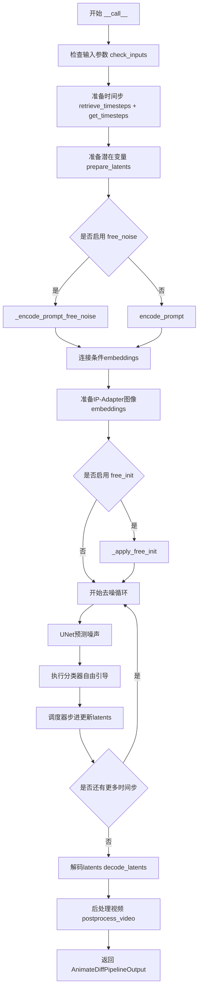

## 类结构

```
DiffusionPipeline (抽象基类)
├── StableDiffusionMixin
├── TextualInversionLoaderMixin
├── IPAdapterMixin
├── StableDiffusionLoraLoaderMixin
├── FreeInitMixin
├── AnimateDiffFreeNoiseMixin
├── FromSingleFileMixin
└── AnimateDiffVideoToVideoPipeline
```

## 全局变量及字段


### `XLA_AVAILABLE`
    
标记XLA是否可用

类型：`bool`
    


### `logger`
    
模块日志记录器

类型：`logging.Logger`
    


### `EXAMPLE_DOC_STRING`
    
示例文档字符串

类型：`str`
    


### `AnimateDiffVideoToVideoPipeline.vae`
    
VAE模型用于编码/解码视频潜在表示

类型：`AutoencoderKL`
    


### `AnimateDiffVideoToVideoPipeline.text_encoder`
    
冻结的文本编码器

类型：`CLIPTextModel`
    


### `AnimateDiffVideoToVideoPipeline.tokenizer`
    
CLIP分词器

类型：`CLIPTokenizer`
    


### `AnimateDiffVideoToVideoPipeline.unet`
    
去噪UNet网络

类型：`UNet2DConditionModel | UNetMotionModel`
    


### `AnimateDiffVideoToVideoPipeline.motion_adapter`
    
运动适配器

类型：`MotionAdapter`
    


### `AnimateDiffVideoToVideoPipeline.scheduler`
    
噪声调度器

类型：`SchedulerMixin`
    


### `AnimateDiffVideoToVideoPipeline.feature_extractor`
    
图像特征提取器

类型：`CLIPImageProcessor`
    


### `AnimateDiffVideoToVideoPipeline.image_encoder`
    
图像编码器

类型：`CLIPVisionModelWithProjection`
    


### `AnimateDiffVideoToVideoPipeline.vae_scale_factor`
    
VAE缩放因子

类型：`int`
    


### `AnimateDiffVideoToVideoPipeline.video_processor`
    
视频处理器

类型：`VideoProcessor`
    


### `AnimateDiffVideoToVideoPipeline.model_cpu_offload_seq`
    
模型CPU卸载顺序

类型：`str`
    


### `AnimateDiffVideoToVideoPipeline._optional_components`
    
可选组件列表

类型：`list`
    


### `AnimateDiffVideoToVideoPipeline._callback_tensor_inputs`
    
回调张量输入列表

类型：`list`
    


### `AnimateDiffVideoToVideoPipeline._guidance_scale`
    
引导比例

类型：`float`
    


### `AnimateDiffVideoToVideoPipeline._clip_skip`
    
CLIP跳过的层数

类型：`int`
    


### `AnimateDiffVideoToVideoPipeline._cross_attention_kwargs`
    
交叉注意力参数

类型：`dict`
    


### `AnimateDiffVideoToVideoPipeline._num_timesteps`
    
时间步数量

类型：`int`
    


### `AnimateDiffVideoToVideoPipeline._interrupt`
    
中断标志

类型：`bool`
    
    

## 全局函数及方法


### `retrieve_latents`

从编码器输出中检索潜在变量，支持多种模式（采样、argmax或直接获取），是连接编码器输出与后续处理的关键函数。

参数：

- `encoder_output`：`torch.Tensor`，编码器的输出结果，通常包含 latent_dist 或 latents 属性
- `generator`：`torch.Generator | None`，可选的随机数生成器，用于采样过程中的随机性控制
- `sample_mode`：`str`，采样模式，默认为 "sample"，可选值为 "sample"（采样）或 "argmax"（取最大概率）

返回值：`torch.Tensor`，检索到的潜在变量张量

#### 流程图

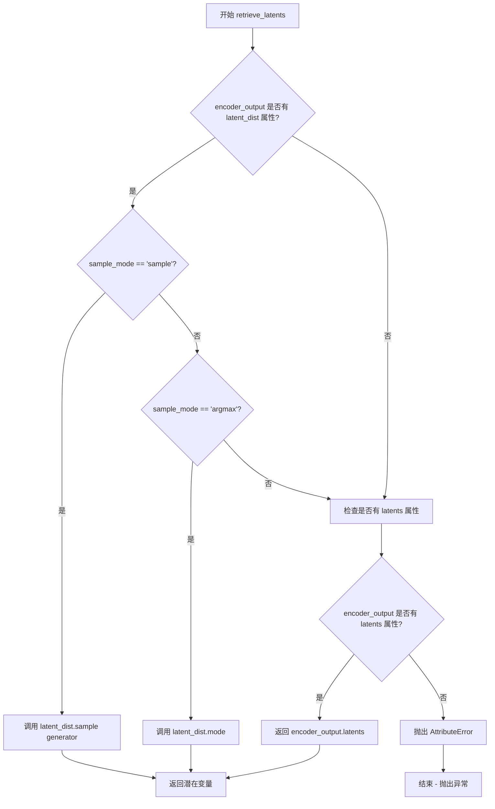

#### 带注释源码

```python
# Copied from diffusers.pipelines.stable_diffusion.pipeline_stable_diffusion_img2img.retrieve_latents
def retrieve_latents(
    encoder_output: torch.Tensor, generator: torch.Generator | None = None, sample_mode: str = "sample"
):
    """
    从编码器输出中检索潜在变量。
    
    该函数支持三种获取潜在变量的方式：
    1. 从 latent_dist 采样（sample 模式）
    2. 从 latent_dist 取最大值对应的分布（argmax 模式）
    3. 直接获取预计算的 latents 属性
    
    Args:
        encoder_output: 编码器的输出，通常是 AutoencoderKL 的 encode 方法返回值
        generator: 可选的随机数生成器，用于采样过程的随机性控制
        sample_mode: 采样模式，'sample' 表示从分布中采样，'argmax' 表示取分布的模式
    
    Returns:
        检索到的潜在变量张量
    
    Raises:
        AttributeError: 当无法从 encoder_output 中获取潜在变量时抛出
    """
    # 检查 encoder_output 是否包含 latent_dist 属性且采样模式为 sample
    if hasattr(encoder_output, "latent_dist") and sample_mode == "sample":
        # 从潜在分布中采样，返回采样结果
        return encoder_output.latent_dist.sample(generator)
    # 检查 encoder_output 是否包含 latent_dist 属性且采样模式为 argmax
    elif hasattr(encoder_output, "latent_dist") and sample_mode == "argmax":
        # 返回潜在分布的众数（即概率最大的值）
        return encoder_output.latent_dist.mode()
    # 检查 encoder_output 是否直接包含 latents 属性
    elif hasattr(encoder_output, "latents"):
        # 直接返回预计算的潜在变量
        return encoder_output.latents
    else:
        # 如果无法通过任何方式获取潜在变量，抛出属性错误
        raise AttributeError("Could not access latents of provided encoder_output")
```


### `retrieve_timesteps`

该函数是 diffusion 流水线中的核心工具函数，用于从调度器（scheduler）获取时间步（timesteps）。它封装了调度器的 `set_timesteps` 方法调用，并支持自定义时间步或 sigmas，提供了统一的接口来处理不同调度器的时间步生成逻辑。

参数：

- `scheduler`：`SchedulerMixin`，调度器实例，用于生成和管理时间步
- `num_inference_steps`：`int | None`，扩散模型推理时的去噪步数，若传入则 `timesteps` 必须为 `None`
- `device`：`str | torch.device | None`，时间步要移动到的目标设备，若为 `None` 则不移动
- `timesteps`：`list[int] | None`，自定义时间步列表，用于覆盖调度器的默认时间步间隔策略
- `sigmas`：`list[float] | None`，自定义 sigmas 列表，用于覆盖调度器的默认 sigma 间隔策略
- `**kwargs`：任意关键字参数，会传递给调度器的 `set_timesteps` 方法

返回值：`tuple[torch.Tensor, int]`，元组第一个元素是调度器生成的时间步张量，第二个元素是实际的推理步数

#### 流程图

```mermaid
flowchart TD
    A[开始] --> B{检查 timesteps 和 sigmas 是否同时传入}
    B -->|是| C[抛出 ValueError: 只能传一个]
    B -->|否| D{检查是否传入 timesteps}
    D -->|是| E{检查 scheduler.set_timesteps 是否接受 timesteps 参数}
    E -->|否| F[抛出 ValueError: 当前调度器不支持自定义时间步]
    E -->|是| G[调用 scheduler.set_timesteps 并传入 timesteps 和 device]
    G --> H[获取 scheduler.timesteps]
    H --> I[计算 num_inference_steps = len(timesteps)]
    D -->|否| J{检查是否传入 sigmas}
    J -->|是| K{检查 scheduler.set_timesteps 是否接受 sigmas 参数}
    K -->|否| L[抛出 ValueError: 当前调度器不支持自定义 sigmas]
    K -->|是| M[调用 scheduler.set_timesteps 并传入 sigmas 和 device]
    M --> N[获取 scheduler.timesteps]
    N --> I
    J -->|否| O[调用 scheduler.set_timesteps 传入 num_inference_steps 和 device]
    O --> P[获取 scheduler.timesteps]
    P --> Q[返回 timesteps 和 num_inference_steps]
    I --> Q
```

#### 带注释源码

```python
# Copied from diffusers.pipelines.stable_diffusion.pipeline_stable_diffusion.retrieve_timesteps
def retrieve_timesteps(
    scheduler,
    num_inference_steps: int | None = None,
    device: str | torch.device | None = None,
    timesteps: list[int] | None = None,
    sigmas: list[float] | None = None,
    **kwargs,
):
    r"""
    Calls the scheduler's `set_timesteps` method and retrieves timesteps from the scheduler after the call. Handles
    custom timesteps. Any kwargs will be supplied to `scheduler.set_timesteps`.

    Args:
        scheduler (`SchedulerMixin`):
            The scheduler to get timesteps from.
        num_inference_steps (`int`):
            The number of diffusion steps used when generating samples with a pre-trained model. If used, `timesteps`
            must be `None`.
        device (`str` or `torch.device`, *optional*):
            The device to which the timesteps should be moved to. If `None`, the timesteps are not moved.
        timesteps (`list[int]`, *optional*):
            Custom timesteps used to override the timestep spacing strategy of the scheduler. If `timesteps` is passed,
            `num_inference_steps` and `sigmas` must be `None`.
        sigmas (`list[float]`, *optional*):
            Custom sigmas used to override the timestep spacing strategy of the scheduler. If `sigmas` is passed,
            `num_inference_steps` and `timesteps` must be `None`.

    Returns:
        `tuple[torch.Tensor, int]`: A tuple where the first element is the timestep schedule from the scheduler and the
        second element is the number of inference steps.
    """
    # 检查用户是否同时传入了 timesteps 和 sigmas，这是不允许的，只能选择其中一种自定义方式
    if timesteps is not None and sigmas is not None:
        raise ValueError("Only one of `timesteps` or `sigmas` can be passed. Please choose one to set custom values")
    
    # 分支1：处理自定义 timesteps 的情况
    if timesteps is not None:
        # 使用 inspect 检查调度器的 set_timesteps 方法是否支持 timesteps 参数
        accepts_timesteps = "timesteps" in set(inspect.signature(scheduler.set_timesteps).parameters.keys())
        if not accepts_timesteps:
            raise ValueError(
                f"The current scheduler class {scheduler.__class__}'s `set_timesteps` does not support custom"
                f" timestep schedules. Please check whether you are using the correct scheduler."
            )
        # 调用调度器的 set_timesteps 方法，传入自定义 timesteps 和设备
        scheduler.set_timesteps(timesteps=timesteps, device=device, **kwargs)
        # 从调度器获取更新后的 timesteps
        timesteps = scheduler.timesteps
        # 计算实际的推理步数
        num_inference_steps = len(timesteps)
    
    # 分支2：处理自定义 sigmas 的情况
    elif sigmas is not None:
        # 检查调度器是否支持 sigmas 参数
        accept_sigmas = "sigmas" in set(inspect.signature(scheduler.set_timesteps).parameters.keys())
        if not accept_sigmas:
            raise ValueError(
                f"The current scheduler class {scheduler.__class__}'s `set_timesteps` does not support custom"
                f" sigmas schedules. Please check whether you are using the correct scheduler."
            )
        # 调用调度器的 set_timesteps 方法，传入自定义 sigmas 和设备
        scheduler.set_timesteps(sigmas=sigmas, device=device, **kwargs)
        # 从调度器获取更新后的 timesteps
        timesteps = scheduler.timesteps
        # 计算实际的推理步数
        num_inference_steps = len(timesteps)
    
    # 分支3：使用默认方式，即通过 num_inference_steps 生成 timesteps
    else:
        scheduler.set_timesteps(num_inference_steps, device=device, **kwargs)
        timesteps = scheduler.timesteps
    
    # 返回 timesteps 和实际的推理步数
    return timesteps, num_inference_steps
```


### AnimateDiffVideoToVideoPipeline.__init__

该方法是 AnimateDiffVideoToVideoPipeline 类的构造函数，负责初始化视频生成管道所需的所有核心组件，包括 VAE、文本编码器、分词器、UNet 模型、运动适配器、调度器以及视频处理器等，并完成模块注册和 VAE 缩放因子的计算。

参数：

- `vae`：`AutoencoderKL`，变分自编码器模型，用于将图像编码和解码到潜在表示空间
- `text_encoder`：`CLIPTextModel`，冻结的文本编码器，用于将文本提示转换为嵌入向量
- `tokenizer`：`CLIPTokenizer`，CLIP 分词器，用于将文本分词为 token ID
- `unet`：`UNet2DConditionModel | UNetMotionModel`，条件 UNet 模型，用于对编码后的视频潜在表示进行去噪
- `motion_adapter`：`MotionAdapter`，运动适配器，与 unet 结合用于去噪编码后的视频潜在表示
- `scheduler`：`DDIMScheduler | PNDMScheduler | LMSDiscreteScheduler | EulerDiscreteScheduler | EulerAncestralDiscreteScheduler | DPMSolverMultistepScheduler`，调度器，用于与 unet 结合对编码后的图像潜在表示进行去噪
- `feature_extractor`：`CLIPImageProcessor`（可选），图像特征提取器，用于 IP-Adapter 功能
- `image_encoder`：`CLIPVisionModelWithProjection`（可选），图像编码器，用于 IP-Adapter 功能

返回值：`None`，构造函数无返回值，通过初始化实例属性来完成管道设置

#### 流程图

```mermaid
flowchart TD
    A[开始 __init__] --> B[调用 super().__init__]
    B --> C{unet 是否为 UNet2DConditionModel}
    C -->|是| D[使用 motion_adapter 创建 UNetMotionModel]
    C -->|否| E[保持 unet 不变]
    D --> F[使用 register_modules 注册所有模块]
    E --> F
    F --> G[计算 vae_scale_factor]
    G --> H[创建 VideoProcessor 实例]
    H --> I[结束 __init__]
```

#### 带注释源码

```python
def __init__(
    self,
    vae: AutoencoderKL,
    text_encoder: CLIPTextModel,
    tokenizer: CLIPTokenizer,
    unet: UNet2DConditionModel | UNetMotionModel,
    motion_adapter: MotionAdapter,
    scheduler: DDIMScheduler
    | PNDMScheduler
    | LMSDiscreteScheduler
    | EulerDiscreteScheduler
    | EulerAncestralDiscreteScheduler
    | DPMSolverMultistepScheduler,
    feature_extractor: CLIPImageProcessor = None,
    image_encoder: CLIPVisionModelWithProjection = None,
):
    # 调用父类 DiffusionPipeline 的初始化方法
    # 继承自多个 Mixin 类：StableDiffusionMixin, TextualInversionLoaderMixin,
    # IPAdapterMixin, StableDiffusionLoraLoaderMixin, FreeInitMixin,
    # AnimateDiffFreeNoiseMixin, FromSingleFileMixin
    super().__init__()
    
    # 如果传入的是基础 UNet2DConditionModel，则使用 MotionAdapter 包装成 UNetMotionModel
    # UNetMotionModel 是支持视频/动画扩散的 UNet 架构
    if isinstance(unet, UNet2DConditionModel):
        unet = UNetMotionModel.from_unet2d(unet, motion_adapter)

    # 将所有模块注册到管道中，便于后续保存/加载和访问
    # 这些模块将通过 self.<module_name> 的方式被访问
    self.register_modules(
        vae=vae,
        text_encoder=text_encoder,
        tokenizer=tokenizer,
        unet=unet,
        motion_adapter=motion_adapter,
        scheduler=scheduler,
        feature_extractor=feature_extractor,
        image_encoder=image_encoder,
    )
    
    # 计算 VAE 的缩放因子，用于潜在空间的缩放
    # 基于 VAE 配置中的 block_out_channels 数量计算
    # 公式: 2^(len(block_out_channels) - 1)，典型值为 8 (2^(3))
    self.vae_scale_factor = 2 ** (len(self.vae.config.block_out_channels) - 1) if getattr(self, "vae", None) else 8
    
    # 创建视频处理器，用于视频的预处理和后处理
    # 包括将 PIL Image/NumPy 数组转换为 VAE 潜在表示等操作
    self.video_processor = VideoProcessor(vae_scale_factor=self.vae_scale_factor)
```


### `AnimateDiffVideoToVideoPipeline.encode_prompt`

该方法负责将文本提示（prompt）编码为文本编码器的隐藏状态（embeddings），支持 LoRA 权重调整、CLIP 层跳过、分类器自由引导（CFG）等功能，是视频到视频生成管道中的关键步骤，用于生成与文本对齐的潜在表示。

参数：

- `prompt`：`str | list[str] | None`，需要编码的文本提示，可以是单个字符串、字符串列表或字典
- `device`：`torch.device`，指定的 PyTorch 设备（如 cuda、cpu）
- `num_images_per_prompt`：`int`，每个提示生成的图像/视频数量，用于批量生成
- `do_classifier_free_guidance`：`bool`，是否启用无分类器自由引导（CFG），影响负面提示的处理
- `negative_prompt`：`str | list[str] | None`，负面提示，用于引导模型避免生成指定内容
- `prompt_embeds`：`torch.Tensor | None`，预生成的文本嵌入，如提供则直接使用，跳过编码流程
- `negative_prompt_embeds`：`torch.Tensor | None`，预生成的负面文本嵌入
- `lora_scale`：`float | None`，LoRA 权重缩放因子，用于调整 LoRA 层的影响强度
- `clip_skip`：`int | None`，CLIP 编码器跳过的层数，用于获取不同层次的表示

返回值：`tuple[torch.Tensor, torch.Tensor]`，返回编码后的提示嵌入和负面提示嵌入元组

#### 流程图

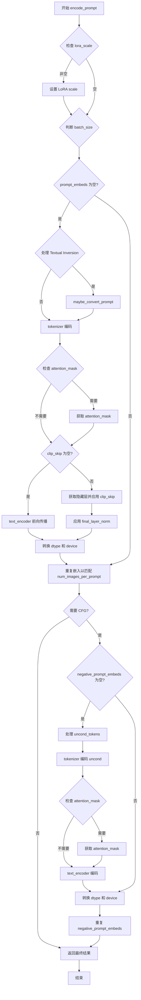

#### 带注释源码

```python
def encode_prompt(
    self,
    prompt,                       # str | list[str] | None: 输入文本提示
    device,                       # torch.device: 计算设备
    num_images_per_prompt,        # int: 每个提示生成的图像数量
    do_classifier_free_guidance,  # bool: 是否启用无分类器引导
    negative_prompt=None,         # str | list[str] | None: 负面提示
    prompt_embeds: torch.Tensor | None = None,   # 预计算的提示嵌入
    negative_prompt_embeds: torch.Tensor | None = None,  # 预计算的负面嵌入
    lora_scale: float | None = None,  # LoRA 权重缩放因子
    clip_skip: int | None = None,     # CLIP 跳过的层数
):
    """
    Encodes the prompt into text encoder hidden states.

    Args:
        prompt: prompt to be encoded
        device: torch device
        num_images_per_prompt: number of images that should be generated per prompt
        do_classifier_free_guidance: whether to use classifier free guidance or not
        negative_prompt: The prompt or prompts not to guide the image generation.
        prompt_embeds: Pre-generated text embeddings.
        negative_prompt_embeds: Pre-generated negative text embeddings.
        lora_scale: A LoRA scale that will be applied to all LoRA layers.
        clip_skip: Number of layers to be skipped from CLIP.
    """
    # 设置 LoRA scale 以便文本编码器的 monkey patched LoRA 函数正确访问
    if lora_scale is not None and isinstance(self, StableDiffusionLoraLoaderMixin):
        self._lora_scale = lora_scale

        # 动态调整 LoRA scale
        if not USE_PEFT_BACKEND:
            adjust_lora_scale_text_encoder(self.text_encoder, lora_scale)
        else:
            scale_lora_layers(self.text_encoder, lora_scale)

    # 确定批处理大小
    if prompt is not None and isinstance(prompt, (str, dict)):
        batch_size = 1
    elif prompt is not None and isinstance(prompt, list):
        batch_size = len(prompt)
    else:
        batch_size = prompt_embeds.shape[0]

    # 如果未提供 prompt_embeds，则需要从 prompt 编码生成
    if prompt_embeds is None:
        # 处理 Textual Inversion 的多向量 token（如有必要）
        if isinstance(self, TextualInversionLoaderMixin):
            prompt = self.maybe_convert_prompt(prompt, self.tokenizer)

        # 使用 tokenizer 将文本转换为 token ID
        text_inputs = self.tokenizer(
            prompt,
            padding="max_length",
            max_length=self.tokenizer.model_max_length,
            truncation=True,
            return_tensors="pt",
        )
        text_input_ids = text_inputs.input_ids
        
        # 获取未截断的 token 序列用于检查
        untruncated_ids = self.tokenizer(prompt, padding="longest", return_tensors="pt").input_ids

        # 检查是否发生截断并记录警告
        if untruncated_ids.shape[-1] >= text_input_ids.shape[-1] and not torch.equal(
            text_input_ids, untruncated_ids
        ):
            removed_text = self.tokenizer.batch_decode(
                untruncated_ids[:, self.tokenizer.model_max_length - 1 : -1]
            )
            logger.warning(
                "The following part of your input was truncated because CLIP can only handle sequences up to"
                f" {self.tokenizer.model_max_length} tokens: {removed_text}"
            )

        # 获取 attention mask（如果文本编码器需要）
        if hasattr(self.text_encoder.config, "use_attention_mask") and self.text_encoder.config.use_attention_mask:
            attention_mask = text_inputs.attention_mask.to(device)
        else:
            attention_mask = None

        # 根据是否 skip CLIP 层进行不同的前向传播
        if clip_skip is None:
            # 标准前向传播：获取最后一层隐藏状态
            prompt_embeds = self.text_encoder(text_input_ids.to(device), attention_mask=attention_mask)
            prompt_embeds = prompt_embeds[0]
        else:
            # 获取所有隐藏层，然后根据 clip_skip 选择特定层
            prompt_embeds = self.text_encoder(
                text_input_ids.to(device), attention_mask=attention_mask, output_hidden_states=True
            )
            # hidden_states 是一个元组，包含所有编码器层的输出
            # index into the tuple to access the hidden states from the desired layer
            prompt_embeds = prompt_embeds[-1][-(clip_skip + 1)]
            # 应用最终的 LayerNorm 以保持表示的一致性
            prompt_embeds = self.text_encoder.text_model.final_layer_norm(prompt_embeds)

    # 确定 prompt_embeds 的 dtype（优先使用文本编码器的 dtype）
    if self.text_encoder is not None:
        prompt_embeds_dtype = self.text_encoder.dtype
    elif self.unet is not None:
        prompt_embeds_dtype = self.unet.dtype
    else:
        prompt_embeds_dtype = prompt_embeds.dtype

    # 将 prompt_embeds 转换到正确的设备和 dtype
    prompt_embeds = prompt_embeds.to(dtype=prompt_embeds_dtype, device=device)

    # 获取形状信息并复制以匹配 num_images_per_prompt
    bs_embed, seq_len, _ = prompt_embeds.shape
    # 复制文本嵌入以支持每个提示生成多个图像
    prompt_embeds = prompt_embeds.repeat(1, num_images_per_prompt, 1)
    prompt_embeds = prompt_embeds.view(bs_embed * num_images_per_prompt, seq_len, -1)

    # 处理分类器自由引导的负面嵌入
    if do_classifier_free_guidance and negative_prompt_embeds is None:
        uncond_tokens: list[str]
        
        # 处理负面提示的类型和批次
        if negative_prompt is None:
            uncond_tokens = [""] * batch_size
        elif prompt is not None and type(prompt) is not type(negative_prompt):
            raise TypeError(
                f"`negative_prompt` should be the same type to `prompt`, but got {type(negative_prompt)} !="
                f" {type(prompt)}."
            )
        elif isinstance(negative_prompt, str):
            uncond_tokens = [negative_prompt]
        elif batch_size != len(negative_prompt):
            raise ValueError(
                f"`negative_prompt`: {negative_prompt} has batch size {len(negative_prompt)}, but `prompt`:"
                f" {prompt} has batch size {batch_size}. Please make sure that passed `negative_prompt` matches"
                " the batch size of `prompt`."
            )
        else:
            uncond_tokens = negative_prompt

        # 处理 Textual Inversion 的多向量 token
        if isinstance(self, TextualInversionLoaderMixin):
            uncond_tokens = self.maybe_convert_prompt(uncond_tokens, self.tokenizer)

        # 获取序列长度
        max_length = prompt_embeds.shape[1]
        
        # Tokenize 负面提示
        uncond_input = self.tokenizer(
            uncond_tokens,
            padding="max_length",
            max_length=max_length,
            truncation=True,
            return_tensors="pt",
        )

        # 获取 attention mask
        if hasattr(self.text_encoder.config, "use_attention_mask") and self.text_encoder.config.use_attention_mask:
            attention_mask = uncond_input.attention_mask.to(device)
        else:
            attention_mask = None

        # 编码负面提示
        negative_prompt_embeds = self.text_encoder(
            uncond_input.input_ids.to(device),
            attention_mask=attention_mask,
        )
        negative_prompt_embeds = negative_prompt_embeds[0]

    # 处理 CFG 模式下的负面嵌入
    if do_classifier_free_guidance:
        # 复制负面嵌入以匹配 num_images_per_prompt
        seq_len = negative_prompt_embeds.shape[1]

        negative_prompt_embeds = negative_prompt_embeds.to(dtype=prompt_embeds_dtype, device=device)

        negative_prompt_embeds = negative_prompt_embeds.repeat(1, num_images_per_prompt, 1)
        negative_prompt_embeds = negative_prompt_embeds.view(batch_size * num_images_per_prompt, seq_len, -1)

    # 如果使用了 LoRA，恢复原始 scale
    if self.text_encoder is not None:
        if isinstance(self, StableDiffusionLoraLoaderMixin) and USE_PEFT_BACKEND:
            # 通过 unscale LoRA 层恢复原始 scale
            unscale_lora_layers(self.text_encoder, lora_scale)

    return prompt_embeds, negative_prompt_embeds
```


### `AnimateDiffVideoToVideoPipeline.encode_image`

该方法负责将输入图像编码为图像嵌入向量，用于图像到视频的生成过程。它支持两种编码模式：当需要隐藏状态时返回条件和无条件图像隐藏状态，否则返回条件和无条件图像嵌入向量。该方法会自动处理非张量输入的转换，并根据 `num_images_per_prompt` 参数复制嵌入向量以支持批量生成。

参数：

- `image`：`PipelineImageInput | torch.Tensor`，待编码的输入图像，可以是 PIL Image、numpy 数组或 torch.Tensor
- `device`：`torch.device`，目标设备，用于将图像张量移动到指定设备
- `num_images_per_prompt`：`int`，每个提示生成的图像数量，用于复制嵌入向量
- `output_hidden_states`：`bool | None`，是否输出隐藏状态，默认为 None

返回值：`tuple[torch.Tensor, torch.Tensor]`，返回两个张量元组。当 `output_hidden_states` 为 True 时返回 (image_enc_hidden_states, uncond_image_enc_hidden_states)，否则返回 (image_embeds, uncond_image_embeds)

#### 流程图

```mermaid
flowchart TD
    A[开始 encode_image] --> B{image 是否为 Tensor}
    B -->|否| C[使用 feature_extractor 提取像素值]
    B -->|是| D[直接使用 image]
    C --> E[将 image 移动到指定 device 和 dtype]
    D --> E
    E --> F{output_hidden_states == True?}
    F -->|是| G[调用 image_encoder 获取隐藏状态]
    F -->|否| H[调用 image_encoder 获取图像嵌入]
    G --> I[提取倒数第二层隐藏状态 hidden_states[-2]]
    H --> J[提取 image_embeds]
    I --> K[repeat_interleave 复制条件隐藏状态]
    J --> L[repeat_interleave 复制图像嵌入]
    K --> M[使用 zeros_like 创建无条件隐藏状态]
    L --> N[使用 zeros_like 创建无条件嵌入]
    M --> O[repeat_interleave 复制无条件隐藏状态]
    N --> P[repeat_interleave 复制无条件嵌入]
    O --> Q[返回 (条件, 无条件) 隐藏状态元组]
    P --> R[返回 (条件, 无条件) 嵌入元组]
    Q --> S[结束]
    R --> S
```

#### 带注释源码

```python
def encode_image(self, image, device, num_images_per_prompt, output_hidden_states=None):
    """
    Encodes the input image into embeddings for image-to-video generation.

    Args:
        image: Input image (PIL Image, numpy array, or torch.Tensor)
        device: Target device for computation
        num_images_per_prompt: Number of images to generate per prompt
        output_hidden_states: Whether to return hidden states instead of embeddings

    Returns:
        Tuple of (condition embeddings, unconditional embeddings)
    """
    # 获取 image_encoder 的参数 dtype，确保输入数据类型一致
    dtype = next(self.image_encoder.parameters()).dtype

    # 如果输入不是张量，使用 feature_extractor 将其转换为张量
    # 这支持 PIL Image、numpy 数组等多种输入格式
    if not isinstance(image, torch.Tensor):
        image = self.feature_extractor(image, return_tensors="pt").pixel_values

    # 将图像移动到目标设备并转换为正确的 dtype
    image = image.to(device=device, dtype=dtype)

    # 根据 output_hidden_states 参数选择不同的编码路径
    if output_hidden_states:
        # 路径1：返回隐藏状态（用于 IP-Adapter 等需要细粒度特征的场景）
        
        # 编码图像获取隐藏状态，取倒数第二层（-2）通常包含更丰富的视觉特征
        image_enc_hidden_states = self.image_encoder(image, output_hidden_states=True).hidden_states[-2]
        
        # 沿 batch 维度复制，以匹配 num_images_per_prompt
        image_enc_hidden_states = image_enc_hidden_states.repeat_interleave(num_images_per_prompt, dim=0)
        
        # 创建零张量作为无条件的图像隐藏状态（用于 classifier-free guidance）
        uncond_image_enc_hidden_states = self.image_encoder(
            torch.zeros_like(image), output_hidden_states=True
        ).hidden_states[-2]
        uncond_image_enc_hidden_states = uncond_image_enc_hidden_states.repeat_interleave(
            num_images_per_prompt, dim=0
        )
        
        # 返回条件和无条件的隐藏状态
        return image_enc_hidden_states, uncond_image_enc_hidden_states
    else:
        # 路径2：返回图像嵌入向量（更简洁的表示）
        
        # 直接获取图像嵌入
        image_embeds = self.image_encoder(image).image_embeds
        
        # 复制嵌入以匹配生成的图像数量
        image_embeds = image_embeds.repeat_interleave(num_images_per_prompt, dim=0)
        
        # 创建零嵌入作为无条件图像嵌入
        uncond_image_embeds = torch.zeros_like(image_embeds)

        # 返回条件和无条件嵌入
        return image_embeds, uncond_image_embeds
```


### `AnimateDiffVideoToVideoPipeline.prepare_ip_adapter_image_embeds`

该方法负责为IP-Adapter准备图像嵌入向量，处理输入图像或预计算嵌入，生成适配于UNet结构的图像条件嵌入，并支持分类器自由引导（CFG）模式下的正负嵌入处理。

参数：

- `self`：类实例本身，包含pipeline的所有组件
- `ip_adapter_image`：`PipelineImageInput | None`，要处理的输入图像，用于从图像编码器生成嵌入
- `ip_adapter_image_embeds`：`list[torch.Tensor] | None`，预计算的图像嵌入列表，与IP-Adapter一一对应
- `device`：`torch.device`，目标计算设备
- `num_images_per_prompt`：`int`，每个提示词生成的图像数量
- `do_classifier_free_guidance`：`bool`，是否启用分类器自由引导

返回值：`list[torch.Tensor]`：处理后的图像嵌入列表，每个元素为拼接了正负嵌入的张量

#### 流程图

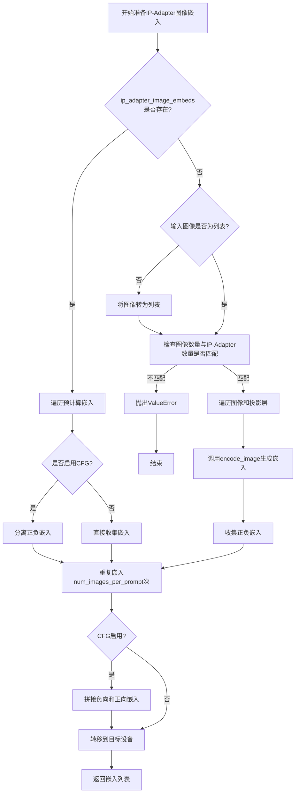

#### 带注释源码

```python
def prepare_ip_adapter_image_embeds(
    self,
    ip_adapter_image,                              # 输入图像或图像列表
    ip_adapter_image_embeds,                       # 预计算的嵌入或None
    device,                                         # 目标设备
    num_images_per_prompt,                         # 每个提示的图像数量
    do_classifier_free_guidance                    # 是否启用分类器自由引导
):
    """
    为IP-Adapter准备图像嵌入。
    
    该方法处理两种输入模式：
    1. 直接提供图像 - 需要通过encode_image编码
    2. 提供预计算的嵌入 - 直接使用
    
    支持分类器自由引导模式，此时会生成负向嵌入。
    """
    
    # 初始化嵌入列表
    image_embeds = []
    
    # 如果启用CFG，同时准备负向嵌入
    if do_classifier_free_guidance:
        negative_image_embeds = []
    
    # 情况1：未提供预计算嵌入，需要从图像编码
    if ip_adapter_image_embeds is None:
        
        # 标准化输入为列表格式
        if not isinstance(ip_adapter_image, list):
            ip_adapter_image = [ip_adapter_image]
        
        # 验证图像数量与IP-Adapter数量匹配
        if len(ip_adapter_image) != len(self.unet.encoder_hid_proj.image_projection_layers):
            raise ValueError(
                f"`ip_adapter_image` must have same length as the number of IP Adapters. "
                f"Got {len(ip_adapter_image)} images and "
                f"{len(self.unet.encoder_hid_proj.image_projection_layers)} IP Adapters."
            )
        
        # 遍历每个IP-Adapter对应的图像和投影层
        for single_ip_adapter_image, image_proj_layer in zip(
            ip_adapter_image, 
            self.unet.encoder_hid_proj.image_projection_layers
        ):
            # 判断是否需要输出隐藏状态（ImageProjection类型不需要）
            output_hidden_state = not isinstance(image_proj_layer, ImageProjection)
            
            # 调用encode_image方法编码图像
            single_image_embeds, single_negative_image_embeds = self.encode_image(
                single_ip_adapter_image, 
                device, 
                1,  # 每个图像生成1个嵌入
                output_hidden_state
            )
            
            # 添加批次维度并收集
            image_embeds.append(single_image_embeds[None, :])
            
            # 如果启用CFG，同时收集负向嵌入
            if do_classifier_free_guidance:
                negative_image_embeds.append(single_negative_image_embeds[None, :])
    
    # 情况2：已提供预计算嵌入
    else:
        for single_image_embeds in ip_adapter_image_embeds:
            if do_classifier_free_guidance:
                # 预计算嵌入通常已包含正负对，按chunk(2)分离
                single_negative_image_embeds, single_image_embeds = single_image_embeds.chunk(2)
                negative_image_embeds.append(single_negative_image_embeds)
            image_embeds.append(single_image_embeds)
    
    # 后处理：将嵌入扩展到num_images_per_prompt并拼接
    ip_adapter_image_embeds = []
    for i, single_image_embeds in enumerate(image_embeds):
        # 重复嵌入以匹配生成的图像数量
        single_image_embeds = torch.cat([single_image_embeds] * num_images_per_prompt, dim=0)
        
        if do_classifier_free_guidance:
            # 对负向嵌入做同样处理
            single_negative_image_embeds = torch.cat(
                [negative_image_embeds[i]] * num_images_per_prompt, 
                dim=0
            )
            # 拼接负向和正向嵌入 [负向, 正向]
            single_image_embeds = torch.cat(
                [single_negative_image_embeds, single_image_embeds], 
                dim=0
            )
        
        # 转移到目标设备
        single_image_embeds = single_image_embeds.to(device=device)
        ip_adapter_image_embeds.append(single_image_embeds)
    
    return ip_adapter_image_embeds
```


### `AnimateDiffVideoToVideoPipeline.encode_video`

该方法负责将输入的视频帧编码为潜在表示（latent representation）。它通过分块处理视频帧，使用VAE（变分自编码器）对每个块进行编码，然后将所有块的潜在表示拼接成最终的潜在张量返回。

参数：

- `self`：`AnimateDiffVideoToVideoPipeline`，Pipeline实例本身
- `video`：`torch.Tensor`，输入的视频帧数据，通常为4D张量（批次，高度，宽度，通道）或5D张量（批次，帧数，高度，宽度，通道）
- `generator`：`torch.Generator | None`，可选的随机数生成器，用于确保生成的可重复性
- `decode_chunk_size`：`int`，分块处理的大小，默认为16，表示每次处理16帧

返回值：`torch.Tensor`，编码后的视频潜在表示，包含从VAE编码器提取的潜在特征

#### 流程图

```mermaid
flowchart TD
    A[开始 encode_video] --> B[初始化空列表 latents]
    B --> C{遍历视频帧}
    C -->|i 从 0 到 len video| D[切片当前块: video[i:i+decode_chunk_size]]
    D --> E[VAE.encode 编码当前视频块]
    E --> F[retrieve_latents 提取潜在表示]
    F --> G[将潜在表示添加到 latents 列表]
    G --> C
    C -->|遍历结束| H[torch.cat 拼接所有潜在表示]
    H --> I[返回最终潜在张量]
```

#### 带注释源码

```python
def encode_video(self, video, generator, decode_chunk_size: int = 16) -> torch.Tensor:
    """
    将输入视频编码为潜在表示（latent representation）。
    
    该方法通过分块处理视频帧，使用VAE对每个块进行编码，
    然后将所有块的潜在表示拼接成最终的潜在张量。
    
    Args:
        video: 输入的视频帧数据，类型为 torch.Tensor
        generator: 可选的随机数生成器，用于控制采样随机性
        decode_chunk_size: 分块处理的大小，默认为16帧
    
    Returns:
        torch.Tensor: 编码后的视频潜在表示
    """
    # 初始化一个空列表用于存储每一块的潜在表示
    latents = []
    
    # 以 decode_chunk_size 为步长遍历整个视频
    for i in range(0, len(video), decode_chunk_size):
        # 切片获取当前块的视频帧
        batch_video = video[i : i + decode_chunk_size]
        
        # 使用 VAE 编码当前视频块，得到编码器输出
        # 然后通过 retrieve_latents 函数提取潜在表示
        # retrieve_latents 会根据编码器输出类型选择合适的采样方式
        batch_video = retrieve_latents(self.vae.encode(batch_video), generator=generator)
        
        # 将当前块的潜在表示添加到列表中
        latents.append(batch_video)
    
    # 将所有块的潜在表示沿第一维度拼接
    return torch.cat(latents)
```


### `AnimateDiffVideoToVideoPipeline.decode_latents`

该方法负责将VAE的潜在表示（latents）解码为实际的视频帧。它首先对latents进行缩放处理，然后通过VAE的解码器逐步将latents转换回像素空间，最后将解码后的片段重新组织成完整的视频 tensor。

参数：

- `self`：类的实例引用
- `latents`：`torch.Tensor`，输入的VAE潜在表示，形状为 (batch_size, channels, num_frames, height, width)
- `decode_chunk_size`：`int`，每次解码的帧数量，默认为16，用于控制内存使用

返回值：`torch.Tensor`，解码后的视频张量，形状为 (batch_size, channels, num_frames, height, width)

#### 流程图

```mermaid
flowchart TD
    A[开始 decode_latents] --> B[缩放 latents: latents = 1/scaling_factor * latents]
    B --> C[获取形状: batch_size, channels, num_frames, height, width]
    C --> D[重排列维度: permute and reshape to (batch_size*num_frames, channels, height, width)]
    D --> E{是否还有未处理的 latents 片段?}
    E -->|Yes| F[取出一个片段: batch_latents]
    F --> G[VAE decode: self.vae.decode(batch_latents).sample]
    G --> H[添加到 video 列表]
    H --> E
    E -->|No| I[拼接所有片段: torch.cat(video)]
    I --> J[重塑为 5D tensor 并调整维度顺序]
    J --> K[转换为 float32 类型]
    K --> L[返回解码后的视频]
```

#### 带注释源码

```python
def decode_latents(self, latents, decode_chunk_size: int = 16):
    """
    将 VAE 潜在表示解码为视频帧。

    参数:
        latents: 输入的潜在表示，形状为 (batch_size, channels, num_frames, height, width)
        decode_chunk_size: 每次解码的帧数，用于控制内存使用

    返回:
        解码后的视频张量，形状为 (batch_size, channels, num_frames, height, width)
    """
    # 第一步：缩放 latents
    # VAE 在编码时会乘以 scaling_factor，这里需要除以它来还原
    latents = 1 / self.vae.config.scaling_factor * latents

    # 第二步：获取输入张量的形状信息
    batch_size, channels, num_frames, height, width = latents.shape

    # 第三步：重排列和 reshape
    # 从 (B, C, F, H, W) 转换为 (B*F, C, H, W)
    # 这样做是为了将时间维度与批次维度合并，便于批量解码
    latents = latents.permute(0, 2, 1, 3, 4).reshape(batch_size * num_frames, channels, height, width)

    # 第四步：分块解码
    # 使用分块解码可以避免一次性解码所有帧导致的内存问题
    video = []
    for i in range(0, latents.shape[0], decode_chunk_size):
        # 取出当前块的 latents
        batch_latents = latents[i : i + decode_chunk_size]
        # 通过 VAE 解码器将潜在表示转换为图像/帧
        batch_latents = self.vae.decode(batch_latents).sample
        # 将解码结果添加到列表中
        video.append(batch_latents)

    # 第五步：合并所有解码后的帧
    video = torch.cat(video)

    # 第六步：重新组织张量形状
    # 从 (B*F, C, H, W) 转换回 (B, C, F, H, W)
    video = video[None, :].reshape((batch_size, num_frames, -1) + video.shape[2:]).permute(0, 2, 1, 3, 4)

    # 第七步：转换为 float32
    # 这样不会导致显著的性能开销，同时与 bfloat16 兼容
    video = video.float()
    
    return video
```


### `AnimateDiffVideoToVideoPipeline.prepare_extra_step_kwargs`

该方法用于准备调度器（scheduler）的额外参数。由于不同的调度器具有不同的签名（如 DDIMScheduler 使用 `eta` 参数，而其他调度器可能不支持），该方法通过检查调度器的 `step` 方法签名，动态构建需要传递给调度器的额外关键字参数字典。

参数：

- `generator`：`torch.Generator | list[torch.Generator] | None`，用于控制随机数生成以实现可重复的采样过程
- `eta`：`float`，DDIM 调度器的参数 η，对应 DDIM 论文中的 η 值，应在 [0, 1] 范围内

返回值：`dict[str, Any]`，包含需要传递给调度器 `step` 方法的额外关键字参数（如 `eta` 和/或 `generator`）

#### 流程图

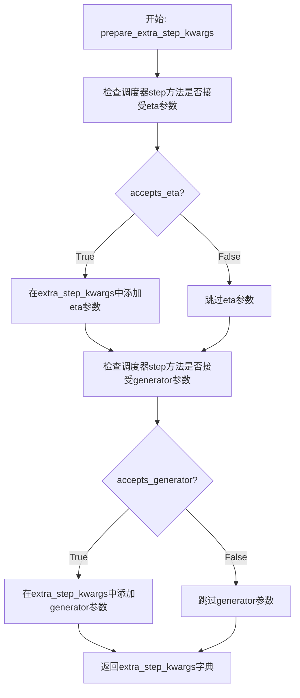

#### 带注释源码

```python
def prepare_extra_step_kwargs(self, generator, eta):
    # 准备调度器步骤的额外参数，因为并非所有调度器都具有相同的签名
    # eta (η) 仅在 DDIMScheduler 中使用，其他调度器将忽略该参数
    # eta 对应 DDIM 论文 (https://huggingface.co/papers/2010.02502) 中的 η
    # 取值应在 [0, 1] 范围内

    # 使用 inspect 模块检查调度器的 step 方法是否接受 eta 参数
    accepts_eta = "eta" in set(inspect.signature(self.scheduler.step).parameters.keys())
    
    # 初始化空字典用于存储额外参数
    extra_step_kwargs = {}
    
    # 如果调度器接受 eta 参数，则将其添加到 extra_step_kwargs 中
    if accepts_eta:
        extra_step_kwargs["eta"] = eta

    # 检查调度器是否接受 generator 参数
    accepts_generator = "generator" in set(inspect.signature(self.scheduler.step).parameters.keys())
    
    # 如果调度器接受 generator 参数，则将其添加到 extra_step_kwargs 中
    if accepts_generator:
        extra_step_kwargs["generator"] = generator
    
    # 返回包含调度器额外参数的字典
    return extra_step_kwargs
```


### `AnimateDiffVideoToVideoPipeline.check_inputs`

该方法负责验证视频到视频生成管道的所有输入参数，确保参数类型、值范围和组合方式符合要求，若验证失败则抛出相应的 `ValueError` 异常。

参数：

- `self`：隐式参数，管道实例本身
- `prompt`：`str | list[str] | dict | None`，用于引导图像生成的文本提示词，支持字符串、字符串列表或字典格式
- `strength`：`float`，控制生成结果与原始视频之间的差异程度，必须在 [0.0, 1.0] 范围内
- `height`：`int`，生成视频的高度（像素），必须是 8 的倍数
- `width`：`int`，生成视频的宽度（像素），必须是 8 的倍数
- `video`：`list[list[PipelineImageInput]] | None`，输入视频帧列表，用于条件生成
- `latents`：`torch.Tensor | None`，预生成的潜在变量张量，用于跳过视频编码直接进行去噪
- `negative_prompt`：`str | list[str] | None`，用于引导不包含内容的负面提示词
- `prompt_embeds`：`torch.Tensor | None`，预生成的文本嵌入向量，用于避免重复编码
- `negative_prompt_embeds`：`torch.Tensor | None`，预生成的负面文本嵌入向量
- `ip_adapter_image`：`PipelineImageInput | None`，IP 适配器的可选图像输入
- `ip_adapter_image_embeds`：`list[torch.Tensor] | None`，预生成的 IP 适配器图像嵌入列表
- `callback_on_step_end_tensor_inputs`：`list[str] | None`，在每个去噪步骤结束时回调的 tensor 输入名称列表

返回值：`None`，该方法仅执行验证逻辑，不返回任何值

#### 流程图

```mermaid
flowchart TD
    A[开始 check_inputs] --> B{strength 是否在 [0, 1] 范围内}
    B -->|否| B1[抛出 ValueError: strength 超出范围]
    B -->|是| C{height 和 width 是否能被 8 整除}
    C -->|否| C1[抛出 ValueError: height 或 width 未对齐]
    C -->|是| D{callback_on_step_end_tensor_inputs 是否有效}
    D -->|否| D1[抛出 ValueError: 无效的 tensor 输入]
    D -->|是| E{prompt 和 prompt_embeds 是否同时提供}
    E -->|是| E1[抛出 ValueError: 不能同时提供]
    E -->|否| F{prompt 和 prompt_embeds 是否都未提供}
    F -->|是| F1[抛出 ValueError: 至少需提供一个]
    F -->|否| G{prompt 类型是否有效}
    G -->|否| G1[抛出 ValueError: 无效的 prompt 类型]
    G -->|是| H{negative_prompt 和 negative_prompt_embeds 是否同时提供}
    H -->|是| H1[抛出 ValueError: 不能同时提供]
    H -->|否| I{prompt_embeds 和 negative_prompt_embeds 形状是否一致}
    I -->|否| I1[抛出 ValueError: 嵌入形状不匹配]
    I -->|是| J{video 和 latents 是否同时提供}
    J -->|是| J1[抛出 ValueError: 只能提供一个]
    J -->|否| K{ip_adapter_image 和 ip_adapter_image_embeds 是否同时提供}
    K -->|是| K1[抛出 ValueError: 不能同时提供]
    K -->|否| L{ip_adapter_image_embeds 类型和维度是否有效}
    L -->|否| L1[抛出 ValueError: 无效的嵌入类型或维度]
    L -->|是| M[验证通过，方法结束]
    
    B1 --> M
    C1 --> M
    D1 --> M
    E1 --> M
    F1 --> M
    G1 --> M
    H1 --> M
    I1 --> M
    J1 --> M
    K1 --> M
    L1 --> M
```

#### 带注释源码

```python
def check_inputs(
    self,
    prompt,
    strength,
    height,
    width,
    video=None,
    latents=None,
    negative_prompt=None,
    prompt_embeds=None,
    negative_prompt_embeds=None,
    ip_adapter_image=None,
    ip_adapter_image_embeds=None,
    callback_on_step_end_tensor_inputs=None,
):
    # 验证 strength 参数必须在 [0.0, 1.0] 范围内
    if strength < 0 or strength > 1:
        raise ValueError(f"The value of strength should in [0.0, 1.0] but is {strength}")

    # 验证 height 和 width 必须是 8 的倍数（VAE 的下采样因子要求）
    if height % 8 != 0 or width % 8 != 0:
        raise ValueError(f"`height` and `width` have to be divisible by 8 but are {height} and {width}.")

    # 验证回调函数 tensor 输入必须在允许列表中
    if callback_on_step_end_tensor_inputs is not None and not all(
        k in self._callback_tensor_inputs for k in callback_on_step_end_tensor_inputs
    ):
        raise ValueError(
            f"`callback_on_step_end_tensor_inputs` has to be in {self._callback_tensor_inputs}, but found {[k for k in callback_on_step_end_tensor_inputs if k not in self._callback_tensor_inputs]}"
        )

    # 验证 prompt 和 prompt_embeds 不能同时提供（互斥）
    if prompt is not None and prompt_embeds is not None:
        raise ValueError(
            f"Cannot forward both `prompt`: {prompt} and `prompt_embeds`: {prompt_embeds}. Please make sure to"
            " only forward one of the two."
        )
    # 验证 prompt 和 prompt_embeds 至少提供一个
    elif prompt is None and prompt_embeds is None:
        raise ValueError(
            "Provide either `prompt` or `prompt_embeds`. Cannot leave both `prompt` and `prompt_embeds` undefined."
        )
    # 验证 prompt 类型必须是 str、list 或 dict 之一
    elif prompt is not None and not isinstance(prompt, (str, list, dict)):
        raise ValueError(f"`prompt` has to be of type `str`, `list` or `dict` but is {type(prompt)}")

    # 验证 negative_prompt 和 negative_prompt_embeds 不能同时提供
    if negative_prompt is not None and negative_prompt_embeds is not None:
        raise ValueError(
            f"Cannot forward both `negative_prompt`: {negative_prompt} and `negative_prompt_embeds`:"
            f" {negative_prompt_embeds}. Please make sure to only forward one of the two."
        )

    # 验证 prompt_embeds 和 negative_prompt_embeds 形状一致性
    if prompt_embeds is not None and negative_prompt_embeds is not None:
        if prompt_embeds.shape != negative_prompt_embeds.shape:
            raise ValueError(
                "`prompt_embeds` and `negative_prompt_embeds` must have the same shape when passed directly, but"
                f" got: `prompt_embeds` {prompt_embeds.shape} != `negative_prompt_embeds`"
                f" {negative_prompt_embeds.shape}."
            )

    # 验证 video 和 latents 不能同时提供（只能选一个作为输入）
    if video is not None and latents is not None:
        raise ValueError("Only one of `video` or `latents` should be provided")

    # 验证 ip_adapter_image 和 ip_adapter_image_embeds 不能同时提供
    if ip_adapter_image is not None and ip_adapter_image_embeds is not None:
        raise ValueError(
            "Provide either `ip_adapter_image` or `ip_adapter_image_embeds`. Cannot leave both `ip_adapter_image` and `ip_adapter_image_embeds` defined."
        )

    # 验证 ip_adapter_image_embeds 类型必须是 list
    if ip_adapter_image_embeds is not None:
        if not isinstance(ip_adapter_image_embeds, list):
            raise ValueError(
                f"`ip_adapter_image_embeds` has to be of type `list` but is {type(ip_adapter_image_embeds)}"
            )
        # 验证嵌入维度必须是 3D 或 4D 张量
        elif ip_adapter_image_embeds[0].ndim not in [3, 4]:
            raise ValueError(
                f"`ip_adapter_image_embeds` has to be a list of 3D or 4D tensors but is {ip_adapter_image_embeds[0].ndim}D"
            )
```


### `AnimateDiffVideoToVideoPipeline.get_timesteps`

该方法根据 `strength` 参数调整推理时间步，用于控制视频到视频转换中原始帧与生成帧之间的差异程度。通过计算初始时间步和起始索引，实现对时间步序列的裁剪，从而控制去噪过程的起始点。

参数：

- `num_inference_steps`：`int`，总推理步数，表示去噪过程需要执行的步数
- `timesteps`：`torch.Tensor`，_scheduler 生成的时间步序列，通常为降序排列
- `strength`：`float`，强度值，范围 [0, 1]，值越大表示与原始视频差异越大
- `device`：`torch.device`，计算设备，用于确定张量存放位置

返回值：`tuple[torch.Tensor, int]`，返回元组，第一个元素为调整后的时间步序列，第二个元素为调整后的推理步数

#### 流程图

```mermaid
flowchart TD
    A[开始] --> B[计算 init_timestep<br/>min(num_inference_steps × strength<br/>num_inference_steps)]
    B --> C[计算 t_start<br/>max(num_inference_steps - init_timestep<br/>0)]
    C --> D[裁剪时间步<br/>timesteps[t_start × scheduler.order:]]
    D --> E[返回调整后的时间步<br/>和推理步数]
    
    B -->|strength=1.0| F[init_timestep = num_inference_steps]
    B -->|strength=0.0| G[init_timestep = 0]
    F --> C
    G --> C
```

#### 带注释源码

```python
def get_timesteps(self, num_inference_steps, timesteps, strength, device):
    # 根据 strength 计算实际使用的初始时间步数
    # strength 越高，init_timestep 越大，意味着去噪从更早的时间步开始
    # 最终生成的视频与原始视频差异更大
    init_timestep = min(int(num_inference_steps * strength), num_inference_steps)

    # 计算跳过的起始索引
    # 从完整的推理步数中减去初始时间步，得到需要跳过的步数
    t_start = max(num_inference_steps - init_timestep, 0)

    # 根据 scheduler 的 order 属性调整时间步序列
    # 对于多步采样器（如 DDIM），需要按 order 倍数进行索引
    # 确保时间步与采样器的内部状态对齐
    timesteps = timesteps[t_start * self.scheduler.order :]

    # 返回调整后的时间步和新的推理步数
    # 新的推理步数反映了实际需要执行的降噪步数
    return timesteps, num_inference_steps - t_start
```


### `AnimateDiffVideoToVideoPipeline.prepare_latents`

该方法用于为视频到视频生成准备潜在向量（latents）。它负责编码输入视频为潜在表示，或者使用预提供的潜在向量，并根据调度器添加噪声以支持去噪过程。

参数：

- `video`：`torch.Tensor | None`，输入视频张量，用于编码为潜在向量。如果 `latents` 已提供则可为空
- `height`：`int = 64`，生成视频的高度（像素）
- `width`：`int = 64`，生成视频的宽度（像素）
- `num_channels_latents`：`int = 4`，潜在向量的通道数
- `batch_size`：`int = 1`，批处理大小
- `timestep`：`int | None`，当前的时间步，用于噪声调度
- `dtype`：`torch.dtype | None`，潜在向量的数据类型
- `device`：`torch.device | None`，潜在向量所在的设备
- `generator`：`torch.Generator | list[torch.Generator] | None`，随机数生成器，用于确保可重复性
- `latents`：`torch.Tensor | None`，预提供的潜在向量，如果为 None 则从视频编码生成
- `decode_chunk_size`：`int = 16`，每次编码视频的帧数
- `add_noise`：`bool = False`，是否向现有潜在向量添加噪声

返回值：`torch.Tensor`，准备好的潜在向量，形状为 `(batch_size, num_channels_latents, num_frames, height/vae_scale_factor, width/vae_scale_factor)`

#### 流程图

```mermaid
flowchart TD
    A[开始 prepare_latents] --> B{latents 是否为 None?}
    
    B -->|是| C[计算 num_frames 和 shape]
    B -->|否| D{shape 与 latents.shape 是否匹配?}
    
    C --> E{generator 是列表吗?}
    E -->|是且长度不匹配 batch_size| F[抛出 ValueError]
    E -->|是且长度匹配| G[逐个编码视频帧]
    E -->|否| H[批量编码视频]
    
    G --> I[编码每个视频片段]
    H --> I
    I --> J[拼接所有编码结果]
    J --> K{需要强制上转 VAE?}
    K -->|是| L[将视频转为 float32]
    L --> M[VAE 转为 float32]
    K -->|否| N[跳过上转]
    
    M --> O[VAE 恢复原始 dtype]
    N --> O
    
    O --> P[缩放潜在向量]
    P --> Q{batch_size > init_latents.shape[0]?}
    Q -->|是且能整除| R[扩展 init_latents]
    Q -->|是且不能整除| S[抛出 ValueError]
    Q -->|否| T[保持不变]
    
    R --> U
    T --> U
    
    U --> V[生成随机噪声]
    V --> W[调度器添加噪声]
    W --> X[置换维度顺序]
    X --> Y[返回 latents]
    
    D -->|匹配| Z[转换 latents 设备与 dtype]
    Z --> AA{add_noise 为真?]
    AA -->|是| V
    AA -->|否| Y
    
    F --> BB[结束 - 抛出异常]
    S --> BB
```

#### 带注释源码

```python
def prepare_latents(
    self,
    video: torch.Tensor | None = None,
    height: int = 64,
    width: int = 64,
    num_channels_latents: int = 4,
    batch_size: int = 1,
    timestep: int | None = None,
    dtype: torch.dtype | None = None,
    device: torch.device | None = None,
    generator: torch.Generator | list[torch.Generator] | None = None,
    latents: torch.Tensor | None = None,
    decode_chunk_size: int = 16,
    add_noise: bool = False,
) -> torch.Tensor:
    """
    准备视频生成的潜在向量。
    
    如果未提供 latents，则从输入视频编码生成；
    如果提供了 latents，则直接使用并可选择添加噪声。
    
    参数:
        video: 输入视频张量 [B, F, C, H, W]
        height: 输出高度
        width: 输出宽度
        num_channels_latents: 潜在向量通道数
        batch_size: 批处理大小
        timestep: 当前时间步
        dtype: 潜在向量数据类型
        device: 潜在向量设备
        generator: 随机生成器
        latents: 预提供潜在向量
        decode_chunk_size: 编码块大小
        add_noise: 是否添加噪声
    """
    # 确定帧数：如果没有提供 latents，则从视频获取，否则从 latents 获取
    num_frames = video.shape[1] if latents is None else latents.shape[2]
    
    # 构建潜在向量目标形状 [B, C, F, H/vae_scale, W/vae_scale]
    shape = (
        batch_size,
        num_channels_latents,
        num_frames,
        height // self.vae_scale_factor,
        width // self.vae_scale_factor,
    )

    # 验证生成器列表长度与批处理大小匹配
    if isinstance(generator, list) and len(generator) != batch_size:
        raise ValueError(
            f"You have passed a list of generators of length {len(generator)}, but requested an effective batch"
            f" size of {batch_size}. Make sure the batch size matches the length of the generators."
        )

    # 如果未提供 latents，则从视频编码生成
    if latents is None:
        # 确保 VAE 使用 float32 模式以避免 float16 溢出
        if self.vae.config.force_upcast:
            video = video.float()
            self.vae.to(dtype=torch.float32)

        # 根据生成器类型分别编码视频
        if isinstance(generator, list):
            # 列表生成器：为每个样本使用对应生成器
            init_latents = [
                self.encode_video(video[i], generator[i], decode_chunk_size).unsqueeze(0)
                for i in range(batch_size)
            ]
        else:
            # 单个生成器：编码所有视频
            init_latents = [self.encode_video(vid, generator, decode_chunk_size).unsqueeze(0) for vid in video]

        # 拼接所有编码结果
        init_latents = torch.cat(init_latents, dim=0)

        # 恢复 VAE 到原始数据类型
        if self.vae.config.force_upcast:
            self.vae.to(dtype)

        # 转换数据类型并应用 VAE 缩放因子
        init_latents = init_latents.to(dtype)
        init_latents = self.vae.config.scaling_factor * init_latents

        # 处理批处理大小扩展情况
        if batch_size > init_latents.shape[0] and batch_size % init_latents.shape[0] == 0:
            # 可以整除：扩展 init_latents
            error_message = (
                f"You have passed {batch_size} text prompts (`prompt`), but only {init_latents.shape[0]} initial"
                " images (`image`). Please make sure to update your script to pass as many initial images as text prompts"
            )
            raise ValueError(error_message)
        elif batch_size > init_latents.shape[0] and batch_size % init_latents.shape[0] != 0:
            # 不能整除：抛出错误
            raise ValueError(
                f"Cannot duplicate `image` of batch size {init_latents.shape[0]} to {batch_size} text prompts."
            )
        else:
            init_latents = torch.cat([init_latents], dim=0)

        # 生成随机噪声并通过调度器添加到初始潜在向量
        noise = randn_tensor(init_latents.shape, generator=generator, device=device, dtype=dtype)
        latents = self.scheduler.add_noise(init_latents, noise, timestep).permute(0, 2, 1, 3, 4)
    else:
        # 已有 latents：验证形状是否匹配
        if shape != latents.shape:
            # [B, C, F, H, W]
            raise ValueError(f"`latents` expected to have {shape=}, but found {latents.shape=}")

        # 转换到指定设备和数据类型
        latents = latents.to(device, dtype=dtype)

        # 可选：添加噪声
        if add_noise:
            noise = randn_tensor(shape, generator=generator, device=device, dtype=dtype)
            latents = self.scheduler.add_noise(latents, noise, timestep)

    return latents
```


### `AnimateDiffVideoToVideoPipeline.__call__`

该方法是AnimateDiffVideoToVideoPipeline的核心调用方法，负责执行视频到视频（Video-to-Video）的生成任务。它接收原始视频、文本提示词等条件信息，通过去噪循环逐步将原始视频的潜在表示转换为目标风格的视频。

参数：

- `video`：`list[list[PipelineImageInput]]`，输入视频，用于调节生成过程，必须是视频的图像/帧列表
- `prompt`：`str | list[str] | None`，引导图像生成的提示词，如未定义需传递`prompt_embeds`
- `height`：`int | None`，生成视频的高度像素，默认为`self.unet.config.sample_size * self.vae_scale_factor`
- `width`：`int | None`，生成视频的宽度像素，默认为`self.unet.config.sample_size * self.vae_scale_factor`
- `num_inference_steps`：`int`，去噪步数，默认为50，步数越多通常质量越高但推理越慢
- `enforce_inference_steps`：`bool`，是否强制推理步数
- `timesteps`：`list[int] | None`，自定义时间步，用于支持`timesteps`参数的调度器
- `sigmas`：`list[float] | None`，自定义sigma值，用于支持`sigmas`参数的调度器
- `strength`：`float`，生成视频与原始视频的差异程度，默认为0.8，值越大差异越大
- `guidance_scale`：`float`，引导比例，默认为7.5，用于分类器自由引导
- `negative_prompt`：`str | list[str] | None`，负面提示词，指导生成时不包含的内容
- `num_videos_per_prompt`：`int | None`，每个提示词生成的视频数量
- `eta`：`float`，DDIM论文中的eta参数，仅适用于DDIMScheduler
- `generator`：`torch.Generator | list[torch.Generator] | None`，用于生成确定性结果的随机生成器
- `latents`：`torch.Tensor | None`，预生成的噪声潜在表示
- `prompt_embeds`：`torch.Tensor | None`，预生成的文本嵌入
- `negative_prompt_embeds`：`torch.Tensor | None`，预生成的负面文本嵌入
- `ip_adapter_image`：`PipelineImageInput | None`，IP适配器的可选图像输入
- `ip_adapter_image_embeds`：`list[torch.Tensor] | None`，IP适配器的预生成图像嵌入
- `output_type`：`str | None`，输出格式，默认为"pil"，可选torch.Tensor、PIL.Image或np.array
- `return_dict`：`bool`，是否返回AnimateDiffPipelineOutput，默认为True
- `cross_attention_kwargs`：`dict[str, Any] | None`，传递给注意力处理器的 kwargs 字典
- `clip_skip`：`int | None`，CLIP计算提示嵌入时跳过的层数
- `callback_on_step_end`：`Callable[[int, int], None] | None`，每个去噪步骤结束时调用的函数
- `callback_on_step_end_tensor_inputs`：`list[str]`，传递给回调函数的张量输入列表
- `decode_chunk_size`：`int`，调用decode_latents方法时一次解码的帧数，默认为16

返回值：`AnimateDiffPipelineOutput | tuple`，如return_dict为True返回AnimateDiffPipelineOutput，否则返回包含生成帧列表的元组

#### 流程图

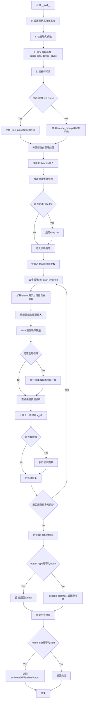

#### 带注释源码

```python
@torch.no_grad()
def __call__(
    self,
    video: list[list[PipelineImageInput]] = None,
    prompt: str | list[str] | None = None,
    height: int | None = None,
    width: int | None = None,
    num_inference_steps: int = 50,
    enforce_inference_steps: bool = False,
    timesteps: list[int] | None = None,
    sigmas: list[float] | None = None,
    guidance_scale: float = 7.5,
    strength: float = 0.8,
    negative_prompt: str | list[str] | None = None,
    num_videos_per_prompt: int | None = 1,
    eta: float = 0.0,
    generator: torch.Generator | list[torch.Generator] | None = None,
    latents: torch.Tensor | None = None,
    prompt_embeds: torch.Tensor | None = None,
    negative_prompt_embeds: torch.Tensor | None = None,
    ip_adapter_image: PipelineImageInput | None = None,
    ip_adapter_image_embeds: list[torch.Tensor] | None = None,
    output_type: str | None = "pil",
    return_dict: bool = True,
    cross_attention_kwargs: dict[str, Any] | None = None,
    clip_skip: int | None = None,
    callback_on_step_end: Callable[[int, int], None] | None = None,
    callback_on_step_end_tensor_inputs: list[str] = ["latents"],
    decode_chunk_size: int = 16,
):
    r"""
    The call function to the pipeline for generation.
    管道生成的主调用函数

    Args:
        video: 输入视频，用于条件生成
        prompt: 引导图像生成的提示词
        height: 生成视频的高度
        width: 生成视频的宽度
        num_inference_steps: 去噪步数
        timesteps: 自定义时间步
        sigmas: 自定义sigma值
        strength: 原始视频与生成视频的差异程度
        guidance_scale: 引导比例
        negative_prompt: 负面提示词
        eta: DDIM论文参数
        generator: 随机生成器
        latents: 预生成噪声潜在表示
        prompt_embeds: 预生成文本嵌入
        negative_prompt_embeds: 预生成负面文本嵌入
        ip_adapter_image: IP适配器图像输入
        ip_adapter_image_embeds: IP适配器图像嵌入
        output_type: 输出格式
        return_dict: 是否返回字典
        cross_attention_kwargs: 交叉注意力 kwargs
        clip_skip: CLIP跳过的层数
        callback_on_step_end: 步骤结束回调函数
        callback_on_step_end_tensor_inputs: 回调函数张量输入列表
        decode_chunk_size: 解码块大小

    Returns:
        AnimateDiffPipelineOutput或tuple: 生成结果
    """

    # 0. Default height and width to unet
    # 设置默认高度和宽度
    height = height or self.unet.config.sample_size * self.vae_scale_factor
    width = width or self.unet.config.sample_size * self.vae_scale_factor

    num_videos_per_prompt = 1

    # 1. Check inputs. Raise error if not correct
    # 检查输入参数是否正确
    self.check_inputs(
        prompt=prompt,
        strength=strength,
        height=height,
        width=width,
        negative_prompt=negative_prompt,
        prompt_embeds=prompt_embeds,
        negative_prompt_embeds=negative_prompt_embeds,
        video=video,
        latents=latents,
        ip_adapter_image=ip_adapter_image,
        ip_adapter_image_embeds=ip_adapter_image_embeds,
        callback_on_step_end_tensor_inputs=callback_on_step_end_tensor_inputs,
    )

    # 设置内部状态变量
    self._guidance_scale = guidance_scale
    self._clip_skip = clip_skip
    self._cross_attention_kwargs = cross_attention_kwargs
    self._interrupt = False

    # 2. Define call parameters
    # 定义调用参数：batch_size, device, dtype
    if prompt is not None and isinstance(prompt, (str, dict)):
        batch_size = 1
    elif prompt is not None and isinstance(prompt, list):
        batch_size = len(prompt)
    else:
        batch_size = prompt_embeds.shape[0]

    device = self._execution_device
    dtype = self.dtype

    # 3. Prepare timesteps
    # 准备时间步
    if XLA_AVAILABLE:
        timestep_device = "cpu"
    else:
        timestep_device = device
    
    # 根据是否强制推理步数来处理时间步
    if not enforce_inference_steps:
        timesteps, num_inference_steps = retrieve_timesteps(
            self.scheduler, num_inference_steps, timestep_device, timesteps, sigmas
        )
        timesteps, num_inference_steps = self.get_timesteps(num_inference_steps, timesteps, strength, device)
        latent_timestep = timesteps[:1].repeat(batch_size * num_videos_per_prompt)
    else:
        denoising_inference_steps = int(num_inference_steps / strength)
        timesteps, denoising_inference_steps = retrieve_timesteps(
            self.scheduler, denoising_inference_steps, timestep_device, timesteps, sigmas
        )
        timesteps = timesteps[-num_inference_steps:]
        latent_timestep = timesteps[:1].repeat(batch_size * num_videos_per_prompt)

    # 4. Prepare latent variables
    # 准备潜在变量
    if latents is None:
        # 预处理视频
        video = self.video_processor.preprocess_video(video, height=height, width=width)
        # 将帧数移到通道数之前
        video = video.permute(0, 2, 1, 3, 4)
        video = video.to(device=device, dtype=dtype)
    
    num_channels_latents = self.unet.config.in_channels
    latents = self.prepare_latents(
        video=video,
        height=height,
        width=width,
        num_channels_latents=num_channels_latents,
        batch_size=batch_size * num_videos_per_prompt,
        timestep=latent_timestep,
        dtype=dtype,
        device=device,
        generator=generator,
        latents=latents,
        decode_chunk_size=decode_chunk_size,
        add_noise=enforce_inference_steps,
    )

    # 5. Encode input prompt
    # 编码输入提示词
    text_encoder_lora_scale = (
        self.cross_attention_kwargs.get("scale", None) if self.cross_attention_kwargs is not None else None
    )
    num_frames = latents.shape[2]
    
    # 根据是否启用free noise选择编码方式
    if self.free_noise_enabled:
        prompt_embeds, negative_prompt_embeds = self._encode_prompt_free_noise(
            prompt=prompt,
            num_frames=num_frames,
            device=device,
            num_videos_per_prompt=num_videos_per_prompt,
            do_classifier_free_guidance=self.do_classifier_free_guidance,
            negative_prompt=negative_prompt,
            prompt_embeds=prompt_embeds,
            negative_prompt_embeds=negative_prompt_embeds,
            lora_scale=text_encoder_lora_scale,
            clip_skip=self.clip_skip,
        )
    else:
        prompt_embeds, negative_prompt_embeds = self.encode_prompt(
            prompt,
            device,
            num_videos_per_prompt,
            self.do_classifier_free_guidance,
            negative_prompt,
            prompt_embeds=prompt_embeds,
            negative_prompt_embeds=negative_prompt_embeds,
            lora_scale=text_encoder_lora_scale,
            clip_skip=self.clip_skip,
        )

        # 对于分类器自由引导，需要进行两次前向传播
        # 这里将无条件嵌入和文本嵌入连接成单个批次以避免两次前向传播
        if self.do_classifier_free_guidance:
            prompt_embeds = torch.cat([negative_prompt_embeds, prompt_embeds])

        # 为每个帧重复提示嵌入
        prompt_embeds = prompt_embeds.repeat_interleave(repeats=num_frames, dim=0)

    # 6. Prepare IP-Adapter embeddings
    # 准备IP-Adapter嵌入
    if ip_adapter_image is not None or ip_adapter_image_embeds is not None:
        image_embeds = self.prepare_ip_adapter_image_embeds(
            ip_adapter_image,
            ip_adapter_image_embeds,
            device,
            batch_size * num_videos_per_prompt,
            self.do_classifier_free_guidance,
        )

    # 7. Prepare extra step kwargs
    # 准备额外步骤参数
    extra_step_kwargs = self.prepare_extra_step_kwargs(generator, eta)

    # 8. Add image embeds for IP-Adapter
    # 为IP-Adapter添加图像嵌入
    added_cond_kwargs = (
        {"image_embeds": image_embeds}
        if ip_adapter_image is not None or ip_adapter_image_embeds is not None
        else None
    )

    # 9. Denoising loop
    # 去噪循环
    num_free_init_iters = self._free_init_num_iters if self.free_init_enabled else 1
    
    for free_init_iter in range(num_free_init_iters):
        if self.free_init_enabled:
            latents, timesteps = self._apply_free_init(
                latents, free_init_iter, num_inference_steps, device, latents.dtype, generator
            )
            num_inference_steps = len(timesteps)
            # 根据strength重新调整时间步
            timesteps, num_inference_steps = self.get_timesteps(num_inference_steps, timesteps, strength, device)

        self._num_timesteps = len(timesteps)
        num_warmup_steps = len(timesteps) - num_inference_steps * self.scheduler.order

        # 去噪循环
        with self.progress_bar(total=self._num_timesteps) as progress_bar:
            for i, t in enumerate(timesteps):
                if self.interrupt:
                    continue

                # 如果进行分类器自由引导则扩展latents
                latent_model_input = torch.cat([latents] * 2) if self.do_classifier_free_guidance else latents
                latent_model_input = self.scheduler.scale_model_input(latent_model_input, t)

                # 预测噪声残差
                noise_pred = self.unet(
                    latent_model_input,
                    t,
                    encoder_hidden_states=prompt_embeds,
                    cross_attention_kwargs=self.cross_attention_kwargs,
                    added_cond_kwargs=added_cond_kwargs,
                ).sample

                # 执行引导
                if self.do_classifier_free_guidance:
                    noise_pred_uncond, noise_pred_text = noise_pred.chunk(2)
                    noise_pred = noise_pred_uncond + guidance_scale * (noise_pred_text - noise_pred_uncond)

                # 计算上一步的噪声样本 x_t -> x_t-1
                latents = self.scheduler.step(noise_pred, t, latents, **extra_step_kwargs).prev_sample

                # 执行回调函数
                if callback_on_step_end is not None:
                    callback_kwargs = {}
                    for k in callback_on_step_end_tensor_inputs:
                        callback_kwargs[k] = locals()[k]
                    callback_outputs = callback_on_step_end(self, i, t, callback_kwargs)

                    latents = callback_outputs.pop("latents", latents)
                    prompt_embeds = callback_outputs.pop("prompt_embeds", prompt_embeds)
                    negative_prompt_embeds = callback_outputs.pop("negative_prompt_embeds", negative_prompt_embeds)

                # 调用回调，更新进度条
                if i == len(timesteps) - 1 or ((i + 1) > num_warmup_steps and (i + 1) % self.scheduler.order == 0):
                    progress_bar.update()

                if XLA_AVAILABLE:
                    xm.mark_step()

    # 10. Post-processing
    # 后处理
    if output_type == "latent":
        video = latents
    else:
        video_tensor = self.decode_latents(latents, decode_chunk_size)
        video = self.video_processor.postprocess_video(video=video_tensor, output_type=output_type)

    # 11. Offload all models
    # 卸载所有模型
    self.maybe_free_model_hooks()

    if not return_dict:
        return (video,)

    return AnimateDiffPipelineOutput(frames=video)
```


### `AnimateDiffVideoToVideoPipeline.guidance_scale`

该属性是 `AnimateDiffVideoToVideoPipeline` 类的只读属性，用于获取扩散管道在生成视频时使用的分类器无指导引导（Classifier-Free Guidance）权重。该值在调用管道时通过 `__call__` 方法的 `guidance_scale` 参数设置，用于控制生成内容与文本提示的吻合程度。

参数： 无

返回值：`float`，返回当前配置的引导权重值，用于控制文本提示对生成结果的影响程度。

#### 流程图

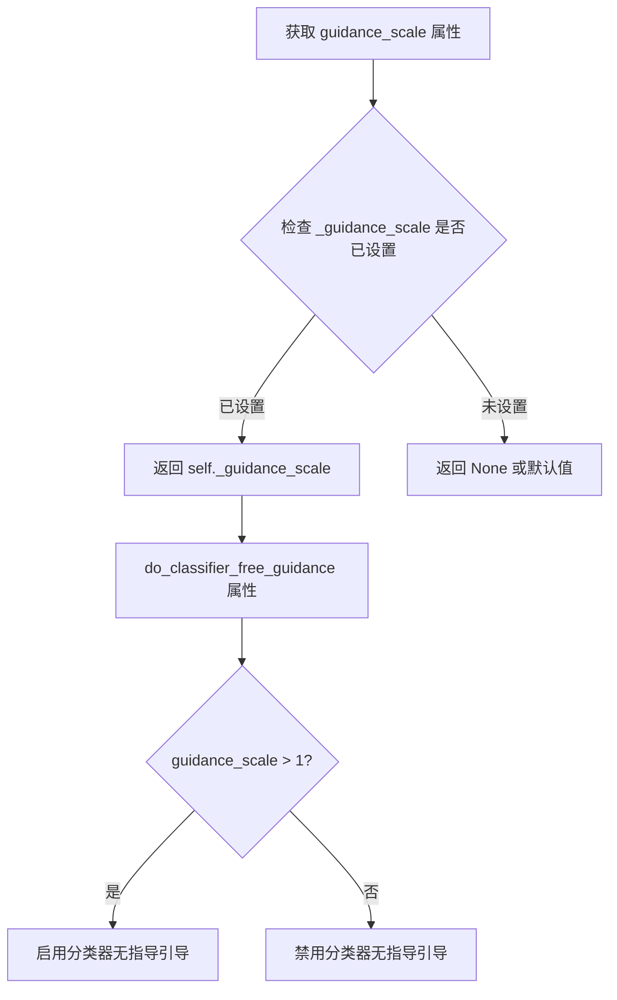

#### 带注释源码

```python
@property
def guidance_scale(self):
    """
    获取分类器无指导引导的权重值。
    
    该属性对应于 Imagen 论文中方程 (2) 的引导权重 w：
    guidance_scale = 1 表示不执行分类器无指导引导。
    较高的值会促使模型生成与文本提示更紧密相关的图像，
    但可能导致较低的质量。
    
    返回:
        float: 当前配置的引导权重值。如果未设置，返回 None。
    """
    return self._guidance_scale
```

**相关联的属性和方法：**

```python
# 在 __call__ 方法中设置该值
self._guidance_scale = guidance_scale  # guidance_scale: float = 7.5

# 该属性被 do_classifier_free_guidance 属性使用
@property
def do_classifier_free_guidance(self):
    # 当 guidance_scale > 1 时启用分类器无指导引导
    return self._guidance_scale > 1
```


### `AnimateDiffVideoToVideoPipeline.clip_skip`

该属性是 `AnimateDiffVideoToVideoPipeline` 类的只读属性，用于获取在文本编码过程中要跳过的 CLIP 层数。该值控制从 CLIP 文本编码器的哪个隐藏层获取文本嵌入，从而影响生成结果与文本提示的匹配程度。

参数：无（属性访问不需要显式参数，`self` 为隐含参数）

返回值：`int | None`，返回跳过的 CLIP 层数。如果为 `None`，则使用 CLIP 的最后一层；如果为整数，则跳过相应数量的层后获取嵌入。

#### 流程图

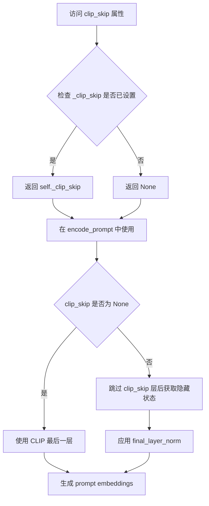

#### 带注释源码

```python
@property
def clip_skip(self):
    """
    属性 getter: 获取 CLIP 跳过的层数
    
    该属性对应在 encode_prompt 方法中使用的 clip_skip 参数，
    用于控制从 CLIP 文本编码器的哪个隐藏层获取文本嵌入。
    当 clip_skip 为 None 时，使用 CLIP 的最后一层输出；
    当 clip_skip 为正整数时，跳过相应数量的层后获取嵌入。
    
    返回值:
        int | None: 跳过的层数，None 表示使用默认的最后一层
    """
    return self._clip_skip
```


### `AnimateDiffVideoToVideoPipeline.do_classifier_free_guidance`

该属性用于判断是否启用了无分类器引导（Classifier-Free Guidance）机制。通过比较 `guidance_scale` 与 1 的大小关系来返回布尔值，当 `guidance_scale > 1` 时表示启用了无分类器引导。

参数：

- `self`：`AnimateDiffVideoToVideoPipeline` 类实例，隐式参数，无需显式传递

返回值：`bool`，返回 `True` 表示启用了无分类器引导（guidance_scale > 1），返回 `False` 表示未启用（guidance_scale <= 1）

#### 流程图

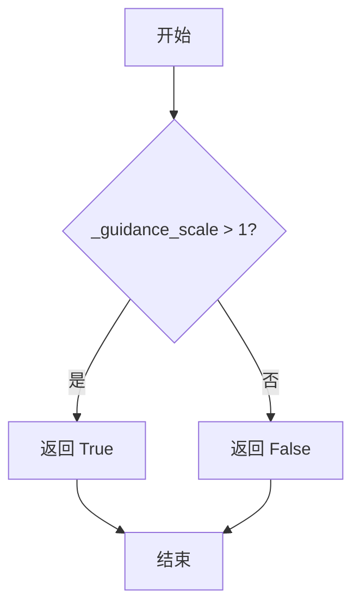

#### 带注释源码

```python
@property
def do_classifier_free_guidance(self):
    """
    属性方法：判断是否启用无分类器引导（Classifier-Free Guidance）

    该属性用于确定在扩散模型的推理过程中是否执行无分类器引导。
    无分类器引导通过在推理时同时考虑条件（带文本提示）和无条件（不带文本提示）
    的噪声预测，来增强生成结果与文本提示的一致性。

    实现原理：
    - 当 guidance_scale > 1 时，引导权重生效，模型会同时预测条件噪声和无条件噪声
    - 然后通过公式: noise_pred = noise_pred_uncond + guidance_scale * (noise_pred_text - noise_pred_uncond)
    - 这种方式可以让生成结果更紧密地贴合文本提示

    Returns:
        bool: 如果 guidance_scale > 1 返回 True，表示启用无分类器引导；
              否则返回 False，表示不启用无分类器引导
    """
    return self._guidance_scale > 1
```


### `AnimateDiffVideoToVideoPipeline.cross_attention_kwargs`

这是一个属性 getter 方法，用于获取在管道调用时设置的交叉注意力关键字参数（kwargs）。该属性允许外部访问传递给注意力处理器（AttentionProcessor）的配置字典，用于自定义扩散模型中的交叉注意力机制行为，例如控制注意力权重、添加自定义注意力逻辑等。

参数：无（属性 getter不接受显式参数）

返回值：`dict[str, Any] | None`，返回交叉注意力关键字参数字典。如果未设置，则返回 `None`。

#### 流程图

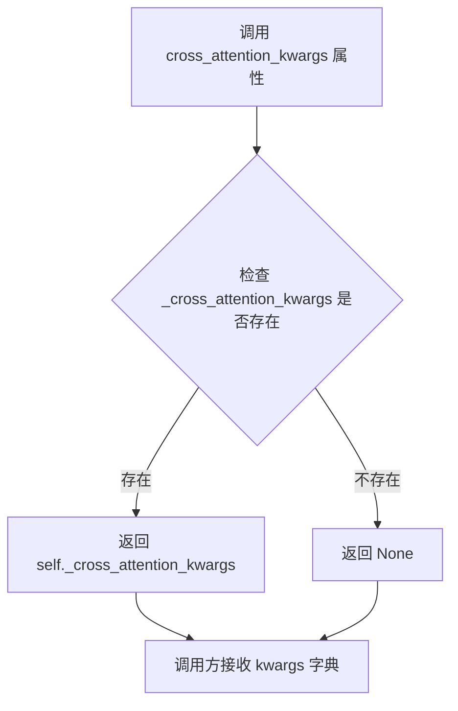

#### 带注释源码

```python
@property
def cross_attention_kwargs(self):
    """
    属性 getter: 获取交叉注意力关键字参数
    
    该属性返回在 __call__ 方法中设置的 _cross_attention_kwargs。
    这些参数会被传递给 UNet 的交叉注意力处理器，用于自定义注意力机制。
    
    返回值:
        dict[str, Any] | None: 包含注意力控制参数的字典，如 'scale', 'attention_type' 等
    """
    return self._cross_attention_kwargs
```

#### 相关上下文源码

该属性在 `__call__` 方法中被设置：

```python
# 在 __call__ 方法中
self._cross_attention_kwargs = cross_attention_kwargs
```

并在去噪循环中被使用：

```python
# 在去噪循环中预测噪声残差
noise_pred = self.unet(
    latent_model_input,
    t,
    encoder_hidden_states=prompt_embeds,
    cross_attention_kwargs=self.cross_attention_kwargs,  # 使用该属性
    added_cond_kwargs=added_cond_kwargs,
).sample
```


### `AnimateDiffVideoToVideoPipeline.num_timesteps`

该属性是 `AnimateDiffVideoToVideoPipeline` 管道类的只读属性，用于返回当前去噪过程的时间步数量。它在管道执行去噪循环时被动态设置，反映了实际使用的时间步长度。

参数： 无

返回值：`int`，返回去噪过程的时间步数量，即 `timesteps` 列表的长度。

#### 流程图

```mermaid
flowchart TD
    A[访问 num_timesteps 属性] --> B{检查 _num_timesteps 是否已设置}
    B -->|已设置| C[返回 self._num_timesteps]
    B -->|未设置| D[返回默认值或未定义]
    
    E[管道执行 __call__ 方法] --> F[计算 timesteps 列表]
    F --> G[设置 self._num_timesteps = len(timesteps)]
    G --> C
```

#### 带注释源码

```python
@property
def num_timesteps(self):
    """
    返回当前去噪过程的时间步数量。
    
    该属性是一个只读属性，用于获取在管道执行过程中
    实际使用的时间步数量（_num_timesteps）。
    
    注意：此属性仅在管道执行 __call__ 方法后才会被设置。
    在调用管道之前访问此属性可能会返回未定义的值。
    """
    return self._num_timesteps
```


### `AnimateDiffVideoToVideoPipeline.interrupt`

该属性用于获取管道的当前中断状态标志，用于控制在去噪循环执行过程中是否提前终止推理过程。

参数：

- 该属性为只读属性，无需显式参数。（隐式参数 `self` 为管道实例本身）

返回值：`bool`，返回管道的中断状态标志。当值为 `True` 时，表示外部已发出中断请求，管道应在当前推理步骤完成后停止执行。

#### 流程图

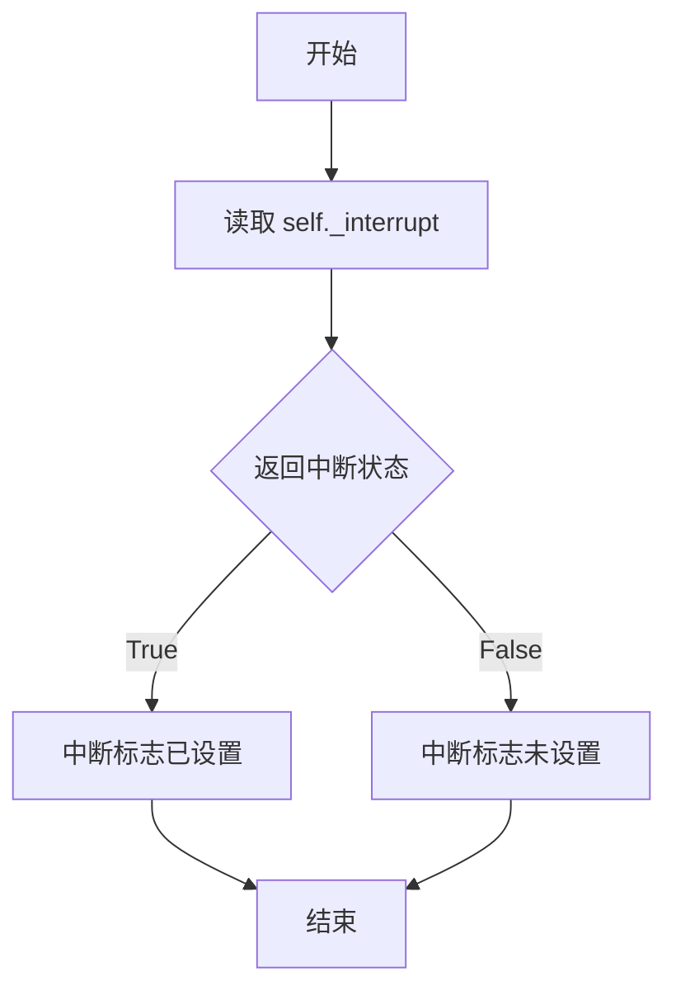

#### 带注释源码

```python
@property
def interrupt(self):
    """
    属性 getter: 获取管道的当前中断状态。

    该属性在管道的去噪循环 (__call__ 方法) 中被检查：
    ```python
    for i, t in enumerate(timesteps):
        if self.interrupt:  # 检查中断标志
            continue  # 跳过当前步骤，但继续循环
    ```

    当外部调用者希望提前终止管道执行时，
    可以将此属性设置为 True (通过设置 self._interrupt)，
    管道会在当前步骤完成后检查并响应此标志。

    Returns:
        bool: 管道的中断状态标志。
              True 表示请求中断，False 表示继续正常执行。
    """
    return self._interrupt
```

## 关键组件


### 张量索引与惰性加载

在`encode_video`和`decode_latents`方法中实现，通过`decode_chunk_size`参数控制每次处理的帧数或latent数量，实现分块处理以节省内存

### 反量化支持

通过`retrieve_latents`函数实现，处理VAE编码器输出的不同形式（`latent_dist.sample`、`latent_dist.mode`或直接`latents`），支持多种采样模式

### 量化策略

在`prepare_latents`方法中处理VAE的强制类型转换（force_upcast），确保在float16模式下VAE以float32运行以避免溢出

### 运动适配器（MotionAdapter）

在`__init__`中通过`UNetMotionModel.from_unet2d`将标准的`UNet2DConditionModel`转换为支持运动建模的`UNetMotionModel`

### 视频编码/解码管道

`encode_video`将视频帧编码为latent表示，`decode_latents`将latent解码为视频帧，均采用分块处理策略

### 调度器系统

通过`retrieve_timesteps`和`get_timesteps`函数管理扩散过程的时间步，支持自定义timesteps和sigmas

### IP-Adapter支持

`prepare_ip_adapter_image_embeds`方法处理图像条件输入，支持多IP-Adapter和分类器自由引导

### 提示编码与分类器自由引导

`encode_prompt`方法处理文本提示的编码，并在`do_classifier_free_guidance`启用时生成无条件嵌入用于引导

### 潜在变量管理

`prepare_latents`方法负责初始化或处理潜在变量，支持噪声注入和潜在变量复用

### 视频到视频生成主管道

`__call__`方法是主入口，整合上述所有组件完成端到端的视频到视频生成流程


## 问题及建议


### 已知问题

-   **方法过长**: `__call__` 方法超过300行，包含过多逻辑（输入验证、时间步准备、潜在变量处理、提示编码、去噪循环、后处理等），违反单一职责原则，导致难以维护和测试。
-   **代码重复**: `encode_prompt`、`encode_image`、`prepare_ip_adapter_image_embeds` 等方法与其他Stable Diffusion pipeline高度重复，虽然有"Copied from"注释，但维护时需同步更新多处。
-   **类型提示不一致**: 部分参数使用 Python 3.10+ 的 `|` 联合类型（如 `str | None`），部分使用 `Optional[str]`，风格不统一。
-   **复杂条件分支**: `prepare_latents` 方法中存在大量嵌套的 `if-else` 逻辑处理不同输入场景（`latents` 是否为 `None`、`generator` 是否为列表、`add_noise` 标志等），容易引入逻辑错误。
-   **魔法数字**: `decode_chunk_size=16`、默认 `strength=0.8`、默认 `num_inference_steps=50` 等硬编码值缺乏配置化。
-   **内存效率问题**: `encode_video` 方法在循环中逐步编码，但 `decode_latents` 仍需将所有潜在变量加载到内存；对于超长视频可能导致 OOM。
-   **推理步骤计算复杂**: `enforce_inference_steps` 的逻辑（通过 `int(num_inference_steps / strength)` 计算去噪步数）与普通逻辑混合，可读性较差。
-   **混合调度器支持**: 代码支持多种调度器但通过 `inspect.signature` 动态检查参数，增加了运行时开销和潜在的兼容性问题。

### 优化建议

-   **重构 `__call__` 方法**: 将其拆分为多个私有方法，如 `_prepare_inputs()`, `_encode_prompts()`, `_run_denoising_loop()`, `_post_process()` 等，每个方法负责单一职责。
-   **提取配置类**: 将硬编码的默认值（调度器类型、chunk size、guidance scale 等）提取到配置类或 `__init__` 参数中，提供更好的灵活性。
-   **统一类型提示**: 使用 `typing` 模块的 `Optional` 和 `Union` 或统一使用 Python 3.10+ 的类型提示风格。
-   **优化 `prepare_latents`**: 使用策略模式或工厂模式简化潜在变量准备逻辑，减少嵌套分支。
-   **流式视频处理**: 考虑实现生成器模式的视频编码/解码，以支持超长视频的内存高效处理。
-   **添加缓存机制**: 对于重复调用的配置验证、调度器设置等，考虑添加缓存避免重复计算。
-   **错误信息增强**: 为常见错误（如输入格式不匹配、维度错误）提供更具体的调试信息。

## 其它


### 设计目标与约束

本Pipeline的设计目标是实现高质量的视频到视频（Video-to-Video）转换功能，基于AnimateDiff和Stable Diffusion技术栈。核心约束包括：1) 输入视频必须为PIL Images列表格式；2) 输出视频分辨率需能被8整除；3) 支持的调度器仅限于DDIMScheduler、PNDMScheduler、LMSDiscreteScheduler、EulerDiscreteScheduler、EulerAncestralDiscreteScheduler和DPMSolverMultistepScheduler；4) 内存占用受输入视频帧数和batch size影响，需在16GB GPU内存下运行；5) 不支持float64数据类型，仅支持float32和float16；6) IP-Adapter和LoRA功能为可选组件。

### 错误处理与异常设计

管道实现了多层次错误检查机制：1) 输入验证阶段通过`check_inputs`方法进行参数校验，包括strength范围[0,1]、分辨率8的倍数、prompt与embeds互斥、video与latents互斥等；2) 数值运算异常捕获，如`retrieve_latents`中对encoder_output属性的检查、`retrieve_timesteps`中对调度器支持参数的验证；3) 运行时异常通过`try-except`块处理XLA设备操作；4) 内存溢出防护通过`decode_chunk_size`分块处理视频帧；5) 类型检查覆盖prompt类型、ip_adapter_image_embeds维度等关键参数。所有异常均抛出`ValueError`或`TypeError`并附带详细错误信息。

### 数据流与状态机

管道数据流遵循以下状态转换：初始状态（None latents）→ 视频预处理（preprocess_video）→ 潜在空间编码（encode_video）→ 添加噪声（add_noise）→ 文本编码（encode_prompt）→ IP-Adapter编码（可选）→ 去噪循环（denoise loop）→ 潜在空间解码（decode_latents）→ 后处理输出（postprocess_video）。状态机包含四个主要阶段：准备阶段（0-4步）、编码阶段（5-6步）、去噪阶段（9步，迭代循环）、后处理阶段（10-11步）。调度器状态在每个去噪步骤中通过`scheduler.step`更新，XLA设备同步通过`xm.mark_step()`执行。

### 外部依赖与接口契约

核心依赖包括：transformers库（CLIPTextModel、CLIPTokenizer、CLIPVisionModelWithProjection）、diffusers内部模块（PipelineImageInput、AutoencoderKL、UNet2DConditionModel、MotionAdapter、各类Scheduler）、torch生态（torch、torch_xla可选）。接口契约规定：1) video输入为`list[PipelineImageInput]`格式；2) prompt支持str/list/dict类型；3) 输出默认为PIL.Image列表，可选torch.Tensor或np.array；4) latents形状约定为`(batch_size, num_channels, num_frames, height, width)`；5) callback函数签名为`Callable[[int, int, Dict], None]`；6) 调度器必须实现`set_timesteps`和`step`方法。

### 性能考虑与优化建议

性能关键点包括：1) VAE编码/解码采用`decode_chunk_size=16`分块处理以控制内存；2) 文本编码结果通过`repeat`而非复制操作实现批量生成；3) 调度器步数通过`num_inference_steps`和`strength`计算实现自适应；4) XLA设备使用`mark_step()`批量同步；5) 推荐使用float16加速推理；6) CPU offload和model hooks机制用于显存优化。优化建议：可添加混合精度训练的进一步优化、实现ONNX导出支持、考虑使用xFormers加速注意力计算、添加流式解码以支持超长视频处理。

### 安全性考虑

管道包含以下安全机制：1) 仅支持Apache 2.0许可的模型权重；2) 文本编码器强制执行最大长度截断；3) 不包含任何网络爬虫或数据收集功能；4) 生成的视频内容完全由用户提供的prompt控制；5) IP-Adapter图像输入经过标准化处理。安全限制：管道不限制生成内容的类型，但用户需自行承担生成内容的法律责任；不提供内容过滤或审核功能。

### 配置参数详解

关键配置参数包括：1) `strength`（默认值0.8）：控制原视频与生成视频的差异程度，值越大差异越大；2) `guidance_scale`（默认值7.5）：分类器自由引导权重，值越大越忠于prompt；3) `num_inference_steps`（默认值50）：去噪迭代次数，影响生成质量与速度；4) `decode_chunk_size`（默认值16）：每次解码的帧数，影响内存占用；5) `clip_skip`：CLIP模型跳过的层数，影响文本嵌入质量；6) `cross_attention_kwargs`：传递给注意力模块的额外参数，用于LoRA等控制。

### 使用示例详解

代码示例展示了完整的使用流程：1) 加载MotionAdapter和基础模型；2) 配置DDIMScheduler（关键参数：beta_schedule="linear"、steps_offset=1、clip_sample=False）；3) 通过URL或本地文件加载视频；4) 调用pipeline进行转换，关键参数为video和prompt；5) 导出生成的GIF。注意事项：视频帧数影响处理时间；strength参数需根据效果调整；推荐使用torch.float16以提升性能。

### 术语表

关键术语定义：1) Latent Space（潜在空间）：VAE编码后的低维表示空间；2) Denoising（去噪）：从噪声中逐步恢复清晰内容的过程；3) Classifier-Free Guidance（分类器自由引导）：一种无需训练分类器的条件生成技术；4) Motion Adapter（运动适配器）：AnimateDiff中用于添加运动先验的模块；5) IP-Adapter：图像提示适配器，用于基于图像条件生成；6) LoRA：低秩适配技术，用于微调扩散模型。

### 版本历史与变更记录

本代码基于diffusers库构建，继承自StableDiffusionMixin、TextualInversionLoaderMixin、IPAdapterMixin、StableDiffusionLoraLoaderMixin、FreeInitMixin、AnimateDiffFreeNoiseMixin和FromSingleFileMixin。主要功能演进：1) 初始版本支持基础视频到视频转换；2) 后续添加IP-Adapter支持；3) 添加FreeInit和FreeNoise技术用于初始化控制；4) 添加LoRA权重加载/保存功能；5) 支持自定义timesteps和sigmas调度。

    