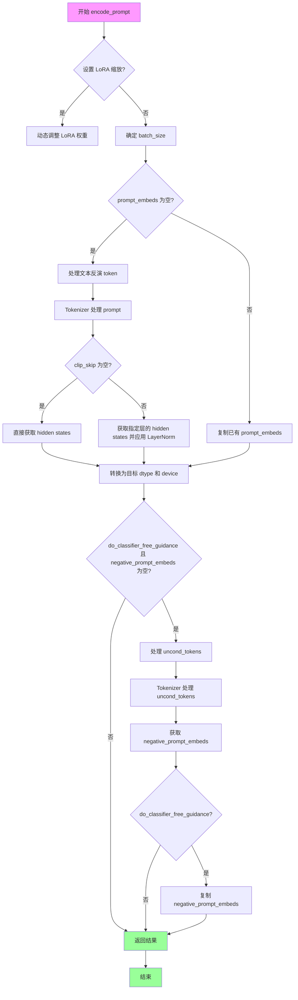
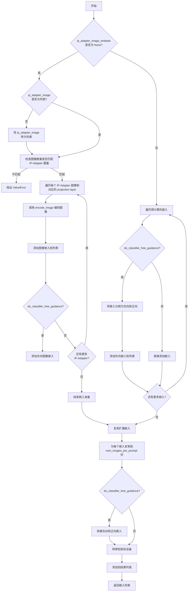
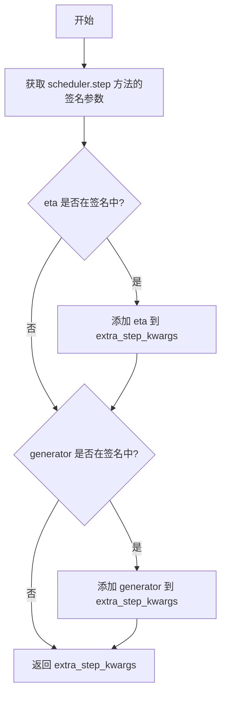
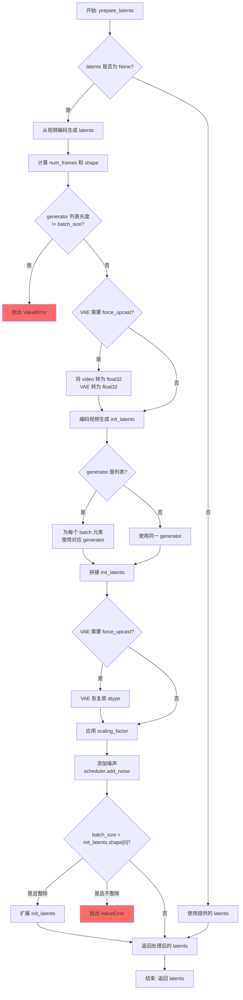
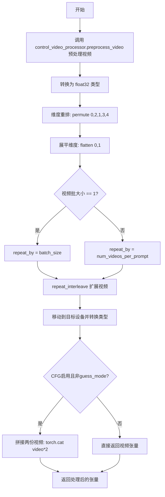

```mermaid
flowchart TD
    A[开始 __call__] --> B[获取controlnet原始模块]
    B --> C[对齐control_guidance格式]
    C --> D[设置默认height和width]
    D --> E[设置num_videos_per_prompt=1]
    E --> F[检查输入参数]
    F --> G[设置guidance_scale等属性]
    G --> H[定义调用参数: batch_size, device, dtype]
    H --> I{是否使用XLA?}
    I -->|是| J[设置timestep_device为cpu]
    I -->|否| K[使用原device]
    J --> L[准备timesteps]
    K --> L
    L --> M{是否enforce_inference_steps?}
    M -->|否| N[获取timesteps和num_inference_steps]
    M -->|是| O[计算denoising_inference_steps]
    N --> P[准备latent变量]
    O --> P
    P --> Q[预处理输入video]
    Q --> R[编码输入prompt]
    R --> S{是否启用free_noise?}
    S -->|是| T[使用_encode_prompt_free_noise]
    S -->|否| U[使用encode_prompt]
    T --> V[连接negative和positive prompt embeds]
    U --> V
    V --> W[repeat_interleave处理]
    W --> X{有IP-Adapter图像?}
    X -->|是| Y[准备IP-Adapter图像嵌入]
    X -->|否| Z[跳过准备IP-Adapter]
    Y --> AA[准备ControlNet条件]
    Z --> AA
    AA --> AB[准备extra_step_kwargs]
    AB --> AC[添加IP-Adapter条件]
    AC --> AD{是否启用free_init?}
    AD -->|是| AE[应用free_init]
    AD -->|否| AF[开始去噪循环]
    AE --> AF
    AF --> AG[迭代timesteps]
    AG --> AH{interrupt标志?}
    AH -->|是| AG
    AH -->|否| AI[扩展latent进行CFG]
    AI --> AJ[scale_model_input]
    AJ --> AK[准备ControlNet输入]
    AK --> AL[执行ControlNet forward]
    AL --> AM[执行UNet forward]
    AM --> AN[执行分类器自由引导]
    AN --> AO[scheduler.step更新latent]
    AO --> AP{有callback_on_step_end?}
    AP -->|是| AQ[执行回调函数]
    AP -->|否| AR[更新progress_bar]
    AQ --> AR
    AR --> AS{还有更多timesteps?}
    AS -->|是| AG
    AS -->|否| AT{output_type是latent?}
    AT -->|是| AU[直接返回latents]
    AT -->|否| AV[decode_latents解码]
    AV --> AW[postprocess_video后处理]
    AU --> AX[Offload所有模型]
    AW --> AX
    AX --> AY{return_dict为True?}
    AY -->|是| AZ[返回AnimateDiffPipelineOutput]
    AY -->|否| BA[返回tuple]
    AZ --> BB[结束]
    BA --> BB
```

# `diffusers\src\diffusers\pipelines\animatediff\pipeline_animatediff_video2video_controlnet.py` 详细设计文档

AnimateDiffVideoToVideoControlNetPipeline 是一个用于视频到视频生成的 ControlNet 引导扩散管道，结合了运动适配器实现视频风格迁移和内容修改。该管道继承自多个混合类，支持 LoRA、Textual Inversion、IP-Adapter 等高级功能，并集成了 AnimateDiff 的自由噪声和自由初始化技术。

## 整体流程

```mermaid
graph TD
A[开始 __call__] --> B[0. 检查并规范化控制引导参数]
B --> C[1. 检查输入参数 validate_inputs]
C --> D[2. 定义调用参数 batch_size/width/height]
D --> E[3. 准备 timesteps retrieve_timesteps + get_timesteps]
E --> F[4. 准备 latents prepare_latents]
F --> G[5. 编码 prompt encode_prompt]
G --> H{是否启用 IP-Adapter?}
H -- 是 --> I[6. 准备 IP-Adapter 图像嵌入 prepare_ip_adapter_image_embeds]
H -- 否 --> J[7. 准备 ControlNet 条件帧]
I --> J
J --> K[8. 准备额外步骤参数 prepare_extra_step_kwargs]
K --> L{是否启用 free_init?}
L -- 是 --> M[应用自由初始化 _apply_free_init]
L -- 否 --> N[9. Denoising 循环]
M --> N
N --> O{遍历每个 timestep}
O --> P[10.1 扩展 latents (CFG)]
P --> Q[10.2 调度器 scale_model_input]
Q --> R{guess_mode 启用?}
R -- 是 --> S[10.3 仅条件 ControlNet 推理]
R -- 否 --> T[10.3 条件+无条件 ControlNet 推理]
S --> U[10.4 UNet 预测噪声]
T --> U
U --> V[10.5 执行 CFG 引导]
V --> W[10.6 调度器 step 计算上一步]
W --> X[10.7 回调处理 callback_on_step_end]
X --> O
O -- 完成 --> Y[11. 后处理 decode_latents + postprocess_video]
Y --> Z[12. 卸载模型 maybe_free_model_hooks]
Z --> AA[返回 AnimateDiffPipelineOutput]
AA --> AB[结束]
```

## 类结构

```
DiffusionPipeline (基类)
├── StableDiffusionMixin
├── TextualInversionLoaderMixin
├── IPAdapterMixin
├── StableDiffusionLoraLoaderMixin
├── FreeInitMixin
├── AnimateDiffFreeNoiseMixin
├── FromSingleFileMixin
└── AnimateDiffVideoToVideoControlNetPipeline (主类)
```

## 全局变量及字段


### `XLA_AVAILABLE`
    
XLA是否可用

类型：`bool`
    


### `logger`
    
日志记录器

类型：`logging.Logger`
    


### `EXAMPLE_DOC_STRING`
    
示例文档字符串

类型：`str`
    


### `AnimateDiffVideoToVideoControlNetPipeline.model_cpu_offload_seq`
    
模型卸载顺序

类型：`str`
    


### `AnimateDiffVideoToVideoControlNetPipeline._optional_components`
    
可选组件列表

类型：`list`
    


### `AnimateDiffVideoToVideoControlNetPipeline._callback_tensor_inputs`
    
回调张量输入列表

类型：`list`
    


### `AnimateDiffVideoToVideoControlNetPipeline.vae`
    
VAE编码器/解码器

类型：`AutoencoderKL`
    


### `AnimateDiffVideoToVideoControlNetPipeline.text_encoder`
    
文本编码器

类型：`CLIPTextModel`
    


### `AnimateDiffVideoToVideoControlNetPipeline.tokenizer`
    
分词器

类型：`CLIPTokenizer`
    


### `AnimateDiffVideoToVideoControlNetPipeline.unet`
    
UNet去噪模型

类型：`UNet2DConditionModel | UNetMotionModel`
    


### `AnimateDiffVideoToVideoControlNetPipeline.motion_adapter`
    
运动适配器

类型：`MotionAdapter`
    


### `AnimateDiffVideoToVideoControlNetPipeline.controlnet`
    
ControlNet模型

类型：`ControlNetModel | MultiControlNetModel`
    


### `AnimateDiffVideoToVideoControlNetPipeline.scheduler`
    
调度器

类型：`SchedulerMixin`
    


### `AnimateDiffVideoToVideoControlNetPipeline.feature_extractor`
    
特征提取器

类型：`CLIPImageProcessor`
    


### `AnimateDiffVideoToVideoControlNetPipeline.image_encoder`
    
图像编码器

类型：`CLIPVisionModelWithProjection`
    


### `AnimateDiffVideoToVideoControlNetPipeline.vae_scale_factor`
    
VAE缩放因子

类型：`int`
    


### `AnimateDiffVideoToVideoControlNetPipeline.video_processor`
    
视频处理器

类型：`VideoProcessor`
    


### `AnimateDiffVideoToVideoControlNetPipeline.control_video_processor`
    
ControlNet视频处理器

类型：`VideoProcessor`
    


### `AnimateDiffVideoToVideoControlNetPipeline._guidance_scale`
    
无分类器自由引导比例

类型：`float`
    


### `AnimateDiffVideoToVideoControlNetPipeline._clip_skip`
    
CLIP跳过的层数

类型：`int | None`
    


### `AnimateDiffVideoToVideoControlNetPipeline._cross_attention_kwargs`
    
交叉注意力参数

类型：`dict[str, Any] | None`
    


### `AnimateDiffVideoToVideoControlNetPipeline._num_timesteps`
    
时间步数量

类型：`int`
    


### `AnimateDiffVideoToVideoControlNetPipeline._interrupt`
    
中断标志

类型：`bool`
    
    

## 全局函数及方法


### `retrieve_latents`

从 VAE 编码器输出中检索潜在变量（latents），支持多种获取方式：根据 `sample_mode` 参数从潜在分布（latent_dist）中采样或取模，或者直接返回预计算的 `latents` 属性。

参数：

- `encoder_output`：`torch.Tensor`，编码器输出对象，通常为 `DecoderOutput` 或类似对象，需包含 `latent_dist` 属性或 `latents` 属性
- `generator`：`torch.Generator | None`，可选的随机数生成器，用于从潜在分布中采样时保证可复现性
- `sample_mode`：`str`，采样模式，默认为 `"sample"`；可选 `"sample"`（随机采样）或 `"argmax"`（取分布的众数/最大值）

返回值：`torch.Tensor`，检索到的潜在表示张量

#### 流程图

```mermaid
flowchart TD
    A[开始] --> B{encoder_output 有 latent_dist?}
    B -->|是| C{sample_mode == 'sample'?}
    C -->|是| D[返回 latent_dist.sample<br/>(generator)]
    C -->|否| E[返回 latent_dist.mode<br/>()]
    B -->|否| F{encoder_output 有 latents?}
    F -->|是| G[返回 encoder_output.latents]
    F -->|否| H[raise AttributeError]
    D --> I[结束]
    E --> I
    G --> I
    H --> I
```

#### 带注释源码

```python
# Copied from diffusers.pipelines.stable_diffusion.pipeline_stable_diffusion_img2img.retrieve_latents
def retrieve_latents(
    encoder_output: torch.Tensor, generator: torch.Generator | None = None, sample_mode: str = "sample"
):
    """
    从 VAE 编码器输出中检索潜在变量。
    
    Args:
        encoder_output: 编码器输出对象，需包含 latent_dist 或 latents 属性
        generator: 可选的随机数生成器，用于采样时保证可复现性
        sample_mode: 采样模式，"sample" 为随机采样，"argmax" 为取众数
    
    Returns:
        检索到的潜在表示张量
    
    Raises:
        AttributeError: 当 encoder_output 既没有 latent_dist 也没有 latents 属性时
    """
    # 优先检查 latent_dist 属性（VAE 的标准输出方式）
    if hasattr(encoder_output, "latent_dist") and sample_mode == "sample":
        # 从潜在分布中随机采样，可使用 generator 控制随机性
        return encoder_output.latent_dist.sample(generator)
    elif hasattr(encoder_output, "latent_dist") and sample_mode == "argmax":
        # 取潜在分布的众数（最可能的潜在表示）
        return encoder_output.latent_dist.mode()
    # 备选方案：直接返回预计算的 latents 属性
    elif hasattr(encoder_output, "latents"):
        return encoder_output.latents
    # 无效的 encoder_output：既没有 latent_dist 也没有 latents
    else:
        raise AttributeError("Could not access latents of provided encoder_output")
```


### `retrieve_timesteps`

该函数是扩散模型调度器的辅助函数，用于调用调度器的 `set_timesteps` 方法并从中检索时间步序列。它支持三种模式：使用 `num_inference_steps` 自动计算时间步、使用自定义 `timesteps` 列表、或使用自定义 `sigmas` 列表，并对调度器的兼容性进行验证。

参数：

- `scheduler`：`SchedulerMixin`，调度器对象，用于获取时间步的调度器实例
- `num_inference_steps`：`int | None`，推理步数，生成样本时使用的扩散步数，若使用此参数则 `timesteps` 必须为 `None`
- `device`：`str | torch.device | None`，设备，时间步要移动到的设备，若为 `None` 则不移动
- `timesteps`：`list[int] | None`，自定义时间步，用于覆盖调度器的时间步间距策略，若传入此参数则 `num_inference_steps` 和 `sigmas` 必须为 `None`
- `sigmas`：`list[float] | None`，自定义 sigmas，用于覆盖调度器的时间步间距策略，若传入此参数则 `num_inference_steps` 和 `timesteps` 必须为 `None`
- `**kwargs`：任意关键字参数，将传递给调度器的 `set_timesteps` 方法

返回值：`tuple[torch.Tensor, int]`，包含两个元素：第一个是调度器的时间步序列（张量），第二个是推理步数（整数）

#### 流程图

```mermaid
flowchart TD
    A[开始 retrieve_timesteps] --> B{同时传入 timesteps 和 sigmas?}
    B -->|是| C[抛出 ValueError]
    B -->|否| D{传入 timesteps?}
    D -->|是| E{调度器支持 timesteps?}
    D -->|否| F{传入 sigmas?}
    E -->|是| G[调用 scheduler.set_timesteps<br/>参数: timesteps=timesteps, device=device, **kwargs]
    E -->|否| H[抛出 ValueError]
    F -->|是| I{调度器支持 sigmas?}
    F -->|否| J[调用 scheduler.set_timesteps<br/>参数: num_inference_steps, device=device, **kwargs]
    I -->|是| K[调用 scheduler.set_timesteps<br/>参数: sigmas=sigmas, device=device, **kwargs]
    I -->|否| L[抛出 ValueError]
    G --> M[获取 scheduler.timesteps]
    K --> M
    J --> M
    M --> N[计算 num_inference_steps = len(timesteps)]
    N --> O[返回 timesteps, num_inference_steps]
    C --> O
    H --> O
    L --> O
```

#### 带注释源码

```python
def retrieve_timesteps(
    scheduler,
    num_inference_steps: int | None = None,
    device: str | torch.device | None = None,
    timesteps: list[int] | None = None,
    sigmas: list[float] | None = None,
    **kwargs,
):
    r"""
    Calls the scheduler's `set_timesteps` method and retrieves timesteps from the scheduler after the call. Handles
    custom timesteps. Any kwargs will be supplied to `scheduler.set_timesteps`.

    Args:
        scheduler (`SchedulerMixin`):
            The scheduler to get timesteps from.
        num_inference_steps (`int`):
            The number of diffusion steps used when generating samples with a pre-trained model. If used, `timesteps`
            must be `None`.
        device (`str` or `torch.device`, *optional*):
            The device to which the timesteps should be moved to. If `None`, the timesteps are not moved.
        timesteps (`list[int]`, *optional*):
            Custom timesteps used to override the timestep spacing strategy of the scheduler. If `timesteps` is passed,
            `num_inference_steps` and `sigmas` must be `None`.
        sigmas (`list[float]`, *optional*):
            Custom sigmas used to override the timestep spacing strategy of the scheduler. If `sigmas` is passed,
            `num_inference_steps` and `timesteps` must be `None`.

    Returns:
        `tuple[torch.Tensor, int]`: A tuple where the first element is the timestep schedule from the scheduler and the
        second element is the number of inference steps.
    """
    # 检查是否同时传入了 timesteps 和 sigmas，两者只能选其一
    if timesteps is not None and sigmas is not None:
        raise ValueError("Only one of `timesteps` or `sigmas` can be passed. Please choose one to set custom values")
    
    # 分支1: 使用自定义 timesteps
    if timesteps is not None:
        # 检查调度器的 set_timesteps 方法是否接受 timesteps 参数
        accepts_timesteps = "timesteps" in set(inspect.signature(scheduler.set_timesteps).parameters.keys())
        if not accepts_timesteps:
            raise ValueError(
                f"The current scheduler class {scheduler.__class__}'s `set_timesteps` does not support custom"
                f" timestep schedules. Please check whether you are using the correct scheduler."
            )
        # 调用调度器的 set_timesteps 方法
        scheduler.set_timesteps(timesteps=timesteps, device=device, **kwargs)
        # 从调度器获取时间步
        timesteps = scheduler.timesteps
        # 计算推理步数
        num_inference_steps = len(timesteps)
    
    # 分支2: 使用自定义 sigmas
    elif sigmas is not None:
        # 检查调度器的 set_timesteps 方法是否接受 sigmas 参数
        accept_sigmas = "sigmas" in set(inspect.signature(scheduler.set_timesteps).parameters.keys())
        if not accept_sigmas:
            raise ValueError(
                f"The current scheduler class {scheduler.__class__}'s `set_timesteps` does not support custom"
                f" sigmas schedules. Please check whether you are using the correct scheduler."
            )
        # 调用调度器的 set_timesteps 方法
        scheduler.set_timesteps(sigmas=sigmas, device=device, **kwargs)
        # 从调度器获取时间步
        timesteps = scheduler.timesteps
        # 计算推理步数
        num_inference_steps = len(timesteps)
    
    # 分支3: 使用默认的 num_inference_steps
    else:
        scheduler.set_timesteps(num_inference_steps, device=device, **kwargs)
        timesteps = scheduler.timesteps
    
    # 返回时间步序列和推理步数
    return timesteps, num_inference_steps
```


### `AnimateDiffVideoToVideoControlNetPipeline.__init__`

该方法是 `AnimateDiffVideoToVideoControlNetPipeline` 类的构造函数，负责初始化视频到视频生成管道所需的所有核心组件，包括 VAE、文本编码器、UNet、ControlNet、运动适配器、调度器以及各种处理器，同时处理不同类型输入的兼容性和转换。

参数：

-  `vae`：`AutoencoderKL`，用于将图像编码和解码到潜在表示的变分自编码器模型
-  `text_encoder`：`CLIPTextModel`，用于将文本编码为隐藏状态的冻结文本编码器
-  `tokenizer`：`CLIPTokenizer`，用于对文本进行分词的 CLIP 分词器
-  `unet`：`UNet2DConditionModel | UNetMotionModel`，用于对编码的视频潜在表示进行去噪的 UNet 模型
-  `motion_adapter`：`MotionAdapter`，与 `unet` 结合使用以对编码视频潜在表示进行去噪的运动适配器
-  `controlnet`：`ControlNetModel | list[ControlNetModel] | tuple[ControlNetModel] | MultiControlNetModel`，在去噪过程中为 `unet` 提供额外条件引导的 ControlNet 模型
-  `scheduler`：调度器类型（`DDIMScheduler` | `PNDMScheduler` | `LMSDiscreteScheduler` | `EulerDiscreteScheduler` | `EulerAncestralDiscreteScheduler` | `DPMSolverMultistepScheduler`），与 `unet` 结合使用以对编码的图像潜在表示进行去噪的调度器
-  `feature_extractor`：`CLIPImageProcessor = None`，可选组件，用于从图像中提取特征的图像处理器
-  `image_encoder`：`CLIPVisionModelWithProjection = None`，可选组件，用于编码图像的视觉模型

返回值：`None`，构造函数没有返回值，主要作用是初始化实例属性

#### 流程图

```mermaid
flowchart TD
    A[开始 __init__] --> B[调用父类 super().__init__]
    B --> C{检查 unet 类型}
    C -->|UNet2DConditionModel| D[使用 motion_adapter 将其转换为 UNetMotionModel]
    C -->|其他类型| E[保持不变]
    D --> F{检查 controlnet 类型}
    F -->|list 或 tuple| G[转换为 MultiControlNetModel]
    F -->|其他类型| H[保持不变]
    G --> I[调用 self.register_modules 注册所有模块]
    H --> I
    I --> J[计算 vae_scale_factor]
    J --> K[创建 self.video_processor]
    K --> L[创建 self.control_video_processor]
    L --> M[结束 __init__]
```

#### 带注释源码

```python
def __init__(
    self,
    vae: AutoencoderKL,
    text_encoder: CLIPTextModel,
    tokenizer: CLIPTokenizer,
    unet: UNet2DConditionModel | UNetMotionModel,
    motion_adapter: MotionAdapter,
    controlnet: ControlNetModel | list[ControlNetModel] | tuple[ControlNetModel] | MultiControlNetModel,
    scheduler: DDIMScheduler
    | PNDMScheduler
    | LMSDiscreteScheduler
    | EulerDiscreteScheduler
    | EulerAncestralDiscreteScheduler
    | DPMSolverMultistepScheduler,
    feature_extractor: CLIPImageProcessor = None,
    image_encoder: CLIPVisionModelWithProjection = None,
):
    # 调用父类 DiffusionPipeline 的初始化方法，设置管道的基本属性和配置
    super().__init__()
    
    # 如果传入的是基础 UNet2DConditionModel，则使用 MotionAdapter 将其转换为支持视频生成的 UNetMotionModel
    if isinstance(unet, UNet2DConditionModel):
        unet = UNetMotionModel.from_unet2d(unet, motion_adapter)

    # 如果传入的是 ControlNet 列表或元组，则将其包装为 MultiControlNetModel 以支持多个 ControlNet
    if isinstance(controlnet, (list, tuple)):
        controlnet = MultiControlNetModel(controlnet)

    # 注册所有模块到管道，使它们可以通过管道属性访问，同时支持序列化
    self.register_modules(
        vae=vae,
        text_encoder=text_encoder,
        tokenizer=tokenizer,
        unet=unet,
        motion_adapter=motion_adapter,
        controlnet=controlnet,
        scheduler=scheduler,
        feature_extractor=feature_extractor,
        image_encoder=image_encoder,
    )
    
    # 计算 VAE 缩放因子，用于将像素空间转换为潜在空间
    # 基于 VAE 配置中的块输出通道数量计算，默认为 8
    self.vae_scale_factor = 2 ** (len(self.vae.config.block_out_channels) - 1) if getattr(self, "vae", None) else 8
    
    # 创建视频处理器，用于预处理和后处理视频数据
    self.video_processor = VideoProcessor(vae_scale_factor=self.vae_scale_factor)
    
    # 创建 ControlNet 专用的视频处理器，启用 RGB 转换但不禁用归一化
    self.control_video_processor = VideoProcessor(
        vae_scale_factor=self.vae_scale_factor, do_convert_rgb=True, do_normalize=False
    )
```


### `AnimateDiffVideoToVideoControlNetPipeline.encode_prompt`

该方法用于将文本提示（prompt）编码为文本编码器的隐藏状态（hidden states），支持LoRA权重调整、CLIP跳层、分类器自由引导（Classifier-Free Guidance）等高级功能。

参数：

- `prompt`：`str | list[str] | None`，要编码的文本提示
- `device`：`torch.device`，PyTorch设备
- `num_images_per_prompt`：`int`，每个提示生成的图像数量
- `do_classifier_free_guidance`：`bool`，是否使用分类器自由引导
- `negative_prompt`：`str | list[str] | None`，负面提示，用于指导不包含在图像生成中的内容
- `prompt_embeds`：`torch.Tensor | None`，预生成的文本嵌入，可用于轻松调整文本输入
- `negative_prompt_embeds`：`torch.Tensor | None`，预生成的负面文本嵌入
- `lora_scale`：`float | None`，LoRA缩放因子
- `clip_skip`：`int | None`，CLIP层跳过的层数

返回值：`tuple[torch.Tensor, torch.Tensor]`，返回编码后的提示嵌入和负面提示嵌入

#### 流程图



#### 带注释源码

```python
def encode_prompt(
    self,
    prompt,                          # str or list[str] or None: 要编码的提示
    device,                         # torch.device: 目标设备
    num_images_per_prompt,          # int: 每个提示生成的图像数量
    do_classifier_free_guidance,    # bool: 是否使用 CFG
    negative_prompt=None,           # str or list[str] or None: 负面提示
    prompt_embeds: torch.Tensor | None = None,    # 预计算的提示嵌入
    negative_prompt_embeds: torch.Tensor | None = None,  # 预计算的负面嵌入
    lora_scale: float | None = None,              # LoRA 缩放因子
    clip_skip: int | None = None,                 # CLIP 跳过的层数
):
    # 设置 LoRA 缩放，以便 text encoder 的 LoRA 函数能正确访问
    if lora_scale is not None and isinstance(self, StableDiffusionLoraLoaderMixin):
        self._lora_scale = lora_scale
        # 动态调整 LoRA 缩放
        if not USE_PEFT_BACKEND:
            adjust_lora_scale_text_encoder(self.text_encoder, lora_scale)
        else:
            scale_lora_layers(self.text_encoder, lora_scale)

    # 确定 batch_size
    if prompt is not None and isinstance(prompt, (str, dict)):
        batch_size = 1
    elif prompt is not None and isinstance(prompt, list):
        batch_size = len(prompt)
    else:
        batch_size = prompt_embeds.shape[0]

    # 如果没有提供 prompt_embeds，则从 prompt 生成
    if prompt_embeds is None:
        # 文本反演：必要时处理多向量 token
        if isinstance(self, TextualInversionLoaderMixin):
            prompt = self.maybe_convert_prompt(prompt, self.tokenizer)

        # Tokenize
        text_inputs = self.tokenizer(
            prompt,
            padding="max_length",
            max_length=self.tokenizer.model_max_length,
            truncation=True,
            return_tensors="pt",
        )
        text_input_ids = text_inputs.input_ids
        untruncated_ids = self.tokenizer(prompt, padding="longest", return_tensors="pt").input_ids

        # 检查是否被截断，并警告用户
        if untruncated_ids.shape[-1] >= text_input_ids.shape[-1] and not torch.equal(
            text_input_ids, untruncated_ids
        ):
            removed_text = self.tokenizer.batch_decode(
                untruncated_ids[:, self.tokenizer.model_max_length - 1 : -1]
            )
            logger.warning(
                "The following part of your input was truncated because CLIP can only handle sequences up to"
                f" {self.tokenizer.model_max_length} tokens: {removed_text}"
            )

        # 获取 attention mask
        if hasattr(self.text_encoder.config, "use_attention_mask") and self.text_encoder.config.use_attention_mask:
            attention_mask = text_inputs.attention_mask.to(device)
        else:
            attention_mask = None

        # 获取 prompt embeddings
        if clip_skip is None:
            prompt_embeds = self.text_encoder(text_input_ids.to(device), attention_mask=attention_mask)
            prompt_embeds = prompt_embeds[0]
        else:
            # 获取指定层的 hidden states
            prompt_embeds = self.text_encoder(
                text_input_ids.to(device), attention_mask=attention_mask, output_hidden_states=True
            )
            # 访问隐藏状态元组，获取所需层的输出
            prompt_embeds = prompt_embeds[-1][-(clip_skip + 1)]
            # 应用 final LayerNorm 以保持表示的正确性
            prompt_embeds = self.text_encoder.text_model.final_layer_norm(prompt_embeds)

    # 确定 dtype
    if self.text_encoder is not None:
        prompt_embeds_dtype = self.text_encoder.dtype
    elif self.unet is not None:
        prompt_embeds_dtype = self.unet.dtype
    else:
        prompt_embeds_dtype = prompt_embeds.dtype

    # 转换到目标 dtype 和 device
    prompt_embeds = prompt_embeds.to(dtype=prompt_embeds_dtype, device=device)

    # 为每个提示的多次生成复制 embeddings
    bs_embed, seq_len, _ = prompt_embeds.shape
    prompt_embeds = prompt_embeds.repeat(1, num_images_per_prompt, 1)
    prompt_embeds = prompt_embeds.view(bs_embed * num_images_per_prompt, seq_len, -1)

    # 获取分类器自由引导的 unconditional embeddings
    if do_classifier_free_guidance and negative_prompt_embeds is None:
        uncond_tokens: list[str]
        if negative_prompt is None:
            uncond_tokens = [""] * batch_size
        elif prompt is not None and type(prompt) is not type(negative_prompt):
            raise TypeError(
                f"`negative_prompt` should be the same type to `prompt`, but got {type(negative_prompt)} !="
                f" {type(prompt)}."
            )
        elif isinstance(negative_prompt, str):
            uncond_tokens = [negative_prompt]
        elif batch_size != len(negative_prompt):
            raise ValueError(
                f"`negative_prompt`: {negative_prompt} has batch size {len(negative_prompt)}, but `prompt`:"
                f" {prompt} has batch size {batch_size}. Please make sure that passed `negative_prompt` matches"
                " the batch size of `prompt`."
            )
        else:
            uncond_tokens = negative_prompt

        # 文本反演：必要时处理多向量 token
        if isinstance(self, TextualInversionLoaderMixin):
            uncond_tokens = self.maybe_convert_prompt(uncond_tokens, self.tokenizer)

        max_length = prompt_embeds.shape[1]
        uncond_input = self.tokenizer(
            uncond_tokens,
            padding="max_length",
            max_length=max_length,
            truncation=True,
            return_tensors="pt",
        )

        if hasattr(self.text_encoder.config, "use_attention_mask") and self.text_encoder.config.use_attention_mask:
            attention_mask = uncond_input.attention_mask.to(device)
        else:
            attention_mask = None

        negative_prompt_embeds = self.text_encoder(
            uncond_input.input_ids.to(device),
            attention_mask=attention_mask,
        )
        negative_prompt_embeds = negative_prompt_embeds[0]

    # 处理分类器自由引导
    if do_classifier_free_guidance:
        seq_len = negative_prompt_embeds.shape[1]
        negative_prompt_embeds = negative_prompt_embeds.to(dtype=prompt_embeds_dtype, device=device)
        # 复制 embeddings
        negative_prompt_embeds = negative_prompt_embeds.repeat(1, num_images_per_prompt, 1)
        negative_prompt_embeds = negative_prompt_embeds.view(batch_size * num_images_per_prompt, seq_len, -1)

    # 如果使用 PEFT backend，恢复原始 LoRA 缩放
    if self.text_encoder is not None:
        if isinstance(self, StableDiffusionLoraLoaderMixin) and USE_PEFT_BACKEND:
            unscale_lora_layers(self.text_encoder, lora_scale)

    return prompt_embeds, negative_prompt_embeds
```


### AnimateDiffVideoToVideoControlNetPipeline.encode_image

该方法负责将输入图像编码为图像嵌入向量（image embeddings），用于后续的图像到视频（video-to-video）生成任务中的图像提示增强。它支持两种输出模式：返回标准的图像嵌入向量或返回隐藏状态（hidden states），并自动处理分类器自由引导（classifier-free guidance）所需的无条件嵌入。

参数：

- `self`：`AnimateDiffVideoToVideoControlNetPipeline` 实例本身
- `image`：`torch.Tensor | PipelineImageInput`，输入的图像数据，可以是原始图像或已经预处理好的张量
- `device`：`torch.device`，指定计算设备（CPU/CUDA）
- `num_images_per_prompt`：`int`，每个提示词生成的图像数量，用于批量处理
- `output_hidden_states`：`bool | None`，可选参数，指定是否返回图像编码器的隐藏状态而非最终的图像嵌入

返回值：`tuple[torch.Tensor, torch.Tensor]`，返回两个张量组成的元组：
- 第一个元素：`image_embeds` 或 `image_enc_hidden_states`，条件图像嵌入（或隐藏状态），形状为 `(batch_size * num_images_per_prompt, embedding_dim)`
- 第二个元素：`uncond_image_embeds` 或 `uncond_image_enc_hidden_states`，无条件图像嵌入（或隐藏状态），形状同上，用于分类器自由引导

#### 流程图

```mermaid
flowchart TD
    A[开始 encode_image] --> B[获取 image_encoder 的数据类型 dtype]
    B --> C{image 是否为 torch.Tensor?}
    C -->|否| D[使用 feature_extractor 提取图像特征]
    C -->|是| E[直接使用 image]
    D --> F[将图像转移到指定设备并转换类型]
    E --> F
    F --> G{output_hidden_states == True?}
    G -->|是| H[调用 image_encoder 获取隐藏状态]
    G -->|否| I[调用 image_encoder 获取 image_embeds]
    H --> J[提取倒数第二层隐藏状态 hidden_states[-2]]
    I --> K[repeat_interleave 扩展批量维度]
    J --> L[repeat_interleave 扩展条件嵌入]
    K --> M[使用零张量创建无条件嵌入]
    L --> N[repeat_interleave 扩展无条件隐藏状态]
    M --> O[返回 条件嵌入 和 无条件嵌入 元组]
    N --> O
```

#### 带注释源码

```python
def encode_image(self, image, device, num_images_per_prompt, output_hidden_states=None):
    """
    将输入图像编码为图像嵌入向量，用于图像提示增强。
    
    参数:
        image: 输入图像，可以是 PIL Image、numpy array 或 torch.Tensor
        device: 计算设备
        num_images_per_prompt: 每个提示词生成的图像数量
        output_hidden_states: 是否返回隐藏状态而非最终嵌入
    
    返回:
        (条件嵌入, 无条件嵌入) 元组
    """
    # 1. 获取 image_encoder 的参数数据类型，用于后续计算
    dtype = next(self.image_encoder.parameters()).dtype

    # 2. 如果输入不是张量，则使用特征提取器进行预处理
    if not isinstance(image, torch.Tensor):
        image = self.feature_extractor(image, return_tensors="pt").pixel_values

    # 3. 将图像数据传输到指定设备并转换类型
    image = image.to(device=device, dtype=dtype)
    
    # 4. 根据 output_hidden_states 参数选择不同的处理路径
    if output_hidden_states:
        # 路径A: 返回图像编码器的隐藏状态（用于更精细的控制）
        # 4.1 获取条件图像的隐藏状态
        image_enc_hidden_states = self.image_encoder(image, output_hidden_states=True).hidden_states[-2]
        # 4.2 扩展条件嵌入的批量维度以匹配 num_images_per_prompt
        image_enc_hidden_states = image_enc_hidden_states.repeat_interleave(num_images_per_prompt, dim=0)
        
        # 4.3 创建零张量（与输入图像形状相同）用于生成无条件嵌入
        uncond_image_enc_hidden_states = self.image_encoder(
            torch.zeros_like(image), output_hidden_states=True
        ).hidden_states[-2]
        # 4.4 同样扩展无条件隐藏状态
        uncond_image_enc_hidden_states = uncond_image_enc_hidden_states.repeat_interleave(
            num_images_per_prompt, dim=0
        )
        return image_enc_hidden_states, uncond_image_enc_hidden_states
    else:
        # 路径B: 返回标准的图像嵌入向量
        # 4.5 获取条件图像的嵌入
        image_embeds = self.image_encoder(image).image_embeds
        # 4.6 扩展嵌入的批量维度
        image_embeds = image_embeds.repeat_interleave(num_images_per_prompt, dim=0)
        
        # 4.7 创建零张量作为无条件嵌入（用于 classifier-free guidance）
        uncond_image_embeds = torch.zeros_like(image_embeds)

        return image_embeds, uncond_image_embeds
```


### `AnimateDiffVideoToVideoControlNetPipeline.prepare_ip_adapter_image_embeds`

该方法用于准备 IP-Adapter 的图像嵌入（image embeddings），支持预计算的嵌入或直接从图像编码，支持分类器自由引导（Classifier-Free Guidance）模式下同时处理正向和负向嵌入。

参数：

- `self`：`AnimateDiffVideoToVideoControlNetPipeline` 实例本身
- `ip_adapter_image`：`PipelineImageInput | None`，输入的 IP-Adapter 图像，可以是单个图像或图像列表
- `ip_adapter_image_embeds`：`list[torch.Tensor] | None`，预计算的图像嵌入列表，如果为 None 则从 `ip_adapter_image` 编码生成
- `device`：`torch.device`，目标设备
- `num_images_per_prompt`：`int`，每个 prompt 生成的图像数量
- `do_classifier_free_guidance`：`bool`，是否启用分类器自由引导

返回值：`list[torch.Tensor]`，处理后的 IP-Adapter 图像嵌入列表，每个元素是拼接了正向和负向（如果启用 CFG）嵌入的张量

#### 流程图



#### 带注释源码

```python
def prepare_ip_adapter_image_embeds(
    self, ip_adapter_image, ip_adapter_image_embeds, device, num_images_per_prompt, do_classifier_free_guidance
):
    """
    准备 IP-Adapter 的图像嵌入。
    
    该方法有两种工作模式：
    1. 当 ip_adapter_image_embeds 为 None 时，从 ip_adapter_image 编码生成嵌入
    2. 当 ip_adapter_image_embeds 不为 None 时，直接使用预计算的嵌入
    
    参数:
        ip_adapter_image: 输入的 IP-Adapter 图像
        ip_adapter_image_embeds: 预计算的图像嵌入（可选）
        device: 目标设备
        num_images_per_prompt: 每个 prompt 生成的图像数量
        do_classifier_free_guidance: 是否启用分类器自由引导
    
    返回:
        处理后的 IP-Adapter 图像嵌入列表
    """
    # 初始化正向嵌入列表
    image_embeds = []
    
    # 如果启用 CFG，同时准备负向嵌入列表
    if do_classifier_free_guidance:
        negative_image_embeds = []
    
    # 模式1: 需要从图像编码生成嵌入
    if ip_adapter_image_embeds is None:
        # 确保 ip_adapter_image 是列表
        if not isinstance(ip_adapter_image, list):
            ip_adapter_image = [ip_adapter_image]

        # 验证图像数量是否与 IP-Adapter 数量匹配
        if len(ip_adapter_image) != len(self.unet.encoder_hid_proj.image_projection_layers):
            raise ValueError(
                f"`ip_adapter_image` must have same length as the number of IP Adapters. Got {len(ip_adapter_image)} images and {len(self.unet.encoder_hid_proj.image_projection_layers)} IP Adapters."
            )

        # 遍历每个 IP-Adapter 图像和对应的 projection layer
        for single_ip_adapter_image, image_proj_layer in zip(
            ip_adapter_image, self.unet.encoder_hid_proj.image_projection_layers
        ):
            # 确定是否需要输出隐藏状态（ImageProjection 层不需要）
            output_hidden_state = not isinstance(image_proj_layer, ImageProjection)
            
            # 调用 encode_image 方法编码单个图像
            single_image_embeds, single_negative_image_embeds = self.encode_image(
                single_ip_adapter_image, device, 1, output_hidden_state
            )

            # 添加正向嵌入（添加 batch 维度）
            image_embeds.append(single_image_embeds[None, :])
            
            # 如果启用 CFG，同时添加负向嵌入
            if do_classifier_free_guidance:
                negative_image_embeds.append(single_negative_image_embeds[None, :])
    else:
        # 模式2: 使用预计算的嵌入
        for single_image_embeds in ip_adapter_image_embeds:
            if do_classifier_free_guidance:
                # 预计算嵌入通常将正向和负向拼接在一起，需要分割
                single_negative_image_embeds, single_image_embeds = single_image_embeds.chunk(2)
                negative_image_embeds.append(single_negative_image_embeds)
            
            image_embeds.append(single_image_embeds)

    # 处理每个嵌入：复制 num_images_per_prompt 份，并可能拼接负向嵌入
    ip_adapter_image_embeds = []
    for i, single_image_embeds in enumerate(image_embeds):
        # 复制以匹配每个 prompt 生成的图像数量
        single_image_embeds = torch.cat([single_image_embeds] * num_images_per_prompt, dim=0)
        
        if do_classifier_free_guidance:
            # 同样复制负向嵌入
            single_negative_image_embeds = torch.cat([negative_image_embeds[i]] * num_images_per_prompt, dim=0)
            # 拼接负向（在前）和正向（在后）嵌入
            single_image_embeds = torch.cat([single_negative_image_embeds, single_image_embeds], dim=0)

        # 转移到目标设备
        single_image_embeds = single_image_embeds.to(device=device)
        
        # 添加到结果列表
        ip_adapter_image_embeds.append(single_image_embeds)

    return ip_adapter_image_embeds
```


### `AnimateDiffVideoToVideoControlNetPipeline.encode_video`

该方法用于将输入的视频帧编码为潜在表示（latent representations），通过VAE模型进行编码处理，并采用分块处理策略以降低内存占用。

参数：

- `self`：实例方法，隐式参数
- `video`：`torch.Tensor`，输入的视频数据，需要进行编码的视频张量
- `generator`：`torch.Generator | None`，可选的随机数生成器，用于确保编码过程的可重复性
- `decode_chunk_size`：`int = 16`，每次编码的视频帧数量，用于分块处理以控制内存使用

返回值：`torch.Tensor`，编码后的视频潜在表示张量

#### 流程图

```mermaid
flowchart TD
    A[开始 encode_video] --> B[初始化空列表 latents]
    B --> C{遍历视频帧范围}
    C -->|每次步长为 decode_chunk_size| D[获取当前块视频: video[i:i+decode_chunk_size]]
    D --> E[调用 VAE.encode 编码块视频]
    E --> F[使用 retrieve_latents 提取潜在表示]
    F --> G[将结果追加到 latents 列表]
    G --> C
    C -->|遍历完成| H[使用 torch.cat 合并所有块的结果]
    H --> I[返回最终编码结果]
    I --> J[结束]
```

#### 带注释源码

```python
def encode_video(self, video, generator, decode_chunk_size: int = 16) -> torch.Tensor:
    """
    将输入视频编码为潜在表示向量
    
    参数:
        video: 输入视频张量，形状为 [batch, frames, channels, height, width]
        generator: 可选的随机生成器，用于确保可重复性
        decode_chunk_size: 每次处理的帧数，默认为16
    
    返回:
        编码后的潜在表示张量
    """
    # 初始化用于存储各块编码结果的列表
    latents = []
    
    # 分块遍历视频帧，每次处理 decode_chunk_size 帧
    for i in range(0, len(video), decode_chunk_size):
        # 提取当前块的视频数据
        batch_video = video[i : i + decode_chunk_size]
        
        # 使用VAE编码当前视频块，获取encoder输出
        # 然后通过 retrieve_latents 函数提取潜在表示
        batch_video = retrieve_latents(self.vae.encode(batch_video), generator=generator)
        
        # 将当前块的编码结果添加到列表中
        latents.append(batch_video)
    
    # 将所有分块的编码结果在维度0上拼接，形成完整的潜在表示
    return torch.cat(latents)
```


### `AnimateDiffVideoToVideoControlNetPipeline.decode_latents`

该方法用于将 VAE 编码后的潜在表示（latents）解码为实际的视频帧数据。它通过分块处理的方式逐步解码潜在表示，最后将解码后的帧重新组织成 5D 张量（batch_size, channels, num_frames, height, width）并转换为 float32 格式返回。

参数：

- `latents`：`torch.Tensor`，输入的潜在表示张量，形状为 (batch_size, channels, num_frames, height, width)，由 UNet 在去噪过程中生成
- `decode_chunk_size`：`int`，每次解码的帧数量，默认为 16，用于控制内存使用，分块解码可以避免一次性加载整个视频的潜在表示导致显存溢出

返回值：`torch.Tensor`，解码后的视频张量，形状为 (batch_size, channels, num_frames, height, width)，数据类型为 float32

#### 流程图

```mermaid
flowchart TD
    A[开始 decode_latents] --> B[对 latents 进行反缩放: latents = 1/scaling_factor * latents]
    B --> C[获取 latents 形状: batch_size, channels, num_frames, height, width]
    C --> D[维度重排: permute 和 reshape 将 5D 转 4D]
    D --> E[分块循环: for i in range 0 to latents.shape[0] step decode_chunk_size]
    E --> F[取当前块: batch_latents = latents[i:i+decode_chunk_size]]
    F --> G[VAE 解码: self.vae.decode(batch_latents).sample]
    G --> H[添加到 video 列表]
    H --> I{是否还有剩余块?}
    I -->|是| E
    I -->|否| J[合并所有块: torch.cat(video)]
    J --> K[恢复形状: reshape 和 permute 回 5D 张量]
    K --> L[转换为 float32]
    L --> M[返回解码后的 video 张量]
```

#### 带注释源码

```python
def decode_latents(self, latents, decode_chunk_size: int = 16):
    """
    将 VAE 潜在表示解码为实际视频帧
    
    Args:
        latents: 潜在表示张量，形状 (batch_size, channels, num_frames, height, width)
        decode_chunk_size: 每次解码的帧数，默认 16
    
    Returns:
        解码后的视频张量，形状 (batch_size, channels, num_frames, height, width)
    """
    # 步骤 1: 反缩放 latents
    # VAE 在编码时会乘以 scaling_factor，这里需要除以该因子还原
    latents = 1 / self.vae.config.scaling_factor * latents

    # 步骤 2: 获取输入形状信息
    batch_size, channels, num_frames, height, width = latents.shape

    # 步骤 3: 维度重排和reshape
    # 将 (B, C, F, H, W) 转置为 (B, F, C, H, W)，再 reshape 为 (B*F, C, H, W)
    # 这样可以将帧平展，以便批量处理视频帧
    latents = latents.permute(0, 2, 1, 3, 4).reshape(batch_size * num_frames, channels, height, width)

    # 步骤 4: 分块解码
    video = []
    # 每次处理 decode_chunk_size 帧，避免显存溢出
    for i in range(0, latents.shape[0], decode_chunk_size):
        # 取出当前块
        batch_latents = latents[i : i + decode_chunk_size]
        # 使用 VAE 解码器将潜在表示解码为图像/视频帧
        # .sample 是从 VAE 的潜在分布中采样得到实际像素
        batch_latents = self.vae.decode(batch_latents).sample
        video.append(batch_latents)

    # 步骤 5: 合并所有解码后的块
    video = torch.cat(video)

    # 步骤 6: 恢复原始形状
    # 从 (B*F, C, H, W) reshape 回 (B, F, C, H, W) 再转置为 (B, C, F, H, W)
    video = video[None, :].reshape((batch_size, num_frames, -1) + video.shape[2:]).permute(0, 2, 1, 3, 4)

    # 步骤 7: 类型转换
    # 始终转换为 float32，因为这样做不会造成显著的性能开销，
    # 并且与 bfloat16 兼容（VAE 在 float32 下更稳定）
    video = video.float()
    
    return video
```


### `AnimateDiffVideoToVideoControlNetPipeline.prepare_extra_step_kwargs`

该方法用于为调度器（scheduler）准备额外的参数。由于不同调度器具有不同的签名（如 DDIMScheduler 使用 `eta` 参数，而其他调度器可能使用 `generator` 参数），该方法通过检查调度器的签名来动态添加对应的参数，确保兼容性。

参数：

- `generator`：`torch.Generator | list[torch.Generator] | None`，随机数生成器，用于确保生成过程的可重现性
- `eta`：`float`，DDIM 调度器中的 eta 参数（对应 DDIM 论文中的 η），值应在 [0, 1] 范围内

返回值：`dict[str, Any]`，包含调度器额外参数的字典（如 `eta` 和/或 `generator`）

#### 流程图



#### 带注释源码

```python
def prepare_extra_step_kwargs(self, generator, eta):
    """
    为调度器步骤准备额外参数。
    
    并非所有调度器都具有相同的签名，因此需要检查调度器是否支持特定参数。
    eta (η) 仅在 DDIMScheduler 中使用，对于其他调度器将被忽略。
    eta 对应 DDIM 论文 (https://huggingface.co/papers/2010.02502) 中的参数，
    取值范围应为 [0, 1]。
    """
    
    # 检查调度器的 step 方法是否接受 eta 参数
    accepts_eta = "eta" in set(inspect.signature(self.scheduler.step).parameters.keys())
    
    # 初始化额外的参数字典
    extra_step_kwargs = {}
    
    # 如果调度器接受 eta，则将其添加到 extra_step_kwargs
    if accepts_eta:
        extra_step_kwargs["eta"] = eta

    # 检查调度器的 step 方法是否接受 generator 参数
    accepts_generator = "generator" in set(inspect.signature(self.scheduler.step).parameters.keys())
    
    # 如果调度器接受 generator，则将其添加到 extra_step_kwargs
    if accepts_generator:
        extra_step_kwargs["generator"] = generator
    
    # 返回包含调度器额外参数的字典
    return extra_step_kwargs
```


### `AnimateDiffVideoToVideoControlNetPipeline.check_inputs`

该方法用于验证 AnimateDiff 视频到视频控制网管道的输入参数是否合法，包括检查提示词、强度值、图像尺寸、视频与潜在变量的互斥性、条件帧格式、控制网参数以及控制引导参数的合法性。

参数：

- `prompt`：`str | list[str] | None`，用户提供的文本提示词
- `strength`：`float`，视频转换强度，必须在 [0.0, 1.0] 范围内
- `height`：`int`，生成视频的高度，必须能被 8 整除
- `width`：`int`，生成视频的宽度，必须能被 8 整除
- `video`：`list[list[PipelineImageInput]] | None`，输入视频帧列表
- `conditioning_frames`：`list[PipelineImageInput] | None`，控制网条件帧列表
- `latents`：`torch.Tensor | None`，预生成的潜在变量张量
- `negative_prompt`：`str | list[str] | None`，负面提示词
- `prompt_embeds`：`torch.Tensor | None`，预生成的提示词嵌入
- `negative_prompt_embeds`：`torch.Tensor | None`，预生成的负面提示词嵌入
- `ip_adapter_image`：`PipelineImageInput | None`，IP 适配器图像输入
- `ip_adapter_image_embeds`：`list[torch.Tensor] | None`，IP 适配器图像嵌入列表
- `callback_on_step_end_tensor_inputs`：`list[str] | None`，步骤结束回调的张量输入列表
- `controlnet_conditioning_scale`：`float | list[float]`，控制网条件缩放因子
- `control_guidance_start`：`float | list[float]`，控制引导开始比例
- `control_guidance_end`：`float | list[float]`，控制引导结束比例

返回值：`None`，该方法仅进行参数验证，不返回任何值

#### 流程图

```mermaid
flowchart TD
    A[开始 check_inputs 验证] --> B{strength 在 [0, 1] 范围?}
    B -->|否| B1[抛出 ValueError: strength 超出范围]
    B -->|是| C{height 和 width 能被 8 整除?}
    C -->|否| C1[抛出 ValueError: 尺寸不能被 8 整除]
    C -->|是| D{callback_on_step_end_tensor_inputs 合法?}
    D -->|否| D1[抛出 ValueError: 非法的回调张量输入]
    D -->|是| E{prompt 和 prompt_embeds 互斥?}
    E -->|否| E1[抛出 ValueError: 不能同时提供]
    E -->|是| F{prompt 或 prompt_embeds 至少提供一个?}
    F -->|否| F1[抛出 ValueError: 必须提供提示词]
    F -->|是| G{prompt 类型合法?}
    G -->|否| G1[抛出 ValueError: 非法提示词类型]
    G -->|是| H{negative_prompt 和 negative_prompt_embeds 互斥?}
    H -->|否| H1[抛出 ValueError: 不能同时提供]
    H -->|是| I{prompt_embeds 和 negative_prompt_embeds 形状一致?}
    I -->|否| I1[抛出 ValueError: 嵌入形状不匹配]
    I -->|是| J{video 和 latents 互斥?}
    J -->|否| J1[抛出 ValueError: 不能同时提供]
    J -->|是| K{ip_adapter_image 和 ip_adapter_image_embeds 互斥?}
    K -->|否| K1[抛出 ValueError: 不能同时提供]
    K -->|是| L{ip_adapter_image_embeds 格式合法?}
    L -->|否| L1[抛出 ValueError: IP 适配器嵌入格式错误]
    L -->|是| M{conditioning_frames 格式与 ControlNet 匹配?}
    M -->|否| M1[抛出 TypeError 或 ValueError: 条件帧格式错误]
    M -->|是| N{controlnet_conditioning_scale 合法?}
    N -->|否| N1[抛出 TypeError 或 ValueError: 缩放因子错误]
    N -->|是| O{control_guidance_start 和 end 长度一致?}
    O -->|否| O1[抛出 ValueError: 引导参数长度不匹配]
    O -->|是| P{每个 start < end 且在 [0, 1] 范围内?}
    P -->|否| P1[抛出 ValueError: 引导参数值无效]
    P -->|是| Q[验证通过]
```

#### 带注释源码

```python
def check_inputs(
    self,
    prompt,
    strength,
    height,
    width,
    video=None,
    conditioning_frames=None,
    latents=None,
    negative_prompt=None,
    prompt_embeds=None,
    negative_prompt_embeds=None,
    ip_adapter_image=None,
    ip_adapter_image_embeds=None,
    callback_on_step_end_tensor_inputs=None,
    controlnet_conditioning_scale=1.0,
    control_guidance_start=0.0,
    control_guidance_end=1.0,
):
    """
    验证输入参数的合法性和一致性
    
    参数:
        prompt: 文本提示词
        strength: 视频转换强度 (0.0-1.0)
        height: 输出高度 (需能被8整除)
        width: 输出宽度 (需能被8整除)
        video: 输入视频帧列表
        conditioning_frames: ControlNet 条件帧列表
        latents: 预生成的潜在变量
        negative_prompt: 负面提示词
        prompt_embeds: 预生成的提示词嵌入
        negative_prompt_embeds: 预生成的负面提示词嵌入
        ip_adapter_image: IP适配器图像
        ip_adapter_image_embeds: IP适配器嵌入
        callback_on_step_end_tensor_inputs: 回调函数的张量输入
        controlnet_conditioning_scale: ControlNet条件缩放因子
        control_guidance_start: ControlNet引导开始比例
        control_guidance_end: ControlNet引导结束比例
    """
    # 验证强度参数范围
    if strength < 0 or strength > 1:
        raise ValueError(f"The value of strength should in [0.0, 1.0] but is {strength}")

    # 验证图像尺寸能被8整除
    if height % 8 != 0 or width % 8 != 0:
        raise ValueError(f"`height` and `width` have to be divisible by 8 but are {height} and {width}.")

    # 验证回调张量输入是否在允许列表中
    if callback_on_step_end_tensor_inputs is not None and not all(
        k in self._callback_tensor_inputs for k in callback_on_step_end_tensor_inputs
    ):
        raise ValueError(
            f"`callback_on_step_end_tensor_inputs` has to be in {self._callback_tensor_inputs}, but found {[k for k in callback_on_step_end_tensor_inputs if k not in self._callback_tensor_inputs]}"
        )

    # 验证 prompt 和 prompt_embeds 互斥
    if prompt is not None and prompt_embeds is not None:
        raise ValueError(
            f"Cannot forward both `prompt`: {prompt} and `prompt_embeds`: {prompt_embeds}. Please make sure to"
            " only forward one of the two."
        )
    elif prompt is None and prompt_embeds is None:
        raise ValueError(
            "Provide either `prompt` or `prompt_embeds`. Cannot leave both `prompt` and `prompt_embeds` undefined."
        )
    elif prompt is not None and not isinstance(prompt, (str, list, dict)):
        raise ValueError(f"`prompt` has to be of type `str`, `list` or `dict` but is {type(prompt)}")

    # 验证 negative_prompt 和 negative_prompt_embeds 互斥
    if negative_prompt is not None and negative_prompt_embeds is not None:
        raise ValueError(
            f"Cannot forward both `negative_prompt`: {negative_prompt} and `negative_prompt_embeds`:"
            f" {negative_prompt_embeds}. Please make sure to only forward one of the two."
        )

    # 验证 prompt_embeds 和 negative_prompt_embeds 形状一致
    if prompt_embeds is not None and negative_prompt_embeds is not None:
        if prompt_embeds.shape != negative_prompt_embeds.shape:
            raise ValueError(
                "`prompt_embeds` and `negative_prompt_embeds` must have the same shape when passed directly, but"
                f" got: `prompt_embeds` {prompt_embeds.shape} != `negative_prompt_embeds`"
                f" {negative_prompt_embeds.shape}."
            )

    # 验证 video 和 latents 互斥
    if video is not None and latents is not None:
        raise ValueError("Only one of `video` or `latents` should be provided")

    # 验证 IP 适配器图像和嵌入互斥
    if ip_adapter_image is not None and ip_adapter_image_embeds is not None:
        raise ValueError(
            "Provide either `ip_adapter_image` or `ip_adapter_image_embeds`. Cannot leave both `ip_adapter_image` and `ip_adapter_image_embeds` defined."
        )

    # 验证 IP 适配器嵌入格式
    if ip_adapter_image_embeds is not None:
        if not isinstance(ip_adapter_image_embeds, list):
            raise ValueError(
                f"`ip_adapter_image_embeds` has to be of type `list` but is {type(ip_adapter_image_embeds)}"
            )
        elif ip_adapter_image_embeds[0].ndim not in [3, 4]:
            raise ValueError(
                f"`ip_adapter_image_embeds` has to be a list of 3D or 4D tensors but is {ip_adapter_image_embeds[0].ndim}D"
            )

    # 检查是否为多 ControlNet 情况并发出警告
    if isinstance(self.controlnet, MultiControlNetModel):
        if isinstance(prompt, list):
            logger.warning(
                f"You have {len(self.controlnet.nets)} ControlNets and you have passed {len(prompt)}"
                " prompts. The conditionings will be fixed across the prompts."
            )
    
    # 检查是否为 torch.compile 编译后的模型
    is_compiled = hasattr(F, "scaled_dot_product_attention") and isinstance(
        self.controlnet, torch._dynamo.eval_frame.OptimizedModule
    )

    # 获取帧数量
    num_frames = len(video) if latents is None else latents.shape[2]

    # 验证单 ControlNet 的条件帧格式
    if (
        isinstance(self.controlnet, ControlNetModel)
        or is_compiled
        and isinstance(self.controlnet._orig_mod, ControlNetModel)
    ):
        if not isinstance(conditioning_frames, list):
            raise TypeError(
                f"For single controlnet, `image` must be of type `list` but got {type(conditioning_frames)}"
            )
        if len(conditioning_frames) != num_frames:
            raise ValueError(f"Excepted image to have length {num_frames} but got {len(conditioning_frames)=}")
    # 验证多 ControlNet 的条件帧格式
    elif (
        isinstance(self.controlnet, MultiControlNetModel)
        or is_compiled
        and isinstance(self.controlnet._orig_mod, MultiControlNetModel)
    ):
        if not isinstance(conditioning_frames, list) or not isinstance(conditioning_frames[0], list):
            raise TypeError(
                f"For multiple controlnets: `image` must be type list of lists but got {type(conditioning_frames)=}"
            )
        if len(conditioning_frames[0]) != num_frames:
            raise ValueError(
                f"Expected length of image sublist as {num_frames} but got {len(conditioning_frames)=}"
            )
        if any(len(img) != len(conditioning_frames[0]) for img in conditioning_frames):
            raise ValueError("All conditioning frame batches for multicontrolnet must be same size")
    else:
        assert False

    # 验证 controlnet_conditioning_scale
    if (
        isinstance(self.controlnet, ControlNetModel)
        or is_compiled
        and isinstance(self.controlnet._orig_mod, ControlNetModel)
    ):
        if not isinstance(controlnet_conditioning_scale, float):
            raise TypeError("For single controlnet: `controlnet_conditioning_scale` must be type `float`.")
    elif (
        isinstance(self.controlnet, MultiControlNetModel)
        or is_compiled
        and isinstance(self.controlnet._orig_mod, MultiControlNetModel)
    ):
        if isinstance(controlnet_conditioning_scale, list):
            if any(isinstance(i, list) for i in controlnet_conditioning_scale):
                raise ValueError("A single batch of multiple conditionings are supported at the moment.")
        elif isinstance(controlnet_conditioning_scale, list) and len(controlnet_conditioning_scale) != len(
            self.controlnet.nets
        ):
            raise ValueError(
                "For multiple controlnets: When `controlnet_conditioning_scale` is specified as `list`, it must have"
                " the same length as the number of controlnets"
            )
    else:
        assert False

    # 将标量转换为列表以便统一处理
    if not isinstance(control_guidance_start, (tuple, list)):
        control_guidance_start = [control_guidance_start]

    if not isinstance(control_guidance_end, (tuple, list)):
        control_guidance_end = [control_guidance_end]

    # 验证引导参数长度一致性
    if len(control_guidance_start) != len(control_guidance_end):
        raise ValueError(
            f"`control_guidance_start` has {len(control_guidance_start)} elements, but `control_guidance_end` has {len(control_guidance_end)} elements. Make sure to provide the same number of elements to each list."
        )

    # 验证多 ControlNet 情况下引导参数数量匹配
    if isinstance(self.controlnet, MultiControlNetModel):
        if len(control_guidance_start) != len(self.controlnet.nets):
            raise ValueError(
                f"`control_guidance_start`: {control_guidance_start} has {len(control_guidance_start)} elements but there are {len(self.controlnet.nets)} controlnets available. Make sure to provide {len(self.controlnet.nets)}."
            )

    # 验证每个引导参数的值有效性
    for start, end in zip(control_guidance_start, control_guidance_end):
        if start >= end:
            raise ValueError(
                f"control guidance start: {start} cannot be larger or equal to control guidance end: {end}."
            )
        if start < 0.0:
            raise ValueError(f"control guidance start: {start} can't be smaller than 0.")
        if end > 1.0:
            raise ValueError(f"control guidance end: {end} can't be larger than 1.0.")
```


### `AnimateDiffVideoToVideoControlNetPipeline.get_timesteps`

该方法用于根据 `strength` 参数调整扩散过程的时间步序列，以实现视频到视频转换的程度控制。通过计算实际使用的推理步数并裁剪时间步数组，确保只在后 `strength * num_inference_steps` 个时间步进行去噪。

参数：

- `num_inference_steps`：`int`，总的推理步数
- `timesteps`：`torch.Tensor`，从调度器获取的原始时间步序列
- `strength`：`float`，转换强度，值在 [0, 1] 之间，决定保留原视频多少成分
- `device`：`torch.device`，计算设备

返回值：`tuple[torch.Tensor, int]`，返回调整后的时间步序列和实际推理步数

#### 流程图

```mermaid
flowchart TD
    A[开始 get_timesteps] --> B[计算 init_timestep = min(int(num_inference_steps * strength), num_inference_steps)]
    B --> C[计算 t_start = max(num_inference_steps - init_timestep, 0)]
    C --> D[裁剪时间步: timesteps[t_start * scheduler.order:]]
    D --> E[返回 timesteps, num_inference_steps - t_start]
```

#### 带注释源码

```python
def get_timesteps(self, num_inference_steps, timesteps, strength, device):
    # 根据强度参数计算初始时间步数
    # strength=1.0 表示完全重绘, strength=0.0 表示保持原样
    init_timestep = min(int(num_inference_steps * strength), num_inference_steps)

    # 计算从哪个时间步开始去噪
    # 例如: num_inference_steps=50, strength=0.8, init_timestep=40
    # 则 t_start = 50 - 40 = 10, 即跳过前10个时间步
    t_start = max(num_inference_steps - init_timestep, 0)
    
    # 根据调度器的阶数(order)裁剪时间步序列
    # 多步调度器(如 EulerAncestralDiscreteScheduler)需要按 order 采样
    timesteps = timesteps[t_start * self.scheduler.order :]

    # 返回调整后的时间步和实际推理步数
    return timesteps, num_inference_steps - t_start
```


### `AnimateDiffVideoToVideoControlNetPipeline.prepare_latents`

该方法是视频到视频生成流程中的关键步骤，负责准备用于去噪过程的潜在变量（latents）。如果未提供预计算的 latents，则使用 VAE 对输入视频进行编码并添加噪声；如果提供了 latents，则对其进行必要的类型转换和噪声处理。

参数：

- `video`：`torch.Tensor | None`，输入视频张量，用于编码生成初始潜在变量
- `height`：`int = 64`，生成视频的高度（像素），默认为 64
- `width`：`int = 64`，生成视频的宽度（像素），默认为 64
- `num_channels_latents`：`int = 4`，潜在变量的通道数，默认与 UNet 输入通道数一致
- `batch_size`：`int = 1`，批处理大小，用于生成多个视频
- `timestep`：`int | None = None`，当前时间步，用于添加噪声
- `dtype`：`torch.dtype | None = None`，潜在变量的数据类型
- `device`：`torch.device | None = None`，潜在变量所在的设备
- `generator`：`torch.Generator | list[torch.Generator] | None = None`，随机数生成器，用于确保可重复性
- `latents`：`torch.Tensor | None = None`，预计算的潜在变量，如果为 None 则从视频编码生成
- `decode_chunk_size`：`int = 16`，编码视频时每次处理的帧数，默认为 16
- `add_noise`：`bool = False`，是否向现有潜在变量添加噪声

返回值：`torch.Tensor`，处理后的潜在变量张量，形状为 (batch_size, num_channels_latents, num_frames, height/vae_scale_factor, width/vae_scale_factor)

#### 流程图



#### 带注释源码

```python
def prepare_latents(
    self,
    video: torch.Tensor | None = None,
    height: int = 64,
    width: int = 64,
    num_channels_latents: int = 4,
    batch_size: int = 1,
    timestep: int | None = None,
    dtype: torch.dtype | None = None,
    device: torch.device | None = None,
    generator: torch.Generator | list[torch.Generator] | None = None,
    latents: torch.Tensor | None = None,
    decode_chunk_size: int = 16,
    add_noise: bool = False,
) -> torch.Tensor:
    # 确定帧数：如果未提供 latents，则从 video 获取；否则从 latents 获取
    num_frames = video.shape[1] if latents is None else latents.shape[2]
    
    # 构建期望的 latents 形状：[batch_size, channels, frames, height/vae_scale, width/vae_scale]
    shape = (
        batch_size,
        num_channels_latents,
        num_frames,
        height // self.vae_scale_factor,
        width // self.vae_scale_factor,
    )

    # 验证 generator 列表长度与 batch_size 是否匹配
    if isinstance(generator, list) and len(generator) != batch_size:
        raise ValueError(
            f"You have passed a list of generators of length {len(generator)}, but requested an effective batch"
            f" size of {batch_size}. Make sure the batch size matches the length of the generators."
        )

    # 如果未提供 latents，则从视频编码生成
    if latents is None:
        # 为避免 float16 溢出，VAE 需要在 float32 模式下运行
        if self.vae.config.force_upcast:
            video = video.float()
            self.vae.to(dtype=torch.float32)

        # 使用 VAE 编码视频为潜在变量
        if isinstance(generator, list):
            # 批量处理时，每个样本使用不同的 generator
            init_latents = [
                self.encode_video(video[i], generator[i], decode_chunk_size).unsqueeze(0)
                for i in range(batch_size)
            ]
        else:
            # 单一 generator 用于所有样本
            init_latents = [self.encode_video(vid, generator, decode_chunk_size).unsqueeze(0) for vid in video]

        # 合并所有批次的 latents
        init_latents = torch.cat(init_latents, dim=0)

        # 恢复 VAE 到原始数据类型
        if self.vae.config.force_upcast:
            self.vae.to(dtype)

        # 转换数据类型并应用 VAE scaling factor
        init_latents = init_latents.to(dtype)
        init_latents = self.vae.config.scaling_factor * init_latents

        # 处理 batch_size 与实际编码数量的关系
        if batch_size > init_latents.shape[0] and batch_size % init_latents.shape[0] == 0:
            # 可以整除时，扩展 init_latents 以匹配 batch_size
            error_message = (
                f"You have passed {batch_size} text prompts (`prompt`), but only {init_latents.shape[0]} initial"
                " images (`image`). Please make sure to update your script to pass as many initial images as text prompts"
            )
            raise ValueError(error_message)
        elif batch_size > init_latents.shape[0] and batch_size % init_latents.shape[0] != 0:
            # 无法整除时抛出错误
            raise ValueError(
                f"Cannot duplicate `image` of batch size {init_latents.shape[0]} to {batch_size} text prompts."
            )
        else:
            init_latents = torch.cat([init_latents], dim=0)

        # 生成噪声并通过 scheduler 添加到初始 latents
        noise = randn_tensor(init_latents.shape, generator=generator, device=device, dtype=dtype)
        latents = self.scheduler.add_noise(init_latents, noise, timestep).permute(0, 2, 1, 3, 4)
    else:
        # 提供了预计算的 latents，验证形状是否匹配
        if shape != latents.shape:
            # [B, C, F, H, W]
            raise ValueError(f"`latents` expected to have {shape=}, but found {latents.shape=}")

        # 转换到指定设备和数据类型
        latents = latents.to(device, dtype=dtype)

        # 如果需要，添加额外噪声
        if add_noise:
            noise = randn_tensor(shape, generator=generator, device=device, dtype=dtype)
            latents = self.scheduler.add_noise(latents, noise, timestep)

    return latents
```


### AnimateDiffVideoToVideoControlNetPipeline.prepare_conditioning_frames

该方法用于准备 ControlNet 的条件帧（conditioning frames），对输入的视频帧进行预处理、维度调整、批处理扩展，以适配 ControlNet 的输入格式。同时支持 classifier-free guidance 模式下的条件/无条件帧拼接。

参数：

- `self`：`AnimateDiffVideoToVideoControlNetPipeline`，Pipeline 实例本身
- `video`：`任意`，需要预处理的条件帧视频/图像列表
- `width`：`int`，目标宽度
- `height`：`int`，目标高度
- `batch_size`：`int`，批处理大小
- `num_videos_per_prompt`：`int`，每个 prompt 生成的视频数量
- `device`：`torch.device`，目标设备
- `dtype`：`torch.dtype`，目标数据类型
- `do_classifier_free_guidance`：`bool`，是否启用 classifier-free guidance，默认为 False
- `guess_mode`：`bool`，是否启用 guess mode，默认为 False

返回值：`torch.Tensor`，预处理后的条件帧张量，形状为 `[B, C, F, H, W]` 或 `[2*B, C, F, H, W]`（当启用 CFG 且非 guess mode 时）

#### 流程图



#### 带注释源码

```python
def prepare_conditioning_frames(
    self,
    video,
    width,
    height,
    batch_size,
    num_videos_per_prompt,
    device,
    dtype,
    do_classifier_free_guidance=False,
    guess_mode=False,
):
    # 使用控制视频处理器预处理视频：调整大小、归一化等
    video = self.control_video_processor.preprocess_video(video, height=height, width=width).to(
        dtype=torch.float32
    )
    # 维度重排：从 [B, C, F, H, W] 转为 [B, F, C, H, W]
    video = video.permute(0, 2, 1, 3, 4).flatten(0, 1)
    video_batch_size = video.shape[0]

    # 确定每个 prompt 需要重复的次数
    if video_batch_size == 1:
        # 如果输入只有一个视频/图像，重复 batch_size 次以匹配批处理
        repeat_by = batch_size
    else:
        # 图像批大小与 prompt 批大小相同，使用 num_videos_per_prompt
        repeat_by = num_videos_per_prompt

    # 按 repeat_by 重复视频帧
    video = video.repeat_interleave(repeat_by, dim=0)
    # 移动到目标设备并转换数据类型
    video = video.to(device=device, dtype=dtype)

    # 如果启用 classifier-free guidance 且非 guess mode，拼接无条件版本
    if do_classifier_free_guidance and not guess_mode:
        video = torch.cat([video] * 2)

    return video
```


### AnimateDiffVideoToVideoControlNetPipeline.__call__

该方法是`AnimateDiffVideoToVideoControlNetPipeline`管道的主入口方法，用于基于输入视频、文本提示和ControlNet条件生成新的视频。该方法执行完整的视频到视频扩散推理流程，包括输入验证、潜在变量准备、提示编码、条件准备、去噪循环和后处理。

参数：

- `video`：`list[list[PipelineImageInput]]`，要条件生成的目标视频帧列表
- `prompt`：`str | list[str] | None`，指导图像生成的文本提示
- `height`：`int | None`，生成视频的高度（像素），默认从unet配置获取
- `width`：`int | None`，生成视频的宽度（像素），默认从unet配置获取
- `num_inference_steps`：`int`，去噪步数，默认50步
- `enforce_inference_steps`：`bool`，是否强制使用指定的推理步数
- `timesteps`：`list[int] | None`，自定义时间步列表
- `sigmas`：`list[float] | None`，自定义sigma值列表
- `guidance_scale`：`float`，分类器自由引导比例，默认7.5
- `strength`：`float`，转换强度，默认0.8
- `negative_prompt`：`str | list[str] | None`，负向提示词
- `num_videos_per_prompt`：`int | None`，每个提示生成的视频数
- `eta`：`float`，DDIM调度器的eta参数，默认0.0
- `generator`：`torch.Generator | list[torch.Generator] | None`，随机数生成器
- `latents`：`torch.Tensor | None`，预生成的噪声潜在变量
- `prompt_embeds`：`torch.Tensor | None`，预生成的文本嵌入
- `negative_prompt_embeds`：`torch.Tensor | None`，预生成的负向文本嵌入
- `ip_adapter_image`：`PipelineImageInput | None`，IP-Adapter图像输入
- `ip_adapter_image_embeds`：`list[torch.Tensor] | None`，预生成的IP-Adapter图像嵌入
- `conditioning_frames`：`list[PipelineImageInput] | None`，ControlNet条件帧
- `output_type`：`str | None`，输出格式，默认"pil"
- `return_dict`：`bool`，是否返回字典格式，默认True
- `cross_attention_kwargs`：`dict[str, Any] | None`，交叉注意力 kwargs
- `controlnet_conditioning_scale`：`float | list[float]`，ControlNet条件缩放，默认1.0
- `guess_mode`：`bool`，ControlNet猜测模式，默认False
- `control_guidance_start`：`float | list[float]`，ControlNet开始应用的步骤比例
- `control_guidance_end`：`float | list[float]`，ControlNet停止应用的步骤比例
- `clip_skip`：`int | None`，CLIP跳过的层数
- `callback_on_step_end`：`Callable | None`，每步结束时的回调函数
- `callback_on_step_end_tensor_inputs`：`list[str]`，回调函数需要的张量输入列表
- `decode_chunk_size`：`int`，解码潜在变量时的分块大小，默认16

返回值：`AnimateDiffPipelineOutput | tuple`，管道输出，包含生成的视频帧列表

#### 流程图



#### 带注释源码

```python
@torch.no_grad()
def __call__(
    self,
    video: list[list[PipelineImageInput]] = None,
    prompt: str | list[str] | None = None,
    height: int | None = None,
    width: int | None = None,
    num_inference_steps: int = 50,
    enforce_inference_steps: bool = False,
    timesteps: list[int] | None = None,
    sigmas: list[float] | None = None,
    guidance_scale: float = 7.5,
    strength: float = 0.8,
    negative_prompt: str | list[str] | None = None,
    num_videos_per_prompt: int | None = 1,
    eta: float = 0.0,
    generator: torch.Generator | list[torch.Generator] | None = None,
    latents: torch.Tensor | None = None,
    prompt_embeds: torch.Tensor | None = None,
    negative_prompt_embeds: torch.Tensor | None = None,
    ip_adapter_image: PipelineImageInput | None = None,
    ip_adapter_image_embeds: list[torch.Tensor] | None = None,
    conditioning_frames: list[PipelineImageInput] | None = None,
    output_type: str | None = "pil",
    return_dict: bool = True,
    cross_attention_kwargs: dict[str, Any] | None = None,
    controlnet_conditioning_scale: float | list[float] = 1.0,
    guess_mode: bool = False,
    control_guidance_start: float | list[float] = 0.0,
    control_guidance_end: float | list[float] = 1.0,
    clip_skip: int | None = None,
    callback_on_step_end: Callable[[int, int], None] | None = None,
    callback_on_step_end_tensor_inputs: list[str] = ["latents"],
    decode_chunk_size: int = 16,
):
    r"""
    The call function to the pipeline for generation.

    Args:
        video (`list[PipelineImageInput]`):
            The input video to condition the generation on. Must be a list of images/frames of the video.
        prompt (`str` or `list[str]`, *optional*):
            The prompt or prompts to guide image generation. If not defined, you need to pass `prompt_embeds`.
        height (`int`, *optional*, defaults to `self.unet.config.sample_size * self.vae_scale_factor`):
            The height in pixels of the generated video.
        width (`int`, *optional*, defaults to `self.unet.config.sample_size * self.vae_scale_factor`):
            The width in pixels of the generated video.
        num_inference_steps (`int`, *optional*, defaults to 50):
            The number of denoising steps. More denoising steps usually lead to a higher quality videos at the
            expense of slower inference.
        timesteps (`list[int]`, *optional*):
            Custom timesteps to use for the denoising process with schedulers which support a `timesteps` argument
            in their `set_timesteps` method. If not defined, the default behavior when `num_inference_steps` is
            passed will be used. Must be in descending order.
        sigmas (`list[float]`, *optional*):
            Custom sigmas to use for the denoising process with schedulers which support a `sigmas` argument in
            their `set_timesteps` method. If not defined, the default behavior when `num_inference_steps` is passed
            will be used.
        strength (`float`, *optional*, defaults to 0.8):
            Higher strength leads to more differences between original video and generated video.
        guidance_scale (`float`, *optional*, defaults to 7.5):
            A higher guidance scale value encourages the model to generate images closely linked to the text
            `prompt` at the expense of lower image quality. Guidance scale is enabled when `guidance_scale > 1`.
        negative_prompt (`str` or `list[str]`, *optional*):
            The prompt or prompts to guide what to not include in image generation. If not defined, you need to
            pass `negative_prompt_embeds` instead. Ignored when not using guidance (`guidance_scale < 1`).
        eta (`float`, *optional*, defaults to 0.0):
            Corresponds to parameter eta (η) from the [DDIM](https://huggingface.co/papers/2010.02502) paper. Only
            applies to the [`~schedulers.DDIMScheduler`], and is ignored in other schedulers.
        generator (`torch.Generator` or `list[torch.Generator]`, *optional*):
            A [`torch.Generator`](https://pytorch.org/docs/stable/generated/torch.Generator.html) to make
            generation deterministic.
        latents (`torch.Tensor`, *optional*):
            Pre-generated noisy latents sampled from a Gaussian distribution, to be used as inputs for video
            generation. Can be used to tweak the same generation with different prompts. If not provided, a latents
            tensor is generated by sampling using the supplied random `generator`. Latents should be of shape
            `(batch_size, num_channel, num_frames, height, width)`.
        prompt_embeds (`torch.Tensor`, *optional*):
            Pre-generated text embeddings. Can be used to easily tweak text inputs (prompt weighting). If not
            provided, text embeddings are generated from the `prompt` input argument.
        negative_prompt_embeds (`torch.Tensor`, *optional*):
            Pre-generated negative text embeddings. Can be used to easily tweak text inputs (prompt weighting). If
            not provided, `negative_prompt_embeds` are generated from the `negative_prompt` input argument.
        ip_adapter_image: (`PipelineImageInput`, *optional*):
            Optional image input to work with IP Adapters.
        ip_adapter_image_embeds (`list[torch.Tensor]`, *optional*):
            Pre-generated image embeddings for IP-Adapter. It should be a list of length same as number of
            IP-adapters. Each element should be a tensor of shape `(batch_size, num_images, emb_dim)`. It should
            contain the negative image embedding if `do_classifier_free_guidance` is set to `True`. If not
            provided, embeddings are computed from the `ip_adapter_image` input argument.
        conditioning_frames (`list[PipelineImageInput]`, *optional*):
            The ControlNet input condition to provide guidance to the `unet` for generation. If multiple
            ControlNets are specified, images must be passed as a list such that each element of the list can be
            correctly batched for input to a single ControlNet.
        output_type (`str`, *optional*, defaults to `"pil"`):
            The output format of the generated video. Choose between `torch.Tensor`, `PIL.Image` or `np.array`.
        return_dict (`bool`, *optional*, defaults to `True`):
            Whether or not to return a [`AnimateDiffPipelineOutput`] instead of a plain tuple.
        cross_attention_kwargs (`dict`, *optional*):
            A kwargs dictionary that if specified is passed along to the [`AttentionProcessor`] as defined in
            [`self.processor`](https://github.com/huggingface/diffusers/blob/main/src/diffusers/models/attention_processor.py).
        controlnet_conditioning_scale (`float` or `list[float]`, *optional*, defaults to 1.0):
            The outputs of the ControlNet are multiplied by `controlnet_conditioning_scale` before they are added
            to the residual in the original `unet`. If multiple ControlNets are specified in `init`, you can set
            the corresponding scale as a list.
        guess_mode (`bool`, *optional*, defaults to `False`):
            The ControlNet encoder tries to recognize the content of the input image even if you remove all
            prompts. A `guidance_scale` value between 3.0 and 5.0 is recommended.
        control_guidance_start (`float` or `list[float]`, *optional*, defaults to 0.0):
            The percentage of total steps at which the ControlNet starts applying.
        control_guidance_end (`float` or `list[float]`, *optional*, defaults to 1.0):
            The percentage of total steps at which the ControlNet stops applying.
        clip_skip (`int`, *optional*):
            Number of layers to be skipped from CLIP while computing the prompt embeddings. A value of 1 means that
            the output of the pre-final layer will be used for computing the prompt embeddings.
        callback_on_step_end (`Callable`, *optional*):
            A function that calls at the end of each denoising steps during the inference. The function is called
            with the following arguments: `callback_on_step_end(self: DiffusionPipeline, step: int, timestep: int,
            callback_kwargs: Dict)`. `callback_kwargs` will include a list of all tensors as specified by
            `callback_on_step_end_tensor_inputs`.
        callback_on_step_end_tensor_inputs (`list`, *optional*):
            The list of tensor inputs for the `callback_on_step_end` function. The tensors specified in the list
            will be passed as `callback_kwargs` argument. You will only be able to include variables listed in the
            `._callback_tensor_inputs` attribute of your pipeline class.
        decode_chunk_size (`int`, defaults to `16`):
            The number of frames to decode at a time when calling `decode_latents` method.

    Returns:
        [`pipelines.animatediff.pipeline_output.AnimateDiffPipelineOutput`] or `tuple`:
            If `return_dict` is `True`, [`pipelines.animatediff.pipeline_output.AnimateDiffPipelineOutput`] is
            returned, otherwise a `tuple` is returned where the first element is a list with the generated frames.
    """

    # 获取原始controlnet模块（如果是编译后的模块）
    controlnet = self.controlnet._orig_mod if is_compiled_module(self.controlnet) else self.controlnet

    # 对齐control guidance格式，确保start和end都是列表
    if not isinstance(control_guidance_start, list) and isinstance(control_guidance_end, list):
        control_guidance_start = len(control_guidance_end) * [control_guidance_start]
    elif not isinstance(control_guidance_end, list) and isinstance(control_guidance_start, list):
        control_guidance_end = len(control_guidance_start) * [control_guidance_end]
    elif not isinstance(control_guidance_start, list) and not isinstance(control_guidance_end, list):
        mult = len(controlnet.nets) if isinstance(controlnet, MultiControlNetModel) else 1
        control_guidance_start, control_guidance_end = (
            mult * [control_guidance_start],
            mult * [control_guidance_end],
        )

    # 0. 默认height和width从unet配置获取
    height = height or self.unet.config.sample_size * self.vae_scale_factor
    width = width or self.unet.config.sample_size * self.vae_scale_factor

    num_videos_per_prompt = 1

    # 1. 检查输入参数，错误则抛出异常
    self.check_inputs(
        prompt=prompt,
        strength=strength,
        height=height,
        width=width,
        negative_prompt=negative_prompt,
        prompt_embeds=prompt_embeds,
        negative_prompt_embeds=negative_prompt_embeds,
        video=video,
        conditioning_frames=conditioning_frames,
        latents=latents,
        ip_adapter_image=ip_adapter_image,
        ip_adapter_image_embeds=ip_adapter_image_embeds,
        callback_on_step_end_tensor_inputs=callback_on_step_end_tensor_inputs,
        controlnet_conditioning_scale=controlnet_conditioning_scale,
        control_guidance_start=control_guidance_start,
        control_guidance_end=control_guidance_end,
    )

    # 设置管道属性
    self._guidance_scale = guidance_scale
    self._clip_skip = clip_skip
    self._cross_attention_kwargs = cross_attention_kwargs
    self._interrupt = False

    # 2. 定义调用参数
    if prompt is not None and isinstance(prompt, (str, dict)):
        batch_size = 1
    elif prompt is not None and isinstance(prompt, list):
        batch_size = len(prompt)
    else:
        batch_size = prompt_embeds.shape[0]

    device = self._execution_device
    dtype = self.dtype

    # 3. 准备timesteps
    if XLA_AVAILABLE:
        timestep_device = "cpu"
    else:
        timestep_device = device
    
    # 根据是否强制推理步数来获取timesteps
    if not enforce_inference_steps:
        timesteps, num_inference_steps = retrieve_timesteps(
            self.scheduler, num_inference_steps, timestep_device, timesteps, sigmas
        )
        # 根据strength调整timesteps
        timesteps, num_inference_steps = self.get_timesteps(num_inference_steps, timesteps, strength, device)
        latent_timestep = timesteps[:1].repeat(batch_size * num_videos_per_prompt)
    else:
        denoising_inference_steps = int(num_inference_steps / strength)
        timesteps, denoising_inference_steps = retrieve_timesteps(
            self.scheduler, denoising_inference_steps, timestep_device, timesteps, sigmas
        )
        timesteps = timesteps[-num_inference_steps:]
        latent_timestep = timesteps[:1].repeat(batch_size * num_videos_per_prompt)

    # 4. 准备latent变量
    if latents is None:
        # 预处理输入视频
        video = self.video_processor.preprocess_video(video, height=height, width=width)
        # 调整维度顺序：将帧数维度移到通道维度之前
        video = video.permute(0, 2, 1, 3, 4)
        video = video.to(device=device, dtype=dtype)

    num_channels_latents = self.unet.config.in_channels
    latents = self.prepare_latents(
        video=video,
        height=height,
        width=width,
        num_channels_latents=num_channels_latents,
        batch_size=batch_size * num_videos_per_prompt,
        timestep=latent_timestep,
        dtype=dtype,
        device=device,
        generator=generator,
        latents=latents,
        decode_chunk_size=decode_chunk_size,
        add_noise=enforce_inference_steps,
    )

    # 5. 编码输入prompt
    text_encoder_lora_scale = (
        self.cross_attention_kwargs.get("scale", None) if self.cross_attention_kwargs is not None else None
    )
    num_frames = latents.shape[2]
    
    # 根据是否启用free_noise选择不同的编码方式
    if self.free_noise_enabled:
        prompt_embeds, negative_prompt_embeds = self._encode_prompt_free_noise(
            prompt=prompt,
            num_frames=num_frames,
            device=device,
            num_videos_per_prompt=num_videos_per_prompt,
            do_classifier_free_guidance=self.do_classifier_free_guidance,
            negative_prompt=negative_prompt,
            prompt_embeds=prompt_embeds,
            negative_prompt_embeds=negative_prompt_embeds,
            lora_scale=text_encoder_lora_scale,
            clip_skip=self.clip_skip,
        )
    else:
        prompt_embeds, negative_prompt_embeds = self.encode_prompt(
            prompt,
            device,
            num_videos_per_prompt,
            self.do_classifier_free_guidance,
            negative_prompt,
            prompt_embeds=prompt_embeds,
            negative_prompt_embeds=negative_prompt_embeds,
            lora_scale=text_encoder_lora_scale,
            clip_skip=self.clip_skip,
        )

        # 分类器自由引导：需要两个forward pass
        # 将无条件和文本embeddings连接成一个batch以避免两次forward
        if self.do_classifier_free_guidance:
            prompt_embeds = torch.cat([negative_prompt_embeds, prompt_embeds])

        # 为每个帧重复prompt embeddings
        prompt_embeds = prompt_embeds.repeat_interleave(repeats=num_frames, dim=0)

    # 6. 准备IP-Adapter embeddings
    if ip_adapter_image is not None or ip_adapter_image_embeds is not None:
        image_embeds = self.prepare_ip_adapter_image_embeds(
            ip_adapter_image,
            ip_adapter_image_embeds,
            device,
            batch_size * num_videos_per_prompt,
            self.do_classifier_free_guidance,
        )

    # 7. 准备ControlNet条件
    # 如果是MultiControlNetModel且conditioning_scale是float，转换为list
    if isinstance(controlnet, MultiControlNetModel) and isinstance(controlnet_conditioning_scale, float):
        controlnet_conditioning_scale = [controlnet_conditioning_scale] * len(controlnet.nets)

    # 确定是否使用global pooling
    global_pool_conditions = (
        controlnet.config.global_pool_conditions
        if isinstance(controlnet, ControlNetModel)
        else controlnet.nets[0].config.global_pool_conditions
    )
    guess_mode = guess_mode or global_pool_conditions

    # 计算每个timestep的controlnet保留比例
    controlnet_keep = []
    for i in range(len(timesteps)):
        keeps = [
            1.0 - float(i / len(timesteps) < s or (i + 1) / len(timesteps) > e)
            for s, e in zip(control_guidance_start, control_guidance_end)
        ]
        controlnet_keep.append(keeps[0] if isinstance(controlnet, ControlNetModel) else keeps)

    # 准备条件帧
    if isinstance(controlnet, ControlNetModel):
        conditioning_frames = self.prepare_conditioning_frames(
            video=conditioning_frames,
            width=width,
            height=height,
            batch_size=batch_size * num_videos_per_prompt * num_frames,
            num_videos_per_prompt=num_videos_per_prompt,
            device=device,
            dtype=controlnet.dtype,
            do_classifier_free_guidance=self.do_classifier_free_guidance,
            guess_mode=guess_mode,
        )
    elif isinstance(controlnet, MultiControlNetModel):
        cond_prepared_videos = []
        for frame_ in conditioning_frames:
            prepared_video = self.prepare_conditioning_frames(
                video=frame_,
                width=width,
                height=height,
                batch_size=batch_size * num_videos_per_prompt * num_frames,
                num_videos_per_prompt=num_videos_per_prompt,
                device=device,
                dtype=controlnet.dtype,
                do_classifier_free_guidance=self.do_classifier_free_guidance,
                guess_mode=guess_mode,
            )
            cond_prepared_videos.append(prepared_video)
        conditioning_frames = cond_prepared_videos
    else:
        assert False

    # 8. 准备额外的step kwargs
    extra_step_kwargs = self.prepare_extra_step_kwargs(generator, eta)

    # 9. 为IP-Adapter添加图像embeddings
    added_cond_kwargs = (
        {"image_embeds": image_embeds}
        if ip_adapter_image is not None or ip_adapter_image_embeds is not None
        else None
    )

    # 10. 去噪循环
    num_free_init_iters = self._free_init_num_iters if self.free_init_enabled else 1
    for free_init_iter in range(num_free_init_iters):
        if self.free_init_enabled:
            # 应用free_init
            latents, timesteps = self._apply_free_init(
                latents, free_init_iter, num_inference_steps, device, latents.dtype, generator
            )
            num_inference_steps = len(timesteps)
            # 根据strength重新调整timesteps
            timesteps, num_inference_steps = self.get_timesteps(num_inference_steps, timesteps, strength, device)

        self._num_timesteps = len(timesteps)
        num_warmup_steps = len(timesteps) - num_inference_steps * self.scheduler.order

        # 进度条
        with self.progress_bar(total=self._num_timesteps) as progress_bar:
            for i, t in enumerate(timesteps):
                # 检查中断标志
                if self.interrupt:
                    continue

                # 如果使用分类器自由引导，扩展latents
                latent_model_input = torch.cat([latents] * 2) if self.do_classifier_free_guidance else latents
                latent_model_input = self.scheduler.scale_model_input(latent_model_input, t)

                # guess_mode处理
                if guess_mode and self.do_classifier_free_guidance:
                    # 只对条件batch进行ControlNet推理
                    control_model_input = latents
                    control_model_input = self.scheduler.scale_model_input(control_model_input, t)
                    controlnet_prompt_embeds = prompt_embeds.chunk(2)[1]
                else:
                    control_model_input = latent_model_input
                    controlnet_prompt_embeds = prompt_embeds

                # 计算controlnet条件缩放
                if isinstance(controlnet_keep[i], list):
                    cond_scale = [c * s for c, s in zip(controlnet_conditioning_scale, controlnet_keep[i])]
                else:
                    controlnet_cond_scale = controlnet_conditioning_scale
                    if isinstance(controlnet_cond_scale, list):
                        controlnet_cond_scale = controlnet_cond_scale[0]
                    cond_scale = controlnet_cond_scale * controlnet_keep[i]

                # 调整ControlNet输入维度以适应UNet
                control_model_input = torch.transpose(control_model_input, 1, 2)
                control_model_input = control_model_input.reshape(
                    (-1, control_model_input.shape[2], control_model_input.shape[3], control_model_input.shape[4])
                )

                # 执行ControlNet forward
                down_block_res_samples, mid_block_res_sample = self.controlnet(
                    control_model_input,
                    t,
                    encoder_hidden_states=controlnet_prompt_embeds,
                    controlnet_cond=conditioning_frames,
                    conditioning_scale=cond_scale,
                    guess_mode=guess_mode,
                    return_dict=False,
                )

                # 预测噪声残差
                noise_pred = self.unet(
                    latent_model_input,
                    t,
                    encoder_hidden_states=prompt_embeds,
                    cross_attention_kwargs=self.cross_attention_kwargs,
                    added_cond_kwargs=added_cond_kwargs,
                    down_block_additional_residuals=down_block_res_samples,
                    mid_block_additional_residual=mid_block_res_sample,
                ).sample

                # 执行分类器自由引导
                if self.do_classifier_free_guidance:
                    noise_pred_uncond, noise_pred_text = noise_pred.chunk(2)
                    noise_pred = noise_pred_uncond + guidance_scale * (noise_pred_text - noise_pred_uncond)

                # 计算前一个噪声样本 x_t -> x_t-1
                latents = self.scheduler.step(noise_pred, t, latents, **extra_step_kwargs).prev_sample

                # 执行每步结束时的回调
                if callback_on_step_end is not None:
                    callback_kwargs = {}
                    for k in callback_on_step_end_tensor_inputs:
                        callback_kwargs[k] = locals()[k]
                    callback_outputs = callback_on_step_end(self, i, t, callback_kwargs)

                    # 更新latents和prompts
                    latents = callback_outputs.pop("latents", latents)
                    prompt_embeds = callback_outputs.pop("prompt_embeds", prompt_embeds)
                    negative_prompt_embeds = callback_outputs.pop("negative_prompt_embeds", negative_prompt_embeds)

                # 更新进度条
                if i == len(timesteps) - 1 or ((i + 1) > num_warmup_steps and (i + 1) % self.scheduler.order == 0):
                    progress_bar.update()

                # XLA设备特殊处理
                if XLA_AVAILABLE:
                    xm.mark_step()

    # 11. 后处理
    if output_type == "latent":
        video = latents
    else:
        video_tensor = self.decode_latents(latents, decode_chunk_size)
        video = self.video_processor.postprocess_video(video=video_tensor, output_type=output_type)

    # 12. 卸载所有模型
    self.maybe_free_model_hooks()

    # 返回结果
    if not return_dict:
        return (video,)

    return AnimateDiffPipelineOutput(frames=video)
```

## 关键组件


### 张量索引与惰性加载

该管道通过 `decode_chunk_size` 参数实现分块处理视频和潜在向量，避免一次性加载整个视频到内存。`encode_video` 方法按块编码视频帧，`decode_latents` 方法按块解码潜在向量，有效管理显存使用。

### 反量化支持

管道在处理不同精度（float32/float16/bfloat16）时进行动态dtype转换。`encode_prompt` 方法根据 `text_encoder` 或 `unet` 的dtype确定 `prompt_embeds_dtype`，确保张量在不同模块间传递时保持一致的精度。

### 量化策略

虽然代码中没有显式的量化实现，但管道支持通过LoRA（低秩适配）和IP-Adapter进行模型扩展。`StableDiffusionLoraLoaderMixin` 提供了LoRA权重加载能力，支持在推理时动态调整模型行为。

### Motion Adapter 集成

`MotionAdapter` (MotionAdapter) 用于将静态的 `UNet2DConditionModel` 转换为 `UNetMotionModel`，实现视频帧之间的运动建模。在 `__init__` 方法中完成适配器的集成。

### ControlNet 条件控制

管道支持单个或多个ControlNet模型（`MultiControlNetModel`），通过 `prepare_conditioning_frames` 方法预处理条件帧，并在去噪循环中将ControlNet输出添加到UNet的残差连接中，实现对生成过程的精确控制。

### 时间步管理与强度控制

`get_timesteps` 方法根据 `strength` 参数调整推理时间步，实现视频到视频转换的强度控制。较高的 `strength` 值会导致更多差异，较低的强度则保持更多原始视频特征。

### Free Noise 机制

`AnimateDiffFreeNoiseMixin` 提供了自由噪声初始化能力，通过 `_encode_prompt_free_noise` 和 `_apply_free_init` 方法实现更灵活的噪声控制，改善视频生成的时序一致性。

### 多模态提示编码

管道集成了CLIP文本编码器处理提示词，支持 `TextualInversionLoaderMixin` 进行文本反转嵌入加载，支持IP-Adapter进行图像提示增强，实现了复杂的多模态条件输入处理。


## 问题及建议


### 已知问题

-   **代码重复严重**：大量使用 `Copied from` 注释从其他 Pipeline 复制方法（如 `encode_prompt`、`encode_video`、`decode_latents` 等），导致代码冗余，维护成本高
-   **`__call__` 方法过长**：主生成方法超过 300 行代码，包含过多职责（输入验证、时间步准备、latent 处理、编码、循环去噪、后处理等），违反单一职责原则
-   **`encode_prompt` 方法冗长**：该方法超过 200 行，包含文本编码、LoRA 缩放调整、classifier-free guidance 处理等多种逻辑
-   **断言使用不当**：多处使用 `assert False` 进行流程控制（如 `check_inputs` 和 `__call__` 中），而非抛出明确的异常
-   **`check_inputs` 方法过于庞大**：包含大量重复的验证逻辑，缺少模块化拆分
- **类型标注不一致**：部分参数使用 Python 3.10+ 的 `|` 联合类型，部分使用 `Optional`，风格不统一
- **变量命名不够清晰**：如 `cond_scale`、`controlnet_cond_scale`、`controlnet_keep` 等命名容易造成混淆
- **内存效率问题**：多次使用 `repeat`、`repeat_interleave` 和 `torch.cat` 可能导致不必要的内存复制，尤其在处理长视频时
- **硬编码默认值**：如 `decode_chunk_size=16` 硬编码在多处，未作为可配置参数暴露
- **LoRA 处理逻辑复杂**：同时支持 PEFT 和非 PEFT 两种后端，且在 `encode_prompt` 中有条件判断，增加代码复杂度

### 优化建议

-   **提取公共模块**：将复制的方法统一到基类或工具模块中，通过继承或组合复用，减少代码重复
-   **拆分 `__call__` 方法**：将主方法拆分为多个私有方法，如 `_prepare_latents`、`_encode_prompt`、`_denoise`、`_postprocess` 等，每步只负责单一职责
-   **重构 `encode_prompt`**：拆分为 `_encode_prompt_text`、`_prepare_unconditional_embeddings`、`_adjust_lora_scale` 等独立方法
-   **改进错误处理**：将 `assert False` 替换为 `raise ValueError` 或 `raise TypeError`，并提供有意义的错误信息
-   **模块化 `check_inputs`**：拆分为 `_validate_prompt_inputs`、`_validate_controlnet_inputs`、`_validate_video_inputs` 等独立验证方法
-   **统一类型标注**：统一使用 `Optional` 或 `|` 风格，确保类型检查一致性
-   **优化内存使用**：考虑使用原地操作（in-place operations）或更高效的张量操作，减少中间张量创建
-   **暴露配置参数**：将 `decode_chunk_size` 等硬编码值提取为类属性或构造函数参数，提供更好灵活性
-   **简化 LoRA 处理**：考虑只支持 PEFT 后端（现代推荐方式），或在文档中明确说明两种后端的使用差异

## 其它


### 设计目标与约束

本管道旨在实现基于ControlNet引导的视频到视频（Video-to-Video）生成任务。核心设计目标包括：（1）利用预训练的Motion Adapter实现视频帧间的运动一致性；（2）通过ControlNet提供额外的条件控制信号，实现对生成内容的结构化引导；（3）支持多种LoRA权重和Textual Inversion嵌入，以实现个性化定制；（4）兼容FreeInit和FreeNoise技术以提升生成质量。设计约束包括：输入视频分辨率必须能被8整除；strength参数控制在0-1之间；ControlNetconditioning frames数量必须与视频帧数匹配；支持torch.float16和torch.float32两种精度模式。

### 错误处理与异常设计

管道在多个关键点实现了完善的错误检查机制。在`check_inputs`方法中进行了全面的参数验证，包括：strength参数范围检查（0-1）、分辨率能被8整除检查、prompt与prompt_embeds互斥检查、negative_prompt与negative_prompt_embeds互斥检查、视频与latents互斥检查、IP-Adapter相关参数检查、以及ControlNet相关参数验证（如conditioning_frames数量、controlnet_conditioning_scale类型等）。此外，在各个方法中还有针对性的异常处理：`retrieve_latents`中对encoder_output属性的检查、`retrieve_timesteps`中对scheduler支持自定义timesteps/sigmas的验证、`prepare_latents`中generator列表长度与batch_size的匹配检查等。异常处理采用抛出具体ValueError的方式，并附带清晰的错误信息便于调试。

### 数据流与状态机

管道的数据流遵循以下主要阶段：**输入预处理阶段**（video通过video_processor预处理，conditioning_frames通过control_video_processor预处理）→ **编码阶段**（文本通过encode_prompt编码为prompt_embeds，视频通过encode_video编码为latents）→ **条件准备阶段**（IP-Adapter图像嵌入准备、ControlNet条件帧准备）→ **去噪循环阶段**（多次迭代执行UNet预测噪声、scheduler步进）→ **后处理阶段**（latents解码为视频，postprocess_video输出）。状态机方面，管道维护关键状态变量：_guidance_scale（分类器自由引导强度）、_clip_skip（CLIP跳过的层数）、_cross_attention_kwargs（交叉注意力参数）、_interrupt（中断标志）、_num_timesteps（时间步数）。状态转换主要发生在去噪循环过程中，每个时间步都会更新latents状态。

### 外部依赖与接口契约

管道依赖以下核心外部组件：**模型组件**：AutoencoderKL（VAE）、CLIPTextModel（文本编码器）、CLIPTokenizer、UNet2DConditionModel/UNetMotionModel（去噪网络）、MotionAdapter（运动适配器）、ControlNetModel/MultiControlNetModel（条件控制网络）。**工具类**：CLIPImageProcessor、CLIPVisionModelWithProjection（IP-Adapter支持）、VideoProcessor。**调度器**：支持DDIMScheduler、PNDMScheduler、LMSDiscreteScheduler、EulerDiscreteScheduler、EulerAncestralDiscreteScheduler、DPMSolverMultistepScheduler等。接口契约方面，管道遵循DiffusionPipeline标准接口，__call__方法返回AnimateDiffPipelineOutput对象或tuple；支持通过from_pretrained方法加载预训练权重；各组件可通过register_modules方法注册；提供maybe_free_model_hooks方法进行模型卸载。

### 性能考虑与优化建议

管道实现了多项性能优化机制：**内存优化**：支持模型CPU offload（model_cpu_offload_seq定义了卸载顺序）、VAE分块解码（decode_chunk_size参数控制每批解码帧数）、视频分块编码（encode_video使用decode_chunk_size分批处理）。**计算优化**：支持XLA设备加速（XLA_AVAILABLE标志）、torch.compile编译支持（is_compiled_module检查）、梯度禁用（@torch.no_grad装饰器）。**批处理优化**：支持num_videos_per_prompt参数实现单次生成多个视频。潜在优化方向包括：进一步优化VAE的decode_latents减少内存峰值；实现ControlNet输出缓存避免重复计算；支持ONNX导出以提升推理速度；考虑使用PEFT后端进行更高效的LoRA处理。

### 版本兼容性说明

本管道代码基于以下版本假设设计：**Python**：3.8+；**PyTorch**：2.0+（支持torch.float16、torch.compile等特性）；**Transformers**：需支持CLIP模型的use_attention_mask配置和output_hidden_states参数；**Diffusers**：0.27.0+版本（支持FreeInitMixin、AnimateDiffFreeNoiseMixin等新增功能）。管道通过is_torch_xla_available()函数检查XLA支持，并通过inspect模块动态检查scheduler方法签名以实现向后兼容。代码中大量使用类型注解（typing.Any, typing.Callable等）以支持静态分析和IDE自动补全。

### 配置参数详解

管道涉及大量可配置参数，按功能分类如下：**生成控制参数**：num_inference_steps（去噪步数）、guidance_scale（引导强度）、strength（原始视频与生成视频的差异程度）、eta（DDIM调度器参数）、timesteps/sigmas（自定义调度参数）。**视频参数**：height/width（输出分辨率）、num_videos_per_prompt（每提示生成的视频数）、decode_chunk_size（解码块大小）。**ControlNet参数**：controlnet_conditioning_scale（控制网络输出权重）、guess_mode（猜测模式）、control_guidance_start/control_guidance_end（控制网络应用时间范围）。**LoRA/嵌入参数**：lora_scale、clip_skip。**回调参数**：callback_on_step_end、callback_on_step_end_tensor_inputs。**输出参数**：output_type（支持"pil"/"latent"/"np"等）、return_dict。

### 使用示例与最佳实践

典型使用流程包括：1）加载预训练模型（VAE、ControlNet、Motion Adapter）；2）配置调度器（如LCMScheduler）；3）加载LoRA权重并设置adapter；4）准备输入视频和conditioning frames（如OpenPose检测）；5）调用pipeline执行生成。最佳实践建议：使用torch.inference_mode()或torch.no_grad()包裹推理调用；通过generator设置随机种子确保可复现性；根据GPU显存调整decode_chunk_size参数；对于长视频建议使用分块处理避免OOM；ControlNet conditioning_scale通常设置在0.5-1.0之间效果较好。

    