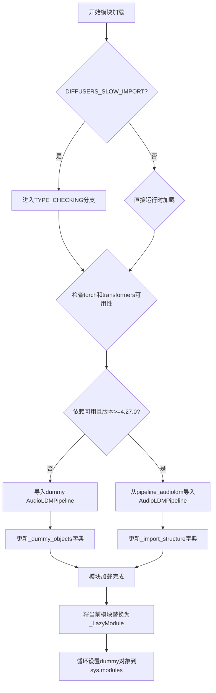
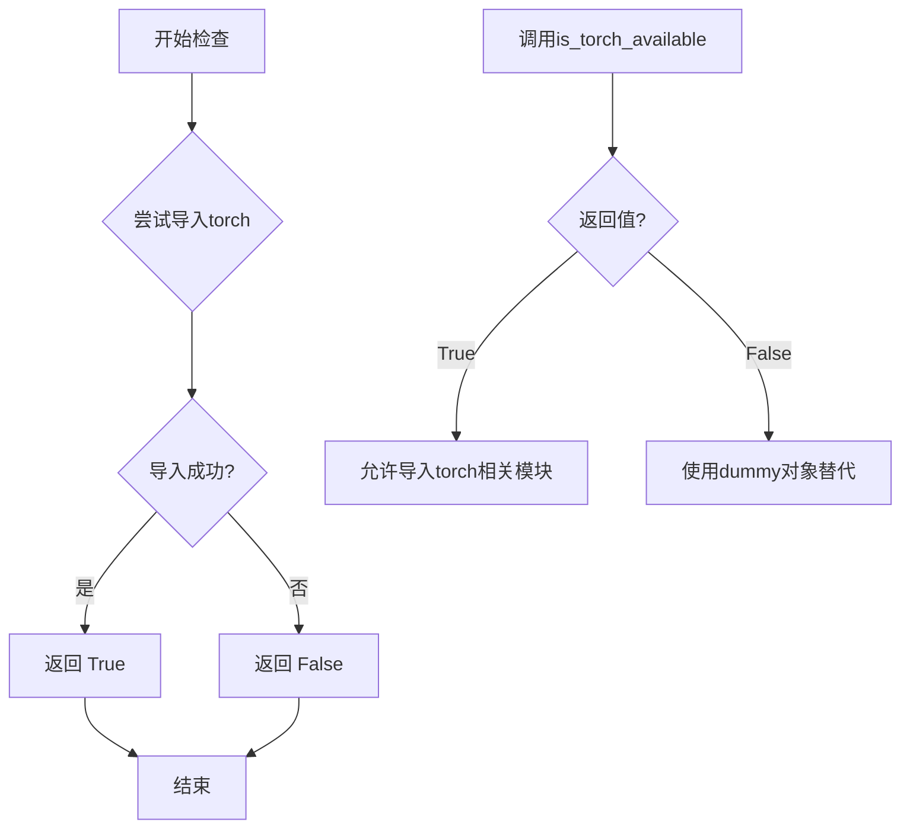
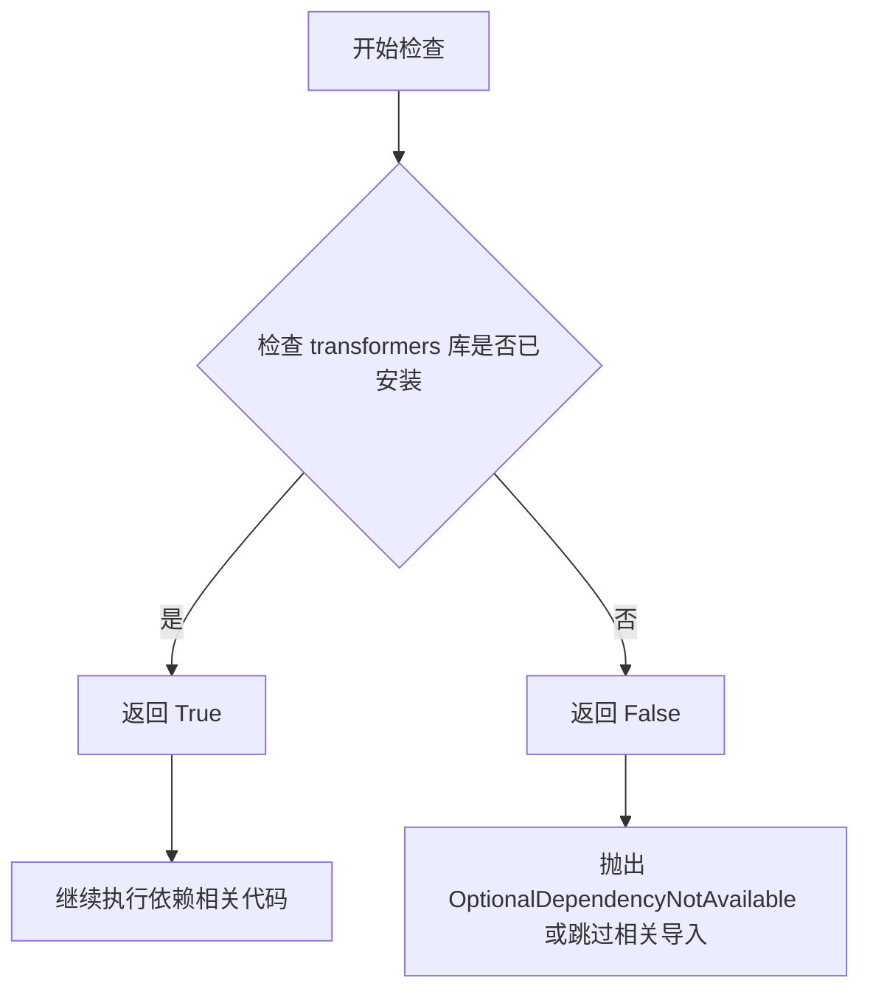
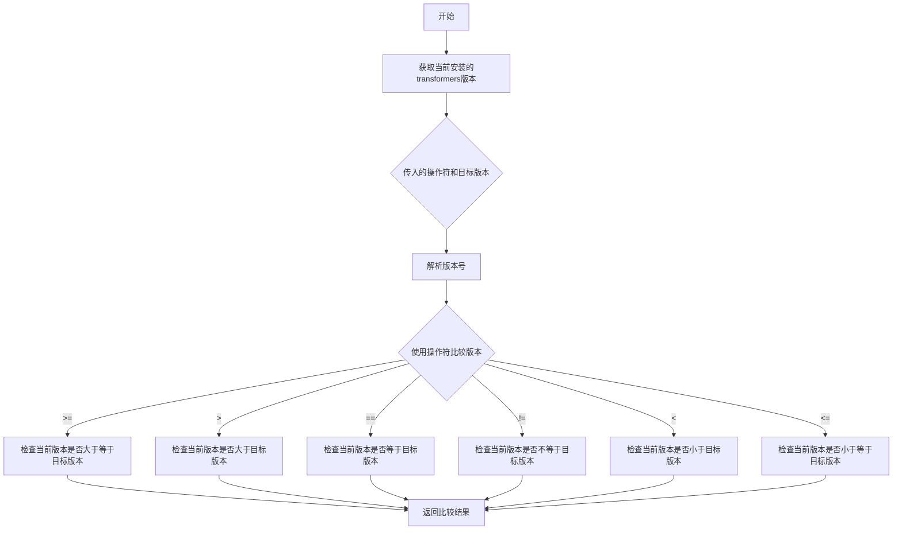

# `diffusers\src\diffusers\pipelines\audioldm\__init__.py` 详细设计文档

这是一个Diffusers库的管道初始化文件，通过延迟导入机制动态加载AudioLDMPipeline类。该模块检查torch和transformers的可用性及版本要求（>=4.27.0），在依赖满足时导入真实实现，否则使用dummy对象作为占位符，从而实现可选依赖的平滑处理。

## 整体流程



## 类结构

```
Lazy Import Mechanism
├── _import_structure (dict) - 导入结构映射
├── _dummy_objects (dict) - 虚拟对象存储
└── _LazyModule - 延迟加载模块类
```

## 全局变量及字段


### `_dummy_objects`
    
存储可选依赖不可用时的虚拟对象字典，用于在依赖缺失时提供回退对象

类型：`dict`
    


### `_import_structure`
    
存储可用管道的导入结构映射字典，键为模块名，值为可导出对象列表

类型：`dict`
    


### `DIFFUSERS_SLOW_IMPORT`
    
控制是否延迟导入的标志，为True时启用延迟加载机制

类型：`bool`
    


### `__name__`
    
当前模块名称，标识该模块在Python包中的唯一路径

类型：`str`
    


### `__file__`
    
当前模块文件路径，指向该模块的物理文件位置

类型：`str`
    


### `__spec__`
    
模块规格对象，包含模块的元数据信息和导入配置

类型：`ModuleSpec`
    


### `_LazyModule.__name__`
    
延迟模块的名称，传递给_LazyModule用于标识

类型：`str`
    


### `_LazyModule.__file__`
    
延迟模块的文件路径，用于模块定位

类型：`str`
    


### `_LazyModule._import_structure`
    
延迟模块的导入结构映射，控制模块成员的懒加载

类型：`dict`
    


### `_LazyModule.module_spec`
    
模块规格对象，提供模块的完整规格信息

类型：`ModuleSpec`
    
    

## 全局函数及方法


### `is_torch_available`

该函数用于检查当前Python环境中是否安装了torch库（PyTorch），以便在模块中条件性地导入或使用PyTorch相关的功能。

参数：

- 无参数

返回值：`bool`，返回`True`表示torch库可用，返回`False`表示不可用。

#### 流程图



#### 带注释源码

```python
# 从utils模块导入is_torch_available函数
# 该函数通常在.../utils/__init__.py中定义
from ...utils import (
    DIFFUSERS_SLOW_IMPORT,
    OptionalDependencyNotAvailable,
    _LazyModule,
    is_torch_available,        # <-- 从utils导入的函数
    is_transformers_available,
    is_transformers_version,
)

# ... 其他导入代码 ...

# 使用is_torch_available()检查torch是否可用
try:
    # 条件检查：transformers和torch都必须可用，且transformers版本>=4.27.0
    if not (is_transformers_available() and is_torch_available() and is_transformers_version(">=", "4.27.0")):
        # 如果任一条件不满足，抛出OptionalDependencyNotAvailable异常
        raise OptionalDependencyNotAvailable()
except OptionalDependencyNotAvailable:
    # 异常处理：当torch不可用时，从dummy模块导入替代对象
    from ...utils.dummy_torch_and_transformers_objects import (
        AudioLDMPipeline,
    )
    # 更新dummy对象字典
    _dummy_objects.update({"AudioLDMPipeline": AudioLDMPipeline})
else:
    # 当所有依赖都满足时，正常导入pipeline模块
    _import_structure["pipeline_audioldm"] = ["AudioLDMPipeline"]
```

#### 补充说明

| 项目 | 说明 |
|------|------|
| **定义位置** | 该函数定义在 `.../utils/__init__.py` 中，不在本代码文件内 |
| **调用场景** | 用于可选依赖的延迟导入机制，支持条件性地加载torch相关功能 |
| **相关函数** | `is_transformers_available()`, `is_transformers_version()` |
| **设计目的** | 实现可选依赖的优雅降级，当torch不可用时使用dummy对象替代 |

#### 技术债务/优化空间

1. **重复检查逻辑**：在代码中有多处相同的条件检查（try-except块出现了两次），可以考虑封装为辅助函数
2. **硬编码版本号**：transformers版本要求 "4.27.0" 硬编码在多处，建议提取为配置常量
3. **错误处理粒度**：当前实现对torch和transformers的检查是耦合的，无法区分具体哪个依赖不可用


### `is_transformers_available`

该函数用于检查当前环境中是否安装了 `transformers` 库。它是 Diffusers 库中的依赖检查工具函数，帮助实现可选依赖的延迟导入（Lazy Import）机制。

参数：
- 该函数无显式参数（可能接受可选参数如特定版本检查）

返回值：`bool`，返回 `True` 表示 `transformers` 库可用，返回 `False` 表示不可用。

#### 流程图



#### 带注释源码

```python
# is_transformers_available 函数的典型实现逻辑
# （此函数定义在 ...utils 中，当前代码仅导入使用）

def is_transformers_available():
    """
    检查 transformers 库是否可用。
    
    实现原理：
    1. 尝试导入 transformers 模块
    2. 如果导入成功返回 True，否则返回 False
    """
    try:
        import transformers
        return True
    except ImportError:
        return False

# 在当前代码中的实际使用方式：
# if not (is_transformers_available() and is_torch_available() and is_transformers_version(">=", "4.27.0")):
#     raise OptionalDependencyNotAvailable()
```

#### 备注

- **函数来源**：`is_transformers_available` 是在 `...utils` 模块中定义的工具函数，当前代码通过 `from ...utils import is_transformers_available` 导入使用
- **设计目的**：实现可选依赖的动态检查，支持模块的延迟加载，避免在缺少可选依赖时直接报错
- **关联函数**：常与 `is_torch_available()`、`is_transformers_version()` 配合使用，形成完整的依赖检查链


### `is_transformers_version`

检查已安装的 transformers 库版本是否满足指定的要求，用于条件导入和功能可用性判断。

参数：

- `operator`： `str`，比较操作符，支持 "=="、"!="、">"、">="、"<"、<=" 等
- `version`： `str`，目标版本号，如 "4.27.0"

返回值： `bool`，如果当前安装的 transformers 版本满足指定条件返回 `True`，否则返回 `False`

#### 流程图



#### 带注释源码

```python
# is_transformers_version 函数定义示例（位于 utils/__init__.py 或类似位置）

from packaging import version

def is_transformers_version(op: str, ver: str) -> bool:
    """
    检查 transformers 版本是否满足指定条件
    
    参数:
        op: str, 比较操作符，如 ">=", ">", "==", "!=", "<", "<="
        ver: str, 目标版本号，如 "4.27.0"
    
    返回:
        bool: 版本比较结果
    """
    # 尝试导入 transformers，获取当前版本
    try:
        import transformers
        from packaging.version import Version as V
        
        # 使用 packaging.version 进行版本比较
        current_version = V(transformers.__version__)
        target_version = V(ver)
        
        # 根据操作符进行版本比较
        if op == ">=":
            return current_version >= target_version
        elif op == ">":
            return current_version > target_version
        elif op == "==":
            return current_version == target_version
        elif op == "!=":
            return current_version != target_version
        elif op == "<":
            return current_version < target_version
        elif op == "<=":
            return current_version <= target_version
        else:
            raise ValueError(f"Unsupported operator: {op}")
            
    except ImportError:
        # 如果未安装 transformers，返回 False
        return False


# 在给定代码中的实际使用方式：
# is_transformers_version(">=", "4.27.0")
# 用于检查 transformers 版本是否 >= 4.27.0
```


### `setattr` (在循环中动态设置模块属性)

此代码段使用 Python 内置的 `setattr()` 函数，在延迟加载模块的初始化过程中，将虚拟对象（dummy objects）动态绑定到当前模块的属性上，确保模块在未安装可选依赖时仍能被导入而不引发 ImportError。

参数：

- `obj`：`object`，要设置属性的目标对象，此处为 `sys.modules[__name__]`（当前延迟加载模块实例）
- `name`：`str`，要设置的属性名称，此处为 `_dummy_objects` 字典中的键（如 `"AudioLDMPipeline"`）
- `value`：`object`，要设置的属性值，此处为 `_dummy_objects` 字典中的值（dummy 占位符对象）

返回值：`None`，Python 内置 `setattr()` 函数不返回值，操作直接作用于目标对象的命名空间

#### 流程图

```mermaid
flowchart TD
    A[开始遍历 _dummy_objects] --> B{是否还有未处理的键值对}
    B -->|是| C[取出键值对 name, value]
    C --> D[调用 setattr sys.modules[__name__], name, value]
    D --> E[将 dummy 对象动态绑定到模块属性]
    E --> B
    B -->|否| F[结束]
```

#### 带注释源码

```python
# 遍历 _dummy_objects 字典中的所有键值对
# _dummy_objects 格式: {"AudioLDMPipeline": <dummy_object>}
for name, value in _dummy_objects.items():
    # setattr(obj, name, value) 是 Python 内置函数
    # 功能: 将对象 obj 的属性 name 设置为 value
    # 参数1: sys.modules[__name__] 表示当前模块的命名空间
    # 参数2: name 是字符串类型的属性名
    # 参数3: value 是要绑定的属性值（这里是 dummy 占位符对象）
    # 作用: 当用户尝试访问 from xxx import AudioLDMPipeline 时
    #       即使没有安装 torch/transformers 依赖，也能获得一个虚拟对象
    #       避免 ImportError，但实际使用时会抛出有意义的错误信息
    setattr(sys.modules[__name__], name, value)
```


我将分析这段代码，提取`_LazyModule.__getattr__` (隐式)的相关信息。

首先，让我查看`_LazyModule`类的定义，以便理解其`__getattr__`方法的实现逻辑。
<minimax:tool_call>
<invoke name="read">
<parameter name="file_path">/Users/zebao/playground/inference-all-in-one/diffusers/src/diffusers/utils/import_utils.py</parameter>
<parameter name="offset">1</parameter>
<parameter name="limit">200</parameter>
</invoke>
</minimax:tool_call>

## 关键组件


### 懒加载模块机制

使用 `_LazyModule` 实现延迟导入，在 DIFFUSERS_SLOW_IMPORT 为真或非 TYPE_CHECKING 模式下，将模块注册为懒加载模块，延迟加载实际的管道类。

### 可选依赖检查与处理

通过 `is_transformers_available()`、`is_torch_available()` 和 `is_transformers_version(">=", "4.27.0")` 检查必需依赖，依赖不可用时抛出 `OptionalDependencyNotAvailable` 异常并使用虚拟对象。

### 条件导入机制

根据 `TYPE_CHECKING` 或 `DIFFUSERS_SLOW_IMPORT` 标志决定是提前导入还是延迟导入：在类型检查时直接导入真实类，在运行时使用懒加载机制。

### 虚拟对象模式（Dummy Objects）

当依赖不可用时，从 `dummy_torch_and_transformers_objects` 导入虚拟的 `AudioLDMPipeline` 类，确保模块在缺少依赖时仍可导入，避免导入错误。

### 导入结构字典

`_import_structure` 字典定义模块的导出结构，记录可用的管道类名称，供懒加载系统使用。

### 模块动态替换

通过 `setattr(sys.modules[__name__], name, value)` 将虚拟对象动态添加到当前模块，使依赖缺失时仍能通过 `from xxx import AudioLDMPipeline` 导入。


## 问题及建议


### 已知问题

-   **代码重复（DRY原则违反）**: 依赖检查逻辑（`is_transformers_available()`, `is_torch_available()`, `is_transformers_version()`）在 `try` 块和 `TYPE_CHECKING` 块中重复出现，增加了维护成本。
-   **硬编码版本号**: 版本号 `"4.27.0"` 硬编码在多个位置，若需支持多个版本或更改版本要求，需要修改多处。
-   **全局可变状态**: `_dummy_objects` 和 `_import_structure` 使用全局可变字典，可能在复杂的导入场景中产生意外的副作用或竞态条件。
-   **魔法条件逻辑**: `TYPE_CHECKING or DIFFUSERS_SLOW_IMPORT` 的双重条件增加了代码分支的复杂性，降低了可读性。
-   **缺乏文档**: 模块缺少文档字符串（docstring），难以快速理解其设计意图和用途。
-   **sys.modules 直接操作**: 直接修改 `sys.modules[__name__]` 属于黑魔法操作，可能与其他导入机制产生冲突，难以追踪。
-   **错误信息不明确**: 当可选依赖不可用时，捕获 `OptionalDependencyNotAvailable` 但没有提供清晰的错误上下文或日志。

### 优化建议

-   **提取依赖检查逻辑**: 将版本和依赖检查封装为单独的函数或常量，例如 `def _check_dependencies() -> bool`，避免重复代码。
-   **配置化版本要求**: 将版本号提取为模块级常量 `MIN_TRANSFORMERS_VERSION = "4.27.0"`，便于集中管理。
-   **添加文档字符串**: 在模块开头添加详细的 docstring，说明模块职责、依赖要求和导入机制。
-   **简化条件分支**: 考虑使用工厂函数或策略模式重构导入逻辑，将条件差异内部化。
-   **添加日志/警告**: 在依赖检查失败时，记录详细的日志信息，便于调试和排查问题。
-   **考虑类型提示增强**: 为全局变量添加类型注解，提高代码的可维护性和 IDE 支持。


## 其它


### 设计目标与约束

本模块的设计目标是实现可选依赖的延迟加载（Lazy Loading），在保证核心功能可用的同时，避免强耦合到特定的深度学习框架（PyTorch和Transformers）。设计约束包括：1）必须使用Python的TYPE_CHECKING机制支持类型检查；2）必须在DIFFUSERS_SLOW_IMPORT标志为真时立即加载模块；3）必须维护与diffusers库的LazyModule架构兼容性；4）仅支持Python 3.7+环境。

### 错误处理与异常设计

本模块主要通过OptionalDependencyNotAvailable异常处理可选依赖的不可用情况。当torch或transformers不可用，或transformers版本低于4.27.0时，抛出OptionalDependencyNotAvailable异常并回退到dummy对象。所有依赖检查逻辑均被try-except块包裹，确保模块在缺少可选依赖时仍可正常导入（只是无法使用实际功能）。_dummy_objects字典用于存储当依赖不可用时的替代类定义。

### 外部依赖与接口契约

本模块的外部依赖包括：1）torch（可选，需>=特定版本功能）；2）transformers（可选，版本需>=4.27.0）；3）diffusers库内部模块（...utils包）。接口契约方面：本模块导出AudioLDMPipeline类，当依赖可用时从pipeline_audioldm模块导入，当依赖不可用时从dummy对象导入。模块遵循LazyModule规范，通过sys.modules动态替换自身实现延迟加载。

### 版本兼容性信息

本模块对transformers库的版本有明确要求：必须大于等于4.27.0版本，这是因为AudioLDMPipeline可能使用了该版本引入的新API或功能。对Python版本的要求遵循diffusers库的通用要求（通常为3.7+）。对PyTorch版本无显式检查，但假设与transformers 4.27.0+兼容的PyTorch版本（通常为1.9.0+）。

### 性能考虑与优化空间

本模块采用LazyModule机制实现延迟加载，这显著减少了模块初始化时间，特别是当用户不需要使用AudioLDMPipeline时。性能优化方面：1）仅在TYPE_CHECKING或DIFFUSERS_SLOW_IMPORT为真时才执行实际的模块导入；2）通过_import_structure字典预先声明导出项，支持IDE的代码补全。潜在优化空间包括：可以考虑使用functools.lru_cache缓存依赖检查结果，避免重复调用is_transformers_available等函数。

### 安全考虑

本模块不涉及用户输入处理或网络通信，安全性主要考虑模块导入层面的问题。由于使用了动态模块替换机制（sys.modules[__name__] = _LazyModule(...），理论上存在模块劫持风险，但在diffusers框架内部使用场景下是可接受的。_dummy_objects通过setattr直接设置到sys.modules中，确保了命名空间的一致性。

### 测试策略建议

建议测试以下场景：1）在完整依赖环境下导入模块，验证AudioLDMPipeline正确从pipeline_audioldm导入；2）在缺少torch或transformers环境下导入模块，验证dummy对象被正确加载；3）在transformers版本低于4.27.0时验证正确的回退行为；4）验证TYPE_CHECKING模式下的导入行为；5）验证DIFFUSERS_SLOW_IMPORT模式下的立即加载行为。

### 使用示例

```python
# 标准导入（延迟加载）
from diffusers import AudioLDMPipeline
pipeline = AudioLDMPipeline.from_pretrained("cvssp/audioldm")

# 类型检查导入
from typing import TYPE_CHECKING
if TYPE_CHECKING:
    from diffusers import AudioLDMPipeline
```

### 配置和初始化参数

本模块无直接的可配置参数，其行为受以下环境变量和标志影响：1）DIFFUSERS_SLOW_IMPORT：控制是否立即加载或延迟加载；2）torch和transformers的可用性：由各自库的安装状态决定；3）transformers版本：通过is_transformers_version函数检查。

### 已知问题和限制

1）当可选依赖不可用时，尝试实例化AudioLDMPipeline会引发ImportError或AttributeError，而非更友好的错误提示；2）模块无法检测torch和transformers之间的版本兼容性问题，仅检查transformers版本；3）在某些边缘情况下（如模块在导入过程中被多次重新加载），LazyModule的行为可能不稳定。

### 相关文档和参考

建议参考以下文档：1）diffusers库官方文档中关于自定义Pipeline的部分；2）Python官方文档中关于typing.TYPE_CHECKING的说明；3）Python importlib.util.module_from_spec和LazyModule的实现原理；4）AudioLDMPipeline的模型卡片和使用文档。


    