# `diffusers\src\diffusers\pipelines\audioldm\pipeline_audioldm.py` 详细设计文档

AudioLDMPipeline是一个用于文本到音频生成的Diffusion Pipeline，通过CLAP文本编码器编码文本提示，使用UNet2D去噪模型处理潜在表示，最后通过Vocoder将梅尔频谱图转换为实际音频波形。

## 整体流程

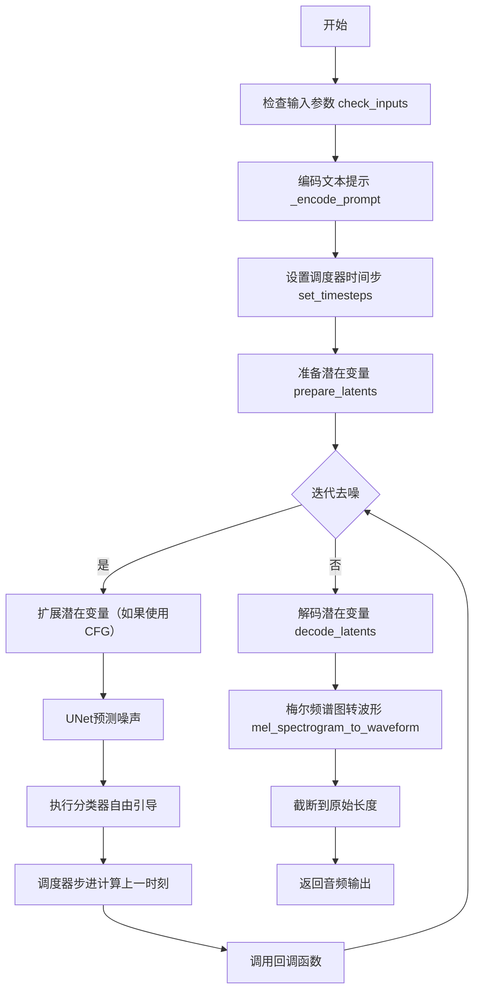

## 类结构

```
DiffusionPipeline (基类)
├── DeprecatedPipelineMixin
├── StableDiffusionMixin
└── AudioLDMPipeline (主类)
```

## 全局变量及字段


### `logger`
    
模块级日志记录器，用于输出警告和信息

类型：`logging.Logger`
    


### `EXAMPLE_DOC_STRING`
    
包含pipeline使用示例的文档字符串，展示如何用AudioLDMPipeline生成音频

类型：`str`
    


### `XLA_AVAILABLE`
    
标志位，指示PyTorch XLA是否可用，用于支持TPU等加速设备

类型：`bool`
    


### `AudioLDMPipeline.vae`
    
变分自编码器模型，用于将音频编码到潜在空间并从潜在表示解码为梅尔频谱图

类型：`AutoencoderKL`
    


### `AudioLDMPipeline.text_encoder`
    
冻结的CLAP文本编码器模型，将文本提示转换为文本嵌入向量

类型：`ClapTextModelWithProjection`
    


### `AudioLDMPipeline.tokenizer`
    
RoBERTa分词器，用于将文本字符串 token 化为输入ID序列

类型：`RobertaTokenizer | RobertaTokenizerFast`
    


### `AudioLDMPipeline.unet`
    
条件UNet2D模型，在扩散过程中根据文本嵌入去噪潜在表示

类型：`UNet2DConditionModel`
    


### `AudioLDMPipeline.scheduler`
    
Karras扩散调度器，管理去噪过程中的噪声调度和采样策略

类型：`KarrasDiffusionSchedulers`
    


### `AudioLDMPipeline.vocoder`
    
SpeechT5 HiFi-GAN声码器，将梅尔频谱图转换为音频波形

类型：`SpeechT5HifiGan`
    


### `AudioLDMPipeline.vae_scale_factor`
    
VAE缩放因子，用于计算潜在空间的降采样比例

类型：`int`
    


### `AudioLDMPipeline._last_supported_version`
    
记录该pipeline最后支持的diffusers版本号

类型：`str`
    


### `AudioLDMPipeline.model_cpu_offload_seq`
    
定义模型组件在CPU卸载时的顺序序列

类型：`str`
    
    

## 全局函数及方法


### `randn_tensor`

用于生成符合标准正态分布（均值0，方差1）的随机张量，支持通过随机数生成器（generator）实现可重复的随机采样，常用于扩散模型中初始化潜在变量（latents）。

参数：

- `shape`：`tuple` 或 `int`，要生成张量的形状
- `generator`：`torch.Generator`，可选，用于控制随机数生成的确定性
- `device`：`torch.device`，可选，生成张量所在的设备（CPU/CUDA）
- `dtype`：`torch.dtype`，可选，生成张量的数据类型（如float32、float16等）

返回值：`torch.Tensor`，符合标准正态分布的随机张量

#### 流程图

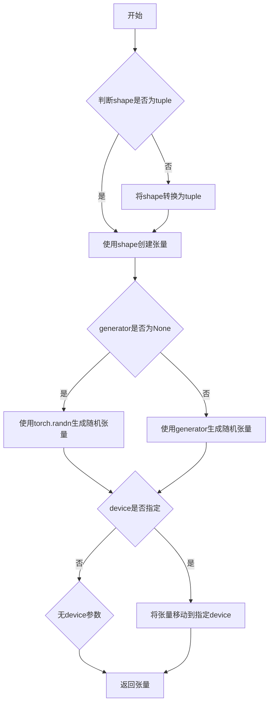

#### 带注释源码

```python
# 从代码中使用的方式推断出的函数签名和实现逻辑
# 在prepare_latents方法中的调用方式：
# latents = randn_tensor(shape, generator=generator, device=device, dtype=dtype)

def randn_tensor(
    shape: tuple | int,  # 张量形状，可以是整数或元组
    generator: torch.Generator | None = None,  # 可选的随机数生成器
    device: torch.device | None = None,  # 张量设备
    dtype: torch.dtype | None = None,  # 张量数据类型
) -> torch.Tensor:
    """
    生成符合标准正态分布（高斯分布）的随机张量。
    
    该函数是PyTorch torch.randn的包装器，添加了对随机数生成器（generator）
    的支持，以便在扩散模型的采样过程中实现可重复的随机结果。
    
    Args:
        shape: 要生成的张量形状，如(batch_size, channels, height, width)
        generator: torch.Generator对象，用于生成确定性随机数
        device: 目标设备（cpu/cuda）
        dtype: 张量的数据类型
    
    Returns:
        符合标准正态分布的torch.Tensor
    """
    # 逻辑实现（基于diffusers库的实际实现推测）
    # 1. 如果提供了generator，使用generator生成随机数
    # 2. 否则使用torch.randn直接生成
    # 3. 如果指定了device，将张量移动到对应设备
    # 4. 如果指定了dtype，转换张量数据类型
```


### `inspect.signature`

获取可调用对象（如函数、方法、类等）的签名（Signature对象），包含参数的名称、默认值、注解等详细信息。

参数：

- `obj`：`Callable`，必填，要获取签名的可调用对象（如函数、方法、类构造函数等）
- `follow_wrapped`：`bool`，可选（默认为`True`），是否跟随`__wrapped__`属性链以获取原始函数的签名

返回值：`inspect.Signature`，返回代表可调用对象签名的Signature对象，包含所有参数的信息

#### 流程图

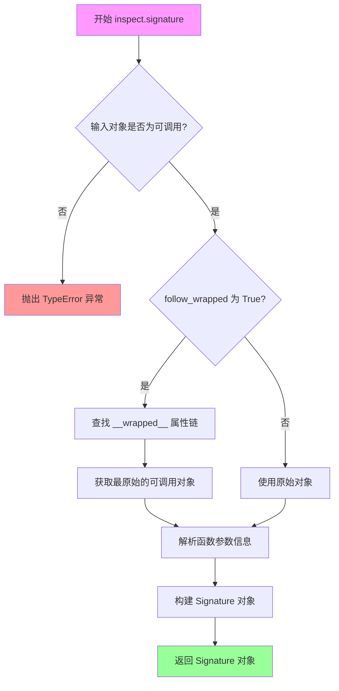

#### 带注释源码

```python
import inspect
from typing import get_type_hints

# 示例函数定义
def example_function(a: int, b: str = "default", *args, **kwargs) -> bool:
    """示例函数，用于演示 inspect.signature 的用法"""
    return True

# 1. 基本用法：获取函数的签名
signature = inspect.signature(example_function)
print(f"函数签名: {signature}")
# 输出: (a: int, b: str = 'default', *args, **kwargs) -> bool

# 2. 遍历签名中的所有参数
print("\n参数详细信息:")
for param_name, param in signature.parameters.items():
    print(f"  参数名: {param_name}")
    print(f"    类型: {param.kind.name}")  # POSITIONAL_ONLY, POSITIONAL_OR_KEYWORD, VAR_POSITIONAL, KEYWORD_ONLY, VAR_KEYWORD
    print(f"    默认值: {param.default}")
    print(f"    注解: {param.annotation}")
    print()

# 3. 绑定参数值（模拟调用）
bound_values = {'a': 10, 'b': 'test', 'extra': 123}
try:
    bound_signature = signature.bind(**bound_values)
    bound_signature.apply_defaults()
    print(f"绑定后的参数: {bound_signature.arguments}")
except TypeError as e:
    print(f"参数绑定失败: {e}")

# 4. 检查函数是否接受特定参数
def check_accepts_param(sig, param_name):
    """检查签名是否包含指定参数"""
    return param_name in sig.parameters

print(f"\n是否包含 'a' 参数: {check_accepts_param(signature, 'a')}")
print(f"是否包含 'c' 参数: {check_accepts_param(signature, 'c')}")

# 5. 用于类和方法
class MyClass:
    def __init__(self, x: int, y: int = 0):
        self.x = x
        self.y = y
    
    def method(self, a: str, b: float = 1.0) -> str:
        return f"{a}: {b}"

# 获取类的 __init__ 方法签名
class_sig = inspect.signature(MyClass.__init__)
print(f"\n类构造函数签名: {class_sig}")

# 获取类方法的签名
method_sig = inspect.signature(MyClass.method)
print(f"类方法签名: {method_sig}")

# 6. 获取函数的返回类型注解
if signature.return_annotation is not inspect.Signature.empty:
    print(f"\n返回类型注解: {signature.return_annotation}")

# 7. 使用 follow_wrapped=False 获取被包装函数的实际签名
def wrapper(a, b):
    return a + b

def outer(func):
    def inner(*args, **kwargs):
        return func(*args, **kwargs)
    inner.__wrapped__ = func  # 模拟装饰器设置
    return inner

wrapped_func = outer(wrapper)

# follow_wrapped=True (默认): 获取 wrapper 的签名
sig_with_wrap = inspect.signature(wrapped_func)
print(f"\nfollow_wrapped=True: {sig_with_wrap}")

# follow_wrapped=False: 获取原始 wrapper 的签名
sig_without_wrap = inspect.signature(wrapped_func, follow_wrapped=False)
print(f"follow_wrapped=False: {sig_without_wrap}")
```

**关键点说明：**

- `inspect.signature` 是 Python 3.3+ 引入的标准库函数，位于 `inspect` 模块中
- 返回的 `Signature` 对象包含 `parameters` 字典，键为参数名，值为 `Parameter` 对象
- `Parameter` 对象有以下重要属性：
  - `name`: 参数名称
  - `default`: 默认值（如果没有默认值则为 `inspect.Parameter.empty`）
  - `annotation`: 类型注解（如果没有注解则为 `inspect.Signature.empty`）
  - `kind`: 参数类型（POSITIONAL_ONLY, POSITIONAL_OR_KEYWORD, VAR_POSITIONAL, KEYWORD_ONLY, VAR_KEYWORD）
- 在代码中的实际使用场景是检查调度器（scheduler）的 `step` 方法是否接受 `eta` 和 `generator` 参数，以动态适配不同的调度器实现


# 文档提取结果

## 概述

在提供的代码中，`np` 是 `numpy` 库的别名导入，用于支持音频处理管道中的数值计算操作。

---

### `numpy` (np)

numpy 库在 AudioLDMPipeline 中用于数值运算，主要用于音频长度计算和向上采样因子的处理。

参数：N/A - 这是一个库别名，非函数调用

返回值：N/A

#### 使用场景

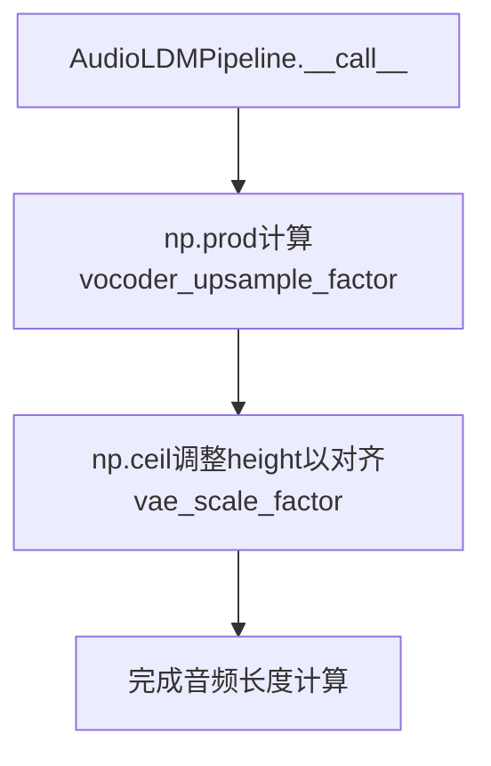

#### 代码中的实际使用

```python
# 在 __call__ 方法中:

# 1. 计算 vocoder 向上采样因子
vocoder_upsample_factor = np.prod(self.vocoder.config.upsample_rates) / self.vocoder.config.sampling_rate

# 2. 使用 np.ceil 确保 height 能被 vae_scale_factor 整除
height = int(np.ceil(height / self.vae_scale_factor)) * self.vae_scale_factor
```

---

## 技术债务与优化空间

1. **numpy 依赖**: 代码直接依赖 numpy 进行基本数学运算，可考虑使用 torch 替代以保持计算图一致性
2. **类型转换开销**: 在 `mel_spectrogram_to_waveform` 中从 GPU 张量转到 CPU 再转 float32，存在优化空间

## 其他信息

| 项目 | 描述 |
|------|------|
| 导入方式 | `import numpy as np` |
| 主要用途 | 计算 vocoder 向上采样因子和高度对齐 |
| 替代方案 | 可使用 `torch.prod` 和 `torch.ceil` 替代，保持张量设备一致性 |


### `AudioLDMPipeline.__call__`

主方法，用于根据文本提示生成音频。该方法通过去噪过程将随机潜在表示转换为梅尔频谱图，然后使用声码器将其转换为波形音频。

参数：

- `prompt`：`str | list[str] | None`，用于引导音频生成的文本提示
- `audio_length_in_s`：`float | None`，生成的音频长度（秒），默认5.12秒
- `num_inference_steps`：`int`，去噪步数，默认10
- `guidance_scale`：`float`，引导比例，控制文本与音频的相关性，默认2.5
- `negative_prompt`：`str | list[str] | None`，不希望出现在音频中的提示
- `num_waveforms_per_prompt`：`int`，每个提示生成的波形数量，默认1
- `eta`：`float`，DDIM论文中的η参数，默认0.0
- `generator`：`torch.Generator | list[torch.Generator] | None`，随机数生成器，用于确定性生成
- `latents`：`torch.Tensor | None`，预生成的噪声潜在表示
- `prompt_embeds`：`torch.Tensor | None`，预生成的文本嵌入
- `negative_prompt_embeds`：`torch.Tensor | None`，预生成的负向文本嵌入
- `return_dict`：`bool`，是否返回AudioPipelineOutput，默认True
- `callback`：`Callable | None`，推理过程中每callback_steps步调用的回调函数
- `callback_steps`：`int`，回调函数调用频率，默认1
- `cross_attention_kwargs`：`dict | None`，传递给注意力处理器的参数字典
- `output_type`：`str`，输出格式，"np"或"pt"，默认"np"

返回值：`AudioPipelineOutput | tuple`，包含生成的音频

#### 流程图

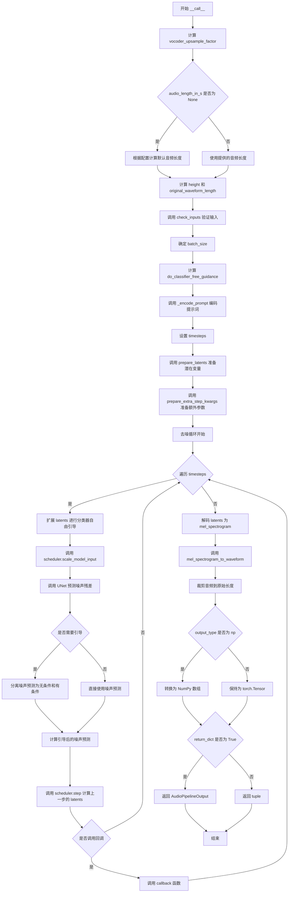

#### 带注释源码

```python
@torch.no_grad()
@replace_example_docstring(EXAMPLE_DOC_STRING)
def __call__(
    self,
    prompt: str | list[str] = None,
    audio_length_in_s: float | None = None,
    num_inference_steps: int = 10,
    guidance_scale: float = 2.5,
    negative_prompt: str | list[str] | None = None,
    num_waveforms_per_prompt: int | None = 1,
    eta: float = 0.0,
    generator: torch.Generator | list[torch.Generator] | None = None,
    latents: torch.Tensor | None = None,
    prompt_embeds: torch.Tensor | None = None,
    negative_prompt_embeds: torch.Tensor | None = None,
    return_dict: bool = True,
    callback: Callable[[int, int, torch.Tensor], None] | None = None,
    callback_steps: int | None = 1,
    cross_attention_kwargs: dict[str, Any] | None = None,
    output_type: str | None = "np",
):
    r"""
    The call function to the pipeline for generation.

    Args:
        prompt (`str` or `list[str]`, *optional*):
            The prompt or prompts to guide audio generation. If not defined, you need to pass `prompt_embeds`.
        audio_length_in_s (`int`, *optional*, defaults to 5.12):
            The length of the generated audio sample in seconds.
        num_inference_steps (`int`, *optional*, defaults to 10):
            The number of denoising steps. More denoising steps usually lead to a higher quality audio at the
            expense of slower inference.
        guidance_scale (`float`, *optional*, defaults to 2.5):
            A higher guidance scale value encourages the model to generate audio that is closely linked to the text
            `prompt` at the expense of lower sound quality. Guidance scale is enabled when `guidance_scale > 1`.
        negative_prompt (`str` or `list[str]`, *optional*):
            The prompt or prompts to guide what to not include in audio generation. If not defined, you need to
            pass `negative_prompt_embeds` instead. Ignored when not using guidance (`guidance_scale < 1`).
        num_waveforms_per_prompt (`int`, *optional*, defaults to 1):
            The number of waveforms to generate per prompt.
        eta (`float`, *optional*, defaults to 0.0):
            Corresponds to parameter eta (η) from the [DDIM](https://huggingface.co/papers/2010.02502) paper. Only
            applies to the [`~schedulers.DDIMScheduler`], and is ignored in other schedulers.
        generator (`torch.Generator` or `list[torch.Generator]`, *optional*):
            A [`torch.Generator`](https://pytorch.org/docs/stable/generated/torch.Generator.html) to make
            generation deterministic.
        latents (`torch.Tensor`, *optional*):
            Pre-generated noisy latents sampled from a Gaussian distribution, to be used as inputs for image
            generation. Can be used to tweak the same generation with different prompts. If not provided, a latents
            tensor is generated by sampling using the supplied random `generator`.
        prompt_embeds (`torch.Tensor`, *optional*):
            Pre-generated text embeddings. Can be used to easily tweak text inputs (prompt weighting). If not
            provided, text embeddings are generated from the `prompt` input argument.
        negative_prompt_embeds (`torch.Tensor`, *optional*):
            Pre-generated negative text embeddings. Can be used to easily tweak text inputs (prompt weighting). If
            not provided, `negative_prompt_embeds` are generated from the `negative_prompt` input argument.
        return_dict (`bool`, *optional*, defaults to `True`):
            Whether or not to return a [`~pipelines.AudioPipelineOutput`] instead of a plain tuple.
        callback (`Callable`, *optional*):
            A function that calls every `callback_steps` steps during inference. The function is called with the
            following arguments: `callback(step: int, timestep: int, latents: torch.Tensor)`.
        callback_steps (`int`, *optional*, defaults to 1):
            The frequency at which the `callback` function is called. If not specified, the callback is called at
            every step.
        cross_attention_kwargs (`dict`, *optional*):
            A kwargs dictionary that if specified is passed along to the [`AttentionProcessor`] as defined in
            [`self.processor`](https://github.com/huggingface/diffusers/blob/main/src/diffusers/models/attention_processor.py).
        output_type (`str`, *optional*, defaults to `"np"`):
            The output format of the generated image. Choose between `"np"` to return a NumPy `np.ndarray` or
            `"pt"` to return a PyTorch `torch.Tensor` object.

    Examples:

    Returns:
        [`~pipelines.AudioPipelineOutput`] or `tuple`:
            If `return_dict` is `True`, [`~pipelines.AudioPipelineOutput`] is returned, otherwise a `tuple` is
            returned where the first element is a list with the generated audio.
    """
    # 0. Convert audio input length from seconds to spectrogram height
    # 计算声码器的上采样因子，用于将音频长度转换为频谱图高度
    vocoder_upsample_factor = np.prod(self.vocoder.config.upsample_rates) / self.vocoder.config.sampling_rate

    if audio_length_in_s is None:
        # 如果未指定音频长度，则根据模型配置计算默认长度
        audio_length_in_s = self.unet.config.sample_size * self.vae_scale_factor * vocoder_upsample_factor

    # 计算频谱图的高度
    height = int(audio_length_in_s / vocoder_upsample_factor)

    # 计算原始波形长度（采样率 × 时长）
    original_waveform_length = int(audio_length_in_s * self.vocoder.config.sampling_rate)
    
    # 确保高度可以被VAE缩放因子整除
    if height % self.vae_scale_factor != 0:
        height = int(np.ceil(height / self.vae_scale_factor)) * self.vae_scale_factor
        logger.info(
            f"Audio length in seconds {audio_length_in_s} is increased to {height * vocoder_upsample_factor} "
            f"so that it can be handled by the model. It will be cut to {audio_length_in_s} after the "
            f"denoising process."
        )

    # 1. Check inputs. Raise error if not correct
    # 验证所有输入参数的有效性
    self.check_inputs(
        prompt,
        audio_length_in_s,
        vocoder_upsample_factor,
        callback_steps,
        negative_prompt,
        prompt_embeds,
        negative_prompt_embeds,
    )

    # 2. Define call parameters
    # 根据输入确定批次大小
    if prompt is not None and isinstance(prompt, str):
        batch_size = 1
    elif prompt is not None and isinstance(prompt, list):
        batch_size = len(prompt)
    else:
        batch_size = prompt_embeds.shape[0]

    # 获取执行设备
    device = self._execution_device
    
    # 确定是否使用分类器自由引导（guidance_scale > 1.0 时启用）
    do_classifier_free_guidance = guidance_scale > 1.0

    # 3. Encode input prompt
    # 将文本提示编码为嵌入向量
    prompt_embeds = self._encode_prompt(
        prompt,
        device,
        num_waveforms_per_prompt,
        do_classifier_free_guidance,
        negative_prompt,
        prompt_embeds=prompt_embeds,
        negative_prompt_embeds=negative_prompt_embeds,
    )

    # 4. Prepare timesteps
    # 设置去噪调度器的时间步
    self.scheduler.set_timesteps(num_inference_steps, device=device)
    timesteps = self.scheduler.timesteps

    # 5. Prepare latent variables
    # 准备潜在变量（初始噪声）
    num_channels_latents = self.unet.config.in_channels
    latents = self.prepare_latents(
        batch_size * num_waveforms_per_prompt,
        num_channels_latents,
        height,
        prompt_embeds.dtype,
        device,
        generator,
        latents,
    )

    # 6. Prepare extra step kwargs
    # 准备调度器步骤的额外参数
    extra_step_kwargs = self.prepare_extra_step_kwargs(generator, eta)

    # 7. Denoising loop
    # 去噪循环的核心部分
    num_warmup_steps = len(timesteps) - num_inference_steps * self.scheduler.order
    with self.progress_bar(total=num_inference_steps) as progress_bar:
        for i, t in enumerate(timesteps):
            # expand the latents if we are doing classifier free guidance
            # 如果使用分类器自由引导，需要扩展潜在变量（复制为两份）
            latent_model_input = torch.cat([latents] * 2) if do_classifier_free_guidance else latents
            latent_model_input = self.scheduler.scale_model_input(latent_model_input, t)

            # predict the noise residual
            # 使用UNet预测噪声残差
            noise_pred = self.unet(
                latent_model_input,
                t,
                encoder_hidden_states=None,
                class_labels=prompt_embeds,  # 使用文本嵌入作为类别标签
                cross_attention_kwargs=cross_attention_kwargs,
            ).sample

            # perform guidance
            # 执行分类器自由引导
            if do_classifier_free_guidance:
                noise_pred_uncond, noise_pred_text = noise_pred.chunk(2)
                noise_pred = noise_pred_uncond + guidance_scale * (noise_pred_text - noise_pred_uncond)

            # compute the previous noisy sample x_t -> x_t-1
            # 计算前一个噪声样本 x_t -> x_t-1
            latents = self.scheduler.step(noise_pred, t, latents, **extra_step_kwargs).prev_sample

            # call the callback, if provided
            # 在适当的时机调用回调函数
            if i == len(timesteps) - 1 or ((i + 1) > num_warmup_steps and (i + 1) % self.scheduler.order == 0):
                progress_bar.update()
                if callback is not None and i % callback_steps == 0:
                    step_idx = i // getattr(self.scheduler, "order", 1)
                    callback(step_idx, t, latents)

            # 如果使用PyTorch XLA，进行标记步骤
            if XLA_AVAILABLE:
                xm.mark_step()

    # 8. Post-processing
    # 后处理阶段
    # 将潜在变量解码为梅尔频谱图
    mel_spectrogram = self.decode_latents(latents)

    # 将梅尔频谱图转换为波形
    audio = self.mel_spectrogram_to_waveform(mel_spectrogram)

    # 裁剪到原始音频长度
    audio = audio[:, :original_waveform_length]

    # 根据输出类型转换格式
    if output_type == "np":
        audio = audio.numpy()

    # 返回结果
    if not return_dict:
        return (audio,)

    return AudioPipelineOutput(audios=audio)
```

---

### `AudioLDMPipeline._encode_prompt`

将文本提示编码为文本嵌入向量。处理单提示和批量提示，支持分类器自由引导。

参数：

- `prompt`：`str | list[str] | None`，要编码的文本提示
- `device`：`torch.device`，目标设备
- `num_waveforms_per_prompt`：`int`，每个提示生成的波形数量
- `do_classifier_free_guidance`：`bool`，是否使用分类器自由引导
- `negative_prompt`：`str | list[str] | None`，负向提示
- `prompt_embeds`：`torch.Tensor | None`，预生成的文本嵌入
- `negative_prompt_embeds`：`torch.Tensor | None`，预生成的负向文本嵌入

返回值：`torch.Tensor`，编码后的文本嵌入

#### 流程图

```mermaid
flowchart TD
    A[开始 _encode_prompt] --> B{判断 prompt 类型}
    B -->|str| C[batch_size = 1]
    B -->|list| D[batch_size = len(prompt)]
    B -->|其他| E[batch_size = prompt_embeds.shape[0]]
    C --> F{prompt_embeds 为 None?}
    D --> F
    E --> F
    F -->|是| G[调用 tokenizer 进行分词]
    F -->|否| L[直接使用 prompt_embeds]
    G --> H[提取 input_ids 和 attention_mask]
    H --> I[检查是否被截断]
    I -->|是| J[记录警告]
    J --> K
    I -->|否| K
    K[调用 text_encoder 获取嵌入] --> M[进行 L2 标准化]
    M --> N[转换为目标设备和数据类型]
    N --> O{do_classifier_free_guidance?}
    O -->|是| P{negative_prompt_embeds 为 None?}
    O -->|否| R
    P -->|是| Q[处理负向提示]
    P -->|否| S
    Q --> T[调用 tokenizer 处理负向提示]
    T --> U[调用 text_encoder 获取负向嵌入]
    U --> V[进行 L2 标准化]
    V --> W[重复负向嵌入并拼接]
    W --> X[拼接负向和正向嵌入]
    X --> Y
    R --> Y[返回 prompt_embeds]
    S --> Y
    L --> Y
```

#### 带注释源码

```python
def _encode_prompt(
    self,
    prompt,
    device,
    num_waveforms_per_prompt,
    do_classifier_free_guidance,
    negative_prompt=None,
    prompt_embeds: torch.Tensor | None = None,
    negative_prompt_embeds: torch.Tensor | None = None,
):
    r"""
    Encodes the prompt into text encoder hidden states.

    Args:
        prompt (`str` or `list[str]`, *optional*):
            prompt to be encoded
        device (`torch.device`):
            torch device
        num_waveforms_per_prompt (`int`):
            number of waveforms that should be generated per prompt
        do_classifier_free_guidance (`bool`):
            whether to use classifier free guidance or not
        negative_prompt (`str` or `list[str]`, *optional*):
            The prompt or prompts not to guide the audio generation. If not defined, one has to pass
            `negative_prompt_embeds` instead. Ignored when not using guidance (i.e., ignored if `guidance_scale` is
            less than `1`).
        prompt_embeds (`torch.Tensor`, *optional*):
            Pre-generated text embeddings. Can be used to easily tweak text inputs, *e.g.* prompt weighting. If not
            provided, text embeddings will be generated from `prompt` input argument.
        negative_prompt_embeds (`torch.Tensor`, *optional*):
            Pre-generated negative text embeddings. Can be used to easily tweak text inputs, *e.g.* prompt
            weighting. If not provided, negative_prompt_embeds will be generated from `negative_prompt` input
            argument.
    """
    # 确定批次大小
    if prompt is not None and isinstance(prompt, str):
        batch_size = 1
    elif prompt is not None and isinstance(prompt, list):
        batch_size = len(prompt)
    else:
        batch_size = prompt_embeds.shape[0]

    # 如果未提供嵌入，则从提示生成
    if prompt_embeds is None:
        # 使用tokenizer将文本转换为token
        text_inputs = self.tokenizer(
            prompt,
            padding="max_length",
            max_length=self.tokenizer.model_max_length,
            truncation=True,
            return_tensors="pt",
        )
        text_input_ids = text_inputs.input_ids
        attention_mask = text_inputs.attention_mask
        
        # 获取未截断的token以检查是否发生截断
        untruncated_ids = self.tokenizer(prompt, padding="longest", return_tensors="pt").input_ids

        # 检查输入是否被截断
        if untruncated_ids.shape[-1] >= text_input_ids.shape[-1] and not torch.equal(
            text_input_ids, untruncated_ids
        ):
            # 记录被截断的文本部分警告
            removed_text = self.tokenizer.batch_decode(
                untruncated_ids[:, self.tokenizer.model_max_length - 1 : -1]
            )
            logger.warning(
                "The following part of your input was truncated because CLAP can only handle sequences up to"
                f" {self.tokenizer.model_max_length} tokens: {removed_text}"
            )

        # 使用文本编码器生成文本嵌入
        prompt_embeds = self.text_encoder(
            text_input_ids.to(device),
            attention_mask=attention_mask.to(device),
        )
        # 提取文本嵌入
        prompt_embeds = prompt_embeds.text_embeds
        
        # 对每个隐藏状态进行额外的L2标准化
        prompt_embeds = F.normalize(prompt_embeds, dim=-1)

    # 转换为目标设备和数据类型
    prompt_embeds = prompt_embeds.to(dtype=self.text_encoder.dtype, device=device)

    # 获取嵌入的形状
    (
        bs_embed,
        seq_len,
    ) = prompt_embeds.shape
    
    # 为每个提示复制文本嵌入（每个提示生成多个波形）
    prompt_embeds = prompt_embeds.repeat(1, num_waveforms_per_prompt)
    prompt_embeds = prompt_embeds.view(bs_embed * num_waveforms_per_prompt, seq_len)

    # 获取分类器自由引导的无条件嵌入
    if do_classifier_free_guidance and negative_prompt_embeds is None:
        uncond_tokens: list[str]
        
        # 处理负向提示
        if negative_prompt is None:
            uncond_tokens = [""] * batch_size  # 空字符串作为默认负向提示
        elif type(prompt) is not type(negative_prompt):
            raise TypeError(
                f"`negative_prompt` should be the same type to `prompt`, but got {type(negative_prompt)} !="
                f" {type(prompt)}."
            )
        elif isinstance(negative_prompt, str):
            uncond_tokens = [negative_prompt]
        elif batch_size != len(negative_prompt):
            raise ValueError(
                f"`negative_prompt`: {negative_prompt} has batch size {len(negative_prompt)}, but `prompt`:"
                f" {prompt} has batch size {batch_size}. Please make sure that passed `negative_prompt` matches"
                " the batch size of `prompt`."
            )
        else:
            uncond_tokens = negative_prompt

        # 获取提示嵌入的长度
        max_length = prompt_embeds.shape[1]
        
        # 对负向提示进行分词
        uncond_input = self.tokenizer(
            uncond_tokens,
            padding="max_length",
            max_length=max_length,
            truncation=True,
            return_tensors="pt",
        )

        # 提取输入ID和注意力掩码
        uncond_input_ids = uncond_input.input_ids.to(device)
        attention_mask = uncond_input.attention_mask.to(device)

        # 生成负向提示嵌入
        negative_prompt_embeds = self.text_encoder(
            uncond_input_ids,
            attention_mask=attention_mask,
        )
        negative_prompt_embeds = negative_prompt_embeds.text_embeds
        
        # L2标准化
        negative_prompt_embeds = F.normalize(negative_prompt_embeds, dim=-1)

    # 如果使用分类器自由引导
    if do_classifier_free_guidance:
        # 获取序列长度
        seq_len = negative_prompt_embeds.shape[1]

        # 转换设备和数据类型
        negative_prompt_embeds = negative_prompt_embeds.to(dtype=self.text_encoder.dtype, device=device)

        # 复制负向嵌入
        negative_prompt_embeds = negative_prompt_embeds.repeat(1, num_waveforms_per_prompt)
        negative_prompt_embeds = negative_prompt_embeds.view(batch_size * num_waveforms_per_prompt, seq_len)

        # 拼接无条件嵌入和文本嵌入
        # 这避免了在分类器自由引导中执行两次前向传播
        prompt_embeds = torch.cat([negative_prompt_embeds, prompt_embeds])

    return prompt_embeds
```

---

### `AudioLDMPipeline.decode_latents`

将VAE潜在表示解码为梅尔频谱图。

参数：

- `latents`：`torch.Tensor`，VAE编码的潜在表示

返回值：`torch.Tensor`，梅尔频谱图

#### 带注释源码

```python
def decode_latents(self, latents):
    # 根据VAE配置中的缩放因子对潜在变量进行缩放
    latents = 1 / self.vae.config.scaling_factor * latents
    
    # 使用VAE解码器将潜在变量解码为梅尔频谱图
    mel_spectrogram = self.vae.decode(latents).sample
    
    return mel_spectrogram
```

---

### `AudioLDMPipeline.mel_spectrogram_to_waveform`

将梅尔频谱图转换为音频波形。

参数：

- `mel_spectrogram`：`torch.Tensor`，梅尔频谱图

返回值：`torch.Tensor`，波形音频

#### 带注释源码

```python
def mel_spectrogram_to_waveform(self, mel_spectrogram):
    # 如果是4维张量（批量×通道×频率×时间），压缩通道维度
    if mel_spectrogram.dim() == 4:
        mel_spectrogram = mel_spectrogram.squeeze(1)

    # 使用声码器将梅尔频谱图转换为波形
    waveform = self.vocoder(mel_spectrogram)
    
    # 转换为float32，因为这对性能影响不大且与bfloat16兼容
    waveform = waveform.cpu().float()
    
    return waveform
```

---

### `AudioLDMPipeline.prepare_latents`

准备用于去噪过程的潜在变量。

参数：

- `batch_size`：`int`，批次大小
- `num_channels_latents`：`int`，潜在变量的通道数
- `height`：`int`，潜在变量的高度
- `dtype`：`torch.dtype`，潜在变量的数据类型
- `device`：`torch.device`，设备
- `generator`：`torch.Generator | None`，随机数生成器
- `latents`：`torch.Tensor | None`，预提供的潜在变量

返回值：`torch.Tensor`，准备好的潜在变量

#### 带注释源码

```python
def prepare_latents(self, batch_size, num_channels_latents, height, dtype, device, generator, latents=None):
    # 计算潜在变量的形状
    shape = (
        batch_size,
        num_channels_latents,
        int(height) // self.vae_scale_factor,
        int(self.vocoder.config.model_in_dim) // self.vae_scale_factor,
    )
    
    # 检查生成器列表长度是否与批次大小匹配
    if isinstance(generator, list) and len(generator) != batch_size:
        raise ValueError(
            f"You have passed a list of generators of length {len(generator)}, but requested an effective batch"
            f" size of {batch_size}. Make sure the batch size matches the length of the generators."
        )

    # 如果未提供潜在变量，则生成随机噪声
    if latents is None:
        latents = randn_tensor(shape, generator=generator, device=device, dtype=dtype)
    else:
        # 将提供的潜在变量移到目标设备
        latents = latents.to(device)

    # 根据调度器要求的初始噪声标准差缩放初始噪声
    latents = latents * self.scheduler.init_noise_sigma
    
    return latents
```


### `F.normalize` (在 `AudioLDMPipeline._encode_prompt` 中使用)

用于对文本编码器输出的嵌入向量进行 L2 归一化，确保嵌入向量具有单位范数，这对于文本-音频对比学习很重要。

参数：

-  `input`：`torch.Tensor`，需要进行归一化的嵌入张量
-  `p`：归一化的范数类型（默认为 2，即 L2 范数）
-  `dim`：进行归一化的维度（代码中使用 `dim=-1`，即最后一个维度）

返回值：`torch.Tensor`，归一化后的嵌入张量

#### 流程图

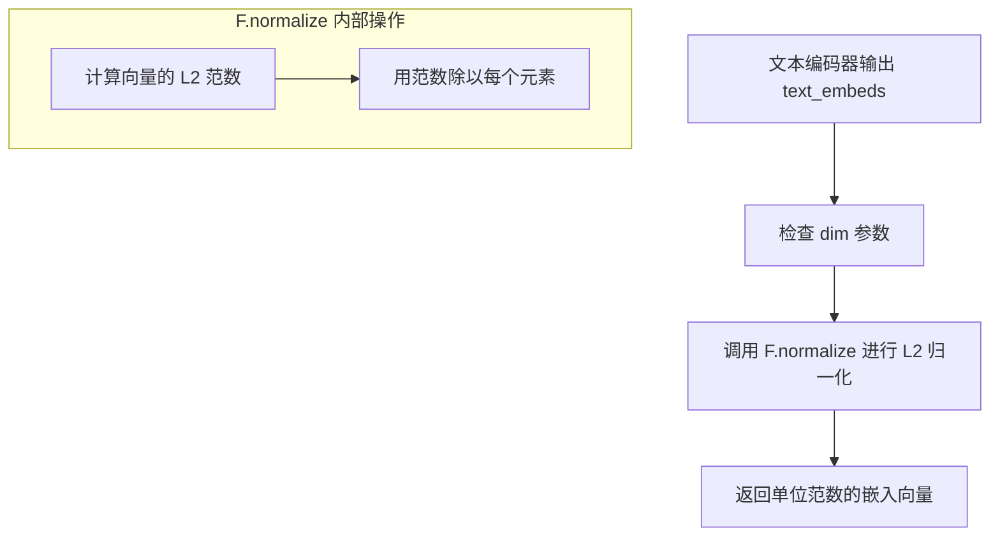

#### 带注释源码

```python
# 在 AudioLDMPipeline._encode_prompt 方法中

# 1. 获取文本编码器的输出
prompt_embeds = self.text_encoder(
    text_input_ids.to(device),
    attention_mask=attention_mask.to(device),
)
prompt_embeds = prompt_embeds.text_embeds  # 提取文本嵌入

# 2. 使用 torch.nn.functional (F) 进行 L2 归一化
# 这是一个关键步骤，确保文本嵌入具有单位范数
# dim=-1 表示在最后一个维度（特征维度）进行归一化
# 这种归一化对于 AudioLDM 的对比学习机制至关重要
# 因为它确保了不同文本嵌入之间的比较是在统一尺度上进行的
prompt_embeds = F.normalize(prompt_embeds, dim=-1)

# 同样的归一化也应用于负向提示的嵌入
negative_prompt_embeds = F.normalize(negative_prompt_embeds, dim=-1)
```

#### 技术细节

| 项目 | 描述 |
|------|------|
| 函数来源 | `torch.nn.functional` |
| 具体函数 | `F.normalize` |
| 归一化类型 | L2 归一化（欧几里得范数） |
| 作用维度 | 最后一个维度（特征维度） |
| 数学公式 | $x_{normalized} = \frac{x}{\|x\|_2}$ |

#### 潜在优化空间

1. **可配置性**：归一化操作硬编码在方法中，可以考虑将其作为可配置选项
2. **精度问题**：在某些高精度要求的场景，可能需要自定义归一化方法
3. **性能**：对于大批量处理，可以考虑 fused 操作以减少内存访问


### `AudioLDMPipeline.__init__`

这是 AudioLDMPipeline 类的初始化方法，用于接收并注册各种模型组件（VAE、文本编码器、分词器、UNet、调度器和声码器），并计算 VAE 的缩放因子。

参数：

- `self`：隐式参数，`AudioLDMPipeline` 实例本身
- `vae`：`AutoencoderKL`，VAE 模型，用于在潜在表示之间进行音频编码和解码
- `text_encoder`：`ClapTextModelWithProjection`，冻结的文本编码器（CLAP 模型）
- `tokenizer`：`RobertaTokenizer | RobertaTokenizerFast`，用于对文本进行分词
- `unet`：`UNet2DConditionModel`，用于对编码的音频潜在表示进行去噪
- `scheduler`：`KarrasDiffusionSchedulers`，调度器，与 unet 结合使用以对编码的音频潜在表示进行去噪
- `vocoder`：`SpeechT5HifiGan`，声码器，用于将梅尔频谱图转换为波形

返回值：无（`None`），这是一个初始化方法，不返回任何值

#### 流程图

```mermaid
flowchart TD
    A[开始 __init__] --> B[调用 super().__init__ 执行父类初始化]
    B --> C[调用 self.register_modules 注册所有模块]
    C --> D[检查 vae 是否存在并计算 vae_scale_factor]
    D --> E{self.vae 存在?}
    -->|是| F[vae_scale_factor = 2 ** (len(vae.config.block_out_channels) - 1)]
    E -->|否| G[vae_scale_factor = 8]
    F --> H[结束初始化]
    G --> H
```

#### 带注释源码

```python
def __init__(
    self,
    vae: AutoencoderKL,
    text_encoder: ClapTextModelWithProjection,
    tokenizer: RobertaTokenizer | RobertaTokenizerFast,
    unet: UNet2DConditionModel,
    scheduler: KarrasDiffusionSchedulers,
    vocoder: SpeechT5HifiGan,
):
    """
    初始化 AudioLDMPipeline 实例
    
    参数:
        vae: Variational Auto-Encoder (VAE) 模型，用于编码和解码音频潜在表示
        text_encoder: 冻结的文本编码器 (ClapTextModelWithProjection)
        tokenizer: Roberta 分词器，用于对文本进行分词
        unet: UNet2DConditionModel，用于去噪音频潜在表示
        scheduler: 扩散调度器，用于控制去噪过程
        vocoder: SpeechT5HifiGan 声码器，用于将梅尔频谱图转换为波形
    """
    # 调用父类的初始化方法，执行基类 Pipeline 的基础设置
    # 继承自 DeprecatedPipelineMixin, DiffusionPipeline, StableDiffusionMixin
    super().__init__()

    # 使用 register_modules 方法注册所有模型组件
    # 这些组件将被保存为 pipeline 的属性，可通过 self.xxx 访问
    self.register_modules(
        vae=vae,
        text_encoder=text_encoder,
        tokenizer=tokenizer,
        unet=unet,
        scheduler=scheduler,
        vocoder=vocoder,
    )
    
    # 计算 VAE 缩放因子，用于调整潜在空间的尺寸
    # 计算公式: 2^(block_out_channels数量 - 1)
    # 如果 vae 存在则动态计算，否则使用默认值 8
    # 这是因为 VAE 的下采样倍数取决于其 block_out_channels 的深度
    self.vae_scale_factor = 2 ** (len(self.vae.config.block_out_channels) - 1) if getattr(self, "vae", None) else 8
```


### `AudioLDMPipeline._encode_prompt`

该方法负责将文本提示（prompt）编码为文本嵌入（text embeddings），以便后续用于音频生成。它处理提示的批处理、文本编码器的调用、L2归一化，以及在启用分类器自由引导（Classifier-Free Guidance）时生成负样本嵌入并将其与正样本嵌入拼接。

参数：

- `prompt`：`str` 或 `list[str]`，可选，要编码的文本提示
- `device`：`torch.device`，PyTorch设备，用于将数据移动到指定设备
- `num_waveforms_per_prompt`：`int`，每个提示词需要生成的波形数量，用于复制嵌入
- `do_classifier_free_guidance`：`bool`，是否启用分类器自由引导，为True时需要生成负样本嵌入
- `negative_prompt`：`str` 或 `list[str]`，可选，用于指导不希望出现的音频内容的负向提示
- `prompt_embeds`：`torch.Tensor | None`，可选，预先计算好的文本嵌入，如提供则跳过从prompt生成
- `negative_prompt_embeds`：`torch.Tensor | None`，可选，预先计算好的负向文本嵌入

返回值：`torch.Tensor`，编码后的文本嵌入向量，形状为 `(batch_size * num_waveforms_per_prompt, seq_len)`；当启用分类器自由引导时，前半部分为负向嵌入，后半部分为正向嵌入。

#### 流程图

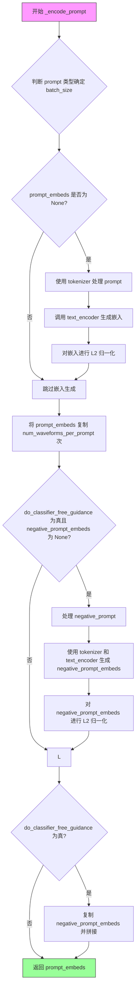

#### 带注释源码

```python
def _encode_prompt(
    self,
    prompt,
    device,
    num_waveforms_per_prompt,
    do_classifier_free_guidance,
    negative_prompt=None,
    prompt_embeds: torch.Tensor | None = None,
    negative_prompt_embeds: torch.Tensor | None = None,
):
    r"""
    Encodes the prompt into text encoder hidden states.

    Args:
        prompt (`str` or `list[str]`, *optional*):
            prompt to be encoded
        device (`torch.device`):
            torch device
        num_waveforms_per_prompt (`int`):
            number of waveforms that should be generated per prompt
        do_classifier_free_guidance (`bool`):
            whether to use classifier free guidance or not
        negative_prompt (`str` or `list[str]`, *optional*):
            The prompt or prompts not to guide the audio generation. If not defined, one has to pass
            `negative_prompt_embeds` instead. Ignored when not using guidance (i.e., ignored if `guidance_scale` is
            less than `1`).
        prompt_embeds (`torch.Tensor`, *optional*):
            Pre-generated text embeddings. Can be used to easily tweak text inputs, *e.g.* prompt weighting. If not
            provided, text embeddings will be generated from `prompt` input argument.
        negative_prompt_embeds (`torch.Tensor`, *optional*):
            Pre-generated negative text embeddings. Can be used to easily tweak text inputs, *e.g.* prompt
            weighting. If not provided, negative_prompt_embeds will be generated from `negative_prompt` input
            argument.
    """
    # 步骤1: 确定batch_size
    # 如果prompt是字符串，batch_size为1；如果是列表，则为列表长度；否则使用prompt_embeds的batch维度
    if prompt is not None and isinstance(prompt, str):
        batch_size = 1
    elif prompt is not None and isinstance(prompt, list):
        batch_size = len(prompt)
    else:
        batch_size = prompt_embeds.shape[0]

    # 步骤2: 如果未提供prompt_embeds，则从prompt生成
    if prompt_embeds is None:
        # 使用tokenizer将文本转换为token ids和attention mask
        text_inputs = self.tokenizer(
            prompt,
            padding="max_length",
            max_length=self.tokenizer.model_max_length,
            truncation=True,
            return_tensors="pt",
        )
        text_input_ids = text_inputs.input_ids
        attention_mask = text_inputs.attention_mask
        
        # 获取未截断的token ids用于检查是否发生了截断
        untruncated_ids = self.tokenizer(prompt, padding="longest", return_tensors="pt").input_ids

        # 检查是否发生了截断，如果是则记录警告信息
        if untruncated_ids.shape[-1] >= text_input_ids.shape[-1] and not torch.equal(
            text_input_ids, untruncated_ids
        ):
            removed_text = self.tokenizer.batch_decode(
                untruncated_ids[:, self.tokenizer.model_max_length - 1 : -1]
            )
            logger.warning(
                "The following part of your input was truncated because CLAP can only handle sequences up to"
                f" {self.tokenizer.model_max_length} tokens: {removed_text}"
            )

        # 调用text_encoder生成文本嵌入
        prompt_embeds = self.text_encoder(
            text_input_ids.to(device),
            attention_mask=attention_mask.to(device),
        )
        # 提取text_embeds（CLAP模型输出包含text_embeds和group_out）
        prompt_embeds = prompt_embeds.text_embeds
        # 对每个隐藏状态进行L2归一化（CLAP模型特有步骤）
        prompt_embeds = F.normalize(prompt_embeds, dim=-1)

    # 步骤3: 将prompt_embeds移动到正确的设备和dtype
    prompt_embeds = prompt_embeds.to(dtype=self.text_encoder.dtype, device=device)

    # 步骤4: 复制prompt_embeds以匹配num_waveforms_per_prompt
    # 获取当前嵌入的形状
    (
        bs_embed,
        seq_len,
    ) = prompt_embeds.shape
    # 复制text embeddings以支持每个prompt生成多个波形（使用MPS友好的方法）
    prompt_embeds = prompt_embeds.repeat(1, num_waveforms_per_prompt)
    prompt_embeds = prompt_embeds.view(bs_embed * num_waveforms_per_prompt, seq_len)

    # 步骤5: 处理分类器自由引导的负样本嵌入
    # 如果启用guidance且未提供negative_prompt_embeds，则生成负样本嵌入
    if do_classifier_free_guidance and negative_prompt_embeds is None:
        uncond_tokens: list[str]
        # 确定负样本tokens：如果没有提供negative_prompt则使用空字符串
        if negative_prompt is None:
            uncond_tokens = [""] * batch_size
        # 检查negative_prompt和prompt的类型是否一致
        elif type(prompt) is not type(negative_prompt):
            raise TypeError(
                f"`negative_prompt` should be the same type to `prompt`, but got {type(negative_prompt)} !="
                f" {type(prompt)}."
            )
        elif isinstance(negative_prompt, str):
            uncond_tokens = [negative_prompt]
        # 检查batch_size是否匹配
        elif batch_size != len(negative_prompt):
            raise ValueError(
                f"`negative_prompt`: {negative_prompt} has batch size {len(negative_prompt)}, but `prompt`:"
                f" {prompt} has batch size {batch_size}. Please make sure that passed `negative_prompt` matches"
                " the batch size of `prompt`."
            )
        else:
            uncond_tokens = negative_prompt

        # 使用与正样本相同的长度进行tokenize
        max_length = prompt_embeds.shape[1]
        uncond_input = self.tokenizer(
            uncond_tokens,
            padding="max_length",
            max_length=max_length,
            truncation=True,
            return_tensors="pt",
        )

        # 将负样本输入移动到设备
        uncond_input_ids = uncond_input.input_ids.to(device)
        attention_mask = uncond_input.attention_mask.to(device)

        # 生成负样本文本嵌入
        negative_prompt_embeds = self.text_encoder(
            uncond_input_ids,
            attention_mask=attention_mask,
        )
        negative_prompt_embeds = negative_prompt_embeds.text_embeds
        # 同样进行L2归一化
        negative_prompt_embeds = F.normalize(negative_prompt_embeds, dim=-1)

    # 步骤6: 如果启用分类器自由引导，处理negative_prompt_embeds
    if do_classifier_free_guidance:
        # 获取序列长度
        seq_len = negative_prompt_embeds.shape[1]

        # 移动到正确的设备和dtype
        negative_prompt_embeds = negative_prompt_embeds.to(dtype=self.text_encoder.dtype, device=device)

        # 复制negative_prompt_embeds以匹配num_waveforms_per_prompt
        negative_prompt_embeds = negative_prompt_embeds.repeat(1, num_waveforms_per_prompt)
        negative_prompt_embeds = negative_prompt_embeds.view(batch_size * num_waveforms_per_prompt, seq_len)

        # 为了避免两次前向传播，将无条件嵌入和文本嵌入拼接成单个batch
        # 前面是negative_prompt_embeds，后面是prompt_embeds
        prompt_embeds = torch.cat([negative_prompt_embeds, prompt_embeds])

    # 返回编码后的prompt嵌入
    return prompt_embeds
```


### `AudioLDMPipeline.decode_latents`

该方法负责将扩散模型生成的潜在表示（latents）转换为mel频谱图（mel spectrogram），是音频生成流程中的关键解码步骤。通过VAE解码器将潜在空间的数据反变换为可供声码器处理的频谱表示。

参数：

- `latents`：`torch.Tensor`，由扩散模型生成的潜在表示张量，通常是经过去噪处理的中间结果

返回值：`torch.Tensor`，解码后的mel频谱图，用于后续通过声码器（vocoder）转换为实际音频波形

#### 流程图

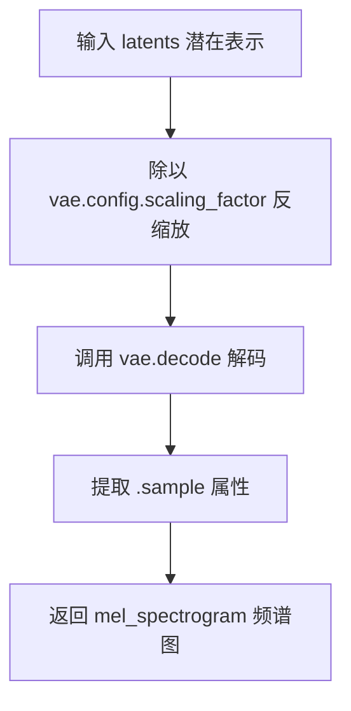

#### 带注释源码

```python
def decode_latents(self, latents):
    """
    将潜在表示解码为mel频谱图
    
    Args:
        latents: 来自扩散过程的潜在表示张量
        
    Returns:
        mel_spectrogram: 解码后的mel频谱图张量
    """
    # 步骤1: 反缩放latents
    # VAE在编码时会乘以scaling_factor，这里需要除以回来
    latents = 1 / self.vae.config.scaling_factor * latents
    
    # 步骤2: 使用VAE解码器将latents转换为mel频谱图
    # vae.decode接收潜在表示并输出mel频谱图
    mel_spectrogram = self.vae.decode(latents).sample
    
    # 步骤3: 返回mel频谱图结果
    return mel_spectrogram
```


### `AudioLDMPipeline.mel_spectrogram_to_waveform`

该方法将梅尔频谱图（Mel Spectrogram） latent 表示通过声码器（Vocoder）转换为音频波形（Waveform），是将扩散模型输出的频域表示转换为人耳可听见的时域音频信号的关键步骤。

参数：

- `mel_spectrogram`：`torch.Tensor`，待转换的梅尔频谱图张量，通常为 3D 张量（batch, freq, time）或 4D 张量（batch, 1, freq, time）

返回值：`torch.Tensor`，转换后的音频波形张量，形状为（batch, samples）

#### 流程图

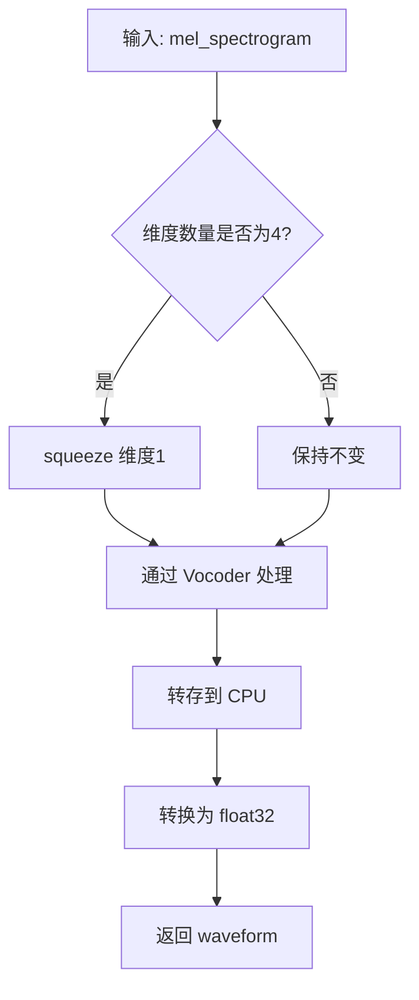

#### 带注释源码

```python
def mel_spectrogram_to_waveform(self, mel_spectrogram):
    """
    将梅尔频谱图转换为波形信号
    
    参数:
        mel_spectrogram: 梅尔频谱图张量，可能是4D (batch, 1, freq, time) 或 3D (batch, freq, time)
    
    返回:
        waveform: 音频波形张量
    """
    # 检查是否为4D张量，如果是则挤压掉第1维（通道维）
    # VAE解码输出的mel_spectrogram可能是4D形式，需要标准化为3D
    if mel_spectrogram.dim() == 4:
        mel_spectrogram = mel_spectrogram.squeeze(1)

    # 使用声码器（SpeechT5HifiGan）将梅尔频谱图解码为波形
    # 声码器是预训练的神经网络，负责将频域表示转换为时域音频
    waveform = self.vocoder(mel_spectrogram)
    
    # 始终转换为 float32，避免显著开销并兼容 bfloat16
    # 将张量从 GPU 移动到 CPU，因为音频文件操作通常在 CPU 进行
    waveform = waveform.cpu().float()
    
    return waveform
```


### `AudioLDMPipeline.prepare_extra_step_kwargs`

该方法用于准备调度器（scheduler）的额外参数，通过检查调度器的 `step` 方法签名，动态确定是否支持 `eta` 和 `generator` 参数，以适配不同的调度器实现。

参数：

- `self`：隐含的 `AudioLDMPipeline` 实例参数，代表当前音频生成管道对象
- `generator`：`torch.Generator | list[torch.Generator] | None`，用于控制随机数生成的可选生成器，以确保扩散过程的可重复性
- `eta`：`float`，DDIM 调度器专用的 eta 参数（取值范围 [0, 1]），对应 DDIM 论文中的 η 参数，其他调度器会忽略此参数

返回值：`dict[str, Any]`，返回包含额外参数的字典，可能包含 `eta` 和/或 `generator` 键，供调度器的 `step` 方法使用

#### 流程图

```mermaid
flowchart TD
    A[开始 prepare_extra_step_kwargs] --> B[获取 scheduler.step 方法的签名]
    B --> C{eta 是否在签名中?}
    C -->|是| D[extra_step_kwargs['eta'] = eta]
    C -->|否| E[跳过 eta]
    D --> F{generator 是否在签名中?}
    E --> F
    F -->|是| G[extra_step_kwargs['generator'] = generator]
    F -->|否| H[跳过 generator]
    G --> I[返回 extra_step_kwargs 字典]
    H --> I
```

#### 带注释源码

```
def prepare_extra_step_kwargs(self, generator, eta):
    # 准备调度器的额外参数，因为并非所有调度器都具有相同的函数签名
    # eta (η) 仅用于 DDIMScheduler，其他调度器会忽略此参数
    # eta 对应 DDIM 论文中的 η: https://huggingface.co/papers/2010.02502
    # 取值范围应为 [0, 1]

    # 使用 inspect 模块检查调度器的 step 方法是否接受 eta 参数
    accepts_eta = "eta" in set(inspect.signature(self.scheduler.step).parameters.keys())
    # 初始化空字典用于存储额外参数
    extra_step_kwargs = {}
    # 如果调度器支持 eta，则将其添加到额外参数字典中
    if accepts_eta:
        extra_step_kwargs["eta"] = eta

    # 检查调度器是否接受 generator 参数
    accepts_generator = "generator" in set(inspect.signature(self.scheduler.step).parameters.keys())
    # 如果调度器支持 generator，则将其添加到额外参数字典中
    if accepts_generator:
        extra_step_kwargs["generator"] = generator
    
    # 返回包含适配当前调度器的额外参数字典
    return extra_step_kwargs
```


### `AudioLDMPipeline.check_inputs`

该方法用于验证文本到音频生成管道的输入参数有效性，确保`prompt`、`audio_length_in_s`、`callback_steps`等参数符合模型要求，并在参数不符合要求时抛出详细的错误信息。

参数：

- `self`：隐藏参数，指向`AudioLDMPipeline`实例本身
- `prompt`：`str | list[str] | None`，用于引导音频生成的文本提示词
- `audio_length_in_s`：`float`，生成的音频样本长度（秒）
- `vocoder_upsample_factor`：`float`，vocoder的上采样因子，用于计算最小音频长度
- `callback_steps`：`int`，回调函数的调用频率，必须为正整数
- `negative_prompt`：`str | list[str] | None`，用于引导不希望出现的音频特征的负面提示词
- `prompt_embeds`：`torch.Tensor | None`，预生成的文本嵌入，可用于微调文本输入
- `negative_prompt_embeds`：`torch.Tensor | None`，预生成的负面文本嵌入

返回值：`None`，该方法不返回任何值，仅通过抛出`ValueError`异常来处理验证失败的情况

#### 流程图

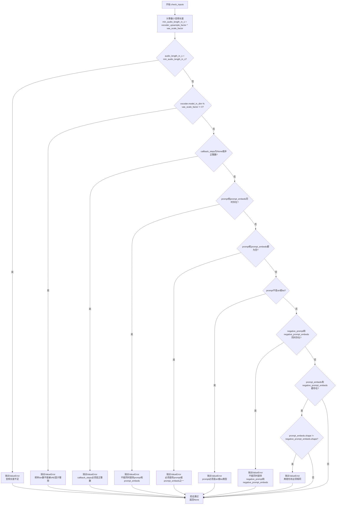

#### 带注释源码

```python
def check_inputs(
    self,
    prompt,
    audio_length_in_s,
    vocoder_upsample_factor,
    callback_steps,
    negative_prompt=None,
    prompt_embeds=None,
    negative_prompt_embeds=None,
):
    """
    检查输入参数的有效性，确保满足音频生成管道的约束条件。
    
    该方法会进行多项验证：
    1. 音频长度必须足够长以满足VAE和Vocoder的要求
    2. Vocoder的频率bin数量必须能被VAE scale factor整除
    3. callback_steps必须是正整数
    4. prompt和prompt_embeds不能同时提供（互斥）
    5. prompt和prompt_embeds至少提供一个
    6. prompt必须是str或list类型
    7. negative_prompt和negative_prompt_embeds不能同时提供
    8. prompt_embeds和negative_prompt_embeds形状必须匹配
    """
    
    # 计算允许的最小音频长度，基于vocoder上采样因子和VAE scale factor
    # 这是因为音频需要经过VAE编码和vocoder解码，必须满足尺寸对齐要求
    min_audio_length_in_s = vocoder_upsample_factor * self.vae_scale_factor
    
    # 验证音频长度是否符合最小要求
    if audio_length_in_s < min_audio_length_in_s:
        raise ValueError(
            f"`audio_length_in_s` has to be a positive value greater than or equal to {min_audio_length_in_s}, but "
            f"is {audio_length_in_s}."
        )

    # 验证vocoder的频率bin数量能否被VAE scale factor整除
    # 这确保了在后续处理中能够正确地进行上采样操作
    if self.vocoder.config.model_in_dim % self.vae_scale_factor != 0:
        raise ValueError(
            f"The number of frequency bins in the vocoder's log-mel spectrogram has to be divisible by the "
            f"VAE scale factor, but got {self.vocoder.config.model_in_dim} bins and a scale factor of "
            f"{self.vae_scale_factor}."
        )

    # 验证callback_steps必须是正整数
    # callback_steps用于控制训练过程中回调函数的调用频率
    if (callback_steps is None) or (
        callback_steps is not None and (not isinstance(callback_steps, int) or callback_steps <= 0)
    ):
        raise ValueError(
            f"`callback_steps` has to be a positive integer but is {callback_steps} of type"
            f" {type(callback_steps)}."
        )

    # 验证prompt和prompt_embeds的互斥关系
    # 不能同时提供两种输入，因为这会导致重复或冲突的文本信息
    if prompt is not None and prompt_embeds is not None:
        raise ValueError(
            f"Cannot forward both `prompt`: {prompt} and `prompt_embeds`: {prompt_embeds}. Please make sure to"
            " only forward one of the two."
        )
    
    # 验证至少提供了prompt或prompt_embeds之一
    # 必须有文本输入才能引导音频生成
    elif prompt is None and prompt_embeds is None:
        raise ValueError(
            "Provide either `prompt` or `prompt_embeds`. Cannot leave both `prompt` and `prompt_embeds` undefined."
        )
    
    # 验证prompt的类型是否符合要求
    elif prompt is not None and (not isinstance(prompt, str) and not isinstance(prompt, list)):
        raise ValueError(f"`prompt` has to be of type `str` or `list` but is {type(prompt)}")

    # 验证negative_prompt和negative_prompt_embeds的互斥关系
    # 用于无分类器自由引导（CFG）的负面提示词也必须是互斥的
    if negative_prompt is not None and negative_prompt_embeds is not None:
        raise ValueError(
            f"Cannot forward both `negative_prompt`: {negative_prompt} and `negative_prompt_embeds`:"
            f" {negative_prompt_embeds}. Please make sure to only forward one of the two."
        )

    # 验证prompt_embeds和negative_prompt_embeds的形状一致性
    # 在CFG中，两者的形状必须完全匹配以便进行拼接操作
    if prompt_embeds is not None and negative_prompt_embeds is not None:
        if prompt_embeds.shape != negative_prompt_embeds.shape:
            raise ValueError(
                "`prompt_embeds` and `negative_prompt_embeds` must have the same shape when passed directly, but"
                f" got: `prompt_embeds` {prompt_embeds.shape} != `negative_prompt_embeds`"
                f" {negative_prompt_embeds.shape}."
            )
    
    # 所有验证通过，方法正常结束（返回None）
    # 如果任何一项验证失败，都会抛出详细的ValueError异常
```


### `AudioLDMPipeline.prepare_latents`

该方法用于准备音频生成的潜在变量（latents），通过初始化随机噪声张量或使用用户提供的潜在变量，并按照调度器的要求进行尺度缩放。

参数：

- `batch_size`：`int`，批处理大小，指定要生成的音频样本数量
- `num_channels_latents`：`int`，潜在变量的通道数，对应UNet的输入通道数
- `height`：`int`，音频 spectrogram 的高度维度，用于计算潜在变量的空间尺寸
- `dtype`：`torch.dtype`，潜在变量的数据类型
- `device`：`torch.device`，潜在变量所在的设备（CPU 或 CUDA）
- `generator`：`torch.Generator | list[torch.Generator] | None`，用于生成确定性随机数的 PyTorch 生成器，支持单个或多个生成器
- `latents`：`torch.Tensor | None`，可选的预生成潜在变量，如果为 None 则随机生成

返回值：`torch.Tensor`，处理后的潜在变量张量，用于去噪过程的输入

#### 流程图

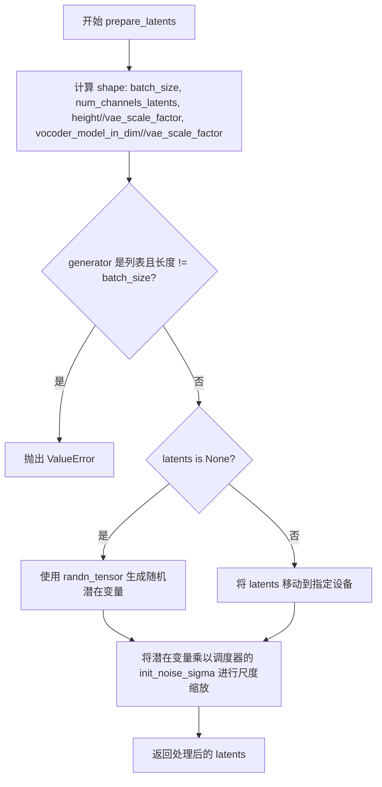

#### 带注释源码

```python
def prepare_latents(self, batch_size, num_channels_latents, height, dtype, device, generator, latents=None):
    # 计算潜在变量的形状，包含批次维度、通道数、以及根据VAE缩放因子调整的空间维度
    shape = (
        batch_size,  # 批次大小
        num_channels_latents,  # UNet输入通道数
        int(height) // self.vae_scale_factor,  # 高度维度除以VAE缩放因子
        int(self.vocoder.config.model_in_dim) // self.vae_scale_factor,  # vocoder输入维度除以VAE缩放因子
    )
    
    # 验证生成器列表长度是否与批处理大小匹配
    if isinstance(generator, list) and len(generator) != batch_size:
        raise ValueError(
            f"You have passed a list of generators of length {len(generator)}, but requested an effective batch"
            f" size of {batch_size}. Make sure the batch size matches the length of the generators."
        )

    # 如果未提供潜在变量，则随机生成；否则使用提供的潜在变量并移动到指定设备
    if latents is None:
        latents = randn_tensor(shape, generator=generator, device=device, dtype=dtype)
    else:
        latents = latents.to(device)

    # 使用调度器的初始噪声标准差对潜在变量进行尺度缩放
    # 这是扩散模型的关键步骤，确保初始噪声与调度器的噪声计划相匹配
    latents = latents * self.scheduler.init_noise_sigma
    return latents
```


### `AudioLDMPipeline.__call__`

这是 AudioLDMPipeline 的核心推理方法,实现了从文本提示到音频波形的端到端生成流程。该方法整合了文本编码、潜在空间去噪、VAE 解码和声码器转换等关键步骤,支持分类器自由引导(CFG)、回调机制和多波形生成等高级功能。

参数：

- `prompt`：`str | list[str] | None`，用于引导音频生成的文本提示，如未定义则需传递 `prompt_embeds`
- `audio_length_in_s`：`float | None`，生成的音频样本长度（秒），默认值为 5.12 秒
- `num_inference_steps`：`int`，去噪迭代次数，默认为 10，步数越多通常音频质量越高
- `guidance_scale`：`float`，引导尺度参数，默认为 2.5，用于控制文本提示与生成音频的相关性
- `negative_prompt`：`str | list[str] | None`，用于引导排除内容的负面提示
- `num_waveforms_per_prompt`：`int`，每个提示生成的波形数量，默认为 1
- `eta`：`float`，DDIM 调度器的 eta 参数，默认为 0.0
- `generator`：`torch.Generator | list[torch.Generator] | None`，用于生成确定性结果的随机数生成器
- `latents`：`torch.Tensor | None`，预生成的噪声潜在向量，可用于相同生成的不同提示
- `prompt_embeds`：`torch.Tensor | None`，预生成的文本嵌入，可用于提示加权
- `negative_prompt_embeds`：`torch.Tensor | None`，预生成的负面文本嵌入
- `return_dict`：`bool`，是否返回 `AudioPipelineOutput`，默认为 True
- `callback`：`Callable[[int, int, torch.Tensor], None] | None`，每 `callback_steps` 步调用的回调函数
- `callback_steps`：`int`，回调函数调用频率，默认为 1
- `cross_attention_kwargs`：`dict[str, Any] | None`，传递给注意力处理器的额外关键字参数
- `output_type`：`str`，输出格式选择 `"np"` 返回 NumPy 数组或 `"pt"` 返回 PyTorch 张量

返回值：`AudioPipelineOutput` 或 `tuple`，当 `return_dict` 为 True 时返回包含生成音频的 `AudioPipelineOutput` 对象，否则返回元组

#### 流程图

```mermaid
flowchart TD
    A[开始 __call__] --> B[计算 vocoder_upsample_factor]
    B --> C{audio_length_in_s 是否为 None?}
    C -->|是| D[根据配置计算默认音频长度]
    C -->|否| E[使用传入的 audio_length_in_s]
    D --> F[计算 height 和 original_waveform_length]
    E --> F
    F --> G[调用 check_inputs 验证输入]
    G --> H[确定 batch_size]
    H --> I{do_classifier_free_guidance?]
    I -->|是| J[guidance_scale > 1.0]
    I -->|否| K[guidance_scale <= 1.0]
    J --> L[调用 _encode_prompt 编码提示]
    K --> L
    L --> M[设置调度器时间步]
    M --> N[准备潜在变量 latents]
    N --> O[准备额外步骤参数]
    O --> P[进入去噪循环]
    P --> Q{当前迭代 < num_inference_steps?}
    Q -->|是| R[扩展潜在变量用于 CFG]
    R --> S[调度器缩放模型输入]
    S --> T[UNet 预测噪声残差]
    T --> U{使用 CFG?}
    U -->|是| V[分割噪声预测并应用引导]
    U -->|否| W[直接使用噪声预测]
    V --> X[调度器执行去噪步骤]
    W --> X
    X --> Y[更新 latents]
    Y --> Z{是否为最后一步或热身步?}
    Z -->|是| AA[更新进度条]
    AA --> BB{callback 条件满足?}
    BB -->|是| CC[调用回调函数]
    BB -->|否| DD[跳过回调]
    CC --> EE{XLA 可用?}
    DD --> EE
    EE -->|是| FF[标记 XLA 步骤]
    EE -->|否| GG[继续循环]
    FF --> GG
    GG --> Q
    Q -->|否| HH[解码潜在变量到梅尔频谱图]
    HH --> II[将梅尔频谱图转换为波形]
    II --> JJ[裁剪到原始波形长度]
    JJ --> KK{output_type == "np"?}
    KK -->|是| LL[转换为 NumPy 数组]
    KK -->|否| MM[保持 PyTorch 张量]
    LL --> NN{return_dict == True?}
    MM --> NN
    NN -->|是| OO[返回 AudioPipelineOutput]
    NN -->|否| PP[返回元组]
    OO --> QQ[结束]
    PP --> QQ
```

#### 带注释源码

```python
@torch.no_grad()
@replace_example_docstring(EXAMPLE_DOC_STRING)
def __call__(
    self,
    prompt: str | list[str] = None,
    audio_length_in_s: float | None = None,
    num_inference_steps: int = 10,
    guidance_scale: float = 2.5,
    negative_prompt: str | list[str] | None = None,
    num_waveforms_per_prompt: int | None = 1,
    eta: float = 0.0,
    generator: torch.Generator | list[torch.Generator] | None = None,
    latents: torch.Tensor | None = None,
    prompt_embeds: torch.Tensor | None = None,
    negative_prompt_embeds: torch.Tensor | None = None,
    return_dict: bool = True,
    callback: Callable[[int, int, torch.Tensor], None] | None = None,
    callback_steps: int | None = 1,
    cross_attention_kwargs: dict[str, Any] | None = None,
    output_type: str | None = "np",
):
    r"""
    The call function to the pipeline for generation.

    Args:
        prompt (`str` or `list[str]`, *optional*):
            The prompt or prompts to guide audio generation. If not defined, you need to pass `prompt_embeds`.
        audio_length_in_s (`int`, *optional*, defaults to 5.12):
            The length of the generated audio sample in seconds.
        num_inference_steps (`int`, *optional*, defaults to 10):
            The number of denoising steps. More denoising steps usually lead to a higher quality audio at the
            expense of slower inference.
        guidance_scale (`float`, *optional*, defaults to 2.5):
            A higher guidance scale value encourages the model to generate audio that is closely linked to the text
            `prompt` at the expense of lower sound quality. Guidance scale is enabled when `guidance_scale > 1`.
        negative_prompt (`str` or `list[str]`, *optional*):
            The prompt or prompts to guide what to not include in audio generation. If not defined, you need to
            pass `negative_prompt_embeds` instead. Ignored when not using guidance (`guidance_scale < 1`).
        num_waveforms_per_prompt (`int`, *optional*, defaults to 1):
            The number of waveforms to generate per prompt.
        eta (`float`, *optional*, defaults to 0.0):
            Corresponds to parameter eta (η) from the [DDIM](https://huggingface.co/papers/2010.02502) paper. Only
            applies to the [`~schedulers.DDIMScheduler`], and is ignored in other schedulers.
        generator (`torch.Generator` or `list[torch.Generator]`, *optional*):
            A [`torch.Generator`](https://pytorch.org/docs/stable/generated/torch.Generator.html) to make
            generation deterministic.
        latents (`torch.Tensor`, *optional*):
            Pre-generated noisy latents sampled from a Gaussian distribution, to be used as inputs for image
            generation. Can be used to tweak the same generation with different prompts. If not provided, a latents
            tensor is generated by sampling using the supplied random `generator`.
        prompt_embeds (`torch.Tensor`, *optional*):
            Pre-generated text embeddings. Can be used to easily tweak text inputs (prompt weighting). If not
            provided, text embeddings are generated from the `prompt` input argument.
        negative_prompt_embeds (`torch.Tensor`, *optional*):
            Pre-generated negative text embeddings. Can be used to easily tweak text inputs (prompt weighting). If
            not provided, `negative_prompt_embeds` are generated from the `negative_prompt` input argument.
        return_dict (`bool`, *optional*, defaults to `True`):
            Whether or not to return a [`~pipelines.AudioPipelineOutput`] instead of a plain tuple.
        callback (`Callable`, *optional*):
            A function that calls every `callback_steps` steps during inference. The function is called with the
            following arguments: `callback(step: int, timestep: int, latents: torch.Tensor)`.
        callback_steps (`int`, *optional*, defaults to 1):
            The frequency at which the `callback` function is called. If not specified, the callback is called at
            every step.
        cross_attention_kwargs (`dict`, *optional*):
            A kwargs dictionary that if specified is passed along to the [`AttentionProcessor`] as defined in
            [`self.processor`](https://github.com/huggingface/diffusers/blob/main/src/diffusers/models/attention_processor.py).
        output_type (`str`, *optional*, defaults to `"np"`):
            The output format of the generated image. Choose between `"np"` to return a NumPy `np.ndarray` or
            `"pt"` to return a PyTorch `torch.Tensor` object.

    Examples:

    Returns:
        [`~pipelines.AudioPipelineOutput`] or `tuple`:
            If `return_dict` is `True`, [`~pipelines.AudioPipelineOutput`] is returned, otherwise a `tuple` is
            returned where the first element is a list with the generated audio.
    """
    # 0. Convert audio input length from seconds to spectrogram height
    # 计算声码器上采样因子，用于将音频长度转换为频谱图高度
    vocoder_upsample_factor = np.prod(self.vocoder.config.upsample_rates) / self.vocoder.config.sampling_rate

    # 如果未指定音频长度，则根据模型配置计算默认长度
    if audio_length_in_s is None:
        audio_length_in_s = self.unet.config.sample_size * self.vae_scale_factor * vocoder_upsample_factor

    # 计算频谱图高度和原始波形长度
    height = int(audio_length_in_s / vocoder_upsample_factor)

    original_waveform_length = int(audio_length_in_s * self.vocoder.config.sampling_rate)
    
    # 调整高度以确保能被 VAE 尺度因子整除
    if height % self.vae_scale_factor != 0:
        height = int(np.ceil(height / self.vae_scale_factor)) * self.vae_scale_factor
        logger.info(
            f"Audio length in seconds {audio_length_in_s} is increased to {height * vocoder_upsample_factor} "
            f"so that it can be handled by the model. It will be cut to {audio_length_in_s} after the "
            f"denoising process."
        )

    # 1. Check inputs. Raise error if not correct
    # 验证输入参数的有效性
    self.check_inputs(
        prompt,
        audio_length_in_s,
        vocoder_upsample_factor,
        callback_steps,
        negative_prompt,
        prompt_embeds,
        negative_prompt_embeds,
    )

    # 2. Define call parameters
    # 确定批处理大小
    if prompt is not None and isinstance(prompt, str):
        batch_size = 1
    elif prompt is not None and isinstance(prompt, list):
        batch_size = len(prompt)
    else:
        batch_size = prompt_embeds.shape[0]

    # 获取执行设备
    device = self._execution_device
    
    # 计算是否启用分类器自由引导
    # guidance_scale > 1 时启用，类似于 Imagen 论文中的权重 w
    do_classifier_free_guidance = guidance_scale > 1.0

    # 3. Encode input prompt
    # 将文本提示编码为嵌入向量
    prompt_embeds = self._encode_prompt(
        prompt,
        device,
        num_waveforms_per_prompt,
        do_classifier_free_guidance,
        negative_prompt,
        prompt_embeds=prompt_embeds,
        negative_prompt_embeds=negative_prompt_embeds,
    )

    # 4. Prepare timesteps
    # 设置去噪调度器的时间步
    self.scheduler.set_timesteps(num_inference_steps, device=device)
    timesteps = self.scheduler.timesteps

    # 5. Prepare latent variables
    # 准备初始潜在变量
    num_channels_latents = self.unet.config.in_channels
    latents = self.prepare_latents(
        batch_size * num_waveforms_per_prompt,
        num_channels_latents,
        height,
        prompt_embeds.dtype,
        device,
        generator,
        latents,
    )

    # 6. Prepare extra step kwargs
    # 准备调度器额外参数
    extra_step_kwargs = self.prepare_extra_step_kwargs(generator, eta)

    # 7. Denoising loop
    # 去噪循环
    num_warmup_steps = len(timesteps) - num_inference_steps * self.scheduler.order
    with self.progress_bar(total=num_inference_steps) as progress_bar:
        for i, t in enumerate(timesteps):
            # expand the latents if we are doing classifier free guidance
            # 如果使用 CFG，扩展潜在变量以同时处理无条件和有条件预测
            latent_model_input = torch.cat([latents] * 2) if do_classifier_free_guidance else latents
            latent_model_input = self.scheduler.scale_model_input(latent_model_input, t)

            # predict the noise residual
            # 使用 UNet 预测噪声残差
            noise_pred = self.unet(
                latent_model_input,
                t,
                encoder_hidden_states=None,
                class_labels=prompt_embeds,
                cross_attention_kwargs=cross_attention_kwargs,
            ).sample

            # perform guidance
            # 执行分类器自由引导
            if do_classifier_free_guidance:
                noise_pred_uncond, noise_pred_text = noise_pred.chunk(2)
                noise_pred = noise_pred_uncond + guidance_scale * (noise_pred_text - noise_pred_uncond)

            # compute the previous noisy sample x_t -> x_t-1
            # 通过调度器步骤计算前一个噪声样本
            latents = self.scheduler.step(noise_pred, t, latents, **extra_step_kwargs).prev_sample

            # call the callback, if provided
            # 在适当的时机调用回调函数
            if i == len(timesteps) - 1 or ((i + 1) > num_warmup_steps and (i + 1) % self.scheduler.order == 0):
                progress_bar.update()
                if callback is not None and i % callback_steps == 0:
                    step_idx = i // getattr(self.scheduler, "order", 1)
                    callback(step_idx, t, latents)

            # XLA 设备支持
            if XLA_AVAILABLE:
                xm.mark_step()

    # 8. Post-processing
    # 后处理：将潜在变量解码为梅尔频谱图
    mel_spectrogram = self.decode_latents(latents)

    # 将梅尔频谱图转换为音频波形
    audio = self.mel_spectrogram_to_waveform(mel_spectrogram)

    # 裁剪到原始请求的波形长度
    audio = audio[:, :original_waveform_length]

    # 根据输出类型转换格式
    if output_type == "np":
        audio = audio.numpy()

    # 返回结果
    if not return_dict:
        return (audio,)

    return AudioPipelineOutput(audios=audio)
```

## 关键组件


### AudioLDMPipeline

核心pipeline类，继承自DeprecatedPipelineMixin、DiffusionPipeline和StableDiffusionMixin，用于文本到音频的生成。该类整合了VAE、文本编码器、UNet和声码器等组件，实现了从文本提示到音频波形的完整生成流程。

### _encode_prompt

负责将文本提示编码为文本编码器的隐藏状态。支持分类器自由引导（CFG），处理正向和负向提示嵌入，包含tokenization、文本编码、L2归一化化以及embeddings的复制以支持每个提示生成多个波形。

### decode_latents

将latent向量解码为mel频谱图。首先使用VAE配置中的缩放因子对latents进行缩放，然后通过VAE解码器生成mel频谱图。

### mel_spectrogram_to_waveform

将mel频谱图转换为音频波形。使用SpeechT5HifiGan声码器进行转换，并将输出转换为float32类型以确保兼容性。

### check_inputs

验证输入参数的有效性。检查音频长度、声码器维度兼容性、回调步骤、提示和提示嵌入的一致性等，确保生成过程能够正常运行。

### prepare_latents

准备初始的噪声latent变量。根据批量大小、通道数、高度和数据类型生成随机tensor，并使用调度器的初始噪声标准差进行缩放。

### prepare_extra_step_kwargs

为调度器步骤准备额外的参数。通过检查调度器签名来支持不同的调度器实现，如DDIMScheduler的eta参数和generator参数。

### __call__

主要的生成方法，执行完整的文本到音频生成流程。包含：音频长度计算、输入检查、提示编码、时间步准备、latent准备、去噪循环（支持CFG）、后处理（latent解码和波形转换）。

### 去噪循环

实现扩散模型的迭代去噪过程。在每个时间步进行UNet预测、分类器自由引导计算、调度器步骤更新，并支持回调函数和XLA设备优化。

### 音频后处理

在去噪完成后，将latent解码为mel频谱图，再转换为波形，最后裁剪到原始波形长度并根据output_type返回numpy数组或torch tensor。


## 问题及建议


### 已知问题

- **版本号硬编码**：`_last_supported_version = "0.33.1"` 是硬编码的字符串常量，缺乏动态版本检测机制，可能导致与实际安装的diffusers版本不匹配
- **设备管理不一致**：在 `_encode_prompt` 方法中手动进行设备转移（`.to(device)`），但某些地方可能遗漏了设备转移处理
- **类型注解兼容性**：使用 `RobertaTokenizer | RobertaTokenizerFast` 和 `torch.Tensor | None` 等Python 3.10+的联合类型语法，但未在文档中说明最低Python版本要求
- **内存占用优化不足**：在 `_encode_prompt` 中 `prompt_embeds` 被重复复制（`repeat` 和 `view` 操作），生成多个波形时会成倍增加内存占用
- **缺少CUDA优化**：虽然有XLA设备优化（`XLA_AVAILABLE`），但缺少CUDA相关的性能优化，如VAE切片、enable_sequential_cpu_offload等
- **UNet输入参数不完整**：在去噪循环中调用 `self.unet` 时传递 `encoder_hidden_states=None`，但应该传递编码后的prompt embeddings
- **潜在的Tensor复制**：在 `prepare_latents` 中如果传入latents会执行 `.to(device)` 操作，可能产生不必要的Tensor复制

### 优化建议

- 将 `_last_supported_version` 改为动态获取或移除，改用更灵活的版本兼容性检查机制
- 考虑使用 `torch.device` 统一管理设备，并确保所有Tensor操作都遵循设备一致性
- 将类型注解改为使用 `Union` 以兼容Python 3.9，或在文档中明确最低Python版本要求
- 优化内存使用：在生成多个波形时考虑使用切片或延迟复制策略；及时释放中间不需要的Tensor
- 添加CUDA优化选项：集成 `enable_model_cpu_offload`、`enable_vae_slicing` 等高级优化特性
- 修复UNet调用：确保 `encoder_hidden_keys` 正确传递 `prompt_embeds` 而非 `None`
- 添加内存监控和CUDA OOM处理机制，提升管道在资源受限环境下的鲁棒性
- 将 `check_inputs` 方法拆分为更小的验证函数，提升代码可读性和可维护性

## 其它


### 设计目标与约束

本Pipeline的设计目标是将文本提示转换为音频信号，实现端到端的文本到音频（Text-to-Audio）生成。主要约束包括：1) 依赖预训练的AudioLDM模型（cvssp/audioldm-s-full-v2）；2) 支持Classifier-Free Guidance（CFG）技术以提升生成质量；3) 音频长度受限于VAE scale factor和vocoder配置的组合；4) 必须在GPU（推荐CUDA）上运行以保证推理性能；5) 支持PyTorch 2.0+的混合精度推理（float16）。

### 错误处理与异常设计

代码实现了多层次错误检查机制：1) 在`check_inputs()`方法中验证音频长度、vocoder配置、回调步骤、prompt与embeds的一致性；2) 在`_encode_prompt()`中检查negative_prompt与prompt的类型匹配和batch size一致性；3) 在`prepare_latents()`中验证generator列表长度与batch size的匹配；4) 对截断的token发出logger.warning警告；5) 所有异常均抛出`ValueError`或`TypeError`，并附带详细的错误信息和期望值。

### 数据流与状态机

Pipeline的工作流程状态机如下：1) 初始化状态：加载模型组件（VAE、Text Encoder、UNet、Scheduler、Vocoder）；2) 输入验证状态：检查prompt、audio_length_in_s等参数合法性；3) Prompt编码状态：将文本转换为embedding向量；4) 潜在空间准备状态：生成或接收噪声latent；5) 去噪循环状态：执行多步噪声预测和去除；6) 后处理状态：将latent解码为mel频谱图，再转换为波形；7) 输出状态：返回AudioPipelineOutput或元组。

### 外部依赖与接口契约

核心依赖包括：1) `transformers`库提供ClapTextModelWithProjection、RobertaTokenizer、SpeechT5HifiGan；2) `diffusers`库提供DiffusionPipeline、AutoencoderKL、UNet2DConditionModel、KarrasDiffusionSchedulers；3) `numpy`用于数值计算；4) `torch`用于张量操作。接口契约：输入prompt可为str或list[str]，输出为AudioPipelineOutput（包含audios属性）或tuple；支持通过prompt_embeds和negative_prompt_embeds直接传入预计算的embedding；callback函数签名为`(step: int, timestep: int, latents: torch.Tensor) -> None`。

### 性能考虑与优化空间

当前实现的性能优化点：1) 使用`torch.no_grad()`装饰器禁用梯度计算；2) 支持PyTorch XLA加速（通过`xm.mark_step()`）；3) 支持PyTorch自动混合精度（float16）；4) 支持PyTorch CPU offload（通过`model_cpu_offload_seq`）；5) 重复使用prompt embedding避免重复编码。优化空间：1) 可引入ONNX运行时支持；2) 可添加TensorRT加速；3) 可实现批处理优化以提高吞吐量；4) 可添加流式输出支持以减少首字节延迟。

### 安全性考虑

代码安全性设计：1) 所有张量操作均在指定device上执行；2) 支持传入预计算的embedding以避免敏感文本泄露；3) 通过`do_classifier_free_guidance`标志控制CFG行为；4) 不保存任何用户数据到持久存储；5) 输出波形自动截断到原始请求长度防止内存溢出。

### 版本兼容性

兼容性要求：1) Python 3.8+；2) PyTorch 1.9+（推荐2.0+）；3) diffusers 0.33.1+（`_last_supported_version` = "0.33.1"）；4) transformers库版本需支持ClapTextModelWithProjection和SpeechT5HifiGan；5) numpy 1.0+。与StableDiffusionMixin的兼容方法已通过`prepare_latents`参数适配（width->vocoder.config.model_in_dim）。

### 配置参数详解

关键配置参数：1) `vae_scale_factor`：自动计算为2^(len(vae.config.block_out_channels)-1)，默认8；2) `model_cpu_offload_seq`：定义CPU offload顺序为"text_encoder->unet->vae"；3) `vocoder_upsample_factor`：计算为np.prod(vocoder.config.upsample_rates)/vocoder.config.sampling_rate；4) 默认`num_inference_steps=10`、`guidance_scale=2.5`、`output_type="np"`；5) `num_waveforms_per_prompt`默认为1，支持生成多个变体。

### 使用示例与最佳实践

最佳实践：1) 使用float16 dtype在GPU上运行以提升性能；2) 对于批量生成，设置合理的`num_waveforms_per_prompt`以平衡质量和速度；3) 使用`callback`监控去噪过程以便调试；4) 当需要精确控制音频长度时，提前计算最小`audio_length_in_s`值；5) 使用预计算的`prompt_embeds`可避免重复编码提升效率。

### 术语表

1) VAE (Variational Autoencoder)：变分自编码器，用于潜在空间编码解码；2) UNet：用于噪声预测的神经网络架构；3) Vocoder：声码器，将mel频谱图转换为波形；4) Classifier-Free Guidance (CFG)：无分类器引导，一种提升生成质量的技术；5) Latent：潜在表示，扩散模型在潜在空间进行操作；6) Mel Spectrogram：梅尔频谱图，音频的频率表示形式；7) Scheduler：调度器，控制扩散过程的噪声调度策略。

    