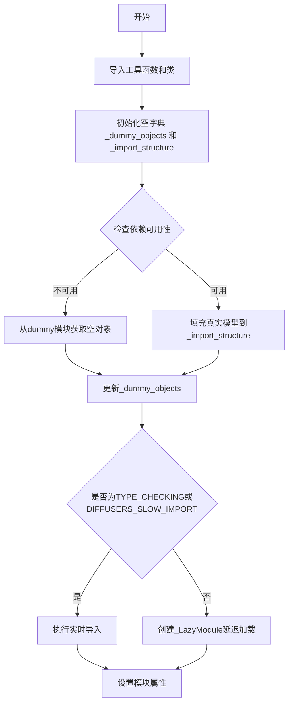
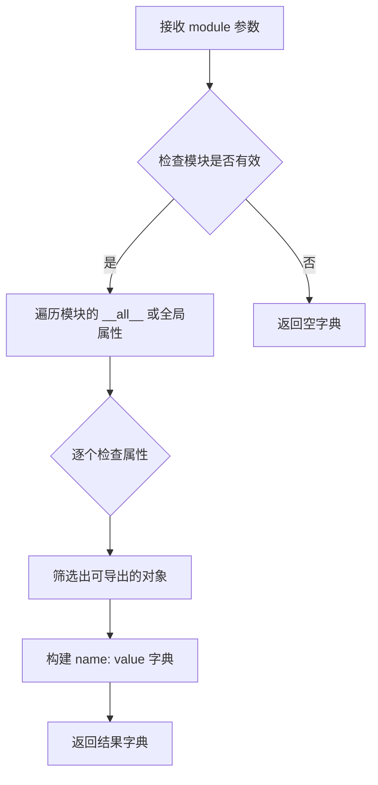
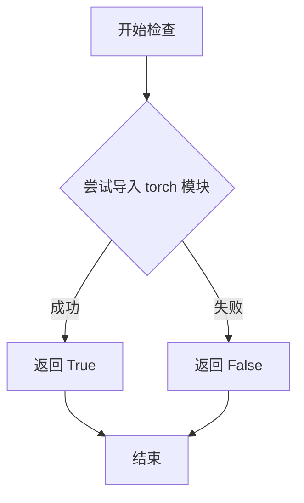
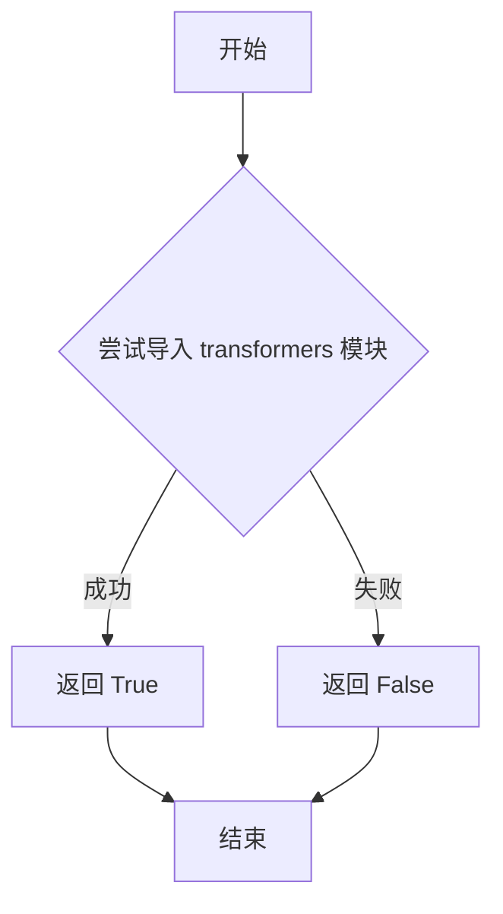
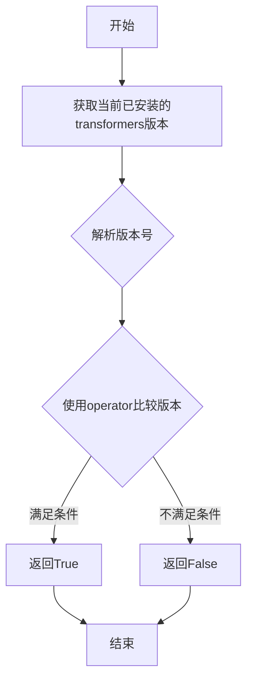

# `diffusers\src\diffusers\pipelines\audioldm2\__init__.py` 详细设计文档

这是一个Diffusers库的延迟加载模块，通过条件检查实现可选依赖（torch、transformers）的智能导入，当依赖可用时导入真实模型类（AudioLDM2ProjectionModel、AudioLDM2UNet2DConditionModel、AudioLDM2Pipeline），否则导入空对象以保持API兼容性。

## 整体流程



## 类结构

```
无复杂类继承结构，主要使用延迟加载机制
_LazyModule (外部导入的延迟加载类)
└── 用于包装模块实现懒加载
```

## 全局变量及字段


### `_dummy_objects`
    
存储虚拟对象的字典，用于在可选依赖不可用时提供替代对象，避免导入错误

类型：`dict`
    


### `_import_structure`
    
定义模块的导入结构，键为子模块名称，值为可导出的对象列表，用于延迟加载机制

类型：`dict`
    


    

## 全局函数及方法


### `get_objects_from_module`

该函数是一个工具函数，用于从指定模块中提取所有可导出对象（类、函数等），并将其转换为字典格式返回。通常用于延迟加载（lazy loading）场景下，当某些可选依赖不可用时，从 dummy 模块中获取占位对象。

参数：

- `module`：`module`，要从中提取对象的模块对象（如此代码中的 `dummy_torch_and_transformers_objects`）

返回值：`dict`，返回包含模块中所有可导出对象名称及其引用的字典，可直接用于更新其他字典（如 `_dummy_objects.update(...)`）

#### 流程图



#### 带注释源码

```
# 伪代码示例，基于使用方式推断的实现逻辑
def get_objects_from_module(module):
    """
    从给定模块中提取所有可导出对象。
    
    参数:
        module: 要提取对象的模块对象
        
    返回:
        dict: 对象名称到对象引用的映射字典
    """
    objects = {}
    
    # 获取模块中所有可导出的名称
    if hasattr(module, '__all__'):
        names = module.__all__
    else:
        # 如果没有 __all__，获取所有公共属性
        names = [name for name in dir(module) if not name.startswith('_')]
    
    # 遍历名称，提取对应的对象
    for name in names:
        try:
            obj = getattr(module, name)
            objects[name] = obj
        except AttributeError:
            # 如果获取失败，跳过该属性
            continue
    
    return objects
```

---

**备注**：该函数的完整实现位于 `.../utils` 模块中（具体路径为 `diffusers.utils` 或类似路径），上述源码为基于使用方式的推断实现。从当前代码中的使用模式 `_dummy_objects.update(get_objects_from_module(dummy_torch_and_transformers_objects))` 来看，该函数确实返回了一个字典结构，用于将 dummy 模块中的所有占位对象合并到 `_dummy_objects` 全局字典中，以便在可选依赖不可用时提供延迟加载的占位符。


### `is_torch_available`

该函数用于检查当前环境中是否已安装 PyTorch 库，通过尝试导入 `torch` 模块来判断其可用性。

参数： 无

返回值：`bool`，如果 PyTorch 已安装且可导入则返回 `True`，否则返回 `False`

#### 流程图



#### 带注释源码

```python
# 这是 is_torch_available 函数的典型实现模式
# 定义在 ...utils 包中

def is_torch_available() -> bool:
    """
    检查 PyTorch 是否可用。
    
    Returns:
        bool: 如果 torch 模块可以导入则返回 True，否则返回 False
    """
    try:
        # 尝试导入 torch 模块
        import torch
        return True
    except ImportError:
        # 如果导入失败（未安装或导入错误），返回 False
        return False
```

> **注意**：该函数定义在 `src/diffusers/utils/__init__.py`（或类似路径）中，当前文件通过 `from ...utils import is_torch_available` 导入并使用它。此函数在当前文件中被用于条件判断，以决定是否加载 AudioLDM2 相关的模型和管道类。


### `is_transformers_available`

检查 transformers 库是否已安装且可用，通常通过尝试导入 transformers 模块来判断。

参数：

- 无参数

返回值：`bool`，如果 transformers 库可用则返回 `True`，否则返回 `False`

#### 流程图



#### 带注释源码

```
# 该函数定义在 ...utils 模块中，以下为推断的实现逻辑

def is_transformers_available():
    """
    检查 transformers 库是否可用。
    
    返回:
        bool: 如果 transformers 库已安装且可以导入则返回 True，否则返回 False
    """
    try:
        # 尝试导入 transformers 模块
        import transformers
        return True
    except ImportError:
        # 如果导入失败，说明 transformers 未安装
        return False
```

> **注意**：由于 `is_transformers_available` 函数定义在 `...utils` 模块中（代码中通过 `from ...utils import is_transformers_available` 导入），其完整实现在外部文件中。上述源码为基于常见模式的推断实现。

---

## 补充信息

### 7. 其它项目

**使用场景**：
- 在 `Diffusers` 库中用于条件性导入 `AudioLDM2` 相关的模型和管道
- 确保在导入 `AudioLDM2ProjectionModel`、`AudioLDM2UNet2DConditionModel` 和 `AudioLDM2Pipeline` 之前，transformers 和 torch 库都可用

**依赖检查链**：
```python
if not (is_transformers_available() 
        and is_torch_available() 
        and is_transformers_version(">=", "4.27.0")):
    raise OptionalDependencyNotAvailable()
```

这行代码确保三个条件同时满足：
1. `is_transformers_available()` 返回 `True`
2. `is_torch_available()` 返回 `True`  
3. `is_transformers_version(">=", "4.27.0")` 返回 `True`

只有全部满足时才会导入 `modeling_audioldm2` 和 `pipeline_audioldm2` 模块，否则会使用 `dummy_torch_and_transformers_objects` 中的虚拟对象填充。


### `is_transformers_version`

该函数用于检查已安装的 transformers 库版本是否满足指定的条件要求，通过比较操作符和目标版本号返回布尔值。

参数：

- `operator`：字符串，比较操作符（如 ">="、"<"、"==" 等）
- `version`：字符串，目标版本号（如 "4.27.0"）

返回值：布尔值，若当前 transformers 版本满足指定条件则返回 `True`，否则返回 `False`

#### 流程图



#### 带注释源码

```python
# 该函数定义在 ...utils 模块中，此处仅为调用示例
# 从导入语句可见函数签名：
# from ...utils import is_transformers_version

# 函数调用示例（在当前代码中）：
if not (is_transformers_available() and is_torch_available() and is_transformers_version(">=", "4.27.0")):
    raise OptionalDependencyNotAvailable()

# 参数说明：
# - 第一个参数 ">= "：版本比较操作符
# - 第二个参数 "4.27.0"：目标版本号
# 返回值：布尔值，表示当前transformers版本是否>=4.27.0
```

> **注意**：由于 `is_transformers_version` 函数定义在 `...utils` 模块中，当前代码片段仅导入了该函数而未包含其具体实现。上述源码为基于使用方式的推断。

## 关键组件


### 延迟加载模块机制（Lazy Loading）

利用 `_LazyModule` 实现模块的延迟加载，只有在实际使用时才导入真实模块，提高导入速度并支持可选依赖。

### 可选依赖检查机制

通过 `is_torch_available()`、`is_transformers_available()` 和 `is_transformers_version()` 检查 torch 和 transformers 是否可用及版本要求，使用 `OptionalDependencyNotAvailable` 异常处理依赖不可用的情况。

### 导入结构字典（_import_structure）

定义模块的导入结构字典，包含 `modeling_audioldm2` 和 `pipeline_audioldm2` 两个子模块及其可导出类 `AudioLDM2ProjectionModel`、`AudioLDM2UNet2DConditionModel` 和 `AudioLDM2Pipeline`。

### Dummy对象占位机制

当可选依赖不可用时，使用 `get_objects_from_module` 从 dummy 模块获取对象并注册到 `_dummy_objects`，确保模块结构完整可用。

### 类型检查导入模式（TYPE_CHECKING）

在类型检查或慢导入模式下，直接导入真实模块用于类型提示和静态分析，而非延迟加载。


## 问题及建议


### 已知问题

-   **硬编码版本号**：依赖版本号 `"4.27.0"` 被硬编码在代码中两处，若版本要求变更需要修改多处，增加维护成本
-   **重复的依赖检查逻辑**：可选依赖的检查代码在第17-22行和第28-35行重复出现，违反了 DRY 原则
-   **缺乏版本范围灵活性**：仅支持 `>= "4.27.0"` 的单一版本判断，无法方便地支持更复杂的版本范围策略（如支持多个版本段）
-   **静默失败风险**：如果实际导入时发生除 `OptionalDependencyNotAvailable` 之外的异常（如导入错误），错误会被静默处理，导致运行时可能出现难以追踪的问题
-   **无显式导出定义**：模块未定义 `__all__`，导致公共 API 不够明确
-   **类型检查分支的逻辑复杂度**：在 `TYPE_CHECKING` 分支中使用 try/except/else 结构增加了代码理解难度
-   **潜在的竞态条件**：在并发场景下，模块可能在 `_LazyModule` 设置完成前被多次导入

### 优化建议

-   **提取版本常量和依赖检查函数**：将 `"4.27.0"` 提取为模块级常量，将依赖检查逻辑封装为可复用的函数，减少重复代码
-   **统一依赖配置管理**：建议使用配置对象或字典集中管理所有可选依赖及其版本要求，便于维护和扩展
-   **增强错误处理**：在导入实际模块时增加异常捕获和日志记录，对非预期的导入失败提供明确的错误信息
-   **添加 `__all__` 定义**：显式声明模块的公共导出 API，提升类型检查和代码提示的准确性
-   **简化类型检查分支**：考虑重构 TYPE_CHECKING 分支，使用更清晰的条件逻辑或提前返回模式
-   **添加导入锁机制**：在高并发场景下，可考虑使用线程锁或 importlib 的线程安全机制确保模块初始化安全
-   **考虑使用 `importlib.util.find_spec` 预检查**：在尝试导入前先检查模块是否可用，避免直接捕获异常的粗粒度错误处理方式


## 其它


### 设计目标与约束

本模块的设计目标是实现Audioldm2相关模型和流水线的延迟加载机制，在保证功能完整性的同时优化导入性能。约束条件包括：必须依赖transformers>=4.27.0和torch可用，必须支持TYPE_CHECKING和DIFFUSERS_SLOW_IMPORT两种模式，必须使用LazyModule实现延迟导入，必须处理OptionalDependencyNotAvailable异常。

### 错误处理与异常设计

本模块采用可选依赖检查机制，当transformers、torch或版本不满足要求时，捕获OptionalDependencyNotAvailable异常并导入虚拟对象(_dummy_objects)，确保模块导入不会失败。虚拟对象机制允许在依赖不可用时模块仍可被导入，但实际使用时会触发真正的导入错误。异常处理流程为：先检查依赖可用性，不满足则抛异常，在except块中导入dummy对象，在else块中导入真实对象。

### 外部依赖与接口契约

外部依赖包括：is_transformers_available()检查transformers库可用性，is_torch_available()检查torch库可用性，is_transformers_version(">=", "4.27.0")检查transformers版本>=4.27.0，_LazyModule实现延迟加载机制，get_objects_from_module获取虚拟对象。接口契约方面：_import_structure字典定义可导出的公共API，_dummy_objects存储依赖不可用时的替代对象，模块导出AudioLDM2ProjectionModel、AudioLDM2UNet2DConditionModel和AudioLDM2Pipeline三个类。

### 模块化与可扩展性设计

本模块采用模块化设计，通过_import_structure字典结构化组织导出内容，便于扩展新的模型或管道。添加新组件只需在对应的_import_structure键下添加类名字符串，并确保在TYPE_CHECK分支中正确导入。虚拟对象机制允许独立扩展dummy_objects而无需修改核心逻辑。_LazyModule的module_spec参数确保模块的导入机制与Python导入系统完全兼容。

### 性能考虑

本模块的性能优化主要体现在延迟加载策略：真实对象仅在首次使用时导入，而非模块加载时立即导入。DIFFUSERS_SLOW_IMPORT标志允许在需要时完全导入整个模块树。sys.modules直接赋值而非重新创建模块实例，减少内存开销。对于依赖检查，采用短路求值策略避免不必要的版本比较操作。

### 版本兼容性

本模块明确要求transformers>=4.27.0，该版本要求确保与AudioLDM2相关的API兼容性。代码通过is_transformers_version(">=", "4.27.0")精确控制版本边界。TYPE_CHECKING分支和运行时分支的逻辑一致性确保类型检查和实际运行行为统一。模块需要Python 3.7+环境支持（基于typing.TYPE_CHECKING和LazyModule的使用）。

### 测试策略

测试应覆盖以下场景：依赖全部可用时的正常导入，依赖缺失时的虚拟对象导入，DIFFUSERS_SLOW_IMPORT标志生效时的行为，TYPE_CHECKING模式下的类型导入，模块属性的动态可用性验证。建议使用pytest的parametrize测试不同依赖组合场景，使用mock模拟OptionalDependencyNotAvailable异常。

### 安全考虑

本模块不涉及用户输入处理，不存在直接的安全风险。模块通过sys.modules进行动态属性设置，需确保Dummy对象不会意外执行危险操作。所有导入来源均为同一项目内的相对导入(dummy_torch_and_transformers_objects, modeling_audioldm2, pipeline_audioldm2)，无外部不受信任的导入源。

### 部署相关

本模块作为Diffusers库的一部分部署，遵循Diffusers项目的版本管理和发布流程。部署时需确保dummy_torch_and_transformers_objects模块包含所有必要的虚拟对象定义。模块的_lazy loading特性使其适合作为大型库的子模块使用，不会显著增加主包导入时间。


    