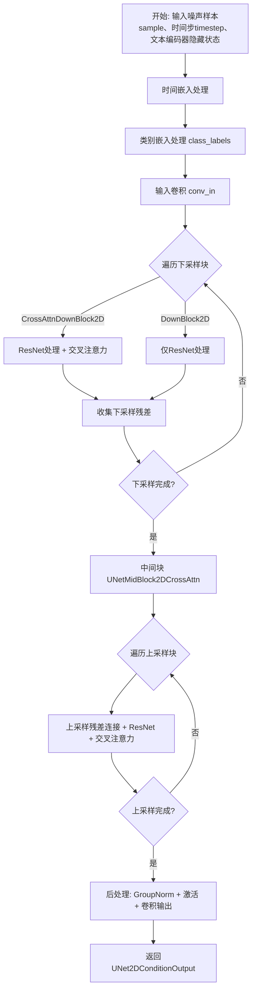
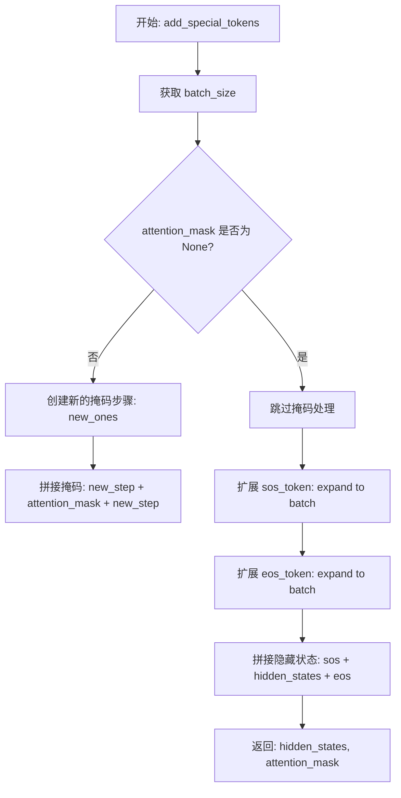
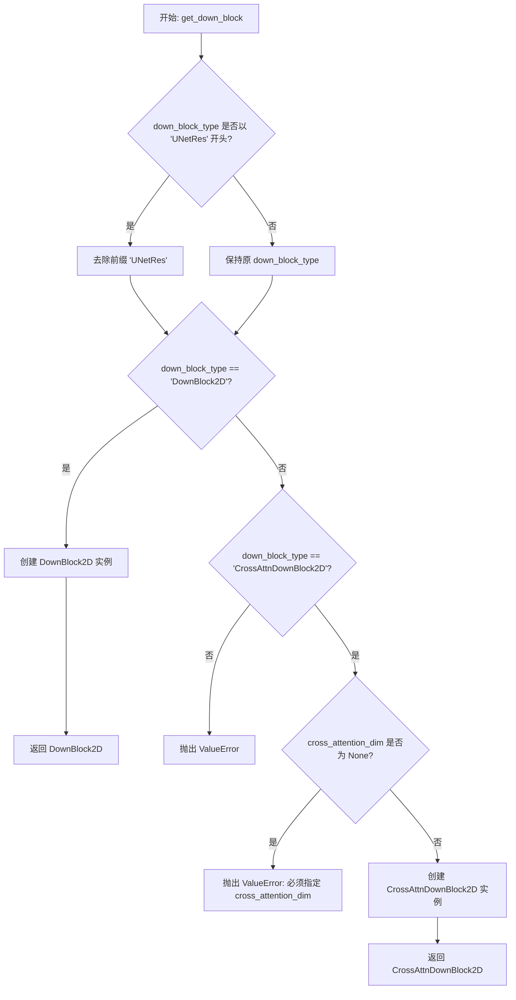
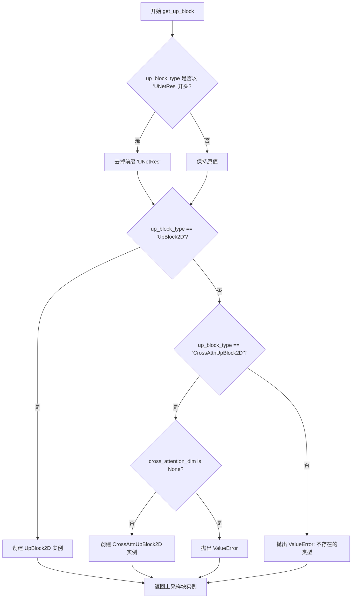
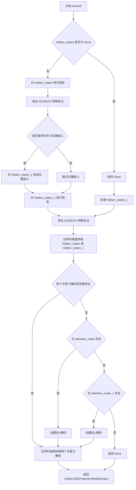
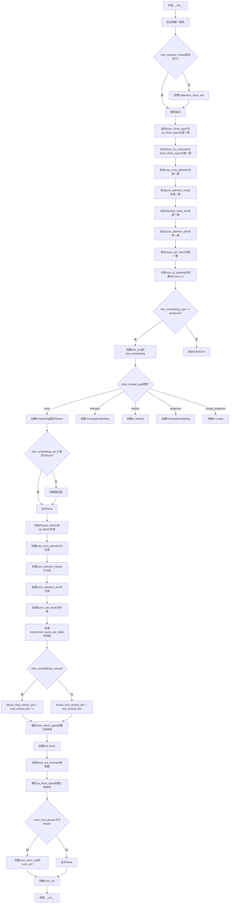
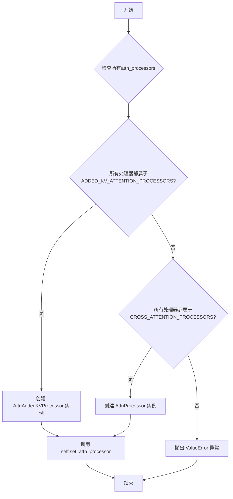
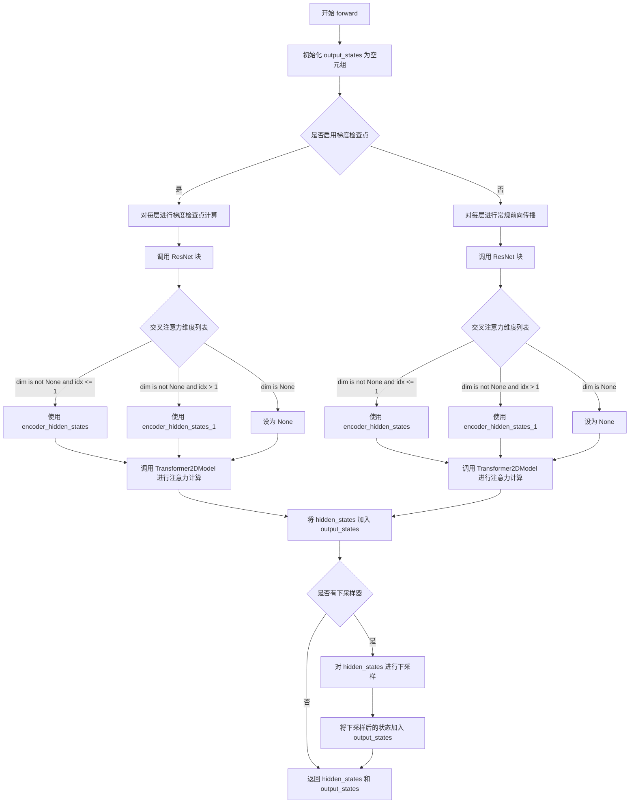
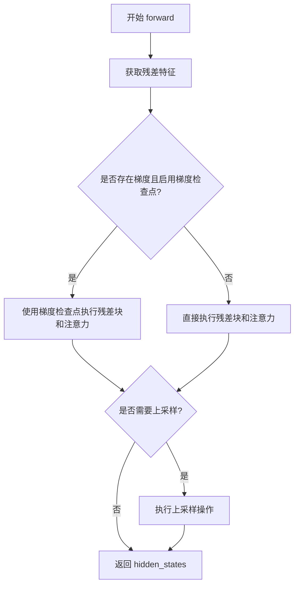

# `diffusers\src\diffusers\pipelines\audioldm2\modeling_audioldm2.py` 详细设计文档

AudioLDM2的UNet条件扩散模型实现，用于音频生成。该模型接受噪声样本、条件状态（包括两个文本编码器CLAP和T5的嵌入）和时间步，通过多层下采样、Transformer交叉注意力块和上采样过程去噪，输出与文本描述相符的音频特征。

## 整体流程



## 类结构

```
AudioLDM2ProjectionModel (投影模型基类)
AudioLDM2UNet2DConditionModel (主UNet条件模型)
├── CrossAttnDownBlock2D (带交叉注意力的下采样块)
├── UNetMidBlock2DCrossAttn (UNet中间交叉注意力块)
└── CrossAttnUpBlock2D (带交叉注意力的上采样块)
辅助函数: add_special_tokens, get_down_block, get_up_block
```

## 全局变量及字段


### `logger`
    
模块级别的日志记录器对象

类型：`logging.Logger`
    


### `add_special_tokens`
    
全局函数，用于在隐藏状态序列的起始和结束位置添加特殊标记（SOS和EOS）并调整注意力掩码

类型：`function`
    


### `AudioLDM2ProjectionModel.projection`
    
第一个文本编码器（CLAP）的投影层，将文本嵌入维度映射到语言模型维度

类型：`nn.Linear`
    


### `AudioLDM2ProjectionModel.projection_1`
    
第二个文本编码器（T5或VITS）的投影层，将文本嵌入维度映射到语言模型维度

类型：`nn.Linear`
    


### `AudioLDM2ProjectionModel.sos_embed`
    
第一个文本编码器的起始-of-sequence（SOS）特殊标记的可学习嵌入向量

类型：`nn.Parameter`
    


### `AudioLDM2ProjectionModel.eos_embed`
    
第一个文本编码器的结束-of-sequence（EOS）特殊标记的可学习嵌入向量

类型：`nn.Parameter`
    


### `AudioLDM2ProjectionModel.sos_embed_1`
    
第二个文本编码器的起始-of-sequence（SOS）特殊标记的可学习嵌入向量

类型：`nn.Parameter`
    


### `AudioLDM2ProjectionModel.eos_embed_1`
    
第二个文本编码器的结束-of-sequence（EOS）特殊标记的可学习嵌入向量

类型：`nn.Parameter`
    


### `AudioLDM2ProjectionModel.use_learned_position_embedding`
    
布尔标志，指示是否为VITS编码器使用可学习的位置嵌入

类型：`bool`
    


### `AudioLDM2ProjectionModel.learnable_positional_embedding`
    
VITS编码器的可学习位置嵌入张量，用于编码序列位置信息

类型：`nn.Parameter`
    


### `AudioLDM2UNet2DConditionModel.sample_size`
    
输入/输出样本的空间尺寸（高度和宽度）

类型：`int`
    


### `AudioLDM2UNet2DConditionModel.conv_in`
    
UNet的输入卷积层，将输入通道数转换为第一个块输出通道数

类型：`nn.Conv2d`
    


### `AudioLDM2UNet2DConditionModel.time_proj`
    
时间步投影层，将时间步转换为嵌入表示

类型：`Timesteps`
    


### `AudioLDM2UNet2DConditionModel.time_embedding`
    
时间步嵌入层，将投影后的时间步嵌入转换为更高维度的表示

类型：`TimestepEmbedding`
    


### `AudioLDM2UNet2DConditionModel.class_embedding`
    
类别嵌入层，用于类别条件输入，根据class_embed_type类型选择不同的实现

类型：`nn.Embedding|TimestepEmbedding|nn.Linear|None`
    


### `AudioLDM2UNet2DConditionModel.time_embed_act`
    
时间嵌入的激活函数层，在嵌入传递给其他组件前对其进行非线性变换

类型：`Activation|None`
    


### `AudioLDM2UNet2DConditionModel.down_blocks`
    
下采样块列表，包含UNet的所有下采样阶段

类型：`nn.ModuleList`
    


### `AudioLDM2UNet2DConditionModel.mid_block`
    
UNet的中间块，处理最深层级的特征并包含交叉注意力机制

类型：`UNetMidBlock2DCrossAttn`
    


### `AudioLDM2UNet2DConditionModel.up_blocks`
    
上采样块列表，包含UNet的所有上采样阶段

类型：`nn.ModuleList`
    


### `AudioLDM2UNet2DConditionModel.conv_norm_out`
    
输出卷积前的归一化层，用于规范化特征

类型：`nn.GroupNorm|None`
    


### `AudioLDM2UNet2DConditionModel.conv_act`
    
输出卷积前的激活函数层

类型：`Activation|None`
    


### `AudioLDM2UNet2DConditionModel.conv_out`
    
UNet的输出卷积层，将特征映射到最终的输出通道数

类型：`nn.Conv2d`
    


### `AudioLDM2UNet2DConditionModel.num_upsamplers`
    
上采样块的数量，用于计算上采样因子

类型：`int`
    


### `CrossAttnDownBlock2D.has_cross_attention`
    
布尔标志，指示该下采样块是否包含交叉注意力机制

类型：`bool`
    


### `CrossAttnDownBlock2D.num_attention_heads`
    
注意力机制中使用的注意力头数量

类型：`int`
    


### `CrossAttnDownBlock2D.cross_attention_dim`
    
交叉注意力机制的维度配置，支持多个维度

类型：`tuple[int]|int`
    


### `CrossAttnDownBlock2D.resnets`
    
ResNet块列表，用于处理特征并提供残差连接

类型：`nn.ModuleList`
    


### `CrossAttnDownBlock2D.attentions`
    
Transformer注意力块列表，用于实现交叉注意力机制

类型：`nn.ModuleList`
    


### `CrossAttnDownBlock2D.downsamplers`
    
下采样器列表，用于降低特征图的空间分辨率

类型：`nn.ModuleList|None`
    


### `CrossAttnDownBlock2D.gradient_checkpointing`
    
布尔标志，指示是否启用梯度检查点以节省显存

类型：`bool`
    


### `UNetMidBlock2DCrossAttn.has_cross_attention`
    
布尔标志，指示该中间块是否包含交叉注意力机制

类型：`bool`
    


### `UNetMidBlock2DCrossAttn.num_attention_heads`
    
注意力机制中使用的注意力头数量

类型：`int`
    


### `UNetMidBlock2DCrossAttn.cross_attention_dim`
    
交叉注意力机制的维度配置

类型：`tuple[int]|int`
    


### `UNetMidBlock2DCrossAttn.resnets`
    
ResNet块列表，用于处理中间层特征

类型：`nn.ModuleList`
    


### `UNetMidBlock2DCrossAttn.attentions`
    
Transformer注意力块列表，实现中间块的交叉注意力

类型：`nn.ModuleList`
    


### `UNetMidBlock2DCrossAttn.gradient_checkpointing`
    
布尔标志，指示是否启用梯度检查点

类型：`bool`
    


### `CrossAttnUpBlock2D.has_cross_attention`
    
布尔标志，指示该上采样块是否包含交叉注意力机制

类型：`bool`
    


### `CrossAttnUpBlock2D.num_attention_heads`
    
注意力机制中使用的注意力头数量

类型：`int`
    


### `CrossAttnUpBlock2D.cross_attention_dim`
    
交叉注意力机制的维度配置

类型：`tuple[int]|int`
    


### `CrossAttnUpBlock2D.resnets`
    
ResNet块列表，用于上采样特征处理

类型：`nn.ModuleList`
    


### `CrossAttnUpBlock2D.attentions`
    
Transformer注意力块列表，实现上采样块的交叉注意力

类型：`nn.ModuleList`
    


### `CrossAttnUpBlock2D.upsamplers`
    
上采样器列表，用于增加特征图的空间分辨率

类型：`nn.ModuleList|None`
    


### `CrossAttnUpBlock2D.gradient_checkpointing`
    
布尔标志，指示是否启用梯度检查点

类型：`bool`
    
    

## 全局函数及方法


### `add_special_tokens`

该函数用于向输入序列添加特殊的起始标记（SOS）和结束标记（EOS），同时相应地更新注意力掩码。它常用于文本编码器的输出预处理，以便模型能够识别序列的开始和结束位置。

参数：

- `hidden_states`：`torch.Tensor`，输入的隐藏状态序列，形状为 `(batch_size, sequence_length, hidden_size)`
- `attention_mask`：`torch.Tensor | None`，注意力掩码，用于指示哪些位置是有效的，形状为 `(batch_size, sequence_length)`
- `sos_token`：`torch.Tensor`，起始标记（Start of Sequence），形状为 `(hidden_size,)` 或 `(1, hidden_size)`
- `eos_token`：`torch.Tensor`，结束标记（End of Sequence），形状为 `(hidden_size,)` 或 `(1, hidden_size)`

返回值：`(torch.Tensor, torch.Tensor | None)`，返回包含特殊标记的隐藏状态（形状变为 `(batch_size, sequence_length + 2, hidden_size)`）和更新后的注意力掩码（长度增加2）

#### 流程图



#### 带注释源码

```python
def add_special_tokens(hidden_states, attention_mask, sos_token, eos_token):
    """
    向序列添加特殊的 SOS/EOS 标记
    
    参数:
        hidden_states: 输入的隐藏状态张量，形状为 (batch_size, seq_len, hidden_dim)
        attention_mask: 注意力掩码，形状为 (batch_size, seq_len)，可为空
        sos_token: 起始标记向量
        eos_token: 结束标记向量
    
    返回:
        添加标记后的 hidden_states 和更新后的 attention_mask
    """
    # 获取批次大小
    batch_size = hidden_states.shape[0]

    # 如果存在注意力掩码，则需要扩展掩码长度
    if attention_mask is not None:
        # 创建与新标记对应的新掩码步（假设为有效位置）
        new_attn_mask_step = attention_mask.new_ones((batch_size, 1))
        # 在序列前后各添加一个掩码步
        attention_mask = torch.concat([new_attn_mask_step, attention_mask, new_attn_mask_step], dim=-1)

    # 扩展 SOS 和 EOS 标记到批次维度
    # expand: 在指定维度复制张量以匹配批次大小
    sos_token = sos_token.expand(batch_size, 1, -1)   # -> (batch_size, 1, hidden_size)
    eos_token = eos_token.expand(batch_size, 1, -1)   # -> (batch_size, 1, hidden_size)
    
    # 将特殊标记拼接到序列的起始和结束位置
    # 拼接维度为序列维度 (dim=1)
    hidden_states = torch.concat([sos_token, hidden_states, eos_token], dim=1)
    
    return hidden_states, attention_mask
```


### `get_down_block`

获取下采样块的工厂函数，根据 `down_block_type` 参数创建并返回对应的下采样块（`DownBlock2D` 或 `CrossAttnDownBlock2D`），用于 UNet 模型的编码器（down path）部分。

参数：

- `down_block_type`：`str`，下采样块的类型（如 "DownBlock2D"、"CrossAttnDownBlock2D"、"UNetResDownBlock2D" 等）
- `num_layers`：`int`，块内 ResNet 层的数量
- `in_channels`：`int`，输入特征图的通道数
- `out_channels`：`int`，输出特征图的通道数
- `temb_channels`：`int`，时间嵌入（timestep embedding）的通道数
- `add_downsample`：`bool`，是否在下采样块后添加下采样层
- `resnet_eps`：`float`，ResNet 块中 GroupNorm 的 epsilon 值
- `resnet_act_fn`：`str`，ResNet 块中使用的激活函数名称（如 "silu"、"swish" 等）
- `transformer_layers_per_block`：`int`，每个块中 Transformer 层的数量（仅用于 CrossAttn 类型）
- `num_attention_heads`：`int | None`，注意力头的数量（仅用于 CrossAttn 类型）
- `resnet_groups`：`int | None`，ResNet 块中 GroupNorm 的分组数
- `cross_attention_dim`：`int | None`，交叉注意力机制的维度（仅用于 CrossAttn 类型）
- `downsample_padding`：`int | None`，下采样卷积的填充大小
- `use_linear_projection`：`bool`，是否在注意力层中使用线性投影
- `only_cross_attention`：`bool`，是否仅使用交叉注意力（不使用自注意力）
- `upcast_attention`：`bool`，是否将注意力计算向上转型以提高精度
- `resnet_time_scale_shift`：`str`，ResNet 时间嵌入的缩放方式（"default" 或 "scale_shift"）

返回值：`DownBlock2D | CrossAttnDownBlock2D`，返回创建的下采样块实例

#### 流程图



#### 带注释源码

```python
def get_down_block(
    down_block_type,              # str: 下采样块类型 ("DownBlock2D" 或 "CrossAttnDownBlock2D")
    num_layers,                   # int: ResNet 层数量
    in_channels,                  # int: 输入通道数
    out_channels,                 # int: 输出通道数
    temb_channels,                # int: 时间嵌入通道数
    add_downsample,               # bool: 是否添加下采样
    resnet_eps,                   # float: ResNet eps 参数
    resnet_act_fn,                # str: ResNet 激活函数
    transformer_layers_per_block=1,  # int: Transformer 层数 (仅 CrossAttn 用)
    num_attention_heads=None,     # int: 注意力头数 (仅 CrossAttn 用)
    resnet_groups=None,           # int: ResNet 分组数
    cross_attention_dim=None,     # int: 交叉注意力维度 (仅 CrossAttn 用)
    downsample_padding=None,      # int: 下采样填充
    use_linear_projection=False,  # bool: 是否用线性投影
    only_cross_attention=False,   # bool: 仅交叉注意力
    upcast_attention=False,       # bool: 上转注意力
    resnet_time_scale_shift="default",  # str: ResNet 时间缩放方式
):
    # 处理可能的前缀 "UNetRes"
    # 如果 block_type 以 "UNetRes" 开头，则去掉前缀后再比较
    down_block_type = down_block_type[7:] if down_block_type.startswith("UNetRes") else down_block_type
    
    # 如果是简单的 DownBlock2D（无注意力机制）
    if down_block_type == "DownBlock2D":
        return DownBlock2D(
            num_layers=num_layers,
            in_channels=in_channels,
            out_channels=out_channels,
            temb_channels=temb_channels,
            add_downsample=add_downsample,
            resnet_eps=resnet_eps,
            resnet_act_fn=resnet_act_fn,
            resnet_groups=resnet_groups,
            downsample_padding=downsample_padding,
            resnet_time_scale_shift=resnet_time_scale_shift,
        )
    
    # 如果是带交叉注意力的 DownBlock
    elif down_block_type == "CrossAttnDownBlock2D":
        # 交叉注意力维度必须指定
        if cross_attention_dim is None:
            raise ValueError("cross_attention_dim must be specified for CrossAttnDownBlock2D")
        
        return CrossAttnDownBlock2D(
            num_layers=num_layers,
            transformer_layers_per_block=transformer_layers_per_block,
            in_channels=in_channels,
            out_channels=out_channels,
            temb_channels=temb_channels,
            add_downsample=add_downsample,
            resnet_eps=resnet_eps,
            resnet_act_fn=resnet_act_fn,
            resnet_groups=resnet_groups,
            downsample_padding=downsample_padding,
            cross_attention_dim=cross_attention_dim,
            num_attention_heads=num_attention_heads,
            use_linear_projection=use_linear_projection,
            only_cross_attention=only_cross_attention,
            upcast_attention=upcast_attention,
            resnet_time_scale_shift=resnet_time_scale_shift,
        )
    
    # 不支持的 block_type
    raise ValueError(f"{down_block_type} does not exist.")
```


### `get_up_block`

获取上采样块的工厂函数，根据 `up_block_type` 参数创建并返回对应的上采样模块（`UpBlock2D` 或 `CrossAttnUpBlock2D`），用于 UNet2D 模型的解码器部分。

参数：

- `up_block_type`：`str`，上采样块的类型标识符，如 `"UpBlock2D"` 或 `"CrossAttnUpBlock2D"`
- `num_layers`：`int`，该块中 ResNet 层的数量
- `in_channels`：`int`，输入特征图的通道数
- `out_channels`：`int`，输出特征图的通道数
- `prev_output_channel`：`int`，前一模块输出的通道数，用于残差连接
- `temb_channels`：`int`，时间嵌入（timestep embedding）的通道数
- `add_upsample`：`bool`，是否添加上采样操作
- `resnet_eps`：`float`，ResNet 层中 GroupNorm 的 epsilon 值
- `resnet_act_fn`：`str`，ResNet 层的激活函数名称
- `transformer_layers_per_block`：`int`，每个块中 Transformer 层的数量（默认 1）
- `num_attention_heads`：`int | None`，注意力头数量
- `resnet_groups`：`int | None`，GroupNorm 的分组数
- `cross_attention_dim`：`int | None`，交叉注意力机制的维度
- `use_linear_projection`：`bool`，是否使用线性投影（默认 False）
- `only_cross_attention`：`bool`，是否仅使用交叉注意力（默认 False）
- `upcast_attention`：`bool`，是否向上转换注意力计算（默认 False）
- `resnet_time_scale_shift`：`str`，ResNet 时间尺度偏移配置（默认 "default"）

返回值：`UpBlock2D | CrossAttnUpBlock2D`，返回实例化的上采样块对象

#### 流程图



#### 带注释源码

```python
def get_up_block(
    up_block_type: str,
    num_layers: int,
    in_channels: int,
    out_channels: int,
    prev_output_channel: int,
    temb_channels: int,
    add_upsample: bool,
    resnet_eps: float,
    resnet_act_fn: str,
    transformer_layers_per_block: int = 1,
    num_attention_heads: int | None = None,
    resnet_groups: int | None = None,
    cross_attention_dim: int | None = None,
    use_linear_projection: bool = False,
    only_cross_attention: bool = False,
    upcast_attention: bool = False,
    resnet_time_scale_shift: str = "default",
):
    """
    获取上采样块的工厂函数，根据 up_block_type 创建对应的上采样模块。
    
    参数:
        up_block_type: 上采样块类型 ("UpBlock2D" 或 "CrossAttnUpBlock2D")
        num_layers: ResNet 层数量
        in_channels: 输入通道数
        out_channels: 输出通道数
        prev_output_channel: 前一输出通道数，用于残差连接
        temb_channels: 时间嵌入通道数
        add_upsample: 是否添加上采样
        resnet_eps: ResNet epsilon 参数
        resnet_act_fn: 激活函数名称
        transformer_layers_per_block: Transformer 层数
        num_attention_heads: 注意力头数
        resnet_groups: GroupNorm 分组数
        cross_attention_dim: 交叉注意力维度
        use_linear_projection: 使用线性投影
        only_cross_attention: 仅交叉注意力
        upcast_attention: 向上转换注意力
        resnet_time_scale_shift: 时间尺度偏移配置
    
    返回:
        UpBlock2D 或 CrossAttnUpBlock2D 实例
    """
    # 处理可能的前缀 "UNetRes"
    up_block_type = up_block_type[7:] if up_block_type.startswith("UNetRes") else up_block_type
    
    # 根据类型创建对应的上采样块
    if up_block_type == "UpBlock2D":
        # 标准上采样块（不含交叉注意力）
        return UpBlock2D(
            num_layers=num_layers,
            in_channels=in_channels,
            out_channels=out_channels,
            prev_output_channel=prev_output_channel,
            temb_channels=temb_channels,
            add_upsample=add_upsample,
            resnet_eps=resnet_eps,
            resnet_act_fn=resnet_act_fn,
            resnet_groups=resnet_groups,
            resnet_time_scale_shift=resnet_time_scale_shift,
        )
    elif up_block_type == "CrossAttnUpBlock2D":
        # 带交叉注意力的上采样块
        if cross_attention_dim is None:
            raise ValueError("cross_attention_dim must be specified for CrossAttnUpBlock2D")
        return CrossAttnUpBlock2D(
            num_layers=num_layers,
            transformer_layers_per_block=transformer_layers_per_block,
            in_channels=in_channels,
            out_channels=out_channels,
            prev_output_channel=prev_output_channel,
            temb_channels=temb_channels,
            add_upsample=add_upsample,
            resnet_eps=resnet_eps,
            resnet_act_fn=resnet_act_fn,
            resnet_groups=resnet_groups,
            cross_attention_dim=cross_attention_dim,
            num_attention_heads=num_attention_heads,
            use_linear_projection=use_linear_projection,
            only_cross_attention=only_cross_attention,
            upcast_attention=upcast_attention,
            resnet_time_scale_shift=resnet_time_scale_shift,
        )
    
    # 不支持的上采样块类型
    raise ValueError(f"{up_block_type} does not exist.")
```


### AudioLDM2ProjectionModel.forward

该方法接收两个文本编码器（CLAP 和 T5/VITS）的嵌入向量，分别进行线性投影并添加可学习的 SOS（开始）和 EOS（结束）标记，然后沿序列维度拼接这些嵌入，同时合并对应的注意力掩码，最终输出一个包含两种文本表示的统一隐藏状态序列。

参数：

- `self`：类的实例本身，包含投影层和可学习参数
- `hidden_states`：`torch.Tensor | None`，第一个文本编码器（CLAP）的隐藏状态，形状为 `(batch_size, sequence_length, text_encoder_dim)`
- `hidden_states_1`：`torch.Tensor | None`，第二个文本编码器（T5 或 VITS）的隐藏状态，形状为 `(batch_size, sequence_length_1, text_encoder_1_dim)`
- `attention_mask`：`torch.LongTensor | None`，第一个文本编码器的注意力掩码，用于标识padding位置，值为0或1
- `attention_mask_1`：`torch.LongTensor | None`，第二个文本编码器的注意力掩码，用于标识padding位置，值为0或1

返回值：`AudioLDM2ProjectionModelOutput`，包含拼接后的隐藏状态和合并后的注意力掩码的数据类对象，其中 `hidden_states` 形状为 `(batch_size, sequence_length + sequence_length_1 + 4, langauge_model_dim)`，`attention_mask` 形状为 `(batch_size, sequence_length + sequence_length_1 + 4)`

#### 流程图



#### 带注释源码

```python
def forward(
    self,
    hidden_states: torch.Tensor | None = None,
    hidden_states_1: torch.Tensor | None = None,
    attention_mask: torch.LongTensor | None = None,
    attention_mask_1: torch.LongTensor | None = None,
):
    """
    前向传播方法，将两个文本编码器的嵌入投影到统一的空间，并添加特殊标记后拼接。
    
    参数:
        hidden_states: 第一个文本编码器(CLAP)的隐藏状态
        hidden_states_1: 第二个文本编码器(T5或VITS)的隐藏状态
        attention_mask: 第一个文本编码器的注意力掩码
        attention_mask_1: 第二个文本编码器的注意力掩码
    
    返回:
        AudioLDM2ProjectionModelOutput: 包含拼接后的隐藏状态和注意力掩码
    """
    # 步骤1: 对第一个文本编码器的隐藏状态进行线性投影
    # 将 text_encoder_dim 投影到 langauge_model_dim
    hidden_states = self.projection(hidden_states)
    
    # 步骤2: 为第一个隐藏状态添加 SOS(开始) 和 EOS(结束) 特殊标记
    # 同时扩展注意力掩码以匹配添加标记后的序列长度
    hidden_states, attention_mask = add_special_tokens(
        hidden_states, attention_mask, sos_token=self.sos_embed, eos_token=self.eos_embed
    )

    # 步骤3: 如果启用了可学习位置嵌入，则对第二个隐藏状态进行处理
    # 这主要用于 VITS 编码器的位置信息编码
    if self.use_learned_position_embedding is not None:
        # 执行维度变换以匹配位置嵌入的形状要求
        # 从 (batch, seq, dim) -> (batch, dim, seq) 添加位置嵌入 -> (batch, seq, dim)
        hidden_states_1 = (hidden_states_1.permute(0, 2, 1) + self.learnable_positional_embedding).permute(0, 2, 1)

    # 步骤4: 对第二个文本编码器的隐藏状态进行线性投影
    hidden_states_1 = self.projection_1(hidden_states_1)
    
    # 步骤5: 为第二个隐藏状态添加 SOS/EOS 特殊标记
    hidden_states_1, attention_mask_1 = add_special_tokens(
        hidden_states_1, attention_mask_1, sos_token=self.sos_embed_1, eos_token=self.eos_embed_1
    )

    # 步骤6: 沿序列维度(dim=1)拼接两个文本编码器的输出
    # 结果形状: (batch, seq1 + seq2 + 4, langauge_model_dim)
    hidden_states = torch.cat([hidden_states, hidden_states_1], dim=1)

    # 步骤7: 处理并合并注意力掩码
    # 如果只有一个掩码存在但另一个不存在，需要创建默认的全1掩码
    if attention_mask is None and attention_mask_1 is not None:
        # 创建与 hidden_states 前两个维度形状匹配的全1掩码
        attention_mask = attention_mask_1.new_ones((hidden_states[:2]))
    elif attention_mask is not None and attention_mask_1 is None:
        # 为第二个编码器创建全1掩码
        attention_mask_1 = attention_mask.new_ones((hidden_states_1[:2]))

    # 如果两个掩码都存在，则沿最后一个维度拼接
    if attention_mask is not None and attention_mask_1 is not None:
        attention_mask = torch.cat([attention_mask, attention_mask_1], dim=-1)
    else:
        # 如果都没有掩码，则设为 None
        attention_mask = None

    # 步骤8: 返回包含结果的数据类对象
    return AudioLDM2ProjectionModelOutput(
        hidden_states=hidden_states,
        attention_mask=attention_mask,
    )
```


### AudioLDM2UNet2DConditionModel.__init__

该方法是AudioLDM2UNet2DConditionModel类的构造函数，负责初始化一个用于音频生成的2D条件UNet模型。该模型继承自ModelMixin、AttentionMixin、ConfigMixin和UNet2DConditionLoadersMixin，支持双交叉注意力机制（encoder_hidden_states和encoder_hidden_states_1），可以处理来自两个不同文本编码器的条件信息，实现音频到音频的扩散生成。

参数：

- `sample_size`：`int | None`，输入/输出样本的高度和宽度，默认为None
- `in_channels`：`int`，输入样本的通道数，默认为4
- `out_channels`：`int`，输出样本的通道数，默认为4
- `flip_sin_to_cos`：`bool`，是否在时间嵌入中将sin转换为cos，默认为True
- `freq_shift`：`int`，应用于时间嵌入的频率偏移，默认为0
- `down_block_types`：`tuple[str]`，下采样块的类型元组，默认为("CrossAttnDownBlock2D", "CrossAttnDownBlock2D", "CrossAttnDownBlock2D", "DownBlock2D")
- `mid_block_type`：`str`，UNet中间块的类型，AudioLDM2仅支持"UNetMidBlock2DCrossAttn"
- `up_block_types`：`tuple[str]`，上采样块的类型元组，默认为("UpBlock2D", "CrossAttnUpBlock2D", "CrossAttnUpBlock2D", "CrossAttnUpBlock2D")
- `only_cross_attention`：`bool | tuple[bool]`，是否在基础transformer块中包含自注意力，默认为False
- `block_out_channels`：`tuple[int]`，每个块的输出通道数元组，默认为(320, 640, 1280, 1280)
- `layers_per_block`：`int | tuple[int]`，每个块的层数，默认为2
- `downsample_padding`：`int`，下采样卷积使用的填充，默认为1
- `mid_block_scale_factor`：`float`，中间块使用的缩放因子，默认为1.0
- `act_fn`：`str`，激活函数类型，默认为"silu"
- `norm_num_groups`：`int | None`，归一化使用的组数，默认为32，若为None则跳过归一化和激活层
- `norm_eps`：`float`，归一化使用的epsilon值，默认为1e-5
- `cross_attention_dim`：`int | tuple[int]`，交叉注意力特征的维度，默认为1280
- `transformer_layers_per_block`：`int | tuple[int]`，基础transformer块的层数，默认为1
- `attention_head_dim`：`int | tuple[int]`，注意力头的维度，默认为8
- `num_attention_heads`：`int | tuple[int] | None`，注意力头的数量，默认为None
- `use_linear_projection`：`bool`，是否使用线性投影，默认为False
- `class_embed_type`：`str | None`，类嵌入的类型，可选None、"timestep"、"identity"、"projection"或"simple_projection"，默认为None
- `num_class_embeds`：`int | None`，可学习嵌入矩阵的输入维度，默认为None
- `upcast_attention`：`bool`，是否上cast注意力，默认为False
- `resnet_time_scale_shift`：`str`，ResNet块的时间尺度偏移配置，默认为"default"
- `time_embedding_type`：`str`，时间步嵌入的类型，默认为"positional"
- `time_embedding_dim`：`int | None`，时间嵌入维度的可选覆盖值，默认为None
- `time_embedding_act_fn`：`str | None`，时间嵌入的一次激活函数，默认为None
- `timestep_post_act`：`str | None`，时间嵌入的二次激活函数，默认为None
- `time_cond_proj_dim`：`int | None`，时间嵌入中cond_proj层的维度，默认为None
- `conv_in_kernel`：`int`，conv_in层的卷积核大小，默认为3
- `conv_out_kernel`：`int`，conv_out层的卷积核大小，默认为3
- `projection_class_embeddings_input_dim`：`int | None`，当class_embed_type="projection"时的class_labels输入维度，默认为None
- `class_embeddings_concat`：`bool`，是否将时间嵌入与类嵌入连接，默认为False

返回值：无（构造函数）

#### 流程图



#### 带注释源码

```python
@register_to_config
def __init__(
    self,
    sample_size: int | None = None,
    in_channels: int = 4,
    out_channels: int = 4,
    flip_sin_to_cos: bool = True,
    freq_shift: int = 0,
    down_block_types: tuple[str] = (
        "CrossAttnDownBlock2D",
        "CrossAttnDownBlock2D",
        "CrossAttnDownBlock2D",
        "DownBlock2D",
    ),
    mid_block_type: str = "UNetMidBlock2DCrossAttn",
    up_block_types: tuple[str] = ("UpBlock2D", "CrossAttnUpBlock2D", "CrossAttnUpBlock2D", "CrossAttnUpBlock2D"),
    only_cross_attention: bool | tuple[bool] = False,
    block_out_channels: tuple[int] = (320, 640, 1280, 1280),
    layers_per_block: int | tuple[int] = 2,
    downsample_padding: int = 1,
    mid_block_scale_factor: float = 1,
    act_fn: str = "silu",
    norm_num_groups: int | None = 32,
    norm_eps: float = 1e-5,
    cross_attention_dim: int | tuple[int] = 1280,
    transformer_layers_per_block: int | tuple[int] = 1,
    attention_head_dim: int | tuple[int] = 8,
    num_attention_heads: int | tuple[int] | None = None,
    use_linear_projection: bool = False,
    class_embed_type: str | None = None,
    num_class_embeds: int | None = None,
    upcast_attention: bool = False,
    resnet_time_scale_shift: str = "default",
    time_embedding_type: str = "positional",
    time_embedding_dim: int | None = None,
    time_embedding_act_fn: str | None = None,
    timestep_post_act: str | None = None,
    time_cond_proj_dim: int | None = None,
    conv_in_kernel: int = 3,
    conv_out_kernel: int = 3,
    projection_class_embeddings_input_dim: int | None = None,
    class_embeddings_concat: bool = False,
):
    super().__init__()

    self.sample_size = sample_size

    if num_attention_heads is not None:
        raise ValueError(
            "At the moment it is not possible to define the number of attention heads via `num_attention_heads` because of a naming issue as described in https://github.com/huggingface/diffusers/issues/2011#issuecomment-1547958131. Passing `num_attention_heads` will only be supported in diffusers v0.19."
        )

    # 如果未定义num_attention_heads，则默认为attention_head_dim
    # 这是为了兼容早期版本中错误命名的变量
    num_attention_heads = num_attention_heads or attention_head_dim

    # 检查输入参数的一致性
    if len(down_block_types) != len(up_block_types):
        raise ValueError(
            f"Must provide the same number of `down_block_types` as `up_block_types`. `down_block_types`: {down_block_types}. `up_block_types`: {up_block_types}."
        )

    if len(block_out_channels) != len(down_block_types):
        raise ValueError(
            f"Must provide the same number of `block_out_channels` as `down_block_types`. `block_out_channels`: {block_out_channels}. `down_block_types`: {down_block_types}."
        )

    if not isinstance(only_cross_attention, bool) and len(only_cross_attention) != len(down_block_types):
        raise ValueError(
            f"Must provide the same number of `only_cross_attention` as `down_block_types`. `only_cross_attention`: {only_cross_attention}. `down_block_types`: {down_block_types}."
        )

    if not isinstance(num_attention_heads, int) and len(num_attention_heads) != len(down_block_types):
        raise ValueError(
            f"Must provide the same number of `num_attention_heads` as `down_block_types`. `num_attention_heads`: {num_attention_heads}. `down_block_types`: {down_block_types}."
        )

    if not isinstance(attention_head_dim, int) and len(attention_head_dim) != len(down_block_types):
        raise ValueError(
            f"Must provide the same number of `attention_head_dim` as `down_block_types`. `attention_head_dim`: {attention_head_dim}. `down_block_types`: {down_block_types}."
        )

    if isinstance(cross_attention_dim, list) and len(cross_attention_dim) != len(down_block_types):
        raise ValueError(
            f"Must provide the same number of `cross_attention_dim` as `down_block_types`. `cross_attention_dim`: {cross_attention_dim}. `down_block_types`: {down_block_types}."
        )

    if not isinstance(layers_per_block, int) and len(layers_per_block) != len(down_block_types):
        raise ValueError(
            f"Must provide the same number of `layers_per_block` as `down_block_types`. `layers_per_block`: {layers_per_block}. `down_block_types`: {down_block_types}."
        )

    # 输入卷积层
    conv_in_padding = (conv_in_kernel - 1) // 2
    self.conv_in = nn.Conv2d(
        in_channels, block_out_channels[0], kernel_size=conv_in_kernel, padding=conv_in_padding
    )

    # 时间嵌入
    if time_embedding_type == "positional":
        time_embed_dim = time_embedding_dim or block_out_channels[0] * 4

        self.time_proj = Timesteps(block_out_channels[0], flip_sin_to_cos, freq_shift)
        timestep_input_dim = block_out_channels[0]
    else:
        raise ValueError(f"{time_embedding_type} does not exist. Please make sure to use `positional`.")

    self.time_embedding = TimestepEmbedding(
        timestep_input_dim,
        time_embed_dim,
        act_fn=act_fn,
        post_act_fn=timestep_post_act,
        cond_proj_dim=time_cond_proj_dim,
    )

    # 类嵌入
    if class_embed_type is None and num_class_embeds is not None:
        self.class_embedding = nn.Embedding(num_class_embeds, time_embed_dim)
    elif class_embed_type == "timestep":
        self.class_embedding = TimestepEmbedding(timestep_input_dim, time_embed_dim, act_fn=act_fn)
    elif class_embed_type == "identity":
        self.class_embedding = nn.Identity(time_embed_dim, time_embed_dim)
    elif class_embed_type == "projection":
        if projection_class_embeddings_input_dim is None:
            raise ValueError(
                "`class_embed_type`: 'projection' requires `projection_class_embeddings_input_dim` be set"
            )
        self.class_embedding = TimestepEmbedding(projection_class_embeddings_input_dim, time_embed_dim)
    elif class_embed_type == "simple_projection":
        if projection_class_embeddings_input_dim is None:
            raise ValueError(
                "`class_embed_type`: 'simple_projection' requires `projection_class_embeddings_input_dim` be set"
            )
        self.class_embedding = nn.Linear(projection_class_embeddings_input_dim, time_embed_dim)
    else:
        self.class_embedding = None

    # 时间嵌入的激活函数
    if time_embedding_act_fn is None:
        self.time_embed_act = None
    else:
        self.time_embed_act = get_activation(time_embedding_act_fn)

    # 初始化下采样和上采样块列表
    self.down_blocks = nn.ModuleList([])
    self.up_blocks = nn.ModuleList([])

    # 将参数转换为列表以支持不同层使用不同配置
    if isinstance(only_cross_attention, bool):
        only_cross_attention = [only_cross_attention] * len(down_block_types)

    if isinstance(num_attention_heads, int):
        num_attention_heads = (num_attention_heads,) * len(down_block_types)

    if isinstance(cross_attention_dim, int):
        cross_attention_dim = (cross_attention_dim,) * len(down_block_types)

    if isinstance(layers_per_block, int):
        layers_per_block = [layers_per_block] * len(down_block_types)

    if isinstance(transformer_layers_per_block, int):
        transformer_layers_per_block = [transformer_layers_per_block] * len(down_block_types)

    # 如果类嵌入需要与时间嵌入连接，则时间嵌入维度翻倍
    if class_embeddings_concat:
        blocks_time_embed_dim = time_embed_dim * 2
    else:
        blocks_time_embed_dim = time_embed_dim

    # 下采样块
    output_channel = block_out_channels[0]
    for i, down_block_type in enumerate(down_block_types):
        input_channel = output_channel
        output_channel = block_out_channels[i]
        is_final_block = i == len(block_out_channels) - 1

        down_block = get_down_block(
            down_block_type,
            num_layers=layers_per_block[i],
            transformer_layers_per_block=transformer_layers_per_block[i],
            in_channels=input_channel,
            out_channels=output_channel,
            temb_channels=blocks_time_embed_dim,
            add_downsample=not is_final_block,
            resnet_eps=norm_eps,
            resnet_act_fn=act_fn,
            resnet_groups=norm_num_groups,
            cross_attention_dim=cross_attention_dim[i],
            num_attention_heads=num_attention_heads[i],
            downsample_padding=downsample_padding,
            use_linear_projection=use_linear_projection,
            only_cross_attention=only_cross_attention[i],
            upcast_attention=upcast_attention,
            resnet_time_scale_shift=resnet_time_scale_shift,
        )
        self.down_blocks.append(down_block)

    # 中间块
    if mid_block_type == "UNetMidBlock2DCrossAttn":
        self.mid_block = UNetMidBlock2DCrossAttn(
            transformer_layers_per_block=transformer_layers_per_block[-1],
            in_channels=block_out_channels[-1],
            temb_channels=blocks_time_embed_dim,
            resnet_eps=norm_eps,
            resnet_act_fn=act_fn,
            output_scale_factor=mid_block_scale_factor,
            resnet_time_scale_shift=resnet_time_scale_shift,
            cross_attention_dim=cross_attention_dim[-1],
            num_attention_heads=num_attention_heads[-1],
            resnet_groups=norm_num_groups,
            use_linear_projection=use_linear_projection,
            upcast_attention=upcast_attention,
        )
    else:
        raise ValueError(
            f"unknown mid_block_type : {mid_block_type}. Should be `UNetMidBlock2DCrossAttn` for AudioLDM2."
        )

    # 计数上采样层数
    self.num_upsamplers = 0

    # 上采样块（需要反转参数）
    reversed_block_out_channels = list(reversed(block_out_channels))
    reversed_num_attention_heads = list(reversed(num_attention_heads))
    reversed_layers_per_block = list(reversed(layers_per_block))
    reversed_cross_attention_dim = list(reversed(cross_attention_dim))
    reversed_transformer_layers_per_block = list(reversed(transformer_layers_per_block))
    only_cross_attention = list(reversed(only_cross_attention))

    output_channel = reversed_block_out_channels[0]
    for i, up_block_type in enumerate(up_block_types):
        is_final_block = i == len(block_out_channels) - 1

        prev_output_channel = output_channel
        output_channel = reversed_block_out_channels[i]
        input_channel = reversed_block_out_channels[min(i + 1, len(block_out_channels) - 1)]

        # 除了最后一层外都需要上采样
        if not is_final_block:
            add_upsample = True
            self.num_upsamplers += 1
        else:
            add_upsample = False

        up_block = get_up_block(
            up_block_type,
            num_layers=reversed_layers_per_block[i] + 1,
            transformer_layers_per_block=reversed_transformer_layers_per_block[i],
            in_channels=input_channel,
            out_channels=output_channel,
            prev_output_channel=prev_output_channel,
            temb_channels=blocks_time_embed_dim,
            add_upsample=add_upsample,
            resnet_eps=norm_eps,
            resnet_act_fn=act_fn,
            resnet_groups=norm_num_groups,
            cross_attention_dim=reversed_cross_attention_dim[i],
            num_attention_heads=reversed_num_attention_heads[i],
            use_linear_projection=use_linear_projection,
            only_cross_attention=only_cross_attention[i],
            upcast_attention=upcast_attention,
            resnet_time_scale_shift=resnet_time_scale_shift,
        )
        self.up_blocks.append(up_block)
        prev_output_channel = output_channel

    # 输出层
    if norm_num_groups is not None:
        self.conv_norm_out = nn.GroupNorm(
            num_channels=block_out_channels[0], num_groups=norm_num_groups, eps=norm_eps
        )

        self.conv_act = get_activation(act_fn)

    else:
        self.conv_norm_out = None
        self.conv_act = None

    conv_out_padding = (conv_out_kernel - 1) // 2
    self.conv_out = nn.Conv2d(
        block_out_channels[0], out_channels, kernel_size=conv_out_kernel, padding=conv_out_padding
    )
```


### `AudioLDM2UNet2DConditionModel.set_default_attn_processor`

设置默认的注意力处理器，禁用自定义注意力处理器并设置默认的注意力实现。

参数：

- 该方法无显式参数（隐式参数 `self` 为 `AudioLDM2UNet2DConditionModel` 实例）

返回值：`None`，无返回值（该方法直接修改对象状态）

#### 流程图



#### 带注释源码

```python
def set_default_attn_processor(self):
    """
    Disables custom attention processors and sets the default attention implementation.
    """
    # 检查所有注意力处理器是否都属于 ADDED_KV_ATTENTION_PROCESSORS 类型
    # ADDED_KV_ATTENTION_PROCESSORS 是支持额外键值对的注意力处理器集合
    if all(proc.__class__ in ADDED_KV_ATTENTION_PROCESSORS for proc in self.attn_processors.values()):
        # 如果所有处理器都是 ADDED_KV 类型，则使用 AttnAddedKVProcessor 作为默认处理器
        processor = AttnAddedKVProcessor()
    # 检查所有注意力处理器是否都属于 CROSS_ATTENTION_PROCESSORS 类型
    # CROSS_ATTENTION_PROCESSORS 是标准交叉注意力处理器集合
    elif all(proc.__class__ in CROSS_ATTENTION_PROCESSORS for proc in self.attn_processors.values()):
        # 如果所有处理器都是 CROSS_ATTENTION 类型，则使用 AttnProcessor 作为默认处理器
        processor = AttnProcessor()
    else:
        # 如果处理器类型混合或不匹配，则抛出 ValueError 异常
        # 展示当前处理器的类型信息帮助调试
        raise ValueError(
            f"Cannot call `set_default_attn_processor` when attention processors are of type {next(iter(self.attn_processors.values()))}"
        )

    # 调用父类方法将选定的处理器应用到整个模型
    # 这会递归地设置所有子模块的注意力处理器
    self.set_attn_processor(processor)
```


### AudioLDM2UNet2DConditionModel.set_attention_slice

该方法用于启用切片注意力计算（sliced attention computation），通过将注意力模块的输入张量分割成多个切片分步计算，以节省显存开销为代价换取略微的速度下降。

参数：

- `slice_size`：`str` 或 `int` 或 `list(int)`，切片大小参数。`"auto"` 表示将注意力头维度减半，分两步计算；`"max"` 表示尽可能分割，每次只运行一个切片以最大化节省显存；整数表示具体切片数量，需要注意力头维度能被该整数整除。

返回值：无（`None`），该方法直接修改模型内部状态，不返回任何值。

#### 流程图

```mermaid
flowchart TD
    A[开始 set_attention_slice] --> B[收集所有可切片模块的 sliceable_head_dim]
    B --> C{slice_size == 'auto'?}
    C -->|Yes| D[设置 slice_size = head_dims // 2]
    C -->|No| E{slice_size == 'max'?}
    E -->|Yes| F[设置 slice_size = [1] * num_layers]
    E -->|No| G[使用用户提供的 slice_size]
    D --> H[验证 slice_size 长度与层数匹配]
    F --> H
    G --> H
    H --> I{验证每个 size <= 对应 dim?}
    I -->|No| J[抛出 ValueError]
    I -->|Yes| K[递归遍历所有子模块]
    K --> L{模块有 set_attention_slice?}
    L -->|Yes| M[调用模块.set_attention_slice]
    L -->|No| N[继续遍历子模块]
    M --> O[所有模块设置完成]
    N --> O
    O --> P[结束]
    J --> P
```

#### 带注释源码

```python
def set_attention_slice(self, slice_size):
    r"""
    Enable sliced attention computation.

    When this option is enabled, the attention module splits the input tensor in slices to compute attention in
    several steps. This is useful for saving some memory in exchange for a small decrease in speed.

    Args:
        slice_size (`str` or `int` or `list(int)`, *optional*, defaults to `"auto"`):
            When `"auto"`, input to the attention heads is halved, so attention is computed in two steps. If
            `"max"`, maximum amount of memory is saved by running only one slice at a time. If a number is
            provided, uses as many slices as `attention_head_dim // slice_size`. In this case, `attention_head_dim`
            must be a multiple of `slice_size`.
    """
    # 用于存储所有可切片模块的注意力头维度
    sliceable_head_dims = []

    def fn_recursive_retrieve_sliceable_dims(module: torch.nn.Module):
        """递归遍历模块，收集所有具有 set_attention_slice 方法的模块的 sliceable_head_dim"""
        if hasattr(module, "set_attention_slice"):
            sliceable_head_dims.append(module.sliceable_head_dim)

        for child in module.children():
            fn_recursive_retrieve_sliceable_dims(child)

    # 遍历 UNet 的所有子模块，收集可切片的维度信息
    for module in self.children():
        fn_recursive_retrieve_sliceable_dims(module)

    # 统计可切片的层数
    num_sliceable_layers = len(sliceable_head_dims)

    # 根据 slice_size 参数确定具体的切片策略
    if slice_size == "auto":
        # auto 模式：将每个注意力头维度减半，分两步计算注意力
        # 这是速度与显存的平衡选择
        slice_size = [dim // 2 for dim in sliceable_head_dims]
    elif slice_size == "max":
        # max 模式：每次只处理一个切片，最大化节省显存
        slice_size = num_sliceable_layers * [1]

    # 如果 slice_size 不是列表，则将其扩展为与层数相同的列表
    slice_size = num_sliceable_layers * [slice_size] if not isinstance(slice_size, list) else slice_size

    # 验证输入的切片大小数量是否与可切片层数匹配
    if len(slice_size) != len(sliceable_head_dims):
        raise ValueError(
            f"You have provided {len(slice_size)}, but {self.config} has {len(sliceable_head_dims)} different"
            f" attention layers. Make sure to match `len(slice_size)` to be {len(sliceable_head_dims)}."
        )

    # 验证每个切片大小不超过对应的注意力头维度
    for i in range(len(slice_size)):
        size = slice_size[i]
        dim = sliceable_head_dims[i]
        if size is not None and size > dim:
            raise ValueError(f"size {size} has to be smaller or equal to {dim}.")

    # 定义递归函数，为每个子模块设置切片大小
    def fn_recursive_set_attention_slice(module: torch.nn.Module, slice_size: list[int]):
        if hasattr(module, "set_attention_slice"):
            # 弹出列表末尾的切片大小并传递给子模块
            module.set_attention_slice(slice_size.pop())

        for child in module.children():
            fn_recursive_set_attention_slice(child, slice_size)

    # 反转切片大小列表，确保正确的分配顺序
    reversed_slice_size = list(reversed(slice_size))
    # 遍历所有子模块并设置注意力切片
    for module in self.children():
        fn_recursive_set_attention_slice(module, reversed_slice_size)
```


### `AudioLDM2UNet2DConditionModel.forward`

该方法是 AudioLDM2UNet2DConditionModel 的核心前向传播函数，负责在扩散模型的去噪过程中接收带噪声的音频样本、时间步长和文本编码器隐藏状态，经过时间嵌入、类别嵌入、下采样块、middle块和上采样块的处理，最终输出去噪后的样本。

参数：

- `sample`：`torch.Tensor`，带噪声的输入张量，形状为 `(batch, channel, height, width)`
- `timestep`：`torch.Tensor | float | int`，去噪所需的时间步
- `encoder_hidden_states`：`torch.Tensor`，编码器隐藏状态，形状为 `(batch, sequence_length, feature_dim)`
- `class_labels`：`torch.Tensor | None = None`，类别标签，用于类别条件嵌入
- `timestep_cond`：`torch.Tensor | None = None`，时间步的条件嵌入
- `attention_mask`：`torch.Tensor | None = None`，注意力掩码，用于控制注意力计算
- `cross_attention_kwargs`：`dict[str, Any] | None = None`，传递给注意力处理器的额外参数
- `encoder_attention_mask`：`torch.Tensor | None = None`，编码器的注意力掩码
- `return_dict`：`bool = True`，是否返回字典格式的输出
- `encoder_hidden_states_1`：`torch.Tensor | None = None`，第二个编码器的隐藏状态（用于双文本编码器）
- `encoder_attention_mask_1`：`torch.Tensor | None = None`，第二个编码器的注意力掩码

返回值：`UNet2DConditionOutput | tuple`，如果 `return_dict` 为 True，返回 `UNet2DConditionOutput` 对象，包含去噪后的样本；否则返回元组

#### 流程图

```mermaid
flowchart TD
    A[开始 forward] --> B{检查 sample 尺寸是否满足上采样因子}
    B -->|不满足| C[设置 forward_upsample_size=True]
    B -->|满足| D[继续]
    
    D --> E[处理 attention_mask 为 bias 格式]
    E --> F[处理 encoder_attention_mask 为 bias 格式]
    F --> G[处理 encoder_attention_mask_1 为 bias 格式]
    
    G --> H[将 timestep 转换为 Tensor 并广播到 batch 维度]
    H --> I[计算时间嵌入 t_emb]
    I --> J[通过 time_embedding 层]
    
    J --> K{class_embedding 是否存在?}
    K -->|是| L[处理 class_labels 并添加类别嵌入]
    K -->|否| M[跳过类别嵌入处理]
    
    L --> N[emb = emb + class_emb 或 emb = cat(emb, class_emb)]
    M --> O[应用 time_embed_act 激活函数]
    
    N --> O
    O --> P[通过 conv_in 进行预处理]
    
    P --> Q[遍历 down_blocks 进行下采样]
    Q --> R[保存每层的残差连接]
    R --> S[通过 mid_block 进行中间处理]
    
    S --> T[遍历 up_blocks 进行上采样]
    T --> U[使用残差连接进行特征融合]
    U --> V[通过 conv_norm_out 和 conv_act 进行后处理]
    
    V --> W[通过 conv_out 输出最终结果]
    W --> X{return_dict?}
    X -->|True| Y[返回 UNet2DConditionOutput]
    X -->|False| Z[返回 tuple]
    
    Y --> AA[结束]
    Z --> AA
```

#### 带注释源码

```python
def forward(
    self,
    sample: torch.Tensor,
    timestep: torch.Tensor | float | int,
    encoder_hidden_states: torch.Tensor,
    class_labels: torch.Tensor | None = None,
    timestep_cond: torch.Tensor | None = None,
    attention_mask: torch.Tensor | None = None,
    cross_attention_kwargs: dict[str, Any] | None = None,
    encoder_attention_mask: torch.Tensor | None = None,
    return_dict: bool = True,
    encoder_hidden_states_1: torch.Tensor | None = None,
    encoder_attention_mask_1: torch.Tensor | None = None,
) -> UNet2DConditionOutput | tuple:
    """
    AudioLDM2UNet2DConditionModel 的前向传播方法
    
    Args:
        sample: 带噪声的输入张量 (batch, channel, height, width)
        timestep: 去噪所需的时间步
        encoder_hidden_states: 文本编码器的隐藏状态
        class_labels: 类别标签用于类别条件
        timestep_cond: 时间步的条件嵌入
        attention_mask: 注意力掩码
        cross_attention_kwargs: 传递给注意力处理器的额外参数
        encoder_attention_mask: 编码器的注意力掩码
        return_dict: 是否返回字典格式
        encoder_hidden_states_1: 第二个编码器的隐藏状态
        encoder_attention_mask_1: 第二个编码器的注意力掩码
    
    Returns:
        UNet2DConditionOutput 或 tuple: 去噪后的样本
    """
    
    # 计算默认的上采样因子（2 的 num_upsamplers 次方）
    default_overall_up_factor = 2**self.num_upsamplers

    # 初始化上采样尺寸相关变量
    forward_upsample_size = False
    upsample_size = None

    # 检查样本尺寸是否能被上采样因子整除
    if any(s % default_overall_up_factor != 0 for s in sample.shape[-2:]):
        logger.info("Forward upsample size to force interpolation output size.")
        forward_upsample_size = True

    # ========== 处理注意力掩码为 bias 格式 ==========
    # 将掩码转换为可以添加到注意力分数的偏置
    # 格式: (1 = keep, 0 = discard) -> (keep = +0, discard = -10000.0)
    if attention_mask is not None:
        attention_mask = (1 - attention_mask.to(sample.dtype)) * -10000.0
        attention_mask = attention_mask.unsqueeze(1)  # 添加单例 query_tokens 维度

    # 处理编码器注意力掩码
    if encoder_attention_mask is not None:
        encoder_attention_mask = (1 - encoder_attention_mask.to(sample.dtype)) * -10000.0
        encoder_attention_mask = encoder_attention_mask.unsqueeze(1)

    # 处理第二个编码器的注意力掩码
    if encoder_attention_mask_1 is not None:
        encoder_attention_mask_1 = (1 - encoder_attention_mask_1.to(sample.dtype)) * -10000.0
        encoder_attention_mask_1 = encoder_attention_mask_1.unsqueeze(1)

    # ========== 1. 时间步处理 ==========
    timesteps = timestep
    if not torch.is_tensor(timesteps):
        # 处理非 Tensor 类型的 timesteps
        is_mps = sample.device.type == "mps"
        is_npu = sample.device.type == "npu"
        if isinstance(timestep, float):
            dtype = torch.float32 if (is_mps or is_npu) else torch.float64
        else:
            dtype = torch.int32 if (is_mps or is_npu) else torch.int64
        timesteps = torch.tensor([timesteps], dtype=dtype, device=sample.device)
    elif len(timesteps.shape) == 0:
        # 处理标量 Tensor
        timesteps = timesteps[None].to(sample.device)

    # 广播到 batch 维度
    timesteps = timesteps.expand(sample.shape[0])

    # 时间投影
    t_emb = self.time_proj(timesteps)

    # 转换为与 sample 相同的数据类型
    t_emb = t_emb.to(dtype=sample.dtype)

    # 时间嵌入层
    emb = self.time_embedding(t_emb, timestep_cond)
    aug_emb = None

    # ========== 处理类别嵌入 ==========
    if self.class_embedding is not None:
        if class_labels is None:
            raise ValueError("class_labels should be provided when num_class_embeds > 0")

        if self.config.class_embed_type == "timestep":
            class_labels = self.time_proj(class_labels)
            class_labels = class_labels.to(dtype=sample.dtype)

        class_emb = self.class_embedding(class_labels).to(dtype=sample.dtype)

        # 根据配置决定是拼接还是相加
        if self.config.class_embeddings_concat:
            emb = torch.cat([emb, class_emb], dim=-1)
        else:
            emb = emb + class_emb

    # 合并增强嵌入
    emb = emb + aug_emb if aug_emb is not None else emb

    # 应用时间嵌入激活函数
    if self.time_embed_act is not None:
        emb = self.time_embed_act(emb)

    # ========== 2. 预处理 ==========
    sample = self.conv_in(sample)

    # ========== 3. 下采样阶段 ==========
    down_block_res_samples = (sample,)
    for downsample_block in self.down_blocks:
        # 检查是否支持交叉注意力
        if hasattr(downsample_block, "has_cross_attention") and downsample_block.has_cross_attention:
            sample, res_samples = downsample_block(
                hidden_states=sample,
                temb=emb,
                encoder_hidden_states=encoder_hidden_states,
                attention_mask=attention_mask,
                cross_attention_kwargs=cross_attention_kwargs,
                encoder_attention_mask=encoder_attention_mask,
                encoder_hidden_states_1=encoder_hidden_states_1,
                encoder_attention_mask_1=encoder_attention_mask_1,
            )
        else:
            sample, res_samples = downsample_block(hidden_states=sample, temb=emb)

        down_block_res_samples += res_samples

    # ========== 4. 中间块处理 ==========
    if self.mid_block is not None:
        sample = self.mid_block(
            sample,
            emb,
            encoder_hidden_states=encoder_hidden_states,
            attention_mask=attention_mask,
            cross_attention_kwargs=cross_attention_kwargs,
            encoder_attention_mask=encoder_attention_mask,
            encoder_hidden_states_1=encoder_hidden_states_1,
            encoder_attention_mask_1=encoder_attention_mask_1,
        )

    # ========== 5. 上采样阶段 ==========
    for i, upsample_block in enumerate(self.up_blocks):
        is_final_block = i == len(self.up_blocks) - 1

        # 获取对应的残差连接
        res_samples = down_block_res_samples[-len(upsample_block.resnets) :]
        down_block_res_samples = down_block_res_samples[: -len(upsample_block.resnets)]

        # 如果不是最终块且需要前向上采样尺寸
        if not is_final_block and forward_upsample_size:
            upsample_size = down_block_res_samples[-1].shape[2:]

        # 根据是否有交叉注意力调用不同的前向方法
        if hasattr(upsample_block, "has_cross_attention") and upsample_block.has_cross_attention:
            sample = upsample_block(
                hidden_states=sample,
                temb=emb,
                res_hidden_states_tuple=res_samples,
                encoder_hidden_states=encoder_hidden_states,
                cross_attention_kwargs=cross_attention_kwargs,
                upsample_size=upsample_size,
                attention_mask=attention_mask,
                encoder_attention_mask=encoder_attention_mask,
                encoder_hidden_states_1=encoder_hidden_states_1,
                encoder_attention_mask_1=encoder_attention_mask_1,
            )
        else:
            sample = upsample_block(
                hidden_states=sample, temb=emb, res_hidden_states_tuple=res_samples, upsample_size=upsample_size
            )

    # ========== 6. 后处理 ==========
    if self.conv_norm_out:
        sample = self.conv_norm_out(sample)
        sample = self.conv_act(sample)
    sample = self.conv_out(sample)

    # ========== 返回结果 ==========
    if not return_dict:
        return (sample,)

    return UNet2DConditionOutput(sample=sample)
```


### `CrossAttnDownBlock2D.forward`

下采样块的前向传播方法，负责处理输入的隐藏状态，执行ResNet块和Transformer交叉注意力块的前向传播，并可选地进行下采样操作。

参数：

- `hidden_states`：`torch.Tensor`，输入的隐藏状态张量，形状为 `(batch, channel, height, width)`
- `temb`：`torch.Tensor | None`，时间嵌入张量，用于残差块的时间条件嵌入
- `encoder_hidden_states`：`torch.Tensor | None`，编码器的隐藏状态，用于交叉注意力机制
- `attention_mask`：`torch.Tensor | None`，注意力掩码，用于掩盖无效的token
- `cross_attention_kwargs`：`dict[str, Any] | None`，交叉注意力模块的额外关键字参数
- `encoder_attention_mask`：`torch.Tensor | None`，编码器注意力掩码
- `encoder_hidden_states_1`：`torch.Tensor | None`，第二个编码器的隐藏状态（用于双文本编码器场景）
- `encoder_attention_mask_1`：`torch.Tensor | None`，第二个编码器的注意力掩码

返回值：`(torch.Tensor, tuple[torch.Tensor, ...])`，返回最终隐藏状态和所有中间隐藏状态元组

#### 流程图



#### 带注释源码

```python
def forward(
    self,
    hidden_states: torch.Tensor,
    temb: torch.Tensor | None = None,
    encoder_hidden_states: torch.Tensor | None = None,
    attention_mask: torch.Tensor | None = None,
    cross_attention_kwargs: dict[str, Any] | None = None,
    encoder_attention_mask: torch.Tensor | None = None,
    encoder_hidden_states_1: torch.Tensor | None = None,
    encoder_attention_mask_1: torch.Tensor | None = None,
):
    # 初始化输出状态元组，用于存储每一层的输出
    output_states = ()
    
    # 获取ResNet层和注意力层的数量
    num_layers = len(self.resnets)
    num_attention_per_layer = len(self.attentions) // num_layers

    # 处理第二个编码器的隐藏状态和注意力掩码
    # 如果未提供，则默认使用第一个编码器的状态
    encoder_hidden_states_1 = (
        encoder_hidden_states_1 if encoder_hidden_states_1 is not None else encoder_hidden_states
    )
    encoder_attention_mask_1 = (
        encoder_attention_mask_1 if encoder_hidden_states_1 is not None else encoder_attention_mask
    )

    # 遍历每一层
    for i in range(num_layers):
        # 检查是否启用梯度检查点以节省显存
        if torch.is_grad_enabled() and self.gradient_checkpointing:
            # 使用梯度检查点方式执行ResNet块
            hidden_states = self._gradient_checkpointing_func(self.resnets[i], hidden_states, temb)
            
            # 遍历每个交叉注意力维度
            for idx, cross_attention_dim in enumerate(self.cross_attention_dim):
                # 根据索引选择使用哪个编码器的隐藏状态
                if cross_attention_dim is not None and idx <= 1:
                    forward_encoder_hidden_states = encoder_hidden_states
                    forward_encoder_attention_mask = encoder_attention_mask
                elif cross_attention_dim is not None and idx > 1:
                    forward_encoder_hidden_states = encoder_hidden_states_1
                    forward_encoder_attention_mask = encoder_attention_mask_1
                else:
                    forward_encoder_hidden_states = None
                    forward_encoder_attention_mask = None
                
                # 使用梯度检查点执行注意力模块
                hidden_states = self._gradient_checkpointing_func(
                    self.attentions[i * num_attention_per_layer + idx],
                    hidden_states,
                    forward_encoder_hidden_states,
                    None,  # timestep
                    None,  # class_labels
                    cross_attention_kwargs,
                    attention_mask,
                    forward_encoder_attention_mask,
                )[0]
        else:
            # 常规前向传播：首先通过ResNet块
            hidden_states = self.resnets[i](hidden_states, temb)
            
            # 遍历每个交叉注意力维度
            for idx, cross_attention_dim in enumerate(self.cross_attention_dim):
                # 根据索引选择使用哪个编码器的隐藏状态
                if cross_attention_dim is not None and idx <= 1:
                    forward_encoder_hidden_states = encoder_hidden_states
                    forward_encoder_attention_mask = encoder_attention_mask
                elif cross_attention_dim is not None and idx > 1:
                    forward_encoder_hidden_states = encoder_hidden_states_1
                    forward_encoder_attention_mask = encoder_attention_mask_1
                else:
                    forward_encoder_hidden_states = None
                    forward_encoder_attention_mask = None
                
                # 执行Transformer2DModel注意力模块
                # 返回值的第一个元素是更新后的hidden_states
                hidden_states = self.attentions[i * num_attention_per_layer + idx](
                    hidden_states,
                    attention_mask=attention_mask,
                    encoder_hidden_states=forward_encoder_hidden_states,
                    encoder_attention_mask=forward_encoder_attention_mask,
                    return_dict=False,
                )[0]

        # 将当前层的输出添加到输出元组
        output_states = output_states + (hidden_states,)

    # 如果存在下采样器，则对隐藏状态进行下采样
    if self.downsamplers is not None:
        for downsampler in self.downsamplers:
            hidden_states = downsampler(hidden_states)

        # 将下采样后的状态也添加到输出元组
        output_states = output_states + (hidden_states,)

    # 返回最终的隐藏状态和所有中间状态
    return hidden_states, output_states
```


### `UNetMidBlock2DCrossAttn.forward`

UNetMidBlock2DCrossAttn 的前向传播方法，负责 UNet 中间块的处理。该中间块包含多个 ResNet 块和交叉注意力层，支持双编码器隐藏状态（encoder_hidden_states 和 encoder_hidden_states_1），用于处理来自不同文本编码器的条件信息。

参数：

- `hidden_states`：`torch.Tensor`，输入的隐藏状态张量，形状为 `(batch, channels, height, width)`
- `temb`：`torch.Tensor | None`，时间嵌入张量，用于条件注入
- `encoder_hidden_states`：`torch.Tensor | None`，第一组编码器隐藏状态，用于交叉注意力
- `attention_mask`：`torch.Tensor | None`，注意力掩码，用于控制注意力计算
- `cross_attention_kwargs`：`dict[str, Any] | None`，交叉注意力层的额外关键字参数
- `encoder_attention_mask`：`torch.Tensor | None`，编码器注意力掩码
- `encoder_hidden_states_1`：`torch.Tensor | None`，第二组编码器隐藏状态（可选）
- `encoder_attention_mask_1`：`torch.Tensor | None`，第二组编码器注意力掩码（可选）

返回值：`torch.Tensor`，处理后的隐藏状态张量

#### 流程图

```mermaid
flowchart TD
    A[hidden_states 输入] --> B[self.resnets[0] 初始ResNet块]
    B --> C[计算 num_attention_per_layer]
    C --> D[准备 encoder_hidden_states_1<br/>和 encoder_attention_mask_1]
    D --> E{循环遍历 resnets[1:]}
    
    E -->|否| J[返回 hidden_states]
    
    E -->|是| F{启用梯度检查点?}
    
    F -->|是| G1[梯度检查点模式处理注意力]
    F -->|否| G2[普通模式处理注意力]
    
    G1 --> H1[遍历 cross_attention_dim]
    G2 --> H2[遍历 cross_attention_dim]
    
    H1 --> I1[根据索引选择 encoder_hidden_states<br/>和 attention_mask]
    H2 --> I2[根据索引选择 encoder_hidden_states<br/>和 attention_mask]
    
    I1 --> K1[调用 self.attentions[i * num_attention_per_layer + idx]]
    I2 --> K2[调用 self.attentions[i * num_attention_per_layer + idx]]
    
    K1 --> L1[调用 self.resnets[i + 1]]
    K2 --> L2[调用 self.resnets[i + 1]]
    
    L1 --> E
    L2 --> E
```

#### 带注释源码

```python
def forward(
    self,
    hidden_states: torch.Tensor,
    temb: torch.Tensor | None = None,
    encoder_hidden_states: torch.Tensor | None = None,
    attention_mask: torch.Tensor | None = None,
    cross_attention_kwargs: dict[str, Any] | None = None,
    encoder_attention_mask: torch.Tensor | None = None,
    encoder_hidden_states_1: torch.Tensor | None = None,
    encoder_attention_mask_1: torch.Tensor | None = None,
) -> torch.Tensor:
    """
    UNetMidBlock2DCrossAttn 的前向传播方法。
    
    该方法实现了中间块的完整前向传播：
    1. 首先通过第一个 ResNet 块进行初始特征处理
    2. 然后循环处理剩余的 ResNet 块和注意力层
    3. 支持双编码器系统，可以处理两组不同的 encoder_hidden_states
    
    参数:
        hidden_states: 输入的隐藏状态，形状为 (batch, channels, height, width)
        temb: 时间嵌入，用于条件信息注入
        encoder_hidden_states: 第一组编码器隐藏状态 (CLAP 文本编码器)
        attention_mask: 注意力掩码
        cross_attention_kwargs: 交叉注意力层的额外参数
        encoder_attention_mask: 第一组编码器的注意力掩码
        encoder_hidden_states_1: 第二组编码器隐藏状态 (T5/VITS 文本编码器)
        encoder_attention_mask_1: 第二组编码器的注意力掩码
    
    返回:
        处理后的隐藏状态张量
    """
    # 步骤1: 通过第一个 ResNet 块进行初始特征处理
    # 使用时间嵌入 temb 进行条件注入
    hidden_states = self.resnets[0](hidden_states, temb)
    
    # 步骤2: 计算每个注意力层处理多少个交叉注意力头
    # 总注意力数除以 ResNet 层数（减1因为第一个 ResNet 不计入）
    num_attention_per_layer = len(self.attentions) // (len(self.resnets) - 1)

    # 步骤3: 处理第二组编码器隐藏状态
    # 如果 encoder_hidden_states_1 为 None，则默认使用 encoder_hidden_states
    encoder_hidden_states_1 = (
        encoder_hidden_states_1 if encoder_hidden_states_1 is not None else encoder_hidden_states
    )
    # 同样处理第二组注意力掩码
    encoder_attention_mask_1 = (
        encoder_attention_mask_1 if encoder_hidden_states_1 is not None else encoder_attention_mask
    )

    # 步骤4: 遍历剩余的 ResNet 块（从索引1开始）
    for i in range(len(self.resnets[1:])):
        # 步骤4.1: 检查是否启用梯度检查点以节省显存
        if torch.is_grad_enabled() and self.gradient_checkpointing:
            # 梯度检查点模式: 减少显存占用的前向传播
            # 遍历所有交叉注意力维度 (支持最多4个)
            for idx, cross_attention_dim in enumerate(self.cross_attention_dim):
                # 根据索引选择使用哪组编码器隐藏状态
                # idx <= 1: 使用第一组 (encoder_hidden_states)
                # idx > 1: 使用第二组 (encoder_hidden_states_1)
                if cross_attention_dim is not None and idx <= 1:
                    forward_encoder_hidden_states = encoder_hidden_states
                    forward_encoder_attention_mask = encoder_attention_mask
                elif cross_attention_dim is not None and idx > 1:
                    forward_encoder_hidden_states = encoder_hidden_states_1
                    forward_encoder_attention_mask = encoder_attention_mask_1
                else:
                    # 如果 cross_attention_dim 为 None，则不使用交叉注意力（仅自注意力）
                    forward_encoder_hidden_states = None
                    forward_encoder_attention_mask = None
                
                # 使用梯度检查点函数执行注意力层
                # 返回值是一个元组，取第一个元素作为新的 hidden_states
                hidden_states = self._gradient_checkpointing_func(
                    self.attentions[i * num_attention_per_layer + idx],
                    hidden_states,
                    forward_encoder_hidden_states,
                    None,  # timestep
                    None,  # class_labels
                    cross_attention_kwargs,
                    attention_mask,
                    forward_encoder_attention_mask,
                )[0]
            
            # 在注意力层之后执行 ResNet 块
            hidden_states = self._gradient_checkpointing_func(self.resnets[i + 1], hidden_states, temb)
        else:
            # 普通模式: 直接前向传播
            # 遍历所有交叉注意力维度
            for idx, cross_attention_dim in enumerate(self.cross_attention_dim):
                # 根据索引选择对应的编码器隐藏状态和注意力掩码
                if cross_attention_dim is not None and idx <= 1:
                    forward_encoder_hidden_states = encoder_hidden_states
                    forward_encoder_attention_mask = encoder_attention_mask
                elif cross_attention_dim is not None and idx > 1:
                    forward_encoder_hidden_states = encoder_hidden_states_1
                    forward_encoder_attention_mask = encoder_attention_mask_1
                else:
                    forward_encoder_hidden_states = None
                    forward_encoder_attention_mask = None
                
                # 执行 Transformer2DModel 注意力层
                # 返回元组，取第一个元素
                hidden_states = self.attentions[i * num_attention_per_layer + idx](
                    hidden_states,
                    attention_mask=attention_mask,
                    encoder_hidden_states=forward_encoder_hidden_states,
                    encoder_attention_mask=forward_encoder_attention_mask,
                    return_dict=False,
                )[0]

            # 执行 ResNet 块进行特征处理
            hidden_states = self.resnets[i + 1](hidden_states, temb)

    # 步骤5: 返回最终处理后的隐藏状态
    return hidden_states
```


### `CrossAttnUpBlock2D.forward`

上采样块的前向传播方法，负责在解码器阶段对特征图进行上采样，并通过残差连接和交叉注意力机制融合多层次特征。

参数：

- `hidden_states`：`torch.Tensor`，当前层的隐藏状态特征图
- `res_hidden_states_tuple`：`tuple[torch.Tensor, ...]`，来自下采样块的残差特征元组
- `temb`：`torch.Tensor | None`，时间嵌入向量，用于条件生成
- `encoder_hidden_states`：`torch.Tensor | None`，第一组编码器隐藏状态，用于交叉注意力
- `cross_attention_kwargs`：`dict[str, Any] | None`，交叉注意力模块的额外参数
- `upsample_size`：`int | None`，上采样输出的尺寸
- `attention_mask`：`torch.Tensor | None`，注意力掩码
- `encoder_attention_mask`：`torch.Tensor | None`，编码器注意力掩码
- `encoder_hidden_states_1`：`torch.Tensor | None`，第二组编码器隐藏状态（可选）
- `encoder_attention_mask_1`：`torch.Tensor | None`，第二组编码器注意力掩码（可选）

返回值：`torch.Tensor`，经过上采样和特征融合后的隐藏状态

#### 流程图



#### 带注释源码

```
def forward(
    self,
    hidden_states: torch.Tensor,
    res_hidden_states_tuple: tuple[torch.Tensor, ...],
    temb: torch.Tensor | None = None,
    encoder_hidden_states: torch.Tensor | None = None,
    cross_attention_kwargs: dict[str, Any] | None = None,
    upsample_size: int | None = None,
    attention_mask: torch.Tensor | None = None,
    encoder_attention_mask: torch.Tensor | None = None,
    encoder_hidden_states_1: torch.Tensor | None = None,
    encoder_attention_mask_1: torch.Tensor | None = None,
):
    # 获取残差块和注意力层的数量
    num_layers = len(self.resnets)
    # 计算每层包含的注意力模块数量
    num_attention_per_layer = len(self.attentions) // num_layers

    # 处理第二组编码器隐藏状态，如果未提供则使用第一组
    encoder_hidden_states_1 = (
        encoder_hidden_states_1 if encoder_hidden_states_1 is not None else encoder_hidden_states
    )
    # 处理第二组编码器注意力掩码
    encoder_attention_mask_1 = (
        encoder_attention_mask_1 if encoder_hidden_states_1 is not None else encoder_attention_mask
    )

    # 遍历每一层
    for i in range(num_layers):
        # 从残差元组中弹出最后一个残差特征
        res_hidden_states = res_hidden_states_tuple[-1]
        res_hidden_states_tuple = res_hidden_states_tuple[:-1]
        
        # 将当前隐藏状态与残差特征沿通道维度拼接
        hidden_states = torch.cat([hidden_states, res_hidden_states], dim=1)

        # 根据是否启用梯度检查点选择执行路径
        if torch.is_grad_enabled() and self.gradient_checkpointing:
            # 使用梯度检查点节省显存
            hidden_states = self._gradient_checkpointing_func(self.resnets[i], hidden_states, temb)
            
            # 遍历每个交叉注意力维度
            for idx, cross_attention_dim in enumerate(self.cross_attention_dim):
                if cross_attention_dim is not None and idx <= 1:
                    forward_encoder_hidden_states = encoder_hidden_states
                    forward_encoder_attention_mask = encoder_attention_mask
                elif cross_attention_dim is not None and idx > 1:
                    forward_encoder_hidden_states = encoder_hidden_states_1
                    forward_encoder_attention_mask = encoder_attention_mask_1
                else:
                    forward_encoder_hidden_states = None
                    forward_encoder_attention_mask = None
                    
                # 执行注意力模块的梯度检查点前向传播
                hidden_states = self._gradient_checkpointing_func(
                    self.attentions[i * num_attention_per_layer + idx],
                    hidden_states,
                    forward_encoder_hidden_states,
                    None,  # timestep
                    None,  # class_labels
                    cross_attention_kwargs,
                    attention_mask,
                    forward_encoder_attention_mask,
                )[0]
        else:
            # 正常执行残差块
            hidden_states = self.resnets[i](hidden_states, temb)
            
            # 遍历每个交叉注意力维度
            for idx, cross_attention_dim in enumerate(self.cross_attention_dim):
                if cross_attention_dim is not None and idx <= 1:
                    forward_encoder_hidden_states = encoder_hidden_states
                    forward_encoder_attention_mask = encoder_attention_mask
                elif cross_attention_dim is not None and idx > 1:
                    forward_encoder_hidden_states = encoder_hidden_states_1
                    forward_encoder_attention_mask = encoder_attention_mask_1
                else:
                    forward_encoder_hidden_states = None
                    forward_encoder_attention_mask = None
                    
                # 执行注意力模块的前向传播
                hidden_states = self.attentions[i * num_attention_per_layer + idx](
                    hidden_states,
                    attention_mask=attention_mask,
                    encoder_hidden_states=forward_encoder_hidden_states,
                    encoder_attention_mask=forward_encoder_attention_mask,
                    return_dict=False,
                )[0]

    # 如果存在上采样器，则执行上采样
    if self.upsamplers is not None:
        for upsampler in self.upsamplers:
            hidden_states = upsampler(hidden_states, upsample_size)

    return hidden_states
```

## 关键组件


### AudioLDM2ProjectionModel

负责将两个文本编码器（CLAP和T5）的嵌入向量投影到共享的潜在空间，并在序列两端插入可学习的SOS/EOS标记

### AudioLDM2UNet2DConditionModel

条件2D UNet模型的主类，接收噪声样本、条件状态和时间步长，返回去噪后的样本。支持两个交叉注意力嵌入（encoder_hidden_states和encoder_hidden_states_1），并提供梯度检查点和注意力切片优化

### CrossAttnDownBlock2D

带交叉注意力的下采样块，包含ResNet块和Transformer块。支持双交叉注意力维度（最多4个），可根据索引切换不同的encoder_hidden_states（idx<=1使用第一个，idx>1使用第二个）

### UNetMidBlock2DCrossAttn

UNet的中间块，包含多个ResNet和Transformer层。处理来自下采样阶段的特征，并应用交叉注意力机制融合多模态信息

### CrossAttnUpBlock2D

带交叉注意力的上采样块，通过残差连接融合下采样特征。与CrossAttnDownBlock2D类似，支持双交叉注意力维度处理

### add_special_tokens

全局工具函数，在隐藏状态序列的起始和结束位置分别添加SOS和EOS特殊标记，同时更新对应的注意力掩码

### get_down_block

工厂函数，根据down_block_type动态创建对应的下采样块（DownBlock2D或CrossAttnDownBlock2D）

### get_up_block

工厂函数，根据up_block_type动态创建对应的上采样块（UpBlock2D或CrossAttnUpBlock2D）

### 关键组件信息

| 名称 | 描述 |
|------|------|
| 双重交叉注意力机制 | 支持两个独立的encoder_hidden_states（encoder_hidden_states和encoder_hidden_states_1），通过索引判断使用哪个 |
| 梯度检查点 | 通过gradient_checkpointing属性控制，以内存换计算 |
| 注意力切片 | set_attention_slice方法允许分片计算注意力，节省显存 |
| 位置嵌入学习 | AudioLDM2ProjectionModel支持可学习的positional_embedding用于VITS编码器 |
| 多模态融合 | 支持CLAP和T5文本编码器的输出进行拼接融合 |

## 问题及建议


### 已知问题

- **拼写错误**: `langauge_model_dim` 参数名应为 `language_model_dim`，注释中 "learable positional embedding" 应为 "learnable positional embedding"。
- **类型注解错误**: `AudioLDM2ProjectionModel.forward` 中使用 `hidden_states[:2]` 和 `hidden_states_1[:2]` 获取批次大小是不正确的，应使用 `hidden_states.shape[0]`。
- **API弃用警告**: 使用 `torch.concat` 而非推荐的 `torch.cat`。
- **死代码**: `forward_upsample_size` 变量被设置为 `True`，但在实际逻辑中从未被使用。
- **条件判断错误**: `use_learned_position_embedding` 被直接赋值后用于条件判断，当传入 `None` 时逻辑会出错，应先检查参数有效性。
- **重复代码模式**: attention mask 转换逻辑 `(1 - x.to(dtype)) * -10000.0` 在多处重复，应提取为辅助函数。
- **继承顺序问题**: `AudioLDM2UNet2DConditionModel` 继承多个 Mixin 类，未显式调用 `super().__init__()` 可能导致 MRO 问题。
- **Error处理缺失**: `forward` 方法中未对关键输入（如 `encoder_hidden_states` 与 `encoder_hidden_states_1` 同时为 `None`）进行验证。

### 优化建议

- 将 `torch.concat` 替换为 `torch.cat`，统一使用新 API。
- 提取 attention mask 转换逻辑为独立函数，如 `def create_attention_bias(mask, dtype)`，避免重复代码和硬编码 `-10000.0`。
- 修复批次大小获取方式，使用 `hidden_states.shape[0]` 代替切片索引。
- 添加输入验证逻辑，确保 `encoder_hidden_states` 和 `encoder_hidden_states_1` 至少有一个非空。
- 删除未使用的 `forward_upsample_size` 变量，或实现其预期功能。
- 统一变量命名风格，考虑将 `text_encoder_1_dim` 等重命名为更清晰的 `text_encoder_2_dim`。
- 修复 `langauge_model_dim` 拼写错误为 `language_model_dim`。

## 其它


### 设计目标与约束

本模块作为AudioLDM2音频生成模型的核心组件，主要实现以下设计目标：
1. **双文本编码器融合**：支持CLAP和T5/VITS两个文本编码器的输出进行融合，生成统一的文本表示
2. **条件生成**：通过UNet结构实现基于文本条件的有条件音频生成
3. **多模态条件支持**：支持encoder_hidden_states和encoder_hidden_states_1两套条件输入
4. **梯度检查点支持**：通过_gradient_checkpointing_func实现内存优化

设计约束：
- 输入sample必须为4通道张量
- 时间步timestep支持float、int或Tensor类型
- encoder_hidden_states和encoder_hidden_states_1的cross_attention_dim必须兼容
- 设备支持：CPU、GPU、MPS、NPU

### 错误处理与异常设计

1. **参数校验**：
   - down_block_types与up_block_types数量必须一致
   - block_out_channels与down_block_types数量必须一致
   - only_cross_attention、num_attention_heads、attention_head_dim、cross_attention_dim、layers_per_block必须与down_block_types数量一致或为单一值
   - class_embed_type为projection或simple_projection时，projection_class_embeddings_input_dim不能为None
   - num_attention_heads已废弃，将在diffusers v0.19中移除

2. **运行时错误**：
   - 当attention_mask存在时，期望shape为[batch, key_tokens]
   - 当encoder_attention_mask存在时，转换为bias加到attention scores
   - gradient checkpointing时自动保存/恢复计算图

3. **设备兼容性**：
   - MPS设备上dtype默认为float32/int32
   - NPU设备上dtype默认为float32/int32
   - 其他设备默认为float64/int64

### 数据流与状态机

**AudioLDM2ProjectionModel数据流**：
1. 输入hidden_states (CLAP编码) → 线性投影 → 添加SOS/EOS token
2. 输入hidden_states_1 (T5/VITS编码) → 可选位置编码 → 线性投影 → 添加SOS/EOS token
3. 拼接两组hidden_states和attention_mask
4. 输出AudioLDM2ProjectionModelOutput

**AudioLDM2UNet2DConditionModel数据流**：
1. **时间嵌入**：timestep → time_proj → time_embedding → 可选time_embed_act
2. **类别嵌入**：class_labels → class_embedding → 与时间嵌入拼接或相加
3. **编码器条件**：encoder_hidden_states/encoder_hidden_states_1 → cross-attention处理
4. **下采样阶段**：conv_in → 遍历down_blocks → 记录residual samples
5. **中间层**：mid_block处理
6. **上采样阶段**：遍历up_blocks → 使用down阶段残差
7. **后处理**：conv_norm_out → conv_act → conv_out

### 外部依赖与接口契约

**主要依赖模块**：
- `...configuration_utils.ConfigMixin`：配置混合类
- `...loaders.UNet2DConditionLoadersMixin`：UNet加载器混合
- `...models.activations.get_activation`：激活函数获取
- `...models.attention.AttentionMixin`：注意力混合类
- `...models.embeddings.TimestepEmbedding, Timesteps`：时间嵌入
- `...models.modeling_utils.ModelMixin`：模型混合基类
- `...models.resnet.Downsample2D, ResnetBlock2D, Upsample2D`：ResNet块
- `...models.transformers.transformer_2d.Transformer2DModel`：Transformer块
- `...models.unets.unet_2d_blocks.DownBlock2D, UpBlock2D`：UNet块

**接口契约**：
- AudioLDM2ProjectionModel.forward()：输入两个文本编码器的输出，输出融合后的隐藏状态
- AudioLDM2UNet2DConditionModel.forward()：输入噪声样本、时间步、条件状态，输出去噪后的样本
- get_down_block()：工厂函数，创建下采样块
- get_up_block()：工厂函数，创建上采样块

### 性能考虑

1. **内存优化**：
   - 支持梯度检查点(gradient_checkpointing)减少显存占用
   - 支持attention slice (set_attention_slice)分片计算
   - 注意力计算支持多种实现(SDP、XFormers、经典)

2. **计算优化**：
   - upsample_size支持非整数倍上采样
   - 默认使用half()进行dtype转换优化
   - 支持ONNX/Core ML兼容的batch维度广播

3. **注意力处理器**：
   - ADDED_KV_ATTENTION_PROCESSORS：支持额外的KV注意力
   - CROSS_ATTENTION_PROCESSORS：标准交叉注意力
   - 支持通过set_default_attn_processor()切换默认处理器

### 安全性考虑

1. **输入验证**：
   - 检查tensor shape兼容性
   - 验证设备类型以确定正确的dtype
   - 确保timestep在有效范围内

2. **数值安全**：
   - attention_mask转换为bias时使用-10000.0作为mask值
   - GroupNorm的eps默认为1e-5防止除零
   - 支持fp16/fp32/fp64多种精度

3. **模型安全**：
   - 支持模型权重加载的安全检查
   - 通过register_to_config实现配置校验

### 配置管理

**AudioLDM2ProjectionModel配置参数**：
- text_encoder_dim：第一个文本编码器维度(CLAP)
- text_encoder_1_dim：第二个文本编码器维度(T5/VITS)
- langauge_model_dim：语言模型维度(GPT2)
- use_learned_position_embedding：是否使用可学习位置编码
- max_seq_length：最大序列长度

**AudioLDM2UNet2DConditionModel配置参数**：
- sample_size：输入输出样本尺寸
- in_channels/out_channels：输入输出通道数
- down_block_types/up_block_types：块类型配置
- block_out_channels：各块输出通道数
- layers_per_block：每块层数
- cross_attention_dim：交叉注意力维度
- attention_head_dim：注意力头维度
- act_fn：激活函数(silu/mish/gelu/swish)
- norm_num_groups：归一化组数

### 版本兼容性

1. **API兼容性**：
   - num_attention_heads参数将在v0.19移除，使用attention_head_dim代替
   - 早期版本存在命名问题，已通过兼容性处理修复
   - forward方法参数顺序保持向后兼容

2. **模型兼容性**：
   - 支持加载旧版本保存的模型权重
   - UNet2DConditionLoadersMixin提供加载器兼容性
   - 支持不同版本的transformer块结构

### 测试策略建议

1. **单元测试**：
   - AudioLDM2ProjectionModel输出shape验证
   - add_special_tokens函数边界条件测试
   - UNet前向传播shape一致性测试

2. **集成测试**：
   - 与完整AudioLDM2 pipeline集成测试
   - 多文本编码器条件融合测试
   - 梯度累积与检查点功能测试

3. **性能测试**：
   - 不同batch_size的推理速度
   - 内存占用对比(开启/关闭gradient checkpointing)
   - 多设备(MPS/NPU/GPU)兼容性测试

### 部署注意事项

1. **推理优化**：
   - 可使用torch.compile加速
   - 推荐使用set_attention_slice("max")减少显存
   - 可锁定权重使用enable_eval_mode()

2. **导出支持**：
   - 支持导出到ONNX
   - 支持导出到Core ML
   - 注意attention_mask和encoder_attention_mask的广播维度

3. **资源要求**：
   - 典型配置(~320/640/1280通道)需要约8GB GPU显存
   - 启用gradient checkpointing可减少约30%显存
   - 建议使用16GB+显存进行训练

### 使用示例

```python
# 投影模型使用示例
projection_model = AudioLDM2ProjectionModel(
    text_encoder_dim=512,
    text_encoder_1_dim=768,
    langauge_model_dim=1024
)
clap_output = text_encoder(hidden_states)
t5_output = text_encoder_1(hidden_states_1)
projected = projection_model(clap_output, t5_output, attention_mask, attention_mask_1)

# UNet模型使用示例
unet = AudioLDM2UNet2DConditionModel(
    in_channels=4,
    out_channels=4,
    down_block_types=("CrossAttnDownBlock2D", "CrossAttnDownBlock2D", "DownBlock2D"),
    up_block_types=("UpBlock2D", "CrossAttnUpBlock2D", "CrossAttnUpBlock2D")
)
noise = torch.randn(1, 4, 64, 64)
timestep = torch.tensor([100])
condition = encoder_hidden_states
output = unet(noise, timestep, condition, encoder_hidden_states_1)
```


    