# `diffusers\src\diffusers\pipelines\audioldm2\pipeline_audioldm2.py` 详细设计文档

AudioLDM2是一个基于扩散模型的文本到音频生成管道。它结合了多个文本编码器(CLAP、T5/Vits)、GPT2语言模型、UNet2D去噪网络和SpeechT5HiFiGan声码器,将文本提示转换为音频波形。该管道支持文本到音频(T2A)和文本到语音(TTS)两种模式,并提供分类器自由引导和自动评分功能。

## 整体流程

```mermaid
graph TD
A[开始] --> B[检查输入参数]
B --> C[编码提示词]
C --> C1[Token化文本]
C1 --> C2[文本编码器生成embeddings]
C2 --> C3[投影模型融合embeddings]
C3 --> C4[GPT2语言模型生成序列]
C4 --> C5[准备无条件embeddings]
C5 --> D[准备潜在变量]
D --> E[设置去噪时间步]
E --> F{迭代去噪}
F --> F1[扩展潜在变量(如果使用CFG)]
F1 --> F2[UNet预测噪声]
F2 --> F3[执行分类器自由引导]
F3 --> F4[调度器步骤更新潜在变量]
F4 --> F5{是否继续}
F5 -- 是 --> F
F5 -- 否 --> G[VAE解码潜在变量]
G --> H[ mel频谱图转波形]
H --> I{多波形评分?}
I -- 是 --> I1[CLAP计算相似度排序]
I1 --> J[返回音频]
I -- 否 --> J
J --> K[结束]
```

## 类结构

```
DiffusionPipeline (基类)
└── AudioLDM2Pipeline (主类)
    ├── 文本编码模块: text_encoder (CLAP), text_encoder_2 (T5/Vits)
    ├── 语言模型: language_model (GPT2)
    ├── 投影模型: projection_model (AudioLDM2ProjectionModel)
    ├── 去噪模型: unet (AudioLDM2UNet2DConditionModel)
    ├── VAE: vae (AutoencoderKL)
    └── 声码器: vocoder (SpeechT5HifiGan)
```

## 全局变量及字段


### `logger`
    
模块级日志记录器,用于记录管道运行过程中的信息

类型：`logging.Logger`
    


### `EXAMPLE_DOC_STRING`
    
示例文档字符串,包含管道使用示例和代码演示

类型：`str`
    


### `XLA_AVAILABLE`
    
标记XLA是否可用,用于判断是否支持TPU加速

类型：`bool`
    


### `is_librosa_available`
    
检查librosa库是否可用的函数

类型：`Callable[[], bool]`
    


### `is_transformers_version`
    
检查transformers版本是否符合要求的函数

类型：`Callable[[str, str], bool]`
    


### `is_accelerate_available`
    
检查accelerate库是否可用的函数

类型：`Callable[[], bool]`
    


### `AudioLDM2Pipeline.vae`
    
VAE模型,用于编码和解码潜在表示

类型：`AutoencoderKL`
    


### `AudioLDM2Pipeline.text_encoder`
    
第一冻结文本编码器(CLAP),用于文本到嵌入的转换

类型：`ClapModel`
    


### `AudioLDM2Pipeline.text_encoder_2`
    
第二冻结文本编码器(T5或Vits),用于TTS任务

类型：`T5EncoderModel | VitsModel`
    


### `AudioLDM2Pipeline.projection_model`
    
投影模型,融合两个文本编码器的隐藏状态

类型：`AudioLDM2ProjectionModel`
    


### `AudioLDM2Pipeline.language_model`
    
自回归语言模型,生成隐藏状态序列

类型：`GPT2LMHeadModel`
    


### `AudioLDM2Pipeline.tokenizer`
    
第一文本编码器的分词器

类型：`RobertaTokenizer | RobertaTokenizerFast`
    


### `AudioLDM2Pipeline.tokenizer_2`
    
第二文本编码器的分词器

类型：`T5Tokenizer | T5TokenizerFast | VitsTokenizer`
    


### `AudioLDM2Pipeline.feature_extractor`
    
特征提取器,用于自动评分

类型：`ClapFeatureExtractor`
    


### `AudioLDM2Pipeline.unet`
    
UNet2D去噪模型

类型：`AudioLDM2UNet2DConditionModel`
    


### `AudioLDM2Pipeline.scheduler`
    
噪声调度器,控制去噪过程的参数

类型：`KarrasDiffusionSchedulers`
    


### `AudioLDM2Pipeline.vocoder`
    
声码器,将mel频谱图转换为波形

类型：`SpeechT5HifiGan`
    


### `AudioLDM2Pipeline.vae_scale_factor`
    
VAE缩放因子,用于计算潜在空间的尺寸

类型：`int`
    
    

## 全局函数及方法


### `prepare_inputs_for_generation`

该函数用于准备语言模型（GPT2LMHeadModel）的输入参数，在自回归生成过程中被循环调用。它处理输入嵌入、注意力掩码和缓存的键值对，确保模型能够正确地进行下一步预测。

参数：

- `inputs_embeds`：`torch.Tensor`，输入的文本嵌入向量，形状为 (batch_size, sequence_length, hidden_size)
- `attention_mask`：`torch.Tensor` 或 `None`，注意力掩码，用于指示哪些位置是真实的token，哪些是padding
- `past_key_values`：`tuple` 或 `None`，过去的时间步键值对，用于加速解码（kv cache）
- `**kwargs`：可变关键字参数，包含额外的模型参数，如 `use_cache`

返回值：`dict`，包含以下键值的字典：
- `inputs_embeds`：`torch.Tensor`，处理后的输入嵌入
- `attention_mask`：`torch.Tensor` 或 `None`，注意力掩码
- `past_key_values`：`tuple` 或 `None`，过去的键值对
- `use_cache`：`bool` 或 `None`，是否使用缓存加速

#### 流程图

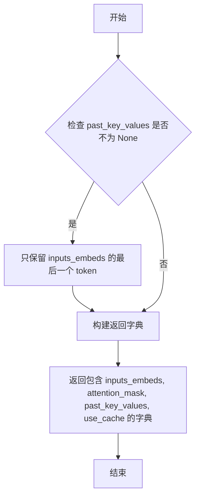

#### 带注释源码

```python
def prepare_inputs_for_generation(
    inputs_embeds,
    attention_mask=None,
    past_key_values=None,
    **kwargs,
):
    """
    准备语言模型的输入参数，用于自回归生成。
    
    参数:
        inputs_embeds: 输入的文本嵌入向量，形状为 (batch_size, sequence_length, hidden_size)
        attention_mask: 注意力掩码，形状为 (batch_size, sequence_length)
        past_key_values: 过去的键值对，用于kv cache加速解码
        **kwargs: 额外的关键字参数，如 use_cache
    
    返回:
        包含 inputs_embeds, attention_mask, past_key_values, use_cache 的字典
    """
    # 如果存在过去的键值对（kv cache），则只使用最后一个token
    # 这是因为自回归生成只需要最新的隐藏状态
    if past_key_values is not None:
        # only last token for inputs_embeds if past is defined in kwargs
        inputs_embeds = inputs_embeds[:, -1:]

    # 构建并返回模型输入字典
    return {
        "inputs_embeds": inputs_embeds,
        "attention_mask": attention_mask,
        "past_key_values": past_key_values,
        "use_cache": kwargs.get("use_cache"),
    }
```


### AudioLDM2Pipeline.__init__

该方法是 AudioLDM2Pipeline 类的构造函数，负责初始化文本到音频生成管道的所有核心组件，包括 VAE、文本编码器、语言模型、UNet 和声码器等，并通过 register_modules 方法将这些模块注册到管道中，同时计算 VAE 的缩放因子用于后续的潜在空间处理。

参数：

- `vae`：`AutoencoderKL`，变分自编码器模型，用于将音频编码到潜在空间并从潜在空间解码
- `text_encoder`：`ClapModel`，第一个冻结的文本编码器（CLAP 模型），用于将文本提示编码为文本嵌入
- `text_encoder_2`：`T5EncoderModel | VitsModel`，第二个冻结的文本编码器，用于 TTS（文本到语音）任务
- `projection_model`：`AudioLDM2ProjectionModel`，投影模型，用于线性投影两个文本编码器的隐藏状态并插入学习的 SOS/EOS 标记嵌入
- `language_model`：`GPT2LMHeadModel`，自回归语言模型，用于根据两个文本编码器的投影输出生成隐藏状态序列
- `tokenizer`：`RobertaTokenizer | RobertaTokenizerFast`，第一个文本编码器的分词器
- `tokenizer_2`：`T5Tokenizer | T5TokenizerFast | VitsTokenizer`，第二个文本编码器的分词器
- `feature_extractor`：`ClapFeatureExtractor`，特征提取器，用于将生成的音频波形预处理为对数梅尔频谱图进行自动评分
- `unet`：`AudioLDM2UNet2DConditionModel`，UNet2DConditionModel 模型，用于对编码的音频潜在表示进行去噪
- `scheduler`：`KarrasDiffusionSchedulers`，调度器，与 UNet 配合使用对编码的音频潜在表示进行去噪
- `vocoder`：`SpeechT5HifiGan`，声码器，用于将梅尔频谱图潜在表示转换为最终音频波形

返回值：`None`，构造函数不返回值

#### 流程图

```mermaid
flowchart TD
    A[__init__ 开始] --> B[调用 super().__init__]
    B --> C[调用 self.register_modules 注册所有模型组件]
    C --> D{检查 vae 是否存在}
    D -->|是| E[计算 vae_scale_factor: 2^(len(vae.config.block_out_channels)-1)]
    D -->|否| F[设置 vae_scale_factor = 8]
    E --> G[初始化完成]
    F --> G
    
    C -.-> C1[vae]
    C -.-> C2[text_encoder]
    C -.-> C3[text_encoder_2]
    C -.-> C4[projection_model]
    C -.-> C5[language_model]
    C -.-> C6[tokenizer]
    C -.-> C7[tokenizer_2]
    C -.-> C8[feature_extractor]
    C -.-> C9[unet]
    C -.-> C10[scheduler]
    C -.-> C11[vocoder]
```

#### 带注释源码

```python
def __init__(
    self,
    vae: AutoencoderKL,                                    # 变分自编码器模型
    text_encoder: ClapModel,                                # 第一个文本编码器 (CLAP)
    text_encoder_2: T5EncoderModel | VitsModel,             # 第二个文本编码器 (T5 或 Vits)
    projection_model: AudioLDM2ProjectionModel,            # 投影模型
    language_model: GPT2LMHeadModel,                        # 语言模型 (GPT2)
    tokenizer: RobertaTokenizer | RobertaTokenizerFast,      # 第一个分词器
    tokenizer_2: T5Tokenizer | T5TokenizerFast | VitsTokenizer,  # 第二个分词器
    feature_extractor: ClapFeatureExtractor,                # 特征提取器
    unet: AudioLDM2UNet2DConditionModel,                    # UNet 去噪模型
    scheduler: KarrasDiffusionSchedulers,                  # 扩散调度器
    vocoder: SpeechT5HifiGan,                               # 声码器
):
    # 调用父类 DiffusionPipeline 的初始化方法
    # 继承基础管道功能（设备管理、模型加载等）
    super().__init__()

    # 使用 register_modules 方法注册所有模型组件
    # 该方法来自 DiffusionPipeline 基类，会自动处理模块的设备和数据类型设置
    self.register_modules(
        vae=vae,
        text_encoder=text_encoder,
        text_encoder_2=text_encoder_2,
        projection_model=projection_model,
        language_model=language_model,
        tokenizer=tokenizer,
        tokenizer_2=tokenizer_2,
        feature_extractor=feature_extractor,
        unet=unet,
        scheduler=scheduler,
        vocoder=vocoder,
    )
    
    # 计算 VAE 缩放因子，用于确定潜在空间的维度
    # 计算公式: 2^(len(vae.config.block_out_channels) - 1)
    # 如果 vae 不存在，则使用默认值 8
    # 这是因为 VAE 使用多个上采样/下采样块，缩放因子反映了潜在空间与原始空间的比率
    self.vae_scale_factor = 2 ** (len(self.vae.config.block_out_channels) - 1) if getattr(self, "vae", None) else 8
```


### `AudioLDM2Pipeline.enable_vae_slicing`

启用VAE切片解码功能，通过将输入张量切分为多个切片分步计算解码，从而节省显存并支持更大的批次大小。

参数： 无

返回值：`None`，无返回值（该方法直接修改内部状态）

#### 流程图

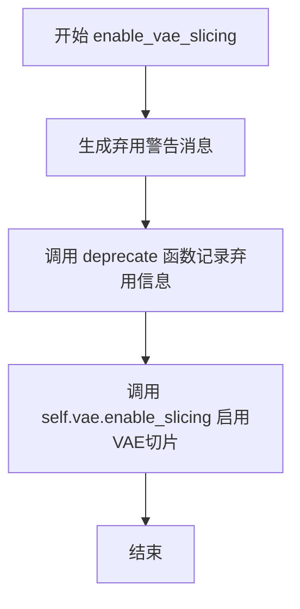

#### 带注释源码

```python
def enable_vae_slicing(self):
    r"""
    Enable sliced VAE decoding. When this option is enabled, the VAE will split the input tensor in slices to
    compute decoding in several steps. This is useful to save some memory and allow larger batch sizes.
    """
    # 生成弃用警告消息，提醒用户该方法将在未来版本中移除
    depr_message = f"Calling `enable_vae_slicing()` on a `{self.__class__.__name__}` is deprecated and this method will be removed in a future version. Please use `pipe.vae.enable_slicing()`."
    
    # 调用 deprecate 函数记录弃用信息，标记该方法将在 0.40.0 版本移除
    deprecate(
        "enable_vae_slicing",
        "0.40.0",
        depr_message,
    )
    
    # 委托给 VAE 模型的 enable_slicing 方法来启用切片解码功能
    # 这会修改 VAE 模型的内部状态，使其在解码时使用分片策略
    self.vae.enable_slicing()
```


### `AudioLDM2Pipeline.disable_vae_slicing`

禁用VAE切片解码功能。如果之前启用了`enable_vae_slicing`，调用此方法将恢复为单步解码。

参数： 无

返回值：`None`，无返回值

#### 流程图


#### 带注释源码

```
def disable_vae_slicing(self):
    r"""
    Disable sliced VAE decoding. If `enable_vae_slicing` was previously enabled, this method will go back to
    computing decoding in one step.
    """
    # 构建弃用警告消息，提示用户应使用 pipe.vae.disable_slicing()
    depr_message = f"Calling `disable_vae_slicing()` on a `{self.__class__.__name__}` is deprecated and this method will be removed in a future version. Please use `pipe.vae.disable_slicing()`."
    
    # 调用 deprecate 函数记录弃用信息，在未来版本中将移除此方法
    deprecate(
        "disable_vae_slicing",    # 被弃用的方法名
        "0.40.0",                  # 弃用的版本号
        depr_message,             # 弃用警告消息
    )
    
    # 调用 VAE 模型的 disable_slicing 方法，禁用切片解码功能
    # 这将恢复 VAE 为单步解码模式
    self.vae.disable_slicing()
```


### `AudioLDM2Pipeline.enable_model_cpu_offload`

该方法用于启用模型CPU卸载功能，通过 `accelerate` 库将所有模型组件从GPU卸载到CPU，以节省显存占用。与 `enable_sequential_cpu_offload` 相比，该方法在保持较好性能的同时，通过迭代执行方式逐个将模型移入GPU。

参数：

- `gpu_id`：`int | None`，指定GPU ID，默认为None
- `device`：`torch.device | str`，目标设备，默认为"cuda"

返回值：`None`，该方法无返回值

#### 流程图

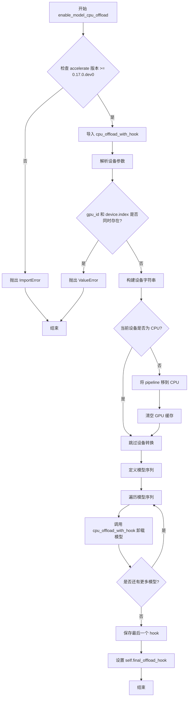

#### 带注释源码

```python
def enable_model_cpu_offload(self, gpu_id: int | None = None, device: torch.device | str = "cuda"):
    r"""
    Offloads all models to CPU using accelerate, reducing memory usage with a low impact on performance. Compared
    to `enable_sequential_cpu_offload`, this method moves one whole model at a time to the GPU when its `forward`
    method is called, and the model remains in GPU until the next model runs. Memory savings are lower than with
    `enable_sequential_cpu_offload`, but performance is much better due to the iterative execution of the `unet`.
    """
    # 检查 accelerate 库版本是否满足要求 (>= 0.17.0.dev0)
    if is_accelerate_available() and is_accelerate_version(">=", "0.17.0.dev0"):
        # 导入 CPU 卸载函数，支持 hook 机制
        from accelerate import cpu_offload_with_hook
    else:
        # 版本不满足时抛出 ImportError
        raise ImportError("`enable_model_cpu_offload` requires `accelerate v0.17.0` or higher.")

    # 将设备字符串转换为 torch.device 对象
    torch_device = torch.device(device)
    device_index = torch_device.index

    # 参数校验：gpu_id 和 device.index 不能同时指定
    if gpu_id is not None and device_index is not None:
        raise ValueError(
            f"You have passed both `gpu_id`={gpu_id} and an index as part of the passed device `device`={device}"
            f"Cannot pass both. Please make sure to either not define `gpu_id` or not pass the index as part of the device: `device`={torch_device.type}"
        )

    # 构建最终设备字符串
    device_type = torch_device.type
    device_str = device_type
    # 如果指定了 gpu_id 或 device 有索引，追加到设备字符串
    if gpu_id or torch_device.index:
        device_str = f"{device_str}:{gpu_id or torch_device.index}"
    device = torch.device(device_str)

    # 如果当前不在 CPU，先移至 CPU 并清空缓存
    if self.device.type != "cpu":
        self.to("cpu", silence_dtype_warnings=True)
        empty_device_cache(device.type)

    # 定义需要卸载的模型序列（按执行顺序排列）
    model_sequence = [
        self.text_encoder.text_model,        # 文本编码器文本模型
        self.text_encoder.text_projection,   # 文本编码器投影层
        self.text_encoder_2,                 # 第二个文本编码器 (T5 或 Vits)
        self.projection_model,              # 投影模型
        self.language_model,                 # 语言模型 (GPT2)
        self.unet,                           # UNet 去噪模型
        self.vae,                            # VAE 编解码器
        self.vocoder,                        # 声码器
        self.text_encoder,                   # 完整的文本编码器（最后卸载）
    ]

    # 迭代卸载模型，建立 hook 链
    hook = None
    for cpu_offloaded_model in model_sequence:
        # 为每个模型注册 CPU 卸载 hook，并保留上一个 hook 的引用
        _, hook = cpu_offload_with_hook(cpu_offloaded_model, device, prev_module_hook=hook)

    # 手动处理最后一个模型的卸载
    self.final_offload_hook = hook
```


### AudioLDM2Pipeline.generate_language_model

该方法是一个自回归语言模型生成函数，通过迭代方式基于文本嵌入向量生成指定数量的新token隐藏状态序列。在每一轮迭代中，使用语言模型预测下一个隐藏状态，并将其追加到输入序列中，直到生成达到指定的max_new_tokens数量为止。最终返回生成的隐藏状态序列。

参数：

- `self`：`AudioLDM2Pipeline`类实例，隐式传递
- `inputs_embeds`：`torch.Tensor`，形状为`(batch_size, sequence_length, hidden_size)`，用于生成的提示嵌入序列
- `max_new_tokens`：`int`，要生成的新token数量，默认为8
- `model_kwargs`：`dict[str, Any]`，可选，用于传递给模型forward函数的其他特定模型参数

返回值：`torch.Tensor`，形状为`(batch_size, sequence_length, hidden_size)`，生成的隐藏状态序列

#### 流程图

```mermaid
flowchart TD
    A[开始 generate_language_model] --> B{检查 transformers 版本}
    B -->|版本 < 4.52.1| C[设置 input_ids = inputs_embeds]
    B -->|版本 >= 4.52.1| D[设置 seq_length 和 device]
    C --> E[获取初始 cache position]
    D --> E
    E --> F{循环 for _ in range max_new_tokens}
    F -->|否| G[返回生成的隐藏状态]
    F -->|是| H[调用 prepare_inputs_for_generation]
    H --> I[语言模型前向传播]
    I --> J[获取下一隐藏状态 hidden_states[-1]]
    J --> K[拼接 inputs_embeds 和 next_hidden_states]
    K --> L[_update_model_kwargs_for_generation]
    L --> F
```

#### 带注释源码

```python
def generate_language_model(
    self,
    inputs_embeds: torch.Tensor = None,
    max_new_tokens: int = 8,
    **model_kwargs,
):
    """
    Generates a sequence of hidden-states from the language model, 
    conditioned on the embedding inputs.

    Parameters:
        inputs_embeds (`torch.Tensor` of shape `(batch_size, sequence_length, hidden_size)`):
            The sequence used as a prompt for the generation.
        max_new_tokens (`int`):
            Number of new tokens to generate.
        model_kwargs (`dict[str, Any]`, *optional*):
            Ad hoc parametrization of additional model-specific kwargs that will be 
            forwarded to the `forward` function of the model.

    Return:
        `inputs_embeds (`torch.Tensor` of shape `(batch_size, sequence_length, hidden_size)`):
            The sequence of generated hidden-states.
    """
    # 初始化缓存位置参数字典
    cache_position_kwargs = {}
    
    # 根据transformers版本选择不同的缓存处理方式
    # 老版本使用input_ids参数，新版本使用seq_length和device参数
    if is_transformers_version("<", "4.52.1"):
        cache_position_kwargs["input_ids"] = inputs_embeds
    else:
        # 设置序列长度和设备信息
        cache_position_kwargs["seq_length"] = inputs_embeds.shape[0]
        cache_position_kwargs["device"] = (
            self.language_model.device if getattr(self, "language_model", None) is not None else self.device
        )
    
    # 将模型参数添加到缓存位置参数中
    cache_position_kwargs["model_kwargs"] = model_kwargs
    
    # 如果未指定max_new_tokens，则从语言模型配置中获取默认值
    max_new_tokens = max_new_tokens if max_new_tokens is not None else self.language_model.config.max_new_tokens
    
    # 获取语言模型的初始缓存位置
    model_kwargs = self.language_model._get_initial_cache_position(**cache_position_kwargs)

    # 自回归生成循环：迭代生成max_new_tokens个新token
    for _ in range(max_new_tokens):
        # 准备模型输入：将嵌入向量和模型参数准备好
        model_inputs = prepare_inputs_for_generation(inputs_embeds, **model_kwargs)

        # 前向传播：调用语言模型获取输出
        # output_hidden_states=True确保返回所有隐藏状态
        # return_dict=True确保返回字典格式
        output = self.language_model(**model_inputs, output_hidden_states=True, return_dict=True)

        # 获取最后一层的隐藏状态作为下一步的输入
        # hidden_states[-1]是最后一层的输出
        next_hidden_states = output.hidden_states[-1]

        # 更新输入嵌入：将新生成的隐藏状态拼接到现有序列末尾
        # 沿着序列维度(dim=1)拼接
        inputs_embeds = torch.cat([inputs_embeds, next_hidden_states[:, -1:, :]], dim=1)

        # 更新模型参数：为下一次生成准备缓存和状态
        model_kwargs = self.language_model._update_model_kwargs_for_generation(output, model_kwargs)

    # 返回最后max_new_tokens个隐藏状态
    # 即返回新生成的token对应的隐藏状态序列
    return inputs_embeds[:, -max_new_tokens:, :]
```


### AudioLDM2Pipeline.encode_prompt

该方法负责将文本提示词编码为文本嵌入向量，是音频生成管道的关键预处理步骤。它通过两个文本编码器（CLAP和T5/Vits）提取特征，使用投影模型融合多源特征，并通过GPT2语言模型生成条件嵌入，同时支持分类器自由引导（CFG）的无条件嵌入计算。

参数：

- `prompt`：`str | list[str] | None`，需要编码的文本提示词，支持单字符串或字符串列表
- `transcription`：`str | list[str] | None`，用于文本转语音的转录文本
- `device`：`torch.device`，执行计算的PyTorch设备
- `num_waveforms_per_prompt`：`int`，每个提示词需要生成的波形数量，用于复制embeddings
- `do_classifier_free_guidance`：`bool`，是否启用分类器自由引导，决定是否生成负向embeddings
- `negative_prompt`：`str | list[str] | None`，不希望出现的负向提示词
- `prompt_embeds`：`torch.Tensor | None`，预计算的T5模型文本嵌入，可选输入
- `negative_prompt_embeds`：`torch.Tensor | None`，预计算的T5负向文本嵌入
- `generated_prompt_embeds`：`torch.Tensor | None`，GPT2语言模型预生成的正向文本嵌入
- `negative_generated_prompt_embeds`：`torch.Tensor | None`，GPT2语言模型预生成的负向文本嵌入
- `attention_mask`：`torch.LongTensor | None`，预计算的正向注意力掩码
- `negative_attention_mask`：`torch.LongTensor | None`，预计算的负向注意力掩码
- `max_new_tokens`：`int | None`，GPT2语言模型生成的新token数量

返回值：`tuple[torch.Tensor, torch.Tensor, torch.Tensor]`，包含三个元素的元组：
- `prompt_embeds`：T5编码器产生的文本嵌入，形状为 `(batch_size * num_waveforms_per_prompt, seq_len, hidden_size)`
- `attention_mask`：对应的注意力掩码，形状为 `(batch_size * num_waveforms_per_prompt, seq_len)`
- `generated_prompt_embeds`：GPT2语言模型生成的文本嵌入，用于条件生成

#### 流程图

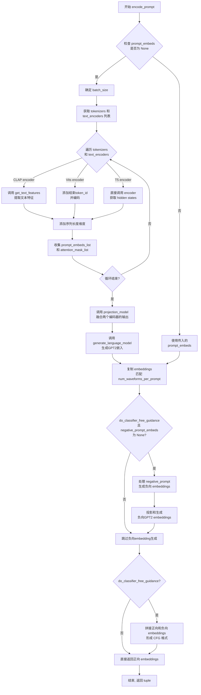

#### 带注释源码

```python
def encode_prompt(
    self,
    prompt,                       # str or list[str], 待编码的文本提示词
    device,                      # torch.device, 计算设备
    num_waveforms_per_prompt,    # int, 每个提示词生成的波形数量
    do_classifier_free_guidance, # bool, 是否启用分类器自由引导
    transcription=None,          # str or list[str], TTS转录文本
    negative_prompt=None,        # str or list[str], 负向提示词
    prompt_embeds: torch.Tensor | None = None,     # 预计算的T5嵌入
    negative_prompt_embeds: torch.Tensor | None = None, # 预计算的负向T5嵌入
    generated_prompt_embeds: torch.Tensor | None = None, # 预生成的GPT2嵌入
    negative_generated_prompt_embeds: torch.Tensor | None = None, # 预生成的负向GPT2嵌入
    attention_mask: torch.LongTensor | None = None,     # 注意力掩码
    negative_attention_mask: torch.LongTensor | None = None, # 负向注意力掩码
    max_new_tokens: int | None = None,  # GPT2生成的最大token数
):
    r"""
    Encodes the prompt into text encoder hidden states.
    """
    # 确定批次大小：支持字符串、字符串列表或预计算的embeddings
    if prompt is not None and isinstance(prompt, str):
        batch_size = 1
    elif prompt is not None and isinstance(prompt, list):
        batch_size = len(prompt)
    else:
        batch_size = prompt_embeds.shape[0]

    # 定义两个tokenizer和对应的text_encoder
    tokenizers = [self.tokenizer, self.tokenizer_2]
    # 检查text_encoder_2是否为VitsModel类型
    is_vits_text_encoder = isinstance(self.text_encoder_2, VitsModel)

    if is_vits_text_encoder:
        # Vits模型需要单独获取其内部的text_encoder
        text_encoders = [self.text_encoder, self.text_encoder_2.text_encoder]
    else:
        text_encoders = [self.text_encoder, self.text_encoder_2]

    # 如果没有预计算embeddings，则需要从头计算
    if prompt_embeds is None:
        prompt_embeds_list = []
        attention_mask_list = []

        # 遍历两个tokenizer和encoder进行编码
        for tokenizer, text_encoder in zip(tokenizers, text_encoders):
            # 判断使用哪种tokenizer（Roberta/T5用于常规文本，Vits用于TTS）
            use_prompt = isinstance(
                tokenizer, (RobertaTokenizer, RobertaTokenizerFast, T5Tokenizer, T5TokenizerFast)
            )
            
            # 对prompt或transcription进行tokenize
            text_inputs = tokenizer(
                prompt if use_prompt else transcription,  # TTS使用transcription
                padding="max_length"  # T5/ Roberta使用max_length padding
                if isinstance(tokenizer, (RobertaTokenizer, RobertaTokenizerFast, VitsTokenizer))
                else True,
                max_length=tokenizer.model_max_length,
                truncation=True,
                return_tensors="pt",
            )
            text_input_ids = text_inputs.input_ids
            attention_mask = text_inputs.attention_mask
            
            # 检查是否发生截断
            untruncated_ids = tokenizer(prompt, padding="longest", return_tensors="pt").input_ids
            if untruncated_ids.shape[-1] >= text_input_ids.shape[-1] and not torch.equal(
                text_input_ids, untruncated_ids
            ):
                removed_text = tokenizer.batch_decode(untruncated_ids[:, tokenizer.model_max_length - 1 : -1])
                logger.warning(
                    f"The following part of your input was truncated because {text_encoder.config.model_type} can "
                    f"only handle sequences up to {tokenizer.model_max_length} tokens: {removed_text}"
                )

            # 将数据移到指定设备
            text_input_ids = text_input_ids.to(device)
            attention_mask = attention_mask.to(device)

            # 根据不同encoder类型处理
            if text_encoder.config.model_type == "clap":
                # CLAP模型使用get_text_features获取文本特征
                prompt_embeds = text_encoder.get_text_features(
                    text_input_ids,
                    attention_mask=attention_mask,
                )
                # 添加序列长度维度: (bs, hidden_size) -> (bs, seq_len, hidden_size)
                prompt_embeds = prompt_embeds[:, None, :]
                # 确保attention_mask只关注单个hidden-state
                attention_mask = attention_mask.new_ones((batch_size, 1))
            elif is_vits_text_encoder:
                # Vits模型需要在末尾添加结束token_id
                for text_input_id, text_attention_mask in zip(text_input_ids, attention_mask):
                    for idx, phoneme_id in enumerate(text_input_id):
                        if phoneme_id == 0:  # padding token
                            text_input_id[idx] = 182  # 结束token id
                            text_attention_mask[idx] = 1
                            break
                prompt_embeds = text_encoder(
                    text_input_ids, attention_mask=attention_mask, padding_mask=attention_mask.unsqueeze(-1)
                )
                prompt_embeds = prompt_embeds[0]
            else:
                # T5/其他encoder直接获取hidden states
                prompt_embeds = text_encoder(
                    text_input_ids,
                    attention_mask=attention_mask,
                )
                prompt_embeds = prompt_embeds[0]

            prompt_embeds_list.append(prompt_embeds)
            attention_mask_list.append(attention_mask)

        # 使用投影模型融合两个encoder的输出
        projection_output = self.projection_model(
            hidden_states=prompt_embeds_list[0],      # CLAP/T5第一encoder输出
            hidden_states_1=prompt_embeds_list[1],     # 第二encoder输出
            attention_mask=attention_mask_list[0],
            attention_mask_1=attention_mask_list[1],
        )
        projected_prompt_embeds = projection_output.hidden_states
        projected_attention_mask = projection_output.attention_mask

        # 使用GPT2语言模型生成条件嵌入
        generated_prompt_embeds = self.generate_language_model(
            projected_prompt_embeds,
            attention_mask=projected_attention_mask,
            max_new_tokens=max_new_tokens,
        )

    # 转换embeddings到正确的dtype和device
    prompt_embeds = prompt_embeds.to(dtype=self.text_encoder_2.dtype, device=device)
    attention_mask = (
        attention_mask.to(device=device)
        if attention_mask is not None
        else torch.ones(prompt_embeds.shape[:2], dtype=torch.long, device=device)
    )
    generated_prompt_embeds = generated_prompt_embeds.to(dtype=self.language_model.dtype, device=device)

    # 复制embeddings以匹配num_waveforms_per_prompt
    bs_embed, seq_len, hidden_size = prompt_embeds.shape
    prompt_embeds = prompt_embeds.repeat(1, num_waveforms_per_prompt, 1)
    prompt_embeds = prompt_embeds.view(bs_embed * num_waveforms_per_prompt, seq_len, hidden_size)

    attention_mask = attention_mask.repeat(1, num_waveforms_per_prompt)
    attention_mask = attention_mask.view(bs_embed * num_waveforms_per_prompt, seq_len)

    # 对generated_prompt_embeds进行相同处理
    bs_embed, seq_len, hidden_size = generated_prompt_embeds.shape
    generated_prompt_embeds = generated_prompt_embeds.repeat(1, num_waveforms_per_prompt, 1)
    generated_prompt_embeds = generated_prompt_embeds.view(
        bs_embed * num_waveforms_per_prompt, seq_len, hidden_size
    )

    # 处理分类器自由引导的负向embeddings
    if do_classifier_free_guidance and negative_prompt_embeds is None:
        # 确定负向tokens
        uncond_tokens: list[str]
        if negative_prompt is None:
            uncond_tokens = [""] * batch_size  # 空字符串作为默认负向
        elif type(prompt) is not type(negative_prompt):
            raise TypeError(...)
        elif isinstance(negative_prompt, str):
            uncond_tokens = [negative_prompt]
        elif batch_size != len(negative_prompt):
            raise ValueError(...)
        else:
            uncond_tokens = negative_prompt

        # 类似于正向处理，生成负向embeddings
        negative_prompt_embeds_list = []
        negative_attention_mask_list = []
        max_length = prompt_embeds.shape[1]
        
        for tokenizer, text_encoder in zip(tokenizers, text_encoders):
            uncond_input = tokenizer(
                uncond_tokens,
                padding="max_length",
                max_length=tokenizer.model_max_length
                if isinstance(tokenizer, (RobertaTokenizer, RobertaTokenizerFast, VitsTokenizer))
                else max_length,
                truncation=True,
                return_tensors="pt",
            )

            uncond_input_ids = uncond_input.input_ids.to(device)
            negative_attention_mask = uncond_input.attention_mask.to(device)

            if text_encoder.config.model_type == "clap":
                negative_prompt_embeds = text_encoder.get_text_features(...)
                negative_prompt_embeds = negative_prompt_embeds[:, None, :]
                negative_attention_mask = negative_attention_mask.new_ones((batch_size, 1))
            elif is_vits_text_encoder:
                # Vits使用零填充
                negative_prompt_embeds = torch.zeros(
                    batch_size,
                    tokenizer.model_max_length,
                    text_encoder.config.hidden_size,
                ).to(dtype=self.text_encoder_2.dtype, device=device)
                negative_attention_mask = torch.zeros(batch_size, tokenizer.model_max_length).to(...)
            else:
                negative_prompt_embeds = text_encoder(uncond_input_ids, attention_mask=negative_attention_mask)
                negative_prompt_embeds = negative_prompt_embeds[0]

            negative_prompt_embeds_list.append(negative_prompt_embeds)
            negative_attention_mask_list.append(negative_attention_mask)

        # 投影负向embeddings
        projection_output = self.projection_model(
            hidden_states=negative_prompt_embeds_list[0],
            hidden_states_1=negative_prompt_embeds_list[1],
            attention_mask=negative_attention_mask_list[0],
            attention_mask_1=negative_attention_mask_list[1],
        )
        negative_projected_prompt_embeds = projection_output.hidden_states
        negative_projected_attention_mask = projection_output.attention_mask

        # 生成负向GPT2 embeddings
        negative_generated_prompt_embeds = self.generate_language_model(
            negative_projected_prompt_embeds,
            attention_mask=negative_projected_attention_mask,
            max_new_tokens=max_new_tokens,
        )

    # 如果启用CFG，拼接正向和负向embeddings
    if do_classifier_free_guidance:
        seq_len = negative_prompt_embeds.shape[1]

        negative_prompt_embeds = negative_prompt_embeds.to(dtype=self.text_encoder_2.dtype, device=device)
        negative_attention_mask = (
            negative_attention_mask.to(device=device)
            if negative_attention_mask is not None
            else torch.ones(negative_prompt_embeds.shape[:2], dtype=torch.long, device=device)
        )
        negative_generated_prompt_embeds = negative_generated_prompt_embeds.to(
            dtype=self.language_model.dtype, device=device
        )

        # 复制负向embeddings
        negative_prompt_embeds = negative_prompt_embeds.repeat(1, num_waveforms_per_prompt, 1)
        negative_prompt_embeds = negative_prompt_embeds.view(batch_size * num_waveforms_per_prompt, seq_len, -1)

        negative_attention_mask = negative_attention_mask.repeat(1, num_waveforms_per_prompt)
        negative_attention_mask = negative_attention_mask.view(batch_size * num_waveforms_per_prompt, seq_len)

        seq_len = negative_generated_prompt_embeds.shape[1]
        negative_generated_prompt_embeds = negative_generated_prompt_embeds.repeat(1, num_waveforms_per_prompt, 1)
        negative_generated_prompt_embeds = negative_generated_prompt_embeds.view(
            batch_size * num_waveforms_per_prompt, seq_len, -1
        )

        # 拼接：[负向embeddings, 正向embeddings]
        prompt_embeds = torch.cat([negative_prompt_embeds, prompt_embeds])
        attention_mask = torch.cat([negative_attention_mask, attention_mask])
        generated_prompt_embeds = torch.cat([negative_generated_prompt_embeds, generated_prompt_embeds])

    return prompt_embeds, attention_mask, generated_prompt_embeds
```


### `AudioLDM2Pipeline.mel_spectrogram_to_waveform`

将梅尔频谱图（Mel Spectrogram）转换为音频波形（Waveform）。该方法接收来自VAE解码器的梅尔频谱图表示，并通过声码器（Vocoder）将其转换为可听的音频波形。

参数：

- `mel_spectrogram`：`torch.Tensor`，输入的梅尔频谱图，通常来自VAE解码器的输出

返回值：`torch.Tensor`，转换后的音频波形数据

#### 流程图

```mermaid
flowchart TD
    A[输入: mel_spectrogram] --> B{检查维度}
    B -->|dim == 4| C[squeeze(1) 移除第1维]
    B -->|dim != 4| D[保持不变]
    C --> E[调用 vocoder 进行转换]
    D --> E
    E --> F[.cpu() 移到CPU]
    F --> G[.float() 转为float32]
    G --> H[返回 waveform]
```

#### 带注释源码

```python
def mel_spectrogram_to_waveform(self, mel_spectrogram):
    """
    将梅尔频谱图转换为音频波形
    
    参数:
        mel_spectrogram: 输入的梅尔频谱图张量
        
    返回:
        转换后的音频波形张量
    """
    # 检查是否为4维张量，如果是则移除第1维（batch维度）
    # 通常VAE解码输出的形状为 (batch, 1, freq, time)
    if mel_spectrogram.dim() == 4:
        mel_spectrogram = mel_spectrogram.squeeze(1)

    # 使用声码器(SpeechT5HifiGan)将梅尔频谱图转换为波形
    waveform = self.vocoder(mel_spectrogram)
    
    # 始终转换为float32，因为这样不会造成显著的性能开销
    # 且与bfloat16兼容
    waveform = waveform.cpu().float()
    
    return waveform
```


### `AudioLDM2Pipeline.score_waveforms`

该方法使用CLAP（Contrastive Language-Audio Pre-training）模型对生成的多个波形进行评分和排序。它首先将音频重新采样到特征提取器所需的采样率，然后提取音频特征，最后计算音频与文本提示之间的相似度得分，按得分降序排列并返回排序后的音频波形。

参数：

- `self`：`AudioLDM2Pipeline` 实例本身
- `text`：`str | list[str]`，用于评分的文本提示
- `audio`：`torch.Tensor`，生成的音频波形张量，形状为 `(batch_size, channels, samples)`
- `num_waveforms_per_prompt`：`int`，每个提示生成的波形数量，用于确定返回前多少个最高分的波形
- `device`：`torch.device`，计算设备
- `dtype`：`torch.dtype`，数据类型，用于特征张量的类型转换

返回值：`torch.Tensor`，排序后的音频波形张量，包含得分最高的 `num_waveforms_per_prompt` 个波形

#### 流程图

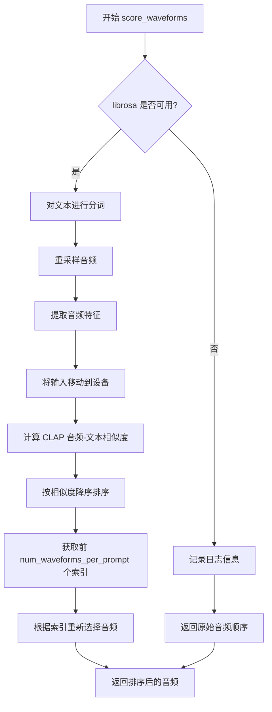

#### 带注释源码

```python
def score_waveforms(self, text, audio, num_waveforms_per_prompt, device, dtype):
    """
    使用 CLAP 模型对生成的波形进行评分排序
    
    参数:
        text: 文本提示，用于与音频进行相似度计算
        audio: 生成的音频波形
        num_waveforms_per_prompt: 要保留的波形数量
        device: 计算设备
        dtype: 数据类型
    """
    # 检查 librosa 是否可用，若不可用则返回原始顺序的音频
    if not is_librosa_available():
        logger.info(
            "Automatic scoring of the generated audio waveforms against the input prompt text requires the "
            "`librosa` package to resample the generated waveforms. Returning the audios in the order they were "
            "generated. To enable automatic scoring, install `librosa` with: `pip install librosa`."
        )
        return audio
    
    # 使用分词器对文本进行编码
    inputs = self.tokenizer(text, return_tensors="pt", padding=True)
    
    # 将音频从 vocoder 的采样率重采样到特征提取器的采样率
    resampled_audio = librosa.resample(
        audio.numpy(), 
        orig_sr=self.vocoder.config.sampling_rate, 
        target_sr=self.feature_extractor.sampling_rate
    )
    
    # 使用特征提取器将重采样后的音频转换为 log-mel 频谱图特征
    inputs["input_features"] = self.feature_extractor(
        list(resampled_audio), 
        return_tensors="pt", 
        sampling_rate=self.feature_extractor.sampling_rate
    ).input_features.type(dtype)
    
    # 将所有输入移动到指定设备
    inputs = inputs.to(device)

    # 使用 CLAP 模型计算音频-文本相似度得分
    # logits_per_text 的形状为 (batch_size, batch_size)，表示每个文本与每个音频的相似度
    logits_per_text = self.text_encoder(**inputs).logits_per_text
    
    # 对每个文本提示，按相似度降序排列对应的音频
    # 选取得分最高的 num_waveforms_per_prompt 个音频的索引
    indices = torch.argsort(logits_per_text, dim=1, descending=True)[:, :num_waveforms_per_prompt]
    
    # 根据排序后的索引重新选择音频波形
    # indices.reshape(-1) 将二维索引展平为一维，以供 torch.index_select 使用
    audio = torch.index_select(audio, 0, indices.reshape(-1).cpu())
    
    return audio
```


### `AudioLDM2Pipeline.prepare_extra_step_kwargs`

准备调度器（scheduler）的额外参数。由于不同的调度器具有不同的签名，该方法通过检查调度器的 `step` 函数是否支持特定参数来动态构建额外的参数字典。主要用于支持 DDIMScheduler 的 `eta` 参数和可选的 `generator` 参数。

参数：

- `generator`：`torch.Generator | list[torch.Generator] | None`，用于控制随机数生成，确保生成过程可重复
- `eta`：`float`，DDIM 调度器使用的 eta (η) 参数，对应 DDIM 论文中的参数，取值范围应为 [0, 1]；其他调度器会忽略此参数

返回值：`dict`，包含调度器 `step` 方法所需额外参数的字典，可能包含 `eta` 和/或 `generator` 键

#### 流程图

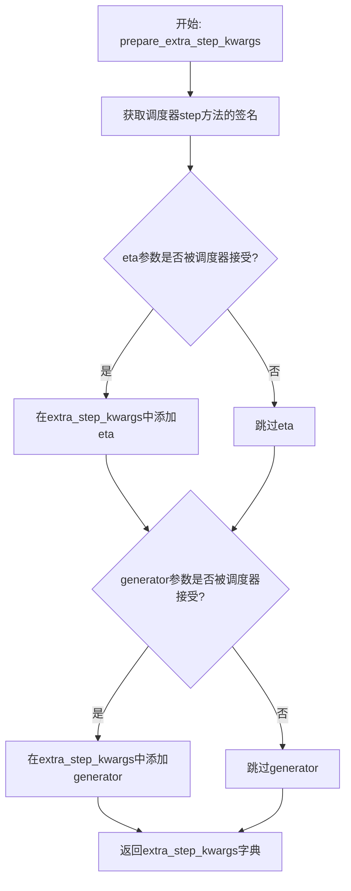

#### 带注释源码

```python
def prepare_extra_step_kwargs(self, generator, eta):
    # 准备调度器步骤的额外参数，因为并非所有调度器都具有相同的签名
    # eta (η) 仅与 DDIMScheduler 一起使用，其他调度器将忽略它
    # eta 对应 DDIM 论文 (https://huggingface.co/papers/2010.02502) 中的 η
    # 取值应在 [0, 1] 范围内

    # 通过检查调度器step方法的参数名来判断是否支持eta参数
    accepts_eta = "eta" in set(inspect.signature(self.scheduler.step).parameters.keys())
    # 初始化空字典用于存储额外参数
    extra_step_kwargs = {}
    # 如果调度器支持eta参数，则将其添加到extra_step_kwargs中
    if accepts_eta:
        extra_step_kwargs["eta"] = eta

    # 检查调度器是否接受generator参数
    accepts_generator = "generator" in set(inspect.signature(self.scheduler.step).parameters.keys())
    # 如果调度器支持generator参数，则将其添加到extra_step_kwargs中
    if accepts_generator:
        extra_step_kwargs["generator"] = generator
    
    # 返回包含所有额外参数的字典
    return extra_step_kwargs
```


### `AudioLDM2Pipeline.check_inputs`

该方法用于验证 `AudioLDM2Pipeline` 管道调用时传入的各项输入参数的有效性，确保音频长度、提示词、嵌入向量维度等参数符合模型要求，若不符合则抛出详细的 `ValueError` 异常。

参数：

- `self`：`AudioLDM2Pipeline`，Pipeline 实例本身
- `prompt`：`str | list[str] | None`，用于引导音频生成的文本提示
- `audio_length_in_s`：`float`，期望生成的音频时长（秒）
- `vocoder_upsample_factor`：`float`， vocoder 的上采样因子，由 `np.prod(self.vocoder.config.upsample_rates) / self.vocoder.config.sampling_rate` 计算得出
- `callback_steps`：`int`，回调函数被调用的频率步数
- `transcription`：`str | list[str] | None`，文本转录（用于 TTS 任务）
- `negative_prompt`：`str | list[str] | None`，负面提示词，用于引导不希望出现的内容
- `prompt_embeds`：`torch.Tensor | None`，预计算的文本嵌入（来自 T5 encoder）
- `negative_prompt_embeds`：`torch.Tensor | None`，预计算的负面文本嵌入
- `generated_prompt_embeds`：`torch.Tensor | None`，预计算的由 GPT2 语言模型生成的文本嵌入
- `negative_generated_prompt_embeds`：`torch.Tensor | None`，预计算的负面生成嵌入
- `attention_mask`：`torch.LongTensor | None`，预计算的注意力掩码，用于 `prompt_embeds`
- `negative_attention_mask`：`torch.LongTensor | None`，预计算的负面注意力掩码

返回值：`None`，该方法不返回任何值，仅通过抛出异常来指示错误

#### 流程图

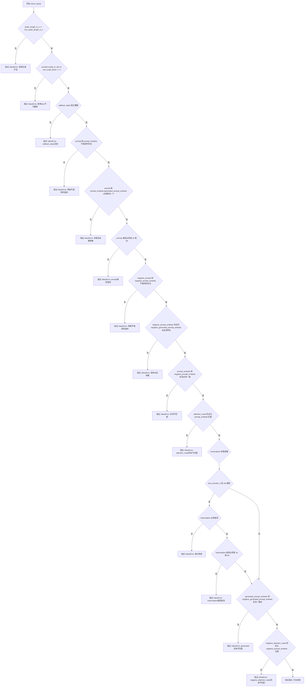

#### 带注释源码

```python
def check_inputs(
    self,
    prompt,                          # 文本提示词
    audio_length_in_s,               # 期望音频长度（秒）
    vocoder_upsample_factor,         # vocoder上采样因子
    callback_steps,                  # 回调步数
    transcription=None,             # 转录文本（用于TTS）
    negative_prompt=None,            # 负面提示词
    prompt_embeds=None,             # 预计算的prompt嵌入
    negative_prompt_embeds=None,    # 预计算的负面prompt嵌入
    generated_prompt_embeds=None,   # 预计算的GPT2生成的嵌入
    negative_generated_prompt_embeds=None,  # 预计算的负面生成嵌入
    attention_mask=None,             # prompt嵌入的注意力掩码
    negative_attention_mask=None,   # 负面prompt嵌入的注意力掩码
):
    # 验证音频长度必须大于等于最小有效长度
    # 最小长度由 vocoder 上采样因子和 VAE 缩放因子决定
    min_audio_length_in_s = vocoder_upsample_factor * self.vae_scale_factor
    if audio_length_in_s < min_audio_length_in_s:
        raise ValueError(
            f"`audio_length_in_s` has to be a positive value greater than or equal to {min_audio_length_in_s}, but "
            f"is {audio_length_in_s}."
        )

    # 验证 vocoder 的频率bins数量必须能被 VAE 缩放因子整除
    # 以确保能够正确进行上采样操作
    if self.vocoder.config.model_in_dim % self.vae_scale_factor != 0:
        raise ValueError(
            f"The number of frequency bins in the vocoder's log-mel spectrogram has to be divisible by the "
            f"VAE scale factor, but got {self.vocoder.config.model_in_dim} bins and a scale factor of "
            f"{self.vae_scale_factor}."
        )

    # 验证 callback_steps 必须是正整数
    if (callback_steps is None) or (
        callback_steps is not None and (not isinstance(callback_steps, int) or callback_steps <= 0)
    ):
        raise ValueError(
            f"`callback_steps` has to be a positive integer but is {callback_steps} of type"
            f" {type(callback_steps)}."
        )

    # 验证 prompt 和 prompt_embeds 不能同时提供
    if prompt is not None and prompt_embeds is not None:
        raise ValueError(
            f"Cannot forward both `prompt`: {prompt} and `prompt_embeds`: {prompt_embeds}. Please make sure to"
            " only forward one of the two."
        )
    # 验证必须提供 prompt 或 (prompt_embeds 和 generated_prompt_embeds) 之一
    elif prompt is None and (prompt_embeds is None or generated_prompt_embeds is None):
        raise ValueError(
            "Provide either `prompt`, or `prompt_embeds` and `generated_prompt_embeds`. Cannot leave "
            "`prompt` undefined without specifying both `prompt_embeds` and `generated_prompt_embeds`."
        )
    # 验证 prompt 类型必须是 str 或 list
    elif prompt is not None and (not isinstance(prompt, str) and not isinstance(prompt, list)):
        raise ValueError(f"`prompt` has to be of type `str` or `list` but is {type(prompt)}")

    # 验证 negative_prompt 和 negative_prompt_embeds 不能同时提供
    if negative_prompt is not None and negative_prompt_embeds is not None:
        raise ValueError(
            f"Cannot forward both `negative_prompt`: {negative_prompt} and `negative_prompt_embeds`:"
            f" {negative_prompt_embeds}. Please make sure to only forward one of the two."
        )
    # 验证如果提供了 negative_prompt_embeds，也必须提供 negative_generated_prompt_embeds
    elif negative_prompt_embeds is not None and negative_generated_prompt_embeds is None:
        raise ValueError(
            "Cannot forward `negative_prompt_embeds` without `negative_generated_prompt_embeds`. Ensure that"
            "both arguments are specified"
        )

    # 验证 prompt_embeds 和 negative_prompt_embeds 形状必须一致
    if prompt_embeds is not None and negative_prompt_embeds is not None:
        if prompt_embeds.shape != negative_prompt_embeds.shape:
            raise ValueError(
                "`prompt_embeds` and `negative_prompt_embeds` must have the same shape when passed directly, but"
                f" got: `prompt_embeds` {prompt_embeds.shape} != `negative_prompt_embeds`"
                f" {negative_prompt_embeds.shape}."
            )
        # 验证 attention_mask 与 prompt_embeds 的形状兼容
        if attention_mask is not None and attention_mask.shape != prompt_embeds.shape[:2]:
            raise ValueError(
                "`attention_mask should have the same batch size and sequence length as `prompt_embeds`, but got:"
                f"`attention_mask: {attention_mask.shape} != `prompt_embeds` {prompt_embeds.shape}"
            )

    # 当使用 VITS 模型作为 text_encoder_2 时，必须提供 transcription
    if transcription is None:
        if self.text_encoder_2.config.model_type == "vits":
            raise ValueError("Cannot forward without transcription. Please make sure to have transcription")
    # 验证 transcription 类型必须是 str 或 list
    elif transcription is not None and (
        not isinstance(transcription, str) and not isinstance(transcription, list)
    ):
        raise ValueError(f"`transcription` has to be of type `str` or `list` but is {type(transcription)}")

    # 验证生成的嵌入向量形状一致性
    if generated_prompt_embeds is not None and negative_generated_prompt_embeds is not None:
        if generated_prompt_embeds.shape != negative_generated_prompt_embeds.shape:
            raise ValueError(
                "`generated_prompt_embeds` and `negative_generated_prompt_embeds` must have the same shape when "
                f"passed directly, but got: `generated_prompt_embeds` {generated_prompt_embeds.shape} != "
                f"`negative_generated_prompt_embeds` {negative_generated_prompt_embeds.shape}."
            )
        # 验证 negative_attention_mask 与 negative_prompt_embeds 形状兼容
        if (
            negative_attention_mask is not None
            and negative_attention_mask.shape != negative_prompt_embeds.shape[:2]
        ):
            raise ValueError(
                "`attention_mask should have the same batch size and sequence length as `prompt_embeds`, but got:"
                f"`attention_mask: {negative_attention_mask.shape} != `prompt_embeds` {negative_prompt_embeds.shape}"
            )
```


### `AudioLDM2Pipeline.prepare_latents`

该方法用于为音频生成准备初始潜在变量（latents）。它根据批大小、通道数、高度等参数创建随机潜在张量，或者使用用户提供的潜在张量，并通过调度器的初始噪声标准差进行缩放。

参数：

- `self`：`AudioLDM2Pipeline` 实例，Pipeline 对象本身
- `batch_size`：`int`，批处理大小，即一次生成音频样本的数量
- `num_channels_latents`：`int`，潜在变量的通道数，通常对应 UNet 的输入通道数
- `height`：`int`，潜在变量的高度维度，由音频长度和 VAE 缩放因子计算得出
- `dtype`：`torch.dtype`，潜在变量的数据类型（如 float32、float16 等）
- `device`：`torch.device`，潜在变量存放的设备（如 cuda、cpu）
- `generator`：`torch.Generator` 或 `list[torch.Generator]`，可选的随机数生成器，用于确保生成的可重复性
- `latents`：`torch.Tensor | None`，可选的预生成潜在变量，如果为 None 则随机生成

返回值：`torch.Tensor`，准备好的潜在变量张量，形状为 (batch_size, num_channels_latents, height/vae_scale_factor, vocoder_dim/vae_scale_factor)

#### 流程图

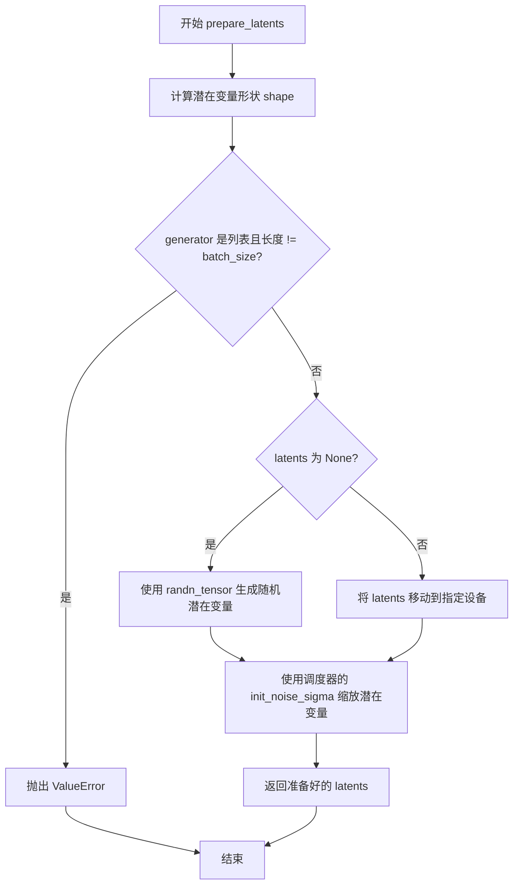

#### 带注释源码

```python
def prepare_latents(
    self,
    batch_size: int,
    num_channels_latents: int,
    height: int,
    dtype: torch.dtype,
    device: torch.device,
    generator: torch.Generator | list[torch.Generator],
    latents: torch.Tensor | None = None,
) -> torch.Tensor:
    """
    准备用于去噪过程的初始潜在变量。
    
    参数:
        batch_size: 批处理大小
        num_channels_latents: 潜在变量的通道数
        height: 潜在变量的高度
        dtype: 潜在变量的数据类型
        device: 潜在变量存放的设备
        generator: 随机数生成器
        latents: 可选的预生成潜在变量
    
    返回:
        准备好的潜在变量张量
    """
    # 计算潜在变量的形状，考虑 VAE 缩放因子
    # 形状: (batch_size, num_channels_latents, height/vae_scale_factor, vocoder_dim/vae_scale_factor)
    shape = (
        batch_size,
        num_channels_latents,
        int(height) // self.vae_scale_factor,
        int(self.vocoder.config.model_in_dim) // self.vae_scale_factor,
    )
    
    # 检查 generator 列表长度是否与批大小匹配
    if isinstance(generator, list) and len(generator) != batch_size:
        raise ValueError(
            f"You have passed a list of generators of length {len(generator)}, but requested an effective batch"
            f" size of {batch_size}. Make sure the batch size matches the length of the generators."
        )

    # 如果没有提供潜在变量，则随机生成
    if latents is None:
        # 使用 randn_tensor 生成标准正态分布的随机张量
        latents = randn_tensor(shape, generator=generator, device=device, dtype=dtype)
    else:
        # 将提供的潜在变量移动到指定设备
        latents = latents.to(device)

    # 使用调度器的初始噪声标准差缩放初始噪声
    # 这是扩散模型初始化的关键步骤，确保与调度器的噪声计划兼容
    latents = latents * self.scheduler.init_noise_sigma
    
    return latents
```


### `AudioLDM2Pipeline.__call__`

该方法是 AudioLDM2Pipeline 的核心生成方法，负责从文本提示（prompt）生成音频波形。方法内部完成了输入验证、提示词编码、潜在变量准备、去噪循环（U-Net 推理）、梅尔频谱图解码以及最终的声码器波形转换等完整流程。

参数：

- `prompt`：`str | list[str] | None`，用于引导音频生成的文本提示，如未定义需传递 `prompt_embeds`
- `transcription`：`str | list[str] | None`，文本转录，用于文本转语音任务
- `audio_length_in_s`：`float | None`，生成的音频样本长度（秒），默认 10.24 秒
- `num_inference_steps`：`int`，去噪步数，默认为 200，步数越多通常音频质量越高但推理越慢
- `guidance_scale`：`float`，引导比例，值越高生成的音频与文本越相关，默认为 3.5，当大于 1 时启用无分类器引导
- `negative_prompt`：`str | list[str] | None`，用于引导不包含内容的负面提示词
- `num_waveforms_per_prompt`：`int`，每个提示词生成的波形数量，默认为 1，若大于 1 则自动进行音频-文本相似度评分排序
- `eta`：`float`，DDIM 论文中的 eta 参数，仅 DDIM 调度器有效
- `generator`：`torch.Generator | list[torch.Generator] | None`，用于生成确定性结果的随机数生成器
- `latents`：`torch.Tensor | None`，预生成的噪声潜在变量，可用于相同生成的不同提示词
- `prompt_embeds`：`torch.Tensor | None`，预生成的文本嵌入，用于轻松调整文本输入
- `negative_prompt_embeds`：`torch.Tensor | None`，预生成的负面文本嵌入
- `generated_prompt_embeds`：`torch.Tensor | None`，预生成的 GPT2 语言模型文本嵌入
- `negative_generated_prompt_embeds`：`torch.Tensor | None`，预生成的负面 GPT2 文本嵌入
- `attention_mask`：`torch.LongTensor | None`，预计算的注意力掩码
- `negative_attention_mask`：`torch.LongTensor | None`，预计算的负面注意力掩码
- `max_new_tokens`：`int | None`，GPT2 语言模型生成的新 token 数量
- `return_dict`：`bool`，是否返回 AudioPipelineOutput，默认为 True
- `callback`：`Callable[[int, int, torch.Tensor], None] | None`，每 callback_steps 步调用的回调函数
- `callback_steps`：`int | None`，回调函数调用频率，默认为 1
- `cross_attention_kwargs`：`dict[str, Any] | None`，传递给 AttentionProcessor 的参数字典
- `output_type`：`str | None`，输出格式，"np" 返回 NumPy 数组，"pt" 返回 PyTorch 张量，"latent" 返回 LDM 输出

返回值：`AudioPipelineOutput | tuple`，当 return_dict 为 True 时返回 AudioPipelineOutput，否则返回包含生成音频的元组

#### 流程图

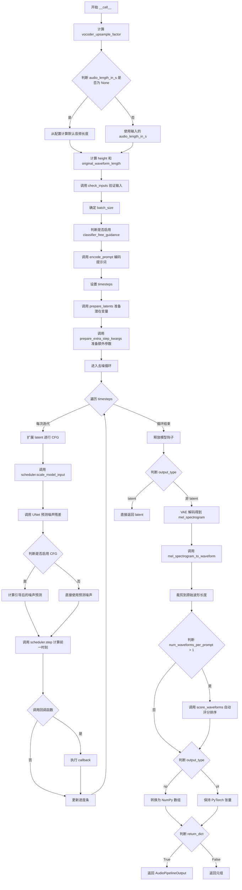

#### 带注释源码

```python
@torch.no_grad()
@replace_example_docstring(EXAMPLE_DOC_STRING)
def __call__(
    self,
    prompt: str | list[str] = None,                    # 文本提示词，引导音频生成
    transcription: str | list[str] = None,            # TTS 任务的转录文本
    audio_length_in_s: float | None = None,            # 音频长度（秒），默认从配置计算
    num_inference_steps: int = 200,                    # 去噪推理步数
    guidance_scale: float = 3.5,                      # 无分类器引导比例
    negative_prompt: str | list[str] | None = None,    # 负面提示词
    num_waveforms_per_prompt: int | None = 1,          # 每个提示词生成波形数
    eta: float = 0.0,                                  # DDIM eta 参数
    generator: torch.Generator | list[torch.Generator] | None = None,  # 随机数生成器
    latents: torch.Tensor | None = None,              # 预生成噪声潜在变量
    prompt_embeds: torch.Tensor | None = None,         # 预计算提示词嵌入
    negative_prompt_embeds: torch.Tensor | None = None,  # 预计算负面提示词嵌入
    generated_prompt_embeds: torch.Tensor | None = None,  # 预计算 GPT2 生成嵌入
    negative_generated_prompt_embeds: torch.Tensor | None = None,  # 预计算负面生成嵌入
    attention_mask: torch.LongTensor | None = None,    # 注意力掩码
    negative_attention_mask: torch.LongTensor | None = None,  # 负面注意力掩码
    max_new_tokens: int | None = None,                # GPT2 生成的最大新 token 数
    return_dict: bool = True,                          # 是否返回字典格式
    callback: Callable[[int, int, torch.Tensor], None] | None = None,  # 推理回调函数
    callback_steps: int | None = 1,                    # 回调调用频率
    cross_attention_kwargs: dict[str, Any] | None = None,  # 交叉注意力额外参数
    output_type: str | None = "np",                    # 输出格式：np/pt/latent
):
    # 0. 将音频长度从秒转换为频谱图高度
    # 计算 vocoder 上采样因子，用于确定最终音频长度与中间表示的比例
    vocoder_upsample_factor = np.prod(self.vocoder.config.upsample_rates) / self.vocoder.config.sampling_rate

    # 如果未指定音频长度，从模型配置计算默认长度
    if audio_length_in_s is None:
        audio_length_in_s = self.unet.config.sample_size * self.vae_scale_factor * vocoder_upsample_factor

    # 计算高度（频谱图帧数）和原始波形长度（采样点数）
    height = int(audio_length_in_s / vocoder_upsample_factor)
    original_waveform_length = int(audio_length_in_s * self.vocoder.config.sampling_rate)
    
    # 调整高度使其能被 VAE 尺度因子整除，保证模型能正确处理
    if height % self.vae_scale_factor != 0:
        height = int(np.ceil(height / self.vae_scale_factor)) * self.vae_scale_factor
        logger.info(
            f"Audio length in seconds {audio_length_in_s} is increased to {height * vocoder_upsample_factor} "
            f"so that it can be handled by the model. It will be cut to {audio_length_in_s} after the "
            f"denoising process."
        )

    # 1. 验证输入参数，检查参数合法性和一致性
    self.check_inputs(
        prompt,
        audio_length_in_s,
        vocoder_upsample_factor,
        callback_steps,
        transcription,
        negative_prompt,
        prompt_embeds,
        negative_prompt_embeds,
        generated_prompt_embeds,
        negative_generated_prompt_embeds,
        attention_mask,
        negative_attention_mask,
    )

    # 2. 确定批处理大小
    if prompt is not None and isinstance(prompt, str):
        batch_size = 1
    elif prompt is not None and isinstance(prompt, list):
        batch_size = len(prompt)
    else:
        batch_size = prompt_embeds.shape[0]

    # 获取执行设备
    device = self._execution_device
    
    # 确定是否启用无分类器引导（CFG），guidance_scale > 1 时启用
    do_classifier_free_guidance = guidance_scale > 1.0

    # 3. 编码输入提示词，得到文本嵌入、注意力掩码和生成的嵌入
    prompt_embeds, attention_mask, generated_prompt_embeds = self.encode_prompt(
        prompt,
        device,
        num_waveforms_per_prompt,
        do_classifier_free_guidance,
        transcription,
        negative_prompt,
        prompt_embeds=prompt_embeds,
        negative_prompt_embeds=negative_prompt_embeds,
        generated_prompt_embeds=generated_prompt_embeds,
        negative_generated_prompt_embeds=negative_generated_prompt_embeds,
        attention_mask=attention_mask,
        negative_attention_mask=negative_attention_mask,
        max_new_tokens=max_new_tokens,
    )

    # 4. 准备时间步
    self.scheduler.set_timesteps(num_inference_steps, device=device)
    timesteps = self.scheduler.timesteps

    # 5. 准备潜在变量
    num_channels_latents = self.unet.config.in_channels
    latents = self.prepare_latents(
        batch_size * num_waveforms_per_prompt,
        num_channels_latents,
        height,
        prompt_embeds.dtype,
        device,
        generator,
        latents,
    )

    # 6. 准备调度器额外参数（eta 和 generator）
    extra_step_kwargs = self.prepare_extra_step_kwargs(generator, eta)

    # 7. 去噪循环
    num_warmup_steps = len(timesteps) - num_inference_steps * self.scheduler.order
    with self.progress_bar(total=num_inference_steps) as progress_bar:
        for i, t in enumerate(timesteps):
            # 如果启用 CFG，扩展潜在变量（复制两份：一份无条件，一份有条件）
            latent_model_input = torch.cat([latents] * 2) if do_classifier_free_guidance else latents
            latent_model_input = self.scheduler.scale_model_input(latent_model_input, t)

            # 使用 UNet 预测噪声残差
            noise_pred = self.unet(
                latent_model_input,
                t,
                encoder_hidden_states=generated_prompt_embeds,
                encoder_hidden_states_1=prompt_embeds,
                encoder_attention_mask_1=attention_mask,
                return_dict=False,
            )[0]

            # 执行无分类器引导
            if do_classifier_free_guidance:
                noise_pred_uncond, noise_pred_text = noise_pred.chunk(2)
                noise_pred = noise_pred_uncond + guidance_scale * (noise_pred_text - noise_pred_uncond)

            # 计算前一时刻的去噪样本 x_t -> x_t-1
            latents = self.scheduler.step(noise_pred, t, latents, **extra_step_kwargs).prev_sample

            # 调用回调函数（如果在指定步数且提供了回调）
            if i == len(timesteps) - 1 or ((i + 1) > num_warmup_steps and (i + 1) % self.scheduler.order == 0):
                progress_bar.update()
                if callback is not None and i % callback_steps == 0:
                    step_idx = i // getattr(self.scheduler, "order", 1)
                    callback(step_idx, t, latents)

            # 如果使用 XLA，加速标记步骤
            if XLA_AVAILABLE:
                xm.mark_step()

    # 释放模型钩子
    self.maybe_free_model_hooks()

    # 8. 后处理
    if not output_type == "latent":
        # 使用 VAE 将潜在变量解码为梅尔频谱图
        latents = 1 / self.vae.config.scaling_factor * latents
        mel_spectrogram = self.vae.decode(latents).sample
    else:
        # 如果要求返回 latent，直接返回
        return AudioPipelineOutput(audios=latents)

    # 使用声码器将梅尔频谱图转换为波形
    audio = self.mel_spectrogram_to_waveform(mel_spectrogram)

    # 裁剪到原始波形长度（去除填充部分）
    audio = audio[:, :original_waveform_length]

    # 9. 自动评分（如果生成了多个波形）
    if num_waveforms_per_prompt > 1 and prompt is not None:
        audio = self.score_waveforms(
            text=prompt,
            audio=audio,
            num_waveforms_per_prompt=num_waveforms_per_prompt,
            device=device,
            dtype=prompt_embeds.dtype,
        )

    # 根据输出类型转换格式
    if output_type == "np":
        audio = audio.numpy()

    # 返回结果
    if not return_dict:
        return (audio,)

    return AudioPipelineOutput(audios=audio)
```


### AudioLDM2Pipeline.__init__

这是AudioLDM2Pipeline类的初始化方法，负责接收并注册所有模型组件（VAE、文本编码器、UNet、声码器等），并计算VAE的缩放因子以用于后续的潜空间处理。

参数：

- `vae`：`AutoencoderKL`，变分自编码器模型，用于编码和解码音频潜空间表示
- `text_encoder`：`ClapModel`，第一个冻结的文本编码器（CLAP模型），用于将文本提示编码为提示嵌入
- `text_encoder_2`：`T5EncoderModel | VitsModel`，第二个冻结的文本编码器（T5或Vits模型），用于TTS任务
- `projection_model`：`AudioLDM2ProjectionModel`，训练好的投影模型，用于线性投影两个文本编码器的隐藏状态
- `language_model`：`GPT2LMHeadModel`，自回归语言模型，用于根据投影的文本编码器输出生成隐藏状态序列
- `tokenizer`：`RobertaTokenizer | RobertaTokenizerFast`，第一个文本编码器的分词器
- `tokenizer_2`：`T5Tokenizer | T5TokenizerFast | VitsTokenizer`，第二个文本编码器的分词器
- `feature_extractor`：`ClapFeatureExtractor`，特征提取器，用于将生成的音频波形预处理为对数梅尔频谱图
- `unet`：`AudioLDM2UNet2DConditionModel`，UNet2DConditionModel，用于去噪编码的音频潜空间
- `scheduler`：`KarrasDiffusionSchedulers`，调度器，与UNet一起用于去噪编码的音频潜空间
- `vocoder`：`SpeechT5HifiGan`，声码器，将梅尔频谱图潜空间转换为最终音频波形

返回值：`None`，构造函数无返回值，仅初始化实例属性

#### 流程图

```mermaid
flowchart TD
    A[开始 __init__] --> B[调用 super().__init__]
    B --> C[register_modules 注册所有模型组件]
    C --> D{检查 vae 属性是否存在}
    D -->|是| E[计算 vae_scale_factor: 2^(len(vae.config.block_out_channels)-1)]
    D -->|否| F[设置 vae_scale_factor = 8]
    E --> G[结束 __init__]
    F --> G
```

#### 带注释源码

```python
def __init__(
    self,
    vae: AutoencoderKL,  # 变分自编码器，用于音频潜空间编解码
    text_encoder: ClapModel,  # 第一个文本编码器（CLAP模型）
    text_encoder_2: T5EncoderModel | VitsModel,  # 第二个文本编码器（T5或Vits）
    projection_model: AudioLDM2ProjectionModel,  # 投影模型，融合两个文本编码器的输出
    language_model: GPT2LMHeadModel,  # GPT2语言模型，用于生成序列化的文本表示
    tokenizer: RobertaTokenizer | RobertaTokenizerFast,  # 第一个文本编码器的分词器
    tokenizer_2: T5Tokenizer | T5TokenizerFast | VitsTokenizer,  # 第二个文本编码器的分词器
    feature_extractor: ClapFeatureExtractor,  # 音频特征提取器，用于自动评分
    unet: AudioLDM2UNet2DConditionModel,  # UNet去噪模型
    scheduler: KarrasDiffusionSchedulers,  # 扩散调度器
    vocoder: SpeechT5HifiGan,  # 声码器，将梅尔频谱图转为波形
):
    # 调用父类 DiffusionPipeline 的初始化方法
    super().__init__()

    # 将所有模型组件注册到 Pipeline 中，便于统一管理和保存/加载
    self.register_modules(
        vae=vae,
        text_encoder=text_encoder,
        text_encoder_2=text_encoder_2,
        projection_model=projection_model,
        language_model=language_model,
        tokenizer=tokenizer,
        tokenizer_2=tokenizer_2,
        feature_extractor=feature_extractor,
        unet=unet,
        scheduler=scheduler,
        vocoder=vocoder,
    )
    
    # 计算 VAE 缩放因子，用于确定潜空间的尺寸
    # 计算公式：2^(len(block_out_channels) - 1)
    # 如果 VAE 存在则计算，否则默认值为 8
    self.vae_scale_factor = 2 ** (len(self.vae.config.block_out_channels) - 1) if getattr(self, "vae", None) else 8
```


### `AudioLDM2Pipeline.enable_vae_slicing`

启用VAE切片解码功能。当启用此选项时，VAE会将输入张量切片分块进行解码计算，以节省显存并支持更大的批量大小。该方法已被弃用，实际操作委托给`self.vae.enable_slicing()`。

参数： 无（仅含隐式参数`self`）

返回值：`None`，无返回值

#### 流程图

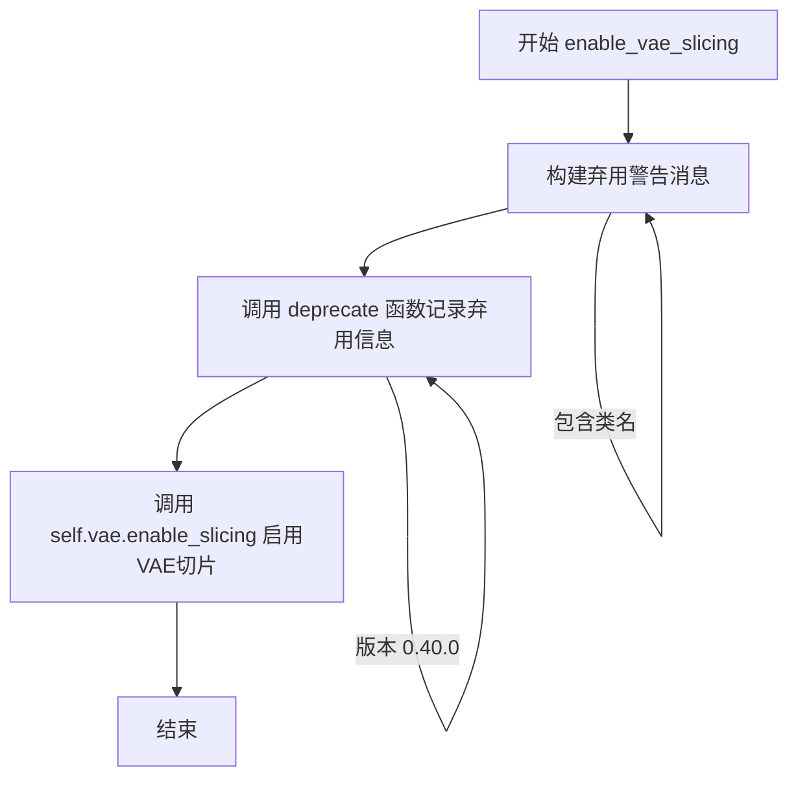

#### 带注释源码

```python
def enable_vae_slicing(self):
    r"""
    Enable sliced VAE decoding. When this option is enabled, the VAE will split the input tensor in slices to
    compute decoding in several steps. This is useful to save some memory and allow larger batch sizes.
    """
    # 构建弃用警告消息，包含当前类的名称
    depr_message = f"Calling `enable_vae_slicing()` on a `{self.__class__.__name__}` is deprecated and this method will be removed in a future version. Please use `pipe.vae.enable_slicing()`."
    
    # 调用 deprecate 函数记录弃用信息，指定在 0.40.0 版本移除
    deprecate(
        "enable_vae_slicing",    # 被弃用的功能名称
        "0.40.0",                # 计划移除的版本号
        depr_message,            # 弃用说明消息
    )
    
    # 委托给 VAE 模型的 enable_slicing 方法执行实际的切片启用逻辑
    self.vae.enable_slicing()
```

---

**补充说明：**

- **设计目标**：提供向后兼容的VAE切片解码启用接口，同时引导用户迁移到更直接的`pipe.vae.enable_slicing()`调用方式。
- **弃用策略**：通过`deprecate`函数记录弃用信息，在未来版本中完全移除此方法。
- **技术债务**：该方法仅为代理调用，保留它增加了维护成本，建议用户直接使用底层VAE方法。


### `AudioLDM2Pipeline.disable_vae_slicing`

该方法用于禁用 VAE（变分自编码器）切片解码功能。如果之前通过 `enable_vae_slicing` 启用了切片解码，调用此方法后将恢复为单步计算解码。该方法已被弃用，建议直接使用 `pipe.vae.disable_slicing()`。

参数：

- 无参数（仅包含 `self`）

返回值：`None`，无返回值

#### 流程图

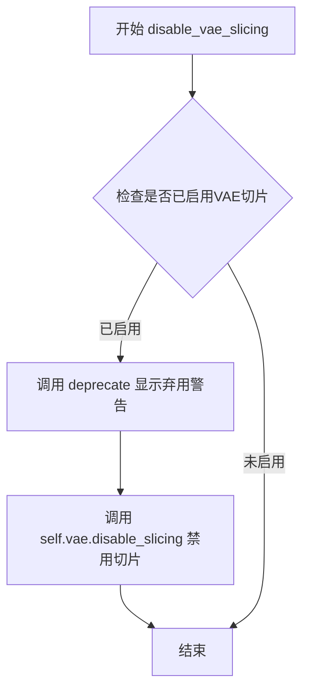

#### 带注释源码

```python
# Copied from diffusers.pipelines.pipeline_utils.StableDiffusionMixin.disable_vae_slicing
def disable_vae_slicing(self):
    r"""
    Disable sliced VAE decoding. If `enable_vae_slicing` was previously enabled, this method will go back to
    computing decoding in one step.
    """
    # 构建弃用警告消息，提示用户该方法将在未来版本中移除
    # 并建议使用新的 API: pipe.vae.disable_slicing()
    depr_message = f"Calling `disable_vae_slicing()` on a `{self.__class__.__name__}` is deprecated and this method will be removed in a future version. Please use `pipe.vae.disable_slicing()`."
    
    # 调用 deprecate 函数记录弃用信息
    # 参数: 方法名, 弃用版本号, 弃用消息
    deprecate(
        "disable_vae_slicing",
        "0.40.0",
        depr_message,
    )
    
    # 调用 VAE 模型的 disable_slicing 方法
    # 禁用切片解码，恢复为单步解码模式
    self.vae.disable_slicing()
```


### AudioLDM2Pipeline.enable_model_cpu_offload

该方法实现了模型CPU卸载功能，通过accelerate库将所有模型组件（文本编码器、投影模型、语言模型、UNet、VAE、 vocoder等）按顺序转移到CPU，以降低显存占用。在实际推理时，只有当前需要执行的模型会被加载到GPU，其余模型保留在CPU内存中，从而在保持较好性能的前提下实现内存优化。

参数：

- `gpu_id`：`int | None`，指定GPU设备ID，默认为None
- `device`：`torch.device | str`，目标设备，默认为"cuda"

返回值：`None`，该方法直接修改Pipeline的内部状态，不返回任何值

#### 流程图

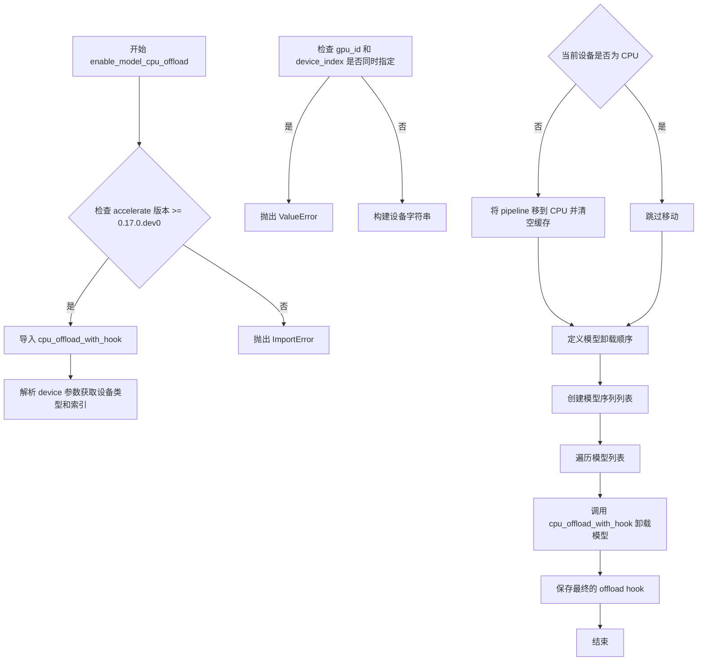

#### 带注释源码

```python
def enable_model_cpu_offload(self, gpu_id: int | None = None, device: torch.device | str = "cuda"):
    r"""
    Offloads all models to CPU using accelerate, reducing memory usage with a low impact on performance. Compared
    to `enable_sequential_cpu_offload`, this method moves one whole model at a time to the GPU when its `forward`
    method is called, and the model remains in GPU until the next model runs. Memory savings are lower than with
    `enable_sequential_cpu_offload`, but performance is much better due to the iterative execution of the `unet`.
    """
    # 检查 accelerate 库版本是否满足最低要求
    if is_accelerate_available() and is_accelerate_version(">=", "0.17.0.dev0"):
        # 动态导入 accelerate 的 CPU offload 功能
        from accelerate import cpu_offload_with_hook
    else:
        raise ImportError("`enable_model_cpu_offload` requires `accelerate v0.17.0` or higher.")

    # 将设备字符串转换为 torch.device 对象
    torch_device = torch.device(device)
    # 获取设备索引
    device_index = torch_device.index

    # 参数校验：不能同时指定 gpu_id 和 device_index
    if gpu_id is not None and device_index is not None:
        raise ValueError(
            f"You have passed both `gpu_id`={gpu_id} and an index as part of the passed device `device`={device}"
            f"Cannot pass both. Please make sure to either not define `gpu_id` or not pass the index as part of the device: `device`={torch_device.type}"
        )

    # 构建最终的目标设备字符串
    device_type = torch_device.type
    device_str = device_type
    if gpu_id or torch_device.index:
        device_str = f"{device_str}:{gpu_id or torch_device.index}"
    device = torch.device(device_str)

    # 如果当前不在 CPU 设备，则将整个 pipeline 移到 CPU 并清空 GPU 缓存
    if self.device.type != "cpu":
        self.to("cpu", silence_dtype_warnings=True)
        empty_device_cache(device.type)

    # 定义模型卸载顺序：按推理调用顺序排列
    model_sequence = [
        self.text_encoder.text_model,           # 文本编码器的 text_model 部分
        self.text_encoder.text_projection,      # 文本投影层
        self.text_encoder_2,                      # 第二个文本编码器 (T5 或 Vits)
        self.projection_model,                   # 投影模型
        self.language_model,                     # 语言模型 (GPT2)
        self.unet,                               # UNet 去噪模型
        self.vae,                                # VAE 编码器/解码器
        self.vocoder,                            # 声码器
        self.text_encoder,                       # 完整的文本编码器（最后卸载）
    ]

    # 初始化 hook 为 None
    hook = None
    # 遍历模型序列，逐个卸载到 CPU 并设置 hook
    for cpu_offloaded_model in model_sequence:
        # 使用 accelerate 的 cpu_offload_with_hook 函数
        # 返回值为 (result, hook)，hook 用于链接下一个模型的卸载
        _, hook = cpu_offload_with_hook(cpu_offloaded_model, device, prev_module_hook=hook)

    # 保存最终的 offload hook，用于后续手动控制
    self.final_offload_hook = hook
```


### AudioLDM2Pipeline.generate_language_model

使用自回归方式生成语言模型的隐藏状态序列，基于投影后的文本嵌入输入，通过迭代生成新的 token。

参数：

- `inputs_embeds`：`torch.Tensor`，形状为 `(batch_size, sequence_length, hidden_size)`，作为生成条件的嵌入向量
- `max_new_tokens`：`int`，要生成的新 token 数量
- `**model_kwargs`：`dict[str, Any]`，可选，用于传递给模型前向传播的额外参数

返回值：`torch.Tensor`，生成的隐藏状态序列，形状为 `(batch_size, max_new_tokens, hidden_size)`

#### 流程图

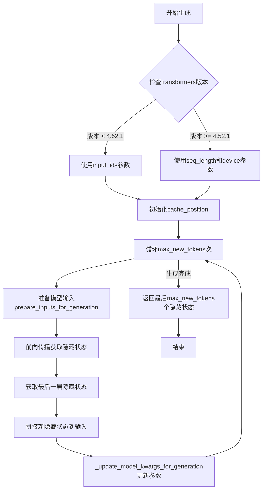

#### 带注释源码

```python
def generate_language_model(
    self,
    inputs_embeds: torch.Tensor = None,
    max_new_tokens: int = 8,
    **model_kwargs,
):
    """
    从语言模型生成隐藏状态序列，基于嵌入输入。

    Parameters:
        inputs_embeds (`torch.Tensor` of shape `(batch_size, sequence_length, hidden_size)`):
            用作生成提示的序列。
        max_new_tokens (`int`):
            要生成的新token数量。
        model_kwargs (`dict[str, Any]`, *optional*):
            额外的模型特定kwargs，将转发到模型的`forward`函数。

    Return:
        `inputs_embeds (`torch.Tensor` of shape `(batch_size, sequence_length, hidden_size)`):
            生成的隐藏状态序列。
    """
    # 初始化缓存位置参数字典，用于处理不同transformers版本的兼容性问题
    cache_position_kwargs = {}
    if is_transformers_version("<", "4.52.1"):
        # 旧版本使用input_ids参数
        cache_position_kwargs["input_ids"] = inputs_embeds
    else:
        # 新版本使用seq_length和device参数
        cache_position_kwargs["seq_length"] = inputs_embeds.shape[0]
        cache_position_kwargs["device"] = (
            self.language_model.device if getattr(self, "language_model", None) is not None else self.device
        )
    cache_position_kwargs["model_kwargs"] = model_kwargs
    
    # 如果未指定max_new_tokens，则从模型配置中获取默认值
    max_new_tokens = max_new_tokens if max_new_tokens is not None else self.language_model.config.max_new_tokens
    # 初始化缓存位置
    model_kwargs = self.language_model._get_initial_cache_position(**cache_position_kwargs)

    # 自回归生成循环：迭代生成max_new_tokens个新token
    for _ in range(max_new_tokens):
        # 准备模型输入
        model_inputs = prepare_inputs_for_generation(inputs_embeds, **model_kwargs)

        # 前向传播获取下一个隐藏状态
        output = self.language_model(**model_inputs, output_hidden_states=True, return_dict=True)

        # 获取最后一层的隐藏状态
        next_hidden_states = output.hidden_states[-1]

        # 将新生成的隐藏状态拼接到输入嵌入后面
        inputs_embeds = torch.cat([inputs_embeds, next_hidden_states[:, -1:, :]], dim=1)

        # 更新生成所需的模型参数（缓存位置等）
        model_kwargs = self.language_model._update_model_kwargs_for_generation(output, model_kwargs)

    # 返回最后生成的max_new_tokens个隐藏状态
    return inputs_embeds[:, -max_new_tokens:, :]
```


### AudioLDM2Pipeline.encode_prompt

该方法负责将文本提示词（prompt）和转录文本（transcription）编码为文本嵌入向量（text embeddings），供后续的音频生成流程使用。它整合了两个文本编码器（CLAP/T5 和 VITS/T5）的输出，通过投影模型（projection_model）进行特征融合，并利用语言模型（GPT2）生成增强的文本表示，同时支持无分类器自由引导（classifier-free guidance）以提升生成质量。

参数：

- `prompt`：`str | list[str] | None`，要编码的文本提示词
- `device`：`torch.device`，执行计算的 PyTorch 设备
- `num_waveforms_per_prompt`：`int`，每个提示词需要生成的波形数量，用于复制嵌入向量
- `do_classifier_free_guidance`：`bool`，是否启用无分类器自由引导
- `transcription`：`str | list[str] | None`，文本转录内容，用于 TTS（文本转语音）任务
- `negative_prompt`：`str | list[str] | None`，负面提示词，用于引导生成时排除的内容
- `prompt_embeds`：`torch.Tensor | None`，预计算的 T5/FLAN-T5 文本嵌入，可直接传入以避免重复计算
- `negative_prompt_embeds`：`torch.Tensor | None`，预计算的负面文本嵌入
- `generated_prompt_embeds`：`torch.Tensor | None`，预生成的 GPT2 语言模型嵌入
- `negative_generated_prompt_embeds`：`torch.Tensor | None`，预生成的负面 GPT2 嵌入
- `attention_mask`：`torch.LongTensor | None`，预计算的关注掩码
- `negative_attention_mask`：`torch.LongTensor | None`，预计算的负面关注掩码
- `max_new_tokens`：`int | None`，GPT2 语言模型生成的最大新 token 数量

返回值：`tuple[torch.Tensor, torch.Tensor, torch.Tensor]`，包含三个元素的元组：
- `prompt_embeds`：T5 模型的文本嵌入向量，形状为 `(batch_size * num_waveforms_per_prompt, seq_len, hidden_size)`
- `attention_mask`：注意力掩码，形状为 `(batch_size * num_waveforms_per_prompt, seq_len)`
- `generated_prompt_embeds`：GPT2 语言模型生成的文本嵌入，形状为 `(batch_size * num_waveforms_per_prompt, seq_len, hidden_size)`

#### 流程图

```mermaid
flowchart TD
    A[开始 encode_prompt] --> B{检查 prompt 类型}
    B -->|str| C[batch_size = 1]
    B -->|list| D[batch_size = len(prompt)]
    B -->|None| E[batch_size = prompt_embeds.shape[0]]
    
    C --> F[定义 tokenizers 和 text_encoders]
    D --> F
    E --> F
    
    F --> G{prompt_embeds 为空?}
    G -->|是| H[遍历两个 tokenizers 和 text_encoders]
    G -->|否| P[跳过嵌入计算]
    
    H --> I[调用 tokenizer 编码文本]
    I --> J{text_encoder 类型?}
    J -->|clap| K[使用 get_text_features]
    J -->|vits| L[添加结束 token 并编码]
    J -->|其他| M[标准编码]
    
    K --> N[追加序列维度]
    L --> O[返回嵌入]
    M --> O
    
    N --> O
    O --> Q[保存 prompt_embeds 和 attention_mask]
    Q --> H
    
    H --> R[调用 projection_model 投影]
    R --> S[调用 generate_language_model 生成嵌入]
    
    P --> T[准备 prompt_embeds]
    S --> T
    T --> U{do_classifier_free_guidance 为真<br>且 negative_prompt_embeds 为空?}
    
    U -->|是| V[构建 uncond_tokens]
    V --> W[遍历 tokenizers 和 text_encoders 编码]
    W --> X[调用 projection_model]
    X --> Y[调用 generate_language_model]
    
    U -->|否| Z[不生成无条件嵌入]
    Y --> AA[复制 embeddings 到 num_waveforms_per_prompt]
    Z --> AA
    
    AA --> BB{do_classifier_free_guidance?}
    BB -->|是| CC[拼接无条件嵌入与条件嵌入]
    BB -->|否| DD[直接返回]
    
    CC --> DD
    DD --> EE[返回 prompt_embeds, attention_mask, generated_prompt_embeds]
```

#### 带注释源码

```python
def encode_prompt(
    self,
    prompt,
    device,
    num_waveforms_per_prompt,
    do_classifier_free_guidance,
    transcription=None,
    negative_prompt=None,
    prompt_embeds: torch.Tensor | None = None,
    negative_prompt_embeds: torch.Tensor | None = None,
    generated_prompt_embeds: torch.Tensor | None = None,
    negative_generated_prompt_embeds: torch.Tensor | None = None,
    attention_mask: torch.LongTensor | None = None,
    negative_attention_mask: torch.LongTensor | None = None,
    max_new_tokens: int | None = None,
):
    # 确定批处理大小
    # 根据 prompt 的类型（字符串、列表或None）来确定 batch_size
    if prompt is not None and isinstance(prompt, str):
        batch_size = 1
    elif prompt is not None and isinstance(prompt, list):
        batch_size = len(prompt)
    else:
        batch_size = prompt_embeds.shape[0]

    # 定义分词器和文本编码器列表
    # tokenizers: [self.tokenizer, self.tokenizer_2] - 分别用于第一个和第二个文本编码器
    # text_encoders: 根据 text_encoder_2 的类型决定，包含 CLAP/T5 和 VITS/T5 编码器
    tokenizers = [self.tokenizer, self.tokenizer_2]
    is_vits_text_encoder = isinstance(self.text_encoder_2, VitsModel)

    if is_vits_text_encoder:
        text_encoders = [self.text_encoder, self.text_encoder_2.text_encoder]
    else:
        text_encoders = [self.text_encoder, self.text_encoder_2]

    # 如果未提供 prompt_embeds，则需要从头计算
    if prompt_embeds is None:
        prompt_embeds_list = []
        attention_mask_list = []

        # 遍历两个文本编码器（CLAP/T5 和 T5/VITS）
        for tokenizer, text_encoder in zip(tokenizers, text_encoders):
            # 判断使用哪个文本输入：prompt 还是 transcription
            use_prompt = isinstance(
                tokenizer, (RobertaTokenizer, RobertaTokenizerFast, T5Tokenizer, T5TokenizerFast)
            )
            # 调用分词器将文本转换为 token ID
            text_inputs = tokenizer(
                prompt if use_prompt else transcription,
                padding="max_length"
                if isinstance(tokenizer, (RobertaTokenizer, RobertaTokenizerFast, VitsTokenizer))
                else True,
                max_length=tokenizer.model_max_length,
                truncation=True,
                return_tensors="pt",
            )
            text_input_ids = text_inputs.input_ids
            attention_mask = text_inputs.attention_mask
            
            # 检查是否发生了截断，警告用户
            untruncated_ids = tokenizer(prompt, padding="longest", return_tensors="pt").input_ids
            if untruncated_ids.shape[-1] >= text_input_ids.shape[-1] and not torch.equal(
                text_input_ids, untruncated_ids
            ):
                removed_text = tokenizer.batch_decode(untruncated_ids[:, tokenizer.model_max_length - 1 : -1])
                logger.warning(
                    f"The following part of your input was truncated because {text_encoder.config.model_type} can "
                    f"only handle sequences up to {tokenizer.model_max_length} tokens: {removed_text}"
                )

            # 将数据移到指定设备
            text_input_ids = text_input_ids.to(device)
            attention_mask = attention_mask.to(device)

            # 根据不同文本编码器类型进行编码
            if text_encoder.config.model_type == "clap":
                # CLAP 模型使用 get_text_features 获取文本特征
                prompt_embeds = text_encoder.get_text_features(
                    text_input_ids,
                    attention_mask=attention_mask,
                )
                # 追加序列长度维度：(bs, hidden_size) -> (bs, seq_len, hidden_size)
                prompt_embeds = prompt_embeds[:, None, :]
                # 确保注意力集中在这个单一的隐藏状态上
                attention_mask = attention_mask.new_ones((batch_size, 1))
            elif is_vits_text_encoder:
                # VITS 文本编码器：添加结束 token_id (182) 并在序列末尾设置注意力掩码
                for text_input_id, text_attention_mask in zip(text_input_ids, attention_mask):
                    for idx, phoneme_id in enumerate(text_input_id):
                        if phoneme_id == 0:
                            text_input_id[idx] = 182  # 结束 token
                            text_attention_mask[idx] = 1
                            break
                prompt_embeds = text_encoder(
                    text_input_ids, attention_mask=attention_mask, padding_mask=attention_mask.unsqueeze(-1)
                )
                prompt_embeds = prompt_embeds[0]
            else:
                # T5/FLAN-T5 标准编码
                prompt_embeds = text_encoder(
                    text_input_ids,
                    attention_mask=attention_mask,
                )
                prompt_embeds = prompt_embeds[0]

            prompt_embeds_list.append(prompt_embeds)
            attention_mask_list.append(attention_mask)

        # 调用投影模型融合两个文本编码器的输出
        projection_output = self.projection_model(
            hidden_states=prompt_embeds_list[0],
            hidden_states_1=prompt_embeds_list[1],
            attention_mask=attention_mask_list[0],
            attention_mask_1=attention_mask_list[1],
        )
        projected_prompt_embeds = projection_output.hidden_states
        projected_attention_mask = projection_output.attention_mask

        # 使用 GPT2 语言模型生成增强的文本嵌入
        generated_prompt_embeds = self.generate_language_model(
            projected_prompt_embeds,
            attention_mask=projected_attention_mask,
            max_new_tokens=max_new_tokens,
        )

    # 确保 embeddings 的数据类型和设备正确
    prompt_embeds = prompt_embeds.to(dtype=self.text_encoder_2.dtype, device=device)
    attention_mask = (
        attention_mask.to(device=device)
        if attention_mask is not None
        else torch.ones(prompt_embeds.shape[:2], dtype=torch.long, device=device)
    )
    generated_prompt_embeds = generated_prompt_embeds.to(dtype=self.language_model.dtype, device=device)

    # 复制 embeddings 以匹配 num_waveforms_per_prompt
    # 这样可以对每个提示词生成多个波形样本
    bs_embed, seq_len, hidden_size = prompt_embeds.shape
    prompt_embeds = prompt_embeds.repeat(1, num_waveforms_per_prompt, 1)
    prompt_embeds = prompt_embeds.view(bs_embed * num_waveforms_per_prompt, seq_len, hidden_size)

    # 复制注意力掩码
    attention_mask = attention_mask.repeat(1, num_waveforms_per_prompt)
    attention_mask = attention_mask.view(bs_embed * num_waveforms_per_prompt, seq_len)

    # 复制生成的 embeddings
    bs_embed, seq_len, hidden_size = generated_prompt_embeds.shape
    generated_prompt_embeds = generated_prompt_embeds.repeat(1, num_waveforms_per_prompt, 1)
    generated_prompt_embeds = generated_prompt_embeds.view(
        bs_embed * num_waveforms_per_prompt, seq_len, hidden_size
    )

    # 如果启用无分类器自由引导且未提供 negative_prompt_embeds，则生成无条件 embeddings
    if do_classifier_free_guidance and negative_prompt_embeds is None:
        uncond_tokens: list[str]
        if negative_prompt is None:
            uncond_tokens = [""] * batch_size
        elif type(prompt) is not type(negative_prompt):
            raise TypeError(
                f"`negative_prompt` should be the same type to `prompt`, but got {type(negative_prompt)} !="
                f" {type(prompt)}."
            )
        elif isinstance(negative_prompt, str):
            uncond_tokens = [negative_prompt]
        elif batch_size != len(negative_prompt):
            raise ValueError(
                f"`negative_prompt`: {negative_prompt} has batch size {len(negative_prompt)}, but `prompt`:"
                f" {prompt} has batch size {batch_size}. Please make sure that passed `negative_prompt` matches"
                " the batch size of `prompt`."
            )
        else:
            uncond_tokens = negative_prompt

        negative_prompt_embeds_list = []
        negative_attention_mask_list = []
        max_length = prompt_embeds.shape[1]
        
        # 对负面提示词进行与正面提示词相同的编码流程
        for tokenizer, text_encoder in zip(tokenizers, text_encoders):
            uncond_input = tokenizer(
                uncond_tokens,
                padding="max_length",
                max_length=tokenizer.model_max_length
                if isinstance(tokenizer, (RobertaTokenizer, RobertaTokenizerFast, VitsTokenizer))
                else max_length,
                truncation=True,
                return_tensors="pt",
            )

            uncond_input_ids = uncond_input.input_ids.to(device)
            negative_attention_mask = uncond_input.attention_mask.to(device)

            if text_encoder.config.model_type == "clap":
                negative_prompt_embeds = text_encoder.get_text_features(
                    uncond_input_ids,
                    attention_mask=negative_attention_mask,
                )
                negative_prompt_embeds = negative_prompt_embeds[:, None, :]
                negative_attention_mask = negative_attention_mask.new_ones((batch_size, 1))
            elif is_vits_text_encoder:
                # VITS 使用零填充
                negative_prompt_embeds = torch.zeros(
                    batch_size,
                    tokenizer.model_max_length,
                    text_encoder.config.hidden_size,
                ).to(dtype=self.text_encoder_2.dtype, device=device)
                negative_attention_mask = torch.zeros(batch_size, tokenizer.model_max_length).to(
                    dtype=self.text_encoder_2.dtype, device=device
                )
            else:
                negative_prompt_embeds = text_encoder(
                    uncond_input_ids,
                    attention_mask=negative_attention_mask,
                )
                negative_prompt_embeds = negative_prompt_embeds[0]

            negative_prompt_embeds_list.append(negative_prompt_embeds)
            negative_attention_mask_list.append(negative_attention_mask)

        # 投影和语言模型生成
        projection_output = self.projection_model(
            hidden_states=negative_prompt_embeds_list[0],
            hidden_states_1=negative_prompt_embeds_list[1],
            attention_mask=negative_attention_mask_list[0],
            attention_mask_1=negative_attention_mask_list[1],
        )
        negative_projected_prompt_embeds = projection_output.hidden_states
        negative_projected_attention_mask = projection_output.attention_mask

        negative_generated_prompt_embeds = self.generate_language_model(
            negative_projected_prompt_embeds,
            attention_mask=negative_projected_attention_mask,
            max_new_tokens=max_new_tokens,
        )

    # 处理无分类器自由引导：拼接无条件 embeddings 和条件 embeddings
    if do_classifier_free_guidance:
        seq_len = negative_prompt_embeds.shape[1]

        negative_prompt_embeds = negative_prompt_embeds.to(dtype=self.text_encoder_2.dtype, device=device)
        negative_attention_mask = (
            negative_attention_mask.to(device=device)
            if negative_attention_mask is not None
            else torch.ones(negative_prompt_embeds.shape[:2], dtype=torch.long, device=device)
        )
        negative_generated_prompt_embeds = negative_generated_prompt_embeds.to(
            dtype=self.language_model.dtype, device=device
        )

        # 复制无条件 embeddings
        negative_prompt_embeds = negative_prompt_embeds.repeat(1, num_waveforms_per_prompt, 1)
        negative_prompt_embeds = negative_prompt_embeds.view(batch_size * num_waveforms_per_prompt, seq_len, -1)

        negative_attention_mask = negative_attention_mask.repeat(1, num_waveforms_per_prompt)
        negative_attention_mask = negative_attention_mask.view(batch_size * num_waveforms_per_prompt, seq_len)

        seq_len = negative_generated_prompt_embeds.shape[1]
        negative_generated_prompt_embeds = negative_generated_prompt_embeds.repeat(1, num_waveforms_per_prompt, 1)
        negative_generated_prompt_embeds = negative_generated_prompt_embeds.view(
            batch_size * num_waveforms_per_prompt, seq_len, -1
        )

        # 拼接无条件 embeddings 和条件 embeddings
        # 这允许在单次前向传播中同时计算有条件和无条件的预测
        prompt_embeds = torch.cat([negative_prompt_embeds, prompt_embeds])
        attention_mask = torch.cat([negative_attention_mask, attention_mask])
        generated_prompt_embeds = torch.cat([negative_generated_prompt_embeds, generated_prompt_embeds])

    # 返回最终的 embeddings
    return prompt_embeds, attention_mask, generated_prompt_embeds
```


### `AudioLDM2Pipeline.mel_spectrogram_to_waveform`

该方法将梅尔频谱图（Mel Spectrogram）转换为音频波形。它接收降噪后的梅尔频谱图，通过声码器（Vocoder）将其转换为时域波形信号，并确保输出格式兼容各种数据类型（如 bfloat16）。

参数：

- `mel_spectrogram`：`torch.Tensor`，输入的梅尔频谱图张量，维度为 3D 或 4D

返回值：`torch.Tensor`，转换后的音频波形张量

#### 流程图

```mermaid
flowchart TD
    A[输入: mel_spectrogram] --> B{检查维度是否为4}
    B -->|是| C[squeeze 维度1]
    B -->|否| D[保持原样]
    C --> E[传入 Vocoder 生成波形]
    D --> E
    E --> F[转换到CPU并转为float32]
    F --> G[返回 waveform]
```

#### 带注释源码

```python
def mel_spectrogram_to_waveform(self, mel_spectrogram):
    """
    将梅尔频谱图转换为音频波形
    
    参数:
        mel_spectrogram: 梅尔频谱图张量, 形状为 (batch, channels, freq, time) 或 (batch, freq, time)
    
    返回:
        waveform: 音频波形张量
    """
    # 检查是否为4维张量,如果是则压缩掉第1个维度(通常是单通道情况)
    if mel_spectrogram.dim() == 4:
        mel_spectrogram = mel_spectrogram.squeeze(1)

    # 使用声码器(Vocoder)将梅尔频谱图解码为波形
    waveform = self.vocoder(mel_spectrogram)
    
    # 转换为float32类型并移到CPU
    # 这样做不会造成显著的性能开销,同时兼容bfloat16等混合精度
    waveform = waveform.cpu().float()
    return waveform
```


### AudioLDM2Pipeline.score_waveforms

该方法用于对生成的音频波形进行自动评分排序。它使用CLAP模型计算生成音频与文本提示之间的相似度分数，然后根据分数从高到低排序并返回排名靠前的波形。

参数：

- `text`：`str | list[str]`，用于评分的文本提示
- `audio`：`torch.Tensor`，生成的音频波形张量
- `num_waveforms_per_prompt`：`int`，每个提示返回的波形数量
- `device`：`torch.device`，计算设备
- `dtype`：`torch.dtype`，数据类型

返回值：`torch.Tensor`，排序后的音频波形

#### 流程图

```mermaid
flowchart TD
    A[开始 score_waveforms] --> B{librosa 是否可用?}
    B -- 否 --> C[记录日志并返回原始音频]
    C --> Z[结束]
    B -- 是 --> D[使用 tokenizer 对文本编码]
    D --> E[重采样音频: vocoder采样率 → feature_extractor采样率]
    E --> F[使用 feature_extractor 提取音频特征]
    F --> G[将输入移至指定设备]
    G --> H[通过 CLAP text_encoder 计算音频-文本相似度分数]
    H --> I[按分数降序排序并取 Top N 波形索引]
    I --> J[根据索引重排音频波形]
    J --> K[返回排序后的音频]
    Z
```

#### 带注释源码

```python
def score_waveforms(self, text, audio, num_waveforms_per_prompt, device, dtype):
    """
    对生成的音频波形进行自动评分和排序。
    
    使用 CLAP 模型计算音频与文本的相似度，返回排名靠前的波形。
    """
    # 检查 librosa 是否可用，不可用则直接返回原始音频
    if not is_librosa_available():
        logger.info(
            "Automatic scoring of the generated audio waveforms against the input prompt text requires the "
            "`librosa` package to resample the generated waveforms. Returning the audios in the order they were "
            "generated. To enable automatic scoring, install `librosa` with: `pip install librosa`."
        )
        return audio
    
    # 使用 tokenizer 对文本进行编码，得到 input_ids 和 attention_mask
    inputs = self.tokenizer(text, return_tensors="pt", padding=True)
    
    # 将音频从 vocoder 的采样率重采样到 feature_extractor 的采样率
    # librosa.resample 进行重采样: orig_sr=原始采样率, target_sr=目标采样率
    resampled_audio = librosa.resample(
        audio.numpy(), 
        orig_sr=self.vocoder.config.sampling_rate, 
        target_sr=self.feature_extractor.sampling_rate
    )
    
    # 使用 feature_extractor 提取重采样后音频的输入特征
    # 将特征转换为指定的 dtype
    inputs["input_features"] = self.feature_extractor(
        list(resampled_audio), 
        return_tensors="pt", 
        sampling_rate=self.feature_extractor.sampling_rate
    ).input_features.type(dtype)
    
    # 将所有输入移至指定的计算设备
    inputs = inputs.to(device)

    # 使用 CLAP 模型的 text_encoder 计算音频-文本相似度得分
    # logits_per_text: 形状为 (batch_size, num_waveforms) 的相似度分数
    logits_per_text = self.text_encoder(**inputs).logits_per_text
    
    # 对每个 prompt 的波形按相似度分数降序排序
    # 获取排名前 num_waveforms_per_prompt 的波形索引
    indices = torch.argsort(logits_per_text, dim=1, descending=True)[:, :num_waveforms_per_prompt]
    
    # 根据索引重新排列音频波形
    # indices.reshape(-1) 将二维索引展平为一维，用于 torch.index_select
    audio = torch.index_select(audio, 0, indices.reshape(-1).cpu())
    
    # 返回排序后的音频波形
    return audio
```


### `AudioLDM2Pipeline.prepare_extra_step_kwargs`

该方法用于准备调度器（scheduler）步骤所需的额外关键字参数。由于不同的调度器具有不同的签名，该方法通过检查调度器的 `step` 函数是否支持 `eta` 和 `generator` 参数来动态构建参数字典。

参数：

- `self`：`AudioLDM2Pipeline` 实例，隐式参数，指向当前管道对象
- `generator`：`torch.Generator | list[torch.Generator] | None`，用于控制随机性生成的 PyTorch 生成器，可选
- `eta`：`float`，DDIM 调度器参数，对应 DDIM 论文中的 η 参数，值应在 [0, 1] 范围内，仅在使用 DDIMScheduler 时有效

返回值：`dict[str, Any]`，包含调度器 step 方法所需额外参数的字典，可能包含 `eta` 和/或 `generator` 键

#### 流程图

```mermaid
flowchart TD
    A[开始 prepare_extra_step_kwargs] --> B[检查 scheduler.step 是否接受 eta 参数]
    B --> C{accepts_eta = True?}
    C -->|是| D[在 extra_step_kwargs 中添加 'eta': eta]
    C -->|否| E[不添加 eta]
    D --> F[检查 scheduler.step 是否接受 generator 参数]
    E --> F
    F --> G{accepts_generator = True?}
    G -->|是| H[在 extra_step_kwargs 中添加 'generator': generator]
    G -->|否| I[不添加 generator]
    H --> J[返回 extra_step_kwargs 字典]
    I --> J
```

#### 带注释源码

```python
def prepare_extra_step_kwargs(self, generator, eta):
    """
    准备调度器步骤的额外关键字参数。

    由于并非所有调度器都具有相同的签名，此方法通过检查调度器的 step 函数
    来确定支持哪些参数。eta (η) 仅在 DDIMScheduler 中使用，其他调度器会忽略它。
    eta 对应 DDIM 论文 (https://huggingface.co/papers/2010.02502) 中的参数，
    取值范围应为 [0, 1]。

    参数:
        generator: torch.Generator | list[torch.Generator] | None
            用于控制生成随机性的 PyTorch 生成器对象
        eta: float
            DDIM 调度器的 eta 参数，用于控制噪声调度

    返回:
        dict: 包含调度器 step 方法所需额外参数的字典
    """
    # 使用 inspect 模块检查调度器的 step 方法签名
    # 判断该调度器是否支持 eta 参数
    accepts_eta = "eta" in set(inspect.signature(self.scheduler.step).parameters.keys())
    
    # 初始化空字典用于存储额外参数
    extra_step_kwargs = {}
    
    # 如果调度器接受 eta 参数，则将其添加到参数字典中
    if accepts_eta:
        extra_step_kwargs["eta"] = eta

    # 检查调度器是否接受 generator 参数
    accepts_generator = "generator" in set(inspect.signature(self.scheduler.step).parameters.keys())
    
    # 如果调度器接受 generator 参数，则将其添加到参数字典中
    if accepts_generator:
        extra_step_kwargs["generator"] = generator
    
    # 返回构建好的参数字典，供 scheduler.step 调用时使用
    return extra_step_kwargs
```


### `AudioLDM2Pipeline.check_inputs`

该方法用于验证传递给音频生成管道的输入参数的有效性。它执行一系列检查，包括音频长度、vocoder配置、回调步骤、提示词和嵌入向量的完整性及一致性，确保所有输入符合模型要求，否则抛出相应的 ValueError 异常。

参数：

- `prompt`：`str | list[str] | None`，用于引导音频生成的提示词或提示词列表
- `audio_length_in_s`：`float`，生成的音频样本长度（秒）
- `vocoder_upsample_factor`：`float`，vocoder的上采样因子
- `callback_steps`：`int`，回调函数的调用频率
- `transcription`：`str | list[str] | None`，文本转语音任务的转录文本
- `negative_prompt`：`str | list[str] | None`，用于引导不希望出现的音频内容的负向提示词
- `prompt_embeds`：`torch.Tensor | None`，预计算的提示词嵌入向量
- `negative_prompt_embeds`：`torch.Tensor | None`，预计算的负向提示词嵌入向量
- `generated_prompt_embeds`：`torch.Tensor | None`，预生成的GPT2语言模型提示词嵌入
- `negative_generated_prompt_embeds`：`torch.Tensor | None`，预生成的负向GPT2提示词嵌入
- `attention_mask`：`torch.LongTensor | None`，预计算的注意力掩码
- `negative_attention_mask`：`torch.LongTensor | None`，预计算的负向注意力掩码

返回值：`None`，该方法不返回任何值，仅通过抛出 ValueError 来处理无效输入

#### 流程图

```mermaid
flowchart TD
    A[开始 check_inputs] --> B{检查 audio_length_in_s}
    B -->|小于最小值| B1[抛出 ValueError]
    B -->|通过| C{检查 vocoder 频率 bins}
    C -->|不能被VAE scale整除| C1[抛出 ValueError]
    C -->|通过| D{检查 callback_steps}
    D -->|无效值| D1[抛出 ValueError]
    D -->|通过| E{检查 prompt 和 prompt_embeds}
    E -->|同时提供| E1[抛出 ValueError]
    E -->|通过| F{检查 prompt_embeds 和 generated_prompt_embeds}
    F -->|都未提供| F1[抛出 ValueError]
    F -->|通过| G{检查 prompt 类型}
    G -->|无效类型| G1[抛出 ValueError]
    G -->|通过| H{检查 negative_prompt 和 negative_prompt_embeds}
    H -->|同时提供| H1[抛出 ValueError]
    H -->|通过| I{检查 negative_prompt_embeds 和 negative_generated_prompt_embeds}
    I -->|只提供前者| I1[抛出 ValueError]
    I -->|通过| J{检查嵌入维度一致性}
    J -->|不一致| J1[抛出 ValueError]
    J -->|通过| K{检查 attention_mask 形状}
    K -->|不匹配| K1[抛出 ValueError]
    K -->|通过| L{检查 transcription}
    L -->|VITS模型且无transcription| L1[抛出 ValueError]
    L -->|通过| M{检查 transcription 类型}
    M -->|无效类型| M1[抛出 ValueError]
    M -->|通过| N{检查 generated_prompt_embeds 形状一致性}
    N -->|不一致| N1[抛出 ValueError]
    N -->|通过| O{检查 negative_attention_mask 形状}
    O -->|不匹配| O1[抛出 ValueError]
    O -->|通过| P[结束 - 所有检查通过]
    
    B -->|通过| C
    C -->|通过| D
    D -->|通过| E
    E -->|通过| F
    F -->|通过| G
    G -->|通过| H
    H -->|通过| I
    I -->|通过| J
    J -->|通过| K
    K -->|通过| L
    L -->|通过| M
    M -->|通过| N
    N -->|通过| O
```

#### 带注释源码

```python
def check_inputs(
    self,
    prompt,
    audio_length_in_s,
    vocoder_upsample_factor,
    callback_steps,
    transcription=None,
    negative_prompt=None,
    prompt_embeds=None,
    negative_prompt_embeds=None,
    generated_prompt_embeds=None,
    negative_generated_prompt_embeds=None,
    attention_mask=None,
    negative_attention_mask=None,
):
    """
    验证音频生成管道的输入参数有效性。
    
    检查包括：
    1. 音频长度必须在有效范围内
    2. Vocoder频率bins必须能被VAE scale因子整除
    3. callback_steps必须是正整数
    4. prompt和prompt_embeds不能同时提供
    5. prompt_embeds和generated_prompt_embeds必须同时提供（如果prompt为None）
    6. prompt类型必须是str或list
    7. 负向提示词和嵌入向量的类似检查
    8. 嵌入向量和attention_mask的形状一致性
    9. VITS模型的transcription要求
    """
    
    # 计算最小音频长度：vocoder上采样因子 * VAE scale因子
    min_audio_length_in_s = vocoder_upsample_factor * self.vae_scale_factor
    
    # 检查1: 验证音频长度不小于最小值
    if audio_length_in_s < min_audio_length_in_s:
        raise ValueError(
            f"`audio_length_in_s` has to be a positive value greater than or equal to {min_audio_length_in_s}, but "
            f"is {audio_length_in_s}."
        )

    # 检查2: 验证vocoder的频率bins数量能被VAE scale整除
    # 这是为了确保频谱图能够正确处理
    if self.vocoder.config.model_in_dim % self.vae_scale_factor != 0:
        raise ValueError(
            f"The number of frequency bins in the vocoder's log-mel spectrogram has to be divisible by the "
            f"VAE scale factor, but got {self.vocoder.config.model_in_dim} bins and a scale factor of "
            f"{self.vae_scale_factor}."
        )

    # 检查3: 验证callback_steps是正整数
    if (callback_steps is None) or (
        callback_steps is not None and (not isinstance(callback_steps, int) or callback_steps <= 0)
    ):
        raise ValueError(
            f"`callback_steps` has to be a positive integer but is {callback_steps} of type"
            f" {type(callback_steps)}."
        )

    # 检查4: prompt和prompt_embeds不能同时提供
    if prompt is not None and prompt_embeds is not None:
        raise ValueError(
            f"Cannot forward both `prompt`: {prompt} and `prompt_embeds`: {prompt_embeds}. Please make sure to"
            " only forward one of the two."
        )
    # 检查5: 如果prompt为None，则必须同时提供prompt_embeds和generated_prompt_embeds
    elif prompt is None and (prompt_embeds is None or generated_prompt_embeds is None):
        raise ValueError(
            "Provide either `prompt`, or `prompt_embeds` and `generated_prompt_embeds`. Cannot leave "
            "`prompt` undefined without specifying both `prompt_embeds` and `generated_prompt_embeds`."
        )
    # 检查6: prompt类型必须是str或list
    elif prompt is not None and (not isinstance(prompt, str) and not isinstance(prompt, list)):
        raise ValueError(f"`prompt` has to be of type `str` or `list` but is {type(prompt)}")

    # 检查7: negative_prompt和negative_prompt_embeds不能同时提供
    if negative_prompt is not None and negative_prompt_embeds is not None:
        raise ValueError(
            f"Cannot forward both `negative_prompt`: {negative_prompt} and `negative_prompt_embeds`:"
            f" {negative_prompt_embeds}. Please make sure to only forward one of the two."
        )
    # 检查8: negative_prompt_embeds必须伴随negative_generated_prompt_embeds
    elif negative_prompt_embeds is not None and negative_generated_prompt_embeds is None:
        raise ValueError(
            "Cannot forward `negative_prompt_embeds` without `negative_generated_prompt_embeds`. Ensure that"
            "both arguments are specified"
        )

    # 检查9: prompt_embeds和negative_prompt_embeds形状必须一致
    if prompt_embeds is not None and negative_prompt_embeds is not None:
        if prompt_embeds.shape != negative_prompt_embeds.shape:
            raise ValueError(
                "`prompt_embeds` and `negative_prompt_embeds` must have the same shape when passed directly, but"
                f" got: `prompt_embeds` {prompt_embeds.shape} != `negative_prompt_embeds`"
                f" {negative_prompt_embeds.shape}."
            )
        # 检查10: attention_mask形状必须与prompt_embeds的batch和seq维度匹配
        if attention_mask is not None and attention_mask.shape != prompt_embeds.shape[:2]:
            raise ValueError(
                "`attention_mask should have the same batch size and sequence length as `prompt_embeds`, but got:"
                f"`attention_mask: {attention_mask.shape} != `prompt_embeds` {prompt_embeds.shape}"
            )

    # 检查11: VITS模型必须提供transcription
    if transcription is None:
        if self.text_encoder_2.config.model_type == "vits":
            raise ValueError("Cannot forward without transcription. Please make sure to have transcription")
    # 检查12: transcription类型必须是str或list
    elif transcription is not None and (
        not isinstance(transcription, str) and not isinstance(transcription, list)
    ):
        raise ValueError(f"`transcription` has to be of type `str` or `list` but is {type(transcription)}")

    # 检查13: generated_prompt_embeds和negative_generated_prompt_embeds形状一致性
    if generated_prompt_embeds is not None and negative_generated_prompt_embeds is not None:
        if generated_prompt_embeds.shape != negative_generated_prompt_embeds.shape:
            raise ValueError(
                "`generated_prompt_embeds` and `negative_generated_prompt_embeds` must have the same shape when "
                f"passed directly, but got: `generated_prompt_embeds` {generated_prompt_embeds.shape} != "
                f"`negative_generated_prompt_embeds` {negative_generated_prompt_embeds.shape}."
            )
        # 检查14: negative_attention_mask形状检查
        if (
            negative_attention_mask is not None
            and negative_attention_mask.shape != negative_prompt_embeds.shape[:2]
        ):
            raise ValueError(
                "`attention_mask should have the same batch size and sequence length as `prompt_embeds`, but got:"
                f"`attention_mask: {negative_attention_mask.shape} != `prompt_embeds` {negative_prompt_embeds.shape}"
            )
```


### AudioLDM2Pipeline.prepare_latents

该方法用于在音频生成流程中准备初始的潜在变量（latents）。它根据批次大小、通道数和音频长度计算潜在变量的形状，如果未提供预生成的潜在变量，则使用随机噪声张量进行初始化，最后根据调度器要求的初始噪声标准差对潜在变量进行缩放。

参数：

- `batch_size`：`int`，批量大小，指定要生成的音频样本数量
- `num_channels_latents`：`int`，潜在变量的通道数，对应于 UNet 模型的输入通道数
- `height`：`int`，潜在变量的高度维度，由音频长度换算得到
- `dtype`：`torch.dtype`，潜在变量的数据类型
- `device`：`torch.device`，潜在变量所在的设备（CPU 或 CUDA）
- `generator`：`torch.Generator | list[torch.Generator] | None`，随机数生成器，用于确保生成的可重复性
- `latents`：`torch.Tensor | None`，可选参数，预生成的潜在变量，如果为 None 则随机生成

返回值：`torch.Tensor`，处理并缩放后的潜在变量张量

#### 流程图

```mermaid
flowchart TD
    A[开始] --> B[计算潜在变量形状 shape]
    B --> C{generator 是列表且长度 != batch_size?}
    C -->|是| D[抛出 ValueError]
    C -->|否| E{latents 为 None?}
    E -->|是| F[使用 randn_tensor 生成随机潜在变量]
    E -->|否| G[将 latents 移动到指定设备]
    F --> H[latents = latents * scheduler.init_noise_sigma]
    G --> H
    H --> I[返回处理后的 latents]
    D --> J[结束]
    I --> J
```

#### 带注释源码

```python
def prepare_latents(self, batch_size, num_channels_latents, height, dtype, device, generator, latents=None):
    # 计算潜在变量的形状
    # 形状维度: (batch_size, num_channels_latents, height//vae_scale_factor, vocoder_dim//vae_scale_factor)
    shape = (
        batch_size,
        num_channels_latents,
        int(height) // self.vae_scale_factor,
        int(self.vocoder.config.model_in_dim) // self.vae_scale_factor,
    )
    
    # 检查生成器列表长度是否与批次大小匹配
    if isinstance(generator, list) and len(generator) != batch_size:
        raise ValueError(
            f"You have passed a list of generators of length {len(generator)}, but requested an effective batch"
            f" size of {batch_size}. Make sure the batch size matches the length of the generators."
        )

    # 根据是否提供潜在变量进行不同处理
    if latents is None:
        # 如果未提供潜在变量，使用随机张量生成器创建标准正态分布的随机噪声
        latents = randn_tensor(shape, generator=generator, device=device, dtype=dtype)
    else:
        # 如果提供了潜在变量，直接将其移动到目标设备
        latents = latents.to(device)

    # 使用调度器的初始噪声标准差缩放初始噪声
    # 这确保了潜在变量的初始分布符合扩散过程的要求
    latents = latents * self.scheduler.init_noise_sigma
    
    return latents
```


### AudioLDM2Pipeline.__call__

该方法是AudioLDM2Pipeline的核心调用函数，负责将文本提示（和可选的转录文本）转换为音频波形。流程包括：编码提示词→准备潜在向量→去噪循环→解码梅尔频谱图→转换为波形→（可选）自动评分排序。

参数：

- `prompt`：`str | list[str] | None`，用于引导音频生成的提示词，如未定义则需传递 `prompt_embeds`
- `transcription`：`str | list[str] | None`，用于文本转语音的转录文本
- `audio_length_in_s`：`float | None`，生成的音频样本长度（秒），默认10.24秒
- `num_inference_steps`：`int`，去噪步数，默认为200，步数越多通常音频质量越高
- `guidance_scale`：`float`，引导尺度，默认为3.5，值越大越接近文本提示但可能降低音质
- `negative_prompt`：`str | list[str] | None`，引导不包含内容的提示词，仅在guidance_scale > 1时生效
- `num_waveforms_per_prompt`：`int | None`，每个提示词生成的波形数量，默认为1，若大于1则自动进行音频评分排序
- `eta`：`float`，DDIM论文中的η参数，仅DDIMScheduler生效
- `generator`：`torch.Generator | list[torch.Generator] | None`，用于生成确定性结果的随机数生成器
- `latents`：`torch.Tensor | None`，预生成的噪声潜在向量，用于自定义生成
- `prompt_embeds`：`torch.Tensor | None`，预生成的提示词嵌入
- `negative_prompt_embeds`：`torch.Tensor | None`，预生成的负面提示词嵌入
- `generated_prompt_embeds`：`torch.Tensor | None`，GPT2语言模型预生成的文本嵌入
- `negative_generated_prompt_embeds`：`torch.Tensor | None`，GPT2语言模型预生成的负面文本嵌入
- `attention_mask`：`torch.LongTensor | None`，预计算的注意力掩码
- `negative_attention_mask`：`torch.LongTensor | None`，预计算的负面注意力掩码
- `max_new_tokens`：`int | None`，GPT2语言模型生成的新令牌数量
- `return_dict`：`bool`，是否返回字典格式结果，默认为True
- `callback`：`Callable[[int, int, torch.Tensor], None] | None`，推理过程中每callback_steps步调用的回调函数
- `callback_steps`：`int | None`，回调函数调用频率，默认为每步调用
- `cross_attention_kwargs`：`dict[str, Any] | None`，传递给AttentionProcessor的参数字典
- `output_type`：`str | None`，输出格式，"np"返回NumPy数组，"pt"返回PyTorch张量，"latent"返回LDM输出

返回值：`AudioPipelineOutput | tuple`，返回生成的音频，若return_dict为True返回AudioPipelineOutput对象，否则返回元组

#### 流程图

```mermaid
flowchart TD
    A[开始 __call__] --> B[计算 vocoder_upsample_factor]
    B --> C{audio_length_in_s 是否为 None?}
    C -->|是| D[使用默认配置计算 audio_length_in_s]
    C -->|否| E[直接使用传入值]
    D --> F[计算 height 和 original_waveform_length]
    E --> F
    F --> G[调整 height 使其能被 vae_scale_factor 整除]
    G --> H[调用 check_inputs 验证输入参数]
    H --> I[确定 batch_size]
    I --> J[计算 do_classifier_free_guidance]
    J --> K[调用 encode_prompt 编码提示词]
    K --> L[设置 scheduler timesteps]
    L --> M[调用 prepare_latents 准备潜在向量]
    M --> N[调用 prepare_extra_step_kwargs 准备额外参数]
    N --> O[进入去噪循环]
    O --> P{是否执行 classifier free guidance?}
    P -->|是| Q[扩展 latents 为2倍]
    P -->|否| R[保持原 latents]
    Q --> S[scale_model_input]
    R --> S
    S --> T[调用 UNet 预测噪声残差]
    T --> U{do_classifier_free_guidance?}
    U -->|是| V[计算 unconditional 噪声预测]
    U -->|否| W[直接使用噪声预测]
    V --> X[应用 guidance_scale 加权]
    W --> X
    X --> Y[调用 scheduler.step 更新 latents]
    Y --> Z{是否执行回调?}
    Z -->|是| AA[执行 callback 函数]
    Z -->|否| AB[继续循环]
    AA --> AB
    AB --> AC{是否还有 timesteps?}
    AC -->|是| O
    AC -->|否| AD[调用 maybe_free_model_hooks]
    AD --> AE{output_type 是否为 latent?}
    AE -->|是| AF[直接返回 latents]
    AE -->|否| AG[1/缩放因子 解码 latents]
    AG --> AH[调用 vae.decode 获取梅尔频谱图]
    AH --> AI[调用 mel_spectrogram_to_waveform 转换为波形]
    AI --> AJ[截断音频到 original_waveform_length]
    AJ --> AK{num_waveforms_per_prompt > 1?}
    AK -->|是| AL[调用 score_waveforms 自动评分排序]
    AK -->|否| AM{output_type 为 np?}
    AL --> AM
    AM -->|是| AN[转换为 NumPy 数组]
    AM -->|否| AO[保持 PyTorch 张量]
    AN --> AP{return_dict 为 True?}
    AO --> AP
    AP -->|是| AQ[返回 AudioPipelineOutput]
    AP -->|否| AR[返回元组]
    AF --> AS[结束]
    AQ --> AS
    AR --> AS
```

#### 带注释源码

```python
@torch.no_grad()
@replace_example_docstring(EXAMPLE_DOC_STRING)
def __call__(
    self,
    prompt: str | list[str] = None,
    transcription: str | list[str] = None,
    audio_length_in_s: float | None = None,
    num_inference_steps: int = 200,
    guidance_scale: float = 3.5,
    negative_prompt: str | list[str] | None = None,
    num_waveforms_per_prompt: int | None = 1,
    eta: float = 0.0,
    generator: torch.Generator | list[torch.Generator] | None = None,
    latents: torch.Tensor | None = None,
    prompt_embeds: torch.Tensor | None = None,
    negative_prompt_embeds: torch.Tensor | None = None,
    generated_prompt_embeds: torch.Tensor | None = None,
    negative_generated_prompt_embeds: torch.Tensor | None = None,
    attention_mask: torch.LongTensor | None = None,
    negative_attention_mask: torch.LongTensor | None = None,
    max_new_tokens: int | None = None,
    return_dict: bool = True,
    callback: Callable[[int, int, torch.Tensor], None] | None = None,
    callback_steps: int | None = 1,
    cross_attention_kwargs: dict[str | Any] | None = None,
    output_type: str | None = "np",
):
    # 步骤0: 将音频长度从秒转换为频谱图高度
    # 计算 vocoder 上采样因子，用于将频谱图维度映射到实际音频长度
    vocoder_upsample_factor = np.prod(self.vocoder.config.upsample_rates) / self.vocoder.config.sampling_rate

    # 如果未指定音频长度，使用模型默认配置计算
    if audio_length_in_s is None:
        audio_length_in_s = self.unet.config.sample_size * self.vae_scale_factor * vocoder_upsample_factor

    # 计算高度（对应于时间步数）和原始波形长度
    height = int(audio_length_in_s / vocoder_upsample_factor)
    original_waveform_length = int(audio_length_in_s * self.vocoder.config.sampling_rate)
    
    # 调整高度使其能被 VAE 缩放因子整除，确保模型可以处理
    if height % self.vae_scale_factor != 0:
        height = int(np.ceil(height / self.vae_scale_factor)) * self.vae_scale_factor
        logger.info(
            f"Audio length in seconds {audio_length_in_s} is increased to {height * vocoder_upsample_factor} "
            f"so that it can be handled by the model. It will be cut to {audio_length_in_s} after the "
            f"denoising process."
        )

    # 步骤1: 检查输入参数，验证参数合法性和一致性
    self.check_inputs(
        prompt,
        audio_length_in_s,
        vocoder_upsample_factor,
        callback_steps,
        transcription,
        negative_prompt,
        prompt_embeds,
        negative_prompt_embeds,
        generated_prompt_embeds,
        negative_generated_prompt_embeds,
        attention_mask,
        negative_attention_mask,
    )

    # 步骤2: 定义调用参数
    # 根据 prompt 或 prompt_embeds 确定批次大小
    if prompt is not None and isinstance(prompt, str):
        batch_size = 1
    elif prompt is not None and isinstance(prompt, list):
        batch_size = len(prompt)
    else:
        batch_size = prompt_embeds.shape[0]

    # 获取执行设备
    device = self._execution_device
    
    # 判断是否启用无分类器引导（CFG），guidance_scale > 1 时启用
    # CFG 类似于 Imagen 论文中的权重 w，用于平衡无条件和文本条件生成
    do_classifier_free_guidance = guidance_scale > 1.0

    # 步骤3: 编码输入提示词
    # 生成 prompt_embeds（来自 T5 编码器）、attention_mask 和 generated_prompt_embeds（来自 GPT2 语言模型）
    prompt_embeds, attention_mask, generated_prompt_embeds = self.encode_prompt(
        prompt,
        device,
        num_waveforms_per_prompt,
        do_classifier_free_guidance,
        transcription,
        negative_prompt,
        prompt_embeds=prompt_embeds,
        negative_prompt_embeds=negative_prompt_embeds,
        generated_prompt_embeds=generated_prompt_embeds,
        negative_generated_prompt_embeds=negative_generated_prompt_embeds,
        attention_mask=attention_mask,
        negative_attention_mask=negative_attention_mask,
        max_new_tokens=max_new_tokens,
    )

    # 步骤4: 准备时间步
    self.scheduler.set_timesteps(num_inference_steps, device=device)
    timesteps = self.scheduler.timesteps

    # 步骤5: 准备潜在变量
    # 计算潜在向量的通道数
    num_channels_latents = self.unet.config.in_channels
    # 准备初始噪声潜在向量，批次大小乘以每个提示词的波形数
    latents = self.prepare_latents(
        batch_size * num_waveforms_per_prompt,
        num_channels_latents,
        height,
        prompt_embeds.dtype,
        device,
        generator,
        latents,
    )

    # 步骤6: 准备额外的调度器参数
    # 准备 eta 等调度器特定参数
    extra_step_kwargs = self.prepare_extra_step_kwargs(generator, eta)

    # 步骤7: 去噪循环
    # 计算预热步数，用于进度条显示
    num_warmup_steps = len(timesteps) - num_inference_steps * self.scheduler.order
    with self.progress_bar(total=num_inference_steps) as progress_bar:
        for i, t in enumerate(timesteps):
            # 如果使用 CFG，扩展潜在向量（concatenate unconditional 和 conditional）
            latent_model_input = torch.cat([latents] * 2) if do_classifier_free_guidance else latents
            # 根据调度器缩放输入
            latent_model_input = self.scheduler.scale_model_input(latent_model_input, t)

            # 预测噪声残差
            # 使用两个编码器隐藏状态：generated_prompt_embeds（GPT2）和 prompt_embeds（T5）
            noise_pred = self.unet(
                latent_model_input,
                t,
                encoder_hidden_states=generated_prompt_embeds,
                encoder_hidden_states_1=prompt_embeds,
                encoder_attention_mask_1=attention_mask,
                return_dict=False,
            )[0]

            # 执行引导
            if do_classifier_free_guidance:
                # 分离无条件预测和文本条件预测
                noise_pred_uncond, noise_pred_text = noise_pred.chunk(2)
                # 应用引导尺度
                noise_pred = noise_pred_uncond + guidance_scale * (noise_pred_text - noise_pred_uncond)

            # 计算前一个噪声样本 x_t -> x_t-1
            latents = self.scheduler.step(noise_pred, t, latents, **extra_step_kwargs).prev_sample

            # 调用回调函数（如提供）
            if i == len(timesteps) - 1 or ((i + 1) > num_warmup_steps and (i + 1) % self.scheduler.order == 0):
                progress_bar.update()
                if callback is not None and i % callback_steps == 0:
                    step_idx = i // getattr(self.scheduler, "order", 1)
                    callback(step_idx, t, latents)

            # 如果使用 PyTorch XLA，标记计算步骤
            if XLA_AVAILABLE:
                xm.mark_step()

    # 释放模型钩子
    self.maybe_free_model_hooks()

    # 步骤8: 后处理
    if not output_type == "latent":
        # 反缩放潜在向量
        latents = 1 / self.vae.config.scaling_factor * latents
        # 解码潜在向量得到梅尔频谱图
        mel_spectrogram = self.vae.decode(latents).sample
    else:
        # 如果要求返回潜在向量，直接返回
        return AudioPipelineOutput(audios=latents)

    # 将梅尔频谱图转换为波形
    audio = self.mel_spectrogram_to_waveform(mel_spectrogram)

    # 截断音频到原始波形长度
    audio = audio[:, :original_waveform_length]

    # 步骤9: 自动评分
    # 如果生成了多个波形，使用 CLAP 模型进行自动评分排序
    if num_waveforms_per_prompt > 1 and prompt is not None:
        audio = self.score_waveforms(
            text=prompt,
            audio=audio,
            num_waveforms_per_prompt=num_waveforms_per_prompt,
            device=device,
            dtype=prompt_embeds.dtype,
        )

    # 根据 output_type 转换输出格式
    if output_type == "np":
        audio = audio.numpy()

    # 返回结果
    if not return_dict:
        return (audio,)

    return AudioPipelineOutput(audios=audio)
```

## 关键组件


### 张量索引与惰性加载

该组件负责模型的CPU卸载与按需加载，通过`enable_model_cpu_offload`方法实现迭代式模型转移，在保持较低内存占用的同时优化推理性能。

### 反量化支持

该组件通过`mel_spectrogram_to_waveform`方法实现，将vocoder输出的张量显式转换为float32类型，确保与不同精度模型（如bfloat16）输出兼容。

### 量化策略

该组件通过`enable_vae_slicing`和`disable_vae_slicing`方法实现VAE解码切片功能，可将大张量分片处理以节省显存。

### 多模态文本编码架构

该组件负责协调CLAP、T5和Vits三种文本编码器，通过`encode_prompt`方法统一处理文本提示和转录文本，生成条件引导所需的嵌入向量。

### 自回归语言模型生成

该组件通过`generate_language_model`方法实现，利用GPT2模型自回归生成隐藏状态序列，为音频扩散过程提供语言条件特征。

### 投影模型

该组件负责将两个不同文本编码器的隐藏状态进行线性投影与拼接，通过`AudioLDM2ProjectionModel`实现多模态特征融合。

### 自动波形评分

该组件通过`score_waveforms`方法实现，利用CLAP模型计算生成音频与文本的相似度，实现多候选波形的自动排序选择。

### VAE解码与梅尔频谱图生成

该组件负责将扩散模型输出的潜在表示解码为梅尔频谱图，通过`prepare_latents`和VAE解码过程实现潜在空间到频谱空间的转换。

### 声码器转换

该组件负责将梅尔频谱图转换为最终波形，通过`SpeechT5HifiGan`声码器实现频域到时域的转换。

## 问题及建议


### 已知问题

- **函数职责过重**: `encode_prompt` 方法包含大量逻辑（超过200行），同时处理多种文本编码器类型、注意力掩码计算、条件生成等多个职责，建议拆分为更小的专用方法。
- **版本兼容性 hack**: `generate_language_model` 方法中存在针对 transformers 版本 `< 4.52.1` 的特殊处理逻辑 (`cache_position_kwargs` 分支)，这种硬编码版本判断增加了代码维护成本。
- **硬编码的魔法数字**: 代码中多处使用硬编码值，如 `guidance_scale=3.5`、`num_inference_steps=200`、VITS 文本编码中的 `182`（end_token_id），这些应提取为配置常量或默认值参数。
- **API 参数过多**: `__call__` 方法包含超过25个参数，导致调用复杂且易出错，建议使用 Builder 模式或配置对象（dataclass）进行封装。
- **重复的复制粘贴代码**: `enable_vae_slicing` 和 `disable_vae_slicing` 方法已被标记为 deprecated 且只是简单调用底层方法，但仍然保留在类中造成代码冗余。
- **类型检查开销**: 大量使用 `isinstance` 进行运行时类型检查（如 `isinstance(prompt, str)`、`isinstance(tokenizer, ...)`），在高频调用路径中可能影响性能。
- **缺少资源缓存**: 模型组件（text_encoder、text_encoder_2、language_model 等）在每次调用时没有实现输出级别的缓存机制，重复调用相同输入时会产生不必要的计算。
- **错误信息不够详细**: 部分验证错误缺少上下文信息，例如 `check_inputs` 中的某些 ValueError 没有提供足够的调试信息。

### 优化建议

- **重构 encode_prompt**: 将其拆分为 `encode_prompt_with_clap`、`encode_prompt_with_t5`、`encode_prompt_with_vits` 等专用方法，或提取 `compute_prompt_embeddings`、`compute_negative_embeddings` 等子步骤。
- **消除版本兼容性代码**: 考虑设置最低支持的 transformers 版本，或通过抽象层封装版本差异逻辑。
- **参数对象化**: 创建 `AudioLDM2GenerationConfig` 数据类来封装 `guidance_scale`、`num_inference_steps`、`audio_length_in_s` 等生成参数。
- **优化类型检查**: 考虑在初始化时缓存文本编码器类型判断结果，避免在 `encode_prompt` 循环中重复执行 `isinstance` 检查。
- **实现输出缓存**: 添加可选的 `prompt_embeds_cache` 参数或内部缓存机制，对相同 prompt 的编码结果进行缓存。
- **移除废弃方法**: 清理 `enable_vae_slicing` 和 `disable_vae_slicing` 等已标记为 deprecated 的方法。
- **增强错误处理**: 在 `ValueError` 中添加更多上下文信息，如当前值、期望范围、相关配置参数等。

## 其它


### 设计目标与约束

**设计目标：**
- 实现文本到音频（Text-to-Audio）生成功能，支持文本描述生成对应的音频波形
- 支持文本到语音（Text-to-Speech）转换，通过transcription参数实现TTS功能
- 提供高质量的音频生成结果，采用多阶段级联生成pipeline
- 支持Classifier-Free Guidance（CFG）以提升生成质量
- 支持批量生成多个音频样本，并可通过CLAP模型进行自动评分排序

**设计约束：**
- 必须依赖HuggingFace Transformers库提供的预训练模型（CLAP、T5、Vits、GPT2等）
- 音频长度受限于VAE scale factor和vocoder配置
- 推理过程需要较大的GPU内存，建议使用16GB以上显存
- 必须使用diffusers框架的调度器和pipeline基础设施

### 错误处理与异常设计

**输入验证：**
- `check_inputs`方法全面检查所有输入参数的有效性
- 音频长度必须大于等于最小允许值（vocoder_upsample_factor * vae_scale_factor）
- vocoder的频率bin数必须能被VAE scale factor整除
- callback_steps必须为正整数
- prompt和prompt_embeds不能同时传递
- negative_prompt和negative_prompt_embeds不能同时传递
- 当使用Vits模型时，transcription参数必须提供

**异常类型：**
- `ValueError`：输入参数格式或值不符合要求时抛出
- `TypeError`：类型不匹配时抛出（如negative_prompt与prompt类型不一致）
- `ImportError`：当enable_model_cpu_offload需要的accelerate版本不满足时抛出

**弃用警告：**
- `enable_vae_slicing`和`disable_vae_slicing`方法已标记为deprecated，将在0.40.0版本移除

### 数据流与状态机

**主数据流：**
1. **文本编码阶段**：将prompt和transcription通过tokenizer和text_encoder编码为embedding
2. **Projection阶段**：通过projection_model对两个text encoder的输出进行投影和融合
3. **语言模型生成阶段**：使用GPT2语言模型基于投影后的embedding生成额外的hidden states
4. **扩散去噪阶段**：UNet基于文本condition进行多步去噪，生成mel-spectrogram latent
5. **VAE解码阶段**：将latent通过VAE解码为mel-spectrogram
6. **Vocoder转换阶段**：将mel-spectrogram通过vocoder转换为最终音频波形
7. **评分排序阶段**（可选）：使用CLAP模型对多个生成的音频进行评分排序

**状态转换：**
- 初始状态：用户输入（prompt, transcription等）
- 编码状态：prompt_embeds, attention_mask, generated_prompt_embeds
- 潜在空间状态：latents（经过多次去噪迭代）
- 中间状态：mel_spectrogram
- 最终状态：waveform音频数据

### 外部依赖与接口契约

**核心依赖：**
- `transformers`：CLapModel, GPT2LMHeadModel, T5EncoderModel, VitsModel等
- `diffusers`：DiffusionPipeline, AudioPipelineOutput, KarrasDiffusionSchedulers
- `torch`：张量操作和神经网络计算
- `numpy`：数值计算
- `librosa`（可选）：音频重采样用于自动评分

**模块接口契约：**
- `encode_prompt`：返回(prompt_embeds, attention_mask, generated_prompt_embeds)三元组
- `generate_language_model`：接收inputs_embeds和max_new_tokens，返回生成的hidden states
- `prepare_latents`：生成或接收latents，确保形状符合(batch_size, channels, height, width)
- `mel_spectrogram_to_waveform`：将mel-spectrogram转换为waveform
- `score_waveforms`：使用CLAP模型计算音频-文本相似度并排序

### 性能考虑与优化建议

**性能瓶颈：**
- 多步去噪过程（默认200步）是主要计算瓶颈
- 多个模型（text_encoder_2, projection_model, language_model, unet, vae, vocoder）依次调用
- Classifier-Free Guidance需要双倍的前向传播

**优化策略：**
- `enable_model_cpu_offload`：将模型暂存到CPU以节省GPU显存
- `enable_vae_slicing`：分片处理VAE解码（已deprecated）
- 支持fp16推理以提升速度并减少显存占用
- XLA支持：通过torch_xla加速（当XLA_AVAILABLE=True时）

**内存优化：**
- 梯度禁用（@torch.no_grad()装饰器）
- 及时释放不需要的中间结果
- 使用mixed precision（torch.float16）

### 版本兼容性

**Transformer版本要求：**
- 当transformers版本低于4.52.1时，使用input_ids作为cache_position参数
- 当transformers版本大于等于4.52.1时，使用seq_length和device参数

**依赖库版本：**
- `accelerate >= 0.17.0.dev0`：用于enable_model_cpu_offload功能
- `librosa`（可选）：用于自动评分功能

### 配置与参数管理

**Pipeline注册模块：**
- 通过`register_modules`方法注册所有子模块
- 支持从pretrained模型加载完整pipeline

**关键配置参数：**
- `vae_scale_factor`：基于VAE block_out_channels计算，用于latent空间和像素空间的转换
- `vocoder_upsample_factor`：基于vocoder的upsample_rates和sampling_rate计算
- `scheduler`：支持KarrasDiffusionSchedulers中的多种调度器

### 安全性考虑

**输入安全：**
- 对用户输入的prompt进行长度检查，避免过长的序列
- 支持negative_prompt以过滤不想要的生成内容

**模型安全：**
- 预训练模型可能包含偏见，生成的音频可能反映训练数据的特性
- 建议在生产环境中对生成的音频进行人工审核
</think>
    