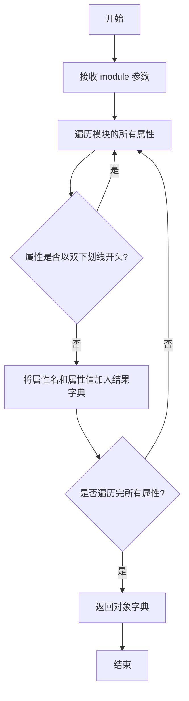
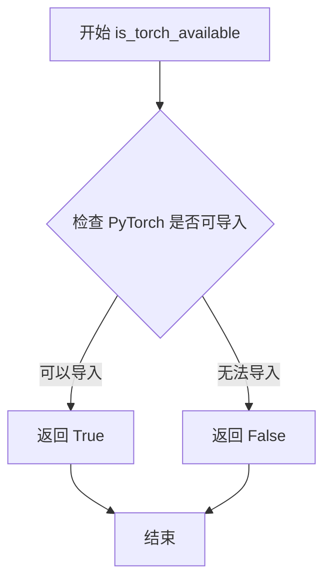
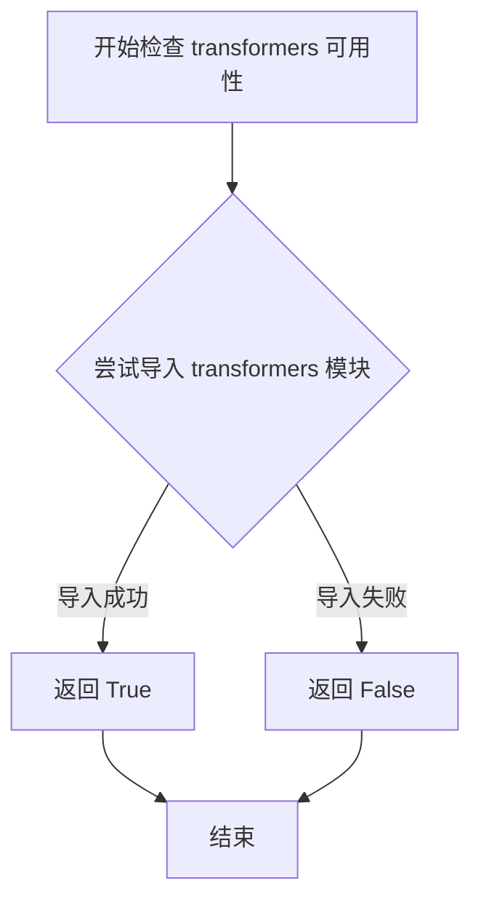

# `diffusers\src\diffusers\pipelines\aura_flow\__init__.py` 详细设计文档

这是一个延迟加载模块，用于条件导入AuraFlowPipeline类。当torch和transformers都可用时，导出真实的AuraFlowPipeline类；否则使用dummy对象替代，以支持diffusers库的可选依赖机制。

## 整体流程

```mermaid
graph TD
    A[模块加载] --> B{DIFFUSERS_SLOW_IMPORT 或 TYPE_CHECKING?}
    B -- 是 --> C{is_transformers_available() && is_torch_available()?}
    C -- 否 --> D[导入dummy_torch_and_transformers_objects]
    C -- 是 --> E[从pipeline_aura_flow导入AuraFlowPipeline]
    B -- 否 --> F[创建_LazyModule]
    F --> G[将_dummy_objects设置到sys.modules]
```

## 类结构

```
无自定义类定义
主要使用_LazyModule实现延迟加载
```

## 全局变量及字段


### `_dummy_objects`
    
存储虚拟对象的字典，当torch和transformers等可选依赖不可用时使用

类型：`dict`
    


### `_import_structure`
    
定义模块的导入结构，键为子模块路径，值为导出的对象列表

类型：`dict`
    


### `DIFFUSERS_SLOW_IMPORT`
    
控制是否使用慢速导入模式的标志，用于延迟加载模块

类型：`bool`
    


    

## 全局函数及方法


### `get_objects_from_module`

获取指定模块中的所有对象，并将其转换为可迭代的字典格式，用于延迟加载和可选依赖处理。

参数：

- `module`：`module`，要提取对象的模块对象，即 `dummy_torch_and_transformers_objects` 模块

返回值：`dict`，返回模块中所有的 dummy 对象字典，键为对象名称，值为对象本身

#### 流程图



#### 带注释源码

```python
def get_objects_from_module(module):
    """
    从给定模块中提取所有公共对象（不包括以双下划线开头的私有属性）
    用于创建虚拟对象字典，以便在可选依赖不可用时提供延迟加载的替代品
    
    参数:
        module: 要提取对象的模块对象
        
    返回:
        dict: 包含模块中所有公共对象及其名称的字典
    """
    # 获取模块的所有属性，排除以双下划线开头的私有属性
    objects = {
        name: getattr(module, name) 
        for name in dir(module) 
        if not name.startswith("_")
    }
    return objects

# 在代码中的实际使用示例：
# _dummy_objects.update(get_objects_from_module(dummy_torch_and_transformers_objects))
# 这里的 dummy_torch_and_transformers_objects 是一个包含虚拟对象的模块
# 当 torch 和 transformers 不可用时，这些虚拟对象会被添加到 _dummy_objects 中
# 以保持接口一致性，避免导入错误
```


### `is_torch_available`

该函数用于检查当前环境中是否安装了 PyTorch 库。如果 PyTorch 可用则返回 `True`，否则返回 `False`。这是一个常见的模式，用于实现可选依赖的延迟导入，在 PyTorch 不可用时提供替代的虚拟对象。

参数： 无

返回值：`bool`，返回 `True` 表示 PyTorch 已安装且可用，返回 `False` 表示 PyTorch 未安装或不可用

#### 流程图



#### 带注释源码

```python
# 该函数定义在 ...utils 模块中
# 以下是基于使用模式的推断实现

def is_torch_available():
    """
    检查 PyTorch 是否在当前环境中可用。
    
    该函数通常通过尝试导入 torch 来判断 PyTorch 是否已安装。
    如果导入成功则返回 True，否则返回 False。
    
    Returns:
        bool: PyTorch 是否可用
    """
    try:
        # 尝试导入 torch 模块
        import torch
        # 如果导入成功，说明 PyTorch 可用
        return True
    except ImportError:
        # 如果导入失败，说明 PyTorch 不可用
        return False
```

#### 使用示例源码

```python
# 在给定代码中的实际使用方式
from ...utils import is_torch_available, is_transformers_available

try:
    # 检查 transformers 和 torch 是否同时可用
    if not (is_transformers_available() and is_torch_available()):
        # 如果任一依赖不可用，抛出可选依赖不可用异常
        raise OptionalDependencyNotAvailable()
except OptionalDependencyNotAvailable:
    # 导入虚拟对象作为后备
    from ...utils import dummy_torch_and_transformers_objects
    _dummy_objects.update(get_objects_from_module(dummy_torch_and_transformers_objects))
else:
    # 如果所有依赖都可用，导入实际的管道类
    _import_structure["pipeline_aura_flow"] = ["AuraFlowPipeline"]
```


### `is_transformers_available`

该函数是一个工具函数，用于检查当前环境中是否安装了 `transformers` 库，通过返回布尔值来表示其可用性。

参数：无需参数

返回值：`bool`，返回 `True` 表示 `transformers` 库可用，返回 `False` 表示不可用

#### 流程图



#### 带注释源码

```
# is_transformers_available 函数的典型实现方式（位于 ...utils 模块中）
# 此源码基于其在代码中的使用模式推断

def is_transformers_available() -> bool:
    """
    检查 transformers 库是否可用
    
    Returns:
        bool: 如果 transformers 库已安装且可导入返回 True，否则返回 False
    """
    try:
        # 尝试导入 transformers 库的核心模块
        import transformers
        return True
    except ImportError:
        # 如果导入失败（未安装），返回 False
        return False
```

> **注意**：该函数定义在 `...utils` 模块中，当前代码文件通过 `from ...utils import is_transformers_available` 导入并使用它。其典型实现会尝试动态导入 `transformers` 包，通过 `try-except` 捕获 `ImportError` 来判断库是否可用。


### `setattr` (内置函数)

在模块初始化代码中，使用 `setattr` 动态将虚拟对象（dummy objects）设置为当前模块的属性，以便在依赖不可用时提供替代实现。

参数：

- `obj`：`module`，需要设置属性的模块对象，这里是 `sys.modules[__name__]`
- `name`：`str`，要设置的属性名称，来自 `_dummy_objects` 字典的键
- `value`：`Any`，要设置的属性值，来自 `_dummy_objects` 字典的值

返回值：`None`，该函数不返回值

#### 流程图

```mermaid
flowchart TD
    A[开始遍历 _dummy_objects 字典] --> B{是否还有未处理的键值对}
    B -->|是| C[取出当前键值对: name, value]
    C --> D[调用 setattr sys.modules[__name__], name, value]
    D --> E[将虚拟对象设置为模块属性]
    E --> B
    B -->|否| F[结束]
```

#### 带注释源码

```python
# 遍历 _dummy_objects 字典中的所有虚拟对象
for name, value in _dummy_objects.items():
    # 使用 setattr 内置函数动态设置模块属性
    # 参数1: 目标对象 - 当前模块 (sys.modules[__name__])
    # 参数2: 属性名 - 字符串形式的变量名 (来自字典的键)
    # 参数3: 属性值 - 要绑定的对象 (来自字典的值)
    # 作用: 当可选依赖不可用时,模块仍能导入但使用空对象替代
    setattr(sys.modules[__name__], name, value)
```

---

### 补充说明

| 项目 | 说明 |
|------|------|
| **使用场景** | 延迟加载（Lazy Loading）模式下的模块初始化 |
| **设计目标** | 处理可选依赖，当 torch 或 transformers 不可用时提供虚拟对象 |
| **错误处理** | 通过 `OptionalDependencyNotAvailable` 异常捕获实现优雅降级 |
| **优化空间** | 当前实现已较为简洁，可考虑使用 `__getattr__` 进一步优化动态导入 |

## 关键组件


### 可选依赖检查与虚拟对象机制

通过 try-except 捕获 OptionalDependencyNotAvailable 异常，当 torch 或 transformers 不可用时，从 dummy 模块导入虚拟对象，确保模块导入不失败

### _import_structure 导入结构字典

定义了模块的公开接口结构，将字符串映射到类名列表，用于 _LazyModule 的延迟加载机制

### _LazyModule 延迟模块加载

当非 TYPE_CHECKING 模式下运行时，将当前模块替换为延迟加载模块，支持按需导入以提高初始化性能

### TYPE_CHECKING 条件导入

在类型检查模式下直接导入真实类(AuraFlowPipeline)，否则使用虚拟对象或延迟加载，提高开发时的类型检查效率

### AuraFlowPipeline 管道类

通过延迟加载机制导入的实际管道实现类，支持 Aura Flow 模型的推理流程


## 问题及建议


### 已知问题

-   **重复的条件检查**：代码在两个不同的地方（第11-13行和第20-22行）检查相同的依赖条件 `is_transformers_available() and is_torch_available()`，导致冗余判断
-   **类型检查与运行时行为不一致**：`TYPE_CHECKING` 分支使用直接导入 `from .pipeline_aura_flow import AuraFlowPipeline`，而运行时使用 `_LazyModule` 延迟加载，这可能导致类型检查器和实际运行时的行为差异
-   **异常处理冗余**：两个 `try-except` 块捕获相同的 `OptionalDependencyNotAvailable` 异常，增加了代码复杂度
-   **缺乏错误处理**：当 `pipeline_aura_flow` 模块导入失败时，没有提供有意义的错误信息或降级策略
-   **模块属性直接设置风险**：使用 `setattr(sys.modules[__name__], name, value)` 直接设置模块属性，可能覆盖原有属性或方法

### 优化建议

-   **提取公共逻辑**：将依赖检查逻辑提取为单独函数，避免重复代码，例如创建 `_check_dependencies()` 函数统一处理
-   **统一导入模式**：考虑在 `TYPE_CHECKING` 分支也使用延迟导入，或确保运行时和类型检查时行为一致
-   **添加错误处理**：为模块导入添加 try-except 块，捕获可能的导入错误并提供清晰的错误信息
-   **使用安全属性设置**：在设置属性前检查属性是否已存在，或使用 `object.__setattr__` 绕过descriptor
-   **添加日志记录**：在依赖不可用或模块加载时添加日志记录，便于调试和监控


## 其它


### 设计目标与约束

该模块的设计目标是实现可选依赖的延迟加载机制，确保在缺少torch或transformers等关键依赖时，模块仍能以最小化依赖的方式被导入，同时保持完整的导入接口不变。核心约束包括：必须同时满足is_transformers_available()和is_torch_available()条件才能导入真实的AuraFlowPipeline类；使用_LazyModule实现惰性加载以提升首次导入性能；通过dummy objects机制保证模块接口一致性。

### 错误处理与异常设计

该模块主要通过OptionalDependencyNotAvailable异常来处理可选依赖不可用的情况。当transformers或torch任一不可用时，抛出OptionalDependencyNotAvailable异常并捕获，随后从dummy模块加载替代对象。异常处理策略采用静默降级模式：即使缺少依赖，模块仍可被导入但功能受限，真实功能类被替换为dummy objects。DIFFUSERS_SLOW_IMPORT标志用于控制是否进行完整导入或延迟导入。

### 数据流与状态机

模块初始化时存在两条执行路径：当DIFFUSERS_SLOW_IMPORT为True或处于TYPE_CHECKING模式时，执行即时导入逻辑，尝试加载真实模块；若不满足条件，则进入延迟加载模式，通过_LazyModule封装模块并动态设置dummy objects。状态转换取决于三个布尔条件：TYPE_CHECKING、DIFFUSERS_SLOW_IMPORT、is_transformers_available()和is_torch_available()的组合结果。

### 外部依赖与接口契约

该模块的外部依赖包括：torch（is_torch_available()）、transformers（is_transformers_available()）、diffusers.utils中的_LazyModule、get_objects_from_module、OptionalDependencyNotAvailable等工具函数。接口契约规定：_import_structure字典定义了可导出的公共API，当前仅包含pipeline_aura_flow.AuraFlowPipeline；模块在sys.modules中的命名保持为__name__；导出对象的命名必须与_import_structure中定义的键一致。

### 版本兼容性考虑

模块需要兼容Python 3.7+的typing机制，TYPE_CHECKING的正常使用需要Python 3.5+支持。_LazyModule的使用需要diffusers-utils提供相应的实现支持。dummy objects机制假设dummy_torch_and_transformers_objects模块存在并包含必要的替代类定义。

### 性能优化空间

当前实现存在优化空间：每次模块导入都会执行is_transformers_available()和is_torch_available()检查，可考虑缓存检查结果；对于DIFFUSERS_SLOW_IMPORT路径，每次访问模块属性时都会触发_LazyModule的惰性加载逻辑，频繁访问可能导致性能开销；_dummy_objects的更新采用全量更新方式，可以考虑按需加载策略。

    