# `diffusers\src\diffusers\pipelines\aura_flow\pipeline_aura_flow.py` 详细设计文档

AuraFlowPipeline是一个基于扩散模型的文本到图像生成管道，集成了T5文本编码器、VAE变分自编码器和Transformer去噪模型，支持LoRA加载、分类器自由引导和多种采样调度器，可根据文本提示生成高质量图像。

## 整体流程

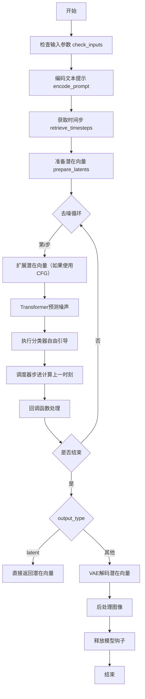

## 类结构

```
DiffusionPipeline (基类)
└── AuraFlowPipeline
    └── AuraFlowLoraLoaderMixin (混入类)
    
全局函数: retrieve_timesteps
```

## 全局变量及字段


### `XLA_AVAILABLE`
    
标记XLA加速是否可用的布尔值

类型：`bool`
    


### `logger`
    
用于记录运行时日志的日志记录器对象

类型：`logging.Logger`
    


### `EXAMPLE_DOC_STRING`
    
包含管道使用示例的文档字符串

类型：`str`
    


### `is_torch_xla_available`
    
检查PyTorch XLA是否可用的函数

类型：`Callable`
    


### `USE_PEFT_BACKEND`
    
指示是否使用PEFT后端的布尔标志

类型：`bool`
    


### `T5Tokenizer`
    
T5文本分词器类

类型：`type`
    


### `UMT5EncoderModel`
    
统一多语言T5编码器模型类

类型：`type`
    


### `AutoencoderKL`
    
KL散度变分自编码器类

类型：`type`
    


### `AuraFlowTransformer2DModel`
    
AuraFlow二维变换器模型类

类型：`type`
    


### `FlowMatchEulerDiscreteScheduler`
    
流匹配欧拉离散调度器类

类型：`type`
    


### `VaeImageProcessor`
    
VAE图像处理器类

类型：`type`
    


### `MultiPipelineCallbacks`
    
多管道回调类

类型：`type`
    


### `PipelineCallback`
    
单管道回调基类

类型：`type`
    


### `AuraFlowLoraLoaderMixin`
    
AuraFlow LoRA加载器混入类

类型：`type`
    


### `DiffusionPipeline`
    
扩散管道基类

类型：`type`
    


### `ImagePipelineOutput`
    
图像管道输出类

类型：`type`
    


### `randn_tensor`
    
生成随机高斯张量的工具函数

类型：`Callable`
    


### `scale_lora_layers`
    
缩放LoRA层的工具函数

类型：`Callable`
    


### `unscale_lora_layers`
    
取消缩放LoRA层的工具函数

类型：`Callable`
    


### `deprecate`
    
标记功能为废弃的工具函数

类型：`Callable`
    


### `replace_example_docstring`
    
替换示例文档字符串的装饰器函数

类型：`Callable`
    


### `retrieve_timesteps`
    
从调度器获取时间步的辅助函数

类型：`Callable`
    


### `AuraFlowPipeline.tokenizer`
    
T5文本分词器，用于将文本转换为token序列

类型：`T5Tokenizer`
    


### `AuraFlowPipeline.text_encoder`
    
T5文本编码器模型，将token序列编码为文本嵌入向量

类型：`UMT5EncoderModel`
    


### `AuraFlowPipeline.vae`
    
变分自编码器模型，用于将图像编码到潜在空间或从潜在空间解码图像

类型：`AutoencoderKL`
    


### `AuraFlowPipeline.transformer`
    
条件Transformer模型，执行潜在空间的去噪操作

类型：`AuraFlowTransformer2DModel`
    


### `AuraFlowPipeline.scheduler`
    
流匹配调度器，控制去噪过程的时间步进策略

类型：`FlowMatchEulerDiscreteScheduler`
    


### `AuraFlowPipeline.vae_scale_factor`
    
VAE缩放因子，用于计算潜在空间的尺寸

类型：`int`
    


### `AuraFlowPipeline.image_processor`
    
图像后处理器，用于将VAE输出转换为最终图像格式

类型：`VaeImageProcessor`
    


### `AuraFlowPipeline._optional_components`
    
可选组件列表，定义管道中可选的模块

类型：`list`
    


### `AuraFlowPipeline.model_cpu_offload_seq`
    
模型CPU卸载顺序字符串，定义模块卸载到CPU的序列

类型：`str`
    


### `AuraFlowPipeline._callback_tensor_inputs`
    
回调函数可访问的张量输入列表

类型：`list`
    


### `AuraFlowPipeline._guidance_scale`
    
分类器自由引导强度系数，用于控制文本提示对生成图像的影响程度

类型：`float`
    


### `AuraFlowPipeline._attention_kwargs`
    
注意力机制额外参数字典，传递给注意力处理器

类型：`dict`
    


### `AuraFlowPipeline._num_timesteps`
    
去噪过程的总时间步数

类型：`int`
    
    

## 全局函数及方法


### `retrieve_timesteps`

该函数是扩散模型pipeline中的时间步获取工具函数，负责调用调度器的 `set_timesteps` 方法并从中提取时间步序列。它支持三种模式：使用默认的 `num_inference_steps`、自定义 `timesteps` 列表或自定义 `sigmas` 列表，同时提供灵活的设备参数传递和错误检查机制，确保调度器支持所请求的时间步配置。

参数：

- `scheduler`：`SchedulerMixin`，调度器对象，用于获取时间步
- `num_inference_steps`：`int | None`，生成样本时使用的扩散步数，若使用此参数则 `timesteps` 必须为 `None`
- `device`：`str | torch.device | None`，时间步要移动到的设备，若为 `None` 则不移动
- `timesteps`：`list[int] | None`，自定义时间步，用于覆盖调度器的时间步间隔策略，若传递此参数则 `num_inference_steps` 和 `sigmas` 必须为 `None`
- `sigmas`：`list[float] | None`，自定义 sigmas，用于覆盖调度器的时间步间隔策略，若传递此参数则 `num_inference_steps` 和 `timesteps` 必须为 `None`
- `**kwargs`：任意关键字参数，将传递给调度器的 `set_timesteps` 方法

返回值：`tuple[torch.Tensor, int]`，包含两个元素：第一个是调度器的时间步张量，第二个是推理步数

#### 流程图

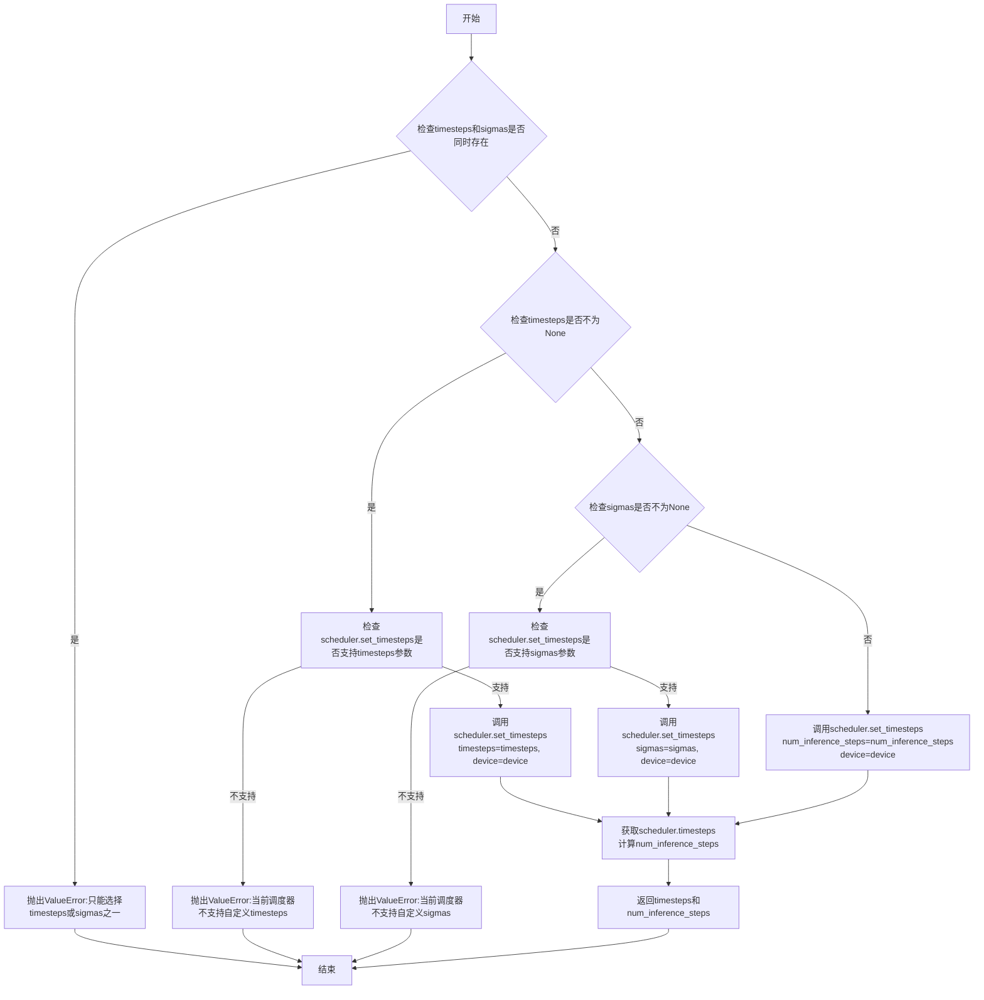

#### 带注释源码

```python
def retrieve_timesteps(
    scheduler,
    num_inference_steps: int | None = None,
    device: str | torch.device | None = None,
    timesteps: list[int] | None = None,
    sigmas: list[float] | None = None,
    **kwargs,
):
    r"""
    Calls the scheduler's `set_timesteps` method and retrieves timesteps from the scheduler after the call. Handles
    custom timesteps. Any kwargs will be supplied to `scheduler.set_timesteps`.

    Args:
        scheduler (`SchedulerMixin`):
            The scheduler to get timesteps from.
        num_inference_steps (`int`):
            The number of diffusion steps used when generating samples with a pre-trained model. If used, `timesteps`
            must be `None`.
        device (`str` or `torch.device`, *optional*):
            The device to which the timesteps should be moved to. If `None`, the timesteps are not moved.
        timesteps (`list[int]`, *optional*):
            Custom timesteps used to override the timestep spacing strategy of the scheduler. If `timesteps` is passed,
            `num_inference_steps` and `sigmas` must be `None`.
        sigmas (`list[float]`, *optional*):
            Custom sigmas used to override the timestep spacing strategy of the scheduler. If `sigmas` is passed,
            `num_inference_steps` and `timesteps` must be `None`.

    Returns:
        `tuple[torch.Tensor, int]`: A tuple where the first element is the timestep schedule from the scheduler and the
        second element is the number of inference steps.
    """
    # 互斥检查：timesteps 和 sigmas 不能同时传递
    if timesteps is not None and sigmas is not None:
        raise ValueError("Only one of `timesteps` or `sigmas` can be passed. Please choose one to set custom values")
    
    # 分支1：使用自定义 timesteps
    if timesteps is not None:
        # 使用 inspect 检查调度器的 set_timesteps 方法是否接受 timesteps 参数
        accepts_timesteps = "timesteps" in set(inspect.signature(scheduler.set_timesteps).parameters.keys())
        if not accepts_timesteps:
            raise ValueError(
                f"The current scheduler class {scheduler.__class__}'s `set_timesteps` does not support custom"
                f" timestep schedules. Please check whether you are using the correct scheduler."
            )
        # 调用调度器的 set_timesteps 方法，传递自定义 timesteps
        scheduler.set_timesteps(timesteps=timesteps, device=device, **kwargs)
        # 从调度器获取更新后的 timesteps
        timesteps = scheduler.timesteps
        # 计算推理步数
        num_inference_steps = len(timesteps)
    
    # 分支2：使用自定义 sigmas
    elif sigmas is not None:
        # 使用 inspect 检查调度器的 set_timesteps 方法是否接受 sigmas 参数
        accept_sigmas = "sigmas" in set(inspect.signature(scheduler.set_timesteps).parameters.keys())
        if not accept_sigmas:
            raise ValueError(
                f"The current scheduler class {scheduler.__class__}'s `set_timesteps` does not support custom"
                f" sigmas schedules. Please check whether you are using the correct scheduler."
            )
        # 调用调度器的 set_timesteps 方法，传递自定义 sigmas
        scheduler.set_timesteps(sigmas=sigmas, device=device, **kwargs)
        # 从调度器获取更新后的 timesteps
        timesteps = scheduler.timesteps
        # 计算推理步数
        num_inference_steps = len(timesteps)
    
    # 分支3：使用默认的 num_inference_steps
    else:
        scheduler.set_timesteps(num_inference_steps, device=device, **kwargs)
        timesteps = scheduler.timesteps
    
    # 返回时间步张量和推理步数
    return timesteps, num_inference_steps
```


### AuraFlowPipeline.__init__

初始化 AuraFlowPipeline 管道及其核心组件，包括分词器、文本编码器、VAE、变换器和调度器，并配置 VAE 缩放因子和图像处理器。

参数：

- `tokenizer`：`T5Tokenizer`，T5 分词器，用于将文本 prompt 转换为 token 序列
- `text_encoder`：`UMT5EncoderModel`，冻结的 T5 文本编码器，用于将 token 序列编码为文本嵌入
- `vae`：`AutoencoderKL`，变分自编码器，用于将图像编码为潜在表示并进行解码
- `transformer`：`AuraFlowTransformer2DModel`，条件变换器架构，用于对图像潜在表示进行去噪
- `scheduler`：`FlowMatchEulerDiscreteScheduler`，与变换器配合使用的调度器，用于去噪过程

返回值：`None`，无返回值（构造函数）

#### 流程图

```mermaid
flowchart TD
    A[开始 __init__] --> B[调用 super().__init__ 初始化基类]
    B --> C[调用 register_modules 注册5个模块]
    C --> D[tokenizer<br>text_encoder<br>vae<br>transformer<br>scheduler]
    D --> E{检查 vae 是否存在}
    E -->|是| F[计算 vae_scale_factor<br>2^(len(vae.config.block_out_channels)-1)]
    E -->|否| G[设置 vae_scale_factor = 8]
    F --> H[创建 VaeImageProcessor]
    G --> H
    H --> I[结束 __init__]
```

#### 带注释源码

```python
def __init__(
    self,
    tokenizer: T5Tokenizer,
    text_encoder: UMT5EncoderModel,
    vae: AutoencoderKL,
    transformer: AuraFlowTransformer2DModel,
    scheduler: FlowMatchEulerDiscreteScheduler,
):
    """
    初始化 AuraFlowPipeline 管道。
    
    参数:
        tokenizer: T5Tokenizer，分词器
        text_encoder: UMT5EncoderModel，文本编码器
        vae: AutoencoderKL，变分自编码器
        transformer: AuraFlowTransformer2DModel，图像变换器
        scheduler: FlowMatchEulerDiscreteScheduler，调度器
    """
    # 调用父类 DiffusionPipeline 的初始化方法
    super().__init__()

    # 注册所有模块到管道中，使其可通过 self.tokenizer, self.text_encoder 等访问
    self.register_modules(
        tokenizer=tokenizer, 
        text_encoder=text_encoder, 
        vae=vae, 
        transformer=transformer, 
        scheduler=scheduler
    )

    # 计算 VAE 缩放因子，用于调整潜在空间与像素空间的尺寸转换
    # 基于 VAE 的 block_out_channels 计算，通常为 8
    # 公式: 2^(len(block_out_channels) - 1)
    self.vae_scale_factor = 2 ** (len(self.vae.config.block_out_channels) - 1) if getattr(self, "vae", None) else 8
    
    # 创建图像后处理器，用于将 VAE 输出的潜在表示转换为图像
    self.image_processor = VaeImageProcessor(vae_scale_factor=self.vae_scale_factor)
```


### AuraFlowPipeline.check_inputs

验证图像生成管道的输入参数是否合法，包括图像尺寸、提示词与嵌入的一致性、注意力掩码的匹配等。

参数：

- `self`：隐式参数，`AuraFlowPipeline` 实例，当前管道对象
- `prompt`：`str | list[str]`，要编码的提示词，可以是单个字符串或字符串列表
- `height`：`int`，生成图像的高度（像素）
- `width`：`int`，生成图像的宽度（像素）
- `negative_prompt`：`str | list[str]`，不引导图像生成的负面提示词
- `prompt_embeds`：`torch.Tensor | None`，预生成的文本嵌入，可选
- `negative_prompt_embeds`：`torch.Tensor | None`，预生成的负面文本嵌入，可选
- `prompt_attention_mask`：`torch.Tensor | None`，文本嵌入的注意力掩码，可选
- `negative_prompt_attention_mask`：`torch.Tensor | None`，负面文本嵌入的注意力掩码，可选
- `callback_on_step_end_tensor_inputs`：`list[str] | None`，每步结束回调的张量输入列表，可选

返回值：`None`，该方法通过抛出 `ValueError` 来指示验证失败，无返回值。

#### 流程图

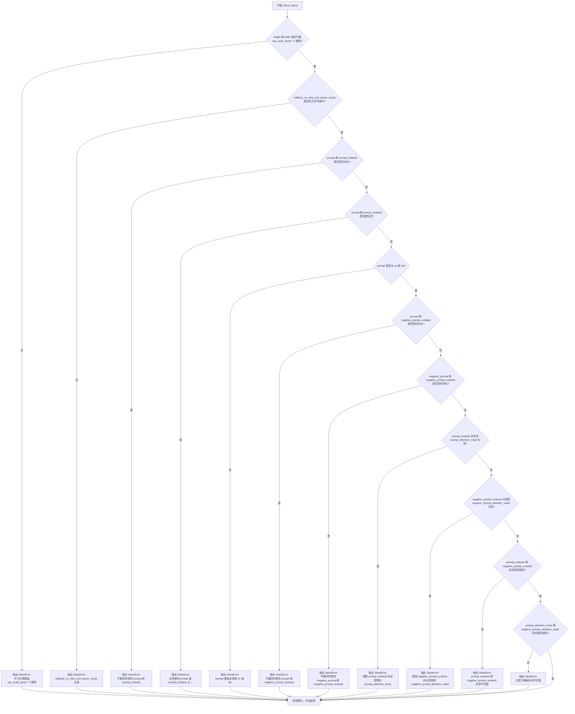

#### 带注释源码

```python
def check_inputs(
    self,
    prompt,
    height,
    width,
    negative_prompt,
    prompt_embeds=None,
    negative_prompt_embeds=None,
    prompt_attention_mask=None,
    negative_prompt_attention_mask=None,
    callback_on_step_end_tensor_inputs=None,
):
    """
    检查输入参数的合法性。
    
    验证项目：
    1. height 和 width 必须能被 vae_scale_factor * 2 整除（与 VAE 的下采样倍数匹配）
    2. callback_on_step_end_tensor_inputs 必须在允许的回调张量列表中
    3. prompt 和 prompt_embeds 不能同时提供（互斥）
    4. 必须提供 prompt 或 prompt_embeds 之一（不能都为空）
    5. prompt 必须是 str 或 list 类型
    6. prompt 和 negative_prompt_embeds 不能同时提供
    7. negative_prompt 和 negative_prompt_embeds 不能同时提供
    8. 如果提供 prompt_embeds，必须同时提供 prompt_attention_mask
    9. 如果提供 negative_prompt_embeds，必须同时提供 negative_prompt_attention_mask
    10. prompt_embeds 和 negative_prompt_embeds 形状必须一致
    11. prompt_attention_mask 和 negative_prompt_attention_mask 形状必须一致
    """
    
    # 验证 1: 检查图像尺寸是否与 VAE 的缩放因子匹配
    # VAE 将图像编码到潜在空间时会有 2^(len(vae.config.block_out_channels)-1) 倍的下采样
    # 生成图像时需要上采样回去，因此高度和宽度必须能被这个因子整除
    if height % (self.vae_scale_factor * 2) != 0 or width % (self.vae_scale_factor * 2) != 0:
        raise ValueError(
            f"`height` and `width` have to be divisible by {self.vae_scale_factor * 2} but are {height} and {width}."
        )

    # 验证 2: 检查回调张量输入是否在允许的列表中
    # 回调函数只能访问特定的张量，以防止安全问题和内存泄漏
    if callback_on_step_end_tensor_inputs is not None and not all(
        k in self._callback_tensor_inputs for k in callback_on_step_end_tensor_inputs
    ):
        raise ValueError(
            f"`callback_on_step_end_tensor_inputs` has to be in {self._callback_tensor_inputs}, but found {[k for k in callback_on_step_end_tensor_inputs if k not in self._callback_tensor_inputs]}"
        )
    
    # 验证 3: prompt 和 prompt_embeds 互斥检查
    # 不能同时提供原始提示词和预计算的嵌入，只能选择其中一种方式
    if prompt is not None and prompt_embeds is not None:
        raise ValueError(
            f"Cannot forward both `prompt`: {prompt} and `prompt_embeds`: {prompt_embeds}. Please make sure to"
            " only forward one of the two."
        )
    
    # 验证 4: 至少需要提供一种提示方式
    # 必须提供 prompt 或 prompt_embeds，不能两者都为空
    elif prompt is None and prompt_embeds is None:
        raise ValueError(
            "Provide either `prompt` or `prompt_embeds`. Cannot leave both `prompt` and `prompt_embeds` undefined."
        )
    
    # 验证 5: prompt 类型检查
    # 确保 prompt 是字符串或列表类型
    elif prompt is not None and (not isinstance(prompt, str) and not isinstance(prompt, list)):
        raise ValueError(f"`prompt` has to be of type `str` or `list` but is {type(prompt)}")

    # 验证 6: prompt 和 negative_prompt_embeds 互斥检查
    # 提供原始提示词时，不能同时提供预计算的负面嵌入
    if prompt is not None and negative_prompt_embeds is not None:
        raise ValueError(
            f"Cannot forward both `prompt`: {prompt} and `negative_prompt_embeds`:"
            f" {negative_prompt_embeds}. Please make sure to only forward one of the two."
        )

    # 验证 7: negative_prompt 和 negative_prompt_embeds 互斥检查
    # 提供原始负面提示词时，不能同时提供预计算的负面嵌入
    if negative_prompt is not None and negative_prompt_embeds is not None:
        raise ValueError(
            f"Cannot forward both `negative_prompt`: {negative_prompt} and `negative_prompt_embeds`:"
            f" {negative_prompt_embeds}. Please make sure to only forward one of the two."
        )

    # 验证 8: prompt_embeds 必须伴随 prompt_attention_mask
    # 当直接传入预计算的文本嵌入时，必须同时提供对应的注意力掩码
    if prompt_embeds is not None and prompt_attention_mask is None:
        raise ValueError("Must provide `prompt_attention_mask` when specifying `prompt_embeds`.")

    # 验证 9: negative_prompt_embeds 必须伴随 negative_prompt_attention_mask
    # 当直接传入预计算的负面文本嵌入时，必须同时提供对应的注意力掩码
    if negative_prompt_embeds is not None and negative_prompt_attention_mask is None:
        raise ValueError("Must provide `negative_prompt_attention_mask` when specifying `negative_prompt_embeds`.")

    # 验证 10: prompt_embeds 和 negative_prompt_embeds 形状一致性检查
    # 用于分类器自由引导的嵌入形状必须完全匹配
    if prompt_embeds is not None and negative_prompt_embeds is not None:
        if prompt_embeds.shape != negative_prompt_embeds.shape:
            raise ValueError(
                "`prompt_embeds` and `negative_prompt_embeds` must have the same shape when passed directly, but"
                f" got: `prompt_embeds` {prompt_embeds.shape} != `negative_prompt_embeds`"
                f" {negative_prompt_embeds.shape}."
            )
        # 验证 11: 注意力掩码形状一致性检查
        if prompt_attention_mask.shape != negative_prompt_attention_mask.shape:
            raise ValueError(
                "`prompt_attention_mask` and `negative_prompt_attention_mask` must have the same shape when passed directly, but"
                f" got: `prompt_attention_mask` {prompt_attention_mask.shape} != `negative_prompt_attention_mask`"
                f" {negative_prompt_attention_mask.shape}."
            )
```


### `AuraFlowPipeline.encode_prompt`

将文本提示（prompt）编码为文本 encoder 的隐藏状态（embedding），支持 LoRA 权重调整和 Classifier-Free Guidance（CFG），并返回正向和负向的 prompt embeddings 及对应的 attention mask。

参数：

- `prompt`：`str | list[str]`，要编码的文本提示，支持单条或批量提示
- `negative_prompt`：`str | list[str]`，不引导图像生成的负面提示，若不提供且启用 CFG 时使用空字符串
- `do_classifier_free_guidance`：`bool`，是否启用 Classifier-Free Guidance（默认 `True`）
- `num_images_per_prompt`：`int`，每个提示生成的图像数量（默认 1）
- `device`：`torch.device | None`，用于放置结果 embedding 的设备，若为 `None` 则使用 `self._execution_device`
- `prompt_embeds`：`torch.Tensor | None`，预生成的文本 embedding，可用于快速调整文本输入（如 prompt 加权）
- `negative_prompt_embeds`：`torch.Tensor | None`，预生成的负面文本 embedding
- `prompt_attention_mask`：`torch.Tensor | None`，预生成的文本 embedding 注意力掩码
- `negative_prompt_attention_mask`：`torch.Tensor | None`，预生成的负面文本 embedding 注意力掩码
- `max_sequence_length`：`int`，提示的最大序列长度（默认 256）
- `lora_scale`：`float | None`，LoRA 缩放因子，用于调整文本 encoder 的 LoRA 层权重

返回值：`tuple[torch.Tensor, torch.Tensor, torch.Tensor, torch.Tensor]`

- 第一个元素为 `prompt_embeds`（编码后的提示 embedding）
- 第二个元素为 `prompt_attention_mask`（提示的注意力掩码）
- 第三个元素为 `negative_prompt_embeds`（负面提示的 embedding，若未启用 CFG 则为 `None`）
- 第四个元素为 `negative_prompt_attention_mask`（负面提示的注意力掩码，若未启用 CFG 则为 `None`）

#### 流程图

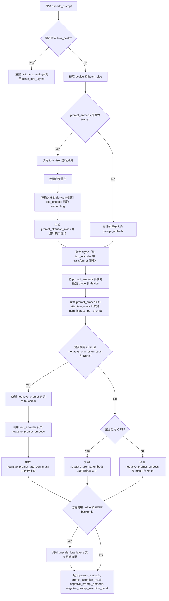

#### 带注释源码

```python
def encode_prompt(
    self,
    prompt: str | list[str],
    negative_prompt: str | list[str] = None,
    do_classifier_free_guidance: bool = True,
    num_images_per_prompt: int = 1,
    device: torch.device | None = None,
    prompt_embeds: torch.Tensor | None = None,
    negative_prompt_embeds: torch.Tensor | None = None,
    prompt_attention_mask: torch.Tensor | None = None,
    negative_prompt_attention_mask: torch.Tensor | None = None,
    max_sequence_length: int = 256,
    lora_scale: float | None = None,
):
    r"""
    Encodes the prompt into text encoder hidden states.
    """
    # 如果传入了 lora_scale 且当前类继承自 AuraFlowLoraLoaderMixin，
    # 则设置 LoRA 缩放因子，以便 text encoder 的 monkey patched LoRA 函数可以正确访问
    if lora_scale is not None and isinstance(self, AuraFlowLoraLoaderMixin):
        self._lora_scale = lora_scale

        # 动态调整 LoRA 缩放因子
        if self.text_encoder is not None and USE_PEFT_BACKEND:
            scale_lora_layers(self.text_encoder, lora_scale)

    # 如果未指定 device，则使用执行设备
    if device is None:
        device = self._execution_device
    
    # 根据 prompt 或 prompt_embeds 确定批量大小
    if prompt is not None and isinstance(prompt, str):
        batch_size = 1
    elif prompt is not None and isinstance(prompt, list):
        batch_size = len(prompt)
    else:
        batch_size = prompt_embeds.shape[0]

    # 设置最大序列长度
    max_length = max_sequence_length
    
    # 如果没有预生成的 prompt_embeds，则需要从文本生成
    if prompt_embeds is None:
        # 调用 tokenizer 将文本转换为 token IDs
        text_inputs = self.tokenizer(
            prompt,
            truncation=True,
            max_length=max_length,
            padding="max_length",
            return_tensors="pt",
        )
        text_input_ids = text_inputs["input_ids"]
        
        # 获取未截断的 token IDs（用于检测是否发生了截断）
        untruncated_ids = self.tokenizer(prompt, padding="longest", return_tensors="pt").input_ids

        # 检查是否发生了截断，如果是则记录警告
        if untruncated_ids.shape[-1] >= text_input_ids.shape[-1] and not torch.equal(
            text_input_ids, untruncated_ids
        ):
            removed_text = self.tokenizer.batch_decode(untruncated_ids[:, max_length - 1 : -1])
            logger.warning(
                "The following part of your input was truncated because T5 can only handle sequences up to"
                f" {max_length} tokens: {removed_text}"
            )

        # 将输入移到指定设备
        text_inputs = {k: v.to(device) for k, v in text_inputs.items()}
        
        # 通过 text_encoder 获取 hidden states
        prompt_embeds = self.text_encoder(**text_inputs)[0]
        
        # 生成 attention mask 并扩展到与 prompt_embeds 相同形状
        prompt_attention_mask = text_inputs["attention_mask"].unsqueeze(-1).expand(prompt_embeds.shape)
        
        # 应用 attention mask（将无效位置置零）
        prompt_embeds = prompt_embeds * prompt_attention_mask

    # 确定数据类型（从 text_encoder 或 transformer 获取）
    if self.text_encoder is not None:
        dtype = self.text_encoder.dtype
    elif self.transformer is not None:
        dtype = self.transformer.dtype
    else:
        dtype = None

    # 将 prompt_embeds 转换为指定的数据类型和设备
    prompt_embeds = prompt_embeds.to(dtype=dtype, device=device)

    # 获取 embeddings 的形状信息
    bs_embed, seq_len, _ = prompt_embeds.shape
    
    # 为每个提示生成的图像数量复制 embeddings（MPS 友好的方法）
    prompt_embeds = prompt_embeds.repeat(1, num_images_per_prompt, 1)
    prompt_embeds = prompt_embeds.view(bs_embed * num_images_per_prompt, seq_len, -1)
    
    # 处理 attention mask
    prompt_attention_mask = prompt_attention_mask.reshape(bs_embed, -1)
    prompt_attention_mask = prompt_attention_mask.repeat(num_images_per_prompt, 1)

    # 如果启用 CFG 且未提供 negative_prompt_embeds，则生成无条件 embeddings
    if do_classifier_free_guidance and negative_prompt_embeds is None:
        # 使用空字符串作为负面提示
        negative_prompt = negative_prompt or ""
        uncond_tokens = [negative_prompt] * batch_size if isinstance(negative_prompt, str) else negative_prompt
        
        # 使用与 prompt_embeds 相同的序列长度
        max_length = prompt_embeds.shape[1]
        
        # 对负面提示进行 tokenize
        uncond_input = self.tokenizer(
            uncond_tokens,
            truncation=True,
            max_length=max_length,
            padding="max_length",
            return_tensors="pt",
        )
        
        # 移到设备
        uncond_input = {k: v.to(device) for k, v in uncond_input.items()}
        
        # 获取负面提示的 embeddings
        negative_prompt_embeds = self.text_encoder(**uncond_input)[0]
        
        # 生成并应用 attention mask
        negative_prompt_attention_mask = (
            uncond_input["attention_mask"].unsqueeze(-1).expand(negative_prompt_embeds.shape)
        )
        negative_prompt_embeds = negative_prompt_embeds * negative_prompt_attention_mask

    # 如果启用 CFG，则处理 negative_prompt_embeds
    if do_classifier_free_guidance:
        # 获取序列长度
        seq_len = negative_prompt_embeds.shape[1]

        # 转换为指定的数据类型和设备
        negative_prompt_embeds = negative_prompt_embeds.to(dtype=dtype, device=device)

        # 复制 embeddings 以匹配批量大小
        negative_prompt_embeds = negative_prompt_embeds.repeat(1, num_images_per_prompt, 1)
        negative_prompt_embeds = negative_prompt_embeds.view(batch_size * num_images_per_prompt, seq_len, -1)

        # 处理 attention mask
        negative_prompt_attention_mask = negative_prompt_attention_mask.reshape(bs_embed, -1)
        negative_prompt_attention_mask = negative_prompt_attention_mask.repeat(num_images_per_prompt, 1)
    else:
        # 如果未启用 CFG，则返回 None
        negative_prompt_embeds = None
        negative_prompt_attention_mask = None

    # 如果使用了 LoRA 和 PEFT backend，则恢复原始权重
    if self.text_encoder is not None:
        if isinstance(self, AuraFlowLoraLoaderMixin) and USE_PEFT_BACKEND:
            # 通过 unscale 恢复原始 LoRA 权重
            unscale_lora_layers(self.text_encoder, lora_scale)

    # 返回编码后的 embeddings 和 attention masks
    return prompt_embeds, prompt_attention_mask, negative_prompt_embeds, negative_prompt_attention_mask
```


### `AuraFlowPipeline.prepare_latents`

准备初始噪声潜在向量，用于扩散模型的图像生成过程。该方法根据批量大小、图像尺寸和潜在通道数生成或处理潜在向量，并根据VAE的缩放因子调整潜在向量的空间分辨率。

参数：

- `self`：`AuraFlowPipeline` 类实例，当前 pipeline 对象
- `batch_size`：`int`，批量大小，即每个提示词生成的图像数量
- `num_channels_latents`：`int`，潜在向量通道数，对应于 transformer 模型的输入通道数（通常为 `transformer.config.in_channels`）
- `height`：`int`，目标图像高度（像素单位）
- `width`：`int`，目标图像宽度（像素单位）
- `dtype`：`torch.dtype`，潜在向量的数据类型（如 `torch.float16`、`torch.float32` 等）
- `device`：`torch.device`，潜在向量存放的设备（如 `"cuda"` 或 `"cpu"`）
- `generator`：`torch.Generator` 或 `list[torch.Generator]`，可选的随机数生成器，用于确保生成过程可复现
- `latents`：`torch.Tensor | None`，可选的预生成潜在向量。如果为 `None`，则随机生成新的潜在向量

返回值：`torch.Tensor`，准备好的潜在向量张量，形状为 `(batch_size, num_channels_latents, height // vae_scale_factor, width // vae_scale_factor)`

#### 流程图

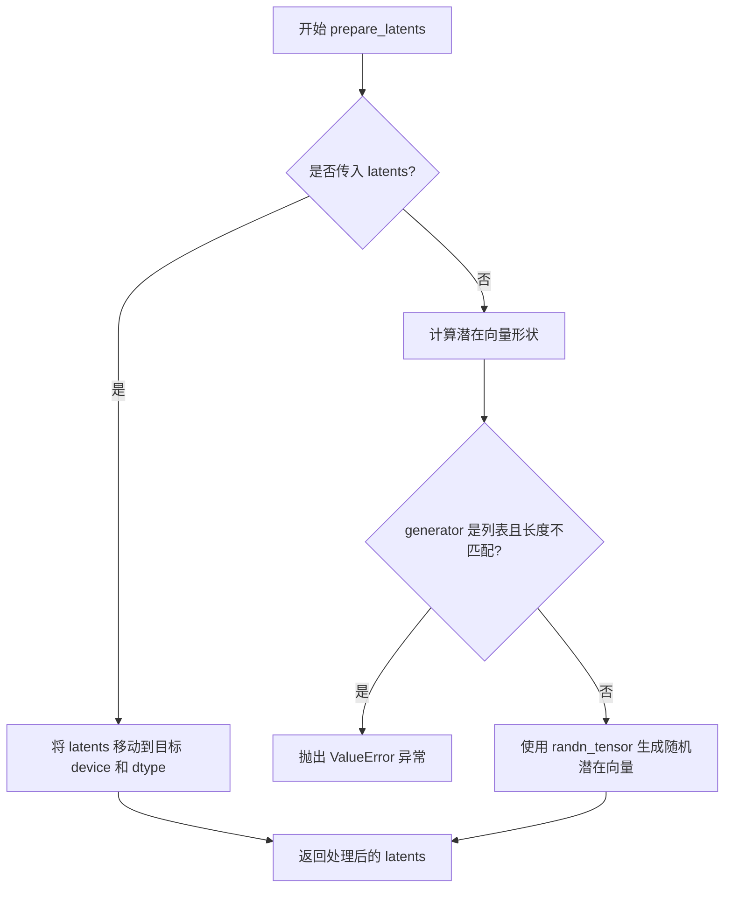

#### 带注释源码

```python
# Copied from diffusers.pipelines.stable_diffusion_3.pipeline_stable_diffusion_3.StableDiffusion3Pipeline.prepare_latents
def prepare_latents(
    self,
    batch_size,              # 批量大小
    num_channels_latents,    # 潜在通道数
    height,                  # 图像高度
    width,                   # 图像宽度
    dtype,                   # 数据类型
    device,                  # 设备
    generator,               # 随机生成器
    latents=None,            # 可选的预生成潜在向量
):
    # 如果已提供潜在向量，直接将其移动到目标设备并转换数据类型后返回
    if latents is not None:
        return latents.to(device=device, dtype=dtype)

    # 计算潜在向量的形状：批量大小 × 通道数 × (高度/VAE缩放因子) × (宽度/VAE缩放因子)
    # VAE 缩放因子用于将像素空间转换为潜在空间
    shape = (
        batch_size,
        num_channels_latents,
        int(height) // self.vae_scale_factor,
        int(width) // self.vae_scale_factor,
    )

    # 验证生成器列表长度与批量大小是否匹配
    if isinstance(generator, list) and len(generator) != batch_size:
        raise ValueError(
            f"You have passed a list of generators of length {len(generator)}, but requested an effective batch"
            f" size of {batch_size}. Make sure the batch size matches the length of the generators."
        )

    # 使用 randn_tensor 生成服从标准正态分布的随机噪声潜在向量
    # generator 参数确保生成过程可复现（如果提供）
    latents = randn_tensor(shape, generator=generator, device=device, dtype=dtype)

    # 返回生成的潜在向量
    return latents
```


### `AuraFlowPipeline.upcast_vae`

这是一个已废弃的VAE类型转换方法，用于将VAE模型从当前精度（通常是float16）转换为float32精度，以避免在解码过程中出现溢出问题。该方法已被标记为废弃，建议用户直接使用 `pipe.vae.to(torch.float32)` 代替。

参数：

- 该方法无参数（仅包含隐式参数 `self`）

返回值：无返回值（`None`）

#### 流程图

```mermaid
flowchart TD
    A[方法开始] --> B[调用deprecate函数<br/>发出废弃警告]
    B --> C[self.vae.to<br/>(dtype=torch.float32)]
    C --> D[VAE模型转换为float32]
    D --> E[方法结束]
```

#### 带注释源码

```python
# 声明该方法继承自DiffusionPipeline和AuraFlowLoraLoaderMixin
class AuraFlowPipeline(DiffusionPipeline, AuraFlowLoraLoaderMixin):
    # ... (类定义前面的内容)
    
    # 从StableDiffusionXLPipeline复制过来的方法
    # Copied from diffusers.pipelines.stable_diffusion_xl.pipeline_stable_diffusion_xl.StableDiffusionXLPipeline.upcast_vae
    def upcast_vae(self):
        """
        将VAE模型转换为float32类型。
        
        注意：此方法已废弃，在版本1.0.0中被标记为废弃。
        推荐直接使用 pipe.vae.to(torch.float32) 代替。
        """
        # 发出废弃警告，提醒用户该方法将被移除
        # 参数说明：
        # - "upcast_vae": 方法名称
        # - "1.0.0": 废弃版本号
        # - 废弃原因和替代方案说明
        deprecate(
            "upcast_vae",
            "1.0.0",
            "`upcast_vae` is deprecated. Please use `pipe.vae.to(torch.float32)`. For more details, please refer to: https://github.com/huggingface/diffusers/pull/12619#issue-3606633695.",
        )
        
        # 将VAE模型转换为float32精度
        # 原因：当VAE为float16时，在解码过程中可能会出现数值溢出
        self.vae.to(dtype=torch.float32)
```


### `AuraFlowPipeline.__call__`

主推理入口方法，执行完整的文本到图像生成流程。该方法接收文本提示或预计算的文本嵌入，经过编码、降噪循环（通过transformer模型预测噪声并使用scheduler逐步去噪）、最终VAE解码，输出生成的图像。

参数：

- `prompt`：`str | list[str]`，要引导图像生成的提示词，未定义时需提供`prompt_embeds`
- `negative_prompt`：`str | list[str]`，不引导图像生成的提示词，当`guidance_scale < 1`时被忽略
- `num_inference_steps`：`int`，去噪步数，默认50，步数越多图像质量越高但推理越慢
- `sigmas`：`list[float]`，用于覆盖scheduler的时间步间距策略的自定义sigmas
- `guidance_scale`：`float`，分类器自由引导比例，定义为Imagen论文中的权重w，默认3.5
- `num_images_per_prompt`：`int`，每个提示词生成的图像数量，默认1
- `height`：`int`，生成图像的像素高度，默认1024
- `width`：`int`，生成图像的像素宽度，默认1024
- `generator`：`torch.Generator | list[torch.Generator]`，用于生成确定性结果的随机数生成器
- `latents`：`torch.Tensor`，预生成的噪声潜在向量，可用于通过不同提示词微调相同生成
- `prompt_embeds`：`torch.Tensor`，预生成的文本嵌入，用于轻松调整文本输入
- `prompt_attention_mask`：`torch.Tensor`，文本嵌入的预生成注意力掩码
- `negative_prompt_embeds`：`torch.FloatTensor`，预生成的负面文本嵌入
- `negative_prompt_attention_mask`：`torch.Tensor`，负面文本嵌入的预生成注意力掩码
- `max_sequence_length`：`int`，提示词使用的最大序列长度，默认256
- `output_type`：`str`，生成图像的输出格式，可选"pil"或"np.array"，默认"pil"
- `return_dict`：`bool`，是否返回`ImagePipelineOutput`而不是元组，默认True
- `attention_kwargs`：`dict[str, Any]`，传递给AttentionProcessor的额外关键字参数
- `callback_on_step_end`：`Callable`，每个去噪步骤结束时调用的回调函数
- `callback_on_step_end_tensor_inputs`：`list[str]`，回调函数使用的张量输入列表，默认["latents"]

返回值：`ImagePipelineOutput | tuple`，当`return_dict`为True时返回`ImagePipelineOutput`，否则返回包含生成图像列表的元组

#### 流程图

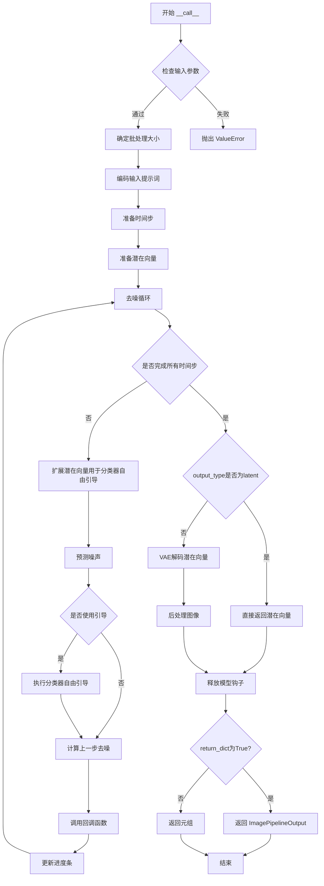

#### 带注释源码

```python
@torch.no_grad()
@replace_example_docstring(EXAMPLE_DOC_STRING)
def __call__(
    self,
    prompt: str | list[str] = None,
    negative_prompt: str | list[str] = None,
    num_inference_steps: int = 50,
    sigmas: list[float] = None,
    guidance_scale: float = 3.5,
    num_images_per_prompt: int | None = 1,
    height: int | None = 1024,
    width: int | None = 1024,
    generator: torch.Generator | list[torch.Generator] | None = None,
    latents: torch.Tensor | None = None,
    prompt_embeds: torch.Tensor | None = None,
    prompt_attention_mask: torch.Tensor | None = None,
    negative_prompt_embeds: torch.Tensor | None = None,
    negative_prompt_attention_mask: torch.Tensor | None = None,
    max_sequence_length: int = 256,
    output_type: str | None = "pil",
    return_dict: bool = True,
    attention_kwargs: dict[str, Any] | None = None,
    callback_on_step_end: Callable[[int, int], None] | PipelineCallback | MultiPipelineCallbacks | None = None,
    callback_on_step_end_tensor_inputs: list[str] = ["latents"],
) -> ImagePipelineOutput | tuple:
    r"""
    Function invoked when calling the pipeline for generation.
    """
    # 1. 检查输入参数，如果不正确则抛出错误
    # 如果未提供height/width，则使用transformer配置的sample_size乘以vae_scale_factor
    height = height or self.transformer.config.sample_size * self.vae_scale_factor
    width = width or self.transformer.config.sample_size * self.vae_scale_factor

    # 验证输入参数的有效性（检查提示词、嵌入维度、回调张量等）
    self.check_inputs(
        prompt,
        height,
        width,
        negative_prompt,
        prompt_embeds,
        negative_prompt_embeds,
        prompt_attention_mask,
        negative_prompt_attention_mask,
        callback_on_step_end_tensor_inputs=callback_on_step_end_tensor_inputs,
    )

    # 保存引导比例和注意力参数供后续使用
    self._guidance_scale = guidance_scale
    self._attention_kwargs = attention_kwargs

    # 2. 确定批处理大小
    # 根据prompt类型或prompt_embeds的形状确定batch_size
    if prompt is not None and isinstance(prompt, str):
        batch_size = 1
    elif prompt is not None and isinstance(prompt, list):
        batch_size = len(prompt)
    else:
        batch_size = prompt_embeds.shape[0]

    # 获取执行设备
    device = self._execution_device
    # 从attention_kwargs中获取LoRA缩放因子
    lora_scale = self.attention_kwargs.get("scale", None) if self.attention_kwargs is not None else None

    # 判断是否使用分类器自由引导（guidance_scale > 1.0）
    # guidance_scale在Imagen论文中类比为权重w
    do_classifier_free_guidance = guidance_scale > 1.0

    # 3. 编码输入提示词
    # 调用encode_prompt方法生成文本嵌入、注意力掩码及无条件嵌入
    (
        prompt_embeds,
        prompt_attention_mask,
        negative_prompt_embeds,
        negative_prompt_attention_mask,
    ) = self.encode_prompt(
        prompt=prompt,
        negative_prompt=negative_prompt,
        do_classifier_free_guidance=do_classifier_free_guidance,
        num_images_per_prompt=num_images_per_prompt,
        device=device,
        prompt_embeds=prompt_embeds,
        negative_prompt_embeds=negative_prompt_embeds,
        prompt_attention_mask=prompt_attention_mask,
        negative_prompt_attention_mask=negative_prompt_attention_mask,
        max_sequence_length=max_sequence_length,
        lora_scale=lora_scale,
    )
    
    # 如果使用引导，将无条件嵌入和条件嵌入在维度0上拼接
    if do_classifier_free_guidance:
        prompt_embeds = torch.cat([negative_prompt_embeds, prompt_embeds], dim=0)

    # 4. 准备时间步
    # 使用retrieve_timesteps获取调度器的时间步
    if XLA_AVAILABLE:
        timestep_device = "cpu"
    else:
        timestep_device = device
    timesteps, num_inference_steps = retrieve_timesteps(
        self.scheduler, num_inference_steps, timestep_device, sigmas=sigmas
    )

    # 5. 准备潜在向量
    # 获取transformer的输入通道数
    latent_channels = self.transformer.config.in_channels
    # 调用prepare_latents方法生成或处理潜在向量
    latents = self.prepare_latents(
        batch_size * num_images_per_prompt,
        latent_channels,
        height,
        width,
        prompt_embeds.dtype,
        device,
        generator,
        latents,
    )

    # 6. 去噪循环
    # 计算预热步数（用于进度条显示）
    num_warmup_steps = max(len(timesteps) - num_inference_steps * self.scheduler.order, 0)
    self._num_timesteps = len(timesteps)
    
    # 使用进度条迭代所有时间步
    with self.progress_bar(total=num_inference_steps) as progress_bar:
        for i, t in enumerate(timesteps):
            # 如果使用分类器自由引导，扩展潜在向量（复制为两份：无条件和条件）
            latent_model_input = torch.cat([latents] * 2) if do_classifier_free_guidance else latents

            # Aura使用0到1之间的时间步值，t=1表示噪声，t=0表示图像
            # 广播到批处理维度以兼容ONNX/Core ML
            timestep = torch.tensor([t / 1000]).expand(latent_model_input.shape[0])
            timestep = timestep.to(latents.device, dtype=latents.dtype)

            # 使用transformer预测噪声
            noise_pred = self.transformer(
                latent_model_input,
                encoder_hidden_states=prompt_embeds,
                timestep=timestep,
                return_dict=False,
                attention_kwargs=self.attention_kwargs,
            )[0]

            # 执行分类器自由引导
            if do_classifier_free_guidance:
                # 将噪声预测分割为无条件预测和条件预测
                noise_pred_uncond, noise_pred_text = noise_pred.chunk(2)
                # 应用引导权重
                noise_pred = noise_pred_uncond + guidance_scale * (noise_pred_text - noise_pred_uncond)

            # 计算上一步的噪声样本 x_t -> x_t-1
            latents = self.scheduler.step(noise_pred, t, latents, return_dict=False)[0]

            # 如果提供了回调函数，在步骤结束时调用
            if callback_on_step_end is not None:
                callback_kwargs = {}
                # 收集回调需要使用的张量
                for k in callback_on_step_end_tensor_inputs:
                    callback_kwargs[k] = locals()[k]
                # 调用回调函数
                callback_outputs = callback_on_step_end(self, i, t, callback_kwargs)

                # 更新latents和prompt_embeds（如果回调返回了新值）
                latents = callback_outputs.pop("latents", latents)
                prompt_embeds = callback_outputs.pop("prompt_embeds", prompt_embeds)

            # 达到最后一个时间步或预热步完成后，每隔scheduler.order步更新进度条
            if i == len(timesteps) - 1 or ((i + 1) > num_warmup_steps and (i + 1) % self.scheduler.order == 0):
                progress_bar.update()

            # 如果使用XLA（Google TPU），标记计算步骤
            if XLA_AVAILABLE:
                xm.mark_step()

    # 7. 根据output_type处理最终输出
    if output_type == "latent":
        # 直接返回潜在向量（不经过VAE解码）
        image = latents
    else:
        # 确保VAE使用float32模式（因为float16会溢出）
        needs_upcasting = self.vae.dtype == torch.float16 and self.vae.config.force_upcast
        if needs_upcasting:
            self.upcast_vae()
            latents = latents.to(next(iter(self.vae.post_quant_conv.parameters())).dtype)
        # 使用VAE解码潜在向量得到图像
        image = self.vae.decode(latents / self.vae.config.scaling_factor, return_dict=False)[0]
        # 后处理图像（转换为PIL或numpy数组）
        image = self.image_processor.postprocess(image, output_type=output_type)

    # 释放所有模型的钩子（用于CPU卸载）
    self.maybe_free_model_hooks()

    # 8. 返回结果
    if not return_dict:
        return (image,)

    return ImagePipelineOutput(images=image)
```


### AuraFlowPipeline.__init__

该方法是 AuraFlowPipeline 类的构造函数，用于初始化管道的主要组件，包括分词器、文本编码器、VAE模型、Transformer模型和调度器，并注册所有模块并配置图像处理器。

参数：

- `tokenizer`：`T5Tokenizer`，T5文本分词器，用于将文本输入转换为token序列
- `text_encoder`：`UMT5EncoderModel`，T5文本编码器模型，用于将token序列编码为文本嵌入
- `vae`：`AutoencoderKL`，变分自编码器模型，用于将图像编码到潜在空间并从潜在空间解码恢复图像
- `transformer`：`AuraFlowTransformer2DModel`，AuraFlow条件变换器模型，用于对图像潜在表示进行去噪
- `scheduler`：`FlowMatchEulerDiscreteScheduler`，流匹配欧拉离散调度器，用于控制去噪过程的采样步骤

返回值：无（`__init__` 方法返回 `None`）

#### 流程图

```mermaid
flowchart TD
    A[开始 __init__] --> B[调用父类构造函数 super().__init__]
    B --> C[调用 register_modules 注册5个模块]
    C --> D[tokenizer, text_encoder, vae, transformer, scheduler]
    D --> E[计算 vae_scale_factor]
    E --> F{self.vae 是否存在?}
    F -->|是| G[vae_scale_factor = 2^(len(vae.config.block_out_channels) - 1)]
    F -->|否| H[vae_scale_factor = 8]
    G --> I[创建 VaeImageProcessor]
    H --> I
    I --> J[结束 __init__]
```

#### 带注释源码

```python
def __init__(
    self,
    tokenizer: T5Tokenizer,
    text_encoder: UMT5EncoderModel,
    vae: AutoencoderKL,
    transformer: AuraFlowTransformer2DModel,
    scheduler: FlowMatchEulerDiscreteScheduler,
):
    """
    初始化 AuraFlowPipeline 管道组件。
    
    参数:
        tokenizer: T5Tokenizer，用于文本分词
        text_encoder: UMT5EncoderModel，用于文本编码
        vae: AutoencoderKL，用于图像编码/解码
        transformer: AuraFlowTransformer2DModel，用于去噪
        scheduler: FlowMatchEulerDiscreteScheduler，用于调度
    """
    # 调用父类 DiffusionPipeline 的初始化方法
    # 父类会设置一些基础属性如 _execution_device, _callback_tensor_inputs 等
    super().__init__()

    # 使用 register_modules 方法注册所有管道组件
    # 该方法来自 DiffusionPipeline 基类，会将各个模块保存为实例属性
    # 同时还会将它们添加到 _optional_components 或必需组件列表中
    self.register_modules(
        tokenizer=tokenizer, 
        text_encoder=text_encoder, 
        vae=vae, 
        transformer=transformer, 
        scheduler=scheduler
    )

    # 计算 VAE 的缩放因子
    # VAE 的缩放因子通常为 2^(num_layers-1)，用于将像素空间映射到潜在空间
    # 例如，如果 VAE 有 [128, 256, 512, 512] 四个输出通道，则缩放因子为 2^3 = 8
    # 使用 getattr 防止 vae 不存在时出错，如果不存在则使用默认值 8
    self.vae_scale_factor = 2 ** (len(self.vae.config.block_out_channels) - 1) if getattr(self, "vae", None) else 8
    
    # 创建 VAE 图像处理器，用于将 VAE 输出的潜码转换为图像
    # 以及将图像转换为 VAE 输入的潜码格式
    self.image_processor = VaeImageProcessor(vae_scale_factor=self.vae_scale_factor)
```


### `AuraFlowPipeline.check_inputs`

验证输入参数的有效性，确保传递给管道生成的参数符合模型要求。如果参数无效，则抛出相应的 `ValueError` 异常。

参数：

- `prompt`：`str | list[str] | None`，用户提供的文本提示词，用于引导图像生成
- `height`：`int`，生成图像的高度（像素）
- `width`：`int`，生成图像的宽度（像素）
- `negative_prompt`：`str | list[str] | None`，负面提示词，用于指导不期望的内容
- `prompt_embeds`：`torch.Tensor | None`，预计算的文本嵌入，可用于替代 prompt
- `negative_prompt_embeds`：`torch.Tensor | None`，预计算的负面文本嵌入
- `prompt_attention_mask`：`torch.Tensor | None`，文本嵌入的注意力掩码
- `negative_prompt_attention_mask`：`torch.Tensor | None`，负面文本嵌入的注意力掩码
- `callback_on_step_end_tensor_inputs`：`list[str] | None`，每步结束时回调函数可以访问的张量输入列表

返回值：`None`，该方法通过抛出 `ValueError` 来表示验证失败，不返回任何值

#### 流程图

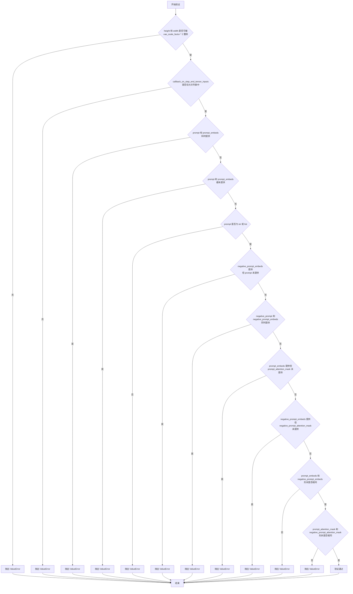

#### 带注释源码

```python
def check_inputs(
    self,
    prompt,                          # 用户提供的文本提示词（str或list[str]或None）
    height,                          # 生成图像的高度（int）
    width,                           # 生成图像的宽度（int）
    negative_prompt,                # 负面提示词（str或list[str]或None）
    prompt_embeds=None,              # 预计算的文本嵌入（torch.Tensor或None）
    negative_prompt_embeds=None,     # 预计算的负面文本嵌入（torch.Tensor或None）
    prompt_attention_mask=None,      # 文本嵌入的注意力掩码（torch.Tensor或None）
    negative_prompt_attention_mask=None,  # 负面文本嵌入的注意力掩码
    callback_on_step_end_tensor_inputs=None,  # 回调函数可访问的张量输入列表
):
    # 验证1：检查 height 和 width 是否能被 vae_scale_factor * 2 整除
    # 这是因为 VAE 的上采样/下采样过程需要尺寸可被 2 的幂次整除
    if height % (self.vae_scale_factor * 2) != 0 or width % (self.vae_scale_factor * 2) != 0:
        raise ValueError(
            f"`height` and `width` have to be divisible by {self.vae_scale_factor * 2} but are {height} and {width}."
        )

    # 验证2：检查 callback_on_step_end_tensor_inputs 中的所有键是否都在允许列表中
    # 允许的回调张量输入：["latents", "prompt_embeds"]
    if callback_on_step_end_tensor_inputs is not None and not all(
        k in self._callback_tensor_inputs for k in callback_on_step_end_tensor_inputs
    ):
        raise ValueError(
            f"`callback_on_step_end_tensor_inputs` has to be in {self._callback_tensor_inputs}, but found {[k for k in callback_on_step_end_tensor_inputs if k not in self._callback_tensor_inputs]}"
        )
    
    # 验证3：prompt 和 prompt_embeds 不能同时提供
    if prompt is not None and prompt_embeds is not None:
        raise ValueError(
            f"Cannot forward both `prompt`: {prompt} and `prompt_embeds`: {prompt_embeds}. Please make sure to"
            " only forward one of the two."
        )
    
    # 验证4：prompt 和 prompt_embeds 不能同时为空
    # 至少需要提供其中一个来生成图像
    elif prompt is None and prompt_embeds is None:
        raise ValueError(
            "Provide either `prompt` or `prompt_embeds`. Cannot leave both `prompt` and `prompt_embeds` undefined."
        )
    
    # 验证5：prompt 必须是 str 或 list 类型
    elif prompt is not None and (not isinstance(prompt, str) and not isinstance(prompt, list)):
        raise ValueError(f"`prompt` has to be of type `str` or `list` but is {type(prompt)}")

    # 验证6：如果提供了 prompt，则不能同时提供 negative_prompt_embeds
    # （应该提供 negative_prompt 而不是 negative_prompt_embeds）
    if prompt is not None and negative_prompt_embeds is not None:
        raise ValueError(
            f"Cannot forward both `prompt`: {prompt} and `negative_prompt_embeds`:"
            f" {negative_prompt_embeds}. Please make sure to only forward one of the two."
        )

    # 验证7：negative_prompt 和 negative_prompt_embeds 不能同时提供
    if negative_prompt is not None and negative_prompt_embeds is not None:
        raise ValueError(
            f"Cannot forward both `negative_prompt`: {negative_prompt} and `negative_prompt_embeds`:"
            f" {negative_prompt_embeds}. Please make sure to only forward one of the two."
        )

    # 验证8：如果提供了 prompt_embeds，则必须同时提供 prompt_attention_mask
    # 因为注意力掩码对于正确的文本编码至关重要
    if prompt_embeds is not None and prompt_attention_mask is None:
        raise ValueError("Must provide `prompt_attention_mask` when specifying `prompt_embeds`.")

    # 验证9：如果提供了 negative_prompt_embeds，则必须同时提供 negative_prompt_attention_mask
    if negative_prompt_embeds is not None and negative_prompt_attention_mask is None:
        raise ValueError("Must provide `negative_prompt_attention_mask` when specifying `negative_prompt_embeds`.")

    # 验证10：prompt_embeds 和 negative_prompt_embeds 形状必须相同
    # 确保正面和负面提示的嵌入维度一致
    if prompt_embeds is not None and negative_prompt_embeds is not None:
        if prompt_embeds.shape != negative_prompt_embeds.shape:
            raise ValueError(
                "`prompt_embeds` and `negative_prompt_embeds` must have the same shape when passed directly, but"
                f" got: `prompt_embeds` {prompt_embeds.shape} != `negative_prompt_embeds`"
                f" {negative_prompt_embeds.shape}."
            )
        
        # 验证11：prompt_attention_mask 和 negative_prompt_attention_mask 形状必须相同
        if prompt_attention_mask.shape != negative_prompt_attention_mask.shape:
            raise ValueError(
                "`prompt_attention_mask` and `negative_prompt_attention_mask` must have the same shape when passed directly, but"
                f" got: `prompt_attention_mask` {prompt_attention_mask.shape} != `negative_prompt_attention_mask`"
                f" {negative_prompt_attention_mask.shape}."
            )
```


### `AuraFlowPipeline.encode_prompt`

该方法负责将文本提示（prompt）和负面提示（negative_prompt）编码为文本编码器（text_encoder）可处理的嵌入向量（embeddings），同时生成对应的注意力掩码（attention_mask），支持分类器自由引导（Classifier-Free Guidance），并可处理LoRA微调 scaling。

参数：

- `prompt`：`str | list[str]`，要编码的文本提示，可以是单个字符串或字符串列表
- `negative_prompt`：`str | list[str]`，负面提示词，用于无引导生成，若不提供则为空字符串
- `do_classifier_free_guidance`：`bool`，是否启用分类器自由引导，默认为 True
- `num_images_per_prompt`：`int`，每个提示词要生成的图像数量，用于批量生成时复制嵌入向量
- `device`：`torch.device | None`，指定计算设备，若为 None 则使用执行设备
- `prompt_embeds`：`torch.Tensor | None`，预生成的提示词嵌入，若提供则直接使用
- `negative_prompt_embeds`：`torch.Tensor | None`，预生成的负面提示词嵌入
- `prompt_attention_mask`：`torch.Tensor | None`，预生成的提示词注意力掩码
- `negative_prompt_attention_mask`：`torch.Tensor | None`，预生成的负面提示词注意力掩码
- `max_sequence_length`：`int`，最大序列长度，默认为 256
- `lora_scale`：`float | None`，LoRA 层的缩放因子，用于调整 LoRA 权重的影响

返回值：`tuple[torch.Tensor, torch.Tensor, torch.Tensor, torch.Tensor]`，返回四个张量：编码后的提示词嵌入、提示词注意力掩码、负面提示词嵌入、负面提示词注意力掩码

#### 流程图

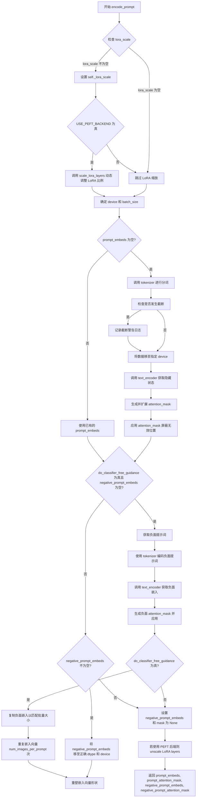

#### 带注释源码

```python
def encode_prompt(
    self,
    prompt: str | list[str],
    negative_prompt: str | list[str] = None,
    do_classifier_free_guidance: bool = True,
    num_images_per_prompt: int = 1,
    device: torch.device | None = None,
    prompt_embeds: torch.Tensor | None = None,
    negative_prompt_embeds: torch.Tensor | None = None,
    prompt_attention_mask: torch.Tensor | None = None,
    negative_prompt_attention_mask: torch.Tensor | None = None,
    max_sequence_length: int = 256,
    lora_scale: float | None = None,
):
    r"""
    Encodes the prompt into text encoder hidden states.

    Args:
        prompt (`str` or `list[str]`, *optional*):
            prompt to be encoded
        negative_prompt (`str` or `list[str]`, *optional*):
            The prompt not to guide the image generation. If not defined, one has to pass `negative_prompt_embeds`
            instead. Ignored when not using guidance (i.e., ignored if `guidance_scale` is less than `1`).
        do_classifier_free_guidance (`bool`, *optional*, defaults to `True`):
            whether to use classifier free guidance or not
        num_images_per_prompt (`int`, *optional*, defaults to 1):
            number of images that should be generated per prompt
        device: (`torch.device`, *optional*):
            torch device to place the resulting embeddings on
        prompt_embeds (`torch.Tensor`, *optional*):
            Pre-generated text embeddings. Can be used to easily tweak text inputs, *e.g.* prompt weighting. If not
            provided, text embeddings will be generated from `prompt` input argument.
        prompt_attention_mask (`torch.Tensor`, *optional*):
            Pre-generated attention mask for text embeddings.
        negative_prompt_embeds (`torch.Tensor`, *optional*):
            Pre-generated negative text embeddings.
        negative_prompt_attention_mask (`torch.Tensor`, *optional*):
            Pre-generated attention mask for negative text embeddings.
        max_sequence_length (`int`, defaults to 256): Maximum sequence length to use for the prompt.
        lora_scale (`float`, *optional*):
            A lora scale that will be applied to all LoRA layers of the text encoder if LoRA layers are loaded.
    """
    # 设置 LoRA 缩放因子，以便 text_encoder 的 monkey patched LoRA 函数可以正确访问
    if lora_scale is not None and isinstance(self, AuraFlowLoraLoaderMixin):
        self._lora_scale = lora_scale

        # 动态调整 LoRA 缩放比例
        if self.text_encoder is not None and USE_PEFT_BACKEND:
            scale_lora_layers(self.text_encoder, lora_scale)

    # 如果未指定 device，则使用执行设备
    if device is None:
        device = self._execution_device
    
    # 根据 prompt 类型确定批量大小
    if prompt is not None and isinstance(prompt, str):
        batch_size = 1
    elif prompt is not None and isinstance(prompt, list):
        batch_size = len(prompt)
    else:
        batch_size = prompt_embeds.shape[0]

    # 设置最大序列长度
    max_length = max_sequence_length
    
    # 如果未提供 prompt_embeds，则从 prompt 生成
    if prompt_embeds is None:
        # 使用 tokenizer 对 prompt 进行分词
        text_inputs = self.tokenizer(
            prompt,
            truncation=True,
            max_length=max_length,
            padding="max_length",
            return_tensors="pt",
        )
        text_input_ids = text_inputs["input_ids"]
        
        # 获取未截断的输入用于检测截断
        untruncated_ids = self.tokenizer(prompt, padding="longest", return_tensors="pt").input_ids

        # 检查是否发生了截断
        if untruncated_ids.shape[-1] >= text_input_ids.shape[-1] and not torch.equal(
            text_input_ids, untruncated_ids
        ):
            # 解码被截断的部分并记录警告
            removed_text = self.tokenizer.batch_decode(untruncated_ids[:, max_length - 1 : -1])
            logger.warning(
                "The following part of your input was truncated because T5 can only handle sequences up to"
                f" {max_length} tokens: {removed_text}"
            )

        # 将分词结果移至指定设备
        text_inputs = {k: v.to(device) for k, v in text_inputs.items()}
        
        # 通过 text_encoder 获取文本嵌入
        prompt_embeds = self.text_encoder(**text_inputs)[0]
        
        # 生成 attention mask 并扩展到与 prompt_embeds 相同的形状
        prompt_attention_mask = text_inputs["attention_mask"].unsqueeze(-1).expand(prompt_embeds.shape)
        
        # 应用 attention mask 屏蔽无效位置
        prompt_embeds = prompt_embeds * prompt_attention_mask

    # 确定数据类型（优先使用 text_encoder 的 dtype，其次使用 transformer 的 dtype）
    if self.text_encoder is not None:
        dtype = self.text_encoder.dtype
    elif self.transformer is not None:
        dtype = self.transformer.dtype
    else:
        dtype = None

    # 将 prompt_embeds 转换为正确的 dtype 和 device
    prompt_embeds = prompt_embeds.to(dtype=dtype, device=device)

    # 获取批量嵌入的形状信息
    bs_embed, seq_len, _ = prompt_embeds.shape
    
    # 为每个提示词生成的图像复制文本嵌入（使用 MPS 友好的方法）
    prompt_embeds = prompt_embeds.repeat(1, num_images_per_prompt, 1)
    prompt_embeds = prompt_embeds.view(bs_embed * num_images_per_prompt, seq_len, -1)
    
    # 复制并重塑 attention mask
    prompt_attention_mask = prompt_attention_mask.reshape(bs_embed, -1)
    prompt_attention_mask = prompt_attention_mask.repeat(num_images_per_prompt, 1)

    # 获取无分类器自由引导的 unconditional embeddings
    if do_classifier_free_guidance and negative_prompt_embeds is None:
        # 如果未提供 negative_prompt，则使用空字符串
        negative_prompt = negative_prompt or ""
        
        # 准备 negative tokens
        uncond_tokens = [negative_prompt] * batch_size if isinstance(negative_prompt, str) else negative_prompt
        
        # 使用与 prompt_embeds 相同的序列长度
        max_length = prompt_embeds.shape[1]
        
        # 对负面提示进行分词
        uncond_input = self.tokenizer(
            uncond_tokens,
            truncation=True,
            max_length=max_length,
            padding="max_length",
            return_tensors="pt",
        )
        
        # 移至设备
        uncond_input = {k: v.to(device) for k, v in uncond_input.items()}
        
        # 获取负面提示嵌入
        negative_prompt_embeds = self.text_encoder(**uncond_input)[0]
        
        # 生成并应用负面 attention mask
        negative_prompt_attention_mask = (
            uncond_input["attention_mask"].unsqueeze(-1).expand(negative_prompt_embeds.shape)
        )
        negative_prompt_embeds = negative_prompt_embeds * negative_prompt_attention_mask

    # 如果启用分类器自由引导，处理负面嵌入
    if do_classifier_free_guidance:
        # 获取序列长度
        seq_len = negative_prompt_embeds.shape[1]

        # 转换数据类型和设备
        negative_prompt_embeds = negative_prompt_embeds.to(dtype=dtype, device=device)

        # 为每个提示词复制 unconditional embeddings
        negative_prompt_embeds = negative_prompt_embeds.repeat(1, num_images_per_prompt, 1)
        negative_prompt_embeds = negative_prompt_embeds.view(batch_size * num_images_per_prompt, seq_len, -1)

        # 复制并重塑负面 attention mask
        negative_prompt_attention_mask = negative_prompt_attention_mask.reshape(bs_embed, -1)
        negative_prompt_attention_mask = negative_prompt_attention_mask.repeat(num_images_per_prompt, 1)
    else:
        # 如果不启用引导，则将负面嵌入和 mask 设为 None
        negative_prompt_embeds = None
        negative_prompt_attention_mask = None

    # 如果使用 PEFT 后端，恢复 LoRA 层的原始缩放比例
    if self.text_encoder is not None:
        if isinstance(self, AuraFlowLoraLoaderMixin) and USE_PEFT_BACKEND:
            # 通过 unscale LoRA layers 恢复原始比例
            unscale_lora_layers(self.text_encoder, lora_scale)

    # 返回编码后的嵌入和 attention masks
    return prompt_embeds, prompt_attention_mask, negative_prompt_embeds, negative_prompt_attention_mask
```


### `AuraFlowPipeline.prepare_latents`

该函数是 AuraFlow 图像生成流水线的核心组件之一，负责为扩散模型准备初始的潜在向量（latents）。如果调用者已提供了潜在向量，则直接将其移动到指定的设备和数据类型；否则，根据批处理大小、通道数、图像高度和宽度计算潜在空间的形状，并使用随机张量生成器初始化噪声潜在向量。

参数：

- `self`：隐含参数，指向 `AuraFlowPipeline` 实例本身
- `batch_size`：隐含参数，生成图像的批处理大小
- `num_channels_latents`：隐含参数，潜在向量的通道数，通常对应于 transformer 模型输入通道数
- `height`：隐含参数，目标图像的高度（像素单位）
- `width`：隐含参数，目标图像的宽度（像素单位）
- `dtype`：隐含参数，目标数据类型（如 `torch.float16` 或 `torch.float32`）
- `device`：隐含参数，目标设备（如 `"cuda"` 或 `"cpu"`）
- `generator`：隐含参数，随机数生成器，用于确保生成过程的可重复性
- `latents`：隐含参数，可选的预生成潜在向量，默认为 `None`

返回值：`torch.Tensor`，处理或生成后的潜在向量张量

#### 流程图

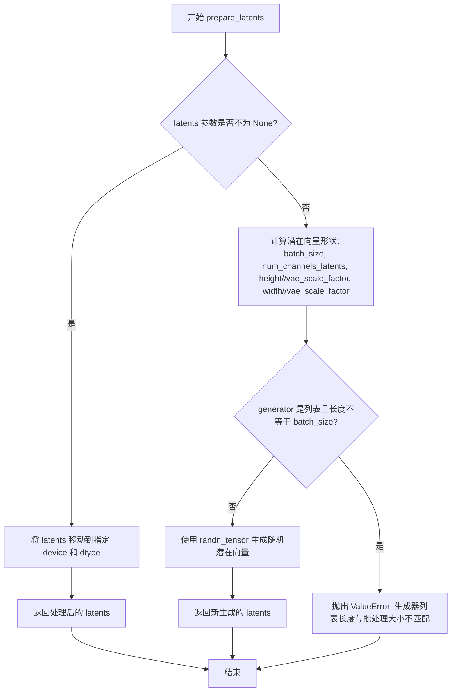

#### 带注释源码

```python
def prepare_latents(
    self,
    batch_size,
    num_channels_latents,
    height,
    width,
    dtype,
    device,
    generator,
    latents=None,
):
    # 如果调用者已提供潜在向量，则直接将其移动到目标设备和数据类型
    # 这允许用户复用之前生成的潜在向量进行调试或多次采样
    if latents is not None:
        return latents.to(device=device, dtype=dtype)

    # 计算潜在向量的空间维度
    # VAE 的缩放因子用于将像素空间转换为潜在空间
    # 例如：如果 vae_scale_factor=8，则 1024x1024 的图像对应 128x128 的潜在空间
    shape = (
        batch_size,
        num_channels_latents,
        int(height) // self.vae_scale_factor,
        int(width) // self.vae_scale_factor,
    )

    # 验证生成器列表的长度是否与批处理大小匹配
    # 每个批次元素可以使用独立的随机生成器以实现更细粒度的控制
    if isinstance(generator, list) and len(generator) != batch_size:
        raise ValueError(
            f"You have passed a list of generators of length {len(generator)}, but requested an effective batch"
            f" size of {batch_size}. Make sure the batch size matches the length of the generators."
        )

    # 使用 randn_tensor 生成符合标准正态分布的随机潜在向量
    # 这是扩散模型去噪过程的起点，代表纯噪声状态
    latents = randn_tensor(shape, generator=generator, device=device, dtype=dtype)

    return latents
```

#### 设计分析与补充说明

**设计目标与约束：**
- 该函数遵循扩散模型的标准实践，从纯噪声开始去噪过程
- 支持两种初始化方式：用户提供的潜在向量或随机生成的噪声
- 通过 `vae_scale_factor` 实现像素空间与潜在空间的自动转换

**错误处理与异常设计：**
- 当 `generator` 参数为列表且长度与 `batch_size` 不匹配时，抛出 `ValueError` 明确指出问题
- 缺少对其他参数（如 `batch_size` 为负数或零）的验证

**外部依赖与接口契约：**
- 依赖 `randn_tensor` 工具函数生成随机张量
- 依赖 `self.vae_scale_factor` 属性，该属性在 `__init__` 中根据 VAE 配置计算得出

**潜在技术债务与优化空间：**
1. **缺少类型注解**：所有参数都未标注类型注解（Type Hints），降低了代码可读性和 IDE 辅助功能
2. **缺乏文档字符串**：函数没有 docstring 说明参数含义和返回值
3. **参数验证不足**：未验证 `height` 和 `width` 是否为正数、`dtype` 是否为有效类型等


### `AuraFlowPipeline.upcast_vae`

该方法是一个已废弃的辅助方法，原本用于将VAE（变分自编码器）强制转换为float32数据类型，以避免在float16模式下解码时发生溢出问题。由于该方法存在已知问题，现已标记为废弃，推荐用户直接使用 `pipe.vae.to(torch.float32)` 来替代。

参数：无（仅包含self参数）

返回值：`None`，无返回值

#### 流程图

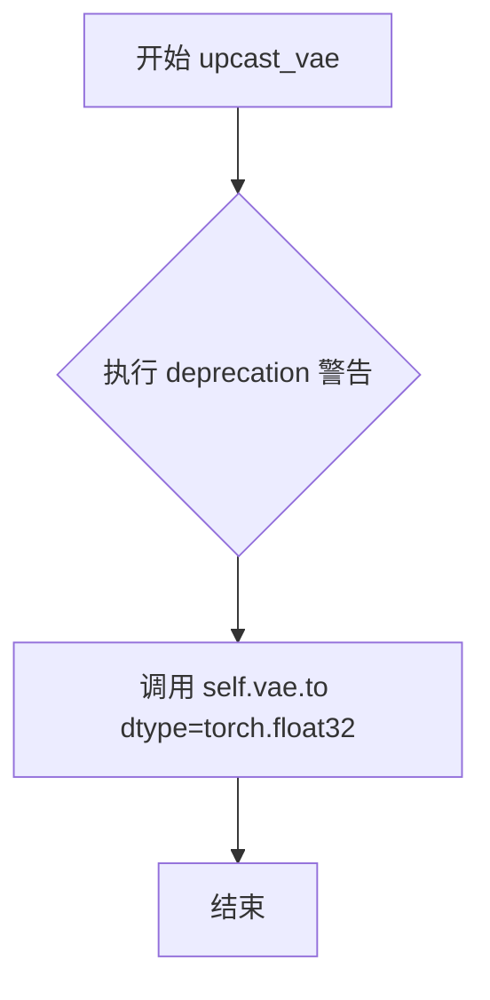

#### 带注释源码

```python
def upcast_vae(self):
    """
    将 VAE 模型转换为 float32 类型。
    
    注意：此方法已废弃，请在需要时直接使用 pipe.vae.to(torch.float32)。
    """
    # 发出废弃警告，提示用户该方法将在 1.0.0 版本移除
    # 并提供替代方案和相关的 GitHub PR 链接供用户参考
    deprecate(
        "upcast_vae",                           # 方法名称
        "1.0.0",                                 # 废弃版本号
        "`upcast_vae` is deprecated. Please use `pipe.vae.to(torch.float32)`. For more details, please refer to: https://github.com/huggingface/diffusers/pull/12619#issue-3606633695.",
    )
    # 将 VAE 模型强制转换为 float32 数据类型
    # 这是为了避免在 float16 模式下解码时发生数值溢出
    self.vae.to(dtype=torch.float32)
```


### AuraFlowPipeline.__call__

主生成方法，执行完整的扩散流程，将文本提示转换为图像。该方法封装了从输入验证、提示编码、潜在向量准备、去噪循环到最终图像解码的完整图像生成pipeline。

参数：

- `prompt`：`str | list[str]`，要引导图像生成的提示词，若未定义则需传递prompt_embeds
- `negative_prompt`：`str | list[str]`，不引导图像生成的提示词，若未定义则需传递negative_prompt_embeds
- `height`：`int | None`，生成图像的高度（像素），默认为transformer.config.sample_size * self.vae_scale_factor
- `width`：`int | None`，生成图像的宽度（像素），默认为transformer.config.sample_size * self.vae_scale_factor
- `num_inference_steps`：`int`，去噪步数，步数越多通常图像质量越高但推理越慢，默认50
- `sigmas`：`list[float]`，用于覆盖调度器时间步间隔策略的自定义sigma，若传递此参数则num_inference_steps和timesteps必须为None
- `guidance_scale`：`float`，分类器自由引导（CFG）尺度，值越大越接近文本提示，默认3.5
- `num_images_per_prompt`：`int`，每个提示词生成的图像数量，默认1
- `generator`：`torch.Generator | list[torch.Generator]`，用于使生成确定性的随机生成器
- `latents`：`torch.FloatTensor`，预生成的噪声潜在向量，若不提供则使用随机generator生成
- `prompt_embeds`：`torch.FloatTensor`，预生成的文本嵌入，可用于轻松调整文本输入
- `prompt_attention_mask`：`torch.Tensor`，预生成的文本嵌入注意力掩码
- `negative_prompt_embeds`：`torch.FloatTensor`，预生成的负面文本嵌入
- `negative_prompt_attention_mask`：`torch.Tensor`，预生成的负面文本嵌入注意力掩码
- `output_type`：`str`，生成图像的输出格式，可选"pil"或"np.array"，默认"pil"
- `return_dict`：`bool`，是否返回ImagePipelineOutput而非元组，默认True
- `attention_kwargs`：`dict[str, Any] | None`，传递给AttentionProcessor的参数字典
- `callback_on_step_end`：`Callable | PipelineCallback | MultiPipelineCallbacks | None`，每个去噪步骤结束时调用的函数
- `callback_on_step_end_tensor_inputs`：`list[str]`，callback_on_step_end函数使用的张量输入列表，默认["latents"]
- `max_sequence_length`：`int`，提示词使用的最大序列长度，默认256

返回值：`ImagePipelineOutput | tuple`，若return_dict为True返回ImagePipelineOutput（包含images列表），否则返回元组（第一个元素为生成的图像列表）

#### 流程图

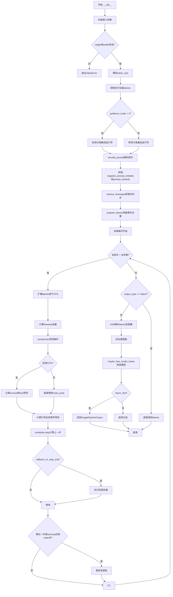

#### 带注释源码

```python
@torch.no_grad()
@replace_example_docstring(EXAMPLE_DOC_STRING)
def __call__(
    self,
    prompt: str | list[str] = None,
    negative_prompt: str | list[str] = None,
    num_inference_steps: int = 50,
    sigmas: list[float] = None,
    guidance_scale: float = 3.5,
    num_images_per_prompt: int | None = 1,
    height: int | None = 1024,
    width: int | None = 1024,
    generator: torch.Generator | list[torch.Generator] | None = None,
    latents: torch.Tensor | None = None,
    prompt_embeds: torch.Tensor | None = None,
    prompt_attention_mask: torch.Tensor | None = None,
    negative_prompt_embeds: torch.Tensor | None = None,
    negative_prompt_attention_mask: torch.Tensor | None = None,
    max_sequence_length: int = 256,
    output_type: str | None = "pil",
    return_dict: bool = True,
    attention_kwargs: dict[str, Any] | None = None,
    callback_on_step_end: Callable[[int, int], None] | PipelineCallback | MultiPipelineCallbacks | None = None,
    callback_on_step_end_tensor_inputs: list[str] = ["latents"],
) -> ImagePipelineOutput | tuple:
    r"""
    Function invoked when calling the pipeline for generation.

    Args:
        prompt (`str` or `list[str]`, *optional*):
            The prompt or prompts to guide the image generation. If not defined, one has to pass `prompt_embeds`.
            instead.
        negative_prompt (`str` or `list[str]`, *optional*):
            The prompt or prompts not to guide the image generation. If not defined, one has to pass
            `negative_prompt_embeds` instead. Ignored when not using guidance (i.e., ignored if `guidance_scale` is
            less than `1`).
        height (`int`, *optional*, defaults to self.transformer.config.sample_size * self.vae_scale_factor):
            The height in pixels of the generated image. This is set to 1024 by default for best results.
        width (`int`, *optional*, defaults to self.transformer.config.sample_size * self.vae_scale_factor):
            The width in pixels of the generated image. This is set to 1024 by default for best results.
        num_inference_steps (`int`, *optional*, defaults to 50):
            The number of denoising steps. More denoising steps usually lead to a higher quality image at the
            expense of slower inference.
        sigmas (`list[float]`, *optional*):
            Custom sigmas used to override the timestep spacing strategy of the scheduler. If `sigmas` is passed,
            `num_inference_steps` and `timesteps` must be `None`.
        guidance_scale (`float`, *optional*, defaults to 5.0):
            Guidance scale as defined in [Classifier-Free Diffusion
            Guidance](https://huggingface.co/papers/2207.12598). `guidance_scale` is defined as `w` of equation 2.
            of [Imagen Paper](https://huggingface.co/papers/2205.11487). Guidance scale is enabled by setting
            `guidance_scale > 1`. Higher guidance scale encourages to generate images that are closely linked to
            the text `prompt`, usually at the expense of lower image quality.
        num_images_per_prompt (`int`, *optional*, defaults to 1):
            The number of images to generate per prompt.
        generator (`torch.Generator` or `list[torch.Generator]`, *optional*):
            One or a list of [torch generator(s)](https://pytorch.org/docs/stable/generated/torch.Generator.html)
            to make generation deterministic.
        latents (`torch.FloatTensor`, *optional*):
            Pre-generated noisy latents, sampled from a Gaussian distribution, to be used as inputs for image
            generation. Can be used to tweak the same generation with different prompts. If not provided, a latents
            tensor will be generated by sampling using the supplied random `generator`.
        prompt_embeds (`torch.FloatTensor`, *optional*):
            Pre-generated text embeddings. Can be used to easily tweak text inputs, *e.g.* prompt weighting. If not
            provided, text embeddings will be generated from `prompt` input argument.
        prompt_attention_mask (`torch.Tensor`, *optional*):
            Pre-generated attention mask for text embeddings.
        negative_prompt_embeds (`torch.FloatTensor`, *optional*):
            Pre-generated negative text embeddings. Can be used to easily tweak text inputs, *e.g.* prompt
            weighting. If not provided, negative_prompt_embeds will be generated from `negative_prompt` input
            argument.
        negative_prompt_attention_mask (`torch.Tensor`, *optional*):
            Pre-generated attention mask for negative text embeddings.
        output_type (`str`, *optional*, defaults to `"pil"`):
            The output format of the generate image. Choose between
            [PIL](https://pillow.readthedocs.io/en/stable/): `PIL.Image.Image` or `np.array`.
        return_dict (`bool`, *optional*, defaults to `True`):
            Whether or not to return a [`~pipelines.stable_diffusion_xl.StableDiffusionXLPipelineOutput`] instead
            of a plain tuple.
        attention_kwargs (`dict`, *optional*):
            A kwargs dictionary that if specified is passed along to the `AttentionProcessor` as defined under
            `self.processor` in
            [diffusers.models.attention_processor](https://github.com/huggingface/diffusers/blob/main/src/diffusers/models/attention_processor.py).
        callback_on_step_end (`Callable`, *optional*):
            A function that calls at the end of each denoising steps during the inference. The function is called
            with the following arguments: `callback_on_step_end(self: DiffusionPipeline, step: int, timestep: int,
            callback_kwargs: Dict)`. `callback_kwargs` will include a list of all tensors as specified by
            `callback_on_step_end_tensor_inputs`.
        callback_on_step_end_tensor_inputs (`list`, *optional*):
            The list of tensor inputs for the `callback_on_step_end` function. The tensors specified in the list
            will be passed as `callback_kwargs` argument. You will only be able to include variables listed in the
            `._callback_tensor_inputs` attribute of your pipeline class.
        max_sequence_length (`int` defaults to 256): Maximum sequence length to use with the `prompt`.

    Examples:

    Returns: [`~pipelines.ImagePipelineOutput`] or `tuple`:
        If `return_dict` is `True`, [`~pipelines.ImagePipelineOutput`] is returned, otherwise a `tuple` is returned
        where the first element is a list with the generated images.
    """
    # 1. Check inputs. Raise error if not correct
    # 如果未指定height和width，则使用transformer配置中的sample_size乘以vae_scale_factor计算默认值
    height = height or self.transformer.config.sample_size * self.vae_scale_factor
    width = width or self.transformer.config.sample_size * self.vae_scale_factor

    # 验证输入参数的有效性，包括height/width可被vae_scale_factor*2整除、prompt和prompt_embeds不能同时提供等
    self.check_inputs(
        prompt,
        height,
        width,
        negative_prompt,
        prompt_embeds,
        negative_prompt_embeds,
        prompt_attention_mask,
        negative_prompt_attention_mask,
        callback_on_step_end_tensor_inputs=callback_on_step_end_tensor_inputs,
    )

    # 保存引导尺度和注意力参数供后续使用
    self._guidance_scale = guidance_scale
    self._attention_kwargs = attention_kwargs

    # 2. Determine batch size.
    # 根据prompt类型确定批处理大小：字符串为1，列表为列表长度，否则使用prompt_embeds的batch维度
    if prompt is not None and isinstance(prompt, str):
        batch_size = 1
    elif prompt is not None and isinstance(prompt, list):
        batch_size = len(prompt)
    else:
        batch_size = prompt_embeds.shape[0]

    # 获取执行设备（GPU/CPU）
    device = self._execution_device
    # 从attention_kwargs中提取lora_scale，如果没有提供attention_kwargs则默认为None
    lora_scale = self.attention_kwargs.get("scale", None) if self.attention_kwargs is not None else None

    # 这里`guidance_scale`类似于Imagen论文中方程(2)定义的权重`w`：
    # `guidance_scale = 1` 表示不使用分类器自由引导
    do_classifier_free_guidance = guidance_scale > 1.0

    # 3. Encode input prompt
    # 调用encode_prompt方法将文本提示编码为文本嵌入
    (
        prompt_embeds,
        prompt_attention_mask,
        negative_prompt_embeds,
        negative_prompt_attention_mask,
    ) = self.encode_prompt(
        prompt=prompt,
        negative_prompt=negative_prompt,
        do_classifier_free_guidance=do_classifier_free_guidance,
        num_images_per_prompt=num_images_per_prompt,
        device=device,
        prompt_embeds=prompt_embeds,
        negative_prompt_embeds=negative_prompt_embeds,
        prompt_attention_mask=prompt_attention_mask,
        negative_prompt_attention_mask=negative_prompt_attention_mask,
        max_sequence_length=max_sequence_length,
        lora_scale=lora_scale,
    )
    # 如果启用CFG，将无条件嵌入和条件嵌入在batch维度上拼接
    if do_classifier_free_guidance:
        prompt_embeds = torch.cat([negative_prompt_embeds, prompt_embeds], dim=0)

    # 4. Prepare timesteps
    # 根据是否支持XLA选择timestep设备，XLA情况下使用CPU
    if XLA_AVAILABLE:
        timestep_device = "cpu"
    else:
        timestep_device = device
    # 调用retrieve_timesteps获取调度器的时间步
    timesteps, num_inference_steps = retrieve_timesteps(
        self.scheduler, num_inference_steps, timestep_device, sigmas=sigmas
    )

    # 5. Prepare latents.
    # 获取transformer的输入通道数
    latent_channels = self.transformer.config.in_channels
    # 准备初始噪声潜在向量
    latents = self.prepare_latents(
        batch_size * num_images_per_prompt,
        latent_channels,
        height,
        width,
        prompt_embeds.dtype,
        device,
        generator,
        latents,
    )

    # 6. Denoising loop
    # 计算预热步数（用于进度条显示）
    num_warmup_steps = max(len(timesteps) - num_inference_steps * self.scheduler.order, 0)
    # 保存总时间步数供属性访问使用
    self._num_timesteps = len(timesteps)
    # 创建进度条并开始去噪循环
    with self.progress_bar(total=num_inference_steps) as progress_bar:
        for i, t in enumerate(timesteps):
            # 如果启用CFG，扩展latents以同时处理无条件和有条件预测
            latent_model_input = torch.cat([latents] * 2) if do_classifier_free_guidance else latents

            # Aura使用0到1之间的时间步，t=1表示噪声，t=0表示图像
            # 广播到batch维度以兼容ONNX/Core ML
            timestep = torch.tensor([t / 1000]).expand(latent_model_input.shape[0])
            timestep = timestep.to(latents.device, dtype=latents.dtype)

            # 使用transformer预测噪声
            noise_pred = self.transformer(
                latent_model_input,
                encoder_hidden_states=prompt_embeds,
                timestep=timestep,
                return_dict=False,
                attention_kwargs=self.attention_kwargs,
            )[0]

            # 执行引导：分离无条件预测和条件预测，计算引导后的噪声
            if do_classifier_free_guidance:
                noise_pred_uncond, noise_pred_text = noise_pred.chunk(2)
                noise_pred = noise_pred_uncond + guidance_scale * (noise_pred_text - noise_pred_uncond)

            # 计算前一个噪声样本 x_t -> x_t-1
            latents = self.scheduler.step(noise_pred, t, latents, return_dict=False)[0]

            # 如果提供了回调，在每步结束时执行
            if callback_on_step_end is not None:
                callback_kwargs = {}
                for k in callback_on_step_end_tensor_inputs:
                    callback_kwargs[k] = locals()[k]
                callback_outputs = callback_on_step_end(self, i, t, callback_kwargs)

                # 更新latents和prompt_embeds（如果回调返回了这些值）
                latents = callback_outputs.pop("latents", latents)
                prompt_embeds = callback_outputs.pop("prompt_embeds", prompt_embeds)

            # 调用回调（如果提供），在最后一步或预热后每scheduler.order步更新进度条
            if i == len(timesteps) - 1 or ((i + 1) > num_warmup_steps and (i + 1) % self.scheduler.order == 0):
                progress_bar.update()

            # 如果使用XLA，标记计算步骤
            if XLA_AVAILABLE:
                xm.mark_step()

    # 7. 处理输出
    # 如果output_type为"latent"，直接返回latents
    if output_type == "latent":
        image = latents
    else:
        # 确保VAE在float32模式运行，因为它在float16时会发生溢出
        needs_upcasting = self.vae.dtype == torch.float16 and self.vae.config.force_upcast
        if needs_upcasting:
            self.upcast_vae()
            latents = latents.to(next(iter(self.vae.post_quant_conv.parameters())).dtype)
        # 使用VAE解码latents到图像
        image = self.vae.decode(latents / self.vae.config.scaling_factor, return_dict=False)[0]
        # 后处理图像（转换为PIL或numpy数组）
        image = self.image_processor.postprocess(image, output_type=output_type)

    # 8. Offload all models
    # 释放所有模型的钩子
    self.maybe_free_model_hooks()

    # 9. 返回结果
    if not return_dict:
        return (image,)

    return ImagePipelineOutput(images=image)
```


### `AuraFlowPipeline.guidance_scale`

获取引导强度（Guidance Scale），该属性用于控制分类器自由引导（Classifier-Free Guidance）的强度，值越大生成的图像与文本提示越相关，但可能导致图像质量下降。

参数：

- 无参数（属性访问）

返回值：`float`，返回当前设置的引导强度值。

#### 流程图

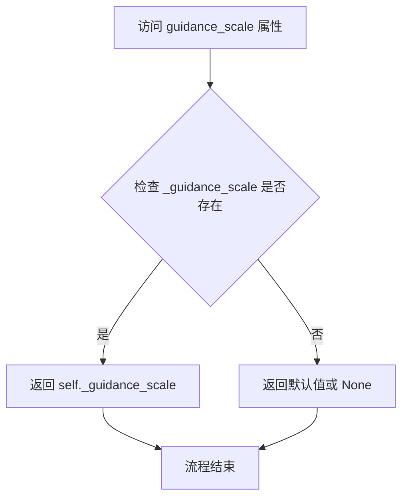

#### 带注释源码

```python
@property
def guidance_scale(self):
    """
    获取引导强度属性。
    
    Guidance Scale 是分类器自由引导（Classifier-Free Diffusion Guidance）中的权重参数，
    在 __call__ 方法中通过 guidance_scale 参数设置并存储在 self._guidance_scale 中。
    该值控制文本提示对图像生成的影响力，值越高生成的图像与提示越紧密相关。
    
    返回值:
        float: 当前使用的引导强度值。该值在 pipeline 调用时由用户指定，
              默认值为 3.5（在 __call__ 方法中定义）。
    """
    return self._guidance_scale
```

---

**补充说明：**

| 项目 | 说明 |
|------|------|
| **定义位置** | `AuraFlowPipeline` 类内部 |
| **关联属性** | `self._guidance_scale` - 在 `__call__` 方法中通过 `self._guidance_scale = guidance_scale` 进行赋值 |
| **默认值** | 3.5（在 `__call__` 方法参数中定义） |
| **使用场景** | 在 `__call__` 方法的去噪循环中用于计算 `noise_pred = noise_pred_uncond + guidance_scale * (noise_pred_text - noise_pred_uncond)` |


### `AuraFlowPipeline.attention_kwargs`

该属性是一个只读的 `@property` 方法，用于获取在调用 pipeline 生成图像时传递的注意力参数（attention_kwargs）。它返回在 `__call__` 方法中设置的 `_attention_kwargs` 字典，该字典包含传递给 `AttentionProcessor` 的额外关键字参数。

参数：无（这是一个属性 getter，不接受任何参数）

返回值：`dict[str, Any] | None`，返回传递给 pipeline 调用（`__call__`）的注意力参数字典，如果未传递则返回 `None`

#### 流程图

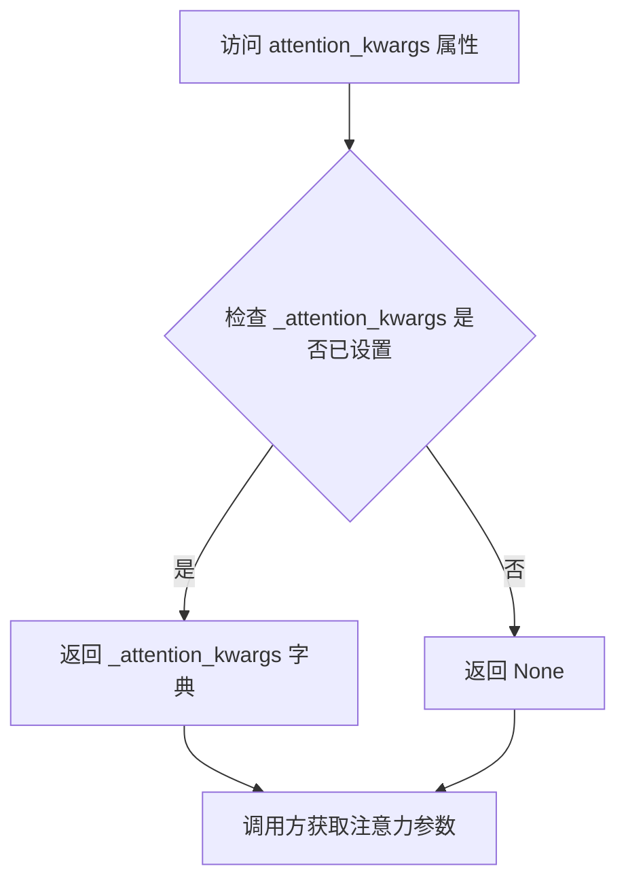

#### 带注释源码

```python
@property
def attention_kwargs(self):
    """
    属性getter：获取注意力参数字典
    
    该属性返回在调用 __call__ 方法时传递的 attention_kwargs 参数。
    这些参数会被传递给 transformer 模型中的 AttentionProcessor，用于
    控制注意力机制的各种行为（例如：缩放因子、注意力模式等）。
    
    返回:
        dict[str, Any] | None: 注意力参数字典，如果未设置则为 None
    """
    return self._attention_kwargs
```

---

**补充说明：**

`attention_kwargs` 属性在 pipeline 执行流程中的作用：

1. **设置时机**：在 `AuraFlowPipeline.__call__()` 方法中被初始化：
   ```python
   self._attention_kwargs = attention_kwargs
   ```

2. **使用时机**：在去噪循环中传递给 transformer 模型：
   ```python
   noise_pred = self.transformer(
       latent_model_input,
       encoder_hidden_states=prompt_embeds,
       timestep=timestep,
       return_dict=False,
       attention_kwargs=self.attention_kwargs,  # <-- 在这里使用
   )[0]
   ```

3. **获取 Lora 缩放因子**：pipeline 还会从 `attention_kwargs` 中提取 `scale` 参数用于 LoRA 控制：
   ```python
   lora_scale = self.attention_kwargs.get("scale", None) if self.attention_kwargs is not None else None
   ```


### `AuraFlowPipeline.num_timesteps`

获取扩散管道的时间步数属性。该属性返回在图像生成过程中使用的时间步总数，即去噪步骤的数量。

参数：

- （无参数）

返回值：`int`，返回扩散管道的时间步数量，即去噪循环中所使用的时间步总数。

#### 流程图

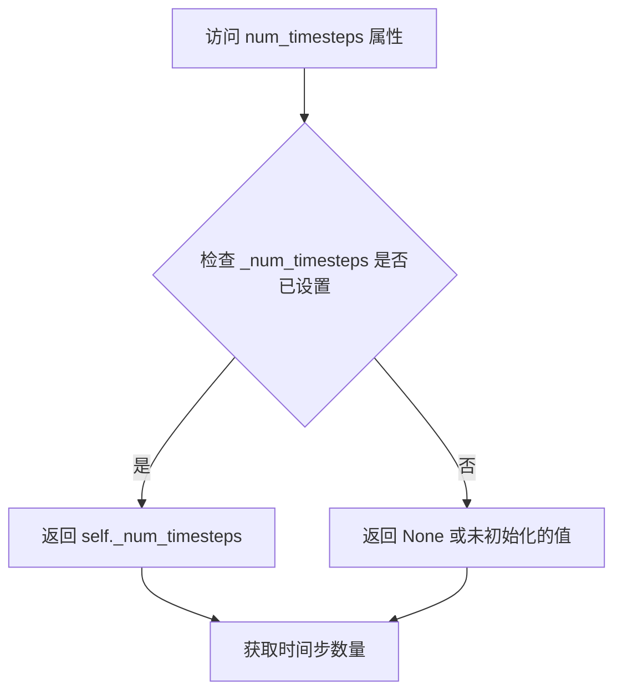

#### 带注释源码

```python
@property
def num_timesteps(self):
    """
    属性：获取时间步数
    
    该属性返回扩散管道在生成图像时所使用的时间步总数。
    _num_timesteps 在 __call__ 方法中被设置为 len(timesteps)，
    即时间步列表的长度，代表去噪循环的迭代次数。
    
    返回:
        int: 时间步的数量
    """
    return self._num_timesteps
```

#### 相关上下文源码

在 `__call__` 方法中，该属性值被初始化的位置：

```python
# 在去噪循环开始前设置时间步数
self._num_timesteps = len(timesteps)
```

## 关键组件


### AuraFlowPipeline

主扩散Pipeline类，集成了文本编码器、VAE和Transformer模型，负责协调图像生成的整体流程，继承自DiffusionPipeline和AuraFlowLoraLoaderMixin以支持LoRA加载功能。

### retrieve_timesteps

辅助函数，用于从调度器获取时间步序列，支持自定义时间步和sigmas参数，并处理调度器的set_timesteps方法调用。

### encode_prompt

文本编码方法，将输入提示词转换为文本嵌入向量，支持分类器自由引导(Classifier-Free Guidance)，处理T5Tokenizer分词和文本编码器的推理。

### prepare_latents

潜在变量准备方法，根据批大小、通道数和图像尺寸生成或处理噪声潜在变量，支持外部传入的latents和随机生成器。

### check_inputs

输入验证方法，检查提示词、嵌入向量和注意力掩码的合法性，确保高度和宽度符合VAE缩放因子的要求。

### VaeImageProcessor

VAE图像后处理器，负责将VAE解码后的潜在变量转换为PIL图像或numpy数组格式。

### FlowMatchEulerDiscreteScheduler

流匹配欧拉离散调度器，用于在去噪循环中计算上一步的潜在变量。

### AuraFlowTransformer2DModel

条件Transformer架构（MMDiT和DiT），负责对编码后的图像潜在变量进行去噪处理。

### AutoencoderKL

变分自编码器模型，负责将图像编码到潜在空间并从潜在空间解码恢复图像。

### T5Tokenizer & UMT5EncoderModel

T5分词器和文本编码器模型，用于将文本提示转换为文本嵌入向量。

### 分类器自由引导 (Classifier-Free Guidance)

在__call__方法中实现的引导机制，通过组合条件和非条件噪声预测来提高生成图像与文本提示的一致性。

### LoRA支持机制

通过AuraFlowLoraLoaderMixin和scale_lora_layers/unscale_lora_layers函数实现LoRA权重的动态调整。

### 多模型CPU卸载顺序

model_cpu_offload_seq定义了text_encoder->transformer->vae的卸载顺序，用于优化内存使用。


## 问题及建议


### 已知问题

-   **未初始化的实例变量**：`self._guidance_scale`、`self._attention_kwargs` 和 `self._num_timesteps` 在 `__call__` 方法中被赋值，但在 `__init__` 方法中没有初始化，可能导致属性访问错误。
-   **弃用方法仍存在**：`upcast_vae` 方法已被弃用（调用 `deprecate`），但代码中仍保留了该方法，增加了代码冗余。
-   **空定义的无用属性**：`_optional_components = []` 定义为空列表但未被使用，属于死代码。
-   **XLA 设备处理冗余**：在 `__call__` 方法中重复检查 `XLA_AVAILABLE` 并设置 `timestep_device`，该逻辑可以在类初始化时处理一次。
-   **类型提示不完整**：`callback_on_step_end` 参数类型包含多个自定义类型，但部分内部变量缺少类型注解。
-   **魔法数字**：代码中存在硬编码的数值如 `1024`（默认图像尺寸）、`3.5`（默认 guidance_scale）、`50`（默认推理步数），应提取为类常量或配置参数。
-   **编码器 dtype 获取逻辑冗余**：在 `encode_prompt` 中通过多个 `if-else` 获取 dtype，可以简化或优化。
-   **重复的张量复制操作**：在 `encode_prompt` 中对 `prompt_attention_mask` 进行多次 `unsqueeze` 和 `expand` 操作，可能导致不必要的内存开销。

### 优化建议

-   **初始化关键属性**：在 `__init__` 方法中初始化 `_guidance_scale`、`_attention_kwargs` 和 `_num_timesteps` 为合理的默认值（如 `None` 或 `0`）。
-   **移除弃用代码**：删除 `upcast_vae` 方法，或将其移至单独的兼容模块中。
-   **移除无用定义**：删除未使用的 `_optional_components` 或添加实际用途。
-   **提取常量**：将默认图像尺寸、guidance_scale、推理步数等定义为类级别的常量或配置属性，提高可维护性。
-   **优化 XLA 设备处理**：在类初始化时确定设备支持情况，避免在推理循环中重复检查。
-   **简化 dtype 获取逻辑**：重构 `encode_prompt` 中的 dtype 获取逻辑，使用更清晰的优先级顺序或提取为单独的方法。
-   **添加属性类型注解**：为更多实例变量和方法添加完整的类型注解，提高代码可读性和 IDE 支持。
-   **性能优化**：考虑使用 `torch.compile` 或其他 PyTorch 优化工具提升推理性能；优化张量操作以减少不必要的内存分配。

## 其它


### 设计目标与约束

AuraFlowPipeline 是一个基于扩散模型的文本到图像生成管道，其核心设计目标是将自然语言提示（prompt）转换为高质量图像。该管道采用了 Flow Match 调度器和 T5 文本编码器，旨在提供与主流 diffusion 模型相当的图像生成质量，同时保持与 HuggingFace Diffusers 框架的兼容性。设计约束包括：输入分辨率需为 1024x1024 或其倍数、仅支持 fp16/bf16/fp32 精度、依赖 PyTorch 2.0+ 和 Transformers 库、不支持 CPU 推理（除非安装 torch_xla）。

### 错误处理与异常设计

管道在多个关键节点实现了输入验证和异常抛出。在 `check_inputs` 方法中进行了全面的参数校验，包括图像尺寸必须能被 vae_scale_factor * 2 整除、prompt 与 prompt_embeds 不可同时指定、negative_prompt_embeds 必须与 prompt_embeds 配对使用等。`retrieve_timesteps` 函数对自定义 timesteps 和 sigmas 进行了互斥性检查，并验证调度器是否支持自定义时间步。`encode_prompt` 中对 T5 tokenizer 的截断行为会发出警告但不会中断执行。整体采用值错误（ValueError）作为主要异常类型，兼容 Diffusers 框架的错误处理约定。

### 数据流与状态机

管道的数据流遵循标准的扩散模型推理流程：首先通过 T5Tokenizer 将文本 prompt 编码为 token 序列，然后经由 UMT5EncoderModel 生成文本 embedding 和 attention mask；若启用 classifier-free guidance，则同时生成无条件 embedding。接下来准备初始噪声 latent，通过 Denoising Loop 迭代执行：扩展 latent 维度 → 计算当前 timestep → 调用 Transformer 预测噪声 → 执行 CFG guidance → 调度器执行单步去噪。循环结束后，若 output_type 为 latent 则直接返回，否则通过 VAE decoder 将 latent 解码为最终图像。状态转移由 `FlowMatchEulerDiscreteScheduler` 控制，采用 0-1 归一化 timestep（1 表示纯噪声，0 表示纯图像）。

### 外部依赖与接口契约

管道依赖以下核心外部组件：Transformers 库提供的 T5Tokenizer 和 UMT5EncoderModel 用于文本编码；Diffusers 库的 AutoencoderKL 实现 VAE 解码器；AuraFlowTransformer2DModel 作为去噪主网络；FlowMatchEulerDiscreteScheduler 实现 flow matching 调度；VaeImageProcessor 负责图像后处理。Optional 组件通过 `AuraFlowLoraLoaderMixin` 支持 LoRA 微调。设备执行遵循 model_cpu_offload_seq = "text_encoder->transformer->vae" 的顺序进行模型卸载。管道接受多种输入形式：原始文本 prompt、预计算的 prompt_embeds、预生成的 latents，以及自定义调度器参数。

### 性能考虑与优化点

管道实现了多项性能优化：支持 torch.compile 加速推理；通过 model_cpu_offload_seq 实现自动模型卸载以节省显存；支持 XLA 加速（当 torch_xla 可用时）。建议的优化方向包括：使用 fp16 精度以提升吞吐量；在多卡环境使用 tensor parallelism；通过 batch 生成多个图像以提高 GPU 利用率；对于大规模部署可考虑使用 compile 或 ONNX 导出。当前默认推理步数为 50 步，可根据质量/速度权衡调整。

### 安全与隐私考虑

管道本身不收集或存储用户数据，但由于依赖预训练模型，生成内容可能反映训练数据中的偏见。文本编码阶段使用 T5 模型，需注意输入 prompt 的内容过滤。管道未实现内置的 NSFW 过滤机制，建议在生产环境中自行添加内容安全审查。模型权重下载涉及网络请求，需确保传输安全。

### 配置与参数说明

关键配置参数包括：guidance_scale（默认 3.5）控制 CFG 强度；num_inference_steps（默认 50）控制去噪迭代次数；height/width（默认 1024）设置输出分辨率；output_type 支持 "pil"、"np" 或 "latent"。LoRA 支持通过 attention_kwargs 传递 scale 参数。调度器可通过 sigmas 参数进行自定义的时间步策略配置。管道自动从模型配置中推断 vae_scale_factor 和 latent_channels。
</think>

### 版本兼容性与迁移

管道依赖 PyTorch 2.0+、Transformers 4.40+、Diffusers 0.30+。从旧版本迁移时需注意：attention_processor 接口在 Diffusers 0.26 后有变更；LoRA API 从 0.27 开始引入 USE_PEFT_BACKEND 标志；scheduler.step 返回格式在某些版本中从 tuple 改为可配置。推荐使用 HuggingFace Accelerate 库进行分布式推理。

### 测试策略

建议的测试覆盖包括：单元测试验证 check_inputs 的各项校验逻辑；集成测试对比生成图像与基准的视觉质量；参数化测试覆盖不同 guidance_scale、num_inference_steps 组合；内存泄漏测试验证模型卸载完整性；XLA 兼容性测试（若需支持）。基准测试应使用固定的随机种子以确保可复现性。

### 使用示例与最佳实践

基础用法：```python
pipe = AuraFlowPipeline.from_pretrained("fal/AuraFlow", torch_dtype=torch.float16)
pipe = pipe.to("cuda")
image = pipe("A cat holding a sign").images[0]
```

高级用法包括：使用 negative_prompt 减少不期望的元素；通过 num_images_per_prompt 批量生成；使用 latents 参数进行图像到图像的转换；结合 LoRA 进行风格迁移。最佳实践建议：始终指定 height 和 width 为 64 的倍数；使用 fp16 精度以平衡质量和速度；在不需要文本编码时直接传递 prompt_embeds 以节省时间。
    