# `diffusers\src\diffusers\pipelines\auto_pipeline.py` 详细设计文档

该文件是Diffusers库的自动管道（AutoPipeline）模块，定义了AutoPipelineForText2Image、AutoPipelineForImage2Image和AutoPipelineForInpainting三个通用管道类，用于根据预训练模型的配置自动选择并实例化正确的扩散管道类，支持从HuggingFace Hub或本地目录加载模型权重。

## 整体流程

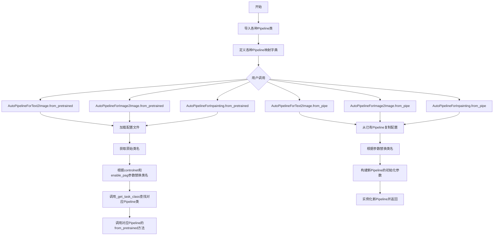

## 类结构

```
AutoPipeline (模块)
├── AUTO_*_PIPELINES_MAPPING (全局字典)
│   ├── AUTO_TEXT2IMAGE_PIPELINES_MAPPING
│   ├── AUTO_IMAGE2IMAGE_PIPELINES_MAPPING
│   ├── AUTO_INPAINT_PIPELINES_MAPPING
│   ├── AUTO_TEXT2VIDEO_PIPELINES_MAPPING
│   ├── AUTO_IMAGE2VIDEO_PIPELINES_MAPPING
│   ├── AUTO_VIDEO2VIDEO_PIPELINES_MAPPING
│   ├── _AUTO_TEXT2IMAGE_DECODER_PIPELINES_MAPPING
│   ├── _AUTO_IMAGE2IMAGE_DECODER_PIPELINES_MAPPING
│   └── _AUTO_INPAINT_DECODER_PIPELINES_MAPPING
├── 辅助函数
│   ├── _get_connected_pipeline
│   ├── _get_model
│   └── _get_task_class
└── 核心类
    ├── AutoPipelineForText2Image
    │   ├── from_pretrained
    │   └── from_pipe
    ├── AutoPipelineForImage2Image
    │   ├── from_pretrained
    │   └── from_pipe
    └── AutoPipelineForInpainting
        ├── from_pretrained
        └── from_pipe
```

## 全局变量及字段


### `AUTO_TEXT2IMAGE_PIPELINES_MAPPING`
    
A mapping from model identifiers to text-to-image pipeline classes for automatic pipeline selection.

类型：`OrderedDict[str, Type[DiffusionPipeline]]`
    


### `AUTO_IMAGE2IMAGE_PIPELINES_MAPPING`
    
A mapping from model identifiers to image-to-image pipeline classes for automatic pipeline selection.

类型：`OrderedDict[str, Type[DiffusionPipeline]]`
    


### `AUTO_INPAINT_PIPELINES_MAPPING`
    
A mapping from model identifiers to inpainting pipeline classes for automatic pipeline selection.

类型：`OrderedDict[str, Type[DiffusionPipeline]]`
    


### `AUTO_TEXT2VIDEO_PIPELINES_MAPPING`
    
A mapping from model identifiers to text-to-video pipeline classes for automatic pipeline selection.

类型：`OrderedDict[str, Type[DiffusionPipeline]]`
    


### `AUTO_IMAGE2VIDEO_PIPELINES_MAPPING`
    
A mapping from model identifiers to image-to-video pipeline classes for automatic pipeline selection.

类型：`OrderedDict[str, Type[DiffusionPipeline]]`
    


### `AUTO_VIDEO2VIDEO_PIPELINES_MAPPING`
    
A mapping from model identifiers to video-to-video pipeline classes for automatic pipeline selection.

类型：`OrderedDict[str, Type[DiffusionPipeline]]`
    


### `_AUTO_TEXT2IMAGE_DECODER_PIPELINES_MAPPING`
    
A private mapping from model identifiers to text-to-image decoder pipeline classes for automatic pipeline selection.

类型：`OrderedDict[str, Type[DiffusionPipeline]]`
    


### `_AUTO_IMAGE2IMAGE_DECODER_PIPELINES_MAPPING`
    
A private mapping from model identifiers to image-to-image decoder pipeline classes for automatic pipeline selection.

类型：`OrderedDict[str, Type[DiffusionPipeline]]`
    


### `_AUTO_INPAINT_DECODER_PIPELINES_MAPPING`
    
A private mapping from model identifiers to inpainting decoder pipeline classes for automatic pipeline selection.

类型：`OrderedDict[str, Type[DiffusionPipeline]]`
    


### `SUPPORTED_TASKS_MAPPINGS`
    
A list of all supported pipeline task mappings for automatic pipeline discovery and selection.

类型：`List[OrderedDict[str, Type[DiffusionPipeline]]]`
    


### `AutoPipelineForText2Image.config_name`
    
The configuration filename that stores the class and module names of all diffusion pipeline components.

类型：`str`
    


### `AutoPipelineForImage2Image.config_name`
    
The configuration filename that stores the class and module names of all diffusion pipeline components.

类型：`str`
    


### `AutoPipelineForInpainting.config_name`
    
The configuration filename that stores the class and module names of all diffusion pipeline components.

类型：`str`
    
    

## 全局函数及方法


### `_get_connected_pipeline`

该函数用于根据给定的 decoder pipeline 类查找其关联的完整 pipeline 类（如 text2image、image2image 或 inpainting pipeline）。主要用于支持如 kandinsky-2-2-decoder 这类分离了编码器和解码器的模型架构。

参数：

- `pipeline_cls`：`Type`，要查找关联 pipeline 的 decoder pipeline 类（例如 `KandinskyPipeline`、`KandinskyV22Pipeline` 等）

返回值：`Optional[Type]`，如果找到关联的 pipeline 类则返回对应的类，否则返回 `None`

#### 流程图

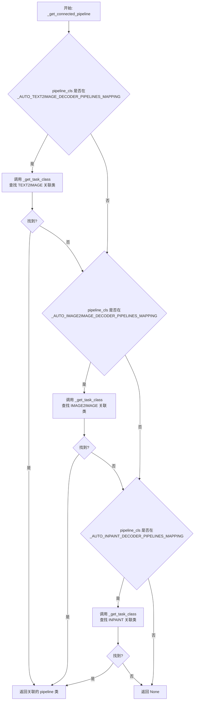

#### 带注释源码

```python
def _get_connected_pipeline(pipeline_cls):
    # 目前关联的 pipeline 只支持从 decoder pipeline 加载，
    # 例如 kandinsky-community/kandinsky-2-2-decoder
    # 检查是否属于文本到图像解码器管道
    if pipeline_cls in _AUTO_TEXT2IMAGE_DECODER_PIPELINES_MAPPING.values():
        # 从文本到图像映射中查找关联的完整 pipeline 类
        return _get_task_class(
            AUTO_TEXT2IMAGE_PIPELINES_MAPPING, pipeline_cls.__name__, throw_error_if_not_exist=False
        )
    # 检查是否属于图像到图像解码器管道
    if pipeline_cls in _AUTO_IMAGE2IMAGE_DECODER_PIPELINES_MAPPING.values():
        # 从图像到图像映射中查找关联的完整 pipeline 类
        return _get_task_class(
            AUTO_IMAGE2IMAGE_PIPELINES_MAPPING, pipeline_cls.__name__, throw_error_if_not_exist=False
        )
    # 检查是否属于修复解码器管道
    if pipeline_cls in _AUTO_INPAINT_DECODER_PIPELINES_MAPPING.values():
        # 从修复映射中查找关联的完整 pipeline 类
        return _get_task_class(AUTO_INPAINT_PIPELINES_MAPPING, pipeline_cls.__name__, throw_error_if_not_exist=False)
    # 如果不属于任何解码器类型，则返回 None
```


### `_get_model`

根据给定的管道类名，在所有支持的任务映射中查找对应的模型名称。

参数：

- `pipeline_class_name`：`str`，管道类的名称（通常是 `__name__` 属性），用于在任务映射中查找对应的模型标识符

返回值：`str | None`，如果找到匹配的管道类则返回对应的模型名称（字符串），否则返回 `None`

#### 流程图

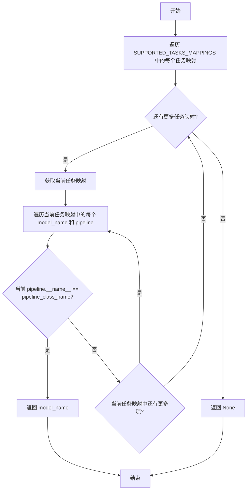

#### 带注释源码

```python
def _get_model(pipeline_class_name):
    """
    根据管道类名查找对应的模型名称。
    
    该函数遍历所有支持的任务映射（包含文本到图像、图像到图像、修复等任务的管道映射），
    查找与给定管道类名匹配的模型标识符。
    
    参数:
        pipeline_class_name: 管道类的 __name__ 属性值，用于匹配查找
        
    返回:
        如果找到匹配项，返回对应的模型名称字符串；否则返回 None
    """
    # 遍历所有支持的任务映射（包括文本到图像、图像到图像、修复、视频等任务）
    for task_mapping in SUPPORTED_TASKS_MAPPINGS:
        # 遍历当前任务映射中的每个模型名称和对应的管道类
        for model_name, pipeline in task_mapping.items():
            # 比较管道类的 __name__ 属性与传入的类名是否匹配
            if pipeline.__name__ == pipeline_class_name:
                # 找到匹配项，返回对应的模型名称
                return model_name
    
    # 遍历完所有映射后未找到匹配项，返回 None
    # （Python 函数默认返回 None，此处可省略显式返回）
```


### `_get_task_class`

该函数是 AutoPipeline 系统的核心辅助函数，用于根据管道类名在指定的映射表中查找对应的任务管道类。它通过调用 `_get_model` 函数获取模型名称，然后从映射表中检索相应的管道类。如果找不到对应的类且 `throw_error_if_not_exist` 为 True，则抛出 ValueError 异常。

参数：

- `mapping`：`OrderedDict`，包含模型名称到管道类的映射字典，用于在其中查找目标管道类
- `pipeline_class_name`：`str`，管道类的名称（如 "StableDiffusionPipeline"），用于在映射表中查找对应的任务类
- `throw_error_if_not_exist`：`bool`，默认为 True，当找不到对应的管道类时是否抛出 ValueError 异常

返回值：`typing.Any` 或 `None`，返回在映射表中找到的管道类，如果未找到且 `throw_error_if_not_exist` 为 False 则返回 None，否则抛出异常

#### 流程图

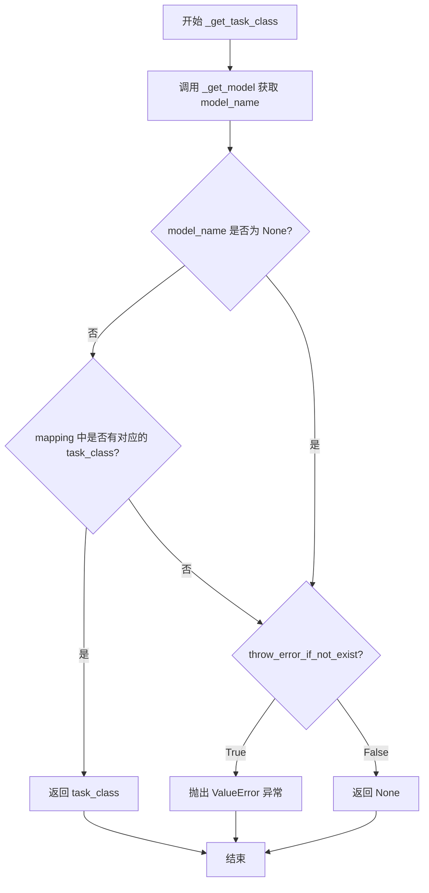

#### 带注释源码

```python
def _get_model(pipeline_class_name):
    """
    根据管道类名在所有支持的任务映射表中查找对应的模型名称
    
    参数:
        pipeline_class_name (str): 管道类的名称，如 "StableDiffusionPipeline"
    
    返回值:
        str or None: 模型名称，如果未找到则返回 None
    """
    # 遍历所有支持的任务映射表（包括文本到图像、图像到图像、修复等）
    for task_mapping in SUPPORTED_TASKS_MAPPINGS:
        # 遍历映射表中的每个模型名称和管道类
        for model_name, pipeline in task_mapping.items():
            # 检查管道类的 __name__ 是否与给定的类名匹配
            if pipeline.__name__ == pipeline_class_name:
                return model_name


def _get_task_class(mapping, pipeline_class_name, throw_error_if_not_exist: bool = True):
    """
    在指定的映射表中根据管道类名查找对应的任务管道类
    
    参数:
        mapping (OrderedDict): 管道映射表，如 AUTO_TEXT2IMAGE_PIPELINES_MAPPING
        pipeline_class_name (str): 管道类的名称
        throw_error_if_not_exist (bool): 是否在找不到时抛出异常，默认 True
    
    返回值:
        找到的管道类或 None/抛出异常
    
    异常:
        ValueError: 当找不到对应的管道类且 throw_error_if_not_exist 为 True 时
    """
    # 第一步：通过 _get_model 函数在所有支持的任务映射中查找模型名称
    model_name = _get_model(pipeline_class_name)

    # 如果成功找到模型名称
    if model_name is not None:
        # 在传入的映射表中查找对应的任务类
        task_class = mapping.get(model_name, None)
        # 如果映射表中存在对应的任务类，则直接返回
        if task_class is not None:
            return task_class

    # 如果没有找到对应的任务类
    if throw_error_if_not_exist:
        # 抛出详细的错误信息，包含管道类名和模型名称
        raise ValueError(f"AutoPipeline can't find a pipeline linked to {pipeline_class_name} for {model_name}")
```


### `AutoPipelineForText2Image.__init__`

该方法是 `AutoPipelineForText2Image` 类的构造函数，但它被故意设计为抛出 `EnvironmentError` 异常，因为该类是一个通用的工厂类，不能直接通过 `__init__` 方法实例化。用户必须使用 `from_pretrained()` 或 `from_pipe()` 类方法来实现实例化。

参数：

- `*args`：任意位置参数（该方法不处理任何参数）
- `**kwargs`：任意关键字参数（该方法不处理任何参数）

返回值：无返回值（方法会抛出 `EnvironmentError` 异常）

#### 流程图

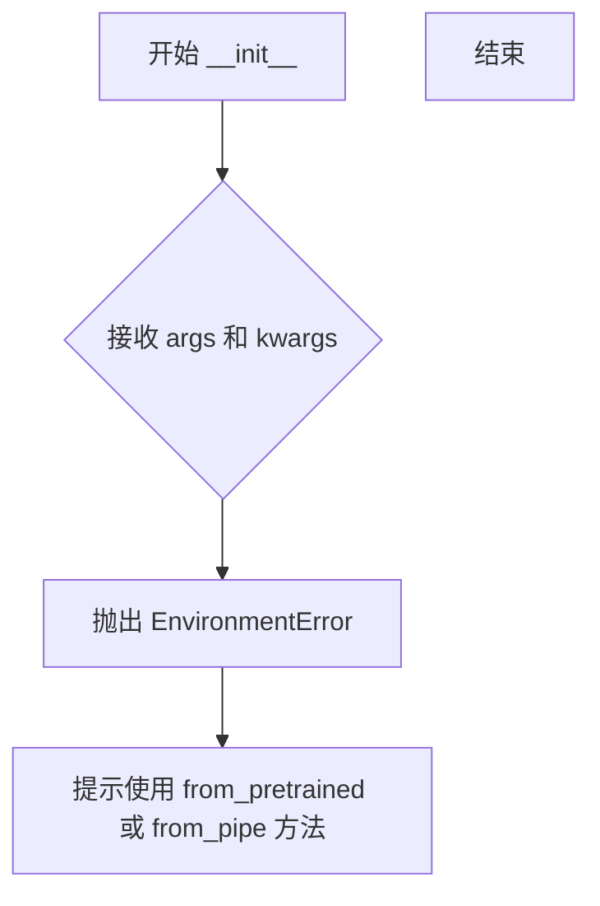

#### 带注释源码

```python
def __init__(self, *args, **kwargs):
    """
    AutoPipelineForText2Image 类的构造函数。
    
    注意：此类不能直接实例化。该方法故意抛出异常，
    强制用户使用类方法 from_pretrained() 或 from_pipe() 来创建实例。
    
    参数:
        *args: 任意位置参数（此方法不接受任何参数）
        **kwargs: 任意关键字参数（此方法不接受任何参数）
    
    异常:
        EnvironmentError: 始终抛出此异常，提示用户使用正确的实例化方法
    """
    # 抛出环境错误，提示用户必须使用类方法进行实例化
    raise EnvironmentError(
        f"{self.__class__.__name__} is designed to be instantiated "
        f"using the `{self.__class__.__name__}.from_pretrained(pretrained_model_name_or_path)` or "
        f"`{self.__class__.__name__}.from_pipe(pipeline)` methods."
    )
```


### AutoPipelineForText2Image.from_pretrained

从预训练模型路径或Hub仓库实例化文本到图像的PyTorch扩散管道，通过检测配置对象中的`_class_name`属性来确定具体的管道类，并使用管道类名模式匹配找到对应的文本到图像管道。

参数：

- `cls`：类型，类本身（隐式参数）
- `pretrained_model_or_path`：`str` or `os.PathLike`，可选，预训练管道的repo id（如`CompVis/ldm-text2im-large-256`）或包含管道权重的本地目录路径
- `torch_dtype`：`torch.dtype`，可选，覆盖默认的`torch.dtype`并使用其他数据类型加载模型
- `force_download`：`bool`，可选，默认为`False`，是否强制（重新）下载模型权重和配置文件
- `cache_dir`：`str | os.PathLike`，可选，用于缓存下载的预训练模型配置的目录路径
- `proxies`：`dict[str, str]`，可选，按协议或端点使用的代理服务器字典
- `output_loading_info`：`bool`，可选，默认为`False`，是否返回包含缺失键、意外键和错误消息的字典
- `local_files_only`：`bool`，可选，默认为`False`，是否仅加载本地模型权重和配置文件
- `token`：`str` or `bool`，可选，用于远程文件的HTTP Bearer授权令牌
- `revision`：`str`，可选，默认为`"main"`，使用的特定模型版本
- `custom_revision`：`str`，可选，默认为`"main"`，加载自定义管道时使用的特定模型版本
- `mirror`：`str`，可选，用于解决中国访问问题的镜像源
- `device_map`：`str` or `dict[str, int | str | torch.device]`，可选，指定每个子模块应放置位置的映射
- `max_memory`：`Dict`，可选，每个GPU和可用CPU RAM的最大内存设备标识符字典
- `offload_folder`：`str` or `os.PathLike`，可选，如果device_map包含`"disk"`值则用于卸载权重的路径
- `offload_state_dict`：`bool`可选，如果为`True`，则暂时将CPU状态字典卸载到硬盘以避免CPU RAM耗尽
- `low_cpu_mem_usage`：`bool`可选，默认为torch版本>=1.9.0时为True，加速模型加载
- `use_safetensors`：`bool`可选，如果设置为`None`，则下载safetensors权重（如果可用）；`True`强制从safetensors加载；`False`不加载
- `variant`：`str`可选，从指定变体文件（如`"fp16"`或`"ema"`）加载权重
- `kwargs`：剩余的关键字参数，可用于覆盖管道的可加载变量（管道组件）

返回值：具体的文本到图像管道类实例（如StableDiffusionPipeline、PixArtAlphaPipeline等），返回的管道处于评估模式（`model.eval()`）

#### 流程图

```mermaid
flowchart TD
    A[开始: from_pretrained] --> B[从kwargs中提取加载配置参数<br/>cache_dir, force_download, proxies, token, local_files_only, revision]
    B --> C[调用cls.load_config加载预训练模型配置]
    C --> D[从配置中获取原始类名_config['_class_name']]
    D --> E{检查kwargs中是否包含controlnet?}
    E -->|是| F{controlnet是否是ControlNetUnionModel?}
    F -->|是| G[将类名中的Pipeline替换为ControlNetUnionPipeline]
    F -->|否| H[将类名中的Pipeline替换为ControlNetPipeline]
    E -->|否| I{检查kwargs中是否包含enable_pag?}
    I -->|是且enable_pag为True| J[将类名中的Pipeline替换为PAGPipeline]
    I -->|否| K[根据原始类名确定to_replace字符串<br/>ControlPipeline或Pipeline]
    G --> L
    H --> L
    J --> L
    K --> L
    L[调用_get_task_class函数<br/>在AUTO_TEXT2IMAGE_PIPELINES_MAPPING中查找对应的管道类]
    L --> M[合并load_config_kwargs和kwargs]
    M --> N[调用具体管道类的from_pretrained方法]
    N --> O[返回管道实例]
```

#### 带注释源码

```python
@classmethod
@validate_hf_hub_args
def from_pretrained(cls, pretrained_model_or_path, **kwargs):
    r"""
    Instantiates a text-to-image Pytorch diffusion pipeline from pretrained pipeline weight.

    The from_pretrained() method takes care of returning the correct pipeline class instance by:
        1. Detect the pipeline class of the pretrained_model_or_path based on the _class_name property of its
           config object
        2. Find the text-to-image pipeline linked to the pipeline class using pattern matching on pipeline class
           name.

    If a `controlnet` argument is passed, it will instantiate a [`StableDiffusionControlNetPipeline`] object.

    The pipeline is set in evaluation mode (`model.eval()`) by default.
    ...
    """
    # 从kwargs中提取加载配置相关的参数
    cache_dir = kwargs.pop("cache_dir", None)
    force_download = kwargs.pop("force_download", False)
    proxies = kwargs.pop("proxies", None)
    token = kwargs.pop("token", None)
    local_files_only = kwargs.pop("local_files_only", False)
    revision = kwargs.pop("revision", None)

    # 构建加载配置的关键字参数字典
    load_config_kwargs = {
        "cache_dir": cache_dir,
        "force_download": force_download,
        "proxies": proxies,
        "token": token,
        "local_files_only": local_files_only,
        "revision": revision,
    }

    # 加载预训练模型的配置
    config = cls.load_config(pretrained_model_or_path, **load_config_kwargs)
    # 获取配置中存储的原始管道类名
    orig_class_name = config["_class_name"]
    
    # 根据原始类名确定要替换的字符串
    if "ControlPipeline" in orig_class_name:
        to_replace = "ControlPipeline"
    else:
        to_replace = "Pipeline"

    # 处理controlnet参数：如果传入controlnet，则替换为对应的ControlNet管道类
    if "controlnet" in kwargs:
        if isinstance(kwargs["controlnet"], ControlNetUnionModel):
            orig_class_name = config["_class_name"].replace(to_replace, "ControlNetUnionPipeline")
        else:
            orig_class_name = config["_class_name"].replace(to_replace, "ControlNetPipeline")
            
    # 处理enable_pag参数：如果启用PAG，则替换为对应的PAG管道类
    if "enable_pag" in kwargs:
        enable_pag = kwargs.pop("enable_pag")
        if enable_pag:
            orig_class_name = orig_class_name.replace(to_replace, "PAGPipeline")

    # 通过模式匹配查找对应的文本到图像管道类
    text_2_image_cls = _get_task_class(AUTO_TEXT2IMAGE_PIPELINES_MAPPING, orig_class_name)

    # 合并加载配置参数和其他kwargs
    kwargs = {**load_config_kwargs, **kwargs}
    # 调用具体管道类的from_pretrained方法并返回实例
    return text_2_image_cls.from_pretrained(pretrained_model_or_path, **kwargs)
```


### `AutoPipelineForText2Image.from_pipe`

从已实例化的扩散管道（DiffusionPipeline）对象动态创建文本到图像（text-to-image）管道实例。该方法通过模式匹配找到对应的文本到图像管道类，复用原始管道的大部分模块而无需重新分配额外内存，实现不同任务管道间的快速切换。

参数：

- `cls`：类型 `ClassMethod`，表示类方法接收类本身作为第一个参数
- `pipeline`：类型 `DiffusionPipeline`，已实例化的扩散管道对象，包含模型配置和组件
- `**kwargs`：类型 `Dict[str, Any]`，可选关键字参数，用于覆盖原始管道的组件或配置属性

返回值：`DiffusionPipeline`，返回新创建的文本到图像管道实例

#### 流程图

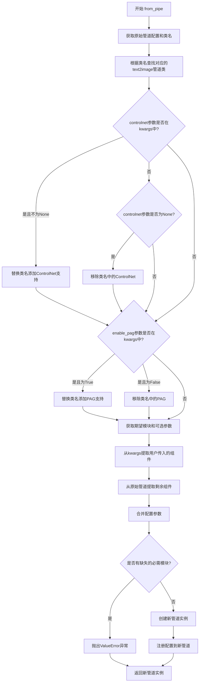

#### 带注释源码

```python
@classmethod
def from_pipe(cls, pipeline, **kwargs):
    r"""
    从另一个已实例化的扩散管道类实例化文本到图像PyTorch扩散管道。

    from_pipe()方法通过使用管道类名的模式匹配找到链接的文本到图像管道，
    从而返回正确的管道类实例。

    管道包含的所有模块将用于初始化新管道，而无需重新分配额外的内存。

    默认情况下，管道设置为评估模式（model.eval()）。

    参数:
        pipeline (`DiffusionPipeline`):
            一个已实例化的`DiffusionPipeline`对象

    示例:
        >>> from diffusers import AutoPipelineForText2Image, AutoPipelineForImage2Image
        >>> pipe_i2i = AutoPipelineForImage2Image.from_pretrained(
        ...     "stable-diffusion-v1-5/stable-diffusion-v1-5", requires_safety_checker=False
        ... )
        >>> pipe_t2i = AutoPipelineForText2Image.from_pipe(pipe_i2i)
        >>> image = pipe_t2i(prompt).images[0]
    """

    # 第一步：获取原始管道的配置字典和类名
    # 将配置转换为字典以便后续修改
    original_config = dict(pipeline.config)
    # 获取原始管道类的名称（如StableDiffusionImg2ImgPipeline）
    original_cls_name = pipeline.__class__.__name__

    # 第二步：派生要实例化的管道类
    # 使用_get_task_class函数根据原始类名在AUTO_TEXT2IMAGE_PIPELINES_MAPPING中查找对应的text2image管道类
    text_2_image_cls = _get_task_class(AUTO_TEXT2IMAGE_PIPELINES_MAPPING, original_cls_name)

    # 第三步：处理可选的controlnet参数
    # 如果用户传入了controlnet参数，根据其值修改目标管道类
    if "controlnet" in kwargs:
        # 如果controlnet不为None，添加ControlNet支持
        if kwargs["controlnet"] is not None:
            # 根据当前类是否包含PAG确定替换字符串
            to_replace = "PAGPipeline" if "PAG" in text_2_image_cls.__name__ else "Pipeline"
            text_2_image_cls = _get_task_class(
                AUTO_TEXT2IMAGE_PIPELINES_MAPPING,
                # 移除现有的ControlNet（如果有），然后添加ControlNet前缀
                text_2_image_cls.__name__.replace("ControlNet", "").replace(to_replace, "ControlNet" + to_replace),
            )
        else:
            # 如果controlnet为None，移除ControlNet相关类名
            text_2_image_cls = _get_task_class(
                AUTO_TEXT2IMAGE_PIPELINES_MAPPING,
                text_2_image_cls.__name__.replace("ControlNet", ""),
            )

    # 第四步：处理可选的enable_pag参数
    # 如果用户传入了enable_pag参数，根据其值修改目标管道类
    if "enable_pag" in kwargs:
        enable_pag = kwargs.pop("enable_pag")
        if enable_pag:
            # 启用PAG：添加PAGPipeline后缀
            text_2_image_cls = _get_task_class(
                AUTO_TEXT2IMAGE_PIPELINES_MAPPING,
                text_2_image_cls.__name__.replace("PAG", "").replace("Pipeline", "PAGPipeline"),
            )
        else:
            # 禁用PAG：移除PAG相关后缀
            text_2_image_cls = _get_task_class(
                AUTO_TEXT2IMAGE_PIPELINES_MAPPING,
                text_2_image_cls.__name__.replace("PAG", ""),
            )

    # 第五步：定义给定管道签名 expected modules 和 optional kwargs
    # _get_signature_keys方法返回：(期望的模块列表, 可选参数字典)
    expected_modules, optional_kwargs = text_2_image_cls._get_signature_keys(text_2_image_cls)

    # 从原始配置中提取模型名称或路径
    pretrained_model_name_or_path = original_config.pop("_name_or_path", None)

    # 第六步：允许用户通过kwargs传入模块来覆盖原始管道的组件
    # 从kwargs中提取用户明确传入的模块对象
    passed_class_obj = {k: kwargs.pop(k) for k in expected_modules if k in kwargs}
    # 从原始管道的components中获取未被用户覆盖的模块
    original_class_obj = {
        k: pipeline.components[k]
        for k, v in pipeline.components.items()
        if k in expected_modules and k not in passed_class_obj
    }

    # 第七步：允许用户传入可选kwargs来覆盖原始管道的配置属性
    # 从kwargs中提取用户明确传入的可选参数
    passed_pipe_kwargs = {k: kwargs.pop(k) for k in optional_kwargs if k in kwargs}
    # 从原始配置中获取未被用户覆盖的可选参数
    original_pipe_kwargs = {
        k: original_config[k]
        for k, v in original_config.items()
        if k in optional_kwargs and k not in passed_pipe_kwargs
    }

    # 第八步：处理原始管道中以私有属性存储的配置
    # 这些配置以"_"开头但对应可选参数，我们将其转换为可选参数传递
    additional_pipe_kwargs = [
        k[1:]  # 去掉下划线前缀
        for k in original_config.keys()
        if k.startswith("_") and k[1:] in optional_kwargs and k[1:] not in passed_pipe_kwargs
    ]
    for k in additional_pipe_kwargs:
        # 将"_<param>"转换为"<param>"并加入original_pipe_kwargs
        original_pipe_kwargs[k] = original_config.pop(f"_{k}")

    # 第九步：合并所有参数创建最终的text2image kwargs
    # 优先级：用户传入的模块 > 原始管道模块 > 用户传入的配置 > 原始配置
    text_2_image_kwargs = {**passed_class_obj, **original_class_obj, **passed_pipe_kwargs, **original_pipe_kwargs}

    # 第十步：存储未使用的原始配置为私有属性
    # 将不被新管道使用的配置以私有属性形式保存
    unused_original_config = {
        f"{'' if k.startswith('_') else '_'}{k}": original_config[k]
        for k, v in original_config.items()
        if k not in text_2_image_kwargs
    }

    # 第十一步：检查必需的模块是否都存在
    # 计算缺失的必需模块（排除可选组件）
    missing_modules = (
        set(expected_modules) - set(text_2_image_cls._optional_components) - set(text_2_image_kwargs.keys())
    )

    # 如果有缺失的必需模块，抛出ValueError
    if len(missing_modules) > 0:
        raise ValueError(
            f"Pipeline {text_2_image_cls} expected {expected_modules}, but only {set(list(passed_class_obj.keys()) + list(original_class_obj.keys()))} were passed"
        )

    # 第十二步：实例化新的text2image管道
    model = text_2_image_cls(**text_2_image_kwargs)

    # 第十三步：注册配置到新管道
    # 注册模型名称或路径
    model.register_to_config(_name_or_path=pretrained_model_name_or_path)
    # 注册未使用的原始配置为私有属性
    model.register_to_config(**unused_original_config)

    # 返回新创建的text2image管道实例
    return model
```


### `AutoPipelineForImage2Image.__init__`

该方法为 `AutoPipelineForImage2Image` 类的构造函数，用于初始化图像到图像（Image-to-Image）自动 pipeline 类。然而，该类的设计目的是作为通用工厂类，不允许直接通过 `__init__` 实例化，必须通过 `from_pretrained` 或 `from_pipe` 类方法创建实例。因此该方法内部直接抛出 `EnvironmentError` 异常，提示用户使用正确的实例化方式。

参数：

- `*args`：可变位置参数，用于接收任意数量的位置参数（但该方法不使用这些参数）。
- `**kwargs`：可变关键字参数，用于接收任意数量的关键字参数（但该方法不使用这些参数）。

返回值：无返回值（该方法总是抛出异常）。

#### 流程图

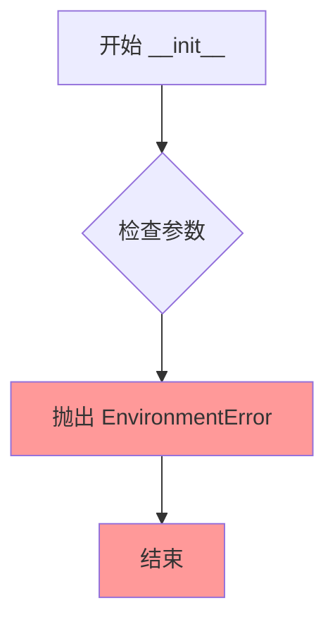

#### 带注释源码

```python
def __init__(self, *args, **kwargs):
    # 该类设计为工厂类，不能直接实例化
    # 必须通过类方法 from_pretrained 或 from_pipe 创建实例
    raise EnvironmentError(
        f"{self.__class__.__name__} is designed to be instantiated "
        f"using the `{self.__class__.__name__}.from_pretrained(pretrained_model_name_or_path)` or "
        f"`{self.__class__.__name__}.from_pipe(pipeline)` methods."
    )
```


### `AutoPipelineForImage2Image.from_pretrained`

该方法是一个类方法，用于从预训练的模型权重实例化一个image-to-image（图像到图像）的PyTorch扩散管道。它通过检测预训练模型配置中的`_class_name`属性来确定正确的管道类，并根据类名模式匹配找到对应的image-to-image管道。如果传入了`controlnet`参数，则会实例化相应的ControlNet管道。

参数：

- `cls`：类型，默认参数，表示AutoPipelineForImage2Image类本身
- `pretrained_model_or_path`：`str` 或 `os.PathLike`，可选，表示预训练管道的Hub仓库ID（如`CompVis/ldm-text2im-large-256`）或包含管道权重的本地目录路径
- `torch_dtype`：`torch.dtype`，可选，用于覆盖默认的torch.dtype并以另一种数据类型加载模型
- `force_download`：`bool`，可选，默认为`False`，是否强制（重新）下载模型权重和配置文件
- `cache_dir`：`str | os.PathLike`，可选，用于缓存预训练模型配置的目录路径
- `proxies`：`dict[str, str]`，可选，代理服务器字典，用于按协议或端点进行请求
- `output_loading_info`：`bool`，可选，默认为`False`，是否返回包含缺失键、意外键和错误消息的字典
- `local_files_only`：`bool`，可选，默认为`False`，是否仅加载本地模型权重和配置文件
- `token`：`str` 或 `bool`，可选，用于远程文件的HTTP bearer授权令牌
- `revision`：`str`，可选，默认为`"main"`，使用的特定模型版本
- `custom_revision`：`str`，可选，自定义管道的特定模型版本
- `mirror`：`str`，可选，用于解决访问问题的镜像源
- `device_map`：`str` 或 `dict[str, int | str | torch.device]`，可选，指定每个子模块应放置位置的映射
- `max_memory`：`Dict`，可选，每个GPU和可用CPU RAM的最大内存设备标识符
- `offload_folder`：`str` 或 `os.PathLike`，可选，如果device_map包含`"disk"`值，则为卸载权重的路径
- `offload_state_dict`：`bool`，可选，如果为`True`，则暂时将CPU状态字典卸载到硬盘以避免内存不足
- `low_cpu_mem_usage`：`bool`，可选，默认为PyTorch版本>=1.9.0时为`True`，加速模型加载
- `use_safetensors`：`bool`，可选，默认为`None`，是否使用safetensors权重
- `variant`：`str`，可选，从指定变体文件名（如`"fp16"`或`"ema"`）加载权重
- `controlnet`：可选，如果传入则实例化ControlNet相关管道
- `enable_pag`：可选，如果为True则启用PAG（Prompt Attention Guidance）
- `kwargs`：剩余的关键字参数，可用于覆盖管道的可加载和可保存变量

返回值：返回具体类型的image-to-image pipeline实例（如`StableDiffusionXLImg2ImgPipeline`等），具体类型由配置中的`_class_name`决定

#### 流程图

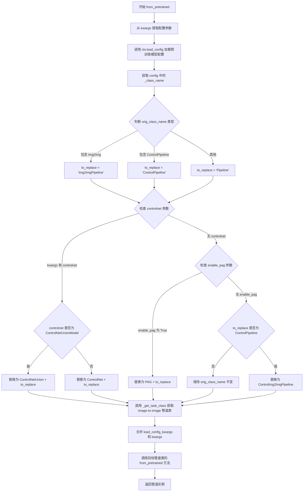

#### 带注释源码

```python
@classmethod
@validate_hf_hub_args
def from_pretrained(cls, pretrained_model_or_path, **kwargs):
    r"""
    从预训练权重实例化一个image-to-image PyTorch扩散管道。

    from_pretrained()方法通过以下步骤返回正确的管道类实例：
    1. 基于预训练模型的config对象的_class_name属性检测管道类
    2. 使用管道类名的模式匹配找到对应的image-to-image管道

    如果传入controlnet参数，将实例化StableDiffusionControlNetImg2ImgPipeline对象。

    管道默认设置为评估模式（model.eval()）。

    Parameters:
        pretrained_model_or_path: 预训练模型的路径或Hub仓库ID
        torch_dtype: 可选的torch数据类型覆盖
        force_download: 是否强制重新下载
        cache_dir: 缓存目录
        proxies: 代理服务器字典
        output_loading_info: 是否返回加载信息
        local_files_only: 是否仅使用本地文件
        token: HuggingFace认证令牌
        revision: 模型版本
        custom_revision: 自定义版本
        mirror: 镜像源
        device_map: 设备映射
        max_memory: 最大内存配置
        offload_folder: 卸载文件夹路径
        offload_state_dict: 是否卸载状态字典
        low_cpu_mem_usage: 低CPU内存使用模式
        use_safetensors: 是否使用safetensors
        variant: 模型变体
        controlnet: 可选的ControlNet模型
        enable_pag: 是否启用PAG
        **kwargs: 其他关键字参数
    """
    # 从kwargs中提取配置相关参数
    cache_dir = kwargs.pop("cache_dir", None)
    force_download = kwargs.pop("force_download", False)
    proxies = kwargs.pop("proxies", None)
    token = kwargs.pop("token", None)
    local_files_only = kwargs.pop("local_files_only", False)
    revision = kwargs.pop("revision", None)

    # 构建加载配置的关键字参数字典
    load_config_kwargs = {
        "cache_dir": cache_dir,
        "force_download": force_download,
        "proxies": proxies,
        "token": token,
        "local_files_only": local_files_only,
        "revision": revision,
    }

    # 加载预训练模型的配置
    config = cls.load_config(pretrained_model_or_path, **load_config_kwargs)
    # 获取配置中存储的原始管道类名
    orig_class_name = config["_class_name"]

    # orig_class_name可以是:
    # - *Pipeline (普通text-to-image检查点)
    # - *ControlPipeline (Flux工具特定检查点)
    # - *Img2ImgPipeline (refiner检查点)
    
    # 根据原始类名确定需要替换的字符串
    if "Img2Img" in orig_class_name:
        to_replace = "Img2ImgPipeline"
    elif "ControlPipeline" in orig_class_name:
        to_replace = "ControlPipeline"
    else:
        to_replace = "Pipeline"

    # 处理controlnet参数
    if "controlnet" in kwargs:
        if isinstance(kwargs["controlnet"], ControlNetUnionModel):
            # 如果是联合ControlNet，替换为ControlNetUnion管道
            orig_class_name = orig_class_name.replace(to_replace, "ControlNetUnion" + to_replace)
        else:
            # 普通ControlNet，替换为ControlNet管道
            orig_class_name = orig_class_name.replace(to_replace, "ControlNet" + to_replace)
    
    # 处理enable_pag参数，启用PAG管道
    if "enable_pag" in kwargs:
        enable_pag = kwargs.pop("enable_pag")
        if enable_pag:
            orig_class_name = orig_class_name.replace(to_replace, "PAG" + to_replace)

    # 如果是ControlPipeline，需要特殊处理为ControlImg2ImgPipeline
    if to_replace == "ControlPipeline":
        orig_class_name = orig_class_name.replace(to_replace, "ControlImg2ImgPipeline")

    # 从映射表中获取正确的image-to-image管道类
    image_2_image_cls = _get_task_class(AUTO_IMAGE2IMAGE_PIPELINES_MAPPING, orig_class_name)

    # 合并加载配置参数和其他参数
    kwargs = {**load_config_kwargs, **kwargs}
    # 调用具体管道类的from_pretrained方法并返回实例
    return image_2_image_cls.from_pretrained(pretrained_model_or_path, **kwargs)
```


### `AutoPipelineForImage2Image.from_pipe`

将一个已实例化的扩散管道（DiffusionPipeline）转换为图像到图像（Image-to-Image）类型的管道。该方法通过模式匹配原始管道的类名来查找对应的Image2Image管道类，并复用原始管道的所有组件进行初始化，无需重新分配额外内存。

参数：

- `pipeline`：`DiffusionPipeline`，已实例化的扩散管道对象
- `**kwargs`：可选关键字参数，用于覆盖原始管道的组件或配置属性

返回值：`DiffusionPipeline`，新实例化的图像到图像管道对象

#### 流程图

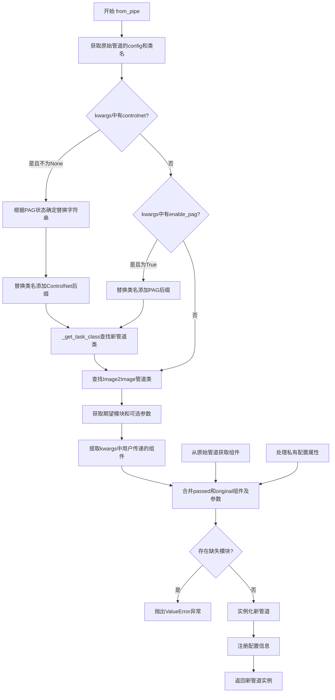

#### 带注释源码

```python
@classmethod
def from_pipe(cls, pipeline, **kwargs):
    r"""
    Instantiates a image-to-image Pytorch diffusion pipeline from another instantiated diffusion pipeline class.

    The from_pipe() method takes care of returning the correct pipeline class instance by finding the
    image-to-image pipeline linked to the pipeline class using pattern matching on pipeline class name.

    All the modules the pipeline contains will be used to initialize the new pipeline without reallocating
    additional memory.

    The pipeline is set in evaluation mode (`model.eval()`) by default.

    Parameters:
        pipeline (`DiffusionPipeline`):
            an instantiated `DiffusionPipeline` object

    Examples:

    ```py
    >>> from diffusers import AutoPipelineForText2Image, AutoPipelineForImage2Image

    >>> pipe_t2i = AutoPipelineForText2Image.from_pretrained(
    ...     "stable-diffusion-v1-5/stable-diffusion-v1-5", requires_safety_checker=False
    ... )

    >>> pipe_i2i = AutoPipelineForImage2Image.from_pipe(pipe_t2i)
    >>> image = pipe_i2i(prompt, image).images[0]
    ```
    """
    
    # 1. 获取原始管道的配置和类名
    original_config = dict(pipeline.config)
    original_cls_name = pipeline.__class__.__name__

    # 2. 派生要实例化的管道类 - 查找Image2Image管道
    image_2_image_cls = _get_task_class(AUTO_IMAGE2IMAGE_PIPELINES_MAPPING, original_cls_name)

    # 3. 处理controlnet参数 - 如果提供了controlnet，则转换为带ControlNet的管道
    if "controlnet" in kwargs:
        if kwargs["controlnet"] is not None:
            to_replace = "Img2ImgPipeline"
            if "PAG" in image_2_image_cls.__name__:
                to_replace = "PAG" + to_replace
            image_2_image_cls = _get_task_class(
                AUTO_IMAGE2IMAGE_PIPELINES_MAPPING,
                image_2_image_cls.__name__.replace("ControlNet", "").replace(
                    to_replace, "ControlNet" + to_replace
                ),
            )
        else:
            # 移除ControlNet后缀
            image_2_image_cls = _get_task_class(
                AUTO_IMAGE2IMAGE_PIPELINES_MAPPING,
                image_2_image_cls.__name__.replace("ControlNet", ""),
            )

    # 4. 处理enable_pag参数 - 如果启用PAG，则转换为PAG管道
    if "enable_pag" in kwargs:
        enable_pag = kwargs.pop("enable_pag")
        if enable_pag:
            image_2_image_cls = _get_task_class(
                AUTO_IMAGE2IMAGE_PIPELINES_MAPPING,
                image_2_image_cls.__name__.replace("PAG", "").replace("Img2ImgPipeline", "PAGImg2ImgPipeline"),
            )
        else:
            image_2_image_cls = _get_task_class(
                AUTO_IMAGE2IMAGE_PIPELINES_MAPPING,
                image_2_image_cls.__name__.replace("PAG", ""),
            )

    # 5. 获取管道签名中期望的模块和可选参数
    expected_modules, optional_kwargs = image_2_image_cls._get_signature_keys(image_2_image_cls)

    # 6. 获取预训练模型路径
    pretrained_model_name_or_path = original_config.pop("_name_or_path", None)

    # 7. 从kwargs中提取用户传递的模块，用于覆盖原始管道的组件
    passed_class_obj = {k: kwargs.pop(k) for k in expected_modules if k in kwargs}
    
    # 8. 从原始管道获取组件（排除用户已传递的）
    original_class_obj = {
        k: pipeline.components[k]
        for k, v in pipeline.components.items()
        if k in expected_modules and k not in passed_class_obj
    }

    # 9. 允许用户传递可选kwargs来覆盖原始管道的配置属性
    passed_pipe_kwargs = {k: kwargs.pop(k) for k in optional_kwargs if k in kwargs}
    
    # 10. 从原始配置中获取可选参数
    original_pipe_kwargs = {
        k: original_config[k]
        for k, v in original_config.items()
        if k in optional_kwargs and k not in passed_pipe_kwargs
    }

    # 11. 处理原始管道不期望的配置属性（存储为私有属性）
    # 如果管道可以接受这些属性，则作为可选参数传递
    additional_pipe_kwargs = [
        k[1:]
        for k in original_config.keys()
        if k.startswith("_") and k[1:] in optional_kwargs and k[1:] not in passed_pipe_kwargs
    ]
    for k in additional_pipe_kwargs:
        original_pipe_kwargs[k] = original_config.pop(f"_{k}")

    # 12. 合并所有组件和参数
    image_2_image_kwargs = {**passed_class_obj, **original_class_obj, **passed_pipe_kwargs, **original_pipe_kwargs}

    # 13. 将未使用的配置存储为私有属性
    unused_original_config = {
        f"{'' if k.startswith('_') else '_'}{k}": original_config[k]
        for k, v in original_config.items()
        if k not in image_2_image_kwargs
    }

    # 14. 检查是否有缺失的必需模块
    missing_modules = (
        set(expected_modules) - set(image_2_image_cls._optional_components) - set(image_2_image_kwargs.keys())
    )

    # 15. 如果有缺失模块，抛出异常
    if len(missing_modules) > 0:
        raise ValueError(
            f"Pipeline {image_2_image_cls} expected {expected_modules}, but only {set(list(passed_class_obj.keys()) + list(original_class_obj.keys()))} were passed"
        )

    # 16. 实例化新管道
    model = image_2_image_cls(**image_2_image_kwargs)
    
    # 17. 注册配置信息
    model.register_to_config(_name_or_path=pretrained_model_name_or_path)
    model.register_to_config(**unused_original_config)

    return model
```


### `AutoPipelineForInpainting.__init__`

该方法是一个特殊的初始化函数，它不接受任何特定参数，而是使用可变参数 `*args` 和 `**kwargs`。该方法的设计意图是阻止用户直接调用构造函数实例化此类，而是强制用户通过 `from_pretrained()` 或 `from_pipe()` 类方法来实现pipeline的加载和实例化。如果用户尝试直接实例化此类，该方法会抛出一个 `EnvironmentError` 异常，提示正确的使用方法。

参数：

- `*args`：可变位置参数，不使用，仅为保持接口一致性
- `**kwargs`：可变关键字参数，不使用，仅为保持接口一致性

返回值：无返回值，该方法始终抛出 `EnvironmentError` 异常

#### 流程图

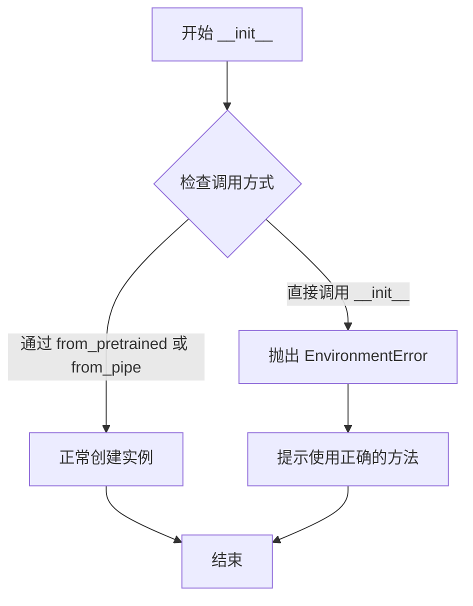

#### 带注释源码

```python
def __init__(self, *args, **kwargs):
    """
    初始化方法。
    
    注意：此类不能通过直接调用 __init__() 来实例化，否则会抛出 EnvironmentError。
    必须使用 from_pretrained() 或 from_pipe() 类方法来创建实例。
    
    参数:
        *args: 可变位置参数（不被使用）
        **kwargs: 可变关键字参数（不被使用）
    
    异常:
        EnvironmentError: 当用户尝试直接实例化此类时抛出
    """
    # 抛出环境错误，告知用户必须使用类方法进行实例化
    raise EnvironmentError(
        f"{self.__class__.__name__} is designed to be instantiated "
        f"using the `{self.__class__.__name__}.from_pretrained(pretrained_model_name_or_path)` or "
        f"`{self.__class__.__name__}.from_pipe(pipeline)` methods."
    )
```


### AutoPipelineForInpainting.from_pretrained

该方法是一个类方法，用于从预训练的模型权重实例化一个图像修复（Inpainting）扩散管道。它通过读取配置对象中的 `_class_name` 属性来检测预训练模型的管道类，然后使用类名模式匹配找到对应的图像修复管道类。如果传入了 `controlnet` 参数，则会实例化相应的 ControlNet 修复管道；如果启用了 `enable_pag`，则使用 PAG（Prompt Attention Guidance）修复管道。

**参数：**

- `cls`：类型：`class`，隐式参数，表示 AutoPipelineForInpainting 类本身。
- `pretrained_model_or_path`：类型：`str` 或 `os.PathLike`，预训练管道的模型路径或 Hugging Face Hub 上的 repo id（例如 `CompVis/ldm-text2im-large-256`），也可以是包含管道权重的本地目录路径。
- `**kwargs`：类型：`dict`，剩余的关键字参数，可用于覆盖加载和可保存的变量（管道组件），包括：
  - `torch_dtype`：`torch.dtype`，覆盖默认的 torch.dtype 并以另一种数据类型加载模型。
  - `force_download`：`bool`，是否强制（重新）下载模型权重和配置文件。
  - `cache_dir`：`str | os.PathLike`，下载的预训练模型配置的缓存目录。
  - `proxies`：`dict[str, str]`，代理服务器字典。
  - `output_loading_info`：`bool`，是否返回包含缺失键、意外键和错误消息的字典。
  - `local_files_only`：`bool`，是否仅加载本地模型权重和配置文件。
  - `token`：`str` 或 `bool`，用于远程文件的 HTTP 承载授权令牌。
  - `revision`：`str`，要使用的特定模型版本，可以是分支名、标签名、提交 id 等。
  - `custom_revision`：`str`，加载自定义管道时的特定模型版本。
  - `mirror`：`str`，镜像源地址。
  - `device_map`：`str` 或 `dict[str, int | str | torch.device]`，指定每个子模块应放置在哪里的映射。
  - `max_memory`：`Dict`，最大内存的设备标识符字典。
  - `offload_folder`：`str` 或 `os.PathLike`，如果 device_map 包含 "disk"，则卸载权重的路径。
  - `offload_state_dict`：`bool`，是否将 CPU 状态字典临时卸载到硬盘。
  - `low_cpu_mem_usage`：`bool`，是否减少 CPU 内存使用。
  - `use_safetensors`：`bool`，是否使用 safetensors 权重。
  - `variant`：`str`，从指定变体文件（如 "fp16" 或 "ema"）加载权重。
  - `controlnet`：`ControlNetUnionModel`，可选的 ControlNet 模型。
  - `enable_pag`：`bool`，是否启用 PAG（Prompt Attention Guidance）。

**返回值：** 类型：`DiffusionPipeline`，返回具体的图像修复管道类实例（如 StableDiffusionInpaintPipeline、FluxInpaintPipeline 等），该管道已从预训练权重加载并设置为评估模式（`model.eval()`）。

#### 流程图

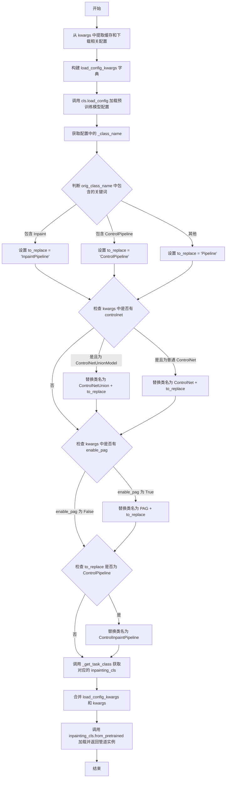

#### 带注释源码

```python
@classmethod
@validate_hf_hub_args
def from_pretrained(cls, pretrained_model_or_path, **kwargs):
    r"""
    Instantiates a inpainting Pytorch diffusion pipeline from pretrained pipeline weight.

    The from_pretrained() method takes care of returning the correct pipeline class instance by:
        1. Detect the pipeline class of the pretrained_model_or_path based on the _class_name property of its
           config object
        2. Find the inpainting pipeline linked to the pipeline class using pattern matching on pipeline class name.

    If a `controlnet` argument is passed, it will instantiate a [`StableDiffusionControlNetInpaintPipeline`]
    object.

    The pipeline is set in evaluation mode (`model.eval()`) by default.
    ...
    """
    # 从 kwargs 中提取缓存和下载相关的配置参数
    cache_dir = kwargs.pop("cache_dir", None)
    force_download = kwargs.pop("force_download", False)
    proxies = kwargs.pop("proxies", None)
    token = kwargs.pop("token", None)
    local_files_only = kwargs.pop("local_files_only", False)
    revision = kwargs.pop("revision", None)

    # 构建加载配置的关键字参数字典
    load_config_kwargs = {
        "cache_dir": cache_dir,
        "force_download": force_download,
        "proxies": proxies,
        "token": token,
        "local_files_only": local_files_only,
        "revision": revision,
    }

    # 加载预训练模型的配置
    config = cls.load_config(pretrained_model_or_path, **load_config_kwargs)
    # 获取配置中存储的原始管道类名
    orig_class_name = config["_class_name"]

    # The `orig_class_name`` can be:
    # `- *InpaintPipeline` (for inpaint-specific checkpoint)
    #  - `*ControlPipeline` (for Flux tools specific checkpoint)
    #  - or *Pipeline (for regular text-to-image checkpoint)
    # 根据原始类名判断需要替换的字符串
    if "Inpaint" in orig_class_name:
        to_replace = "InpaintPipeline"
    elif "ControlPipeline" in orig_class_name:
        to_replace = "ControlPipeline"
    else:
        to_replace = "Pipeline"

    # 如果传入了 controlnet 参数，修改类名以使用 ControlNet 管道
    if "controlnet" in kwargs:
        if isinstance(kwargs["controlnet"], ControlNetUnionModel):
            orig_class_name = orig_class_name.replace(to_replace, "ControlNetUnion" + to_replace)
        else:
            orig_class_name = orig_class_name.replace(to_replace, "ControlNet" + to_replace)
    
    # 如果启用了 PAG（Prompt Attention Guidance），修改类名
    if "enable_pag" in kwargs:
        enable_pag = kwargs.pop("enable_pag")
        if enable_pag:
            orig_class_name = orig_class_name.replace(to_replace, "PAG" + to_replace)
    
    # 如果是 ControlPipeline，需要转换为 ControlInpaintPipeline
    if to_replace == "ControlPipeline":
        orig_class_name = orig_class_name.replace(to_replace, "ControlInpaintPipeline")
    
    # 根据修改后的类名，从映射表中获取对应的 inpainting 管道类
    inpainting_cls = _get_task_class(AUTO_INPAINT_PIPELINES_MAPPING, orig_class_name)

    # 合并加载配置和用户传入的其他参数
    kwargs = {**load_config_kwargs, **kwargs}
    # 调用具体管道类的 from_pretrained 方法加载模型并返回实例
    return inpainting_cls.from_pretrained(pretrained_model_or_path, **kwargs)
```


### `AutoPipelineForInpainting.from_pipe`

该方法用于从另一个已实例化的扩散管道类动态实例化一个图像修复（inpainting）扩散管道。它通过管道类名模式匹配找到对应的inpainting管道类，并复用原管道的所有模块来初始化新管道，而无需重新分配额外内存。

参数：

- `cls`：类本身（隐式参数），`type`，调用该方法的类
- `pipeline`：`DiffusionPipeline`，一个已实例化的扩散管道对象，作为转换的源管道
- `**kwargs`：可变关键字参数，`Dict`，可选参数，用于覆盖原管道的组件或配置属性

返回值：`DiffusionPipeline` 子类实例，返回一个新实例化的图像修复管道对象

#### 流程图

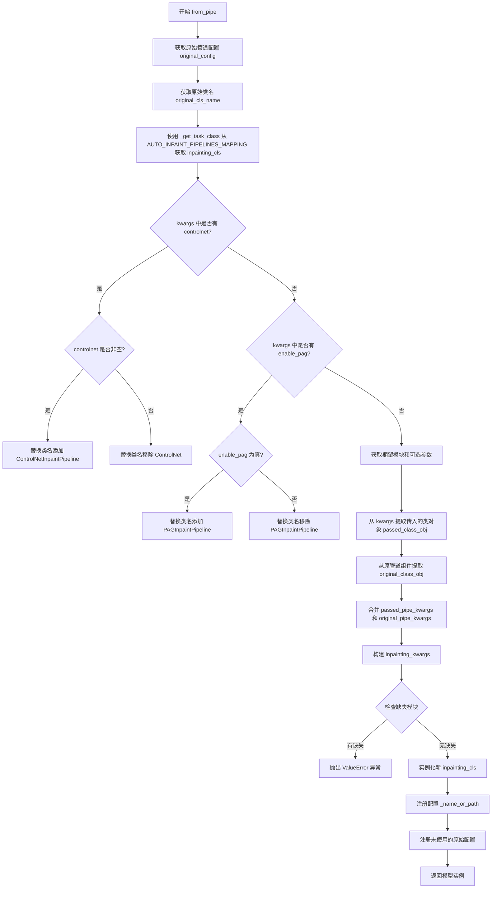

#### 带注释源码

```python
@classmethod
def from_pipe(cls, pipeline, **kwargs):
    r"""
    Instantiates a inpainting Pytorch diffusion pipeline from another instantiated diffusion pipeline class.

    The from_pipe() method takes care of returning the correct pipeline class instance by finding the inpainting
    pipeline linked to the pipeline class using pattern matching on pipeline class name.

    All the modules the pipeline class contain will be used to initialize the new pipeline without reallocating
    additional memory.

    The pipeline is set in evaluation mode (`model.eval()`) by default.

    Parameters:
        pipeline (`DiffusionPipeline`):
            an instantiated `DiffusionPipeline` object

    Examples:

    ```py
    >>> from diffusers import AutoPipelineForText2Image, AutoPipelineForInpainting

    >>> pipe_t2i = AutoPipelineForText2Image.from_pretrained(
    ...     "DeepFloyd/IF-I-XL-v1.0", requires_safety_checker=False
    ... )

    >>> pipe_inpaint = AutoPipelineForInpainting.from_pipe(pipe_t2i)
    >>> image = pipe_inpaint(prompt, image=init_image, mask_image=mask_image).images[0]
    ```
    """
    # 获取原始管道的配置字典
    original_config = dict(pipeline.config)
    # 获取原始管道类的名称
    original_cls_name = pipeline.__class__.__name__

    # 从 AUTO_INPAINT_PIPELINES_MAPPING 中查找对应的 inpainting 管道类
    inpainting_cls = _get_task_class(AUTO_INPAINT_PIPELINES_MAPPING, original_cls_name)

    # 处理 controlnet 参数：如果传入了 controlnet，则替换类名以使用 ControlNet 版本
    if "controlnet" in kwargs:
        if kwargs["controlnet"] is not None:
            inpainting_cls = _get_task_class(
                AUTO_INPAINT_PIPELINES_MAPPING,
                inpainting_cls.__name__.replace("ControlNet", "").replace(
                    "InpaintPipeline", "ControlNetInpaintPipeline"
                ),
            )
        else:
            inpainting_cls = _get_task_class(
                AUTO_INPAINT_PIPELINES_MAPPING,
                inpainting_cls.__name__.replace("ControlNetInpaintPipeline", "InpaintPipeline"),
            )

    # 处理 enable_pag 参数：如果启用了 PAG，则替换类名以使用 PAG 版本
    if "enable_pag" in kwargs:
        enable_pag = kwargs.pop("enable_pag")
        if enable_pag:
            inpainting_cls = _get_task_class(
                AUTO_INPAINT_PIPELINES_MAPPING,
                inpainting_cls.__name__.replace("PAG", "").replace("InpaintPipeline", "PAGInpaintPipeline"),
            )
        else:
            inpainting_cls = _get_task_class(
                AUTO_INPAINT_PIPELINES_MAPPING,
                inpainting_cls.__name__.replace("PAGInpaintPipeline", "InpaintPipeline"),
            )

    # 获取管道签名中期望的模块和可选参数
    expected_modules, optional_kwargs = inpainting_cls._get_signature_keys(inpainting_cls)

    # 从原始配置中提取模型路径
    pretrained_model_name_or_path = original_config.pop("_name_or_path", None)

    # 从 kwargs 中提取用户传入的类对象，用于覆盖原管道的组件
    passed_class_obj = {k: kwargs.pop(k) for k in expected_modules if k in kwargs}
    # 从原管道组件中提取不在 passed_class_obj 中的期望模块
    original_class_obj = {
        k: pipeline.components[k]
        for k, v in pipeline.components.items()
        if k in expected_modules and k not in passed_class_obj
    }

    # 从 kwargs 中提取用户传入的可选参数，用于覆盖原管道的配置属性
    passed_pipe_kwargs = {k: kwargs.pop(k) for k in optional_kwargs if k in kwargs}
    # 从原始配置中提取不在 passed_pipe_kwargs 中的可选参数
    original_pipe_kwargs = {
        k: original_config[k]
        for k, v in original_config.items()
        if k in optional_kwargs and k not in passed_pipe_kwargs
    }

    # 处理存储为私有属性的配置参数（原管道未预期但新管道可能需要）
    additional_pipe_kwargs = [
        k[1:]
        for k in original_config.keys()
        if k.startswith("_") and k[1:] in optional_kwargs and k[1:] not in passed_pipe_kwargs
    ]
    for k in additional_pipe_kwargs:
        original_pipe_kwargs[k] = original_config.pop(f"_{k}")

    # 合并所有参数：用户传入的类对象 > 原管道组件 > 用户传入的配置 > 原管道配置
    inpainting_kwargs = {**passed_class_obj, **original_class_obj, **passed_pipe_kwargs, **original_pipe_kwargs}

    # 存储未使用的原始配置为私有属性
    unused_original_config = {
        f"{'' if k.startswith('_') else '_'}{k}": original_config[k]
        for k, v in original_config.items()
        if k not in inpainting_kwargs
    }

    # 检查是否有缺失的必需模块
    missing_modules = (
        set(expected_modules) - set(inpainting_cls._optional_components) - set(inpainting_kwargs.keys())
    )

    if len(missing_modules) > 0:
        raise ValueError(
            f"Pipeline {inpainting_cls} expected {expected_modules}, but only {set(list(passed_class_obj.keys()) + list(original_class_obj.keys()))} were passed"
        )

    # 使用合并后的参数实例化新的 inpainting 管道
    model = inpainting_cls(**inpainting_kwargs)
    # 注册模型路径配置
    model.register_to_config(_name_or_path=pretrained_model_name_or_path)
    # 注册未使用的原始配置为私有属性
    model.register_to_config(**unused_original_config)

    return model
```

## 关键组件


### AUTO_TEXT2IMAGE_PIPELINES_MAPPING

文本到图像任务的Pipeline映射字典，将模型标识符映射到对应的Pipeline类，支持包括Stable Diffusion、Flux、Kandinsky、QwenImage等在内的多种模型架构。

### AUTO_IMAGE2IMAGE_PIPELINES_MAPPING

图像到图像任务的Pipeline映射字典，支持将一种图像转换为另一种图像的Pipeline类，包括Img2Img、ControlNet、PAG等多种变体。

### AUTO_INPAINT_PIPELINES_MAPPING

图像修复（Inpainting）任务的Pipeline映射字典，用于根据mask区域填充图像的Pipeline类集合。

### AUTO_TEXT2VIDEO_PIPELINES_MAPPING

文本到视频任务的Pipeline映射字典，目前主要支持Wan模型的视频生成Pipeline。

### AUTO_IMAGE2VIDEO_PIPELINES_MAPPING

图像到视频任务的Pipeline映射字典，支持从静态图像生成视频内容。

### AUTO_VIDEO2VIDEO_PIPELINES_MAPPING

视频到视频任务的Pipeline映射字典，支持视频风格的转换和处理。

### _AUTO_*_DECODER_PIPELINES_MAPPING

私有解码器Pipeline映射，包括Kandinsky、Wuerstchen、Stable Cascade等模型的解码器Pipeline，用于从潜在表示生成最终图像。

### _get_connected_pipeline 函数

根据给定的Pipeline类获取关联的Pipeline类，用于Decoder Pipeline与其他任务Pipeline之间的映射转换。

### _get_model 函数

通过遍历所有支持的Task Mapping，根据Pipeline类的__name__属性反向查找对应的模型标识符。

### _get_task_class 函数

在给定的Mapping中根据Pipeline类名查找对应的任务类，如果未找到且throw_error_if_not_exist为True则抛出ValueError异常。

### AutoPipelineForText2Image 类

通用文本到图像Pipeline自动选择器类，通过from_pretrained或from_pipe方法自动实例化合适的Pipeline，支持ControlNet和PAG扩展。

### AutoPipelineForImage2Image 类

通用图像到图像Pipeline自动选择器类，自动从预训练模型配置或已有Pipeline实例转换为图像转换Pipeline，支持多种控制条件和增强技术。

### AutoPipelineForInpainting 类

通用图像修复Pipeline自动选择器类，专门用于处理图像修复任务，支持ControlNet引导和PAG增强的修复Pipeline。

### SUPPORTED_TASKS_MAPPINGS

整合所有任务类型Mapping的列表，作为全局任务到Pipeline的注册表，用于统一的模型查找和Pipeline匹配。

### 条件导入的Kolors Pipeline

可选的Kolors模型支持，仅在sentencepiece库可用时导入，提供额外的文本到图像和图像到图像能力。


## 问题及建议


### 已知问题

- **大量重复代码逻辑**：`AutoPipelineForText2Image`、`AutoPipelineForImage2Image`、`AutoPipelineForInpainting` 三个类中的 `from_pretrained` 和 `from_pipe` 方法包含高度相似的逻辑，特别是字符串替换和类名推导部分，存在明显的代码重复（DRY原则违反）。
- **脆弱的字符串匹配**：代码依赖大量字符串操作（如 `"ControlNet" in orig_class_name`、`replace("PAG", "")`）来推导pipeline类型，这种硬编码的字符串匹配模式非常脆弱，pipeline命名规范变化会导致代码失效。
- **缺少缓存机制**：`_get_model` 和 `_get_task_class` 函数每次调用都遍历 `SUPPORTED_TASKS_MAPPINGS` 中的所有映射表，当pipeline数量增加时性能会明显下降。
- **decoder pipeline映射未完全暴露**：`_AUTO_TEXT2IMAGE_DECODER_PIPELINES_MAPPING` 等decoder相关的映射定义为私有（单下划线前缀），但在 `SUPPORTED_TASKS_MAPPINGS` 中被引用，导致内部实现细节暴露。
- **条件导入逻辑集中**：Kolors相关的pipeline导入和添加逻辑集中在文件末尾，条件导入（`if is_sentencepiece_available()`）与使用位置分离较远，影响代码可读性。
- **命名不一致**：pipeline键名命名风格不统一（如 "if"/"hunyuan" 是短名称，而 "stable-diffusion" 是完整名称），decoder mappings 使用下划线命名而主 mappings 使用连字符。

### 优化建议

- **提取公共基类或混入**：将三个 AutoPipeline 类的公共逻辑（配置加载、类名推导、组件处理等）提取到基类或混入类中，减少代码重复。
- **使用枚举或配置驱动**：将 pipeline 类型映射关系外部化为配置或枚举类，避免大量硬编码的字符串替换逻辑。
- **添加缓存装饰器**：为 `_get_model` 和 `_get_task_class` 添加 LRU 缓存（`functools.lru_cache`），避免重复遍历查找。
- **统一命名规范**：制定并遵循一致的 pipeline 键命名规范，或在文档中明确说明命名约定。
- **重构条件导入**：将 Kolors 的条件导入逻辑封装为独立的初始化函数，或迁移到专门的配置模块。
- **增强错误信息**：在 `_get_task_class` 中为不同失败场景提供更详细的错误信息，便于调试。

## 其它


### 设计目标与约束

本代码的设计目标是提供一个通用的自动化管道选择和实例化框架，能够根据预训练模型的配置自动识别并实例化对应的文本到图像、图像到图像、修复、视频生成等扩散管道。核心约束包括：必须继承自ConfigMixin以支持配置加载；通过字符串匹配模式识别管道类；支持从预训练路径或已有管道对象两种方式实例化；仅支持HuggingFace Hub生态系统内的模型。

### 错误处理与异常设计

代码中的错误处理主要包括三类：1）环境错误（EnvironmentError）：当用户尝试直接实例化AutoPipeline类时抛出，提示必须使用类方法from_pretrained或from_pipe；2）值错误（ValueError）：当_get_task_class无法在映射中找到对应的管道类时抛出，详细说明找不到的管道名称和任务类型；3）参数校验错误：通过validate_hf_hub_args装饰器对Hub参数进行校验。所有异常都包含清晰的错误消息，便于开发者定位问题。

### 数据流与状态机

整体数据流分为两条主要路径：from_pretrained路径首先加载模型配置→提取_class_name→根据类名和任务类型映射查找目标管道类→调用目标类的from_pretrained方法；from_pipe路径首先获取原管道配置→提取原管道类名→根据类名和目标任务映射查找对应管道类→传递原管道组件和参数→实例化新管道。状态转换过程为：Unknown（未知）→ConfigLoaded（配置已加载）→ClassResolved（类已解析）→PipelineInstantiated（管道已实例化）。

### 外部依赖与接口契约

本模块依赖以下外部包：1）huggingface_hub.utils.validate_hf_hub_args：用于校验Hub相关参数；2）collections.OrderedDict：用于保持映射的插入顺序；3）diffusers.configuration_utils.ConfigMixin：提供配置加载和注册功能；4）diffusers.models.controlnets.ControlNetUnionModel：用于判断ControlNet联合模型类型；5）diffusers.utils.is_sentencepiece_available：条件导入可选依赖。接口契约方面：from_pretrained接受pretrained_model_or_path（字符串或路径）、torch_dtype、force_download、cache_dir等标准HuggingFace模型加载参数；from_pipe接受pipeline（DiffusionPipeline实例）和可选的controlnet、enable_pag参数。

### 版本兼容性考虑

代码对Python版本和PyTorch版本有隐性依赖：low_cpu_mem_usage参数仅在PyTorch>=1.9.0时有效；safetensors支持需要库已安装；sentencepiece为可选依赖，通过is_sentencepiece_available条件导入。设计时需考虑不同版本用户的使用场景，提供了合理的默认值和降级方案。

### 安全性与权限管理

代码涉及的安全性设计包括：1）token参数支持HTTPBearer认证，可使用布尔值自动获取本地存储的token；2）local_files_only参数控制是否仅使用本地文件，防止意外下载；3）proxies参数支持代理服务器配置；4）mirror参数支持镜像源解决访问限制。所有远程资源访问都通过标准HuggingFace Hub机制进行，遵循其安全最佳实践。

### 性能优化策略

代码中内置了多项性能优化：1）device_map支持自动计算最优设备映射，实现多GPU负载均衡；2）low_cpu_mem_usage减少模型加载时的CPU内存占用；3）offload_state_dict支持将状态字典临时卸载到磁盘；4）max_memory允许用户精确控制内存分配。这些优化使得框架能够支持大模型的灵活部署。

### 测试与验证建议

建议为以下场景编写测试用例：1）验证各类任务（Text2Image、Image2Image、Inpainting）的from_pretrained能够正确加载标准模型；2）验证from_pipe能够在不同任务管道间转换并保持组件完整；3）验证controlnet和enable_pag参数能够正确触发管道类替换；4）验证错误情况下能够抛出预期异常；5）验证可选依赖（sentencepiece）不存在时的降级行为。

### 扩展性设计

代码的扩展性体现在：1）通过SUPPORTED_TASKS_MAPPINGS列表集中管理所有任务映射，便于添加新任务；2）_get_connected_pipeline函数提供了decoder管道到完整管道的映射逻辑；3）通过OrderedDict保持映射顺序，支持优先级控制；4）条件导入机制允许在不满足依赖时优雅降级。建议后续添加新管道时遵循现有的命名约定和映射模式。

### 配置持久化机制

AutoPipeline使用ConfigMixin提供的配置管理能力：config_name指定配置文件名为model_index.json；register_to_config方法用于注册配置属性；load_config方法从预训练路径加载配置。配置信息包括_name_or_path、_class_name以及各组件的具体参数，这些信息在管道保存和重新加载时起到关键作用。

### 与其他Diffusers组件的关系

本模块处于Diffusers库的高层抽象层，承上启下：向上为用户提供了统一的AutoPipeline入口；向下管理着数十种具体管道实现（StableDiffusion系列、Flux系列、PAG系列等）。各具体管道类继承自DiffusionPipeline基类，遵循统一的接口规范，而AutoPipeline负责根据配置动态选择正确的实现类。


    