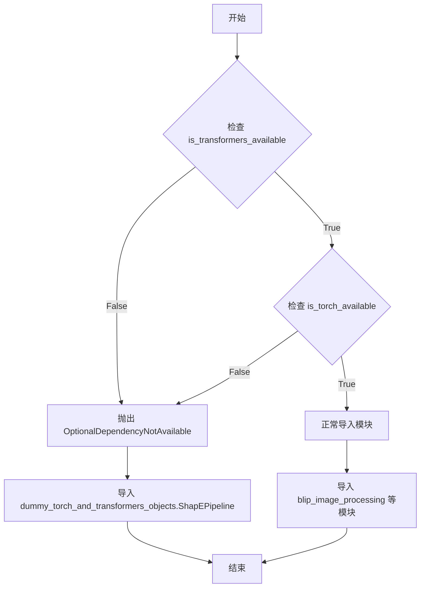
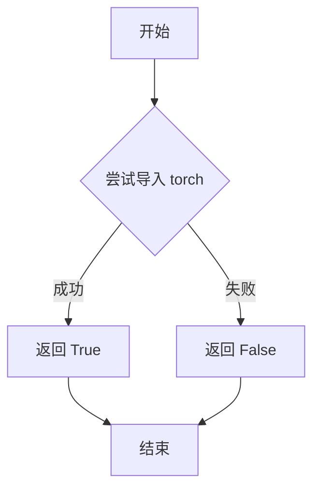
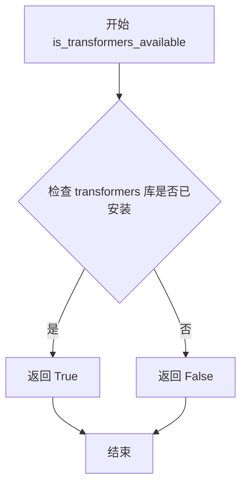

# `diffusers\src\diffusers\pipelines\blip_diffusion\__init__.py` 详细设计文档

这是一个条件导入模块，用于在检测到torch和transformers依赖可用时，导入BLIP-2图像理解和生成相关的核心类（图像处理器、Q-Former模型、Context CLIP文本模型、扩散管道）；若依赖不可用，则导入空的虚拟ShapEPipeline作为后备，确保模块结构完整性。

## 整体流程

```mermaid
graph TD
    A[开始] --> B{检查依赖可用性}
    B --> C{is_transformers_available() && is_torch_available()}
    C -- 否 --> D[抛出OptionalDependencyNotAvailable]
    D --> E[从dummy模块导入ShapEPipeline]
    C -- 是 --> F[导入BlipImageProcessor]
    F --> G[导入Blip2QFormerModel]
    G --> H[导入ContextCLIPTextModel]
    H --> I[导入BlipDiffusionPipeline]
    I --> J[结束]
```

## 类结构

```
BLIP2模块 (顶层包)
└── __init__.py (条件导入入口)
    ├── 条件分支A: 依赖不可用
    │   └── ShapEPipeline (空壳/桩对象)
    └── 条件分支B: 依赖可用
        ├── BlipImageProcessor
        ├── Blip2QFormerModel
        ├── ContextCLIPTextModel
        └── BlipDiffusionPipeline
```

## 全局变量及字段


### `dataclass`
    
Python内置装饰器，用于创建数据类，自动生成__init__、__repr__等方法

类型：`function`
    


### `np`
    
NumPy库的别名，提供高性能的多维数组和矩阵运算功能

类型：`module`
    


### `PIL`
    
Pillow图像处理库的根模块，提供基础的图像操作功能

类型：`module`
    


### `Image`
    
PIL库中的图像类，用于打开、创建、保存和处理图像文件

类型：`class`
    


    

## 全局函数及方法


### OptionalDependencyNotAvailable

这是一个可选依赖项不可用时抛出的异常类，用于在条件导入场景中处理可选依赖缺失的情况。当项目需要某些可选依赖（如 PyTorch 或 Transformers）但这些依赖不可用时，抛出此异常以避免程序崩溃，同时允许代码优雅地回退到备用实现。

参数：

- `*args`：可变位置参数，继承自 Exception 基类，用于传递异常消息
- `**kwargs`：可变关键字参数，继承自 Exception 基类，用于传递额外参数

返回值：无（异常类不返回值）

#### 流程图



#### 带注释源码

```python
# 尝试导入可选依赖项
try:
    # 检查 transformers 和 torch 是否同时可用
    if not (is_transformers_available() and is_torch_available()):
        # 如果任一依赖不可用，抛出 OptionalDependencyNotAvailable 异常
        raise OptionalDependencyNotAvailable()
except OptionalDependencyNotAvailable:
    # 异常处理：导入虚拟对象作为后备实现
    # 当可选依赖不可用时，使用 dummy 对象保证代码可导入
    from ...utils.dummy_torch_and_transformers_objects import ShapEPipeline
else:
    # 依赖可用时，导入完整的实现模块
    from .blip_image_processing import BlipImageProcessor
    from .modeling_blip2 import Blip2QFormerModel
    from .modeling_ctx_clip import ContextCLIPTextModel
    from .pipeline_blip_diffusion import BlipDiffusionPipeline

# OptionalDependencyNotAvailable 异常类定义（位于 ...utils 模块中）
# class OptionalDependencyNotAvailable(Exception):
#     """可选依赖项不可用时抛出的异常"""
#     pass
```

---

### 补充信息

#### 关键组件信息

| 组件名称 | 描述 |
|---------|------|
| OptionalDependencyNotAvailable | 可选依赖项不可用异常类，用于条件导入场景 |
| is_torch_available | 检查 PyTorch 是否可用的工具函数 |
| is_transformers_available | 检查 Transformers 是否可用的工具函数 |
| ShapEPipeline | PyTorch/Transformers 不可用时的虚拟后备对象 |

#### 技术债务与优化空间

1. **异常滥用**：使用异常控制流程不是最佳实践，建议使用返回布尔值的检查函数直接判断
2. **隐藏依赖**：条件导入使得代码的实际依赖不透明，增加了维护难度
3. **建议优化**：可以将 try-except 改为明确的条件判断，提高代码可读性：
   ```python
   if is_transformers_available() and is_torch_available():
       from .blip_image_processing import BlipImageProcessor
       # ... 其他模块
   else:
       from ...utils.dummy_torch_and_transformers_objects import ShapEPipeline
   ```

#### 其它项目

- **设计目标**：支持可选依赖项，允许模块在缺少特定依赖时仍可被导入
- **错误处理**：通过自定义异常类提供清晰的错误信息，帮助开发者定位依赖问题
- **数据流**：条件导入决定了哪些模块被加载到当前命名空间
- **外部依赖**：本代码依赖 `transformers` 和 `torch` 两个可选包


### `is_torch_available`

检测 PyTorch 库是否可用的依赖检测函数，用于条件导入和功能特性判断。

参数：

- 该函数无参数

返回值：`bool`，返回 `True` 表示 PyTorch 已安装且可用，返回 `False` 表示不可用

#### 流程图



#### 带注释源码

```python
# 从工具模块导入 PyTorch 可用性检测函数
# 该函数通常实现为：
# def is_torch_available():
#     try:
#         import torch
#         return True
#     except ImportError:
#         return False
from ...utils import is_torch_available

# 在代码中的实际使用示例：
try:
    # 检查 transformers 和 torch 是否都可用
    if not (is_transformers_available() and is_torch_available()):
        # 如果任一依赖不可用，抛出异常
        raise OptionalDependencyNotAvailable()
except OptionalDependencyNotAvailable:
    # 导入虚拟对象（当依赖不可用时）
    from ...utils.dummy_torch_and_transformers_objects import ShapEPipeline
else:
    # 当依赖可用时，导入实际实现
    from .blip_image_processing import BlipImageProcessor
    from .modeling_blip2 import Blip2QFormerModel
    from .modeling_ctx_clip import ContextCLIPTextModel
    from .pipeline_blip_diffusion import BlipDiffusionPipeline
```


### `is_transformers_available`

该函数是一个依赖检测工具，用于检查当前环境中是否安装了`transformers`库。在代码中用于条件性地导入需要`transformers`和`torch`依赖的可选模块，如果不可用则抛出`OptionalDependencyNotAvailable`异常。

参数：
- 无参数

返回值：`bool`，返回`True`表示`transformers`库可用，返回`False`表示不可用

#### 流程图



#### 带注释源码

```python
# 注意：此函数定义在 ...utils 模块中，此处展示的是调用方代码
from ...utils import OptionalDependencyNotAvailable, is_torch_available, is_transformers_available

# 使用 try-except 块来捕获可选依赖不可用的情况
try:
    # 检查 transformers 和 torch 是否都可用
    if not (is_transformers_available() and is_torch_available()):
        # 如果任一依赖不可用，抛出异常
        raise OptionalDependencyNotAvailable()
except OptionalDependencyNotAvailable:
    # 如果依赖不可用，从 dummy 对象导入（空实现/占位符）
    from ...utils.dummy_torch_and_transformers_objects import ShapEPipeline
else:
    # 如果所有依赖都可用，导入实际功能模块
    from .blip_image_processing import BlipImageProcessor
    from .modeling_blip2 import Blip2QFormerModel
    from .modeling_ctx_clip import ContextCLIPTextModel
    from .pipeline_blip_diffusion import BlipDiffusionPipeline
```

---

### 补充信息

**关键组件信息：**
- `OptionalDependencyNotAvailable`：可选依赖不可用时抛出的异常类
- `is_torch_available()`：另一个依赖检测函数，用于检查PyTorch是否可用

**潜在技术债务/优化空间：**
- 当前使用try-except流程控制来处理可选依赖，这种方式在导入时就会执行检查，可以考虑使用延迟导入(lazy import)策略提高模块加载速度

**设计目标：**
- 实现可选依赖的动态加载，使得库可以在未安装某些依赖时仍能部分可用

## 关键组件


### OptionalDependencyNotAvailable

可选依赖不可用时抛出的异常类，用于处理torch或transformers库缺失的情况。

### is_torch_available

检查torch库是否可用的函数，返回布尔值。

### is_transformers_available

检查transformers库是否可用的函数，返回布尔值。

### ShapEPipeline

当可选依赖不可用时的虚拟管道占位符类，用于保持模块导入一致性。

### BlipImageProcessor

BLIP图像预处理器，负责图像的预处理和增强操作。

### Blip2QFormerModel

BLIP-2 Q-Former模型实现，负责视觉-语言融合的Query Transformer模块。

### ContextCLIPTextModel

Context CLIP文本编码模型，支持带上下文信息的文本编码。

### BlipDiffusionPipeline

BLIP扩散管道，整合图像编码、文本编码和扩散模型的整体推理流程。

### 条件导入机制

惰性加载模块，支持可选依赖的动态导入，当依赖不可用时提供替代方案。

### 虚拟对象模式

使用dummy对象模式处理可选依赖，增强模块的可移植性和兼容性。


## 问题及建议


### 已知问题

-   **未使用的导入**: 导入了 `dataclass`、`numpy as np`、`PIL` 和 `Image`，但在代码中未使用任何这些模块，造成了不必要的依赖
-   **导入顺序不符合规范**: 标准库导入（`dataclass`）应放在最前面，其次是第三方库（`numpy`、`PIL`），最后是项目内部模块，但当前顺序混乱
-   **条件逻辑不清晰**: `try-except-else` 结构用于条件导入，但逻辑可以更直观，当前写法可能会让维护者困惑
-   **潜在的运行时开销**: 如果可选依赖不可用，仍然会尝试导入 `dummy_torch_and_transformers_objects` 模块，可能导致额外的模块查找开销

### 优化建议

-   **清理未使用的导入**: 删除未使用的 `dataclass`、`numpy` 和 `PIL` 相关导入，如果后续需要使用再添加
-   **重构条件导入逻辑**: 使用更清晰的模式，如在模块顶部定义依赖检查函数，或者使用 `importlib` 进行动态导入
-   **添加类型注解和文档**: 为条件导入逻辑添加注释，说明为什么使用这种模式以及不同分支的用途
-   **考虑统一入口模式**: 如果这是包初始化文件，考虑将可选依赖的导入逻辑提取到单独的函数中，提高可测试性

## 其它


### 设计目标与约束

本模块的设计目标是实现条件导入机制，根据运行时环境中可选依赖（torch和transformers）的可用性，动态选择加载实际实现或空壳占位符。核心约束包括：1）必须在导入时完成依赖检查，无法支持运行时动态加载；2）需要保持包结构的完整性，确保在缺少可选依赖时不会导致ImportError；3）遵循项目统一的OptionalDependencyNotAvailable异常处理规范。

### 错误处理与异常设计

本模块采用try-except结构捕获OptionalDependencyNotAvailable异常。当torch和transformers任一不可用时，抛出该异常并捕获，随后从dummy_torch_and_transformers_objects模块导入ShapEPipeline作为空壳实现。设计要点：1）异常类型为项目自定义的OptionalDependencyNotAvailable；2）捕获后执行替代导入，不影响后续模块加载；3）未对其他可能的ImportError进行额外处理，假设utils模块本身可用。

### 外部依赖与接口契约

本模块的外部依赖包括：1）numpy库用于数值计算；2）PIL(Pillow)库用于图像处理；3）torch库（可选）用于深度学习；4）transformers库（可选）用于Transformer模型。接口契约方面：1）is_torch_available和is_transformers_available函数来自...utils模块，需返回布尔值；2）OptionalDependencyNotAvailable异常类需在...utils模块中定义；3）ShapEPipeline类需在dummy模块中具有与实际Pipeline相同的接口签名。

### 版本兼容性信息

本模块未指定明确的版本约束，但隐含要求：1）Python 3.7+以支持dataclass装饰器；2）numpy版本需支持PIL的图像数组转换；3）Pillow版本需支持Image类的基本操作；4）torch和transformers版本需与Blip2QFormerModel和ContextCLIPTextModel模型结构兼容。建议在requirements.txt或setup.py中明确标注可选依赖的版本范围。

### 安全考虑

本模块的安全风险较低，主要关注点：1）动态导入路径未进行严格验证，理论上存在路径注入风险，但项目内部使用可控；2）dummy模块中的空壳类实现需确保不执行任何实际计算，避免潜在的资源消耗或副作用；3）建议在生产环境中对可选依赖的可用性进行二次验证，而非仅依赖导入时的单次检查。

### 性能考虑

性能特点：1）导入时执行依赖检查函数，可能增加模块加载时间，但仅在首次导入时执行一次；2）is_torch_available和is_transformers_available的实现效率直接影响启动性能；3）实际模型类（Blip2QFormerModel等）的导入发生在依赖可用时，可能导致显著延迟。建议对频繁导入的场景考虑延迟导入（lazy import）策略。

### 配置与扩展性

扩展性设计：1）可通过在utils模块中添加新的is_xxx_available函数来扩展可选依赖支持；2）dummy模块中需同步添加对应的空壳类以保持接口一致性；3）pipeline_blip_diffusion模块的具体配置（如模型路径、超参数）可通过配置文件或构造参数传入，提高灵活性。

### 线程安全性

本模块本身不涉及多线程操作，但需注意：1）torch和transformers的初始化操作非线程安全，在多线程环境下应确保单次初始化；2）is_xxx_available函数在多线程场景下可能被并发调用，需保证其线程安全性或添加适当的锁机制；3）建议在应用启动阶段完成所有依赖检查，避免运行时竞态条件。

    