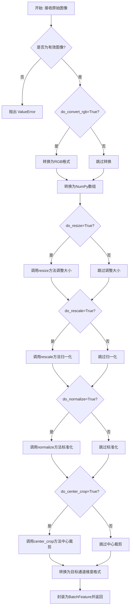
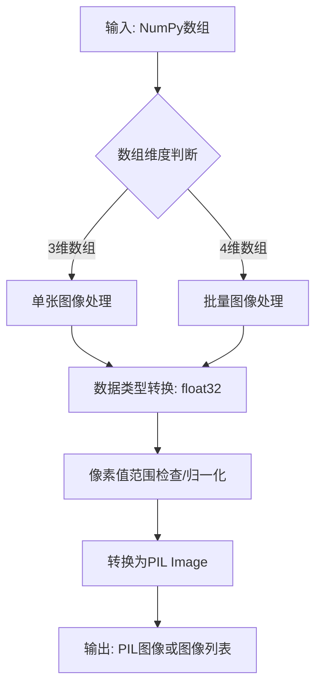
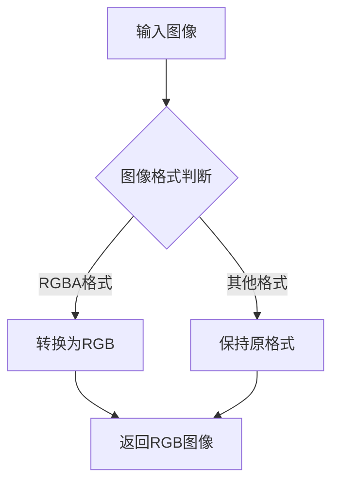
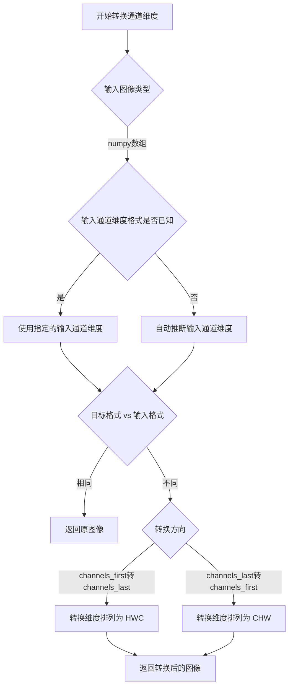
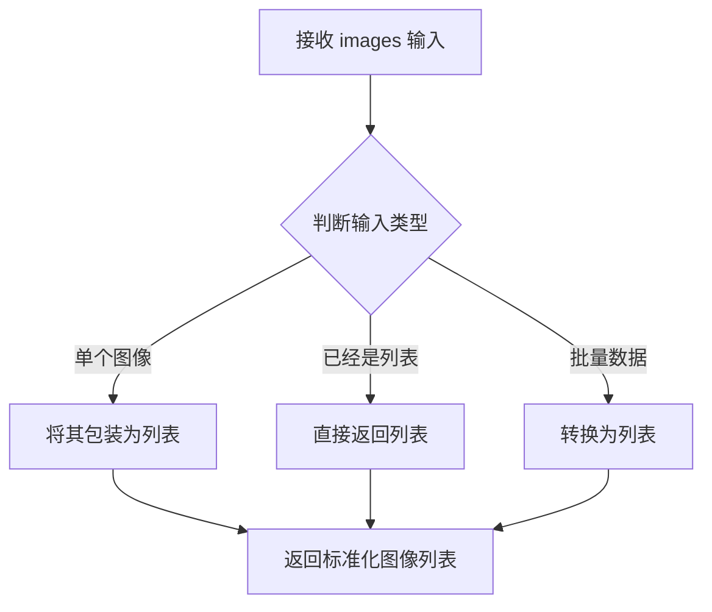
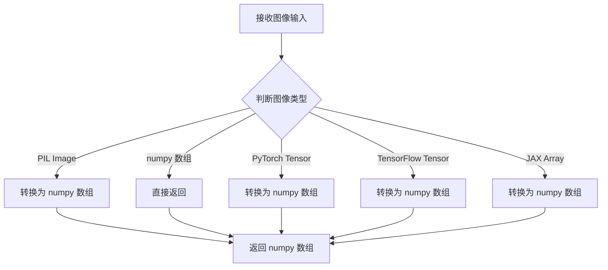
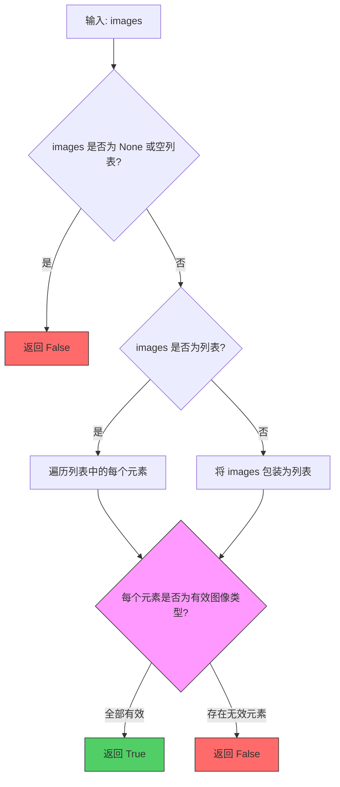
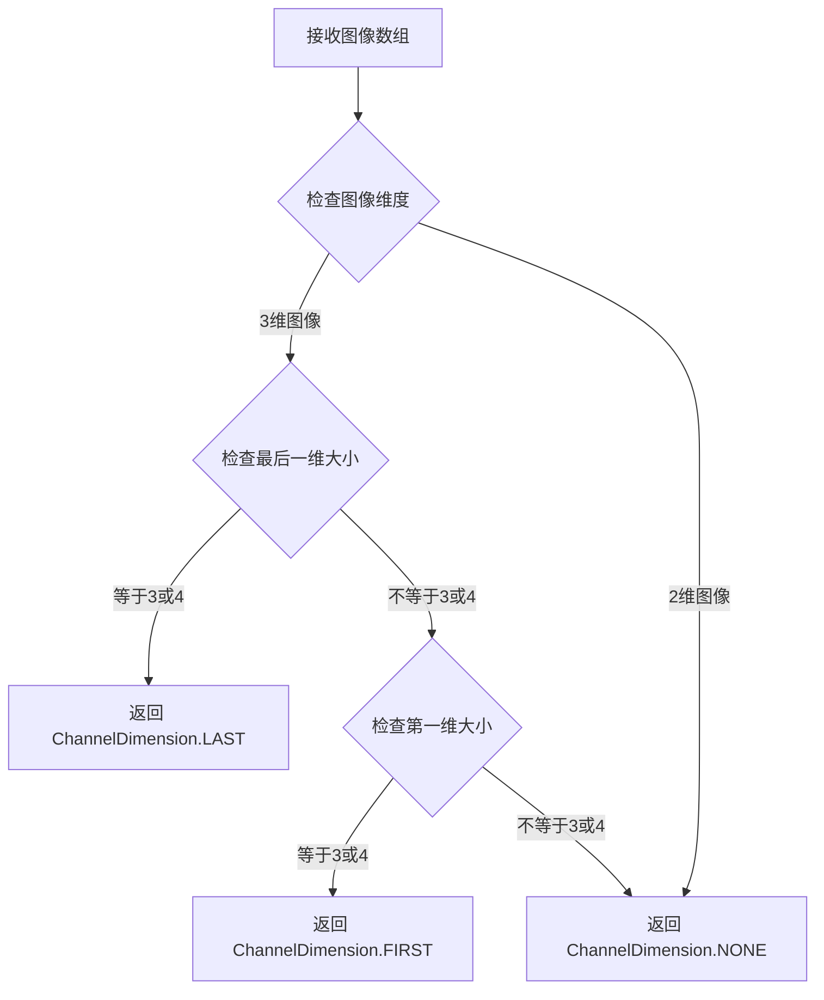
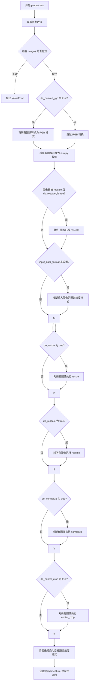

# `diffusers\src\diffusers\pipelines\blip_diffusion\blip_image_processing.py` 详细设计文档

这是一个BLIP图像处理器，负责对图像进行预处理和后处理，包括调整大小、归一化、中心裁剪、RGB转换等操作，将原始图像转换为模型所需的像素值格式。

## 整体流程



## 类结构

```
BaseImageProcessor (transformers基类)
└── BlipImageProcessor (本类)
```

## 全局变量及字段


### `logger`
    
日志记录器

类型：`logging.Logger`
    


### `BlipImageProcessor.model_input_names`
    
模型输入名称列表

类型：`list[str]`
    


### `BlipImageProcessor.do_resize`
    
是否调整图像大小

类型：`bool`
    


### `BlipImageProcessor.size`
    
输出图像尺寸字典

类型：`dict[str, int]`
    


### `BlipImageProcessor.resample`
    
重采样滤波器类型

类型：`PILImageResampling`
    


### `BlipImageProcessor.do_rescale`
    
是否重缩放图像

类型：`bool`
    


### `BlipImageProcessor.rescale_factor`
    
重缩放因子

类型：`int | float`
    


### `BlipImageProcessor.do_normalize`
    
是否标准化图像

类型：`bool`
    


### `BlipImageProcessor.image_mean`
    
图像均值

类型：`float | list[float] | None`
    


### `BlipImageProcessor.image_std`
    
图像标准差

类型：`float | list[float] | None`
    


### `BlipImageProcessor.do_convert_rgb`
    
是否转换为RGB

类型：`bool`
    


### `BlipImageProcessor.do_center_crop`
    
是否中心裁剪

类型：`bool`
    
    

## 全局函数及方法


### numpy_to_pil

该函数为外部导入函数（`from diffusers.utils import numpy_to_pil`），用于将经过处理的 NumPy 数组（通常为图像像素数据）转换为 PIL Image 对象，以便于显示或进一步处理。在 `BlipImageProcessor.postprocess` 方法中被调用，用于将模型输出的张量转换为 PIL 图像格式。

参数：

-  `images`：`numpy.ndarray`，需要转换的 NumPy 数组，通常是形状为 (batch_size, height, width, channels) 或 (height, width, channels) 的图像像素数据，像素值范围在 [0, 1]

返回值：`PIL.Image.Image` 或 `list[PIL.Image.Image]`，转换后的 PIL 图像对象或图像列表

#### 流程图



#### 带注释源码

```python
# 注意：以下为基于diffusers.utils中numpy_to_pil函数功能的推测实现
# 实际源码位于diffusers.utils模块中，此处仅作注释说明

def numpy_to_pil(images):
    """
    将NumPy数组转换为PIL图像。
    
    Args:
        images (np.ndarray): 输入的图像数组，支持以下格式：
            - 单张图像: (height, width, channels) 或 (channels, height, width)
            - 批量图像: (batch_size, height, width, channels)
            像素值通常在 [0, 1] 范围内
    
    Returns:
        PIL.Image.Image or list[PIL.Image.Image]: 转换后的PIL图像
    """
    # 将输入转换为NumPy数组（确保是float32类型）
    images = np.asarray(images, dtype=np.float32)
    
    # 如果是4维数组（批量处理），逐个转换
    if images.ndim == 4:
        return [_numpy_to_pil(img) for img in images]
    
    # 3维数组直接转换
    return _numpy_to_pil(images)


def _numpy_to_pil(image):
    """
    辅助函数：处理单张图像的转换。
    """
    # 归一化到 [0, 255] 范围
    if image.max() <= 1.0:
        image = (image * 255).astype(np.uint8)
    else:
        image = image.astype(np.uint8)
    
    # 处理通道顺序 (channels_first -> channels_last)
    if image.shape[0] in [1, 3]:  # CHW format
        image = image.transpose(1, 2, 0)
    
    # 转换为PIL Image
    if image.shape[-1] == 1:  # 灰度图
        return PIL.Image.fromarray(image.squeeze(), mode='L')
    else:  # RGB/RGBA
        return PIL.Image.fromarray(image, mode='RGB')
```

#### 在BlipImageProcessor中的使用

```python
# 在 BlipImageProcessor.postprocess 方法中的调用
def postprocess(self, sample: torch.Tensor, output_type: str = "pil"):
    # ... 前面的处理代码 ...
    
    # 输出类型为 'pil' 时调用 numpy_to_pil
    if output_type == "pil":
        sample = numpy_to_pil(sample)  # 将NumPy数组转换为PIL图像
        return sample
```


### `convert_to_rgb`

该函数是图像转RGB格式的核心函数，用于将输入图像统一转换为RGB色彩空间。它是从 `transformers` 库导入的外部函数，主要处理PIL RGBA图像转换为RGB格式，确保后续图像处理流程的一致性。

参数：

- `image`：`ImageInput`（PIL.Image, np.ndarray, torch.Tensor 等），待转换的输入图像

返回值：`ImageInput`，转换后的RGB格式图像

#### 流程图



#### 带注释源码

```python
# convert_to_rgb 是从 transformers.image_transforms 导入的外部函数
# 以下是代码中对该函数的使用方式

# 在 BlipImageProcessor.preprocess 方法中的调用：
# PIL RGBA images are converted to RGB
# 如果 do_convert_rgb 参数为 True，则对所有图像进行 RGB 转换
if do_convert_rgb:
    images = [convert_to_rgb(image) for image in images]

# 函数签名（基于 transformers 库的通常设计）：
# def convert_to_rgb(
#     image: ImageInput,
# ) -> ImageInput:
#     """
#     Converts an image to RGB format.
#     
#     Args:
#         image: The image to convert.
#     
#     Returns:
#         The RGB image.
#     """
#     ...
```


### `BlipImageProcessor.resize`

该方法用于将输入图像调整到指定的高度和宽度尺寸，通过调用 `transformers.image_transforms.resize` 函数实现，支持自定义重采样过滤器以及输入输出图像的通道维度格式转换。

参数：

- `image`：`np.ndarray`，要调整大小的图像
- `size`：`dict[str, int]`，输出图像尺寸，格式为 `{"height": int, "width": int}`
- `resample`：`PILImageResampling`，重采样过滤器，默认为 `PILImageResampling.BICUBIC`
- `data_format`：`str | ChannelDimension | None`，输出图像的通道维度格式
- `input_data_format`：`str | ChannelDimension | None`，输入图像的通道维度格式
- `**kwargs`：其他关键字参数，传递给底层 `resize` 函数

返回值：`np.ndarray`，调整大小后的图像

#### 流程图

```mermaid
flowchart TD
    A[开始 resize] --> B{检查 size 参数}
    B -->|缺少 height 或 width| C[抛出 ValueError]
    B -->|参数有效| D[调用 get_size_dict 规范化尺寸]
    D --> E[提取 output_size = (height, width)]
    E --> F[调用 transformers.image_transforms.resize]
    F --> G[传入 image, output_size, resample, data_format, input_data_format]
    G --> H[返回调整大小后的 np.ndarray]
```

#### 带注释源码

```python
def resize(
    self,
    image: np.ndarray,
    size: dict[str, int],
    resample: PILImageResampling = PILImageResampling.BICUBIC,
    data_format: str | ChannelDimension | None = None,
    input_data_format: str | ChannelDimension | None = None,
    **kwargs,
) -> np.ndarray:
    """
    Resize an image to `(size["height"], size["width"])`.

    Args:
        image (`np.ndarray`):
            Image to resize.
        size (`dict[str, int]`):
            Dictionary in the format `{"height": int, "width": int}` specifying the size of the output image.
        resample (`PILImageResampling`, *optional*, defaults to `PILImageResampling.BICUBIC`):
            `PILImageResampling` filter to use when resizing the image e.g. `PILImageResampling.BICUBIC`.
        data_format (`ChannelDimension` or `str`, *optional*):
            The channel dimension format for the output image. If unset, the channel dimension format of the input
            image is used. Can be one of:
            - `"channels_first"` or `ChannelDimension.FIRST`: image in (num_channels, height, width) format.
            - `"channels_last"` or `ChannelDimension.LAST`: image in (height, width, num_channels) format.
            - `"none"` or `ChannelDimension.NONE`: image in (height, width) format.
        input_data_format (`ChannelDimension` or `str`, *optional*):
            The channel dimension format for the input image. If unset, the channel dimension format is inferred
            from the input image. Can be one of:
            - `"channels_first"` or `ChannelDimension.FIRST`: image in (num_channels, height, width) format.
            - `"channels_last"` or `ChannelDimension.LAST`: image in (height, width, num_channels) format.
            - `"none"` or `ChannelDimension.NONE`: image in (height, width) format.

    Returns:
        `np.ndarray`: The resized image.
    """
    # 使用 get_size_dict 规范化 size 参数，确保格式正确
    size = get_size_dict(size)
    # 检查 size 字典是否包含必需的 height 和 width 键
    if "height" not in size or "width" not in size:
        raise ValueError(f"The `size` dictionary must contain the keys `height` and `width`. Got {size.keys()}")
    # 提取目标输出尺寸的元组 (height, width)
    output_size = (size["height"], size["width"])
    # 调用 transformers 库的底层 resize 函数完成实际的重采样调整大小操作
    return resize(
        image,
        size=output_size,
        resample=resample,
        data_format=data_format,
        input_data_format=input_data_format,
        **kwargs,
    )
```


### `to_channel_dimension_format`

将图像的通道维度格式从一种格式转换为另一种格式（例如从 channels_first 转换为 channels_last，或反之）。该函数来自 `transformers.image_transforms` 模块，在 `BlipImageProcessor.preprocess` 方法中被调用，用于在图像预处理完成后将图像转换为目标通道维度格式。

参数：

- `image`：`np.ndarray`，要转换的图像数组
- `data_format`：`ChannelDimension | str`，目标通道维度格式，可选值为 `"channels_first"` / `ChannelDimension.FIRST`（通道在第一维）或 `"channels_last"` / `ChannelDimension.LAST`（通道在最后一维）
- `input_channel_dim`：`str | ChannelDimension | None`，输入图像的通道维度格式，如果为 `None` 则由函数自动推断

返回值：`np.ndarray`，转换后的图像数组，通道维度已更改为目标格式

#### 流程图



#### 带注释源码

```python
# 在 BlipImageProcessor.preprocess 方法中的调用方式：
# 该函数将图像数组的通道维度转换为目标格式

# 参数说明：
# - image: 输入的 numpy 图像数组，形状为 (H, W, C) 或 (C, H, W)
# - data_format: 目标通道维度格式，ChannelDimension.FIRST 表示 (C, H, W)，ChannelDimension.LAST 表示 (H, W, C)
# - input_channel_dim: 输入图像的通道维度格式，如果为 None 则自动推断

images = [
    to_channel_dimension_format(
        image=image,                    # 当前处理的图像数组
        channel_dimension_format=data_format,  # 目标格式（通常是 ChannelDimension.FIRST）
        input_channel_dim=input_data_format   # 输入格式（从图像推断得到）
    )
    for image in images
]

# 示例：
# 假设 input_data_format = ChannelDimension.LAST (H, W, C)
# 假设 data_format = ChannelDimension.FIRST (C, H, W)
# 函数会将图像从 (height, width, channels) 转换为 (channels, height, width)
```


### `make_list_of_images`

将输入的图像数据转换为标准化的图像列表格式，确保后续图像处理流程获得一致的数据结构。

参数：

- `images`：`ImageInput`，输入的图像数据，可以是单个图像对象（如 PIL.Image、numpy.ndarray、torch.Tensor）、图像列表或批量图像数据

返回值：`list`，返回标准化后的图像列表，确保输出始终为可迭代的列表格式

#### 流程图



#### 带注释源码

```python
# 该函数定义位于 transformers.image_utils 模块中
# 以下为基于代码上下文的推断实现

def make_list_of_images(images: ImageInput) -> list:
    """
    将输入的图像数据转换为列表格式。
    
    此函数确保无论输入是单个图像还是多个图像的批次，
    输出都是一个统一的列表结构，以便后续的批处理操作。
    
    Args:
        images: 输入图像，支持以下类型：
            - PIL.Image.Image: 单个PIL图像
            - numpy.ndarray: 单个numpy数组图像
            - torch.Tensor: 单个PyTorch张量图像
            - list: 图像列表
            - 其他支持的图像类型批次
    
    Returns:
        list: 标准化后的图像列表
        
    Raises:
        ValueError: 如果输入的图像类型无效
    """
    # 检查输入是否为None
    if images is None:
        raise ValueError("images cannot be None")
    
    # 如果输入已经是列表，直接返回
    if isinstance(images, list):
        return images
    
    # 如果输入是元组（可能是多个图像），转换为列表
    if isinstance(images, tuple):
        return list(images)
    
    # 单个图像包装为列表返回
    # 这样可以统一处理单图和批量图像的流程
    return [images]
```

#### 在代码中的使用示例

```python
# 在 BlipImageProcessor.preprocess 方法中的调用
def preprocess(self, images: ImageInput, ...):
    # ... 参数处理 ...
    
    # 将输入转换为标准化的图像列表
    images = make_list_of_images(images)
    
    # 后续处理都基于列表进行迭代操作
    if do_convert_rgb:
        images = [convert_to_rgb(image) for image in images]
    
    # 所有转换都期望numpy数组
    images = [to_numpy_array(image) for image in images]
    # ...
```

#### 关键信息

| 项目 | 详情 |
|------|------|
| **来源** | `transformers.image_utils` |
| **依赖** | 外部库函数，非本文件定义 |
| **在类中的作用** | 图像预处理流程的入口标准化步骤 |
| **设计目标** | 统一输入格式，简化后续批处理逻辑 |


### `to_numpy_array`

将输入图像转换为 NumPy 数组格式的函数。这是图像预处理流程中的基础转换步骤，确保后续所有图像变换操作使用统一的数组格式。

参数：

-  `image`：`ImageInput`，输入的图像数据，可以是 PIL Image、numpy.ndarray、torch.Tensor、tf.Tensor 或 jax.ndarray 等格式

返回值：`np.ndarray`，返回转换后的 NumPy 数组格式的图像数据

#### 流程图



#### 带注释源码

```
# 该函数定义在 transformers.image_utils 模块中
# 此处为代码中的调用方式展示
from transformers.image_utils import to_numpy_array

# 在 BlipImageProcessor.preprocess 方法中的调用：
# All transformations expect numpy arrays.
# 将所有图像转换为 NumPy 数组格式，以便后续处理
images = [to_numpy_array(image) for image in images]

# to_numpy_array 函数的主要逻辑推断：
def to_numpy_array(image: ImageInput) -> np.ndarray:
    """
    将输入图像转换为 NumPy 数组格式。
    
    Args:
        image: 输入图像，支持 PIL Image、numpy.ndarray、torch.Tensor、tf.Tensor 或 jax.ndarray
        
    Returns:
        np.ndarray: 转换后的 NumPy 数组
    """
    # 如果已经是 numpy 数组，直接返回
    if isinstance(image, np.ndarray):
        return image
    
    # 如果是 PIL Image，转换为 numpy 数组
    if isinstance(image, PIL.Image.Image):
        return np.array(image)
    
    # 如果是 PyTorch Tensor，转换为 numpy 数组
    if isinstance(image, torch.Tensor):
        return image.detach().cpu().numpy()
    
    # 如果是 TensorFlow Tensor，转换为 numpy 数组
    if isinstance(image, tf.Tensor):
        return image.numpy()
    
    # 如果是 JAX Array，转换为 numpy 数组
    if isinstance(image, jax.numpy.ndarray):
        return np.array(image)
    
    raise TypeError(f"Unsupported image type: {type(image)}")
```

#### 备注

由于 `to_numpy_array` 函数定义在 `transformers` 库中（不在当前代码文件内），上述源码是基于其使用方式和 transformers 库的一般模式推断的。该函数是图像预处理流程中的关键第一步，确保所有输入图像被统一转换为 NumPy 数组格式，以便后续的 resize、rescale、normalize 等变换操作能够一致地进行处理。


### `valid_images`

该函数用于验证输入的图像数据是否有效，检查图像是否为支持的类型（PIL.Image.Image、numpy.ndarray、torch.Tensor、tf.Tensor 或 jax.ndarray）。如果图像无效，返回 False；如果有效，返回 True。

参数：

- `images`：`ImageInput`，待验证的图像或图像列表，支持 PIL Image、numpy 数组、PyTorch Tensor、TensorFlow Tensor 或 JAX ndarray 类型

返回值：`bool`，如果图像有效返回 True，否则返回 False

#### 流程图



#### 带注释源码

```python
# 注意：此函数定义在 transformers.image_utils 模块中，非本文件定义
# 以下为基于使用方式的推断源码结构

def valid_images(images: ImageInput) -> bool:
    """
    验证图像输入是否有效。
    
    Args:
        images: 输入的图像或图像列表，可以是以下类型之一：
            - PIL.Image.Image
            - numpy.ndarray
            - torch.Tensor
            - tf.Tensor
            - jax.ndarray
    
    Returns:
        bool: 如果所有图像都是有效类型返回 True，否则返回 False
    """
    # 如果 images 为 None 或空列表，直接返回 False
    if images is None:
        return False
    
    # 将输入转换为列表（如果是单个图像）
    if not isinstance(images, list):
        images = [images]
    
    # 遍历所有图像，检查每个是否为有效类型
    for image in images:
        # 检查是否为有效图像类型
        # 有效类型包括：PIL Image, numpy array, torch.Tensor, tf.Tensor, jax.ndarray
        if not is_valid_image(image):
            return False
    
    # 所有图像都有效
    return True
```

#### 在本文件中的调用示例

```python
# 在 BlipImageProcessor.preprocess 方法中的调用
images = make_list_of_images(images)

# 验证图像有效性
if not valid_images(images):
    raise ValueError(
        "Invalid image type. Must be of type PIL.Image.Image, numpy.ndarray, "
        "torch.Tensor, tf.Tensor or jax.ndarray."
    )
```

#### 补充说明

`valid_images` 函数并非在本文件中定义，而是从 `transformers.image_utils` 模块导入的全局函数。该函数在 `BlipImageProcessor.preprocess` 方法中被用于输入验证，确保传入的图像符合后续处理的要求。如果图像无效，会抛出 `ValueError` 异常并提示用户正确的图像类型。


### `infer_channel_dimension_format`

推断图像的通道维度格式（位于第一维还是最后一维）。

参数：

- `image`：`np.ndarray`，输入的图像数组，用于推断其通道维度格式

返回值：`ChannelDimension`，推断出的通道维度格式，可以是 `ChannelDimension.FIRST`（通道在第一维，如 (C, H, W)）或 `ChannelDimension.LAST`（通道在最后一维，如 (H, W, C)）

#### 流程图



#### 带注释源码

```python
# 注意：此函数定义于 transformers.image_utils 模块
# 当前文件通过 import 导入使用，以下为推断的函数逻辑

def infer_channel_dimension_format(image: np.ndarray) -> ChannelDimension:
    """
    推断图像的通道维度格式。
    
    参数:
        image: 输入的图像数组，可以是 2D（灰度）或 3D（彩色）图像
        
    返回:
        ChannelDimension 枚举值，表示通道维度的位置
    """
    # 获取图像的维度数量
    num_dims = len(image.shape)
    
    if num_dims == 3:
        # 3维图像：可能是 (C, H, W) 或 (H, W, C)
        # 检查最后一个维度是否为通道维度
        if image.shape[-1] in [1, 3, 4]:
            return ChannelDimension.LAST  # (H, W, C) 格式
        # 检查第一个维度是否为通道维度
        elif image.shape[0] in [1, 3, 4]:
            return ChannelDimension.FIRST  # (C, H, W) 格式
        else:
            # 无法确定通道维度
            return ChannelDimension.NONE
    elif num_dims == 2:
        # 2维图像：灰度图，无通道维度
        return ChannelDimension.NONE
    else:
        # 其他情况
        return ChannelDimension.NONE
```

#### 在当前文件中的调用示例

```python
# 在 BlipImageProcessor.preprocess 方法中的调用
if input_data_format is None:
    # 假设所有图像具有相同的通道维度格式
    input_data_format = infer_channel_dimension_format(images[0])
```


### `is_scaled_image`

检查输入图像是否已经过像素值缩放处理（即像素值是否已在 [0, 1] 范围内）。

参数：

-  `image`：`ImageInput`（numpy.ndarray 或其他图像类型），需要检查的图像对象

返回值：`bool`，如果图像像素值已被缩放（范围在 0 到 1 之间），返回 `True`；否则返回 `False`

#### 流程图

```mermaid
flowchart TD
    A[开始检查图像是否已缩放] --> B{传入图像}
    B --> C{检查图像像素值范围}
    C -->|像素值在 [0, 1] 范围内| D[返回 True]
    C -->|像素值超出 [0, 1] 范围| E[返回 False]
    D --> F[结束]
    E --> F
```

#### 带注释源码

```python
# 在本文件中 is_scaled_image 是从 transformers.image_utils 导入的外部函数
# 其定义位于 transformers 库中，这里展示的是在本文件中的使用方式

# 从 transformers 导入（代码第 24 行）
from transformers.image_utils import (
    OPENAI_CLIP_MEAN,
    OPENAI_CLIP_STD,
    ChannelDimension,
    ImageInput,
    PILImageResampling,
    infer_channel_dimension_format,
    is_scaled_image,  # <-- 从 transformers 库导入的外部函数
    make_list_of_images,
    to_numpy_array,
    valid_images,
)

# 在 BlipImageProcessor.preprocess 方法中的使用（代码第 252-256 行）
if is_scaled_image(images[0]) and do_rescale:
    logger.warning_once(
        "It looks like you are trying to rescale already rescaled images. If the input"
        " images have pixel values between 0 and 1, set `do_rescale=False` to avoid rescaling them again."
    )

# is_scaled_image 函数功能说明：
# 用途：检测图像是否已经被缩放（像素值在 0-1 范围内）
# 输入参数：
#   - image: numpy.ndarray 或 PIL.Image，输入图像（通常为转换后的 numpy 数组）
# 返回值：
#   - bool: True 表示图像已缩放，False 表示未缩放
# 使用场景：
#   - 在图像预处理流水线中，如果图像已经过缩放（do_rescale=True 的结果），
#     再次调用 rescale 操作会导致警告或错误，因此需要预先检查
```

#### 补充说明

`is_scaled_image` 是 `transformers` 库提供的工具函数，用于判断图像像素值是否已被归一化到 [0, 1] 区间。在 `BlipImageProcessor.preprocess` 方法中，此函数用于：

1. **防止重复缩放**：如果图像已经缩放（像素值在 0-1 范围），而用户仍然设置 `do_rescale=True`，系统会发出警告
2. **智能提示用户**：帮助用户正确配置预处理参数，避免不必要的重复操作

该函数的具体实现位于 `transformers.image_utils` 模块中，通过检查图像的最大值和最小值来判断是否已进行缩放处理。


### `transformers.image_processing_utils.get_size_dict`

该函数是 transformers 库中的图像处理工具函数，主要用于将不同格式的尺寸参数（如整数、字典等）标准化为统一的字典格式（如 `{"height": int, "width": int}` 或 `{"shortest_edge": int}`），并根据 `default_to_square` 参数决定是否将尺寸强制转换为正方形。在 BLIP 图像处理器中，该函数被用于规范化初始化、调整大小和预处理过程中的尺寸参数。

参数：

-  `size`：`int | dict[str, int]`，输入的尺寸参数，可以是单个整数表示短边长度，或包含 height/width 键的字典
-  `default_to_square`：`bool`，可选参数，默认为 True，指示是否将非正方形尺寸转换为正方形
-  `input_data_format`：`ChannelDimension | str | None`，可选参数，指定输入数据的通道维度格式

返回值：`dict[str, int]`，返回标准化后的尺寸字典，格式为 `{"height": int, "width": int}` 或 `{"shortest_edge": int}`

#### 流程图

```mermaid
flowchart TD
    A[开始 get_size_dict] --> B{size 参数类型}
    B -->|int 类型| C[创建 shortest_edge 字典]
    B -->|dict 类型| D{检查是否包含 height/width}
    D -->|是| E[直接返回原字典]
    D -->|否| F{检查是否包含 shortest_edge}
    F -->|是| G[根据 default_to_square 转换]
    F -->|否| H[抛出 ValueError]
    C --> G
    G --> I{default_to_square}
    I -->|True| J[生成正方形尺寸 {"height": size, "width": size}]
    I -->|False| K[返回 {"shortest_edge": size}]
    J --> L[返回标准化尺寸字典]
    K --> L
```

#### 带注释源码

```python
# 从 transformers 库导入的外部函数
# 以下是基于代码使用方式的推断实现

def get_size_dict(
    size: int | dict[str, int],
    default_to_square: bool = True,
    input_data_format: str | ChannelDimension | None = None,
) -> dict[str, int]:
    """
    将尺寸参数标准化为字典格式。
    
    该函数处理三种主要的输入格式：
    1. 整数：表示图像短边长度
    2. {"height": int, "width": int}：明确指定高度和宽度
    3. {"shortest_edge": int}：仅指定短边长度
    
    Args:
        size: 输入的尺寸参数，可以是整数或字典
        default_to_square: 是否将非正方形尺寸转换为正方形
        input_data_format: 输入数据的通道维度格式
    
    Returns:
        标准化的尺寸字典
    """
    # 如果输入是整数，创建 shortest_edge 键的字典
    if isinstance(size, int):
        size = {"shortest_edge": size}
    
    # 如果是字典类型
    if isinstance(size, dict):
        # 如果已包含 height 和 width 键，直接返回
        if "height" in size and "width" in size:
            return size
        
        # 如果包含 shortest_edge 键
        if "shortest_edge" in size:
            # 根据 default_to_square 决定输出格式
            if default_to_square:
                # 转换为正方形尺寸
                size = {
                    "height": size["shortest_edge"],
                    "width": size["shortest_edge"]
                }
            # 否则保持 shortest_edge 格式
    
    return size
```

#### 在 BLIP 图像处理器中的调用示例

```python
# 在 BlipImageProcessor.__init__ 中的调用
size = get_size_dict(size, default_to_square=True)
# 输入: {"height": 224, "width": 224} 或 224
# 输出: {"height": 224, "width": 224}

# 在 resize 方法中的调用
size = get_size_dict(size)
# 确保尺寸字典包含 height 和 width 键

# 在 preprocess 方法中的调用
size = get_size_dict(size, default_to_square=False)
# 允许非正方形尺寸，保持 shortest_edge 格式用于后续处理
```


### BlipImageProcessor.__init__

初始化 BLIP 图像处理器实例，配置图像预处理的各项参数，包括是否调整大小、是否重缩放、是否归一化、是否转换为 RGB 等，并设置默认图像尺寸为 224x224。

参数：

- `do_resize`：`bool`，可选，默认为 `True`，是否对图像进行尺寸调整
- `size`：`dict[str, int]`，可选，默认为 `{"height": 224, "width": 224}`，调整后的图像尺寸字典
- `resample`：`PILImageResampling`，可选，默认为 `PILImageResampling.BICUBIC`，调整图像时使用的重采样方法
- `do_rescale`：`bool`，可选，默认为 `True`，是否对图像像素值进行重缩放（除以 255）
- `rescale_factor`：`int | float`，可选，默认为 `1 / 255`，重缩放因子
- `do_normalize`：`bool`，可选，默认为 `True`，是否对图像进行归一化
- `image_mean`：`float | list[float] | None`，可选，默认为 `OPENAI_CLIP_MEAN`，归一化使用的均值
- `image_std`：`float | list[float] | None`，可选，默认为 `OPENAI_CLIP_STD`，归一化使用的标准差
- `do_convert_rgb`：`bool`，可选，默认为 `True`，是否将图像转换为 RGB 格式
- `do_center_crop`：`bool`，可选，默认为 `True`，是否对图像进行中心裁剪
- `**kwargs`：可变关键字参数，传递给父类 `BaseImageProcessor`

返回值：`None`，无返回值（构造函数）

#### 流程图

```mermaid
flowchart TD
    A[开始 __init__] --> B[调用父类 super().__init__**kwargs]
    B --> C{size 参数是否为 None}
    C -->|是| D[设置默认 size = {height: 224, width: 224}]
    C -->|否| E[使用传入的 size]
    D --> F[调用 get_size_dictsize, default_to_square=True]
    E --> F
    F --> G[设置 self.do_resize = do_resize]
    G --> H[设置 self.size = size]
    H --> I[设置 self.resample = resample]
    I --> J[设置 self.do_rescale = do_rescale]
    J --> K[设置 self.rescale_factor = rescale_factor]
    K --> L[设置 self.do_normalize = do_normalize]
    L --> M{image_mean 参数是否为 None}
    M -->|是| N[设置 self.image_mean = OPENAI_CLIP_MEAN]
    M -->|否| O[设置 self.image_mean = 传入的 image_mean]
    N --> P{image_std 参数是否为 None}
    O --> P
    P -->|是| Q[设置 self.image_std = OPENAI_CLIP_STD]
    P -->|否| R[设置 self.image_std = 传入的 image_std]
    Q --> S[设置 self.do_convert_rgb = do_convert_rgb]
    R --> S
    S --> T[设置 self.do_center_crop = do_center_crop]
    T --> U[结束 __init__]
```

#### 带注释源码

```python
def __init__(
    self,
    do_resize: bool = True,                          # 是否调整图像尺寸
    size: dict[str, int] = None,                     # 目标尺寸字典，如 {"height": 224, "width": 224}
    resample: PILImageResampling = PILImageResampling.BICUBIC,  # 重采样方法，默认为双三次插值
    do_rescale: bool = True,                         # 是否进行像素值重缩放（0-255 -> 0-1）
    rescale_factor: int | float = 1 / 255,           # 重缩放因子，默认除以255
    do_normalize: bool = True,                        # 是否进行归一化
    image_mean: float | list[float] | None = None,   # 归一化均值，默认为 CLIP 平均值
    image_std: float | list[float] | None = None,    # 归一化标准差，默认为 CLIP 标准差
    do_convert_rgb: bool = True,                     # 是否转换为 RGB 格式
    do_center_crop: bool = True,                     # 是否进行中心裁剪
    **kwargs,                                        # 传递给父类的额外关键字参数
) -> None:
    # 调用父类 BaseImageProcessor 的初始化方法
    super().__init__(**kwargs)
    
    # 如果未指定 size，则使用默认的 224x224 尺寸
    size = size if size is not None else {"height": 224, "width": 224}
    # 使用 transformers 库的 get_size_dict 验证并规范化尺寸字典
    size = get_size_dict(size, default_to_square=True)

    # 存储各个图像处理配置到实例属性
    self.do_resize = do_resize                        # 是否调整尺寸
    self.size = size                                   # 目标尺寸
    self.resample = resample                           # 重采样方法
    self.do_rescale = do_rescale                       # 是否重缩放
    self.rescale_factor = rescale_factor               # 重缩放因子
    self.do_normalize = do_normalize                   # 是否归一化
    # 如果未指定均值，则使用 OpenAI CLIP 的默认均值
    self.image_mean = image_mean if image_mean is not None else OPENAI_CLIP_MEAN
    # 如果未指定标准差，则使用 OpenAI CLIP 的默认标准差
    self.image_std = image_std if image_std is not None else OPENAI_CLIP_STD
    self.do_convert_rgb = do_convert_rgb               # 是否转换为 RGB
    self.do_center_crop = do_center_crop               # 是否中心裁剪
```


### `BlipImageProcessor.resize`

调整图像尺寸至指定的高度和宽度，通过调用 transformers 库的 resize 函数实现图像缩放。

参数：

- `self`：`BlipImageProcessor`，BlipImageProcessor 实例本身
- `image`：`np.ndarray`，要调整尺寸的图像
- `size`：`dict[str, int]`，输出图像尺寸，格式为 `{"height": int, "width": int}`
- `resample`：`PILImageResampling`，重采样过滤器，默认为 `PILImageResampling.BICUBIC`
- `data_format`：`str | ChannelDimension | None`，输出图像的通道维度格式，可选 "channels_first"、"channels_last" 或 "none"
- `input_data_format`：`str | ChannelDimension | None`，输入图像的通道维度格式，可选 "channels_first"、"channels_last" 或 "none"
- `**kwargs`：其他关键字参数

返回值：`np.ndarray`，调整尺寸后的图像

#### 流程图

```mermaid
flowchart TD
    A[开始 resize] --> B[调用 get_size_dict 规范化 size 参数]
    B --> C{检查 size 是否包含 height 和 width}
    C -->|是| D[提取 output_size = (height, width)]
    C -->|否| E[抛出 ValueError 异常]
    D --> F[调用 transformers.resize 函数]
    F --> G[传入参数: image, output_size, resample, data_format, input_data_format, kwargs]
    G --> H[返回 resized 图像]
    E --> I[结束]
    H --> I
```

#### 带注释源码

```python
def resize(
    self,
    image: np.ndarray,
    size: dict[str, int],
    resample: PILImageResampling = PILImageResampling.BICUBIC,
    data_format: str | ChannelDimension | None = None,
    input_data_format: str | ChannelDimension | None = None,
    **kwargs,
) -> np.ndarray:
    """
    Resize an image to `(size["height"], size["width"])`.

    Args:
        image (`np.ndarray`):
            Image to resize.
        size (`dict[str, int]`):
            Dictionary in the format `{"height": int, "width": int}` specifying the size of the output image.
        resample (`PILImageResampling`, *optional*, defaults to `PILImageResampling.BICUBIC`):
            `PILImageResampling` filter to use when resizing the image e.g. `PILImageResampling.BICUBIC`.
        data_format (`ChannelDimension` or `str`, *optional*):
            The channel dimension format for the output image. If unset, the channel dimension format of the input
            image is used. Can be one of:
            - `"channels_first"` or `ChannelDimension.FIRST`: image in (num_channels, height, width) format.
            - `"channels_last"` or `ChannelDimension.LAST`: image in (height, width, num_channels) format.
            - `"none"` or `ChannelDimension.NONE`: image in (height, width) format.
        input_data_format (`ChannelDimension` or `str`, *optional*):
            The channel dimension format for the input image. If unset, the channel dimension format is inferred
            from the input image. Can be one of:
            - `"channels_first"` or `ChannelDimension.FIRST`: image in (num_channels, height, width) format.
            - `"channels_last"` or `ChannelDimension.LAST`: image in (height, width, num_channels) format.
            - `"none"` or `ChannelDimension.NONE`: image in (height, width) format.

    Returns:
        `np.ndarray`: The resized image.
    """
    # 使用 get_size_dict 规范化 size 参数，确保格式正确
    size = get_size_dict(size)
    # 验证 size 字典必须包含 height 和 width 键，否则抛出异常
    if "height" not in size or "width" not in size:
        raise ValueError(f"The `size` dictionary must contain the keys `height` and `width`. Got {size.keys()}")
    # 提取输出尺寸的元组 (height, width)
    output_size = (size["height"], size["width"])
    # 调用 transformers 库的 resize 函数进行实际的图像缩放操作
    return resize(
        image,
        size=output_size,
        resample=resample,
        data_format=data_format,
        input_data_format=input_data_format,
        **kwargs,
    )
```


### BlipImageProcessor.preprocess

预处理图像主方法，用于将输入的图像或图像批次进行一系列标准化预处理操作（包括RGB转换、 resize、rescale、归一化和中心裁剪），最终输出符合模型输入要求的张量格式。

参数：

- `images`：`ImageInput`，待预处理的图像，支持单个或批量图像，像素值范围为0-255（若像素值在0-1之间，需设置 `do_rescale=False`）
- `do_resize`：`bool | None`，是否调整图像大小，默认为 `self.do_resize`
- `size`：`dict[str, int] | None`，控制 resize 后的图像尺寸，默认为 `self.size`
- `resample`：`PILImageResampling`，重采样滤波器，用于调整大小时使用，默认为 `self.resample`
- `do_rescale`：`bool | None`，是否将图像值重新缩放至 [0-1] 范围，默认为 `self.do_rescale`
- `do_center_crop`：`bool | None`，是否进行中心裁剪，默认为 `self.do_center_crop`
- `rescale_factor`：`float | None`，重新缩放因子，当 `do_rescale` 为 True 时使用，默认为 `self.rescale_factor`
- `do_normalize`：`bool | None`，是否归一化图像，默认为 `self.do_normalize`
- `image_mean`：`float | list[float] | None`，归一化使用的均值，当 `do_normalize` 为 True 时使用，默认为 `self.image_mean`
- `image_std`：`float | list[float] | None`，归一化使用的标准差，当 `do_normalize` 为 True 时使用，默认为 `self.image_std`
- `do_convert_rgb`：`bool`，是否将图像转换为 RGB 格式，默认为 `self.do_convert_rgb`
- `return_tensors`：`str | TensorType | None`，返回的张量类型，可选值为 'pt'/'TensorType.PYTORCH'、'np'/'TensorType.NUMPY'、'tf'/'TensorType.TENSORFLOW'、'jax'/'TensorType.JAX'
- `data_format`：`ChannelDimension`，输出图像的通道维度格式，默认为 `ChannelDimension.FIRST`（即 (num_channels, height, width) 格式）
- `input_data_format`：`str | ChannelDimension | None`，输入图像的通道维度格式，若未设置则从输入图像推断
- `**kwargs`：其他关键字参数

返回值：`BatchFeature`，包含预处理后图像数据的对象，默认包含键 `pixel_values`，其值为符合模型输入要求的张量（numpy 数组、PyTorch 张量、TensorFlow 张量或 JAX 数组，取决于 `return_tensors` 参数）

#### 流程图



#### 带注释源码

```python
def preprocess(
    self,
    images: ImageInput,
    do_resize: bool | None = None,
    size: dict[str, int] | None = None,
    resample: PILImageResampling = None,
    do_rescale: bool | None = None,
    do_center_crop: bool | None = None,
    rescale_factor: float | None = None,
    do_normalize: bool | None = None,
    image_mean: float | list[float] | None = None,
    image_std: float | list[float] | None = None,
    return_tensors: str | TensorType | None = None,
    do_convert_rgb: bool = None,
    data_format: ChannelDimension = ChannelDimension.FIRST,
    input_data_format: str | ChannelDimension | None = None,
    **kwargs,
) -> BatchFeature:
    """
    Preprocess an image or batch of images.

    Args:
        images (`ImageInput`):
            Image to preprocess. Expects a single or batch of images with pixel values ranging from 0 to 255. If
            passing in images with pixel values between 0 and 1, set `do_rescale=False`.
        do_resize (`bool`, *optional*, defaults to `self.do_resize`):
            Whether to resize the image.
        size (`dict[str, int]`, *optional*, defaults to `self.size`):
            Controls the size of the image after `resize`. The shortest edge of the image is resized to
            `size["shortest_edge"]` whilst preserving the aspect ratio. If the longest edge of this resized image
            is > `int(size["shortest_edge"] * (1333 / 800))`, then the image is resized again to make the longest
            edge equal to `int(size["shortest_edge"] * (1333 / 800))`.
        resample (`PILImageResampling`, *optional*, defaults to `self.resample`):
            Resampling filter to use if resizing the image. Only has an effect if `do_resize` is set to `True`.
        do_rescale (`bool`, *optional*, defaults to `self.do_rescale`):
            Whether to rescale the image values between [0 - 1].
        rescale_factor (`float`, *optional*, defaults to `self.rescale_factor`):
            Rescale factor to rescale the image by if `do_rescale` is set to `True`.
        do_normalize (`bool`, *optional*, defaults to `self.do_normalize`):
            Whether to normalize the image.
        image_mean (`float` or `list[float]`, *optional*, defaults to `self.image_mean`):
            Image mean to normalize the image by if `do_normalize` is set to `True`.
        image_std (`float` or `list[float]`, *optional*, defaults to `self.image_std`):
            Image standard deviation to normalize the image by if `do_normalize` is set to `True`.
        do_convert_rgb (`bool`, *optional*, defaults to `self.do_convert_rgb`):
            Whether to convert the image to RGB.
        return_tensors (`str` or `TensorType`, *optional*):
            The type of tensors to return. Can be one of:
                - Unset: Return a list of `np.ndarray`.
                - `TensorType.TENSORFLOW` or `'tf'`: Return a batch of type `tf.Tensor`.
                - `TensorType.PYTORCH` or `'pt'`: Return a batch of type `torch.Tensor`.
                - `TensorType.NUMPY` or `'np'`: Return a batch of type `np.ndarray`.
                - `TensorType.JAX` or `'jax'`: Return a batch of type `jax.numpy.ndarray`.
        data_format (`ChannelDimension` or `str`, *optional*, defaults to `ChannelDimension.FIRST`):
            The channel dimension format for the output image. Can be one of:
            - `"channels_first"` or `ChannelDimension.FIRST`: image in (num_channels, height, width) format.
            - `"channels_last"` or `ChannelDimension.LAST`: image in (height, width, num_channels) format.
            - Unset: Use the channel dimension format of the input image.
        input_data_format (`ChannelDimension` or `str`, *optional*):
            The channel dimension format for the input image. If unset, the channel dimension format is inferred
            from the input image. Can be one of:
            - `"channels_first"` or `ChannelDimension.FIRST`: image in (num_channels, height, width) format.
            - `"channels_last"` or `ChannelDimension.LAST`: image in (height, width, num_channels) format.
            - `"none"` or `ChannelDimension.NONE`: image in (height, width) format.
    """
    # 如果参数为 None，则使用实例默认值
    do_resize = do_resize if do_resize is not None else self.do_resize
    resample = resample if resample is not None else self.resample
    do_rescale = do_rescale if do_rescale is not None else self.do_rescale
    rescale_factor = rescale_factor if rescale_factor is not None else self.rescale_factor
    do_normalize = do_normalize if do_normalize is not None else self.do_normalize
    image_mean = image_mean if image_mean is not None else self.image_mean
    image_std = image_std if image_std is not None else self.image_std
    do_convert_rgb = do_convert_rgb if do_convert_rgb is not None else self.do_convert_rgb
    do_center_crop = do_center_crop if do_center_crop is not None else self.do_center_crop

    # 处理 size 参数
    size = size if size is not None else self.size
    size = get_size_dict(size, default_to_square=False)
    # 将输入转换为图像列表
    images = make_list_of_images(images)

    # 验证图像有效性
    if not valid_images(images):
        raise ValueError(
            "Invalid image type. Must be of type PIL.Image.Image, numpy.ndarray, "
            "torch.Tensor, tf.Tensor or jax.ndarray."
        )

    # 验证参数一致性
    if do_resize and size is None or resample is None:
        raise ValueError("Size and resample must be specified if do_resize is True.")

    if do_rescale and rescale_factor is None:
        raise ValueError("Rescale factor must be specified if do_rescale is True.")

    if do_normalize and (image_mean is None or image_std is None):
        raise ValueError("Image mean and std must be specified if do_normalize is True.")

    # PIL RGBA images are converted to RGB
    # 将 RGBA 图像转换为 RGB 格式
    if do_convert_rgb:
        images = [convert_to_rgb(image) for image in images]

    # All transformations expect numpy arrays.
    # 所有变换操作都基于 numpy 数组进行
    images = [to_numpy_array(image) for image in images]

    # 检查图像是否已被 rescale 并发出警告
    if is_scaled_image(images[0]) and do_rescale:
        logger.warning_once(
            "It looks like you are trying to rescale already rescaled images. If the input"
            " images have pixel values between 0 and 1, set `do_rescale=False` to avoid rescaling them again."
        )
    
    # 推断输入图像的通道维度格式（假设所有图像具有相同的通道维度格式）
    if input_data_format is None:
        input_data_format = infer_channel_dimension_format(images[0])

    # 执行 resize 操作
    if do_resize:
        images = [
            self.resize(image=image, size=size, resample=resample, input_data_format=input_data_format)
            for image in images
        ]

    # 执行 rescale 操作（像素值缩放）
    if do_rescale:
        images = [
            self.rescale(image=image, scale=rescale_factor, input_data_format=input_data_format)
            for image in images
        ]
    
    # 执行 normalize 操作（均值方差归一化）
    if do_normalize:
        images = [
            self.normalize(image=image, mean=image_mean, std=image_std, input_data_format=input_data_format)
            for image in images
        ]
    
    # 执行 center_crop 操作
    if do_center_crop:
        images = [self.center_crop(image, size, input_data_format=input_data_format) for image in images]

    # 转换通道维度格式以匹配目标格式
    images = [
        to_channel_dimension_format(image, data_format, input_channel_dim=input_data_format) for image in images
    ]

    # 封装为 BatchFeature 对象并返回
    encoded_outputs = BatchFeature(data={"pixel_values": images}, tensor_type=return_tensors)
    return encoded_outputs
```


### `BlipImageProcessor.postprocess`

该方法用于后处理模型输出，将模型输出的图像张量从归一化状态（范围通常为[-1, 1]）进行反归一化，并根据 `output_type` 参数转换为目标格式（PyTorch 张量、NumPy 数组或 PIL 图像）。

参数：

- `self`：`BlipImageProcessor`，当前类的实例
- `sample`：`torch.Tensor`，模型输出的图像张量，通常范围在 [-1, 1] 之间
- `output_type`：`str`，期望的输出格式，可选值为 `"pt"`（返回 PyTorch 张量）、`"np"`（返回 NumPy 数组）或 `"pil"`（返回 PIL 图像），默认为 `"pil"`

返回值：根据 `output_type` 参数返回相应格式的图像数据。若为 `"pt"`，返回 `torch.Tensor`；若为 `"np"`，返回 `np.ndarray`；若为 `"pil"`，返回 `PIL.Image.Image` 或 `List[PIL.Image.Image]`。

#### 流程图

```mermaid
flowchart TD
    A[开始 postprocess] --> B{检查 output_type 是否合法}
    B -->|合法| C[反归一化: sample = (sample / 2 + 0.5).clamp(0, 1)]
    B -->|不合法| D[抛出 ValueError 异常]
    C --> E{output_type == 'pt'?}
    E -->|是| F[直接返回 sample 張量]
    E -->|否| G[转换为 NumPy: sample.cpu().permute(0, 2, 3, 1).numpy()]
    G --> H{output_type == 'np'?}
    H -->|是| I[返回 NumPy 数组]
    H -->|否| J[转换为 PIL 图像: numpy_to_pil(sample)]
    I --> K[结束]
    F --> K
    J --> K
    D --> K
```

#### 带注释源码

```python
def postprocess(self, sample: torch.Tensor, output_type: str = "pil"):
    """
    后处理模型输出，将图像张量反归一化并转换为指定格式。

    Args:
        sample (torch.Tensor): 模型输出的图像张量，范围通常在 [-1, 1] 之间
        output_type (str): 期望的输出格式，可选 "pt"、"np" 或 "pil"，默认为 "pil"

    Returns:
        根据 output_type 返回 torch.Tensor、np.ndarray 或 PIL.Image.Image
    """
    # 检查 output_type 参数是否合法，支持三种输出格式
    if output_type not in ["pt", "np", "pil"]:
        raise ValueError(
            f"output_type={output_type} is not supported. Make sure to choose one of ['pt', 'np', or 'pil']"
        )

    # Equivalent to diffusers.VaeImageProcessor.denormalize
    # 反归一化处理：将图像从 [-1, 1] 范围映射回 [0, 1] 范围
    # 公式: (sample / 2 + 0.5).clamp(0, 1)
    # 其中 sample / 2 将范围从 [-1, 1] 映射到 [-0.5, 0.5]
    # 再加上 0.5 将范围映射到 [0, 1]
    # clamp(0, 1) 确保值被限制在 [0, 1] 范围内
    sample = (sample / 2 + 0.5).clamp(0, 1)

    # 如果只需要 PyTorch 张子格式，直接返回（无需进一步转换）
    if output_type == "pt":
        return sample

    # Equivalent to diffusers.VaeImageProcessor.pt_to_numpy
    # 转换为 NumPy 数组：先移动到 CPU，然后调整维度顺序，最后转为 NumPy
    # permute(0, 2, 3, 1) 将张量从 (batch, channel, height, width) 
    # 转换为 (batch, height, width, channel) 格式
    sample = sample.cpu().permute(0, 2, 3, 1).numpy()

    # 如果只需要 NumPy 数组格式，直接返回
    if output_type == "np":
        return sample

    # Output_type must be 'pil'
    # 如果需要 PIL 图像格式，将 NumPy 数组转换为 PIL 图像
    sample = numpy_to_pil(sample)
    return sample
```

## 关键组件


### BlipImageProcessor 类

BLIP 图像处理器类，继承自 BaseImageProcessor，负责对图像进行预处理和后处理，支持调整大小、归一化、中心裁剪、RGB 转换等操作，并将处理后的图像转换为模型所需的像素值格式。

### 图像预处理流程 (preprocess 方法)

核心预处理方法，接收原始图像输入，按照配置的流水线（resize -> rescale -> normalize -> center_crop -> channel_dimension_format）依次处理图像，最终返回包含 pixel_values 的 BatchFeature 对象，支持多种输出张量类型（PyTorch、NumPy、TensorFlow、JAX）。

### 图像调整大小 (resize 方法)

使用指定的重新采样方法（PILImageResampling.BICUBIC）将图像调整到目标尺寸（height x width），支持不同的通道维度格式输入和输出，确保图像长宽比处理的一致性。

### 图像后处理 (postprocess)

将模型输出的张量反归一化（从 [-1,1] 到 [0,1]），并根据 output_type 参数转换为指定格式（PyTorch 张量、NumPy 数组或 PIL 图像），实现从模型输出到可视化图像的转换。

### 图像验证与转换

使用 valid_images、make_list_of_images、to_numpy_array 等工具函数确保输入图像的有效性，并将不同格式（PIL、numpy、torch）的图像统一转换为 numpy 数组进行处理。

### 中心裁剪支持

通过 do_center_crop 参数和 center_crop 方法实现中心裁剪功能，从 transformers 库复制并适配，用于将图像裁剪到目标尺寸。

### 图像归一化参数

使用 OPENAI_CLIP_MEAN 和 OPENAI_CLIP_STD 作为默认的图像均值和标准差，支持自定义均值和标准差进行图像标准化处理。

### 通道维度格式处理

支持 "channels_first"（通道优先）和 "channels_last"（通道最后）两种通道维度格式，使用 to_channel_dimension_format 进行转换，确保与不同深度学习框架的兼容性。


## 问题及建议


### 已知问题

- **docstring语法错误**：在`__init__`方法的docstring中，`do_rescale`参数描述出现"Wwhether"拼写错误，应为"Whether"。
- **docstring重复描述**：参数描述中多次重复出现相同的覆盖说明，如"Can be overridden by the..."出现多次，造成冗余。
- **复制粘贴代码**：代码注释提到从transformers复制了resize和center crop相关功能，导致代码重复，未充分利用继承机制。
- **类型注解错误**：`preprocess`方法声明返回类型为`PIL.Image.Image`，但实际返回的是`BatchFeature`对象。
- **硬编码的反归一化值**：在`postprocess`方法中，denormalize使用硬编码的`(sample / 2 + 0.5)`，但预处理时normalize使用的是`OPENAI_CLIP_MEAN`和`OPENAI_CLIP_STD`，两者不匹配。
- **默认参数类型不一致**：`preprocess`方法中`resample`参数默认值为`None`，但类型注解为`PILImageResampling`，未体现可为空类型。
- **center_crop方法依赖父类**：调用了`self.center_crop`但未在当前类中定义，依赖父类`BaseImageProcessor`的实现，缺少明确的文档说明。

### 优化建议

- 修复docstring中的拼写错误和重复描述，使用更清晰的参数说明格式。
- 将复制的方法提取到独立的工具模块或利用mixin类，减少代码重复。
- 修正`preprocess`方法的返回类型注解为`BatchFeature`。
- 将`postprocess`中的denormalize参数提取为类属性，使其与`image_mean`和`image_std`对应，提高可配置性。
- 为`resample`等参数的类型注解添加`None`类型，如`PILImageResampling | None`。
- 考虑添加对center_crop方法的显式定义或重写，并在docstring中说明其来源和行为。

## 其它


### 设计目标与约束

本图像处理器旨在为BLIP（Bootstrapped Language-Image Pre-training）模型提供标准化的图像预处理流程，确保输入图像符合模型要求的格式和数值范围。设计约束包括：支持多种输入格式（PIL、numpy数组、torch张量）、遵循transformers库的图片处理规范、保持与diffusers库的兼容性。默认配置采用224x224分辨率、ImageNet标准化参数，与CLIP/ViT模型保持一致。

### 错误处理与异常设计

图像处理器实现了多层次错误检查机制：输入验证阶段通过`valid_images`函数检查图像合法性，拒绝不符合PIL.Image.Image、numpy.ndarray、torch.Tensor、tf.Tensor或jax.ndarray类型的输入；参数一致性验证确保resize操作时同时提供size和resample参数，rescale操作时提供rescale_factor，normalize操作时同时提供image_mean和image_std；数值范围检查在postprocess方法中验证output_type参数仅支持"pt"、"np"、"pil"三种合法值。日志警告机制用于检测重复rescale操作，当输入图像像素值已在0-1范围且do_rescale为True时发出警告。

### 数据流与状态机

数据处理流程遵循严格的顺序状态机：初始状态接收ImageInput类型图像列表，首先通过make_list_of_images统一为列表格式；接着进入RGB转换状态（可选），将RGBA图像转换为RGB；然后转换为numpy数组便于后续处理；resize状态将图像调整为目标尺寸；rescale状态将像素值从0-255映射到0-1范围；normalize状态应用均值和标准差进行标准化；center_crop状态执行中心裁剪；最终通道维度转换状态将图像转换为目标格式（channels_first或channels_last）。整个流程支持条件跳过，各步骤可通过对应的do_*参数独立控制启用状态。

### 外部依赖与接口契约

本模块依赖以下外部包：transformers库提供BaseImageProcessor基类、BatchFeature数据容器、图像变换函数（convert_to_rgb、resize、to_channel_dimension_format）以及图像工具函数（OPENAI_CLIP_MEAN、OPENAI_CLIP_STD、ChannelDimension等）；diffusers库提供numpy_to_pil函数用于后处理转换；PIL库提供图像对象操作；numpy和torch提供数值计算支持。接口契约规定preprocess方法接受ImageInput类型输入返回BatchFeature对象，postprocess方法接受torch.Tensor返回指定类型输出。

### 性能考量与边界条件

图像处理采用逐张处理策略，循环遍历图像列表应用变换操作。潜在性能瓶颈包括：多次列表遍历（resize、rescale、normalize分别独立循环）、numpy数组与PIL图像间频繁转换、大批量图像处理时的内存占用。边界条件处理包括：空图像列表检查、单一图像与批量图像统一处理、不同通道维度格式图像的自动推断与转换。size参数支持非正方形配置，通过default_to_square=False控制纵横比处理策略。

### 扩展性与可配置性

类设计遵循开闭原则，通过继承BaseImageProcessor获得标准接口的同时扩展了center_crop功能。配置参数采用"双轨制"——构造函数参数定义默认行为，preprocess方法参数支持运行时覆盖。预留**kwargs参数接受额外配置，便于未来添加新处理步骤。model_input_names类属性明确声明模型输入张量名称为"pixel_values"，与BLIP模型定义保持一致。resize方法实现了transformers库标准的函数签名，便于与其他图像处理器保持API一致性。

    