# `diffusers\src\diffusers\pipelines\blip_diffusion\modeling_blip2.py` 详细设计文档

该文件实现了BLIP-2（Bootstrapped Language-Image Pre-training）模型的核心组件，包括视觉编码器(Blip2VisionModel)和Querying Transformer (Q-Former)模型(Blip2QFormerModel)，用于从图像和文本输入中提取融合的多模态嵌入表示，支持跨模态注意力机制和特征投影。

## 整体流程

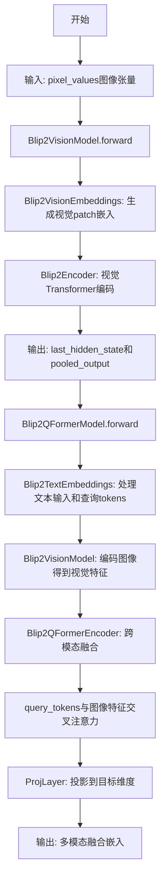

## 类结构

```
nn.Module (PyTorch基类)
├── Blip2TextEmbeddings (文本嵌入层)
├── Blip2VisionEmbeddings (视觉嵌入层)
├── Blip2QFormerEncoder (Q-Former编码器)
│   └── Blip2QFormerLayer (多层Q-Former块)
├── ProjLayer (特征投影层)
├── Blip2VisionModel (视觉编码模型)
└── Blip2QFormerModel (Q-Former多模态模型)
```

## 全局变量及字段


### `logger`
    
模块级日志记录器

类型：`logging.Logger`
    


### `Blip2TextEmbeddings.word_embeddings`
    
词嵌入矩阵

类型：`nn.Embedding`
    


### `Blip2TextEmbeddings.position_embeddings`
    
位置嵌入矩阵

类型：`nn.Embedding`
    


### `Blip2TextEmbeddings.LayerNorm`
    
层归一化

类型：`nn.LayerNorm`
    


### `Blip2TextEmbeddings.dropout`
    
Dropout层

类型：`nn.Dropout`
    


### `Blip2TextEmbeddings.position_ids`
    
位置ID缓冲区

类型：`torch.Tensor`
    


### `Blip2TextEmbeddings.position_embedding_type`
    
位置嵌入类型

类型：`str`
    


### `Blip2TextEmbeddings.config`
    
配置对象

类型：`object`
    


### `Blip2VisionEmbeddings.config`
    
视觉配置

类型：`Blip2VisionConfig`
    


### `Blip2VisionEmbeddings.embed_dim`
    
嵌入维度

类型：`int`
    


### `Blip2VisionEmbeddings.image_size`
    
图像尺寸

类型：`int`
    


### `Blip2VisionEmbeddings.patch_size`
    
patch尺寸

类型：`int`
    


### `Blip2VisionEmbeddings.class_embedding`
    
可学习的类别token嵌入

类型：`nn.Parameter`
    


### `Blip2VisionEmbeddings.patch_embedding`
    
patch嵌入卷积层

类型：`nn.Conv2d`
    


### `Blip2VisionEmbeddings.num_patches`
    
patch数量

类型：`int`
    


### `Blip2VisionEmbeddings.num_positions`
    
位置数量

类型：`int`
    


### `Blip2VisionEmbeddings.position_embedding`
    
可学习的位置嵌入

类型：`nn.Parameter`
    


### `Blip2QFormerEncoder.config`
    
Q-Former配置

类型：`object`
    


### `Blip2QFormerEncoder.layer`
    
Q-Former层列表

类型：`nn.ModuleList`
    


### `Blip2QFormerEncoder.gradient_checkpointing`
    
梯度检查点标志

类型：`bool`
    


### `Blip2QFormerLayer.chunk_size_feed_forward`
    
前馈网络分块大小

类型：`int`
    


### `Blip2QFormerLayer.seq_len_dim`
    
序列长度维度

类型：`int`
    


### `Blip2QFormerLayer.attention`
    
自注意力层

类型：`Blip2QFormerAttention`
    


### `Blip2QFormerLayer.layer_idx`
    
层索引

类型：`int`
    


### `Blip2QFormerLayer.crossattention`
    
交叉注意力层(可选)

类型：`Blip2QFormerAttention`
    


### `Blip2QFormerLayer.has_cross_attention`
    
是否有交叉注意力

类型：`bool`
    


### `Blip2QFormerLayer.intermediate`
    
前馈中间层

类型：`Blip2QFormerIntermediate`
    


### `Blip2QFormerLayer.intermediate_query`
    
Query前馈中间层

类型：`Blip2QFormerIntermediate`
    


### `Blip2QFormerLayer.output_query`
    
Query输出层

类型：`Blip2QFormerOutput`
    


### `Blip2QFormerLayer.output`
    
输出层

类型：`Blip2QFormerOutput`
    


### `ProjLayer.dense1`
    
第一层全连接

类型：`nn.Linear`
    


### `ProjLayer.act_fn`
    
激活函数

类型：`QuickGELU`
    


### `ProjLayer.dense2`
    
第二层全连接

类型：`nn.Linear`
    


### `ProjLayer.dropout`
    
Dropout层

类型：`nn.Dropout`
    


### `ProjLayer.LayerNorm`
    
层归一化

类型：`nn.LayerNorm`
    


### `Blip2VisionModel.config`
    
视觉模型配置

类型：`Blip2VisionConfig`
    


### `Blip2VisionModel.embeddings`
    
视觉嵌入层

类型：`Blip2VisionEmbeddings`
    


### `Blip2VisionModel.pre_layernorm`
    
预归一化层

类型：`nn.LayerNorm`
    


### `Blip2VisionModel.encoder`
    
视觉Transformer编码器

类型：`Blip2Encoder`
    


### `Blip2VisionModel.post_layernorm`
    
后归一化层

类型：`nn.LayerNorm`
    


### `Blip2QFormerModel.config`
    
Q-Former配置

类型：`Blip2Config`
    


### `Blip2QFormerModel.embeddings`
    
文本嵌入层

类型：`Blip2TextEmbeddings`
    


### `Blip2QFormerModel.visual_encoder`
    
视觉编码器

类型：`Blip2VisionModel`
    


### `Blip2QFormerModel.query_tokens`
    
可学习的Query tokens

类型：`nn.Parameter`
    


### `Blip2QFormerModel.tokenizer`
    
文本分词器

类型：`BertTokenizer`
    


### `Blip2QFormerModel.proj_layer`
    
投影层

类型：`ProjLayer`
    


### `Blip2QFormerModel.encoder`
    
Q-Former编码器

类型：`Blip2QFormerEncoder`
    
    

## 全局函数及方法


### QuickGELU

快速GELU激活函数，从transformers库导入，作为激活函数用于神经网络中，对输入张量进行GELU激活处理。

参数：

- `{无}`：`无`，该类在实例化时不需要参数
- `input`：`torch.Tensor`，输入张量，进行GELU激活的原始数据

返回值：`torch.Tensor`，返回GELU激活后的张量

#### 流程图

```mermaid
graph TD
    A[开始] --> B[接收输入张量 input]
    B --> C[计算 QuickGELU 激活: 0.5 * input * (1 + tanh(√(2/π) * (input + 0.044715 * input³)))]
    C --> D[返回激活后的张量]
    D --> E[结束]
```

#### 带注释源码

```
# QuickGELU 激活函数 (从 transformers.activations 导入)
# 这是一个快速GELU激活函数的实现
# GELU (Gaussian Error Linear Unit) 是一种神经网络激活函数
# QuickGELU 是其快速近似实现

from transformers.activations import QuickGELUActivation as QuickGELU

# 在 ProjLayer 类中的使用示例:
class ProjLayer(nn.Module):
    def __init__(self, in_dim, out_dim, hidden_dim, drop_p=0.1, eps=1e-12):
        super().__init__()
        self.dense1 = nn.Linear(in_dim, hidden_dim)
        self.act_fn = QuickGELU()  # 实例化 QuickGELU 激活函数
        self.dense2 = nn.Linear(hidden_dim, out_dim)
        self.dropout = nn.Dropout(drop_p)
        self.LayerNorm = nn.LayerNorm(out_dim, eps=eps)

    def forward(self, x):
        x_in = x
        x = self.LayerNorm(x)
        x = self.dropout(self.dense2(self.act_fn(self.dense1(x)))) + x_in
        return x

# QuickGELU 的数学公式:
# QuickGELU(x) = 0.5 * x * (1 + tanh(√(2/π) * (x + 0.044715 * x³)))
# 这是一种高效的 GELU 近似计算方法
```


### `apply_chunking_to_forward`

该函数是来自 `transformers` 库的工具函数，用于将前馈网络（forward function）的计算分块处理，以降低显存占用。它将输入张量沿指定维度切分为多个块，对每个块分别执行前馈函数，最后将结果拼接回原形状。

参数：

- `forward_fn`：Callable，前馈函数，需要对分块后的张量进行计算
- `chunk_size`：int，每个块的维度大小，决定了分块的大小
- `chunk_dim`：int，沿哪个维度进行切分，通常是序列长度维度
- `*input_tensors`：任意数量的张量输入，形状需一致

返回值：`torch.Tensor`，拼接后的输出张量，与原始输入形状相同

#### 流程图

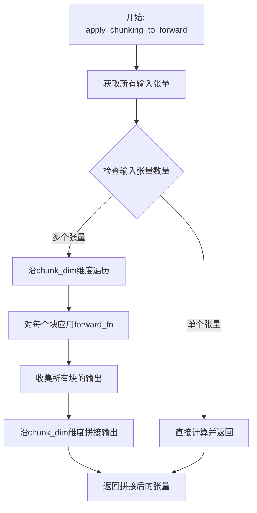

#### 带注释源码

```python
# 注：以下为transformers库中apply_chunking_to_forward的典型实现
# 源码位置: src/transformers/pytorch_utils.py

def apply_chunking_to_forward(
    forward_fn: Callable[..., torch.Tensor],
    chunk_size: int,
    chunk_dim: int,
    *input_tensors,
) -> torch.Tensor:
    """
    该函数将前馈计算分块处理以节省显存。
    
    参数:
        forward_fn: 要应用的前馈函数，如feed_forward_chunk
        chunk_size: 每个块的尺寸大小
        chunk_dim: 沿哪个维度进行分块（通常是序列维）
        input_tensors: 输入的张量序列
    
    返回:
        拼接后的输出张量
    """
    # 断言确保有输入张量
    assert len(input_tensors) > 0, "需要提供至少一个输入张量"
    
    # 省略了详细的torch.no_grad()和梯度检查逻辑...
    
    # 核心逻辑：
    # 1. 沿chunk_dim将输入张量切分为多个块
    # 2. 对每个块调用forward_fn
    # 3. 将所有块的输出沿原维度拼接
    
    # 示例（简化版）:
    # tensor_chunk = torch.chunk(input_tensor, chunks, dim=chunk_dim)
    # chunk_outputs = [forward_fn(x) for x in tensor_chunk]
    # return torch.cat(chunk_outputs, dim=chunk_dim)
    
    # 实际实现中还包括：
    # - 梯度检查点(gradient checkpointing)支持
    # - 内存优化
    # - 错误处理等
```

#### 在当前代码中的使用示例

```python
# 在Blip2QFormerLayer.forward中使用（第235-240行）
# 对query部分应用分块前馈网络
layer_output = apply_chunking_to_forward(
    self.feed_forward_chunk_query,  # 前馈函数
    self.chunk_size_feed_forward,    # 块大小（如512）
    self.seq_len_dim,                # 维度1（序列维）
    query_attention_output,          # 输入张量
)

# 对文本部分应用分块前馈网络（第243-249行）
layer_output_text = apply_chunking_to_forward(
    self.feed_forward_chunk,
    self.chunk_size_feed_forward,
    self.seq_len_dim,
    attention_output[:, query_length:, :],
)
layer_output = torch.cat([layer_output, layer_output_text], dim=1)

# 当没有query_length时的处理（第253-257行）
layer_output = apply_chunking_to_forward(
    self.feed_forward_chunk,
    self.chunk_size_feed_forward,
    self.seq_len_dim,
    attention_output,
)
```

---

### 补充信息

**技术债务/优化空间**：
- `apply_chunking_to_forward` 是外部依赖，建议在文档中注明版本要求
- 分块大小 (`chunk_size_feed_forward`) 来自配置，如需优化可调整为适配GPU显存的数值

**外部依赖**：
- `transformers>=4.20.0`（该函数在较新版本中引入）


### `Blip2VisionModel.forward`

该方法是 Blip2VisionModel 类的前向传播方法，用于处理图像像素值并生成包含池化输出的模型结果。通过视觉编码器处理输入的像素值，经过多层 Transformer 编码后输出视觉特征表示。

参数：

- `self`：隐式参数，Blip2VisionModel 类的实例
- `pixel_values`：`torch.Tensor | None`，输入的图像像素值张量，形状为 [batch_size, channels, height, width]
- `output_attentions`：`bool | None`，可选参数，控制是否输出所有层的注意力权重
- `output_hidden_states`：`bool | None`，可选参数，控制是否输出所有层的隐藏状态
- `return_dict`：`bool | None`，可选参数，控制返回值格式；为 True 时返回 BaseModelOutputWithPooling 对象，否则返回元组

返回值：`tuple | BaseModelOutputWithPooling`，根据 return_dict 参数返回：
- 当 return_dict=True 时：返回 BaseModelOutputWithPooling 对象，包含 last_hidden_state、pooler_output、hidden_states 和 attentions
- 当 return_dict=False 时：返回元组 (last_hidden_state, pooled_output, hidden_states, attentions)

#### 流程图

```mermaid
flowchart TD
    A[开始 forward] --> B{检查 pixel_values 是否为 None}
    B -->|是| C[抛出 ValueError: You have to specify pixel_values]
    B -->|否| D[通过 embeddings 处理 pixel_values]
    D --> E[应用 pre_layernorm 归一化]
    E --> F[输入 encoder 编码]
    F --> G[获取 last_hidden_state]
    G --> H[应用 post_layernorm 归一化]
    H --> I[提取 pooled_output = last_hidden_state[:, 0, :]]
    I --> J{return_dict 为 True?}
    J -->|是| K[返回 BaseModelOutputWithPooling 对象]
    J -->|否| L[返回元组格式]
    K --> M[结束]
    L --> M
```

#### 带注释源码

```python
@replace_return_docstrings(output_type=BaseModelOutputWithPooling, config_class=Blip2VisionConfig)
def forward(
    self,
    pixel_values: torch.Tensor | None = None,
    output_attentions: bool | None = None,
    output_hidden_states: bool | None = None,
    return_dict: bool | None = None,
) -> tuple | BaseModelOutputWithPooling:
    r"""
    Returns:

    """
    # 如果未指定 output_attentions，则使用配置默认值
    output_attentions = output_attentions if output_attentions is not None else self.config.output_attentions
    # 如果未指定 output_hidden_states，则使用配置默认值
    output_hidden_states = (
        output_hidden_states if output_hidden_states is not None else self.config.output_hidden_states
    )
    # 如果未指定 return_dict，则使用配置默认值
    return_dict = return_dict if return_dict is not None else self.config.use_return_dict

    # 检查是否提供了必需的 pixel_values 输入
    if pixel_values is None:
        raise ValueError("You have to specify pixel_values")

    # 将像素值通过视觉嵌入层转换为隐藏状态
    hidden_states = self.embeddings(pixel_values)
    # 应用预层归一化
    hidden_states = self.pre_layernorm(hidden_states)
    # 通过视觉编码器获取编码输出
    encoder_outputs = self.encoder(
        inputs_embeds=hidden_states,
        output_attentions=output_attentions,
        output_hidden_states=output_hidden_states,
        return_dict=return_dict,
    )
    # 获取最后一层的隐藏状态
    last_hidden_state = encoder_outputs[0]
    # 应用后层归一化
    last_hidden_state = self.post_layernorm(last_hidden_state)

    # 提取池化输出（取第一个 token 的隐藏状态）
    pooled_output = last_hidden_state[:, 0, :]
    pooled_output = self.post_layernorm(pooled_output)

    # 根据 return_dict 决定返回格式
    if not return_dict:
        # 返回元组格式：(last_hidden_state, pooled_output) + encoder_outputs[1:]
        return (last_hidden_state, pooled_output) + encoder_outputs[1:]

    # 返回 BaseModelOutputWithPooling 对象
    return BaseModelOutputWithPooling(
        last_hidden_state=last_hidden_state,
        pooler_output=pooled_output,
        hidden_states=encoder_outputs.hidden_states,
        attentions=encoder_outputs.attentions,
    )
```


### `logging.get_logger`

获取日志记录器，用于在当前模块中创建或获取一个配置好的日志记录器实例。

参数：

- `name`：`str`，日志记录器的名称，通常使用 `__name__` 变量来表示当前模块的完全限定名。

返回值：`logging.Logger`，返回一个 Python `logging.Logger` 对象，用于记录日志。

#### 流程图

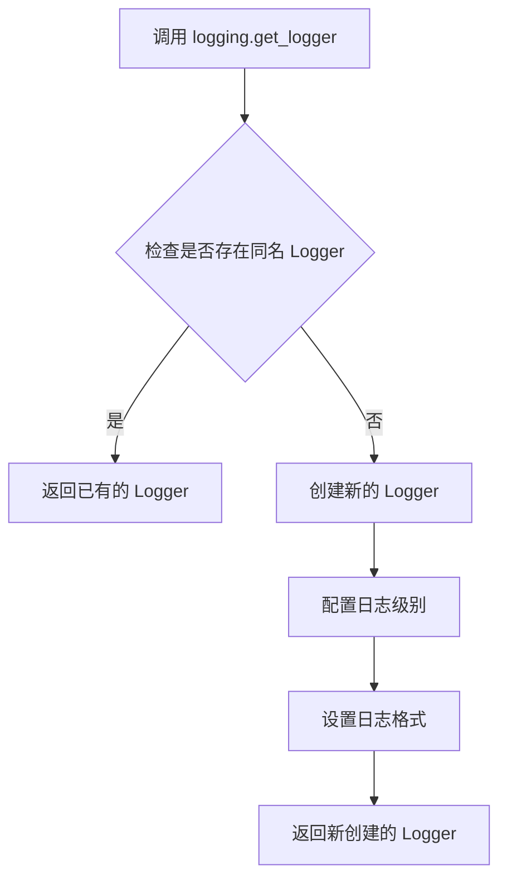

#### 带注释源码

```python
# 从 transformers.utils 导入 logging 模块
# logging.get_logger 是 logging 模块中的一个函数，用于获取或创建日志记录器
logger = logging.get_logger(__name__)
# __name__ 是 Python 的内置变量，表示当前模块的名称
# 例如：如果这个文件是 blip2_model.py，则 __name__ 的值是 "__main__" 或模块名
# 该函数返回一个配置好的 logger 对象，用于后续的日志记录操作
```


### `torch.arange`

这是 PyTorch 标准库函数，用于创建一个从 0 开始的连续整数张量（类似于 NumPy 的 `arange`）。在 BLIP-2 模型的文本嵌入模块中，该函数用于生成位置编码索引。

#### 参数

- `end`：`int`，结束值（不包含）。在这里是 `config.max_position_embeddings`，即模型支持的最大位置长度。

#### 返回值

- `torch.Tensor`，返回一维张量，包含从 0 到 `end-1` 的连续整数。

#### 使用场景

在 `Blip2TextEmbeddings` 类的 `__init__` 方法中：

```python
self.register_buffer("position_ids", torch.arange(config.max_position_embeddings).expand((1, -1)))
```

这里 `torch.arange` 生成一个从 0 到 `config.max_position_embeddings - 1` 的一维张量，然后通过 `.expand((1, -1))` 将其扩展为形状 `(1, max_position_embeddings)` 的二维张量，用于后续的位置编码查找。

#### 带注释源码

```python
# Blip2TextEmbeddings.__init__ 方法中的相关代码
self.register_buffer(
    "position_ids",  # 注册为 buffer，不会被视为模型参数
    torch.arange(config.max_position_embeddings)  # 生成 [0, 1, 2, ..., max_position_embeddings-1]
    .expand((1, -1))  # 扩展为形状 (1, max_position_embeddings)，用于批量处理
)
```

#### 说明

1. **buffer 机制**：使用 `register_buffer` 注册 `position_ids`，使其成为模型的一部分，但不会随训练更新，常用于存储非可学习的状态（如位置编码索引）。

2. **后续使用**：在 `forward` 方法中，通过 `self.position_ids[:, past_key_values_length : seq_length + past_key_values_length].clone()` 提取对应位置的位置编码索引。

3. **优势**：预先计算并存储位置索引可以避免每次前向传播时重复生成，提升效率。


### `torch.ones`

创建并返回一个填充了标量值1的张量，该张量具有指定的形状。

参数：

-  `*shape`：`int` 或 `tuple of ints`，定义输出张量的形状。可以是可变数量的整数或整数元组。
-  `out`：`torch.Tensor`，可选参数，指定输出张量。
-  `dtype`：`torch.dtype`，可选参数，指定返回张量的期望数据类型。
-  `layout`：`torch.layout`，可选参数，指定返回张量的布局。
-  `device`：`torch.device`，可选参数，指定返回张量的设备。
-  `requires_grad`：`bool`，可选参数，指定是否需要对返回的张量进行梯度计算。

返回值：`torch.Tensor`，一个填充了标量值1的张量，其形状由`shape`参数指定。

#### 流程图

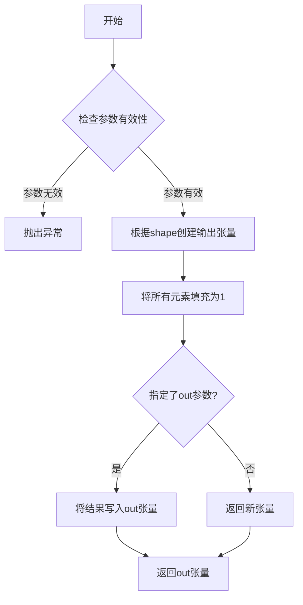

#### 带注释源码

```python
# torch.ones 是 PyTorch 标准库函数，用于创建全1张量
# 在 BLIP-2 模型中的典型用法如下（来自 Blip2QFormerModel.forward 方法）：

# 创建与 batch_size 和 query_tokens 数量相同的注意力掩码张量
# 所有值设为 1 表示需要关注这些位置
query_atts = torch.ones(
    (batch_size, self.query_tokens.size()[1]),  # 张量形状：(batch_size, num_query_tokens)
    dtype=torch.long,  # 数据类型：长整型
    device=self.device  # 设备：模型所在设备（CPU/CUDA）
)

# 示例：创建一个 2x3 的全1张量
# tensor([[1., 1., 1.],
#         [1., 1., 1.]])
x = torch.ones(2, 3)

# 示例：创建一个形状为 (2, 3, 4) 的全1张量
# tensor([[[1., 1., 1., 1.],
#          [1., 1., 1., 1.],
#          [1., 1., 1., 1.]],
#         [[1., 1., 1., 1.],
#          [1., 1., 1., 1.],
#          [1., 1., 1., 1.]]])
y = torch.ones((2, 3, 4))

# 示例：创建指定数据类型的全1张量
z = torch.ones(3, dtype=torch.float32)  # tensor([1., 1., 1.])
```


### `torch.cat`

`torch.cat` 是 PyTorch 标准库中的张量拼接函数，用于沿指定维度将多个张量序列连接成一个张量。在 BLIP-2 模型代码中，该函数主要用于在序列维度（dim=1）上拼接查询嵌入与文本嵌入，以及拼接不同层的输出张量。

参数：

- `tensors`：`Tuple[torch.Tensor] | List[torch.Tensor]`，要拼接的张量序列，所有张量必须在除拼接维度外的其他维度上形状一致
- `dim`：`int`，拼接的维度索引，必须在有效范围内（对于 2D 张量为 0 或 1）

返回值：`torch.Tensor`，拼接后的张量，其形状为沿拼接维度维度数累加、其他维度保持一致的张量

#### 流程图

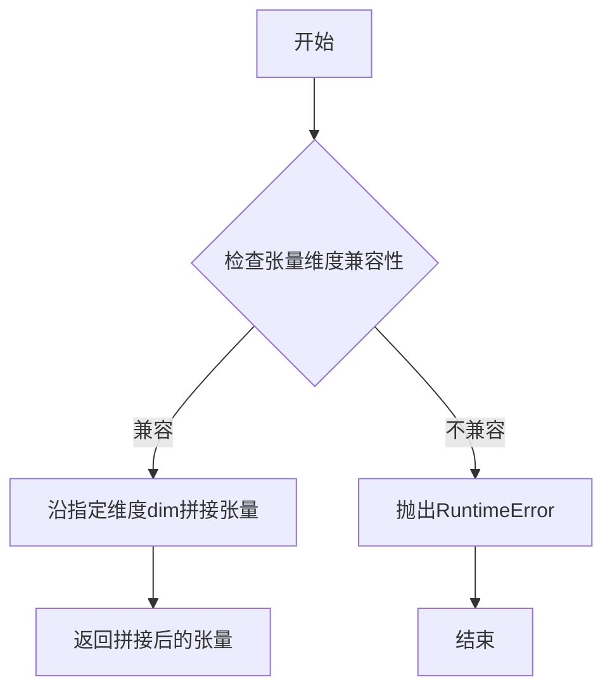

#### 带注释源码

```python
# torch.cat 函数调用示例 - 来自 Blip2TextEmbeddings.forward 方法

# 场景1: 在 Blip2TextEmbeddings 中拼接 query_embeds 和文本 embeddings
# 参数说明:
#   - (query_embeds, embeddings): 要拼接的两个张量元组
#   - dim=1: 沿序列维度（第二个维度）拼接
# 
# 假设:
#   query_embeds shape: [batch_size, query_length, hidden_size]
#   embeddings shape: [batch_size, text_length, hidden_size]
# 则拼接后:
#   结果 shape: [batch_size, query_length + text_length, hidden_size]

embeddings = torch.cat((query_embeds, embeddings), dim=1)


# 场景2: 在 Blip2QFormerLayer 中拼接查询输出和文本输出
# 参数说明:
#   - [layer_output, layer_output_text]: 要拼接的两个张量列表
#   - dim=1: 沿序列维度拼接
#
# 假设:
#   layer_output shape: [batch_size, query_length, hidden_size]
#   layer_output_text shape: [batch_size, text_length, hidden_size]
# 则拼接后:
#   结果 shape: [batch_size, query_length + text_length, hidden_size]

layer_output = torch.cat([layer_output, layer_output_text], dim=1)
```

#### 关键使用场景分析

| 场景 | 位置 | 拼接维度 | 用途描述 |
|------|------|----------|----------|
| 查询嵌入与文本嵌入拼接 | Blip2TextEmbeddings.forward | dim=1 | 将可学习的查询token嵌入与输入文本token嵌入进行拼接，形成多模态输入序列 |
| 查询输出与文本输出拼接 | Blip2QFormerLayer.forward | dim=1 | 在Q-Former层中，将处理查询tokens的输出与处理文本tokens的输出进行拼接，恢复完整序列 |

#### 技术注意事项

1. **维度兼容性**：所有输入张量必须在非拼接维度上形状一致，否则会抛出 RuntimeError
2. **设备一致性**：所有输入张量必须在同一设备上（CPU或同一GPU），否则会报错
3. **数据类型**：拼接操作不会进行类型转换，输入张量dtype必须一致
4. **内存效率**：torch.cat 会分配新的内存存储结果，对于大规模张量拼接需注意内存开销


### `torch.randn`

创建随机张量（标准库函数），用于生成服从标准正态分布（均值为0，方差为1）的随机张量。

参数：

-  `*shape`：`int` 或 `tuple of ints`，张量的形状，可以是任意数量的整数或整数元组
-  `*`：`可变位置参数`，用于接受额外的整数参数定义形状
-  `out`：`torch.Tensor`（可选），输出张量的存储位置
-  `dtype`：`torch.dtype`（可选），返回张量的数据类型，默认值为 `torch.float32`
-  `layout`：`torch.layout`（可选），返回张量的布局，默认值为 `torch.strided`
-  `device`：`torch.device`（可选），返回张量所在的设备
-  `requires_grad`：`bool`（可选），是否自动求导，默认值为 `False`

返回值：`torch.Tensor`，返回一个随机张量，其元素服从标准正态分布

#### 流程图

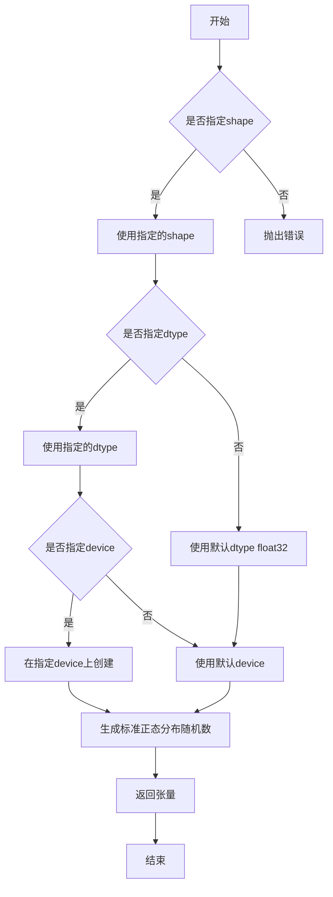

#### 带注释源码

```python
def randn(*shape, out=None, dtype=None, layout=torch.strided, device=None, requires_grad=False):
    """
    返回一个填充了标准正态分布随机数的张量。
    
    参数:
        *shape: 定义输出张量形状的可变参数
        out: 可选的输出张量
        dtype: 可选的数据类型
        layout: 可选的布局类型
        device: 可选的设备
        requires_grad: 是否需要梯度
    
    返回:
        torch.Tensor: 标准正态分布的张量
    """
    # 如果没有传入shape参数，尝试从其他参数推断
    if not shape:
        # 如果传入了out参数，从out获取形状
        if out is not None:
            shape = out.shape
        else:
            raise TypeError("randn() must be called with at least one dimension")
    
    # 创建张量生成器（内部实现）
    # 使用PyTorch的C++后端生成随机数
    if dtype is None:
        dtype = torch.float32
    
    # 调用Tensor工厂函数创建张量
    # 内部实现: torch.Tensor.new_zeros(shape, dtype=dtype, device=device, requires_grad=requires_grad)
    # 然后使用随机数填充
    
    return torch.Tensor(_randn(shape, dtype=dtype, layout=layout, device=device, requires_grad=requires_grad))
```

**注意**：代码中实际使用示例（在 `Blip2VisionEmbeddings` 类中）：

```python
# 用于初始化可学习的类别嵌入参数
self.class_embedding = nn.Parameter(torch.randn(1, 1, self.embed_dim))

# 用于初始化可学习的位置嵌入参数  
self.position_embedding = nn.Parameter(torch.randn(1, self.num_positions, self.embed_dim))
```


### `Blip2TextEmbeddings.forward`

该方法实现了 BLIP-2 文本嵌入层的前向传播功能，通过组合词嵌入、位置嵌入和可选的查询嵌入（用于多模态融合），并经过层归一化和 dropout 处理，生成最终的文本表示向量。

参数：

- `input_ids`：`torch.Tensor | None`，输入的文本 token ID 序列，用于提取词嵌入
- `position_ids`：`torch.Tensor | None`，位置 ID 序列，用于提取位置嵌入；若为 None 则自动从缓冲区获取
- `query_embeds`：`torch.Tensor | None`，查询嵌入向量，用于多模态场景下与文本嵌入拼接
- `past_key_values_length`：`int`，过去 key-value 的长度，用于处理 KV 缓存场景下的位置偏移

返回值：`torch.Tensor`，经过 LayerNorm 和 dropout 处理的最终嵌入向量

#### 流程图

```mermaid
flowchart TD
    A[开始 forward] --> B{input_ids 是否为 None}
    B -->|是| C[seq_length = 0]
    B -->|否| D[seq_length = input_ids.size(1)]
    C --> E{position_ids 是否为 None}
    D --> E
    E -->|是| F[从 position_ids 缓冲区切片获取<br/>: past_key_values_length 到 seq_length + past_key_values_length]
    E -->|否| G[使用传入的 position_ids]
    F --> H
    G --> H
    H{input_ids 是否为 None}
    H -->|是| I[embeddings = query_embeds]
    H -->|否| J[embeddings = word_embeddings(input_ids)]
    J --> K{position_embedding_type == 'absolute'}
    K -->|是| L[position_embeddings = position_embeddings(position_ids)<br/>embeddings = embeddings + position_embeddings]
    K -->|否| M{query_embeds 是否为 None}
    L --> M
    M -->|是| N[batch_size = embeddings.shape[0]<br/>query_embeds = query_embeds.repeat(batch_size, 1, 1)<br/>embeddings = torch.cat([query_embeds, embeddings], dim=1]
    M -->|否| O[embeddings = embeddings.to(query_embeds.dtype)]
    N --> O
    I --> O
    O --> P[embeddings = LayerNorm(embeddings)]
    P --> Q[embeddings = dropout(embeddings)]
    Q --> R[返回 embeddings]
```

#### 带注释源码

```python
def forward(
    self,
    input_ids=None,
    position_ids=None,
    query_embeds=None,
    past_key_values_length=0,
):
    # 确定序列长度：如果提供了 input_ids，则使用其序列长度；否则设为 0（纯查询嵌入场景）
    if input_ids is not None:
        seq_length = input_ids.size()[1]
    else:
        seq_length = 0

    # 如果未提供 position_ids，则从预注册的 position_ids 缓冲区切片获取
    # 切片范围：从 past_key_values_length 开始，到 seq_length + past_key_values_length 结束
    # 这样可以支持 KV 缓存场景下的位置编码正确对齐
    if position_ids is None:
        position_ids = self.position_ids[:, past_key_values_length : seq_length + past_key_values_length].clone()

    # 存在 input_ids 时：构建完整的文本嵌入
    if input_ids is not None:
        # 1. 词嵌入：查找 input_ids 对应的词向量
        embeddings = self.word_embeddings(input_ids)
        
        # 2. 位置嵌入：根据位置 ID 查找位置向量并相加
        if self.position_embedding_type == "absolute":
            position_embeddings = self.position_embeddings(position_ids)
            embeddings = embeddings + position_embeddings

        # 3. 多模态融合：如果存在查询嵌入，将其拼接到文本嵌入前面
        # 注意：query_embeds 通常是视觉编码器输出的查询 tokens，需要复制到 batch 维度
        if query_embeds is not None:
            batch_size = embeddings.shape[0]
            # 将 query_embeds 沿 batch 维度复制 batch_size 次
            query_embeds = query_embeds.repeat(batch_size, 1, 1)
            # 在序列维度（dim=1）拼接：查询嵌入在前，文本嵌入在后
            embeddings = torch.cat((query_embeds, embeddings), dim=1)
    
    # 不存在 input_ids 时：直接使用 query_embeds 作为嵌入
    # 这种场景常见于仅使用视觉查询而不包含文本输入的情况
    else:
        embeddings = query_embeds
    
    # 确保嵌入数据类型与 query_embeds 一致（通常用于混合精度训练）
    embeddings = embeddings.to(query_embeds.dtype)
    
    # 层归一化：稳定训练，加速收敛
    embeddings = self.LayerNorm(embeddings)
    
    # Dropout：正则化，防止过拟合
    embeddings = self.dropout(embeddings)
    
    return embeddings
```


### `Blip2VisionEmbeddings.forward(pixel_values)`

该方法实现BLIP-2视觉模型的嵌入层，将输入的像素值转换为视觉嵌入向量。通过卷积层将图像 patches 转换为 patch embeddings，添加可学习的类别标记（class token）嵌入和位置嵌入，最终输出结合了类别标记和 patch 序列的视觉嵌入表示。

参数：

- `pixel_values`：`torch.Tensor`，输入的图像像素值，形状为 [batch_size, channels, height, width]

返回值：`torch.Tensor`，生成的视觉嵌入向量，形状为 [batch_size, num_patches + 1, embed_dim]，其中 num_patches = (image_size // patch_size)²，加1表示包含类别标记嵌入

#### 流程图

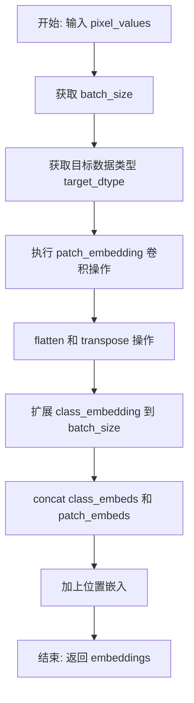

#### 带注释源码

```python
def forward(self, pixel_values: torch.Tensor) -> torch.Tensor:
    # 获取输入的批次大小
    batch_size = pixel_values.shape[0]
    
    # 获取目标数据类型，通常与 patch_embedding 的权重类型一致
    # 这样可以避免不必要的类型转换，提高计算效率
    target_dtype = self.patch_embedding.weight.dtype
    
    # 使用卷积层将像素值转换为 patch embeddings
    # 输入: [batch_size, 3, height, width]
    # 输出: [batch_size, embed_dim, grid, grid]
    patch_embeds = self.patch_embedding(pixel_values.to(dtype=target_dtype))
    
    # 将 patch embeddings 展平并转置
    # 从 [batch_size, embed_dim, grid, grid] 
    # 转换为 [batch_size, num_patches, embed_dim]
    patch_embeds = patch_embeds.flatten(2).transpose(1, 2)
    
    # 扩展类别标记嵌入以匹配批次大小
    # class_embedding 原始形状为 [1, 1, embed_dim]
    # 扩展后变为 [batch_size, 1, embed_dim]
    class_embeds = self.class_embedding.expand(batch_size, 1, -1).to(target_dtype)
    
    # 在序列维度上连接类别标记和 patch embeddings
    # 结果形状: [batch_size, num_patches + 1, embed_dim]
    embeddings = torch.cat([class_embeds, patch_embeds], dim=1)
    
    # 添加位置嵌入到最终的 embeddings 中
    # 使用切片确保位置嵌入与当前 embeddings 长度匹配
    embeddings = embeddings + self.position_embedding[:, : embeddings.size(1), :].to(target_dtype)
    
    # 返回最终的视觉嵌入表示
    return embeddings
```


### `Blip2QFormerEncoder.forward`

该方法是 Q-Former 编码器的前向传播实现，负责将输入的隐藏状态通过多层 transformer 架构进行处理，支持自注意力、跨注意力机制，并可选择性地缓存 key/value 状态以加速推理，最终返回包含最后隐藏状态、注意力权重和中间隐藏状态的输出对象。

参数：

- `self`：`Blip2QFormerEncoder`，类的实例本身
- `hidden_states`：`torch.Tensor`，输入的隐藏状态张量，形状为 [batch_size, seq_length, hidden_size]
- `attention_mask`：`torch.Tensor | None`，可选的注意力掩码，用于遮蔽特定位置的注意力得分
- `head_mask`：`torch.Tensor | None`，可选的头掩码，用于遮蔽特定注意力头的输出
- `encoder_hidden_states`：`torch.Tensor | None`，编码器输出的隐藏状态，用于跨注意力机制
- `encoder_attention_mask`：`torch.Tensor | None`，编码器隐藏状态的注意力掩码
- `past_key_values`：`tuple | None`，可选的过去 key/value 状态元组，用于缓存加速解码
- `use_cache`：`bool | None`，是否使用缓存来存储 key/value 状态以加速后续推理
- `output_attentions`：`bool`，是否输出所有层的自注意力和跨注意力权重
- `output_hidden_states`：`bool`，是否输出所有层的隐藏状态
- `return_dict`：`bool`，是否返回字典格式的输出而非元组
- `query_length`：`int`，查询序列的长度，用于处理跨注意力时区分查询部分

返回值：`BaseModelOutputWithPastAndCrossAttentions`，包含最后隐藏状态、过去 key/value 状态、所有隐藏状态、自注意力权重和跨注意力权重的输出对象

#### 流程图

```mermaid
flowchart TD
    A[开始 forward] --> B{output_hidden_states?}
    B -->|Yes| C[初始化 all_hidden_states]
    B -->|No| D[all_hidden_states = None]
    C --> E{output_attentions?}
    D --> E
    E -->|Yes| F[初始化 all_self_attentions 和 all_cross_attentions]
    E -->|No| G[all_self_attentions = None<br/>all_cross_attentions = None]
    F --> H{use_cache?}
    G --> H
    H -->|Yes| I[初始化 next_decoder_cache]
    H -->|No| J[next_decoder_cache = None]
    I --> K[遍历每一层 layer_module]
    J --> K
    K --> L{output_hidden_states?}
    L -->|Yes| M[将 hidden_states 加入 all_hidden_states]
    L --> No
    M --> N{gradient_checkpointing enabled?}
    No --> N
    N -->|Yes 且 torch.is_grad_enabled| O{use_cache?}
    N -->|No| P[调用 layer_module forward]
    O -->|Yes| Q[警告 use_cache 与 gradient checkpointing 不兼容<br/>设置 use_cache=False]
    Q --> R[调用 _gradient_checkpointing_func]
    O -->|No| R
    P --> S[更新 hidden_states = layer_outputs[0]]
    R --> S
    S --> T{use_cache?}
    T -->|Yes| U[将 layer_outputs[-1] 加入 next_decoder_cache]
    T -->|No| V{output_attentions?}
    U --> V
    V -->|Yes| W[将 layer_outputs[1] 加入 all_self_attentions<br/>检查 has_cross_attention<br/>如有则加入 all_cross_attentions]
    V -->|No| X{所有层遍历完成?}
    W --> X
    X -->|No| K
    X -->|Yes| Y{output_hidden_states?}
    Y -->|Yes| Z[将最后的 hidden_states 加入 all_hidden_states]
    Y -->|No| AA{return_dict?}
    Z --> AA
    AA -->|No| BB[返回元组形式的输出]
    AA -->|Yes| CC[返回 BaseModelOutputWithPastAndCrossAttentions 对象]
    BB --> DD[结束]
    CC --> DD
```

#### 带注释源码

```python
def forward(
    self,
    hidden_states,
    attention_mask=None,
    head_mask=None,
    encoder_hidden_states=None,
    encoder_attention_mask=None,
    past_key_values=None,
    use_cache=None,
    output_attentions=False,
    output_hidden_states=False,
    return_dict=True,
    query_length=0,
):
    # 初始化用于存储所有隐藏状态的元组，如果需要输出隐藏状态则创建，否则为 None
    all_hidden_states = () if output_hidden_states else None
    # 初始化用于存储所有自注意力的元组，如果需要输出注意力则创建，否则为 None
    all_self_attentions = () if output_attentions else None
    # 初始化用于存储所有跨注意力的元组，如果需要输出注意力则创建，否则为 None
    all_cross_attentions = () if output_attentions else None

    # 初始化用于存储解码器缓存的元组，如果使用缓存则创建，否则为 None
    next_decoder_cache = () if use_cache else None

    # 遍历编码器的每一层
    for i in range(self.config.num_hidden_layers):
        # 获取当前层的模块
        layer_module = self.layer[i]
        
        # 如果需要输出隐藏状态，将当前隐藏状态添加到元组中
        if output_hidden_states:
            all_hidden_states = all_hidden_states + (hidden_states,)

        # 获取当前层的头掩码，如果提供了头掩码则使用对应层的掩码，否则为 None
        layer_head_mask = head_mask[i] if head_mask is not None else None
        # 获取当前层的过去 key/value 状态，如果提供了则使用对应层的状态，否则为 None
        past_key_value = past_key_values[i] if past_key_values is not None else None

        # 检查是否启用了梯度检查点且当前正在计算梯度
        if getattr(self.config, "gradient_checkpointing", False) and torch.is_grad_enabled():
            # 警告：use_cache 与梯度检查点不兼容，强制设置 use_cache=False
            if use_cache:
                logger.warning(
                    "`use_cache=True` is incompatible with gradient checkpointing. Setting `use_cache=False`..."
                )
                use_cache = False

            # 使用梯度检查点函数执行层的前向传播，节省显存
            layer_outputs = self._gradient_checkpointing_func(
                layer_module,
                hidden_states,
                attention_mask,
                layer_head_mask,
                encoder_hidden_states,
                encoder_attention_mask,
                past_key_value,
                output_attentions,
                query_length,
            )
        else:
            # 正常执行层的前向传播
            layer_outputs = layer_module(
                hidden_states,
                attention_mask,
                layer_head_mask,
                encoder_hidden_states,
                encoder_attention_mask,
                past_key_value,
                output_attentions,
                query_length,
            )

        # 更新隐藏状态为当前层的输出
        hidden_states = layer_outputs[0]
        
        # 如果使用缓存，将当前层的 key/value 状态添加到缓存中
        if use_cache:
            next_decoder_cache += (layer_outputs[-1],)
        
        # 如果需要输出注意力权重
        if output_attentions:
            # 添加自注意力权重
            all_self_attentions = all_self_attentions + (layer_outputs[1],)
            # 如果当前层有跨注意力，添加跨注意力权重
            if layer_module.has_cross_attention:
                all_cross_attentions = all_cross_attentions + (layer_outputs[2],)

    # 如果需要输出隐藏状态，将最后的隐藏状态也添加到元组中
    if output_hidden_states:
        all_hidden_states = all_hidden_states + (hidden_states,)

    # 如果不需要返回字典格式的输出
    if not return_dict:
        # 返回元组，只包含非 None 的值
        return tuple(
            v
            for v in [
                hidden_states,
                next_decoder_cache,
                all_hidden_states,
                all_self_attentions,
                all_cross_attentions,
            ]
            if v is not None
        )
    
    # 返回字典格式的输出，包含所有注意力相关的信息
    return BaseModelOutputWithPastAndCrossAttentions(
        last_hidden_state=hidden_states,
        past_key_values=next_decoder_cache,
        hidden_states=all_hidden_states,
        attentions=all_self_attentions,
        cross_attentions=all_cross_attentions,
    )
```


### Blip2QFormerLayer.forward

该方法是 Q-Former 层的核心前向传播逻辑，负责处理自注意力机制、条件跨注意力机制（当存在 encoder_hidden_states 时）以及前馈网络计算，支持查询 tokens 与文本 tokens 的分别处理。

参数：

- `hidden_states`：`torch.Tensor`，输入的隐藏状态张量，形状为 [batch_size, seq_length, hidden_size]
- `attention_mask`：`Optional[torch.Tensor]`，自注意力掩码，用于遮蔽-padding 位置
- `head_mask`：`Optional[torch.Tensor]`，多头掩码，用于控制每个注意力头的输出
- `encoder_hidden_states`：`Optional[torch.Tensor]`，编码器输出的隐藏状态，用于跨注意力计算（视觉-文本对齐）
- `encoder_attention_mask`：`Optional[torch.Tensor]`，跨注意力掩码，遮蔽编码器中的 padding 位置
- `past_key_value`：`Optional[tuple]`，缓存的过去键值对，用于自回归解码加速
- `output_attentions`：`bool`，是否返回注意力权重
- `query_length`：`int`，查询 tokens 的数量，用于区分查询部分与文本部分的处理

返回值：`tuple`，包含以下元素：
- `layer_output`：`torch.Tensor`，该层的最终输出
- `present_key_value`：`tuple`，当前层的键值对缓存，供后续层使用
- 额外的注意力输出（当 output_attentions=True 时包含自注意力和跨注意力权重）

#### 流程图

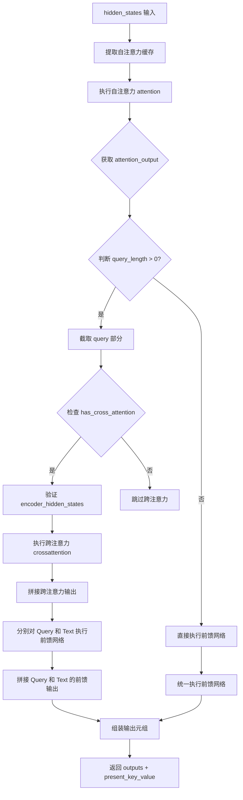

#### 带注释源码

```python
def forward(
    self,
    hidden_states,
    attention_mask=None,
    head_mask=None,
    encoder_hidden_states=None,
    encoder_attention_mask=None,
    past_key_value=None,
    output_attentions=False,
    query_length=0,
):
    # decoder uni-directional self-attention cached key/values tuple is at positions 1,2
    # 从 past_key_value 中提取自注意力的缓存键值对（位置 1,2）
    self_attn_past_key_value = past_key_value[:2] if past_key_value is not None else None
    
    # 执行自注意力机制
    # hidden_states: 查询、键、值的来源
    # attention_mask: 遮蔽 padding 位置
    # head_mask: 控制各注意力头的保留/丢弃
    # past_key_value: 缓存的 K-V 对用于加速解码
    self_attention_outputs = self.attention(
        hidden_states,
        attention_mask,
        head_mask,
        output_attentions=output_attentions,
        past_key_value=self_attn_past_key_value,
    )
    
    # 注意力输出 [batch_size, seq_length, hidden_size]
    attention_output = self_attention_outputs[0]
    
    # 除了最后一个元素（present_key_value）和第一个元素（attention_output）外的中间输出
    # 包含 self_attention 权重（如果 output_attentions=True）
    outputs = self_attention_outputs[1:-1]

    # 当前层的键值对，用于缓存给下一层
    present_key_value = self_attention_outputs[-1]

    # ========== 处理跨注意力和前馈网络 ==========
    if query_length > 0:
        # 分离查询 tokens 和文本 tokens
        # query_length 通常等于 query_tokens 的数量
        query_attention_output = attention_output[:, :query_length, :]

        if self.has_cross_attention:
            # 只有在配置指定频率的层才有跨注意力
            if encoder_hidden_states is None:
                raise ValueError("encoder_hidden_states must be given for cross-attention layers")
            
            # 执行跨注意力：Query 关注 Encoder 的隐藏状态
            # 将视觉特征与文本查询进行对齐
            cross_attention_outputs = self.crossattention(
                query_attention_output,
                attention_mask,
                head_mask,
                encoder_hidden_states,
                encoder_attention_mask,
                output_attentions=output_attentions,
            )
            query_attention_output = cross_attention_outputs[0]
            
            # 如果需要输出注意力权重，则累加跨注意力输出
            outputs = outputs + cross_attention_outputs[1:-1]

        # 对查询部分应用分块前馈网络
        # 使用 chunk 策略减少显存占用
        layer_output = apply_chunking_to_forward(
            self.feed_forward_chunk_query,
            self.chunk_size_feed_forward,
            self.seq_len_dim,
            query_attention_output,
        )

        # 如果存在文本部分（attention_output 长度 > query_length）
        # 对文本部分也执行前馈网络
        if attention_output.shape[1] > query_length:
            layer_output_text = apply_chunking_to_forward(
                self.feed_forward_chunk,
                self.chunk_size_feed_forward,
                self.seq_len_dim,
                attention_output[:, query_length:, :],
            )
            # 在序列维度拼接查询输出和文本输出
            layer_output = torch.cat([layer_output, layer_output_text], dim=1)
    else:
        # 如果没有查询 tokens（query_length=0），统一处理全部 hidden_states
        layer_output = apply_chunking_to_forward(
            self.feed_forward_chunk,
            self.chunk_size_feed_forward,
            self.seq_len_dim,
            attention_output,
        )
    
    # 将层输出放到元组第一位
    outputs = (layer_output,) + outputs

    # 追加 present_key_value 到输出末尾
    outputs = outputs + (present_key_value,)

    return outputs

def feed_forward_chunk(self, attention_output):
    """文本部分的前馈网络"""
    # 中间层：线性变换 + 激活函数
    intermediate_output = self.intermediate(attention_output)
    # 输出层：残差连接 + LayerNorm
    layer_output = self.output(intermediate_output, attention_output)
    return layer_output

def feed_forward_chunk_query(self, attention_output):
    """查询部分的前馈网络（使用独立的 intermediate 和 output）"""
    # 使用独立的 intermediate_query 和 output_query
    intermediate_output = self.intermediate_query(attention_output)
    layer_output = self.output_query(intermediate_output, attention_output)
    return layer_output
```


### `Blip2QFormerLayer.feed_forward_chunk`

该方法实现了 Q-Former 编码器层中的标准前馈网络（FFN）变换。它接收注意力机制的输出张量，先经过中间层（Intermediate）进行扩展和非线性激活，再通过输出层（Output）进行线性变换、Dropout、LayerNorm 并与输入进行残差连接，最终输出变换后的张量。

参数：
-  `attention_output`：`torch.Tensor`，来自自注意力（Self-Attention）或交叉注意力（Cross-Attention）模块的输出张量，通常形状为 `[batch_size, seq_len, hidden_size]`。

返回值：`torch.Tensor`，经过前馈网络处理并包含残差连接的输出张量，形状与 `attention_output` 相同。

#### 流程图

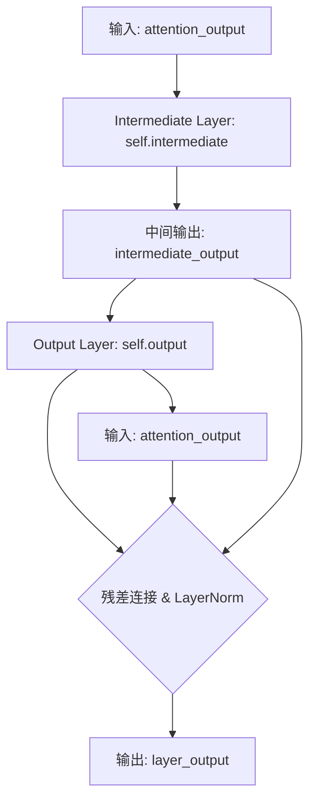

#### 带注释源码

```python
def feed_forward_chunk(self, attention_output):
    """
    对注意力输出执行单块前馈网络计算。
    通常被 apply_chunking_to_forward 调用，以处理长序列时的内存优化。

    参数:
        attention_output (torch.Tensor): 来自注意力机制的输出。

    返回:
        torch.Tensor: 经过前馈变换和残差连接后的输出。
    """
    # 1. 中间层处理：通常包含一个线性层 (up-project) 和一个激活函数 (如 GELU)
    # 将 hidden_size 扩展到 intermediate_size (通常是 hidden_size * 4)
    intermediate_output = self.intermediate(attention_output)
    
    # 2. 输出层处理：包含线性层 (down-project)、LayerNorm 和 Dropout
    # 并在此处执行残差连接 (Add) 和 LayerNorm
    layer_output = self.output(intermediate_output, attention_output)
    
    return layer_output
```

#### 关联类与关键组件信息

在 `Blip2QFormerLayer` 类中，此方法依赖以下关键组件：

*   **`self.intermediate` (`Blip2QFormerIntermediate`)**：
    *   描述：前馈网络的第一部分。通常实现为 `Linear(hidden_size, intermediate_size)` + `Activation`。
    *   作用：升维以引入更多参数和表达能力。

*   **`self.output` (`Blip2QFormerOutput`)**：
    *   描述：前馈网络的第二部分。通常实现为 `Linear(intermediate_size, hidden_size)` + `LayerNorm` + `Dropout`。
    *   作用：降维回原始尺寸，并执行 Transformer 架构中关键的 "Add & Norm"（残差与归一化）操作。

#### 潜在的技术债务与优化空间

1.  **缺乏显式激活函数封装**：虽然调用了 `self.intermediate`，但具体的激活函数（如 GELU）被封装在 `Blip2QFormerIntermediate` 内部。如果需要动态切换激活函数（如改为 SwiGLU），修改此处代码的显式程度较低。
2.  **分块策略依赖配置**：该方法的调用方 `forward` 使用了 `apply_chunking_to_forward`。如果 `config.chunk_size_feed_forward` 设置不当（在某些硬件配置下），可能无法达到最优的内存/速度平衡。
3.  **耦合性**：该方法直接依赖输入 `attention_output` 进行残差连接。如果未来需要修改残差连接的策略（例如使用 Pre-LayerNorm），需要同时修改此处代码。

#### 其它项目

*   **设计约束**：
    *   必须保持输入输出形状一致（`hidden_size` 维度）。
    *   必须支持梯度反向传播（因为是 `nn.Module`）。
*   **数据流**：
    *   输入数据流：`attention_output` (Shape: `[B, L, H]`) -> `intermediate` -> `output` (Residual Add + Norm) -> `layer_output`。
*   **错误处理**：
    *   运行时主要依赖 PyTorch 的自动类型检查。如果 `attention_output` 维度与 `intermediate` 层定义不匹配，会抛出 `RuntimeError`。


### `Blip2QFormerLayer.feed_forward_chunk_query`

该方法实现Query专用的前馈网络块，对注意力输出进行非线性变换和残差连接处理。它在Blip2QFormerLayer的forward方法中被调用，专门处理query部分（视觉查询令牌）的特征，通过中间层和输出层进行特征映射和维度变换。

参数：

- `attention_output`：`torch.Tensor`，来自自注意力模块的输出张量，形状为 `[batch_size, query_length, hidden_size]`

返回值：`torch.Tensor`，经过前馈网络处理后的输出张量，形状与输入相同 `[batch_size, query_length, hidden_size]`

#### 流程图

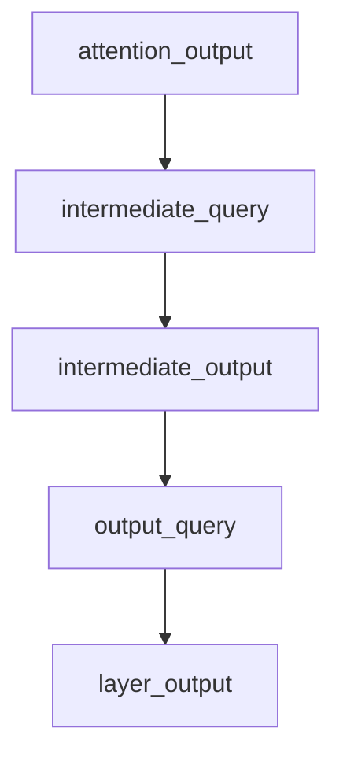

#### 带注释源码

```python
def feed_forward_chunk_query(self, attention_output):
    """
    处理Query部分的前馈网络块
    与 feed_forward_chunk 的区别在于使用了不同的中间层和输出层:
    - intermediate_query: 用于处理query的中间层
    - output_query: 用于处理query的输出层
    
    这种分离设计允许对文本query和视觉query使用不同的前馈变换
    """
    # 第一步：通过intermediate_query层进行非线性变换
    # intermediate_query是Blip2QFormerIntermediate的实例
    # 包含一个线性层 + GELU激活函数
    intermediate_output = self.intermediate_query(attention_output)
    
    # 第二步：通过output_query层进行残差连接和最终变换
    # output_query是Blip2QFormerOutput的实例
    # 包含一个线性层 + LayerNorm + Dropout，并使用残差连接
    layer_output = self.output_query(intermediate_output, attention_output)
    
    return layer_output
```


### `ProjLayer.forward`

该函数实现了投影层的前向传播过程，将多模态Blip2嵌入向量投影到文本编码器可用的空间，采用Pre-LayerNorm结构，结合全连接层、QuickGELU激活函数、Dropout和残差连接进行特征变换。

参数：

- `x`：`torch.Tensor`，输入的多模态嵌入向量，形状为 `(batch_size, seq_length, in_dim)`

返回值：`torch.Tensor`，投影后的嵌入向量，形状与输入相同 `(batch_size, seq_length, out_dim)`

#### 流程图

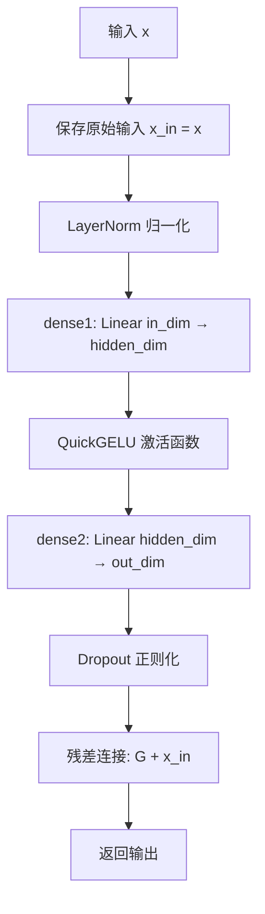

#### 带注释源码

```python
def forward(self, x):
    """
    投影层的前向传播
    
    参数:
        x: 输入的多模态嵌入向量，形状为 (batch_size, seq_length, in_dim)
    
    返回:
        投影后的嵌入向量，形状为 (batch_size, seq_length, out_dim)
    """
    # 保存原始输入用于残差连接
    x_in = x

    # Pre-LayerNorm: 先归一化再进行特征变换
    x = self.LayerNorm(x)
    
    # FFN: Dense1 -> Act -> Dense2 -> Dropout
    # 这是一个两层全连接网络，中间维度扩展为 hidden_dim
    x = self.dropout(self.dense2(self.act_fn(self.dense1(x))) + x_in)

    return x
```


### `Blip2VisionModel.forward`

该方法是Blip2VisionModel类的前向传播函数，负责接收像素值（图像数据），通过视觉嵌入层、编码器层和池化层处理，最终输出图像的隐藏状态和池化后的表示。

参数：

- `pixel_values`：`torch.Tensor | None`，输入的像素值张量，通常为批次图像数据
- `output_attentions`：`bool | None`，是否输出注意力权重
- `output_hidden_states`：`bool | None`，是否输出所有隐藏状态
- `return_dict`：`bool | None`，是否以字典形式返回结果

返回值：`tuple | BaseModelOutputWithPooling`，返回编码后的最后隐藏状态、池化输出以及可选的注意力权重和隐藏状态

#### 流程图

```mermaid
flowchart TD
    A[开始 forward] --> B{检查 pixel_values}
    B -->|为 None| C[抛出 ValueError]
    B -->|有效值| D[执行 self.embeddings&#40;pixel_values&#41;]
    D --> E[执行 self.pre_layernorm&#40;hidden_states&#41;]
    E --> F[执行 self.encoder]
    F --> G[获取 last_hidden_state]
    G --> H[执行 self.post_layernorm&#40;last_hidden_state&#41;]
    H --> I[提取 pooled_output&#40;第0个token&#41;]
    I --> J{return_dict?}
    J -->|True| K[返回 BaseModelOutputWithPooling]
    J -->|False| L[返回 tuple]
    C --> M[结束]
    K --> M
    L --> M
```

#### 带注释源码

```python
@replace_return_docstrings(output_type=BaseModelOutputWithPooling, config_class=Blip2VisionConfig)
def forward(
    self,
    pixel_values: torch.Tensor | None = None,
    output_attentions: bool | None = None,
    output_hidden_states: bool | None = None,
    return_dict: bool | None = None,
) -> tuple | BaseModelOutputWithPooling:
    r"""
    Returns:

    """
    # 如果未指定output_attentions，则使用配置默认值
    output_attentions = output_attentions if output_attentions is not None else self.config.output_attentions
    # 如果未指定output_hidden_states，则使用配置默认值
    output_hidden_states = (
        output_hidden_states if output_hidden_states is not None else self.config.output_hidden_states
    )
    # 如果未指定return_dict，则使用配置默认值
    return_dict = return_dict if return_dict is not None else self.config.use_return_dict

    # 验证输入：如果未提供pixel_values则抛出错误
    if pixel_values is None:
        raise ValueError("You have to specify pixel_values")

    # 步骤1: 将像素值通过视觉嵌入层转换为隐藏状态
    # Blip2VisionEmbeddings包含patch_embedding和position_embedding
    hidden_states = self.embeddings(pixel_values)
    
    # 步骤2: 应用预层归一化
    hidden_states = self.pre_layernorm(hidden_states)
    
    # 步骤3: 通过视觉编码器处理隐藏状态
    encoder_outputs = self.encoder(
        inputs_embeds=hidden_states,
        output_attentions=output_attentions,
        output_hidden_states=output_hidden_states,
        return_dict=return_dict,
    )
    
    # 步骤4: 获取编码器的最后隐藏状态
    last_hidden_state = encoder_outputs[0]
    
    # 步骤5: 对最后隐藏状态应用后层归一化
    last_hidden_state = self.post_layernorm(last_hidden_state)

    # 步骤6: 池化输出 - 取第一个token的隐藏状态作为池化表示
    pooled_output = last_hidden_state[:, 0, :]
    pooled_output = self.post_layernorm(pooled_output)

    # 根据return_dict决定返回格式
    if not return_dict:
        # 返回元组: (last_hidden_state, pooled_output, hidden_states, attentions)
        return (last_hidden_state, pooled_output) + encoder_outputs[1:]

    # 返回包含池化输出的模型输出对象
    return BaseModelOutputWithPooling(
        last_hidden_state=last_hidden_state,
        pooler_output=pooled_output,
        hidden_states=encoder_outputs.hidden_states,
        attentions=encoder_outputs.attentions,
    )
```


### `Blip2VisionModel.get_input_embeddings`

获取视觉模型的输入嵌入层，用于将像素值转换为嵌入向量。

参数：
- 无（该方法为实例方法，隐含参数 `self`）

返回值：`Blip2VisionEmbeddings`，返回视觉模型的嵌入层实例，用于处理输入图像的嵌入表示。

#### 流程图

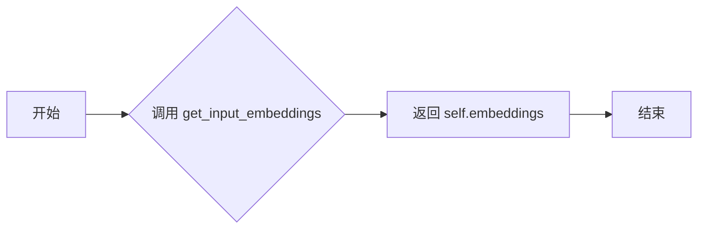

#### 带注释源码

```python
def get_input_embeddings(self):
    """
    获取视觉模型的输入嵌入层。
    
    返回值:
        Blip2VisionEmbeddings: 视觉嵌入层模块，包含图像补丁嵌入和位置嵌入等。
    """
    return self.embeddings
```


### `Blip2QFormerModel.get_input_embeddings`

获取Q-Former模型的词嵌入层（word embeddings），用于将输入的token IDs转换为密集的向量表示。这是访问模型输入嵌入矩阵的接口方法。

参数：

- （无参数，仅有隐式参数 `self`）

返回值：`torch.nn.Embedding`，返回词嵌入矩阵，该矩阵将词汇表中的每个token ID映射到指定维度的稠密向量空间。

#### 流程图

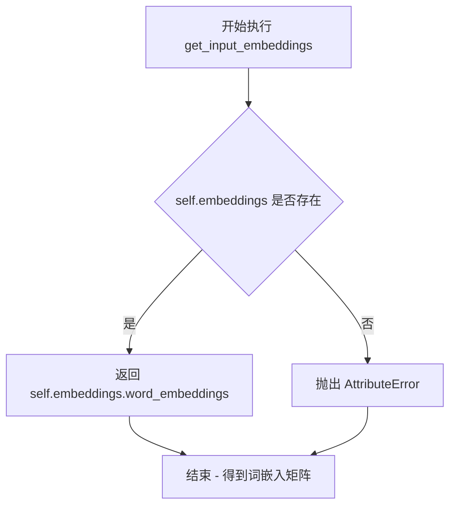

#### 带注释源码

```python
def get_input_embeddings(self):
    """
    获取模型的输入嵌入层（词嵌入矩阵）。
    
    该方法返回Blip2TextEmbeddings对象中的word_embeddings属性，
    这是一个nn.Embedding实例，用于将输入的token IDs转换为
    hidden_size维度的向量表示。
    
    Returns:
        nn.Embedding: 词嵌入矩阵，形状为 [vocab_size, hidden_size]
    """
    return self.embeddings.word_embeddings
```


### `Blip2QFormerModel.set_input_embeddings`

设置 Q-Former 模型的输入词嵌入层，允许在模型初始化后动态替换词嵌入矩阵，通常用于微调或迁移学习场景。

参数：

- `value`：`nn.Embedding`，新的词嵌入矩阵，用于替换原有的 `self.embeddings.word_embeddings`

返回值：`None`，该方法直接修改模型内部状态，无返回值

#### 流程图

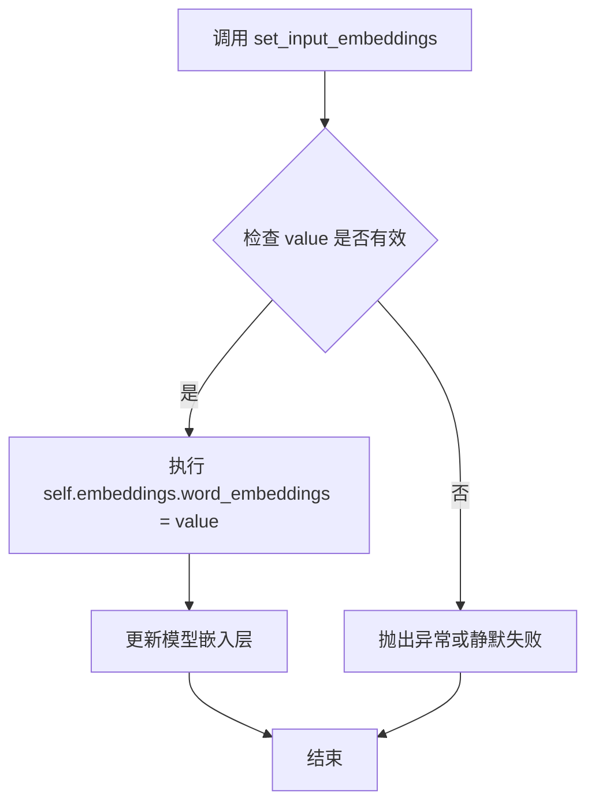

#### 带注释源码

```python
def set_input_embeddings(self, value):
    """
    设置 Q-Former 模型的词嵌入层。

    参数:
        value (nn.Embedding): 新的词嵌入矩阵，需与原嵌入层维度兼容
                              (vocab_size, hidden_size)

    返回:
        None: 直接修改模型内部状态

    示例:
        >>> # 获取当前嵌入
        >>> old_embeddings = model.get_input_embeddings()
        >>> # 创建新嵌入并设置
        >>> new_embeddings = nn.Embedding(vocab_size, hidden_size)
        >>> model.set_input_embeddings(new_embeddings)
    """
    self.embeddings.word_embeddings = value
```


### `Blip2QFormerModel._prune_heads`

该方法用于剪枝（移除）Q-Former 模型中指定层的注意力头，通过调用底层 `Blip2QFormerAttention` 类的 `prune_heads` 方法实现。

参数：

- `heads_to_prune`：`dict`，字典类型，其中键为层编号（layer_num），值为该层需要剪枝的注意力头索引列表。例如：`{0: [0, 1], 2: [3]}` 表示第0层剪掉第0和第1个头，第2层剪掉第3个头。

返回值：`None`，无返回值。该方法直接修改模型内部状态，不返回任何值。

#### 流程图

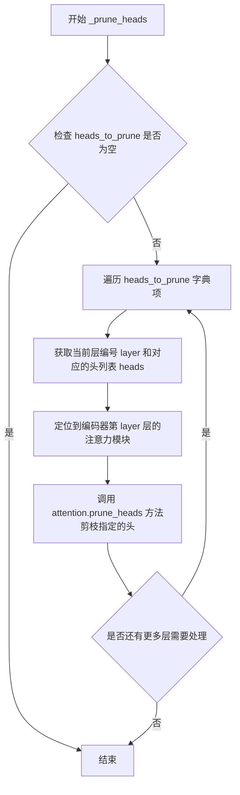

#### 带注释源码

```python
def _prune_heads(self, heads_to_prune):
    """
    Prunes heads of the model. heads_to_prune: dict of {layer_num: list of heads to prune in this layer} See base
    class PreTrainedModel
    """
    # 遍历需要剪枝的每一层及其对应的注意力头列表
    for layer, heads in heads_to_prune.items():
        # 通过编码器获取指定层的注意力模块，并调用其 prune_heads 方法
        # self.encoder.layer[layer] 获取第 layer 层的 Blip2QFormerLayer
        # .attention 获取该层的自注意力模块 Blip2QFormerAttention
        # .prune_heads(heads) 执行实际的剪枝操作
        self.encoder.layer[layer].attention.prune_heads(heads)
```


### `Blip2QFormerModel.get_extended_attention_mask`

该方法用于将原始的注意力掩码（attention_mask）转换为扩展格式，使其能够广播到多头注意力机制所需的四维张量形状（[batch_size, num_heads, seq_length, seq_length]），同时将掩码值转换为适合加到注意力分数上的数值（0.0表示可attend，-10000.0表示需忽略）。

参数：

- `self`：`Blip2QFormerModel`实例本身，隐式参数
- `attention_mask`：`torch.Tensor`，原始注意力掩码，1表示需要attend的token，0表示需要忽略的token
- `input_shape`：`tuple[int]`，输入模型的形状，通常为(batch_size, seq_length)
- `device`：`torch.device`，输入张量所在的设备（CPU或CUDA）
- `has_query`：`bool`，可选参数，默认为False，表示是否包含query_tokens（当前函数实现中未使用该参数）

返回值：`torch.Tensor`，扩展后的注意力掩码，形状为[batch_size, 1, 1, seq_length]或[batch_size, 1, seq_length, seq_length]，dtype与输入的attention_mask相同

#### 流程图

```mermaid
flowchart TD
    A[开始] --> B{检查attention_mask维度}
    B -->|dim == 3| C[扩展为[batch, 1, from_seq, to_seq]]
    B -->|dim == 2| D[扩展为[batch, 1, 1, seq_length]]
    B -->|其他| E[抛出ValueError异常]
    C --> F[转换为self.dtype类型]
    D --> F
    F --> G[计算: extended_attention_mask = (1.0 - extended_attention_mask) * -10000.0]
    G --> H[返回扩展后的注意力掩码]
    E --> I[错误处理: 提示输入形状错误]
```

#### 带注释源码

```python
def get_extended_attention_mask(
    self,
    attention_mask: torch.Tensor,
    input_shape: tuple[int],
    device: torch.device,
    has_query: bool = False,
) -> torch.Tensor:
    """
    Makes broadcastable attention and causal masks so that future and masked tokens are ignored.

    Arguments:
        attention_mask (`torch.Tensor`):
            Mask with ones indicating tokens to attend to, zeros for tokens to ignore.
        input_shape (`tuple[int]`):
            The shape of the input to the model.
        device (`torch.device`):
            The device of the input to the model.

    Returns:
        `torch.Tensor` The extended attention mask, with a the same dtype as `attention_mask.dtype`.
    """
    # 我们可以提供自注意力掩码，维度为[batch_size, from_seq_length, to_seq_length]
    # 在这种情况下，我们只需要使其能够广播到所有注意力头
    if attention_mask.dim() == 3:
        # 如果是3D掩码[batch, seq1, seq2]，在索引1位置插入新维度
        # 扩展为[batch, 1, seq1, seq2]以适配多头注意力
        extended_attention_mask = attention_mask[:, None, :, :]
    elif attention_mask.dim() == 2:
        # 如果提供的是填充掩码，维度为[batch_size, seq_length]
        # 由于模型是encoder，将掩码扩展为可广播的[batch_size, num_heads, seq_length, seq_length]
        extended_attention_mask = attention_mask[:, None, None, :]
    else:
        raise ValueError(
            "Wrong shape for input_ids (shape {}) or attention_mask (shape {})".format(
                input_shape, attention_mask.shape
            )
        )

    # 由于attention_mask中1.0表示我们要attend的位置，0.0表示masked位置
    # 此操作将创建一个张量：我们要attend的位置为0.0，masked位置为-10000.0
    # 由于我们是在softmax之前的原始分数上添加它，这实际上与完全移除这些位置相同
    extended_attention_mask = extended_attention_mask.to(dtype=self.dtype)  # fp16兼容性
    extended_attention_mask = (1.0 - extended_attention_mask) * -10000.0
    return extended_attention_mask
```


### `Blip2QFormerModel.forward`

该方法是 BLIP-2 模型中 Querying Transformer (Q-Former) 的核心前向传播函数，负责将文本输入和图像输入融合生成多模态嵌入表示。方法首先使用 tokenizer 处理文本，同时利用视觉编码器提取图像特征，然后通过 Q-Former 编码器融合两种模态的信息，最后输出融合后的序列表示和池化表示。

参数：

- `text_input`：(`str` 或 `List[str]`)，原始文本输入，用于 tokenizer 进行分词处理
- `image_input`：(`torch.Tensor`)，图像输入数据，形状为 `(batch_size, channels, height, width)`，用于视觉编码器提取图像特征
- `head_mask`：(`torch.Tensor`，可选)，注意力头掩码，用于选择性地屏蔽某些注意力头，形状为 `[num_hidden_layers, num_heads]` 或 `[num_heads]`
- `encoder_hidden_states`：(`torch.Tensor`，可选)，编码器的隐藏状态序列，如果在交叉注意力中使用，形状为 `(batch_size, sequence_length, hidden_size)`
- `encoder_attention_mask`：(`torch.Tensor`，可选)，编码器注意力掩码，用于屏蔽编码器中的填充令牌，形状为 `(batch_size, sequence_length)`
- `past_key_values`：(`tuple(tuple(torch.Tensor))`，可选)，包含预计算的键值对，用于加速解码，形状为 `(batch_size, num_heads, sequence_length - 1, embed_size_per_head)`
- `use_cache`：(`bool`，可选)，如果设置为 `True`，则返回 `past_key_values` 键值状态以加速解码
- `output_attentions`：(`bool`，可选)，是否输出所有层的注意力权重
- `output_hidden_states`：(`bool`，可选)，是否输出所有层的隐藏状态
- `return_dict`：(`bool`，可选)，是否返回 `BaseModelOutputWithPoolingAndCrossAttentions` 字典格式而不是元组

返回值：`torch.Tensor` 或 `BaseModelOutputWithPoolingAndCrossAttentions`，当 `return_dict=True` 时返回包含最后隐藏状态、池化输出、过去键值、隐藏状态、注意力权重和交叉注意力的完整输出对象；当 `return_dict=False` 时仅返回投影层处理后的查询令牌对应的隐藏状态

#### 流程图

```mermaid
flowchart TD
    A[开始 forward] --> B[tokenizer处理text_input]
    B --> C[创建query_atts注意力掩码]
    C --> D[concat query_atts和text.attention_mask]
    D --> E[获取past_key_values_length]
    E --> F[embeddings处理input_ids和query_embeds]
    F --> G[visual_encoder处理image_input获取image_embeds_frozen]
    G --> H[设置encoder_hidden_states为image_embeds_frozen]
    H --> I[创建扩展注意力掩码 extended_attention_mask]
    I --> J[创建编码器扩展注意力掩码 encoder_extended_attention_mask]
    J --> K[获取head_mask]
    K --> L[encoder forward pass]
    L --> M[获取sequence_output和pooled_output]
    M --> N{return_dict?}
    N -->|Yes| O[返回BaseModelOutputWithPoolingAndCrossAttentions]
    N -->|No| P[返回proj_layer投影后的查询令牌隐藏状态]
    O --> P
```

#### 带注释源码

```python
def forward(
    self,
    text_input=None,                    # 文本输入，字符串或字符串列表
    image_input=None,                  # 图像输入张量
    head_mask=None,                    # 注意力头掩码
    encoder_hidden_states=None,        # 编码器隐藏状态（可选）
    encoder_attention_mask=None,       # 编码器注意力掩码（可选）
    past_key_values=None,              # 过去的键值对（用于缓存）
    use_cache=None,                    # 是否使用缓存
    output_attentions=None,            # 是否输出注意力
    output_hidden_states=None,         # 是否输出隐藏状态
    return_dict=None,                  # 是否返回字典格式
):
    r"""
    encoder_hidden_states  (`torch.Tensor` of shape `(batch_size, sequence_length, hidden_size)`, `optional`):
        Sequence of hidden-states at the output of the last layer of the encoder. Used in the cross-attention if
        the model is configured as a decoder.
    encoder_attention_mask (`torch.Tensor` of shape `(batch_size, sequence_length)`, `optional`):
        Mask to avoid performing attention on the padding token indices of the encoder input. This mask is used in
        the cross-attention if the model is configured as a decoder. Mask values selected in `[0, 1]`:
        - 1 for tokens that are **not masked**,
        - 0 for tokens that are **masked**.
    past_key_values (`tuple(tuple(torch.Tensor))` of length `config.n_layers` with each tuple having 4 tensors of:
        shape `(batch_size, num_heads, sequence_length - 1, embed_size_per_head)`): Contains precomputed key and
        value hidden states of the attention blocks. Can be used to speed up decoding. If `past_key_values` are
        used, the user can optionally input only the last `decoder_input_ids` (those that don't have their past key
        value states given to this model) of shape `(batch_size, 1)` instead of all `decoder_input_ids` of shape
        `(batch_size, sequence_length)`.
    use_cache (`bool`, `optional`):
        If set to `True`, `past_key_values` key value states are returned and can be used to speed up decoding (see
        `past_key_values`).
    """

    # 步骤1: 使用tokenizer处理文本输入，转换为模型可处理的格式
    text = self.tokenizer(text_input, return_tensors="pt", padding=True)
    text = text.to(self.device)  # 将数据移动到模型设备上
    
    # 获取输入ID和批次大小
    input_ids = text.input_ids
    batch_size = input_ids.shape[0]
    
    # 创建查询令牌的注意力掩码（全1，表示全部可见）
    # query_tokens 是可学习的查询令牌，用于从视觉特征中提取信息
    query_atts = torch.ones((batch_size, self.query_tokens.size()[1]), dtype=torch.long).to(self.device)
    
    # 拼接查询令牌注意力掩码和文本注意力掩码
    # 格式: [query_tokens_mask | text_attention_mask]
    attention_mask = torch.cat([query_atts, text.attention_mask], dim=1)

    # 步骤2: 设置输出选项
    output_attentions = output_attentions if output_attentions is not None else self.config.output_attentions
    output_hidden_states = (
        output_hidden_states if output_hidden_states is not None else self.config.output_hidden_states
    )
    return_dict = return_dict if return_dict is not None else self.config.use_return_dict

    # 步骤3: 计算过去键值对的长度（用于位置编码）
    past_key_values_length = (
        past_key_values[0][0].shape[2] - self.config.query_length if past_key_values is not None else 0
    )

    # 获取查询令牌的长度
    query_length = self.query_tokens.shape[1]

    # 步骤4: 获取文本嵌入输出
    # 将查询令牌（可学习参数）与文本ID一起传入嵌入层
    embedding_output = self.embeddings(
        input_ids=input_ids,
        query_embeds=self.query_tokens,
        past_key_values_length=past_key_values_length,
    )

    # 步骤5: 处理图像输入，通过视觉编码器获取图像嵌入
    # 视觉编码器提取图像的视觉特征
    image_embeds_frozen = self.visual_encoder(image_input).last_hidden_state
    # image_embeds_frozen = torch.ones_like(image_embeds_frozen)  # 可选：冻结图像嵌入
    encoder_hidden_states = image_embeds_frozen  # 将图像嵌入作为编码器的隐藏状态

    # 步骤6: 如果没有提供注意力掩码，则创建全1掩码
    if attention_mask is None:
        attention_mask = torch.ones(((batch_size, seq_length + past_key_values_length)), device=device)

    # 步骤7: 创建扩展的注意力掩码，使其可广播到所有注意力头
    # 将0/1掩码转换为-10000.0/0.0的形式，用于softmax前的注意力分数
    extended_attention_mask = self.get_extended_attention_mask(attention_mask, input_shape, device)

    # 步骤8: 处理编码器的注意力掩码（用于交叉注意力）
    if encoder_hidden_states is not None:
        if isinstance(encoder_hidden_states, list):
            encoder_batch_size, encoder_sequence_length, _ = encoder_hidden_states[0].size()
        else:
            encoder_batch_size, encoder_sequence_length, _ = encoder_hidden_states.size()
        encoder_hidden_shape = (encoder_batch_size, encoder_sequence_length)

        if isinstance(encoder_attention_mask, list):
            encoder_extended_attention_mask = [self.invert_attention_mask(mask) for mask in encoder_attention_mask]
        elif encoder_attention_mask is None:
            encoder_attention_mask = torch.ones(encoder_hidden_shape, device=device)
            encoder_extended_attention_mask = self.invert_attention_mask(encoder_attention_mask)
        else:
            encoder_extended_attention_mask = self.invert_attention_mask(encoder_attention_mask)
    else:
        encoder_extended_attention_mask = None

    # 步骤9: 准备头部掩码
    # 将头掩码转换为正确的形状以适配模型
    head_mask = self.get_head_mask(head_mask, self.config.qformer_config.num_hidden_layers)

    # 步骤10: 通过Q-Former编码器进行前向传播
    encoder_outputs = self.encoder(
        embedding_output,                      # 文本+查询令牌的嵌入
        attention_mask=extended_attention_mask, # 扩展后的注意力掩码
        head_mask=head_mask,                   # 头部掩码
        encoder_hidden_states=encoder_hidden_states, # 图像嵌入（用于交叉注意力）
        encoder_attention_mask=encoder_extended_attention_mask, # 编码器注意力掩码
        past_key_values=past_key_values,       # 过去的键值对
        use_cache=use_cache,                   # 是否使用缓存
        output_attentions=output_attentions,   # 是否输出注意力
        output_hidden_states=output_hidden_states, # 是否输出隐藏状态
        return_dict=return_dict,               # 返回格式
        query_length=query_length,              # 查询令牌长度
    )
    
    # 获取序列输出和池化输出
    sequence_output = encoder_outputs[0]
    pooled_output = sequence_output[:, 0, :]  # 取第一个token的输出作为池化表示

    # 步骤11: 返回结果
    if not return_dict:
        # 如果不返回字典格式，只返回投影层处理后的查询令牌对应的隐藏状态
        return self.proj_layer(sequence_output[:, :query_length, :])

    # 返回完整的模型输出（包含池化输出、过去键值、隐藏状态、注意力等）
    return BaseModelOutputWithPoolingAndCrossAttentions(
        last_hidden_state=sequence_output,
        pooler_output=pooled_output,
        past_key_values=encoder_outputs.past_key_values,
        hidden_states=encoder_outputs.hidden_states,
        attentions=encoder_outputs.attentions,
        cross_attentions=encoder_outputs.cross_attentions,
    )
```

## 关键组件


### Blip2TextEmbeddings

文本嵌入层，负责将输入的文本token转换为词向量和位置向量，并支持查询嵌入的拼接

### Blip2VisionEmbeddings

视觉嵌入层，将输入的像素值通过卷积patch embedding转换为视觉嵌入向量，并添加类别token和位置编码

### Blip2QFormerEncoder

Q-Former编码器，由多个Blip2QFormerLayer堆叠而成，负责处理融合后的多模态嵌入，支持梯度检查点、缓存机制和交叉注意力

### Blip2QFormerLayer

Q-Former的单层实现，包含自注意力机制和可选的跨模态注意力，支持查询向量和文本向量的分别处理，使用分块前馈网络提升效率

### ProjLayer

投影层，将Q-Former输出的嵌入维度进行变换，包含两层线性变换和QuickGELU激活函数，末尾带有残差连接和LayerNorm

### Blip2VisionModel

视觉编码器模型，负责从像素值中提取视觉特征，包含嵌入层、编码器和池化层，采用PreLN和PostLN双层归一化结构

### Blip2QFormerModel

Q-Former主模型，整合视觉编码器、文本嵌入和查询token，通过tokenizer处理文本输入，并将视觉特征与文本特征进行跨模态融合，输出多模态嵌入

## 问题及建议


### 已知问题

-   **硬编码的Tokenizer路径**：在`Blip2QFormerModel.__init__`中，tokenizer被硬编码为"bert-base-uncased"，缺乏灵活性，应从config或参数传入
-   **重复调用LayerNorm的Bug**：在`Blip2VisionModel.forward`中，`post_layernorm`被调用了两次（第二次在pooled_output处是错误的）
-   **device管理不一致**：代码中混用了`self.device`和`.to(device)`，可能导致跨设备执行时出错
-   **未使用的变量/死代码**：注释掉的`embedding_output = self.layernorm(query_embeds)`等代码表明功能未完成或已废弃
-   **query_tokens初始化不当**：使用`torch.zeros`初始化可学习参数`query_tokens`，可能导致梯度流问题，应使用`torch.randn`
-   **缺少输入验证**：多个forward方法缺少对None输入的充分检查和类型验证
-   **类型注解不完整**：部分方法如`Blip2QFormerModel.forward`的返回类型注解缺失或不准确
-   **magic numbers散落**：drop_p=0.1、eps=1e-12等超参数硬编码在各处，应从config统一管理

### 优化建议

-   将tokenizer初始化逻辑统一到config中，支持自定义tokenizer路径
-   修复`Blip2VisionModel.forward`中的重复LayerNorm调用，保留第一个即可
-   统一使用`self.device`或显式传递device参数，避免隐式设备依赖
-   清理注释掉的死代码，或完成未实现的功能
-   使用`nn.Parameter(torch.randn(...))`初始化query_tokens以确保可学习
-   为所有public方法添加完整的类型注解和输入验证
-   将超参数提取到配置类中，通过config传递而不是硬编码
-   考虑使用`torch.no_grad()`或`torch.inference_mode()`在推理时禁用梯度计算

## 其它


### 设计目标与约束

本模块实现了BLIP-2（Bootstrapped Language-Image Pre-training）模型的多模态嵌入获取功能，核心目标是将图像和文本编码为统一的向量表示，供下游任务使用。设计约束包括：必须依赖HuggingFace Transformers库；支持获取多模态嵌入（原始transformers实现不支持）；模型输入为图像pixel_values和文本text_input，输出为融合后的多模态embedding。

### 错误处理与异常设计

代码中包含以下错误处理机制：1) forward方法中当pixel_values为None时抛出ValueError("You have to specify pixel_values")；2) Blip2QFormerLayer的crossattention需要encoder_hidden_states，若为None则抛出ValueError("encoder_hidden_states must be given for cross-attention layers")；3) attention_mask维度校验，当维度不符合2D或3D时抛出ValueError。潜在改进：建议增加对image_input的None检查、tokenizer返回结果的空值校验、以及设备兼容性检查。

### 数据流与状态机

数据流主要分为三阶段：第一阶段为图像处理，pixel_values经Blip2VisionEmbeddings进行patch embedding和位置编码，再通过Blip2Encoder得到视觉hidden states；第二阶段为文本处理，text_input经BertTokenizer分词后，通过Blip2TextEmbeddings得到文本embedding，同时query_tokens作为可学习参数参与；第三阶段为融合，视觉encoder输出作为encoder_hidden_states，与文本embedding一同送入Blip2QFormerEncoder进行跨注意力融合，最终通过proj_layer投影输出多模态embedding。

### 外部依赖与接口契约

主要依赖包括：torch和nn模块（PyTorch神经网络基础）；transformers库的BertTokenizer、QuickGELUActivation、BaseModelOutput系列；Blip2PreTrainedModel及相关组件。接口契约：Blip2QFormerModel.forward(text_input, image_input)返回BaseModelOutputWithPoolingAndCrossAttentions或tuple；Blip2VisionModel.forward(pixel_values)返回BaseModelOutputWithPooling。

### 性能考虑与优化空间

代码已包含gradient_checkpointing支持以节省显存；使用apply_chunking_to_forward进行前馈网络分块计算；query_tokens使用nn.Parameter可训练但数量固定。优化空间：1) 可添加混合精度训练支持；2) 可缓存tokenizer结果避免重复分词；3) 可实现动态query_tokens数量；4) 当前visual_encoder每次前向都重新计算，建议增加缓存机制。

### 安全性考虑

代码未包含用户输入直接执行或敏感数据处理，主要安全考量在依赖的transformers库和tokenizer。建议确保使用的BertTokenizer版本安全，避免加载不受信任的预训练模型权重。

### 版本兼容性与迁移策略

代码注释明确指出"There is an implementation of Blip2 in transformers but it doesn't support getting multimodal embeddings. So, this module can be replaced with a future transformers version supports that."，说明当前实现为临时方案，未来transformers版本更新后应迁移至官方实现。迁移时应保持接口兼容性，注意config参数名称可能变化。

    