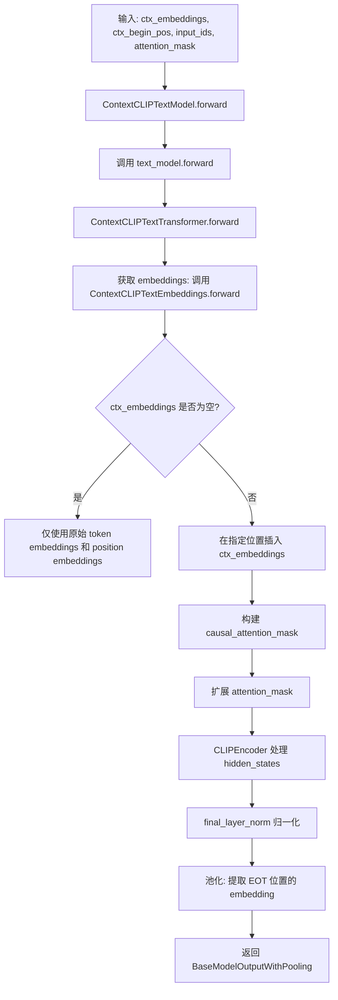
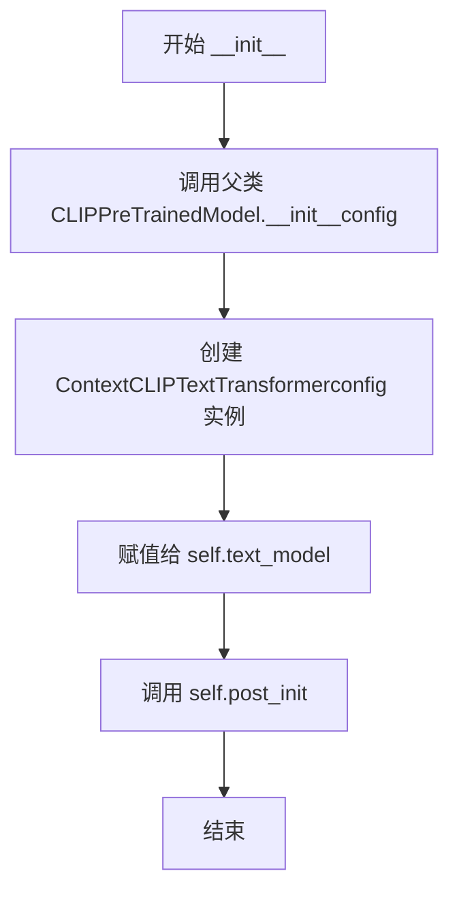
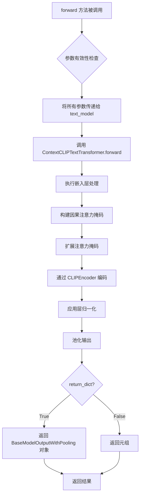
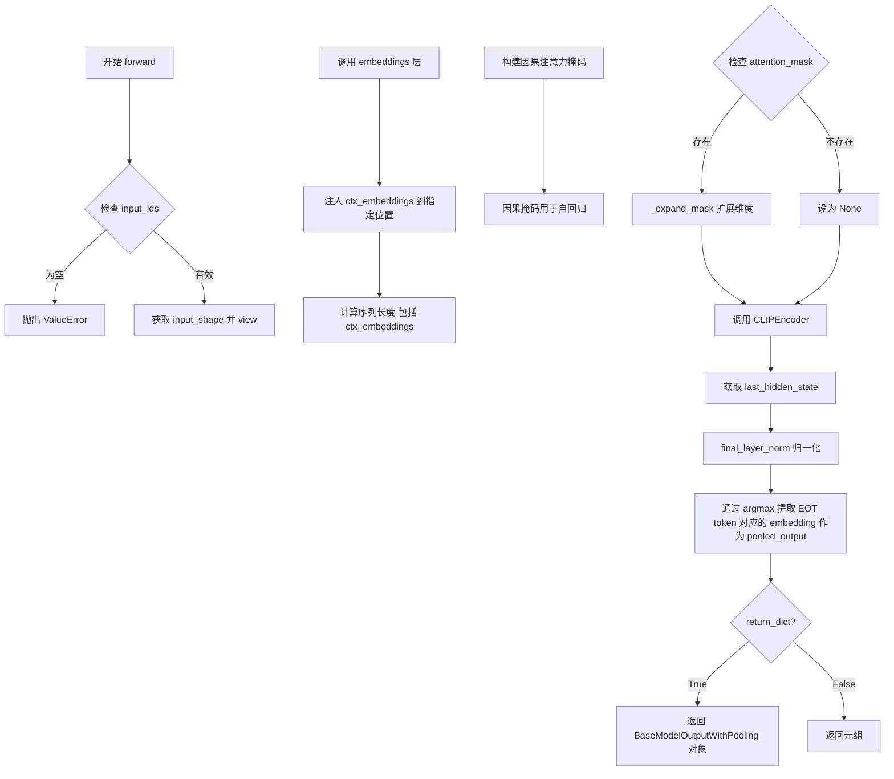
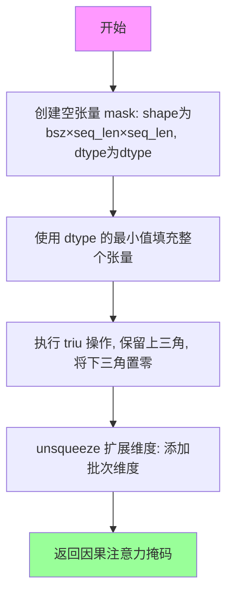

# `diffusers\src\diffusers\pipelines\blip_diffusion\modeling_ctx_clip.py` 详细设计文档

这是一个修改版的CLIP文本模型，增加了上下文嵌入(context embeddings)输入功能。该模型允许额外的'上下文嵌入'（来自Qformer的查询嵌入）与文本嵌入一起通过CLIP模型，利用自注意力机制进行交互，从而实现更丰富的多模态特征融合。

## 整体流程



## 类结构

```
CLIPPreTrainedModel (基类)
└── ContextCLIPTextModel
    └── nn.Module
        └── ContextCLIPTextTransformer
            └── nn.Module
                └── ContextCLIPTextEmbeddings
```

## 全局变量及字段


### `embed_dim`
    
隐藏层维度

类型：`int`
    


### `bsz`
    
批量大小

类型：`int`
    


### `seq_len`
    
序列长度

类型：`int`
    


### `ctx_len`
    
上下文嵌入长度

类型：`int`
    


### `input_shape`
    
输入形状

类型：`tuple`
    


### `hidden_states`
    
隐藏状态

类型：`torch.Tensor`
    


### `causal_attention_mask`
    
因果注意力掩码

类型：`torch.Tensor`
    


### `expanded_mask`
    
扩展后的掩码

类型：`torch.Tensor`
    


### `inverted_mask`
    
反转后的掩码

类型：`torch.Tensor`
    


### `encoder_outputs`
    
编码器输出

类型：`tuple`
    


### `last_hidden_state`
    
最后的隐藏状态

类型：`torch.Tensor`
    


### `pooled_output`
    
池化输出

类型：`torch.Tensor`
    


### `ContextCLIPTextModel.text_model`
    
文本变换器模型

类型：`ContextCLIPTextTransformer`
    


### `ContextCLIPTextTransformer.config`
    
模型配置

类型：`CLIPTextConfig`
    


### `ContextCLIPTextTransformer.embeddings`
    
嵌入层

类型：`ContextCLIPTextEmbeddings`
    


### `ContextCLIPTextTransformer.encoder`
    
编码器

类型：`CLIPEncoder`
    


### `ContextCLIPTextTransformer.final_layer_norm`
    
最终层归一化

类型：`nn.LayerNorm`
    


### `ContextCLIPTextEmbeddings.token_embedding`
    
token嵌入

类型：`nn.Embedding`
    


### `ContextCLIPTextEmbeddings.position_embedding`
    
位置嵌入

类型：`nn.Embedding`
    


### `ContextCLIPTextEmbeddings.position_ids`
    
位置ID缓冲区

类型：`torch.Tensor`
    
    

## 全局函数及方法


### `_expand_mask`

该函数用于将注意力掩码从 `[bsz, seq_len]` 的二维形式扩展为 `[bsz, 1, tgt_seq_len, src_seq_len]` 的四维形式，以适配多头注意力机制的计算需求，同时将掩码值反转（0→1，1→0）并用极小值替换0值位置以实现注意力屏蔽。

参数：

- `mask`：`torch.Tensor`，原始注意力掩码，形状为 `[bsz, seq_len]`
- `dtype`：`torch.dtype`，目标数据类型，用于张量类型转换
- `tgt_len`：`int | None`，目标序列长度，若为 `None` 则使用 `src_len`

返回值：`torch.Tensor`，扩展并反转后的注意力掩码，形状为 `[bsz, 1, tgt_seq_len, src_seq_len]`

#### 流程图

```mermaid
flowchart TD
    A[输入 mask: tensor[bsz, seq_len]] --> B[获取 bsz, src_len]
    B --> C{判断 tgt_len 是否为 None}
    C -->|是| D[tgt_len = src_len]
    C -->|否| E[tgt_len 保持原值]
    D --> F[使用 expand 扩展维度]
    E --> F
    F --> G[mask[:, None, None, :].expand]
    G --> H[转换为 dtype 类型]
    H --> I[1.0 - expanded_mask 反转]
    I --> J[masked_fill 替换零值]
    J --> K[输出 tensor[bsz, 1, tgt_len, src_len]]
```

#### 带注释源码

```python
def _expand_mask(mask: torch.Tensor, dtype: torch.dtype, tgt_len: int | None = None):
    """
    Expands attention_mask from `[bsz, seq_len]` to `[bsz, 1, tgt_seq_len, src_seq_len]`.
    
    参数:
        mask: 原始注意力掩码，形状为 [batch_size, seq_len]
        dtype: 目标数据类型，用于类型转换
        tgt_len: 目标序列长度，若为 None 则默认为 src_len
    
    返回:
        扩展并反转后的注意力掩码，形状为 [batch_size, 1, tgt_seq_len, src_seq_len]
    """
    # 获取批次大小和源序列长度
    bsz, src_len = mask.size()
    
    # 如果未指定目标长度，则使用源序列长度
    tgt_len = tgt_len if tgt_len is not None else src_len

    # 扩展掩码维度: [bsz, seq_len] -> [bsz, 1, tgt_len, src_len]
    # expand() 返回原张量的视图，不会复制数据
    expanded_mask = mask[:, None, None, :].expand(bsz, 1, tgt_len, src_len).to(dtype)

    # 反转掩码：0 -> 1, 1 -> 0
    # 在注意力机制中，1表示需要屏蔽的位置，0表示可以注意的位置
    inverted_mask = 1.0 - expanded_mask

    # 使用 masked_fill 将值为0的位置替换为 dtype 的最小值
    # 这样在 softmax 注意力计算时，这些位置的注意力权重会趋近于0
    # .to(torch.bool) 将浮点掩码转换为布尔类型
    return inverted_mask.masked_fill(inverted_mask.to(torch.bool), torch.finfo(dtype).min)
```


### `ContextCLIPTextModel.__init__`

该方法用于初始化 ContextCLIPTextModel 类实例，继承自 CLIPPreTrainedModel，设置模型配置、创建 ContextCLIPTextTransformer 文本模型组件，并调用 post_init() 进行权重初始化和最终处理。

参数：

- `self`：`ContextCLIPTextModel`，隐式参数，当前类实例本身
- `config`：`CLIPTextConfig`，Hugging Face transformers 库中的 CLIP 文本模型配置对象，包含隐藏层维度、词汇表大小、注意力机制等模型超参数

返回值：`None`，`__init__` 方法不返回任何值，仅完成对象初始化

#### 流程图



#### 带注释源码

```python
def __init__(self, config: CLIPTextConfig):
    """
    初始化 ContextCLIPTextModel 模型实例
    
    参数:
        config: CLIPTextConfig 对象，包含模型配置信息
    """
    # 调用父类 CLIPPreTrainedModel 的初始化方法
    # 继承 HuggingFace PreTrainedModel 的通用初始化逻辑
    # 包括配置存储、基础参数初始化等
    super().__init__(config)
    
    # 创建 ContextCLIPTextTransformer 子模块
    # 这是 CLIP 文本编码器的核心实现类
    # 包含 embeddings、encoder、final_layer_norm 等组件
    self.text_model = ContextCLIPTextTransformer(config)
    
    # 调用 HuggingFace 标准初始化流程
    # 负责:
    # 1. 初始化所有模块的权重（基于 _init_weights 方法）
    # 2. 应用配置中的残差连接 Dropout
    # 3. 进行模型的后处理配置（如 tie_word_embeddings 等）
    self.post_init()
```


### `ContextCLIPTextModel.forward`

该方法是 `ContextCLIPTextModel` 类的核心前向传播接口，允许在标准 CLIP 文本模型中注入上下文嵌入（context embeddings），使模型能够处理结合了外部上下文信息的文本输入，实现文本与上下文的多模态融合。

参数：

- `ctx_embeddings`：`torch.Tensor`，上下文嵌入向量，通常来自 Q-Former 生成的查询嵌入，用于为文本提供额外的上下文信息
- `ctx_begin_pos`：`list`，上下文嵌入在每个序列中的起始位置列表，指定上下文嵌入在输入序列中的插入位置
- `input_ids`：`torch.Tensor | None`，文本的 token ID 序列，标准 CLIP 文本模型的输入
- `attention_mask`：`torch.Tensor | None`，注意力掩码，用于指示哪些位置是有效 token
- `position_ids`：`torch.Tensor | None`，位置 ID 序列，指定每个 token 的位置编码
- `output_attentions`：`bool | None`，是否输出注意力权重
- `output_hidden_states`：`bool | None`，是否输出所有层的隐藏状态
- `return_dict`：`bool | None`，是否返回字典格式的输出

返回值：`tuple | BaseModelOutputWithPooling`，返回文本的隐藏状态和池化后的输出，可选择返回注意力权重和隐藏状态

#### 流程图



#### 带注释源码

```python
def forward(
    self,
    ctx_embeddings: torch.Tensor = None,
    ctx_begin_pos: list = None,
    input_ids: torch.Tensor | None = None,
    attention_mask: torch.Tensor | None = None,
    position_ids: torch.Tensor | None = None,
    output_attentions: bool | None = None,
    output_hidden_states: bool | None = None,
    return_dict: bool | None = None,
) -> tuple | BaseModelOutputWithPooling:
    """
    ContextCLIPTextModel 的前向传播方法。
    
    该方法是标准的 HuggingFace transformers 风格接口，允许注入上下文嵌入。
    上下文嵌入会在嵌入层被插入到指定位置，与标准文本嵌入进行拼接后一起编码。
    
    Args:
        ctx_embeddings: 上下文嵌入张量，形状为 [batch_size, ctx_seq_len, hidden_size]
        ctx_begin_pos: 上下文嵌入在每个序列中的起始位置列表，长度为 batch_size
        input_ids: 文本 token ID，形状为 [batch_size, seq_len]
        attention_mask: 注意力掩码，形状为 [batch_size, seq_len]
        position_ids: 位置 ID，形状为 [batch_size, seq_len]
        output_attentions: 是否输出注意力权重
        output_hidden_states: 是否输出所有层的隐藏状态
        return_dict: 是否返回字典格式输出
    
    Returns:
        tuple: (last_hidden_state, pooled_output, hidden_states, attentions) 当 return_dict=False
        BaseModelOutputWithPooling: 包含所有输出的字典对象 当 return_dict=True
    """
    # 委托给内部的 text_model (ContextCLIPTextTransformer) 执行实际的前向计算
    # 这是一个典型的装饰器模式，将请求转发给内部组件
    return self.text_model(
        ctx_embeddings=ctx_embeddings,
        ctx_begin_pos=ctx_begin_pos,
        input_ids=input_ids,
        attention_mask=attention_mask,
        position_ids=position_ids,
        output_attentions=output_attentions,
        output_hidden_states=output_hidden_states,
        return_dict=return_dict,
    )
```


### `ContextCLIPTextTransformer.__init__`

该方法用于初始化 `ContextCLIPTextTransformer` 类，构建 CLIP 文本变换器的核心组件，包括文本嵌入层、Transformer 编码器以及最终的层归一化层。

参数：
- `self`：实例对象本身。
- `config`：`CLIPTextConfig`，包含模型配置信息的对象，用于初始化嵌入维度、词汇表大小、编码器层数等模型参数。

返回值：`None`，该方法为构造函数，不返回任何值，仅初始化对象状态。

#### 流程图

```mermaid
graph TD
    A([Start __init__]) --> B[调用 super().__init__]
    B --> C[保存配置: self.config = config]
    C --> D[获取嵌入维度: embed_dim = config.hidden_size]
    D --> E[初始化嵌入层: self.embeddings = ContextCLIPTextEmbeddings(config)]
    E --> F[初始化编码器: self.encoder = CLIPEncoder(config)]
    F --> G[初始化层归一化: self.final_layer_norm = nn.LayerNorm(embed_dim)]
    G --> H([End])
```

#### 带注释源码

```python
def __init__(self, config: CLIPTextConfig):
    # 调用 nn.Module 的基类构造函数，初始化模块结构
    super().__init__()
    
    # 将配置对象保存为实例属性，供 forward 方法及其他方法使用
    self.config = config
    
    # 从配置中提取隐藏层维度 (hidden_size)，用于初始化嵌入层和归一化层
    embed_dim = config.hidden_size
    
    # 初始化自定义的嵌入层，该层支持额外的上下文嵌入输入
    # ContextCLIPTextEmbeddings 负责处理 token embedding 和 position embedding 的融合
    self.embeddings = ContextCLIPTextEmbeddings(config)
    
    # 初始化 CLIP 编码器，负责处理序列的上下文关系
    self.encoder = CLIPEncoder(config)
    
    # 初始化最终的层归一化层，用于规范化编码器输出的隐藏状态
    self.final_layer_norm = nn.LayerNorm(embed_dim)
```


### `ContextCLIPTextTransformer.forward`

该方法是修改版CLIP文本模型的前向传播函数，允许额外的"上下文嵌入"（来自Qformer的查询嵌入）与文本嵌入一起输入，通过自注意力机制实现跨模态交互。

参数：

- `ctx_embeddings`：`torch.Tensor`，来自Qformer的查询嵌入，作为上下文信息注入到文本模型中
- `ctx_begin_pos`：`list`，每个样本中上下文嵌入开始插入的位置索引列表
- `input_ids`：`torch.Tensor | None`，输入文本的token ID序列
- `attention_mask`：`torch.Tensor | None`，注意力掩码，用于控制token之间的注意力
- `position_ids`：`torch.Tensor | None`，位置编码ID，指定每个token的位置嵌入
- `output_attentions`：`bool | None`，是否返回所有层的注意力权重
- `output_hidden_states`：`bool | None`，是否返回所有层的隐藏状态
- `return_dict`：`bool | None`，是否返回字典格式的输出

返回值：`tuple | BaseModelOutputWithPooling`，返回包含最后隐藏状态和池化输出的元组，或包含`last_hidden_state`、`pooler_output`、`hidden_states`、`attentions`的`BaseModelOutputWithPooling`对象

#### 流程图



#### 带注释源码

```python
def forward(
    self,
    ctx_embeddings: torch.Tensor,
    ctx_begin_pos: list,
    input_ids: torch.Tensor | None = None,
    attention_mask: torch.Tensor | None = None,
    position_ids: torch.Tensor | None = None,
    output_attentions: bool | None = None,
    output_hidden_states: bool | None = None,
    return_dict: bool | None = None,
) -> tuple | BaseModelOutputWithPooling:
    r"""
    Returns:

    """
    # 从配置中获取默认值，若未指定则使用配置中的默认设置
    output_attentions = output_attentions if output_attentions is not None else self.config.output_attentions
    output_hidden_states = (
        output_hidden_states if output_hidden_states is not None else self.config.output_hidden_states
    )
    return_dict = return_dict if return_dict is not None else self.config.use_return_dict

    # 输入验证：必须有 input_ids
    if input_ids is None:
        raise ValueError("You have to specify either input_ids")

    # 获取批量形状并展平序列维度 [bsz, seq_len] -> [bsz * seq_len]
    input_shape = input_ids.size()
    input_ids = input_ids.view(-1, input_shape[-1])

    # 调用嵌入层：包含 token 嵌入、位置嵌入、以及上下文嵌入的注入
    hidden_states = self.embeddings(
        input_ids=input_ids,
        position_ids=position_ids,
        ctx_embeddings=ctx_embeddings,
        ctx_begin_pos=ctx_begin_pos,
    )

    # 计算序列长度：文本序列 + 上下文嵌入序列长度
    bsz, seq_len = input_shape
    if ctx_embeddings is not None:
        seq_len += ctx_embeddings.size(1)
    
    # 构建因果注意力掩码：确保文本token只能关注其前面的token
    # 遵循原始 CLIP 模型的因果掩码设计
    causal_attention_mask = self._build_causal_attention_mask(bsz, seq_len, hidden_states.dtype).to(
        hidden_states.device
    )
    
    # 展开注意力掩码：[bsz, seq_len] -> [bsz, 1, tgt_seq_len, src_seq_len]
    if attention_mask is not None:
        # [bsz, seq_len] -> [bsz, 1, tgt_seq_len, src_seq_len]
        attention_mask = _expand_mask(attention_mask, hidden_states.dtype)

    # 通过 CLIP 编码器：核心Transformer层
    encoder_outputs = self.encoder(
        inputs_embeds=hidden_states,
        attention_mask=attention_mask,
        causal_attention_mask=causal_attention_mask,
        output_attentions=output_attentions,
        output_hidden_states=output_hidden_states,
        return_dict=return_dict,
    )

    # 获取最后一层隐藏状态并进行层归一化
    last_hidden_state = encoder_outputs[0]
    last_hidden_state = self.final_layer_norm(last_hidden_state)

    # 从序列中提取 EOT (End of Text) token 对应的嵌入作为池化输出
    # EOT token 是每个序列中 token ID 最大的那个
    # text_embeds.shape = [batch_size, sequence_length, transformer.width]
    # take features from the eot embedding (eot_token is the highest number in each sequence)
    # casting to torch.int for onnx compatibility: argmax doesn't support int64 inputs with opset 14
    pooled_output = last_hidden_state[
        torch.arange(last_hidden_state.shape[0], device=input_ids.device),
        input_ids.to(torch.int).argmax(dim=-1),
    ]

    # 根据 return_dict 决定返回格式
    if not return_dict:
        return (last_hidden_state, pooled_output) + encoder_outputs[1:]

    # 返回包含池化输出和隐藏状态的字典对象
    return BaseModelOutputWithPooling(
        last_hidden_state=last_hidden_state,
        pooler_output=pooled_output,
        hidden_states=encoder_outputs.hidden_states,
        attentions=encoder_outputs.attentions,
    )
```


### `ContextCLIPTextTransformer._build_causal_attention_mask`

构建因果注意力掩码（Causal Attention Mask），用于确保CLIP文本模型在自回归生成过程中，每个token只能关注其位置之前的token，从而防止信息泄露。

参数：

- `self`：隐式参数，ContextCLIPTextTransformer 实例本身
- `bsz`：`int`，batch size，批次大小
- `seq_len`：`int`，sequence length，序列长度
- `dtype`：`torch.dtype`，输出张量的数据类型

返回值：`torch.Tensor`，因果注意力掩码，形状为 [bsz, 1, seq_len, seq_len]，其中下三角部分（包含对角线）填充负无穷大，上三角部分为0

#### 流程图



#### 带注释源码

```python
def _build_causal_attention_mask(self, bsz, seq_len, dtype):
    """
    构建因果注意力掩码，用于GPT风格的自回归模型
    pytorch使用additive attention mask，通过填充-inf实现掩码效果
    
    参数:
        bsz: batch size，批次中的样本数量
        seq_len: 序列长度
        dtype: 输出张量的数据类型
    返回:
        因果注意力掩码，形状 [bsz, 1, seq_len, seq_len]
    """
    # 创建一个形状为 [bsz, seq_len, seq_len] 的空张量
    # 这是一个方阵，用于表示序列中每个位置对其他位置的注意力权重
    mask = torch.empty(bsz, seq_len, seq_len, dtype=dtype)
    
    # 使用当前数据类型的最小值（负无穷）填充整个掩码
    # 这样在注意力计算时，这些位置的注意力权重会被极大削弱
    # torch.finfo(dtype).min 对于 float32 约为 -3.4e38
    mask.fill_(torch.tensor(torch.finfo(dtype).min))
    
    # triu 操作保留上三角矩阵（包含对角线），将下三角置零
    # 这确保了每个位置只能看到其之前的位置（因果性）
    # 例如：对于 seq_len=4，掩码变为：
    #   [[0, -inf, -inf, -inf],
    #    [0, 0,    -inf, -inf],
    #    [0, 0,    0,    -inf],
    #    [0, 0,    0,    0   ]]
    mask.triu_(1)  # zero out the lower diagonal
    
    # 扩展维度以适应后续的注意力计算
    # 从 [bsz, seq_len, seq_len] 扩展为 [bsz, 1, seq_len, seq_len]
    # 第二个维度为1，用于广播到多头注意力的多个头
    mask = mask.unsqueeze(1)  # expand mask
    
    return mask
```


### `ContextCLIPTextEmbeddings.__init__`

该方法是 `ContextCLIPTextEmbeddings` 类的构造函数，负责初始化文本嵌入层的核心组件，包括词元嵌入矩阵、位置嵌入矩阵以及位置ID缓冲区，为后续的前向传播提供基础支持。

参数：

- `self`：类的实例对象本身
- `config`：`CLIPTextConfig`，HuggingFace CLIP文本配置对象，包含隐藏层维度、词汇表大小、最大位置嵌入数量等模型超参数

返回值：无（`__init__` 方法不返回任何值，仅完成对象初始化）

#### 流程图

```mermaid
flowchart TD
    A[开始 __init__] --> B[调用 super().__init__]
    B --> C[从 config 获取 embed_dim = config.hidden_size]
    C --> D[创建 token_embedding: nn.Embedding vocab_size x embed_dim]
    D --> E[创建 position_embedding: nn.Embedding max_position_embeddings x embed_dim]
    E --> F[注册 position_ids buffer: torch.arange max_position_embeddings]
    F --> G[结束初始化]
```

#### 带注释源码

```python
def __init__(self, config: CLIPTextConfig):
    """
    初始化 ContextCLIPTextEmbeddings 嵌入层
    
    参数:
        config: CLIPTextConfig 对象，包含模型配置信息
    """
    # 调用父类 nn.Module 的初始化方法
    super().__init__()
    
    # 从配置中获取隐藏层维度
    embed_dim = config.hidden_size
    
    # 创建词元嵌入层: vocab_size 个词元，映射到 embed_dim 维空间
    self.token_embedding = nn.Embedding(config.vocab_size, embed_dim)
    
    # 创建位置嵌入层: max_position_embeddings 个位置，映射到 embed_dim 维空间
    self.position_embedding = nn.Embedding(config.max_position_embeddings, embed_dim)
    
    # 注册位置ID缓冲区
    # (1, len position emb) 在内存中是连续的，并在序列化时导出
    self.register_buffer("position_ids", torch.arange(config.max_position_embeddings).expand((1, -1)))
```


### `ContextCLIPTextEmbeddings.forward`

该方法实现了CLIP文本嵌入层的自定义前向传播，核心功能是将标准的token嵌入与来自QFormer的上下文嵌入（ctx_embeddings）在指定位置（ctx_begin_pos）进行合并，同时处理位置编码，最终输出融合了上下文信息的文本嵌入向量。

参数：

- `self`：隐式参数，ContextCLIPTextEmbeddings类实例，当前嵌入层对象
- `ctx_embeddings`：`torch.Tensor`，维度为[batch_size, ctx_len, hidden_size]，来自QFormer的上下文查询嵌入，用于为CLIP模型提供额外的语义上下文信息
- `ctx_begin_pos`：`list`，长度为batch_size，表示每个样本序列中上下文嵌入开始插入的位置索引（即上下文嵌入替换掉原文本嵌入的位置）
- `input_ids`：`torch.LongTensor | None`，维度为[batch_size, seq_len]，输入文本的token ID序列，用于生成token嵌入
- `position_ids`：`torch.LongTensor | None`，维度为[1, seq_length]，位置编码的ID序列，用于位置嵌入；若为None则自动从注册缓冲区中提取
- `inputs_embeds`：`torch.Tensor | None`，维度为[batch_size, seq_len, hidden_size]，可直接传入的token嵌入向量；若提供则忽略input_ids

返回值：`torch.Tensor`，维度为[batch_size, total_seq_len, hidden_size]，其中total_seq_len = seq_len + ctx_len（原始文本序列长度加上下文嵌入长度），返回的是合并了上下文嵌入并加上位置编码后的最终嵌入表示

#### 流程图

```mermaid
flowchart TD
    A[forward方法入口] --> B{ctx_embeddings是否为空?}
    B -->|是| C[设置ctx_len=0]
    B -->|否| D[计算ctx_len = ctx_embeddings.shape[1]]
    
    C --> E[计算seq_length]
    D --> E
    
    E --> F{position_ids是否为空?}
    F -->|是| G[从self.position_ids截取前seq_length个]
    F -->|否| H[使用传入的position_ids]
    
    G --> I{inputs_embeds是否为空?}
    H --> I
    
    I -->|是| J[使用token_embedding从input_ids生成embeddings]
    I -->|否| K[直接使用传入的inputs_embeds]
    
    J --> L{ctx_embeddings是否为空?}
    K --> L
    
    L -->|是| M[保持原始inputs_embeds不变]
    L -->|否| N[遍历batch每个样本]
    
    N --> O[获取当前样本的ctx_begin_pos]
    O --> P[分割embeddings: prefix和suffix]
    P --> Q[在prefix和suffix之间插入ctx_embeddings]
    Q --> R[使用torch.cat合并]
    R --> S[将处理后的embeddings堆叠成batch]
    
    M --> T[获取position_embeddings]
    S --> T
    
    T --> U[embeddings + position_embeddings]
    U --> V[返回最终embeddings]
```

#### 带注释源码

```python
def forward(
    self,
    ctx_embeddings: torch.Tensor,
    ctx_begin_pos: list,
    input_ids: torch.LongTensor | None = None,
    position_ids: torch.LongTensor | None = None,
    inputs_embeds: torch.Tensor | None = None,
) -> torch.Tensor:
    """
    前向传播：合并上下文嵌入并添加位置编码
    
    参数:
        ctx_embeddings: 来自QFormer的上下文嵌入，维度[batch, ctx_len, hidden]
        ctx_begin_pos: 每个样本中上下文嵌入的起始位置列表
        input_ids: 输入文本的token IDs，维度[batch, seq_len]
        position_ids: 位置编码IDs，若为None则自动生成
        inputs_embeds: 若直接传入embeddings，则跳过token_embedding计算
    
    返回:
        合并后的embeddings + position_embeddings，维度[batch, total_seq, hidden]
    """
    # Step 1: 计算上下文嵌入的长度（用于后续序列长度计算）
    if ctx_embeddings is None:
        ctx_len = 0
    else:
        ctx_len = ctx_embeddings.shape[1]  # 获取上下文序列长度

    # Step 2: 计算总序列长度 = 文本序列长度 + 上下文序列长度
    # 根据input_ids或inputs_embeds是否存在来决定原始文本长度
    seq_length = (input_ids.shape[-1] if input_ids is not None else inputs_embeds.shape[-2]) + ctx_len

    # Step 3: 处理position_ids
    # 若未提供，则使用预注册的位置编码缓冲区，并截取到需要的序列长度
    if position_ids is None:
        position_ids = self.position_ids[:, :seq_length]

    # Step 4: 生成input_embeddings
    if inputs_embeds is None:
        # 使用token_embedding层将input_ids转换为embeddings
        inputs_embeds = self.token_embedding(input_ids)

        # Step 5: 如果存在上下文嵌入，则进行合并
        if ctx_embeddings is not None:
            input_embeds_ctx = []  # 用于存储合并后的embeddings列表
            bsz = inputs_embeds.shape[0]  # 获取batch size

            # 遍历batch中的每个样本
            for i in range(bsz):
                cbp = ctx_begin_pos[i]  # 获取当前样本的上下文起始位置

                # 分割原始embeddings:
                # prefix: 上下文之前的token embeddings [0:cbp]
                # suffix: 上下文位置开始的token embeddings [cbp:]
                prefix = inputs_embeds[i, :cbp]
                suffix = inputs_embeds[i, cbp:]

                # 在prefix和suffix之间插入上下文embeddings
                # 使用torch.cat沿dim=0（序列维度）拼接
                input_embeds_ctx.append(torch.cat([prefix, ctx_embeddings[i], suffix], dim=0))

            # 将list转换为batch维度的tensor
            inputs_embeds = torch.stack(input_embeds_ctx, dim=0)

    # Step 6: 生成position_embeddings并相加
    position_embeddings = self.position_embedding(position_ids)
    embeddings = inputs_embeds + position_embeddings

    # 返回最终融合了位置信息的embeddings
    return embeddings
```

## 关键组件


### ContextCLIPTextModel

主模型类，继承自CLIPPreTrainedModel，是整个修改版CLIP文本模型的入口点。负责初始化配置并转发输入到内部的ContextCLIPTextTransformer，支持额外的context embeddings输入以实现与Qformer的交互。

### ContextCLIPTextTransformer

CLIP文本变换器的核心模块，包含嵌入层、编码器和层归一化。负责处理输入的文本嵌入和上下文嵌入，构建因果注意力掩码，执行编码并输出最终的隐藏状态和池化后的文本嵌入。

### ContextCLIPTextEmbeddings

自定义的嵌入层模块，处理文本token嵌入和位置嵌入。核心功能是将ctx_embeddings（上下文嵌入）插入到文本嵌入的正确位置，支持动态长度的上下文注入，是实现"张量索引与惰性加载"的关键组件。

### _expand_mask

工具函数，将注意力掩码从`[bsz, seq_len]`扩展到`[bsz, 1, tgt_seq_len, src_seq_len]`的4D形状，用于多头注意力计算。实现方式为扩展维度并填充-inf表示被掩盖的位置。

### ctx_embeddings（张量索引与惰性加载）

上下文嵌入张量，作为额外输入传入模型。在ContextCLIPTextEmbeddings中通过张量索引和拼接操作，将上下文嵌入插入到文本嵌入的指定位置（由ctx_begin_pos指定），实现了动态的嵌入融合而非一次性加载所有内容。

### ctx_begin_pos

上下文嵌入起始位置列表，用于指定每个批次样本中ctx_embeddings应该插入的位置。通过遍历每个样本执行张量切片和拼接操作，实现精细的嵌入位置控制。

### causal_attention_mask（因果掩码）

在ContextCLIPTextTransformer中构建的因果注意力掩码，确保文本模型的每个位置只能关注其之前的token。通过创建一个下三角矩阵（上三角为-inf）实现自回归约束。

### 潜在技术债务

1. **循环实现效率低**：ContextCLIPTextEmbeddings.forward中使用Python for循环遍历批次维度，在大batch size时性能较差，应使用向量化操作替代
2. **位置嵌入覆盖风险**：当ctx_embeddings存在时，总序列长度增加，但position_ids截取可能不完整
3. **类型提示不完整**：部分参数使用了Python 3.10的联合类型语法但缺少旧版本兼容

### 其它项目

- **设计目标**：支持Qformer生成的查询嵌入与CLIP文本模型交互，实现视觉-语言模型的跨模态融合
- **错误处理**：仅在input_ids为None时抛出ValueError，缺乏对ctx_embeddings和ctx_begin_pos一致性检查
- **外部依赖**：依赖transformers库的CLIPPreTrainedModel、CLIPEncoder、CLIPTextConfig


## 问题及建议


### 已知问题

- **位置编码缺失**：ctx_embeddings（上下文嵌入）被插入到输入序列中，但对应位置没有专门的位置编码，可能导致上下文信息缺乏位置感知，影响模型对上下文的理解能力
- **类型转换冗余**：`_build_causal_attention_mask`中使用`mask.fill_(torch.tensor(torch.finfo(dtype).min))`创建了不必要的tensor包装，可直接使用`mask.fill_(torch.finfo(dtype).min)`
- **循环效率低下**：`ContextCLIPTextEmbeddings.forward()`中使用Python循环遍历batch进行tensor拼接，在大batch场景下性能较差，应使用向量化操作替代
- **参数校验不足**：未对`ctx_begin_pos`与batch大小的匹配性进行验证，若不匹配可能导致索引越界或隐式错误
- **默认参数不一致**：`ContextCLIPTextModel.forward()`中`ctx_embeddings`和`ctx_begin_pos`有默认值None，但传递给`ContextCLIPTextTransformer`后缺少对这些参数合法性的校验
- **池化策略简化**：`argmax(dim=-1)`选取token作为池化输出可能不够稳定，原版CLIP使用特定的EOS token索引更为可靠

### 优化建议

- **向量化嵌入拼接**：使用torch的索引和切片操作实现批量拼接，避免Python循环，例如预先计算好所有拼接位置的索引张量进行向量化操作
- **添加位置编码支持**：为ctx_embeddings添加对应的位置编码，可通过可学习的位置编码或相对位置编码方案实现
- **增强参数校验**：在forward方法入口添加参数一致性检查，确保ctx_begin_pos长度与batch size匹配，ctx_embeddings与input_ids的batch维度一致
- **简化类型转换**：移除torch.tensor()的冗余包装，直接使用标量值进行fill操作
- **考虑使用torch.compile**：在生产环境中使用PyTorch 2.0的torch.compile加速模型推理
- **添加类型注解和文档**：为关键方法和参数添加完整的类型注解及文档字符串，提升代码可维护性

## 其它


### 设计目标与约束

该代码旨在扩展标准CLIP文本模型，使其能够接受额外的上下文嵌入（context embeddings）输入，实现文本嵌入与上下文嵌入的融合。设计约束包括：需保持与HuggingFace transformers库中CLIPTextModel的兼容性；ctx_embeddings与input_ids需在batch维度上对齐；ctx_begin_pos用于指定每个样本中上下文嵌入的插入位置。

### 错误处理与异常设计

当input_ids为None时，ContextCLIPTextTransformer.forward()方法会抛出ValueError异常。ctx_embeddings与input_ids的batch size不匹配、ctx_begin_pos长度与batch size不一致等场景目前未做显式校验，可能导致运行时错误或不符合预期的行为。_expand_mask函数假设输入mask维度为[bsz, seq_len]，若维度不符可能引发异常。

### 外部依赖与接口契约

该代码依赖PyTorch、transformers库中的CLIPPreTrainedModel、CLIPEncoder、CLIPTextConfig等组件。公开接口包括：ContextCLIPTextModel.forward()、ContextCLIPTextTransformer.forward()、ContextCLIPTextEmbeddings.forward()。各forward方法接受相似参数集，ctx_embeddings为可选的torch.Tensor类型，ctx_begin_pos为list类型，用于指定每个batch样本中上下文嵌入的起始位置。返回值遵循transformers的BaseModelOutputWithPooling标准格式。

### 配置与参数说明

config参数为CLIPTextConfig类型，包含hidden_size、vocab_size、max_position_embeddings等配置项。ctx_embeddings形状为[batch_size, ctx_seq_len, hidden_size]。ctx_begin_pos为整数列表，长度需等于batch_size，每个元素表示上下文嵌入插入的位置偏移量。attention_mask、position_ids等参数语义与标准transformers模型一致。

### 性能考量与优化建议

当前ContextCLIPTextEmbeddings.forward()中使用Python循环处理batch嵌入拼接，可考虑使用向量化操作替代以提升性能。ctx_begin_pos的list类型在batch较大时可能成为瓶颈，建议使用Tensor替代。注册缓冲区position_ids在模型序列化时会一并保存，需注意跨版本兼容性。

### 兼容性说明

代码基于transformers 4.x系列设计，CLIPEncoder等内部组件可能随transformers版本更新而变化。onnx兼容性方面，argmax操作已显式转换为torch.int类型以支持opset 14。模型权重初始化遵循transformers标准的post_init流程。

    