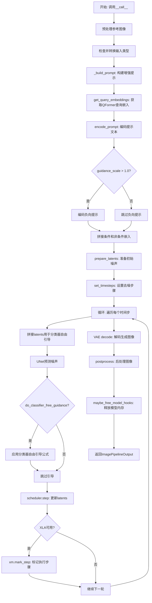
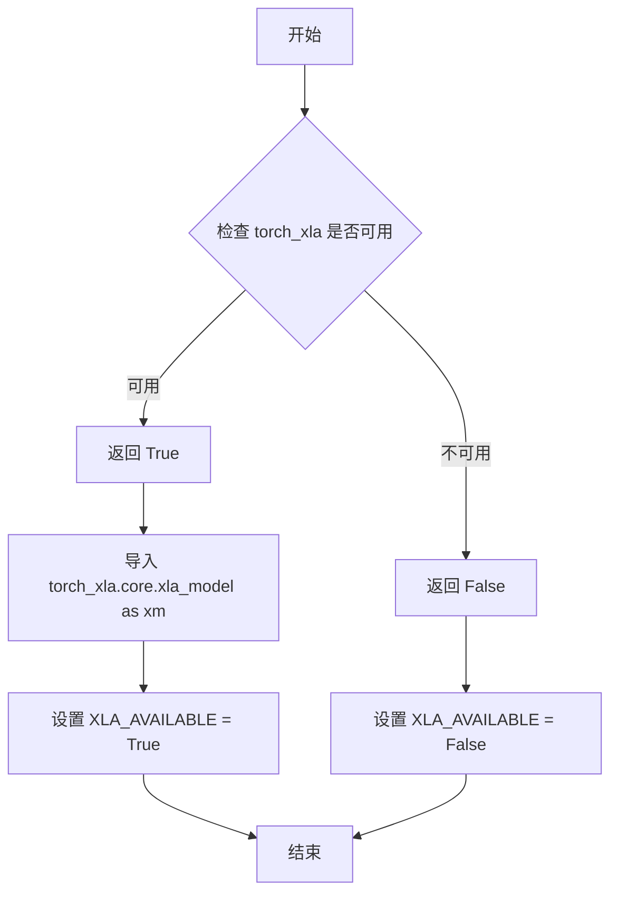
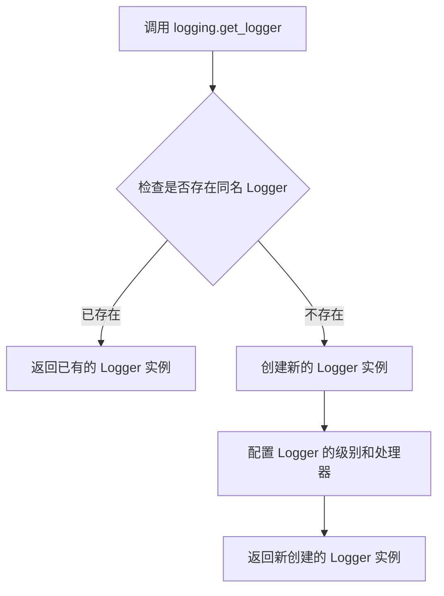
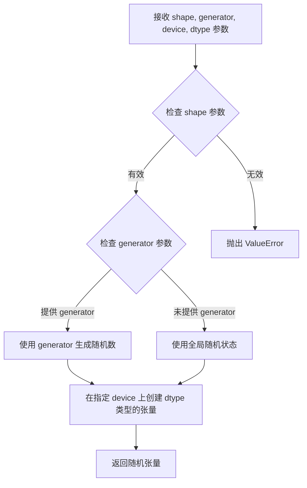
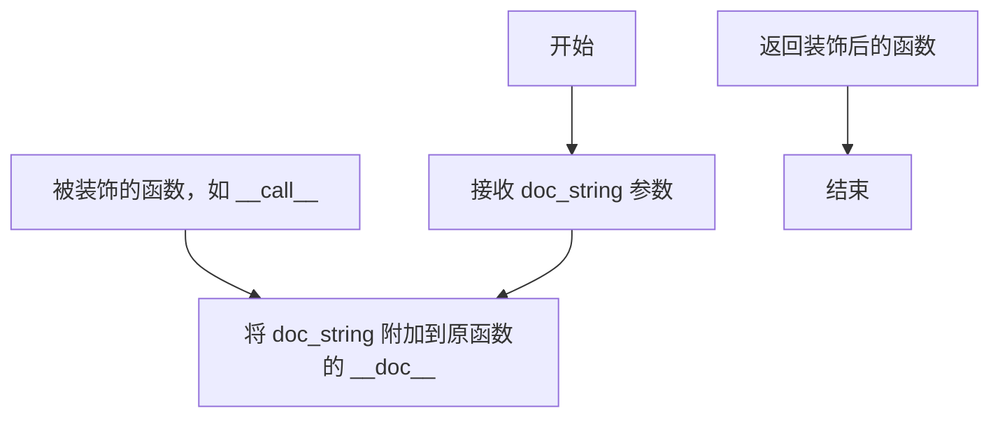
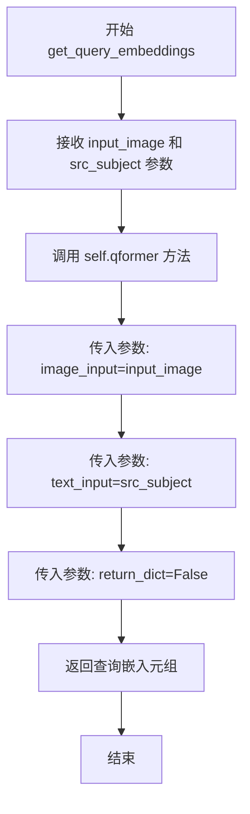
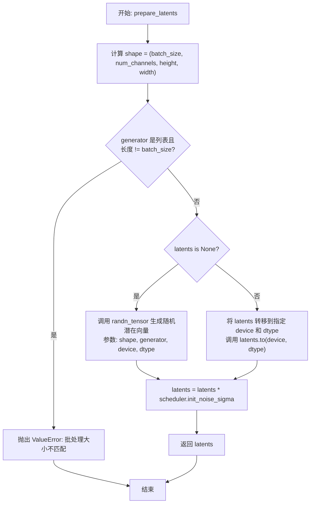
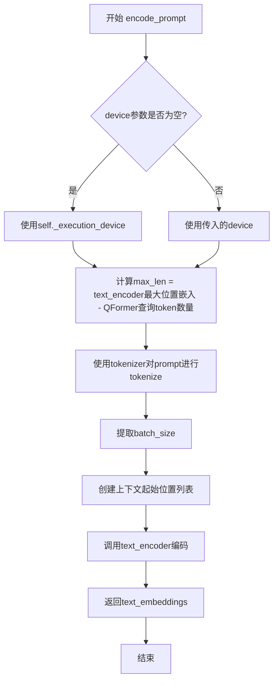
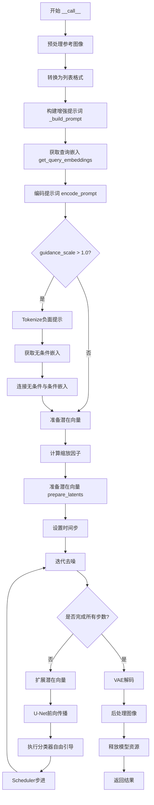

# `diffusers\src\diffusers\pipelines\blip_diffusion\pipeline_blip_diffusion.py` 详细设计文档

BlipDiffusionPipeline是一个零样本主题驱动生成（Zero-Shot Subject Driven Generation）的扩散模型管道，通过结合QFormer多模态嵌入、CLIP文本编码器和条件U-Net架构，根据文本提示和参考图像生成保持主题一致性的新图像。

## 整体流程



## 类结构

```
DiffusionPipeline (基类)
├── DeprecatedPipelineMixin (混入类)
└── BlipDiffusionPipeline
    ├── 模块组件
    │   ├── CLIPTokenizer (tokenizer)
    │   ├── ContextCLIPTextModel (text_encoder)
    │   ├── AutoencoderKL (vae)
    │   ├── UNet2DConditionModel (unet)
    │   ├── PNDMScheduler (scheduler)
    │   ├── Blip2QFormerModel (qformer)
    │   └── BlipImageProcessor (image_processor)
```

## 全局变量及字段


### `logger`
    
Logger instance for logging messages in the module.

类型：`logging.Logger`
    


### `EXAMPLE_DOC_STRING`
    
A string containing example usage of the pipeline.

类型：`str`
    


### `XLA_AVAILABLE`
    
Flag indicating whether PyTorch XLA is available for TPU support.

类型：`bool`
    


### `BlipDiffusionPipeline.tokenizer`
    
Tokenizer used to convert text prompts into token IDs for the text encoder.

类型：`CLIPTokenizer`
    


### `BlipDiffusionPipeline.text_encoder`
    
Text encoder that encodes tokenized prompts into embeddings.

类型：`ContextCLIPTextModel`
    


### `BlipDiffusionPipeline.vae`
    
VAE model for encoding images to latent space and decoding latents back to images.

类型：`AutoencoderKL`
    


### `BlipDiffusionPipeline.unet`
    
Conditional U-Net that predicts noise to denoise latents guided by text embeddings.

类型：`UNet2DConditionModel`
    


### `BlipDiffusionPipeline.scheduler`
    
Scheduler controlling the denoising schedule for the diffusion process.

类型：`PNDMScheduler`
    


### `BlipDiffusionPipeline.qformer`
    
Q-Former model producing query embeddings from image and source subject.

类型：`Blip2QFormerModel`
    


### `BlipDiffusionPipeline.image_processor`
    
Image processor for preprocessing reference images and postprocessing generated images.

类型：`BlipImageProcessor`
    


### `BlipDiffusionPipeline.config`
    
Configuration object storing pipeline hyperparameters.

类型：`PretrainedConfig`
    


### `BlipDiffusionPipeline._last_supported_version`
    
String indicating the last supported version of the pipeline for compatibility checks.

类型：`str`
    


### `BlipDiffusionPipeline.model_cpu_offload_seq`
    
String defining the order of models for CPU offload to manage memory.

类型：`str`
    
    

## 全局函数及方法


### `is_torch_xla_available`

该函数用于检查当前环境是否安装了 PyTorch XLA（加速线性代数）库，以确定是否可以在 TPU 或其他 XLA 设备上运行深度学习模型。如果可用，则导入相关 XLA 模块并设置全局标志。

参数：此函数无参数。

返回值：`bool`，返回 `True` 表示 torch_xla 可用，返回 `False` 表示不可用。

#### 流程图



#### 带注释源码

```python
# 这是一个从 ...utils 导入的函数，用于检查 torch_xla 是否可用
# 在当前文件中按如下方式使用：

if is_torch_xla_available():  # 检查 XLA 是否可用
    import torch_xla.core.xla_model as xm  # 导入 XLA 核心模块
    XLA_AVAILABLE = True  # 设置全局标志为可用
else:
    XLA_AVAILABLE = False  # 设置全局标志为不可用

# 注意：实际的函数定义位于 diffusers 库的 utils 模块中
# 其典型实现如下（基于常见模式推断）：

def is_torch_xla_available() -> bool:
    """
    检查 torch_xla 库是否可用。
    
    Returns:
        bool: 如果 torch_xla 已安装并可用返回 True，否则返回 False。
    """
    try:
        import torch_xla  # 尝试导入 torch_xla
        return True
    except ImportError:
        return False
```

---

**注意**：由于 `is_torch_xla_available` 函数的实际定义位于 `diffusers` 库的 `...utils` 模块中（代码中通过 `from ...utils import is_torch_xla_available` 导入），而在当前代码文件中仅提供了使用示例，因此上面的源码是基于该函数的典型实现模式推断的带注释说明。


### `logging.get_logger`

获取指定模块的日志记录器对象，用于在模块中记录日志信息。

参数：

- `__name__`：`str`，Python 运行时自动传入的当前模块名称，通常使用 `__name__` 变量，以便日志中显示正确的来源模块。

返回值：`logging.Logger`，Python 标准库的 Logger 对象，用于记录日志。

#### 流程图



#### 带注释源码

```python
# 从 diffusers 库的 utils 模块导入 logging 对象
# logging 对象是 Hugging Face diffusers 自定义的日志工具模块
from ...utils import logging

# 调用 get_logger 方法，传入当前模块的 __name__
# __name__ 是 Python 内置变量，表示当前模块的全限定名
# 例如：如果是 diffusers.pipelines.blip_diffusion.pipeline_blip_diffusion，则 __name__ 就是这个字符串
# get_logger 会返回一个与该模块关联的 Logger 对象
logger = logging.get_logger(__name__)  # pylint: disable=invalid-name

# 返回的 logger 对象具有以下方法：
# - logger.debug(msg): 记录调试信息
# - logger.info(msg): 记录一般信息
# - logger.warning(msg): 记录警告信息
# - logger.error(msg): 记录错误信息
# - logger.critical(msg): 记录严重错误信息
```

> **注意**：由于 `logging.get_logger` 函数定义在 `...utils.logging` 模块中（这是 Hugging Face diffusers 库内部的实现），当前提供的代码片段仅包含调用部分，未包含该函数的具体实现源码。该函数通常是 `logging` 模块的封装，可能基于 Python 标准库的 `logging.getLogger` 实现，并添加了 diffusers 库特定的配置（如日志格式、默认级别等）。


### `randn_tensor`

该函数用于生成指定形状的随机张量（服从标准正态分布），常用于扩散模型中生成初始噪声 latent。在 `BlipDiffusionPipeline` 的 `prepare_latents` 方法中被调用，以生成用于去噪过程的初始潜在变量。

参数：

- `shape`：`tuple` 或 `list`，输出张量的形状
- `generator`：`torch.Generator` 或 `list[torch.Generator]`，可选，用于控制随机数生成的确定性
- `device`：`torch.device`，张量所在的设备（CPU/CUDA）
- `dtype`：`torch.dtype`，张量的数据类型（如 `torch.float32`）

返回值：`torch.Tensor`，符合标准正态分布的随机张量

#### 流程图



#### 带注释源码

```
# 注意：此源码为基于导入路径和调用方式的推断
# 实际定义在 diffusers 库中：diffusers/src/diffusers/utils/torch_utils.py

def randn_tensor(
    shape: tuple,                          # 张量形状，如 (batch_size, channels, height, width)
    generator: Optional[torch.Generator] = None,  # 可选的随机数生成器
    device: Optional[torch.device] = None,  # 目标设备
    dtype: Optional[torch.dtype] = None,   # 数据类型
) -> torch.Tensor:
    """
    生成符合标准正态分布的随机张量。
    
    参数:
        shape: 输出张量的维度元组
        generator: torch.Generator 对象，用于确定性生成
        device: 目标设备 (cpu/cuda)
        dtype: 张量的数据类型
    
    返回:
        随机张量
    """
    # 核心实现通常使用 torch.randn 或 torch.randn_like
    # 如果提供了 generator，使用 generator.manual_seed() 确保可重复性
    if device is None:
        device = torch.device("cpu")
    
    if dtype is None:
        dtype = torch.float32
    
    # 生成随机张量
    if generator is not None:
        # 使用生成器确保可重复性
        tensor = torch.randn(shape, generator=generator, device=device, dtype=dtype)
    else:
        tensor = torch.randn(shape, device=device, dtype=dtype)
    
    return tensor
```

> **注意**：由于 `randn_tensor` 函数定义在外部库（`diffusers.utils.torch_utils`）中，原始代码仅包含导入和调用。上面的源码是基于其使用方式和 PyTorch 惯例推断的实现。实际实现可能包含更多优化或特定逻辑。


### `replace_example_docstring`

`replace_example_docstring` 是从 `diffusers` 库 `...utils` 模块导入的装饰器函数，用于为被装饰的方法（如 `__call__`）动态替换或补充文档字符串，通常用于在推理流水线（Pipeline）的 `__call__` 方法中自动插入使用示例。

参数：

-  `doc_string`：`str`，要替换或追加的文档字符串内容，通常包含 Python 代码示例和使用说明。

返回值：`Callable`，返回装饰后的函数对象。

#### 流程图



#### 带注释源码

```python
# 注意：以下源码为基于使用方式的推测实现，并非原始库源码
# 实际实现请参考 diffusers 库源码

def replace_example_docstring(doc_string: str):
    """
    装饰器：用于为被装饰的函数动态替换或追加文档字符串。
    通常用于 DiffusionPipeline 的 __call__ 方法，以插入使用示例。

    参数:
        doc_string (str): 要追加到原函数文档字符串的内容，通常是使用示例代码。
    
    返回:
        Callable: 装饰器返回的包装函数。
    """
    def decorator(func):
        # 保留原函数的文档字符串
        original_doc = func.__doc__ if func.__doc__ else ""
        
        # 将示例文档字符串追加到原文档之后
        func.__doc__ = f"{original_doc}\n\n{doc_string}"
        
        return func
    
    return decorator
```

#### 使用示例

在 `BlipDiffusionPipeline` 类中，该装饰器被用于 `__call__` 方法：

```python
@torch.no_grad()
@replace_example_docstring(EXAMPLE_DOC_STRING)
def __call__(
    self,
    prompt: list[str],
    reference_image: PIL.Image.Image,
    source_subject_category: list[str],
    target_subject_category: list[str],
    ...
):
    # 方法实现...
```

这样，当用户调用 `help(BlipDiffusionPipeline.__call__)` 或查看文档时，会自动显示 `EXAMPLE_DOC_STRING` 中预定义的代码示例。


### `BlipDiffusionPipeline.__init__`

这是 BlipDiffusionPipeline 类的构造函数，负责初始化零样本主题驱动生成管道所需的所有模型组件和配置参数。

参数：

- `self`：隐式参数，当前类的实例对象
- `tokenizer`：`CLIPTokenizer`，文本编码器的分词器
- `text_encoder`：`ContextCLIPTextModel`，用于编码文本提示的文本编码器
- `vae`：`AutoencoderKL`，将潜在变量映射到图像的 VAE 模型
- `unet`：`UNet2DConditionModel`，条件 U-Net 架构，用于对图像嵌入进行去噪
- `scheduler`：`PNDMScheduler`，与 `unet` 结合使用生成图像潜在变量的调度器
- `qformer`：`Blip2QFormerModel`，QFormer 模型，用于从文本和图像获取多模态嵌入
- `image_processor`：`BlipImageProcessor`，用于预处理和后处理图像的图像处理器
- `ctx_begin_pos`：`int`，可选，默认值为 2，文本编码器中上下文 token 的位置
- `mean`：`list[float]`，可选，默认值为 None，图像预处理的均值
- `std`：`list[float]`，可选，默认值为 None，图像预处理的标准差

返回值：无（构造函数默认返回 `None`）

#### 流程图

```mermaid
flowchart TD
    A[开始 __init__] --> B[调用 super().__init__ 初始化基类]
    B --> C[调用 self.register_modules 注册所有模型组件]
    C --> D[调用 self.register_to_config 注册配置参数]
    D --> E[结束 __init__]
```

#### 带注释源码

```python
def __init__(
    self,
    tokenizer: CLIPTokenizer,                    # 文本分词器
    text_encoder: ContextCLIPTextModel,          # 文本编码器模型
    vae: AutoencoderKL,                          # VAE 变分自编码器
    unet: UNet2DConditionModel,                  # 条件 U-Net 去噪模型
    scheduler: PNDMScheduler,                    # PNDM 调度器
    qformer: Blip2QFormerModel,                  # BLIP2 Q-Former 模型
    image_processor: BlipImageProcessor,         # 图像处理器
    ctx_begin_pos: int = 2,                      # 上下文起始位置，默认2
    mean: list[float] = None,                     # 图像均值，用于预处理
    std: list[float] = None,                     # 图像标准差，用于预处理
):
    # 调用父类 DeprecatedPipelineMixin 和 DiffusionPipeline 的初始化方法
    super().__init__()

    # 注册所有模型组件到管道中，使其可通过 self.xxx 访问
    # 这些模块会被纳入管道的管理体系，支持 model_cpu_offload 等功能
    self.register_modules(
        tokenizer=tokenizer,
        text_encoder=text_encoder,
        vae=vae,
        unet=unet,
        scheduler=scheduler,
        qformer=qformer,
        image_processor=image_processor,
    )

    # 将配置参数注册到 config 属性中，用于保存管道配置
    # ctx_begin_pos 控制文本编码器中上下文嵌入的起始位置
    # mean 和 std 用于图像预处理时的归一化
    self.register_to_config(ctx_begin_pos=ctx_begin_pos, mean=mean, std=std)
```


### `BlipDiffusionPipeline.get_query_embeddings`

该方法通过调用 QFormer 模型，将输入图像和源主题类别编码为查询嵌入向量，用于后续文本提示的编码和图像生成。

参数：

- `input_image`：`torch.Tensor`，输入的参考图像张量（已经过预处理）
- `src_subject`：`list[str]` 或 `str`，源主题类别，用于生成查询嵌入

返回值：`tuple`，返回 QFormer 模型输出的查询嵌入张量（因为 `return_dict=False`）

#### 流程图



#### 带注释源码

```python
def get_query_embeddings(self, input_image, src_subject):
    """
    获取查询嵌入向量
    
    该方法将输入图像和源主题类别传递给 QFormer 模型，
    生成用于文本编码器上下文的查询嵌入。
    
    参数:
        input_image: 经过预处理的图像张量
        src_subject: 源主题类别字符串或列表
    
    返回:
        QFormer 模型输出的查询嵌入（tuple 形式，因为 return_dict=False）
    """
    # 调用 qformer 模型的 forward 方法
    # image_input: 输入的参考图像
    # text_input: 源主题类别文本
    # return_dict=False: 返回 tuple 而非字典
    return self.qformer(
        image_input=input_image,      # 图像输入
        text_input=src_subject,        # 文本输入（源主题）
        return_dict=False              # 返回 tuple 格式
    )
```


### `BlipDiffusionPipeline._build_prompt`

该方法用于构建增强后的文本提示词，通过将目标主题（tgt_subject）前置到提示词前，并按照 prompt_strength 和 prompt_reps 参数重复提示词以放大其效果。

参数：

- `self`：BlipDiffusionPipeline 实例本身
- `prompts`：`list[str]`，输入的文本提示词列表
- `tgt_subjects`：`list[str]`，目标主题类别列表，用于指定生成图像中的主体
- `prompt_strength`：`float`，默认值为 1.0，用于控制提示词放大的倍数因子
- `prompt_reps`：`int`，默认值为 20，提示词重复的基础次数

返回值：`list[str]`，返回增强后的文本提示词列表

#### 流程图

```mermaid
flowchart TD
    A[Start _build_prompt] --> B[Initialize empty list rv]
    B --> C{For each prompt, tgt_subject in zip(prompts, tgt_subjects)}
    C --> D[Format prompt: f'a {tgt_subject} {prompt.strip()}']
    D --> E[Calculate repetitions: int(prompt_strength * prompt_reps)]
    E --> F[Create list with prompt repeated repetitions times]
    F --> G[Join list with ', ' to form amplified prompt]
    G --> H[Append amplified prompt to rv]
    H --> I{More pairs to process?}
    I -->|Yes| C
    I -->|No| J[Return rv]
    J --> K[End]
```

#### 带注释源码

```python
def _build_prompt(self, prompts, tgt_subjects, prompt_strength=1.0, prompt_reps=20):
    """
    构建并增强文本提示词。

    该方法将目标主题前置到提示词前，并通过重复提示词来放大其对生成图像的影响。
    这是一种增强提示词效果的技巧，源自原始 Blip Diffusion 代码。

    参数:
        prompts: 输入的文本提示词列表
        tgt_subjects: 目标主题类别列表
        prompt_strength: 提示词放大倍数因子，默认为 1.0
        prompt_reps: 提示词重复的基础次数，默认为 20

    返回:
        增强后的文本提示词列表
    """
    rv = []  # 初始化结果列表
    # 遍历每个提示词和对应的目标主题
    for prompt, tgt_subject in zip(prompts, tgt_subjects):
        # 将目标主题前置到提示词前，并去除提示词首尾空白
        prompt = f"a {tgt_subject} {prompt.strip()}"
        # 计算实际重复次数：prompt_strength * prompt_reps
        # 这是一个放大提示词的技巧
        rv.append(", ".join([prompt] * int(prompt_strength * prompt_reps)))

    return rv
```


### `BlipDiffusionPipeline.prepare_latents`

该方法用于准备图像生成的初始潜在向量（latents），根据指定的批处理大小、通道数、高度和宽度创建或转移张量，并使用调度器的初始噪声标准差进行缩放。

参数：

- `batch_size`：`int`，批处理大小，指定生成的图像数量
- `num_channels`：`int`，潜在向量的通道数，对应于 UNet 模型的输入通道
- `height`：`int`，潜在向量的高度（经过下采样因子处理后）
- `width`：`int`，潜在向量的宽度（经过下采样因子处理后）
- `dtype`：`torch.dtype`，生成张量的数据类型（如 torch.float32）
- `device`：`torch.device`，生成张量的设备（如 cuda 或 cpu）
- `generator`：`torch.Generator` 或 `list[torch.Generator]`，可选的随机数生成器，用于确保可重复性
- `latents`：`torch.Tensor | None`，可选的预生成潜在向量，如果为 None 则随机生成

返回值：`torch.Tensor`，处理后的初始潜在向量，已根据调度器的 init_noise_sigma 进行缩放

#### 流程图



#### 带注释源码

```python
def prepare_latents(
    self,
    batch_size: int,
    num_channels: int,
    height: int,
    width: int,
    dtype: torch.dtype,
    device: torch.device,
    generator: torch.Generator | list[torch.Generator] | None,
    latents: torch.Tensor | None = None,
) -> torch.Tensor:
    """
    准备图像生成的初始潜在向量。
    
    该方法根据指定的形状创建随机潜在向量，或使用用户提供的潜在向量，
    并根据调度器的要求进行缩放。
    
    Args:
        batch_size: 批处理大小，即一次生成图像的数量
        num_channels: 潜在向量的通道数，通常对应 UNet 的 in_channels
        height: 潜在向量的高度（已除以下采样因子）
        width: 潜在向量的宽度（已除以下采样因子）
        dtype: 潜在向量的数据类型
        device: 潜在向量所在的设备
        generator: 随机数生成器，用于确保可重复性
        latents: 可选的预生成潜在向量，如果为 None 则随机生成
    
    Returns:
        缩放后的初始潜在向量，可用于去噪过程
    """
    # 计算潜在向量的形状
    shape = (batch_size, num_channels, height, width)
    
    # 验证生成器列表长度是否与批处理大小匹配
    if isinstance(generator, list) and len(generator) != batch_size:
        raise ValueError(
            f"You have passed a list of generators of length {len(generator)}, but requested an effective batch"
            f" size of {batch_size}. Make sure the batch size matches the length of the generators."
        )

    # 如果没有提供潜在向量，则随机生成
    if latents is None:
        latents = randn_tensor(shape, generator=generator, device=device, dtype=dtype)
    else:
        # 将提供的潜在向量转移到指定设备和数据类型
        latents = latents.to(device=device, dtype=dtype)

    # 使用调度器的初始噪声标准差缩放初始噪声
    # 这确保潜在向量与调度器的噪声调度策略兼容
    latents = latents * self.scheduler.init_noise_sigma
    
    return latents
```


### BlipDiffusionPipeline.encode_prompt

该方法用于将文本提示（prompt）编码为文本嵌入向量（text embeddings），同时利用QFormer生成的查询嵌入（query_embeds）作为上下文信息来增强文本表示。

参数：

- `query_embeds`：`torch.Tensor`，QFormer模型生成的查询嵌入，用作文本编码的上下文上下文
- `prompt`：待编码的文本提示，可以是单个字符串或字符串列表
- `device`：`torch.device` 或 `None`，执行编码的设备，默认为`self._execution_device`

返回值：`torch.Tensor`，编码后的文本嵌入向量，形状为`(batch_size, sequence_length, hidden_size)`

#### 流程图



#### 带注释源码

```python
def encode_prompt(self, query_embeds, prompt, device=None):
    """
    Encode the prompt into text embeddings using the text encoder.
    
    Args:
        query_embeds: Query embeddings from QFormer to be used as context
        prompt: Text prompt to encode
        device: Device to run the encoding on (optional)
    """
    # 确定执行设备，优先使用传入的device，否则使用pipeline的默认执行设备
    device = device or self._execution_device

    # embeddings for prompt, with query_embeds as context
    # 计算tokenizer的最大长度：text_encoder的最大位置嵌入数减去QFormer生成的查询token数量
    # 这样可以确保加入query_embeds后总长度不超过text_encoder的处理能力
    max_len = self.text_encoder.text_model.config.max_position_embeddings
    max_len -= self.qformer.config.num_query_tokens

    # 使用tokenizer对prompt进行tokenize
    # padding到最大长度，截断处理，返回PyTorch张量
    tokenized_prompt = self.tokenizer(
        prompt,
        padding="max_length",
        truncation=True,
        max_length=max_len,
        return_tensors="pt",
    ).to(device)

    # 从query_embeds获取batch_size，用于创建上下文起始位置列表
    batch_size = query_embeds.shape[0]
    # 创建上下文嵌入的起始位置列表，所有样本使用相同的起始位置
    ctx_begin_pos = [self.config.ctx_begin_pos] * batch_size

    # 调用text_encoder进行编码
    # input_ids: tokenized的输入ID
    # ctx_embeddings: 来自QFormer的查询嵌入作为上下文
    # ctx_begin_pos: 上下文嵌入插入的起始位置
    text_embeddings = self.text_encoder(
        input_ids=tokenized_prompt.input_ids,
        ctx_embeddings=query_embeds,
        ctx_begin_pos=ctx_begin_pos,
    )[0]

    # 返回编码后的文本嵌入（第0个元素是last_hidden_state）
    return text_embeddings
```


### `BlipDiffusionPipeline.__call__`

该方法是 BlipDiffusionPipeline 的核心调用函数，实现零样本主题驱动生成（Zero-Shot Subject Driven Generation）。它接收参考图像、源主题类别、目标主题类别和文本提示，通过 QFormer 获取多模态嵌入，使用条件 U-Net 进行去噪扩散处理，最终生成符合目标主题和文本描述的图像。

参数：

- `prompt`：`list[str]`，引导图像生成的文本提示
- `reference_image`：`PIL.Image.Image`，用于条件生成的目标主题参考图像
- `source_subject_category`：`list[str]`，参考图像中的源主题类别
- `target_subject_category`：`list[str]`，要生成的目标主题类别
- `latents`：`torch.Tensor | None`，预生成的噪声潜在向量，用于图像生成
- `guidance_scale`：`float`，分类器自由引导比例，控制文本提示的影响程度
- `height`：`int`，生成图像的高度
- `width`：`int`，生成图像的宽度
- `num_inference_steps`：`int`，去噪迭代步数
- `generator`：`torch.Generator | list[torch.Generator] | None`，随机数生成器，确保可重复性
- `neg_prompt`：`str | None`，负面提示词，用于引导图像生成
- `prompt_strength`：`float`，提示词增强强度
- `prompt_reps`：`int`，提示词重复次数，用于增强提示效果
- `output_type`：`str | None`，输出格式（"pil"、"np"、"pt"）
- `return_dict`：`bool`，是否返回 `ImagePipelineOutput` 对象

返回值：`ImagePipelineOutput` 或 `tuple`，包含生成的图像

#### 流程图



#### 带注释源码

```python
@torch.no_grad()
@replace_example_docstring(EXAMPLE_DOC_STRING)
def __call__(
    self,
    prompt: list[str],
    reference_image: PIL.Image.Image,
    source_subject_category: list[str],
    target_subject_category: list[str],
    latents: torch.Tensor | None = None,
    guidance_scale: float = 7.5,
    height: int = 512,
    width: int = 512,
    num_inference_steps: int = 50,
    generator: torch.Generator | list[torch.Generator] | None = None,
    neg_prompt: str | None = "",
    prompt_strength: float = 1.0,
    prompt_reps: int = 20,
    output_type: str | None = "pil",
    return_dict: bool = True,
):
    """
    Function invoked when calling the pipeline for generation.
    """
    # 获取执行设备
    device = self._execution_device

    # 1. 预处理参考图像：归一化并转换为张量
    reference_image = self.image_processor.preprocess(
        reference_image, 
        image_mean=self.config.mean, 
        image_std=self.config.std, 
        return_tensors="pt"
    )["pixel_values"]
    # 将图像移至目标设备
    reference_image = reference_image.to(device)

    # 2. 确保输入为列表格式（支持单个字符串输入）
    if isinstance(prompt, str):
        prompt = [prompt]
    if isinstance(source_subject_category, str):
        source_subject_category = [source_subject_category]
    if isinstance(target_subject_category, str):
        target_subject_category = [target_subject_category]

    # 获取批次大小
    batch_size = len(prompt)

    # 3. 构建增强提示词：在提示前添加目标主题名称，并重复提示以增强效果
    prompt = self._build_prompt(
        prompts=prompt,
        tgt_subjects=target_subject_category,
        prompt_strength=prompt_strength,
        prompt_reps=prompt_reps,
    )
    
    # 4. 获取查询嵌入：使用QFormer从参考图像和源主题获取多模态嵌入
    query_embeds = self.get_query_embeddings(reference_image, source_subject_category)
    
    # 5. 编码提示词：将文本提示与查询嵌入结合生成条件嵌入
    text_embeddings = self.encode_prompt(query_embeds, prompt, device)
    
    # 6. 判断是否使用分类器自由引导（CFG）
    do_classifier_free_guidance = guidance_scale > 1.0
    
    # 7. 如果启用CFG，生成无条件嵌入并与条件嵌入拼接
    if do_classifier_free_guidance:
        max_length = self.text_encoder.text_model.config.max_position_embeddings

        # Tokenize负面提示
        uncond_input = self.tokenizer(
            [neg_prompt] * batch_size,
            padding="max_length",
            max_length=max_length,
            return_tensors="pt",
        )
        # 获取无条件文本嵌入（不使用查询上下文）
        uncond_embeddings = self.text_encoder(
            input_ids=uncond_input.input_ids.to(device),
            ctx_embeddings=None,
        )[0]
        
        # 拼接无条件嵌入和条件嵌入，以便单次前向传播
        # 格式：[uncond_embeddings, text_embeddings]
        text_embeddings = torch.cat([uncond_embeddings, text_embeddings])

    # 8. 计算U-Net的下采样因子（用于调整潜在向量尺寸）
    scale_down_factor = 2 ** (len(self.unet.config.block_out_channels) - 1)
    
    # 9. 准备潜在向量：生成随机噪声或使用提供的潜在向量
    latents = self.prepare_latents(
        batch_size=batch_size,
        num_channels=self.unet.config.in_channels,
        height=height // scale_down_factor,
        width=width // scale_down_factor,
        generator=generator,
        latents=latents,
        dtype=self.unet.dtype,
        device=device,
    )
    
    # 10. 设置去噪调度器的时间步
    extra_set_kwargs = {}
    self.scheduler.set_timesteps(num_inference_steps, **extra_set_kwargs)

    # 11. 主去噪循环
    for i, t in enumerate(self.progress_bar(self.scheduler.timesteps)):
        # 每次迭代重新检查是否启用CFG（支持动态切换）
        do_classifier_free_guidance = guidance_scale > 1.0

        # 扩展潜在向量以同时处理条件和无条件预测
        latent_model_input = torch.cat([latents] * 2) if do_classifier_free_guidance else latents

        # U-Net前向传播：预测噪声
        noise_pred = self.unet(
            latent_model_input,
            timestep=t,
            encoder_hidden_states=text_embeddings,
            down_block_additional_residuals=None,
            mid_block_additional_residual=None,
        )["sample"]

        # 12. 执行分类器自由引导：组合无条件预测和条件预测
        if do_classifier_free_guidance:
            noise_pred_uncond, noise_pred_text = noise_pred.chunk(2)
            # 引导公式：noise_pred = noise_pred_uncond + guidance_scale * (noise_pred_text - noise_pred_uncond)
            noise_pred = noise_pred_uncond + guidance_scale * (noise_pred_text - noise_pred_uncond)

        # 13. 调度器步进：更新潜在向量
        latents = self.scheduler.step(
            noise_pred,
            t,
            latents,
        )["prev_sample"]

        # 14. XLA优化：如果可用，标记计算步骤
        if XLA_AVAILABLE:
            xm.mark_step()

    # 15. VAE解码：将潜在向量解码为图像
    image = self.vae.decode(latents / self.vae.config.scaling_factor, return_dict=False)[0]
    
    # 16. 后处理图像：转换为指定输出格式
    image = self.image_processor.postprocess(image, output_type=output_type)

    # 17. 释放模型资源（如果使用了模型hook）
    self.maybe_free_model_hooks()

    # 18. 返回结果
    if not return_dict:
        return (image,)

    return ImagePipelineOutput(images=image)
```

## 关键组件


### BlipDiffusionPipeline

核心零样本主题驱动生成管道，整合QFormer多模态嵌入、CLIP文本编码器、VAE解码器和条件U-Net，实现基于参考图像和文本提示的主题保真图像生成。

### get_query_embeddings

获取QFormer生成的多模态查询嵌入，用于将参考图像和源主题类别编码为条件向量，桥接视觉和文本模态。

### _build_prompt

构建增强后的文本提示，通过在目标主题前添加定语、重复提示词指定次数来放大提示效果，增强模型对目标主题的聚焦。

### prepare_latents

准备去噪过程的初始潜在变量，根据batch size、通道数、图像尺寸生成随机张量或使用提供的潜在变量，并按调度器的初始噪声标准差进行缩放。

### encode_prompt

将文本提示编码为文本嵌入向量，结合QFormer生成的查询嵌入作为上下文，通过ctx_begin_pos控制上下文插入位置，最大化利用文本编码器的位置嵌入容量。

### __call__

主管道执行方法，协调图像预处理、提示词编码、潜在变量准备、U-Net去噪循环和VAE解码的完整推理流程，支持分类器自由引导、负提示词、潜在变量复用和多种输出格式。

### QFormer (Blip2QFormerModel)

视觉-文本多模态查询Transformer，将输入图像和源主题类别编码为固定数量的查询令牌，输出可被文本编码器利用的多模态条件嵌入。

### Text Encoder (ContextCLIPTextModel)

上下文感知的CLIP文本编码器，支持注入QFormer生成的查询嵌入作为上下文，实现图像条件下的文本表示增强。

### VAE (AutoencoderKL)

变分自编码器，将去噪后的潜在变量解码为RGB图像，使用scaling_factor进行潜在空间缩放，支持PIL、NumPy和PyTorch张量输出格式。

### UNet2DConditionModel

条件U-Net神经网络，在文本嵌入条件下对潜在变量进行迭代去噪，采用classifier-free guidance策略通过无条件和有条件预测的线性组合提升生成质量。

### Scheduler (PNDMScheduler)

PNDM调度器，管理去噪过程的噪声时间步调度，将预测的噪声逐步转换为更清晰的潜在变量样本。

### Image Processor (BlipImageProcessor)

图像预处理和后处理器，负责参考图像的像素值归一化、尺寸调整和生成图像的反归一化、格式转换。

## 问题及建议


### 已知问题

- **类型提示兼容性问题**: 使用了 Python 3.10+ 的类型联合语法（如 `torch.Tensor | None`），未考虑与旧版本 Python 的兼容性。
- **XLA 变量作用域问题**: 在 `__call__` 方法内部使用 `XLA_AVAILABLE` 变量，但该变量定义在模块级别，可能导致引用混淆。
- **图像预处理参数风险**: `mean` 和 `std` 参数默认为 `None`，但传递给预处理方法时未做空值检查，可能导致运行时错误。
- **缺少输入验证**: 多个关键方法（如 `encode_prompt`、`prepare_latents`）缺少对输入参数的有效性验证，未检查空列表、无效图像尺寸等情况。
- **硬编码的魔法数字**: `prompt_reps=20`、`ctx_begin_pos=2` 等关键参数硬编码，分散在多处，修改时容易遗漏。
- **文档字符串不完整**: 内部方法 `_build_prompt`、`get_query_embeddings` 缺少文档说明；`prepare_latents` 方法从其他 pipeline 复制但未注明来源及适用性。
- **冗余变量声明**: `do_classifier_free_guidance` 在 `__call__` 方法中声明了两次（第206行和第240行），第二次声明覆盖了第一次，可能导致逻辑混乱。
- **未使用的变量**: `extra_set_kwargs = {}` 被创建但未实际使用，传递给 `scheduler.set_timesteps` 时为空字典。
- **调度器配置不透明**: `scale_down_factor` 的计算逻辑缺乏注释，且未验证 `unet.config.block_out_channels` 的存在性。
- **错误处理缺失**: 未捕获 tokenizer 截断、模型设备不匹配、generator 列表长度与 batch_size 不一致等潜在运行时异常。

### 优化建议

- **完善类型提示**: 使用 `Union` 类型或 `Optional` 替代 `|` 运算符以兼容 Python 3.9；为所有参数添加完整的类型注解。
- **添加输入验证层**: 在 `__call__` 方法入口处添加 batch_size 一致性检查、图像尺寸有效性验证、prompt 非空检查。
- **提取配置常量**: 将 `ctx_begin_pos`、`prompt_reps` 等可配置参数提取为类属性或配置文件，并添加类型校验。
- **重构重复代码**: 移除冗余的 `do_classifier_free_guidance` 声明，统一在循环外计算一次。
- **优化变量初始化**: 删除未使用的 `extra_set_kwargs`，或根据调度器实际需求传递参数。
- **补充文档和注释**: 为所有公共方法和复杂计算逻辑添加 docstring 和内联注释，说明参数含义和返回值。
- **增强错误处理**: 添加 try-except 块捕获模型推理、图像编解码等关键步骤的异常，提供有意义的错误信息。
- **日志增强**: 在关键步骤（如推理开始/结束、模型卸载）添加日志输出，便于调试和监控。
- **设备一致性检查**: 在预处理和推理前验证所有模型和张量位于同一设备，避免隐式数据迁移带来的性能损失。

## 其它


### 设计目标与约束

**设计目标**：
- 实现零样本主体驱动生成（Zero-Shot Subject Driven Generation），允许用户通过提供参考图像和文本提示来生成包含特定主体的图像
- 遵循HuggingFace Diffusers库的标准化Pipeline接口，确保与其他DiffusionPipeline的一致性和互操作性
- 支持CPU和GPU推理，并优化内存使用（通过model_cpu_offload_seq）

**设计约束**：
- 输入图像尺寸固定为512x512（可通过参数调整）
- 支持的批量大小受限于GPU/CPU内存
- 文本提示长度受限于CLIPTokenizer的最大位置嵌入数（512减去query tokens数量）
- 推理步骤数影响生成质量与速度的平衡

### 错误处理与异常设计

**参数验证**：
- `prepare_latents`方法验证generator列表长度与batch_size匹配
- `__call__`方法自动将字符串输入转换为列表以统一处理

**设备管理**：
- 使用`self._execution_device`获取执行设备
- 支持XLA加速（通过`XLA_AVAILABLE`标志）
- 使用`maybe_free_model_hooks()`释放模型内存

**异常处理**：
- 依赖外部库（PIL、torch、transformers）的异常传播
- 缺失参考图像或无效提示的处理由下游组件负责

### 数据流与状态机

**主流程状态转换**：
1. **初始化态** → 加载模型和配置
2. **就绪态** → 接收用户输入（prompt、reference_image、subject categories）
3. **预处理态** → 图像预处理、文本编码、query embeddings提取
4. **推理态** → UNet去噪循环（num_inference_steps次迭代）
5. **后处理态** → VAE解码、图像后处理
6. **完成态** → 返回ImagePipelineOutput

**数据流向**：
```
reference_image → image_processor.preprocess() → pixel_values
                                      ↓
source_subject_category + reference_image → qformer → query_embeds
                                      ↓
prompt + query_embeds → encode_prompt() → text_embeddings
                                      ↓
latents (随机初始化或外部传入) → UNet去噪循环 → denoised_latents
                                      ↓
denoised_latents → vae.decode() → image
                                      ↓
image → image_processor.postprocess() → output_image
```

### 外部依赖与接口契约

**核心依赖**：
- `PIL.Image`：图像输入输出格式
- `torch`：深度学习框架
- `transformers.CLIPTokenizer`：文本 tokenization
- `diffusers.models`：AutoencoderKL, UNet2DConditionModel
- `diffusers.schedulers.PNDMScheduler`：扩散调度器
- `diffusers.utils`：通用工具函数

**模块间接口**：
- `BlipImageProcessor`：图像预处理/后处理
- `Blip2QFormerModel`：多模态embedding提取
- `ContextCLIPTextModel`：带上下文嵌入的文本编码
- `DiffusionPipeline`：基础pipeline类

**外部契约**：
- 输入：PIL.Image、字符串列表、浮点数/整数参数
- 输出：ImagePipelineOutput或元组（PIL.Image列表或numpy数组或Tensor）
- 设备：支持CUDA、CPU、XLA

### 性能优化与资源管理

**内存优化**：
- 使用`model_cpu_offload_seq`定义模型卸载顺序："qformer->text_encoder->unet->vae"
- 支持XLA的`xm.mark_step()`进行即时编译优化

**推理优化**：
- 使用`torch.no_grad()`禁用梯度计算
- 支持generator复现确定性生成
- 支持latents预生成以实现相同 latent 不同 prompt 的生成

### 配置参数详解

**初始化参数**：
- `tokenizer`：CLIPTokenizer实例
- `text_encoder`：ContextCLIPTextModel实例
- `vae`：AutoencoderKL实例
- `unet`：UNet2DConditionModel实例
- `scheduler`：PNDMScheduler实例
- `qformer`：Blip2QFormerModel实例
- `image_processor`：BlipImageProcessor实例
- `ctx_begin_pos`：上下文嵌入起始位置（默认2）
- `mean/std`：图像归一化参数

**调用参数**：
- `guidance_scale`：分类器自由引导权重（默认7.5）
- `num_inference_steps`：去噪步数（默认50）
- `prompt_strength/prompt_reps`：提示增强参数

### 版本兼容性与迁移

**版本标记**：
- `_last_supported_version = "0.33.1"`：标记最后支持的版本
- 继承`DeprecatedPipelineMixin`表示此类已被弃用

**迁移路径**：
- 建议使用新的Pipeline接口
- 保持向后兼容直到主要版本更新

    