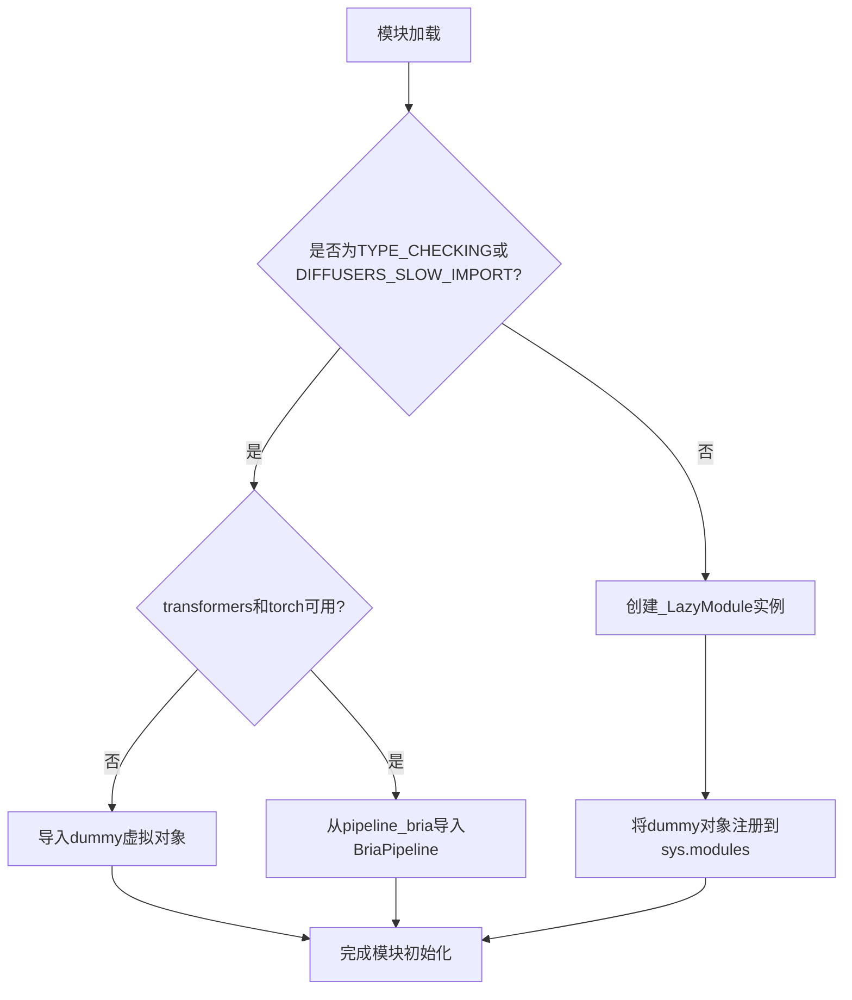
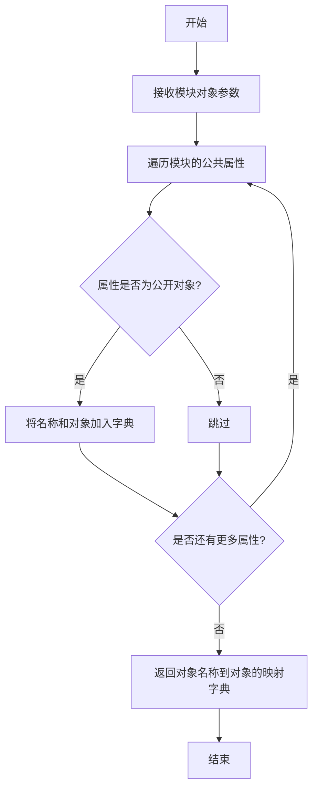
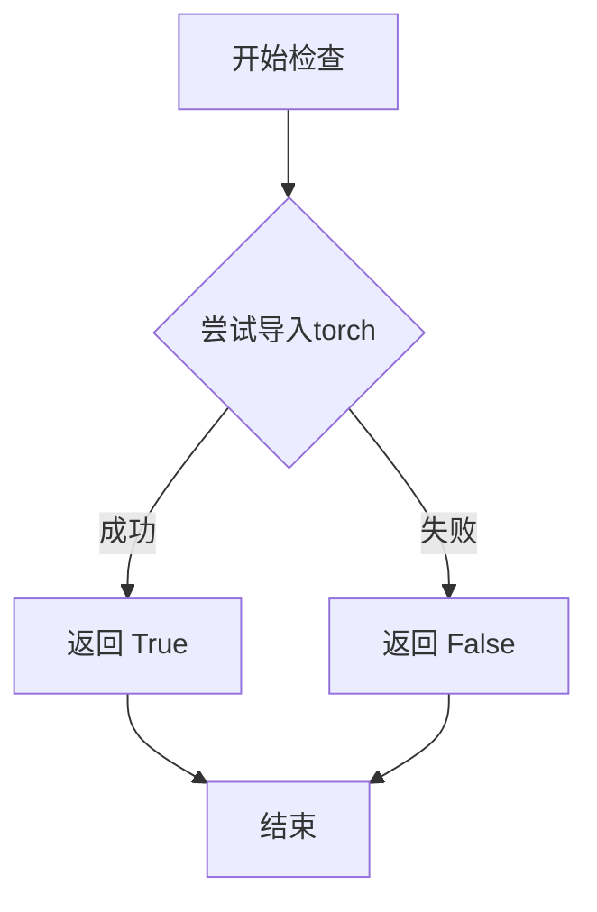
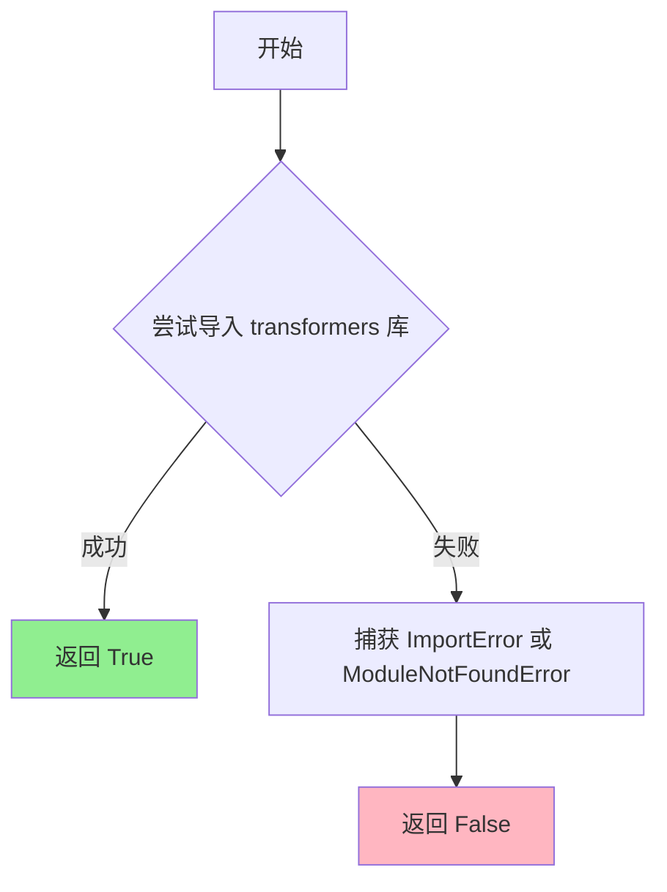

# `diffusers\src\diffusers\pipelines\bria\__init__.py` 详细设计文档

这是一个懒加载模块初始化文件，用于处理Diffusers库中可选依赖项（torch和transformers）的延迟导入。当依赖不可用时加载虚拟对象，当依赖可用时加载真实的BriaPipeline类，从而实现模块的平滑降级。

## 整体流程



## 类结构

```
模块初始化文件（无类定义）
└── 核心依赖: BriaPipeline
```

## 全局变量及字段


### `_dummy_objects`
    
存储虚拟对象，用于依赖不可用时的降级处理

类型：`dict`
    


### `_import_structure`
    
定义模块的导入结构，包含可导出的对象列表

类型：`dict`
    


    

## 全局函数及方法


### `get_objects_from_module`

从指定模块中提取所有公共对象（类、函数、变量），返回一个由对象名称到对象本身的字典映射，常用于懒加载模块中获取虚拟对象集合。

参数：

- `module`：`ModuleType`，要从中提取对象的模块对象（如 `dummy_torch_and_transformers_objects`）

返回值：`Dict[str, Any]`，键为对象名称（字符串），值为模块中对应的对象（类、函数或变量）

#### 流程图



#### 带注释源码

```python
def get_objects_from_module(module):
    """
    从给定模块中获取所有公开对象的字典映射。
    
    此函数用于从虚拟模块（如 dummy_torch_and_transformers_objects）中提取
    所有预定义的类、函数或变量，以便在可选依赖不可用时仍能保持 API 一致性。
    
    参数:
        module: 要从中提取对象的模块对象。该模块通常包含占位符类/函数，
                当原始依赖不可用时用作替代。
    
    返回值:
        dict: 一个字典，键为对象名称（字符串），值为模块中对应的对象。
              仅包含以下划线开头的非公开属性。
    """
    # 使用 dir() 获取模块的所有属性，过滤掉以双下划线开头的特殊属性
    # 保留单下划线开头的属性（符合模块的公共 API 定义）
    return {
        name: getattr(module, name)
        for name in dir(module)
        if not name.startswith("_")
    }
```


### `is_torch_available`

检查当前环境中 PyTorch 库是否可用。该函数通过尝试导入 torch 模块来判断环境是否支持 PyTorch，并返回布尔值结果。

参数：无

返回值：`bool`，返回 `True` 表示 PyTorch 可用，返回 `False` 表示 PyTorch 不可用。

#### 流程图



#### 带注释源码

```python
# 该函数在 ...utils 模块中定义，此处为导入使用
# 导入语句（来自代码第4行）
from ...utils import is_torch_available

# 使用示例（来自代码第12-13行）
try:
    if not (is_transformers_available() and is_torch_available()):
        # 如果 transformers 或 torch 不可用，抛出异常
        raise OptionalDependencyNotAvailable()
except OptionalDependencyNotAvailable:
    # 导入虚拟对象作为占位符
    from ...utils import dummy_torch_and_transformers_objects
    _dummy_objects.update(get_objects_from_module(dummy_torch_and_transformers_objects))
else:
    # 如果依赖都可用，导入实际的管道类
    _import_structure["pipeline_bria"] = ["BriaPipeline"]
```

#### 补充说明

| 项目 | 说明 |
|------|------|
| **定义位置** | 位于 `...utils` 模块中（本代码中仅导入使用） |
| **调用场景** | 用于条件导入和动态加载模块的依赖检查 |
| **设计目的** | 实现可选依赖的延迟加载，避免在 torch 不可用时导入失败 |
| **相关函数** | `is_transformers_available()`（检查 transformers 是否可用） |


### `is_transformers_available`

检查当前环境中 `transformers` 库是否可用，用于条件导入和依赖检查。

参数：

- 无参数

返回值：`bool`，返回 `True` 表示 `transformers` 库可用，返回 `False` 表示不可用。

#### 流程图



#### 带注释源码

```python
def is_transformers_available():
    """
    检查 transformers 库是否可用
    
    该函数尝试导入 transformers 库，如果成功则返回 True，
    如果失败（模块不存在）则返回 False。
    
    Returns:
        bool: transformers 库是否可用
    """
    # 尝试导入 transformers 模块
    try:
        # 尝试导入，__import__ 是 Python 的底层导入函数
        # 如果模块不存在会抛出 ModuleNotFoundError
        # 如果模块存在但导入失败会抛出 ImportError
        import transformers  # noqa F401
        
        # 如果成功导入，返回 True
        return True
    except (ImportError, ModuleNotFoundError):
        # 如果导入失败（库未安装或版本不兼容），返回 False
        return False
```

> **注意**：由于 `is_transformers_available` 函数定义在 `diffusers` 包的 `...utils` 模块中（代码中使用 `from ...utils import is_transformers_available` 导入），上述源码是基于常见实现模式的推断。实际源码可能略有差异，但核心逻辑相同。


### `_LazyModule`

`_LazyModule` 是 Diffusers 库中的延迟加载机制，用于在运行时按需导入模块和依赖项，从而优化导入时间和减少内存占用。该模块在 `__init__.py` 中被实例化，以支持可选依赖（torch 和 transformers）的动态加载。

参数：

- `__name__`：`str`，当前模块的名称（`__name__`）
- `__file__`：`str`，模块文件的路径（通过 `globals()["__file__"]` 获取）
- `_import_structure`：`dict`，定义了模块的导入结构，包含可导出的对象名称
- `module_spec`：`ModuleSpec`，模块的规格对象（`__spec__`），包含了模块的元信息

返回值：`_LazyModule`，返回一个延迟加载模块的实例，用于后续的按需导入

#### 流程图

```mermaid
flowchart TD
    A[开始] --> B{检查 TYPE_CHECKING 或 DIFFUSERS_SLOW_IMPORT}
    
    B -->|是| C{检查 is_transformers_available<br/>和 is_torch_available}
    C -->|可用| D[从 .pipeline_bria 导入 BriaPipeline]
    C -->|不可用| E[从 dummy_torch_and_transformers_objects 导入 dummy 对象]
    
    B -->|否| F[创建 _LazyModule 实例]
    F --> G[替换 sys.modules[__name__]]
    G --> H[遍历 _dummy_objects]
    H --> I[使用 setattr 将 dummy 对象设置到模块]
    
    D --> J[结束]
    E --> J
    I --> J
```

#### 带注释源码

```python
# 导入类型检查相关的模块
from typing import TYPE_CHECKING

# 导入工具函数和类
from ...utils import (
    DIFFUSERS_SLOW_IMPORT,          # 标志：是否使用慢速导入模式
    OptionalDependencyNotAvailable, # 可选依赖不可用异常
    _LazyModule,                    # 延迟加载模块类
    get_objects_from_module,        # 从模块获取对象的函数
    is_torch_available,             # 检查 torch 是否可用
    is_transformers_available,      # 检查 transformers 是否可用
)

# 初始化 dummy 对象字典和导入结构
_dummy_objects = {}
_import_structure = {}

# 尝试检查可选依赖是否可用
try:
    # 检查 transformers 和 torch 是否都可用
    if not (is_transformers_available() and is_torch_available()):
        raise OptionalDependencyNotAvailable()
except OptionalDependencyNotAvailable:
    # 如果依赖不可用，从 dummy 模块导入空对象作为占位符
    from ...utils import dummy_torch_and_transformers_objects  # noqa F403
    # 将 dummy 对象更新到全局 dummy 对象字典中
    _dummy_objects.update(get_objects_from_module(dummy_torch_and_transformers_objects))
else:
    # 如果依赖可用，将 BriaPipeline 添加到导入结构中
    _import_structure["pipeline_bria"] = ["BriaPipeline"]

# 类型检查或慢速导入模式下的处理
if TYPE_CHECKING or DIFFUSERS_SLOW_IMPORT:
    try:
        # 再次检查依赖可用性
        if not (is_transformers_available() and is_torch_available()):
            raise OptionalDependencyNotAvailable()
    except OptionalDependencyNotAvailable:
        # 类型检查时导入 dummy 对象
        from ...utils.dummy_torch_and_transformers_objects import *
    else:
        # 类型检查时导入真实模块
        from .pipeline_bria import BriaPipeline
else:
    # 正常运行时使用延迟加载模块
    import sys

    # 创建延迟加载模块实例，替换当前模块
    sys.modules[__name__] = _LazyModule(
        __name__,                          # 模块名称
        globals()["__file__"],             # 模块文件路径
        _import_structure,                 # 导入结构定义
        module_spec=__spec__,              # 模块规格
    )

    # 将所有 dummy 对象设置到模块属性中
    for name, value in _dummy_objects.items():
        setattr(sys.modules[__name__], name, value)
```

## 关键组件


### 可选依赖检查与条件导入

该模块通过 `is_transformers_available()` 和 `is_torch_available()` 检查 torch 和 transformers 库是否可用，根据检查结果决定导入真实模块还是虚拟对象，以实现可选依赖的优雅处理。

### 延迟模块加载机制

使用 `_LazyModule` 类实现延迟加载（Lazy Loading），将模块注册到 `sys.modules` 中，仅在实际使用时才加载具体模块，提升导入速度并避免不必要的依赖加载。

### 导入结构定义

通过 `_import_structure` 字典定义模块的导出结构，明确列出可导出的类名（如 `BriaPipeline`），为动态导入提供元数据支持。

### 虚拟对象回退机制

当可选依赖不可用时，使用 `_dummy_objects` 存储从 `dummy_torch_and_transformers_objects` 获取的虚拟对象，并通过 `setattr` 将其绑定到模块，确保代码在缺少依赖时仍可导入而不报错。

### BriaPipeline 管道类

条件导入的 `BriaPipeline` 类是实际的功能管道，封装了与 Bria 模型相关的推理逻辑，仅在 torch 和 transformers 都可用时才会被导入。

### TYPE_CHECKING 模式支持

在类型检查或慢速导入模式下，模块会提前导入实际类以便进行类型检查和静态分析，提升开发体验和类型安全性。


## 问题及建议


### 已知问题

-   **重复的条件检查逻辑**：`if not (is_transformers_available() and is_torch_available())` 在第15行和第23行重复出现，导致代码冗余，增加维护成本
-   **导入路径不一致**：第19行使用 `from ...utils import dummy_torch_and_transformers_objects`，第27行使用 `from ...utils.dummy_torch_and_transformers_objects import *`，两种导入路径风格不统一
-   **TYPE_CHECKING 条件分支逻辑冗余**：第22-31行的 `if TYPE_CHECKING or DIFFUSERS_SLOW_IMPORT` 分支与第32-39行的 `else` 分支存在大量重复代码（重复的依赖检查和导入逻辑）
- **空的全局变量初始化**：`_dummy_objects = {}` 和 `_import_structure = {}` 在开头定义，但后续通过 `update` 和直接赋值修改，这种模式不够直观
- **字符串键缺少类型安全检查**：`_import_structure["pipeline_bria"]` 使用字符串字面量，没有编译时检查，容易因拼写错误导致运行时问题

### 优化建议

-   将可选依赖检查逻辑提取为独立的辅助函数，避免代码重复
-   统一导入路径风格，建议使用 `from ...utils.dummy_torch_and_transformers_objects` 形式
-   简化 TYPE_CHECKING 分支，考虑使用工厂函数或配置对象来管理不同导入模式
-   使用枚举或常量类定义导入结构键，避免字符串字面量
-   考虑使用 dataclass 或 namedtuple 封装 `_import_structure` 的结构，提高类型安全性
-   评估是否可以使用更现代的延迟加载机制，如 `importlib.util` 的 `LazyLoader`


## 其它


### 设计目标与约束

该模块的核心设计目标是实现可选依赖的延迟导入（Lazy Loading），通过动态检查torch和transformers依赖是否可用，在依赖不可用时提供dummy对象保证模块结构完整性，在依赖可用时正常导入BriaPipeline类。主要约束包括：1）必须同时满足torch和transformers两个依赖才可导入真实模块；2）需要兼容DIFFUSERS_SLOW_IMPORT模式以支持类型检查；3）保持与Diffusers框架其他模块一致的导入结构。

### 错误处理与异常设计

当torch或transformers任一依赖不可用时，抛出OptionalDependencyNotAvailable异常，该异常由上层utils模块定义。代码使用try-except捕获该异常并触发dummy对象填充机制，确保模块导入不会失败。TYPE_CHECKING或DIFFUSERS_SLOW_IMPORT为True时，同样检查依赖但仅用于类型提示导入，不执行运行时dummy对象设置。

### 外部依赖与接口契约

外部依赖包括：1）is_torch_available()和is_transformers_available()用于检测运行时依赖；2）get_objects_from_module()用于从dummy模块获取对象；3）_LazyModule类用于实现延迟加载；4）BriaPipeline类通过pipeline_bria子模块导出。导入结构（_import_structure）定义了公开API接口，包含pipeline_bria键和BriaPipeline列表。

### 模块化与可扩展性

该模块采用模块化设计，通过_import_structure字典定义导出接口，便于扩展新的pipeline。添加新pipeline只需在else分支的_import_structure中添加新键值对，并在对应子模块实现。支持多pipeline的批量管理，当前预留给BriaPipeline使用。

### 性能考虑

使用LazyModule实现按需加载，模块首次访问时才加载真实代码。_dummy_objects在依赖不可用时预填充，避免后续导入时的重复检查开销。DIFFUSERS_SLOW_IMPORT标志允许在类型检查场景下跳过部分初始化逻辑。

### 版本兼容性

代码依赖Diffusers框架的utils模块提供的OptionalDependencyNotAvailable异常类和_LazyModule类，需要与相同版本的utils模块配合使用。BriaPipeline的具体接口取决于pipeline_bria模块的实现，需保持兼容性。

### 安全性考虑

模块级别的setattr操作将dummy对象注入sys.modules，需确保注入对象的安全性。使用get_objects_from_module从受信任的dummy模块获取对象，避免任意代码执行风险。

### 测试策略

测试应覆盖：1）依赖全部可用时正确导入BriaPipeline；2）任一依赖不可用时导入dummy对象；3）TYPE_CHECKING模式下的行为；4）DIFFUSERS_SLOW_IMPORT模式下的行为；5）多次导入不会重复初始化。

### 部署注意事项

部署时需确保：1）Diffusers核心utils模块已正确安装；2）依赖版本与is_torch_available和is_transformers_available的检查逻辑一致；3）在容器化环境中需正确处理可选依赖的安装状态。

    