# `diffusers\src\diffusers\pipelines\bria\pipeline_bria.py` 详细设计文档

这是一个基于 Flux 架构的文本到图像生成 Pipeline (BriaPipeline)，它使用 T5 模型编码文本提示，通过自定义的 Transformer 进行潜在空间的去噪操作，最后利用 VAE 解码生成图像。

## 整体流程

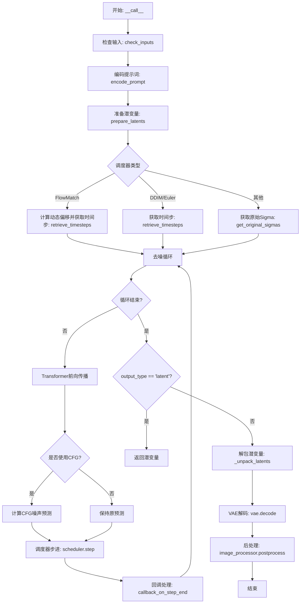

## 类结构

```
DiffusionPipeline (基类)
└── BriaPipeline (文本到图像生成管道)
```

## 全局变量及字段


### `logger`
    
日志记录器

类型：`logging.Logger`
    


### `EXAMPLE_DOC_STRING`
    
示例文档字符串

类型：`str`
    


### `XLA_AVAILABLE`
    
标记是否支持XLA/TPU加速

类型：`bool`
    


### `model_cpu_offload_seq`
    
模型CPU卸载顺序字符串

类型：`str`
    


### `_optional_components`
    
可选组件列表

类型：`list`
    


### `_callback_tensor_inputs`
    
回调函数支持的tensor输入列表

类型：`list`
    


### `is_ng_none`
    
检查negative_prompt是否为空或None

类型：`Callable`
    


### `get_original_sigmas`
    
获取原始sigma值用于扩散调度

类型：`Callable`
    


### `BriaPipeline.vae`
    
变分自编码器，用于图像编码和解码

类型：`AutoencoderKL`
    


### `BriaPipeline.text_encoder`
    
T5文本编码器

类型：`T5EncoderModel`
    


### `BriaPipeline.tokenizer`
    
T5分词器

类型：`T5TokenizerFast`
    


### `BriaPipeline.transformer`
    
核心去噪Transformer模型

类型：`BriaTransformer2DModel`
    


### `BriaPipeline.scheduler`
    
扩散调度器

类型：`KarrasDiffusionSchedulers`
    


### `BriaPipeline.image_encoder`
    
可选的图像编码器

类型：`CLIPVisionModelWithProjection`
    


### `BriaPipeline.feature_extractor`
    
可选的图像特征提取器

类型：`CLIPImageProcessor`
    


### `BriaPipeline.vae_scale_factor`
    
VAE缩放因子

类型：`int`
    


### `BriaPipeline.image_processor`
    
图像后处理器

类型：`VaeImageProcessor`
    


### `BriaPipeline.default_sample_size`
    
默认采样大小

类型：`int`
    


### `BriaPipeline._guidance_scale`
    
引导系数

类型：`float`
    


### `BriaPipeline._attention_kwargs`
    
注意力参数字典

类型：`dict`
    


### `BriaPipeline._num_timesteps`
    
时间步数

类型：`int`
    


### `BriaPipeline._interrupt`
    
中断标志

类型：`bool`
    
    

## 全局函数及方法


### `is_ng_none`

该函数是一个辅助函数，用于判断负面提示（negative prompt）是否为空或无效。它会检查多种可能的空值或无效值情况，包括 `None`、空字符串、空列表以及列表首元素为 `None` 或空字符串的情况。

参数：

-  `negative_prompt`：`Any`，需要检查的负面提示，可以是 `None`、字符串、字符串列表或 `None` 列表

返回值：`bool`，如果负面提示为空或无效返回 `True`，否则返回 `False`

#### 流程图

```mermaid
flowchart TD
    A[Start: is_ng_none] --> B{negative_prompt is None?}
    B -->|Yes| C[Return True]
    B -->|No| D{negative_prompt == ''?}
    D -->|Yes| C
    D -->|No| E{isinstance negative_prompt, list?}
    E -->|Yes| F{negative_prompt[0] is None?}
    F -->|Yes| C
    F -->|No| G{negative_prompt[0] == ''?}
    G -->|Yes| C
    G -->|No| H[Return False]
    E -->|No| H
```

#### 带注释源码

```python
def is_ng_none(negative_prompt):
    """
    判断负面提示是否为空或无效的辅助函数。
    
    该函数检查以下几种情况:
    1. negative_prompt 本身是 None
    2. negative_prompt 是空字符串 ""
    3. negative_prompt 是一个列表，且第一个元素是 None
    4. negative_prompt 是一个列表，且第一个元素是空字符串 ""
    
    Args:
        negative_prompt: 需要检查的负面提示，可以是 None、字符串、字符串列表或 None 列表
        
    Returns:
        bool: 如果负面提示为空或无效返回 True，否则返回 False
    """
    return (
        # 检查是否直接为 None
        negative_prompt is None
        # 检查是否为空字符串
        or negative_prompt == ""
        # 检查是否为列表且第一个元素为 None
        or (isinstance(negative_prompt, list) and negative_prompt[0] is None)
        # 检查是否为列表且第一个元素为空字符串
        # 注意：这里使用 type(negative_prompt) == list 而不是 isinstance
        # 是为了排除继承自 list 的其他类型，如 tuple
        or (type(negative_prompt) == list and negative_prompt[0] == "")
    )
```


### `get_original_sigmas`

该函数是一个辅助函数，用于计算扩散模型推理过程中所需的原始训练sigma值。它首先生成从1到训练时间步数的线性间隔序列，然后将其归一化为sigma值（除以训练时间步数），最后根据推理步数从原始sigma序列中采样得到新的sigma序列，用于调度器的初始化。

参数：

- `num_train_timesteps`：`int`，训练过程中使用的时间步总数，默认为1000，对应扩散模型的训练噪声调度
- `num_inference_steps`：`int`，推理过程中执行的去噪步数，默认为1000，决定最终生成图像的采样密度

返回值：`numpy.ndarray`，返回采样后的sigma值数组，形状为 `(num_inference_steps,)`，用于推理过程中的噪声调度

#### 流程图

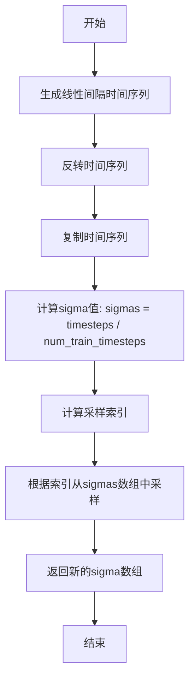

#### 带注释源码

```
def get_original_sigmas(num_train_timesteps=1000, num_inference_steps=1000):
    """
    计算扩散模型推理过程中使用的原始训练sigma值
    
    参数:
        num_train_timesteps: 训练时的时间步总数，默认为1000
        num_inference_steps: 推理时的去噪步数，默认为1000
    
    返回:
        numpy.ndarray: 采样后的sigma值数组
    """
    
    # 步骤1: 生成从1到num_train_timesteps的线性间隔序列
    # np.linspace(1, num_train_timesteps, num_train_timesteps) 生成 [1, 2, 3, ..., num_train_timesteps]
    # dtype=np.float32 确保使用32位浮点数以保持精度
    # [::-1] 将数组反向，得到 [num_train_timesteps, ..., 3, 2, 1]
    # .copy() 创建副本避免修改原始数组
    timesteps = np.linspace(1, num_train_timesteps, num_train_timesteps, dtype=np.float32)[::-1].copy()
    
    # 步骤2: 将时间步归一化到[0, 1]区间得到sigma值
    # sigma = timestep / num_train_timesteps
    # 例如: 当num_train_timesteps=1000时，timestep=1000对应sigma=1.0，timestep=1对应sigma=0.001
    sigmas = timesteps / num_train_timesteps
    
    # 步骤3: 生成均匀分布的采样索引
    # np.linspace(0, num_train_timesteps - 1, num_inference_steps) 生成从0到num_train_timesteps-1的均匀索引
    # 例如: num_train_timesteps=1000, num_inference_steps=50时
    # 生成索引: [0, 20, 40, 60, ..., 980] (共50个索引)
    inds = [int(ind) for ind in np.linspace(0, num_train_timesteps - 1, num_inference_steps)]
    
    # 步骤4: 根据采样索引从sigma数组中提取对应的sigma值
    # 这样可以得到均匀分布的sigma序列用于推理
    new_sigmas = sigmas[inds]
    
    # 步骤5: 返回采样后的sigma数组
    return new_sigmas
```


### `BriaPipeline.__init__`

初始化管道及各个模型组件，包括transformer、scheduler、vae、text_encoder、tokenizer等，并将它们注册到pipeline中，同时设置VAE的缩放因子和图像处理器。

参数：

- `transformer`：`BriaTransformer2DModel`，条件Transformer（MMDiT）架构，用于对编码的图像潜在表示进行去噪
- `scheduler`：`FlowMatchEulerDiscreteScheduler | KarrasDiffusionSchedulers`，用于与transformer配合对编码图像潜在表示进行去噪的调度器
- `vae`：`AutoencoderKL`，变分自编码器（VAE）模型，用于对图像进行编码和解码
- `text_encoder`：`T5EncoderModel`，冻结的文本编码器，Bria使用T5模型
- `tokenizer`：`T5TokenizerFast`，T5分词器
- `image_encoder`：`CLIPVisionModelWithProjection`，可选，CLIP图像编码器
- `feature_extractor`：`CLIPImageProcessor`，可选，CLIP图像处理器

返回值：`None`，无返回值（构造函数）

#### 流程图

```mermaid
flowchart TD
    A[开始 __init__] --> B[register_modules 注册所有模型模块]
    B --> C{检查 vae 是否存在}
    C -->|是| D[计算 vae_scale_factor = 2 ** len(vae.config.block_out_channels)]
    C -->|否| E[vae_scale_factor = 16]
    D --> F[创建 VaeImageProcessor]
    E --> F
    F --> G[设置 default_sample_size = 64]
    G --> H{检查 vae.config.shift_factor 是否为 None}
    H -->|是| I[设置 shift_factor = 0 并将 vae 转换为 float32]
    H -->|否| J[结束]
    I --> J
```

#### 带注释源码

```python
def __init__(
    self,
    transformer: BriaTransformer2DModel,
    scheduler: FlowMatchEulerDiscreteScheduler | KarrasDiffusionSchedulers,
    vae: AutoencoderKL,
    text_encoder: T5EncoderModel,
    tokenizer: T5TokenizerFast,
    image_encoder: CLIPVisionModelWithProjection = None,
    feature_extractor: CLIPImageProcessor = None,
):
    # 使用 register_modules 方法注册所有模型组件到 pipeline 中
    # 这样 pipeline 可以通过 self.xxx 访问各个模型
    self.register_modules(
        vae=vae,
        text_encoder=text_encoder,
        tokenizer=tokenizer,
        transformer=transformer,
        scheduler=scheduler,
        image_encoder=image_encoder,
        feature_extractor=feature_extractor,
    )

    # 计算 VAE 的缩放因子，基于 VAE 的 block_out_channels 数量
    # VAE 通常有 [128, 256, 512, 512] 这样的通道配置
    # 2 ** (len(block_out_channels)) 给出了下采样的总倍数
    self.vae_scale_factor = (
        2 ** (len(self.vae.config.block_out_channels)) if hasattr(self, "vae") and self.vae is not None else 16
    )
    
    # 创建图像处理器，用于 VAE 解码后的图像后处理
    self.image_processor = VaeImageProcessor(vae_scale_factor=self.vae_scale_factor)
    
    # 设置默认采样大小为 64
    # 这是因为 patchify 将 128x128 的图像转换为 64x64 的潜在表示
    # 从而可以生成 1k x 1k 分辨率的图像
    self.default_sample_size = 64  # due to patchify=> 128,128 => res of 1k,1k

    # 如果 VAE 的 shift_factor 未配置，设置默认值并使用 float32
    # BRIA 的 VAE 不支持混合精度训练
    if self.vae.config.shift_factor is None:
        self.vae.config.shift_factor = 0
        self.vae.to(dtype=torch.float32)
```


### `BriaPipeline.encode_prompt`

编码文本提示为embeddings，处理负面提示和LoRA，生成用于扩散模型的去噪embeddings和文本ID。

参数：

- `prompt`：`str | list[str]`，要编码的文本提示，支持单个字符串或字符串列表
- `device`：`torch.device | None`，torch设备，用于计算的目标设备，默认为执行设备
- `num_images_per_prompt`：`int`，每个提示生成的图像数量，用于批量生成
- `do_classifier_free_guidance`：`bool`，是否使用无分类器自由guidance，用于提升生成质量
- `negative_prompt`：`str | list[str] | None`，负面提示，用于引导图像生成时排除不需要的元素
- `prompt_embeds`：`torch.FloatTensor | None`，预生成的文本嵌入，用于避免重复计算
- `negative_prompt_embeds`：`torch.FloatTensor | None`，预生成的负面文本嵌入
- `max_sequence_length`：`int`，T5编码器的最大序列长度，默认为128
- `lora_scale`：`float | None`，LoRA缩放因子，用于动态调整LoRA权重

返回值：`tuple[torch.FloatTensor, torch.FloatTensor, torch.Tensor]`，返回三个元素的元组：
- `prompt_embeds`：编码后的正面提示embeddings
- `negative_prompt_embeds`：编码后的负面提示embeddings（全零如果未提供）
- `text_ids`：用于transformer的文本位置ID张量

#### 流程图

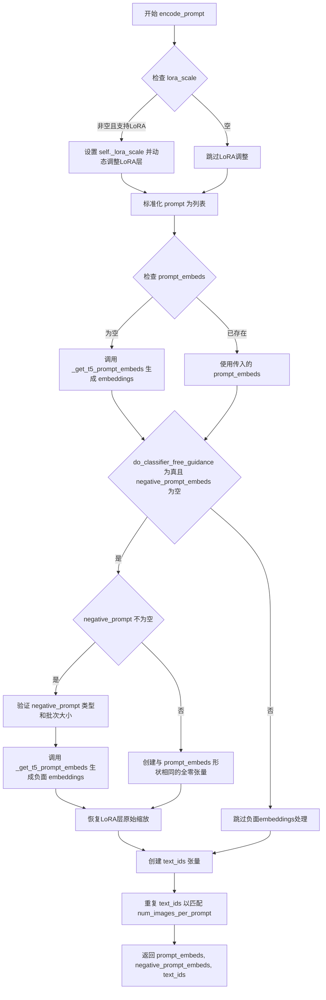

#### 带注释源码

```python
def encode_prompt(
    self,
    prompt: str | list[str],
    device: torch.device | None = None,
    num_images_per_prompt: int = 1,
    do_classifier_free_guidance: bool = True,
    negative_prompt: str | list[str] | None = None,
    prompt_embeds: torch.FloatTensor | None = None,
    negative_prompt_embeds: torch.FloatTensor | None = None,
    max_sequence_length: int = 128,
    lora_scale: float | None = None,
):
    """
    编码文本提示为embeddings，供扩散模型使用。
    
    该方法处理以下内容：
    1. 将输入prompt标准化为列表格式
    2. 使用T5编码器生成文本embeddings
    3. 处理负面prompt以实现classifier-free guidance
    4. 应用LoRA权重调整（如果启用）
    5. 生成text_ids用于transformer的注意力机制
    
    Args:
        prompt: 要编码的文本提示，字符串或字符串列表
        device: torch设备，默认为执行设备
        num_images_per_prompt: 每个提示生成的图像数量
        do_classifier_free_guidance: 是否启用无分类器guidance
        negative_prompt: 负面提示，用于排除不需要的元素
        prompt_embeds: 预计算的prompt embeddings，可选
        negative_prompt_embeds: 预计算的负面embeddings，可选
        max_sequence_length: T5编码器的最大序列长度
        lora_scale: LoRA缩放因子，用于权重调整
        
    Returns:
        tuple: (prompt_embeds, negative_prompt_embeds, text_ids)
    """
    # 确定设备，如果未指定则使用执行设备
    device = device or self._execution_device

    # 设置LoRA缩放，以便文本编码器的monkey patched LoRA函数可以正确访问
    # 只有在支持PEFT后端且类继承自FluxLoraLoaderMixin时才应用
    if lora_scale is not None and isinstance(self, FluxLoraLoaderMixin):
        self._lora_scale = lora_scale

        # 动态调整LoRA缩放
        if self.text_encoder is not None and USE_PEFT_BACKEND:
            scale_lora_layers(self.text_encoder, lora_scale)

    # 标准化prompt为列表格式，便于批量处理
    prompt = [prompt] if isinstance(prompt, str) else prompt
    
    # 确定批次大小
    if prompt is not None:
        batch_size = len(prompt)
    else:
        # 如果没有prompt，则使用传入的prompt_embeds的批次大小
        batch_size = prompt_embeds.shape[0]

    # 如果未提供prompt_embeds，则使用T5编码器生成
    if prompt_embeds is None:
        prompt_embeds = self._get_t5_prompt_embeds(
            prompt=prompt,
            num_images_per_prompt=num_images_per_prompt,
            max_sequence_length=max_sequence_length,
            device=device,
        )

    # 处理classifier-free guidance的负面embeddings
    if do_classifier_free_guidance and negative_prompt_embeds is None:
        # 检查负面prompt是否有有效内容
        if not is_ng_none(negative_prompt):
            # 将负面prompt扩展为批次大小
            negative_prompt = (
                batch_size * [negative_prompt] if isinstance(negative_prompt, str) else negative_prompt
            )

            # 类型检查
            if prompt is not None and type(prompt) is not type(negative_prompt):
                raise TypeError(
                    f"`negative_prompt` should be the same type to `prompt`, but got {type(negative_prompt)} !="
                    f" {type(prompt)}."
                )
            # 批次大小检查
            elif batch_size != len(negative_prompt):
                raise ValueError(
                    f"`negative_prompt`: {negative_prompt} has batch size {len(negative_prompt)}, but `prompt`:"
                    f" {prompt} has batch size {batch_size}. Please make sure that passed `negative_prompt` matches"
                    " the batch size of `prompt`."
                )

            # 生成负面prompt的embeddings
            negative_prompt_embeds = self._get_t5_prompt_embeds(
                prompt=negative_prompt,
                num_images_per_prompt=num_images_per_prompt,
                max_sequence_length=max_sequence_length,
                device=device,
            )
        else:
            # 如果没有有效的负面prompt，创建全零embeddings
            negative_prompt_embeds = torch.zeros_like(prompt_embeds)

    # 如果使用了LoRA，恢复原始缩放
    if self.text_encoder is not None:
        if isinstance(self, FluxLoraLoaderMixin) and USE_PEFT_BACKEND:
            # 通过取消缩放LoRA层来恢复原始缩放
            unscale_lora_layers(self.text_encoder, lora_scale)

    # 创建text_ids张量，用于transformer的文本位置编码
    # 形状: (batch_size, seq_len, 3) - 3代表x, y, 0坐标
    text_ids = torch.zeros(batch_size, prompt_embeds.shape[1], 3).to(device=device)
    # 为每个生成的图像重复text_ids
    text_ids = text_ids.repeat(num_images_per_prompt, 1, 1)

    return prompt_embeds, negative_prompt_embeds, text_ids
```


### `BriaPipeline.check_inputs`

该方法用于验证`BriaPipeline`推理流程中输入参数的有效性，确保`prompt`、`height`、`width`、`negative_prompt`等关键参数符合模型要求，并在参数不符合规范时抛出详细的错误信息或警告。

参数：

- `self`：`BriaPipeline`实例本身，隐式传递
- `prompt`：`str | list[str] | None`，用户输入的文本提示，用于指导图像生成
- `height`：`int`，生成图像的高度（像素）
- `width`：`int`，生成图像的宽度（像素）
- `negative_prompt`：`str | list[str] | None`，不希望出现在生成图像中的内容描述
- `prompt_embeds`：`torch.FloatTensor | None`，预生成的文本嵌入向量，可选
- `negative_prompt_embeds`：`torch.FloatTensor | None`，预生成的负面文本嵌入向量，可选
- `callback_on_step_end_tensor_inputs`：`list[str] | None`，在每个去噪步骤结束时需要回调的张量输入列表
- `max_sequence_length`：`int | None`，文本编码的最大序列长度

返回值：`None`，该方法不返回任何值，仅进行参数验证和状态检查

#### 流程图

```mermaid
graph TD
    A([开始]) --> B{检查 height 和 width}
    B --> C{height % (vae_scale_factor * 2) == 0<br/>且 width % (vae_scale_factor * 2) == 0?}
    C -->|否| D[发出警告: 尺寸将被调整]
    C -->|是| E{检查 callback_on_step_end_tensor_inputs}
    D --> E
    E --> F{callback_on_step_end_tensor_inputs<br/>中的所有key都在<br/>_callback_tensor_inputs中?}
    F -->|否| G[抛出 ValueError: 无效的回调张量输入]
    F -->|是| H{检查 prompt 和 prompt_embeds}
    H --> I{prompt 非空 且 prompt_embeds 非空?}
    I -->|是| J[抛出 ValueError: 不能同时指定]
    I -->|否| K{prompt 为空 且 prompt_embeds 为空?}
    K -->|是| L[抛出 ValueError: 必须提供至少一个]
    K -->|否| M{prompt 是 str 或 list?}
    M -->|否| N[抛出 ValueError: prompt 类型无效]
    M -->|是| O{检查 negative_prompt}
    O --> P{negative_prompt 非空 且<br/>negative_prompt_embeds 非空?}
    P -->|是| Q[抛出 ValueError: 不能同时指定]
    P -->|否| R{检查 embeds 形状一致性}
    R --> S{prompt_embeds 非空 且<br/>negative_prompt_embeds 非空?}
    S -->|是| T{prompt_embeds.shape ==<br/>negative_prompt_embeds.shape?}
    T -->|否| U[抛出 ValueError: 形状不匹配]
    T -->|是| V{检查 max_sequence_length}
    S -->|否| V
    V --> W{max_sequence_length > 512?}
    W -->|是| X[抛出 ValueError: 超长]
    W -->|是| Y([结束/通过验证])
```

#### 带注释源码

```python
def check_inputs(
    self,
    prompt,
    height,
    width,
    negative_prompt=None,
    prompt_embeds=None,
    negative_prompt_embeds=None,
    callback_on_step_end_tensor_inputs=None,
    max_sequence_length=None,
):
    """
    验证生成图像所需输入参数的有效性
    
    检查项目：
    1. height 和 width 必须是 vae_scale_factor * 2 的倍数
    2. callback_on_step_end_tensor_inputs 必须是允许的回调张量
    3. prompt 和 prompt_embeds 不能同时提供
    4. prompt 和 prompt_embeds 至少提供一个
    5. prompt 必须是 str 或 list 类型
    6. negative_prompt 和 negative_prompt_embeds 不能同时提供
    7. prompt_embeds 和 negative_prompt_embeds 形状必须一致
    8. max_sequence_length 不能超过 512
    """
    
    # 检查 1: 验证图像尺寸是否能被 VAE 压缩因子整除
    # VAE 通常有 8x 压缩率 (2^(len(block_out_channels)))，这里乘以 2 是因为还要考虑 patchify
    if height % (self.vae_scale_factor * 2) != 0 or width % (self.vae_scale_factor * 2) != 0:
        logger.warning(
            f"`height` and `width` have to be divisible by {self.vae_scale_factor * 2} but are {height} and {width}. Dimensions will be resized accordingly"
        )
    
    # 检查 2: 验证回调张量输入是否在允许列表中
    if callback_on_step_end_tensor_inputs is not None and not all(
        k in self._callback_tensor_inputs for k in callback_on_step_end_tensor_inputs
    ):
        raise ValueError(
            f"`callback_on_step_end_tensor_inputs` has to be in {self._callback_tensor_inputs}, but found {[k for k in callback_on_step_end_tensor_inputs if k not in self._callback_tensor_inputs]}"
        )

    # 检查 3-4: prompt 和 prompt_embeds 必须且只能提供一个
    if prompt is not None and prompt_embeds is not None:
        raise ValueError(
            f"Cannot forward both `prompt`: {prompt} and `prompt_embeds`: {prompt_embeds}. Please make sure to"
            " only forward one of the two."
        )
    elif prompt is None and prompt_embeds is None:
        raise ValueError(
            "Provide either `prompt` or `prompt_embeds`. Cannot leave both `prompt` and `prompt_embeds` undefined."
        )
    # 检查 5: 验证 prompt 的数据类型
    elif prompt is not None and (not isinstance(prompt, str) and not isinstance(prompt, list)):
        raise ValueError(f"`prompt` has to be of type `str` or `list` but is {type(prompt)}")

    # 检查 6: negative_prompt 和 negative_prompt_embeds 不能同时提供
    if negative_prompt is not None and negative_prompt_embeds is not None:
        raise ValueError(
            f"Cannot forward both `negative_prompt`: {negative_prompt} and `negative_prompt_embeds`:"
            f" {negative_prompt_embeds}. Please make sure to only forward one of the two."
        )

    # 检查 7: 验证 prompt_embeds 和 negative_prompt_embeds 的形状一致性
    if prompt_embeds is not None and negative_prompt_embeds is not None:
        if prompt_embeds.shape != negative_prompt_embeds.shape:
            raise ValueError(
                "`prompt_embeds` and `negative_prompt_embeds` must have the same shape when passed directly, but"
                f" got: `prompt_embeds` {prompt_embeds.shape} != `negative_prompt_embeds`"
                f" {negative_prompt_embeds.shape}."
            )

    # 检查 8: 验证最大序列长度不超过 T5 模型限制
    if max_sequence_length is not None and max_sequence_length > 512:
        raise ValueError(f"`max_sequence_length` cannot be greater than 512 but is {max_sequence_length}")
```


### `BriaPipeline._get_t5_prompt_embeds`

该方法负责调用T5文本编码器模型将输入的文本提示（prompt）转换为高维向量表示（embeddings），支持批量处理、文本填充（padding）到最大序列长度，以及根据num_images_per_prompt参数复制嵌入向量以支持单次生成多张图像。

参数：

- `self`：`BriaPipeline` 类实例本身
- `prompt`：`str | list[str]`，待编码的文本提示，可以是单个字符串或字符串列表
- `num_images_per_prompt`：`int = 1`，每个提示需要生成的图像数量，用于复制嵌入向量
- `max_sequence_length`：`int = 128`，T5模型的最大序列长度，超过该长度的文本将被截断
- `device`：`torch.device | None = None`，指定计算设备，默认为文本编码器所在的设备

返回值：`torch.FloatTensor`，形状为 `(batch_size * num_images_per_prompt, max_sequence_length, hidden_dim)` 的文本嵌入张量

#### 流程图

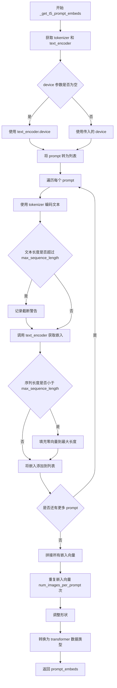

#### 带注释源码

```python
def _get_t5_prompt_embeds(
    self,
    prompt: str | list[str] = None,
    num_images_per_prompt: int = 1,
    max_sequence_length: int = 128,
    device: torch.device | None = None,
):
    """
    获取 T5 文本编码器的嵌入向量
    
    参数:
        prompt: 输入文本，可以是字符串或字符串列表
        num_images_per_prompt: 每个提示生成的图像数量
        max_sequence_length: 最大序列长度
        device: 计算设备
    
    返回:
        文本嵌入张量
    """
    # 获取类属性中的 tokenizer 和 text_encoder
    tokenizer = self.tokenizer
    text_encoder = self.text_encoder
    # 如果未指定设备，则使用 text_encoder 所在的设备
    device = device or text_encoder.device

    # 将单个字符串转换为列表，方便批量处理
    prompt = [prompt] if isinstance(prompt, str) else prompt
    # 获取批次大小
    batch_size = len(prompt)
    # 用于存储所有 prompt 的嵌入向量
    prompt_embeds_list = []
    
    # 遍历每个 prompt 进行编码
    for p in prompt:
        # 使用 tokenizer 将文本转换为 token IDs
        # 不使用 padding="max_length"，因为后续手动处理填充
        text_inputs = tokenizer(
            p,
            max_length=max_sequence_length,
            truncation=True,  # 截断超过最大长度的文本
            add_special_tokens=True,  # 添加特殊 tokens（如 <pad>, </s>）
            return_tensors="pt",  # 返回 PyTorch 张量
        )
        # 获取 input_ids
        text_input_ids = text_inputs.input_ids
        
        # 获取完整的（未截断的）token IDs 用于检测是否发生了截断
        untruncated_ids = tokenizer(p, padding="longest", return_tensors="pt").input_ids

        # 检查是否发生了截断
        if untruncated_ids.shape[-1] >= text_input_ids.shape[-1] and not torch.equal(
            text_input_ids, untruncated_ids
        ):
            # 解码被截断的部分用于警告信息
            removed_text = tokenizer.batch_decode(untruncated_ids[:, max_sequence_length - 1 : -1])
            logger.warning(
                "The following part of your input was truncated because `max_sequence_length` is set to "
                f" {max_sequence_length} tokens: {removed_text}"
            )

        # 调用 T5 text_encoder 获取文本嵌入
        # 返回形状: (batch_size, seq_len, hidden_dim)
        prompt_embeds = text_encoder(text_input_ids.to(device))[0]

        # 获取当前嵌入的形状
        b, seq_len, dim = prompt_embeds.shape
        
        # 如果序列长度小于最大长度，则填充零向量
        if seq_len < max_sequence_length:
            padding = torch.zeros(
                (b, max_sequence_length - seq_len, dim), 
                dtype=prompt_embeds.dtype, 
                device=prompt_embeds.device
            )
            # 在序列维度上拼接填充
            prompt_embeds = torch.concat([prompt_embeds, padding], dim=1)
        
        # 将当前 prompt 的嵌入添加到列表
        prompt_embeds_list.append(prompt_embeds)

    # 在批次维度上拼接所有 prompt 的嵌入
    prompt_embeds = torch.concat(prompt_embeds_list, dim=0)
    # 确保嵌入在指定设备上
    prompt_embeds = prompt_embeds.to(device=device)

    # 为每个 prompt 复制 num_images_per_prompt 份
    # 这样可以在一次前向传播中生成多张图像
    prompt_embeds = prompt_embeds.repeat(1, num_images_per_prompt, 1)
    # 调整形状为 (batch_size * num_images_per_prompt, max_sequence_length, hidden_dim)
    prompt_embeds = prompt_embeds.view(batch_size * num_images_per_prompt, max_sequence_length, -1)
    # 转换为 transformer 模型所需的数据类型
    prompt_embeds = prompt_embeds.to(dtype=self.transformer.dtype)
    
    return prompt_embeds
```


### `BriaPipeline.prepare_latents`

该方法负责为扩散模型生成或准备初始的噪声潜在变量（latents）。它首先根据 VAE 的缩放因子计算潜在空间的宽高。如果未提供 `latents`，则使用随机种子生成噪声，并调用 `_pack_latents` 将其打包为 Bria Transformer 所需的特定格式（2x2 分块）；如果提供了 `latents`，则直接将其转移至指定设备。此外，该方法还会生成对应的 `latent_image_ids`，用于在 Transformer 中提供空间位置信息。

参数：

- `self`：`BriaPipeline`，Pipeline 实例本身。
- `batch_size`：`int`，批量大小，即每次生成图像的数量。
- `num_channels_latents`：`int`，潜在空间的通道数，通常为 `transformer.config.in_channels // 4`。
- `height`：`int`，目标图像的高度（像素）。
- `width`：`int`，目标图像的宽度（像素）。
- `dtype`：`torch.dtype`，生成 latents 所使用的数据类型（例如 `torch.float32`）。
- `device`：`torch.device`，生成 latents 所使用的设备（例如 `cuda:0`）。
- `generator`：`torch.Generator` or `list[torch.Generator]`，用于确保生成可复现的随机数生成器。
- `latents`：`torch.FloatTensor | None`，可选。预先准备好的噪声 latents。如果为 `None`，则随机生成。

返回值：

- `latents`：`torch.FloatTensor`，处理后的 latent 张量（已打包或已转换格式）。
- `latent_image_ids`：`torch.Tensor`，用于表示 latent 空间位置信息的 IDs，形状为 `(batch_size, seq_len, 3)`。

#### 流程图

```mermaid
graph TD
    A([开始 prepare_latents]) --> B[计算 Latent 尺寸: height = 2 * (height // vae_scale_factor)]
    B --> C{传入的 latents 是否为 None?}
    C -- 是 --> D[验证 generator 列表长度]
    D --> E[使用 randn_tensor 生成随机噪声]
    E --> F[调用 _pack_latents 打包 Latents]
    F --> G[调用 _prepare_latent_image_ids 生成位置 IDs]
    G --> H([返回 latents, latent_image_ids])
    
    C -- 否 --> I[直接移动 latents 到指定 device 和 dtype]
    I --> J[调用 _prepare_latent_image_ids 生成位置 IDs]
    J --> H
```

#### 带注释源码

```python
def prepare_latents(
    self,
    batch_size,
    num_channels_latents,
    height,
    width,
    dtype,
    device,
    generator,
    latents=None,
):
    # VAE 应用 8x 压缩，但我们还需考虑 packing，这要求 latent 的高宽能被 2 整除。
    # 计算打包后的 latent 空间分辨率
    height = 2 * (int(height) // self.vae_scale_factor)
    width = 2 * (int(width) // self.vae_scale_factor)

    # 定义 latent 的形状 (未打包的形状: B, C, H, W)
    shape = (batch_size, num_channels_latents, height, width)

    # 如果用户已经提供了 latents
    if latents is not None:
        # 生成对应的位置编码 ID
        latent_image_ids = self._prepare_latent_image_ids(batch_size, height // 2, width // 2, device, dtype)
        # 直接返回移动了设备和张量类型的 latents（注意：此处未进行 pack 操作）
        return latents.to(device=device, dtype=dtype), latent_image_ids

    # 如果没有提供 latents，则需要生成随机噪声
    
    # 校验 generator 列表长度是否与 batch_size 匹配
    if isinstance(generator, list) and len(generator) != batch_size:
        raise ValueError(
            f"You have passed a list of generators of length {len(generator)}, but requested an effective batch"
            f" size of {batch_size}. Make sure the batch size matches the length of the generators."
        )

    # 1. 生成随机噪声
    latents = randn_tensor(shape, generator=generator, device=device, dtype=dtype)
    
    # 2. 将 latents 打包为 Transformer 需要的格式 (通常是将 2x2 的 patch 展平)
    latents = self._pack_latents(latents, batch_size, num_channels_latents, height, width)

    # 3. 生成位置编码 IDs
    latent_image_ids = self._prepare_latent_image_ids(batch_size, height // 2, width // 2, device, dtype)

    return latents, latent_image_ids
```


### `BriaPipeline._pack_latents`

将潜变量（latents）打包成适合Transformer的格式。通过2x2分块的方式重新组织潜变量张量，使其从原始的 `(batch_size, num_channels_latents, height, width)` 形状转换为 `(batch_size, (height//2)*(width//2), num_channels_latents*4)` 的形状，以适配Transformer的patchify处理方式。

参数：

- `latents`：`torch.Tensor`，输入的潜变量张量，形状为 `(batch_size, num_channels_latents, height, width)`
- `batch_size`：`int`，批次大小
- `num_channels_latents`：`int`，潜变量的通道数
- `height`：`int`，潜变量的高度
- `width`：`int`，潜变量的宽度

返回值：`torch.Tensor`，打包后的潜变量张量，形状为 `(batch_size, (height // 2) * (width // 2), num_channels_latents * 4)`

#### 流程图

```mermaid
flowchart TD
    A[输入 latents<br/>shape: (batch_size, num_channels_latents, height, width)] --> B[view 操作<br/>重塑为 (batch_size, num_channels_latents, height//2, 2, width//2, 2)]
    B --> C[permute 操作<br/>重新排列维度为 (batch_size, height//2, width//2, num_channels_latents, 2, 2)]
    C --> D[reshape 操作<br/>打包为 (batch_size, (height//2)*(width//2), num_channels_latents*4)]
    D --> E[输出打包后的 latents<br/>shape: (batch_size, num_patches, num_channels_latents*4)]
    
    style A fill:#e1f5fe
    style E fill:#e8f5e8
```

#### 带注释源码

```python
@staticmethod
def _pack_latents(latents, batch_size, num_channels_latents, height, width):
    """
    将潜变量打包成适合Transformer的格式
    
    参数:
        latents: 输入的潜变量张量，形状为 (batch_size, num_channels_latents, height, width)
        batch_size: 批次大小
        num_channels_latents: 潜变量通道数
        height: 潜变量高度
        width: 潜变量宽度
    
    返回:
        打包后的潜变量张量，形状为 (batch_size, (height//2)*(width//2), num_channels_latents*4)
    """
    
    # 步骤1: view 操作 - 将每个 2x2 的空间区域作为一个patch
    # 输入: (batch_size, num_channels_latents, height, width)
    # 输出: (batch_size, num_channels_latents, height//2, 2, width//2, 2)
    latents = latents.view(batch_size, num_channels_latents, height // 2, 2, width // 2, 2)
    
    # 步骤2: permute 操作 - 重新排列维度顺序，将空间维度提前
    # 输入: (batch_size, num_channels_latents, height//2, 2, width//2, 2)
    # 输出: (batch_size, height//2, width//2, num_channels_latents, 2, 2)
    latents = latents.permute(0, 2, 4, 1, 3, 5)
    
    # 步骤3: reshape 操作 - 将 2x2 的patch展平为长度为4的特征向量
    # 输入: (batch_size, height//2, width//2, num_channels_latents, 2, 2)
    # 输出: (batch_size, (height//2)*(width//2), num_channels_latents*4)
    # 这样每个patch的位置信息被编码到序列维度中，通道信息被展平
    latents = latents.reshape(batch_size, (height // 2) * (width // 2), num_channels_latents * 4)

    return latents
```

#### 设计说明

此方法实现了潜变量的"packing"操作，是Vision Transformer (ViT) 架构中常见的patchify操作的变体：

1. **空间折叠**: 将 2x2 的空间区域折叠成一个token，这样可以将空间分辨率降低2倍
2. **通道展平**: 将每个 2x2 区域的4个通道值展平为长度为 `num_channels_latents * 4` 的特征向量
3. **序列转换**: 将 2D 空间信息转换为 1D 序列信息，便于Transformer处理

这种方法允许Transformer以更长的序列长度为代价，捕获局部空间信息。每个"packed patch"包含了2x2空间区域的全部通道信息。


### `BriaPipeline._unpack_latents`

该方法是一个静态方法，用于将已经打包（packed）的潜变量（latents）解包回适合VAE（Variational Autoencoder）解码的格式。由于在扩散模型推理过程中，潜变量被打包以适配Transformer的处理方式，此方法将其恢复为标准的4D张量格式以便VAE进行图像解码。

参数：

- `latents`：`torch.Tensor`，打包后的潜变量张量，形状为 (batch_size, num_patches, channels)，其中 channels 是打包后的通道数（通常为原始通道数的4倍）
- `height`：`int`，输出图像的原始高度（像素单位）
- `width`：`int`，输出图像的原始宽度（像素单位）
- `vae_scale_factor`：`int`，VAE的缩放因子，用于将像素坐标转换为潜变量坐标

返回值：`torch.Tensor`，解包后的潜变量张量，形状为 (batch_size, channels // 4, height // vae_scale_factor * 2, width // vae_scale_factor * 2)，这是一个标准的4D张量，可直接用于VAE解码

#### 流程图

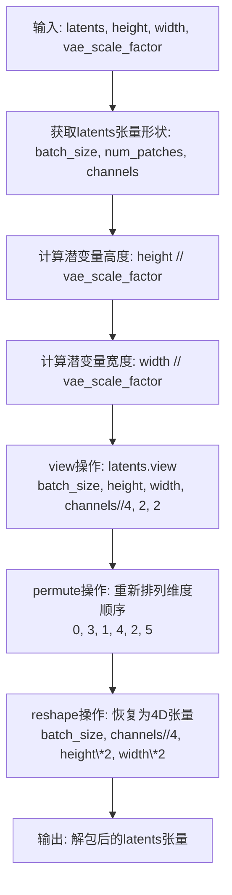

#### 带注释源码

```python
@staticmethod
def _unpack_latents(latents, height, width, vae_scale_factor):
    """
    将打包的潜变量解包回适合VAE解码的格式
    
    参数:
        latents: 打包后的潜变量张量，形状为 (batch_size, num_patches, channels)
        height: 输出图像的高度（像素）
        width: 输出图像的宽度（像素）
        vae_scale_factor: VAE的缩放因子（通常为16或8）
    
    返回:
        解包后的潜变量张量，形状为 (batch_size, channels//4, H, W)
    """
    # 获取输入张量的维度信息
    batch_size, num_patches, channels = latents.shape

    # 将像素坐标转换为潜变量坐标
    # VAE通常有8x或16x的压缩比，这里进行反向计算
    height = height // vae_scale_factor
    width = width // vae_scale_factor

    # 第一步：view操作
    # 将 (batch_size, height, width, channels//4, 2, 2) 的张量
    # 解释：channels // 4 是因为打包时将4个通道压缩为1个
    # 后面的 2, 2 是因为打包时将 2x2 的空间区域进行了压缩
    latents = latents.view(batch_size, height, width, channels // 4, 2, 2)

    # 第二步：permute操作
    # 重新排列维度顺序从 (0, 1, 2, 3, 4, 5) 变为 (0, 3, 1, 4, 2, 5)
    # 这会将通道维度提前，准备进行空间维度的重组
    latents = latents.permute(0, 3, 1, 4, 2, 5)

    # 第三步：reshape操作
    # 将6D张量恢复为4D张量
    # 通道数恢复为 channels // (2*2) = channels // 4
    # 空间维度恢复为 height * 2 和 width * 2（解压缩2x2的空间区域）
    latents = latents.reshape(batch_size, channels // (2 * 2), height * 2, width * 2)

    return latents
```


### `BriaPipeline._prepare_latent_image_ids`

该方法为潜在图像生成位置编码ID，通过创建包含行索引和列索引的三维坐标张量，使Transformer模型能够感知二维潜在图像的空间位置信息。

参数：

- `batch_size`：`int`，批处理大小，指定要生成的潜在图像ID数量
- `height`：`int`，潜在图像的高度（以补丁数为单位）
- `width`：`int`，潜在图像的宽度（以补丁数为单位）
- `device`：`torch.device`，生成张量应放置的目标设备
- `dtype`：`torch.dtype`，生成张量的目标数据类型

返回值：`torch.FloatTensor`，形状为 `(batch_size, height * width, 3)` 的位置编码张量，其中第三维包含 (0, row_index, col_index) 格式的坐标信息

#### 流程图

```mermaid
flowchart TD
    A[开始] --> B[创建零张量 shape: height x width x 3]
    B --> C[在第1通道填充行索引 torch.arange]
    C --> D[在第2通道填充列索引 torch.arange]
    D --> E[获取张量形状信息]
    E --> F[沿批次维度复制 batch_size 次]
    F --> G[重塑为 batch_size x (height*width) x 3]
    G --> H[移动到指定设备并转换数据类型]
    H --> I[返回位置编码张量]
```

#### 带注释源码

```python
@staticmethod
def _prepare_latent_image_ids(batch_size, height, width, device, dtype):
    """
    生成用于位置编码的潜在图像ID
    
    该方法创建一个三维坐标张量，用于在Transformer模型中编码
    潜在图像的空间位置信息。每个潜在图像补丁的位置用
    (0, row_index, col_index) 的形式表示。
    
    Args:
        batch_size: 批处理大小
        height: 潜在图像高度（补丁数）
        width: 潜在图像宽度（补丁数）
        device: 目标设备
        dtype: 目标数据类型
    
    Returns:
        形状为 (batch_size, height*width, 3) 的位置编码张量
    """
    
    # 步骤1: 创建初始零张量，形状为 (height, width, 3)
    # 第三维用于存储坐标 [placeholder, row, col]
    latent_image_ids = torch.zeros(height, width, 3)
    
    # 步骤2: 在第1通道（行索引）填充垂直位置信息
    # torch.arange(height) 生成 [0, 1, 2, ..., height-1]
    # [:, None] 将其转置为列向量，以便广播到整个宽度
    latent_image_ids[..., 1] = latent_image_ids[..., 1] + torch.arange(height)[:, None]
    
    # 步骤3: 在第2通道（列索引）填充水平位置信息
    # torch.arange(width) 生成 [0, 1, 2, ..., width-1]
    # [None, :] 将其转置为行向量，以便广播到整个高度
    latent_image_ids[..., 2] = latent_image_ids[..., 2] + torch.arange(width)[None, :]
    
    # 步骤4: 获取各维度大小用于后续重塑
    latent_image_id_height, latent_image_id_width, latent_image_id_channels = latent_image_ids.shape
    
    # 步骤5: 沿批次维度复制，扩展为 (batch_size, height, width, 3)
    latent_image_ids = latent_image_ids.repeat(batch_size, 1, 1, 1)
    
    # 步骤6: 重塑为二维形式 (batch_size, height*width, 3)
    # 将空间维度展平，便于Transformer处理
    latent_image_ids = latent_image_ids.reshape(
        batch_size, latent_image_id_height * latent_image_id_width, latent_image_id_channels
    )
    
    # 步骤7: 移动到目标设备并转换数据类型后返回
    return latent_image_ids.to(device=device, dtype=dtype)
```


### `BriaPipeline.__call__`

`BriaPipeline.__call__` 是该类的核心推理方法。它接收文本提示（prompt）和其他生成参数，经过编码文本、初始化潜在向量、调度器时间步准备、去噪循环（Transformer推理与噪声预测）、以及最终的VAE解码，生成与文本描述相符的图像。

参数：

- `prompt`：`str | list[str] | None`，用于指导图像生成的文本提示。如果未定义，则必须传入 `prompt_embeds`。
- `height`：`int | None`，生成图像的高度（像素），默认值为 `self.default_sample_size * self.vae_scale_factor`。
- `width`：`int | None`，生成图像的宽度（像素），默认值为 `self.default_sample_size * self.vae_scale_factor`。
- `num_inference_steps`：`int`，去噪步数。默认为 30。步数越多通常图像质量越高，但推理速度越慢。
- `timesteps`：`list[int] | None`，自定义去噪过程的时间步。如果未定义，将使用调度器的默认行为。必须按降序排列。
- `guidance_scale`：`float`，无分类器自由引导（Classifier-Free Guidance）的比例。默认为 5.0。值越大生成的图像与文本提示关联越紧密，但可能牺牲图像质量。
- `negative_prompt`：`str | list[str] | None`，不希望出现的提示词或 prompts，用于引导图像生成方向。
- `num_images_per_prompt`：`int | None`，每个提示词生成的图像数量。默认为 1。
- `generator`：`torch.Generator | list[torch.Generator] | None`，用于生成确定性随机潜在向量的 PyTorch 生成器。
- `latents`：`torch.FloatTensor | None`，预生成的噪声潜在向量，可用于通过不同的提示词微调生成结果。如果未提供，将使用提供的随机生成器采样生成。
- `prompt_embeds`：`torch.FloatTensor | None`，预生成的文本嵌入，可用于轻松调整文本输入（例如提示词加权）。
- `negative_prompt_embeds`：`torch.FloatTensor | None`，预生成的负面文本嵌入。
- `output_type`：`str | None`，生成图像的输出格式。默认为 `"pil"`（PIL.Image.Image），可选 `"np.array"` 或 `"latent"`。
- `return_dict`：`bool`，是否返回 `BriaPipelineOutput` 而不是普通元组。默认为 `True`。
- `attention_kwargs`：`dict[str, Any] | None`，可选的关键字参数字典，用于传递给 `AttentionProcessor`。
- `callback_on_step_end`：`Callable[[int, int], None] | None`，推理过程中每一步结束时调用的函数。
- `callback_on_step_end_tensor_inputs`：`list[str]`，回调函数接受的张量输入列表。默认为 `["latents"]`。
- `max_sequence_length`：`int`，与提示词配合使用的最大序列长度。默认为 128。
- `clip_value`：`None | float`，用于裁剪噪声预测值的阈值，防止数值不稳定。
- `normalize`：`bool`，是否对噪声预测进行归一化处理。

返回值：`BriaPipelineOutput` 或 `tuple`，如果 `return_dict` 为 `True`，返回包含生成图像列表的 `BriaPipelineOutput` 对象；否则返回元组（图像列表,）。

#### 流程图

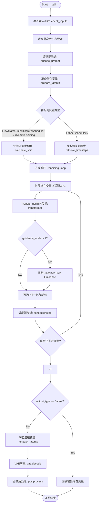

#### 带注释源码

```python
@torch.no_grad()
@replace_example_docstring(EXAMPLE_DOC_STRING)
def __call__(
    self,
    prompt: str | list[str] = None,
    height: int | None = None,
    width: int | None = None,
    num_inference_steps: int = 30,
    timesteps: list[int] = None,
    guidance_scale: float = 5,
    negative_prompt: str | list[str] | None = None,
    num_images_per_prompt: int | None = 1,
    generator: torch.Generator | list[torch.Generator] | None = None,
    latents: torch.FloatTensor | None = None,
    prompt_embeds: torch.FloatTensor | None = None,
    negative_prompt_embeds: torch.FloatTensor | None = None,
    output_type: str | None = "pil",
    return_dict: bool = True,
    attention_kwargs: dict[str, Any] | None = None,
    callback_on_step_end: Callable[[int, int], None] | None = None,
    callback_on_step_end_tensor_inputs: list[str] = ["latents"],
    max_sequence_length: int = 128,
    clip_value: None | float = None,
    normalize: bool = False,
):
    r"""
    Function invoked when calling the pipeline for generation.
    """
    # 1. Default parameters based on model config
    height = height or self.default_sample_size * self.vae_scale_factor
    width = width or self.default_sample_size * self.vae_scale_factor

    # 2. Check inputs. Raise error if not correct
    self.check_inputs(
        prompt=prompt,
        height=height,
        width=width,
        prompt_embeds=prompt_embeds,
        callback_on_step_end_tensor_inputs=callback_on_step_end_tensor_inputs,
        max_sequence_length=max_sequence_length,
    )

    # 3. Set global state variables
    self._guidance_scale = guidance_scale
    self.attention_kwargs = attention_kwargs
    self._interrupt = False

    # 4. Define call parameters (batch size)
    if prompt is not None and isinstance(prompt, str):
        batch_size = 1
    elif prompt is not None and isinstance(prompt, list):
        batch_size = len(prompt)
    else:
        batch_size = prompt_embeds.shape[0]

    device = self._execution_device

    # 5. Encode prompt
    lora_scale = self.attention_kwargs.get("scale", None) if self.attention_kwargs is not None else None

    (prompt_embeds, negative_prompt_embeds, text_ids) = self.encode_prompt(
        prompt=prompt,
        negative_prompt=negative_prompt,
        do_classifier_free_guidance=self.do_classifier_free_guidance,
        prompt_embeds=prompt_embeds,
        negative_prompt_embeds=negative_prompt_embeds,
        device=device,
        num_images_per_prompt=num_images_per_prompt,
        max_sequence_length=max_sequence_length,
        lora_scale=lora_scale,
    )

    # 6. Concatenate embeddings for CFG
    if self.do_classifier_free_guidance:
        prompt_embeds = torch.cat([negative_prompt_embeds, prompt_embeds], dim=0)

    # 7. Prepare latent variables
    num_channels_latents = self.transformer.config.in_channels // 4  # due to patch=2, we devide by 4
    latents, latent_image_ids = self.prepare_latents(
        batch_size * num_images_per_prompt,
        num_channels_latents,
        height,
        width,
        prompt_embeds.dtype,
        device,
        generator,
        latents,
    )

    # 8. Prepare timesteps
    if (
        isinstance(self.scheduler, FlowMatchEulerDiscreteScheduler)
        and self.scheduler.config["use_dynamic_shifting"]
    ):
        sigmas = np.linspace(1.0, 1 / num_inference_steps, num_inference_steps)
        image_seq_len = latents.shape[1]

        mu = calculate_shift(
            image_seq_len,
            self.scheduler.config.base_image_seq_len,
            self.scheduler.config.max_image_seq_len,
            self.scheduler.config.base_shift,
            self.scheduler.config.max_shift,
        )
        timesteps, num_inference_steps = retrieve_timesteps(
            self.scheduler,
            num_inference_steps,
            device,
            timesteps,
            sigmas,
            mu=mu,
        )
    else:
        # Sample from training sigmas for other schedulers
        if isinstance(self.scheduler, DDIMScheduler) or isinstance(
            self.scheduler, EulerAncestralDiscreteScheduler
        ):
            timesteps, num_inference_steps = retrieve_timesteps(
                self.scheduler, num_inference_steps, device, None, None
            )
        else:
            sigmas = get_original_sigmas(
                num_train_timesteps=self.scheduler.config.num_train_timesteps,
                num_inference_steps=num_inference_steps,
            )
            timesteps, num_inference_steps = retrieve_timesteps(
                self.scheduler, num_inference_steps, device, timesteps, sigmas=sigmas
            )

    num_warmup_steps = max(len(timesteps) - num_inference_steps * self.scheduler.order, 0)
    self._num_timesteps = len(timesteps)

    # Prepare IDs for transformer
    if len(latent_image_ids.shape) == 3:
        latent_image_ids = latent_image_ids[0]
    if len(text_ids.shape) == 3:
        text_ids = text_ids[0]

    # 9. Denoising loop
    with self.progress_bar(total=num_inference_steps) as progress_bar:
        for i, t in enumerate(timesteps):
            if self.interrupt:
                continue

            # expand the latents if we are doing classifier free guidance
            latent_model_input = torch.cat([latents] * 2) if self.do_classifier_free_guidance else latents
            
            # Scale model input for non-flow match schedulers
            if type(self.scheduler) != FlowMatchEulerDiscreteScheduler:
                latent_model_input = self.scheduler.scale_model_input(latent_model_input, t)

            # broadcast to batch dimension
            timestep = t.expand(latent_model_input.shape[0])

            # Predict noise
            noise_pred = self.transformer(
                hidden_states=latent_model_input,
                timestep=timestep,
                encoder_hidden_states=prompt_embeds,
                attention_kwargs=self.attention_kwargs,
                return_dict=False,
                txt_ids=text_ids,
                img_ids=latent_image_ids,
            )[0]

            # perform guidance
            if self.do_classifier_free_guidance:
                noise_pred_uncond, noise_pred_text = noise_pred.chunk(2)
                cfg_noise_pred_text = noise_pred_text.std()
                noise_pred = noise_pred_uncond + self.guidance_scale * (noise_pred_text - noise_pred_uncond)

            if normalize:
                noise_pred = noise_pred * (0.7 * (cfg_noise_pred_text / noise_pred.std())) + 0.3 * noise_pred

            if clip_value:
                assert clip_value > 0
                noise_pred = noise_pred.clip(-clip_value, clip_value)

            # compute the previous noisy sample x_t -> x_t-1
            latents_dtype = latents.dtype
            latents = self.scheduler.step(noise_pred, t, latents, return_dict=False)[0]

            # Check dtype consistency for MPS
            if latents.dtype != latents_dtype:
                if torch.backends.mps.is_available():
                    latents = latents.to(latents_dtype)

            # Callback handling
            if callback_on_step_end is not None:
                callback_kwargs = {}
                for k in callback_on_step_end_tensor_inputs:
                    callback_kwargs[k] = locals()[k]
                callback_outputs = callback_on_step_end(self, i, t, callback_kwargs)

                latents = callback_outputs.pop("latents", latents)
                prompt_embeds = callback_outputs.pop("prompt_embeds", prompt_embeds)
                negative_prompt_embeds = callback_outputs.pop("negative_prompt_embeds", negative_prompt_embeds)

            # Progress bar update
            if i == len(timesteps) - 1 or ((i + 1) > num_warmup_steps and (i + 1) % self.scheduler.order == 0):
                progress_bar.update()

            if XLA_AVAILABLE:
                xm.mark_step()

    # 10. Decode latents to image
    if output_type == "latent":
        image = latents
    else:
        latents = self._unpack_latents(latents, height, width, self.vae_scale_factor)
        latents = (latents.to(dtype=torch.float32) / self.vae.config.scaling_factor) + self.vae.config.shift_factor
        image = self.vae.decode(latents.to(dtype=self.vae.dtype), return_dict=False)[0]
        image = self.image_processor.postprocess(image, output_type=output_type)

    # 11. Offload all models
    self.maybe_free_model_hooks()

    if not return_dict:
        return (image,)

    return BriaPipelineOutput(images=image)
```


### `BriaPipeline.guidance_scale`

获取引导系数属性，用于控制分类器无引导（Classifier-Free Guidance）的强度。该属性返回内部存储的 `_guidance_scale` 值，该值在调用 pipeline 生成图像时通过 `__call__` 方法的 `guidance_scale` 参数设置。

参数：无（属性 getter）

返回值：`float`，返回当前使用的引导系数值，用于控制文本提示对图像生成的影响程度。

#### 流程图

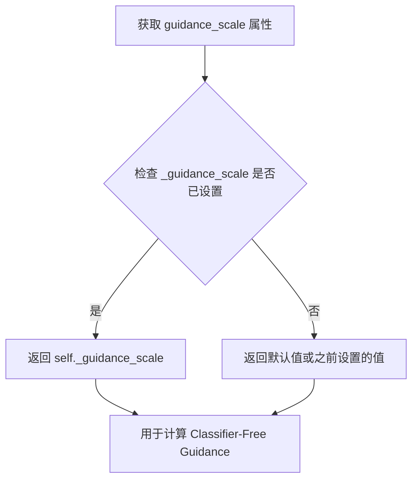

#### 带注释源码

```python
@property
def guidance_scale(self):
    """
    获取引导系数属性。
    
    guidance_scale 定义在 Imagen 论文方程 (2) 中，类似于引导权重 w。
    guidance_scale = 1 表示不执行分类器无引导。
    较高的 guidance_scale 值会促使生成的图像更紧密地关联文本提示，
    通常以较低的图像质量为代价。
    
    Returns:
        float: 当前配置的引导系数值。该值在 __call__ 方法中被设置，
               默认值为 5.0。
    """
    return self._guidance_scale
```

#### 相关上下文说明

该属性与 `do_classifier_free_guidance` 属性配合使用：

```python
# 在 __call__ 方法中设置
self._guidance_scale = guidance_scale  # 默认值为 5

# do_classifier_free_guidance 属性依赖于 guidance_scale
@property
def do_classifier_free_guidance(self):
    return self._guidance_scale > 1
```

在去噪循环中的使用：

```python
# 执行分类器无引导
if self.do_classifier_free_guidance:
    noise_pred_uncond, noise_pred_text = noise_pred.chunk(2)
    cfg_noise_pred_text = noise_pred_text.std()
    noise_pred = noise_pred_uncond + self.guidance_scale * (noise_pred_text - noise_pred_uncond)
```


### `BriaPipeline.do_classifier_free_guidance`

该属性用于判断当前是否启用无分类器引导（Classifier-Free Guidance, CFG）。该属性通过检查 `guidance_scale` 参数是否大于 1 来决定是否启用 CFG 模式。当 `guidance_scale > 1` 时，模型会在生成过程中同时考虑正向和负向提示词，从而引导生成更符合文本描述的图像。

参数：该属性为只读属性，无需传入参数。

返回值：`bool`，返回 `True` 表示启用无分类器引导；返回 `False` 表示禁用无分类器引导。

#### 流程图

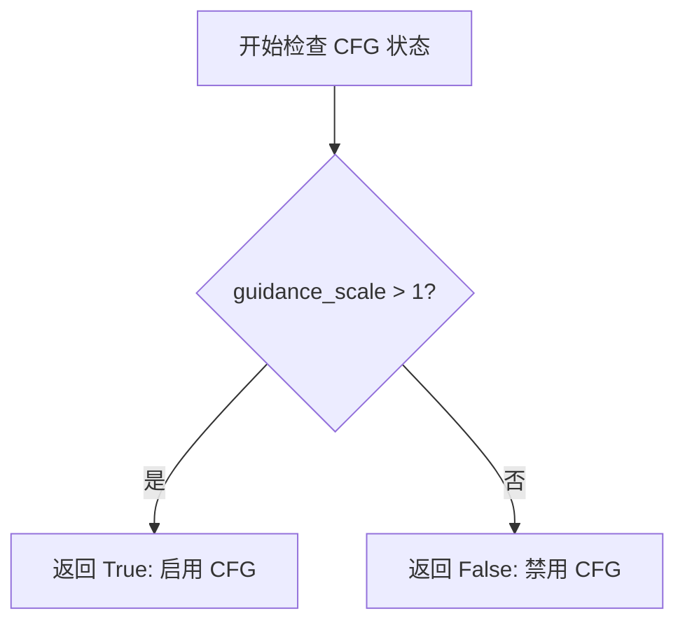

#### 带注释源码

```python
@property
def do_classifier_free_guidance(self):
    """
    Property to determine whether classifier-free guidance is enabled.
    
    Classifier-free guidance (CFG) is a technique used in diffusion models
    to improve the quality of generated images by considering both the prompt
    and a negative prompt during the denoising process.
    
    Returns:
        bool: True if guidance_scale > 1, False otherwise.
              When guidance_scale is 1 or less, CFG is disabled as it would
              not provide any meaningful guidance benefit.
    """
    return self._guidance_scale > 1
```


### `BriaPipeline.attention_kwargs`

获取或设置注意力参数（attention_kwargs），该参数用于在去噪过程中将额外的关键字参数传递给transformer模型的注意力处理器（AttentionProcessor），以支持自定义注意力行为或LoRA等模块的集成。

#### 参数

**对于Setter：**

- `value`：`dict[str, Any] | None`，需要设置的注意力参数字典，包含如`scale`（LoRA权重）等键值对，可以为`None`表示清除之前设置的参数

**对于Getter：**

- （无参数）

#### 返回值

- 对于Getter：`dict[str, Any] | None`，当前保存的注意力参数字典，可能为`None`

#### 流程图

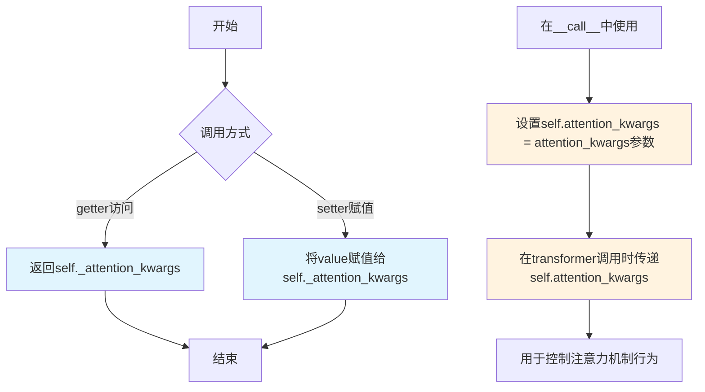

#### 带注释源码

```python
@property
def attention_kwargs(self):
    """
    获取当前的注意力参数。
    
    Returns:
        dict[str, Any] | None: 包含注意力处理额外参数的字典，例如可能包含
        LoRA的scale参数等。返回None表示未设置任何参数。
    """
    return self._attention_kwargs


@attention_kwargs.setter
def attention_kwargs(self, value):
    """
    设置注意力参数，用于控制transformer中注意力处理器的行为。
    
    Args:
        value (dict[str, Any] | None): 注意力参数字典，通常包含以下键：
            - 'scale' (float, optional): LoRA适配器的权重缩放因子
            - 其他自定义键值对，会传递给AttentionProcessor
            若传入None，则清除之前设置的参数
    """
    self._attention_kwargs = value
```

#### 实际使用示例

在`__call__`方法中的使用流程：

```python
# 1. 从外部接收attention_kwargs参数
def __call__(
    self,
    # ... 其他参数 ...
    attention_kwargs: dict[str, Any] | None = None,
    # ...
):
    # 2. 设置到实例属性
    self.attention_kwargs = attention_kwargs
    
    # 3. 提取可能的lora_scale用于后续处理
    lora_scale = self.attention_kwargs.get("scale", None) if self.attention_kwargs is not None else None
    
    # 4. 在去噪循环中传递给transformer
    noise_pred = self.transformer(
        hidden_states=latent_model_input,
        timestep=timestep,
        encoder_hidden_states=prompt_embeds,
        attention_kwargs=self.attention_kwargs,  # 传递注意力参数
        return_dict=False,
        txt_ids=text_ids,
        img_ids=latent_image_ids,
    )[0]
```


### `BriaPipeline.num_timesteps`

获取当前pipeline的时间步数（即推理过程中的去噪步骤数量）。该属性返回在调用pipeline生成图像时设置的去噪步骤总数。

参数：无参数（这是一个属性访问器）

返回值：`int`，表示去噪推理过程中的时间步数（即`num_inference_steps`的值）

#### 流程图

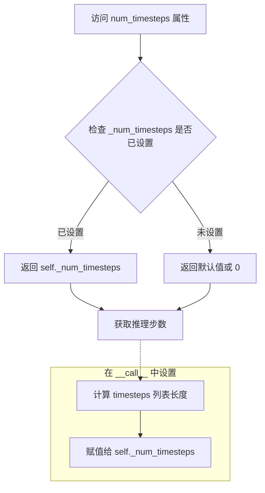

#### 带注释源码

```python
@property
def num_timesteps(self):
    """
    属性访问器：获取当前pipeline的时间步数
    
    该属性返回在调用pipeline生成图像时设置的去噪步骤总数。
    _num_timesteps 通常在 __call__ 方法中被设置为 len(timesteps)，
    即推理过程中实际使用的时间步数。
    
    Returns:
        int: 去噪推理过程中的时间步数
    """
    return self._num_timesteps
```

#### 相关上下文代码（设置位置）

在 `__call__` 方法中，`_num_timesteps` 的设置位置：

```python
# 在去噪循环之前设置时间步数
num_warmup_steps = max(len(timesteps) - num_inference_steps * self.scheduler.order, 0)
self._num_timesteps = len(timesteps)  # 设置时间步数属性
```

#### 使用说明

- 该属性是只读的，没有setter
- 用于外部代码查询当前pipeline配置的推理步数
- 常用于进度条显示或调试信息输出


### `BriaPipeline.interrupt`

获取 BriaPipeline 的中断状态，用于控制去噪循环是否被中断。

参数： 无

返回值：`bool`，返回当前的中断状态。当为 `True` 时，表示请求中断去噪过程；为 `False` 时，表示继续正常执行。

#### 流程图

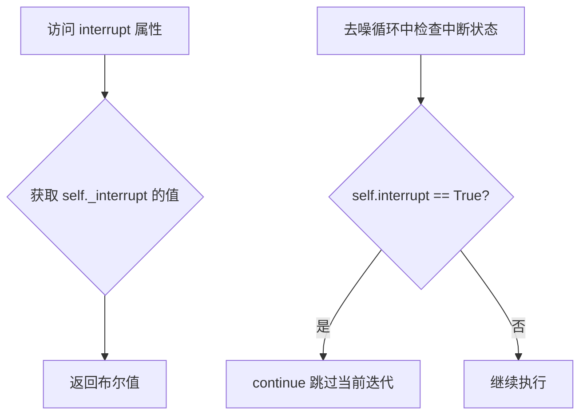

#### 带注释源码

```python
@property
def interrupt(self):
    """
    属性 getter：获取中断状态
    
    说明：
        - 该属性返回 self._interrupt 的值，用于控制去噪循环是否应该中断
        - 在 __call__ 方法开始时，self._interrupt 被初始化为 False
        - 外部可以通过设置 pipeline._interrupt = True 来请求中断生成过程
        - 在去噪循环中通过 if self.interrupt: continue 检查中断状态
    
    返回:
        bool: 中断状态。True 表示请求中断，False 表示继续执行
    """
    return self._interrupt
```

## 关键组件


### 张量索引与惰性加载

在`_get_t5_prompt_embeds`方法中，通过`torch.concat`将prompt embeddings与零padding进行拼接以达到固定长度；在`prepare_latents`中使用`_pack_latents`将latents打包成2x2块，以及使用`_prepare_latent_image_ids`生成空间位置编码用于transformer的注意力计算。

### 反量化支持

在`__call__`方法的最后阶段，latents通过`_unpack_latents`解包后，进行反量化处理：先将latents转换为float32，然后除以`scaling_factor`并加上`shift_factor`恢复到标准范围，最后送入VAE的decode过程。

### 量化策略

代码在文档字符串中明确指定了量化策略：T5文本编码器需要使用bfloat16精度且最后一层保持float32；VAE因不支持混合精度需强制使用float32；transformer则使用其自身配置的dtype。

### 条件扩散模型

BriaPipeline继承自DiffusionPipeline，基于FluxPipeline架构进行定制化修改，去除了pooled embeddings、采用零padding处理prompt、不使用guidance embedding，构成了完整的文本到图像生成管道。

### 调度器支持

支持多种调度器包括FlowMatchEulerDiscreteScheduler、DDIMScheduler、EulerAncestralDiscreteScheduler和KarrasDiffusionSchedulers，并针对不同调度器实现了动态sigma计算和timestep检索逻辑。


## 问题及建议


### 已知问题

-   **未解决的合并冲突标记**：代码中存在 `<<<<<<< HEAD`、`=======`、`>>>>>>> main` 等未解决的合并冲突标记，会导致代码无法正常运行或产生意外行为。
-   **文档字符串重复**：在 `__call__` 方法中，`guidance_scale` 和 `negative_prompt` 参数的文档说明被重复编写，代码注释编号也存在跳跃（直接跳到第5步和第6步）。
-   **硬编码的魔法数字**：代码中使用了多个未解释的魔法数字，如 `default_sample_size = 64`、`0.7` 和 `0.3`（用于 normalize 操作），以及 `num_channels_latents = self.transformer.config.in_channels // 4`。
-   **参数文档不完整**：`clip_value` 和 `normalize` 参数在文档中没有充分说明其用途和行为，特别是 `normalize` 参数的功能实现与文档描述不匹配。
-   **命名不清晰**：`is_ng_none` 函数名中 `ng` 的含义不明确，应该是 `negative_prompt` 相关的检查但命名过于简洁。
-   **类型检查可以更严格**：`encode_prompt` 中对 `prompt` 和 `negative_prompt` 的类型检查逻辑复杂且容易混淆，可以使用更清晰的类型注解和检查方式。

### 优化建议

-   **清理合并冲突**：立即解决代码中的合并冲突标记，保留正确的代码版本。
-   **修复文档字符串**：删除重复的文档内容，修正注释编号使其连续，并补充缺失的参数说明。
-   **提取魔法数字**：将硬编码的数值定义为类常量或配置参数，提供有意义的命名，如 `DEFAULT_SAMPLE_SIZE`、`NORMALIZE_WEIGHT_COEFF` 等。
-   **完善参数文档**：为 `clip_value` 和 `normalize` 参数添加详细的文档说明，解释其作用、取值范围和影响。
-   **重命名函数**：`is_ng_none` 可重命名为 `is_negative_prompt_none` 以提高可读性。
-   **简化类型检查**：重构 `encode_prompt` 中的类型检查逻辑，使用更清晰的条件分支和提前返回模式。
-   **性能优化**：在 `_get_t5_prompt_embeds` 中预先分配内存而不是在循环中多次使用 `torch.concat`，减少内存碎片和计算开销。
-   **添加类型注解一致性**：统一使用 Python 3.10+ 的联合类型语法或 `typing.Union`，避免混用。

## 其它


### 设计目标与约束

本Pipeline基于FluxPipeline架构，旨在实现文本到图像的高质量生成。核心约束包括：1) T5文本编码器对精度敏感，需使用bfloat16并在最后一层保持float32；2) VAE不支持混合精度计算，必须使用float32；3) 支持最大序列长度为512；4) 输出图像尺寸必须能被vae_scale_factor * 2整除；5) 仅支持分类器自由引导(CFG)模式，不支持蒸馏版本的引导嵌入。

### 错误处理与异常设计

代码实现了多层次的错误检查：1) `check_inputs`方法验证输入参数合法性，包括图像尺寸、提示词类型、嵌入维度匹配性；2) 负提示词与提示词类型一致性检查；3) 生成器列表长度与批大小匹配验证；4) `is_ng_none`函数处理负提示词的多种空值形式；5) 序列长度超过512时抛出ValueError；6) 回调张量输入必须在允许列表中；7) XLA设备可用性检查与优雅降级。

### 数据流与状态机

Pipeline执行流程分为以下状态：1) 初始化状态：加载模型组件(VAE、文本编码器、Transformer、调度器)；2) 输入验证状态：检查提示词、尺寸、参数合法性；3) 提示词编码状态：将文本转换为T5嵌入，填充至最大长度；4) 潜在变量准备状态：初始化随机潜在变量或使用提供的潜在变量；5) 时间步计算状态：根据调度器类型计算推理时间步；6) 去噪循环状态：迭代执行UNet预测、CFG处理、调度器步进；7) VAE解码状态：将潜在变量解码为图像；8) 后处理状态：图像格式转换与后处理；9) 资源释放状态：模型卸载与钩子清理。

### 外部依赖与接口契约

主要依赖包括：1) `transformers`库提供T5EncoderModel和CLIPVisionModelWithProjection；2) `diffusers`库提供调度器(AutoencoderKL、FlowMatchEulerDiscreteScheduler等)；3) `numpy`用于sigma计算；4) `torch`用于张量操作；5) 可选的`torch_xla`用于TPU加速。接口契约方面：`__call__`方法接受提示词、尺寸、推理步数、引导 scale等参数，返回BriaPipelineOutput或元组；encode_prompt返回提示词嵌入、负嵌入和文本IDs；prepare_latents返回打包的潜在变量和图像IDs。

### 配置参数详解

关键配置参数包括：1) `vae_scale_factor`：从VAE块输出通道数计算，默认为16；2) `default_sample_size`：默认64，对应1K分辨率输出；3) `model_cpu_offload_seq`：模型卸载顺序为text_encoder->text_encoder_2->image_encoder->transformer->vae；4) `_optional_components`：可选组件包括image_encoder和feature_extractor；5) `_callback_tensor_inputs`：支持latents和prompt_embeds作为回调输入；6) `max_sequence_length`：T5编码器的最大序列长度，默认为128。

### 性能优化策略

代码包含以下性能优化：1) 混合精度支持：文本编码器使用bfloat16，VAE使用float32；2) 模型卸载：使用model_cpu_offload_seq进行顺序卸载；3) XLA支持：可选的torch_xla用于TPU加速；4) LoRA动态缩放：支持PEFT后端的LoRA层动态调整；5) 潜在变量打包：`_pack_latents`方法将4D潜在变量打包为2D以提高计算效率；6) Apple MPS兼容性：处理MPS平台的类型转换问题；7) 批量生成：支持num_images_per_prompt参数进行批量图像生成。

### 安全性考虑

安全相关设计包括：1) 输入验证：检查提示词类型和长度；2) 梯度禁用：使用@torch.no_grad()装饰器确保推理时不计算梯度；3) 设备限制：强制使用_execution_device；4) 潜在变量设备转移：确保潜在变量在正确设备上；5) 中间精度保持：在MPS平台上保持原始精度避免计算错误；6) 回调安全：回调函数返回值的安全提取与类型检查。

### 兼容性说明

版本兼容性方面：1) 调度器兼容性：支持FlowMatchEulerDiscreteScheduler、DDIMScheduler、EulerAncestralDiscreteScheduler和KarrasDiffusionSchedulers；2) 动态shift支持：FlowMatchEulerDiscreteScheduler的use_dynamic_shifting配置；3) 设备兼容性：支持CPU、CUDA、MPS和TPU(XLA)；4) Python版本：需要Python 3.8+；5) PyTorch版本：需要PyTorch 2.0+；6) 依赖库版本：transformers、diffusers需兼容版本。

### 使用注意事项

关键使用注意点：1) 必须将text_encoder转为bfloat16且最后一层保持float32；2) 当vae.config.shift_factor==0时需将VAE转为float32；3) 提示词超过max_sequence_length会被截断；4) 输出类型支持"pil"和"latent"；5) 支持通过attention_kwargs传递注意力处理器参数；6) 支持callback_on_step_end进行每步回调；7) 支持通过latents参数进行潜在变量注入实现图像到图像转换。

### 扩展性设计

代码设计支持以下扩展：1) LoRA支持：通过FluxLoraLoaderMixin集成LoRA加载能力；2) 可选组件：image_encoder和feature_extractor作为可选组件；3) 自定义调度器：支持任意实现了set_timesteps方法的调度器；4) 注意力处理器：通过attention_kwargs传递自定义注意力参数；5) 回调机制：支持每步结束时的自定义回调函数；6) 输出扩展：BriaPipelineOutput类可扩展包含额外输出信息。

### 资源管理

资源管理策略包括：1) 初始化时注册模块：使用register_modules统一管理组件生命周期；2) 自动设备分配：使用_execution_device自动确定执行设备；3) 梯度管理：推理时禁用梯度计算；4) 模型卸载：maybe_free_model_hooks在推理结束后释放模型内存；5) XLA步标记：xm.mark_step()用于XLA设备的同步；6) 生成器管理：支持单个或多个随机生成器确保可复现性。
    