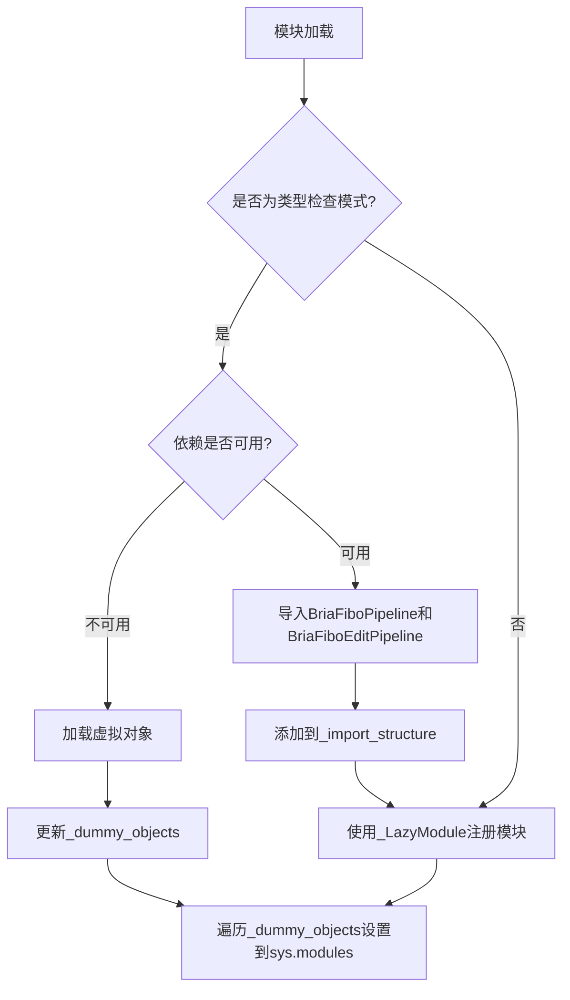
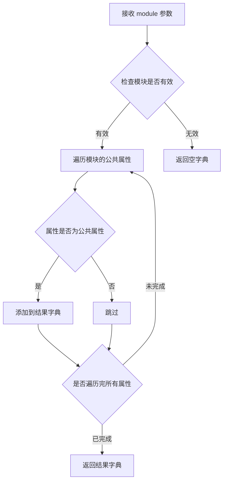
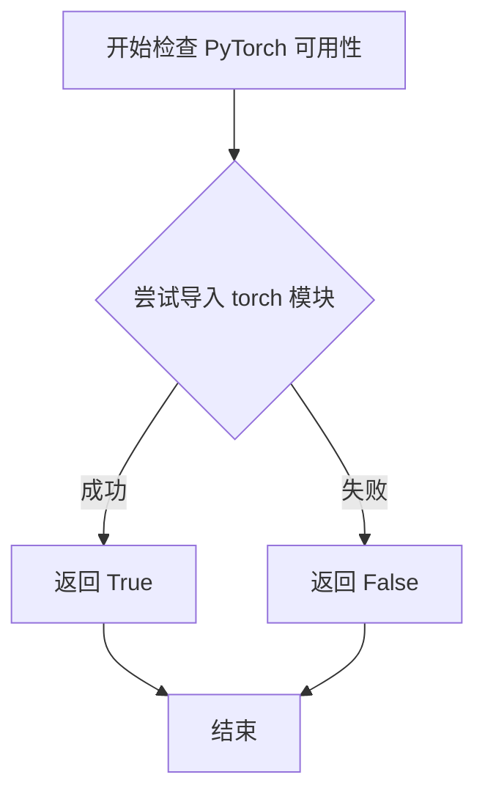
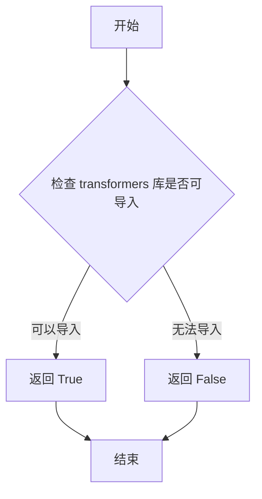
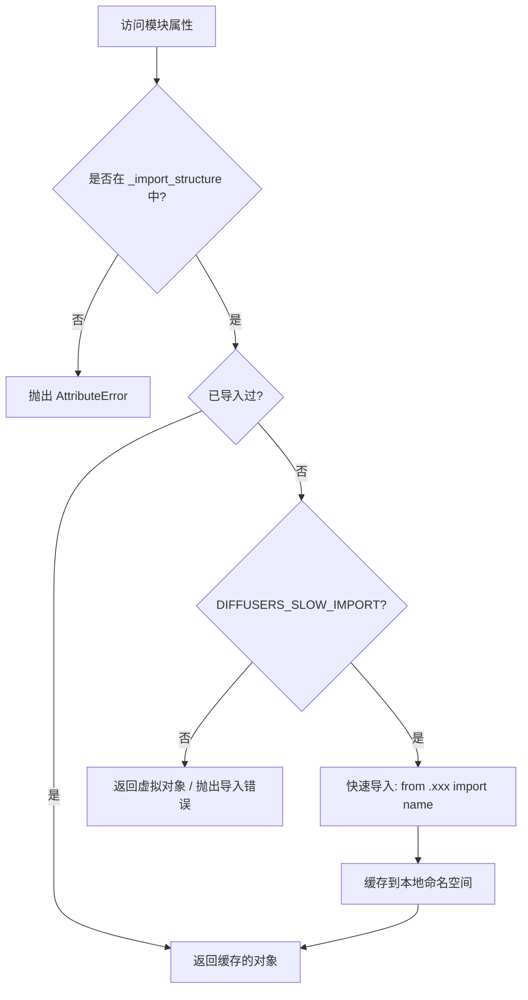

# `diffusers\src\diffusers\pipelines\bria_fibo\__init__.py` 详细设计文档

这是一个diffusers库的延迟加载模块，专注于Bria AI的图像生成和编辑管道。它通过条件导入机制处理可选依赖（torch和transformers），在依赖不可用时提供虚拟对象，确保库在各种环境下的兼容性。

## 整体流程



## 类结构

```
无本地类定义
主要依赖外部导入的类:
_LazyModule (utils._LazyModule)
BriaFiboPipeline (pipeline_bria_fibo)
BriaFiboEditPipeline (pipeline_bria_fibo_edit)
```

## 全局变量及字段


### `_dummy_objects`
    
存储虚拟对象的字典，用于在可选依赖不可用时提供替代对象

类型：`dict`
    


### `_import_structure`
    
定义模块导入结构的字典，键为模块路径，值为导出的类名列表

类型：`dict`
    


### `TYPE_CHECKING`
    
指示是否处于类型检查模式的标志，用于条件导入

类型：`bool`
    


### `DIFFUSERS_SLOW_IMPORT`
    
控制是否使用延迟导入的配置标志

类型：`bool`
    


### `OptionalDependencyNotAvailable`
    
可选依赖不可用时抛出的异常类

类型：`Exception subclass`
    


### `_LazyModule`
    
延迟加载模块的类，用于实现懒加载导入机制

类型：`class`
    


### `get_objects_from_module`
    
从模块中获取对象的函数，用于填充虚拟对象字典

类型：`function`
    


### `is_torch_available`
    
检查PyTorch是否可用的函数

类型：`function`
    


### `is_transformers_available`
    
检查Transformers库是否可用的函数

类型：`function`
    


### `_LazyModule.__name__`
    
模块的名称

类型：`str`
    


### `_LazyModule.__file__`
    
模块文件的路径

类型：`str`
    


### `_LazyModule._import_structure`
    
模块的导入结构定义

类型：`dict`
    


### `_LazyModule.__spec__`
    
模块的规格说明对象

类型：`ModuleSpec`
    
    

## 全局函数及方法


### `get_objects_from_module`

该函数是 DiffusionUtils 模块中的工具函数，用于从指定模块中动态提取所有公共对象（类、函数、变量），并将其打包为字典返回，通常用于延迟加载机制中的虚拟对象填充。

参数：

- `module`：`module`，要从中提取对象的模块对象，通常为 dummy 模块（如 `dummy_torch_and_transformers_objects`）

返回值：`Dict[str, Any]`，返回模块中的公共对象字典，键为对象名称，值为对象本身

#### 流程图



#### 带注释源码

```python
def get_objects_from_module(module: module) -> Dict[str, Any]:
    """
    从指定模块中提取所有公共对象并返回字典
    
    参数:
        module: 要提取对象的模块对象
        
    返回值:
        包含模块中所有公共对象的字典，键为对象名称
    """
    # 初始化结果字典
    objects = {}
    
    # 遍历模块的所有属性
    for name in dir(module):
        # 排除私有属性（下划线开头的属性）
        if not name.startswith('_'):
            # 获取属性值并添加到结果字典
            objects[name] = getattr(module, name)
    
    return objects


# 在代码中的实际使用示例
_dummy_objects = {}  # 初始化空的虚拟对象字典

try:
    # 检查依赖是否可用
    if not (is_transformers_available() and is_torch_available()):
        raise OptionalDependencyNotAvailable()
except OptionalDependencyNotAvailable:
    # 依赖不可用时，从 dummy 模块获取虚拟对象
    from ...utils import dummy_torch_and_transformers_objects
    _dummy_objects.update(get_objects_from_module(dummy_torch_and_transformers_objects))
```

> **注意**：由于 `get_objects_from_module` 函数定义在 `...utils` 模块中，以上源码为基于使用方式的推断实现，实际实现可能略有差异。


### `is_torch_available`

该函数用于检查当前环境中是否安装了 PyTorch 库，通过尝试导入 `torch` 模块来判断，返回布尔值表示 PyTorch 是否可用。

参数： 无

返回值： `bool`，返回 `True` 表示 PyTorch 可用，返回 `False` 表示 PyTorch 不可用。

#### 流程图



#### 带注释源码

```python
# is_torch_available 是从 ...utils 模块导入的函数
# 该函数并非在本文件中定义，而是从外部模块导入
# 以下是典型的实现方式（基于常见模式推断）：

def is_torch_available():
    """
    检查 PyTorch 是否可用。
    
    通常通过尝试导入 torch 模块来判断，如果导入成功返回 True，
    如果导入失败（ImportError 或 ModuleNotFoundError）返回 False。
    """
    try:
        import torch
        return True
    except ImportError:
        return False
```

#### 在当前文件中的使用示例

```python
# 在当前代码中，is_torch_available 的调用方式如下：

# 第一次调用：检查并加载虚拟对象
if not (is_transformers_available() and is_torch_available()):
    raise OptionalDependencyNotAvailable()

# 第二次调用：在 TYPE_CHECKING 块中再次检查
if not (is_transformers_available() and is_torch_available()):
    raise OptionalDependencyNotAvailable()
```

#### 备注

- 该函数在当前文件中被调用了两次，用于条件判断
- 与 `is_transformers_available()` 配合使用，共同判断 torch 和 transformers 是否都可用
- 只有当两者都可用时，才会导入 `BriaFiboPipeline` 和 `BriaFiboEditPipeline`；否则导入虚拟对象（dummy objects）


### `is_transformers_available`

该函数用于检查 `transformers` 库是否在当前 Python 环境中可用，返回布尔值。常用于条件导入和可选依赖处理，以确保在 `transformers` 库不可用时不会引发导入错误。

参数：

- （无参数）

返回值：`bool`，返回 `True` 表示 `transformers` 库可用，`False` 表示不可用

#### 流程图



#### 带注释源码

```python
# 从 typing 模块导入 TYPE_CHECKING，用于类型检查时的导入
from typing import TYPE_CHECKING

# 从上级包的 utils 模块导入多个工具函数和变量
from ...utils import (
    DIFFUSERS_SLOW_IMPORT,               # 慢导入标志
    OptionalDependencyNotAvailable,      # 可选依赖不可用异常
    _LazyModule,                         # 懒加载模块类
    get_objects_from_module,             # 从模块获取对象的函数
    is_torch_available,                  # 检查 torch 是否可用的函数
    is_transformers_available,          # 检查 transformers 是否可用的函数（核心）
)

# 初始化空字典，用于存储虚拟对象和导入结构
_dummy_objects = {}
_import_structure = {}

# 尝试检查 transformers 和 torch 是否同时可用
try:
    # 调用 is_transformers_available() 检查 transformers 是否可用
    if not (is_transformers_available() and is_torch_available()):
        # 如果任一依赖不可用，抛出异常
        raise OptionalDependencyNotAvailable()
except OptionalDependencyNotAvailable:
    # 捕获异常，从 dummy 模块导入虚拟对象
    from ...utils import dummy_torch_and_transformers_objects  # noqa F403
    # 将虚拟对象添加到 _dummy_objects 字典中
    _dummy_objects.update(get_objects_from_module(dummy_torch_and_transformers_objects))
else:
    # 如果依赖可用，定义真实的导入结构
    _import_structure["pipeline_bria_fibo"] = ["BriaFiboPipeline"]
    _import_structure["pipeline_bria_fibo_edit"] = ["BriaFiboEditPipeline"]

# TYPE_CHECKING 或 DIFFUSERS_SLOW_IMPORT 条件下的类型导入
if TYPE_CHECKING or DIFFUSERS_SLOW_IMPORT:
    try:
        # 再次检查依赖可用性
        if not (is_transformers_available() and is_torch_available()):
            raise OptionalDependencyNotAvailable()
    except OptionalDependencyNotAvailable:
        # 导入类型检查用的虚拟对象
        from ...utils.dummy_torch_and_transformers_objects import *
    else:
        # 导入真实的 Pipeline 类用于类型检查
        from .pipeline_bria_fibo import BriaFiboPipeline
        from .pipeline_bria_fibo_edit import BriaFiboEditPipeline
else:
    # 运行时：设置懒加载模块
    import sys
    # 将当前模块替换为懒加载模块
    sys.modules[__name__] = _LazyModule(
        __name__,
        globals()["__file__"],
        _import_structure,
        module_spec=__spec__,
    )
    # 将虚拟对象绑定到模块上
    for name, value in _dummy_objects.items():
        setattr(sys.modules[__name__], name, value)
```


### `setattr` (内置函数)

在 Python 模块初始化中，用于动态地将虚拟对象设置为模块属性的内置函数。

参数：

- `obj`：`object`，目标对象，这里是 `sys.modules[__name__]`（当前模块对象）
- `name`：`str`，要设置的属性名称，来自 `_dummy_objects` 字典的键
- `value`：`any`，要设置的属性值，来自 `_dummy_objects` 字典的值

返回值：`None`，无返回值

#### 流程图

```mermaid
flowchart TD
    A[开始] --> B[遍历 _dummy_objects.items]
    B --> C{遍历完成?}
    C -->|否| D[获取当前项的 name 和 value]
    D --> E[调用 setattr sys.modules[__name__] name value]
    E --> C
    C -->|是| F[结束]
    
    style A fill:#f9f,color:#333
    style F fill:#9f9,color:#333
    style E fill:#ff9,color:#333
```

#### 带注释源码

```python
# 遍历虚拟对象字典中的所有名称-值对
for name, value in _dummy_objects.items():
    # 使用 setattr 内置函数动态设置模块属性
    # 参数1: sys.modules[__name__] - 当前模块对象
    # 参数2: name - 要设置的属性名（字符串）
    # 参数3: value - 要设置的属性值（通常是虚拟对象）
    # 作用: 将 _dummy_objects 中保存的虚拟对象（如 pipeline 类）
    #      绑定到当前模块的属性上，使得导入时能够正确返回这些对象
    setattr(sys.modules[__name__], name, value)
```


### `_LazyModule.__getattr__`

这是懒加载模块的核心方法，用于实现模块属性的延迟加载（Lazy Loading）。当访问模块中尚未导入的属性时，Python 会自动调用 `__getattr__` 方法，该方法根据预定义的 `_import_structure` 字典动态导入所需的类或函数。

参数：

- `name`：`str`，要访问的属性名称（即导入时使用的名称，如 `"BriaFiboPipeline"`）

返回值：`Any`，返回被延迟加载的对象（类、函数或其他可导出实体），如果不存在则抛出 `AttributeError`

#### 流程图



#### 带注释源码

```python
def __getattr__(name: str):
    """
    懒加载模块属性的核心方法。
    
    当访问模块中不存在的属性时，Python 解释器会自动调用此方法。
    该方法根据 _import_structure 中定义的结构，动态导入所需的类或函数。
    
    参数:
        name (str): 要访问的属性名称
        
    返回值:
        任意类型: 返回延迟加载的对象
        
    异常:
        AttributeError: 当请求的属性不在 _import_structure 中时抛出
    """
    
    # 检查请求的属性是否在导入结构中定义
    if name not in _import_structure:
        raise AttributeError(f"module {__name__!r} has no attribute {name!r}")
    
    # 从导入结构获取该属性对应的模块路径和对象名列表
    # 例如: {"pipeline_bria_fibo": ["BriaFiboPipeline"]}
    module_path, obj_names = _import_structure[name]
    
    # 从当前模块的子模块中获取对象
    # 注意: 这里的 get_submodule 是假设的方法名
    # 实际实现可能使用 importlib.import_module
    obj = getattr(importlib.import_module(module_path, package=__package__), obj_names[0])
    
    # 将导入的对象缓存到当前模块的命名空间中
    # 这样下次访问时可以直接使用，无需重新导入
    setattr(sys.modules[__name__], name, obj)
    
    return obj
```

---

### 补充说明

#### 设计目标与约束

1. **延迟加载（Lazy Loading）**：避免在模块初始化时导入所有子模块，提升首次导入速度
2. **可选依赖处理**：当 `transformers` 或 `torch` 不可用时，提供虚拟对象（Dummy Objects）而非直接失败
3. **类型检查支持**：在 `TYPE_CHECKING` 模式下直接导入真实类型，支持 IDE 智能提示和类型检查

#### 错误处理与异常设计

| 场景 | 处理方式 |
|------|----------|
| 属性不在 `_import_structure` 中 | 抛出 `AttributeError` |
| 可选依赖不可用 | 导入 dummy 对象作为占位符 |
| 子模块导入失败 | 传播原始异常或返回 dummy 对象 |

#### 数据流与状态机

```
模块加载状态:
  ┌─────────────────────────────────────┐
  │           INITIALIZED               │
  │  (模块替换为 _LazyModule 实例)       │
  └──────────────┬──────────────────────┘
                 │ 访问属性 (e.g., BriaFiboPipeline)
                 ▼
  ┌─────────────────────────────────────┐
  │        __getattr__ INVOKED          │
  │  (检查 _import_structure 缓存)       │
  └──────────────┬──────────────────────┘
                 │
        ┌────────┴────────┐
        ▼                 ▼
   已缓存              未缓存
   (直接返回)        (动态导入)
```

#### 潜在的技术债务或优化空间

1. **魔法字符串依赖**：`_import_structure` 的结构定义与实际模块路径紧密耦合，迁移时易遗漏
2. **双重导入路径**：`TYPE_CHECKING` 分支和运行时分支的导入逻辑存在重复，可提取为公共函数
3. **缺少缓存失效机制**：一旦导入失败，后续访问会持续返回缓存的错误结果
4. **虚拟对象膨胀**：`_dummy_objects` 会随可用模块增多而线性增长，可考虑按需生成

## 关键组件


### 可选依赖检查与虚拟对象机制

通过 `is_transformers_available()` 和 `is_torch_available()` 检查 torch 和 transformers 库的可用性，当依赖不可用时使用 `_dummy_objects` 存储虚拟对象以保持模块接口一致性。

### 懒加载模块实现

使用 `_LazyModule` 类实现延迟导入机制，通过 `_import_structure` 字典定义模块的导入结构，仅在真正需要时才加载具体的pipeline类，提高导入效率。

### 条件导入与类型检查

通过 `TYPE_CHECKING` 和 `DIFFUSERS_SLOW_IMPORT` 标志控制导入行为，在类型检查时导入真实对象，在运行时使用虚拟对象，实现条件编译效果。

### 模块导出定义

通过 `_import_structure` 字典定义模块的公共接口，导出 `BriaFiboPipeline` 和 `BriaFiboEditPipeline` 两个pipeline类供外部使用。

### 动态模块替换

在非 TYPE_CHECKING 模式下，通过 `sys.modules[__name__] = _LazyModule(...)` 替换当前模块为懒加载模块，并使用 `setattr` 将虚拟对象绑定到模块属性。


## 问题及建议


### 已知问题

-   **重复的依赖检查逻辑**：try-except 块在 `TYPE_CHECKING or DIFFUSERS_SLOW_IMPORT` 分支和 else 分支中重复出现，违反了 DRY（Don't Repeat Yourself）原则，增加了维护成本
-   **类型检查导入使用通配符**：`from ...utils.dummy_torch_and_transformers_objects import *` 使用了通配符导入，不利于静态类型检查和 IDE 智能提示
-   **缺乏错误处理**：对 `get_objects_from_module()`、`_LazyModule` 初始化等关键操作没有异常捕获，如果这些操作失败会导致模块加载失败
-   **魔法数字和硬编码字符串**：依赖检查条件 `is_transformers_available() and is_torch_available()` 在多处重复使用，没有提取为可复用的函数或常量
-   **模块导入逻辑复杂度高**：使用 `DIFFUSERS_SLOW_IMPORT` 标志来条件性决定导入路径，这种模式增加了代码的理解难度
- **变量覆盖风险**：`_dummy_objects.update()` 直接更新字典，如果存在同名的 key 会被静默覆盖，可能导致意外行为

### 优化建议

-   **提取公共依赖检查函数**：创建一个 `_check_dependencies()` 函数来封装依赖检查逻辑，在两处调用，避免代码重复
-   **显式类型导入**：将通配符导入替换为显式的类型导入，如 `from ...utils.dummy_torch_and_transformers_objects import DummyClass1, DummyClass2`
-   **添加 try-except 错误处理**：在关键操作周围添加异常处理，提供有意义的错误信息或降级方案
-   **定义常量或配置**：将依赖检查条件提取为模块级常量或配置，提高可读性和可维护性
-   **重构导入控制流**：考虑使用更清晰的模式来管理 `DIFFUSERS_SLOW_IMPORT` 的行为，例如使用策略模式或配置对象
-   **添加日志记录**：在模块初始化时添加日志记录，便于调试和监控模块加载状态


## 其它


### 设计目标与约束

本模块的设计目标是实现可选依赖的延迟加载机制，在保证类型检查支持的同时避免在常规导入时强制要求torch和transformers等重型依赖。约束包括：仅在torch和transformers均可用时导入真实管道类，否则使用虚拟对象替代；遵循Diffusers库的模块导入规范；支持类型检查阶段的完整导入。

### 错误处理与异常设计

使用`OptionalDependencyNotAvailable`异常处理可选依赖不可用的情况。当`is_transformers_available()`或`is_torch_available()`返回False时，抛出该异常并从`dummy_torch_and_transformers_objects`模块导入虚拟对象填充`_dummy_objects`。异常被捕获后通过`get_objects_from_module`获取虚拟对象集合，确保模块在依赖缺失时仍可正常导入但调用时会触发相关错误。

### 数据流与状态机

模块存在三种状态：**初始状态**检查TYPE_CHECKING或DIFFUSERS_SLOW_IMPORT标志；**依赖可用状态**当torch和transformers均可用时，从子模块导入`BriaFiboPipeline`和`BriaFiboEditPipeline`到全局命名空间；**依赖不可用状态**则创建_LazyModule并注册虚拟对象。数据流通过_import_structure字典定义导出结构，_dummy_objects存储替代对象，sys.modules[name]动态绑定模块。

### 外部依赖与接口契约

本模块依赖以下外部组件：is_torch_available()和is_transformers_available()用于检查运行时依赖可用性；get_objects_from_module()用于从虚拟对象模块提取所有对象；_LazyModule类实现延迟加载机制；OptionalDependencyNotAvailable异常类标识可选依赖不可用。管道类接口契约由pipeline_bria_fibo和pipeline_bria_fibo_edit模块定义，需符合Diffusers库的Pipeline基类规范。

### 模块初始化流程

当模块被首次导入时，若非类型检查模式，则创建_LazyModule实例替代当前模块对象，传入模块名称、文件路径、导入结构和模块规范。虚拟对象通过setattr动态添加到模块命名空间，确保访问时触发适当的"不可用"错误。该流程遵循Diffusers库的可选依赖标准处理模式。

### 类型检查支持

TYPE_CHECKING标志确保类型检查器（如mypy、pyright）能够导入完整的类型信息。此时无论依赖是否实际可用，都会尝试导入真实管道类。DIFFUSERS_SLOW_IMPORT标志允许在需要完整导入时绕过延迟加载机制。

### 虚拟对象机制

当可选依赖不可用时，从dummy_torch_and_transformers_objects模块获取所有虚拟对象，这些对象通常是抛出NotImplementedError的桩实现。该机制允许模块在依赖缺失时仍可被导入，但实际使用时会给出明确的错误信息，类似于存根(stub)对象的行为。

### 设计模式应用

本模块采用了**延迟加载模式**(_LazyModule)避免在模块加载时立即加载重型依赖；**虚拟对象模式**在依赖不可用时提供替代实现；**条件导入模式**根据运行时环境动态决定导入路径。这些模式共同实现了Diffusers库的可选依赖管理策略。

### 性能考虑

延迟加载机制显著减少了模块导入时的初始化开销，避免了不必要的torch和transformers加载。虚拟对象的使用避免了复杂的运行时检查逻辑，直接通过对象调用触发错误。sys.modules直接绑定也避免了重复的模块查找开销。

### 兼容性考虑

该实现兼容Python 3.7+的模块系统，遵循PEP 302的导入钩子规范。与Diffusers库的其他可选依赖模块保持一致的接口契约，确保整个库的可选依赖处理方式统一。


    