# `diffusers\src\diffusers\pipelines\bria_fibo\pipeline_bria_fibo.py` 详细设计文档

BriaFiboPipeline是一个基于Flux架构的图像生成扩散管道，能够根据文本提示（通过SmolLM3ForCausalLM编码）生成图像。该管道使用BriaFiboTransformer2DModel进行去噪，配合FlowMatchEulerDiscreteScheduler或KarrasDiffusionSchedulers调度器，并通过AutoencoderKLWan变分自编码器将潜在变量解码为最终图像。支持LoRA权重加载、分类器自由引导（CFG）、动态调度偏移和多种输出格式。

## 整体流程

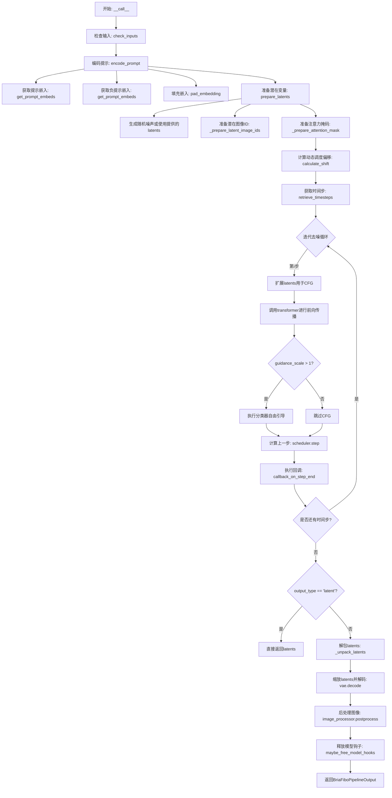

## 类结构

```
DiffusionPipeline (基类)
├── FluxLoraLoaderMixin (LoRA加载混合类)
└── BriaFiboPipeline (本类)
    ├── 组件模块
    │   ├── BriaFiboTransformer2DModel (transformer)
    │   ├── FlowMatchEulerDiscreteScheduler / KarrasDiffusionSchedulers (scheduler)
    │   ├── AutoencoderKLWan (vae)
    │   ├── SmolLM3ForCausalLM (text_encoder)
    │   └── AutoTokenizer (tokenizer)
    └── 工具类
        └── VaeImageProcessor
```

## 全局变量及字段


### `XLA_AVAILABLE`
    
是否支持XLA加速，用于判断PyTorch XLA是否可用

类型：`bool`
    


### `logger`
    
日志记录器，用于记录管道运行过程中的信息

类型：`logging.Logger`
    


### `EXAMPLE_DOC_STRING`
    
使用示例文档字符串，包含管道使用示例代码

类型：`str`
    


### `BriaFiboPipeline.model_cpu_offload_seq`
    
模型CPU卸载顺序，指定各模型组件在CPU和GPU间迁移的序列

类型：`str`
    


### `BriaFiboPipeline._callback_tensor_inputs`
    
回调张量输入列表，定义在回调函数中可用的张量参数名称

类型：`list[str]`
    


### `BriaFiboPipeline.vae_scale_factor`
    
VAE缩放因子，用于调整潜在空间到像素空间的映射比例，值为16

类型：`int`
    


### `BriaFiboPipeline.image_processor`
    
图像处理器，负责VAE解码后图像的后处理和格式转换

类型：`VaeImageProcessor`
    


### `BriaFiboPipeline.default_sample_size`
    
默认采样大小，用于计算生成图像的默认高度和宽度，值为64

类型：`int`
    


### `BriaFiboPipeline.vae`
    
变分自编码器，负责将潜在表示解码为图像或将图像编码为潜在表示

类型：`AutoencoderKLWan`
    


### `BriaFiboPipeline.text_encoder`
    
文本编码器，将输入文本提示转换为文本嵌入向量

类型：`SmolLM3ForCausalLM`
    


### `BriaFiboPipeline.tokenizer`
    
分词器，负责将文本分割成词元并进行编码

类型：`AutoTokenizer`
    


### `BriaFiboPipeline.transformer`
    
变换器模型，执行主要的扩散去噪过程，基于文本嵌入生成图像潜在表示

类型：`BriaFiboTransformer2DModel`
    


### `BriaFiboPipeline.scheduler`
    
调度器，控制扩散过程中的时间步长和噪声调度策略

类型：`FlowMatchEulerDiscreteScheduler | KarrasDiffusionSchedulers`
    


### `BriaFiboPipeline._guidance_scale`
    
引导尺度，控制无分类器引导强度，用于平衡文本保真度和图像质量

类型：`float`
    


### `BriaFiboPipeline._joint_attention_kwargs`
    
联合注意力参数，包含传递给注意力处理器的额外关键字参数

类型：`dict[str, Any]`
    


### `BriaFiboPipeline._num_timesteps`
    
时间步数，记录当前扩散过程的推理步数

类型：`int`
    


### `BriaFiboPipeline._interrupt`
    
中断标志，用于控制是否中断正在进行的推理过程

类型：`bool`
    
    

## 全局函数及方法


### `calculate_shift`

计算动态调度偏移量，用于根据当前图像序列长度和调度器的配置参数（基础/最大图像序列长度和基础/最大偏移值）动态调整扩散模型的采样计划。

参数：

- `seq_len`：`int`，当前图像的序列长度，基于高度和宽度计算
- `base_image_seq_len`：`int`，调度器配置的基础图像序列长度
- `max_image_seq_len`：`int`，调度器配置的最大图像序列长度
- `base_shift`：`float`，调度器配置的基础偏移值
- `max_shift`：`float`，调度器配置的最大偏移值

返回值：`float`，计算得到的动态偏移量 mu，用于调整采样时间步

#### 流程图

```mermaid
flowchart TD
    A[开始 calculate_shift] --> B[计算归一化比例: ratio = seq_len - base_image_seq_len / max_image_seq_len - base_image_seq_len]
    B --> C{ratio < 0?}
    C -->|Yes| D[ratio = 0]
    C -->|No| E{ratio > 1?}
    E -->|Yes| F[ratio = 1]
    E -->|No| G[使用计算的 ratio]
    D --> H[计算偏移量: mu = base_shift + ratio * (max_shift - base_shift)]
    F --> H
    G --> H
    H --> I[返回 mu]
```

#### 带注释源码

```python
def calculate_shift(
    seq_len: int,
    base_image_seq_len: int,
    max_image_seq_len: int,
    base_shift: float,
    max_shift: float,
) -> float:
    """
    计算动态调度偏移量，用于根据图像分辨率动态调整采样计划。
    
    参数:
        seq_len: 当前图像的序列长度，基于高度和宽度计算
        base_image_seq_len: 调度器配置的基础图像序列长度
        max_image_seq_len: 调度器配置的最大图像序列长度
        base_shift: 调度器配置的基础偏移值
        max_shift: 调度器配置的最大偏移值
    
    返回:
        计算得到的动态偏移量 mu
    """
    # 计算归一化的序列长度比例
    # 将当前序列长度映射到 [0, 1] 区间
    ratio = (seq_len - base_image_seq_len) / (max_image_seq_len - base_image_seq_len)
    
    # 限制比例在 [0, 1] 范围内
    ratio = min(max(ratio, 0.0), 1.0)
    
    # 根据比例在基础偏移和最大偏移之间进行线性插值
    # 当序列长度较小时使用 base_shift，序列长度较大时使用 max_shift
    mu = base_shift + ratio * (max_shift - base_shift)
    
    return mu
```


### `retrieve_timesteps`

该函数用于从调度器中检索或生成推理过程中的时间步（timesteps），并根据给定的sigma值和动态偏移参数（mu）调整时间步分布，以支持分辨率自适应的动态调度策略。

参数：

-  `scheduler`：`FlowMatchEulerDiscreteScheduler | KarrasDiffusionSchedulers`，调度器实例，用于生成和管理时间步
-  `num_inference_steps`：`int`，期望的推理步数，指定去噪过程的迭代次数
-  `device`：`torch.device`，计算设备，指定时间步张量存放的设备位置
-  `timesteps`：`list[int] | None`，可选的自定义时间步列表，若为None则由调度器自动生成
-  `sigmas`：`np.ndarray`，sigma值数组，用于控制噪声水平的线性分布，范围从1.0到1/num_inference_steps
-  `mu`：`float`，动态偏移参数，用于调整时间步的分布以适应不同分辨率的图像生成

返回值：`tuple[torch.Tensor, int]`，返回包含时间步张量（torch.Tensor）和实际推理步数（int）的元组

#### 流程图

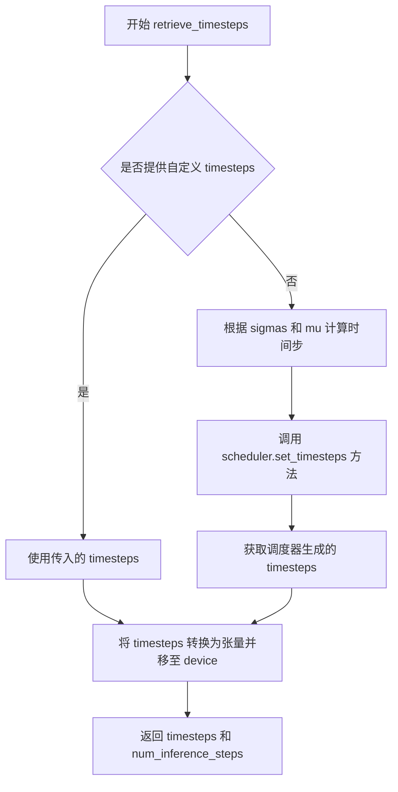

#### 带注释源码

```python
# retrieve_timesteps 函数定义位于 ...pipelines.flux.pipeline_flux 模块中
# 此处展示在 BriaFiboPipeline.__call__ 方法中的调用方式：

# 1. 计算序列长度，用于动态偏移计算
if do_patching:
    seq_len = (height // (self.vae_scale_factor * 2)) * (width // (self.vae_scale_factor * 2))
else:
    seq_len = (height // self.vae_scale_factor) * (width // self.vae_scale_factor)

# 2. 生成线性分布的 sigma 值（噪声水平）
sigmas = np.linspace(1.0, 1 / num_inference_steps, num_inference_steps)

# 3. 计算动态偏移参数 mu，根据序列长度和调度器配置
mu = calculate_shift(
    seq_len,
    self.scheduler.config.base_image_seq_len,    # 基础图像序列长度
    self.scheduler.config.max_image_seq_len,    # 最大图像序列长度
    self.scheduler.config.base_shift,             # 基础偏移量
    self.scheduler.config.max_shift,              # 最大偏移量
)

# 4. 调用 retrieve_timesteps 获取调整后的时间步
timesteps, num_inference_steps = retrieve_timesteps(
    self.scheduler,              # 调度器实例
    num_inference_steps=num_inference_steps,  # 推理步数
    device=device,               # 计算设备
    timesteps=None,              # 不使用自定义时间步
    sigmas=sigmas,               # sigma 分布
    mu=mu,                       # 动态偏移参数
)

# 函数内部逻辑（推测）：
# - 若 timesteps 为 None，则根据 sigmas 和 mu 调用调度器的 set_timesteps 方法
# - 将生成的时间步转换为指定设备的 torch.Tensor
# - 返回时间步张量和实际推理步数（可能因调度器配置而变化）
```


### `randn_tensor`

生成随机张量，用于在扩散模型的潜在空间中初始化噪声。

参数：

- `shape`：`tuple` 或 `int`，要生成的张量的形状
- `generator`：`torch.Generator` 或 `list[torch.Generator]`，可选，用于控制随机数生成的确定性
- `device`：`torch.device`，可选，生成张量所在的设备
- `dtype`：`torch.dtype`，可选，张量的数据类型

返回值：`torch.FloatTensor`，符合指定形状、设备和数据类型的随机张量

#### 流程图

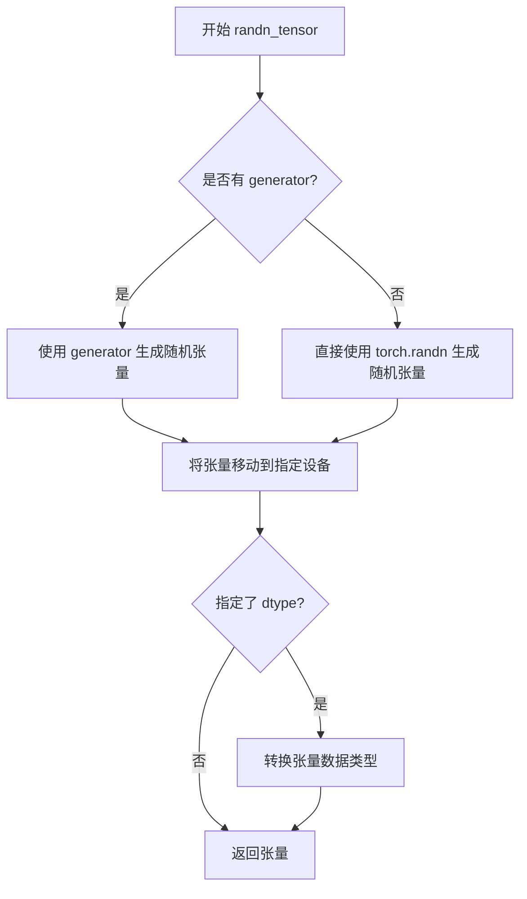

#### 带注释源码

```python
def randn_tensor(
    shape: tuple,
    generator: Optional[torch.Generator] = None,
    device: Optional[torch.device] = None,
    dtype: Optional[torch.dtype] = torch.float32,
):
    """Generate a random tensor with specified shape and properties.
    
    Args:
        shape: Shape of the tensor to generate
        generator: Optional random number generator for reproducible results
        device: Target device for the tensor
        dtype: Data type for the tensor
        
    Returns:
        A random tensor with the specified shape
    """
    # 1. 如果提供了生成器，使用生成器生成随机数
    if generator is not None:
        # 使用生成器的 state 生成随机张量
        randn = generator.randn
    else:
        # 2. 否则使用 torch.randn 直接生成
        randn = torch.randn
    
    # 3. 生成基础随机张量
    tensor = randn(*shape, device=device, dtype=dtype)
    
    # 4. 如果只指定了 device 而没有 dtype，需要确保类型正确
    if device is not None and dtype is None:
        tensor = tensor.to(device)
    
    return tensor
```

> **注意**：此函数定义位于 `diffusers` 库的 `src/diffusers/utils/torch_utils.py` 文件中。在当前代码中通过 `from ...utils.torch_utils import randn_tensor` 导入并用于 `BriaFiboPipeline.prepare_latents` 方法中初始化扩散过程的潜在变量。


### `is_torch_xla_available`

检查当前环境是否安装了 PyTorch XLA（用于加速 PyTorch 在 TPU 等硬件上的运行），以便在后续代码中条件性地导入和使用 torch_xla 相关功能。

参数：

- 无参数

返回值：`bool`，如果 PyTorch XLA 可用则返回 `True`，否则返回 `False`

#### 流程图

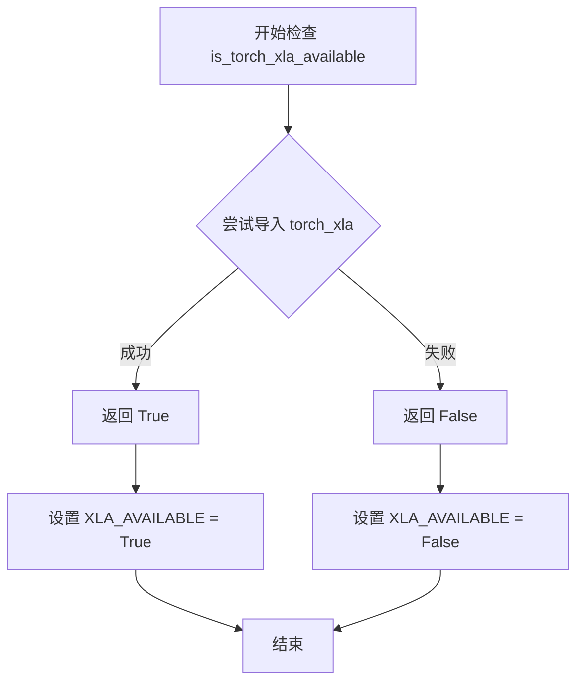

#### 带注释源码

```
# 注意：此函数定义在 ...utils 模块中，以下为调用方代码示例

# 1. 从 utils 模块导入 is_torch_xla_available 函数
from ...utils import (
    USE_PEFT_BACKEND,
    is_torch_xla_available,  # <-- 导入检查函数
    logging,
    replace_example_docstring,
    scale_lora_layers,
    unscale_lora_layers,
)

# 2. 条件性地使用该函数检查 XLA 可用性
if is_torch_xla_available():  # <-- 调用检查函数
    # 如果返回 True，导入 torch_xla 核心模块
    import torch_xla.core.xla_model as xm
    
    # 设置全局标志，表示 XLA 可用
    XLA_AVAILABLE = True
else:
    # 如果返回 False，设置全局标志，表示 XLA 不可用
    XLA_AVAILABLE = False
```

#### 备注

该函数是外部依赖函数（来自 diffusers 或 transformers 库的 utils 模块），其具体实现不在本代码文件中。根据调用方式推断，该函数通常通过尝试导入 `torch_xla` 包来判断环境是否支持 XLA。


### `logging.get_logger`

获取与当前模块关联的日志记录器，用于记录程序运行过程中的日志信息。

参数：

-  `name`：`str`，日志记录器的名称，通常传入 `__name__` 以表示当前模块

返回值：`logging.Logger`，返回对应的 Logger 对象

#### 流程图

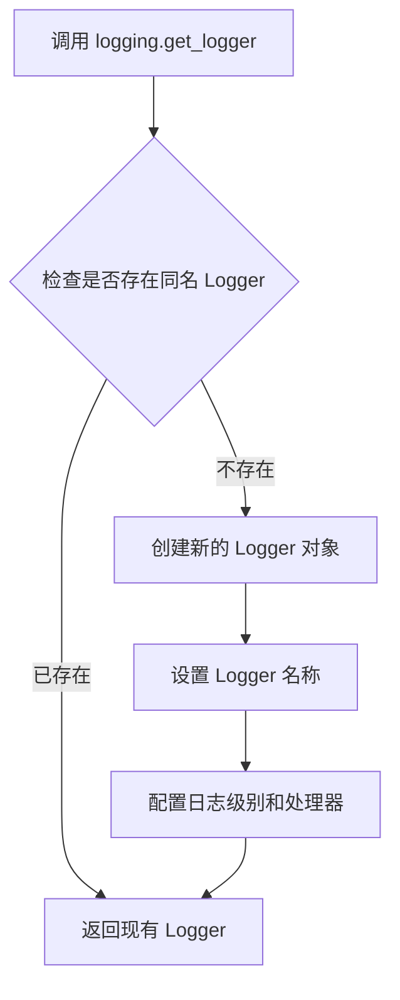

#### 带注释源码

```
# 从 utils 模块导入 logging 对象
from ...utils import (
    USE_PEFT_BACKEND,
    is_torch_xla_available,
    logging,  # 导入 logging 模块
    replace_example_docstring,
    scale_lora_layers,
    unscale_lora_layers,
)

# ... 其他导入 ...

# 使用 logging.get_logger 获取当前模块的日志记录器
# __name__ 是 Python 内置变量，表示当前模块的完整路径
# 例如: 'diffusers.pipelines.bria_fibo.pipeline_bria_fibo'
logger = logging.get_logger(__name__)  # pylint: disable=invalid-name
```

#### 使用示例源码

```
# 获取以当前模块名命名的 Logger
logger = logging.get_logger(__name__)

# 之后可以这样使用：
logger.info("Pipeline initialized successfully")
logger.warning("Some deprecated feature is used")
logger.error("An error occurred")
```


### BriaFiboPipeline.__init__

这是BriaFiboPipeline类的构造函数，负责初始化扩散管道的主要组件，包括Transformer模型、调度器、VAE、文本编码器和分词器。

参数：

- `transformer`：`BriaFiboTransformer2DModel`，用于2D扩散建模的Transformer模型
- `scheduler`：`FlowMatchEulerDiscreteScheduler | KarrasDiffusionSchedulers`，用于去噪编码.latents的调度器
- `vae`：`AutoencoderKLWan`，用于将图像编码和解码到潜在表示的变分自编码器
- `text_encoder`：`SmolLM3ForCausalLM`，用于处理输入提示的文本编码器
- `tokenizer`：`AutoTokenizer`，用于处理输入文本提示的分词器

返回值：无（`None`），构造函数不返回值，仅初始化实例属性

#### 流程图

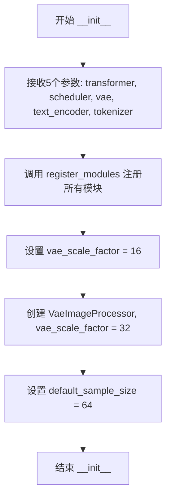

#### 带注释源码

```python
def __init__(
    self,
    transformer: BriaFiboTransformer2DModel,  # 2D扩散Transformer模型
    scheduler: FlowMatchEulerDiscreteScheduler | KarrasDiffusionSchedulers,  # 噪声调度器
    vae: AutoencoderKLWan,  # 变分自编码器，用于图像编解码
    text_encoder: SmolLM3ForCausalLM,  # 文本编码器模型
    tokenizer: AutoTokenizer,  # 文本分词器
):
    # 注册所有模块到pipeline，使其可以通过pipeline.xxx访问
    self.register_modules(
        vae=vae,
        text_encoder=text_encoder,
        tokenizer=tokenizer,
        transformer=transformer,
        scheduler=scheduler,
    )

    # VAE的缩放因子，用于计算潜在空间的维度
    self.vae_scale_factor = 16
    
    # 创建图像处理器，用于VAE解码后的图像后处理
    # 乘以2是因为需要处理patch和non-patch两种模式
    self.image_processor = VaeImageProcessor(vae_scale_factor=self.vae_scale_factor * 2)
    
    # 默认的样本大小（以潜在空间单位计），乘以vae_scale_factor得到像素尺寸
    self.default_sample_size = 64
```


### `BriaFiboPipeline.get_prompt_embeds`

该方法负责将文本提示词（prompt）编码为 transformer 模型可用的嵌入向量（embeddings）。它首先对输入的提示词进行预处理（标准化为空列表或字符串），然后使用分词器（tokenizer）将文本转换为 token IDs，接着通过文本编码器（text_encoder）获取隐藏状态，最后合并最后两层隐藏状态以生成增强的提示词嵌入，同时返回隐藏状态元组和注意力掩码供后续处理使用。

参数：

- `prompt`：`str | list[str]`，输入的文本提示词，可以是单个字符串或字符串列表
- `num_images_per_prompt`：`int = 1`，每个提示词需要生成的图像数量，用于扩展嵌入维度
- `max_sequence_length`：`int = 2048`，分词时的最大序列长度，超过该长度的文本将被截断
- `device`：`torch.device | None = None`，指定计算设备（如 CPU 或 CUDA），默认为执行设备
- `dtype`：`torch.dtype | None = None`，指定张量的数据类型，默认为文本编码器的数据类型

返回值：`tuple[torch.Tensor, tuple[torch.Tensor, ...], torch.Tensor]`，返回一个三元组，包含：

- `prompt_embeds`：提示词嵌入张量，形状为 `(batch_size * num_images_per_prompt, seq_len, hidden_dim * 2)`
- `hidden_states`：隐藏状态元组，包含所有层的隐藏状态
- `attention_mask`：注意力掩码张量，用于指示有效token位置

#### 流程图

```mermaid
flowchart TD
    A[开始 get_prompt_embeds] --> B{device 和 dtype 是否为 None?}
    B -->|是| C[使用执行设备 self._execution_device]
    B -->|否| D[使用传入的 device 和 dtype]
    C --> E[确定 dtype 为 text_encoder.dtype]
    D --> E
    E --> F{prompt 是字符串还是列表?}
    F -->|字符串| G[将 prompt 包装为列表]
    G --> H
    F -->|列表| H{列表是否为空?}
    H -->|是| I[抛出 ValueError: 'prompt must be a non-empty string or list of strings']
    H -->|否| J[获取 batch_size]
    J --> K[设置 bot_token_id = 128000]
    K --> L{所有 prompt 是否为空字符串?}
    L -->|是| M[创建全为 bot_token_id 的 input_ids 和全1的 attention_mask]
    L -->|否| N[调用 tokenizer 进行分词]
    N --> O{存在空字符串的 prompt?}
    O -->|是| P[将空字符串对应的行替换为 bot_token_id]
    O -->|否| Q[继续处理]
    P --> Q
    M --> R
    Q --> R[调用 text_encoder 获取 encoder_outputs]
    R --> S[提取 hidden_states]
    S --> T[合并最后两层隐藏状态: hidden_states[-1] + hidden_states[-2]]
    T --> U[转换为指定 device 和 dtype]
    U --> V[repeat_interleave 扩展 prompt_embeds]
    V --> W[对 hidden_states 和 attention_mask 进行 repeat_interleave]
    W --> X[返回 prompt_embeds, hidden_states, attention_mask]
```

#### 带注释源码

```python
def get_prompt_embeds(
    self,
    prompt: str | list[str],              # 输入的文本提示词，支持单字符串或字符串列表
    num_images_per_prompt: int = 1,       # 每个提示词生成的图像数量，用于扩展批次
    max_sequence_length: int = 2048,     # 最大序列长度，超过部分会被截断
    device: torch.device | None = None,  # 计算设备，默认为执行设备
    dtype: torch.dtype | None = None,    # 数据类型，默认为文本编码器类型
):
    """
    将文本提示词编码为 transformer 模型可用的嵌入向量。
    
    处理流程：
    1. 标准化输入 prompt 为列表格式
    2. 使用 tokenizer 将文本转换为 token IDs
    3. 通过 text_encoder 获取隐藏状态
    4. 合并最后两层隐藏状态以生成增强的 prompt embeddings
    5. 根据 num_images_per_prompt 扩展所有输出张量
    
    Returns:
        tuple: (prompt_embeds, hidden_states, attention_mask)
    """
    # 确定计算设备，优先使用传入的 device，否则使用 pipeline 的执行设备
    device = device or self._execution_device
    # 确定数据类型，优先使用传入的 dtype，否则使用文本编码器的数据类型
    dtype = dtype or self.text_encoder.dtype

    # 标准化输入：将单个字符串转换为列表，确保处理的一致性
    prompt = [prompt] if isinstance(prompt, str) else prompt
    
    # 输入验证：确保 prompt 非空
    if not prompt:
        raise ValueError("`prompt` must be a non-empty string or list of strings.")

    # 获取批次大小
    batch_size = len(prompt)
    # bot_token_id 是用于表示空输入的特殊 token ID（类似 GPT-4o 的 BOS token）
    bot_token_id = 128000

    # 确保文本编码器使用正确的设备类型
    text_encoder_device = device if device is not None else torch.device("cpu")
    if not isinstance(text_encoder_device, torch.device):
        text_encoder_device = torch.device(text_encoder_device)

    # 处理空字符串的特殊情况：使用 bot_token_id 填充
    if all(p == "" for p in prompt):
        # 创建一个 batch_size x 1 的 tensor，全部填充为 bot_token_id
        input_ids = torch.full((batch_size, 1), bot_token_id, dtype=torch.long, device=text_encoder_device)
        # 创建对应的注意力掩码（全1表示有效token）
        attention_mask = torch.ones_like(input_ids)
    else:
        # 正常情况：使用 tokenizer 将文本转换为 token IDs
        # padding="longest" - 将批次内所有序列 padding 到最长序列的长度
        # max_length=max_sequence_length - 限制最大长度，超过则截断
        # add_special_tokens=True - 自动添加特殊 token（如 BOS/EOS）
        # return_tensors="pt" - 返回 PyTorch 张量
        tokenized = self.tokenizer(
            prompt,
            padding="longest",
            max_length=max_sequence_length,
            truncation=True,
            add_special_tokens=True,
            return_tensors="pt",
        )
        # 将 token IDs 和注意力掩码移动到指定设备
        input_ids = tokenized.input_ids.to(text_encoder_device)
        attention_mask = tokenized.attention_mask.to(text_encoder_device)

        # 再次检查是否存在空字符串，并进行相应处理
        if any(p == "" for p in prompt):
            # 找出空字符串对应的行索引
            empty_rows = torch.tensor([p == "" for p in prompt], dtype=torch.bool, device=text_encoder_device)
            # 将空字符串位置的 token 替换为 bot_token_id
            input_ids[empty_rows] = bot_token_id
            attention_mask[empty_rows] = 1

    # 调用文本编码器模型进行前向传播
    # output_hidden_states=True - 返回所有层的隐藏状态，而非仅最后一层
    encoder_outputs = self.text_encoder(
        input_ids,
        attention_mask=attention_mask,
        output_hidden_states=True,
    )
    # 提取所有层的隐藏状态（tuple，每层一个 tensor）
    hidden_states = encoder_outputs.hidden_states

    # 核心处理：合并最后两层隐藏状态以增强语义表示
    # 这种技术来源于 FLUX/Flux 架构，通过结合深层和浅层信息来提升效果
    # hidden_states[-1]: 最后一层的隐藏状态（高层语义）
    # hidden_states[-2]: 倒数第二层的隐藏状态（中间层语义）
    # 在 dim=-1 维度拼接，将特征维度翻倍
    prompt_embeds = torch.cat([hidden_states[-1], hidden_states[-2]], dim=-1)
    # 将结果移动到指定设备并转换为指定数据类型
    prompt_embeds = prompt_embeds.to(device=device, dtype=dtype)

    # 根据 num_images_per_prompt 扩展 prompt_embeds
    # repeat_interleave 在 batch 维度（dim=0）重复每个样本
    # 例如：batch_size=2, num_images_per_prompt=3 -> batch_size=6
    prompt_embeds = prompt_embeds.repeat_interleave(num_images_per_prompt, dim=0)
    
    # 对隐藏状态元组和注意力掩码进行相同的扩展操作
    hidden_states = tuple(
        layer.repeat_interleave(num_images_per_prompt, dim=0).to(device=device) for layer in hidden_states
    )
    attention_mask = attention_mask.repeat_interleave(num_images_per_prompt, dim=0).to(device=device)

    # 返回三个关键输出供后续处理使用
    return prompt_embeds, hidden_states, attention_mask
```


### `BriaFiboPipeline.pad_embedding`

该方法是一个静态方法，用于将提示词嵌入（prompt embeddings）填充（padding）到指定的最大token数量，同时保留真实token的注意力掩码。该方法在处理变长文本嵌入时确保批次内所有序列长度一致，以便后续Transformer模型处理。

参数：

- `prompt_embeds`：`torch.Tensor`，输入的提示词嵌入张量，形状为 (batch_size, seq_len, dim)
- `max_tokens`：`int`，填充后的最大token数量，必须大于等于当前序列长度
- `attention_mask`：`torch.Tensor | None`，注意力掩码，用于标识真实token位置，若为None则默认全为1

返回值：`tuple[torch.Tensor, torch.Tensor]`，返回填充后的提示词嵌入和对应的注意力掩码

#### 流程图

```mermaid
flowchart TD
    A[开始 pad_embedding] --> B[获取 prompt_embeds 形状: batch_size, seq_len, dim]
    B --> C{attention_mask 是否为 None?}
    C -->|是| D[创建全1注意力掩码: torch.ones(batch_size, seq_len)]
    C -->|否| E[将 attention_mask 移动到 prompt_embeds 设备并转换 dtype]
    E --> F{max_tokens < seq_len?}
    D --> F
    F -->|是| G[抛出 ValueError: max_tokens 必须 >= seq_len]
    F -->|否| H{max_tokens > seq_len?}
    H -->|否| I[直接返回原始 prompt_embeds 和 attention_mask]
    H -->|是| J[计算填充长度: pad_length = max_tokens - seq_len]
    J --> K[创建零填充: torch.zeros(batch_size, pad_length, dim)]
    K --> L[拼接 embeddings: torch.cat([prompt_embeds, padding], dim=1)]
    L --> M[创建掩码填充: torch.zeros(batch_size, pad_length)]
    M --> N[拼接掩码: torch.cat([attention_mask, mask_padding], dim=1)]
    N --> O[返回填充后的 embeddings 和 attention_mask]
    I --> O
    G --> P[结束 - 抛出异常]
```

#### 带注释源码

```python
@staticmethod
def pad_embedding(prompt_embeds, max_tokens, attention_mask=None):
    """
    Pad embeddings to `max_tokens` while preserving the mask of real tokens.
    
    该方法确保所有批次中的序列长度一致，通过在末尾添加零向量来填充embeddings，
    同时在attention_mask中添加零值以标识这些填充位置不包含真实token。
    
    参数:
        prompt_embeds: 输入的提示词嵌入张量，形状为 (batch_size, seq_len, dim)
        max_tokens: 目标最大token数量，必须 >= 当前序列长度
        attention_mask: 可选的注意力掩码，若为None则默认全为1
    
    返回:
        tuple: (填充后的prompt_embeds, 填充后的attention_mask)
    """
    # 获取嵌入张量的维度信息
    # batch_size: 批次大小
    # seq_len: 当前序列长度
    # dim: 嵌入维度
    batch_size, seq_len, dim = prompt_embeds.shape

    # 处理attention_mask
    # 如果未提供，则创建一个全1掩码，表示所有token都是有效的
    if attention_mask is None:
        attention_mask = torch.ones((batch_size, seq_len), dtype=prompt_embeds.dtype, device=prompt_embeds.device)
    else:
        # 确保attention_mask与prompt_embeds在同一设备上且数据类型一致
        attention_mask = attention_mask.to(device=prompt_embeds.device, dtype=prompt_embeds.dtype)

    # 验证max_tokens参数的有效性
    # 如果目标长度小于当前序列长度，则无法进行填充
    if max_tokens < seq_len:
        raise ValueError("`max_tokens` must be greater or equal to the current sequence length.")

    # 执行填充操作（当max_tokens > seq_len时）
    if max_tokens > seq_len:
        # 计算需要填充的长度
        pad_length = max_tokens - seq_len
        
        # 创建零填充张量，用于扩展embeddings
        # 形状: (batch_size, pad_length, dim)
        padding = torch.zeros(
            (batch_size, pad_length, dim), dtype=prompt_embeds.dtype, device=prompt_embeds.device
        )
        # 在序列维度(dim=1)上拼接原始embeddings和填充
        prompt_embeds = torch.cat([prompt_embeds, padding], dim=1)

        # 创建掩码填充张量，值为0表示这些位置是填充的
        # 形状: (batch_size, pad_length)
        mask_padding = torch.zeros(
            (batch_size, pad_length), dtype=prompt_embeds.dtype, device=prompt_embeds.device
        )
        # 在序列维度上拼接原始mask和填充mask
        attention_mask = torch.cat([attention_mask, mask_padding], dim=1)

    # 返回填充后的embeddings和对应的attention_mask
    # 这样下游模型可以正确识别哪些是真实token，哪些是填充token
    return prompt_embeds, attention_mask
```


### `BriaFiboPipeline.encode_prompt`

该方法负责将输入的文本提示词编码为transformer模型所需的嵌入向量（prompt_embeds），同时支持负面提示词（negative_prompt）以实现classifier-free guidance，并处理LoRA缩放、嵌入填充对齐等操作，确保正面和负面提示词的序列长度一致。

参数：

- `prompt`：`str | list[str]`，要编码的提示词，可以是单个字符串或字符串列表
- `device`：`torch.device | None`，指定计算设备，默认为执行设备
- `num_images_per_prompt`：`int = 1`，每个提示词要生成的图像数量
- `guidance_scale`：`float = 5`，无分类器引导的guidance scale，用于控制提示词影响力
- `negative_prompt`：`str | list[str] | None`，不引导图像生成的负面提示词，当guidance_scale > 1时使用
- `prompt_embeds`：`torch.FloatTensor | None`，预生成的提示词嵌入，若提供则直接使用
- `negative_prompt_embeds`：`torch.FloatTensor | None`，预生成的负面提示词嵌入
- `max_sequence_length`：`int = 3000`，提示词的最大序列长度
- `lora_scale`：`float | None`，LoRA缩放因子，用于动态调整LoRA层权重

返回值：`tuple`，返回包含8个元素的元组
- `prompt_embeds`：提示词嵌入向量
- `negative_prompt_embeds`：负面提示词嵌入向量
- `text_ids`：文本ID张量
- `prompt_attention_mask`：提示词注意力掩码
- `negative_prompt_attention_mask`：负面提示词注意力掩码
- `prompt_layers`：提示词各层的隐藏状态
- `negative_prompt_layers`：负面提示词各层的隐藏状态

#### 流程图

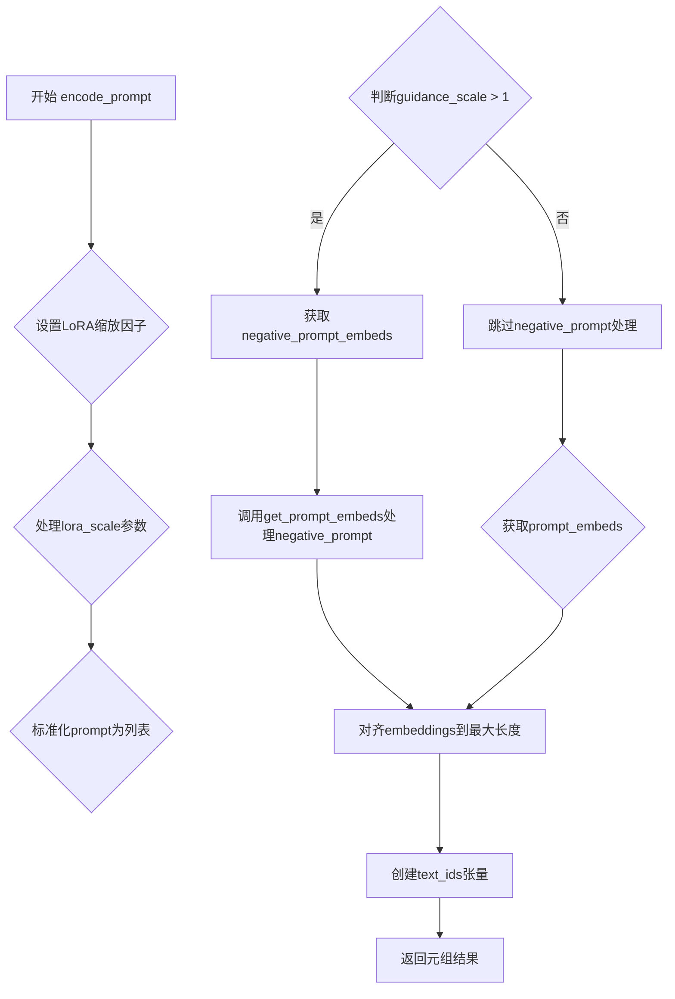

#### 带注释源码

```python
def encode_prompt(
    self,
    prompt: str | list[str],
    device: torch.device | None = None,
    num_images_per_prompt: int = 1,
    guidance_scale: float = 5,
    negative_prompt: str | list[str] | None = None,
    prompt_embeds: torch.FloatTensor | None = None,
    negative_prompt_embeds: torch.FloatTensor | None = None,
    max_sequence_length: int = 3000,
    lora_scale: float | None = None,
):
    r"""
    Args:
        prompt (`str` or `list[str]`, *optional*):
            prompt to be encoded
        device: (`torch.device`):
            torch device
        num_images_per_prompt (`int`):
            number of images that should be generated per prompt
        guidance_scale (`float`):
            Guidance scale for classifier free guidance.
        negative_prompt (`str` or `list[str]`, *optional*):
            The prompt or prompts not to guide the image generation. If not defined, one has to pass
            `negative_prompt_embeds` instead. Ignored when not using guidance (i.e., ignored if `guidance_scale` is
            less than `1`).
        prompt_embeds (`torch.FloatTensor`, *optional*):
            Pre-generated text embeddings. Can be used to easily tweak text inputs, *e.g.* prompt weighting. If not
            provided, text embeddings will be generated from `prompt` input argument.
        negative_prompt_embeds (`torch.FloatTensor`, *optional*):
            Pre-generated negative text embeddings. Can be used to easily tweak text inputs, *e.g.* prompt
            weighting. If not provided, negative_prompt_embeds will be generated from `negative_prompt` input
            argument.
    """
    # 确定设备，默认为执行设备
    device = device or self._execution_device

    # 设置lora scale以便text encoder的LoRA函数正确访问
    if lora_scale is not None and isinstance(self, FluxLoraLoaderMixin):
        self._lora_scale = lora_scale

        # 动态调整LoRA scale
        if self.text_encoder is not None and USE_PEFT_BACKEND:
            scale_lora_layers(self.text_encoder, lora_scale)

    # 标准化prompt为列表格式
    prompt = [prompt] if isinstance(prompt, str) else prompt
    if prompt is not None:
        batch_size = len(prompt)
    else:
        batch_size = prompt_embeds.shape[0]

    # 初始化注意力掩码变量
    prompt_attention_mask = None
    negative_prompt_attention_mask = None
    
    # 如果未提供prompt_embeds，则调用get_prompt_embeds生成
    if prompt_embeds is None:
        prompt_embeds, prompt_layers, prompt_attention_mask = self.get_prompt_embeds(
            prompt=prompt,
            num_images_per_prompt=num_images_per_prompt,
            max_sequence_length=max_sequence_length,
            device=device,
        )
        # 转换为transformer所需的数据类型
        prompt_embeds = prompt_embeds.to(dtype=self.transformer.dtype)
        prompt_layers = [tensor.to(dtype=self.transformer.dtype) for tensor in prompt_layers]

    # 处理guidance_scale > 1的情况，生成negative_prompt_embeds
    if guidance_scale > 1:
        # 处理None值
        if isinstance(negative_prompt, list) and negative_prompt[0] is None:
            negative_prompt = ""
        negative_prompt = negative_prompt or ""
        # 确保negative_prompt与prompt类型一致
        negative_prompt = batch_size * [negative_prompt] if isinstance(negative_prompt, str) else negative_prompt
        if prompt is not None and type(prompt) is not type(negative_prompt):
            raise TypeError(
                f"`negative_prompt` should be the same type to `prompt`, but got {type(negative_prompt)} !="
                f" {type(prompt)}."
            )
        elif batch_size != len(negative_prompt):
            raise ValueError(
                f"`negative_prompt`: {negative_prompt} has batch size {len(negative_prompt)}, but `prompt`:"
                f" {prompt} has batch size {batch_size}. Please make sure that passed `negative_prompt` matches"
                " the batch size of `prompt`."
            )

        # 生成negative_prompt的embeddings
        negative_prompt_embeds, negative_prompt_layers, negative_prompt_attention_mask = self.get_prompt_embeds(
            prompt=negative_prompt,
            num_images_per_prompt=num_images_per_prompt,
            max_sequence_length=max_sequence_length,
            device=device,
        )
        negative_prompt_embeds = negative_prompt_embeds.to(dtype=self.transformer.dtype)
        negative_prompt_layers = [tensor.to(dtype=self.transformer.dtype) for tensor in negative_prompt_layers]

    # 如果使用PEFT backend，恢复LoRA层原始缩放
    if self.text_encoder is not None:
        if isinstance(self, FluxLoraLoaderMixin) and USE_PEFT_BACKEND:
            # Retrieve the original scale by scaling back the LoRA layers
            unscale_lora_layers(self.text_encoder, lora_scale)

    # 对齐embeddings到最长序列长度
    if prompt_attention_mask is not None:
        prompt_attention_mask = prompt_attention_mask.to(device=prompt_embeds.device, dtype=prompt_embeds.dtype)

    if negative_prompt_embeds is not None:
        if negative_prompt_attention_mask is not None:
            negative_prompt_attention_mask = negative_prompt_attention_mask.to(
                device=negative_prompt_embeds.device, dtype=negative_prompt_embeds.dtype
            )
        # 计算最大token数
        max_tokens = max(negative_prompt_embeds.shape[1], prompt_embeds.shape[1])

        # 对齐prompt_embeds和negative_prompt_embeds
        prompt_embeds, prompt_attention_mask = self.pad_embedding(
            prompt_embeds, max_tokens, attention_mask=prompt_attention_mask
        )
        prompt_layers = [self.pad_embedding(layer, max_tokens)[0] for layer in prompt_layers]

        negative_prompt_embeds, negative_prompt_attention_mask = self.pad_embedding(
            negative_prompt_embeds, max_tokens, attention_mask=negative_prompt_attention_mask
        )
        negative_prompt_layers = [self.pad_embedding(layer, max_tokens)[0] for layer in negative_prompt_layers]
    else:
        # 如果没有negative_prompt_embeds，仅对齐prompt_embeds
        max_tokens = prompt_embeds.shape[1]
        prompt_embeds, prompt_attention_mask = self.pad_embedding(
            prompt_embeds, max_tokens, attention_mask=prompt_attention_mask
        )
        negative_prompt_layers = None

    # 获取text_encoder的数据类型并创建text_ids
    dtype = self.text_encoder.dtype
    text_ids = torch.zeros(prompt_embeds.shape[0], max_tokens, 3).to(device=device, dtype=dtype)

    # 返回包含所有embeddings和相关信息的元组
    return (
        prompt_embeds,
        negative_prompt_embeds,
        text_ids,
        prompt_attention_mask,
        negative_prompt_attention_mask,
        prompt_layers,
        negative_prompt_layers,
    )
```


### `BriaFiboPipeline._unpack_latents`

该方法是一个静态方法，用于将打包（packed）格式的latent张量解包（unpack）为标准的4D图像张量格式。它首先通过VAE缩放因子调整高度和宽度，然后对latents进行维度重塑和置换操作，最终将打包的latent张量转换为 (batch_size, channels // 4, height, width) 的形状，以便后续的VAE解码过程使用。

参数：

- `latents`：`torch.Tensor`，输入的打包latent张量，形状为 (batch_size, num_patches, channels)
- `height`：`int`，原始图像的高度（像素单位）
- `width`：`int`，原始图像的宽度（像素单位）
- `vae_scale_factor`：`int`，VAE的缩放因子，用于将像素坐标转换为latent坐标

返回值：`torch.Tensor`，解包后的latent张量，形状为 (batch_size, channels // 4, height, width)

#### 流程图

```mermaid
flowchart TD
    A[输入 latents: (batch_size, num_patches, channels)] --> B[计算实际height和width: height // vae_scale_factor, width // vae_scale_factor]
    B --> C[重塑latents: view(batch_size, height//2, width//2, channels//4, 2, 2)]
    C --> D[置换维度: permute(0, 3, 1, 4, 2, 5)]
    D --> E[reshape为: (batch_size, channels//4, height, width)]
    E --> F[返回解包后的latent张量]
    
    style A fill:#f9f,color:#333
    style F fill:#9f9,color:#333
```

#### 带注释源码

```python
@staticmethod
# Based on diffusers.pipelines.flux.pipeline_flux.FluxPipeline._unpack_latents
def _unpack_latents(latents, height, width, vae_scale_factor):
    """
    解包打包的latent张量为标准4D图像张量格式
    
    参数:
        latents: 打包的latent张量，形状为 (batch_size, num_patches, channels)
        height: 原始图像高度（像素）
        width: 原始图像宽度（像素）
        vae_scale_factor: VAE缩放因子
    
    返回:
        解包后的latent张量，形状为 (batch_size, channels // 4, height, width)
    """
    # 获取输入张量的维度信息
    batch_size, num_patches, channels = latents.shape

    # 将像素坐标转换为latent坐标
    height = height // vae_scale_factor
    width = width // vae_scale_factor

    # 第一步重塑：将latents分解为2x2的patch块
    # 原始形状: (batch_size, num_patches, channels)
    # 目标形状: (batch_size, height//2, width//2, channels//4, 2, 2)
    # 其中 height//2 * width//2 = num_patches
    # channels//4 是每个patch的通道数，2x2 是每个patch内的空间结构
    latents = latents.view(batch_size, height // 2, width // 2, channels // 4, 2, 2)

    # 第二步置换维度：重新排列以便于后续reshape
    # 从 (batch, h/2, w/2, c/4, 2, 2) 转换为 (batch, c/4, h/2, 2, w/2, 2)
    # 即 permute(0, 3, 1, 4, 2, 5)
    latents = latents.permute(0, 3, 1, 4, 2, 5)

    # 第三步reshape：合并最后的两个维度得到标准4D张量
    # 从 (batch, c/4, h/2, 2, w/2, 2) 转换为 (batch, c/4, h, w)
    latents = latents.reshape(batch_size, channels // (2 * 2), height, width)
    
    return latents
```


### `BriaFiboPipeline._prepare_latent_image_ids`

生成用于表示潜在图像空间位置的二维坐标ID数组，用于变压器模型中的图像位置编码。

参数：

- `batch_size`：`int`，批次大小（虽然代码中未直接使用，但作为调用接口的一部分）
- `height`：`int`，潜在图像的高度（以 patch 为单位）
- `width`：`int`，潜在图像的宽度（以 patch 为单位）
- `device`：`torch.device`，张量目标设备
- `dtype`：`torch.dtype`，张量数据类型

返回值：`torch.FloatTensor`，形状为 `(height * width, 3)` 的位置ID张量，用于表示每个潜在图像 patch 的二维坐标位置

#### 流程图

```mermaid
flowchart TD
    A[开始] --> B[创建零张量 shape: height x width x 3]
    B --> C[填充Y坐标: latent_image_ids[..., 1] + torch.arange(height)]
    C --> D[填充X坐标: latent_image_ids[..., 2] + torch.arange(width)]
    D --> E[获取张量形状信息]
    E --> F[reshape: height x width x 3 -> height*width x 3]
    F --> G[转换设备与数据类型]
    G --> H[返回位置ID张量]
```

#### 带注释源码

```
@staticmethod
# 静态方法：准备潜在图像的位置ID
# 源自 diffusers.pipelines.flux.pipeline_flux.FluxPipeline._prepare_latent_image_ids
def _prepare_latent_image_ids(batch_size, height, width, device, dtype):
    # 1. 初始化一个 (height, width, 3) 形状的零张量
    #    第三维用于存储 [batch_idx, y_coord, x_coord]
    latent_image_ids = torch.zeros(height, width, 3)
    
    # 2. 在第二维（索引1）填充Y坐标
    #    torch.arange(height)[:, None] 产生 (height, 1) 的列向量
    #    广播后使每个像素行的Y坐标递增 (0, 1, 2, ..., height-1)
    latent_image_ids[..., 1] = latent_image_ids[..., 1] + torch.arange(height)[:, None]
    
    # 3. 在第三维（索引2）填充X坐标
    #    torch.arange(width)[None, :] 产生 (1, width) 的行向量
    #    广播后使每个像素列的X坐标递增 (0, 1, 2, ..., width-1)
    latent_image_ids[..., 2] = latent_image_ids[..., 2] + torch.arange(width)[None, :]
    
    # 4. 获取重塑前的张量形状信息
    latent_image_id_height, latent_image_id_width, latent_image_id_channels = latent_image_ids.shape
    
    # 5. 将 3D 张量 reshape 为 2D 张量
    #    从 (height, width, 3) 变为 (height*width, 3)
    #    每一行代表一个潜在图像 patch 的位置编码 [batch_idx=0, y, x]
    latent_image_ids = latent_image_ids.reshape(
        latent_image_id_height * latent_image_id_width, latent_image_id_channels
    )
    
    # 6. 将结果张量移动到指定设备并转换数据类型后返回
    return latent_image_ids.to(device=device, dtype=dtype)
```


### `BriaFiboPipeline._unpack_latents_no_patch`

该函数是一个静态方法，用于将打包后的latent张量解包回标准的4D张量格式（batch_size, channels, height, width），以便后续的VAE解码处理。与`_unpack_latents`方法不同，此方法不进行patch操作，适用于`do_patching=False`的场景。

参数：

- `latents`：`torch.Tensor`，输入的打包后的latent张量，形状为(batch_size, num_patches, channels)
- `height`：`int`，图像的目标高度（像素单位）
- `width`：`int`，图像的目标宽度（像素单位）
- `vae_scale_factor`：`int`，VAE的缩放因子，用于将像素坐标转换为latent空间坐标

返回值：`torch.Tensor`，解包后的latent张量，形状为(batch_size, channels, height // vae_scale_factor, width // vae_scale_factor)

#### 流程图

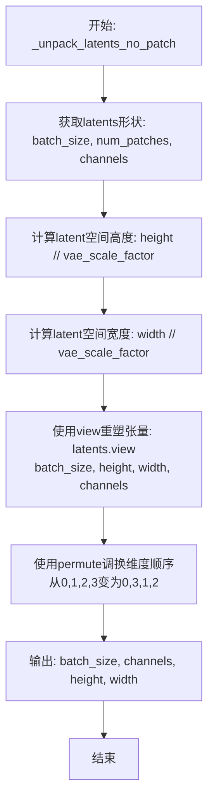

#### 带注释源码

```python
@staticmethod
def _unpack_latents_no_patch(latents, height, width, vae_scale_factor):
    """
    将打包的latent张量解包为标准4D张量格式（不进行patch处理）。
    
    此方法是将(latents)从打包格式(batch_size, num_patches, channels)
    转换为标准的图像张量格式(batch_size, channels, height, width)。
    与_unpack_latents方法的区别在于：不进行patch处理（即不除以4）。
    
    参数:
        latents (torch.Tensor): 打包后的latent张量，形状为 (batch_size, num_patches, channels)
        height (int): 目标图像高度（像素单位）
        width (int): 目标图像宽度（像素单位）
        vae_scale_factor (int): VAE缩放因子，用于坐标转换
    
    返回:
        torch.Tensor: 解包后的latent张量，形状为 (batch_size, channels, height//vae_scale_factor, width//vae_scale_factor)
    """
    # 从输入张量中提取batch_size、num_patches和channels维度
    batch_size, num_patches, channels = latents.shape

    # 根据vae_scale_factor将像素坐标转换为latent空间坐标
    height = height // vae_scale_factor
    width = width // vae_scale_factor

    # 将打包的latent张量重塑为(batch_size, height, width, channels)
    # 这里假设num_patches = height * width
    latents = latents.view(batch_size, height, width, channels)
    
    # 调整维度顺序：从(batch_size, height, width, channels) 
    # 转换为(batch_size, channels, height, width)
    # 这是PyTorch中标准的图像张量格式
    latents = latents.permute(0, 3, 1, 2)

    return latents
```


### `BriaFiboPipeline._pack_latents_no_patch`

该函数是一个静态方法，用于将latent张量从图像格式（B, C, H, W）打包转换为序列格式（B, L, C），其中L = height * width为展平后的空间序列长度，以便于后续Transformer模型进行处理。

参数：

- `latents`：`torch.Tensor`，输入的latent张量，形状为 (batch_size, num_channels_latents, height, width)
- `batch_size`：`int`，批次大小，表示输入的样本数量
- `num_channels_latents`：`int`，latent通道数，表示每个空间位置的潜在特征维度
- `height`：`int`，latent的高度维度
- `width`：`int`，latent的宽度维度

返回值：`torch.Tensor`，打包后的latent张量，形状为 (batch_size, height * width, num_channels_latents)

#### 流程图

```mermaid
flowchart TD
    A[开始] --> B[输入latents: (B, C, H, W)]
    B --> C[permute: (0, 2, 3, 1) -> (B, H, W, C)]
    C --> D[reshape: (B, H*W, C)]
    D --> E[返回: (B, H*W, C)]
    E --> F[结束]
```

#### 带注释源码

```
@staticmethod
def _pack_latents_no_patch(latents, batch_size, num_channels_latents, height, width):
    """
    将latent张量从图像格式打包为序列格式
    
    参数:
        latents: 输入张量，形状 (batch_size, num_channels_latents, height, width)
        batch_size: 批次大小
        num_channels_latents: latent通道数
        height: 高度
        width: 宽度
    
    返回:
        打包后的张量，形状 (batch_size, height * width, num_channels_latents)
    """
    # 步骤1: 维度重排
    # 将形状从 (B, C, H, W) 转换为 (B, H, W, C)
    # 将通道维度从第1维移动到最后，便于后续展平
    latents = latents.permute(0, 2, 3, 1)
    
    # 步骤2: 形状重塑
    # 将 (B, H, W, C) 转换为 (B, H*W, C)
    # 将空间维度 H×W 展平为一个序列长度 L
    latents = latents.reshape(batch_size, height * width, num_channels_latents)
    
    # 返回打包后的序列格式latents
    return latents
```


### `BriaFiboPipeline._pack_latents`

该方法用于将扩散模型的 latents 张量进行打包处理，将 2D 图像 latent 转换为适合 Transformer 处理的序列形式，通过空间到通道的变换将高度和宽度的信息编码到通道维度中。

参数：

- `latents`：`torch.Tensor`，输入的 latents 张量，形状为 (batch_size, num_channels_latents, height, width)
- `batch_size`：`int`，批次大小
- `num_channels_latents`：`int`，latents 的通道数
- `height`：`int`，latents 的高度
- `width`：`int`，latents 的宽度

返回值：`torch.Tensor`，打包后的 latents，形状为 (batch_size, (height//2)*(width//2), num_channels_latents*4)

#### 流程图

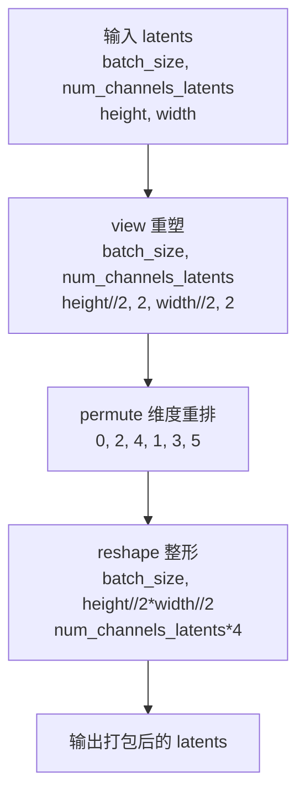

#### 带注释源码

```python
@staticmethod
# Copied from diffusers.pipelines.flux.pipeline_flux.FluxPipeline._pack_latents
def _pack_latents(latents, batch_size, num_channels_latents, height, width):
    """
    将 latents 张量打包成适合 Transformer 处理的序列格式。
    
    该方法实现了空间到通道的变换：
    1. 将 height 和 width 各划分为 2x2 的小块
    2. 将每个小块的通道数扩展为原来的 4 倍
    3. 最终输出序列长度为 (height//2) * (width//2)
    
    Args:
        latents: 输入张量，形状为 (batch_size, num_channels_latents, height, width)
        batch_size: 批次大小
        num_channels_latents: latents 通道数
        height: 高度
        width: 宽度
    
    Returns:
        打包后的张量，形状为 (batch_size, (height//2)*(width//2), num_channels_latents*4)
    """
    # 步骤1：将 latents 重新整形为 (batch_size, num_channels_latents, height//2, 2, width//2, 2)
    # 这里将 height 和 width 各划分为 2 个部分，每个部分进一步划分为 2x2 的小块
    latents = latents.view(batch_size, num_channels_latents, height // 2, 2, width // 2, 2)
    
    # 步骤2：调整维度顺序，从 (0,1,2,3,4,5) 变为 (0,2,4,1,3,5)
    # 这样可以将空间维度 (height//2, width//2) 提到前面，形成序列维度
    latents = latents.permute(0, 2, 4, 1, 3, 5)
    
    # 步骤3：最终 reshape 为 (batch_size, height//2*width//2, num_channels_latents*4)
    # 将 2x2 的小块展开为序列长度，通道数乘以 4 (2*2)
    latents = latents.reshape(batch_size, (height // 2) * (width // 2), num_channels_latents * 4)

    return latents
```


### `BriaFiboPipeline.prepare_latents`

该方法负责为图像生成流程准备初始潜在变量（latents）和对应的图像位置编码 ID。根据是否传入已有的 latents 决定是生成新的随机噪声 latent，还是复用提供的 latent；同时根据 `do_patching` 标志选择不同的打包策略（packing）来适配 Transformer 的输入格式。

参数：

- `batch_size`：`int`，批次大小，指定生成多少个图像样本
- `num_channels_latents`：`int`，潜在变量的通道数，对应 Transformer 的输入通道数
- `height`：`int`，目标图像的高度（像素），方法内部会除以 `vae_scale_factor` 转换为潜在空间的高度
- `width`：`int`，目标图像的宽度（像素），方法内部会除以 `vae_scale_factor` 转换为潜在空间的宽度
- `dtype`：`torch.dtype`，生成或转换 latent 时使用的数据类型（如 `torch.bfloat16`）
- `device`：`torch.device`，生成或转换 latent 时使用的设备（CPU/CUDA）
- `generator`：`torch.Generator | list[torch.Generator] | None`，随机数生成器，用于确保可复现性；若为列表则长度需与 `batch_size` 一致
- `latents`：`torch.FloatTensor | None`，可选参数；若提供则直接使用该 latent，否则随机生成
- `do_patching`：`bool`，是否使用 packing 策略；若为 `True` 则使用分块打包（对应高分辨率/分块 Transformer），否则使用无分块打包

返回值：`tuple[torch.Tensor, torch.Tensor]`，返回一个元组，包含处理后的 `latents` 张量和对应的 `latent_image_ids`（用于 Transformer 中的位置编码）

#### 流程图

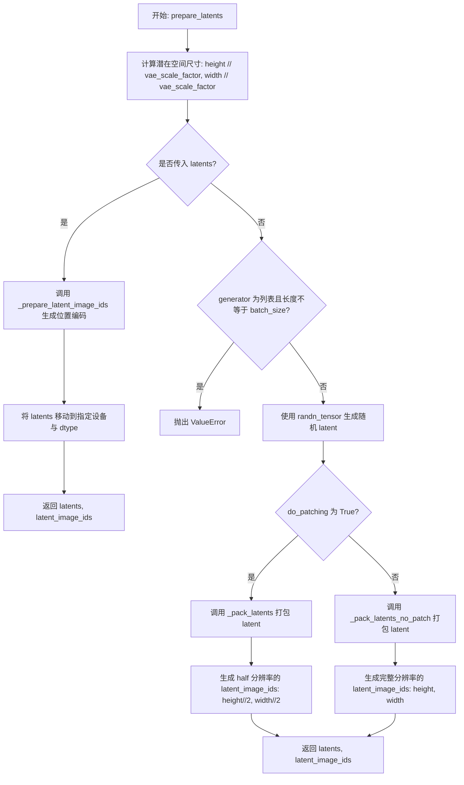

#### 带注释源码

```python
def prepare_latents(
    self,
    batch_size,                      # int: 批次大小
    num_channels_latents,            # int: latent 通道数
    height,                          # int: 图像高度（像素）
    width,                           # int: 图像宽度（像素）
    dtype,                           # torch.dtype: 数据类型
    device,                          # torch.device: 计算设备
    generator,                       # torch.Generator | list[torch.Generator] | None: 随机生成器
    latents=None,                    # torch.FloatTensor | None: 可选的预生成 latent
    do_patching=False,               # bool: 是否启用分块打包策略
):
    # 1. 将像素空间的尺寸转换为潜在空间的尺寸（VAE 缩放因子）
    height = int(height) // self.vae_scale_factor
    width = int(width) // self.vae_scale_factor

    # 2. 确定潜在变量的完整形状 [batch, channels, latent_h, latent_w]
    shape = (batch_size, num_channels_latents, height, width)

    # 3. 如果传入了 latents，直接复用并生成对应的位置编码 ID
    if latents is not None:
        latent_image_ids = self._prepare_latent_image_ids(batch_size, height, width, device, dtype)
        return latents.to(device=device, dtype=dtype), latent_image_ids

    # 4. 校验 generator 列表长度与 batch_size 是否匹配
    if isinstance(generator, list) and len(generator) != batch_size:
        raise ValueError(
            f"You have passed a list of generators of length {len(generator)}, but requested an effective batch"
            f" size of {batch_size}. Make sure the batch size matches the length of the generators."
        )

    # 5. 使用随机张量初始化 latents（从标准正态分布采样）
    latents = randn_tensor(shape, generator=generator, device=device, dtype=dtype)

    # 6. 根据 do_patching 标志选择不同的打包策略
    if do_patching:
        # 6a. 分块模式：将 latents 打包为 [batch, (h//2)*(w//2), channels*4] 的形式
        #     同时生成对应半分辨率的图像位置编码（适配分块 Transformer 的空间划分）
        latents = self._pack_latents(latents, batch_size, num_channels_latents, height, width)
        latent_image_ids = self._prepare_latent_image_ids(batch_size, height // 2, width // 2, device, dtype)
    else:
        # 6b. 非分块模式：将 latents 打包为 [batch, h*w, channels] 的形式
        #     生成完整分辨率的图像位置编码
        latents = self._pack_latents_no_patch(latents, batch_size, num_channels_latents, height, width)
        latent_image_ids = self._prepare_latent_image_ids(batch_size, height, width, device, dtype)

    # 7. 返回处理后的 latents 和对应的图像位置编码 ID
    return latents, latent_image_ids
```


### `BriaFiboPipeline._prepare_attention_mask`

该方法是一个静态方法，用于将原始的注意力掩码（通常为0/1值）转换为Transformer注意力机制所需的掩码格式。通过计算注意力掩码的外积生成完整的注意力矩阵，并将有效位置设为0.0（保留），无效位置设为负无穷（-inf），使得Softmax计算时自动将这些位置的注意力权重置零。

参数：

- `attention_mask`：`torch.Tensor`，原始的注意力掩码张量，形状为 (batch_size, seq_len)，值为0或1

返回值：`torch.Tensor`，转换后的注意力矩阵，形状为 (batch_size, seq_len, seq_len)，其中有效位置为0.0，无效位置为-inf

#### 流程图

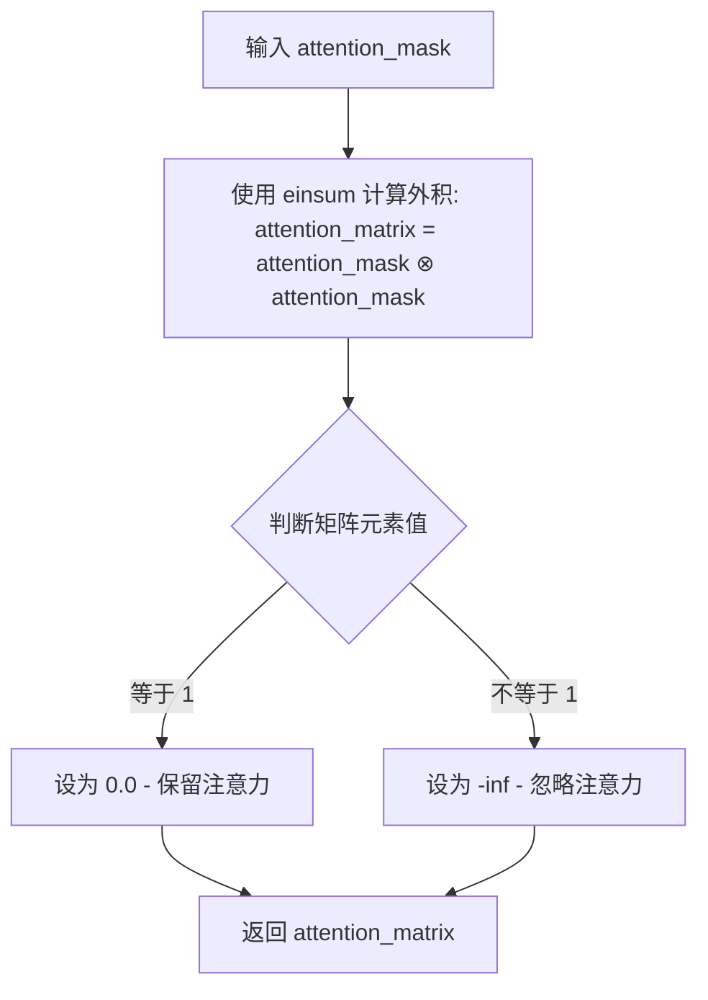

#### 带注释源码

```python
@staticmethod
def _prepare_attention_mask(attention_mask):
    """
    将原始注意力掩码转换为注意力矩阵掩码格式
    
    Args:
        attention_mask: 原始注意力掩码，形状为 (batch_size, seq_len)
                       值为1表示有效token，0表示padding或无效token
    
    Returns:
        attention_matrix: 转换后的注意力矩阵掩码，形状为 (batch_size, seq_len, seq_len)
                         0.0 表示保留注意力，-inf 表示忽略注意力
    """
    # 步骤1: 计算注意力掩码的外积
    # 使用 einsum "bi,bj->bij" 计算 batch-wise 外积
    # 输入: (batch_size, seq_len) -> 输出: (batch_size, seq_len, seq_len)
    # 这样每个token都会与所有其他token产生注意力关系
    attention_matrix = torch.einsum("bi,bj->bij", attention_mask, attention_mask)

    # 步骤2: 转换掩码值
    # 原始mask中值为1表示有效token
    # 转换为注意力格式:
    #   - 值为1的位置 -> 0.0 (保留注意力，允许计算)
    #   - 值为0的位置 -> -inf (忽略注意力，Softmax后权重为0)
    attention_matrix = torch.where(
        attention_matrix == 1, 0.0, -torch.inf
    )  # Apply -inf to ignored tokens for nulling softmax score
    
    return attention_matrix
```


### `BriaFiboPipeline.__call__`

这是BriaFiboPipeline的核心推理方法，负责根据文本提示生成图像。该方法实现了完整的扩散模型推理流程，包括输入验证、提示词编码、潜在变量初始化、调度器配置、去噪循环执行以及最终的潜在变量解码。

参数：

- `prompt`：`str | list[str]`，要引导图像生成的提示词。如果未定义，则必须传递`prompt_embeds`
- `height`：`int | None`，生成图像的高度（像素），默认为`self.default_sample_size * self.vae_scale_factor`
- `width`：`int | None`，生成图像的宽度（像素），默认为`self.default_sample_size * self.vae_scale_factor`
- `num_inference_steps`：`int`，去噪步数，默认为30
- `timesteps`：`list[int]`，自定义时间步，用于支持调度器的`timesteps`参数
- `guidance_scale`：`float`，分类器自由引导（CFG）比例，默认为5.0
- `negative_prompt`：`str | list[str] | None`，不引导图像生成的提示词，当guidance_scale < 1时被忽略
- `num_images_per_prompt`：`int | None`，每个提示词生成的图像数量，默认为1
- `generator`：`torch.Generator | list[torch.Generator] | None`，随机数生成器，用于确保生成的可确定性
- `latents`：`torch.FloatTensor | None`预生成的噪声潜在变量，用于图像生成
- `prompt_embeds`：`torch.FloatTensor | None`，预生成的文本嵌入，用于提示词调优
- `negative_prompt_embeds`：`torch.FloatTensor | None`，预生成的负面文本嵌入
- `output_type`：`str | None`，输出格式，可选"pil"或"latent"，默认为"pil"
- `return_dict`：`bool`，是否返回字典格式，默认为True
- `joint_attention_kwargs`：`dict[str, Any] | None`，传递给注意力处理器的参数字典
- `callback_on_step_end`：`Callable[[int, int], None] | None`，每个去噪步骤结束时调用的回调函数
- `callback_on_step_end_tensor_inputs`：`list[str]`，回调函数接收的张量输入列表，默认为["latents"]
- `max_sequence_length`：`int`，提示词的最大序列长度，默认为3000
- `do_patching`：`bool`，是否使用潜在变量修补，默认为False

返回值：`BriaFiboPipelineOutput`，包含生成的图像列表

#### 流程图

```mermaid
flowchart TD
    A[开始 __call__] --> B[检查并设置height/width默认值]
    B --> C[调用check_inputs验证输入参数]
    C --> D[设置guidance_scale/joint_attention_kwargs/interrupt标志]
    D --> E[确定batch_size]
    E --> F[调用encode_prompt编码提示词]
    F --> G[处理guidance_scale > 1的情况<br/>拼接negative和positive prompt_embeds]
    G --> H[准备transformer层数对应的prompt_layers]
    H --> I[调用prepare_latents初始化潜在变量和latent_image_ids]
    I --> J[准备attention_mask并处理为联合注意力格式]
    J --> K[计算动态调度的sigma偏移量mu]
    K --> L[调用retrieve_timesteps初始化调度器时间步]
    L --> M[设置num_warmup_steps和_num_timesteps]
    M --> N[准备去噪循环]
    N --> O{循环: for i, t in enumerate(timesteps)}
    O --> P[检查interrupt标志]
    P --> Q[如果是guidance_scale>1则扩展latent_model_input]
    Q --> R[扩展timestep到batch维度]
    R --> S[调用transformer进行前向传播获取noise_pred]
    S --> T{guidance_scale > 1?}
    T -->|Yes| U[执行CFG引导: noise_pred = noise_pred_uncond + guidance_scale * (noise_pred_text - noise_pred_uncond)]
    T -->|No| V[不执行引导]
    U --> W
    V --> W[调用scheduler.step计算上一步的latents]
    W --> X{callback_on_step_end非空?}
    X -->|Yes| Y[调用回调函数处理latents和prompt_embeds]
    X -->|No| Z[跳过回调]
    Y --> AA
    Z --> AA{是否是最后一个timestep或warmup完成?}
    AA -->|Yes| AB[更新progress_bar]
    AA -->|No| AC[不更新]
    AB --> AD{XLA_AVAILABLE?}
    AC --> AD
    AD -->|Yes| AE[执行xm.mark_step]
    AD -->|No| AF[跳过]
    AE --> O
    AF --> O
    O --> AG{去噪循环结束?}
    AG -->|No| O
    AG -->|Yes| AH{output_type == 'latent'?}
    AH -->|Yes| AI[直接返回latents作为image]
    AH -->|No| AJ[根据do_patching选择_unpack_latents或_unpack_latents_no_patch]
    AJ --> AK[对latents进行缩放处理: latents_scaled = latents / latents_std + latents_mean]
    AK --> AL[循环调用vae.decode解码每个latent]
    AL --> AM[调用image_processor后处理图像]
    AM --> AN[堆叠所有图像]
    AN --> AO[调用maybe_free_model_hooks释放模型]
    AO --> AP{return_dict == True?}
    AP -->|Yes| AQ[返回BriaFiboPipelineOutput对象]
    AP -->|No| AR[返回元组 (image,)]
    AI --> AO
    AQ --> AR[结束]
    AR --> AS[流程结束]
```

#### 带注释源码

```python
@torch.no_grad()
@replace_example_docstring(EXAMPLE_DOC_STRING)
def __call__(
    self,
    prompt: str | list[str] = None,
    height: int | None = None,
    width: int | None = None,
    num_inference_steps: int = 30,
    timesteps: list[int] = None,
    guidance_scale: float = 5,
    negative_prompt: str | list[str] | None = None,
    num_images_per_prompt: int | None = 1,
    generator: torch.Generator | list[torch.Generator] | None = None,
    latents: torch.FloatTensor | None = None,
    prompt_embeds: torch.FloatTensor | None = None,
    negative_prompt_embeds: torch.FloatTensor | None = None,
    output_type: str | None = "pil",
    return_dict: bool = True,
    joint_attention_kwargs: dict[str, Any] | None = None,
    callback_on_step_end: Callable[[int, int], None] | None = None,
    callback_on_step_end_tensor_inputs: list[str] = ["latents"],
    max_sequence_length: int = 3000,
    do_patching=False,
):
    r"""
    Function invoked when calling the pipeline for generation.

    Args:
        prompt (`str` or `list[str]`, *optional*):
            The prompt or prompts to guide the image generation. If not defined, one has to pass `prompt_embeds`.
            instead.
        height (`int`, *optional*, defaults to self.unet.config.sample_size * self.vae_scale_factor):
            The height in pixels of the generated image. This is set to 1024 by default for the best results.
        width (`int`, *optional*, defaults to self.unet.config.sample_size * self.vae_scale_factor):
            The width in pixels of the generated image. This is set to 1024 by default for the best results.
        num_inference_steps (`int`, *optional*, defaults to 50):
            The number of denoising steps. More denoising steps usually lead to a higher quality image at the
            expense of slower inference.
        timesteps (`list[int]`, *optional*):
            Custom timesteps to use for the denoising process with schedulers which support a `timesteps` argument
            in their `set_timesteps` method. If not defined, the default behavior when `num_inference_steps` is
            passed will be used. Must be in descending order.
        guidance_scale (`float`, *optional*, defaults to 5.0):
            Guidance scale as defined in [Classifier-Free Diffusion
            Guidance](https://huggingface.co/papers/2207.12598). `guidance_scale` is defined as `w` of equation 2.
            of [Imagen Paper](https://huggingface.co/papers/2205.11487). Guidance scale is enabled by setting
            `guidance_scale > 1`. Higher guidance scale encourages to generate images that are closely linked to
            the text `prompt`, usually at the expense of lower image quality.
        negative_prompt (`str` or `list[str]`, *optional*):
            The prompt or prompts not to guide the image generation. If not defined, one has to pass
            `negative_prompt_embeds` instead. Ignored when not using guidance (i.e., ignored if `guidance_scale` is
            less than `1`).
        num_images_per_prompt (`int`, *optional*, defaults to 1):
            The number of images to generate per prompt.
        generator (`torch.Generator` or `list[torch.Generator]`, *optional*):
            One or a list of [torch generator(s)](https://pytorch.org/docs/stable/generated/torch.Generator.html)
            to make generation deterministic.
        latents (`torch.FloatTensor`, *optional*):
            Pre-generated noisy latents, sampled from a Gaussian distribution, to be used as inputs for image
            generation. Can be used to tweak the same generation with different prompts. If not provided, a latents
            tensor will ge generated by sampling using the supplied random `generator`.
        prompt_embeds (`torch.FloatTensor`, *optional*):
            Pre-generated text embeddings. Can be used to easily tweak text inputs, *e.g.* prompt weighting. If not
            provided, text embeddings will be generated from `prompt` input argument.
        negative_prompt_embeds (`torch.FloatTensor`, *optional*):
            Pre-generated negative text embeddings. Can be used to easily tweak text inputs, *e.g.* prompt
            weighting. If not provided, negative_prompt_embeds will be generated from `negative_prompt` input
            argument.
        output_type (`str`, *optional*, defaults to `"pil"`):
            The output format of the generate image. Choose between
            [PIL](https://pillow.readthedocs.io/en/stable/): `PIL.Image.Image` or `np.array`.
        return_dict (`bool`, *optional*, defaults to `True`):
            Whether or not to return a [`~pipelines.stable_diffusion_xl.StableDiffusionXLPipelineOutput`] instead
            of a plain tuple.
        joint_attention_kwargs (`dict`, *optional*):
            A kwargs dictionary that if specified is passed along to the `AttentionProcessor` as defined under
            `self.processor` in
            [diffusers.models.attention_processor](https://github.com/huggingface/diffusers/blob/main/src/diffusers/models/attention_processor.py).
        callback_on_step_end (`Callable`, *optional*):
            A function that calls at the end of each denoising steps during the inference. The function is called
            with the following arguments: `callback_on_step_end(self: DiffusionPipeline, step: int, timestep: int,
            callback_kwargs: Dict)`. `callback_kwargs` will include a list of all tensors as specified by
            `callback_on_step_end_tensor_inputs`.
        callback_on_step_end_tensor_inputs (`List`, *optional*):
            The list of tensor inputs for the `callback_on_step_end` function. The tensors specified in the list
            will be passed as `callback_kwargs` argument. You will only be able to include variables listed in the
            `._callback_tensor_inputs` attribute of your pipeline class.
        max_sequence_length (`int` defaults to 3000): Maximum sequence length to use with the `prompt`.
        do_patching (`bool`, *optional*, defaults to `False`): Whether to use patching.
    Examples:
      Returns:
        [`~pipelines.flux.BriaFiboPipelineOutput`] or `tuple`: [`~pipelines.flux.BriaFiboPipelineOutput`] if
        `return_dict` is True, otherwise a `tuple`. When returning a tuple, the first element is a list with the
        generated images.
    """

    # 步骤1: 设置默认的height和width，使用default_sample_size * vae_scale_factor
    height = height or self.default_sample_size * self.vae_scale_factor
    width = width or self.default_sample_size * self.vae_scale_factor

    # 步骤2: 检查输入参数合法性
    self.check_inputs(
        prompt=prompt,
        height=height,
        width=width,
        prompt_embeds=prompt_embeds,
        callback_on_step_end_tensor_inputs=callback_on_step_end_tensor_inputs,
        max_sequence_length=max_sequence_length,
    )

    # 设置内部状态变量
    self._guidance_scale = guidance_scale
    self._joint_attention_kwargs = joint_attention_kwargs
    self._interrupt = False

    # 步骤3: 确定batch size
    if prompt is not None and isinstance(prompt, str):
        batch_size = 1
    elif prompt is not None and isinstance(prompt, list):
        batch_size = len(prompt)
    else:
        batch_size = prompt_embeds.shape[0]

    # 获取执行设备
    device = self._execution_device

    # 从joint_attention_kwargs中获取lora_scale
    lora_scale = (
        self.joint_attention_kwargs.get("scale", None) if self.joint_attention_kwargs is not None else None
    )

    # 步骤4: 编码提示词，获取embeddings和attention masks
    (
        prompt_embeds,
        negative_prompt_embeds,
        text_ids,
        prompt_attention_mask,
        negative_prompt_attention_mask,
        prompt_layers,
        negative_prompt_layers,
    ) = self.encode_prompt(
        prompt=prompt,
        negative_prompt=negative_prompt,
        guidance_scale=guidance_scale,
        prompt_embeds=prompt_embeds,
        negative_prompt_embeds=negative_prompt_embeds,
        device=device,
        max_sequence_length=max_sequence_length,
        num_images_per_prompt=num_images_per_prompt,
        lora_scale=lora_scale,
    )
    prompt_batch_size = prompt_embeds.shape[0]

    # 步骤5: 处理分类器自由引导(CFG)
    if guidance_scale > 1:
        # 拼接negative和positive embeddings
        prompt_embeds = torch.cat([negative_prompt_embeds, prompt_embeds], dim=0)
        prompt_layers = [
            torch.cat([negative_prompt_layers[i], prompt_layers[i]], dim=0) for i in range(len(prompt_layers))
        ]
        prompt_attention_mask = torch.cat([negative_prompt_attention_mask, prompt_attention_mask], dim=0)

    # 步骤6: 准备transformer层对应的prompt_layers
    total_num_layers_transformer = len(self.transformer.transformer_blocks) + len(
        self.transformer.single_transformer_blocks
    )
    if len(prompt_layers) >= total_num_layers_transformer:
        # 移除多余的早期层
        prompt_layers = prompt_layers[len(prompt_layers) - total_num_layers_transformer :]
    else:
        # 复制最后一层以补足层数
        prompt_layers = prompt_layers + [prompt_layers[-1]] * (total_num_layers_transformer - len(prompt_layers))

    # 步骤7: 准备潜在变量(latents)
    num_channels_latents = self.transformer.config.in_channels
    if do_patching:
        num_channels_latents = int(num_channels_latents / 4)

    latents, latent_image_ids = self.prepare_latents(
        prompt_batch_size,
        num_channels_latents,
        height,
        width,
        prompt_embeds.dtype,
        device,
        generator,
        latents,
        do_patching,
    )

    # 步骤8: 准备attention mask用于联合注意力
    latent_attention_mask = torch.ones(
        [latents.shape[0], latents.shape[1]], dtype=latents.dtype, device=latents.device
    )
    if guidance_scale > 1:
        latent_attention_mask = latent_attention_mask.repeat(2, 1)

    # 拼接prompt和latent的attention mask
    attention_mask = torch.cat([prompt_attention_mask, latent_attention_mask], dim=1)
    attention_mask = self._prepare_attention_mask(attention_mask)  # batch, seq => batch, seq, seq
    attention_mask = attention_mask.unsqueeze(dim=1).to(dtype=self.transformer.dtype)  # for head broadcasting

    if self._joint_attention_kwargs is None:
        self._joint_attention_kwargs = {}
    self._joint_attention_kwargs["attention_mask"] = attention_mask

    # 步骤9: 动态调度 - 根据分辨率计算sigma偏移
    if do_patching:
        seq_len = (height // (self.vae_scale_factor * 2)) * (width // (self.vae_scale_factor * 2))
    else:
        seq_len = (height // self.vae_scale_factor) * (width // self.vae_scale_factor)

    sigmas = np.linspace(1.0, 1 / num_inference_steps, num_inference_steps)

    mu = calculate_shift(
        seq_len,
        self.scheduler.config.base_image_seq_len,
        self.scheduler.config.max_image_seq_len,
        self.scheduler.config.base_shift,
        self.scheduler.config.max_shift,
    )

    # 初始化sigmas和timesteps，根据偏移量动态调整调度器
    timesteps, num_inference_steps = retrieve_timesteps(
        self.scheduler,
        num_inference_steps=num_inference_steps,
        device=device,
        timesteps=None,
        sigmas=sigmas,
        mu=mu,
    )

    num_warmup_steps = max(len(timesteps) - num_inference_steps * self.scheduler.order, 0)
    self._num_timesteps = len(timesteps)

    # 兼容性处理：支持旧版本的diffusers
    if len(latent_image_ids.shape) == 3:
        latent_image_ids = latent_image_ids[0]

    if len(text_ids.shape) == 3:
        text_ids = text_ids[0]

    # 步骤10: 去噪循环
    with self.progress_bar(total=num_inference_steps) as progress_bar:
        for i, t in enumerate(timesteps):
            # 检查中断标志
            if self.interrupt:
                continue

            # 如果使用CFG，则扩展latents
            latent_model_input = torch.cat([latents] * 2) if guidance_scale > 1 else latents

            # 扩展timestep到batch维度
            timestep = t.expand(latent_model_input.shape[0]).to(
                device=latent_model_input.device, dtype=latent_model_input.dtype
            )

            # 调用transformer进行前向传播，预测噪声
            noise_pred = self.transformer(
                hidden_states=latent_model_input,
                timestep=timestep,
                encoder_hidden_states=prompt_embeds,
                text_encoder_layers=prompt_layers,
                joint_attention_kwargs=self.joint_attention_kwargs,
                return_dict=False,
                txt_ids=text_ids,
                img_ids=latent_image_ids,
            )[0]

            # 执行分类器自由引导
            if guidance_scale > 1:
                noise_pred_uncond, noise_pred_text = noise_pred.chunk(2)
                noise_pred = noise_pred_uncond + self.guidance_scale * (noise_pred_text - noise_pred_uncond)

            # 计算上一步的去噪结果 x_t -> x_{t-1}
            latents_dtype = latents.dtype
            latents = self.scheduler.step(noise_pred, t, latents, return_dict=False)[0]

            # 兼容MPS设备
            if latents.dtype != latents_dtype:
                if torch.backends.mps.is_available():
                    latents = latents.to(latents_dtype)

            # 步骤11: 回调处理
            if callback_on_step_end is not None:
                callback_kwargs = {}
                for k in callback_on_step_end_tensor_inputs:
                    callback_kwargs[k] = locals()[k]
                callback_outputs = callback_on_step_end(self, i, t, callback_kwargs)

                latents = callback_outputs.pop("latents", latents)
                prompt_embeds = callback_outputs.pop("prompt_embeds", prompt_embeds)
                negative_prompt_embeds = callback_outputs.pop("negative_prompt_embeds", negative_prompt_embeds)

            # 更新进度条
            if i == len(timesteps) - 1 or ((i + 1) > num_warmup_steps and (i + 1) % self.scheduler.order == 0):
                progress_bar.update()

            # XLA设备支持
            if XLA_AVAILABLE:
                xm.mark_step()

    # 步骤12: 输出处理
    if output_type == "latent":
        image = latents
    else:
        # 解包latents到标准格式
        if do_patching:
            latents = self._unpack_latents(latents, height, width, self.vae_scale_factor)
        else:
            latents = self._unpack_latents_no_patch(latents, height, width, self.vae_scale_factor)

        latents = latents.unsqueeze(dim=2)
        latents_device = latents[0].device
        latents_dtype = latents[0].dtype
        
        # 根据VAE配置对latents进行缩放
        latents_mean = (
            torch.tensor(self.vae.config.latents_mean)
            .view(1, self.vae.config.z_dim, 1, 1, 1)
            .to(latents_device, latents_dtype)
        )
        latents_std = 1.0 / torch.tensor(self.vae.config.latents_std).view(1, self.vae.config.z_dim, 1, 1, 1).to(
            latents_device, latents_dtype
        )
        latents_scaled = [latent / latents_std + latents_mean for latent in latents]
        latents_scaled = torch.cat(latents_scaled, dim=0)
        
        # 解码latents到图像
        image = []
        for scaled_latent in latents_scaled:
            curr_image = self.vae.decode(scaled_latent.unsqueeze(0), return_dict=False)[0]
            curr_image = self.image_processor.postprocess(curr_image.squeeze(dim=2), output_type=output_type)
            image.append(curr_image)
        
        # 处理单图像或多图像输出
        if len(image) == 1:
            image = image[0]
        else:
            image = np.stack(image, axis=0)

    # 释放所有模型
    self.maybe_free_model_hooks()

    # 返回结果
    if not return_dict:
        return (image,)

    return BriaFiboPipelineOutput(images=image)
```


### `BriaFiboPipeline.check_inputs`

验证输入参数的有效性，确保传入的 prompt、height、width、prompt_embeds 等参数符合 pipeline 的要求，否则抛出相应的 ValueError。

参数：

-  `self`：`BriaFiboPipeline` 实例，pipeline 对象本身
-  `prompt`：`str | list[str] | None`，要生成的文本提示
-  `height`：`int`，生成图像的高度（像素），必须能被 16 整除
-  `width`：`int`，生成图像的宽度（像素），必须能被 16 整除
-  `negative_prompt`：`str | list[str] | None`，不引导图像生成的负面提示
-  `prompt_embeds`：`torch.FloatTensor | None`，预生成的文本嵌入，不能与 prompt 同时传入
-  `negative_prompt_embeds`：`torch.FloatTensor | None`，预生成的负面文本嵌入
-  `callback_on_step_end_tensor_inputs`：`list[str] | None`，每步结束时回调的 tensor 输入列表
-  `max_sequence_length`：`int | None`，最大序列长度，不能超过 3000

返回值：`None`，该方法不返回任何值，仅进行参数验证，若验证失败则抛出 ValueError

#### 流程图

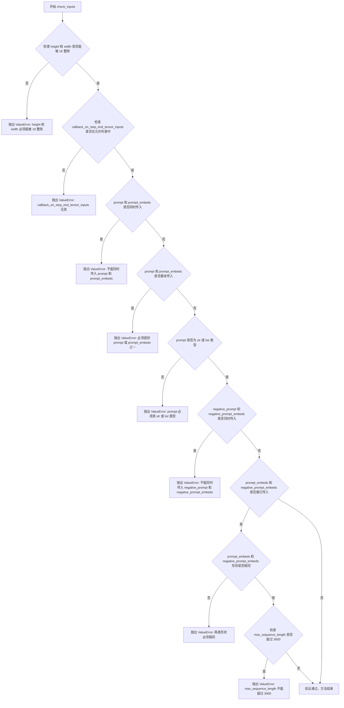

#### 带注释源码

```
def check_inputs(
    self,
    prompt,                      # 用户输入的文本提示，str 或 list[str] 或 None
    height,                      # 生成图像的高度，必须能被 16 整除
    width,                       # 生成图像的宽度，必须能被 16 整除
    negative_prompt=None,       # 负面提示，用于无分类器指导
    prompt_embeds=None,         # 预计算的文本嵌入，与 prompt 二选一
    negative_prompt_embeds=None, # 预计算的负面文本嵌入
    callback_on_step_end_tensor_inputs=None, # 回调函数接收的 tensor 输入列表
    max_sequence_length=None,   # 最大序列长度，上限 3000
):
    # 验证 1: 检查图像尺寸是否为 16 的倍数
    # diffusion model 的 VAE 通常需要 16 倍下采样
    if height % 16 != 0 or width % 16 != 0:
        raise ValueError(f"`height` and `width` have to be divisible by 16 but are {height} and {width}.")

    # 验证 2: 检查回调 tensor 输入是否在允许的列表中
    # 防止传入无效的 tensor 名称导致回调失败
    if callback_on_step_end_tensor_inputs is not None and not all(
        k in self._callback_tensor_inputs for k in callback_on_step_end_tensor_inputs
    ):
        raise ValueError(
            f"`callback_on_step_end_tensor_inputs` has to be in {self._callback_tensor_inputs}, but found {[k for k in callback_on_step_end_tensor_inputs if k not in self._callback_tensor_inputs]}"
        )

    # 验证 3: prompt 和 prompt_embeds 互斥，不能同时提供
    # 两者都提供会导致语义重复或冲突
    if prompt is not None and prompt_embeds is not None:
        raise ValueError(
            f"Cannot forward both `prompt`: {prompt} and `prompt_embeds`: {prompt_embeds}. Please make sure to"
            " only forward one of the two."
        )
    # 验证 4: 必须至少提供 prompt 或 prompt_embeds 之一
    elif prompt is None and prompt_embeds is None:
        raise ValueError(
            "Provide either `prompt` or `prompt_embeds`. Cannot leave both `prompt` and `prompt_embeds` undefined."
        )
    # 验证 5: prompt 类型检查，必须是字符串或字符串列表
    elif prompt is not None and (not isinstance(prompt, str) and not isinstance(prompt, list)):
        raise ValueError(f"`prompt` has to be of type `str` or `list` but is {type(prompt)}")

    # 验证 6: negative_prompt 和 negative_prompt_embeds 互斥
    if negative_prompt is not None and negative_prompt_embeds is not None:
        raise ValueError(
            f"Cannot forward both `negative_prompt`: {negative_prompt} and `negative_prompt_embeds`:"
            f" {negative_prompt_embeds}. Please make sure to only forward one of the two."
        )

    # 验证 7: 如果两者都提供了，形状必须一致（用于 classifier-free guidance）
    if prompt_embeds is not None and negative_prompt_embeds is not None:
        if prompt_embeds.shape != negative_prompt_embeds.shape:
            raise ValueError(
                "`prompt_embeds` and `negative_prompt_embeds` must have the same shape when passed directly, but"
                f" got: `prompt_embeds` {prompt_embeds.shape} != `negative_prompt_embeds`"
                f" {negative_prompt_embeds.shape}."
            )

    # 验证 8: 最大序列长度限制
    # 防止过长序列导致内存问题
    if max_sequence_length is not None and max_sequence_length > 3000:
        raise ValueError(f"`max_sequence_length` cannot be greater than 3000 but is {max_sequence_length}")
```

## 关键组件


### 张量索引与惰性加载

负责将潜在表示打包/解包为二维张量网格，并支持模型CPU卸载与延迟初始化。

### 反量化支持

在VAE解码前，通过latents_mean和latents_std对缩放后的潜在变量进行反标准化处理。

### 量化策略

集成PEFT后端实现LoRA动态权重缩放，支持通过lora_scale参数调整适配器影响力。

### 模型卸载序列

定义text_encoder→text_encoder_2→image_encoder→transformer→vae的CPU卸载顺序以优化显存。

### 潜在变量打包

_unpack_latents和_pack_latents实现二维图像 latent 的空间维度重组与patchify操作。

### 潜在图像ID生成

_prepare_latent_image_ids生成二维位置编码，用于transformer中的图像token空间感知。

### 动态调度偏移

calculate_shift根据图像序列长度动态计算sigma偏移量，实现分辨率自适应的噪声调度。

### 文本嵌入填充

pad_embedding将文本嵌入对齐至最大token长度并保留attention mask结构。


## 问题及建议


### 已知问题

-   **重复代码逻辑**：`get_prompt_embeds` 和 `encode_prompt` 中存在大量重复的文本编码逻辑；`_unpack_latents` 与 `_unpack_latents_no_patch`、`_pack_latents` 与 `_pack_latents_no_patch` 功能高度相似，可合并为通用方法。
-   **硬编码值分散**：`bot_token_id=128000`、`vae_scale_factor=16`、`default_sample_size=64`、`max_sequence_length=3000` 等关键配置散落在多处，修改时需同步多处代码。
-   **类型注解不完整**：`prepare_latents` 方法的多个参数缺少类型注解（如 `batch_size`、`num_channels_latents`、`dtype`、`device`、`generator`、`latents`、`do_patching`），影响代码可读性和 IDE 辅助。
-   **条件判断重复**：`if guidance_scale > 1` 在 `__call__` 方法中重复出现 5 次以上，可提取为辅助方法或变量。
-   **类型检查使用 isinstance 不当**：`isinstance(self, FluxLoraLoaderMixin)` 在 `encode_prompt` 中使用不合理，应使用 `hasattr` 或其他方式判断特性。
-   **内存使用低效**：VAE 解码部分使用 `for` 循环逐个处理 latents（`for scaled_latent in latents_scaled`），未利用批量处理优势。
-   **复杂条件判断**：`if prompt is not None and type(prompt) is not type(negative_prompt)` 等逻辑可读性差，易出错。
-   **缺失的错误处理**：部分边界情况未处理，如 `prompt_layers` 长度与 `total_num_layers_transformer` 差异过大时的处理逻辑简单且可能不符合预期。

### 优化建议

-   **提取公共方法**：将文本编码、latent 打包/解包的重复逻辑提取为私有方法或工具函数，减少代码冗余。
-   **配置集中管理**：创建配置类或使用 dataclass 集中管理硬编码的魔法数字和默认值，提高可维护性。
-   **完善类型注解**：为所有方法参数和返回值添加完整的类型注解，使用 Python 3.10+ 的联合类型语法提升代码清晰度。
-   **提取条件变量**：将 `guidance_scale > 1` 等重复条件提取为布尔变量（如 `use_cfg`），简化代码逻辑。
-   **改进类型检查**：使用 `hasattr(self, '_lora_scale')` 或 `callable(getattr(self, 'scale_lora_layers', None))` 等方式替代 `isinstance` 检查 mixin。
-   **批量处理优化**：修改 VAE 解码部分，使用批量解码替代循环处理，减少 GPU 上下文切换开销。
-   **简化条件逻辑**：使用 `prompt_embeds is None` 作为主判断分支，将 `negative_prompt` 相关检查提取为独立方法。
-   **增强文档**：为静态方法 `_unpack_latents`、`_pack_latents` 等添加更详细的文档说明其功能差异和适用场景。

## 其它


### 设计目标与约束

本Pipeline的设计目标是为Bria FIBO模型提供一个高效、灵活的图像生成管道，支持基于文本提示的图像合成。主要约束包括：(1) 仅支持非商业用途，遵循CC-BY-NC-4.0许可证；(2) 必须与diffusers库架构兼容；(3) 支持LoRA微调功能；(4) 内存占用需通过CPU offload机制优化；(5) 图像尺寸需被16整除；(6) 最大序列长度限制为3000。

### 错误处理与异常设计

代码中的错误处理主要通过以下机制实现：(1) 输入验证 - `check_inputs`方法验证prompt与prompt_embeds的互斥关系、高宽倍数要求、序列长度限制等；(2) 类型检查 - 验证negative_prompt与prompt类型一致性、batch_size匹配等；(3) 数值校验 - 确保guidance_scale、num_inference_steps等参数有效；(4) 异常抛出 - 使用ValueError和TypeError明确指出错误原因。潜在改进空间：可增加更多细粒度的异常类型定义，提供更详细的错误码和恢复建议。

### 数据流与状态机

Pipeline的数据流遵循以下状态转换：(1) 初始状态 - 接收prompt或prompt_embeds；(2) 编码状态 - 通过text_encoder和tokenizer处理文本得到embedding；(3) 潜在空间准备状态 - 初始化随机潜在向量或使用提供的latents；(4) 去噪迭代状态 - 遍历timesteps执行transformer推理和scheduler步骤；(5) 解码状态 - VAE将潜在向量解码为图像；(6) 后处理状态 - 图像格式转换和归一化。状态转换由`__call__`方法主循环控制，支持通过interrupt属性中断。

### 外部依赖与接口契约

本模块依赖以下核心外部组件：(1) `transformers`库 - 提供SmolLM3ForCausalLM文本编码器和AutoTokenizer；(2) `diffusers`库 - 提供DiffusionPipeline基类、调度器和工具函数；(3) `torch` - 深度学习计算后端；(4) `numpy` - 数值计算；(5) `torch_xla` - 可选的XLA设备支持。接口契约包括：(1) transformer必须实现BriaFiboTransformer2DModel接口；(2) vae必须实现AutoencoderKLWan接口；(3) scheduler必须兼容FlowMatchEulerDiscreteScheduler或KarrasDiffusionSchedulers；(4) 输出必须符合BriaFiboPipelineOutput格式。

### 配置参数说明

关键配置参数包括：(1) `vae_scale_factor` - 设为16，用于潜在空间与像素空间的缩放；(2) `default_sample_size` - 默认为64，决定默认输出分辨率；(3) `model_cpu_offload_seq` - 定义模型卸载顺序"text_encoder->text_encoder_2->image_encoder->transformer->vae"；(4) `guidance_scale` - 分类器自由引导权重，默认为5.0；(5) `max_sequence_length` - 文本编码最大长度，默认3000；(6) `do_patching` - 是否使用patching模式，影响潜在向量打包方式。

### 性能考虑与优化建议

当前实现包含以下性能优化机制：(1) 模型CPU卸载 - 通过enable_model_cpu_offload()减少显存占用；(2) 推理模式 - 使用@torch.no_grad()和torch.inference_mode()禁用梯度计算；(3) 动态调度 - 支持基于分辨率的动态sigma计算；(4) XLA支持 - 可选的torch_xla集成。优化建议：(1) 可考虑启用gradient checkpointing以支持更大分辨率；(2) 可增加量化推理支持（INT8/INT4）；(3) 批量生成时可复用prompt_embeds减少重复计算；(4) 可添加ONNX/Core ML导出支持。

### 安全性考虑

代码中的安全考量包括：(1) 远程代码执行控制 - 使用trust_remote_code=True需谨慎；(2) 内存安全 - 处理大型潜在向量时防止OOM；(3) 输入 sanitization - prompt长度和内容的基础验证。潜在安全风险：(1) 生成的图像可能被用于恶意目的；(2) 模型权重来源需验证；(3) LoRA加载涉及动态代码执行。

### 版本兼容性

代码设计考虑了以下兼容性需求：(1) 支持新旧版本diffusers的timesteps处理差异（通过shape检查适配）；(2) scheduler配置需与transformer版本匹配；(3) torch版本兼容性依赖diffusers库处理。需注意：某些功能可能需要特定版本的transformers和diffusers库支持。


    