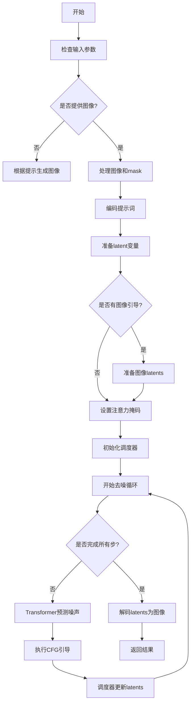
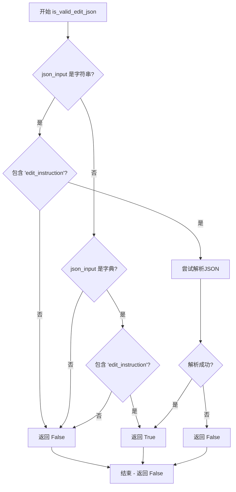
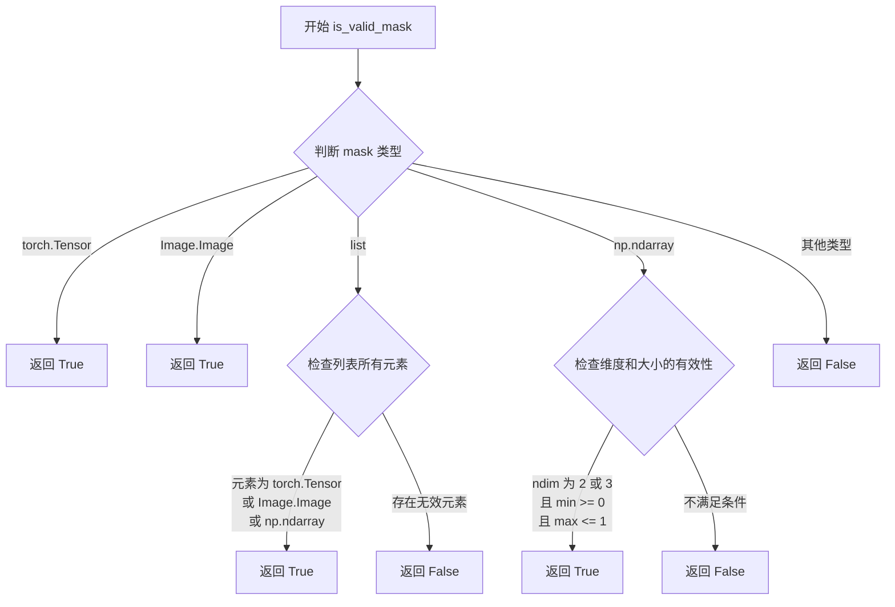
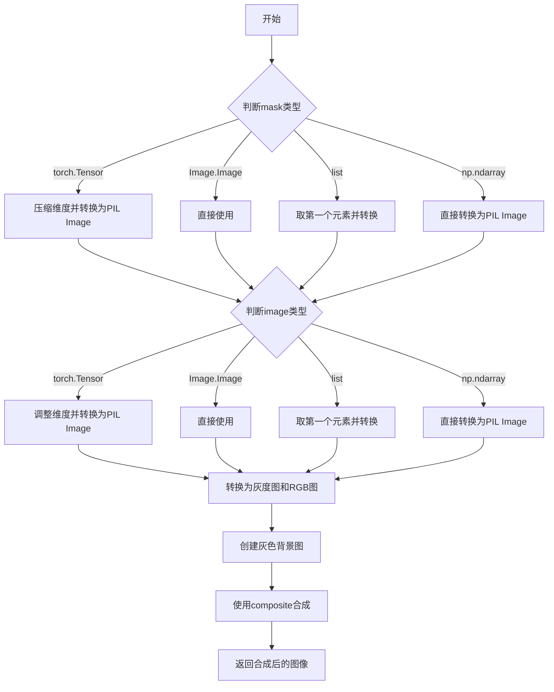
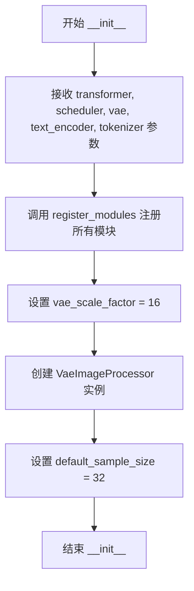
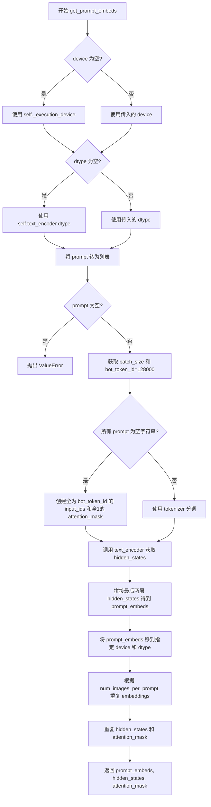
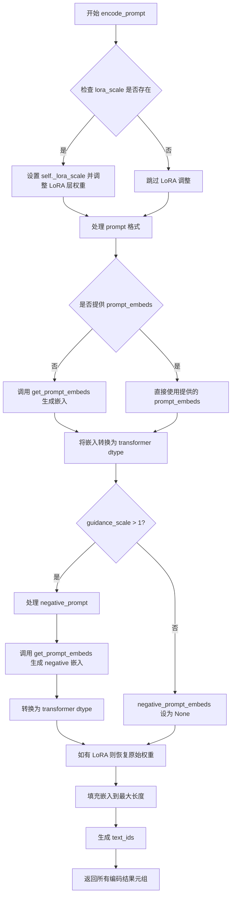
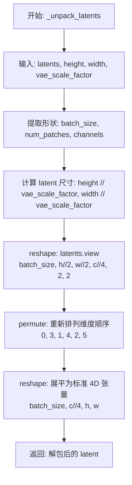
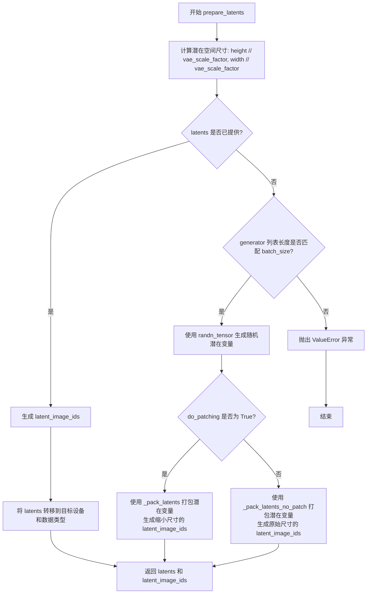
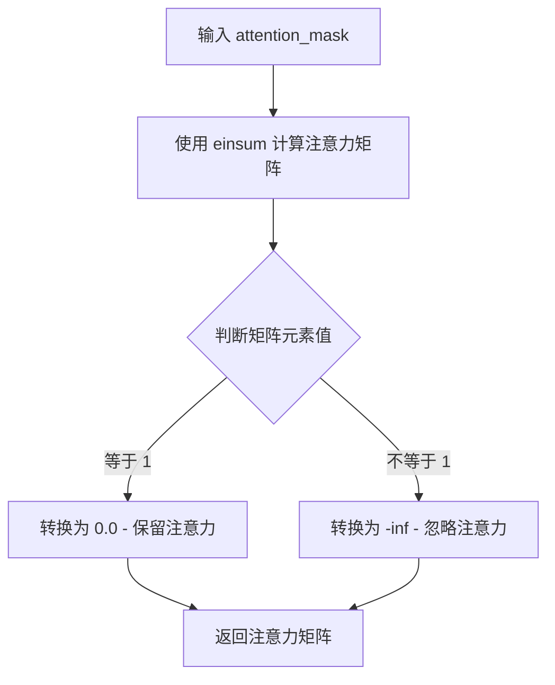

# `diffusers\src\diffusers\pipelines\bria_fibo\pipeline_bria_fibo_edit.py` 详细设计文档

BriaFiboEditPipeline是一个基于扩散模型的图像编辑管道，结合Flux架构和LoRA加载器，支持通过文本提示对图像进行编辑，支持mask引导的局部编辑、动态调度和分类器自由引导（CFG），可处理多种输入格式并输出 PIL、numpy 或 latent 格式的图像。

## 整体流程



## 类结构

```
DiffusionPipeline (基类)
└── BriaFiboEditPipeline
    └── FluxLoraLoaderMixin (混入类)
```

## 全局变量及字段


### `XLA_AVAILABLE`
    
Flag indicating whether PyTorch XLA is available for TPU support

类型：`bool`
    


### `logger`
    
Logger instance for recording runtime information and warnings

类型：`logging.Logger`
    


### `PipelineMaskInput`
    
Type alias for mask input supporting torch tensors, PIL images, lists, or numpy arrays

类型：`UnionType`
    


### `EXAMPLE_DOC_STRING`
    
Documentation string containing usage examples for the pipeline

类型：`str`
    


### `PREFERRED_RESOLUTION`
    
Dictionary mapping resolution values to list of preferred (width, height) tuples for image generation

类型：`Dict`
    


### `BriaFiboEditPipeline.vae`
    
Variational autoencoder for encoding and decoding images to latent representations

类型：`AutoencoderKLWan`
    


### `BriaFiboEditPipeline.text_encoder`
    
Small language model for encoding input text prompts into embeddings

类型：`SmolLM3ForCausalLM`
    


### `BriaFiboEditPipeline.tokenizer`
    
Tokenizer for converting text prompts to token IDs

类型：`AutoTokenizer`
    


### `BriaFiboEditPipeline.transformer`
    
Transformer model for 2D diffusion process to generate images from latents

类型：`BriaFiboTransformer2DModel`
    


### `BriaFiboEditPipeline.scheduler`
    
Scheduler for controlling the denoising process during image generation

类型：`Union[FlowMatchEulerDiscreteScheduler, KarrasDiffusionSchedulers]`
    


### `BriaFiboEditPipeline.vae_scale_factor`
    
Scaling factor for VAE latent space to determine output resolution

类型：`int`
    


### `BriaFiboEditPipeline.image_processor`
    
Processor for handling image preprocessing and postprocessing

类型：`VaeImageProcessor`
    


### `BriaFiboEditPipeline.default_sample_size`
    
Default sample size for latent space dimensions

类型：`int`
    


### `BriaFiboEditPipeline.model_cpu_offload_seq`
    
Sequence string defining the order for CPU offloading of models

类型：`str`
    


### `BriaFiboEditPipeline._callback_tensor_inputs`
    
List of tensor input names allowed in callback functions

类型：`List[str]`
    


### `BriaFiboEditPipeline._guidance_scale`
    
Scale factor for classifier-free guidance to control prompt adherence

类型：`float`
    


### `BriaFiboEditPipeline._joint_attention_kwargs`
    
Dictionary of parameters for joint attention mechanism

类型：`Dict`
    


### `BriaFiboEditPipeline._num_timesteps`
    
Number of denoising steps to perform in the generation process

类型：`int`
    


### `BriaFiboEditPipeline._interrupt`
    
Flag to signal interruption of the generation loop

类型：`bool`
    
    

## 全局函数及方法


### `is_valid_edit_json`

该函数用于验证输入是否为有效的JSON字符串或字典，并且包含"edit_instruction"键。这是图像编辑管道中的验证函数，确保用户提供的编辑指令符合预期的JSON格式。

参数：

-  `json_input`：`str | dict`，需要验证的JSON字符串或字典对象

返回值：`bool`，如果输入是有效的JSON字符串或字典且包含"edit_instruction"键返回True，否则返回False

#### 流程图



#### 带注释源码

```python
def is_valid_edit_json(json_input: str | dict):
    """
    Check if the input is a valid JSON string or dict with an "edit_instruction" key.

    Args:
        json_input (`str` or `dict`):
            The JSON string or dict to check.

    Returns:
        `bool`: True if the input is a valid JSON string or dict with an "edit_instruction" key, False otherwise.
    """
    try:
        # 检查输入是否为字符串且包含edit_instruction键
        if isinstance(json_input, str) and "edit_instruction" in json_input:
            # 尝试解析JSON字符串以验证其有效性
            json.loads(json_input)
            return True
        # 检查输入是否为字典且包含edit_instruction键
        elif isinstance(json_input, dict) and "edit_instruction" in json_input:
            return True
        else:
            return False
    except json.JSONDecodeError:
        # 捕获JSON解析错误，返回False
        return False
```


### `is_valid_mask`

检查给定的掩码（mask）是否为有效的掩码格式。该函数支持多种掩码类型，包括 PyTorch 张量、PIL 图像、NumPy 数组以及它们的列表形式，并对 NumPy 数组进行额外的维度和大小的有效性验证。

参数：

-  `mask`：`PipelineMaskInput`，需要验证的掩码对象，可以是 torch.Tensor、Image.Image、np.ndarray 或它们的列表

返回值：`bool`，如果掩码有效返回 True，否则返回 False

#### 流程图



#### 带注释源码

```python
def is_valid_mask(mask: PipelineMaskInput):
    """
    Check if the mask is a valid mask.
    
    Args:
        mask: The mask to validate. Can be one of the following types:
            - torch.Tensor: 任何 PyTorch 张量都被视为有效
            - Image.Image: 任何 PIL 图像都被视为有效
            - list: 列表中的每个元素必须是 torch.Tensor、Image.Image 或 np.ndarray
            - np.ndarray: 必须满足维度为 2 或 3，且所有像素值在 [0, 1] 范围内
    
    Returns:
        bool: True if the mask is valid, False otherwise.
    """
    # 检查 mask 是否为 PyTorch 张量
    if isinstance(mask, torch.Tensor):
        return True
    # 检查 mask 是否为 PIL 图像
    elif isinstance(mask, Image.Image):
        return True
    # 检查 mask 是否为列表
    elif isinstance(mask, list):
        # 验证列表中所有元素都是有效的掩码类型
        return all(isinstance(m, (torch.Tensor, Image.Image, np.ndarray)) for m in mask)
    # 检查 mask 是否为 NumPy 数组
    elif isinstance(mask, np.ndarray):
        # 验证维度为 2 或 3（2D 灰度图或 3D 彩色图）
        # 验证像素值在 [0, 1] 范围内
        return mask.ndim in [2, 3] and mask.min() >= 0 and mask.max() <= 1
    # 其他类型视为无效
    else:
        return False
```


### `get_mask_size`

获取掩码（mask）的尺寸大小。

参数：

-  `mask`：`PipelineMaskInput`，需要获取大小的掩码，支持 torch.Tensor、PIL.Image、列表或 numpy.ndarray 类型

返回值：`Tuple[int, int] | List | None`，返回掩码的尺寸，格式为 (height, width)，如果是列表则返回包含各元素尺寸的列表，不支持的类型返回 None

#### 流程图

```mermaid
flowchart TD
    A[开始 get_mask_size] --> B{判断 mask 类型}
    B -->|torch.Tensor| C[返回 mask.shape[-2:]]
    B -->|PIL.Image| D[返回 mask.size[::-1]]
    B -->|list| E[递归调用 get_mask_size]
    B -->|np.ndarray| F[返回 mask.shape[-2:]]
    B -->|其他| G[返回 None]
    E --> H[返回结果列表]
    C --> I[结束]
    D --> I
    F --> I
    G --> I
    H --> I
```

#### 带注释源码

```python
def get_mask_size(mask: PipelineMaskInput):
    """
    获取掩码的尺寸大小。
    
    Args:
        mask: 掩码输入，支持以下类型:
            - torch.Tensor: 返回 shape 的最后两个维度
            - PIL.Image: 返回 (height, width) 格式的尺寸
            - list: 递归处理列表中的每个元素
            - np.ndarray: 返回 shape 的最后两个维度
            - 其他: 返回 None
    
    Returns:
        掩码的尺寸，格式为 (height, width) 或包含多个尺寸的列表
    """
    # 如果是 PyTorch 张量，返回最后两个维度（即 height, width）
    if isinstance(mask, torch.Tensor):
        return mask.shape[-2:]
    # 如果是 PIL 图像，size 属性返回 (width, height)，需要反转
    elif isinstance(mask, Image.Image):
        return mask.size[::-1]  # (height, width)
    # 如果是列表，递归处理每个元素
    elif isinstance(mask, list):
        return [get_mask_size(m) for m in mask]
    # 如果是 NumPy 数组，返回最后两个维度
    elif isinstance(mask, np.ndarray):
        return mask.shape[-2:]
    # 不支持的类型返回 None
    else:
        return None
```


### `get_image_size`

该函数用于获取不同类型输入图像的尺寸（高度和宽度）。它通过检查输入的类型（PyTorch 张量、PIL 图像或列表）并返回相应的尺寸元组，支持递归处理图像列表。

参数：
- `image`：`PipelineImageInput`，输入的图像数据，支持 `torch.Tensor`, `PIL.Image.Image`, `List[Image.Image]` 等类型。

返回值：`Union[Tuple[int, int], List[Any], None]`，返回图像的高度和宽度组成的元组 `(height, width)`，如果是列表则返回包含各图像尺寸的列表，否则返回 `None`。

#### 流程图

```mermaid
flowchart TD
    A([开始 get_image_size]) --> B{isinstance(image, torch.Tensor)?}
    B -- 是 --> C[返回 image.shape[-2:]]
    B -- 否 --> D{isinstance(image, Image.Image)?}
    D -- 是 --> E[返回 image.size[::-1]]
    D -- 否 --> F{isinstance(image, list)?}
    F -- 是 --> G[递归调用 get_image_size 处理列表中的每个元素]
    F -- 否 --> H([返回 None])
    
    C --> I([结束])
    E --> I
    G --> I
    H --> I
```

#### 带注释源码

```python
def get_image_size(image: PipelineImageInput):
    """
    Get the size of the image.
    """
    # 如果输入是 PyTorch 张量，直接获取其形状的最后两个维度（即高度和宽度）
    if isinstance(image, torch.Tensor):
        return image.shape[-2:]
    # 如果输入是 PIL 图像，获取其尺寸属性并反转顺序（因为 PIL size 是 width, height）
    elif isinstance(image, Image.Image):
        return image.size[::-1]  # (height, width)
    # 如果输入是列表，递归处理列表中的每个图像
    elif isinstance(image, list):
        return [get_image_size(i) for i in image]
    # 其他不支持的类型返回 None
    else:
        return None
```


### `paste_mask_on_image`

将mask和image转换为PIL图像，并通过灰度合成方式将mask粘贴到image上，返回组合后的RGB图像。

参数：

- `mask`：`PipelineMaskInput`（torch.FloatTensor | Image.Image | List[Image.Image] | List[torch.FloatTensor] | np.ndarray | List[np.ndarray]），需要粘贴到图像上的mask，支持多种格式
- `image`：`PipelineImageInput`（torch.Tensor | Image.Image | List[Image.Image] | List[torch.Tensor]），需要粘贴mask的目标图像

返回值：`PIL.Image.Image`，返回组合后的RGB图像

#### 流程图



#### 带注释源码

```python
def paste_mask_on_image(mask: PipelineMaskInput, image: PipelineImageInput):
    """convert mask and image to PIL Images and paste the mask on the image"""
    # 处理mask的各种输入格式
    if isinstance(mask, torch.Tensor):
        # 如果是torch.Tensor且是单通道(1, H, W)形式，压缩掉batch维度
        if mask.ndim == 3 and mask.shape[0] == 1:
            mask = mask.squeeze(0)
        # 将归一化的mask (0-1) 转换为uint8 (0-255) 并转为PIL Image
        mask = Image.fromarray((mask.cpu().numpy() * 255).astype(np.uint8))
    elif isinstance(mask, Image.Image):
        # 已经是PIL Image，直接使用
        pass
    elif isinstance(mask, list):
        # 取第一个元素处理
        mask = mask[0]
        if isinstance(mask, torch.Tensor):
            if mask.ndim == 3 and mask.shape[0] == 1:
                mask = mask.squeeze(0)
            mask = Image.fromarray((mask.cpu().numpy() * 255).astype(np.uint8))
        elif isinstance(mask, np.ndarray):
            mask = Image.fromarray((mask * 255).astype(np.uint8))
    elif isinstance(mask, np.ndarray):
        mask = Image.fromarray((mask * 255).astype(np.uint8))

    # 处理image的各种输入格式
    if isinstance(image, torch.Tensor):
        # 调整维度顺序从 (C, H, W) 到 (H, W, C)
        if image.ndim == 3:
            image = image.permute(1, 2, 0)
        # 将归一化的image (0-1) 转换为uint8 (0-255) 并转为PIL Image
        image = Image.fromarray((image.cpu().numpy() * 255).astype(np.uint8))
    elif isinstance(image, Image.Image):
        pass
    elif isinstance(image, list):
        image = image[0]
        if isinstance(image, torch.Tensor):
            if image.ndim == 3:
                image = image.permute(1, 2, 0)
            image = Image.fromarray((image.cpu().numpy() * 255).astype(np.uint8))
        elif isinstance(image, np.ndarray):
            image = Image.fromarray((image * 255).astype(np.uint8))
    elif isinstance(image, np.ndarray):
        image = Image.fromarray((image * 255).astype(np.uint8))

    # 将mask转换为灰度图，image转换为RGB图
    mask = mask.convert("L")  # 灰度模式
    image = image.convert("RGB")  # RGB模式
    
    # 创建灰色背景图 (128, 128, 128)
    gray_color = (128, 128, 128)
    gray_img = Image.new("RGB", image.size, gray_color)
    
    # 使用mask作为alpha通道进行合成：mask为白色的区域保留原图，黑色区域显示灰色
    # 这实现了将mask粘贴到image上的效果，mask外的区域变为灰色
    image = Image.composite(gray_img, image, mask)
    return image
```


### `BriaFiboEditPipeline.__init__`

该方法是 `BriaFiboEditPipeline` 类的构造函数，用于初始化图像编辑扩散管道。它接收 transformer、scheduler、vae、text_encoder 和 tokenizer 五个核心组件，并通过 `register_modules` 注册这些模块，同时设置 VAE 缩放因子和图像处理器。

参数：

- `self`：隐式参数，类的实例本身
- `transformer`：`BriaFiboTransformer2DModel`，用于二维扩散建模的 Transformer 模型
- `scheduler`：`Union[FlowMatchEulerDiscreteScheduler, KarrasDiffusionSchedulers]`，与 transformer 配合用于去噪编码潜在表示的调度器
- `vae`：`AutoencoderKLWan`，变分自编码器，用于将图像编码和解码到潜在表示
- `text_encoder`：`SmolLM3ForCausalLM`，文本编码器，用于处理输入提示
- `tokenizer`：`AutoTokenizer`，分词器，用于处理输入文本提示

返回值：无（`None`）

#### 流程图



#### 带注释源码

```python
def __init__(
    self,
    transformer: BriaFiboTransformer2DModel,  # Transformer 模型
    scheduler: Union[FlowMatchEulerDiscreteScheduler, KarrasDiffusionSchedulers],  # 调度器
    vae: AutoencoderKLWan,  # VAE 模型
    text_encoder: SmolLM3ForCausalLM,  # 文本编码器
    tokenizer: AutoTokenizer,  # 分词器
):
    # 注册所有模块，使管道能够访问各个组件
    self.register_modules(
        vae=vae,
        text_encoder=text_encoder,
        tokenizer=tokenizer,
        transformer=transformer,
        scheduler=scheduler,
    )

    # VAE 缩放因子，用于调整潜在空间的分辨率
    self.vae_scale_factor = 16
    # 创建图像处理器，用于预处理和后处理图像
    self.image_processor = VaeImageProcessor(vae_scale_factor=self.vae_scale_factor)  # * 2)
    # 默认采样大小，决定生成图像的基础分辨率
    self.default_sample_size = 32  # 64
```


### `BriaFiboEditPipeline.get_prompt_embeds`

该方法负责将文本提示编码为transformer模型可用的嵌入向量。它通过tokenizer对提示进行分词，然后使用text_encoder提取隐藏状态，最后将最后两层的隐藏状态拼接并重复以匹配每提示生成的图像数量。

参数：

- `prompt`：`Union[str, List[str]]`，要编码的文本提示，可以是单个字符串或字符串列表
- `num_images_per_prompt`：`int = 1`，每个提示要生成的图像数量
- `max_sequence_length`：`int = 2048`，分词时的最大序列长度
- `device`：`torch.device | None = None`，执行设备，默认为执行设备
- `dtype`：`torch.dtype | None = None`，数据类型，默认为text_encoder的数据类型

返回值：`tuple[torch.Tensor, tuple[torch.Tensor], torch.Tensor]`，返回三元组包括：(1) prompt_embeds: 拼接最后两层隐藏状态得到的文本嵌入 (2) hidden_states: 所有层的隐藏状态元组 (3) attention_mask: 注意力掩码

#### 流程图



#### 带注释源码

```python
def get_prompt_embeds(
    self,
    prompt: Union[str, List[str]],
    num_images_per_prompt: int = 1,
    max_sequence_length: int = 2048,
    device: torch.device | None = None,
    dtype: torch.dtype | None = None,
):
    """
    将文本提示编码为嵌入向量，供diffusion transformer使用
    
    参数:
        prompt: 要编码的文本提示，单个字符串或字符串列表
        num_images_per_prompt: 每个提示生成的图像数量，用于扩展embeddings
        max_sequence_length: tokenizer的最大序列长度
        device: 运行设备，默认为pipeline执行设备
        dtype: tensor数据类型，默认为text_encoder的数据类型
    
    返回:
        tuple: (prompt_embeds, hidden_states, attention_mask)
            - prompt_embeds: 拼接最后两层隐藏状态的文本嵌入
            - hidden_states: 所有层的隐藏状态元组
            - attention_mask: 注意力掩码
    """
    # 设置设备：如果未指定则使用pipeline的执行设备
    device = device or self._execution_device
    # 设置数据类型：如果未指定则使用text_encoder的数据类型
    dtype = dtype or self.text_encoder.dtype

    # 将单个字符串转为列表，统一处理逻辑
    prompt = [prompt] if isinstance(prompt, str) else prompt
    # 验证prompt非空
    if not prompt:
        raise ValueError("`prompt` must be a non-empty string or list of strings.")

    # 获取批次大小
    batch_size = len(prompt)
    # BOT token ID用于填充空字符串
    bot_token_id = 128000

    # 确保text_encoder设备是正确的torch.device对象
    text_encoder_device = device if device is not None else torch.device("cpu")
    if not isinstance(text_encoder_device, torch.device):
        text_encoder_device = torch.device(text_encoder_device)

    # 处理空字符串的prompt：使用bot_token_id作为占位符
    if all(p == "" for p in prompt):
        input_ids = torch.full((batch_size, 1), bot_token_id, dtype=torch.long, device=text_encoder_device)
        attention_mask = torch.ones_like(input_ids)
    else:
        # 使用tokenizer对prompt进行分词
        tokenized = self.tokenizer(
            prompt,
            padding="longest",          # 填充到批次中最长序列
            max_length=max_sequence_length,
            truncation=True,           # 截断超长序列
            add_special_tokens=True,   # 添加特殊token（如<BOS>）
            return_tensors="pt",       # 返回PyTorch tensor
        )
        input_ids = tokenized.input_ids.to(text_encoder_device)
        attention_mask = tokenized.attention_mask.to(text_encoder_device)

        # 处理批次中部分空字符串的情况
        if any(p == "" for p in prompt):
            empty_rows = torch.tensor([p == "" for p in prompt], dtype=torch.bool, device=text_encoder_device)
            input_ids[empty_rows] = bot_token_id
            attention_mask[empty_rows] = 1

    # 调用text_encoder获取隐藏状态
    encoder_outputs = self.text_encoder(
        input_ids,
        attention_mask=attention_mask,
        output_hidden_states=True,  # 返回所有隐藏状态层
    )
    hidden_states = encoder_outputs.hidden_states

    # 拼接最后两层隐藏状态作为prompt embeddings
    # 这是一种常见的做法，结合深层和浅层信息
    prompt_embeds = torch.cat([hidden_states[-1], hidden_states[-2]], dim=-1)
    # 移动到指定设备和数据类型
    prompt_embeds = prompt_embeds.to(device=device, dtype=dtype)

    # 根据每提示图像数量重复embeddings
    # 例如：如果batch_size=2, num_images_per_prompt=3，则输出batch_size=6
    prompt_embeds = prompt_embeds.repeat_interleave(num_images_per_prompt, dim=0)
    # 同时重复hidden_states和attention_mask
    hidden_states = tuple(
        layer.repeat_interleave(num_images_per_prompt, dim=0).to(device=device) for layer in hidden_states
    )
    attention_mask = attention_mask.repeat_interleave(num_images_per_prompt, dim=0).to(device=device)

    return prompt_embeds, hidden_states, attention_mask
```


### `BriaFiboEditPipeline.pad_embedding`

该方法用于将文本嵌入（prompt embeddings）填充（padding）到指定的最大令牌数，同时保留真实令牌的注意力掩码，确保后续处理中只对真实令牌进行注意力计算。

参数：

-  `prompt_embeds`：`torch.FloatTensor`，要填充的提示嵌入，形状为 (batch_size, seq_len, dim)
-  `max_tokens`：`int`，填充后的最大令牌数
-  `attention_mask`：`Optional[torch.Tensor]`，可选的注意力掩码，用于标识真实令牌位置，如果为 None 则自动创建全 1 掩码

返回值：`(torch.FloatTensor, torch.Tensor)`，返回填充后的嵌入和对应的注意力掩码

#### 流程图

```mermaid
flowchart TD
    A[开始 pad_embedding] --> B{获取输入维度}
    B --> C[batch_size, seq_len, dim = prompt_embeds.shape]
    
    C --> D{attention_mask is None?}
    D -->|是| E[创建全1掩码: torch.ones(batch_size, seq_len)]
    D -->|否| F[将attention_mask移到正确设备]
    
    E --> G{max_tokens < seq_len?}
    F --> G
    
    G -->|是| H[抛出ValueError: max_tokens必须大于等于当前序列长度]
    G -->|否| I{max_tokens > seq_len?}
    
    I -->|否| J[返回原始prompt_embeds和attention_mask]
    I -->|是| K[计算填充长度: pad_length = max_tokens - seq_len]
    
    K --> L[创建零填充: torch.zeros(batch_size, pad_length, dim)]
    L --> M[拼接嵌入: torch.cat([prompt_embeds, padding], dim=1)]
    
    K --> N[创建掩码填充: torch.zeros(batch_size, pad_length)]
    N --> O[拼接掩码: torch.cat([attention_mask, mask_padding], dim=1)]
    
    M --> P[返回填充后的嵌入和掩码]
    O --> P
    
    H --> Q[结束]
    J --> Q
    P --> Q
```

#### 带注释源码

```python
@staticmethod
def pad_embedding(prompt_embeds, max_tokens, attention_mask=None):
    """
    Pad embeddings to `max_tokens` while preserving the mask of real tokens.
    
    Args:
        prompt_embeds: The prompt embeddings to pad, shape (batch_size, seq_len, dim)
        max_tokens: The target length to pad to
        attention_mask: Optional attention mask to preserve real token positions
    
    Returns:
        Tuple of (padded_embeddings, padded_attention_mask)
    """
    # 获取输入嵌入的维度信息
    batch_size, seq_len, dim = prompt_embeds.shape

    # 处理注意力掩码：如果未提供，则创建全1掩码
    if attention_mask is None:
        # 创建与嵌入序列长度相同的全1掩码
        attention_mask = torch.ones((batch_size, seq_len), dtype=prompt_embeds.dtype, device=prompt_embeds.device)
    else:
        # 确保掩码在正确的设备上
        attention_mask = attention_mask.to(device=prompt_embeds.device, dtype=prompt_embeds.dtype)

    # 验证 max_tokens 是否有效
    if max_tokens < seq_len:
        raise ValueError("`max_tokens` must be greater or equal to the current sequence length.")

    # 如果需要填充，则执行填充操作
    if max_tokens > seq_len:
        # 计算需要填充的长度
        pad_length = max_tokens - seq_len
        
        # 创建零填充张量，用于扩展嵌入维度
        padding = torch.zeros(
            (batch_size, pad_length, dim), dtype=prompt_embeds.dtype, device=prompt_embeds.device
        )
        # 在序列维度上拼接原始嵌入和填充
        prompt_embeds = torch.cat([prompt_embeds, padding], dim=1)

        # 创建掩码填充（零），用于标识填充位置为无效令牌
        mask_padding = torch.zeros(
            (batch_size, pad_length), dtype=prompt_embeds.dtype, device=prompt_embeds.device
        )
        # 在序列维度上拼接原始掩码和填充掩码
        attention_mask = torch.cat([attention_mask, mask_padding], dim=1)

    # 返回填充后的嵌入和对应的注意力掩码
    return prompt_embeds, attention_mask
```


### `BriaFiboEditPipeline.encode_prompt`

该方法负责将文本提示（prompt）和负面提示（negative_prompt）编码为模型所需的嵌入向量（embeddings），包括注意力掩码和文本层信息，用于后续的图像生成过程。

参数：

-  `prompt`：`Union[str, List[str]]`，要编码的文本提示，可以是单个字符串或字符串列表
-  `device`：`torch.device | None`，指定计算设备，默认为执行设备
-  `num_images_per_prompt`：`int`，每个提示词要生成的图像数量，默认为1
-  `guidance_scale`：`float`，分类器自由引导（CFG）尺度，用于控制文本引导强度，默认5.0
-  `negative_prompt`：`Optional[Union[str, List[str]]]`，不参与引导的负面提示词
-  `prompt_embeds`：`Optional[torch.FloatTensor]`，预生成的提示词嵌入，若提供则直接使用
-  `negative_prompt_embeds`：`Optional[torch.FloatTensor]`，预生成的负面提示词嵌入
-  `max_sequence_length`：`int`，最大序列长度，默认3000
-  `lora_scale`：`bool | None`，LoRA 权重缩放因子，用于动态调整 LoRA 影响力

返回值：返回包含8个元素的元组
-  `prompt_embeds`：`torch.FloatTensor`，编码后的提示词嵌入向量
-  `negative_prompt_embeds`：`torch.FloatTensor`，编码后的负面提示词嵌入向量
-  `text_ids`：`torch.Tensor`，文本位置编码ID，用于Transformer模型
-  `prompt_attention_mask`：`torch.Tensor`，提示词的注意力掩码
-  `negative_prompt_attention_mask`：`torch.Tensor`，负面提示词的注意力掩码
-  `prompt_layers`：`List[torch.Tensor]`，提示词各层的隐藏状态
-  `negative_prompt_layers`：`List[torch.Tensor]`，负面提示词各层的隐藏状态

#### 流程图



#### 带注释源码

```python
def encode_prompt(
    self,
    prompt: Union[str, List[str]],
    device: torch.device | None = None,
    num_images_per_prompt: int = 1,
    guidance_scale: float = 5,
    negative_prompt: Optional[Union[str, List[str]]] = None,
    prompt_embeds: Optional[torch.FloatTensor] = None,
    negative_prompt_embeds: Optional[torch.FloatTensor] = None,
    max_sequence_length: int = 3000,
    lora_scale: bool | None = None,
):
    r"""
    Args:
        prompt (`str` or `List[str]`, *optional*):
            prompt to be encoded
        device: (`torch.device`):
            torch device
        num_images_per_prompt (`int`):
            number of images that should be generated per prompt
        guidance_scale (`float`):
            Guidance scale for classifier free guidance.
        negative_prompt (`str` or `List[str]`, *optional*):
            The prompt or prompts not to guide the image generation. If not defined, one has to pass
            `negative_prompt_embeds` instead. Ignored when not using guidance (i.e., ignored if `guidance_scale` is
            less than `1`).
        prompt_embeds (`torch.FloatTensor`, *optional*):
            Pre-generated text embeddings. Can be used to easily tweak text inputs, *e.g.* prompt weighting. If not
            provided, text embeddings will be generated from `prompt` input argument.
        negative_prompt_embeds (`torch.FloatTensor`, *optional*):
            Pre-generated negative text embeddings. Can be used to easily tweak text inputs, *e.g.* prompt
            weighting. If not provided, negative_prompt_embeds will be generated from `negative_prompt` input
            argument.
    """
    # 获取执行设备，优先使用传入的 device，否则使用管道默认设备
    device = device or self._execution_device

    # 设置 LoRA 缩放因子，以便文本编码器的 LoRA 函数可以正确访问
    # 只有在继承自 FluxLoraLoaderMixin 的实例上才进行此操作
    if lora_scale is not None and isinstance(self, FluxLoraLoaderMixin):
        self._lora_scale = lora_scale

        # 动态调整 LoRA 缩放
        if self.text_encoder is not None and USE_PEFT_BACKEND:
            scale_lora_layers(self.text_encoder, lora_scale)

    # 将单个字符串转换为列表，统一处理方式
    prompt = [prompt] if isinstance(prompt, str) else prompt
    # 确定批次大小：如果有 prompt 则使用其长度，否则使用 prompt_embeds 的第一维
    if prompt is not None:
        batch_size = len(prompt)
    else:
        batch_size = prompt_embeds.shape[0]

    # 初始化注意力掩码为 None
    prompt_attention_mask = None
    negative_prompt_attention_mask = None
    
    # 如果未提供 prompt_embeds，则调用 get_prompt_embeds 方法生成
    if prompt_embeds is None:
        prompt_embeds, prompt_layers, prompt_attention_mask = self.get_prompt_embeds(
            prompt=prompt,
            num_images_per_prompt=num_images_per_prompt,
            max_sequence_length=max_sequence_length,
            device=device,
        )
        # 将嵌入转换为 transformer 所需的数据类型
        prompt_embeds = prompt_embeds.to(dtype=self.transformer.dtype)
        prompt_layers = [tensor.to(dtype=self.transformer.dtype) for tensor in prompt_layers]

    # 仅在 guidance_scale > 1 时处理负面提示（分类器自由引导）
    if guidance_scale > 1:
        # 处理 None 值的负面提示
        if isinstance(negative_prompt, list) and negative_prompt[0] is None:
            negative_prompt = ""
        # 默认负面提示为空字符串
        negative_prompt = negative_prompt or ""
        # 将负面提示扩展为与批次大小匹配的列表
        negative_prompt = batch_size * [negative_prompt] if isinstance(negative_prompt, str) else negative_prompt
        
        # 类型检查：negative_prompt 与 prompt 类型必须一致
        if prompt is not None and type(prompt) is not type(negative_prompt):
            raise TypeError(
                f"`negative_prompt` should be the same type to `prompt`, but got {type(negative_prompt)} !="
                f" {type(prompt)}."
            )
        # 批次大小检查
        elif batch_size != len(negative_prompt):
            raise ValueError(
                f"`negative_prompt`: {negative_prompt} has batch size {len(negative_prompt)}, but `prompt`:"
                f" {prompt} has batch size {batch_size}. Please make sure that passed `negative_prompt` matches"
                " the batch size of `prompt`."
            )

        # 生成负面提示的嵌入
        negative_prompt_embeds, negative_prompt_layers, negative_prompt_attention_mask = self.get_prompt_embeds(
            prompt=negative_prompt,
            num_images_per_prompt=num_images_per_prompt,
            max_sequence_length=max_sequence_length,
            device=device,
        )
        negative_prompt_embeds = negative_prompt_embeds.to(dtype=self.transformer.dtype)
        negative_prompt_layers = [tensor.to(dtype=self.transformer.dtype) for tensor in negative_prompt_layers]

    # 如果使用了 LoRA，在编码完成后恢复原始权重
    if self.text_encoder is not None:
        if isinstance(self, FluxLoraLoaderMixin) and USE_PEFT_BACKEND:
            # 通过取消缩放 LoRA 层来检索原始权重
            unscale_lora_layers(self.text_encoder, lora_scale)

    # 将嵌入填充到最长序列长度
    if prompt_attention_mask is not None:
        prompt_attention_mask = prompt_attention_mask.to(device=prompt_embeds.device, dtype=prompt_embeds.dtype)

    if negative_prompt_embeds is not None:
        if negative_prompt_attention_mask is not None:
            negative_prompt_attention_mask = negative_prompt_attention_mask.to(
                device=negative_prompt_embeds.device, dtype=negative_prompt_embeds.dtype
            )
        # 计算最大令牌数，确保正负嵌入对齐
        max_tokens = max(negative_prompt_embeds.shape[1], prompt_embeds.shape[1])

        # 对提示嵌入进行填充对齐
        prompt_embeds, prompt_attention_mask = self.pad_embedding(
            prompt_embeds, max_tokens, attention_mask=prompt_attention_mask
        )
        # 对所有提示层进行填充
        prompt_layers = [self.pad_embedding(layer, max_tokens)[0] for layer in prompt_layers]

        # 对负面提示嵌入进行填充对齐
        negative_prompt_embeds, negative_prompt_attention_mask = self.pad_embedding(
            negative_prompt_embeds, max_tokens, attention_mask=negative_prompt_attention_mask
        )
        negative_prompt_layers = [self.pad_embedding(layer, max_tokens)[0] for layer in negative_prompt_layers]
    else:
        # 如果没有负面提示，只处理提示嵌入
        max_tokens = prompt_embeds.shape[1]
        prompt_embeds, prompt_attention_mask = self.pad_embedding(
            prompt_embeds, max_tokens, attention_mask=prompt_attention_mask
        )
        negative_prompt_layers = None

    # 获取文本编码器数据类型
    dtype = self.text_encoder.dtype
    # 创建文本 ID 张量，用于 Transformer 的位置编码（形状：[batch, max_tokens, 3]）
    text_ids = torch.zeros(prompt_embeds.shape[0], max_tokens, 3).to(device=device, dtype=dtype)

    # 返回包含所有编码结果的元组
    return (
        prompt_embeds,
        negative_prompt_embeds,
        text_ids,
        prompt_attention_mask,
        negative_prompt_attention_mask,
        prompt_layers,
        negative_prompt_layers,
    )
```


### `BriaFiboEditPipeline._unpack_latents`

该方法是一个静态方法，用于将打包（packed）后的 latent 张量解包（unpack）为标准的三维张量格式（batch_size, channels, height, width）。该方法是 Flux Pipeline 中 `_unpack_latents` 的实现，主要用于将潜空间表示从压缩的 patch 格式恢复为可用于 VAE 解码的格式。

参数：

-  `latents`：`torch.Tensor`，打包后的 latent 张量，形状为 (batch_size, num_patches, channels)
-  `height`：`int`，原始图像的高度（像素单位）
-  `width`：`int`，原始图像的宽度（像素单位）
-  `vae_scale_factor`：`int`，VAE 的缩放因子，用于将像素尺寸转换为 latent 尺寸

返回值：`torch.Tensor`，解包后的 latent 张量，形状为 (batch_size, channels // 4, height // vae_scale_factor, width // vae_scale_factor)

#### 流程图



#### 带注释源码

```python
@staticmethod
# Based on diffusers.pipelines.flux.pipeline_flux.FluxPipeline._unpack_latents
def _unpack_latents(latents, height, width, vae_scale_factor):
    """
    Unpack latents from packed format to standard 4D tensor format.
    
    The packing process combines spatial information into a 1D sequence.
    This function reverses that process to recover the (B, C, H, W) format.
    
    Args:
        latents: Packed latents tensor with shape (batch_size, num_patches, channels)
        height: Original image height in pixels
        width: Original image width in pixels
        vae_scale_factor: VAE scaling factor for pixel to latent conversion
    
    Returns:
        Unpacked latents with shape (batch_size, channels // 4, height // vae_scale_factor, width // vae_scale_factor)
    """
    # 获取输入张量的维度信息
    batch_size, num_patches, channels = latents.shape

    # 将像素尺寸转换为 latent 空间尺寸
    height = height // vae_scale_factor
    width = width // vae_scale_factor

    # 第一步重塑：将压缩的 latent 展开为 6D 张量
    # 原始形状: (B, num_patches, C) -> (B, H//2, W//2, C//4, 2, 2)
    # 这里假设打包时将每个 2x2 的 patch 展平为 4 个通道
    latents = latents.view(batch_size, height // 2, width // 2, channels // 4, 2, 2)
    
    # 第二步置换维度：重新排列以恢复空间结构
    # 从 (B, H//2, W//2, C//4, 2, 2) -> (B, C//4, H//2, 2, W//2, 2)
    # 置换顺序: 0,3,1,4,2,5 意味着 (B,C,H/2,2,W/2,2) -> (B,C,H,W)
    latents = latents.permute(0, 3, 1, 4, 2, 5)

    # 第三步重塑：展平为标准的 4D 张量 (B, C, H, W)
    # 通道数变为 channels // (2*2) = channels // 4
    latents = latents.reshape(batch_size, channels // (2 * 2), height, width)
    return latents
```


### `BriaFiboEditPipeline._prepare_latent_image_ids`

该方法是一个静态工具函数，用于生成潜在图像的位置标识符（latent image IDs）。这些标识符是一个形状为 `(height * width, 3)` 的张量，用于在扩散模型的注意力机制中编码二维空间位置信息，其中第二维表示行索引，第三维表示列索引。

参数：

- `batch_size`：`int`，批次大小（当前实现中未使用，保留以保持接口一致性）
- `height`：`int`，潜在图像的高度（以 patch 为单位）
- `width`：`int`，潜在图像的宽度（以 patch 为单位）
- `device`：`torch.device`，目标设备（CPU 或 CUDA）
- `dtype`：`torch.dtype`，目标数据类型

返回值：`torch.FloatTensor`，形状为 `(height * width, 3)` 的位置标识符张量，包含二维坐标信息

#### 流程图

```mermaid
flowchart TD
    A[开始] --> B[创建零张量: shape=(height, width, 3)]
    B --> C[设置Y坐标: latent_image_ids[..., 1] = torch.arange(height)[:, None]]
    C --> D[设置X坐标: latent_image_ids[..., 2] = torch.arange(width)[None, :]]
    D --> E[获取张量形状: height, width, channels]
    E --> F[reshape: (height*width, 3)]
    F --> G[转换设备和dtype]
    G --> H[返回张量]
```

#### 带注释源码

```python
@staticmethod
# Copied from diffusers.pipelines.flux.pipeline_flux.FluxPipeline._prepare_latent_image_ids
def _prepare_latent_image_ids(batch_size, height, width, device, dtype):
    """
    生成潜在图像的位置标识符，用于扩散模型的注意力机制。
    
    注意：batch_size 参数在当前实现中未使用，保留以保持与 FluxPipeline 接口的一致性。
    """
    # 初始化一个形状为 (height, width, 3) 的零张量
    # 第三维用于存储: [0, row_index, col_index]
    latent_image_ids = torch.zeros(height, width, 3)
    
    # 在第二维（索引1）填充行索引（Y坐标）
    # torch.arange(height)[:, None] 创建形状为 (height, 1) 的列向量
    latent_image_ids[..., 1] = latent_image_ids[..., 1] + torch.arange(height)[:, None]
    
    # 在第三维（索引2）填充列索引（X坐标）
    # torch.arange(width)[None, :] 创建形状为 (1, width) 的行向量
    latent_image_ids[..., 2] = latent_image_ids[..., 2] + torch.arange(width)[None, :]

    # 获取重塑前的张量形状
    latent_image_id_height, latent_image_id_width, latent_image_id_channels = latent_image_ids.shape

    # 将 3D 张量重塑为 2D 张量
    # 从 (height, width, 3) 转换为 (height*width, 3)
    # 每一行代表一个潜在像素的位置信息 [0, row, col]
    latent_image_ids = latent_image_ids.reshape(
        latent_image_id_height * latent_image_id_width, latent_image_id_channels
    )

    # 将张量移动到指定设备并转换数据类型后返回
    return latent_image_ids.to(device=device, dtype=dtype)
```


### `BriaFiboEditPipeline._unpack_latents_no_patch`

将压缩（打包）状态的潜在表示解包为标准的 4D 张量格式（B, C, H, W），用于非分块模式下的 VAE 解码。

参数：

- `latents`：`torch.FloatTensor`，压缩后的潜在表示，形状为 (batch_size, num_patches, channels)
- `height`：`int`，原始图像高度（像素）
- `width`：`int`，原始图像宽度（像素）
- `vae_scale_factor`：`int`，VAE 缩放因子，用于将像素空间转换为潜在空间

返回值：`torch.FloatTensor`，解包后的潜在表示，形状为 (batch_size, channels, height // vae_scale_factor, width // vae_scale_factor)

#### 流程图

```mermaid
flowchart TD
    A[输入 latents (batch_size, num_patches, channels)] --> B[计算目标高度 height // vae_scale_factor]
    B --> C[计算目标宽度 width // vae_scale_factor]
    C --> D[使用 view 重塑为 (batch_size, height, width, channels)]
    D --> E[使用 permute 调整为 (batch_size, channels, height, width)]
    E --> F[返回解包后的张量]
```

#### 带注释源码

```python
@staticmethod
def _unpack_latents_no_patch(latents, height, width, vae_scale_factor):
    """
    解包压缩的潜在表示（非分块模式）

    Args:
        latents: 压缩后的潜在表示，形状 (batch_size, num_patches, channels)
        height: 原始图像高度
        width: 原始图像宽度
        vae_scale_factor: VAE 缩放因子

    Returns:
        解包后的潜在表示，形状 (batch_size, channels, height//vae_scale_factor, width//vae_scale_factor)
    """
    # 获取输入张量的维度信息
    batch_size, num_patches, channels = latents.shape

    # 根据 VAE 缩放因子计算潜在空间的实际尺寸
    height = height // vae_scale_factor
    width = width // vae_scale_factor

    # 将 (batch_size, num_patches, channels) 重塑为 (batch_size, height, width, channels)
    # 这里假设 num_patches = height * width
    latents = latents.view(batch_size, height, width, channels)

    # 调整维度顺序从 (B, H, W, C) 转换为 (B, C, H, W)
    # 以符合 PyTorch 的通道优先 (channel-first) 格式
    latents = latents.permute(0, 3, 1, 2)

    return latents
```


### `BriaFiboEditPipeline._pack_latents_no_patch`

该方法是一个静态工具函数，用于将图像 latent 张量从标准图像张量格式（批量大小、通道数、高度、宽度）转换为 Transformer 模型所需的序列格式（批量大小、序列长度、特征维度）。它通过维度重排和形状重塑操作，将空间信息展平为线性序列，是 BriaFiboEditPipeline 中处理 latent 表示的核心辅助方法。

参数：

- `latents`：`torch.Tensor`，输入的 latent 张量，形状为 `(batch_size, num_channels_latents, height, width)`
- `batch_size`：`int`，批次大小，用于指定输出张量的批量维度
- `num_channels_latents`：`int`，latent 通道数，表示每个空间位置的特征维度
- `height`：`int`，latent 空间高度，指定输入张量的高度维度
- `width`：`int`，latent 空间宽度，指定输入张量的宽度维度

返回值：`torch.Tensor`，打包后的 latent 张量，形状为 `(batch_size, height * width, num_channels_latents)`

#### 流程图

```mermaid
flowchart TD
    A[输入 latents<br/>shape: (batch, channels, H, W)] --> B[permute 维度<br/>从 (0,2,3,1) 重新排列]
    B --> C[形状: (batch, H, W, channels)]
    C --> D[reshape 展平空间维度<br/>height * width]
    D --> E[输出 latents<br/>shape: (batch, H\*W, channels)]
```

#### 带注释源码

```python
@staticmethod
def _pack_latents_no_patch(latents, batch_size, num_channels_latents, height, width):
    """
    将 latents 从 (batch_size, num_channels_latents, height, width) 
    转换为 (batch_size, height * width, num_channels_latents) 格式
    
    参数:
        latents: 输入的 latent 张量，形状为 (batch_size, num_channels_latents, height, width)
        batch_size: 批次大小
        num_channels_latents: latent 通道数
        height: 高度
        width: 宽度
    
    返回:
        打包后的 latent 张量，形状为 (batch_size, height * width, num_channels_latents)
    """
    # 第一步：维度重排
    # 将通道维度移到最后，形状从 (batch, channels, H, W) 变为 (batch, H, W, channels)
    # 这样可以方便地将空间维度展平为序列长度
    latents = latents.permute(0, 2, 3, 1)
    
    # 第二步：形状重塑
    # 将空间维度 (height, width) 展平为单一的序列维度 (height * width)
    # 最终形状: (batch_size, height * width, num_channels_latents)
    # 这种格式适合 Transformer 模型处理，因为 Transformer 期望输入为 (batch, seq_len, features)
    latents = latents.reshape(batch_size, height * width, num_channels_latents)
    
    return latents
```


### `BriaFiboEditPipeline._pack_latents`

该方法是一个静态方法，用于将 VAE 解码后的 latent 张量打包成适合 Transformer 模型输入的格式。通过 view 和 permute 操作，将张量从 (batch_size, channels, height, width) 的空间表示转换为 (batch_size, num_patches, hidden_size) 的序列表示，其中每个 patch 包含 2x2 的空间区域信息。

参数：

- `latents`：`torch.Tensor`，原始的 VAE latent 张量，形状为 (batch_size, num_channels_latents, height, width)
- `batch_size`：`int`，批次大小
- `num_channels_latents`：`int`，latent 的通道数
- `height`：`int`，latent 的高度（VAE scale 后的尺寸）
- `width`：`int`，latent 的宽度（VAE scale 后的尺寸）

返回值：`torch.Tensor`，打包后的 latent 张量，形状为 (batch_size, (height // 2) * (width // 2), num_channels_latents * 4)

#### 流程图

```mermaid
flowchart TD
    A[输入 latents: (batch_size, num_channels_latents, height, width)] --> B[View 操作 reshape]
    B --> C[将 latents 重塑为: (batch_size, num_channels_latents, height//2, 2, width//2, 2)]
    C --> D[Permute 置换维度]
    D --> E[将维度重新排列为: (batch_size, height//2, width//2, num_channels_latents, 2, 2)]
    E --> F[Reshape 整合]
    F --> G[输出 latents: (batch_size, height//2 \* width//2, num_channels_latents \* 4)]
```

#### 带注释源码

```python
@staticmethod
# Copied from diffusers.pipelines.flux.pipeline_flux.FluxPipeline._pack_latents
def _pack_latents(latents, batch_size, num_channels_latents, height, width):
    """
    将 latent 张量打包成适合 Transformer 输入的序列格式。
    
    原始latent是 (batch_size, channels, height, width) 的 4D 张量，
    打包后变成 (batch_size, num_patches, hidden_size) 的序列形式。
    其中 num_patches = (height//2) * (width//2)，每个 patch 包含 2x2 的空间信息。
    hidden_size = channels * 4，表示将 2x2 的区域展开为向量。
    """
    # Step 1: 将 latents 从 (batch_size, channels, height, width) 
    #         重塑为 (batch_size, channels, height//2, 2, width//2, 2)
    #         这样将空间维度按 2x2 分块
    latents = latents.view(batch_size, num_channels_latents, height // 2, 2, width // 2, 2)
    
    # Step 2: 置换维度，将顺序变为 (batch_size, height//2, width//2, channels, 2, 2)
    #         使得 height 和 width 维度相邻，便于后续展平
    latents = latents.permute(0, 2, 4, 1, 3, 5)
    
    # Step 3: 重新整形为序列格式
    #         最终形状: (batch_size, (height//2)*(width//2), channels*4)
    #         其中 height//2 * width//2 是 patch 数量
    #         channels * 4 是每个 patch 的特征维度（2*2=4 个空间位置）
    latents = latents.reshape(batch_size, (height // 2) * (width // 2), num_channels_latents * 4)

    return latents
```


### `BriaFiboEditPipeline.prepare_latents`

该方法负责为图像生成流程准备潜在变量（latents）。它根据输入的批次大小、图像尺寸和通道数创建或处理潜在变量，并生成对应的潜在空间图像ID。如果提供了预生成的潜在变量，则直接进行设备转移；否则使用随机张量生成器创建新的潜在变量。同时支持两种潜在变量打包模式（普通模式和补丁模式），以适配不同的Transformer模型结构。

参数：

- `batch_size`：`int`，批次大小，决定同时处理的图像数量
- `num_channels_latents`：`int`，潜在变量的通道数，对应Transformer的输入通道配置
- `height`：`int`，目标图像高度（像素），方法内部会除以VAE缩放因子转换为潜在空间高度
- `width`：`int`，目标图像宽度（像素），方法内部会除以VAE缩放因子转换为潜在空间宽度
- `dtype`：`torch.dtype`，潜在变量的数据类型（如bfloat16、float32等）
- `device`：`torch.device`，潜在变量存放的设备（CPU或CUDA设备）
- `generator`：`torch.Generator | list[torch.Generator] | None`，随机数生成器，用于确保生成的可重复性
- `latents`：`torch.FloatTensor | None`，可选的预生成潜在变量，若为None则随机生成
- `do_patching`：`bool`，是否使用补丁模式，默认为False；为True时启用特殊的潜在变量打包方式

返回值：`tuple[torch.Tensor, torch.Tensor]`，返回一个元组，包含处理后的潜在变量张量（latents）和潜在空间图像ID（latent_image_ids）

#### 流程图



#### 带注释源码

```python
def prepare_latents(
    self,
    batch_size,
    num_channels_latents,
    height,
    width,
    dtype,
    device,
    generator,
    latents=None,
    do_patching=False,
):
    """
    准备图像生成所需的潜在变量（latents）和潜在空间图像ID。
    
    该方法是扩散管道的主入口点，负责初始化或处理潜在表示。
    支持两种模式：
    1. 直接使用用户提供的潜在变量
    2. 使用随机张量生成器创建新的潜在变量
    
    参数:
        batch_size: 批次大小，控制同时生成的图像数量
        num_channels_latents: 潜在变量的通道数，由Transformer配置决定
        height: 目标图像高度（像素），方法内转换为潜在空间维度
        width: 目标图像宽度（像素），方法内转换为潜在空间维度
        dtype: 潜在变量的数据类型
        device: 计算设备（CPU/CUDA）
        generator: 随机数生成器，用于可重复的生成
        latents: 可选的预生成潜在变量，若提供则直接使用
        do_patching: 是否使用补丁模式，影响潜在变量的打包方式
    
    返回:
        (latents, latent_image_ids): 处理后的潜在变量和对应的空间ID
    """
    # 将像素尺寸转换为潜在空间尺寸，vae_scale_factor 通常为16
    height = int(height) // self.vae_scale_factor
    width = int(width) // self.vae_scale_factor

    # 计算潜在变量的目标形状：(batch, channels, latent_height, latent_width)
    shape = (batch_size, num_channels_latents, height, width)

    # 情况1：用户已提供潜在变量，直接进行设备转移即可
    if latents is not None:
        latent_image_ids = self._prepare_latent_image_ids(batch_size, height, width, device, dtype)
        return latents.to(device=device, dtype=dtype), latent_image_ids

    # 情况2：需要生成新的潜在变量
    # 首先验证随机生成器列表的长度是否与批次大小匹配
    if isinstance(generator, list) and len(generator) != batch_size:
        raise ValueError(
            f"You have passed a list of generators of length {len(generator)}, but requested an effective batch"
            f" size of {batch_size}. Make sure the batch size matches the length of the generators."
        )

    # 使用随机张量生成器从标准正态分布采样潜在变量
    latents = randn_tensor(shape, generator=generator, device=device, dtype=dtype)
    
    # 根据do_patching标志选择不同的打包策略
    if do_patching:
        # 补丁模式：将潜在变量打包为2x2的补丁块，并生成对应的缩小尺寸图像ID
        latents = self._pack_latents(latents, batch_size, num_channels_latents, height, width)
        latent_image_ids = self._prepare_latent_image_ids(batch_size, height // 2, width // 2, device, dtype)
    else:
        # 非补丁模式：直接打包潜在变量，保持原始尺寸的图像ID
        latents = self._pack_latents_no_patch(latents, batch_size, num_channels_latents, height, width)
        latent_image_ids = self._prepare_latent_image_ids(batch_size, height, width, device, dtype)

    return latents, latent_image_ids
```


### `BriaFiboEditPipeline._prepare_attention_mask`

该方法用于将输入的注意力掩码（attention_mask）转换为注意力矩阵（attention_matrix），通过计算掩码的外积生成完整的注意力矩阵，并将其转换为适合注意力机制使用的格式（0表示保留，-inf表示忽略）。

参数：

-  `attention_mask`：`torch.Tensor`，输入的注意力掩码，通常是二维张量（batch_size, seq_len），值为0或1

返回值：`torch.Tensor`，转换后的注意力矩阵，形状为（batch_size, seq_len, seq_len），其中0表示保留注意力，-inf表示忽略

#### 流程图



#### 带注释源码

```python
@staticmethod
def _prepare_attention_mask(attention_mask):
    """
    将输入的注意力掩码转换为注意力矩阵。

    Args:
        attention_mask: 输入的注意力掩码张量，形状为 (batch_size, seq_len)

    Returns:
        转换后的注意力矩阵，形状为 (batch_size, seq_len, seq_len)
    """
    # 使用 einsum 计算注意力矩阵的外积
    # "bi,bj->bij" 表示对 batch 中的每个样本，计算 attention_mask[i] 与 attention_mask[j] 的外积
    # 结果是一个三维张量 (batch_size, seq_len, seq_len)
    attention_matrix = torch.einsum("bi,bj->bij", attention_mask, attention_mask)

    # 将注意力矩阵转换为适合注意力机制的格式
    # 0.0 表示保留注意力（可以attend to）
    # -inf 表示忽略注意力（不能attend to），因为 softmax(-inf) = 0
    attention_matrix = torch.where(
        attention_matrix == 1, 0.0, -torch.inf
    )  # Apply -inf to ignored tokens for nulling softmax score
    return attention_matrix
```


### `BriaFiboEditPipeline.__call__`

这是 BriaFiboEditPipeline 的主调用方法，用于根据文本提示编辑图像。该方法执行完整的图像编辑流程，包括输入验证、提示编码、潜在变量准备、动态调度配置、去噪循环和图像解码，最终返回编辑后的图像或潜在变量。

参数：

- `prompt`：`Union[str, List[str]]`，用于指导图像生成的文本提示。如果未定义，则必须传递 `prompt_embeds`。支持 JSON 格式的编辑指令（包含 "edit_instruction" 键）
- `image`：`Optional[PipelineImageInput]`，用于指导图像生成的输入图像。如果未定义，管道将从零开始生成图像
- `mask`：`Optional[PipelineMaskInput]`，可选的遮罩，用于指定图像中需要编辑的区域
- `height`：`int | None`，生成图像的高度（像素），默认为 1024 以获得最佳效果
- `width`：`int | None`，生成图像的宽度（像素），默认为 1024 以获得最佳效果
- `num_inference_steps`：`int`，去噪步骤数，默认为 30。更多去噪步骤通常能获得更高质量的图像，但会牺牲推理速度
- `timesteps`：`List[int]`，可选的自定义时间步，用于支持 `timesteps` 参数的调度器
- `seed`：`int | None`，用于使生成具有确定性的随机种子
- `guidance_scale`：`float`，分类器自由引导（Classifier-Free Guidance）的引导比例，默认为 5.0。值越高生成的图像与文本提示越相关
- `negative_prompt`：`Optional[Union[str, List[str]]]`，不希望用于指导图像生成的提示
- `num_images_per_prompt`：`Optional[int]`，每个提示生成的图像数量，默认为 1
- `generator`：`torch.Generator | list[torch.Generator] | None`，一个或多个随机生成器，用于使生成具有确定性
- `latents`：`Optional[torch.FloatTensor]`，预生成的有噪声的潜在变量
- `prompt_embeds`：`Optional[torch.FloatTensor]`，预生成的文本嵌入
- `negative_prompt_embeds`：`Optional[torch.FloatTensor]`，预生成的负面文本嵌入
- `output_type`：`str`，生成图像的输出格式，可选 "pil"（PIL.Image.Image）或 "np"，默认为 "pil"
- `return_dict`：`bool`，是否返回 `BriaFiboPipelineOutput` 而不是元组，默认为 True
- `joint_attention_kwargs`：`Optional[Dict[str, Any]]`，传递给注意力处理器的 kwargs 字典
- `callback_on_step_end`：`Optional[Callable[[int, int, Dict], None]]`，在每个去噪步骤结束时调用的回调函数
- `callback_on_step_end_tensor_inputs`：`List[str]`，回调函数接受的张量输入列表
- `max_sequence_length`：`int`，与提示一起使用的最大序列长度，默认为 3000
- `do_patching`：`bool`，是否使用修补（patching）模式，默认为 False
- `_auto_resize`：`bool`，是否自动调整图像大小以匹配首选分辨率，默认为 True

返回值：`BriaFiboPipelineOutput`，包含生成的图像列表。如果 `return_dict` 为 False，则返回元组

#### 流程图

```mermaid
flowchart TD
    A[开始 __call__] --> B{检查 height 和 width}
    B -->|未提供| C{image 是否提供}
    C -->|是| D[自动计算 image_height 和 image_width]
    D --> E[根据纵横比选择首选分辨率]
    E --> F[设置 width 和 height]
    C -->|否| G[抛出错误: 必须提供 image 或 height 和 width]
    B -->|已提供| H[验证输入参数 check_inputs]
    
    H --> I{mask 和 image 是否都提供}
    I -->|是| J[将 mask 粘贴到 image 上 paste_mask_on_image]
    J --> K
    I -->|否| K[设置内部状态 _guidance_scale, _joint_attention_kwargs, _interrupt]
    
    K --> L{处理 prompt 格式}
    L -->|JSON 格式| M[转换为 JSON 字符串]
    M --> N[确定 batch_size]
    L -->|字符串/列表| N
    
    N --> O[初始化随机生成器]
    O --> P[encode_prompt 编码提示]
    
    P --> Q{guidance_scale > 1?}
    Q -->|是| R[拼接 negative_prompt_embeds 和 prompt_embeds]
    Q -->|否| S[准备 transformer 层]
    
    R --> S
    S --> T[处理 prompt_layers 匹配 transformer 层数]
    T --> U[预处理图像]
    
    U --> V[准备潜在变量 prepare_latents]
    V --> W{image 是否提供?}
    W -->|是| X[准备图像潜在变量 prepare_image_latents]
    W -->|否| Y[设置 image_latents = None]
    
    X --> Z
    Y --> Z[创建注意力掩码]
    
    Z --> AA[计算动态调度的 sigma]
    AA --> AB[retrieve_timesteps 初始化时间步]
    AB --> AC[去噪循环 for i, t in enumerate(timesteps)]
    
    AC --> AD{interrupt 标志?}
    AD -->|是| AE[continue 跳过当前步骤]
    AD -->|否| AF[拼接 latent_model_input 和 image_latents]
    
    AF --> AG{guidance_scale > 1?}
    AG -->|是| AH[扩展 latent_model_input]
    AG -->|否| AI
    
    AH --> AI[扩展 timestep]
    AI --> AJ[调用 transformer 进行预测]
    
    AJ --> AK{guidance_scale > 1?}
    AK -->|是| AL[执行分类器自由引导]
    AL --> AM
    AK -->|否| AM[scheduler.step 计算上一步的潜在变量]
    
    AM --> AN{callback_on_step_end 提供?}
    AN -->|是| AO[执行回调函数]
    AO --> AP[更新 latents 和 prompt_embeds]
    AN -->|否| AQ
    
    AP --> AQ{是否为最后一步或需要更新进度条?}
    AQ -->|是| AR[progress_bar.update]
    AQ -->|否| AS
    
    AR --> AT{XLA 可用?}
    AT -->|是| AU[xm.mark_step]
    AT -->|否| AV
    
    AU --> AV{循环是否继续?}
    AV -->|是| AC
    AV -->|否| AW
    
    AS --> AV
    
    AW --> AX{output_type == 'latent'?}
    AX -->|是| AY[直接返回 latents]
    AX -->|否| AZ[解包潜在变量]
    
    AZ --> BA[解码潜在变量为图像]
    BA --> BB[后处理图像]
    BB --> BC[maybe_free_model_hooks 释放模型]
    
    BC --> BD{return_dict?}
    BD -->|是| BE[返回 BriaFiboPipelineOutput]
    BD -->|否| BF[返回元组 (image,)]
    
    BE --> BG[结束]
    BF --> BG
    AY --> BG
```

#### 带注释源码

```python
@torch.no_grad()
@replace_example_docstring(EXAMPLE_DOC_STRING)
def __call__(
    self,
    prompt: Union[str, List[str]] = None,
    image: Optional[PipelineImageInput] = None,
    mask: Optional[PipelineMaskInput] = None,
    height: int | None = None,
    width: int | None = None,
    num_inference_steps: int = 30,
    timesteps: List[int] = None,
    seed: int | None = None,
    guidance_scale: float = 5,
    negative_prompt: Optional[Union[str, List[str]]] = None,
    num_images_per_prompt: Optional[int] = 1,
    generator: torch.Generator | list[torch.Generator] | None = None,
    latents: Optional[torch.FloatTensor] = None,
    prompt_embeds: Optional[torch.FloatTensor] = None,
    negative_prompt_embeds: Optional[torch.FloatTensor] = None,
    output_type: str = "pil",
    return_dict: bool = True,
    joint_attention_kwargs: Optional[Dict[str, Any]] = None,
    callback_on_step_end: Optional[Callable[[int, int, Dict], None]] = None,
    callback_on_step_end_tensor_inputs: List[str] = ["latents"],
    max_sequence_length: int = 3000,
    do_patching=False,
    _auto_resize: bool = True,
):
    r"""
    Function invoked when calling the pipeline for generation.

    Args:
        prompt (`str` or `List[str]`, *optional*):
            The prompt or prompts to guide the image generation. If not defined, one has to pass `prompt_embeds`.
            instead.
        image (`PIL.Image.Image` or `torch.FloatTensor`, *optional*):
            The image to guide the image generation. If not defined, the pipeline will generate an image from
            scratch.
        height (`int`, *optional*, defaults to self.unet.config.sample_size * self.vae_scale_factor):
            The height in pixels of the generated image. This is set to 1024 by default for the best results.
        width (`int`, *optional*, defaults to self.unet.config.sample_size * self.vae_scale_factor):
            The width in pixels of the generated image. This is set to 1024 by default for the best results.
        num_inference_steps (`int`, *optional*, defaults to 50):
            The number of denoising steps. More denoising steps usually lead to a higher quality image at the
            expense of slower inference.
        seed (`int`, *optional*):
            A seed used to make generation deterministic.
        timesteps (`List[int]`, *optional*):
            Custom timesteps to use for the denoising process with schedulers which support a `timesteps` argument
            in their `set_timesteps` method. If not defined, the default behavior when `num_inference_steps` is
            passed will be used. Must be in descending order.
        guidance_scale (`float`, *optional*, defaults to 5.0):
            Guidance scale as defined in [Classifier-Free Diffusion
            Guidance](https://huggingface.co/papers/2207.12598). `guidance_scale` is defined as `w` of equation 2.
            of [Imagen Paper](https://huggingface.co/papers/2205.11487). Guidance scale is enabled by setting
            `guidance_scale > 1`. Higher guidance scale encourages to generate images that are closely linked to
            the text `prompt`, usually at the expense of lower image quality.
        negative_prompt (`str` or `List[str]`, *optional*):
            The prompt or prompts not to guide the image generation. If not defined, one has to pass
            `negative_prompt_embeds` instead. Ignored when not using guidance (i.e., ignored if `guidance_scale` is
            less than `1`).
        num_images_per_prompt (`int`, *optional*, defaults to 1):
            The number of images to generate per prompt.
        generator (`torch.Generator` or `List[torch.Generator]`, *optional*):
            One or a list of [torch generator(s)](https://pytorch.org/docs/stable/generated/torch.Generator.html)
            to make generation deterministic.
        latents (`torch.FloatTensor`, *optional*):
            Pre-generated noisy latents, sampled from a Gaussian distribution, to be used as inputs for image
            generation. Can be used to tweak the same generation with different prompts. If not provided, a latents
            tensor will ge generated by sampling using the supplied random `generator`.
        prompt_embeds (`torch.FloatTensor`, *optional*):
            Pre-generated text embeddings. Can be used to easily tweak text inputs, *e.g.* prompt weighting. If not
            provided, text embeddings will be generated from `prompt` input argument.
        negative_prompt_embeds (`torch.FloatTensor`, *optional*):
            Pre-generated negative text embeddings. Can be used to easily tweak text inputs, *e.g.* prompt
            weighting. If not provided, negative_prompt_embeds will be generated from `negative_prompt` input
            argument.
        output_type (`str`, *optional*, defaults to `"pil"`):
            The output format of the generate image. Choose between
            [PIL](https://pillow.readthedocs.io/en/stable/): `PIL.Image.Image` or `np.array`.
        return_dict (`bool`, *optional*, defaults to `True`):
            Whether or not to return a [`~pipelines.stable_diffusion_xl.StableDiffusionXLPipelineOutput`] instead
            of a plain tuple.
        joint_attention_kwargs (`dict`, *optional*):
            A kwargs dictionary that if specified is passed along to the `AttentionProcessor` as defined under
            `self.processor` in
            [diffusers.models.attention_processor](https://github.com/huggingface/diffusers/blob/main/src/diffusers/models/attention_processor.py).
        callback_on_step_end (`Callable`, *optional*):
            A function that calls at the end of each denoising steps during the inference. The function is called
            with the following arguments: `callback_on_step_end(self: DiffusionPipeline, step: int, timestep: int,
            callback_kwargs: Dict)`. `callback_kwargs` will include a list of all tensors as specified by
            `callback_on_step_end_tensor_inputs`.
        callback_on_step_end_tensor_inputs (`List`, *optional*):
            The list of tensor inputs for the `callback_on_step_end` function. The tensors specified in the list
            will be passed as `callback_kwargs` argument. You will only be able to include variables listed in the
            `._callback_tensor_inputs` attribute of your pipeline class.
        max_sequence_length (`int` defaults to 3000): Maximum sequence length to use with the `prompt`.
        do_patching (`bool`, *optional*, defaults to `False`): Whether to use patching.
    Examples:
      Returns:
        [`~pipelines.flux.BriaFiboPipelineOutput`] or `tuple`: [`~pipelines.flux.BriaFiboPipelineOutput`] if
        `return_dict` is True, otherwise a `tuple`. When returning a tuple, the first element is a list with the
        generated images.
    """

    # 步骤1: 确定图像高度和宽度
    # 如果未提供 height 或 width，则从图像中获取默认高度宽度
    if height is None or width is None:
        if image is not None:
            # 获取图像的默认高度和宽度
            image_height, image_width = self.image_processor.get_default_height_width(image)
            if _auto_resize:
                # 根据图像纵横比选择最佳分辨率
                image_width, image_height = min(
                    PREFERRED_RESOLUTION[1024 * 1024],
                    key=lambda size: abs(size[0] / size[1] - image_width / image_height),
                )
            width, height = image_width, image_height
        else:
            raise ValueError("You must provide either an image or both height and width.")

    # 步骤2: 检查输入参数的有效性
    self.check_inputs(
        seed=seed,
        image=image,
        mask=mask,
        prompt=prompt,
        height=height,
        width=width,
        prompt_embeds=prompt_embeds,
        callback_on_step_end_tensor_inputs=callback_on_step_end_tensor_inputs,
        max_sequence_length=max_sequence_length,
    )

    # 步骤3: 如果提供了 mask 和 image，则将 mask 粘贴到 image 上
    if mask is not None and image is not None:
        image = paste_mask_on_image(mask, image)

    # 步骤4: 设置内部状态
    self._guidance_scale = guidance_scale
    self._joint_attention_kwargs = joint_attention_kwargs
    self._interrupt = False

    # 步骤5: 定义调用参数，处理 prompt 格式
    # 如果 prompt 是有效的编辑 JSON，则转换为 JSON 字符串
    if prompt is not None and is_valid_edit_json(prompt):
        prompt = json.dumps(prompt)
    # 确定批次大小
    if prompt is not None and isinstance(prompt, str):
        batch_size = 1
    elif prompt is not None and isinstance(prompt, list):
        batch_size = len(prompt)
    else:
        batch_size = prompt_embeds.shape[0]

    device = self._execution_device
    
    # 步骤6: 如果提供了 seed，初始化随机生成器
    if generator is None and seed is not None:
        generator = torch.Generator(device=device).manual_seed(seed)
    
    # 获取 LoRA 缩放因子
    lora_scale = (
        self.joint_attention_kwargs.get("scale", None) if self.joint_attention_kwargs is not None else None
    )

    # 步骤7: 编码提示词
    (
        prompt_embeds,
        negative_prompt_embeds,
        text_ids,
        prompt_attention_mask,
        negative_prompt_attention_mask,
        prompt_layers,
        negative_prompt_layers,
    ) = self.encode_prompt(
        prompt=prompt,
        negative_prompt=negative_prompt,
        guidance_scale=guidance_scale,
        prompt_embeds=prompt_embeds,
        negative_prompt_embeds=negative_prompt_embeds,
        device=device,
        max_sequence_length=max_sequence_length,
        num_images_per_prompt=num_images_per_prompt,
        lora_scale=lora_scale,
    )
    prompt_batch_size = prompt_embeds.shape[0]

    # 步骤8: 如果使用分类器自由引导，拼接负面和正面提示嵌入
    if guidance_scale > 1:
        prompt_embeds = torch.cat([negative_prompt_embeds, prompt_embeds], dim=0)
        prompt_layers = [
            torch.cat([negative_prompt_layers[i], prompt_layers[i]], dim=0) for i in range(len(prompt_layers))
        ]
        prompt_attention_mask = torch.cat([negative_prompt_attention_mask, prompt_attention_mask], dim=0)

    # 步骤9: 调整 prompt_layers 以匹配 transformer 的总层数
    total_num_layers_transformer = len(self.transformer.transformer_blocks) + len(
        self.transformer.single_transformer_blocks
    )
    if len(prompt_layers) >= total_num_layers_transformer:
        # 移除前面的层
        prompt_layers = prompt_layers[len(prompt_layers) - total_num_layers_transformer :]
    else:
        # 复制最后一层
        prompt_layers = prompt_layers + [prompt_layers[-1]] * (total_num_layers_transformer - len(prompt_layers))

    # 步骤10: 预处理图像
    if image is not None and not (isinstance(image, torch.Tensor) and image.size(1) == self.latent_channels):
        image = self.image_processor.resize(image, height, width)
        image = self.image_processor.preprocess(image, height, width)

    # 步骤11: 准备潜在变量
    num_channels_latents = self.transformer.config.in_channels
    if do_patching:
        num_channels_latents = int(num_channels_latents / 4)

    latents, latent_image_ids = self.prepare_latents(
        prompt_batch_size,
        num_channels_latents,
        height,
        width,
        prompt_embeds.dtype,
        device,
        generator,
        latents,
        do_patching,
    )

    # 步骤12: 如果提供了图像，准备图像潜在变量
    if image is not None:
        image_latents, image_ids = self.prepare_image_latents(
            image=image,
            batch_size=batch_size * num_images_per_prompt,
            num_channels_latents=num_channels_latents,
            height=height,
            width=width,
            dtype=prompt_embeds.dtype,
            device=device,
            generator=generator,
        )
        # 将图像 IDs 拼接到潜在图像 IDs
        latent_image_ids = torch.cat([latent_image_ids, image_ids], dim=0)  # dim 0 is sequence dimension
    else:
        image_latents = None

    # 步骤13: 创建注意力掩码
    latent_attention_mask = torch.ones(
        [latents.shape[0], latents.shape[1]], dtype=latents.dtype, device=latents.device
    )
    if guidance_scale > 1:
        latent_attention_mask = latent_attention_mask.repeat(2, 1)

    # 步骤14: 合并所有注意力掩码
    if image_latents is None:
        attention_mask = torch.cat([prompt_attention_mask, latent_attention_mask], dim=1)
    else:
        image_latent_attention_mask = torch.ones(
            [image_latents.shape[0], image_latents.shape[1]],
            dtype=image_latents.dtype,
            device=image_latents.device,
        )
        if guidance_scale > 1:
            image_latent_attention_mask = image_latent_attention_mask.repeat(2, 1)
        attention_mask = torch.cat(
            [prompt_attention_mask, latent_attention_mask, image_latent_attention_mask], dim=1
        )

    # 步骤15: 创建注意力矩阵
    attention_mask = self.create_attention_matrix(attention_mask)  # batch, seq => batch, seq, seq
    attention_mask = attention_mask.unsqueeze(dim=1).to(dtype=self.transformer.dtype)  # for head broadcasting

    if self._joint_attention_kwargs is None:
        self._joint_attention_kwargs = {}
    self._joint_attention_kwargs["attention_mask"] = attention_mask

    # 步骤16: 适配动态调度的调度器（分辨率依赖）
    if do_patching:
        seq_len = (height // (self.vae_scale_factor * 2)) * (width // (self.vae_scale_factor * 2))
    else:
        seq_len = (height // self.vae_scale_factor) * (width // self.vae_scale_factor)

    # 生成 sigma 序列
    sigmas = np.linspace(1.0, 1 / num_inference_steps, num_inference_steps)

    # 计算动态移位
    mu = calculate_shift(
        seq_len,
        self.scheduler.config.base_image_seq_len,
        self.scheduler.config.max_image_seq_len,
        self.scheduler.config.base_shift,
        self.scheduler.config.max_shift,
    )

    # 步骤17: 根据移位大小初始化 sigmas 和 timesteps
    timesteps, num_inference_steps = retrieve_timesteps(
        self.scheduler,
        num_inference_steps=num_inference_steps,
        device=device,
        timesteps=None,
        sigmas=sigmas,
        mu=mu,
    )

    # 计算预热步骤数
    num_warmup_steps = max(len(timesteps) - num_inference_steps * self.scheduler.order, 0)
    self._num_timesteps = len(timesteps)

    # 支持旧版本 diffusers 的潜在图像 IDs 格式
    if len(latent_image_ids.shape) == 3:
        latent_image_ids = latent_image_ids[0]

    if len(text_ids.shape) == 3:
        text_ids = text_ids[0]

    # 步骤18: 去噪循环
    with self.progress_bar(total=num_inference_steps) as progress_bar:
        for i, t in enumerate(timesteps):
            # 检查中断标志
            if self.interrupt:
                continue

            latent_model_input = latents

            # 如果有图像潜在变量，拼接到一起
            if image_latents is not None:
                latent_model_input = torch.cat([latent_model_input, image_latents], dim=1)

            # 如果使用分类器自由引导，扩展潜在变量
            latent_model_input = torch.cat([latent_model_input] * 2) if guidance_scale > 1 else latent_model_input

            # 扩展时间步以匹配批次维度
            timestep = t.expand(latent_model_input.shape[0]).to(
                device=latent_model_input.device, dtype=latent_model_input.dtype
            )

            # 调用 transformer 进行预测（流匹配预测 v 或扩散预测 eps）
            noise_pred = self.transformer(
                hidden_states=latent_model_input,
                timestep=timestep,
                encoder_hidden_states=prompt_embeds,
                text_encoder_layers=prompt_layers,
                joint_attention_kwargs=self.joint_attention_kwargs,
                return_dict=False,
                txt_ids=text_ids,
                img_ids=latent_image_ids,
            )[0]

            # 执行分类器自由引导
            if guidance_scale > 1:
                noise_pred_uncond, noise_pred_text = noise_pred.chunk(2)
                noise_pred = noise_pred_uncond + self.guidance_scale * (noise_pred_text - noise_pred_uncond)

            # 计算前一个噪声样本 x_t -> x_t-1
            latents_dtype = latents.dtype
            latents = self.scheduler.step(noise_pred[:, : latents.shape[1], ...], t, latents, return_dict=False)[0]

            # 处理数据类型转换
            if latents.dtype != latents_dtype:
                if torch.backends.mps.is_available():
                    # 某些平台（如苹果 MPS）由于 PyTorch bug 而表现异常
                    latents = latents.to(latents_dtype)

            # 步骤19: 如果提供了回调函数，在步骤结束时调用
            if callback_on_step_end is not None:
                callback_kwargs = {}
                for k in callback_on_step_end_tensor_inputs:
                    callback_kwargs[k] = locals()[k]
                callback_outputs = callback_on_step_end(self, i, t, callback_kwargs)

                latents = callback_outputs.pop("latents", latents)
                prompt_embeds = callback_outputs.pop("prompt_embeds", prompt_embeds)
                negative_prompt_embeds = callback_outputs.pop("negative_prompt_embeds", negative_prompt_embeds)

            # 步骤20: 在最后一步或预热步骤后更新进度条
            if i == len(timesteps) - 1 or ((i + 1) > num_warmup_steps and (i + 1) % self.scheduler.order == 0):
                progress_bar.update()

            # 如果 XLA 可用，执行标记步骤
            if XLA_AVAILABLE:
                xm.mark_step()

    # 步骤21: 处理输出
    if output_type == "latent":
        image = latents

    else:
        # 解包潜在变量
        if do_patching:
            latents = self._unpack_latents(latents, height, width, self.vae_scale_factor)
        else:
            latents = self._unpack_latents_no_patch(latents, height, width, self.vae_scale_factor)

        # 缩放潜在变量
        latents = latents.unsqueeze(dim=2)
        latents_device = latents[0].device
        latents_dtype = latents[0].dtype
        latents_mean = (
            torch.tensor(self.vae.config.latents_mean)
            .view(1, self.vae.config.z_dim, 1, 1, 1)
            .to(latents_device, latents_dtype)
        )
        latents_std = 1.0 / torch.tensor(self.vae.config.latents_std).view(1, self.vae.config.z_dim, 1, 1, 1).to(
            latents_device, latents_dtype
        )
        latents_scaled = [latent / latents_std + latents_mean for latent in latents]
        latents_scaled = torch.cat(latents_scaled, dim=0)
        
        # 解码潜在变量为图像
        image = []
        for scaled_latent in latents_scaled:
            curr_image = self.vae.decode(scaled_latent.unsqueeze(0), return_dict=False)[0]
            curr_image = self.image_processor.postprocess(curr_image.squeeze(dim=2), output_type=output_type)
            image.append(curr_image)
        if len(image) == 1:
            image = image[0]
        else:
            image = np.stack(image, axis=0)

    # 步骤22: 释放所有模型
    self.maybe_free_model_hooks()

    # 步骤23: 返回结果
    if not return_dict:
        return (image,)

    return BriaFiboPipelineOutput(images=image)
```


### `BriaFiboEditPipeline.prepare_image_latents`

该方法负责将输入图像编码为潜在向量（latents），并进行必要的预处理和缩放，以便后续的图像生成流程使用。它首先使用 VAE（变分自编码器）对图像进行编码，然后根据预定义的均值和标准差对潜在向量进行缩放，最后将其打包成适合变压器模型处理的格式。

参数：

- `self`：`BriaFiboEditPipeline`，Pipeline 实例本身
- `image`：`torch.Tensor`，输入图像张量
- `batch_size`：`int`，批次大小
- `num_channels_latents`：`int`，潜在向量的通道数
- `height`：`int`，目标高度（像素）
- `width`：`int`，目标宽度（像素）
- `dtype`：`torch.dtype`，目标数据类型
- `device`：`torch.device`，目标设备
- `generator`：`torch.Generator | list[torch.Generator] | None`，随机数生成器

返回值：`tuple[torch.Tensor, torch.Tensor]`，返回两个张量组成的元组：
- 第一个元素 `image_latents_bsd`：`torch.Tensor`，打包后的图像潜在向量，形状为 (batch_size, seq_len, num_channels)，用于后续的图像生成过程
- 第二个元素 `image_ids`：`torch.Tensor`，图像潜在向量的位置 ID，用于注意力机制中标识图像 token 的位置信息

#### 流程图

```mermaid
flowchart TD
    A[开始: prepare_image_latents] --> B[将图像移动到目标设备和数据类型]
    B --> C[计算缩放后的高度和宽度<br/>height // vae_scale_factor]
    C --> D[获取VAE配置的latents_mean和latents_std]
    D --> E[使用VAE编码图像<br/>vae.encode获取latent_dist.mean]
    E --> F[对每个latent进行缩放<br/>latent = (latent - mean) * std]
    F --> G[拼接缩放后的latents<br/>torch.concat]
    G --> H[提取BCHW格式<br/>[:, :, 0, :, :]]
    H --> I[使用_pack_latents_no_patch打包latents]
    I --> J[生成图像位置ID<br/>_prepare_latent_image_ids]
    J --> K[设置image_ids第一维为1]
    K --> L[返回打包后的latents和image_ids]
```

#### 带注释源码

```python
def prepare_image_latents(
    self,
    image: torch.Tensor,
    batch_size: int,
    num_channels_latents: int,
    height: int,
    width: int,
    dtype: torch.dtype,
    device: torch.device,
    generator: torch.Generator | list[torch.Generator] | None = None,
):
    """
    准备图像潜在向量，将输入图像编码并转换为适合变压器模型处理的格式。
    
    Args:
        image: 输入图像张量，形状为 (B, C, H, W)
        batch_size: 批次大小
        num_channels_latents: 潜在向量的通道数
        height: 目标高度
        width: 目标宽度
        dtype: 目标数据类型
        device: 目标设备
        generator: 随机数生成器（此方法未使用）
    
    Returns:
        tuple: (打包后的图像latents, 图像位置IDs)
    """
    # 将图像移动到目标设备和数据类型
    image = image.to(device=device, dtype=dtype)

    # 根据VAE缩放因子计算潜在空间的高度和宽度
    # VAE scale factor通常为16，意味着像素空间和潜在空间的比例
    height = int(height) // self.vae_scale_factor
    width = int(width) // self.vae_scale_factor

    # 获取VAE的潜在向量统计参数（均值和标准差）
    # 这些参数用于归一化潜在向量，使其符合标准正态分布
    latents_mean = (
        torch.tensor(self.vae.config.latents_mean).view(1, self.vae.config.z_dim, 1, 1, 1).to(device, dtype)
    )
    latents_std = 1.0 / torch.tensor(self.vae.config.latents_std).view(1, self.vae.config.z_dim, 1, 1, 1).to(
        device, dtype
    )

    # 使用VAE编码图像，获取潜在分布的平均值
    # unsqueeze(2) 在通道维度后添加一个虚拟维度，用于批量处理
    image_latents_cthw = self.vae.encode(image.unsqueeze(2)).latent_dist.mean
    
    # 对每个潜在向量进行缩放：减去均值并乘以标准差的倒数
    # 这相当于 (latent - mean) / std，即标准化操作
    latents_scaled = [(latent - latents_mean) * latents_std for latent in image_latents_cthw]
    
    # 沿批次维度拼接所有缩放后的潜在向量
    image_latents_cthw = torch.concat(latents_scaled, dim=0)
    
    # 提取第一个时间步的潜在向量，转换为 BCHW 格式
    # 从 (B, C, T, H, W) 转换为 (B, C, H, W)，其中T=1
    image_latents_bchw = image_latents_cthw[:, :, 0, :, :]

    # 获取潜在向量的高度和宽度
    image_latent_height, image_latent_width = image_latents_bchw.shape[2:]
    
    # 将潜在向量打包成 (batch_size, seq_len, channels) 格式
    # 其中 seq_len = height * width，这是变压器模型期望的输入格式
    image_latents_bsd = self._pack_latents_no_patch(
        latents=image_latents_bchw,
        batch_size=batch_size,
        num_channels_latents=num_channels_latents,
        height=image_latent_height,
        width=image_latent_width,
    )
    
    # 生成图像位置ID，用于注意力机制中标识图像token的位置
    # 位置ID是一个 (height * width, 3) 的张量，包含高度、宽度索引和常数0
    image_ids = self._prepare_latent_image_ids(
        batch_size=batch_size, height=image_latent_height, width=image_latent_width, device=device, dtype=dtype
    )
    
    # 修改image_ids的第一维，将0改为1
    # 这用于区分图像latent（标记为1）和普通latent（标记为0）
    image_ids[..., 0] = 1
    
    return image_latents_bsd, image_ids
```


### `BriaFiboEditPipeline.check_inputs`

该方法负责在图像编辑管道执行前验证所有输入参数的有效性，包括检查数据类型、尺寸兼容性、必要参数的存在性以及参数值的合法性。

参数：

- `self`：实例本身，包含管道配置信息（如 `vae_scale_factor`）
- `prompt`：`str | dict`，编辑提示词，可以是字符串或包含 "edit_instruction" 键的字典
- `seed`：`int | None`，随机种子，用于生成可复现的结果
- `image`：`PipelineImageInput | None`，输入图像，支持 torch.Tensor、PIL.Image 或列表
- `mask`：`PipelineMaskInput | None`，可选的编辑掩码，用于指定需要编辑的区域
- `height`：`int`，生成图像的高度（像素）
- `width`：`int`，生成图像的宽度（像素）
- `negative_prompt`：`str | List[str] | None`，负向提示词，用于引导模型避免生成某些内容
- `prompt_embeds`：`torch.FloatTensor | None`，预生成的提示词嵌入向量
- `negative_prompt_embeds`：`torch.FloatTensor | None`，预生成的负向提示词嵌入向量
- `callback_on_step_end_tensor_inputs`：`List[str] | None`，回调函数在每个推理步骤结束时可访问的张量名称列表
- `max_sequence_length`：`int | None`，提示词的最大序列长度

返回值：`None`，该方法不返回值，仅通过抛出异常来处理验证失败的情况

#### 流程图

```mermaid
flowchart TD
    A[开始验证] --> B{seed 是整数?}
    B -->|否| C[抛出 ValueError]
    B -->|是| D{image 是有效类型?}
    D -->|否| E[抛出 ValueError]
    D -->|是| F{image 为空但 mask 不为空?}
    F -->|是| G[抛出 ValueError]
    F -->|否| H{mask 格式有效?}
    H -->|否| I[抛出 ValueError]
    H -->|是| J{mask 和 image 尺寸相同?}
    J -->|否| K[抛出 ValueError]
    J -->|是| L{height/width 可被 vae_scale_factor*2 整除?]
    L -->|否| M[输出警告]
    L -->|是| N{callback_on_step_end_tensor_inputs 有效?}
    N -->|否| O[抛出 ValueError]
    N -->|是| P{prompt 和 prompt_embeds 不能同时提供?}
    P -->|冲突| Q[抛出 ValueError]
    P -->|不冲突| R{prompt 和 prompt_embeds 至少提供一个?}
    R -->|否| S[抛出 ValueError]
    R -->|是| T{prompt 格式有效?}
    T -->|否| U[抛出 ValueError]
    T -->|是| V{negative_prompt 和 negative_prompt_embeds 不同时提供?}
    V -->|冲突| W[抛出 ValueError]
    V -->|不冲突| X{prompt_embeds 和 negative_prompt_embeds 形状一致?}
    X -->|否| Y[抛出 ValueError]
    X -->|是| Z{max_sequence_length ≤ 3000?}
    Z -->|否| AA[抛出 ValueError]
    Z -->|是| BB[验证通过]
```

#### 带注释源码

```python
def check_inputs(
    self,
    prompt,
    seed,
    image,
    mask,
    height,
    width,
    negative_prompt=None,
    prompt_embeds=None,
    negative_prompt_embeds=None,
    callback_on_step_end_tensor_inputs=None,
    max_sequence_length=None,
):
    """
    验证管道输入参数的有效性，确保所有参数符合预期格式和约束条件。
    """
    # 检查 seed 是否为整数类型
    if seed is not None and not isinstance(seed, int):
        raise ValueError("Seed must be an integer")
    
    # 检查 image 是否为有效类型：torch.Tensor、PIL.Image 或 list
    if image is not None and not isinstance(image, (torch.Tensor, Image.Image, list)):
        raise ValueError("Image must be a valid image")
    
    # 如果提供了 mask，则必须同时提供 image
    if image is None and mask is not None:
        raise ValueError("If mask is provided, image must also be provided")

    # 验证 mask 格式是否有效（调用工具函数检查）
    if mask is not None and not is_valid_mask(mask):
        raise ValueError("Mask must be a valid mask")

    # 确保 mask 和 image 的尺寸一致
    if mask is not None and image is not None and not (get_mask_size(mask) == get_image_size(image)):
        raise ValueError("Mask and image must have the same size")

    # 检查高度和宽度是否能被 vae_scale_factor * 2 整除，否则输出警告并自动调整
    if height % (self.vae_scale_factor * 2) != 0 or width % (self.vae_scale_factor * 2) != 0:
        logger.warning(
            f"`height` and `width` have to be divisible by {self.vae_scale_factor * 2} but are {height} and {width}. Dimensions will be resized accordingly"
        )

    # 验证回调张量输入是否在允许的列表中
    if callback_on_step_end_tensor_inputs is not None and not all(
        k in self._callback_tensor_inputs for k in callback_on_step_end_tensor_inputs
    ):
        raise ValueError(
            f"`callback_on_step_end_tensor_inputs` has to be in {self._callback_tensor_inputs}, but found {[k for k in callback_on_step_end_tensor_inputs if k not in self._callback_tensor_inputs]}"
        )

    # prompt 和 prompt_embeds 不能同时提供，只能选择其中一种方式传入
    if prompt is not None and prompt_embeds is not None:
        raise ValueError(
            f"Cannot forward both `prompt`: {prompt} and `prompt_embeds`: {prompt_embeds}. Please make sure to"
            " only forward one of the two."
        )
    # 必须至少提供 prompt 或 prompt_embeds 其中之一
    elif prompt is None and prompt_embeds is None:
        raise ValueError(
            "Provide either `prompt` or `prompt_embeds`. Cannot leave both `prompt` and `prompt_embeds` undefined."
        )
    # 如果提供了 prompt，验证其是否为有效的 JSON 格式（字符串或字典）
    elif prompt is not None and not is_valid_edit_json(prompt):
        raise ValueError(f"`prompt` has to be a valid JSON string or dict but is {type(prompt)}")

    # negative_prompt 和 negative_prompt_embeds 不能同时提供
    if negative_prompt is not None and negative_prompt_embeds is not None:
        raise ValueError(
            f"Cannot forward both `negative_prompt`: {negative_prompt} and `negative_prompt_embeds`:"
            f" {negative_prompt_embeds}. Please make sure to only forward one of the two."
        )

    # 如果两者都提供了，确保它们的形状一致
    if prompt_embeds is not None and negative_prompt_embeds is not None:
        if prompt_embeds.shape != negative_prompt_embeds.shape:
            raise ValueError(
                "`prompt_embeds` and `negative_prompt_embeds` must have the same shape when passed directly, but"
                f" got: `prompt_embeds` {prompt_embeds.shape} != `negative_prompt_embeds`"
                f" {negative_prompt_embeds.shape}."
            )

    # 限制最大序列长度不能超过 3000
    if max_sequence_length is not None and max_sequence_length > 3000:
        raise ValueError(f"`max_sequence_length` cannot be greater than 3000 but is {max_sequence_length}")
```


### `BriaFiboEditPipeline.create_attention_matrix`

该方法用于根据输入的注意力掩码创建注意力矩阵，通过爱因斯坦求和计算掩码的外积，并将掩码值转换为注意力分数格式（0表示保留，-inf表示忽略），以便后续在Transformer模型中使用。

参数：

- `self`：`BriaFiboEditPipeline`，pipeline实例本身
- `attention_mask`：`torch.Tensor`，形状为 (batch_size, seq_len) 的二进制注意力掩码，1表示有效token，0表示需要忽略的token

返回值：`torch.Tensor`，形状为 (batch_size, seq_len, seq_len) 的注意力矩阵，其中值为0表示保留注意力，-inf表示忽略注意力

#### 流程图

```mermaid
flowchart TD
    A[输入 attention_mask] --> B[使用 torch.einsum 计算外积]
    B --> C{判断掩码值}
    C -->|值为 1| D[转换为 0.0 保留注意力]
    C -->|值为 0| E[转换为 -inf 忽略注意力]
    D --> F[返回注意力矩阵]
    E --> F
```

#### 带注释源码

```python
def create_attention_matrix(self, attention_mask):
    """
    根据输入的注意力掩码创建注意力矩阵。
    
    该方法将二维的注意力掩码（batch, seq）扩展为三维的注意力矩阵（batch, seq, seq），
    用于在Transformer模型中控制token之间的注意力交互。
    
    Args:
        attention_mask: 二进制掩码，1表示有效token，0表示无效token
    
    Returns:
        attention_matrix: 注意力分数矩阵，0表示保留，-inf表示忽略
    """
    # 使用爱因斯坦求和计算掩码的外积
    # 对于batch中的每个样本，将attention_mask与自身进行外积运算
    # 例如：输入 [1, 1, 0] -> 输出 [[1,1,0], [1,1,0], [0,0,0]]
    attention_matrix = torch.einsum("bi,bj->bij", attention_mask, attention_mask)

    # 将掩码值转换为注意力分数格式
    # 0 表示保留注意力（可以关注）
    # -inf 表示忽略注意力（softmax后变为0）
    attention_matrix = torch.where(
        attention_matrix == 1, 0.0, -torch.inf
    )  # Apply -inf to ignored tokens for nulling softmax score
    return attention_matrix
```

## 关键组件


### 张量索引与潜在向量处理

负责将图像和噪声潜在向量进行打包/解包操作，支持带patch和不带patch两种模式，通过`_unpack_latents`、`_unpack_latents_no_patch`、`_pack_latents`、`_pack_latents_no_patch`静态方法实现张量形状变换，使用`_prepare_latent_image_ids`生成潜在空间的位置编码ID。

### 潜在向量缩放与反量化

在潜在向量处理中使用VAE配置中的`latents_mean`和`latents_std`进行缩放，通过`prepare_latents`和`prepare_image_latents`方法应用缩放系数，实现从潜在空间到图像空间的反量化转换，支持动态分辨率下的潜在向量标准化。

### 潜在向量填充与对齐

通过`pad_embedding`静态方法将提示嵌入填充到最大长度，同时保留真实令牌的注意力掩码，支持变长提示的批处理，确保正负提示嵌入长度一致以用于分类器自由引导。

### 注意力矩阵构建

`create_attention_matrix`方法使用爱因斯坦求和`torch.einsum("bi,bj->bij")`从注意力掩码生成二维注意力矩阵，将有效令牌设为0、无效令牌设为负无穷，以在softmax计算时忽略无效位置。

### LoRA权重与量化策略

继承`FluxLoraLoaderMixin`支持LoRA加载，通过`encode_prompt`中的`scale_lora_layers`和`unscale_lora_layers`动态调整LoRA权重，使用`USE_PEFT_BACKEND`检测是否使用PEFT后端，实现文本编码器的量化感知训练支持。

### 图像预处理与大小调整

通过`VaeImageProcessor`进行图像resize和预处理，`prepare_image_latents`将输入图像编码为潜在向量，支持torch.Tensor、PIL.Image和numpy数组多种输入格式，并处理批次生成。

### 动态调度与时间步计算

使用`calculate_shift`根据序列长度动态计算调度器偏移量，配合`retrieve_timesteps`初始化时间步，实现基于分辨率的自适应噪声调度，支持FlowMatchEulerDiscreteScheduler和KarrasDiffusionSchedulers。

### 编辑指令JSON验证

`is_valid_edit_json`函数验证输入是否为包含"edit_instruction"键的有效JSON字符串或字典，用于区分普通提示和编辑任务提示，`check_inputs`方法在推理前进行全面的输入校验。


## 问题及建议


### 已知问题

- **硬编码的分辨率选择逻辑**: `PREFERRED_RESOLUTION` 是硬编码的字典，在 `_auto_resize` 时使用 `min` 函数配合 `key=lambda size: abs(...)` 进行分辨率选择，这种选择方式可能导致选择到的分辨率并非最佳匹配
- **调试代码未清理**: `prepare_image_latents` 方法中存在 `breakpoint()` 调用，会中断执行流程
- **Magic Numbers 缺乏解释**: 代码中多处使用硬编码数值如 `vae_scale_factor = 16`、`default_sample_size = 32`、`bot_token_id = 128000` 等，缺乏常量定义或注释说明
- **重复的类型转换逻辑**: `paste_mask_on_image` 函数中存在大量重复的类型检查和转换代码，可提取为独立辅助函数
- **TODO 注释未完成**: 代码中存在 `# TODO: Update example docstring` 注释，表明示例文档字符串需要更新
- **潜在的类型转换问题**: `check_inputs` 中对 `seed` 的类型检查使用 `isinstance(seed, int)`，但实际使用中 `seed` 可能为 `numpy.int64` 类型，导致验证失败
- **缺少完整的类型注解**: 部分方法如 `check_inputs` 缺少参数类型的完整注解，影响代码可读性和静态分析
- **错误处理不够全面**: `is_valid_edit_json` 只捕获 `json.JSONDecodeError`，但 `json.loads()` 可能抛出其他异常

### 优化建议

- 移除 `breakpoint()` 调试代码，或使用正式的日志记录替代
- 将 Magic Numbers 提取为类级别常量或配置文件，提高可维护性
- 重构 `paste_mask_on_image`，将类型转换逻辑提取为独立的辅助函数如 `tensor_to_pil`、`numpy_to_pil` 等
- 完善 `check_inputs` 中的类型检查，使用 `np.issubdtype` 或 `numbers.Integral` 处理 numpy 整数类型
- 增加更全面的异常处理，捕获可能的多种异常类型
- 为所有公开方法添加完整的类型注解，提高代码的可读性和可维护性
- 将分辨率选择逻辑抽象为独立的策略类，支持可扩展的分辨率选择策略

## 其它


### 设计目标与约束

本管道的设计目标是为用户提供一个基于文本指令的图像编辑功能，支持通过JSON格式的edit_instruction进行细粒度图像编辑。核心约束包括：1) 仅支持非商业用途（基于CC-BY-NC-4.0许可证）；2) 输入图像尺寸必须能被vae_scale_factor*2整除；3) 文本提示最大序列长度为3000；4) 必须提供图像或明确的height/width参数；5) mask必须与图像尺寸匹配。

### 错误处理与异常设计

代码采用分层错误处理机制：1) 输入验证阶段通过check_inputs方法检查seed类型、image类型、mask有效性、尺寸匹配、回调张量合法性、prompt与embeds互斥关系、序列长度限制等；2) JSON解析通过is_valid_edit_json捕获JSONDecodeError；3) 设备兼容性处理（如MPS后端的dtype转换）；4) 可选参数缺失时提供默认值或抛出明确ValueError；5) XLA加速支持时使用mark_step进行计算图优化。

### 数据流与状态机

管道执行流程分为以下阶段：1) 参数解析与尺寸确定（根据image或PREFERRED_RESOLUTION计算目标尺寸）；2) Prompt编码（支持字符串或JSON格式，生成prompt_embeds和attention_mask）；3) 潜在变量准备（randn_tensor生成或复用传入latents）；4) 图像预处理与潜在编码（VAE encode）；5) 注意力矩阵构建（prompt×latent×image的三维注意力）；6) 调度器初始化（动态shift计算）；7) 去噪循环（迭代执行transformer预测和scheduler.step）；8) VAE解码与后处理。状态转换由interrupt标志控制，支持中途停止。

### 外部依赖与接口契约

核心依赖包括：1) transformers库（SmolLM3ForCausalLM文本编码器）；2) diffusers库（DiffusionPipeline基类、调度器、工具函数）；3) PIL（图像处理）；4) numpy（数值计算）；5) torch（深度学习框架）；6) 可选torch_xla（XLA加速）。接口契约方面：pipeline接受Union[str, List[str], dict]格式的prompt；image支持PipelineImageInput类型（Tensor/Image/列表）；mask支持PipelineMaskInput类型；输出通过BriaFiboPipelineOutput封装。

### 性能考虑与优化空间

当前实现包含以下性能优化：1) torch.no_grad()装饰器禁用梯度计算；2) model_cpu_offload_seq指定模型卸载顺序；3) XLA加速支持（is_torch_xla_available）；4) batch维度重复使用而非重新编码；5) 动态调度参数计算（calculate_shift）。潜在优化点：1) VAE解码可改为批量处理当前逐个处理；2) 中间张量可选择性释放；3) 注意力计算可使用FA2等高效实现；4) 多图像推理可并行化。

### 配置参数详解

关键配置参数包括：1) vae_scale_factor=16（VAE下采样比例）；2) default_sample_size=32（默认潜在空间尺寸）；3) guidance_scale默认5.0（分类器自由引导权重）；4) num_inference_steps默认30（去噪步数）；5) max_sequence_length默认3000（文本最大长度）；6) PREFERRED_RESOLUTION字典定义不同分辨率下的推荐宽高比组合；7) do_patching控制是否使用patching模式（影响latent打包方式）。

### 安全性考虑

代码中的安全措施包括：1) 仅支持非商业许可证；2) 输入验证防止无效参数；3) 设备迁移时的dtype一致性检查；4) MPS后端的特定兼容性处理；5) LoRA加载时的scale参数验证。潜在安全风险：1) 用户提供的prompt可能包含恶意指令；2) 远程代码执行风险（trust_remote_code=True选项）；3) 内存消耗未做限制（batch_size和num_images_per_prompt可能过大）。

### 版本兼容性与迁移指南

代码依赖以下版本特性：1) transformers库的SmolLM3ForCausalLM模型；2) diffusers库的FluxPipeline相关方法（_unpack_latents、_prepare_latent_image_ids等直接拷贝）；3) FlowMatchEulerDiscreteScheduler和KarrasDiffusionSchedulers调度器；4) PEFT后端支持LoRA。兼容性处理：1) timesteps形状检查（len(latent_image_ids.shape) == 3）；2) 不同diffusers版本的调度器order属性适配。迁移时需注意：1) 模型权重格式变化；2) 调度器接口差异；3) VAE配置结构（latents_mean/std）。

### 限制与已知问题

当前实现已知的限制包括：1) 必须提供图像或明确尺寸（不支持纯文本生成）；2) 编辑功能依赖JSON格式的edit_instruction字段；3) mask处理仅支持单通道灰度；4) 不支持视频生成；5) 多图像批处理时VAE解码效率较低；6) 特定分辨率需要能被vae_scale_factor*2整除。已检测的潜在问题：1) prepare_image_latents中breakpoint()调试语句未移除；2) is_valid_edit_json对字符串的检查在json.loads之前进行可能漏检部分无效JSON；3) 某些边缘情况下attention_mask构建可能存在内存浪费。


    