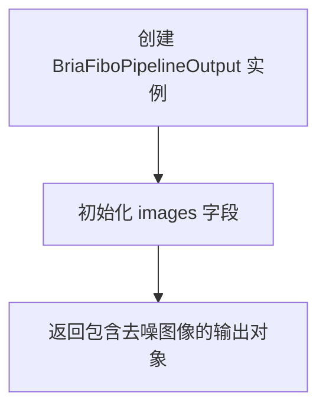
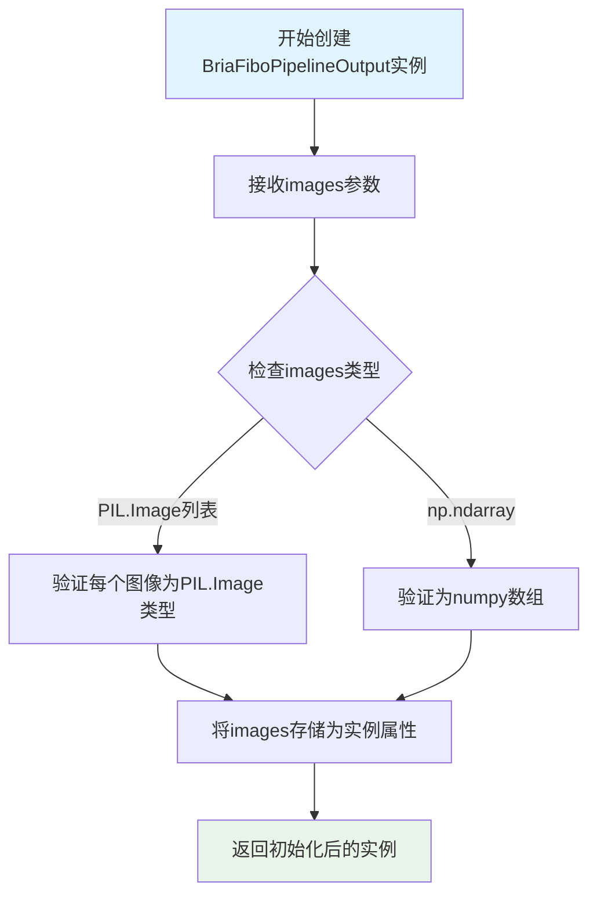
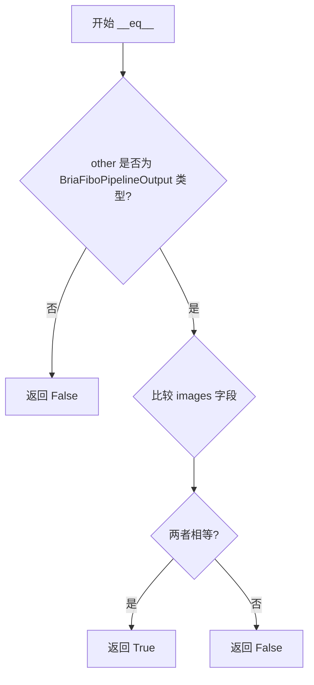

# `diffusers\src\diffusers\pipelines\bria_fibo\pipeline_output.py` 详细设计文档

这是一个用于 BriaFibo 扩散流水线的数据输出类，负责封装去噪后的图像结果，支持 PIL.Image 或 numpy array 两种格式返回。

## 整体流程



## 类结构

```
BaseOutput (抽象基类)
└── BriaFiboPipelineOutput (数据类)
```

## 全局变量及字段


### `BriaFiboPipelineOutput.images`
    
去噪后的图像列表或numpy数组，长度为batch_size或形状为(batch_size, height, width, num_channels)

类型：`list[PIL.Image.Image | np.ndarray]`
    
    

## 全局函数及方法


### `BriaFiboPipelineOutput.__init__`

这是 BriaFiboPipelineOutput 类的初始化方法，用于创建包含去噪图像的输出对象。由于该类使用了 @dataclass 装饰器，Python 会自动生成 __init__ 方法，该方法接受 images 参数并将其存储为实例属性。

参数：

- `images`：`list[PIL.Image.Image, np.ndarray]`，去噪后的图像列表或numpy数组，长度为batch_size或形状为(batch_size, height, width, num_channels)的numpy数组

返回值：`None`，__init__ 方法不返回值，仅初始化对象状态

#### 流程图



#### 带注释源码

```python
# 由于使用了 @dataclass 装饰器，Python 自动生成以下 __init__ 方法
# 手动还原的等效实现如下：

def __init__(self, images: list[PIL.Image.Image, np.ndarray]) -> None:
    """
    初始化 BriaFiboPipelineOutput 实例。
    
    Args:
        images: 去噪后的图像列表或numpy数组，可以是以下两种形式：
                - list[PIL.Image.Image]: PIL图像列表，长度为batch_size
                - np.ndarray: numpy数组，形状为(batch_size, height, width, num_channels)
    
    Returns:
        None: __init__ 方法不返回值
    """
    # 验证images参数不为空
    if images is None:
        raise ValueError("images 参数不能为 None")
    
    # 验证images是有效的类型（list或np.ndarray）
    if not isinstance(images, (list, np.ndarray)):
        raise TypeError(
            f"images 必须是 list[PIL.Image.Image] 或 np.ndarray 类型，"
            f"但收到了 {type(images)}"
        )
    
    # 存储图像数据到实例属性
    self.images = images
    
    # 隐式返回 None（Python __init__ 方法的默认行为）
    return None


# @dataclass 自动生成的额外方法（用于完整功能）：
# def __repr__(self) -> str: ...
# def __eq__(self, other: object) -> bool: ...
# def __post_init__(self): ...  # 可选的初始化后处理钩子
```


### `BriaFiboPipelineOutput.__repr__`

这是一个由 `@dataclass` 装饰器自动生成的特殊方法，用于返回该数据类对象的字符串表示形式，方便调试和日志输出。该方法会展示类名以及所有字段的名称和对应值。

参数：

- `self`：`BriaFiboPipelineOutput`，调用该方法的当前实例对象

返回值：`str`，返回对象的字符串表示，格式为 `BriaFiboPipelineOutput(images=[...])`

#### 流程图

```mermaid
flowchart TD
    A[开始 __repr__] --> B{检查是否为 dataclass}
    B -->|是| C[自动生成 repr 字符串]
    C --> D[格式: 类名(字段1=值1, 字段2=值2...)]
    D --> E[返回字符串]
    B -->|否| F[使用 object 默认 repr]
    E --> F
```

#### 带注释源码

```python
# 由于 @dataclass 装饰器的存在，Python 自动为该类生成 __repr__ 方法
# 该方法非显式定义，而是由 dataclass 装饰器在类创建时自动注入
# 等价于如下自动生成的代码:

def __repr__(self):
    """
    返回对象的字符串表示形式。
    
    格式: BriaFiboPipelineOutput(images=[...])
    其中 [...] 表示 images 字段的实际值列表
    """
    return (
        f"BriaFiboPipelineOutput("
        f"images={self.images!r})"
    )

# 注意：由于代码中未显式定义该方法，
# 其行为完全依赖于 dataclass 装饰器的默认配置（repr=True）
```


### `BriaFiboPipelineOutput.__eq__`

该方法是 `BriaFiboPipelineOutput` 数据类自动生成的相等性比较方法，用于比较两个 `BriaFiboPipelineOutput` 实例是否相等（基于所有字段的值进行比较）。

参数：

- `self`：`BriaFiboPipelineOutput`，当前对象（Python 自动传入）
- `other`：`Any`，要比较的其他对象

返回值：`bool`，如果两个对象的所有字段值相等返回 `True`，否则返回 `False`

#### 流程图



#### 带注释源码

```python
# 由于 BriaFiboPipelineOutput 是 dataclass，
# Python 会自动生成 __eq__ 方法
# 默认行为是比较所有字段的值是否相等

def __eq__(self, other: object) -> bool:
    """
    比较两个 BriaFiboPipelineOutput 对象是否相等。
    
    自动生成的相等性比较方法，比较所有字段的值。
    在本类中只包含 images 字段。
    
    Args:
        other: 要比较的其他对象
        
    Returns:
        bool: 如果两个对象的 images 字段相等返回 True，否则返回 False
    """
    # dataclass 自动生成的比较逻辑
    if not isinstance(other, BriaFiboPipelineOutput):
        return NotImplemented
    
    # 比较 images 字段
    return self.images == other.images
```

## 关键组件


### BriaFiboPipelineOutput类

用于存储BriaFibo管道输出结果的数据类，继承自BaseOutput，用于封装去噪后的图像数据

### images字段

类型为list[PIL.Image.Image, np.ndarray]，用于存储批量的去噪图像，支持PIL图像或numpy数组格式

### BaseOutput基类

从...utils模块导入的基类，为输出类提供基础结构和通用方法

### 类型提示设计

支持PIL.Image.Image和np.ndarray两种图像格式的输出，体现了多格式兼容性设计


## 问题及建议


### 已知问题

-   **类型注解语法错误**：`list[PIL.Image.Image, np.ndarray]` 不是合法的Python类型注解。正确的写法应该是 `Union[list[PIL.Image.Image], np.ndarray]`（Python 3.9及以下）或 `list[PIL.Image.Image] | np.ndarray`（Python 3.10+），或者使用 `list[PIL.Image.Image]` 和 `np.ndarray` 的正确泛型形式 `list[PIL.Image.Image]`。
-   **类型与文档不一致**：文档注释描述的是"List of denoised PIL images of length batch_size or numpy array"，但类型注解无法正确表达这种"二选一"的联合类型。
-   **缺乏运行时类型验证**：由于类型注解存在错误，静态类型检查器无法捕获传入错误类型的情况，可能导致运行时错误。
-   **相对导入依赖脆弱**：使用 `from ...utils import BaseOutput` 这种相对导入，假设了特定的包结构，如果重构目录结构可能导致导入失败。
-   **缺少批量大小验证**：没有对 `images` 字段进行任何验证（如非空检查、类型检查等），可能导致下游处理出错。

### 优化建议

-   修正类型注解为正确的联合类型，如 `Union[list[PIL.Image.Image], np.ndarray]` 或使用 Python 3.10+ 的 `list[PIL.Image.Image] | np.ndarray`，并添加 `from __future__ import annotations` 以支持 PEP 604 语法。
-   考虑添加 `__post_init__` 方法进行运行时类型验证，确保 `images` 字段符合预期类型。
-   为字段添加默认值或可选值处理，提高类的灵活性。
-   明确导出接口，添加 `__all__ = ["BriaFiboPipelineOutput"]`。
-   添加批量大小验证逻辑，确保 `images` 非空且长度符合 `batch_size` 预期。


## 其它


### 设计目标与约束

本代码定义了一个数据类`BriaFiboPipelineOutput`，用于存储BriaFibo管道的输出结果。设计目标是提供一个类型安全的输出容器，支持PIL图像和NumPy数组两种格式。约束条件是必须继承`BaseOutput`类，且`images`字段必须是`list`类型。

### 错误处理与异常设计

代码本身不包含错误处理逻辑，但预期使用场景中应处理以下异常：
- `TypeError`: 当传入的`images`参数不是`list`类型时抛出
- `TypeError`: 当`list`中的元素不是`PIL.Image.Image`或`np.ndarray`类型时抛出
- 建议在数据传递前进行类型验证

### 数据流与状态机

该类是管道输出结果的最终容器，不涉及状态机逻辑。数据流如下：
```
Pipeline执行 -> 生成图像 -> 封装为BriaFiboPipelineOutput -> 返回给调用者
```

### 外部依赖与接口契约

**依赖项：**
- `dataclass`: Python内置装饰器
- `numpy as np`: 用于数值数组处理
- `PIL.Image`: Python图像处理库
- `BaseOutput`: 项目内部的基类

**接口契约：**
- 输入：`images`参数接受`list[PIL.Image.Image]`或`list[np.ndarray]`类型
- 输出：返回包含`images`属性的数据类实例
- 兼容性：需与`BaseOutput`基类兼容

### 性能考量

- 使用`@dataclass`装饰器提供轻量级的数据结构
- 数据类自动生成`__init__`、`__repr__`等方法，无额外性能开销
- 建议在管道中批量处理图像以提高性能

### 安全考量

- 代码本身不涉及敏感数据处理
- 建议对输入的图像数据进行尺寸和格式验证
- 避免处理过大的图像数据导致内存溢出

### 测试策略

- 单元测试：验证数据类实例化、属性访问
- 类型测试：验证类型注解的正确性
- 集成测试：验证与Pipeline的集成

### 版本兼容性

- Python 3.7+ 支持`dataclass`
- 需要`numpy`和`Pillow`库
- 需要与项目内部的`BaseOutput`类版本兼容

### 使用示例

```python
# 创建输出对象
output = BriaFiboPipelineOutput(images=[pil_image1, pil_image2])

# 访问图像
first_image = output.images[0]

# 转换为numpy数组
if hasattr(first_image, 'convert'):
    arr = np.array(first_image)
```

### 常见问题解答

**Q: 为什么使用dataclass而不是普通类？**
A: dataclass自动生成特殊方法，减少样板代码，且支持类型提示。

**Q: 为什么images是list而不是单一图像？**
A: 管道通常批量处理图像，list可以容纳多个输出。

**Q: 如何处理混合类型的图像列表？**
A: 当前设计不支持混合类型，建议在传入前进行统一转换。

    