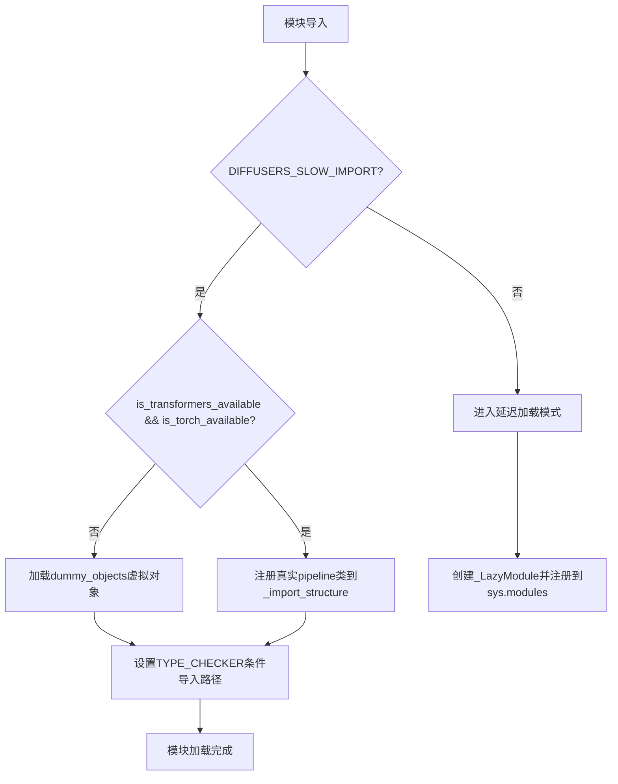
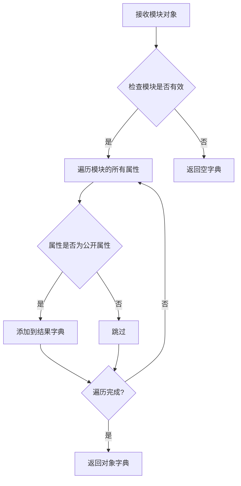
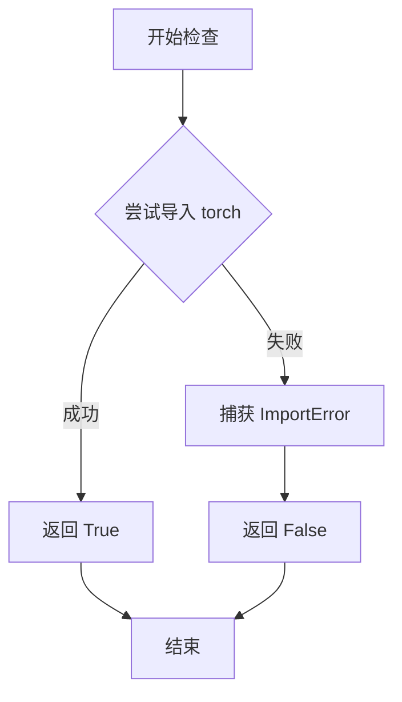
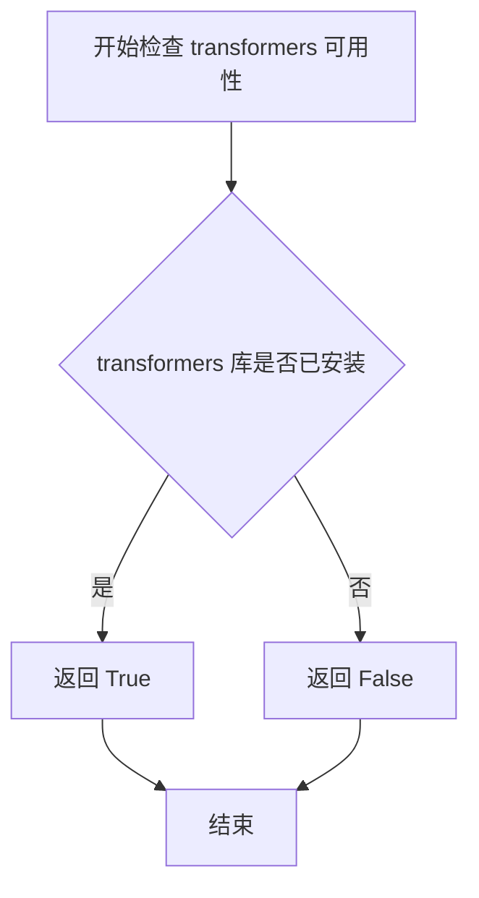
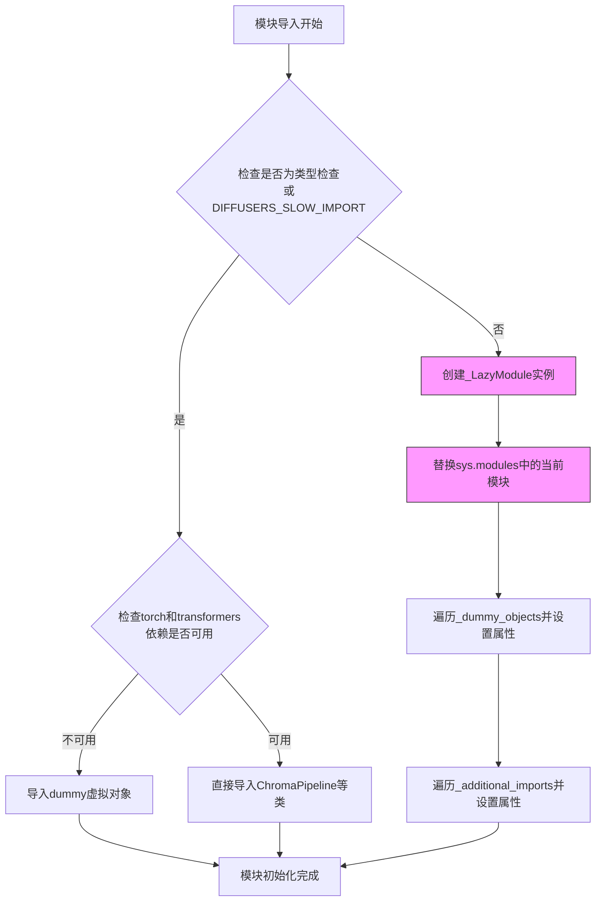
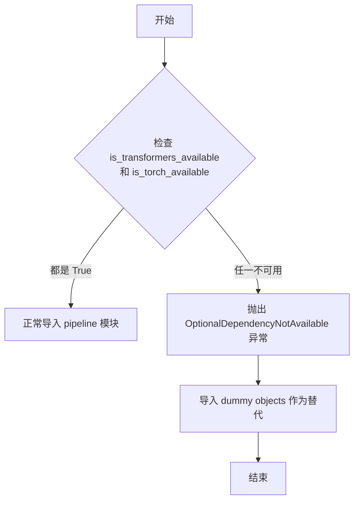
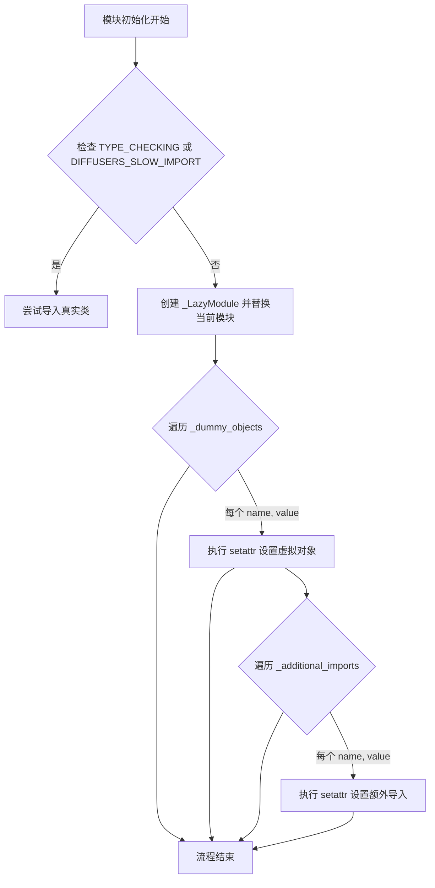

# `diffusers\src\diffusers\pipelines\chroma\__init__.py` 详细设计文档

这是一个Diffusers库的ChromaPipeline模块初始化文件，通过延迟加载机制处理可选依赖项（torch和transformers），在依赖不可用时提供虚拟对象，在依赖可用时导出ChromaPipeline、ChromaImg2ImgPipeline和ChromaInpaintPipeline三个扩散模型管道类。

## 整体流程



## 类结构

```
无类层次结构（纯导入模块）
Module: ChromaPipeline
├── ChromaPipeline (主pipeline)
├── ChromaImg2ImgPipeline (图到图pipeline)
└── ChromaInpaintPipeline (修复pipeline)
```

## 全局变量及字段


### `_dummy_objects`
    
存储虚拟对象，用于依赖不可用时的替代

类型：`dict`
    


### `_additional_imports`
    
存储额外导入的对象

类型：`dict`
    


### `_import_structure`
    
定义模块的导入结构，键为子模块，值为类名列表

类型：`dict`
    


    

## 全局函数及方法


### `get_objects_from_module`

从指定模块获取所有对象（函数或类），通常用于构建虚拟对象字典以支持延迟加载时的可选依赖处理。

参数：

- `module`：`module`，要从中提取对象的模块（如此例中的 `dummy_torch_and_transformers_objects`）

返回值：`dict`，键为对象名称，值为对象本身的字典

#### 流程图



#### 带注释源码

```
# get_objects_from_module 源码（位于 ...utils 模块）
def get_objects_from_module(module):
    """
    从指定模块获取所有对象。
    
    参数:
        module: 要提取对象的模块
        
    返回:
        dict: 包含模块中所有公开对象的字典
    """
    objects = {}
    for name in dir(module):
        if not name.startswith('_'):
            objects[name] = getattr(module, name)
    return objects
```

**注**：在实际代码中的使用方式：

```python
# 从 dummy_torch_and_transformers_objects 模块获取所有虚拟对象
_dummy_objects.update(get_objects_from_module(dummy_torch_and_transformers_objects))
```

此函数配合 `_LazyModule` 实现可选依赖的延迟加载：当 `transformers` 和 `torch` 不可用时，从虚拟对象模块中获取占位符对象填充模块，避免导入错误。


### `is_torch_available`

该函数用于检查当前环境中 PyTorch 库是否可用。它通过尝试导入 PyTorch 来判断其是否已安装，并根据导入结果返回布尔值。这是条件导入模式的核心组件，用于实现可选依赖的延迟加载。

参数：

- 该函数无显式参数（隐式参数为 `self` 或无）

返回值：`bool`，返回 `True` 表示 PyTorch 可用，返回 `False` 表示 PyTorch 不可用

#### 流程图



#### 带注释源码

```python
# is_torch_available 函数定义位于 ...utils 模块中
# 以下为推断的实现逻辑

def is_torch_available() -> bool:
    """
    检查 PyTorch 是否可用
    
    Returns:
        bool: 如果 PyTorch 可用返回 True，否则返回 False
    """
    try:
        # 尝试导入 torch 模块
        import torch
        # 如果导入成功，说明 torch 可用
        return True
    except ImportError:
        # 如果导入失败，说明 torch 不可用
        return False


# 在当前代码中的实际使用方式：
# if not (is_transformers_available() and is_torch_available()):
#     raise OptionalDependencyNotAvailable()
# 
# 这段代码检查 transformesr 和 torch 是否都可用
# 如果任一不可用，则抛出 OptionalDependencyNotAvailable 异常
# 用于条件导入：仅当所有依赖都满足时才导入实际模块
```


### `is_transformers_available`

该函数用于检查当前环境中 `transformers` 库是否已安装且可用，通常用于条件导入或可选依赖处理。

参数：此函数无参数。

返回值：`bool`，返回 `True` 表示 `transformers` 库可用，返回 `False` 表示不可用。

#### 流程图



#### 带注释源码

```python
# 从 utils 模块导入的函数，用于检测 transformers 库是否可用
# 注意：这是从 ...utils 导入的，具体实现不在本文件中
is_transformers_available
```

#### 说明

`is_transformers_available` 是在 `diffusers` 库的 `utils` 模块中定义的一个实用函数。它通过尝试导入 `transformers` 包来判断该库是否已安装。在当前代码中，该函数与 `is_torch_available()` 联合使用，用于条件性地导入需要 `torch` 和 `transformers` 的管道类（如 `ChromaPipeline`、`ChromaImg2ImgPipeline`、`ChromaInpaintPipeline`）。如果这两个库都不可用，则会抛出 `OptionalDependencyNotAvailable` 异常，并从 dummy 模块加载替代对象。


### `_LazyModule`

这是一个延迟加载模块类，用于在需要时才动态导入模块中的类和对象，从而优化大型库的初始导入时间。该模块通过`sys.modules[__name__]`替换为`_LazyModule`实例来实现懒加载机制。

参数：

- `import_name`：`str`，模块的名称，通常为`__name__`
- `module_file`：`str`，模块文件的路径，通常为`globals()["__file__"]`
- `import_structure`：`dict`，定义了模块的导入结构，包含可导出的类和对象映射
- `module_spec`：`ModuleSpec`，模块的规格信息，通常为`__spec__`

返回值：`LazyModule`，延迟加载模块的实例，用于在访问属性时动态导入相应的类或对象

#### 流程图



#### 带注释源码

```python
# 当不处于类型检查模式且不使用慢速导入时
# 使用_LazyModule实现延迟加载
sys.modules[__name__] = _LazyModule(
    __name__,  # 模块名称，如'diffusers.pipelines.chroma'
    globals()["__file__"],  # 模块文件路径
    _import_structure,  # 导入结构字典，定义可导出的类
    module_spec=__spec__,  # 模块规格信息
)

# 将虚拟对象设置为模块属性
# 这些虚拟对象在依赖不可用时提供
for name, value in _dummy_objects.items():
    setattr(sys.modules[__name__], name, value)

# 将额外的导入设置为模块属性
for name, value in _additional_imports.items():
    setattr(sys.modules[__name__], name, value)
```

#### 关键组件信息

- **ChromaPipeline**：主要的图像生成Pipeline类
- **ChromaImg2ImgPipeline**：图像到图像转换的Pipeline类
- **ChromaInpaintingPipeline**：图像修复的Pipeline类
- **OptionalDependencyNotAvailable**：可选依赖不可用时的异常类

#### 潜在的技术债务或优化空间

1. **冗余的依赖检查**：代码中存在两处相同的依赖检查逻辑（try-except块和TYPE_CHECK分支），可以考虑提取为独立函数
2. **魔法字符串**：如"pipeline_chroma"等键名可以定义为常量，避免拼写错误
3. **缺乏日志输出**：延迟加载过程没有日志记录，调试时难以追踪
4. **硬编码的导入结构**：_import_structure是硬编码的，可以考虑自动化生成

#### 其它项目

**设计目标与约束**：
- 目标：优化库的整体导入时间，避免不必要的模块加载
- 约束：必须在Python的模块系统中工作，与sys.modules集成

**错误处理与异常设计**：
- 使用OptionalDependencyNotAvailable异常来处理可选依赖不可用的情况
- 当依赖不可用时，使用虚拟对象（dummy objects）代替真实类，避免导入错误

**数据流与状态机**：
- 模块加载状态：初始状态 → 依赖检查 → 延迟加载/直接导入 → 完成
- _dummy_objects字典存储虚拟对象，_import_structure字典存储有效的导入结构

**外部依赖与接口契约**：
- 依赖：torch、transformers（可选）
- 接口：必须实现__getattr__方法以支持属性动态访问


### OptionalDependencyNotAvailable

这是一个从 `utils` 模块导入的可选依赖不可用异常类，用于在检测到必需的可选依赖（如 torch 和 transformers）不可用时抛出异常。

参数：

- 无

返回值：无

#### 流程图



#### 带注释源码

```python
# 从 utils 模块导入 OptionalDependencyNotAvailable 异常类
# 用于处理可选依赖不可用的情况
from ...utils import (
    DIFFUSERS_SLOW_IMPORT,
    OptionalDependencyNotAvailable,  # <-- 异常类定义在此处被导入
    _LazyModule,
    get_objects_from_module,
    is_torch_available,
    is_transformers_available,
)

# 尝试检查可选依赖是否可用
try:
    if not (is_transformers_available() and is_torch_available()):
        # 如果任一依赖不可用，抛出异常
        raise OptionalDependencyNotAvailable()
except OptionalDependencyNotAvailable:
    # 捕获异常，导入虚拟对象作为后备
    from ...utils import dummy_torch_and_transformers_objects
    _dummy_objects.update(get_objects_from_module(dummy_torch_and_transformers_objects))
else:
    # 如果依赖可用，导入实际的 pipeline 类
    _import_structure["pipeline_chroma"] = ["ChromaPipeline"]
    _import_structure["pipeline_chroma_img2img"] = ["ChromaImg2ImgPipeline"]
    _import_structure["pipeline_chroma_inpainting"] = ["ChromaInpaintPipeline"]

# TYPE_CHECKING 模式下同样检查并处理可选依赖
if TYPE_CHECKING or DIFFUSERS_SLOW_IMPORT:
    try:
        if not (is_transformers_available() and is_torch_available()):
            raise OptionalDependencyNotAvailable()
    except OptionalDependencyNotAvailable:
        from ...utils.dummy_torch_and_transformers_objects import *
    else:
        from .pipeline_chroma import ChromaPipeline
        from .pipeline_chroma_img2img import ChromaImg2ImgPipeline
        from .pipeline_chroma_inpainting import ChromaInpaintPipeline
```

**注意**：由于 `OptionalDependencyNotAvailable` 异常类定义在 `...utils` 模块中，而非当前代码文件内，以上信息是基于其在该文件中的使用方式推断而得。要获取该异常类的完整定义（包括所有字段和方法），需要查看 `...utils` 模块的源代码。


### `setattr` (模块动态属性设置)

在 Diffusers 库的延迟加载模块初始化代码中，`setattr` 被用于将虚拟对象（dummy objects）和额外导入动态绑定到模块命名空间，以支持可选依赖项的灵活处理。

参数：

- `sys.modules[__name__]`：`module`，目标模块对象（即当前延迟加载的模块），通过 `sys.modules` 获取
- `name`：`str`，要设置的属性名称（来自 `_dummy_objects` 或 `_additional_imports` 的键），表示要添加的类或函数名
- `value`：任意类型，对应的属性值（来自 `_dummy_objects` 或 `_additional_imports` 的值），当依赖不可用时为虚拟对象

返回值：`None`，无返回值（Python 内置 `setattr` 的返回值为 `None`）

#### 流程图



#### 带注释源码

```python
# 遍历所有虚拟对象（当 torch 和 transformers 不可用时创建的空壳类）
for name, value in _dummy_objects.items():
    # 将虚拟对象动态设置为模块的属性
    # 参数1: sys.modules[__name__] - 当前模块的命名空间
    # 参数2: name - 虚拟类的名称（如 ChromaPipeline）
    # 参数3: value - 虚拟类对象（用于延迟导入时的占位）
    setattr(sys.modules[__name__], name, value)

# 遍历所有额外导入（额外的可选组件）
for name, value in _additional_imports.items():
    # 将额外导入的对象动态设置到模块命名空间
    # 用途: 支持动态扩展模块的导出内容，而不修改原始代码结构
    setattr(sys.modules[__name__], name, value)
```

---

## 完整设计文档

### 一段话描述

该代码是 Diffusers 库中 ChromaPipeline 的延迟加载模块初始化文件，通过动态导入机制和虚拟对象模式，实现了对可选依赖项（torch、transformers）的灵活处理，使得用户即使在缺少某些依赖时也能导入模块，仅在使用时才触发真正的导入或获得明确的缺失依赖错误。

### 文件的整体运行流程

1. **导入检查阶段**：导入类型检查和工具函数
2. **依赖可用性判断**：检查 `is_transformers_available()` 和 `is_torch_available()`
3. **虚拟对象初始化**：根据依赖可用性填充 `_import_structure` 和 `_dummy_objects`
4. **延迟加载配置**：
   - 若在类型检查或慢导入模式：直接导入真实类
   - 否则：创建 `_LazyModule` 替换当前模块
5. **动态属性绑定**：通过 `setattr` 将虚拟对象和额外导入设置到模块命名空间

### 关键组件信息

| 名称 | 一句话描述 |
|------|-----------|
| `_LazyModule` | 延迟加载模块实现类，支持按需导入子模块 |
| `_dummy_objects` | 存储可选依赖不可用时的虚拟对象（空壳类） |
| `_import_structure` | 定义模块的导入结构（可导入的类名列表） |
| `get_objects_from_module` | 从模块获取所有对象的工具函数 |
| `OptionalDependencyNotAvailable` | 可选依赖不可用时的异常类 |

### 潜在的技术债务或优化空间

1. **魔法字符串**：`_dummy_objects` 和 `_additional_imports` 的键名硬编码，与 `_import_structure` 中的键可能存在同步风险
2. **重复代码**：两个 `setattr` 循环逻辑相似，可合并为一个
3. **异常捕获过于宽泛**：直接捕获 `OptionalDependencyNotAvailable` 但未记录详细日志
4. **缺乏版本兼容性检查**：未检查 transformers 和 torch 的版本兼容性

### 其它项目

#### 设计目标与约束

- **目标**：支持 Diffusers 的可选依赖项机制，实现条件导入
- **约束**：必须保持向后兼容，不能破坏现有导入方式

#### 错误处理与异常设计

- 使用 `OptionalDependencyNotAvailable` 异常标记可选依赖不可用
- 虚拟对象在实际调用时会抛出有意义的错误（而非立即失败）

#### 数据流与状态机

```
依赖检查 → 决定导入路径 → (真实导入 | 虚拟对象) → 延迟模块注册 → 属性绑定
```

#### 外部依赖与接口契约

- 依赖：`torch`、`transformers`（可选）
- 接口：通过 `sys.modules[__name__]` 暴露 ChromaPipeline、ChromaImg2ImgPipeline、ChromaInpaintPipeline

## 关键组件


### 延迟加载模块（Lazy Loading Module）

使用 `_LazyModule` 实现延迟加载机制，将模块的导入推迟到实际使用时，以提高导入速度和内存效率。

### 可选依赖检查机制（Optional Dependency Checking）

通过 `is_torch_available()` 和 `is_transformers_available()` 检查 torch 和 transformers 库的可用性，并在依赖不可用时抛出 `OptionalDependencyNotAvailable` 异常。

### 虚拟对象管理（Dummy Objects Management）

使用 `_dummy_objects` 字典存储虚拟对象，当可选依赖不可用时，通过 `get_objects_from_module` 从虚拟模块中获取对象并注入到当前模块，确保代码在不满足依赖时也能正常运行。

### 导入结构定义（Import Structure Definition）

通过 `_import_structure` 字典定义模块的公开接口，明确指定可以从模块中导入的类，包括 `ChromaPipelineOutput`、`ChromaPipeline`、`ChromaImg2ImgPipeline` 和 `ChromaInpaintPipeline`。

### 动态模块替换（Dynamic Module Replacement）

在非 TYPE_CHECKING 模式下，使用 `sys.modules[__name__]` 替换当前模块为延迟加载的 `_LazyModule` 实例，并通过 `setattr` 动态添加虚拟对象和额外导入。


## 问题及建议


### 已知问题

- **代码重复**：try-except 块检查可选依赖的逻辑被重复了两次（一次在运行时，一次在 TYPE_CHECKING 分支），违反了 DRY（不要重复自己）原则。
- **未使用的变量**：`_additional_imports` 被初始化为空字典，但在整个代码中从未被使用或填充，造成了无意义的内存占用和代码混淆。
- **缺少错误处理**：使用 `setattr(sys.modules[__name__], name, value)` 时没有异常处理机制，如果模块属性设置失败可能导致难以追踪的错误。
- **Magic Strings**：管道模块名称（如 "pipeline_chroma"、"pipeline_chroma_img2img"）以硬编码字符串形式存在，缺乏可维护性和可配置性。
- **无版本兼容性检查**：代码仅检查 torch 和 transformers 是否可用，但未验证版本兼容性，可能导致运行时兼容性问题。
- **类型注解缺失**：关键变量（如 `_dummy_objects`、`_import_structure`）缺少类型注解，降低了代码的可读性和 IDE 支持。
- **不一致的错误处理策略**：同时使用了 `raise` 抛出异常和静默回退到 dummy 对象两种策略，逻辑不够统一。

### 优化建议

- **提取重复逻辑**：将可选依赖检查逻辑提取为单独的辅助函数，避免代码重复。
- **移除未使用代码**：删除未使用的 `_additional_imports` 变量，或者如果计划未来使用，添加注释说明其用途。
- **添加错误处理**：为 `setattr` 操作添加 try-except 块，捕获可能的属性设置错误。
- **常量定义**：将硬编码的模块名称字符串提取为模块级常量，提高可维护性。
- **添加版本检查**：在依赖检查时加入版本验证逻辑，确保与所需版本的兼容性。
- **完善类型注解**：为所有关键变量添加类型注解，提高代码质量。
- **统一错误处理**：明确错误处理策略，选择主动检查或被动回退中的一种，避免混用。

## 其它


### 设计目标与约束

本模块采用延迟加载（Lazy Loading）模式，旨在优化库的导入性能。通过仅在需要时加载实际实现，避免在库初始化时导入所有可选依赖，从而减少启动时间和内存占用。模块支持torch和transformers两个可选依赖，当这些依赖不可用时提供虚拟对象以保持API兼容性。

### 错误处理与异常设计

模块使用OptionalDependencyNotAvailable异常来处理可选依赖不可用的情况。当is_transformers_available()或is_torch_available()返回False时，抛出该异常并捕获，触发从dummy_torch_and_transformers_objects模块导入虚拟对象。这种设计允许模块在缺少可选依赖时仍可被导入，但调用具体类时会抛出真正的导入错误。

### 外部依赖与接口契约

本模块依赖以下外部包：torch（可选）、transformers（可选）、diffusers.utils中的_dummy_module、_LazyModule、get_objects_from_module等工具函数。对外暴露的接口包括ChromaPipeline、ChromaImg2ImgPipeline、ChromaInpaintPipeline三个Pipeline类，以及ChromaPipelineOutput。模块采用LazyModule机制，承诺在实际使用时才加载真实实现。

### Lazy Loading机制说明

_LazyModule是延迟加载的核心实现，通过替换sys.modules[__name__]为_LazyModule实例实现。当代码尝试访问模块属性时，_LazyModule会拦截属性访问并动态导入对应的模块。这种机制确保了模块级别的延迟加载，避免了在import时立即加载所有子模块。

### 模块初始化流程

模块初始化分为三个分支：TYPE_CHECKING/DIFFUSERS_SLOW_IMPORT为真时执行类型检查导入；否则执行运行时导入。运行时导入首先将模块注册为_LazyModule，然后遍历_dummy_objects和_additional_imports，将虚拟对象设置为模块属性。当用户访问模块中的类（如ChromaPipeline）时，_LazyModule会触发实际模块的加载。

### Dummy Objects模式

当可选依赖不可用时，模块从dummy_torch_and_transformers_objects导入预定义的虚拟对象。这些虚拟对象在被实例化时会抛出有意义的错误，提示用户需要安装相应的依赖包。这种模式保持了模块结构的完整性，同时提供了清晰的错误指导。

### 类型检查支持

TYPE_CHECKING标志用于支持静态类型检查。在此模式下，模块会真实导入所有类而不是使用虚拟对象，使得IDE和类型检查器能够正确识别类型信息。这是Python中处理可选依赖类型提示的标准做法。

    