# `diffusers\src\diffusers\pipelines\chroma\pipeline_chroma.py` 详细设计文档

ChromaPipeline是一个基于Flux架构的文本到图像生成管道，使用T5编码器进行文本编码，ChromaTransformer2DModel进行去噪，AutoencoderKL进行图像解码，并集成了IP-Adapter和LoRA支持。

## 整体流程

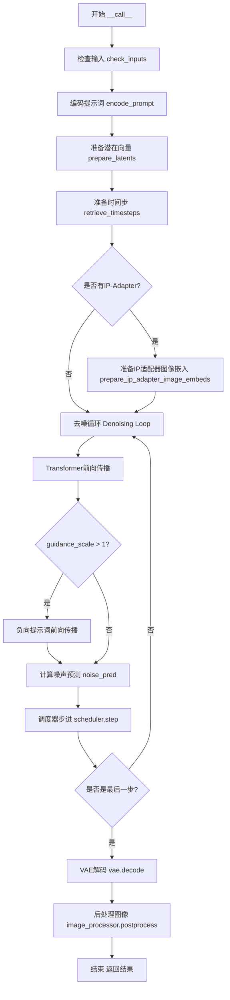

## 类结构

```
DiffusionPipeline (基类)
└── ChromaPipeline
    ├── FluxLoraLoaderMixin
    ├── FromSingleFileMixin
    ├── TextualInversionLoaderMixin
    └── FluxIPAdapterMixin
```

## 全局变量及字段


### `logger`
    
模块级日志记录器，用于输出调试和信息日志

类型：`logging.Logger`
    


### `EXAMPLE_DOC_STRING`
    
包含ChromaPipeline使用示例的文档字符串，展示如何进行文本到图像生成

类型：`str`
    


### `XLA_AVAILABLE`
    
布尔标志，指示PyTorch XLA是否可用，用于优化TPU设备上的张量操作

类型：`bool`
    


### `calculate_shift`
    
计算图像序列长度偏移量的函数，用于调整去噪调度参数

类型：`Callable[[int, int, int, float, float], float]`
    


### `retrieve_timesteps`
    
从调度器获取时间步的函数，支持自定义时间步和sigma值

类型：`Callable`
    


### `ChromaPipeline.scheduler`
    
用于去噪图像潜在表示的调度器

类型：`FlowMatchEulerDiscreteScheduler`
    


### `ChromaPipeline.vae`
    
变分自编码器，用于编码和解码图像与潜在表示

类型：`AutoencoderKL`
    


### `ChromaPipeline.text_encoder`
    
T5文本编码器，用于将文本提示转换为嵌入向量

类型：`T5EncoderModel`
    


### `ChromaPipeline.tokenizer`
    
T5快速分词器，用于将文本分割为token序列

类型：`T5TokenizerFast`
    


### `ChromaPipeline.transformer`
    
主去噪Transformer模型，用于从噪声图像生成目标图像

类型：`ChromaTransformer2DModel`
    


### `ChromaPipeline.image_encoder`
    
CLIP图像编码器，用于IP-Adapter图像特征提取（可选组件）

类型：`CLIPVisionModelWithProjection`
    


### `ChromaPipeline.feature_extractor`
    
CLIP图像特征提取器，用于预处理图像输入（可选组件）

类型：`CLIPImageProcessor`
    


### `ChromaPipeline.vae_scale_factor`
    
VAE缩放因子，用于计算潜在空间的尺寸

类型：`int`
    


### `ChromaPipeline.image_processor`
    
VAE图像处理器，用于后处理生成的图像

类型：`VaeImageProcessor`
    


### `ChromaPipeline.default_sample_size`
    
默认采样尺寸，用于生成图像的基础尺寸

类型：`int`
    


### `ChromaPipeline.model_cpu_offload_seq`
    
模型CPU卸载顺序，定义模型组件卸载到CPU的序列

类型：`str`
    


### `ChromaPipeline._optional_components`
    
可选组件列表，包含image_encoder和feature_extractor

类型：`list`
    


### `ChromaPipeline._callback_tensor_inputs`
    
回调张量输入列表，定义回调函数可访问的张量

类型：`list`
    
    

## 全局函数及方法


### `calculate_shift`

该函数实现了一个线性插值算法，用于根据图像序列长度（image_seq_len）计算调度器的时间步偏移量（mu）。它通过建立图像序列长度与偏移量之间的线性映射关系，使得扩散模型能够根据不同的输入分辨率自适应调整采样策略，从而优化生成质量与稳定性。

参数：

- `image_seq_len`：`int`，输入图像的序列长度，通常等于latents经过packing后的序列长度
- `base_seq_len`：`int`，基准序列长度，默认为256，用于线性方程的起始点
- `max_seq_len`：`int`，最大序列长度，默认为4096，用于线性方程的结束点
- `base_shift`：`float`，基准偏移量，默认为0.5，对应base_seq_len位置的理论偏移值
- `max_shift`：`float`，最大偏移量，默认为1.15，对应max_seq_len位置的理论偏移值

返回值：`float`，返回计算得到的偏移量mu，用于传递给调度器的时间步生成过程

#### 流程图

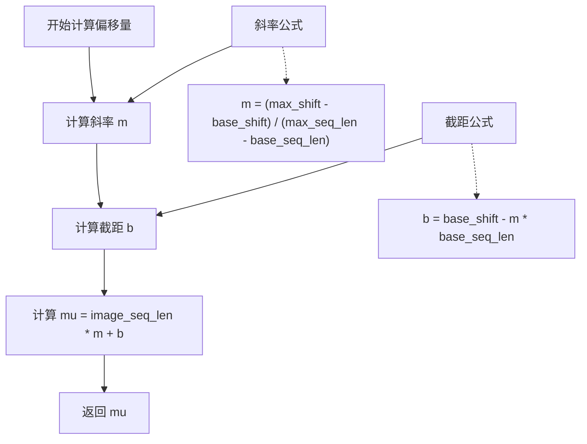

#### 带注释源码

```python
def calculate_shift(
    image_seq_len,           # 当前图像的序列长度（latents经过packing后的长度）
    base_seq_len: int = 256, # 基准序列长度，对应base_shift的基准点
    max_seq_len: int = 4096, # 最大序列长度，对应max_shift的极限点
    base_shift: float = 0.5, # 基准偏移量，序列长度最小时的偏移值
    max_shift: float = 1.15, # 最大偏移量，序列长度最大时的偏移值
):
    """
    计算基于图像序列长度的线性偏移量。
    
    该函数通过线性插值的方式，根据当前图像的序列长度计算一个偏移量mu。
    这个偏移量用于调整扩散模型调度器的时间步生成，使得模型能够更好地处理
    不同分辨率的输入。序列长度越长，需要的偏移量越大，以保持采样稳定性。
    
    数学原理：
    - 建立从 (base_seq_len, base_shift) 到 (max_seq_len, max_shift) 的直线方程
    - 直线方程: y = mx + b
    - 斜率 m = (max_shift - base_shift) / (max_seq_len - base_seq_len)
    - 截距 b = base_shift - m * base_seq_len
    - 最终 mu = image_seq_len * m + b
    """
    # 计算斜率：偏移量随序列长度的变化率
    m = (max_shift - base_shift) / (max_seq_len - base_seq_len)
    
    # 计算截距：直线在y轴上的偏移量
    b = base_shift - m * base_seq_len
    
    # 根据当前图像序列长度计算对应的偏移量
    mu = image_seq_len * m + b
    
    return mu
```


### `retrieve_timesteps`

该函数是扩散 pipelines 中的通用工具函数，用于调用调度器的 `set_timesteps` 方法并从中获取时间步。支持自定义时间步或 sigmas，并处理不同的调度器配置。

参数：

- `scheduler`：`SchedulerMixin`，调度器对象，用于获取时间步
- `num_inference_steps`：`int | None`，生成样本时使用的扩散步数，如果使用此参数，`timesteps` 必须为 `None`
- `device`：`str | torch.device | None`，时间步要移动到的设备，如果为 `None`，时间步不会移动
- `timesteps`：`list[int] | None`，用于覆盖调度器时间步间隔策略的自定义时间步，如果传入此参数，`num_inference_steps` 和 `sigmas` 必须为 `None`
- `sigmas`：`list[float] | None`，用于覆盖调度器时间步间隔策略的自定义 sigmas，如果传入此参数，`num_inference_steps` 和 `timesteps` 必须为 `None`
- `**kwargs`：任意关键字参数，将传递给 `scheduler.set_timesteps`

返回值：`tuple[torch.Tensor, int]`，元组中第一个元素是调度器的时间步调度，第二个元素是推理步数。

#### 流程图

```mermaid
flowchart TD
    A[开始] --> B{检查timesteps和sigmas是否同时存在}
    B -->|是| C[抛出ValueError: 只能选择一个]
    B -->|否| D{检查timesteps是否提供}
    D -->|是| E{检查scheduler.set_timesteps是否接受timesteps参数}
    E -->|否| F[抛出ValueError: 当前调度器不支持自定义timesteps]
    E -->|是| G[调用scheduler.set_timesteps<br/>参数: timesteps=timesteps, device=device]
    G --> H[获取scheduler.timesteps]
    H --> I[计算num_inference_steps = len(timesteps)]
    D -->|否| J{检查sigmas是否提供}
    J -->|是| K{检查scheduler.set_timesteps是否接受sigmas参数}
    K -->|否| L[抛出ValueError: 当前调度器不支持自定义sigmas]
    K -->|是| M[调用scheduler.set_timesteps<br/>参数: sigmas=sigmas, device=device]
    M --> N[获取scheduler.timesteps]
    N --> O[计算num_inference_steps = len(timesteps)]
    J -->|否| P[调用scheduler.set_timesteps<br/>参数: num_inference_steps=num_inference_steps, device=device]
    P --> Q[获取scheduler.timesteps]
    Q --> R[返回tuple[timesteps, num_inference_steps]]
    
    I --> R
    O --> R
```

#### 带注释源码

```python
# Copied from diffusers.pipelines.stable_diffusion.pipeline_stable_diffusion.retrieve_timesteps
def retrieve_timesteps(
    scheduler,
    num_inference_steps: int | None = None,
    device: str | torch.device | None = None,
    timesteps: list[int] | None = None,
    sigmas: list[float] | None = None,
    **kwargs,
):
    r"""
    Calls the scheduler's `set_timesteps` method and retrieves timesteps from the scheduler after the call. Handles
    custom timesteps. Any kwargs will be supplied to `scheduler.set_timesteps`.

    Args:
        scheduler (`SchedulerMixin`):
            The scheduler to get timesteps from.
        num_inference_steps (`int`):
            The number of diffusion steps used when generating samples with a pre-trained model. If used, `timesteps`
            must be `None`.
        device (`str` or `torch.device`, *optional*):
            The device to which the timesteps should be moved to. If `None`, the timesteps are not moved.
        timesteps (`list[int]`, *optional*):
            Custom timesteps used to override the timestep spacing strategy of the scheduler. If `timesteps` is passed,
            `num_inference_steps` and `sigmas` must be `None`.
        sigmas (`list[float]`, *optional*):
            Custom sigmas used to override the timestep spacing strategy of the scheduler. If `sigmas` is passed,
            `num_inference_steps` and `timesteps` must be `None`.

    Returns:
        `tuple[torch.Tensor, int]`: A tuple where the first element is the timestep schedule from the scheduler and the
        second element is the number of inference steps.
    """
    # 验证参数：不能同时提供timesteps和sigmas
    if timesteps is not None and sigmas is not None:
        raise ValueError("Only one of `timesteps` or `sigmas` can be passed. Please choose one to set custom values")
    
    # 处理自定义timesteps的情况
    if timesteps is not None:
        # 检查调度器是否支持timesteps参数
        accepts_timesteps = "timesteps" in set(inspect.signature(scheduler.set_timesteps).parameters.keys())
        if not accepts_timesteps:
            raise ValueError(
                f"The current scheduler class {scheduler.__class__}'s `set_timesteps` does not support custom"
                f" timestep schedules. Please check whether you are using the correct scheduler."
            )
        # 调用调度器的set_timesteps方法设置自定义timesteps
        scheduler.set_timesteps(timesteps=timesteps, device=device, **kwargs)
        # 从调度器获取更新后的timesteps
        timesteps = scheduler.timesteps
        # 计算推理步数
        num_inference_steps = len(timesteps)
    
    # 处理自定义sigmas的情况
    elif sigmas is not None:
        # 检查调度器是否支持sigmas参数
        accept_sigmas = "sigmas" in set(inspect.signature(scheduler.set_timesteps).parameters.keys())
        if not accept_sigmas:
            raise ValueError(
                f"The current scheduler class {scheduler.__class__}'s `set_timesteps` does not support custom"
                f" sigmas schedules. Please check whether you are using the correct scheduler."
            )
        # 调用调度器的set_timesteps方法设置自定义sigmas
        scheduler.set_timesteps(sigmas=sigmas, device=device, **kwargs)
        # 从调度器获取更新后的timesteps
        timesteps = scheduler.timesteps
        # 计算推理步数
        num_inference_steps = len(timesteps)
    
    # 默认情况：使用num_inference_steps
    else:
        scheduler.set_timesteps(num_inference_steps, device=device, **kwargs)
        timesteps = scheduler.timesteps
    
    # 返回timesteps和推理步数
    return timesteps, num_inference_steps
```


### `ChromaPipeline.__init__`

这是 ChromaPipeline 类的构造函数，用于初始化文本到图像生成管道的所有核心组件。它接收多个神经网络模型（VAE、文本编码器、变换器等）和处理器作为参数，注册这些模块，并配置图像处理相关的参数。

参数：

- `scheduler`：`FlowMatchEulerDiscreteScheduler`，用于在去噪过程中调度时间步的调度器
- `vae`：`AutoencoderKL`，变分自编码器模型，用于将图像编码为潜在表示并从潜在表示解码图像
- `text_encoder`：`T5EncoderModel`，T5 文本编码器模型，用于将文本提示编码为嵌入向量
- `tokenizer`：`T5TokenizerFast`，T5 分词器，用于将文本提示转换为 token IDs
- `transformer`：`ChromaTransformer2DModel`，条件变换器（MMDiT）架构，用于对编码的图像潜在表示进行去噪
- `image_encoder`：`CLIPVisionModelWithProjection`（可选），CLIP 视觉模型，用于 IP-Adapter 图像编码
- `feature_extractor`：`CLIPImageProcessor`（可选），CLIP 图像处理器，用于预处理图像输入

返回值：`None`，该方法为构造函数，不返回任何值

#### 流程图

```mermaid
flowchart TD
    A[开始 __init__] --> B[调用 super().__init__ 初始化基类]
    B --> C[调用 register_modules 注册所有模块]
    C --> D[计算 vae_scale_factor]
    D --> E[初始化 VaeImageProcessor]
    E --> F[设置 default_sample_size = 128]
    F --> G[结束 __init__]
```

#### 带注释源码

```python
def __init__(
    self,
    scheduler: FlowMatchEulerDiscreteScheduler,
    vae: AutoencoderKL,
    text_encoder: T5EncoderModel,
    tokenizer: T5TokenizerFast,
    transformer: ChromaTransformer2DModel,
    image_encoder: CLIPVisionModelWithProjection = None,
    feature_extractor: CLIPImageProcessor = None,
):
    # 调用父类 DiffusionPipeline 的构造函数进行基础初始化
    super().__init__()

    # 注册所有模块到管道中，使其可以通过 self.xxx 访问
    # 这些模块包括 VAE、文本编码器、分词器、变换器、调度器、图像编码器和特征提取器
    self.register_modules(
        vae=vae,
        text_encoder=text_encoder,
        tokenizer=tokenizer,
        transformer=transformer,
        scheduler=scheduler,
        image_encoder=image_encoder,
        feature_extractor=feature_extractor,
    )
    
    # 计算 VAE 缩放因子，基于 VAE 模型的 block_out_channels 数量
    # 公式: 2^(len(block_out_channels) - 1)，如果 VAE 存在；否则默认为 8
    # 这用于确定潜在空间与像素空间之间的缩放比例
    self.vae_scale_factor = 2 ** (len(self.vae.config.block_out_channels) - 1) if getattr(self, "vae", None) else 8
    
    # Flux 潜在表示被转换为 2x2 的补丁并被打包，这意味着潜在宽度和高度必须能被补丁大小整除
    # 因此，VAE 缩放因子乘以补丁大小（2）来考虑这一点
    # 初始化图像处理器，用于处理 VAE 的编码和解码输出
    self.image_processor = VaeImageProcessor(vae_scale_factor=self.vae_scale_factor * 2)
    
    # 设置默认采样大小为 128，用于生成图像的默认高度和宽度计算
    self.default_sample_size = 128
```


### `ChromaPipeline.encode_prompt`

该方法负责将文本提示词（prompt）和负提示词（negative_prompt）编码为 T5 文本嵌入向量，同时生成相应的文本ID和注意力掩码。它支持 classifier-free guidance、LoRA 权重调整以及批量生成多张图像，是 Chroma 文本到图像生成流程中的关键预处理步骤。

参数：

- `self`：`ChromaPipeline` 实例本身
- `prompt`：`str | list[str]`，要编码的文本提示词，支持单个字符串或字符串列表
- `negative_prompt`：`str | list[str]`，可选的负提示词，用于引导图像生成排除某些内容
- `device`：`torch.device | None`，指定计算设备，默认为执行设备
- `num_images_per_prompt`：`int`，每个提示词生成的图像数量，默认为 1
- `prompt_embeds`：`torch.Tensor | None`，可选的预生成提示词嵌入，若提供则跳过从 prompt 生成
- `negative_prompt_embeds`：`torch.Tensor | None`，可选的预生成负提示词嵌入
- `prompt_attention_mask`：`torch.Tensor | None`，提示词的注意力掩码，用于处理填充标记
- `negative_prompt_attention_mask`：`torch.Tensor | None`，负提示词的注意力掩码
- `do_classifier_free_guidance`：`bool`，是否启用 classifier-free guidance，默认为 True
- `max_sequence_length`：`int`，T5 编码的最大序列长度，默认为 512
- `lora_scale`：`float | None`，LoRA 层的缩放因子，用于动态调整 LoRA 权重

返回值：`tuple[torch.Tensor, torch.Tensor, torch.Tensor, torch.Tensor, torch.Tensor, torch.Tensor]`，返回一个包含 6 个元素的元组，依次为：提示词嵌入、文本 ID、提示词注意力掩码、负提示词嵌入、负文本 ID、负提示词注意力掩码

#### 流程图

```mermaid
flowchart TD
    A[开始 encode_prompt] --> B{device 参数}
    B -->|None| C[使用 self._execution_device]
    B -->|提供| D[使用提供的 device]
    C --> E{检查 lora_scale}
    D --> E
    E -->|lora_scale 不为 None| F[设置 self._lora_scale]
    E -->|lora_scale 为 None| G
    F --> H{检查 USE_PEFT_BACKEND}
    H -->|True| I[scale_lora_layers 应用 LoRA 缩放]
    H -->|False| G
    I --> G
    G --> J[标准化 prompt 为列表]
    J --> K{prompt_embeds 为 None?]
    K -->|Yes| L[调用 _get_t5_prompt_embeds 生成嵌入]
    K -->|No| M[使用已提供的 prompt_embeds]
    L --> N[获取 dtype 和创建 text_ids]
    M --> N
    N --> O{do_classifier_free_guidance 为 True?]
    O -->|Yes| P{negative_prompt_embeds 为 None?]
    O -->|No| S
    P -->|Yes| Q[标准化 negative_prompt]
    P -->|No| R[使用提供的 negative_prompt_embeds]
    Q --> T[验证 batch_size 一致性]
    T --> U[调用 _get_t5_prompt_embeds]
    U --> V[创建 negative_text_ids]
    V --> W{使用了 LoRA 和 PEFT?]
    R --> W
    S --> W
    W -->|Yes| X[unscale_lora_layers 恢复 LoRA]
    W -->|No| Y[返回结果元组]
    X --> Y
    Y --> Z[结束]
```

#### 带注释源码

```python
def encode_prompt(
    self,
    prompt: str | list[str],
    negative_prompt: str | list[str] = None,
    device: torch.device | None = None,
    num_images_per_prompt: int = 1,
    prompt_embeds: torch.Tensor | None = None,
    negative_prompt_embeds: torch.Tensor | None = None,
    prompt_attention_mask: torch.Tensor | None = None,
    negative_prompt_attention_mask: torch.Tensor | None = None,
    do_classifier_free_guidance: bool = True,
    max_sequence_length: int = 512,
    lora_scale: float | None = None,
):
    r"""
    将文本提示词编码为 T5 嵌入向量，支持 classifier-free guidance 和 LoRA 权重调整。
    
    Args:
        prompt: 要编码的文本提示词，支持字符串或字符串列表
        negative_prompt: 可选的负提示词，用于排除不希望的内容
        device: 计算设备，若为 None 则使用执行设备
        num_images_per_prompt: 每个提示词生成的图像数量
        prompt_embeds: 预生成的提示词嵌入，若提供则跳过生成
        negative_prompt_embeds: 预生成的负提示词嵌入
        prompt_attention_mask: 提示词的注意力掩码
        negative_prompt_attention_mask: 负提示词的注意力掩码
        do_classifier_free_guidance: 是否启用 classifier-free guidance
        max_sequence_length: T5 编码的最大序列长度
        lora_scale: LoRA 层缩放因子
    """
    # 确定设备，优先使用传入的设备，否则使用执行设备
    device = device or self._execution_device

    # 设置 LoRA 缩放因子，以便 text encoder 的 LoRA 函数可以正确访问
    if lora_scale is not None and isinstance(self, FluxLoraLoaderMixin):
        self._lora_scale = lora_scale

        # 动态调整 LoRA 缩放
        if self.text_encoder is not None and USE_PEFT_BACKEND:
            scale_lora_layers(self.text_encoder, lora_scale)

    # 将 prompt 标准化为列表格式
    prompt = [prompt] if isinstance(prompt, str) else prompt

    # 确定 batch_size：若提供了 prompt 则使用其长度，否则使用 prompt_embeds 的 batch 维度
    if prompt is not None:
        batch_size = len(prompt)
    else:
        batch_size = prompt_embeds.shape[0]

    # 如果未提供 prompt_embeds，则通过 T5 生成
    if prompt_embeds is None:
        prompt_embeds, prompt_attention_mask = self._get_t5_prompt_embeds(
            prompt=prompt,
            num_images_per_prompt=num_images_per_prompt,
            max_sequence_length=max_sequence_length,
            device=device,
        )

    # 确定数据类型：优先使用 text_encoder 的 dtype，否则使用 transformer 的 dtype
    dtype = self.text_encoder.dtype if self.text_encoder is not None else self.transformer.dtype
    
    # 创建文本 ID 张量，形状为 (seq_len, 3)，用于 transformer 的位置编码
    # 3 表示 x, y, context 三个维度
    text_ids = torch.zeros(prompt_embeds.shape[1], 3).to(device=device, dtype=dtype)
    negative_text_ids = None

    # 处理 classifier-free guidance：需要同时编码负提示词
    if do_classifier_free_guidance:
        if negative_prompt_embeds is None:
            # 默认空字符串作为负提示词
            negative_prompt = negative_prompt or ""
            # 标准化为列表
            negative_prompt = (
                batch_size * [negative_prompt] if isinstance(negative_prompt, str) else negative_prompt
            )

            # 类型检查：prompt 和 negative_prompt 类型必须一致
            if prompt is not None and type(prompt) is not type(negative_prompt):
                raise TypeError(
                    f"`negative_prompt` should be the same type to `prompt`, but got {type(negative_prompt)} !="
                    f" {type(prompt)}."
                )
            # batch_size 检查：两者必须匹配
            elif batch_size != len(negative_prompt):
                raise ValueError(
                    f"`negative_prompt`: {negative_prompt} has batch size {len(negative_prompt)}, but `prompt`:"
                    f" {prompt} has batch size {batch_size}. Please make sure that passed `negative_prompt` matches"
                    " the batch size of `prompt`."
                )

            # 生成负提示词嵌入
            negative_prompt_embeds, negative_prompt_attention_mask = self._get_t5_prompt_embeds(
                prompt=negative_prompt,
                num_images_per_prompt=num_images_per_prompt,
                max_sequence_length=max_sequence_length,
                device=device,
            )

        # 为负提示词创建文本 ID
        negative_text_ids = torch.zeros(negative_prompt_embeds.shape[1], 3).to(device=device, dtype=dtype)

    # 如果使用了 LoRA 和 PEFT backend，在生成嵌入后恢复原始 LoRA 缩放
    if self.text_encoder is not None:
        if isinstance(self, FluxLoraLoaderMixin) and USE_PEFT_BACKEND:
            # 通过反向缩放 LoRA 层恢复原始 scale
            unscale_lora_layers(self.text_encoder, lora_scale)

    # 返回包含正负提示词嵌入、文本 ID 和注意力掩码的元组
    return (
        prompt_embeds,           # 正提示词嵌入
        text_ids,                # 正文本 ID
        prompt_attention_mask,   # 正提示词注意力掩码
        negative_prompt_embeds,  # 负提示词嵌入
        negative_text_ids,       # 负文本 ID
        negative_prompt_attention_mask,  # 负提示词注意力掩码
    )
```


### `ChromaPipeline._get_t5_prompt_embeds`

该方法用于将文本提示词（prompt）转换为T5文本编码器的嵌入向量（embeddings）和相应的注意力掩码（attention mask）。它处理单个或多个提示词，支持批量生成，并特别针对Chroma模型设计了注意力掩码处理逻辑，确保除第一个填充令牌外的所有填充令牌在后续Transformer前向传播中被屏蔽。

参数：

- `prompt`：`str | list[str]`，需要编码的文本提示词，可以是单个字符串或字符串列表，默认为None
- `num_images_per_prompt`：`int`，每个提示词生成的图像数量，默认为1
- `max_sequence_length`：`int`，T5编码器的最大序列长度，默认为512
- `device`：`torch.device | None`，执行设备，如果为None则使用内部指定的执行设备
- `dtype`：`torch.dtype | None`，输出的数据类型，如果为None则使用text_encoder的dtype

返回值：`tuple[torch.Tensor, torch.Tensor]`，返回一个元组，包含两个张量：

- 第一个元素：`prompt_embeds`（torch.Tensor），形状为`(batch_size * num_images_per_prompt, seq_len, hidden_dim)`的文本嵌入向量
- 第二个元素：`attention_mask`（torch.Tensor），形状为`(batch_size * num_images_per_prompt, seq_len)`的注意力掩码，用于在Transformer中屏蔽填充令牌

#### 流程图

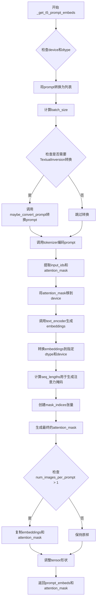

#### 带注释源码

```python
def _get_t5_prompt_embeds(
    self,
    prompt: str | list[str] = None,
    num_images_per_prompt: int = 1,
    max_sequence_length: int = 512,
    device: torch.device | None = None,
    dtype: torch.dtype | None = None,
):
    """
    将文本prompt转换为T5编码器的embeddings和attention mask
    
    参数:
        prompt: 输入的文本提示词
        num_images_per_prompt: 每个prompt生成的图像数量
        max_sequence_length: 最大序列长度
        device: 计算设备
        dtype: 输出数据类型
    """
    # 如果未指定device，使用pipeline的默认执行设备
    device = device or self._execution_device
    # 如果未指定dtype，使用text_encoder的数据类型
    dtype = dtype or self.text_encoder.dtype

    # 将单个字符串转换为列表，统一处理方式
    prompt = [prompt] if isinstance(prompt, str) else prompt
    # 计算批次大小
    batch_size = len(prompt)

    # 如果pipeline支持TextualInversion，进行prompt转换
    # 这允许使用自定义的token嵌入
    if isinstance(self, TextualInversionLoaderMixin):
        prompt = self.maybe_convert_prompt(prompt, self.tokenizer)

    # 使用T5 tokenizer对prompt进行编码
    # 返回填充到max_length的token ids，不返回溢出的tokens
    text_inputs = self.tokenizer(
        prompt,
        padding="max_length",
        max_length=max_sequence_length,
        truncation=True,
        return_length=False,
        return_overflowing_tokens=False,
        return_tensors="pt",
    )
    # 提取token ids和attention mask
    text_input_ids = text_inputs.input_ids
    tokenizer_mask = text_inputs.attention_mask

    # 将attention mask移到指定设备
    tokenizer_mask_device = tokenizer_mask.to(device)

    # 调用T5 text_encoder生成文本嵌入
    # Chroma使用attention mask来控制哪些token参与注意力计算
    # 这是与FLUX模型的一个重要区别
    prompt_embeds = self.text_encoder(
        text_input_ids.to(device),
        output_hidden_states=False,
        attention_mask=tokenizer_mask_device,
    )[0]

    # 将embedings转换到指定的dtype和device
    prompt_embeds = prompt_embeds.to(dtype=dtype, device=device)

    # Chroma的特殊要求：除了第一个填充token外，
    # 所有填充token需要在Transformer前向传播中被屏蔽
    # 计算每个序列的实际长度（非填充token数量）
    seq_lengths = tokenizer_mask_device.sum(dim=1)
    
    # 创建索引矩阵，用于生成注意力掩码
    mask_indices = torch.arange(
        tokenizer_mask_device.size(1), 
        device=device
    ).unsqueeze(0).expand(batch_size, -1)
    
    # 生成最终的attention mask：
    # 只有当位置索引 <= 实际序列长度时才保留
    attention_mask = (
        mask_indices <= seq_lengths.unsqueeze(1)
    ).to(dtype=dtype, device=device)

    # 获取序列长度
    _, seq_len, _ = prompt_embeds.shape

    # 如果需要为每个prompt生成多个图像，
    # 需要复制embeddings和attention mask
    # 使用repeat方法以保持MPS（Apple Silicon）兼容性
    prompt_embeds = prompt_embeds.repeat(1, num_images_per_prompt, 1)
    prompt_embeds = prompt_embeds.view(
        batch_size * num_images_per_prompt, 
        seq_len, 
        -1
    )

    attention_mask = attention_mask.repeat(1, num_images_per_prompt)
    attention_mask = attention_mask.view(
        batch_size * num_images_per_prompt, 
        seq_len
    )

    # 返回embeddings和attention mask
    return prompt_embeds, attention_mask
```


### ChromaPipeline.encode_image

该方法负责将输入图像编码为图像嵌入向量（image embeddings），供 IP-Adapter 使用。它首先将输入图像转换为张量格式，然后通过 CLIP 图像编码器提取特征嵌入，最后根据每prompt生成的图像数量复制嵌入向量。

参数：

- `image`：`PipelineImageInput`（支持 `torch.Tensor`、`PIL.Image.Image`、`np.ndarray` 等），需要编码的输入图像
- `device`：`torch.device`，指定计算设备（CPU/CUDA）
- `num_images_per_prompt`：`int`，每个 prompt 生成的图像数量，用于复制嵌入向量

返回值：`torch.Tensor`，图像嵌入向量，形状为 `(batch_size * num_images_per_prompt, embedding_dim)`

#### 流程图

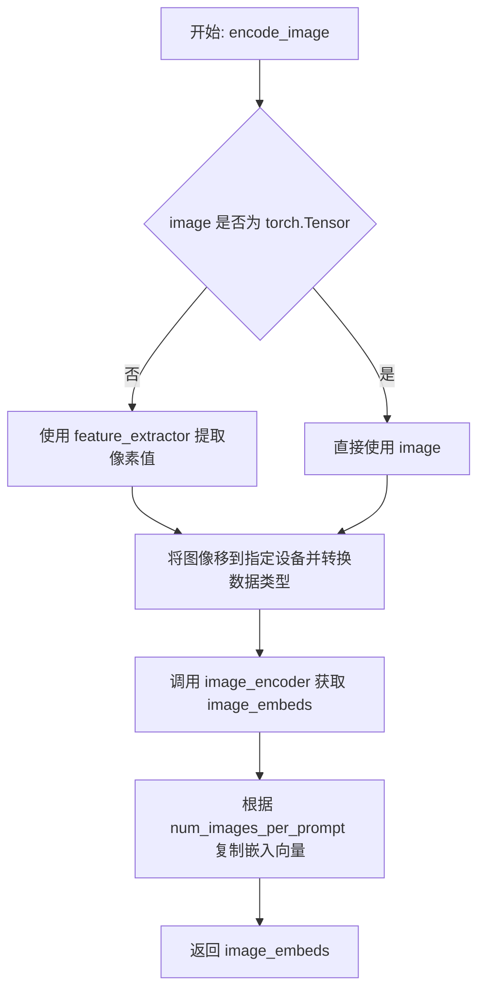

#### 带注释源码

```python
def encode_image(self, image, device, num_images_per_prompt):
    """
    将输入图像编码为图像嵌入向量，供 IP-Adapter 使用。

    参数:
        image: 输入图像，支持 torch.Tensor、PIL.Image、numpy.ndarray 等格式
        device: torch.device，计算设备
        num_images_per_prompt: int，每个 prompt 生成的图像数量

    返回:
        torch.Tensor: 图像嵌入向量
    """
    # 获取图像编码器的参数数据类型
    dtype = next(self.image_encoder.parameters()).dtype

    # 如果输入不是 PyTorch 张量，则使用特征提取器转换为张量
    if not isinstance(image, torch.Tensor):
        image = self.feature_extractor(image, return_tensors="pt").pixel_values

    # 将图像移到指定设备并转换为正确的 dtype
    image = image.to(device=device, dtype=dtype)

    # 通过 CLIP 图像编码器获取图像嵌入
    image_embeds = self.image_encoder(image).image_embeds

    # 根据每个 prompt 生成的图像数量复制嵌入向量
    # repeat_interleave 在维度 0 上复制，dim=0 表示批量维度
    image_embeds = image_embeds.repeat_interleave(num_images_per_prompt, dim=0)

    return image_embeds
```


### `ChromaPipeline.prepare_ip_adapter_image_embeds`

该方法用于准备 IP-Adapter 的图像嵌入（image embeddings）。它接收原始图像或预计算的图像嵌入，处理后返回适配器所需的格式。如果输入是原始图像，会调用 `encode_image` 方法进行编码；如果输入是预计算的嵌入，则直接使用。最后根据 `num_images_per_prompt` 参数复制嵌入以匹配每个 prompt 生成的图像数量。

参数：

- `self`：`ChromaPipeline` 实例，管道对象本身
- `ip_adapter_image`：`PipelineImageInput | None`，原始 IP-Adapter 图像输入，可以是单张图像或图像列表
- `ip_adapter_image_embeds`：`list[torch.Tensor] | None`，预计算的图像嵌入张量列表，如果为 None 则从 `ip_adapter_image` 编码生成
- `device`：`torch.device`，目标设备，用于将计算结果移动到指定设备
- `num_images_per_prompt`：`int`，每个 prompt 生成的图像数量，用于复制嵌入

返回值：`list[torch.Tensor]`，处理后的 IP-Adapter 图像嵌入列表，每个元素是对应适配器的嵌入张量

#### 流程图

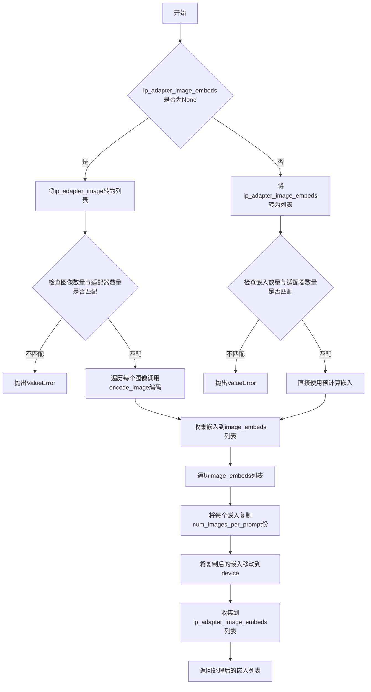

#### 带注释源码

```python
def prepare_ip_adapter_image_embeds(
    self, ip_adapter_image, ip_adapter_image_embeds, device, num_images_per_prompt
):
    """
    准备 IP-Adapter 的图像嵌入。
    
    如果提供了原始图像，则使用 encode_image 方法编码；如果提供了预计算嵌入，则直接使用。
    最终根据 num_images_per_prompt 复制嵌入以匹配批量生成数量。
    """
    # 初始化嵌入列表
    image_embeds = []
    
    # 分支1：未提供预计算嵌入，需要从原始图像编码
    if ip_adapter_image_embeds is None:
        # 确保图像是列表格式（单张图像转为单元素列表）
        if not isinstance(ip_adapter_image, list):
            ip_adapter_image = [ip_adapter_image]

        # 验证图像数量必须等于 IP-Adapter 的数量
        if len(ip_adapter_image) != self.transformer.encoder_hid_proj.num_ip_adapters:
            raise ValueError(
                f"`ip_adapter_image` must have same length as the number of IP Adapters. Got {len(ip_adapter_image)} images and {self.transformer.encoder_hid_proj.num_ip_adapters} IP Adapters."
            )

        # 遍历每个 IP-Adapter 图像进行编码
        for single_ip_adapter_image in ip_adapter_image:
            # 调用 encode_image 方法编码单个图像
            single_image_embeds = self.encode_image(single_ip_adapter_image, device, 1)
            # 在第0维添加批次维度并保存
            image_embeds.append(single_image_embeds[None, :])
    else:
        # 分支2：已提供预计算嵌入，直接使用
        # 确保嵌入是列表格式
        if not isinstance(ip_adapter_image_embeds, list):
            ip_adapter_image_embeds = [ip_adapter_image_embeds]

        # 验证嵌入数量必须等于 IP-Adapter 的数量
        if len(ip_adapter_image_embeds) != self.transformer.encoder_hid_proj.num_ip_adapters:
            raise ValueError(
                f"`ip_adapter_image_embeds` must have same length as the number of IP Adapters. Got {len(ip_adapter_image_embeds)} image embeds and {self.transformer.encoder_hid_proj.num_ip_adapters} IP Adapters."
            )

        # 直接使用预计算的嵌入
        for single_image_embeds in ip_adapter_image_embeds:
            image_embeds.append(single_image_embeds)

    # 最终处理：根据 num_images_per_prompt 复制嵌入并移动到目标设备
    ip_adapter_image_embeds = []
    for single_image_embeds in image_embeds:
        # 沿第0维（批次维）复制 num_images_per_prompt 次
        single_image_embeds = torch.cat([single_image_embeds] * num_images_per_prompt, dim=0)
        # 将嵌入移动到指定设备
        single_image_embeds = single_image_embeds.to(device=device)
        # 收集处理后的嵌入
        ip_adapter_image_embeds.append(single_image_embeds)

    # 返回最终处理好的嵌入列表
    return ip_adapter_image_embeds
```


### `ChromaPipeline.check_inputs`

该方法用于验证图像生成管道的输入参数是否合法，确保高度和宽度符合VAE的缩放因子要求，检查prompt和prompt_embeds的互斥关系，验证attention_mask的完整性，并限制最大序列长度。

参数：

- `prompt`：`str | list[str]`，正向提示词，用于指导图像生成
- `height`：`int`，生成图像的高度（像素）
- `width`：`int`，生成图像的宽度（像素）
- `negative_prompt`：`str | list[str]`，可选，负向提示词，用于避免生成不希望的内容
- `prompt_embeds`：`torch.Tensor | None`，可选，预生成的文本嵌入向量
- `prompt_attention_mask`：`torch.Tensor | None`，可选，prompt嵌入的注意力掩码
- `negative_prompt_embeds`：`torch.Tensor | None`，可选，预生成的负向文本嵌入
- `negative_prompt_attention_mask`：`torch.Tensor | None`，可选，负向prompt的注意力掩码
- `callback_on_step_end_tensor_inputs`：`list | None`，可选，步结束回调函数需要接收的tensor输入列表
- `max_sequence_length`：`int | None`，可选，最大序列长度

返回值：`None`，该方法仅进行参数验证，不返回任何值

#### 流程图

```mermaid
flowchart TD
    A[开始 check_inputs] --> B{height % (vae_scale_factor*2) == 0<br/>width % (vae_scale_factor*2) == 0?}
    B -->|否| C[发出警告: 调整尺寸]
    B -->|是| D{callback_on_step_end_tensor_inputs<br/>所有元素都在<br/>_callback_tensor_inputs中?}
    C --> D
    D -->|否| E[抛出ValueError]
    D --> F{prompt和prompt_embeds<br/>都非空?}
    F -->|是| G[抛出ValueError: 不能同时提供]
    F --> H{prompt和prompt_embeds<br/>都为空?}
    H -->|是| I[抛出ValueError: 至少提供一个]
    H -->|否| J{prompt是str或list?}
    J -->|否| K[抛出ValueError: 类型错误]
    J -->|是| L{negative_prompt和<br/>negative_prompt_embeds<br/>都非空?}
    L -->|是| M[抛出ValueError: 不能同时提供]
    L -->|否| N{prompt_embeds非空但<br/>prompt_attention_mask为空?}
    N -->|是| O[抛出ValueError: 缺少mask]
    N -->|否| P{negative_prompt_embeds非空但<br/>negative_prompt_attention_mask为空?}
    P -->|是| Q[抛出ValueError: 缺少mask]
    P -->|否| R{max_sequence_length > 512?}
    R -->|是| S[抛出ValueError: 超过最大值]
    R -->|否| T[验证通过]
    G --> U[结束]
    I --> U
    K --> U
    M --> U
    O --> U
    Q --> U
    S --> U
    T --> U
```

#### 带注释源码

```python
def check_inputs(
    self,
    prompt,
    height,
    width,
    negative_prompt=None,
    prompt_embeds=None,
    prompt_attention_mask=None,
    negative_prompt_embeds=None,
    negative_prompt_attention_mask=None,
    callback_on_step_end_tensor_inputs=None,
    max_sequence_length=None,
):
    """
    验证输入参数的合法性，确保管道能够正确执行。
    
    检查项目：
    1. 图像尺寸是否可以被VAE缩放因子整除
    2. 回调函数输入是否在允许的tensor列表中
    3. prompt和prompt_embeds的互斥关系
    4. negative_prompt和negative_prompt_embeds的互斥关系
    5. prompt_embeds和prompt_attention_mask的配对要求
    6. negative_prompt_embeds和negative_prompt_attention_mask的配对要求
    7. 最大序列长度不能超过512
    """
    
    # 检查图像高度和宽度是否能被VAE缩放因子*2整除
    # Chroma使用2x2的patch packing，因此需要额外的除以2操作
    if height % (self.vae_scale_factor * 2) != 0 or width % (self.vae_scale_factor * 2) != 0:
        logger.warning(
            f"`height` and `width` have to be divisible by {self.vae_scale_factor * 2} but are {height} and {width}. Dimensions will be resized accordingly"
        )

    # 验证回调函数接收的tensor输入是否都在允许的列表中
    if callback_on_step_end_tensor_inputs is not None and not all(
        k in self._callback_tensor_inputs for k in callback_on_step_end_tensor_inputs
    ):
        raise ValueError(
            f"`callback_on_step_end_tensor_inputs` has to be in {self._callback_tensor_inputs}, but found {[k for k in callback_on_step_end_tensor_inputs if k not in self._callback_tensor_inputs]}"
        )

    # 验证prompt和prompt_embeds不能同时提供（互斥）
    if prompt is not None and prompt_embeds is not None:
        raise ValueError(
            f"Cannot forward both `prompt`: {prompt} and `prompt_embeds`: {prompt_embeds}. Please make sure to"
            " only forward one of the two."
        )
    # 验证至少提供一个生成提示
    elif prompt is None and prompt_embeds is None:
        raise ValueError(
            "Provide either `prompt` or `prompt_embeds`. Cannot leave both `prompt` and `prompt_embeds` undefined."
        )
    # 验证prompt的类型必须是字符串或字符串列表
    elif prompt is not None and (not isinstance(prompt, str) and not isinstance(prompt, list)):
        raise ValueError(f"`prompt` has to be of type `str` or `list` but is {type(prompt)}")

    # 验证negative_prompt和negative_prompt_embeds不能同时提供
    if negative_prompt is not None and negative_prompt_embeds is not None:
        raise ValueError(
            f"Cannot forward both `negative_prompt`: {negative_prompt} and `negative_prompt_embeds`:"
            f" {negative_prompt_embeds}. Please make sure to only forward one of the two."
        )

    # 验证如果提供了prompt_embeds，必须同时提供对应的attention_mask
    if prompt_embeds is not None and prompt_attention_mask is None:
        raise ValueError("Cannot provide `prompt_embeds` without also providing `prompt_attention_mask")

    # 验证如果提供了negative_prompt_embeds，必须同时提供对应的attention_mask
    if negative_prompt_embeds is not None and negative_prompt_attention_mask is None:
        raise ValueError(
            "Cannot provide `negative_prompt_embeds` without also providing `negative_prompt_attention_mask"
        )

    # 验证最大序列长度不超过512（T5模型限制）
    if max_sequence_length is not None and max_sequence_length > 512:
        raise ValueError(f"`max_sequence_length` cannot be greater than 512 but is {max_sequence_length}")
```


### `ChromaPipeline.prepare_latents`

该方法用于为 Chroma 管道准备潜空间变量（latents）和对应的图像标识符。它根据批次大小、通道数、图像尺寸等信息生成或处理潜空间张量，并创建用于注意力机制的位置编码信息。

参数：

- `batch_size`：`int`，生成的批次大小
- `num_channels_latents`：`int`，潜空间通道数
- `height`：`int`，目标图像高度
- `width`：`int`，目标图像宽度
- `dtype`：`torch.dtype`，潜空间张量的数据类型
- `device`：`torch.device`，计算设备
- `generator`：`torch.Generator | list[torch.Generator] | None`，用于生成随机数的生成器
- `latents`：`torch.Tensor | None`，可选的预生成潜空间张量

返回值：`tuple[torch.Tensor, torch.Tensor]`，包含打包后的潜空间张量和对应的潜空间图像标识符

#### 流程图

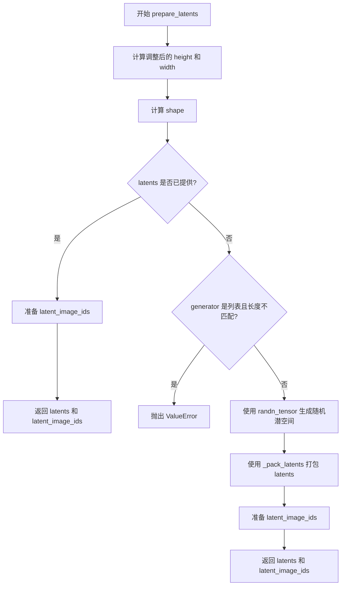

#### 带注释源码

```python
# Copied from diffusers.pipelines.flux.pipeline_flux.FluxPipeline.prepare_latents
def prepare_latents(
    self,
    batch_size,
    num_channels_latents,
    height,
    width,
    dtype,
    device,
    generator,
    latents=None,
):
    # VAE applies 8x compression on images but we must also account for packing which requires
    # latent height and width to be divisible by 2.
    # VAE 对图像进行 8 倍压缩，同时还需要考虑打包操作（要求潜空间高度和宽度能被 2 整除）
    height = 2 * (int(height) // (self.vae_scale_factor * 2))
    width = 2 * (int(width) // (self.vae_scale_factor * 2))

    # 定义潜空间张量的形状
    shape = (batch_size, num_channels_latents, height, width)

    # 如果已经提供了 latents，则只需将其移到指定设备并转换为指定数据类型
    if latents is not None:
        latent_image_ids = self._prepare_latent_image_ids(batch_size, height // 2, width // 2, device, dtype)
        return latents.to(device=device, dtype=dtype), latent_image_ids

    # 验证 generator 列表长度是否与批次大小匹配
    if isinstance(generator, list) and len(generator) != batch_size:
        raise ValueError(
            f"You have passed a list of generators of length {len(generator)}, but requested an effective batch"
            f" size of {batch_size}. Make sure the batch size matches the length of the generators."
        )

    # 使用随机生成器创建符合正态分布的潜空间张量
    latents = randn_tensor(shape, generator=generator, device=device, dtype=dtype)
    
    # 对潜空间进行打包处理（将 2x2 的 patch 展平为序列）
    latents = self._pack_latents(latents, batch_size, num_channels_latents, height, width)

    # 生成用于 Transformer 注意力机制的图像位置标识符
    latent_image_ids = self._prepare_latent_image_ids(batch_size, height // 2, width // 2, device, dtype)

    return latents, latent_image_ids
```


### `ChromaPipeline._prepare_latent_image_ids`

生成潜在图像的位置标识符（Image IDs），用于在 Transformer 模型中标识图像中每个像素位置的空间信息。该方法创建一个二维坐标网格，其中第二维（通道1）表示垂直位置索引，第三维（通道2）表示水平位置索引。

参数：

- `batch_size`：`int`，批量大小（当前实现中未直接使用，但保留用于与其它方法签名保持一致）
- `height`：`int`，潜在图像的高度（以 patch 为单位）
- `width`：`int`，潜在图像的宽度（以 patch 为单位）
- `device`：`torch.device`，目标计算设备
- `dtype`：`torch.dtype`，目标数据类型

返回值：`torch.Tensor`，形状为 `(height * width, 3)` 的二维张量，每行包含一个位置标识符，其中第二个值为行索引（高度），第三个值为列索引（宽度）

#### 流程图

```mermaid
flowchart TD
    A[开始] --> B[创建形状为 height x width x 3 的零张量]
    B --> C[填充高度坐标<br/>latent_image_ids[1] = torch.arange(height)]
    C --> D[填充宽度坐标<br/>latent_image_ids[2] = torch.arange(width)]
    D --> E[获取张量形状<br/>height, width, channels]
    E --> F[重塑为二维张量<br/>height*width x 3]
    F --> G[转移至目标设备和数据类型]
    G --> H[返回 latent_image_ids]
```

#### 带注释源码

```python
@staticmethod
def _prepare_latent_image_ids(batch_size, height, width, device, dtype):
    """
    生成潜在图像的位置标识符，用于在Transformer模型中标识图像中每个像素位置的空间信息。
    
    参数:
        batch_size: 批量大小（当前实现中未直接使用）
        height: 潜在图像的高度（以patch为单位）
        width: 潜在图像的宽度（以patch为单位）
        device: 目标计算设备
        dtype: 目标数据类型
    
    返回:
        形状为 (height * width, 3) 的张量，包含位置标识符
    """
    # 1. 初始化形状为 (height, width, 3) 的零张量
    #    3个通道分别用于: [0]=保留/未使用, [1]=高度索引, [2]=宽度索引
    latent_image_ids = torch.zeros(height, width, 3)
    
    # 2. 填充高度坐标（行索引）
    #    使用 torch.arange(height) 生成 [0, 1, 2, ..., height-1]
    #    [:, None] 将形状从 (height,) 扩展为 (height, 1) 以便广播
    latent_image_ids[..., 1] = latent_image_ids[..., 1] + torch.arange(height)[:, None]
    
    # 3. 填充宽度坐标（列索引）
    #    使用 torch.arange(width) 生成 [0, 1, 2, ..., width-1]
    #    [None, :] 将形状从 (width,) 扩展为 (1, width) 以便广播
    latent_image_ids[..., 2] = latent_image_ids[..., 2] + torch.arange(width)[None, :]
    
    # 4. 获取重塑前的张量形状信息
    latent_image_id_height, latent_image_id_width, latent_image_id_channels = latent_image_ids.shape
    
    # 5. 将 3D 张量重塑为 2D 张量
    #    从 (height, width, 3) 变为 (height * width, 3)
    #    每一行代表一个patch的位置信息
    latent_image_ids = latent_image_ids.reshape(
        latent_image_id_height * latent_image_id_width, latent_image_id_channels
    )
    
    # 6. 将张量转移到目标设备并转换为目标数据类型后返回
    return latent_image_ids.to(device=device, dtype=dtype)
```


### `ChromaPipeline._pack_latents`

该静态方法用于将VAE输出的4D潜在表示张量（batch, channels, height, width）转换为Transformer所需的3D打包格式（batch, num_patches, packed_channels），通过将2x2的空间patch展平到通道维度来实现压缩。

参数：

- `latents`：`torch.Tensor`，输入的VAE潜在表示张量，形状为 (batch_size, num_channels_latents, height, width)
- `batch_size`：`int`，批量大小
- `num_channels_latents`：`int`，潜在表示的通道数
- `height`：`int`，潜在表示的高度
- `width`：`int`，潜在表示的宽度

返回值：`torch.Tensor`，打包后的潜在表示张量，形状为 (batch_size, (height//2)*(width//2), num_channels_latents*4)

#### 流程图

```mermaid
flowchart TD
    A[输入latents: (batch, channels, H, W)] --> B[view操作: (batch, channels, H//2, 2, W//2, 2)]
    B --> C[permute操作: (batch, H//2, W//2, channels, 2, 2)]
    C --> D[reshape操作: (batch, H//2*W//2, channels*4)]
    D --> E[输出latents: (batch, num_patches, packed_channels)]
    
    B -->|重塑维度| B
    C -->|调整维度顺序| C
    D -->|展平空间维度| E
```

#### 带注释源码

```python
@staticmethod
def _pack_latents(latents, batch_size, num_channels_latents, height, width):
    # 第一次reshape：将(height, width)分割成(height//2, 2, width//2, 2)的结构
    # 将每个2x2的patch作为一个维度，便于后续打包装配
    # 输入: (batch_size, num_channels_latents, height, width)
    # 输出: (batch_size, num_channels_latents, height//2, 2, width//2, 2)
    latents = latents.view(batch_size, num_channels_latents, height // 2, 2, width // 2, 2)
    
    # permute操作：重新排列维度顺序，将空间维度(高度和宽度)提前
    # 原顺序: (0, 1, 2, 3, 4, 5) -> 新顺序: (0, 2, 4, 1, 3, 5)
    # 将(height//2, width//2)维度移到前面，通道维度移后
    # 输出: (batch_size, height//2, width//2, num_channels_latents, 2, 2)
    latents = latents.permute(0, 2, 4, 1, 3, 5)
    
    # 第二次reshape：将2x2的patch展平到通道维度
    # 将(num_channels_latents, 2, 2)合并为 num_channels_latents*4
    # 将(height//2, width//2)合并为 (height//2)*(width//2)
    # 最终输出: (batch_size, (height//2)*(width//2), num_channels_latents*4)
    latents = latents.reshape(batch_size, (height // 2) * (width // 2), num_channels_latents * 4)

    return latents
```


### `ChromaPipeline._unpack_latents`

该函数是一个静态方法（Static Method），负责将扩散模型输出的“打包后的”（Packed）潜在表示解包为标准的 4D 张量形式，以便送入 VAE（变分自编码器）进行解码。在 ChromaPipeline 中，潜在向量通常被压缩并打包以提高计算效率，此函数正是这一过程的逆操作。

参数：

-  `latents`：`torch.Tensor`，打包后的潜在表示，形状为 `[batch_size, num_patches, channels]`（通常 channels 扩展了 4 倍）。
-  `height`：`int`，目标图像的高度（像素单位）。
-  `width`：`int`，目标图像的宽度（像素单位）。
-  `vae_scale_factor`：`int`，VAE 的缩放因子（通常为 8），用于计算潜在空间的尺寸。

返回值：`torch.Tensor`，解包后的潜在表示，形状为 `[batch_size, channels // 4, latent_height, latent_width]`，可直接用于 VAE 解码。

#### 流程图

```mermaid
graph TD
    A[Start _unpack_latents] --> B[Input: latents, height, width, vae_scale_factor]
    B --> C[Extract Shape: batch_size, num_patches, channels]
    C --> D[Calculate Latent Dimensions]
    D --> E[height = 2 * (height // (vae_scale_factor * 2))]
    D --> F[width = 2 * (width // (vae_scale_factor * 2))]
    E --> G[Reshape to Patch Grid]
    F --> G
    G --> H[latents.view(batch_size, height//2, width//2, channels//4, 2, 2)]
    H --> I[Permute Axes]
    I --> J[latents.permute(0, 3, 1, 4, 2, 5)]
    J --> K[Reshape to Standard Latent]
    K --> L[latents.reshape(batch_size, channels // 4, height, width)]
    L --> M[Return Unpacked Latents]
```

#### 带注释源码

```python
@staticmethod
def _unpack_latents(latents, height, width, vae_scale_factor):
    # 获取输入张量的基本维度信息
    # latents shape: [batch_size, num_patches, channels]
    batch_size, num_patches, channels = latents.shape

    # VAE 应用 8 倍压缩，但我们还需要考虑打包（Packing）操作要求潜在高度和宽度能被 2 整除。
    # 这里根据像素尺寸和 VAE 缩放因子计算出潜在空间的尺寸。
    # 计算公式需与 prepare_latents 中的逻辑互逆。
    height = 2 * (int(height) // (vae_scale_factor * 2))
    width = 2 * (int(width) // (vae_scale_factor * 2))

    # 1. 视图重塑 (View/Reshape): 将打包的 1D 序列还原为 2D 补丁网格
    # 从 [B, H*W/4, C*4] -> [B, H/2, W/2, C/4, 2, 2]
    # 这里将 (C*4) 通道拆分为 (C/4) 通道和 2x2 的补丁维度
    latents = latents.view(batch_size, height // 2, width // 2, channels // 4, 2, 2)
    
    # 2. 维度重排 (Permute): 调整轴的顺序，以便将补丁维度合并到空间维度中
    # 从 [B, H/2, W/2, C/4, 2, 2] -> [B, C/4, H/2, 2, W/2, 2]
    latents = latents.permute(0, 3, 1, 4, 2, 5)

    # 3. 最终重塑 (Reshape): 展平补丁维度，得到标准的 4D 潜在张量
    # 从 [B, C/4, H/2, 2, W/2, 2] -> [B, C/4, H, W]
    latents = latents.reshape(batch_size, channels // (2 * 2), height, width)

    return latents
```


### ChromaPipeline._prepare_attention_mask

该方法用于准备和扩展注意力掩码，确保在文本提示嵌入后添加与图像token对应的注意力掩码，以支持Chromapipeline中文本和图像的联合注意力处理。

参数：

- `batch_size`：`int`，批量大小，用于创建与图像token对应的新掩码维度
- `sequence_length`：`int`，序列长度，指定要添加的图像token数量
- `dtype`：`torch.dtype`，数据类型，指定输出张量的数据类型（虽然当前实现中未直接使用）
- `attention_mask`：`torch.Tensor | None`，原始的注意力掩码，用于文本token的注意力控制，如果为None则直接返回None

返回值：`torch.Tensor | None`，扩展后的注意力掩码，包含原始文本token掩码和新增的图像token掩码；如果输入的attention_mask为None，则返回None

#### 流程图

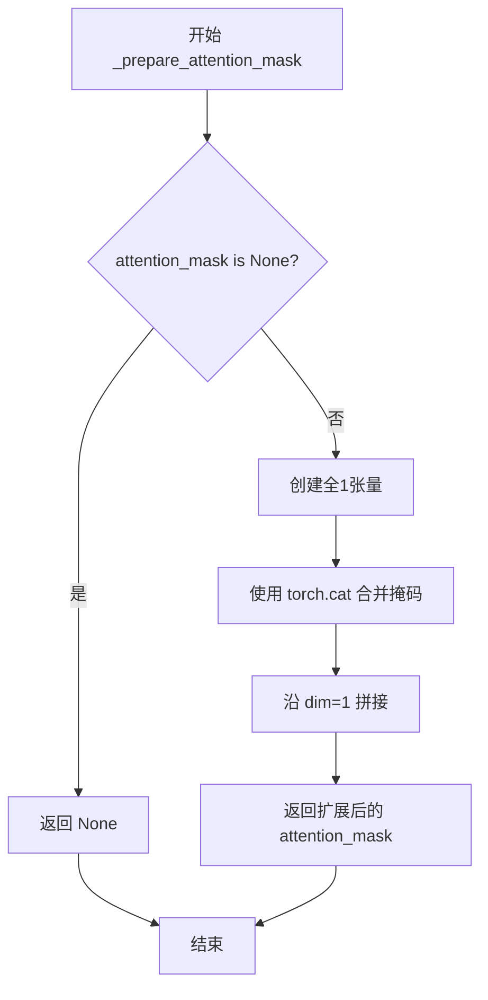

#### 带注释源码

```python
def _prepare_attention_mask(
    self,
    batch_size,
    sequence_length,
    dtype,
    attention_mask=None,
):
    """
    准备并扩展注意力掩码以包含图像token的掩码
    
    参数:
        batch_size: 批量大小
        sequence_length: 序列长度（图像token数量）
        dtype: 数据类型
        attention_mask: 可选的原始注意力掩码
    
    返回:
        扩展后的注意力掩码或None
    """
    
    # 如果没有提供注意力掩码，直接返回None
    # 这允许调用方省略可选的attention_mask参数
    if attention_mask is None:
        return attention_mask

    # 扩展提示注意力掩码以考虑最终序列中的图像token
    # Chroma pipeline将图像token添加到文本token之后，
    # 因此需要为这些图像token添加有效的注意力掩码（值为1表示关注）
    attention_mask = torch.cat(
        [attention_mask, torch.ones(batch_size, sequence_length, device=attention_mask.device, dtype=torch.bool)],
        dim=1,
    )

    return attention_mask
```


### `ChromaPipeline.enable_vae_slicing`

启用分片 VAE 解码功能。当启用此选项时，VAE 将输入张量分割成多个切片进行分步解码。这有助于节省内存并支持更大的批处理大小。

参数：

- 无（仅包含 `self`）

返回值：`None`，无返回值（该方法修改对象状态但不返回任何值）

#### 流程图

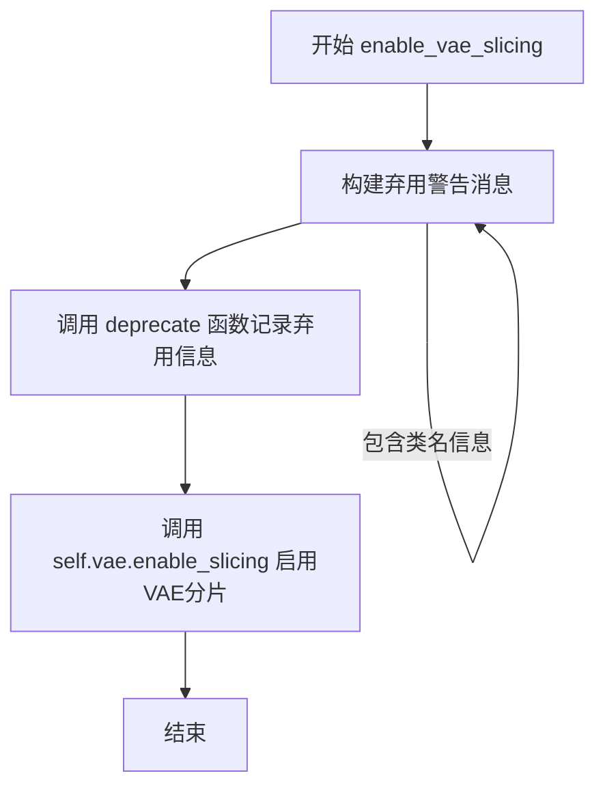

#### 带注释源码

```python
def enable_vae_slicing(self):
    r"""
    Enable sliced VAE decoding. When this option is enabled, the VAE will split the input tensor in slices to
    compute decoding in several steps. This is useful to save some memory and allow larger batch sizes.
    """
    # 构建弃用警告消息，包含当前类的名称，提示用户该方法将在未来版本中移除
    # 并建议使用 pipe.vae.enable_slicing() 代替
    depr_message = f"Calling `enable_vae_slicing()` on a `{self.__class__.__name__}` is deprecated and this method will be removed in a future version. Please use `pipe.vae.enable_slicing()`."
    
    # 调用 deprecate 函数记录弃用警告，指定弃用的功能名称、版本号和警告消息
    deprecate(
        "enable_vae_slicing",      # 弃用的功能名称
        "0.40.0",                  # 将在 0.40.0 版本移除
        depr_message,              # 警告消息内容
    )
    
    # 调用 VAE 模型的 enable_slicing 方法，启用分片解码功能
    # 该方法会修改 VAE 内部的分片解码设置
    self.vae.enable_slicing()
```


### `ChromaPipeline.disable_vae_slicing`

该方法用于禁用 VAE（变分自编码器）的切片解码功能。如果之前启用了 `enable_vae_slicing`，调用此方法后将恢复到单步解码。该方法已被弃用，将在未来版本中移除，推荐直接使用 `pipe.vae.disable_slicing()`。

参数：暂无参数

返回值：`None`，无返回值

#### 流程图

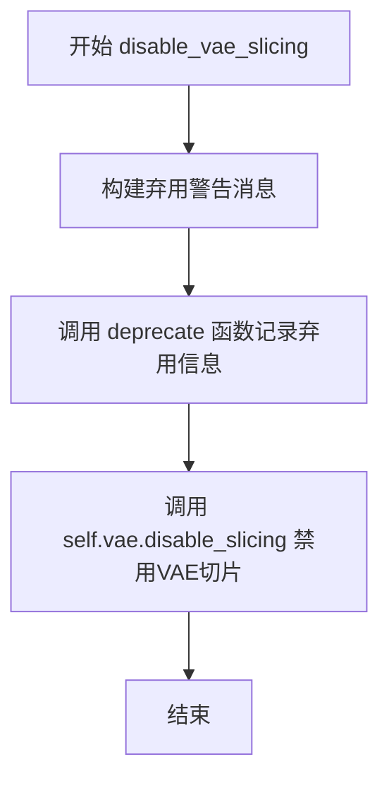

#### 带注释源码

```python
def disable_vae_slicing(self):
    r"""
    Disable sliced VAE decoding. If `enable_vae_slicing` was previously enabled, this method will go back to
    computing decoding in one step.
    """
    # 构建弃用警告消息，提醒用户该方法已被弃用
    # 建议用户使用 pipe.vae.disable_slicing() 替代
    depr_message = f"Calling `disable_vae_slicing()` on a `{self.__class__.__name__}` is deprecated and this method will be removed in a future version. Please use `pipe.vae.disable_slicing()`."
    
    # 调用 deprecate 函数记录弃用信息，参数包括：方法名、弃用版本号、警告消息
    deprecate(
        "disable_vae_slicing",
        "0.40.0",
        depr_message,
    )
    
    # 调用 VAE 模型的 disable_slicing 方法，禁用切片解码功能
    self.vae.disable_slicing()
```


### `ChromaPipeline.enable_vae_tiling`

该方法用于启用瓦片式VAE解码，当启用此选项时，VAE会将输入张量分割成多个瓦片来分步计算编码和解码，从而节省大量内存并允许处理更大的图像。

参数： 无

返回值：`None`，无返回值，仅执行副作用（启用VAE瓦片化）

#### 流程图

```mermaid
flowchart TD
    A[开始 enable_vae_tiling] --> B[构建弃用警告消息]
    B --> C[调用 deprecate 函数记录弃用信息]
    C --> D[调用 self.vae.enable_tiling 启用瓦片化]
    D --> E[结束]
```

#### 带注释源码

```python
def enable_vae_tiling(self):
    r"""
    Enable tiled VAE decoding. When this option is enabled, the VAE will split the input tensor into tiles to
    compute decoding and encoding in several steps. This is useful for saving a large amount of memory and to allow
    processing larger images.
    """
    # 构建弃用警告消息，提示用户该方法将在未来版本中移除
    # 应使用 pipe.vae.enable_tiling() 代替
    depr_message = f"Calling `enable_vae_tiling()` on a `{self.__class__.__name__}` is deprecated and this method will be removed in a future version. Please use `pipe.vae.enable_tiling()`."
    
    # 调用 deprecate 函数记录弃用信息，版本号为 0.40.0
    deprecate(
        "enable_vae_tiling",
        "0.40.0",
        depr_message,
    )
    
    # 实际启用 VAE 的瓦片化功能，委托给 VAE 模型本身的 enable_tiling 方法
    self.vae.enable_tiling()
```


### `ChromaPipeline.disable_vae_tiling`

该方法用于禁用瓦片式 VAE 解码。如果之前启用了瓦片式 VAE 解码（通过 `enable_vae_tiling`），调用此方法后将恢复为单步解码。该方法已被弃用，建议直接使用 `pipe.vae.disable_tiling()`。

参数：

- 无

返回值：`None`，无返回值（该方法直接操作 VAE 模型的内部状态）

#### 流程图

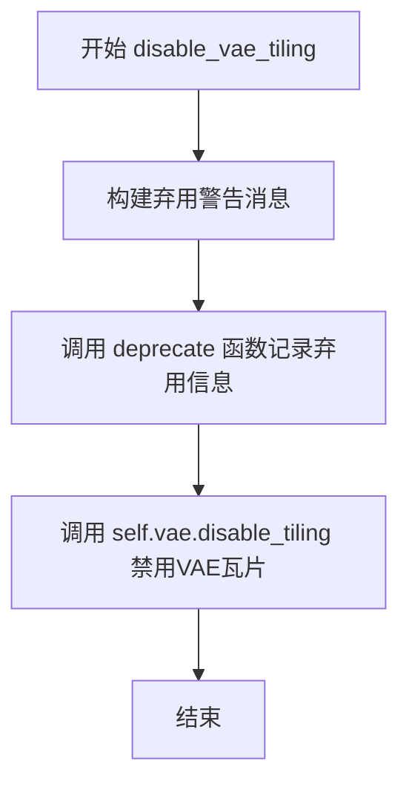

#### 带注释源码

```
def disable_vae_tiling(self):
    r"""
    Disable tiled VAE decoding. If `enable_vae_tiling` was previously enabled, this method will go back to
    computing decoding in one step.
    """
    # 构建弃用警告消息，提示用户该方法将在未来版本中移除
    # 建议用户直接使用 pipe.vae.disable_tiling() 代替
    depr_message = f"Calling `disable_vae_tiling()` on a `{self.__class__.__name__}` is deprecated and this method will be removed in a future version. Please use `pipe.vae.disable_tiling()`."
    
    # 调用 deprecate 函数记录弃用信息
    # 参数: 方法名, 弃用版本号, 弃用消息
    deprecate(
        "disable_vae_tiling",
        "0.40.0",
        depr_message,
    )
    
    # 调用 VAE 模型的 disable_tiling 方法，禁用瓦片式解码
    self.vae.disable_tiling()
```


### `ChromaPipeline.__call__`

该方法是ChromaPipeline的核心推理方法，接收文本提示（prompt）和其他控制参数，通过多步去噪过程生成图像。支持分类器自由引导（CFG）、IP-Adapter图像提示、LoRA权重调节、VAE切片/平铺解码等高级功能，并可通过回调函数在每个去噪步骤结束时执行自定义逻辑。最终返回包含生成图像的`ChromaPipelineOutput`对象或元组。

参数：

- `prompt`：`str | list[str] | None`，用于引导图像生成的文本提示，若未定义则需提供`prompt_embeds`
- `negative_prompt`：`str | list[str] | None`，不引导图像生成的负面提示，若未定义则需提供`negative_prompt_embeds`，在不使用引导时（即`guidance_scale ≤ 1`）将被忽略
- `height`：`int | None`，生成图像的高度（像素），默认为`self.unet.config.sample_size * self.vae_scale_factor`
- `width`：`int | None`，生成图像的宽度（像素），默认为`self.unet.config.sample_size * self.vae_scale_factor`
- `num_inference_steps`：`int`，去噪步骤数，默认为35，更多去噪步骤通常能获得更高质量的图像但推理速度更慢
- `sigmas`：`list[float] | None`，自定义sigmas值，用于支持sigmas参数的调度器，若不定义则使用默认行为
- `guidance_scale`：`float`，分类器自由引导（CFG）尺度，定义为论文中的w参数，值越大生成的图像与文本提示越相关但质量可能下降，默认为5.0
- `num_images_per_prompt`：`int | None`，每个提示生成的图像数量，默认为1
- `generator`：`torch.Generator | list[torch.Generator] | None`，一个或多个torch生成器，用于使生成过程具有确定性
- `latents`：`torch.Tensor | None`，预生成的噪声latents，用于图像生成，若不提供将使用随机`generator`采样生成
- `prompt_embeds`：`torch.Tensor | None`，预生成的文本嵌入，可用于轻松调整文本输入（如提示加权）
- `ip_adapter_image`：`PipelineImageInput | None`，用于IP-Adapter的可选图像输入
- `ip_adapter_image_embeds`：`list[torch.Tensor] | None`，IP-Adapter的预生成图像嵌入，列表长度应与IP-adapters数量相同
- `negative_ip_adapter_image`：`PipelineImageInput | None`，用于IP-Adapter的可选负面图像输入
- `negative_ip_adapter_image_embeds`：`list[torch.Tensor] | None`，IP-Adapter的预生成负面图像嵌入
- `negative_prompt_embeds`：`torch.Tensor | None`，预生成的负面文本嵌入
- `prompt_attention_mask`：`torch.Tensor | None`，提示嵌入的注意力掩码，用于掩码提示序列中的填充标记
- `negative_prompt_attention_mask`：`torch.Tensor | None`，负面提示嵌入的注意力掩码
- `output_type`：`str | None`，生成图像的输出格式，可选"PIL"（PIL.Image.Image）或"np.array"，默认为"pil"
- `return_dict`：`bool`，是否返回`ChromaPipelineOutput`而不是普通元组，默认为True
- `joint_attention_kwargs`：`dict[str, Any] | None`，若指定则传递给`AttentionProcessor`的kwargs字典
- `callback_on_step_end`：`Callable[[int, int], None] | None`，每个去噪步骤结束时调用的函数
- `callback_on_step_end_tensor_inputs`：`list[str]`，传递给`callback_on_step_end`函数的张量输入列表，默认为["latents"]
- `max_sequence_length`：`int`，与提示一起使用的最大序列长度，默认为512

返回值：`ChromaPipelineOutput | tuple`，当`return_dict`为True时返回`ChromaPipelineOutput`，否则返回元组，第一个元素是生成的图像列表

#### 流程图

```mermaid
flowchart TD
    A[开始 __call__] --> B[检查并设置 height/width]
    B --> C{验证输入 check_inputs}
    C -->|验证失败| D[抛出 ValueError]
    C -->|验证通过| E[设置内部状态变量]
    E --> F[确定 batch_size]
    F --> G[调用 encode_prompt 获取 prompt_embeds]
    G --> H[调用 prepare_latents 准备 latents]
    H --> I[计算 sigmas 和 mu]
    I --> J[准备 attention_mask]
    J --> K[调用 retrieve_timesteps 获取 timesteps]
    K --> L[准备 IP-Adapter 图像嵌入]
    L --> M[进入去噪循环 for i, t in enumerate timesteps]
    M --> N{检查 interrupt 标志}
    N -->|True| O[continue 跳过本次循环]
    N -->|False| P[执行 transformer 前向传播]
    P --> Q{是否使用 CFG}
    Q -->|Yes| R[执行 negative prompt 的 transformer 前向]
    R --> S[计算 noise_pred = neg_noise_pred + guidance_scale * (noise_pred - neg_noise_pred)]
    Q -->|No| T[直接使用 noise_pred]
    S --> U[调用 scheduler.step 去噪]
    T --> U
    U --> V{是否有 callback_on_step_end}
    V -->|Yes| W[执行回调函数]
    V -->|No| X{是否为最后一个或暖身步骤}
    W --> X
    X --> Y[更新进度条]
    Y --> Z{是否还有更多 timesteps}
    Z -->|Yes| M
    Z -->|No| AA[去噪循环结束]
    AA --> BB{output_type == 'latent'}
    BB -->|Yes| CC[直接使用 latents 作为 image]
    BB -->|No| DD[调用 _unpack_latents 解包 latents]
    DD --> EE[VAE 解码 latents 到图像]
    CC --> FF[后处理图像]
    EE --> FF
    FF --> GG[调用 maybe_free_model_hooks 卸载模型]
    GG --> HH{return_dict}
    HH -->|Yes| II[返回 ChromaPipelineOutput]
    HH -->|No| JJ[返回 tuple]
    II --> KK[结束]
    JJ --> KK
```

#### 带注释源码

```python
@torch.no_grad()
@replace_example_docstring(EXAMPLE_DOC_STRING)
def __call__(
    self,
    prompt: str | list[str] = None,
    negative_prompt: str | list[str] = None,
    height: int | None = None,
    width: int | None = None,
    num_inference_steps: int = 35,
    sigmas: list[float] | None = None,
    guidance_scale: float = 5.0,
    num_images_per_prompt: int | None = 1,
    generator: torch.Generator | list[torch.Generator] | None = None,
    latents: torch.Tensor | None = None,
    prompt_embeds: torch.Tensor | None = None,
    ip_adapter_image: PipelineImageInput | None = None,
    ip_adapter_image_embeds: list[torch.Tensor] | None = None,
    negative_ip_adapter_image: PipelineImageInput | None = None,
    negative_ip_adapter_image_embeds: list[torch.Tensor] | None = None,
    negative_prompt_embeds: torch.Tensor | None = None,
    prompt_attention_mask: torch.Tensor | None = None,
    negative_prompt_attention_mask: torch.Tensor | None = None,
    output_type: str | None = "pil",
    return_dict: bool = True,
    joint_attention_kwargs: dict[str, Any] | None = None,
    callback_on_step_end: Callable[[int, int], None] | None = None,
    callback_on_step_end_tensor_inputs: list[str] = ["latents"],
    max_sequence_length: int = 512,
):
    r"""
    Function invoked when calling the pipeline for generation.

    Args:
        prompt (`str` or `list[str]`, *optional*):
            The prompt or prompts to guide the image generation. If not defined, one has to pass `prompt_embeds`.
            instead.
        negative_prompt (`str` or `list[str]`, *optional*):
            The prompt or prompts not to guide the image generation. If not defined, one has to pass
            `negative_prompt_embeds` instead. Ignored when not using guidance (i.e., ignored if `guidance_scale` is
            not greater than `1`).
        height (`int`, *optional*, defaults to self.unet.config.sample_size * self.vae_scale_factor):
            The height in pixels of the generated image. This is set to 1024 by default for the best results.
        width (`int`, *optional*, defaults to self.unet.config.sample_size * self.vae_scale_factor):
            The width in pixels of the generated image. This is set to 1024 by default for the best results.
        num_inference_steps (`int`, *optional*, defaults to 50):
            The number of denoising steps. More denoising steps usually lead to a higher quality image at the
            expense of slower inference.
        sigmas (`list[float]`, *optional*):
            Custom sigmas to use for the denoising process with schedulers which support a `sigmas` argument in
            their `set_timesteps` method. If not defined, the default behavior when `num_inference_steps` is passed
            will be used.
        guidance_scale (`float`, *optional*, defaults to 3.5):
            Guidance scale as defined in [Classifier-Free Diffusion
            Guidance](https://huggingface.co/papers/2207.12598). `guidance_scale` is defined as `w` of equation 2.
            of [Imagen Paper](https://huggingface.co/papers/2205.11487). Guidance scale is enabled by setting
            `guidance_scale > 1`. Higher guidance scale encourages to generate images that are closely linked to
            the text `prompt`, usually at the expense of lower image quality.
        num_images_per_prompt (`int`, *optional*, defaults to 1):
            The number of images to generate per prompt.
        generator (`torch.Generator` or `list[torch.Generator]`, *optional*):
            One or a list of [torch generator(s)](https://pytorch.org/docs/stable/generated/torch.Generator.html)
            to make generation deterministic.
        latents (`torch.Tensor`, *optional*):
            Pre-generated noisy latents, sampled from a Gaussian distribution, to be used as inputs for image
            generation. Can be used to tweak the same generation with different prompts. If not provided, a latents
            tensor will be generated by sampling using the supplied random `generator`.
        prompt_embeds (`torch.Tensor`, *optional*):
            Pre-generated text embeddings. Can be used to easily tweak text inputs, *e.g.* prompt weighting. If not
            provided, text embeddings will be generated from `prompt` input argument.
        ip_adapter_image: (`PipelineImageInput`, *optional*): Optional image input to work with IP Adapters.
        ip_adapter_image_embeds (`list[torch.Tensor]`, *optional*):
            Pre-generated image embeddings for IP-Adapter. It should be a list of length same as number of
            IP-adapters. Each element should be a tensor of shape `(batch_size, num_images, emb_dim)`. If not
            provided, embeddings are computed from the `ip_adapter_image` input argument.
        negative_ip_adapter_image:
            (`PipelineImageInput`, *optional*): Optional image input to work with IP Adapters.
        negative_ip_adapter_image_embeds (`list[torch.Tensor]`, *optional*):
            Pre-generated image embeddings for IP-Adapter. It should be a list of length same as number of
            IP-adapters. Each element should be a tensor of shape `(batch_size, num_images, emb_dim)`. If not
            provided, embeddings are computed from the `ip_adapter_image` input argument.
        negative_prompt_embeds (`torch.Tensor`, *optional*):
            Pre-generated negative text embeddings. Can be used to easily tweak text inputs, *e.g.* prompt
            weighting. If not provided, negative_prompt_embeds will be generated from `negative_prompt` input
            argument.
        prompt_attention_mask (torch.Tensor, *optional*):
            Attention mask for the prompt embeddings. Used to mask out padding tokens in the prompt sequence.
            Chroma requires a single padding token remain unmasked. Please refer to
            https://huggingface.co/lodestones/Chroma#tldr-masking-t5-padding-tokens-enhanced-fidelity-and-increased-stability-during-training
        negative_prompt_attention_mask (torch.Tensor, *optional*):
            Attention mask for the negative prompt embeddings. Used to mask out padding tokens in the negative
            prompt sequence. Chroma requires a single padding token remain unmasked. PLease refer to
            https://huggingface.co/lodestones/Chroma#tldr-masking-t5-padding-tokens-enhanced-fidelity-and-increased-stability-during-training
        output_type (`str`, *optional*, defaults to `"pil"`):
            The output format of the generate image. Choose between
            [PIL](https://pillow.readthedocs.io/en/stable/): `PIL.Image.Image` or `np.array`.
        return_dict (`bool`, *optional*, defaults to `True`):
            Whether or not to return a [`~pipelines.flux.ChromaPipelineOutput`] instead of a plain tuple.
        joint_attention_kwargs (`dict`, *optional*):
            A kwargs dictionary that if specified is passed along to the `AttentionProcessor` as defined under
            `self.processor` in
            [diffusers.models.attention_processor](https://github.com/huggingface/diffusers/blob/main/src/diffusers/models/attention_processor.py).
        callback_on_step_end (`Callable`, *optional*):
            A function that calls at the end of each denoising steps during the inference. The function is called
            with the following arguments: `callback_on_step_end(self: DiffusionPipeline, step: int, timestep: int,
            callback_kwargs: Dict)`. `callback_kwargs` will include a list of all tensors as specified by
            `callback_on_step_end_tensor_inputs`.
        callback_on_step_end_tensor_inputs (`list`, *optional*):
            The list of tensor inputs for the `callback_on_step_end` function. The tensors specified in the list
            will be passed as `callback_kwargs` argument. You will only be able to include variables listed in the
            `._callback_tensor_inputs` attribute of your pipeline class.
        max_sequence_length (`int` defaults to 512): Maximum sequence length to use with the `prompt`.

    Examples:

    Returns:
        [`~pipelines.chroma.ChromaPipelineOutput`] or `tuple`: [`~pipelines.chroma.ChromaPipelineOutput`] if
        `return_dict` is True, otherwise a `tuple`. When returning a tuple, the first element is a list with the
        generated images.
    """

    # 1. 检查并设置默认的 height/width 值
    # 如果未提供，则使用默认样本大小乘以 VAE 缩放因子
    height = height or self.default_sample_size * self.vae_scale_factor
    width = width or self.default_sample_size * self.vae_scale_factor

    # 2. 检查输入参数的有效性
    # 验证所有必要参数是否存在，类型是否正确
    self.check_inputs(
        prompt,
        height,
        width,
        negative_prompt=negative_prompt,
        prompt_embeds=prompt_embeds,
        prompt_attention_mask=prompt_attention_mask,
        negative_prompt_embeds=negative_prompt_embeds,
        negative_prompt_attention_mask=negative_prompt_attention_mask,
        callback_on_step_end_tensor_inputs=callback_on_step_end_tensor_inputs,
        max_sequence_length=max_sequence_length,
    )

    # 3. 设置内部状态变量
    # 存储引导尺度、联合注意力参数等
    self._guidance_scale = guidance_scale
    self._joint_attention_kwargs = joint_attention_kwargs
    self._current_timestep = None
    self._interrupt = False

    # 4. 确定批次大小
    # 根据 prompt 类型（字符串、列表或仅提供 embeds）确定 batch_size
    if prompt is not None and isinstance(prompt, str):
        batch_size = 1
    elif prompt is not None and isinstance(prompt, list):
        batch_size = len(prompt)
    else:
        batch_size = prompt_embeds.shape[0]

    # 获取执行设备
    device = self._execution_device

    # 获取 LoRA 缩放因子
    lora_scale = (
        self.joint_attention_kwargs.get("scale", None) if self.joint_attention_kwargs is not None else None
    )

    # 5. 编码提示词
    # 调用 encode_prompt 获取文本嵌入、文本 ID 和注意力掩码
    (
        prompt_embeds,
        text_ids,
        prompt_attention_mask,
        negative_prompt_embeds,
        negative_text_ids,
        negative_prompt_attention_mask,
    ) = self.encode_prompt(
        prompt=prompt,
        negative_prompt=negative_prompt,
        prompt_embeds=prompt_embeds,
        negative_prompt_embeds=negative_prompt_embeds,
        prompt_attention_mask=prompt_attention_mask,
        negative_prompt_attention_mask=negative_prompt_attention_mask,
        do_classifier_free_guidance=self.do_classifier_free_guidance,
        device=device,
        num_images_per_prompt=num_images_per_prompt,
        max_sequence_length=max_sequence_length,
        lora_scale=lora_scale,
    )

    # 6. 准备潜在变量
    # 计算通道数并准备 latents
    num_channels_latents = self.transformer.config.in_channels // 4
    latents, latent_image_ids = self.prepare_latents(
        batch_size * num_images_per_prompt,
        num_channels_latents,
        height,
        width,
        prompt_embeds.dtype,
        device,
        generator,
        latents,
    )

    # 7. 准备时间步
    # 计算 sigmas 调度和 shift 参数
    sigmas = np.linspace(1.0, 1 / num_inference_steps, num_inference_steps) if sigmas is None else sigmas
    image_seq_len = latents.shape[1]
    mu = calculate_shift(
        image_seq_len,
        self.scheduler.config.get("base_image_seq_len", 256),
        self.scheduler.config.get("max_image_seq_len", 4096),
        self.scheduler.config.get("base_shift", 0.5),
        self.scheduler.config.get("max_shift", 1.15),
    )

    # 8. 准备注意力掩码
    # 为图像 token 扩展注意力掩码
    attention_mask = self._prepare_attention_mask(
        batch_size=latents.shape[0],
        sequence_length=image_seq_len,
        dtype=latents.dtype,
        attention_mask=prompt_attention_mask,
    )
    negative_attention_mask = self._prepare_attention_mask(
        batch_size=latents.shape[0],
        sequence_length=image_seq_len,
        dtype=latents.dtype,
        attention_mask=negative_prompt_attention_mask,
    )

    # 9. 获取时间步调度
    timesteps, num_inference_steps = retrieve_timesteps(
        self.scheduler,
        num_inference_steps,
        device,
        sigmas=sigmas,
        mu=mu,
    )

    # 计算预热步数
    num_warmup_steps = max(len(timesteps) - num_inference_steps * self.scheduler.order, 0)
    self._num_timesteps = len(timesteps)

    # 10. 处理 IP-Adapter 图像
    # 如果只提供了正向或负向 IP 适配器图像，自动填充另一方
    if (ip_adapter_image is not None or ip_adapter_image_embeds is not None) and (
        negative_ip_adapter_image is None and negative_ip_adapter_image_embeds is None
    ):
        negative_ip_adapter_image = np.zeros((width, height, 3), dtype=np.uint8)
        negative_ip_adapter_image = [negative_ip_adapter_image] * self.transformer.encoder_hid_proj.num_ip_adapters

    elif (ip_adapter_image is None and ip_adapter_image_embeds is None) and (
        negative_ip_adapter_image is not None or negative_ip_adapter_image_embeds is not None
    ):
        ip_adapter_image = np.zeros((width, height, 3), dtype=np.uint8)
        ip_adapter_image = [ip_adapter_image] * self.transformer.encoder_hid_proj.num_ip_adapters

    # 确保 joint_attention_kwargs 不为 None
    if self.joint_attention_kwargs is None:
        self._joint_attention_kwargs = {}

    # 11. 准备 IP-Adapter 图像嵌入
    image_embeds = None
    negative_image_embeds = None
    if ip_adapter_image is not None or ip_adapter_image_embeds is not None:
        image_embeds = self.prepare_ip_adapter_image_embeds(
            ip_adapter_image,
            ip_adapter_image_embeds,
            device,
            batch_size * num_images_per_prompt,
        )
    if negative_ip_adapter_image is not None or negative_ip_adapter_image_embeds is not None:
        negative_image_embeds = self.prepare_ip_adapter_image_embeds(
            negative_ip_adapter_image,
            negative_ip_adapter_image_embeds,
            device,
            batch_size * num_images_per_prompt,
        )

    # 12. 去噪循环
    # 遍历每个时间步，执行多步去噪
    with self.progress_bar(total=num_inference_steps) as progress_bar:
        for i, t in enumerate(timesteps):
            # 检查是否中断
            if self.interrupt:
                continue

            # 设置当前时间步
            self._current_timestep = t

            # 如果有 IP-Adapter 图像嵌入，更新联合注意力参数
            if image_embeds is not None:
                self._joint_attention_kwargs["ip_adapter_image_embeds"] = image_embeds

            # 将时间步广播到批次维度
            timestep = t.expand(latents.shape[0]).to(latents.dtype)

            # 执行 Transformer 前向传播（正向提示）
            noise_pred = self.transformer(
                hidden_states=latents,
                timestep=timestep / 1000,
                encoder_hidden_states=prompt_embeds,
                txt_ids=text_ids,
                img_ids=latent_image_ids,
                attention_mask=attention_mask,
                joint_attention_kwargs=self.joint_attention_kwargs,
                return_dict=False,
            )[0]

            # 如果启用分类器自由引导
            if self.do_classifier_free_guidance:
                # 更新负向 IP-Adapter 嵌入
                if negative_image_embeds is not None:
                    self._joint_attention_kwargs["ip_adapter_image_embeds"] = negative_image_embeds

                # 执行负向提示的 Transformer 前向传播
                neg_noise_pred = self.transformer(
                    hidden_states=latents,
                    timestep=timestep / 1000,
                    encoder_hidden_states=negative_prompt_embeds,
                    txt_ids=negative_text_ids,
                    img_ids=latent_image_ids,
                    attention_mask=negative_attention_mask,
                    joint_attention_kwargs=self.joint_attention_kwargs,
                    return_dict=False,
                )[0]

                # 计算带引导的噪声预测
                noise_pred = neg_noise_pred + guidance_scale * (noise_pred - neg_noise_pred)

            # 保存原始 latents 数据类型
            latents_dtype = latents.dtype

            # 执行调度器步骤去噪
            latents = self.scheduler.step(noise_pred, t, latents, return_dict=False)[0]

            # 如果数据类型不匹配，进行转换（处理 MPS 后端 bug）
            if latents.dtype != latents_dtype:
                if torch.backends.mps.is_available():
                    latents = latents.to(latents_dtype)

            # 如果提供了步骤结束回调函数
            if callback_on_step_end is not None:
                callback_kwargs = {}
                # 收集回调所需的张量
                for k in callback_on_step_end_tensor_inputs:
                    callback_kwargs[k] = locals()[k]
                # 执行回调
                callback_outputs = callback_on_step_end(self, i, t, callback_kwargs)

                # 更新 latents 和 prompt_embeds
                latents = callback_outputs.pop("latents", latents)
                prompt_embeds = callback_outputs.pop("prompt_embeds", prompt_embeds)

            # 更新进度条
            if i == len(timesteps) - 1 or ((i + 1) > num_warmup_steps and (i + 1) % self.scheduler.order == 0):
                progress_bar.update()

            # 如果使用 XLA，标记步骤
            if XLA_AVAILABLE:
                xm.mark_step()

    # 重置当前时间步
    self._current_timestep = None

    # 13. 后处理
    # 如果输出类型是 latent，直接返回 latents
    if output_type == "latent":
        image = latents
    else:
        # 解包 latents
        latents = self._unpack_latents(latents, height, width, self.vae_scale_factor)
        # 反缩放 latents
        latents = (latents / self.vae.config.scaling_factor) + self.vae.config.shift_factor
        # 使用 VAE 解码
        image = self.vae.decode(latents, return_dict=False)[0]
        # 后处理图像
        image = self.image_processor.postprocess(image, output_type=output_type)

    # 14. 卸载所有模型
    self.maybe_free_model_hooks()

    # 15. 返回结果
    if not return_dict:
        return (image,)

    return ChromaPipelineOutput(images=image)
```

## 关键组件


### 张量索引与惰性加载

ChromaPipeline使用静态方法`_prepare_latent_image_ids`、`_pack_latents`和`_unpack_latents`来高效处理潜在张量。`_prepare_latent_image_ids`生成用于表示图像位置的张量索引，`_pack_latents`将潜在变量打包成2x2补丁形式以便于序列处理，`_unpack_latents`则在解码时将打包的潜在变量还原为完整图像表示。这种设计实现了潜在表示的延迟组装和流式处理，减少了内存占用并提高了计算效率。

### 反量化支持

代码通过`retrieve_timesteps`函数支持自定义sigmas参数，允许在去噪过程中动态调整噪声调度。scheduler的`step`方法接收预测的噪声并返回去噪后的潜在变量，这一过程隐式地处理了从噪声空间到数据空间的转换。VAE解码阶段使用`scaling_factor`和`shift_factor`对潜在变量进行反标准化处理。

### 量化策略

ChromaPipeline支持多种量化策略：(1) 使用torch.bfloat16进行模型加载以减少显存占用；(2) 通过`enable_vae_slicing`和`enable_vae_tiling`方法启用VAE的分片和解码Tiles优化；(3) 支持LoRA权重的动态加载和缩放，通过`scale_lora_layers`和`unscale_lora_layers`函数实现；(4) 利用PEFT后端进行高效的参数高效微调。

### 文本编码与注意力掩码

`_get_t5_prompt_embeds`方法实现了Chroma特定的T5文本编码逻辑，需要特别注意：除了第一个填充标记外，其他所有填充标记在Transformer前向传播中需要被掩码。代码通过`mask_indices`和`attention_mask`构造精确的注意力掩码，确保填充令牌不参与注意力计算，从而提高生成质量。

### IP-Adapter图像适配器

`prepare_ip_adapter_image_embeds`和`encode_image`方法实现了IP-Adapter图像适配功能，支持条件图像编码和与文本提示的联合注意力机制。该组件允许用户通过额外的图像输入来引导生成过程，增强了 pipeline 的控制能力和应用场景。


## 问题及建议


### 已知问题

- **弃用的VAE方法**: `enable_vae_slicing`、`disable_vae_slicing`、`enable_vae_tiling`、`disable_vae_tiling` 方法已被弃用，指向底层VAE方法，这些是遗留的技术债务代码。
- **硬编码的默认值**: `num_inference_steps = 35`、`default_sample_size = 128` 等值被硬编码，缺乏灵活性，用户无法轻易了解最佳实践。
- **代码重复**: 多个方法标记为 "Copied from diffusers.pipelines.flux.pipeline_flux"，表明存在跨模块的代码复制，应考虑抽象到共享基类。
- **缺失的显存优化**: 缺少对 `transformer` 的模型切片支持（model offload），仅在 `model_cpu_offload_seq` 中定义但未在推理循环中动态处理。
- **IP Adapter处理逻辑复杂**: `__call__` 方法中处理 IP Adapter 的逻辑嵌套较深，可读性较差，且负向 IP Adapter 的处理使用了零张量作为默认值可能不是最优方案。
- **潜在的内存泄漏风险**: `callback_on_step_end` 中使用 `locals()` 获取变量可能在某些边界情况下导致意外行为。
- **缺少torch.compile支持**: 未提供对 PyTorch 2.0+ `torch.compile` 的集成支持，无法利用编译优化加速推理。
- **设备处理不一致**: 部分地方使用 `self._execution_device`，部分地方直接使用传入的 `device` 参数，可能导致设备不一致问题。

### 优化建议

- **移除弃用代码**: 移除 `enable_vae_slicing` 等弃用方法，或将其完全重定向到 VAE 自身方法而不保留包装器。
- **提取公共逻辑**: 将 "Copied from" 的代码抽取到 `diffusers` 库的共用模块中，减少代码重复。
- **增加配置对象**: 将硬编码的默认值（如调度器参数、采样步数）通过配置文件或 `Pipeline` 初始化参数传入，提高可配置性。
- **优化IP Adapter逻辑**: 重构 `__call__` 中 IP Adapter 的处理逻辑，使用单独的方法或策略模式分离关注点。
- **添加性能优化选项**: 增加对 `torch.compile`、注意力切片（attention slicing）等现代推理优化技术的支持。
- **改进回调机制**: 使用显式的变量传递替代 `locals()` 捕获，避免潜在的闭包问题和序列化困难。
- **统一设备管理**: 审查并统一所有模型组件的设备处理逻辑，确保混合精度和分布式推理的正确性。

## 其它


### 设计目标与约束

本 Pipeline 的核心设计目标是实现高质量的文本到图像生成功能，基于 ChromaTransformer2DModel 架构，支持 3D 立体图像输出（通过 anaglyph 3D 眼镜观看）。主要设计约束包括：1）支持 T5 文本编码器进行文本嵌入；2）使用 FlowMatchEulerDiscreteScheduler 进行去噪调度；3）支持 IP-Adapter 进行图像提示；4）支持 LoRA 微调和 Textual Inversion；5）图像分辨率需能被 vae_scale_factor * 2 整除；6）最大序列长度为 512。

### 错误处理与异常设计

代码中的错误处理主要通过以下方式实现：1）参数验证在 check_inputs 方法中进行，包括图像尺寸检查、prompt 类型检查、prompt_embeds 与 prompt_attention_mask 配对检查；2）scheduler 设置检查在 retrieve_timesteps 中实现，验证是否支持自定义 timesteps 或 sigmas；3）IP-Adapter 相关检查验证图像数量与适配器数量匹配；4）LoRA scale 管理使用 deprecate 警告提示方法废弃；5）MPS 设备特殊处理以应对 PyTorch 兼容性 bug。

### 数据流与状态机

Pipeline 的数据流遵循以下主要路径：1）输入阶段：接收 prompt、negative_prompt、图像尺寸等参数；2）编码阶段：通过 T5TokenizerFast 和 T5EncoderModel 生成 prompt_embeds 和 attention_mask；3）潜在空间准备阶段：通过 prepare_latents 生成或接收噪声潜在向量，并进行 packing；4）去噪循环阶段：迭代执行 transformer 前向传播，使用 scheduler.step() 更新潜在向量；5）解码阶段：通过 VAE decode 将潜在向量转换为图像；6）后处理阶段：通过 VaeImageProcessor 转换为最终输出格式。

### 外部依赖与接口契约

主要外部依赖包括：1）transformers 库：CLIPImageProcessor、CLIPVisionModelWithProjection、T5EncoderModel、T5TokenizerFast；2）diffusers 内部模块：PipelineImageInput、VaeImageProcessor、AutoencoderKL、ChromaTransformer2DModel、FlowMatchEulerDiscreteScheduler；3）PyTorch 和 NumPy；4）可选的 torch_xla 用于 XLA 设备加速。接口契约方面：encode_prompt 返回 (prompt_embeds, text_ids, prompt_attention_mask, negative_prompt_embeds, negative_text_ids, negative_prompt_attention_mask) 元组；__call__ 方法接受多种可选输入并返回 ChromaPipelineOutput 或元组。

### 性能优化与资源管理

代码中包含多项性能优化：1）VAE slicing 和 tiling 支持（已标记为废弃，建议使用 pipe.vae.enable_slicing()）；2）模型 CPU 卸载支持通过 model_cpu_offload_seq 定义；3）XLA 设备支持通过 is_torch_xla_available 检查；4）MPS 设备特殊处理避免类型转换 bug；5）latent packing 优化用于减少序列长度；6）batch 维度扩展使用 ONNX/Core ML 兼容方式。潜在的优化空间包括：移除废弃的 VAE 方法直接使用 VAE 自身方法、考虑使用 PEFT 后端进行 LoRA 管理。

### 安全性考虑

代码中的安全考虑包括：1）模型加载支持单文件模式（FromSingleFileMixin）；2）TextualInversion 支持安全的 prompt 转换；3）LoRA scale 正确管理防止权重劫持；4）IP-Adapter 图像嵌入安全处理。需要注意的安全点：外部模型文件加载（ckpt_path 来自 HuggingFace Hub）、用户提供的 prompt 内容过滤（应在应用层实现）。

### 版本兼容性

代码兼容的版本要求：1）Python 版本由基础镜像决定；2）PyTorch 版本需支持 MPS 设备（如果使用 Apple Silicon）；3）transformers 库版本需支持 T5 和 CLIP 模型；4）diffusers 库版本需支持 FlowMatchEulerDiscreteScheduler 和相关工具函数；5）XLA 支持需要 torch_xla 包。代码中使用了 Python 3.10+ 的类型联合语法（如 int | None）。

### 配置与参数调优

关键配置参数包括：1）num_inference_steps：默认 35 步，建议范围 20-50；2）guidance_scale：默认 5.0，控制文本引导强度；3）max_sequence_length：默认 512，T5 序列长度上限；4）height/width：默认基于 default_sample_size(128) * vae_scale_factor；5）sigmas：可自定义的时间步调度；6）lora_scale：LoRA 权重缩放因子；7）IP-Adapter 相关参数。scheduler 配置通过 config 字典获取 base_image_seq_len、max_image_seq_len、base_shift、max_shift 等参数。

### 监控与日志

代码使用 diffusers 的 logging 模块记录警告和错误：1）logger.warning 用于提示图像尺寸会被调整；2）deprecate 函数记录方法废弃警告；3）progress_bar 跟踪去噪进度；4）XLA 设备使用 xm.mark_step() 进行标记。可增强的监控点：记录各阶段耗时、内存使用情况、生成图像质量指标等。

### 测试策略建议

建议的测试覆盖：1）单元测试：测试 calculate_shift、retrieve_timesteps 等工具函数；2）集成测试：测试完整生成流程；3）参数验证测试：测试各类错误输入的异常抛出；4）模型加载测试：测试不同加载方式（from_pretrained、from_single_file）；5）IP-Adapter 功能测试；6）LoRA 加载测试；7）输出格式测试：验证不同 output_type 的正确性。

### 部署与运维建议

部署时需考虑：1）模型大小：transformer、text_encoder、vae 模型权重较大，需要充足磁盘空间；2）GPU 内存：建议至少 16GB VRAM 以支持 1024x1024 图像生成；3）模型 CPU 卸载：使用 enable_model_cpu_offload() 节省显存；4）批量生成：利用 num_images_per_prompt 参数提高吞吐量；5）推理优化：可考虑使用 torch.compile 加速 transformer；6）错误处理：实现重试机制处理临时性 API 或网络错误。


    