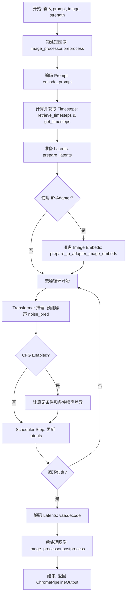
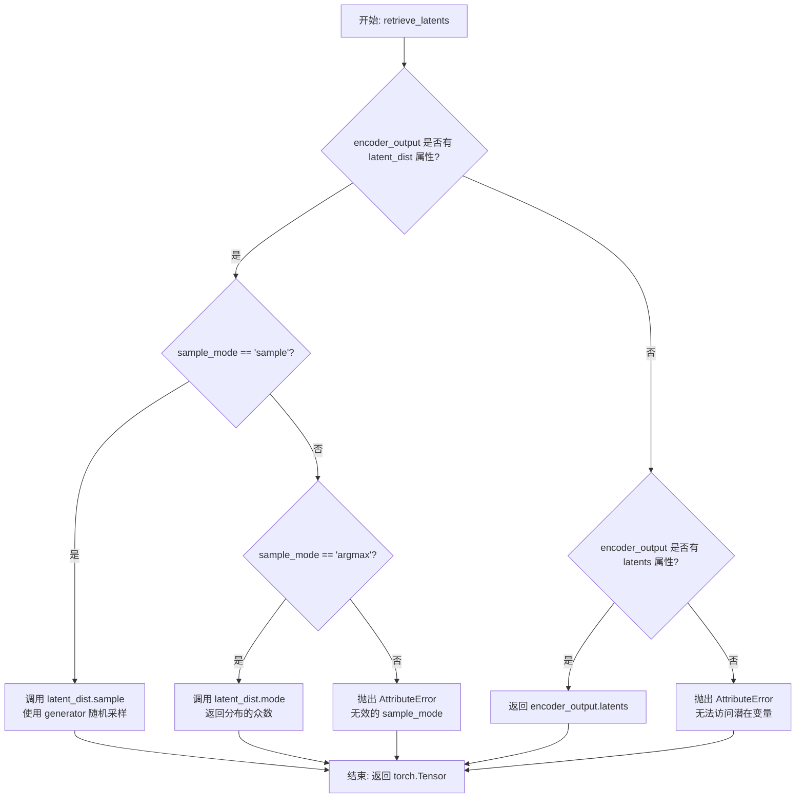
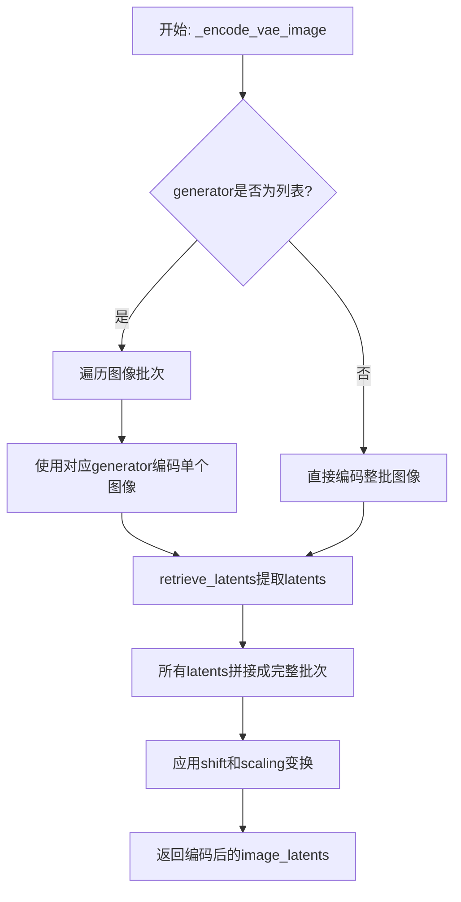
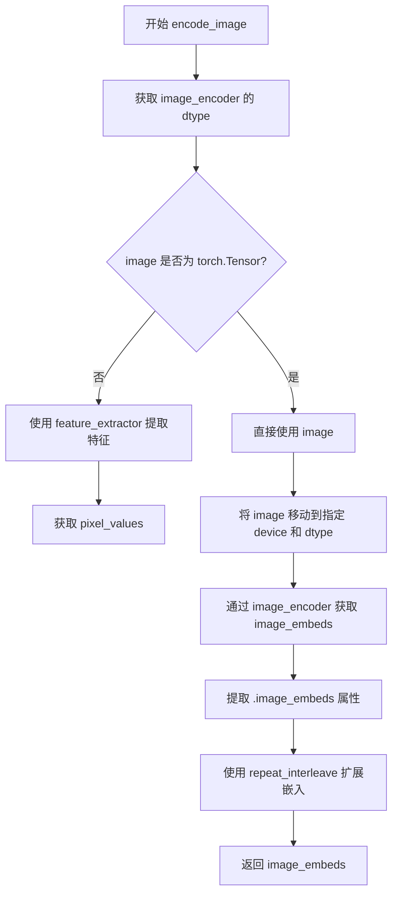
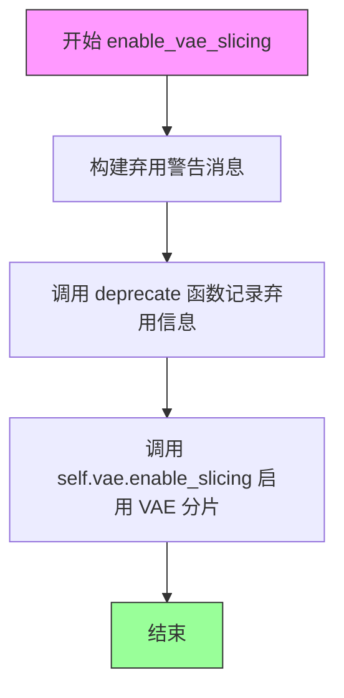
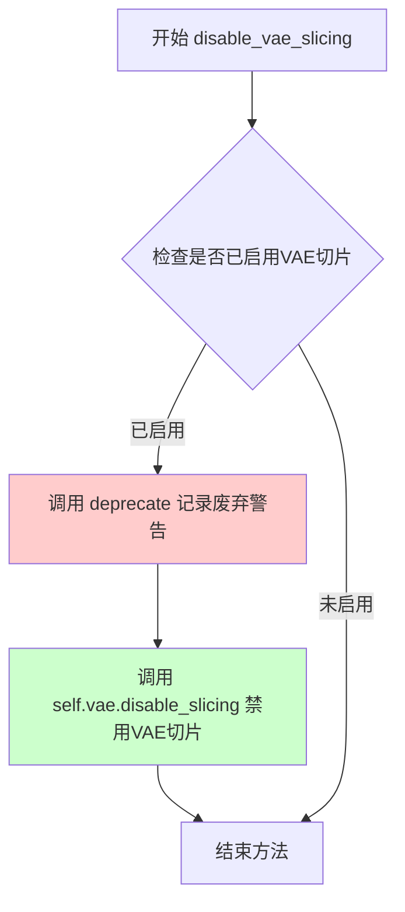
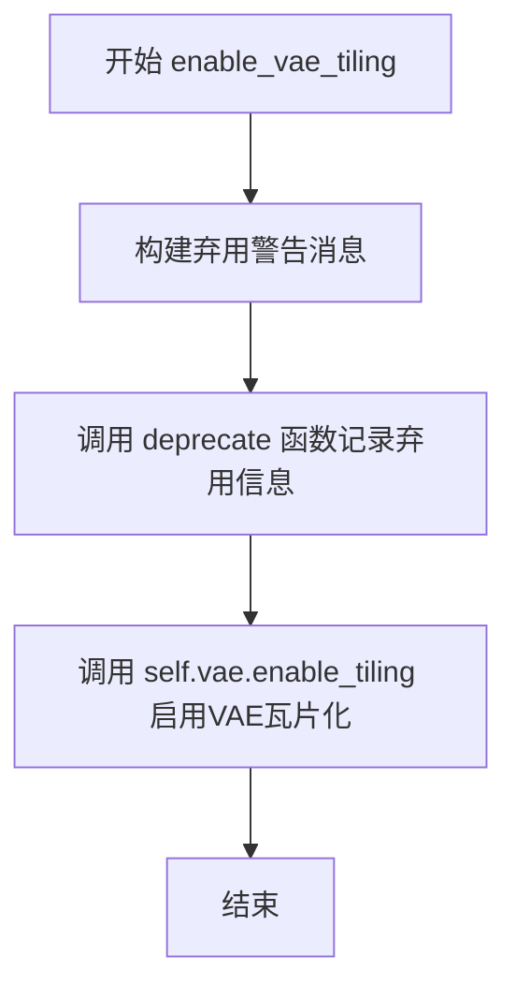
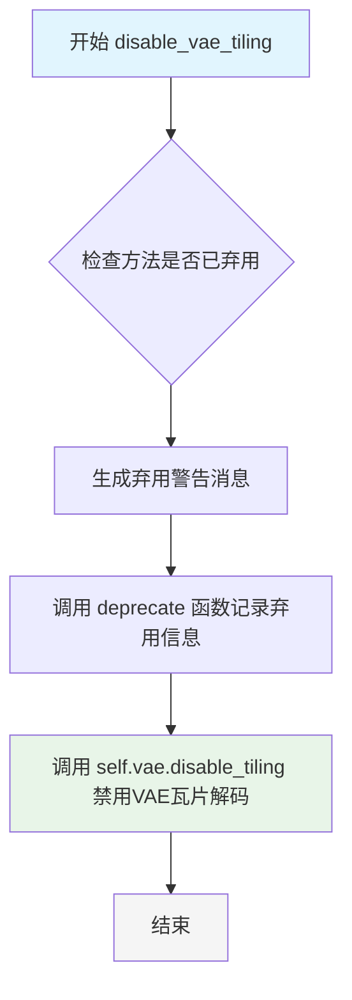
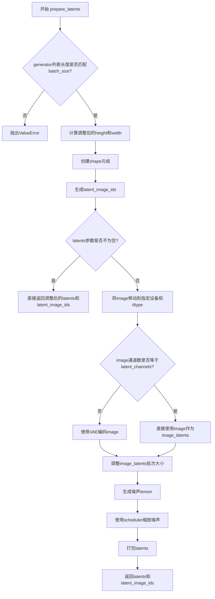

# `diffusers\src\diffusers\pipelines\chroma\pipeline_chroma_img2img.py` 详细设计文档

ChromaImg2ImgPipeline 是一个基于 ChromaTransformer2DModel 的图像到图像（Image-to-Image）生成管道。它集成了 T5 文本编码器、VAE 模型和 FlowMatchEulerDiscreteScheduler，通过扩散模型的去噪过程，根据文本提示（prompt）对输入图像进行风格迁移或内容变换，支持 IP-Adapter 等高级特性。

## 整体流程



## 类结构

```
DiffusionPipeline (基类)
├── ChromaImg2ImgPipeline (主类)
│   ├── FluxLoraLoaderMixin
│   ├── FromSingleFileMixin
│   ├── TextualInversionLoaderMixin
│   └── FluxIPAdapterMixin
```

## 全局变量及字段


### `logger`
    
Module-level logger for logging messages and warnings

类型：`logging.Logger`
    


### `EXAMPLE_DOC_STRING`
    
Documentation string containing example usage of the pipeline

类型：`str`
    


### `XLA_AVAILABLE`
    
Flag indicating whether PyTorch XLA is available for accelerated computation

类型：`bool`
    


### `ChromaImg2ImgPipeline.scheduler`
    
Scheduler for controlling the denoising process in image generation

类型：`FlowMatchEulerDiscreteScheduler`
    


### `ChromaImg2ImgPipeline.vae`
    
Variational Autoencoder for encoding images to latents and decoding latents to images

类型：`AutoencoderKL`
    


### `ChromaImg2ImgPipeline.text_encoder`
    
T5 encoder model for generating text embeddings from prompts

类型：`T5EncoderModel`
    


### `ChromaImg2ImgPipeline.tokenizer`
    
Fast tokenizer for converting text prompts to token IDs

类型：`T5TokenizerFast`
    


### `ChromaImg2ImgPipeline.transformer`
    
Main transformer model for denoising latents during image generation

类型：`ChromaTransformer2DModel`
    


### `ChromaImg2ImgPipeline.image_encoder`
    
Optional CLIP vision encoder for IP-Adapter image embeddings

类型：`CLIPVisionModelWithProjection`
    


### `ChromaImg2ImgPipeline.feature_extractor`
    
Optional CLIP image processor for preprocessing images

类型：`CLIPImageProcessor`
    


### `ChromaImg2ImgPipeline.vae_scale_factor`
    
Scale factor for VAE latent space compression

类型：`int`
    


### `ChromaImg2ImgPipeline.latent_channels`
    
Number of channels in the VAE latent representation

类型：`int`
    


### `ChromaImg2ImgPipeline.image_processor`
    
Image processor for preprocessing and postprocessing images

类型：`VaeImageProcessor`
    


### `ChromaImg2ImgPipeline.default_sample_size`
    
Default sample size for generated images

类型：`int`
    


### `ChromaImg2ImgPipeline._guidance_scale`
    
Classifier-free guidance scale for controlling prompt adherence

类型：`float`
    


### `ChromaImg2ImgPipeline._joint_attention_kwargs`
    
Dictionary of joint attention parameters for the transformer

类型：`dict`
    


### `ChromaImg2ImgPipeline._num_timesteps`
    
Total number of timesteps in the denoising process

类型：`int`
    


### `ChromaImg2ImgPipeline._current_timestep`
    
Current timestep during the denoising loop

类型：`int`
    


### `ChromaImg2ImgPipeline._interrupt`
    
Flag to interrupt the denoising process

类型：`bool`
    
    

## 全局函数及方法


### `calculate_shift`

该函数用于计算图像序列长度对应的缩放因子（shift），通过线性插值在基础序列长度和最大序列长度之间进行平滑过渡。这是 Flux/Pix2Struct 风格模型中用于调整 VAE 编码器偏移量的关键技术参数。

参数：

- `image_seq_len`：`int`，图像序列长度，通常由 latent 空间的宽高计算得出
- `base_seq_len`：`int`，默认值 256，基础序列长度
- `max_seq_len`：`int`，默认值 4096，最大序列长度
- `base_shift`：`float`，默认值 0.5，基础偏移量
- `max_shift`：`float`，默认值 1.15，最大偏移量

返回值：`float`，计算得到的缩放因子 mu

#### 流程图

```mermaid
flowchart TD
    A[开始] --> B[计算斜率 m<br/>m = (max_shift - base_shift) / (max_seq_len - base_seq_len)]
    B --> C[计算截距 b<br/>b = base_shift - m * base_seq_len]
    C --> D[计算缩放因子 mu<br/>mu = image_seq_len * m + b]
    D --> E[返回 mu]
```

#### 带注释源码

```python
# Copied from diffusers.pipelines.flux.pipeline_flux.calculate_shift
def calculate_shift(
    image_seq_len,           # 图像序列长度，由 latent 宽高计算
    base_seq_len: int = 256, # 基础序列长度，默认 256
    max_seq_len: int = 4096, # 最大序列长度，默认 4096
    base_shift: float = 0.5, # 基础偏移量，默认 0.5
    max_shift: float = 1.15, # 最大偏移量，默认 1.15
):
    # 计算线性插值的斜率 (slope)
    # 表示每单位序列长度对应的偏移量变化
    m = (max_shift - base_shift) / (max_seq_len - base_seq_len)
    
    # 计算线性截距 (intercept)
    # 确保在 base_seq_len 时偏移量为 base_shift
    b = base_shift - m * base_seq_len
    
    # 根据图像序列长度计算最终的缩放因子
    # 使用线性方程: y = mx + b
    mu = image_seq_len * m + b
    
    # 返回计算得到的缩放因子，用于调整 VAE 的 shift_factor
    return mu
```


### `retrieve_latents`

该函数是一个全局工具函数，用于从变分自编码器（VAE）的编码器输出中检索潜在变量。它支持多种采样模式（随机采样或确定性取模），并能兼容不同的编码器输出格式。这是 DiffusionPipeline 中图像编码流程的核心辅助函数。

参数：

- `encoder_output`：`torch.Tensor`，编码器输出对象，通常包含 `latent_dist` 或 `latents` 属性
- `generator`：`torch.Generator | None`，可选的随机数生成器，用于控制采样随机性
- `sample_mode`：`str`，采样模式，默认为 `"sample"`（随机采样），可选 `"argmax"`（确定性取模）

返回值：`torch.Tensor`，检索到的潜在变量张量

#### 流程图



#### 带注释源码

```python
# Copied from diffusers.pipelines.stable_diffusion.pipeline_stable_diffusion_img2img.retrieve_latents
def retrieve_latents(
    encoder_output: torch.Tensor, generator: torch.Generator | None = None, sample_mode: str = "sample"
):
    """
    从编码器输出中检索潜在变量。
    
    该函数支持三种获取潜在变量的方式：
    1. 从 latent_dist 中随机采样（sample_mode="sample"）
    2. 从 latent_dist 中获取众数（sample_mode="argmax"）
    3. 直接访问预存的 latents 属性
    
    Args:
        encoder_output: 编码器输出对象，通常是 VAE encode 的返回值
        generator: 可选的 PyTorch 随机数生成器，用于控制采样随机性
        sample_mode: 采样模式，"sample" 为随机采样，"argmax" 为确定性取模
    
    Returns:
        检索到的潜在变量张量
    
    Raises:
        AttributeError: 当 encoder_output 既没有 latent_dist 也没有 latents 属性时
    """
    # 方式1: 检查是否有 latent_dist 属性且模式为 sample（随机采样）
    if hasattr(encoder_output, "latent_dist") and sample_mode == "sample":
        # 从潜在分布中随机采样，支持通过 generator 控制随机性
        return encoder_output.latent_dist.sample(generator)
    # 方式2: 检查是否有 latent_dist 属性且模式为 argmax（确定性取模）
    elif hasattr(encoder_output, "latent_dist") and sample_mode == "argmax":
        # 返回潜在分布的众数（最可能的值），用于确定性生成
        return encoder_output.latent_dist.mode()
    # 方式3: 检查是否有预存的 latents 属性（直接访问）
    elif hasattr(encoder_output, "latents"):
        return encoder_output.latents
    # 错误处理: 无法识别编码器输出的格式
    else:
        raise AttributeError("Could not access latents of provided encoder_output")
```


### `retrieve_timesteps`

该函数是 diffusion pipeline 中的核心工具函数，负责为调度器（scheduler）设置推理所需的 timesteps（时间步）。它通过调用调度器的 `set_timesteps` 方法来生成或应用自定义的时间步序列，并返回最终的时间步张量及推理步数。该函数支持三种模式：自定义 timesteps、自定义 sigmas，或使用默认的推理步数。

参数：

- `scheduler`：`SchedulerMixin`，调度器对象，用于生成或管理时间步。
- `num_inference_steps`：`int | None`，推理步数，用于生成样本。如果使用此参数，`timesteps` 必须为 `None`。
- `device`：`str | torch.device | None`，时间步要移动到的设备。如果为 `None`，时间步不会移动。
- `timesteps`：`list[int] | None`，自定义时间步，用于覆盖调度器的默认时间步间隔策略。如果传入此参数，`num_inference_steps` 和 `sigmas` 必须为 `None`。
- `sigmas`：`list[float] | None`，自定义 sigmas，用于覆盖调度器的默认时间步间隔策略。如果传入此参数，`num_inference_steps` 和 `timesteps` 必须为 `None`。
- `**kwargs`：任意关键字参数，将传递给调度器的 `set_timesteps` 方法。

返回值：`tuple[torch.Tensor, int]`，元组包含两个元素——第一个是调度器的时间步序列（torch.Tensor），第二个是推理步数（int）。

#### 流程图

```mermaid
flowchart TD
    A[开始] --> B{同时传入 timesteps 和 sigmas?}
    B -- 是 --> C[抛出 ValueError: 只能选择一种自定义方式]
    B -- 否 --> D{传入 timesteps?}
    D -- 是 --> E[检查 scheduler.set_timesteps 是否接受 timesteps 参数]
    E -- 不接受 --> F[抛出 ValueError: 当前调度器不支持自定义 timesteps]
    E -- 接受 --> G[调用 scheduler.set_timesteps<br/>参数: timesteps=timesteps, device=device]
    G --> H[获取 scheduler.timesteps]
    H --> I[计算 num_inference_steps = len(timesteps)]
    D -- 否 --> J{传入 sigmas?}
    J -- 是 --> K[检查 scheduler.set_timesteps 是否接受 sigmas 参数]
    K -- 不接受 --> L[抛出 ValueError: 当前调度器不支持自定义 sigmas]
    K -- 接受 --> M[调用 scheduler.set_timesteps<br/>参数: sigmas=sigmas, device=device]
    M --> N[获取 scheduler.timesteps]
    N --> O[计算 num_inference_steps = len(timesteps)]
    J -- 否 --> P[调用 scheduler.set_timesteps<br/>参数: num_inference_steps, device=device]
    P --> Q[获取 scheduler.timesteps]
    Q --> R[使用调度器默认的 num_inference_steps]
    I --> S[返回 timesteps, num_inference_steps]
    O --> S
    R --> S
    S --> T[结束]
```

#### 带注释源码

```python
def retrieve_timesteps(
    scheduler,
    num_inference_steps: int | None = None,
    device: str | torch.device | None = None,
    timesteps: list[int] | None = None,
    sigmas: list[float] | None = None,
    **kwargs,
):
    r"""
    Calls the scheduler's `set_timesteps` method and retrieves timesteps from the scheduler after the call. Handles
    custom timesteps. Any kwargs will be supplied to `scheduler.set_timesteps`.

    Args:
        scheduler (`SchedulerMixin`):
            The scheduler to get timesteps from.
        num_inference_steps (`int`):
            The number of diffusion steps used when generating samples with a pre-trained model. If used, `timesteps`
            must be `None`.
        device (`str` or `torch.device`, *optional*):
            The device to which the timesteps should be moved to. If `None`, the timesteps are not moved.
        timesteps (`list[int]`, *optional*):
            Custom timesteps used to override the timestep spacing strategy of the scheduler. If `timesteps` is passed,
            `num_inference_steps` and `sigmas` must be `None`.
        sigmas (`list[float]`, *optional*):
            Custom sigmas used to override the timestep spacing strategy of the scheduler. If `sigmas` is passed,
            `num_inference_steps` and `timesteps` must be `None`.

    Returns:
        `tuple[torch.Tensor, int]`: A tuple where the first element is the timestep schedule from the scheduler and the
        second element is the number of inference steps.
    """
    # 校验参数互斥性：timesteps 和 sigmas 不能同时传入
    if timesteps is not None and sigmas is not None:
        raise ValueError("Only one of `timesteps` or `sigmas` can be passed. Please choose one to set custom values")
    
    # 分支处理：根据传入的参数类型选择不同的调度器配置方式
    if timesteps is not None:
        # 方式一：使用自定义 timesteps
        # 通过 inspect 模块检查调度器的 set_timesteps 方法是否支持 timesteps 参数
        accepts_timesteps = "timesteps" in set(inspect.signature(scheduler.set_timesteps).parameters.keys())
        if not accepts_timesteps:
            raise ValueError(
                f"The current scheduler class {scheduler.__class__}'s `set_timesteps` does not support custom"
                f" timestep schedules. Please check whether you are using the correct scheduler."
            )
        # 调用调度器的 set_timesteps 方法设置自定义时间步
        scheduler.set_timesteps(timesteps=timesteps, device=device, **kwargs)
        # 从调度器获取生成的时间步序列
        timesteps = scheduler.timesteps
        # 计算推理步数（即时间步的数量）
        num_inference_steps = len(timesteps)
    elif sigmas is not None:
        # 方式二：使用自定义 sigmas
        # 同样检查调度器是否支持 sigmas 参数
        accept_sigmas = "sigmas" in set(inspect.signature(scheduler.set_timesteps).parameters.keys())
        if not accept_sigmas:
            raise ValueError(
                f"The current scheduler class {scheduler.__class__}'s `set_timesteps` does not support custom"
                f" sigmas schedules. Please check whether you are using the correct scheduler."
            )
        # 调用调度器的 set_timesteps 方法设置自定义 sigmas
        scheduler.set_timesteps(sigmas=sigmas, device=device, **kwargs)
        # 获取时间步并计算推理步数
        timesteps = scheduler.timesteps
        num_inference_steps = len(timesteps)
    else:
        # 方式三：使用默认方式，由 num_inference_steps 决定推理步数
        scheduler.set_timesteps(num_inference_steps, device=device, **kwargs)
        timesteps = scheduler.timesteps
    
    # 返回时间步序列和推理步数组成的元组
    return timesteps, num_inference_steps
```


### `ChromaImg2ImgPipeline.__init__`

该方法是 ChromaImg2ImgPipeline 类的构造函数，负责初始化图像到图像（Image-to-Image）生成管道。它接收并注册调度器、VAE模型、文本编码器、分词器、Transformer模型以及可选的图像编码器和特征提取器，并配置图像处理器和潜在变量相关的参数。

参数：

- `scheduler`：`FlowMatchEulerDiscreteScheduler`，用于在去噪过程中调度时间步的调度器
- `vae`：`AutoencoderKL`，变分自编码器模型，用于将图像编码和解码为潜在表示
- `text_encoder`：`T5EncoderModel`，T5文本编码器模型，用于将文本提示编码为嵌入向量
- `tokenizer`：`T5TokenizerFast`，T5分词器，用于将文本分词为token序列
- `transformer`：`ChromaTransformer2DModel`，条件Transformer（MMDiT）架构，用于对编码的图像潜在表示进行去噪
- `image_encoder`：`CLIPVisionModelWithProjection`（可选），CLIP图像编码器，用于IP-Adapter功能
- `feature_extractor`：`CLIPImageProcessor`（可选），CLIP图像处理器，用于预处理图像输入

返回值：无（`None`），构造函数不返回任何值

#### 流程图

```mermaid
flowchart TD
    A[开始 __init__] --> B[调用 super().__init__ 初始化基类]
    B --> C[register_modules 注册所有模块]
    C --> D{检查 vae 是否存在}
    D -->|是| E[计算 vae_scale_factor = 2^(len(vae.config.block_out_channels) - 1)]
    D -->|否| F[设置 vae_scale_factor = 8]
    E --> G[获取 latent_channels]
    F --> G
    G --> H[创建 VaeImageProcessor<br/>vae_scale_factor = self.vae_scale_factor * 2]
    H --> I[设置 default_sample_size = 128]
    I --> J[结束 __init__]
```

#### 带注释源码

```python
def __init__(
    self,
    scheduler: FlowMatchEulerDiscreteScheduler,
    vae: AutoencoderKL,
    text_encoder: T5EncoderModel,
    tokenizer: T5TokenizerFast,
    transformer: ChromaTransformer2DModel,
    image_encoder: CLIPVisionModelWithProjection = None,
    feature_extractor: CLIPImageProcessor = None,
):
    """
    初始化 ChromaImg2ImgPipeline 管道
    
    参数:
        scheduler: FlowMatchEulerDiscreteScheduler 调度器
        vae: AutoencoderKL 变分自编码器
        text_encoder: T5EncoderModel T5文本编码器
        tokenizer: T5TokenizerFast T5分词器
        transformer: ChromaTransformer2DModel 条件Transformer
        image_encoder: CLIPVisionModelWithProjection 可选的CLIP图像编码器
        feature_extractor: CLIPImageProcessor 可选的CLIP特征提取器
    """
    # 调用父类 DiffusionPipeline 的初始化方法
    # 设置基本的管道配置和执行设备
    super().__init__()

    # 注册所有模块到管道中，使管道能够管理这些组件的生命周期
    # 这些模块可以通过 self.vae, self.text_encoder 等方式访问
    self.register_modules(
        vae=vae,
        text_encoder=text_encoder,
        tokenizer=tokenizer,
        transformer=transformer,
        scheduler=scheduler,
        image_encoder=image_encoder,
        feature_extractor=feature_extractor,
    )
    
    # 计算 VAE 缩放因子，基于 VAE 的块输出通道数
    # 如果 VAE 存在，使用其配置计算；否则使用默认值 8
    # 公式: 2^(len(block_out_channels) - 1)，典型值为 2^3 = 8
    self.vae_scale_factor = 2 ** (len(self.vae.config.block_out_channels) - 1) if getattr(self, "vae", None) else 8
    
    # 获取 VAE 的潜在通道数，用于后续潜在变量的处理
    # 如果 VAE 不存在，使用默认值 16
    self.latent_channels = self.vae.config.latent_channels if getattr(self, "vae", None) else 16

    # Flux 潜在变量会被转换为 2x2 的块并打包
    # 这意味着潜在宽度和高度必须能被块大小整除
    # 因此 VAE 缩放因子乘以 2 以考虑这种打包方式
    # 创建图像处理器，用于预处理和后处理图像
    self.image_processor = VaeImageProcessor(vae_scale_factor=self.vae_scale_factor * 2)
    
    # 设置默认采样大小，用于生成图像的基准尺寸
    self.default_sample_size = 128
```


### `ChromaImg2ImgPipeline._get_t5_prompt_embeds`

该方法负责将文本提示（prompt）编码为 T5 文本嵌入向量（prompt embeddings）和对应的注意力掩码（attention mask），支持批量处理和多图生成，同时处理文本反转（TextualInversion）并确保嵌入向量类型和设备的一致性。

参数：

- `self`：`ChromaImg2ImgPipeline` 实例，管道对象本身
- `prompt`：`str | list[str]`，待编码的文本提示，可以是单个字符串或字符串列表
- `num_images_per_prompt`：`int = 1`，每个提示生成的图像数量，用于复制 embeddings 以匹配批量大小
- `max_sequence_length`：`int = 512`，文本序列的最大长度，超过该长度将被截断
- `device`：`torch.device | None = None`，计算设备，若为 None 则使用执行设备
- `dtype`：`torch.dtype | None = None`，输出张量的数据类型，若为 None 则使用 text_encoder 的数据类型

返回值：`tuple[torch.Tensor, torch.Tensor]`，返回两个张量组成的元组：
- `prompt_embeds`：`torch.Tensor`，形状为 `(batch_size * num_images_per_prompt, seq_len, hidden_dim)` 的文本嵌入向量
- `attention_mask`：`torch.Tensor`，形状为 `(batch_size * num_images_per_prompt, seq_len)` 的注意力掩码，用于标识有效 tokens

#### 流程图

```mermaid
flowchart TD
    A[开始 _get_t5_prompt_embeds] --> B{device 为空?}
    B -- 是 --> C[device = self._execution_device]
    B -- 否 --> D{device 不为空}
    D --> E{dtype 为空?}
    E -- 是 --> F[dtype = self.text_encoder.dtype]
    E -- 否 --> G[device 和 dtype 已确定]
    C --> G
    
    G --> H[prompt 类型转换: str → list[str]]
    H --> I[batch_size = len(prompt)]
    
    J{检查 TextualInversionLoaderMixin}
    J -- 是 --> K[maybe_convert_prompt 处理提示]
    J -- 否 --> L[跳过 TextualInversion 处理]
    K --> M[调用 tokenizer 编码文本]
    
    M --> N[提取 input_ids 和 attention_mask]
    N --> O[将 attention_mask 移到指定 device]
    
    P[调用 text_encoder 获取 embeddings] --> Q[转换为指定 dtype 和 device]
    
    R[计算 seq_lengths] --> S[构建 mask_indices]
    S --> T[生成 attention_mask 掩码]
    
    U[复制 embeddings 适配 num_images_per_prompt] --> V[重塑为批量维度]
    V --> W[复制 attention_mask 适配 num_images_per_prompt]
    W --> X[重塑 attention_mask 维度]
    X --> Y[返回 prompt_embeds 和 attention_mask]
```

#### 带注释源码

```python
def _get_t5_prompt_embeds(
    self,
    prompt: str | list[str] = None,
    num_images_per_prompt: int = 1,
    max_sequence_length: int = 512,
    device: torch.device | None = None,
    dtype: torch.dtype | None = None,
):
    """
    将文本提示编码为 T5 文本嵌入向量和注意力掩码。
    
    参数:
        prompt: 待编码的文本提示，字符串或字符串列表
        num_images_per_prompt: 每个提示生成的图像数量
        max_sequence_length: 文本序列最大长度
        device: 计算设备
        dtype: 输出数据类型
    
    返回:
        包含 prompt_embeds 和 attention_mask 的元组
    """
    # 确定设备：优先使用传入的 device，否则使用管道的执行设备
    device = device or self._execution_device
    # 确定数据类型：优先使用传入的 dtype，否则使用 text_encoder 的数据类型
    dtype = dtype or self.text_encoder.dtype

    # 标准化 prompt 为列表形式，便于批量处理
    prompt = [prompt] if isinstance(prompt, str) else prompt
    # 计算批次大小
    batch_size = len(prompt)

    # 如果管道支持 TextualInversion，转换 prompt 以处理文本反转嵌入
    if isinstance(self, TextualInversionLoaderMixin):
        prompt = self.maybe_convert_prompt(prompt, self.tokenizer)

    # 使用 T5 Tokenizer 将文本编码为 token IDs 和注意力掩码
    # padding="max_length"：填充到最大长度
    # truncation=True：超过最大长度进行截断
    # return_tensors="pt"：返回 PyTorch 张量
    text_inputs = self.tokenizer(
        prompt,
        padding="max_length",
        max_length=max_sequence_length,
        truncation=True,
        return_length=False,
        return_overflowing_tokens=False,
        return_tensors="pt",
    )
    # 提取 token IDs 和注意力掩码
    text_input_ids = text_inputs.input_ids
    tokenizer_mask = text_inputs.attention_mask

    # 将注意力掩码移动到目标设备
    tokenizer_mask_device = tokenizer_mask.to(device)

    # 调用 T5 Encoder 生成文本嵌入向量
    # [0] 表示获取隐藏状态输出（而非整体输出元组）
    prompt_embeds = self.text_encoder(
        text_input_ids.to(device),
        output_hidden_states=False,
        attention_mask=tokenizer_mask_device,
    )[0]

    # 将嵌入向量转换到指定的设备和数据类型
    prompt_embeds = prompt_embeds.to(dtype=dtype, device=device)

    # 计算每个序列的实际长度（非填充 tokens 数量）
    seq_lengths = tokenizer_mask_device.sum(dim=1)
    # 创建序列位置索引，用于生成注意力掩码
    mask_indices = torch.arange(tokenizer_mask_device.size(1), device=device).unsqueeze(0).expand(batch_size, -1)
    # 生成注意力掩码：有效位置为 True，填充位置为 False
    attention_mask = (mask_indices <= seq_lengths.unsqueeze(1)).to(dtype=dtype, device=device)

    # 获取序列长度
    _, seq_len, _ = prompt_embeds.shape

    # 复制文本 embeddings 和注意力掩码，以适配 num_images_per_prompt
    # 使用 repeat 方法以兼容 MPS (Apple Silicon) 设备
    prompt_embeds = prompt_embeds.repeat(1, num_images_per_prompt, 1)
    # 重塑为 (batch_size * num_images_per_prompt, seq_len, hidden_dim)
    prompt_embeds = prompt_embeds.view(batch_size * num_images_per_prompt, seq_len, -1)

    # 复制并重塑注意力掩码
    attention_mask = attention_mask.repeat(1, num_images_per_prompt)
    attention_mask = attention_mask.view(batch_size * num_images_per_prompt, seq_len)

    # 返回编码后的 embeddings 和注意力掩码
    return prompt_embeds, attention_mask
```


### `ChromaImg2ImgPipeline._encode_vae_image`

该方法负责将输入图像编码为VAE latent表示。它通过VAE编码器处理图像，并应用shift_factor和scaling_factor进行latent空间的标准化。该方法支持单Generator或Generator列表两种模式，以处理批量图像的随机性。

参数：

- `self`：`ChromaImg2ImgPipeline`，Pipeline实例本身
- `image`：`torch.Tensor`，待编码的输入图像张量，形状为(batch_size, channels, height, width)
- `generator`：`torch.Generator`，用于生成随机噪声的PyTorch生成器，支持单个Generator或Generator列表

返回值：`torch.Tensor`，编码后的图像latent表示，已应用shift和scaling变换

#### 流程图



#### 带注释源码

```python
# Copied from diffusers.pipelines.stable_diffusion_3.pipeline_stable_diffusion_3_inpaint.StableDiffusion3InpaintPipeline._encode_vae_image
def _encode_vae_image(self, image: torch.Tensor, generator: torch.Generator):
    """
    将输入图像编码为VAE latent表示
    
    参数:
        image: 输入图像张量，形状为 (batch_size, C, H, W)
        generator: 随机生成器，用于采样 latent 分布
    
    返回:
        编码后的 latent 张量
    """
    # 检查generator是否为列表（多Generator模式）
    if isinstance(generator, list):
        # 逐个处理图像，为每个图像使用对应的generator
        image_latents = [
            # 编码单张图像并使用对应generator采样latent
            retrieve_latents(self.vae.encode(image[i : i + 1]), generator=generator[i])
            for i in range(image.shape[0])
        ]
        # 将所有latent在batch维度拼接
        image_latents = torch.cat(image_latents, dim=0)
    else:
        # 单Generator模式，直接编码整批图像
        image_latents = retrieve_latents(self.vae.encode(image), generator=generator)

    # 应用shift和scaling因子进行latent空间标准化
    # 这是VAE解码时需要的逆变换
    image_latents = (image_latents - self.vae.config.shift_factor) * self.vae.config.scaling_factor

    return image_latents
```


### `ChromaImg2ImgPipeline.encode_prompt`

该方法负责将文本提示词（prompt）和负面提示词（negative_prompt）编码为扩散模型所需的文本嵌入（embeddings）和注意力掩码（attention masks），同时支持分类器自由引导（Classifier-Free Guidance）和 LoRA 权重调整。

参数：

- `prompt`：`str | list[str]`，需要编码的文本提示词
- `negative_prompt`：`str | list[str] | None`，不希望出现的负面提示词，用于引导生成方向
- `device`：`torch.device | None`，指定计算设备
- `num_images_per_prompt`：`int = 1`，每个提示词生成的图像数量
- `prompt_embeds`：`torch.Tensor | None`，预生成的提示词嵌入，若提供则直接使用
- `negative_prompt_embeds`：`torch.Tensor | None`，预生成的负面提示词嵌入
- `prompt_attention_mask`：`torch.Tensor | None`，提示词的注意力掩码
- `negative_prompt_attention_mask`：`torch.Tensor | None`，负面提示词的注意力掩码
- `do_classifier_free_guidance`：`bool = True`，是否启用分类器自由引导
- `max_sequence_length`：`int = 512`，文本序列的最大长度
- `lora_scale`：`float | None`，LoRA 权重缩放因子

返回值：`tuple[torch.Tensor, torch.Tensor, torch.Tensor, torch.Tensor, torch.Tensor, torch.Tensor]`，包含以下六个元素：
1. `prompt_embeds`：编码后的提示词嵌入
2. `text_ids`：文本位置编码张量
3. `prompt_attention_mask`：提示词的注意力掩码
4. `negative_prompt_embeds`：编码后的负面提示词嵌入
5. `negative_text_ids`：负面文本位置编码张量
6. `negative_prompt_attention_mask`：负面提示词的注意力掩码

#### 流程图

```mermaid
flowchart TD
    A[开始 encode_prompt] --> B{检查 lora_scale}
    B -->|提供 lora_scale| C[设置 self._lora_scale 并调整 LoRA 层权重]
    B -->|未提供| D[继续处理]
    C --> D
    D --> E{处理 prompt}
    E -->|字符串| F[转换为单元素列表]
    E -->|列表| G[保持不变]
    F --> H
    G --> H
    H{确定 batch_size}
    H -->|prompt 不为 None| I[使用 len]
    H -->|prompt 为 None| J[使用 prompt_embeds.shape[0]]
    I --> K
    J --> K
    K{prompt_embeds 是否存在?}
    K -->|不存在| L[调用 _get_t5_prompt_embeds 生成]
    K -->|存在| M[直接使用已有嵌入]
    L --> N
    M --> N
    N[创建 text_ids 张量]
    N --> O{do_classifier_free_guidance?}
    O -->|是| P{negative_prompt_embeds 是否存在?}
    O -->|否| Q[设置 negative_text_ids 为 None]
    P -->|不存在| R[处理 negative_prompt]
    P -->|存在| S[直接使用已有嵌入]
    R --> T{类型检查}
    T -->|类型不匹配| U[抛出 TypeError]
    T -->|批次大小不匹配| V[抛出 ValueError]
    T -->|检查通过| W[调用 _get_t5_prompt_embeds 生成]
    S --> X
    W --> X
    X[创建 negative_text_ids]
    X --> Y
    Q --> Y
    O --> Y
    Y{text_encoder 存在且使用 LoRA?}
    Y -->|是| Z[恢复 LoRA 层原始权重]
    Y -->|否| AA[跳过]
    Z --> AB
    AA --> AB
    AB[返回 tuple 包含 6 个元素]
```

#### 带注释源码

```python
def encode_prompt(
    self,
    prompt: str | list[str],
    negative_prompt: str | list[str] = None,
    device: torch.device | None = None,
    num_images_per_prompt: int = 1,
    prompt_embeds: torch.Tensor | None = None,
    negative_prompt_embeds: torch.Tensor | None = None,
    prompt_attention_mask: torch.Tensor | None = None,
    negative_prompt_attention_mask: torch.Tensor | None = None,
    do_classifier_free_guidance: bool = True,
    max_sequence_length: int = 512,
    lora_scale: float | None = None,
):
    """
    编码提示词和负面提示词为文本嵌入向量
    
    Args:
        prompt: 需要编码的文本提示词，字符串或字符串列表
        negative_prompt: 负面提示词，用于排除不希望的内容
        device: 指定计算设备
        num_images_per_prompt: 每个提示词生成的图像数量
        prompt_embeds: 预计算的提示词嵌入，如提供则直接使用
        negative_prompt_embeds: 预计算的负面提示词嵌入
        prompt_attention_mask: 提示词的注意力掩码
        negative_prompt_attention_mask: 负面提示词的注意力掩码
        do_classifier_free_guidance: 是否启用分类器自由引导
        max_sequence_length: T5 编码器的最大序列长度
        lora_scale: LoRA 权重缩放因子
    """
    # 确定计算设备，未指定时使用执行设备
    device = device or self._execution_device

    # 设置 LoRA 缩放因子，以便文本编码器的 monkey patched LoRA 函数正确访问
    if lora_scale is not None and isinstance(self, FluxLoraLoaderMixin):
        self._lora_scale = lora_scale

        # 动态调整 LoRA 权重
        if self.text_encoder is not None and USE_PEFT_BACKEND:
            scale_lora_layers(self.text_encoder, lora_scale)

    # 统一将字符串 prompt 转换为列表，便于批处理
    prompt = [prompt] if isinstance(prompt, str) else prompt

    # 确定批次大小
    if prompt is not None:
        batch_size = len(prompt)
    else:
        batch_size = prompt_embeds.shape[0]

    # 如果未提供 prompt_embeds，则调用 T5 编码器生成
    if prompt_embeds is None:
        prompt_embeds, prompt_attention_mask = self._get_t5_prompt_embeds(
            prompt=prompt,
            num_images_per_prompt=num_images_per_prompt,
            max_sequence_length=max_sequence_length,
            device=device,
        )

    # 确定数据类型，优先使用 text_encoder 的 dtype，否则使用 transformer 的 dtype
    dtype = self.text_encoder.dtype if self.text_encoder is not None else self.transformer.dtype
    
    # 创建文本位置编码张量，用于 Transformer 的位置嵌入
    # shape: (seq_len, 3)，3 代表 x, y, 时间/模态标识
    text_ids = torch.zeros(prompt_embeds.shape[1], 3).to(device=device, dtype=dtype)
    negative_text_ids = None

    # 处理分类器自由引导（CFG）：需要同时编码无条件/负面提示
    if do_classifier_free_guidance:
        if negative_prompt_embeds is None:
            # 默认使用空字符串作为负面提示
            negative_prompt = negative_prompt or ""
            # 扩展为批次大小匹配的列表
            negative_prompt = (
                batch_size * [negative_prompt] if isinstance(negative_prompt, str) else negative_prompt
            )

            # 类型检查：确保 prompt 和 negative_prompt 类型一致
            if prompt is not None and type(prompt) is not type(negative_prompt):
                raise TypeError(
                    f"`negative_prompt` should be the same type to `prompt`, but got {type(negative_prompt)} !="
                    f" {type(prompt)}."
                )
            # 批次大小检查
            elif batch_size != len(negative_prompt):
                raise ValueError(
                    f"`negative_prompt`: {negative_prompt} has batch size {len(negative_prompt)}, but `prompt`:"
                    f" {prompt} has batch size {batch_size}. Please make sure that passed `negative_prompt` matches"
                    " the batch size of `prompt`."
                )

            # 生成负面提示的嵌入向量
            negative_prompt_embeds, negative_prompt_attention_mask = self._get_t5_prompt_embeds(
                prompt=negative_prompt,
                num_images_per_prompt=num_images_per_prompt,
                max_sequence_length=max_sequence_length,
                device=device,
            )

        # 为负面提示创建位置编码
        negative_text_ids = torch.zeros(negative_prompt_embeds.shape[1], 3).to(device=device, dtype=dtype)

    # 恢复 LoRA 层的原始权重缩放（用于推理）
    if self.text_encoder is not None:
        if isinstance(self, FluxLoraLoaderMixin) and USE_PEFT_BACKEND:
            # 通过反向缩放 LoRA 层恢复原始权重
            unscale_lora_layers(self.text_encoder, lora_scale)

    # 返回包含所有编码结果的元组
    return (
        prompt_embeds,       # 提示词嵌入
        text_ids,            # 文本位置编码
        prompt_attention_mask,       # 提示词注意力掩码
        negative_prompt_embeds,      # 负面提示词嵌入
        negative_text_ids,           # 负面文本位置编码
        negative_prompt_attention_mask,  # 负面提示词注意力掩码
    )
```


### `ChromaImg2ImgPipeline.encode_image`

该方法用于将输入图像编码为图像嵌入向量（image embeddings），以便在图像到图像（img2img）扩散模型中使用。它通过 CLIP 视觉编码器处理图像，并支持批量生成时对嵌入进行重复扩展。

参数：

- `image`：输入图像，支持 `torch.Tensor` 或其他图像格式（如 PIL.Image、numpy 数组等）。如果输入不是张量，将通过 `feature_extractor` 进行预处理。
- `device`：`torch.device`，指定将图像移动到的目标设备（如 CPU 或 CUDA 设备）。
- `num_images_per_prompt`：`int`，每个提示词生成的图像数量，用于决定图像嵌入的重复扩展倍数。

返回值：`torch.Tensor`，返回编码后的图像嵌入向量，形状为 `(batch_size * num_images_per_prompt, embedding_dim)`。

#### 流程图



#### 带注释源码

```python
def encode_image(self, image, device, num_images_per_prompt):
    # 获取图像编码器的参数数据类型，用于后续一致的数据类型转换
    dtype = next(self.image_encoder.parameters()).dtype

    # 如果输入不是 PyTorch 张量，则使用特征提取器进行预处理
    # feature_extractor 会将 PIL Image 或 numpy 数组转换为张量
    if not isinstance(image, torch.Tensor):
        image = self.feature_extractor(image, return_tensors="pt").pixel_values

    # 将图像移动到目标设备，并转换为与图像编码器一致的数据类型
    image = image.to(device=device, dtype=dtype)

    # 通过 CLIP 视觉编码器获取图像嵌入
    # 返回的 encoder 输出包含 image_embeds 属性
    image_embeds = self.image_encoder(image).image_embeds

    # 根据每个提示词生成的图像数量，重复扩展图像嵌入
    # repeat_interleave 在指定维度上重复张量
    image_embeds = image_embeds.repeat_interleave(num_images_per_prompt, dim=0)

    # 返回编码后的图像嵌入
    return image_embeds
```


### `ChromaImg2ImgPipeline.prepare_ip_adapter_image_embeds`

该方法用于准备IP-Adapter的图像嵌入（image embeds）。它接受原始图像或预计算的图像嵌入，处理并返回适配器所需的格式，支持批量生成多个图像。

参数：

- `self`：`ChromaImg2ImgPipeline` 实例本身
- `ip_adapter_image`：`PipelineImageInput | None`，原始输入图像，用于从中提取图像嵌入。如果提供了 `ip_adapter_image_embeds`，则此参数可省略
- `ip_adapter_image_embeds`：`list[torch.Tensor] | None`，预计算的图像嵌入列表。如果为 `None`，则从 `ip_adapter_image` 编码生成
- `device`：`torch.device | None`，计算设备，默认为 `self._execution_device`
- `num_images_per_prompt`：`int`，每个提示词生成的图像数量，用于复制图像嵌入

返回值：`list[torch.Tensor]`，处理后的图像嵌入列表，长度等于IP-Adapter的数量，每个元素是复制了 `num_images_per_prompt` 次的张量

#### 流程图

```mermaid
flowchart TD
    A[开始 prepare_ip_adapter_image_embeds] --> B{device是否为None?}
    B -->|是| C[使用 self._execution_device]
    B -->|否| D[使用传入的 device]
    C --> E{ip_adapter_image_embeds是否为None?}
    D --> E
    E -->|是| F{ip_adapter_image是否为list?}
    F -->|否| G[将 ip_adapter_image 转为列表]
    F -->|是| H{len(ip_adapter_image) == num_ip_adapters?}
    G --> H
    H -->|否| I[抛出ValueError]
    H -->|是| J[遍历 ip_adapter_image]
    J --> K[调用 self.encode_image 编码单张图像]
    K --> L[添加 single_image_embeds[None, :] 到 image_embeds]
    L --> M{还有更多图像?}
    M -->|是| J
    M -->|否| N[进入复制阶段]
    E -->|否| O{ip_adapter_image_embeds是否为list?}
    O -->|否| P[将 ip_adapter_image_embeds 转为列表]
    O -->|是| Q{len(ip_adapter_image_embeds) == num_ip_adapters?}
    P --> Q
    Q -->|否| R[抛出ValueError]
    Q -->|是| S[直接将每个嵌入添加到 image_embeds]
    S --> N
    N --> T[遍历 image_embeds]
    T --> U[复制嵌入 num_images_per_prompt 次]
    U --> V[移动到指定 device]
    V --> W[添加到结果列表]
    W --> X{还有更多嵌入?}
    X -->|是| T
    X -->|否| Y[返回 ip_adapter_image_embeds]
```

#### 带注释源码

```python
def prepare_ip_adapter_image_embeds(
    self, ip_adapter_image, ip_adapter_image_embeds, device, num_images_per_prompt
):
    # 获取执行设备，如果未指定则使用默认设备
    device = device or self._execution_device

    # 初始化图像嵌入列表
    image_embeds = []
    
    # 情况1：未提供预计算嵌入，需要从图像编码
    if ip_adapter_image_embeds is None:
        # 确保输入是列表格式，便于统一处理
        if not isinstance(ip_adapter_image, list):
            ip_adapter_image = [ip_adapter_image]

        # 验证图像数量与IP适配器数量是否匹配
        if len(ip_adapter_image) != self.transformer.encoder_hid_proj.num_ip_adapters:
            raise ValueError(
                f"`ip_adapter_image` must have same length as the number of IP Adapters. Got {len(ip_adapter_image)} images and {self.transformer.encoder_hid_proj.num_ip_adapters} IP Adapters."
            )

        # 遍历每个IP适配器对应的图像进行编码
        for single_ip_adapter_image in ip_adapter_image:
            # 调用 encode_image 方法将图像编码为嵌入向量
            # 参数1：单张图像，参数2：设备，参数3：每张图像生成1个嵌入
            single_image_embeds = self.encode_image(single_ip_adapter_image, device, 1)
            # 添加批次维度 [1, emb_dim] 以便后续处理
            image_embeds.append(single_image_embeds[None, :])
    
    # 情况2：已提供预计算嵌入，直接使用
    else:
        # 确保预计算嵌入是列表格式
        if not isinstance(ip_adapter_image_embeds, list):
            ip_adapter_image_embeds = [ip_adapter_image_embeds]

        # 验证预计算嵌入数量与IP适配器数量是否匹配
        if len(ip_adapter_image_embeds) != self.transformer.encoder_hid_proj.num_ip_adapters:
            raise ValueError(
                f"`ip_adapter_image_embeds` must have same length as the number of IP Adapters. Got {len(ip_adapter_image_embeds)} image embeds and {self.transformer.encoder_hid_proj.num_ip_adapters} IP Adapters."
            )

        # 直接将预计算的嵌入添加到列表中
        for single_image_embeds in ip_adapter_image_embeds:
            image_embeds.append(single_image_embeds)

    # 对每个嵌入进行复制以匹配 num_images_per_prompt
    ip_adapter_image_embeds = []
    for single_image_embeds in image_embeds:
        # 在批次维度复制嵌入，支持批量生成多个图像
        # 例如：[1, emb_dim] -> [num_images_per_prompt, emb_dim]
        single_image_embeds = torch.cat([single_image_embeds] * num_images_per_prompt, dim=0)
        # 确保嵌入在正确的设备上
        single_image_embeds = single_image_embeds.to(device=device)
        # 添加到最终结果列表
        ip_adapter_image_embeds.append(single_image_embeds)

    # 返回处理后的图像嵌入列表
    return ip_adapter_image_embeds
```


### `ChromaImg2ImgPipeline.check_inputs`

该方法用于验证图像到图像（img2img）管道输入参数的有效性，检查提示词、负提示词、嵌入向量、注意力掩码等参数的一致性和合法性，并在参数不符合要求时抛出详细的错误信息。

参数：

- `prompt`：`str | list[str] | None`，用户提供的文本提示词，用于指导图像生成
- `height`：`int`，生成图像的高度（像素）
- `width`：`int`，生成图像的宽度（像素）
- `strength`：`float`，图像变换强度，值在 0 到 1 之间，控制原始图像与生成图像之间的变换程度
- `negative_prompt`：`str | list[str] | None`，负向提示词，用于指定不想在图像中出现的内容
- `prompt_embeds`：`torch.Tensor | None`，预生成的文本嵌入向量，与 prompt 二选一使用
- `negative_prompt_embeds`：`torch.Tensor | None`，预生成的负向文本嵌入向量
- `prompt_attention_mask`：`torch.Tensor | None`，提示词的注意力掩码，用于处理变长序列
- `negative_prompt_attention_mask`：`torch.Tensor | None`，负向提示词的注意力掩码
- `callback_on_step_end_tensor_inputs`：`list[str] | None`，回调函数在每个步骤结束时可以访问的tensor输入列表
- `max_sequence_length`：`int | None`，序列最大长度，默认512

返回值：`None`，该方法不返回任何值，仅进行参数验证

#### 流程图

```mermaid
flowchart TD
    A[开始 check_inputs 验证] --> B{strength 是否在 [0, 1] 范围}
    B -->|否| B1[抛出 ValueError]
    B -->|是| C{height 和 width 是否可被 vae_scale_factor*2 整除}
    C -->|否| C1[发出警告日志]
    C -->|是| D{callback_on_step_end_tensor_inputs 是否有效}
    D -->|否| D1[抛出 ValueError]
    D -->|是| E{prompt 和 prompt_embeds 是否同时提供}
    E -->|是| E1[抛出 ValueError: 不能同时提供]
    E -->|否| F{prompt 和 prompt_embeds 是否都未提供}
    F -->|是| F1[抛出 ValueError: 至少提供一个]
    F -->|否| G{prompt 类型是否有效]
    G -->|否| G1[抛出 ValueError: 类型错误]
    G -->|是| H{negative_prompt 和 negative_prompt_embeds 是否同时提供}
    H -->|是| H1[抛出 ValueError: 不能同时提供]
    H -->|否| I{prompt_embeds 是否提供但 prompt_attention_mask 为 None}
    I -->|是| I1[抛出 ValueError: 必须提供 attention_mask]
    I -->|否| J{negative_prompt_embeds 是否提供但 negative_prompt_attention_mask 为 None}
    J -->|是| J1[抛出 ValueError: 必须提供 attention_mask]
    J -->|否| K{max_sequence_length 是否大于 512}
    K -->|是| K1[抛出 ValueError: 超过最大长度]
    K -->|否| L[验证通过，方法结束]
```

#### 带注释源码

```python
def check_inputs(
    self,
    prompt,                      # 文本提示词，str或list类型
    height,                     # 生成图像高度
    width,                      # 生成图像宽度
    strength,                   # 图像变换强度参数
    negative_prompt=None,        # 负向提示词
    prompt_embeds=None,         # 预计算的提示词嵌入
    negative_prompt_embeds=None,# 预计算的负向提示词嵌入
    prompt_attention_mask=None, # 提示词的注意力掩码
    negative_prompt_attention_mask=None, # 负向提示词的注意力掩码
    callback_on_step_end_tensor_inputs=None, # 回调可访问的tensor列表
    max_sequence_length=None,   # 最大序列长度
):
    # 验证 strength 参数必须在 [0, 1] 范围内
    if strength < 0 or strength > 1:
        raise ValueError(f"The value of strength should in [0.0, 1.0] but is {strength}")

    # 检查图像尺寸是否能被 vae_scale_factor*2 整除（用于处理Flux的packing机制）
    if height % (self.vae_scale_factor * 2) != 0 or width % (self.vae_scale_factor * 2) != 0:
        logger.warning(
            f"`height` and `width` have to be divisible by {self.vae_scale_factor * 2} but are {height} and {width}. Dimensions will be resized accordingly"
        )

    # 验证回调函数的tensor输入是否在允许列表中
    if callback_on_step_end_tensor_inputs is not None and not all(
        k in self._callback_tensor_inputs for k in callback_on_step_end_tensor_inputs
    ):
        raise ValueError(
            f"`callback_on_step_end_tensor_inputs` has to be in {self._callback_tensor_inputs}, but found {[k for k in callback_on_step_end_tensor_inputs if k not in self._callback_tensor_inputs]}"
        )

    # 验证 prompt 和 prompt_embeds 不能同时提供
    if prompt is not None and prompt_embeds is not None:
        raise ValueError(
            f"Cannot forward both `prompt`: {prompt} and `prompt_embeds`: {prompt_embeds}. Please make sure to"
            " only forward one of the two."
        )
    # 验证至少提供 prompt 或 prompt_embeds 之一
    elif prompt is None and prompt_embeds is None:
        raise ValueError(
            "Provide either `prompt` or `prompt_embeds`. Cannot leave both `prompt` and `prompt_embeds` undefined."
        )
    # 验证 prompt 类型必须是 str 或 list
    elif prompt is not None and (not isinstance(prompt, str) and not isinstance(prompt, list)):
        raise ValueError(f"`prompt` has to be of type `str` or `list` but is {type(prompt)}")

    # 验证 negative_prompt 和 negative_prompt_embeds 不能同时提供
    if negative_prompt is not None and negative_prompt_embeds is not None:
        raise ValueError(
            f"Cannot forward both `negative_prompt`: {negative_prompt} and `negative_prompt_embeds`:"
            f" {negative_prompt_embeds}. Please make sure to only forward one of the two."
        )

    # 如果提供了 prompt_embeds，必须同时提供 prompt_attention_mask
    if prompt_embeds is not None and prompt_attention_mask is None:
        raise ValueError("Cannot provide `prompt_embeds` without also providing `prompt_attention_mask")

    # 如果提供了 negative_prompt_embeds，必须同时提供 negative_prompt_attention_mask
    if negative_prompt_embeds is not None and negative_prompt_attention_mask is None:
        raise ValueError(
            "Cannot provide `negative_prompt_embeds` without also providing `negative_prompt_attention_mask"
        )

    # 验证最大序列长度不能超过512
    if max_sequence_length is not None and max_sequence_length > 512:
        raise ValueError(f"`max_sequence_length` cannot be greater than 512 but is {max_sequence_length}")
```


### `ChromaImg2ImgPipeline._prepare_latent_image_ids`

该方法用于为潜在图像生成位置编码ID，创建一个包含图像空间位置信息的张量，以便在Transformer模型中进行图像条件的位置感知处理。

参数：

- `height`：`int`，潜在图像的高度（以patch为单位）
- `width`：`int`，潜在图像的宽度（以patch为单位）
- `device`：`torch.device`，目标设备，用于将生成的张量移动到指定设备
- `dtype`：`torch.dtype`，目标数据类型，用于指定张量的数据类型

返回值：`torch.Tensor`，形状为`(height * width, 3)`的张量，包含图像位置编码信息

#### 流程图

```mermaid
flowchart TD
    A[开始] --> B[创建形状为height × width × 3的全零张量]
    B --> C[在第1通道添加垂直位置编码: torch.arange(height)]
    C --> D[在第2通道添加水平位置编码: torch.arange(width)]
    D --> E[获取张量的形状信息]
    E --> F[将3D张量reshape为2D: height × width, 3]
    F --> G[将张量移动到指定device和dtype]
    G --> H[返回最终张量]
```

#### 带注释源码

```python
@staticmethod
def _prepare_latent_image_ids(height, width, device, dtype):
    """
    准备潜在图像的位置编码ID。
    
    该方法创建一个包含图像空间位置信息的张量，用于Transformer模型中的
    图像条件处理。位置编码采用2D坐标形式存储在通道维度上。
    
    Args:
        height: 潜在图像的高度（以patch为单位）
        width: 潜在图像的宽度（以patch为单位）
        device: 目标设备
        dtype: 目标数据类型
    
    Returns:
        形状为 (height * width, 3) 的位置编码张量
    """
    # 步骤1: 创建形状为 (height, width, 3) 的全零张量
    # 3个通道分别存储: [固定值, 行索引, 列索引]
    latent_image_ids = torch.zeros(height, width, 3)
    
    # 步骤2: 在第1通道（索引1）添加垂直位置编码
    # torch.arange(height) 生成 [0, 1, 2, ..., height-1]
    # [:, None] 将其reshape为列向量，以便广播到width维度
    latent_image_ids[..., 1] = latent_image_ids[..., 1] + torch.arange(height)[:, None]
    
    # 步骤3: 在第2通道（索引2）添加水平位置编码
    # torch.arange(width) 生成 [0, 1, 2, ..., width-1]
    # [None, :] 将其reshape为行向量，以便广播到height维度
    latent_image_ids[..., 2] = latent_image_ids[..., 2] + torch.arange(width)[None, :]
    
    # 步骤4: 获取reshape前的形状信息
    latent_image_id_height, latent_image_id_width, latent_image_id_channels = latent_image_ids.shape
    
    # 步骤5: 将3D张量 (height, width, 3) reshape为2D张量 (height*width, 3)
    # 这样做是为了与Transformer的序列输入格式兼容
    latent_image_ids = latent_image_ids.reshape(
        latent_image_id_height * latent_image_id_width, latent_image_id_channels
    )
    
    # 步骤6: 将张量移动到指定设备，并转换数据类型
    # 返回最终的位置编码张量
    return latent_image_ids.to(device=device, dtype=dtype)
```


### `ChromaImg2ImgPipeline._pack_latents`

该方法是一个静态方法，用于将latent张量重新整形和排列，以适配Flux模型的打包机制。它将原始的4D latent张量(batch_size, num_channels_latents, height, width)转换为打包后的3D张量(batch_size, num_patches, packed_channels)，其中每个2x2的patch被展平为4个通道。

参数：

- `latents`：`torch.Tensor`，输入的4D latent张量，形状为 (batch_size, num_channels_latents, height, width)
- `batch_size`：`int`，批次大小
- `num_channels_latents`：`int`，latent的通道数
- `height`：`int`，latent的高度
- `width`：`int`，latent的宽度

返回值：`torch.Tensor`，打包后的3D latent张量，形状为 (batch_size, (height // 2) * (width // 2), num_channels_latents * 4)

#### 流程图

```mermaid
flowchart TD
    A[输入 latents: (batch_size, num_channels_latents, height, width)] --> B[view操作: 重塑为 (batch_size, num_channels_latents, height//2, 2, width//2, 2)]
    B --> C[permute操作: 重新排列维度为 (batch_size, height//2, width//2, num_channels_latents, 2, 2)]
    C --> D[reshape操作: 打包为 (batch_size, (height//2) \* (width//2), num_channels_latents \* 4)]
    D --> E[返回打包后的 latents]
```

#### 带注释源码

```python
@staticmethod
def _pack_latents(latents, batch_size, num_channels_latents, height, width):
    """
    将latent张量打包为Flux模型所需的格式。
    
    Flux模型使用2x2的patch打包机制，该方法将每个2x2的patch展平为4个通道。
    
    Args:
        latents: 输入的4D latent张量，形状为 (batch_size, num_channels_latents, height, width)
        batch_size: 批次大小
        num_channels_latents: latent通道数
        height: latent高度
        width: latent宽度
    
    Returns:
        打包后的3D latent张量，形状为 (batch_size, num_patches, packed_channels)
        其中 num_patches = (height // 2) * (width // 2)
        packed_channels = num_channels_latents * 4
    """
    # 第一步：将latents从 (batch_size, channels, height, width) 
    # 重塑为 (batch_size, channels, height//2, 2, width//2, 2)
    # 这样可以将高度和宽度维度分解为patch维度(2)和每个patch内的空间维度(height//2, width//2)
    latents = latents.view(batch_size, num_channels_latents, height // 2, 2, width // 2, 2)
    
    # 第二步：置换维度从 (batch_size, channels, h//2, 2, w//2, 2) 
    # 到 (batch_size, h//2, w//2, channels, 2, 2)
    # 这样可以将batch和patch位置放到前面，通道和patch内索引放到后面
    latents = latents.permute(0, 2, 4, 1, 3, 5)
    
    # 第三步：重新整形为 (batch_size, num_patches, packed_channels)
    # 其中 num_patches = (height // 2) * (width // 2)
    # packed_channels = num_channels_latents * 4 (每个2x2 patch被展平为4个通道)
    latents = latents.reshape(batch_size, (height // 2) * (width // 2), num_channels_latents * 4)

    return latents
```


### `ChromaImg2ImgPipeline._unpack_latents`

该静态方法负责将打包后的潜在表示张量（packed latents）解包回标准的4D张量形状。它是 `_pack_latents` 的逆操作，通过视图重塑和维度置换来还原潜在表示的原始空间结构，同时考虑VAE的压缩因子和打包操作的维度要求。

参数：

- `latents`：`torch.Tensor`，打包后的潜在表示张量，形状为 (batch_size, num_patches, channels)
- `height`：`int`，原始图像的高度（像素单位）
- `width`：`int`，原始图像的宽度（像素单位）
- `vae_scale_factor`：`int`，VAE的缩放因子，用于计算潜在空间的尺寸

返回值：`torch.Tensor`，解包后的潜在表示张量，形状为 (batch_size, channels // 4, height // 8, width // 8)

#### 流程图

```mermaid
flowchart TD
    A[开始: 接收打包的latents] --> B[获取batch_size, num_patches, channels]
    B --> C[计算latent空间高度和宽度<br/>height = 2 * (height // (vae_scale_factor * 2))<br/>width = 2 * (width // (vae_scale_factor * 2))]
    C --> D[重塑latents<br/>view to (batch, h//2, w//2, c//4, 2, 2)]
    D --> E[维度置换<br/>permute to (0, 3, 1, 4, 2, 5)]
    E --> F[reshape to (batch, c//4, h, w)]
    F --> G[返回解包后的latents]
```

#### 带注释源码

```
@staticmethod
def _unpack_latents(latents, height, width, vae_scale_factor):
    # 从打包的latents张量中提取维度信息
    # latents形状: (batch_size, num_patches, channels)
    batch_size, num_patches, channels = latents.shape

    # VAE应用8x压缩，但我们还需要考虑打包操作要求
    # latent的高度和宽度必须能被2整除
    # 计算实际的latent空间尺寸（相对于原始图像尺寸）
    # 例如: 如果vae_scale_factor=8, height=1024, 则latent_height = 2 * (1024 // 16) = 128
    height = 2 * (int(height) // (vae_scale_factor * 2))
    width = 2 * (int(width) // (vae_scale_factor * 2))

    # 执行解包操作的第一步：重塑
    # 将 (batch, num_patches, channels) 重塑为 (batch, height//2, width//2, channels//4, 2, 2)
    # 这里将2x2的patch展开，每个patch有channels//4个通道
    latents = latents.view(batch_size, height // 2, width // 2, channels // 4, 2, 2)

    # 第二步：维度置换，重新排列维度顺序
    # 从 (batch, h//2, w//2, c//4, 2, 2) 转换为 (batch, c//4, h//2, 2, w//2, 2)
    # 即: (0, 1, 2, 3, 4, 5) -> (0, 3, 1, 4, 2, 5)
    # 这样可以将两个2维度的patch维度移到通道维度之前
    latents = latents.permute(0, 3, 1, 4, 2, 5)

    # 第三步：最终reshape
    # 从 (batch, c//4, h//2, 2, w//2, 2) 转换为 (batch, c//4, h, w)
    # 合并最后两个维度，将2x2的patch合并回完整的空间维度
    latents = latents.reshape(batch_size, channels // (2 * 2), height, width)

    # 返回解包后的latents，形状为 (batch_size, channels//4, height, width)
    # 这相当于 (batch_size, num_channels_latents, latent_height, latent_width)
    return latents
```


### `ChromaImg2ImgPipeline.enable_vae_slicing`

启用分片 VAE 解码。当启用此选项时，VAE 将把输入张量分割成多个切片进行分步解码。这对于节省内存并允许更大的批处理大小非常有用。

参数：

- 无参数（仅包含隐式 `self` 参数）

返回值：`None`，无返回值（该方法直接作用于 VAE 模型的内部状态）

#### 流程图



#### 带注释源码

```python
def enable_vae_slicing(self):
    r"""
    Enable sliced VAE decoding. When this option is enabled, the VAE will split the input tensor in slices to
    compute decoding in several steps. This is useful to save some memory and allow larger batch sizes.
    """
    # 构建弃用警告消息，提示用户该方法将在未来版本中移除
    # 应使用 pipe.vae.enable_slicing() 代替
    depr_message = f"Calling `enable_vae_slicing()` on a `{self.__class__.__name__}` is deprecated and this method will be removed in a future version. Please use `pipe.vae.enable_slicing()`."
    
    # 调用 deprecate 函数记录弃用信息，标记该方法将在 0.40.0 版本移除
    deprecate(
        "enable_vae_slicing",
        "0.40.0",
        depr_message,
    )
    
    # 实际调用 VAE 模型的 enable_slicing 方法启用分片解码功能
    self.vae.enable_slicing()
```


### `ChromaImg2ImgPipeline.disable_vae_slicing`

该方法用于禁用VAE切片解码功能。如果之前启用了`enable_vae_slicing`，调用此方法后将恢复为单步解码。注意：此方法已被废弃，在0.40.0版本后将移除，建议直接使用`pipe.vae.disable_slicing()`。

参数：
- 该方法无显式参数（隐含参数`self`为类的实例）

返回值：`None`，无返回值

#### 流程图



#### 带注释源码

```python
def disable_vae_slicing(self):
    r"""
    Disable sliced VAE decoding. If `enable_vae_slicing` was previously enabled, this method will go back to
    computing decoding in one step.
    """
    # 构建废弃警告消息，包含类名以提供上下文信息
    depr_message = f"Calling `disable_vae_slicing()` on a `{self.__class__.__name__}` is deprecated and this method will be removed in a future version. Please use `pipe.vae.disable_slicing()`."
    
    # 调用deprecate函数记录废弃警告，指定废弃功能名、版本和消息
    deprecate(
        "disable_vae_slicing",      # 废弃的功能名称
        "0.40.0",                   # 将在此版本移除
        depr_message,               # 废弃警告消息
    )
    
    # 实际执行禁用VAE切片操作，委托给VAE模型的disable_slicing方法
    self.vae.disable_slicing()
```


### `ChromaImg2ImgPipeline.enable_vae_tiling`

该方法用于启用瓦片式VAE解码，通过将输入张量分割成瓦片来分步计算编码和解码，从而节省大量内存并允许处理更大的图像。此方法已弃用，建议直接使用 `pipe.vae.enable_tiling()`。

参数：
- 无（仅包含 `self` 参数）

返回值：`None`，无返回值

#### 流程图



#### 带注释源码

```python
def enable_vae_tiling(self):
    r"""
    Enable tiled VAE decoding. When this option is enabled, the VAE will split the input tensor into tiles to
    compute decoding and encoding in several steps. This is useful for saving a large amount of memory and to allow
    processing larger images.
    
    启用瓦片式VAE解码。当启用此选项时，VAE会将输入张量分割成瓦片，
    以分步计算解码和编码。这对于节省大量内存并允许处理更大的图像非常有用。
    """
    # 构建弃用警告消息，提示用户该方法将在未来版本中移除
    depr_message = f"Calling `enable_vae_tiling()` on a `{self.__class__.__name__}` is deprecated and this method will be removed in a future version. Please use `pipe.vae.enable_tiling()`."
    
    # 调用deprecate函数记录弃用信息，包括方法名、版本号和警告消息
    deprecate(
        "enable_vae_tiling",
        "0.40.0",
        depr_message,
    )
    
    # 实际启用VAE的瓦片化功能，委托给vae对象本身的方法
    self.vae.enable_tiling()
```


### `ChromaImg2ImgPipeline.disable_vae_tiling`

该方法用于禁用VAE（变分自编码器）的瓦片解码功能。如果之前启用了瓦片解码，调用此方法后将恢复为单步解码模式。该方法已被弃用，建议直接使用 `pipe.vae.disable_tiling()`。

参数：

- 无显式参数（仅包含隐式参数 `self`）

返回值：`None`，无返回值

#### 流程图



#### 带注释源码

```python
def disable_vae_tiling(self):
    r"""
    Disable tiled VAE decoding. If `enable_vae_tiling` was previously enabled, this method will go back to
    computing decoding in one step.
    """
    # 构建弃用警告消息，提示用户该方法已弃用，将在0.40.0版本移除
    # 建议用户直接调用 pipe.vae.disable_tiling() 代替
    depr_message = f"Calling `disable_vae_tiling()` on a `{self.__class__.__name__}` is deprecated and this method will be removed in a future version. Please use `pipe.vae.disable_tiling()`."
    
    # 调用 deprecate 函数记录弃用信息
    # 参数: 方法名, 弃用版本号, 弃用消息
    deprecate(
        "disable_vae_tiling",
        "0.40.0",
        depr_message,
    )
    
    # 调用底层VAE模型的disable_tiling方法，禁用瓦片解码模式
    # 这将使VAE恢复为单步解码方式
    self.vae.disable_tiling()
```


### `ChromaImg2ImgPipeline.get_timesteps`

该方法用于根据推理步数和强度（strength）参数计算图像到图像转换的时间步调度。通过强度参数确定需要跳过的初始时间步数量，从而实现对原始图像不同程度地添加噪声和变换。

参数：

- `num_inference_steps`：`int`，推理过程中使用的去噪步数
- `strength`：`float`，概念上表示对参考图像的变换程度，值在 0 到 1 之间，值越大变换越多
- `device`：`torch.device`，计算设备

返回值：`tuple[torch.Tensor, int]`，第一个元素是调整后的时间步序列，第二个元素是调整后的推理步数

#### 流程图

```mermaid
flowchart TD
    A[开始 get_timesteps] --> B[计算 init_timestep = min(num_inference_steps * strength, num_inference_steps)]
    B --> C[计算 t_start = max(num_inference_steps - init_timestep, 0)]
    C --> D[从 scheduler.timesteps 中切片获取 timesteps]
    D --> E{tcheduler 是否有 set_begin_index?}
    -->|是| F[调用 scheduler.set_begin_index 设置起始索引]
    --> G[返回 timesteps 和 num_inference_steps - t_start]
    E -->|否| G
```

#### 带注释源码

```python
def get_timesteps(self, num_inference_steps, strength, device):
    # 根据强度参数计算初始时间步数量
    # strength 越大，init_timestep 越大，跳过的时间步越少，保留更多原始图像特征
    init_timestep = min(num_inference_steps * strength, num_inference_steps)

    # 计算起始索引，用于从完整时间步序列中截取适用的部分
    t_start = int(max(num_inference_steps - init_timestep, 0))
    
    # 从调度器中获取时间步序列，按照起始索引和调度器阶数进行切片
    timesteps = self.scheduler.timesteps[t_start * self.scheduler.order :]
    
    # 如果调度器支持设置起始索引方法，则调用它来配置调度器
    if hasattr(self.scheduler, "set_begin_index"):
        self.scheduler.set_begin_index(t_start * self.scheduler.order)

    # 返回调整后的时间步序列和实际的推理步数
    return timesteps, num_inference_steps - t_start
```


### `ChromaImg2ImgPipeline.prepare_latents`

该方法负责为图像到图像生成流程准备潜在变量（latents），包括对输入图像进行VAE编码、添加噪声、调整批次大小以及打包潜在变量以适配Transformer模型。

参数：

- `self`：`ChromaImg2ImgPipeline`实例本身
- `image`：`torch.Tensor`，输入的预处理后的图像张量
- `timestep`：当前扩散时间步，用于噪声调度
- `batch_size`：整数，批处理大小
- `num_channels_latents`：整数，潜在变量的通道数
- `height`：整数，生成图像的高度
- `width`：整数，生成图像的宽度
- `dtype`：`torch.dtype`，潜在变量的数据类型
- `device`：`torch.device`，计算设备
- `generator`：`torch.Generator`或`list[torch.Generator]`，随机数生成器，用于确保可重复性
- `latents`：`torch.Tensor | None`，可选的预生成潜在变量

返回值：`tuple[torch.Tensor, torch.Tensor]`，返回打包后的潜在变量和潜在图像ID元组

#### 流程图



#### 带注释源码

```python
def prepare_latents(
    self,
    image,
    timestep,
    batch_size,
    num_channels_latents,
    height,
    width,
    dtype,
    device,
    generator,
    latents=None,
):
    """
    准备图像到图像生成的潜在变量。
    
    参数:
        image: 输入图像张量
        timestep: 当前时间步
        batch_size: 批处理大小
        num_channels_latents: 潜在通道数
        height: 图像高度
        width: 图像宽度
        dtype: 数据类型
        device: 计算设备
        generator: 随机生成器
        latents: 可选的预生成潜在变量
    
    返回:
        (latents, latent_image_ids)元组
    """
    
    # 检查generator列表长度是否与batch_size匹配
    if isinstance(generator, list) and len(generator) != batch_size:
        raise ValueError(
            f"You have passed a list of generators of length {len(generator)}, but requested an effective batch"
            f" size of {batch_size}. Make sure the batch size matches the length of the generators."
        )

    # VAE应用8x压缩，需要考虑packing（将2x2 patches打包）需要latent height和width能被2整除
    # 计算调整后的高度和宽度
    height = 2 * (int(height) // (self.vae_scale_factor * 2))
    width = 2 * (int(width) // (self.vae_scale_factor * 2))
    
    # 定义潜在变量的shape
    shape = (batch_size, num_channels_latents, height, width)
    
    # 生成潜在图像ID，用于Transformer中的位置编码
    latent_image_ids = self._prepare_latent_image_ids(height // 2, width // 2, device, dtype)

    # 如果已经提供了latents，直接返回调整后的latents
    if latents is not None:
        return latents.to(device=device, dtype=dtype), latent_image_ids

    # 将图像移动到指定设备和dtype
    image = image.to(device=device, dtype=dtype)
    
    # 判断输入图像是原始图像还是已经编码的latents
    if image.shape[1] != self.latent_channels:
        # 使用VAE编码图像得到latents
        image_latents = self._encode_vae_image(image=image, generator=generator)
    else:
        # 图像已经是latent形式，直接使用
        image_latents = image
    
    # 处理批次大小扩展（当一个图像需要生成多个样本时）
    if batch_size > image_latents.shape[0] and batch_size % image_latents.shape[0] == 0:
        # 扩展init_latents以匹配batch_size
        additional_image_per_prompt = batch_size // image_latents.shape[0]
        image_latents = torch.cat([image_latents] * additional_image_per_prompt, dim=0)
    elif batch_size > image_latents.shape[0] and batch_size % image_latents.shape[0] != 0:
        raise ValueError(
            f"Cannot duplicate `image` of batch size {image_latents.shape[0]} to {batch_size} text prompts."
        )
    else:
        image_latents = torch.cat([image_latents], dim=0)

    # 生成随机噪声
    noise = randn_tensor(shape, generator=generator, device=device, dtype=dtype)
    
    # 使用scheduler根据时间步对噪声进行缩放（从image_latents到noise的插值）
    latents = self.scheduler.scale_noise(image_latents, timestep, noise)
    
    # 打包latents以适配Flux架构（2x2 patches打包）
    latents = self._pack_latents(latents, batch_size, num_channels_latents, height, width)
    
    return latents, latent_image_ids
```


### `ChromaImg2ImgPipeline._prepare_attention_mask`

该方法用于准备和扩展注意力掩码，以适应图像到图像流水线中的图像令牌。它将提示符的注意力掩码扩展到包含图像令牌，确保在最终的序列中所有令牌都被正确掩码。

参数：

- `batch_size`：`int`，批次大小，用于创建额外的注意力掩码
- `sequence_length`：`int`，图像序列的长度，用于确定需要添加的掩码令牌数量
- `dtype`：`torch.dtype`，注意力掩码的目标数据类型
- `attention_mask`：`torch.Tensor | None`，原始的提示符注意力掩码，如果为 None 则直接返回

返回值：`torch.Tensor | None`，扩展后的注意力掩码，包含原始提示符掩码和额外的图像令牌掩码；如果输入的 attention_mask 为 None，则返回 None

#### 流程图

```mermaid
flowchart TD
    A[开始 _prepare_attention_mask] --> B{attention_mask 是否为 None?}
    B -->|是| C[返回 None]
    B -->|否| D[创建扩展掩码]
    D --> E[在维度1拼接扩展掩码]
    E --> F[转换为目标 dtype]
    F --> G[返回扩展后的 attention_mask]
```

#### 带注释源码

```python
def _prepare_attention_mask(
    self,
    batch_size,          # int: 批次大小，用于创建额外的注意力掩码
    sequence_length,    # int: 图像序列的长度，用于确定需要添加的掩码令牌数量
    dtype,              # torch.dtype: 注意力掩码的目标数据类型
    attention_mask=None, # torch.Tensor | None: 原始的提示符注意力掩码
):
    # 如果没有提供注意力掩码，直接返回 None
    if attention_mask is None:
        return attention_mask

    # 扩展提示符注意力掩码以考虑最终序列中的图像令牌
    # 创建一个与 batch_size 和 sequence_length 匹配的掩码（全部为1，表示不掩码）
    # 然后在维度1（序列维度）上与原始 attention_mask 拼接
    attention_mask = torch.cat(
        [attention_mask, torch.ones(batch_size, sequence_length, device=attention_mask.device)],
        dim=1,
    )
    
    # 将注意力掩码转换为目标数据类型
    attention_mask = attention_mask.to(dtype)

    # 返回扩展后的注意力掩码
    return attention_mask
```


### ChromaImg2ImgPipeline.__call__

该方法是 Chroma 图像到图像（Image-to-Image）生成管道的主入口函数，负责接收文本提示词、参考图像和各类生成参数，通过 T5 文本编码器编码提示词、使用 VAE 编码输入图像为潜在表示、结合 FlowMatch 调度器和 ChromaTransformer2DModel 对潜在表示进行去噪处理，最后通过 VAE 解码生成目标图像。

参数：

- `prompt`：`str | list[str]`，要引导图像生成的提示词或提示词列表，若未定义则必须传递 prompt_embeds
- `negative_prompt`：`str | list[str]`，不引导图像生成的负面提示词，在不使用 guidance（即 guidance_scale ≤ 1）时被忽略
- `image`：`PipelineImageInput`，用于图像到图像转换的输入参考图像
- `height`：`int | None`，生成图像的高度（像素），默认为 self.unet.config.sample_size * self.vae_scale_factor
- `width`：`int | None`，生成图像的宽度（像素），默认为 self.unet.config.sample_size * self.vae_scale_factor
- `num_inference_steps`：`int`，去噪步数，默认为 35，步数越多通常图像质量越高但推理速度越慢
- `sigmas`：`list[float] | None`，自定义 sigmas 值，用于支持 sigmas 参数的调度器
- `guidance_scale`：`float`，分类器自由扩散引导（CFG）比例，默认为 5.0，设为 > 1 时启用引导
- `strength`：`float`，概念上表示对参考图像的变换程度，必须在 0 到 1 之间，默认为 0.9
- `num_images_per_prompt`：`int | None`，每个提示词生成的图像数量，默认为 1
- `generator`：`torch.Generator | list[torch.Generator] | None`，用于生成确定性结果的随机数生成器
- `latents`：`torch.Tensor | None`，预生成的有噪声潜在表示，用于图像生成，若不提供则使用随机生成器采样
- `prompt_embeds`：`torch.Tensor | None`，预生成的文本嵌入，用于轻松调整文本输入
- `ip_adapter_image`：`PipelineImageInput | None`，可选的 IP-Adapter 图像输入
- `ip_adapter_image_embeds`：`list[torch.Tensor] | None`，IP-Adapter 的预生成图像嵌入列表
- `negative_ip_adapter_image`：`PipelineImageInput | None`，用于负面引导的 IP-Adapter 图像输入
- `negative_ip_adapter_image_embeds`：`list[torch.Tensor] | None`，负面 IP-Adapter 的预生成图像嵌入列表
- `negative_prompt_embeds`：`torch.Tensor | None`，预生成的负面文本嵌入
- `prompt_attention_mask`：`torch.Tensor | None`，提示词嵌入的注意力掩码，用于屏蔽填充标记
- `negative_prompt_attention_mask`：`torch.Tensor | None`，负面提示词嵌入的注意力掩码
- `output_type`：`str | None`，生成图像的输出格式，默认为 "pil"，可选 "pil" 或 "np.array"
- `return_dict`：`bool`，是否返回 ChromaPipelineOutput，默认为 True
- `joint_attention_kwargs`：`dict[str, Any] | None`，传递给 AttentionProcessor 的 kwargs 字典
- `callback_on_step_end`：`Callable[[int, int], None] | None`，每个去噪步骤结束时调用的回调函数
- `callback_on_step_end_tensor_inputs`：`list[str]`，回调函数需要的张量输入列表，默认为 ["latents"]
- `max_sequence_length`：`int`，与 prompt 一起使用的最大序列长度，默认为 512

返回值：`ChromaPipelineOutput | tuple`，当 return_dict 为 True 时返回 ChromaPipelineOutput，否则返回元组，第一个元素是生成的图像列表

#### 流程图

```mermaid
flowchart TD
    A[开始 __call__] --> B[检查输入参数 check_inputs]
    B --> C[预处理图像 init_image = image_processor.preprocess]
    C --> D[定义批次大小 batch_size]
    D --> E[编码提示词 encode_prompt]
    E --> F[准备时间步 retrieve_timesteps + get_timesteps]
    F --> G[准备潜在变量 prepare_latents]
    G --> H[准备注意力掩码 _prepare_attention_mask]
    H --> I{是否存在 IP-Adapter 图像?}
    I -->|是| J[准备 IP-Adapter 图像嵌入 prepare_ip_adapter_image_embeds]
    I -->|否| K[设置 negative IP-Adapter 默认值]
    J --> L[进入去噪循环]
    K --> L
    L --> M[遍历时间步 timesteps]
    M --> N{interrupt 标志?}
    N -->|是| M
    N -->|否| O[扩展时间步 timestep.expand]
    O --> P{是否存在 image_embeds?}
    P -->|是| Q[设置 ip_adapter_image_embeds]
    P -->|否| R[执行条件transformer前向 noise_pred]
    Q --> R
    R --> S{是否启用 CFG?}
    S -->|是| T[执行无条件transformer前向 noise_pred_uncond]
    S -->|否| U[计算最终噪声预测]
    T --> V[计算引导噪声预测 noise_pred_uncond + guidance_scale * (noise_pred - noise_pred_uncond)]
    V --> U
    U --> W[scheduler.step 计算上一步 latents]
    W --> X{callback_on_step_end?}
    X -->|是| Y[执行回调函数]
    X -->|否| Z[更新进度条]
    Y --> Z
    Z --> AA{是否最后一步或完成预热?}
    AA -->|是| AB[退出循环]
    AA -->|否| M
    AB --> AC{output_type == 'latent'?}
    AC -->|是| AD[直接输出 latents]
    AC -->|否| AE[解包潜在变量 _unpack_latents]
    AE --> AF[反归一化 latents]
    AF --> AG[VAE 解码 decode]
    AG --> AH[后处理图像 postprocess]
    AD --> AI[Offload 模型 maybe_free_model_hooks]
    AH --> AI
    AI --> AJ{return_dict?}
    AJ -->|是| AK[返回 ChromaPipelineOutput]
    AJ -->|否| AL[返回 tuple]
```

#### 带注释源码

```python
@torch.no_grad()
@replace_example_docstring(EXAMPLE_DOC_STRING)
def __call__(
    self,
    prompt: str | list[str] = None,  # 文本提示词或提示词列表
    negative_prompt: str | list[str] = None,  # 负面提示词
    image: PipelineImageInput = None,  # 输入参考图像
    height: int | None = None,  # 输出图像高度
    width: int | None = None,  # 输出图像宽度
    num_inference_steps: int = 35,  # 去噪推理步数
    sigmas: list[float] | None = None,  # 自定义 sigmas
    guidance_scale: float = 5.0,  # CFG 引导比例
    strength: float = 0.9,  # 图像变换强度
    num_images_per_prompt: int | None = 1,  # 每提示词生成图像数
    generator: torch.Generator | list[torch.Generator] | None = None,  # 随机数生成器
    latents: torch.Tensor | None = None,  # 预生成潜在变量
    prompt_embeds: torch.Tensor | None = None,  # 预生成文本嵌入
    ip_adapter_image: PipelineImageInput | None = None,  # IP-Adapter 图像
    ip_adapter_image_embeds: list[torch.Tensor] | None = None,  # IP-Adapter 图像嵌入
    negative_ip_adapter_image: PipelineImageInput | None = None,  # 负面 IP-Adapter 图像
    negative_ip_adapter_image_embeds: list[torch.Tensor] | None = None,  # 负面 IP-Adapter 嵌入
    negative_prompt_embeds: torch.Tensor | None = None,  # 负面文本嵌入
    prompt_attention_mask: torch.Tensor | None = None,  # 文本注意力掩码
    negative_prompt_attention_mask: torch.Tensor | None = None,  # 负面文本注意力掩码
    output_type: str | None = "pil",  # 输出类型
    return_dict: bool = True,  # 是否返回字典格式
    joint_attention_kwargs: dict[str, Any] | None = None,  # 联合注意力 kwargs
    callback_on_step_end: Callable[[int, int], None] | None = None,  # 步骤结束回调
    callback_on_step_end_tensor_inputs: list[str] = ["latents"],  # 回调张量输入
    max_sequence_length: int = 512,  # 最大序列长度
):
    r"""
    Function invoked when calling the pipeline for generation.
    """
    # 1. 设置默认高度和宽度，基于 VAE 缩放因子
    height = height or self.default_sample_size * self.vae_scale_factor
    width = width or self.default_sample_size * self.vae_scale_factor

    # 2. 检查输入参数合法性，抛出错误若不正确
    self.check_inputs(
        prompt, height, width, strength,
        negative_prompt=negative_prompt,
        prompt_embeds=prompt_embeds,
        negative_prompt_embeds=negative_prompt_embeds,
        prompt_attention_mask=prompt_attention_mask,
        negative_prompt_attention_mask=negative_prompt_attention_mask,
        callback_on_step_end_tensor_inputs=callback_on_step_end_tensor_inputs,
        max_sequence_length=max_sequence_length,
    )

    # 3. 初始化内部状态变量
    self._guidance_scale = guidance_scale
    self._joint_attention_kwargs = joint_attention_kwargs
    self._current_timestep = None
    self._interrupt = False

    # 4. 预处理输入图像为张量格式
    init_image = self.image_processor.preprocess(image, height=height, width=width)
    init_image = init_image.to(dtype=torch.float32)

    # 5. 根据提示词确定批次大小
    if prompt is not None and isinstance(prompt, str):
        batch_size = 1
    elif prompt is not None and isinstance(prompt, list):
        batch_size = len(prompt)
    else:
        batch_size = prompt_embeds.shape[0]

    device = self._execution_device
    # 提取 LoRA 缩放因子
    lora_scale = (
        self.joint_attention_kwargs.get("scale", None) 
        if self.joint_attention_kwargs is not None 
        else None
    )

    # 6. 编码提示词为文本嵌入
    (
        prompt_embeds,
        text_ids,
        prompt_attention_mask,
        negative_prompt_embeds,
        negative_text_ids,
        negative_prompt_attention_mask,
    ) = self.encode_prompt(
        prompt=prompt,
        negative_prompt=negative_prompt,
        prompt_embeds=prompt_embeds,
        negative_prompt_embeds=negative_prompt_embeds,
        prompt_attention_mask=prompt_attention_mask,
        negative_prompt_attention_mask=negative_prompt_attention_mask,
        do_classifier_free_guidance=self.do_classifier_free_guidance,
        device=device,
        num_images_per_prompt=num_images_per_prompt,
        max_sequence_length=max_sequence_length,
        lora_scale=lora_scale,
    )

    # 7. 准备时间步调度
    # 如果未提供 sigmas，则生成线性间隔的 sigmas
    sigmas = np.linspace(1.0, 1 / num_inference_steps, num_inference_steps) if sigmas is None else sigmas
    # 计算图像序列长度，用于调度器偏移计算
    image_seq_len = (int(height) // self.vae_scale_factor // 2) * (int(width) // self.vae_scale_factor // 2)
    # 计算时间步偏移 mu
    mu = calculate_shift(
        image_seq_len,
        self.scheduler.config.get("base_image_seq_len", 256),
        self.scheduler.config.get("max_image_seq_len", 4096),
        self.scheduler.config.get("base_shift", 0.5),
        self.scheduler.config.get("max_shift", 1.15),
    )
    # 获取调度器的时间步
    timesteps, num_inference_steps = retrieve_timesteps(
        self.scheduler,
        num_inference_steps,
        device,
        sigmas=sigmas,
        mu=mu,
    )
    # 根据 strength 调整时间步
    timesteps, num_inference_steps = self.get_timesteps(num_inference_steps, strength, device)

    # 计算预热步数
    num_warmup_steps = max(len(timesteps) - num_inference_steps * self.scheduler.order, 0)
    self._num_timesteps = len(timesteps)

    # 验证推理步数有效性
    if num_inference_steps < 1:
        raise ValueError(
            f"After adjusting the num_inference_steps by strength parameter: {strength}, "
            f"the number of pipeline steps is {num_inference_steps} which is < 1 and not appropriate for this pipeline."
        )
    
    # 复制初始时间步以匹配批次大小
    latent_timestep = timesteps[:1].repeat(batch_size * num_images_per_prompt)

    # 8. 准备潜在变量（编码图像或使用提供的 latents）
    num_channels_latents = self.transformer.config.in_channels // 4
    latents, latent_image_ids = self.prepare_latents(
        init_image,
        latent_timestep,
        batch_size * num_images_per_prompt,
        num_channels_latents,
        height,
        width,
        prompt_embeds.dtype,
        device,
        generator,
        latents,
    )

    # 9. 准备注意力掩码
    attention_mask = self._prepare_attention_mask(
        batch_size=latents.shape[0],
        sequence_length=image_seq_len,
        dtype=latents.dtype,
        attention_mask=prompt_attention_mask,
    )
    negative_attention_mask = self._prepare_attention_mask(
        batch_size=latents.shape[0],
        sequence_length=image_seq_len,
        dtype=latents.dtype,
        attention_mask=negative_prompt_attention_mask,
    )

    # 10. 处理 IP-Adapter 图像嵌入
    # 如果只提供了正向或负向 IP-Adapter，另一方设为零图像
    if (ip_adapter_image is not None or ip_adapter_image_embeds is not None) and (
        negative_ip_adapter_image is None and negative_ip_adapter_image_embeds is None
    ):
        negative_ip_adapter_image = np.zeros((width, height, 3), dtype=np.uint8)
        negative_ip_adapter_image = [negative_ip_adapter_image] * self.transformer.encoder_hid_proj.num_ip_adapters
    elif (ip_adapter_image is None and ip_adapter_image_embeds is None) and (
        negative_ip_adapter_image is not None or negative_ip_adapter_image_embeds is not None
    ):
        ip_adapter_image = np.zeros((width, height, 3), dtype=np.uint8)
        ip_adapter_image = [ip_adapter_image] * self.transformer.encoder_hid_proj.num_ip_adapters

    if self.joint_attention_kwargs is None:
        self._joint_attention_kwargs = {}

    image_embeds = None
    negative_image_embeds = None
    # 准备正向 IP-Adapter 嵌入
    if ip_adapter_image is not None or ip_adapter_image_embeds is not None:
        image_embeds = self.prepare_ip_adapter_image_embeds(
            ip_adapter_image, ip_adapter_image_embeds, device, batch_size * num_images_per_prompt
        )
    # 准备负向 IP-Adapter 嵌入
    if negative_ip_adapter_image is not None or negative_ip_adapter_image_embeds is not None:
        negative_image_embeds = self.prepare_ip_adapter_image_embeds(
            negative_ip_adapter_image, negative_ip_adapter_image_embeds, device, batch_size * num_images_per_prompt
        )

    # 11. 去噪循环
    with self.progress_bar(total=num_inference_steps) as progress_bar:
        for i, t in enumerate(timesteps):
            # 检查中断标志
            if self.interrupt:
                continue

            self._current_timestep = t
            # 扩展时间步以匹配批次维度
            timestep = t.expand(latents.shape[0])

            # 设置 IP-Adapter 图像嵌入到 joint_attention_kwargs
            if image_embeds is not None:
                self._joint_attention_kwargs["ip_adapter_image_embeds"] = image_embeds

            # 12. 执行 Transformer 前向传播（条件）
            noise_pred = self.transformer(
                hidden_states=latents,
                timestep=timestep / 1000,  # 转换为秒级时间步
                encoder_hidden_states=prompt_embeds,
                txt_ids=text_ids,
                img_ids=latent_image_ids,
                attention_mask=attention_mask,
                joint_attention_kwargs=self._joint_attention_kwargs,
                return_dict=False,
            )[0]

            # 13. 如果启用 CFG，执行无条件和负向预测
            if self.do_classifier_free_guidance:
                if negative_image_embeds is not None:
                    self._joint_attention_kwargs["ip_adapter_image_embeds"] = negative_image_embeds

                # 执行 Transformer 前向传播（无条件/负向）
                noise_pred_uncond = self.transformer(
                    hidden_states=latents,
                    timestep=timestep / 1000,
                    encoder_hidden_states=negative_prompt_embeds,
                    txt_ids=negative_text_ids,
                    img_ids=latent_image_ids,
                    attention_mask=negative_attention_mask,
                    joint_attention_kwargs=self._joint_attention_kwargs,
                    return_dict=False,
                )[0]
                # 应用 CFG 引导
                noise_pred = noise_pred_uncond + guidance_scale * (noise_pred - noise_pred_uncond)

            # 14. 通过调度器计算上一步的潜在变量
            latents_dtype = latents.dtype
            latents = self.scheduler.step(noise_pred, t, latents, return_dict=False)[0]

            # 处理类型不匹配（MPS 设备 bug 兼容）
            if latents.dtype != latents_dtype:
                if torch.backends.mps.is_available():
                    latents = latents.to(latents_dtype)

            # 15. 执行步骤结束回调
            if callback_on_step_end is not None:
                callback_kwargs = {}
                for k in callback_on_step_end_tensor_inputs:
                    callback_kwargs[k] = locals()[k]
                callback_outputs = callback_on_step_end(self, i, t, callback_kwargs)
                # 更新 latents 和 prompt_embeds
                latents = callback_outputs.pop("latents", latents)
                prompt_embeds = callback_outputs.pop("prompt_embeds", prompt_embeds)

            # 16. 更新进度条
            if i == len(timesteps) - 1 or ((i + 1) > num_warmup_steps and (i + 1) % self.scheduler.order == 0):
                progress_bar.update()

            # XLA 设备支持
            if XLA_AVAILABLE:
                xm.mark_step()

    self._current_timestep = None

    # 17. 后处理：解码潜在变量为图像
    if output_type == "latent":
        image = latents
    else:
        # 解包潜在变量
        latents = self._unpack_latents(latents, height, width, self.vae_scale_factor)
        # 反归一化
        latents = (latents / self.vae.config.scaling_factor) + self.vae.config.shift_factor
        # VAE 解码
        image = self.vae.decode(latents, return_dict=False)[0]
        # 后处理为输出格式
        image = self.image_processor.postprocess(image, output_type=output_type)

    # 18. 释放模型内存
    self.maybe_free_model_hooks()

    # 19. 返回结果
    if not return_dict:
        return (image,)

    return ChromaPipelineOutput(images=image)
```

## 关键组件


### ChromaImg2ImgPipeline

ChromaImg2ImgPipeline 是一个基于 Flux 架构的图像到图像（img2img）生成管道，使用 ChromaTransformer2DModel 作为去噪 transformer，配合 VAE 和 T5 文本编码器实现高质量图像转换。支持 IP-Adapter、LoRA、文本反演等高级功能。

### 张量索引与打包机制

负责将 latents 张量打包成 2x2 补丁形式以适配 Flux 架构，以及从打包形式还原。支持批量处理和序列长度扩展。

### 反量化与潜空间处理

从 VAE encoder 输出中检索潜变量，支持 sample 和 argmax 两种模式，并应用 shift_factor 和 scaling_factor 进行潜空间标准化/反标准化。

### 潜在图像 ID 生成

生成用于 Transformer 的潜在图像位置编码，包含高度和宽度维度信息，形状为 (height*width, 3)。

### 文本编码与注意力掩码

使用 T5EncoderModel 编码文本提示，生成 prompt_embeds 和注意力掩码，支持批量生成和 LoRA 权重调整。注意 Chroma 要求保留单个填充 token 不被掩码。

### IP-Adapter 图像嵌入处理

准备和预处理 IP-Adapter 的图像嵌入，支持正向和负向图像嵌入，处理批量大小和设备迁移。

### 去噪循环与时间步调度

主生成循环，在每个时间步执行 Transformer 前向传播、分类器无关引导计算、调度器步骤。支持进度回调和 XLA 设备优化。

### VAE 编码与解码

使用 AutoencoderKL 对图像进行编码和解码，支持 sliced 和 tiled 模式以优化显存，支持潜空间标准化处理。

### 调度器与时间步检索

从调度器获取时间步，支持自定义 sigmas 和 timesteps，应用 image_seq_len 相关的偏移计算以优化采样质量。

### 强度引导的时间步调整

根据 strength 参数调整去噪时间步，实现从噪声图像到目标图像的渐进式转换，控制图像保真度与创意性平衡。

### 潜在变量准备

准备噪声 latents，处理图像 latent 编码、批量扩展、噪声添加和打包，准备 Transformer 所需的输入格式。

### 注意力掩码扩展

扩展提示注意力掩码以适应包含图像 token 的最终序列，确保文本和图像部分的注意力计算正确。

## 问题及建议


### 已知问题

- **代码重复 (Code Duplication)**：`calculate_shift`、`retrieve_latents`、`retrieve_timesteps`、`_encode_vae_image`、`encode_image` 等函数是从其他管道（如 flux、stable_diffusion、stable_diffusion_3）复制过来的，未提取到共享工具类中，导致维护成本增加。
- **硬编码值**：多处使用硬编码值如 `default_sample_size = 128`、`num_inference_steps = 35`、timestep 除以 `1000` 等magic number，缺乏配置化。
- **废弃方法未移除**：`enable_vae_slicing`、`disable_vae_slicing`、`enable_vae_tiling`、`disable_vae_tiling` 方法已标记为 deprecated（0.40.0 版本移除），但仍保留在代码中，增加代码复杂度。
- **IP Adapter 逻辑复杂**：`__call__` 方法中处理 IP Adapter 图像和嵌入的逻辑存在多个条件分支，且创建全零负向 IP Adapter 图像的方式（`np.zeros((width, height, 3))`）不够直观。
- **类型检查不完整**：`check_inputs` 方法未检查 `negative_prompt` 和 `prompt` 的类型一致性（在某些边界情况下），也未验证 `strength` 与 `num_inference_steps` 的关系是否合理。
- **内存管理缺失**：未实现模型卸载的细粒度控制（仅在 `__call__` 末尾调用 `maybe_free_model_hooks`），在长管道执行中可能导致显存峰值较高。
- **文档不完整**：部分内部方法（如 `_prepare_attention_mask`、`_pack_latents`）缺少详细的文档注释。

### 优化建议

- **提取公共函数**：将跨管道复用的函数（如 `calculate_shift`、`retrieve_latents` 等）移入 `diffusers.utils` 或 `diffusers.pipelines.pipeline_utils`，通过导入引用而非复制。
- **配置化与常量定义**：将 magic number 提取为类常量或配置参数，例如将 `default_sample_size` 改为可选参数默认值，将 timestep 缩放因子 `/1000` 提取为常量 `TIMESTEP_SCALE = 1000`。
- **移除废弃方法**：在下一个主版本中删除 `enable_vae_slicing` 等 deprecated 方法，直接调用 `self.vae.enable_slicing()`。
- **简化 IP Adapter 逻辑**：将 IP Adapter 图像预处理逻辑抽取为独立方法（如 `_prepare_ip_adapter_inputs`），并将全零图像生成改为更明确的工厂方法。
- **增强类型检查**：在 `check_inputs` 中补充 `negative_prompt` 与 `prompt` 的类型一致性验证，以及 `strength` 与 `num_inference_steps` 的合法性检查。
- **添加显存优化选项**：在管道中支持梯度检查点（gradient checkpointing）或中间激活重计算，并在文档中说明何时启用。
- **完善文档**：为所有核心方法添加完整的 docstring，包括参数说明、返回值描述和示例。

## 其它


### 设计目标与约束

本管道基于Black Forest Labs的Chroma模型实现图像到图像（img2img）生成功能，采用Flux架构的MMDiT（Multimodal Diffusion Transformer）进行去噪处理。设计目标是为用户提供高质量的图像转换能力，支持T5文本编码器、IP-Adapter图像提示、LoRA微调等技术。约束条件包括：输入图像尺寸必须能被vae_scale_factor*2整除；强度参数（strength）必须在[0,1]范围内；max_sequence_length不能超过512；支持分类器自由引导（CFG）但guidance_scale>1时启用。

### 错误处理与异常设计

代码中的错误处理主要通过显式检查和异常抛出实现。check_inputs方法负责验证输入参数合法性，包括：strength超出范围时抛出ValueError；height/width不能被vae_scale_factor*2整除时记录警告；prompt和prompt_embeds不能同时传递；negative_prompt和negative_prompt_embeds不能同时传递；callback_on_step_end_tensor_inputs必须属于预定义的列表；max_sequence_length不能超过512。retrieve_timesteps函数处理timesteps和sigmas冲突情况。prepare_latents方法验证generator列表长度与batch_size匹配。潜在改进：增加更详细的错误信息和建议恢复方案；添加更多边界条件检查。

### 数据流与状态机

管道的数据流遵循以下状态转换：初始状态（输入原始图像和提示词）→预处理状态（图像编码为latents）→编码状态（文本编码为prompt_embeds）→去噪循环状态（迭代执行transformer前向传播和scheduler.step）→解码状态（latents解码为图像）→最终状态（输出图像）。关键状态变量包括：self._guidance_scale控制CFG强度；self._current_timestep记录当前时间步；self._interrupt标志中断信号；self._num_timesteps记录总时间步数。去噪循环内部执行条件/无条件预测合并：noise_pred = noise_pred_uncond + guidance_scale * (noise_pred - noise_pred_uncond)。

### 外部依赖与接口契约

主要外部依赖包括：transformers库提供CLIPImageProcessor、CLIPVisionModelWithProjection、T5EncoderModel、T5TokenizerFast；diffusers库提供AutoencoderKL、FlowMatchEulerDiscreteScheduler、DiffusionPipeline等基础组件；torch和numpy提供数值计算能力；可选torch_xla支持TPU加速。接口契约方面：encode_prompt返回(prompt_embeds, text_ids, prompt_attention_mask, negative_prompt_embeds, negative_text_ids, negative_prompt_attention_mask)六元组；prepare_ip_adapter_image_embeds返回list[torch.Tensor]；__call__方法接受大量可选参数并返回ChromaPipelineOutput或tuple；所有模型组件通过register_modules注册。

### 配置参数说明

关键配置参数包括：model_cpu_offload_seq定义模型卸载顺序"text_encoder->image_encoder->transformer->vae"；vae_scale_factor基于vae.config.block_out_channels计算；latent_channels来自vae.config.latent_channels；default_sample_size默认为128；_optional_components为["image_encoder", "feature_extractor"]；_callback_tensor_inputs为["latents", "prompt_embeds"]。运行时参数在__call__中定义：num_inference_steps默认35；guidance_scale默认5.0；strength默认0.9；max_sequence_length默认512；output_type默认"pil"。

### 性能考量与优化建议

性能优化机制包括：VAE slicing（enable_vae_slicing）分片解码；VAE tiling（enable_vae_tiling）瓦片式编解码；CPU offload（enable_model_cpu_offload）模型卸载；XLA支持（torch_xla）TPU加速。代码中的优化点：latents使用pack/unpack操作处理2x2 patches；图像编码时batch_size动态扩展；MPS后端特殊处理dtype转换。潜在优化空间：缓存prompt_embeds避免重复编码；支持gradient checkpointing减少显存；增加混合精度推理选项；支持分布式推理。

### 版本兼容性与依赖

代码依赖以下关键版本：Python类型注解使用python 3.10+的union语法（|）；torch.no_grad()装饰器；PEFT后端支持LoRA缩放。已弃用方法通过deprecate函数标记：enable_vae_slicing、disable_vae_slicing、enable_vae_tiling、disable_vae_tiling将在0.40.0版本移除，建议使用vae自身的enable_slicing/disable_slicing/enable_tiling/disable_tiling方法。is_torch_xla_available()检查TLA可用性。代码从多个管道复制方法：calculate_shift来自flux.pipeline_flux；retrieve_latents和retrieve_timesteps来自stable_diffusion；_encode_vae_image来自stable_diffusion_3_inpaint。

### 安全性考虑

安全考量包括：输入验证防止无效参数导致运行时错误；CLF引导防止生成不当内容；模型卸载（maybe_free_model_hooks）释放资源防止内存泄漏；T5 tokenizer的max_length和truncation防止过长输入。潜在安全风险：IP-Adapter图像嵌入可能被恶意构造；LoRA scale参数影响生成内容；外部模型加载存在供应链风险。改进建议：增加内容过滤选项；添加模型签名验证；限制最大输出分辨率。

### 测试策略建议

建议的测试覆盖包括：单元测试验证各个独立方法（encode_prompt、prepare_latents、check_inputs等）；集成测试验证完整管道运行；参数边界测试（strength=0/1、guidance_scale=1等）；输入兼容性测试（不同图像格式、提示词长度）；性能基准测试（推理速度、显存占用）；回归测试确保模型升级后输出一致性。代码中已包含EXAMPLE_DOC_STRING可作为基础测试用例。

### 扩展性与未来改进

代码设计支持多种扩展：IP-Adapter多适配器支持；LoRA权重加载；Textual Inversion嵌入；单文件模型加载（FromSingleFileMixin）。可考虑的改进：支持更多调度器；增加ControlNet支持；实现Inpainting功能；添加图像质量控制参数；支持视频生成扩展。管道通过mixin类（FluxLoraLoaderMixin、FluxIPAdapterMixin等）实现模块化扩展，遵循diffusers库的Pipeline设计模式。
    