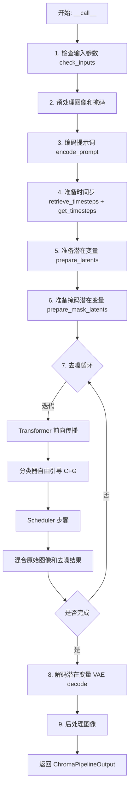
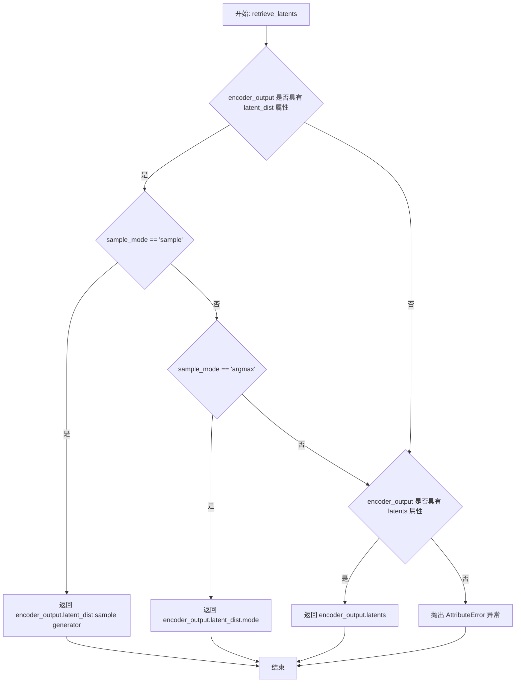
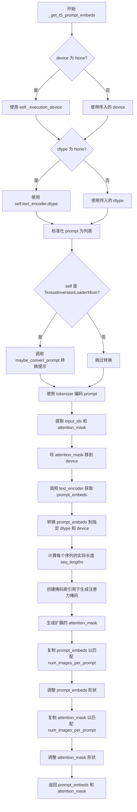
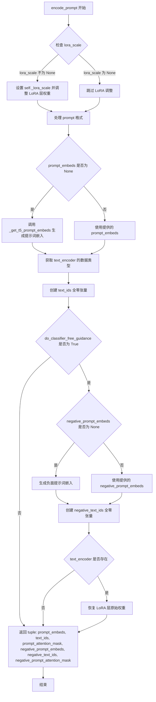
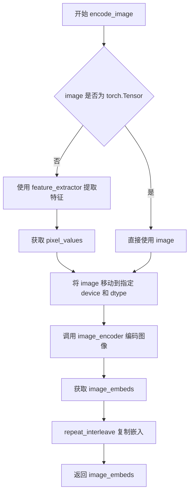
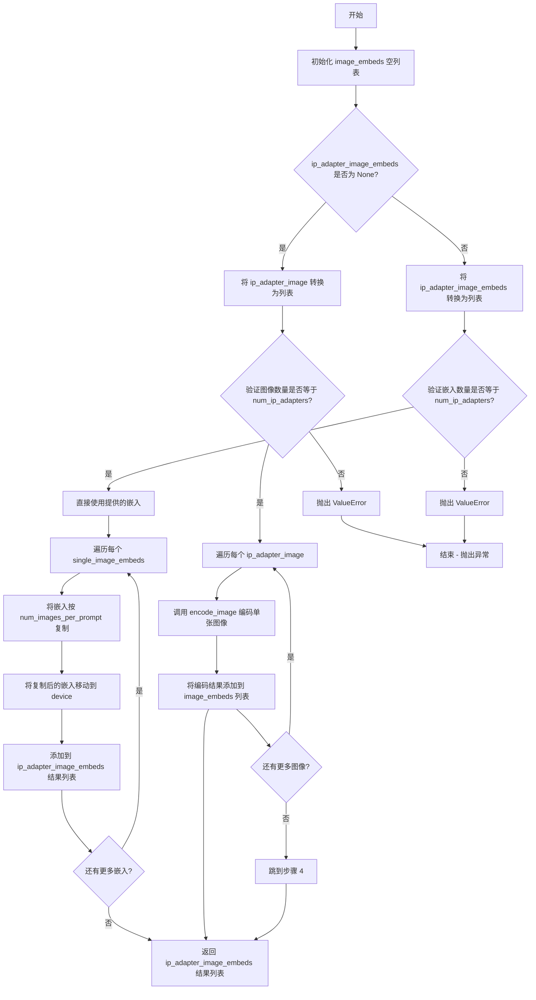
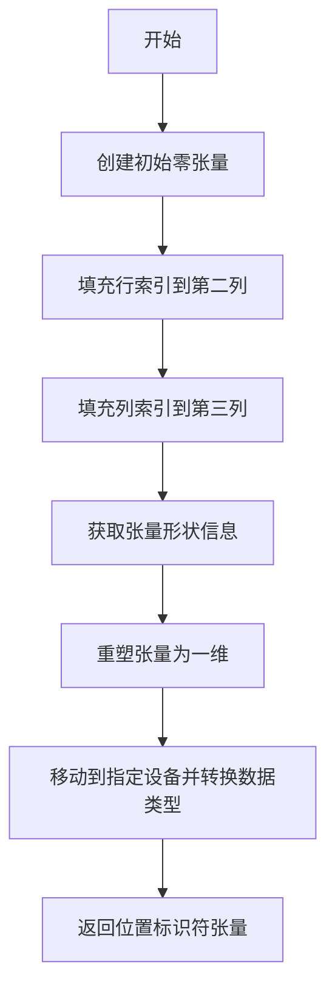
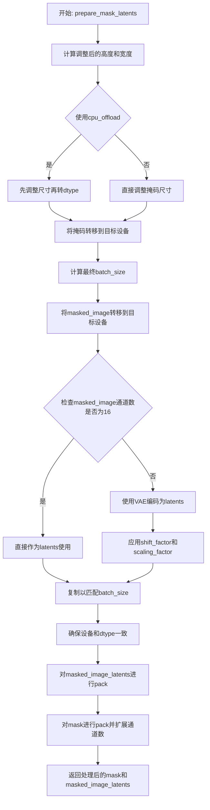
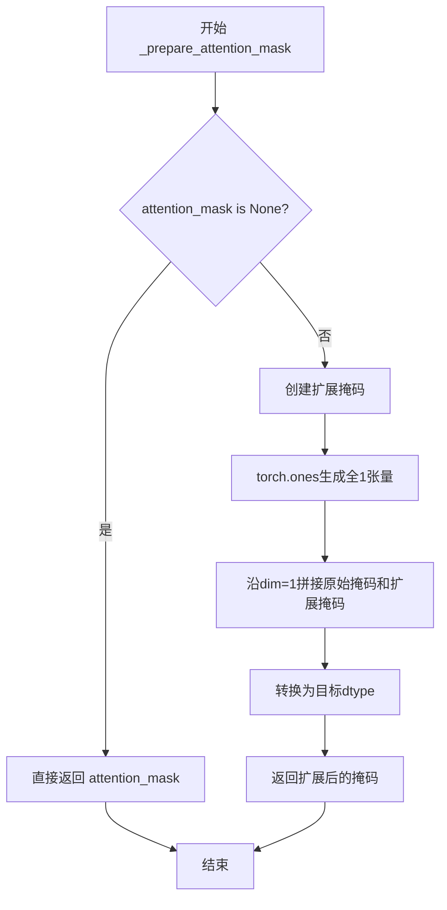
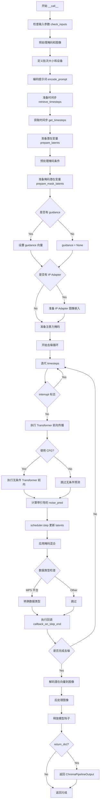

# `diffusers\src\diffusers\pipelines\chroma\pipeline_chroma_inpainting.py` 详细设计文档

ChromaInpaintPipeline 实现了一个文本引导的图像修复（inpainting）管道，基于 lodestones/Chroma1-HD 模型，整合了 T5 文本编码器、VAE 变分自编码器和 ChromaTransformer2DModel 变换器模型，通过 FlowMatchEulerDiscreteScheduler 调度器进行去噪处理，支持 LoRA、Textual Inversion 和 IP-Adapter 等高级功能。

## 整体流程



## 类结构

```
DiffusionPipeline (基类)
├── FluxLoraLoaderMixin
├── FromSingleFileMixin
├── TextualInversionLoaderMixin
├── FluxIPAdapterMixin
└── ChromaInpaintPipeline (主类)
```

## 全局变量及字段


### `logger`
    
模块级日志记录器，用于输出调试和运行时信息

类型：`logging.Logger`
    


### `EXAMPLE_DOC_STRING`
    
示例文档字符串，包含ChromaInpaintPipeline的使用示例代码

类型：`str`
    


### `XLA_AVAILABLE`
    
标志位，指示PyTorch XLA是否可用以支持加速设备

类型：`bool`
    


### `model_cpu_offload_seq`
    
模型CPU卸载顺序字符串，指定各组件卸载到CPU的序列

类型：`str`
    


### `_optional_components`
    
可选组件列表，包含image_encoder和feature_extractor

类型：`List[str]`
    


### `_callback_tensor_inputs`
    
回调函数可用的tensor输入名称列表

类型：`List[str]`
    


### `calculate_shift`
    
全局函数，根据图像序列长度计算scheduler的shift参数

类型：`Callable`
    


### `retrieve_latents`
    
全局函数，从encoder_output中提取latent表示

类型：`Callable`
    


### `retrieve_timesteps`
    
全局函数，获取scheduler的timestep调度序列

类型：`Callable`
    


### `ChromaInpaintPipeline.scheduler`
    
用于去噪过程的调度器，控制噪声消除的时间步

类型：`FlowMatchEulerDiscreteScheduler`
    


### `ChromaInpaintPipeline.vae`
    
变分自编码器，用于图像与latent空间之间的编码和解码

类型：`AutoencoderKL`
    


### `ChromaInpaintPipeline.text_encoder`
    
T5文本编码器，将文本提示转换为embedding向量

类型：`T5EncoderModel`
    


### `ChromaInpaintPipeline.tokenizer`
    
T5快速分词器，用于将文本分割为token序列

类型：`T5TokenizerFast`
    


### `ChromaInpaintPipeline.transformer`
    
Chroma变换器模型，执行latent空间的去噪操作

类型：`ChromaTransformer2DModel`
    


### `ChromaInpaintPipeline.image_encoder`
    
CLIP视觉编码器，用于IP-Adapter图像特征提取

类型：`CLIPVisionModelWithProjection`
    


### `ChromaInpaintPipeline.feature_extractor`
    
CLIP图像预处理器，提取图像特征用于image_encoder

类型：`CLIPImageProcessor`
    


### `ChromaInpaintPipeline.vae_scale_factor`
    
VAE缩放因子，决定latent空间与像素空间的比例关系

类型：`int`
    


### `ChromaInpaintPipeline.latent_channels`
    
Latent空间的通道数，通常为VAE的潜在维度

类型：`int`
    


### `ChromaInpaintPipeline.image_processor`
    
图像处理器，用于预处理和后处理输入输出图像

类型：`VaeImageProcessor`
    


### `ChromaInpaintPipeline.mask_processor`
    
掩码处理器，专门用于处理inpainting掩码

类型：`VaeImageProcessor`
    


### `ChromaInpaintPipeline.default_sample_size`
    
默认采样尺寸，用于确定生成图像的默认分辨率基数

类型：`int`
    


### `ChromaInpaintPipeline._guidance_scale`
    
无分类器引导强度，控制文本提示对生成结果的影响程度

类型：`float`
    


### `ChromaInpaintPipeline._joint_attention_kwargs`
    
联合注意力机制参数字典，包含IP-Adapter等高级特性配置

类型：`Dict[str, Any]`
    


### `ChromaInpaintPipeline._num_timesteps`
    
当前推理过程中的时间步总数

类型：`int`
    


### `ChromaInpaintPipeline._interrupt`
    
中断标志，用于在推理过程中提前终止生成

类型：`bool`
    
    

## 全局函数及方法


### `calculate_shift`

该函数是一个全局工具函数，用于根据图像序列长度计算对应的移位值（shift value）。它通过线性插值方法，基于给定的基准序列长度、最大序列长度以及对应的基准移位值和最大移位值，动态计算适用于当前图像尺寸的噪声调度移位参数。这是 Flux 系列模型中自适应调整去噪调度策略的关键计算组件。

参数：

- `image_seq_len`：`int`，图像序列长度，表示当前图像经过 VAE 编码和打包后的序列 token 数量
- `base_seq_len`：`int`，基准序列长度，默认值为 256，表示模型训练时使用的标准序列长度
- `max_seq_len`：`int`，最大序列长度，默认值为 4096，表示模型支持的最大序列长度
- `base_shift`：`float`，基准移位值，默认值为 0.5，对应基准序列长度下的噪声移位参数
- `max_shift`：`float`，最大移位值，默认值为 1.15，对应最大序列长度下的噪声移位参数

返回值：`float`，计算得到的移位值 mu，用于调整噪声调度器的采样策略

#### 流程图

```mermaid
flowchart TD
    A[开始 calculate_shift] --> B[计算斜率 m<br/>m = (max_shift - base_shift) / (max_seq_len - base_seq_len)]
    B --> C[计算截距 b<br/>b = base_shift - m * base_seq_len]
    C --> D[计算移位值 mu<br/>mu = image_seq_len * m + b]
    D --> E[返回 mu]
    
    style A fill:#f9f,stroke:#333
    style E fill:#9f9,stroke:#333
```

#### 带注释源码

```python
# Copied from diffusers.pipelines.flux.pipeline_flux.calculate_shift
def calculate_shift(
    image_seq_len,          # 当前图像的序列长度（int类型）
    base_seq_len: int = 256,   # 基准序列长度，默认256（int类型）
    max_seq_len: int = 4096,   # 最大序列长度，默认4096（int类型）
    base_shift: float = 0.5,   # 基准移位值，默认0.5（float类型）
    max_shift: float = 1.15,   # 最大移位值，默认1.15（float类型）
):
    """
    计算图像序列长度对应的移位值，用于噪声调度器的自适应调整。
    
    该函数采用线性插值方法，根据图像序列长度动态计算噪声移位参数。
    较长的图像序列需要更大的移位值来保证生成质量。
    
    参数:
        image_seq_len: 图像经过VAE编码和patch打包后的序列token数量
        base_seq_len: 训练时的标准序列长度，默认256
        max_seq_len: 模型支持的最大序列长度，默认4096
        base_shift: 基准序列长度对应的移位值，默认0.5
        max_shift: 最大序列长度对应的移位值，默认1.15
    
    返回:
        计算得到的移位值mu，用于噪声调度器的时间步调整
    """
    # 计算线性插值的斜率 m
    # 斜率表示序列长度每增加1单位，移位值增加的比例
    m = (max_shift - base_shift) / (max_seq_len - base_seq_len)
    
    # 计算线性截距 b
    # 确保当序列长度等于base_seq_len时，移位值恰好等于base_shift
    b = base_shift - m * base_seq_len
    
    # 计算最终的移位值 mu
    # 使用线性方程 mu = m * x + b 计算当前序列长度对应的移位值
    mu = image_seq_len * m + b
    
    return mu
```


### `retrieve_latents`

该函数是一个全局工具函数，用于从变分编码器（VAE）的输出中提取潜在表示（latents）。它支持三种模式：从潜在分布中采样、从潜在分布中获取最可能值（mode）、或直接返回预计算的潜在向量。这是图像生成管道中处理潜在空间的核心函数。

参数：

- `encoder_output`：`torch.Tensor`，编码器输出对象，通常包含 `latent_dist` 或 `latents` 属性
- `generator`：`torch.Generator | None`，可选的随机数生成器，用于确保采样过程可复现
- `sample_mode`：`str`，采样模式，可选值为 "sample"（从分布采样）或 "argmax"（取分布的众数），默认为 "sample"

返回值：`torch.Tensor`，提取出的潜在表示张量

#### 流程图



#### 带注释源码

```
# Copied from diffusers.pipelines.stable_diffusion.pipeline_stable_diffusion_img2img.retrieve_latents
def retrieve_latents(
    encoder_output: torch.Tensor, generator: torch.Generator | None = None, sample_mode: str = "sample"
):
    """
    从编码器输出中提取潜在表示。
    
    参数:
        encoder_output: 编码器输出对象，通常是 VAE 的输出
        generator: 可选的随机数生成器，用于采样时的随机性控制
        sample_mode: 采样模式，"sample" 从分布采样，"argmax" 取分布众数
    
    返回:
        潜在表示张量
    """
    # 检查是否有 latent_dist 属性且模式为 sample
    if hasattr(encoder_output, "latent_dist") and sample_mode == "sample":
        # 从潜在分布中采样
        return encoder_output.latent_dist.sample(generator)
    # 检查是否有 latent_dist 属性且模式为 argmax
    elif hasattr(encoder_output, "latent_dist") and sample_mode == "argmax":
        # 返回潜在分布的众数（最可能值）
        return encoder_output.latent_dist.mode()
    # 检查是否有预计算的 latents 属性
    elif hasattr(encoder_output, "latents"):
        # 直接返回预计算的潜在向量
        return encoder_output.latents
    # 如果都不满足，抛出属性错误
    else:
        raise AttributeError("Could not access latents of provided encoder_output")
```


### `retrieve_timesteps`

调用调度器的 `set_timesteps` 方法并在调用后从调度器检索时间步。支持自定义时间步。任何 kwargs 将被传递给 `scheduler.set_timesteps`。

参数：

- `scheduler`：`SchedulerMixin`，要获取时间步的调度器
- `num_inference_steps`：`int | None`，使用预训练模型生成样本时使用的扩散步数。如果使用此参数，`timesteps` 必须为 `None`
- `device`：`str | torch.device | None`，时间步应移动到的设备。如果为 `None`，时间步不会移动
- `timesteps`：`list[int] | None`，用于覆盖调度器时间步间距策略的自定义时间步。如果传递了 `timesteps`，则 `num_inference_steps` 和 `sigmas` 必须为 `None`
- `sigmas`：`list[float] | None`，用于覆盖调度器时间步间距策略的自定义 sigmas。如果传递了 `sigmas`，则 `num_inference_steps` 和 `timesteps` 必须为 `None`
- `**kwargs`：任意关键字参数，将传递给 `scheduler.set_timesteps`

返回值：`tuple[torch.Tensor, int]`，元组中第一个元素是调度器的时间步计划，第二个元素是推理步数。

#### 流程图

```mermaid
flowchart TD
    A[开始] --> B{同时传入 timesteps 和 sigmas?}
    B -->|是| C[抛出 ValueError: 只能选择其中一个]
    B -->|否| D{传入 timesteps?}
    D -->|是| E{scheduler.set_timesteps 支持 timesteps?}
    D -->|否| F{传入 sigmas?}
    E -->|是| G[调用 scheduler.set_timesteps<br/>timesteps=timesteps, device=device]
    E -->|否| H[抛出 ValueError: 当前调度器不支持自定义时间步]
    F -->|是| I{scheduler.set_timesteps 支持 sigmas?}
    F -->|否| J[调用 scheduler.set_timesteps<br/>num_inference_steps=num_inference_steps, device=device]
    I -->|是| K[调用 scheduler.set_timesteps<br/>sigmas=sigmas, device=device]
    I -->|否| L[抛出 ValueError: 当前调度器不支持自定义 sigmas]
    G --> M[获取 scheduler.timesteps<br/>计算 num_inference_steps = len(timesteps)]
    K --> N[获取 scheduler.timesteps<br/>计算 num_inference_steps = len(timesteps)]
    J --> O[获取 scheduler.timesteps]
    M --> P[返回 timesteps, num_inference_steps]
    N --> P
    O --> P
```

#### 带注释源码

```
# Copied from diffusers.pipelines.stable_diffusion.pipeline_stable_diffusion.retrieve_timesteps
def retrieve_timesteps(
    scheduler,  # 调度器对象，用于生成时间步
    num_inference_steps: int | None = None,  # 推理步数，如果使用此参数则timesteps必须为None
    device: str | torch.device | None = None,  # 目标设备，None表示不移动
    timesteps: list[int] | None = None,  # 自定义时间步列表
    sigmas: list[float] | None = None,  # 自定义sigmas列表
    **kwargs,  # 传递给scheduler.set_timesteps的其他参数
):
    r"""
    Calls the scheduler's `set_timesteps` method and retrieves timesteps from the scheduler after the call. Handles
    custom timesteps. Any kwargs will be supplied to `scheduler.set_timesteps`.

    Args:
        scheduler (`SchedulerMixin`):
            The scheduler to get timesteps from.
        num_inference_steps (`int`):
            The number of diffusion steps used when generating samples with a pre-trained model. If used, `timesteps`
            must be `None`.
        device (`str` or `torch.device`, *optional*):
            The device to which the timesteps should be moved to. If `None`, the timesteps are not moved.
        timesteps (`list[int]`, *optional*):
            Custom timesteps used to override the timestep spacing strategy of the scheduler. If `timesteps` is passed,
            `num_inference_steps` and `sigmas` must be `None`.
        sigmas (`list[float]`, *optional*):
            Custom sigmas used to override the timestep spacing strategy of the scheduler. If `sigmas` is passed,
            `num_inference_steps` and `timesteps` must be `None`.

    Returns:
        `tuple[torch.Tensor, int]`: A tuple where the first element is the timestep schedule from the scheduler and the
        second element is the number of inference steps.
    """
    # 检查是否同时传入了timesteps和sigmas，这是不允许的
    if timesteps is not None and sigmas is not None:
        raise ValueError("Only one of `timesteps` or `sigmas` can be passed. Please choose one to set custom values")
    
    # 处理自定义timesteps的情况
    if timesteps is not None:
        # 检查调度器是否支持timesteps参数
        accepts_timesteps = "timesteps" in set(inspect.signature(scheduler.set_timesteps).parameters.keys())
        if not accepts_timesteps:
            raise ValueError(
                f"The current scheduler class {scheduler.__class__}'s `set_timesteps` does not support custom"
                f" timestep schedules. Please check whether you are using the correct scheduler."
            )
        # 调用调度器的set_timesteps方法
        scheduler.set_timesteps(timesteps=timesteps, device=device, **kwargs)
        # 从调度器获取生成的时间步
        timesteps = scheduler.timesteps
        # 计算推理步数
        num_inference_steps = len(timesteps)
    
    # 处理自定义sigmas的情况
    elif sigmas is not None:
        # 检查调度器是否支持sigmas参数
        accept_sigmas = "sigmas" in set(inspect.signature(scheduler.set_timesteps).parameters.keys())
        if not accept_sigmas:
            raise ValueError(
                f"The current scheduler class {scheduler.__class__}'s `set_timesteps` does not support custom"
                f" sigmas schedules. Please check whether you are using the correct scheduler."
            )
        # 调用调度器的set_timesteps方法
        scheduler.set_timesteps(sigmas=sigmas, device=device, **kwargs)
        # 从调度器获取生成的时间步
        timesteps = scheduler.timesteps
        # 计算推理步数
        num_inference_steps = len(timesteps)
    
    # 默认情况：使用num_inference_steps生成时间步
    else:
        scheduler.set_timesteps(num_inference_steps, device=device, **kwargs)
        timesteps = scheduler.timesteps
    
    # 返回时间步计划和推理步数
    return timesteps, num_inference_steps
```


### ChromaInpaintPipeline.__init__

ChromaInpaintPipeline类的初始化方法，负责接收并注册各种模型组件（调度器、VAE、文本编码器、tokenizer、transformer、图像编码器和特征提取器），同时初始化图像处理器和掩码处理器，为后续的图像修复推理流程做好准备。

参数：

- `scheduler`：`FlowMatchEulerDiscreteScheduler`，用于控制去噪过程的调度器
- `vae`：`AutoencoderKL`，变分自编码器，用于编码和解码图像到潜在表示
- `text_encoder`：`T5EncoderModel`，T5文本编码器，用于将文本提示转换为文本嵌入
- `tokenizer`：`T5TokenizerFast`，T5分词器，用于将文本分割为token
- `transformer`：`ChromaTransformer2DModel`，条件Transformer（MMDiT）架构，用于对编码的图像潜在表示进行去噪
- `image_encoder`：`CLIPVisionModelWithProjection`，可选，CLIP视觉模型，用于IP-Adapter图像特征提取
- `feature_extractor`：`CLIPImageProcessor`，可选，CLIP图像处理器，用于预处理图像

返回值：`None`，该方法为构造函数，不返回任何值

#### 流程图

```mermaid
flowchart TD
    A[开始 __init__] --> B[调用父类 super().__init__]
    B --> C[register_modules 注册所有模型组件]
    C --> D[计算 vae_scale_factor<br/>2 ** (len(vae.config.block_out_channels) - 1)]
    D --> E[获取 latent_channels<br/>vae.config.latent_channels]
    E --> F[创建 image_processor<br/>VaeImageProcessor with scale_factor * 2]
    F --> G[设置 default_sample_size = 128]
    G --> H[创建 mask_processor<br/>VaeImageProcessor with binarize and grayscale options]
    H --> I[结束 __init__]
```

#### 带注释源码

```
def __init__(
    self,
    scheduler: FlowMatchEulerDiscreteScheduler,  # 去噪调度器
    vae: AutoencoderKL,  # 变分自编码器模型
    text_encoder: T5EncoderModel,  # T5文本编码器
    tokenizer: T5TokenizerFast,  # T5分词器
    transformer: ChromaTransformer2DModel,  # Chroma Transformer模型
    image_encoder: CLIPVisionModelWithProjection = None,  # 可选：CLIP图像编码器
    feature_extractor: CLIPImageProcessor = None,  # 可选：CLIP特征提取器
):
    # 调用父类DiffusionPipeline的初始化方法
    super().__init__()

    # 注册所有模块到pipeline，便于后续访问和保存/加载
    self.register_modules(
        vae=vae,
        text_encoder=text_encoder,
        tokenizer=tokenizer,
        transformer=transformer,
        scheduler=scheduler,
        image_encoder=image_encoder,
        feature_extractor=feature_extractor,
    )
    
    # 计算VAE的缩放因子，基于VAE块输出通道数的深度
    # 如果VAE存在，使用其配置计算；否则使用默认值8
    self.vae_scale_factor = 2 ** (len(self.vae.config.block_out_channels) - 1) if getattr(self, "vae", None) else 8
    
    # 获取VAE的潜在通道数，用于后续潜在表示的处理
    self.latent_channels = self.vae.config.latent_channels if getattr(self, "vae", None) else 16

    # Flux潜在表示被转换为2x2 patches并打包，因此潜在宽度和高度必须能被patch size整除
    # 所以VAE缩放因子乘以2来考虑这一点（patch size为2）
    self.image_processor = VaeImageProcessor(vae_scale_factor=self.vae_scale_factor * 2)
    # 默认采样大小，用于确定生成图像的默认尺寸
    self.default_sample_size = 128

    # 创建掩码处理器，专门用于处理修复任务的掩码
    self.mask_processor = VaeImageProcessor(
        vae_scale_factor=self.vae_scale_factor * 2,
        vae_latent_channels=self.latent_channels,
        do_normalize=False,  # 掩码不需要归一化
        do_binarize=True,  # 二值化掩码
        do_convert_grayscale=True,  # 转换为灰度图
    )
```


### `ChromaInpaintPipeline._get_t5_prompt_embeds`

该方法使用 T5 文本编码器将文本提示转换为向量嵌入（prompt embeddings）和注意力掩码（attention mask），供 Chroma 图像修复管道使用。它处理单个或多个提示，复制嵌入以支持每个提示生成多张图像，并生成适合 T5 编码器的注意力掩码。

参数：

- `self`：隐式参数，ChromaInpaintPipeline 实例本身
- `prompt`：`Union[str, List[str], None]` 要编码的文本提示，可以是单个字符串、字符串列表或 None
- `num_images_per_prompt`：`int` 每个提示要生成的图像数量（默认值为 1）
- `max_sequence_length`：`int` T5 编码器的最大序列长度（默认值为 512）
- `device`：`torch.device | None` 执行编码的设备，如果为 None 则使用执行设备
- `dtype`：`torch.dtype | None` 文本编码器的数据类型，如果为 None 则使用 text_encoder 的数据类型

返回值：`tuple[torch.Tensor, torch.Tensor]` 返回一个元组，包含 (prompt_embeds, attention_mask)。prompt_embeds 是形状为 (batch_size * num_images_per_prompt, seq_len, embed_dim) 的张量，attention_mask 是形状为 (batch_size * num_images_per_prompt, seq_len) 的张量

#### 流程图



#### 带注释源码

```python
def _get_t5_prompt_embeds(
    self,
    prompt: Union[str, List[str], None] = None,
    num_images_per_prompt: int = 1,
    max_sequence_length: int = 512,
    device: torch.device | None = None,
    dtype: torch.dtype | None = None,
):
    # 确定执行设备：如果未指定 device，则使用管道默认的执行设备
    device = device or self._execution_device
    # 确定数据类型：如果未指定 dtype，则使用文本编码器的数据类型
    dtype = dtype or self.text_encoder.dtype

    # 标准化 prompt 格式：如果是单个字符串则转换为列表，方便批量处理
    prompt = [prompt] if isinstance(prompt, str) else prompt
    # 获取批处理大小
    batch_size = len(prompt)

    # 如果管道支持 TextualInversionLoaderMixin，可能需要转换 prompt 格式
    # 以处理文本反演嵌入
    if isinstance(self, TextualInversionLoaderMixin):
        prompt = self.maybe_convert_prompt(prompt, self.tokenizer)

    # 使用 T5 Tokenizer 将文本 prompt 转换为 token IDs
    # padding="max_length" 确保所有序列填充到相同长度
    # truncation=True 允许截断超过 max_sequence_length 的序列
    text_inputs = self.tokenizer(
        prompt,
        padding="max_length",
        max_length=max_sequence_length,
        truncation=True,
        return_length=False,
        return_overflowing_tokens=False,
        return_tensors="pt",
    )
    # 提取 input_ids 和 attention_mask
    text_input_ids = text_inputs.input_ids
    tokenizer_mask = text_inputs.attention_mask

    # 将 attention_mask 移到指定设备
    tokenizer_mask = tokenizer_mask.to(device)

    # 调用 T5 文本编码器获取文本嵌入
    # output_hidden_states=False 表示只返回最后一层的隐藏状态
    prompt_embeds = self.text_encoder(
        text_input_ids.to(device),
        output_hidden_states=False,
        attention_mask=tokenizer_mask,
    )[0]

    # 将 prompt_embeds 转换到指定的 dtype 和 device
    prompt_embeds = prompt_embeds.to(dtype=dtype, device=device)

    # 计算每个序列的实际长度（非填充 token 的数量）
    seq_lengths = tokenizer_mask.sum(dim=1)
    # 创建掩码索引：创建从 0 到序列长度的索引张量
    mask_indices = torch.arange(tokenizer_mask.size(1), device=device).unsqueeze(0).expand(batch_size, -1)
    # 生成新的 attention_mask：只有有效 token 位置为 True，填充位置为 False
    # Chroma 模型要求精确的注意力掩码来处理 T5 填充 token
    attention_mask = (mask_indices <= seq_lengths.unsqueeze(1)).to(dtype=dtype, device=device)

    # 获取序列长度
    _, seq_len, _ = prompt_embeds.shape

    # 复制 text embeddings 和 attention mask 以支持每个提示生成多张图像
    # 使用 repeat 方法而不是 repeat_interleave 以兼容 MPS 设备
    prompt_embeds = prompt_embeds.repeat(1, num_images_per_prompt, 1)
    # 调整形状为 (batch_size * num_images_per_prompt, seq_len, embed_dim)
    prompt_embeds = prompt_embeds.view(batch_size * num_images_per_prompt, seq_len, -1)

    # 对 attention_mask 进行相同的复制和形状调整
    attention_mask = attention_mask.repeat(1, num_images_per_prompt)
    attention_mask = attention_mask.view(batch_size * num_images_per_prompt, seq_len)

    # 返回生成的 prompt embeddings 和对应的 attention mask
    return prompt_embeds, attention_mask
```


### ChromaInpaintPipeline.encode_prompt

该方法负责将文本提示词（prompt）和负面提示词（negative_prompt）编码为模型可用的文本嵌入（text embeddings），同时生成相应的文本ID和注意力掩码，供后续的图像生成 transformer 使用。该方法支持 LoRA 权重调整、分类器自由引导（CFG）以及预计算的提示词嵌入。

参数：

- `self`：`ChromaInpaintPipeline`，ChromaInpaintPipeline 实例本身
- `prompt`：`Union[str, List[str]]`，要编码的文本提示词，可以是单个字符串或字符串列表
- `negative_prompt`：`Union[str, List[str], None]`，负面提示词，用于引导图像生成时排除某些内容，默认为 None
- `device`：`torch.device | None`，计算设备，默认为 None（自动获取执行设备）
- `num_images_per_prompt`：`int`，每个提示词生成的图像数量，默认为 1
- `prompt_embeds`：`torch.Tensor | None`，预生成的提示词嵌入，可用于直接提供嵌入而无需从文本生成，默认为 None
- `negative_prompt_embeds`：`torch.Tensor | None`，预生成的负面提示词嵌入，默认为 None
- `prompt_attention_mask`：`torch.Tensor | None`，提示词的注意力掩码，用于标识有效 token 位置，默认为 None
- `negative_prompt_attention_mask`：`torch.Tensor | None`，负面提示词的注意力掩码，默认为 None
- `do_classifier_free_guidance`：`bool`，是否启用分类器自由引导，默认为 True
- `max_sequence_length`：`int`，提示词的最大序列长度，默认为 256
- `lora_scale`：`bool | None`，LoRA 权重缩放因子，用于调整 LoRA 层的影响程度，默认为 None

返回值：`Tuple[torch.Tensor, torch.Tensor, torch.Tensor, torch.Tensor, torch.Tensor, torch.Tensor]`，返回一个包含 6 个元素的元组：
- `prompt_embeds`：编码后的提示词嵌入，形状为 (batch_size * num_images_per_prompt, seq_len, embed_dim)
- `text_ids`：文本ID张量，用于后续 transformer 处理，形状为 (seq_len, 3)
- `prompt_attention_mask`：提示词的注意力掩码
- `negative_prompt_embeds`：编码后的负面提示词嵌入（若启用 CFG）
- `negative_text_ids`：负面文本ID张量（若启用 CFG）
- `negative_prompt_attention_mask`：负面提示词的注意力掩码（若启用 CFG）

#### 流程图



#### 带注释源码

```python
def encode_prompt(
    self,
    prompt: Union[str, List[str]],
    negative_prompt: Union[str, List[str], None] = None,
    device: torch.device | None = None,
    num_images_per_prompt: int = 1,
    prompt_embeds: torch.Tensor | None = None,
    negative_prompt_embeds: torch.Tensor | None = None,
    prompt_attention_mask: torch.Tensor | None = None,
    negative_prompt_attention_mask: torch.Tensor | None = None,
    do_classifier_free_guidance: bool = True,
    max_sequence_length: int = 256,
    lora_scale: bool | None = None,
):
    r"""
    将文本提示词编码为模型可用的嵌入表示。

    Args:
        prompt (`str` or `List[str]`, *optional*):
            要编码的提示词
        negative_prompt (`str` or `List[str]`, *optional*):
            负面提示词，用于引导图像生成时排除某些内容。若未定义，则需传递 `negative_prompt_embeds`。
            在不使用引导时（即 `guidance_scale` 小于 1）会被忽略。
        device: (`torch.device`):
            torch 设备
        num_images_per_prompt (`int`):
            每个提示词生成的图像数量
        prompt_embeds (`torch.Tensor`, *optional*):
            预生成的文本嵌入。可用于轻松调整文本输入，例如提示词加权。若未提供，则从 `prompt` 参数生成。
        lora_scale (`float`, *optional*):
            将应用于文本编码器所有 LoRA 层的 LoRA 缩放因子（若已加载 LoRA 层）。
    """
    # 确定计算设备，若未指定则使用执行设备
    device = device or self._execution_device

    # 设置 LoRA 缩放因子，以便文本编码器的 monkey patched LoRA 函数正确访问
    # 只有当 lora_scale 不为 None 且当前 pipeline 继承自 FluxLoraLoaderMixin 时才处理
    if lora_scale is not None and isinstance(self, FluxLoraLoaderMixin):
        self._lora_scale = lora_scale

        # 动态调整 LoRA 缩放因子
        if self.text_encoder is not None and USE_PEFT_BACKEND:
            scale_lora_layers(self.text_encoder, lora_scale)

    # 标准化 prompt 格式：若是字符串则转为单元素列表
    prompt = [prompt] if isinstance(prompt, str) else prompt

    # 确定批次大小：若提供 prompt 则基于其长度，否则基于 prompt_embeds 的批次维度
    if prompt is not None:
        batch_size = len(prompt)
    else:
        batch_size = prompt_embeds.shape[0]

    # 若未提供 prompt_embeds，则通过 T5 编码器生成
    if prompt_embeds is None:
        prompt_embeds, prompt_attention_mask = self._get_t5_prompt_embeds(
            prompt=prompt,
            num_images_per_prompt=num_images_per_prompt,
            max_sequence_length=max_sequence_length,
            device=device,
        )

    # 确定数据类型：优先使用 text_encoder 的数据类型，若不存在则使用 transformer 的数据类型
    dtype = self.text_encoder.dtype if self.text_encoder is not None else self.transformer.dtype
    
    # 创建文本ID张量（用于 transformer 的位置编码），形状为 (seq_len, 3)
    text_ids = torch.zeros(prompt_embeds.shape[1], 3, device=device, dtype=dtype)
    negative_text_ids = None

    # 处理分类器自由引导（CFG）：需要同时生成条件和无条件（负面）嵌入
    if do_classifier_free_guidance:
        # 若未提供负面提示词嵌入，则从负面提示词生成
        if negative_prompt_embeds is None:
            # 默认使用空字符串作为负面提示词
            negative_prompt = negative_prompt or ""
            # 标准化为列表格式
            negative_prompt = (
                batch_size * [negative_prompt] if isinstance(negative_prompt, str) else negative_prompt
            )

            # 类型检查：prompt 和 negative_prompt 类型必须一致
            if prompt is not None and type(prompt) is not type(negative_prompt):
                raise TypeError(
                    f"`negative_prompt` should be the same type to `prompt`, but got {type(negative_prompt)} !="
                    f" {type(prompt)}."
                )
            # 批次大小检查：必须匹配
            elif batch_size != len(negative_prompt):
                raise ValueError(
                    f"`negative_prompt`: {negative_prompt} has batch size {len(negative_prompt)}, but `prompt`:"
                    f" {prompt} has batch size {batch_size}. Please make sure that passed `negative_prompt` matches"
                    " the batch size of `prompt`."
                )

            # 调用 T5 编码器生成负面提示词嵌入
            negative_prompt_embeds, negative_prompt_attention_mask = self._get_t5_prompt_embeds(
                prompt=negative_prompt,
                num_images_per_prompt=num_images_per_prompt,
                max_sequence_length=max_sequence_length,
                device=device,
            )

        # 为负面提示词创建对应的文本ID张量
        negative_text_ids = torch.zeros(negative_prompt_embeds.shape[1], 3, device=device, dtype=dtype)

    # 恢复 LoRA 层权重：若使用了 PEFT backend，在编码完成后恢复原始权重
    if self.text_encoder is not None:
        if isinstance(self, FluxLoraLoaderMixin) and USE_PEFT_BACKEND:
            # 通过取消缩放恢复原始 LoRA 层权重
            unscale_lora_layers(self.text_encoder, lora_scale)

    # 返回编码后的所有结果：提示词嵌入、文本ID、注意力掩码及其对应的负面版本
    return (
        prompt_embeds,
        text_ids,
        prompt_attention_mask,
        negative_prompt_embeds,
        negative_text_ids,
        negative_prompt_attention_mask,
    )
```


### `ChromaInpaintPipeline.encode_image`

该函数用于将输入图像编码为图像嵌入向量（image embeddings），供后续的图像修复（inpainting）流程使用。函数首先检查图像类型，若不是张量则通过特征提取器转换为张量，然后移动到指定设备，最后使用图像编码器生成嵌入并根据每提示词图像数量进行复制。

参数：

- `image`：`Union[PIL.Image.Image, np.ndarray, torch.Tensor]`，输入图像，用于编码成图像嵌入
- `device`：`torch.device`，目标设备，用于将图像和张量移动到该设备上
- `num_images_per_prompt`：`int`，每个提示词生成的图像数量，用于复制图像嵌入以匹配批量大小

返回值：`torch.Tensor`，编码后的图像嵌入向量，形状为 `(batch_size * num_images_per_prompt, embedding_dim)`

#### 流程图



#### 带注释源码

```python
def encode_image(self, image, device, num_images_per_prompt):
    """
    将输入图像编码为图像嵌入向量。

    参数:
        image: 输入图像，可以是 PIL Image、numpy array 或 torch.Tensor
        device: 目标设备
        num_images_per_prompt: 每个提示词生成的图像数量

    返回:
        编码后的图像嵌入向量
    """
    # 获取图像编码器的参数 dtype，确保输入图像使用相同的精度
    dtype = next(self.image_encoder.parameters()).dtype

    # 如果输入不是 torch.Tensor，则使用特征提取器将其转换为张量
    # feature_extractor 会将 PIL Image 或 numpy array 转换为模型所需格式
    if not isinstance(image, torch.Tensor):
        image = self.feature_extractor(image, return_tensors="pt").pixel_values

    # 将图像移动到指定设备，并转换为与图像编码器相同的 dtype
    image = image.to(device=device, dtype=dtype)

    # 使用图像编码器编码图像，获取图像嵌入
    # image_encoder 通常是 CLIPVisionModelWithProjection
    image_embeds = self.image_encoder(image).image_embeds

    # 根据每个提示词生成的图像数量复制图像嵌入
    # repeat_interleave 在指定维度上重复张量，dim=0 对应批量维度
    # 例如：如果 batch_size=1, num_images_per_prompt=4，则输出形状为 (4, embedding_dim)
    image_embeds = image_embeds.repeat_interleave(num_images_per_prompt, dim=0)

    # 返回编码后的图像嵌入向量
    return image_embeds
```


### `ChromaInpaintPipeline.prepare_ip_adapter_image_embeds`

该方法用于准备 IP Adapter 的图像嵌入（image embeddings）。它接受原始图像或预计算的图像嵌入，根据 transformer 模型中配置的 IP Adapter 数量进行验证和处理，并将处理后的嵌入复制到指定设备上，以供后续的图像修复流程使用。

参数：

- `ip_adapter_image`：`PipelineImageInput`，可选的输入图像，用于生成 IP Adapter 图像嵌入。如果提供了 `ip_adapter_image_embeds`，则此参数可省略。
- `ip_adapter_image_embeds`：`List[torch.Tensor]`，可选的预计算图像嵌入列表。如果为 None，则从 `ip_adapter_image` 编码生成。
- `device`：`torch.device`，目标设备，用于将图像嵌入移动到该设备上。
- `num_images_per_prompt`：`int`，每个 prompt 生成的图像数量，用于复制图像嵌入以匹配批量大小。

返回值：`List[torch.Tensor]`，返回处理后的 IP Adapter 图像嵌入列表，每个元素对应一个 IP Adapter。

#### 流程图



#### 带注释源码

```python
def prepare_ip_adapter_image_embeds(
    self, ip_adapter_image, ip_adapter_image_embeds, device, num_images_per_prompt
):
    """
    准备 IP Adapter 的图像嵌入。
    
    该方法有两种工作模式：
    1. 当 ip_adapter_image_embeds 为 None 时，对输入图像进行编码
    2. 当 ip_adapter_image_embeds 不为 None 时，直接使用预计算的嵌入
    
    参数:
        ip_adapter_image: 输入的图像或图像列表
        ip_adapter_image_embeds: 预计算的图像嵌入（可选）
        device: 目标设备
        num_images_per_prompt: 每个 prompt 生成的图像数量
    
    返回:
        处理后的图像嵌入列表
    """
    image_embeds = []
    
    # 模式1: 需要从图像编码生成嵌入
    if ip_adapter_image_embeds is None:
        # 确保图像是列表格式
        if not isinstance(ip_adapter_image, list):
            ip_adapter_image = [ip_adapter_image]

        # 验证图像数量与 IP Adapter 数量是否匹配
        if len(ip_adapter_image) != self.transformer.encoder_hid_proj.num_ip_adapters:
            raise ValueError(
                f"`ip_adapter_image` must have same length as the number of IP Adapters. Got {len(ip_adapter_image)} images and {self.transformer.encoder_hid_proj.num_ip_adapters} IP Adapters."
            )

        # 遍历每个 IP Adapter 的图像进行编码
        for single_ip_adapter_image in ip_adapter_image:
            # 调用 encode_image 方法编码单张图像
            single_image_embeds = self.encode_image(single_ip_adapter_image, device, 1)
            # 添加批次维度并追加到列表
            image_embeds.append(single_image_embeds[None, :])
    
    # 模式2: 使用预计算的嵌入
    else:
        # 确保嵌入是列表格式
        if not isinstance(ip_adapter_image_embeds, list):
            ip_adapter_image_embeds = [ip_adapter_image_embeds]

        # 验证嵌入数量与 IP Adapter 数量是否匹配
        if len(ip_adapter_image_embeds) != self.transformer.encoder_hid_proj.num_ip_adapters:
            raise ValueError(
                f"`ip_adapter_image_embeds` must have same length as the number of IP Adapters. Got {len(ip_adapter_image_embeds)} image embeds and {self.transformer.encoder_hid_proj.num_ip_adapters} IP Adapters."
            )

        # 直接使用预计算的嵌入
        for single_image_embeds in ip_adapter_image_embeds:
            image_embeds.append(single_image_embeds)

    # 处理每个嵌入：复制 num_images_per_prompt 次并移动到目标设备
    ip_adapter_image_embeds = []
    for single_image_embeds in image_embeds:
        # 沿着批次维度复制以匹配 num_images_per_prompt
        single_image_embeds = torch.cat([single_image_embeds] * num_images_per_prompt, dim=0)
        # 移动到目标设备
        single_image_embeds = single_image_embeds.to(device=device)
        ip_adapter_image_embeds.append(single_image_embeds)

    return ip_adapter_image_embeds
```


### `ChromaInpaintPipeline._encode_vae_image`

该函数负责将输入的图像张量编码为VAE latent空间表示，支持批量处理和单个生成器两种模式，并对编码后的latent进行shift和scaling归一化处理。

参数：

- `self`：`ChromaInpaintPipeline` 实例本身，隐式传递
- `image`：`torch.Tensor`，输入的图像张量，需要被编码为latent表示
- `generator`：`torch.Generator`，随机数生成器，用于VAE编码时的采样过程

返回值：`torch.Tensor`，编码并归一化后的图像latent张量

#### 流程图

```mermaid
flowchart TD
    A[开始: _encode_vae_image] --> B{generator是否是列表?}
    B -->|是| C[遍历图像批量]
    C --> D[对单张图像调用vae.encode]
    D --> E[使用对应generator采样latent]
    E --> F[收集所有latent]
    F --> G[沿batch维度拼接latent]
    B -->|否| H[直接调用vae.encode图像]
    H --> I[使用generator采样latent]
    G --> J[应用归一化: (latents - shift_factor) * scaling_factor]
    I --> J
    J --> K[返回归一化后的image_latents]
```

#### 带注释源码

```python
def _encode_vae_image(self, image: torch.Tensor, generator: torch.Generator):
    # 判断generator是否为列表，支持批量生成器
    if isinstance(generator, list):
        # 批量处理：为每个图像使用对应的generator
        image_latents = [
            # 使用retrieve_latents函数从VAE编码结果中提取latent
            # 对每个图像切片单独编码
            retrieve_latents(self.vae.encode(image[i : i + 1]), generator=generator[i])
            for i in range(image.shape[0])
        ]
        # 将多个latent张量沿batch维度拼接
        image_latents = torch.cat(image_latents, dim=0)
    else:
        # 单个generator：直接编码整个图像批次
        image_latents = retrieve_latents(self.vae.encode(image), generator=generator)

    # 应用VAE配置的归一化参数
    # 1. 减去shift_factor进行中心化
    # 2. 乘以scaling_factor进行尺度缩放
    image_latents = (image_latents - self.vae.config.shift_factor) * self.vae.config.scaling_factor

    # 返回归一化后的latent表示
    return image_latents
```

---

### 关联依赖：`retrieve_latents` 全局函数

参数：

- `encoder_output`：`torch.Tensor`，VAE编码器的输出结果
- `generator`：`torch.Generator | None`，随机数生成器
- `sample_mode`：`str`，采样模式，可选 "sample" 或 "argmax"

返回值：`torch.Tensor`，提取出的latent张量

#### 带注释源码

```python
def retrieve_latents(
    encoder_output: torch.Tensor, generator: torch.Generator | None = None, sample_mode: str = "sample"
):
    # 检查encoder_output是否有latent_dist属性（概率分布）
    if hasattr(encoder_output, "latent_dist") and sample_mode == "sample":
        # 从分布中采样latent
        return encoder_output.latent_dist.sample(generator)
    elif hasattr(encoder_output, "latent_dist") and sample_mode == "argmax":
        # 从分布中取最可能的值（mode）
        return encoder_output.latent_dist.mode()
    elif hasattr(encoder_output, "latents"):
        # 直接使用预存的latents属性
        return encoder_output.latents
    else:
        # 无法提取latent，抛出属性错误
        raise AttributeError("Could not access latents of provided encoder_output")
```


### ChromaInpaintPipeline.get_timesteps

该方法用于根据推理步数和强度（strength）参数调整扩散调度器的时间步，从而控制图像修复过程中的去噪程度。当strength小于1时，方法会跳过初始的时间步，只使用剩余的时间步进行去噪，实现部分图像修复的效果。

参数：

- `num_inference_steps`：`int`，推理步数，即去噪过程的迭代总次数
- `strength`：`float`，强度参数，取值范围为[0, 1]，表示对原始图像的变换程度。值为1时表示最大程度变换，完全忽略原始图像；值越接近0表示保留越多原始图像信息
- `device`：`torch.device`，计算设备（CPU或GPU）

返回值：`tuple[torch.Tensor, int]`，返回一个元组，第一个元素是调整后的时间步张量（torch.Tensor），第二个元素是实际用于推理的步数（int）

#### 流程图

```mermaid
flowchart TD
    A[开始 get_timesteps] --> B[计算 init_timestep = min(num_inference_steps × strength, num_inference_steps)]
    --> C[计算 t_start = max(num_inference_steps - init_timestep, 0)]
    --> D[从 scheduler.timesteps 中切片获取 timesteps]
    --> E{tcheduler 是否有 set_begin_index 方法?}
    -->|是| F[调用 scheduler.set_begin_index(t_start × scheduler.order)]
    --> G[返回 timesteps 和 num_inference_steps - t_start]
    -->|否| G
```

#### 带注释源码

```python
def get_timesteps(self, num_inference_steps, strength, device):
    """
    根据推理步数和强度参数获取调整后的时间步。
    
    参数:
        num_inference_steps: 推理步数
        strength: 强度参数，控制图像变换程度
        device: 计算设备
    """
    # 根据强度计算初始时间步数
    # strength 表示要保留多少原始图像信息
    # 例如: strength=0.8 表示保留80%原始图像，只对20%进行重绘
    init_timestep = min(num_inference_steps * strength, num_inference_steps)

    # 计算跳过的起始索引
    # 从推理总步数中减去初始步数，确定从哪个时间步开始
    t_start = int(max(num_inference_steps - init_timestep, 0))
    
    # 从调度器中获取时间步序列，并按顺序切片
    # scheduler.order 表示调度器的阶数，用于多步去噪
    timesteps = self.scheduler.timesteps[t_start * self.scheduler.order :]
    
    # 如果调度器支持设置起始索引，则设置它
    # 这对于某些调度器的正确运行是必要的
    if hasattr(self.scheduler, "set_begin_index"):
        self.scheduler.set_begin_index(t_start * self.scheduler.order)

    # 返回调整后的时间步和实际推理步数
    return timesteps, num_inference_steps - t_start
```


### ChromaInpaintPipeline.check_inputs

该方法用于验证图像修复管道的输入参数是否合法，确保用户提供的参数符合模型要求，并在参数不符合要求时抛出详细的错误信息。

参数：

- `prompt`：`Union[str, List[str], None]`，用户提供的文本提示，用于引导图像生成
- `image`：`PipelineImageInput`，待修复的输入图像
- `mask_image`：`PipelineImageInput`，修复区域的掩码图像
- `strength`：`float`，修复强度，控制对原图像的修改程度，值在 0 到 1 之间
- `height`：`int`，生成图像的高度（像素）
- `width`：`int`，生成图像的宽度（像素）
- `output_type`：`str`，输出图像的类型（如 "pil" 或 "latent"）
- `negative_prompt`：`Union[str, List[str], None]`，可选的负面提示，用于引导不希望出现的特征
- `prompt_embeds`：`torch.Tensor | None`，可选的预计算文本嵌入向量
- `negative_prompt_embeds`：`torch.Tensor | None`，可选的预计算负面文本嵌入向量
- `callback_on_step_end_tensor_inputs`：`List[str] | None`，每步结束时回调函数需要处理的张量输入列表
- `padding_mask_crop`：`int | None`，可选的掩码裁剪填充大小
- `max_sequence_length`：`int | None`，文本序列的最大长度
- `prompt_attention_mask`：`torch.Tensor | None`，文本提示的注意力掩码
- `negative_prompt_attention_mask`：`torch.Tensor | None`，负面提示的注意力掩码

返回值：`None`，该方法不返回任何值，仅进行参数验证和错误检查

#### 流程图

```mermaid
flowchart TD
    A[开始 check_inputs] --> B{strength 是否在 [0, 1] 范围}
    B -->|否| B1[抛出 ValueError]
    B -->|是| C{height 和 width 是否能被 vae_scale_factor * 2 整除}
    C -->|否| C1[发出警告并调整尺寸]
    C -->|是| D{callback_on_step_end_tensor_inputs 是否合法}
    D -->|否| D1[抛出 ValueError]
    D -->|是| E{prompt 和 prompt_embeds 是否同时提供}
    E -->|是| E1[抛出 ValueError]
    E -->|否| F{prompt 和 prompt_embeds 是否都未提供}
    F -->|是| F1[抛出 ValueError]
    F -->|否| G{prompt 类型是否合法}
    G -->|否| G1[抛出 ValueError]
    G -->|是| H{negative_prompt 和 negative_prompt_embeds 是否同时提供}
    H -->|是| H1[抛出 ValueError]
    H -->|否| I{prompt_embeds 和 negative_prompt_embeds 形状是否一致}
    I -->|否| I1[抛出 ValueError]
    I -->|是| J{是否提供了 prompt_embeds 但未提供 prompt_attention_mask}
    J -->|是| J1[抛出 ValueError]
    J -->|否| K{是否提供了 negative_prompt_embeds 但未提供 negative_prompt_attention_mask}
    K -->|是| K1[抛出 ValueError]
    K -->|否| L{padding_mask_crop 是否为 None}
    L -->|否| M{image 和 mask_image 是否为 PIL.Image}
    M -->|否| M1[抛出 ValueError]
    M -->|是| N{output_type 是否为 pil}
    N -->|否| N1[抛出 ValueError]
    N -->|是| O{max_sequence_length 是否大于 512}
    O -->|是| O1[抛出 ValueError]
    O -->|否| P[验证通过]
    L -->|是| O
    B1 --> Q[结束]
    C1 --> D
    E1 --> Q
    F1 --> Q
    G1 --> Q
    H1 --> Q
    I1 --> Q
    J1 --> Q
    K1 --> Q
    M1 --> Q
    N1 --> Q
    O1 --> Q
    P --> Q
```

#### 带注释源码

```python
def check_inputs(
    self,
    prompt,
    image,
    mask_image,
    strength,
    height,
    width,
    output_type,
    negative_prompt=None,
    prompt_embeds=None,
    negative_prompt_embeds=None,
    callback_on_step_end_tensor_inputs=None,
    padding_mask_crop=None,
    max_sequence_length=None,
    prompt_attention_mask=None,
    negative_prompt_attention_mask=None,
):
    # 验证 strength 参数必须在 [0.0, 1.0] 范围内
    if strength < 0 or strength > 1:
        raise ValueError(f"The value of strength should in [0.0, 1.0] but is {strength}")

    # 验证高度和宽度必须能被 vae_scale_factor * 2 整除
    # 这是因为 Flux 模型使用 2x2 的patch packing
    if height % (self.vae_scale_factor * 2) != 0 or width % (self.vae_scale_factor * 2) != 0:
        logger.warning(
            f"`height` and `width` have to be divisible by {self.vae_scale_factor * 2} but are {height} and {width}. Dimensions will be resized accordingly"
        )

    # 验证回调函数张量输入是否在允许的列表中
    if callback_on_step_end_tensor_inputs is not None and not all(
        k in self._callback_tensor_inputs for k in callback_on_step_end_tensor_inputs
    ):
        raise ValueError(
            f"`callback_on_step_end_tensor_inputs` has to be in {self._callback_tensor_inputs}, but found {[k for k in callback_on_step_end_tensor_inputs if k not in self._callback_tensor_inputs]}"
        )

    # 验证 prompt 和 prompt_embeds 不能同时提供
    if prompt is not None and prompt_embeds is not None:
        raise ValueError(
            f"Cannot forward both `prompt`: {prompt} and `prompt_embeds`: {prompt_embeds}. Please make sure to"
            " only forward one of the two."
        )
    # 验证 prompt 和 prompt_embeds 至少提供一个
    elif prompt is None and prompt_embeds is None:
        raise ValueError(
            "Provide either `prompt` or `prompt_embeds`. Cannot leave both `prompt` and `prompt_embeds` undefined."
        )
    # 验证 prompt 的类型必须是 str 或 list
    elif prompt is not None and (not isinstance(prompt, str) and not isinstance(prompt, list)):
        raise ValueError(f"`prompt` has to be of type `str` or `list` but is {type(prompt)}")

    # 验证 negative_prompt 和 negative_prompt_embeds 不能同时提供
    if negative_prompt is not None and negative_prompt_embeds is not None:
        raise ValueError(
            f"Cannot forward both `negative_prompt`: {negative_prompt} and `negative_prompt_embeds`:"
            f" {negative_prompt_embeds}. Please make sure to only forward one of the two."
        )

    # 验证 prompt_embeds 和 negative_prompt_embeds 形状必须一致
    if prompt_embeds is not None and negative_prompt_embeds is not None:
        if prompt_embeds.shape != negative_prompt_embeds.shape:
            raise ValueError(
                "`prompt_embeds` and `negative_prompt_embeds` must have the same shape when passed directly, but"
                f" got: `prompt_embeds` {prompt_embeds.shape} != `negative_prompt_embeds`"
                f" {negative_prompt_embeds.shape}."
            )

    # 验证如果提供了 prompt_embeds，必须同时提供 prompt_attention_mask
    if prompt_embeds is not None and prompt_attention_mask is None:
        raise ValueError("Cannot provide `prompt_embeds` without also providing `prompt_attention_mask")

    # 验证如果提供了 negative_prompt_embeds，必须同时提供 negative_prompt_attention_mask
    if negative_prompt_embeds is not None and negative_prompt_attention_mask is None:
        raise ValueError(
            "Cannot provide `negative_prompt_embeds` without also providing `negative_prompt_attention_mask"
        )

    # 如果使用 padding_mask_crop，必须满足以下条件
    if padding_mask_crop is not None:
        # image 必须是 PIL 图像
        if not isinstance(image, PIL.Image.Image):
            raise ValueError(
                f"The image should be a PIL image when inpainting mask crop, but is of type {type(image)}."
            )
        # mask_image 必须是 PIL 图像
        if not isinstance(mask_image, PIL.Image.Image):
            raise ValueError(
                f"The mask image should be a PIL image when inpainting mask crop, but is of type"
                f" {type(mask_image)}."
            )
        # output_type 必须是 "pil"
        if output_type != "pil":
            raise ValueError(f"The output type should be PIL when inpainting mask crop, but is {output_type}.")

    # 验证 max_sequence_length 不能超过 512
    if max_sequence_length is not None and max_sequence_length > 512:
        raise ValueError(f"`max_sequence_length` cannot be greater than 512 but is {max_sequence_length}")
```


### `ChromaInpaintPipeline._prepare_latent_image_ids`

该方法用于生成潜在图像的位置标识符（latent image IDs），这些标识符包含图像块在二维空间中的位置信息（行索引和列索引），用于在Transformer模型中标识每个潜在图像块的位置。

参数：

- `batch_size`：`int`，批次大小（虽然方法内部未直接使用，但保留以支持未来扩展）
- `height`：`int`，潜在图像的高度（以图像块为单位）
- `width`：`int`，潜在图像的宽度（以图像块为单位）
- `device`：`torch.device`，目标设备，用于将生成的张量移动到指定设备
- `dtype`：`torch.dtype`，目标数据类型，用于指定张量的数据类型

返回值：`torch.Tensor`，形状为 `(height * width, 3)` 的二维张量，每行包含 `[0, row_index, col_index]` 格式的位置标识符，用于表示潜在图像中每个图像块的位置信息。

#### 流程图



#### 带注释源码

```python
@staticmethod
# Copied from diffusers.pipelines.flux.pipeline_flux.FluxPipeline._prepare_latent_image_ids
def _prepare_latent_image_ids(batch_size, height, width, device, dtype):
    """
    准备潜在图像的位置标识符，用于在Transformer中标识每个潜在图像块的位置。
    
    参数:
        batch_size: 批次大小
        height: 潜在图像高度（以图像块为单位）
        width: 潜在图像宽度（以图像块为单位）
        device: 目标设备
        dtype: 目标数据类型
    
    返回:
        形状为 (height * width, 3) 的位置标识符张量
    """
    # 步骤1: 创建初始零张量，形状为 (height, width, 3)
    # 第三维用于存储 [0, row_index, col_index]
    latent_image_ids = torch.zeros(height, width, 3)
    
    # 步骤2: 填充行索引到第二列 (索引1)
    # torch.arange(height)[:, None] 创建列向量 (height, 1)
    # 广播机制将行索引添加到每一列
    latent_image_ids[..., 1] = latent_image_ids[..., 1] + torch.arange(height)[:, None]
    
    # 步骤3: 填充列索引到第三列 (索引2)
    # torch.arange(width)[None, :] 创建行向量 (1, width)
    # 广播机制将列索引添加到每一行
    latent_image_ids[..., 2] = latent_image_ids[..., 2] + torch.arange(width)[None, :]
    
    # 步骤4: 获取重塑前的形状信息
    latent_image_id_height, latent_image_id_width, latent_image_id_channels = latent_image_ids.shape
    
    # 步骤5: 重塑张量从 (height, width, 3) 到 (height * width, 3)
    # 将二维位置信息展平为一维序列
    latent_image_ids = latent_image_ids.reshape(
        latent_image_id_height * latent_image_id_width, latent_image_id_channels
    )
    
    # 步骤6: 将张量移动到指定设备并转换数据类型后返回
    return latent_image_ids.to(device=device, dtype=dtype)
```


### `ChromaInpaintPipeline._pack_latents`

该函数是一个静态方法，用于将 latents 张量进行打包（packing）操作。这是 Flux/Pixel-Space 模型的常见处理方式，将 2x2 的 patch 打包在一起，以便于后续的 Transformer 处理。

参数：

- `latents`：`torch.Tensor`，输入的 latents 张量，形状为 (batch_size, num_channels_latents, height, width)
- `batch_size`：`int`，批量大小
- `num_channels_latents`：`int`，latents 的通道数
- `height`：`int`，latents 的高度
- `width`：`int`，latents 的宽度

返回值：`torch.Tensor`，打包后的 latents 张量，形状为 (batch_size, (height // 2) * (width // 2), num_channels_latents * 4)

#### 流程图

```mermaid
flowchart TD
    A[输入 latents<br/>shape: (batch, channels, H, W)] --> B[view 重塑<br/>shape: (batch, channels, H/2, 2, W/2, 2)]
    B --> C[permute 维度重排<br/>shape: (batch, H/2, W/2, channels, 2, 2)]
    C --> D[reshape 拉伸<br/>shape: (batch, H/2\*W/2, channels\*4)]
    D --> E[输出打包后的 latents]
```

#### 带注释源码

```python
@staticmethod
# Copied from diffusers.pipelines.flux.pipeline_flux.FluxPipeline._pack_latents
def _pack_latents(latents, batch_size, num_channels_latents, height, width):
    """
    将 latents 张量打包成 Flux 模型所需的格式。
    原始 latents 是 4D 的 (batch, channels, height, width)，
    打包后变成 3D 的 (batch, seq_len, hidden_size)，其中 seq_len = (height//2)*(width//2)，hidden_size = channels*4。
    这是因为 Flux 模型将 2x2 的像素/潜空间 patch 打包在一起。
    
    Args:
        latents: 输入的 latents 张量
        batch_size: 批量大小
        num_channels_latents: latents 通道数
        height: latents 高度
        width: latents 宽度
    
    Returns:
        打包后的 latents 张量
    """
    # Step 1: 将 latents 从 (batch, channels, H, W) 重塑为 (batch, channels, H/2, 2, W/2, 2)
    # 这一步将 height 和 width 各分成两半，并在每个位置创建一个 2x2 的 patch
    latents = latents.view(batch_size, num_channels_latents, height // 2, 2, width // 2, 2)
    
    # Step 2: 重新排列维度从 (batch, channels, H/2, 2, W/2, 2) 到 (batch, H/2, W/2, channels, 2, 2)
    # 这一步将空间维度移到前面，便于后续合并 patch 维度
    latents = latents.permute(0, 2, 4, 1, 3, 5)
    
    # Step 3: 将 latents 重新整形成 3D 张量 (batch, H/2*W/2, channels*4)
    # 将 2x2 patch 展平为长度为 4 的向量，与通道维度合并
    latents = latents.reshape(batch_size, (height // 2) * (width // 2), num_channels_latents * 4)

    return latents
```


### `ChromaInpaintPipeline._unpack_latents`

该方法是一个静态方法，用于将已被打包（packed）的latent张量解包回原始的4D张量形状。在Flux架构中，latent张量被按照2x2的patch方式进行打包以便于并行处理，此方法逆操作这一过程，恢复为标准的(batch_size, channels, height, width)格式。

参数：

- `latents`：`torch.Tensor`，打包后的latent张量，形状为 (batch_size, num_patches, channels)，其中 num_patches = (height // 2) * (width // 2)
- `height`：`int`，原始图像的高度（像素单位）
- `width`：`int`，原始图像的宽度（像素单位）
- `vae_scale_factor`：`int`，VAE的缩放因子，用于计算实际的latent空间尺寸

返回值：`torch.Tensor`，解包后的latent张量，形状为 (batch_size, channels // 4, height', width')，其中 height' 和 width' 是经过VAE缩放和packging调整后的尺寸

#### 流程图

```mermaid
flowchart TD
    A[开始: 输入打包的latents] --> B[获取batch_size, num_patches, channels]
    B --> C[计算调整后的height和width<br/>height = 2 * (height // (vae_scale_factor * 2))<br/>width = 2 * (width // (vae_scale_factor * 2))]
    C --> D[使用view重塑张量<br/>latents.view<br/>batch_size, height//2, width//2, channels//4, 2, 2]
    D --> E[使用permute重新排列维度<br/>0, 3, 1, 4, 2, 5]
    E --> F[使用reshape展平为4D张量<br/>batch_size, channels//4, height, width]
    F --> G[返回解包后的latents]
```

#### 带注释源码

```python
@staticmethod
# 静态方法：从 FluxPipeline 复制而来
# Copied from diffusers.pipelines.flux.pipeline_flux.FluxPipeline._unpack_latents
def _unpack_latents(latents, height, width, vae_scale_factor):
    # 从打包的latent张量中提取形状信息
    # latents 形状: (batch_size, num_patches, channels)
    # 其中 num_patches = (height // 2) * (width // 2) 在打包前
    batch_size, num_patches, channels = latents.shape

    # VAE 对图像应用 8x 压缩，但我们还需要考虑 packing 带来的影响
    # packing 要求 latent 的高度和宽度能够被 2 整除
    # 因此需要将输入的 height 和 width 先除以 vae_scale_factor * 2，再乘以 2 进行调整
    height = 2 * (int(height) // (vae_scale_factor * 2))
    width = 2 * (int(width) // (vae_scale_factor * 2))

    # 第一步：使用 view 将打包的 latent 重新整形为 6D 张量
    # 从 (batch_size, num_patches, channels) 
    # 到 (batch_size, height//2, width//2, channels//4, 2, 2)
    # 这恢复了 2x2 patch 的结构
    latents = latents.view(batch_size, height // 2, width // 2, channels // 4, 2, 2)
    
    # 第二步：使用 permute 重新排列维度
    # 从 (batch_size, h//2, w//2, c//4, 2, 2) 
    # 到 (batch_size, c//4, h//2, 2, w//2, 2)
    # 这样可以将两个 2x2 的维度分离出来
    latents = latents.permute(0, 3, 1, 4, 2, 5)

    # 第三步：使用 reshape 将 6D 张量展平为 4D 张量
    # 从 (batch_size, c//4, h//2, 2, w//2, 2)
    # 到 (batch_size, c//4, height, width)
    latents = latents.reshape(batch_size, channels // (2 * 2), height, width)

    # 返回解包后的 latent 张量，形状为 (batch_size, channels//4, height, width)
    return latents
```


### `ChromaInpaintPipeline.prepare_latents`

该方法负责准备图像修复（inpainting）所需的潜在变量（latents），包括处理输入图像、生成或处理噪声、调整潜在变量尺寸以适应VAE和Flux模型的打包要求。

参数：

- `self`：`ChromaInpaintPipeline` 实例本身
- `image`：`torch.Tensor`，待修复的输入图像张量
- `timestep`：`torch.Tensor`，当前扩散时间步
- `batch_size`：`int`，批处理大小
- `num_channels_latents`：`int`，潜在变量的通道数
- `height`：`int`，目标图像高度
- `width`：`int`，目标图像宽度
- `dtype`：`torch.dtype`，目标数据类型
- `device`：`torch.device`，目标设备
- `generator`：`torch.Generator | list[torch.Generator] | None`，随机数生成器
- `latents`：`torch.Tensor | None`，可选的预生成潜在变量

返回值：`tuple[torch.Tensor, torch.Tensor, torch.Tensor, torch.Tensor]`，包含打包后的潜在变量、噪声、图像潜在变量和潜在图像ID

#### 流程图

```mermaid
flowchart TD
    A[开始 prepare_latents] --> B{generator list长度<br/>是否等于batch_size}
    B -->|否| C[抛出ValueError]
    B -->|是| D[计算调整后的height和width]
    D --> E[创建shape元组]
    E --> F[生成latent_image_ids]
    F --> G[将image移到device]
    G --> H{image通道数<br/>是否等于latent_channels}
    H -->|是| I[直接作为image_latents]
    H -->|否| J[通过VAE编码image]
    I --> K{batch_size ><br/>image_latents.shape[0]}
    J --> K
    K -->|能整除| L[复制image_latents]
    K -->|不能整除| M[抛出ValueError]
    K -->|否则| N[直接使用image_latents]
    L --> O
    M --> O[结束]
    N --> O{latents是否为None}
    O -->|是| P[生成随机噪声]
    O -->|否| Q[使用传入的latents]
    P --> R[scheduler.scale_noise]
    Q --> R
    R --> S[打包noise]
    S --> T[打包image_latents]
    T --> U[打包latents]
    U --> V[返回latents, noise, image_latents, latent_image_ids]
```

#### 带注释源码

```python
def prepare_latents(
    self,
    image,                      # torch.Tensor: 待修复的输入图像
    timestep,                   # torch.Tensor: 当前扩散时间步
    batch_size,                 # int: 批处理大小
    num_channels_latents,       # int: 潜在变量的通道数
    height,                     # int: 目标高度
    width,                      # int: 目标宽度
    dtype,                      # torch.dtype: 目标数据类型
    device,                     # torch.device: 目标设备
    generator,                  # torch.Generator | list[torch.Generator] | None: 随机数生成器
    latents=None,               # torch.Tensor | None: 可选的预生成潜在变量
):
    # 检查generator列表长度是否与batch_size匹配
    if isinstance(generator, list) and len(generator) != batch_size:
        raise ValueError(
            f"You have passed a list of generators of length {len(generator)}, but requested an effective batch"
            f" size of {batch_size}. Make sure the batch size matches the length of the generators."
        )

    # VAE应用8x压缩，但还需要考虑打包要求（latent高度和宽度必须能被2整除）
    # 因此vae_scale_factor要乘以2来计算最终的调整尺寸
    height = 2 * (int(height) // (self.vae_scale_factor * 2))
    width = 2 * (int(width) // (self.vae_scale_factor * 2))
    
    # 构建潜在变量的shape: (batch_size, num_channels_latents, height, width)
    shape = (batch_size, num_channels_latents, height, width)
    
    # 生成用于Flux模型的latent image IDs，包含位置编码信息
    latent_image_ids = self._prepare_latent_image_ids(batch_size, height // 2, width // 2, device, dtype)

    # 将输入图像移到目标设备
    image = image.to(device=device, dtype=dtype)
    
    # 如果图像通道数不等于VAE的latent通道数，需要通过VAE编码
    if image.shape[1] != self.latent_channels:
        image_latents = self._encode_vae_image(image=image, generator=generator)
    else:
        # 否则直接作为latent使用（如从其他pipeline传入的latent）
        image_latents = image

    # 处理batch_size大于image_latents的情况（多prompt生成）
    if batch_size > image_latents.shape[0] and batch_size % image_latents.shape[0] == 0:
        # 扩展image_latents以匹配batch_size
        additional_image_per_prompt = batch_size // image_latents.shape[0]
        image_latents = torch.cat([image_latents] * additional_image_per_prompt, dim=0)
    elif batch_size > image_latents.shape[0] and batch_size % image_latents.shape[0] != 0:
        # 无法整除时抛出错误
        raise ValueError(
            f"Cannot duplicate `image` of batch size {image_latents.shape[0]} to {batch_size} text prompts."
        )
    else:
        # 确保image_latents是连续的张量
        image_latents = torch.cat([image_latents], dim=0)

    # 如果没有提供latents，则生成随机噪声
    if latents is None:
        # 使用randn_tensor生成标准正态分布的噪声
        noise = randn_tensor(shape, generator=generator, device=device, dtype=dtype)
        # 根据scheduler和timestep对噪声进行缩放
        latents = self.scheduler.scale_noise(image_latents, timestep, noise)
    else:
        # 使用传入的latents
        noise = latents.to(device)
        latents = noise

    # 对所有潜在变量进行打包处理（Flux模型的特殊格式）
    # 打包将2x2的patch展平为序列，便于Transformer处理
    noise = self._pack_latents(noise, batch_size, num_channels_latents, height, width)
    image_latents = self._pack_latents(image_latents, batch_size, num_channels_latents, height, width)
    latents = self._pack_latents(latents, batch_size, num_channels_latents, height, width)
    
    # 返回打包后的latents、噪声、图像latents和位置编码ID
    return latents, noise, image_latents, latent_image_ids
```


### `ChromaInpaintPipeline.prepare_mask_latents`

该方法负责准备掩码（mask）和被遮罩图像（masked image）的潜在表示（latents），将它们调整为适当的尺寸并进行打包处理，以供扩散模型使用。

参数：

- `self`：`ChromaInpaintPipeline` 实例本身
- `mask`：`torch.Tensor`，输入的掩码张量，用于指示图像中需要修复的区域
- `masked_image`：`torch.Tensor`，被遮罩的图像张量，即被mask覆盖后的图像内容
- `batch_size`：`int`，批次大小，用于控制同时处理的样本数量
- `num_channels_latents`：`int`，潜在空间的通道数，通常为 VAE 潜在通道数的 1/4
- `num_images_per_prompt`：`int`，每个提示词生成的图像数量
- `height`：`int`，目标图像的高度（像素单位）
- `width`：`int`，目标图像的宽度（像素单位）
- `dtype`：`torch.dtype`，张量的数据类型（如 bfloat16、float32 等）
- `device`：`torch.device`，计算设备（CPU 或 CUDA）
- `generator`：`torch.Generator | None`，随机数生成器，用于确保可重复性

返回值：`Tuple[torch.Tensor, torch.Tensor]`，返回处理后的掩码张量和被遮罩图像的潜在表示组成的元组

#### 流程图



#### 带注释源码

```python
def prepare_mask_latents(
    self,
    mask,
    masked_image,
    batch_size,
    num_channels_latents,
    num_images_per_prompt,
    height,
    width,
    dtype,
    device,
    generator,
):
    # VAE applies 8x compression on images but we must also account for packing which requires
    # latent height and width to be divisible by 2.
    # 计算调整后的高度和宽度：VAE使用8倍压缩，同时需要考虑打包需要 latent 尺寸能被2整除
    height = 2 * (int(height) // (self.vae_scale_factor * 2))
    width = 2 * (int(width) // (self.vae_scale_factor * 2))
    
    # resize the mask to latents shape as we concatenate the mask to the latents
    # we do that before converting to dtype to avoid breaking in case we're using cpu_offload
    # and half precision
    # 调整掩码尺寸以匹配 latent 形状：在转换为 dtype 之前进行以避免 cpu_offload 和半精度下的兼容性问题
    mask = torch.nn.functional.interpolate(mask, size=(height, width))
    mask = mask.to(device=device, dtype=dtype)

    # 根据每个提示词生成的图像数量扩展批次大小
    batch_size = batch_size * num_images_per_prompt

    # 将被遮罩图像转移到目标设备并转换数据类型
    masked_image = masked_image.to(device=device, dtype=dtype)

    # 如果 masked_image 已经是 latent 格式（16通道），直接使用；否则使用 VAE 编码
    if masked_image.shape[1] == 16:
        masked_image_latents = masked_image
    else:
        # 使用 VAE 编码图像获取潜在表示
        masked_image_latents = retrieve_latents(self.vae.encode(masked_image), generator=generator)

        # 应用 VAE 的缩放因子和偏移量进行标准化
        masked_image_latents = (
            masked_image_latents - self.vae.config.shift_factor
        ) * self.vae.config.scaling_factor

    # duplicate mask and masked_image_latents for each generation per prompt, using mps friendly method
    # 复制掩码和 masked_image_latents 以匹配目标批次大小
    if mask.shape[0] < batch_size:
        if not batch_size % mask.shape[0] == 0:
            raise ValueError(
                "The passed mask and the required batch size don't match. Masks are supposed to be duplicated to"
                f" a total batch size of {batch_size}, but {mask.shape[0]} masks were passed. Make sure the number"
                " of masks that you pass is divisible by the total requested batch size."
            )
        mask = mask.repeat(batch_size // mask.shape[0], 1, 1, 1)
    
    if masked_image_latents.shape[0] < batch_size:
        if not batch_size % masked_image_latents.shape[0] == 0:
            raise ValueError(
                "The passed images and the required batch size don't match. Images are supposed to be duplicated"
                f" to a total batch size of {batch_size}, but {masked_image_latents.shape[0]} images were passed."
                " Make sure the number of images that you pass is divisible by the total requested batch size."
            )
        masked_image_latents = masked_image_latents.repeat(batch_size // masked_image_latents.shape[0], 1, 1, 1)

    # aligning device to prevent device errors when concating it with the latent model input
    # 确保设备一致以避免连接时的设备错误
    masked_image_latents = masked_image_latents.to(device=device, dtype=dtype)
    
    # 使用 _pack_latents 方法打包 masked_image_latents
    masked_image_latents = self._pack_latents(
        masked_image_latents,
        batch_size,
        num_channels_latents,
        height,
        width,
    )
    
    # 扩展掩码通道数并打包
    mask = self._pack_latents(
        mask.repeat(1, num_channels_latents, 1, 1),
        batch_size,
        num_channels_latents,
        height,
        width,
    )

    # 返回处理后的掩码和被遮罩图像 latents
    return mask, masked_image_latents
```


### `ChromaInpaintPipeline._prepare_attention_mask`

该方法用于扩展注意力掩码，以支持 Chroma 模型中的混合文本-图像注意力机制。由于 Chroma 模型在处理过程中会将图像令牌（image tokens）添加到最终的序列中，原有的文本注意力掩码需要扩展以包含这些图像令牌的位置。

参数：

- `self`：`ChromaInpaintPipeline` 实例本身
- `batch_size`：`int`，批次大小，用于确定扩展后掩码的批次维度
- `sequence_length`：`int`，序列长度，对应图像令牌的数量，用于创建与图像令牌数量相等的掩码扩展
- `dtype`：`torch.dtype`，目标数据类型，用于转换最终的注意力掩码
- `attention_mask`：`torch.Tensor | None`，可选参数，原始的文本注意力掩码，如果为 `None` 则直接返回

返回值：`torch.Tensor | None`，返回扩展后的注意力掩码，如果输入 `attention_mask` 为 `None` 则返回 `None`

#### 流程图



#### 带注释源码

```python
def _prepare_attention_mask(
    self,
    batch_size,
    sequence_length,
    dtype,
    attention_mask=None,
):
    """
    扩展注意力掩码以包含图像令牌的注意力计算。
    
    Chroma 模型使用混合文本-图像注意力机制，需要将图像令牌
    添加到原始文本序列中。此方法扩展原始的文本注意力掩码，
    在其末尾添加与图像令牌数量相等的全1掩码，确保所有图像
    令牌都能被关注（不被屏蔽）。
    
    Args:
        batch_size: 批次大小
        sequence_length: 图像令牌序列长度
        dtype: 目标数据类型
        attention_mask: 原始文本注意力掩码
    
    Returns:
        扩展后的注意力掩码，或None
    """
    # 如果没有提供注意力掩码，直接返回None
    if attention_mask is None:
        return attention_mask

    # 扩展提示注意力掩码以考虑最终序列中的图像令牌
    # 创建一个与图像令牌数量相等的全1布尔张量
    # 使用原始attention_mask的设备和布尔类型
    extension = torch.ones(
        batch_size, 
        sequence_length, 
        device=attention_mask.device, 
        dtype=torch.bool
    )
    
    # 在序列维度（dim=1）上拼接原始掩码和扩展掩码
    # 这样文本令牌部分保持原有的注意力控制
    # 图像令牌部分全部为1（允许关注所有图像令牌）
    attention_mask = torch.cat(
        [attention_mask, extension],
        dim=1,
    )
    
    # 转换为目标数据类型（如torch.float32或torch.bfloat16）
    attention_mask = attention_mask.to(dtype)

    return attention_mask
```


### ChromaInpaintPipeline.__call__

该方法是 ChromaInpaintPipeline 的主入口函数，实现了基于 Chroma1-HD 模型的文本引导图像修复（inpainting）功能。通过接收提示词、原始图像和掩码图像，在潜在空间中进行去噪处理，最终生成修复后的图像。

参数：

- `prompt`：`Union[str, List[str]]`，用于引导图像生成的提示词，若未定义则必须传入 prompt_embeds
- `negative_prompt`：`Union[str, List[str]]`，不引导图像生成的提示词，若未使用引导（guidance_scale≤1）则被忽略
- `true_cfg_scale`：`float`，真实验证器配置比例，默认为 1.0
- `image`：`PipelineImageInput`，输入的原始图像，用于修复区域的参考
- `mask_image`：`PipelineImageInput`，修复掩码图像，标识需要修复的区域
- `masked_image_latents`：`PipelineImageInput`，可选的预计算掩码图像潜在表示
- `height`：`int | None`，生成图像的高度（像素），默认为 None
- `width`：`int | None`，生成图像的宽度（像素），默认为 None
- `padding_mask_crop`：`int | None`，可选的掩码裁剪填充值
- `strength`：`float`，概念上表示对参考图像的变换程度，值在 0 到 1 之间，默认为 0.6
- `num_inference_steps`：`int`，去噪步骤数，默认为 28
- `sigmas`：`list[float] | None`，自定义 sigmas 值，用于支持该参数的调度器
- `guidance_scale`：`float`，无分类器自由引导（CFG）比例，默认为 7.0
- `num_images_per_prompt`：`Optional[int]`，每个提示词生成的图像数量，默认为 1
- `generator`：`torch.Generator | list[torch.Generator] | None`，随机数生成器，用于确保生成的可重复性
- `latents`：`Optional[torch.FloatTensor]`，预生成的噪声潜在向量，若未提供则使用随机生成器采样
- `prompt_embeds`：`Optional[torch.FloatTensor]`，预生成的文本嵌入，可用于轻松调整文本输入
- `ip_adapter_image`：`Optional[PipelineImageInput]`，可选的 IP Adapter 图像输入
- `ip_adapter_image_embeds`：`Optional[List[torch.Tensor]]`，预生成的 IP Adapter 图像嵌入列表
- `negative_ip_adapter_image`：`Optional[PipelineImageInput]`，可选的负向 IP Adapter 图像输入
- `negative_ip_adapter_image_embeds`：`Optional[List[torch.Tensor]]`，预生成的负向 IP Adapter 图像嵌入列表
- `negative_prompt_embeds`：`Optional[torch.FloatTensor]`，预生成的负向文本嵌入
- `output_type`：`str`，输出格式，可选 "pil" 或 "latent"，默认为 "pil"
- `return_dict`：`bool`，是否返回 ChromaPipelineOutput，默认为 True
- `joint_attention_kwargs`：`Optional[Dict[str, Any]]`，传递给 AttentionProcessor 的参数字典
- `callback_on_step_end`：`Optional[Callable[[int, int, Dict], None]]`，每个去噪步骤结束时调用的回调函数
- `callback_on_step_end_tensor_inputs`：`List[str]`，回调函数接受的张量输入列表，默认为 ["latents"]
- `max_sequence_length`：`int`，提示词最大序列长度，默认为 256
- `prompt_attention_mask`：`torch.Tensor | None`，提示词嵌入的注意力掩码
- `negative_prompt_attention_mask`：`torch.Tensor | None`，负向提示词嵌入的注意力掩码

返回值：`ChromaPipelineOutput` 或 `tuple`，返回生成的图像列表或 ChromaPipelineOutput 对象

#### 流程图



#### 带注释源码

```python
@replace_example_docstring(EXAMPLE_DOC_STRING)
@torch.no_grad()
def __call__(
    self,
    prompt: Union[str, List[str]] = None,
    negative_prompt: Union[str, List[str]] = None,
    true_cfg_scale: float = 1.0,
    image: PipelineImageInput = None,
    mask_image: PipelineImageInput = None,
    masked_image_latents: PipelineImageInput = None,
    height: int | None = None,
    width: int | None = None,
    padding_mask_crop: int | None = None,
    strength: float = 0.6,
    num_inference_steps: int = 28,
    sigmas: list[float] | None = None,
    guidance_scale: float = 7.0,
    num_images_per_prompt: Optional[int] = 1,
    generator: torch.Generator | list[torch.Generator] | None = None,
    latents: Optional[torch.FloatTensor] = None,
    prompt_embeds: Optional[torch.FloatTensor] = None,
    ip_adapter_image: Optional[PipelineImageInput] = None,
    ip_adapter_image_embeds: Optional[List[torch.Tensor]] = None,
    negative_ip_adapter_image: Optional[PipelineImageInput] = None,
    negative_ip_adapter_image_embeds: Optional[List[torch.Tensor]] = None,
    negative_prompt_embeds: Optional[torch.FloatTensor] = None,
    output_type: str = "pil",
    return_dict: bool = True,
    joint_attention_kwargs: Optional[Dict[str, Any]] = None,
    callback_on_step_end: Optional[Callable[[int, int, Dict], None]] = None,
    callback_on_step_end_tensor_inputs: List[str] = ["latents"],
    max_sequence_length: int = 256,
    prompt_attention_mask: torch.Tensor | None = None,
    negative_prompt_attention_mask: torch.Tensor | None = None,
):
    r"""
    Function invoked when calling the pipeline for generation.
    管道调用时执行的主生成函数

    Args:
        prompt: 引导图像生成的提示词
        negative_prompt: 不引导图像生成的负向提示词
        height: 生成图像的高度
        width: 生成图像的宽度
        num_inference_steps: 去噪步骤数
        sigmas: 自定义 sigmas 值
        guidance_scale: CFG 引导比例
        strength: 图像变换强度
        num_images_per_prompt: 每个提示词生成的图像数
        generator: 随机数生成器
        latents: 预生成的噪声潜在向量
        prompt_embeds: 预生成的文本嵌入
        ip_adapter_image: IP Adapter 图像输入
        ip_adapter_image_embeds: IP Adapter 图像嵌入
        negative_ip_adapter_image: 负向 IP Adapter 图像
        negative_ip_adapter_image_embeds: 负向 IP Adapter 嵌入
        negative_prompt_embeds: 负向文本嵌入
        output_type: 输出格式 ("pil" 或 "latent")
        return_dict: 是否返回字典格式
        joint_attention_kwargs: 联合注意力参数字典
        callback_on_step_end: 步骤结束回调函数
        callback_on_step_end_tensor_inputs: 回调张量输入列表
        max_sequence_length: 最大序列长度
        prompt_attention_mask: 提示词注意力掩码
        negative_prompt_attention_mask: 负向提示词注意力掩码
    """

    # 1. 确定默认高度和宽度，使用 VAE 缩放因子计算
    height = height or self.default_sample_size * self.vae_scale_factor
    width = width or self.default_sample_size * self.vae_scale_factor

    # 1. 检查输入参数，验证参数合法性和一致性
    self.check_inputs(
        prompt=prompt,
        height=height,
        width=width,
        output_type=output_type,
        strength=strength,
        negative_prompt=negative_prompt,
        prompt_embeds=prompt_embeds,
        negative_prompt_embeds=negative_prompt_embeds,
        prompt_attention_mask=prompt_attention_mask,
        negative_prompt_attention_mask=negative_prompt_attention_mask,
        callback_on_step_end_tensor_inputs=callback_on_step_end_tensor_inputs,
        max_sequence_length=max_sequence_length,
        image=image,
        mask_image=mask_image,
        padding_mask_crop=padding_mask_crop,
    )

    # 保存引导比例和联合注意力参数到实例变量
    self._guidance_scale = guidance_scale
    self._joint_attention_kwargs = joint_attention_kwargs
    self._current_timestep = None
    self._interrupt = False

    # 2. 预处理掩码和图像
    if padding_mask_crop is not None:
        # 获取掩码裁剪区域坐标
        crops_coords = self.mask_processor.get_crop_region(mask_image, width, height, pad=padding_mask_crop)
        resize_mode = "fill"
    else:
        crops_coords = None
        resize_mode = "default"

    # 保存原始图像引用
    original_image = image
    # 预处理输入图像，转换为模型所需格式
    init_image = self.image_processor.preprocess(
        image, height=height, width=width, crops_coords=crops_coords, resize_mode=resize_mode
    )
    init_image = init_image.to(dtype=torch.float32)

    # 3. 定义调用参数：确定批次大小
    if prompt is not None and isinstance(prompt, str):
        batch_size = 1
    elif prompt is not None and isinstance(prompt, list):
        batch_size = len(prompt)
    else:
        batch_size = prompt_embeds.shape[0]

    # 获取执行设备
    device = self._execution_device
    # 从 joint_attention_kwargs 获取 LoRA 比例
    lora_scale = (
        self.joint_attention_kwargs.get("scale", None) if self.joint_attention_kwargs is not None else None
    )

    # 编码提示词为文本嵌入
    (
        prompt_embeds,
        text_ids,
        prompt_attention_mask,
        negative_prompt_embeds,
        negative_text_ids,
        negative_prompt_attention_mask,
    ) = self.encode_prompt(
        prompt=prompt,
        negative_prompt=negative_prompt,
        prompt_embeds=prompt_embeds,
        negative_prompt_embeds=negative_prompt_embeds,
        prompt_attention_mask=prompt_attention_mask,
        negative_prompt_attention_mask=negative_prompt_attention_mask,
        do_classifier_free_guidance=self.do_classifier_free_guidance,
        device=device,
        num_images_per_prompt=num_images_per_prompt,
        max_sequence_length=max_sequence_length,
        lora_scale=lora_scale,
    )

    # 4. 准备时间步
    # 创建默认 sigma 调度（从 1.0 线性衰减到 1/num_inference_steps）
    sigmas = np.linspace(1.0, 1 / num_inference_steps, num_inference_steps) if sigmas is None else sigmas
    # 计算图像序列长度（潜在空间中的token数）
    image_seq_len = (int(height) // self.vae_scale_factor // 2) * (int(width) // self.vae_scale_factor // 2)
    # 计算时间步偏移量（基于图像序列长度）
    mu = calculate_shift(
        image_seq_len,
        self.scheduler.config.get("base_image_seq_len", 256),
        self.scheduler.config.get("max_image_seq_len", 4096),
        self.scheduler.config.get("base_shift", 0.5),
        self.scheduler.config.get("max_shift", 1.15),
    )
    # 从调度器获取时间步
    timesteps, num_inference_steps = retrieve_timesteps(
        self.scheduler,
        num_inference_steps,
        device,
        sigmas=sigmas,
        mu=mu,
    )
    # 根据强度调整时间步
    timesteps, num_inference_steps = self.get_timesteps(num_inference_steps, strength, device)

    # 计算预热步数（用于进度条显示）
    num_warmup_steps = max(len(timesteps) - num_inference_steps * self.scheduler.order, 0)
    self._num_timesteps = len(timesteps)

    # 验证推理步骤数有效性
    if num_inference_steps < 1:
        raise ValueError(
            f"After adjusting the num_inference_steps by strength parameter: {strength}, the number of pipeline"
            f"steps is {num_inference_steps} which is < 1 and not appropriate for this pipeline."
        )
    # 复制初始时间步到批次维度
    latent_timestep = timesteps[:1].repeat(batch_size * num_images_per_prompt)

    # 5. 准备潜在变量
    # 计算潜在通道数（transformer输入通道的1/4）
    num_channels_latents = self.transformer.config.in_channels // 4
    num_channels_transformer = self.transformer.config.in_channels

    # 准备初始潜在向量、噪声、图像潜在向量和潜在图像ID
    latents, noise, image_latents, latent_image_ids = self.prepare_latents(
        init_image,
        latent_timestep,
        batch_size * num_images_per_prompt,
        num_channels_latents,
        height,
        width,
        prompt_embeds.dtype,
        device,
        generator,
        latents,
    )

    # 预处理掩码条件
    mask_condition = self.mask_processor.preprocess(
        mask_image, height=height, width=width, resize_mode=resize_mode, crops_coords=crops_coords
    )

    # 处理被掩码的图像
    if masked_image_latents is None:
        # 如果没有提供掩码图像潜在，则使用原图乘以掩码（掩码区域为黑色）
        masked_image = init_image * (mask_condition < 0.5)
    else:
        masked_image = masked_image_latents

    # 准备掩码潜在变量
    mask, masked_image_latents = self.prepare_mask_latents(
        mask_condition,
        masked_image,
        batch_size,
        num_channels_latents,
        num_images_per_prompt,
        height,
        width,
        prompt_embeds.dtype,
        device,
        generator,
    )

    # 重新计算预热步数
    num_warmup_steps = max(len(timesteps) - num_inference_steps * self.scheduler.order, 0)
    self._num_timesteps = len(timesteps)

    # 处理引导嵌入
    if self.transformer.config.guidance_embeds:
        # 创建引导向量
        guidance = torch.full([1], guidance_scale, device=device, dtype=torch.float32)
        guidance = guidance.expand(latents.shape[0])
    else:
        guidance = None

    # 处理 IP Adapter 图像（自动填充零图像以保持一致性）
    if (ip_adapter_image is not None or ip_adapter_image_embeds is not None) and (
        negative_ip_adapter_image is None and negative_ip_adapter_image_embeds is None
    ):
        negative_ip_adapter_image = np.zeros((width, height, 3), dtype=np.uint8)
    elif (ip_adapter_image is None and ip_adapter_image_embeds is None) and (
        negative_ip_adapter_image is not None or negative_ip_adapter_image_embeds is not None
    ):
        ip_adapter_image = np.zeros((width, height, 3), dtype=np.uint8)

    # 初始化联合注意力参数字典
    if self.joint_attention_kwargs is None:
        self._joint_attention_kwargs = {}

    # 准备 IP Adapter 图像嵌入
    image_embeds = None
    negative_image_embeds = None
    if ip_adapter_image is not None or ip_adapter_image_embeds is not None:
        image_embeds = self.prepare_ip_adapter_image_embeds(
            ip_adapter_image,
            ip_adapter_image_embeds,
            device,
            batch_size * num_images_per_prompt,
        )
    if negative_ip_adapter_image is not None or negative_ip_adapter_image_embeds is not None:
        negative_image_embeds = self.prepare_ip_adapter_image_embeds(
            negative_ip_adapter_image,
            negative_ip_adapter_image_embeds,
            device,
            batch_size * num_images_per_prompt,
        )

    # 准备提示词注意力掩码
    attention_mask = self._prepare_attention_mask(
        batch_size=latents.shape[0],
        sequence_length=image_seq_len,
        dtype=latents.dtype,
        attention_mask=prompt_attention_mask,
    )
    negative_attention_mask = self._prepare_attention_mask(
        batch_size=latents.shape[0],
        sequence_length=image_seq_len,
        dtype=latents.dtype,
        attention_mask=negative_prompt_attention_mask,
    )

    # 6. 去噪循环
    with self.progress_bar(total=num_inference_steps) as progress_bar:
        for i, t in enumerate(timesteps):
            # 检查中断标志，允许外部中断去噪过程
            if self.interrupt:
                continue

            self._current_timestep = t
            # 将时间步广播到批次维度（兼容 ONNX/Core ML）
            timestep = t.expand(latents.shape[0]).to(latents.dtype)

            # 设置 IP Adapter 图像嵌入到联合注意力参数
            if image_embeds is not None:
                self._joint_attention_kwargs["ip_adapter_image_embeds"] = image_embeds

            # 执行 Transformer 前向传播（条件生成）
            noise_pred = self.transformer(
                hidden_states=latents,
                timestep=timestep / 1000,
                encoder_hidden_states=prompt_embeds,
                txt_ids=text_ids,
                img_ids=latent_image_ids,
                attention_mask=attention_mask,
                joint_attention_kwargs=self.joint_attention_kwargs,
                return_dict=False,
            )[0]

            # 执行 CFG（无分类器引导）
            if self.do_classifier_free_guidance:
                # 设置负向 IP Adapter 嵌入
                if negative_image_embeds is not None:
                    self._joint_attention_kwargs["ip_adapter_image_embeds"] = negative_image_embeds

                # 执行无条件 Transformer 前向传播
                noise_pred_uncond = self.transformer(
                    hidden_states=latents,
                    timestep=timestep / 1000,
                    encoder_hidden_states=negative_prompt_embeds,
                    txt_ids=negative_text_ids,
                    img_ids=latent_image_ids,
                    attention_mask=negative_attention_mask,
                    joint_attention_kwargs=self.joint_attention_kwargs,
                    return_dict=False,
                )[0]
                # 计算带引导的噪声预测
                noise_pred = noise_pred_uncond + guidance_scale * (noise_pred - noise_pred_uncond)

            # 计算前一个噪声样本 x_t -> x_t-1（去噪步骤）
            latents_dtype = latents.dtype
            latents = self.scheduler.step(noise_pred, t, latents, return_dict=False)[0]

            # 仅用于 64 通道 transformer
            init_latents_proper = image_latents
            init_mask = mask

            # 如果不是最后一步，对初始潜在向量进行噪声调度
            if i < len(timesteps) - 1:
                noise_timestep = timesteps[i + 1]
                init_latents_proper = self.scheduler.scale_noise(
                    init_latents_proper, torch.tensor([noise_timestep]), noise
                )

            # 应用掩码混合：保留未掩码区域的原始图像，替换掩码区域
            latents = (1 - init_mask) * init_latents_proper + init_mask * latents

            # 处理数据类型转换（特别针对 MPS 平台的 pytorch bug）
            if latents.dtype != latents_dtype:
                if torch.backends.mps.is_available():
                    latents = latents.to(latents_dtype)

            # 执行步骤结束回调
            if callback_on_step_end is not None:
                callback_kwargs = {}
                for k in callback_on_step_end_tensor_inputs:
                    callback_kwargs[k] = locals()[k]
                callback_outputs = callback_on_step_end(self, i, t, callback_kwargs)

                # 更新回调返回的潜在向量和提示词嵌入
                latents = callback_outputs.pop("latents", latents)
                prompt_embeds = callback_outputs.pop("prompt_embeds", prompt_embeds)

            # 进度条更新（仅在最后一步或预热后每 scheduler.order 步）
            if i == len(timesteps) - 1 or ((i + 1) > num_warmup_steps and (i + 1) % self.scheduler.order == 0):
                progress_bar.update()

            # XLA 设备同步（如果可用）
            if XLA_AVAILABLE:
                xm.mark_step()

    # 重置当前时间步
    self._current_timestep = None

    # 7. 解码潜在向量到图像
    if output_type == "latent":
        # 直接返回潜在向量
        image = latents
    else:
        # 解包潜在向量
        latents = self._unpack_latents(latents, height, width, self.vae_scale_factor)
        # 反缩放潜在向量
        latents = (latents / self.vae.config.scaling_factor) + self.vae.config.shift_factor
        # 使用 VAE 解码
        image = self.vae.decode(latents, return_dict=False)[0]
        # 后处理图像
        image = self.image_processor.postprocess(image, output_type=output_type)

    # 释放所有模型的钩子（内存管理）
    self.maybe_free_model_hooks()

    # 8. 返回结果
    if not return_dict:
        return (image,)

    return ChromaPipelineOutput(images=image)
```

## 关键组件


### ChromaInpaintPipeline

ChromaInpaintPipeline 是基于 Chroma1-HD 模型实现的文本引导图像修复管道，继承自 DiffusionPipeline 并结合了 FluxLoRA、IP-Adapter、TextualInversion 等多种加载器混合类，支持文本编码器（T5）和图像编码器（CLIP）的条件输入。

### 张量索引与惰性加载

在 `prepare_latents` 方法中实现，通过 `_pack_latents` 和 `_unpack_latents` 静态方法对潜在向量进行打包和解包操作，支持批量处理和图像 token 的位置编码（latent_image_ids），并在填充不足时动态扩展图像潜在向量。

### 反量化支持

通过 VAE 编解码实现反量化，`_encode_vae_image` 方法将图像编码为潜在向量并应用 shift_factor 和 scaling_factor，`prepare_mask_latents` 方法处理掩码和被掩码图像的潜在向量，支持图像和潜在向量两种输入格式。

### 量化策略

通过 FluxLoraLoaderMixin 和 PEFT 后端支持 LoRA 量化，`encode_prompt` 方法中动态调整 LoRA scale，并使用 `scale_lora_layers` 和 `unscale_lora_layers` 函数进行层的缩放管理。

### FlowMatchEulerDiscreteScheduler

流匹配欧拉离散调度器，用于生成去噪时间步，与 calculate_shift 函数配合计算图像序列长度的偏移量 mu，支持自定义 sigmas 和 timesteps。

### VaeImageProcessor 和 MaskProcessor

VaeImageProcessor 用于图像的预处理和后处理，MaskProcessor 专门处理修复掩码，支持裁剪区域、resize 模式和二值化处理，两者都考虑了 VAE 缩放因子和打包操作的维度要求。

### IP-Adapter 支持

通过 FluxIPAdapterMixin 和 `prepare_ip_adapter_image_embeds` 方法实现图像条件输入支持，支持正向和负向 IP Adapter嵌入，可同时处理多个 IP Adapter。

### 文本编码与注意力掩码

`_get_t5_prompt_embeds` 方法使用 T5TokenizerFast 对文本进行编码，`_prepare_attention_mask` 方法扩展注意力掩码以适应图像 token，遵循 Chroma 要求的单填充 token 保持未掩码的策略。

### 去噪循环与 CFG

在 `__call__` 方法的去噪循环中实现分类器自由引导（CFG），通过 `true_cfg_scale` 和 guidance_scale 控制无条件和有条件预测的混合，支持 transformer 的 guidance_embeds 配置。

### ChromaTransformer2DModel

条件 Transformer（MMDiT）架构，用于对编码的图像潜在向量进行去噪，是核心的去噪模型，输入包含潜在向量、时间步、文本嵌入、文本 ID、图像 ID 和注意力掩码。


## 问题及建议


### 已知问题

- **重复定义变量**：`__call__`方法中`num_warmup_steps`和`_num_timesteps`被重复定义两次（代码第593行和第611行），这是明显的复制粘贴错误，导致冗余计算。
- **类型注解混用风格**：代码中同时使用了`Union[str, List[str]]`和`str | List[str]`两种风格（如第221行vs第268行的参数定义），不一致的风格会影响代码可维护性。
- **未使用的参数**：`__call__`方法接收了`true_cfg_scale`参数（第442行），但在实现中完全未使用，可能遗留自其他管道。
- **潜在空引用风险**：`encode_prompt`方法中（第309行），在调用`maybe_convert_prompt`前检查了`isinstance(self, TextualInversionLoaderMixin)`，但该mixin可能未正确初始化。
- **IP Adapter默认值创建方式不当**：使用numpy数组`np.zeros((width, height, 3))`作为默认负向IP Adapter图像（第619-622行），这种创建空图像的方式可能导致意外行为，应使用torch tensor更合适。
- **硬编码的默认值**：推理步数默认28步（第455行）、强度默认0.6（第453行）等硬编码值未在文档或配置中说明，降低了管道的可配置性。
- **错误处理不完整**：`prepare_ip_adapter_image_embeds`方法中，当`ip_adapter_image`和`ip_adapter_image_embeds`同时为None时没有明确错误提示。
- **设备转移开销**：多处存在`.to(device=device, dtype=dtype)`的链式调用（第355行、第405行等），可能产生不必要的中间张量，建议先转移设备再转换类型。
- **Mask处理逻辑分散**：mask的预处理逻辑分散在`check_inputs`、`prepare_latents`和`prepare_mask_latents`中，职责不够清晰。

### 优化建议

- 移除重复的`num_warmup_steps`和`_num_timesteps`定义，保留一处即可。
- 统一类型注解风格，建议全部使用Python 3.10+的`|`联合类型语法，或统一使用`Union`以保持兼容性。
- 删除未使用的`true_cfg_scale`参数，或在实现中添加相应逻辑。
- 考虑将IP Adapter的空图像默认值改为torch.zeros并明确文档说明其用途。
- 将硬编码的默认值提取为类属性或构造函数参数，提供更好的可配置性。
- 重构`prepare_mask_latents`方法，将部分逻辑合并到`prepare_latents`中以减少职责分散。
- 在关键方法中添加更详细的日志记录，特别是涉及设备转移和类型转换的位置。
- 考虑为`masked_image_latents`参数添加更严格的类型检查和验证逻辑。


## 其它


### 设计目标与约束

1. **核心目标**：实现基于Chroma1-HD模型的文本引导图像修复（Image Inpainting）功能，支持通过文字描述指定修复区域的内容
2. **模型约束**：依赖ChromaTransformer2DModel进行去噪处理，使用FlowMatchEulerDiscreteScheduler调度
3. **尺寸约束**：输入图像的height和width必须能被vae_scale_factor*2整除，否则会自动调整
4. **序列长度约束**：max_sequence_length最大支持512个token
5. **步数约束**：strength参数必须在[0.0, 1.0]范围内，控制图像修复强度

### 错误处理与异常设计

1. **参数验证**：
   - strength参数超出[0,1]范围时抛出ValueError
   - height/width不能被vae_scale_factor*2整除时记录警告并自动调整
   - prompt和prompt_embeds不能同时传递
   - negative_prompt和negative_prompt_embeds不能同时传递
   
2. **Batch Size一致性**：
   - generator列表长度与请求的batch_size不匹配时抛出ValueError
   - 复制的mask和image数量与batch_size不兼容时抛出ValueError

3. **类型检查**：
   - prompt类型必须是str或list
   - padding_mask_crop启用时，image和mask_image必须是PIL.Image类型
   - output_type为"pil"时才能使用padding_mask_crop

4. **调度器兼容性**：
   - 检查scheduler.set_timesteps是否支持自定义timesteps或sigmas参数

### 数据流与状态机

**主要数据流**：
1. 输入预处理阶段：原始图像和mask通过VaeImageProcessor预处理
2. 文本编码阶段：prompt通过T5EncoderModel编码为prompt_embeds
3. 潜在空间准备：图像编码为latents，mask处理为mask_condition
4. 去噪循环：latents通过transformer进行28步（默认）去噪处理
5. 解码阶段：最终的latents通过VAE解码为图像

**状态管理**：
- `_guidance_scale`：分类器自由指导比例
- `_joint_attention_kwargs`：联合注意力参数
- `_num_timesteps`：去噪总步数
- `_interrupt`：中断标志
- `_current_timestep`：当前时间步

### 外部依赖与接口契约

**核心依赖**：
- `torch`：深度学习框架
- `numpy`：数值计算
- `PIL.Image`：图像处理
- `transformers`：CLIPImageProcessor、CLIPVisionModelWithProjection、T5EncoderModel、T5TokenizerFast
- `diffusers`：DiffusionPipeline、VaeImageProcessor、PipelineImageInput

**模块接口**：
- `DiffusionPipeline`：基础管道类
- `FluxLoraLoaderMixin`：LoRA加载混合类
- `FluxIPAdapterMixin`：IP适配器混合类
- `TextualInversionLoaderMixin`：文本反转混合类
- `FromSingleFileMixin`：单文件加载混合类

**输出接口**：
- ChromaPipelineOutput：包含生成的图像列表
- 支持output_type="pil"或"latent"

### 性能考虑与优化

1. **模型卸载**：支持CPU offload，使用model_cpu_offload_seq指定卸载顺序
2. **LoRA缩放**：使用scale_lora_layers和unscale_lora_layers动态调整LoRA权重
3. **批处理优化**：支持num_images_per_prompt批量生成
4. **设备兼容性**：
   - 支持XLA设备加速（torch_xla）
   - 支持MPS设备（Apple Silicon）
5. **内存优化**：使用梯度禁用上下文（torch.no_grad()）
6. **随机数管理**：支持通过generator控制随机性

### 安全性考虑

1. **分类器自由指导（CFG）**：通过negative_prompt实现安全过滤
2. **IP适配器隔离**：支持negative_ip_adapter_image处理对抗性输入
3. **张量设备迁移**：谨慎处理设备间数据迁移以防内存错误
4. **MPS兼容性处理**：针对Apple MPS设备的特殊类型转换处理

### 兼容性考虑

1. **多设备支持**：CPU、CUDA、XLA、MPS
2. **多格式输入**：支持PIL.Image、numpy数组、torch.Tensor
3. **灵活参数**：支持预计算的embeddings输入，允许跳过某些处理步骤
4. **版本兼容性**：通过inspect检查调度器方法签名
5. **回调机制**：支持callback_on_step_end自定义处理逻辑

### 测试考虑

1. **输入验证测试**：测试各种非法输入组合的异常抛出
2. **尺寸调整测试**：测试非对齐尺寸的处理
3. **批处理一致性测试**：测试不同batch_size下的行为
4. **设备迁移测试**：测试多设备上的运行
5. **输出格式测试**：测试不同output_type的输出
6. **LoRA/Textual Inversion测试**：测试各种加载器的兼容性
7. **IP-Adapter测试**：测试图像适配器的多种使用场景

    