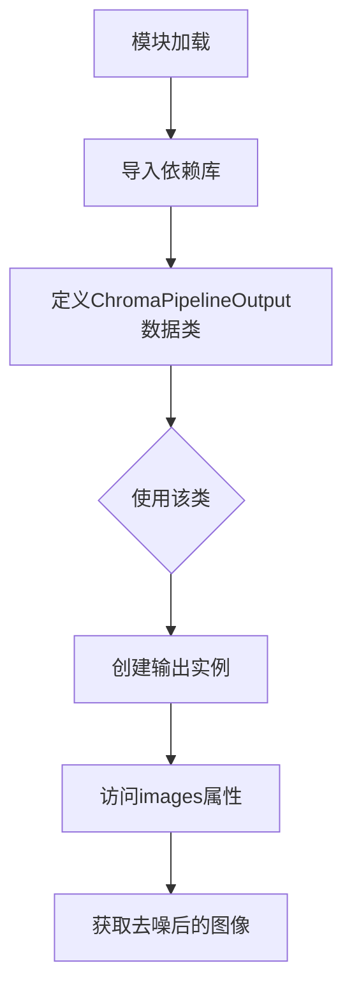

# `diffusers\src\diffusers\pipelines\chroma\pipeline_output.py` 详细设计文档

这是一个用于存储Stable Diffusion管道输出结果的数据类，封装了去噪后的图像数据，支持PIL图像列表或numpy数组两种格式输出。

## 整体流程



## 类结构

```
BaseOutput (抽象基类/父类)
└── ChromaPipelineOutput (数据类)
```

## 全局变量及字段


### `ChromaPipelineOutput.images`
    
去噪后的图像列表或numpy数组，来源于扩散管道处理结果

类型：`list[PIL.Image.Image] | np.ndarray`
    
    

## 全局函数及方法


## 关键组件


### ChromaPipelineOutput 数据类

用于存储ChromaPipeline（可能是Stable Diffusion变体）推理结果的输出类，封装生成的图像数据，支持PIL图像列表或numpy数组两种格式。

### BaseOutput 基类继承

继承自...utils中的BaseOutput基类，提供统一的输出接口规范，确保与其他Diffusion Pipeline输出类的一致性。

### images 字段

类型为list[PIL.Image.Image] | np.ndarray的图像数据容器，支持两种格式存储——PIL图像列表或numpy数组，兼容批量推理结果。

### 类型联合注解

使用Python 3.10+的联合类型语法（PIL.Image.Image | np.ndarray），实现对多种图像格式的灵活支持。


## 问题及建议


### 已知问题

- **类型注解兼容性问题**：使用 `list[PIL.Image.Image]` 语法（Python 3.9+），未导入 `List` 类型或使用大写形式，兼容性和可读性不足
- **文档字符串语法错误**：描述中存在 "present the denoised images"，应为 "presents"（主谓不一致）
- **字段类型灵活性不足**：使用联合类型 `|` 运算符（Python 3.10+），若项目需兼容更低版本将无法运行
- **缺少默认值和验证机制**：作为输出类，未提供 `None` 默认值或字段验证逻辑，在实际使用中可能导致空值处理问题
- **属性扩展性受限**：仅包含 `images` 字段，未考虑可能需要返回的其他元数据（如 `num_images`、`latents` 等）
- **文档格式不规范**：Args 字段描述使用了过长的行，未遵循项目统一的文档规范

### 优化建议

- 使用 `typing.List` 替代 `list[PIL.Image.Image]`，或显式导入 `from __future__ import annotations`
- 修复文档字符串语法错误，将 "present" 改为 "presents"
- 考虑添加默认值（如 `images: list[PIL.Image.Image] | np.ndarray = None`）并配合字段验证
- 增加更多可选字段以提升扩展性，如 `num_images: int = None`
- 统一文档格式，参考项目其他输出类的文档风格
- 考虑添加 `__post_init__` 方法进行类型或值验证，增强健壮性


## 其它


### 设计目标与约束

ChromaPipelineOutput 作为稳定扩散管道（Stable Diffusion Pipeline）的输出数据容器，其核心设计目标是标准化管道输出结果的数据结构，提供统一的图像输出格式封装。该类遵循数据类（dataclass）的最佳实践，通过类型提示明确 images 字段可以是 PIL.Image 对象列表或 NumPy 数组两种形式，以兼容不同的下游处理需求。设计约束包括：必须继承自 BaseOutput 基类以符合框架统一的输出接口规范；images 字段类型使用 Python 3.10+ 的联合类型语法（list[PIL.Image.Image] | np.ndarray）；禁止在该类中引入业务逻辑，仅作为纯数据容器；序列化兼容性需与 BaseOutput 基类保持一致。

### 错误处理与异常设计

该类本身为纯数据容器，不涉及复杂业务逻辑，因此错误处理主要依赖于类型检查和调用方的验证。调用方在构造 ChromaPipelineOutput 实例时，若传入的 images 参数类型不符合预期（PIL.Image.Image 列表或 np.ndarray），Python 运行时将抛出 TypeError。建议调用方在实例化前进行类型预校验，可通过 isinstance 函数检查 images 的实际类型：isinstance(images, list) 用于检查 PIL 图像列表，isinstance(images, np.ndarray) 用于检查 NumPy 数组。若 images 为列表，还应进一步验证列表中每个元素是否为 PIL.Image.Image 实例。对于继承自 BaseOutput 的潜在异常处理机制，应遵循基类定义的异常传播规则。

### 数据流与状态机

ChromaPipelineOutput 在数据流中处于管道输出的末端位置，接收来自扩散模型去噪处理后的图像数据。其数据流路径为：扩散模型推理生成图像数据 → 后处理模块（如 VAE 解码器）→ ChromaPipelineOutput 封装 → 返回给调用方或写入存储。该类本身不维护状态，仅作为不可变数据容器（dataclass 默认行为），确保输出结果在传递过程中的数据完整性。状态机方面，该类不涉及状态转换，其生命周期为：实例化（填充 images 数据）→ 传递（作为函数返回值或对象属性）→ 消费（调用方读取 images 属性）。建议调用方将 ChromaPipelineOutput 视为快照式的输出结果，避免在创建后修改其内容。

### 外部依赖与接口契约

ChromaPipelineOutput 依赖以下外部组件：BaseOutput 基类（来自 ...utils 模块），定义了管道输出的基础接口规范，包含通用的输出属性和序列化方法；PIL.Image 模块（Python Imaging Library / Pillow），提供图像对象的类型定义；NumPy（np），提供数组类型的支持。接口契约方面，该类必须提供 images 属性供外部读取，images 的类型必须符合类型提示的定义。调用方与该类的契约为：调用方负责提供符合类型要求的 images 数据，该类负责按照 dataclass 规范提供数据存储和访问能力。若 BaseOutput 基类定义了特定方法（如 to_dict、to_json 等），ChromaPipelineOutput 应继承或重写这些方法以保持一致性。

### 性能考虑

由于 ChromaPipelineOutput 仅作为数据容器，其本身的性能开销极低，主要性能考量集中在 images 字段的内存占用和管理。若 images 为大型 NumPy 数组或高分辨率 PIL 图像列表，内存占用可能成为瓶颈。建议调用方在不需要保留原始数据时及时释放引用以协助垃圾回收。若该类被大量实例化（如批处理场景），可考虑使用 __slots__ 优化内存：定义 __slots__ = ('images',) 可减少每个实例的内存开销。对于图像数据的深拷贝与浅拷贝，应明确文档说明该类的拷贝行为（dataclass 默认使用浅拷贝），若调用方需要独立的图像副本，应在传入前自行进行深拷贝。

### 安全性考虑

ChromaPipelineOutput 本身不涉及敏感操作，安全性考量主要集中在图像数据的处理环节。若 images 包含从外部来源加载的图像，应在管道入口处进行图像安全性验证（如检查图像尺寸是否合理、是否包含恶意编码等）。由于该类接受 PIL.Image.Image 或 np.ndarray 两种类型，若通过反序列化（如从文件加载）创建实例，应验证反序列化数据的来源和完整性，防止通过构造恶意对象进行攻击。dataclass 装饰器生成的 __init__、__repr__、__eq__ 等方法不会引入额外安全风险，但建议避免在该类中存储敏感信息。

### 兼容性考虑

该类的兼容性考虑包括 Python 版本兼容性、依赖库版本兼容性和框架兼容性三个方面。Python 版本方面，由于使用了 list[PIL.Image.Image] | np.ndarray 的联合类型语法（PEP 604），需要 Python 3.10 及以上版本；若需支持更低版本 Python，应使用 Union 写法：Union[List[PIL.Image.Image], np.ndarray]。依赖库兼容性方面，需要确认 PIL（Pillow）和 NumPy 的版本兼容性，其中 Pillow 需支持 Python 3.10+，NumPy 无特殊版本要求。框架兼容性方面，ChromaPipelineOutput 需与 diffusers 框架的管道输出类体系保持兼容，若框架版本升级导致 BaseOutput 接口变化，该类可能需要相应调整。

### 测试策略

针对 ChromaPipelineOutput 的测试应覆盖以下方面：实例化测试，验证可以使用 PIL 图像列表和 NumPy 数组两种方式成功创建实例；类型验证测试，使用 isinstance 检查实例的 images 属性类型是否符合预期；属性访问测试，验证 images 属性可正确读取且返回原始传入数据；相等性测试，验证两个具有相同 images 数据的实例相等（dataclass 自动生成 __eq__）；基类继承测试，验证该类正确继承自 BaseOutput 并能调用基类方法；序列化测试（若 BaseOutput 提供序列化能力），验证 to_dict 或 to_json 方法能正确处理该类实例。建议使用 pytest 框架编写单元测试，测试用例应覆盖正常场景和边界场景（如空列表、单一图像等）。

### 配置管理

ChromaPipelineOutput 本身不涉及配置管理，其为固定结构的输出类。若存在配置需求（如图像输出格式、尺寸限制等），这些配置应在管道层面管理，而非该类内部。该类应保持无状态特性，不读取任何配置文件或环境变量。若未来需要扩展该类的行为（如添加输出格式转换选项），建议通过继承或组合模式扩展，而非直接修改该类，以保持向后兼容性和单一职责原则。

### 版本演进

基于当前设计，ChromaPipelineOutput 的潜在演进方向包括：添加新字段以支持更多输出信息（如元数据、生成参数等），例如添加 prompt、seed 等字段，需注意向后兼容性和默认值设计；类型扩展以支持更多图像格式，如添加对 torch.Tensor 的支持（需引入 PyTorch 依赖）；添加方法以支持数据转换，如添加 to_pil_list、to_numpy 等便捷方法；性能优化版本，如使用 __slots__ 减少内存占用，或添加懒加载机制处理大型图像数据。任何版本演进都应遵循语义化版本号规范（SemVer），并更新相应的文档和测试用例。

    