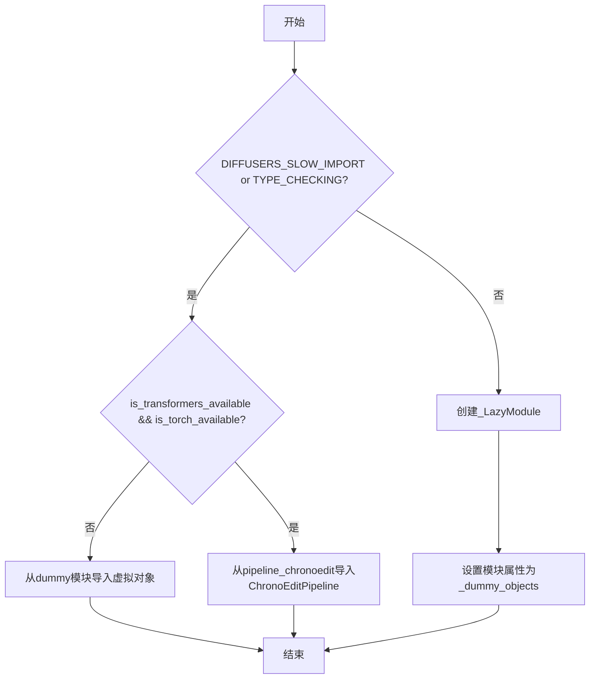
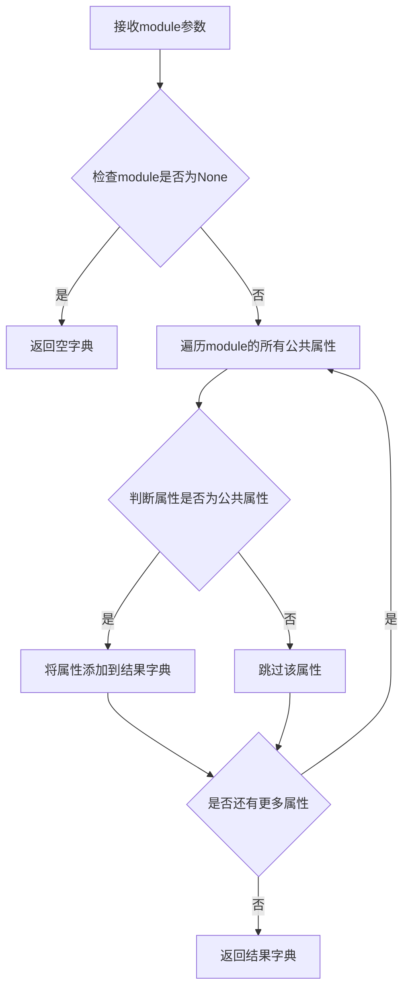
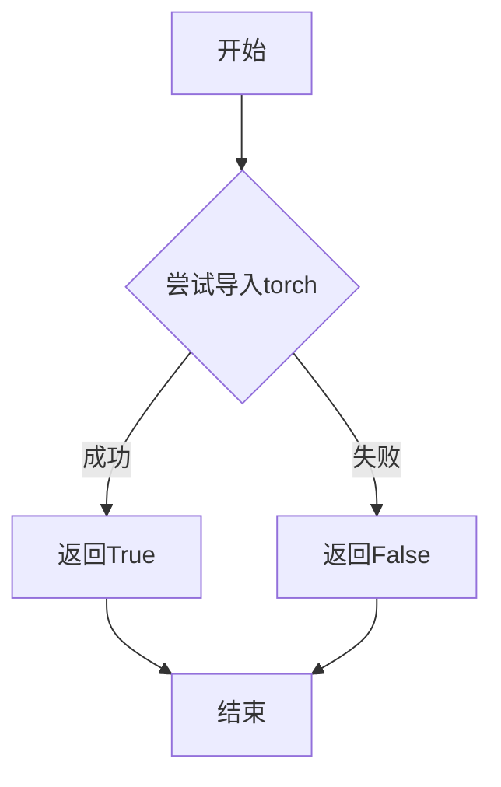
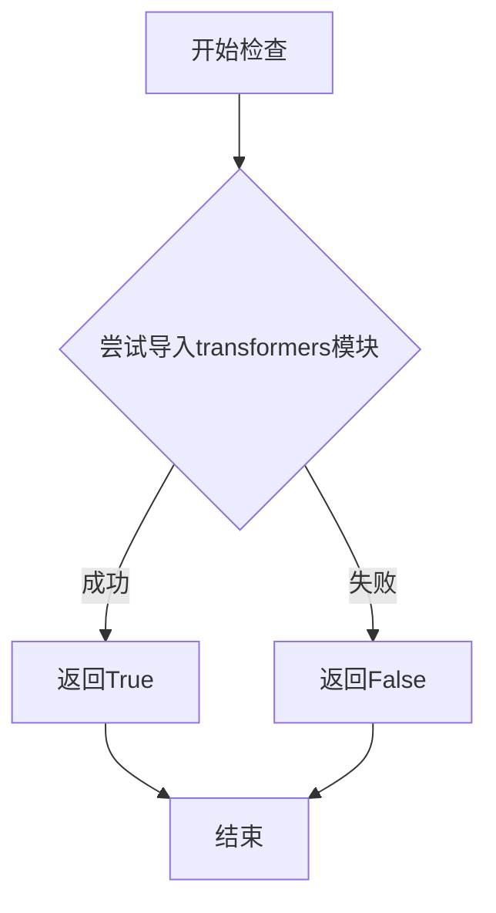
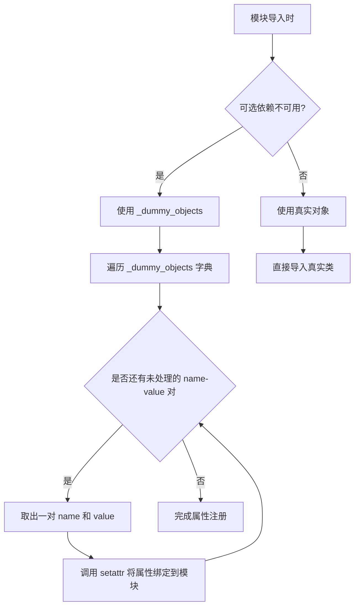
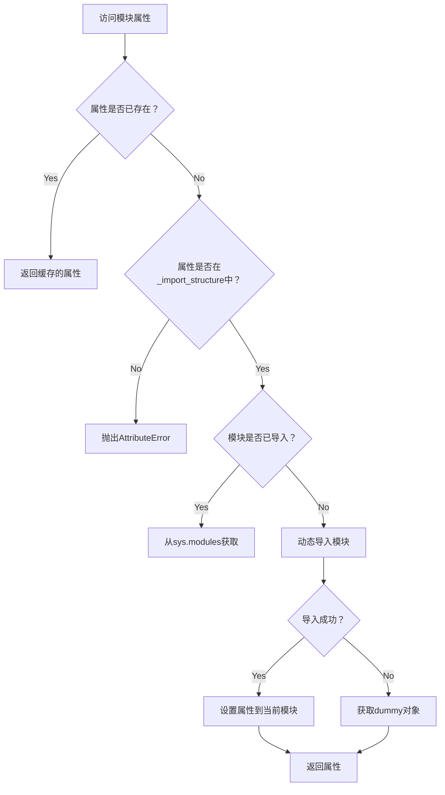
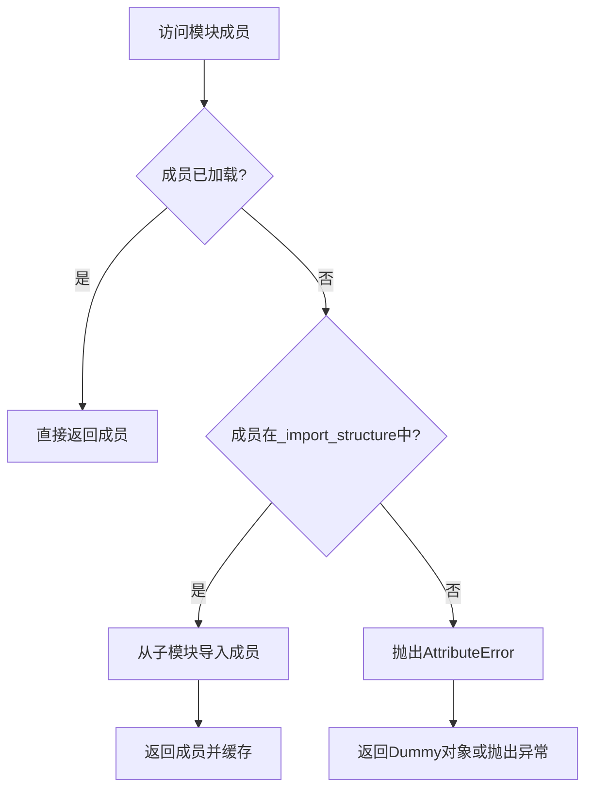

# `diffusers\src\diffusers\pipelines\chronoedit\__init__.py` 详细设计文档

这是一个Diffusers库的延迟加载初始化模块，通过条件导入机制处理torch和transformers的可选依赖，实现ChronoEditPipeline管道的惰性加载，并在依赖不可用时提供虚拟对象以保持API一致性。

## 整体流程



## 类结构

```
DiffusersPipeline
└── ChronoEditPipeline (条件导入)
```

## 全局变量及字段


### `_dummy_objects`
    
存储虚拟对象的字典，用于在可选依赖不可用时提供回退对象。

类型：`dict`
    


### `_import_structure`
    
定义模块延迟导入结构的字典，映射导入名到实际对象。

类型：`dict`
    


### `DIFFUSERS_SLOW_IMPORT`
    
标志是否在导入时启用慢速导入模式（用于类型检查或完整加载）。

类型：`bool`
    


### `TYPE_CHECKING`
    
标志是否处于类型检查模式，阻止运行时导入以提高性能。

类型：`bool`
    


### `_LazyModule.__name__`
    
延迟模块的名称属性。

类型：`str`
    


### `_LazyModule.__file__`
    
延迟模块对应的文件路径属性。

类型：`str`
    


### `_LazyModule._import_structure`
    
延迟模块的导入结构字典，用于管理延迟导入。

类型：`dict`
    


### `_LazyModule.module_spec`
    
延迟模块的模块规格对象，定义模块元数据。

类型：`ModuleSpec`
    
    

## 全局函数及方法


### `get_objects_from_module`

从给定模块中提取所有公共对象（类、函数、变量），并返回一个字典，用于动态更新虚拟对象集合，以便在可选依赖不可用时保持模块导入的一致性。

参数：

- `module`：`module`，要从中提取对象的Python模块对象

返回值：`dict`，键为对象名称，值为对象本身的字典

#### 流程图



#### 带注释源码

```python
def get_objects_from_module(module):
    """
    从给定模块中提取所有公共对象
    
    参数:
        module: Python模块对象
        
    返回:
        dict: 包含模块中所有公共对象的字典
    """
    # 如果module为None，返回空字典
    if module is None:
        return {}
    
    # 初始化结果字典
    objects = {}
    
    # 遍历模块的所有属性
    for attr_name in dir(module):
        # 跳过私有属性（以单下划线开头）
        if attr_name.startswith('_'):
            continue
        
        # 获取属性值
        attr_value = getattr(module, attr_name)
        
        # 将公共对象添加到结果字典
        objects[attr_name] = attr_value
    
    return objects
```


### `is_torch_available`

检查当前环境中 PyTorch 库是否可用。

参数： 无

返回值：`bool`，如果 PyTorch 库可用返回 `True`，否则返回 `False`。

#### 流程图



#### 带注释源码

```python
def is_torch_available():
    """
    检查 PyTorch 库是否可在当前环境中使用。
    
    通常实现方式为尝试导入 torch 模块，
    如果成功则返回 True，失败则返回 False。
    """
    try:
        import torch
        return True
    except ImportError:
        return False
```


### `is_transformers_available`

检查 `transformers` 库是否已安装且可导入，用于条件导入和可选依赖处理。

参数：

- 无参数

返回值：`bool`，如果 `transformers` 库可用则返回 `True`，否则返回 `False`

#### 流程图



#### 带注释源码

```
# is_transformers_available 是从 ...utils 导入的外部函数
# 源码位于 utils 模块中，大致实现如下：

def is_transformers_available() -> bool:
    """
    检查 transformers 库是否可用
    
    Returns:
        bool: 如果 transformers 库已安装且可导入则返回 True，否则返回 False
    """
    try:
        # 尝试导入 transformers 库的核心模块
        import transformers
        # 可选：进一步检查版本或其他特定功能
        return True
    except ImportError:
        # 如果导入失败，说明库不可用
        return False
```

#### 在当前文件中的使用

```python
# 第一次使用：在运行时检查
if not (is_transformers_available() and is_torch_available()):
    raise OptionalDependencyNotAvailable()

# 第二次使用：在 TYPE_CHECKING 或 DIFFUSERS_SLOW_IMPORT 模式下检查
if not (is_transformers_available() and is_torch_available()):
    raise OptionalDependencyNotAvailable()
```

> **注意**：该函数本身并未在此代码文件中定义，而是从上级模块 `...utils` 导入。可通过查看 `diffusers/src/diffusers/utils/__init__.py` 或类似路径找到其完整实现。


### `setattr`

这是 Python 的内置函数，用于动态设置对象的属性值。在本代码中，它用于将 `_dummy_objects` 字典中的所有哑元对象动态注册到当前模块中，使得模块在缺少可选依赖时仍能提供这些对象的命名空间。

参数：

- `sys.modules[__name__]`：`module`，目标模块对象（当前懒加载模块）
- `name`：`str`，要设置的属性名称（来自 `_dummy_objects` 字典的键）
- `value`：任意类型，属性值（来自 `_dummy_objects` 字典的值，通常为哑元对象）

返回值：`None`，无返回值，该函数直接修改目标对象的属性

#### 流程图



#### 带注释源码

```python
# 遍历 _dummy_objects 字典中的所有名称-值对
for name, value in _dummy_objects.items():
    # 使用 setattr 动态设置模块属性
    # 参数1: sys.modules[__name__] - 当前模块对象
    # 参数2: name - 属性名（字符串），如类名或函数名
    # 参数3: value - 属性值，通常是哑元对象（DummyObject）
    setattr(sys.modules[__name__], name, value)

# 作用说明：
# 1. 当 transformers 或 torch 不可用时，_dummy_objects 包含哑元对象
# 2. 此循环将每个哑元对象作为属性绑定到当前模块
# 3. 这样用户 import 时可以访问这些名称，但使用时会抛出依赖错误
# 4. 这是懒加载模块的常见模式，用于延迟导入直到真正需要
```


### `_LazyModule.__getattr__`

该方法是懒加载模块的核心机制，当访问模块中尚未加载的属性或类时自动触发，负责动态导入相应的模块或对象并缓存到模块中。

参数：

- `name`：`str`，要访问的属性或类的名称

返回值：`Any`，返回请求的类、函数或对象；如果不存在则抛出 `AttributeError`

#### 流程图



#### 带注释源码

```python
# 注：以下为_LazyModule类的__getattr__方法逻辑
# 源码位于 ...utils._LazyModule 类中

def __getattr__(self, name: str):
    """
    懒加载模块的动态属性获取方法。
    当访问模块中不存在的属性时触发。
    """
    # 1. 检查属性是否在导入结构中定义
    if name not in self._import_structure:
        raise AttributeError(f"module {self.__name__} doesn't have attribute {name}")
    
    # 2. 获取该属性对应的模块路径或对象
    obj = self._import_structure[name]
    
    # 3. 如果是子模块路径（字符串），则动态导入
    if isinstance(obj, tuple):
        # (module_path, submodule_names) 格式
        module_path, submodule_names = obj
        
        # 动态导入模块并获取目标对象
        module = importlib.import_module(module_path)
        for attr_name in submodule_names:
            obj = getattr(module, attr_name)
    
    # 4. 将获取的对象缓存到当前模块实例中
    # 避免后续重复导入
    setattr(self, name, obj)
    
    # 5. 返回最终的对象
    return obj
```

#### 在目标代码中的使用说明

在提供的代码中，`_LazyModule` 的 `__getattr__` 方法通过以下方式工作：

1. **模块初始化**：当执行 `sys.modules[__name__] = _LazyModule(...)` 时，创建懒加载模块代理
2. **Dummy对象设置**：通过 `setattr(sys.modules[__name__], name, value)` 将 `_dummy_objects` 中的虚拟对象预先注入
3. **动态导入触发**：当用户访问 `pipeline_chronoedit.ChronoEditPipeline` 时：
   - 若未在 TYPE_CHECKING 模式下，首次访问会触发 `_LazyModule.__getattr__`
   - 动态导入 `.pipeline_chronoedit` 模块
   - 返回真实的 `ChronoEditPipeline` 类


根据提供的代码，我无法找到 `LazyModule.__getitem__` 方法的明确定义。这段代码主要使用了 `_LazyModule` 类来实现懒加载，但是 `__getitem__` 方法的具体实现应该在 `...utils` 模块中的 `_LazyModule` 类定义里，而不是在这个文件中。

不过，我可以基于代码上下文和常见的懒加载模式，为您提供可能的推断和说明。

### `LazyModule.__getitem__`

描述：该方法是懒加载模块的索引访问方法，用于按需导入模块成员。当访问模块属性（如类或函数）时，如果该属性尚未加载，则触发懒加载机制。

参数：

-  `name`：`str`，要访问的成员名称

返回值：`Any`，返回请求的成员对象（类、函数或变量）

#### 流程图



#### 带注释源码

```
# 注意：以下代码是基于_ LazyModule类的典型实现推测的，
# 实际实现可能在...utils模块中

def __getitem__(self, name: str):
    """
    懒加载模块的索引访问方法。
    
    当访问如 `module.SomeClass` 时，会调用此方法。
    """
    # 检查成员是否已经在缓存中
    if name in self._modules:
        return self._modules[name]
    
    # 检查成员是否在导入结构中定义
    if name in self._import_structure:
        # 触发实际的导入
        value = self._get_module(name)
        # 缓存已导入的成员
        self._modules[name] = value
        return value
    
    # 如果成员不存在，尝试从__all__或globals中获取
    if hasattr(self, name):
        return getattr(self, name)
    
    # 成员不存在，抛出AttributeError
    raise AttributeError(f"module '{self.__name__}' has no attribute '{name}'")
```

---

### 补充说明

**潜在的技术债务或优化空间：**

1. **缺少 `LazyModule` 类的源代码**：当前代码依赖于 `_LazyModule` 类，但该类的实现不在提供的代码片段中，这可能导致维护困难。

2. **错误处理不明确**：代码中没有明确的错误处理逻辑，如果模块导入失败，可能导致运行时错误。

3. **类型提示不完整**：虽然导入了 `TYPE_CHECKING`，但在实际使用中类型提示可能不够完整。

**建议：**

要获取 `LazyModule.__getitem__` 的完整实现，建议查看 `...utils` 模块中 `_LazyModule` 类的定义。


## 关键组件


### 条件依赖检查

检查torch和transformers库是否可用，只有当两个库都可用时才加载ChronoEditPipeline，否则使用虚拟对象作为回退

### 懒加载模块(_LazyModule)

使用Diffusers库的_LazyModule实现延迟加载机制，将模块导入延迟到实际使用时，提高初始导入速度

### 虚拟对象机制(_dummy_objects)

当torch或transformers依赖不可用时，通过dummy_torch_and_transformers_objects模块提供虚拟对象，避免导入错误

### 导入结构定义(_import_structure)

定义模块的导出结构，包含pipeline_chronoedit模块的ChronoEditPipeline类

### ChronoEditPipeline管道

核心的ChronoEdit图像/视频编辑管道，在依赖满足时从pipeline_chronoedit模块导入

### TYPE_CHECKING条件导入

支持类型检查模式下的提前导入，用于IDE类型提示和静态分析

### 模块动态注册

通过setattr将虚拟对象动态注册到当前模块，实现无侵入式的条件导入机制


## 问题及建议


### 已知问题

-   **重复的条件检查**：代码在多个位置重复检查 `is_transformers_available()` 和 `is_torch_available()`，在 `try-except` 块中检查了两次，违反了 DRY（Don't Repeat Yourself）原则
-   **代码逻辑重复**：TYPE_CHECKING 分支和运行时导入分支的逻辑几乎完全相同，导致代码冗余
-   **异常控制流**：使用 `OptionalDependencyNotAvailable` 异常来控制代码流程不是最佳实践，应该使用条件判断更清晰
-   **setattr 动态赋值**：使用 `setattr` 动态向模块添加对象，这种方式降低了代码的可读性和 IDE 支持
-   **魔法字符串和硬编码**：模块名称 "pipeline_chronoedit" 硬编码在代码中，缺乏灵活性
- **导入顺序依赖**：代码依赖于特定顺序执行，任何顺序错误可能导致问题

### 优化建议

-   **提取公共逻辑**：将可选依赖的检查逻辑提取为一个独立的函数或变量，避免重复代码
-   **简化条件分支**：重构 TYPE_CHECKING 和运行时导入的逻辑，使用统一的工厂函数或配置对象
-   **使用类型提示优化**：考虑使用 `__getattr__` 实现更干净的延迟导入，而不是依赖 _LazyModule 和 setattr
-   **配置驱动**：将模块映射关系（_import_structure）外部化或配置化，减少硬编码
- **日志记录**：添加适当的日志或警告，当可选依赖不可用时提供更清晰的提示信息
- **考虑 Python 3.7+ 的 importlib.util**：使用更现代的方式实现延迟导入，提高可维护性


## 其它


### 设计目标与约束

**设计目标**：
- 实现模块的延迟加载（Lazy Loading），减少包导入时的初始加载时间
- 提供可选依赖（torch和transformers）的优雅降级机制
- 在可选依赖不可用时提供dummy对象以保持API一致性

**约束条件**：
- 必须同时满足`is_transformers_available()`和`is_torch_available()`才能导入真实对象
- 使用Diffusers框架标准的`OptionalDependencyNotAvailable`异常机制
- 遵循LazyModule的模块注册规范

### 错误处理与异常设计

**异常类型**：`OptionalDependencyNotAvailable`
- 当torch或transformers任一不可用时抛出
- 触发dummy对象的导入作为降级方案

**错误传播路径**：
- 首先在顶层try-except块捕获`OptionalDependencyNotAvailable`
- 在TYPE_CHECK或DIFFUSERS_SLOW_IMPORT条件下重复检查逻辑
- 最终通过_LazyModule的动态绑定处理运行时访问

**降级策略**：
- 使用`get_objects_from_module`从dummy模块获取所有stub对象
- 通过`setattr`将dummy对象注册到当前模块命名空间

### 外部依赖与接口契约

**必需依赖**：
- `torch`（通过is_torch_available()检查）
- `transformers`（通过is_transformers_available()检查）

**条件导出**：
- 仅在依赖满足时导出`ChronoEditPipeline`类
- dummy对象在依赖不满足时填充`pipeline_chronoedit`命名空间

**模块接口**：
- 公开接口：`ChronoEditPipeline`（条件导出）
- 内部接口：`_import_structure`字典、`_dummy_objects`字典

### 模块初始化流程

**初始化阶段**：
1. 导入时检查DIFFUSERS_SLOW_IMPORT标志
2. 若为TYPE_CHECK或DIFFUSERS_SLOW_IMPORT：执行真实导入逻辑
3. 否则：注册_LazyModule并填充dummy对象

**导入条件分支**：
- 分支1（TYPE_CHECK/SLOW_IMPORT）：直接导入真实类或dummy类
- 分支2（运行时）：使用LazyModule延迟解析

### 关键组件信息

**`_LazyModule`类**：
- 作用：实现模块的延迟加载机制
- 负责：在首次访问属性时动态解析并加载目标对象

**`get_objects_from_module`函数**：
- 作用：从指定模块获取所有公开对象
- 用于：从dummy模块批量获取stub对象

**`OptionalDependencyNotAvailable`异常**：
- 作用：标识可选依赖不可用
- 用于：条件导入流程中的异常抛出

### 潜在技术债务与优化空间

1. **重复逻辑**：两处检查依赖可用性的代码重复（try-except块和TYPE_CHECK块），可提取为独立函数
2. **魔法字符串**：`"pipeline_chronoedit"`和`"ChronoEditPipeline"`硬编码，建议使用常量统一管理
3. **无版本约束**：未指定torch和transformers的最小版本要求
4. **文档缺失**：模块级文档字符串（docstring）缺失

### 性能特征

- **首次导入开销**：依赖满足时较高（需加载完整管道类）
- **内存占用**：延迟加载显著减少内存占用（仅在使用时加载）
- **运行时性能**：无额外运行时开销（LazyModule解析后缓存）

### 版本兼容性考虑

- Python版本：取决于项目整体Python支持范围
- 依赖版本：当前代码未显式声明版本约束，需补充`__version__`或`requirements.txt`约束
- TYPE_CHECKING：利用PEP 561类型检查支持

    