# `diffusers\src\diffusers\pipelines\chronoedit\pipeline_chronoedit.py` 详细设计文档

ChronoEditPipeline是一个基于Wan模型的图像到视频生成管道,支持基于输入图像和文本提示生成视频,并可选地启用时间推理功能来改善视频帧间的一致性和动态效果。

## 整体流程

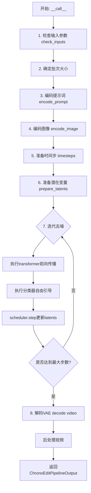

## 类结构

```
DiffusionPipeline (基类)
└── ChronoEditPipeline (继承自DiffusionPipeline, WanLoraLoaderMixin)
    ├── _get_t5_prompt_embeds (编码文本)
    ├── encode_image (编码图像)
    ├── encode_prompt (编码提示词)
    ├── check_inputs (验证输入)
    ├── prepare_latents (准备潜在变量)
    └── __call__ (主生成方法)
```

## 全局变量及字段


### `XLA_AVAILABLE`
    
标志位，表示torch_xla是否可用，用于支持TPU/XLA设备加速

类型：`bool`
    


### `logger`
    
模块级日志记录器，用于输出调试和信息日志

类型：`logging.Logger`
    


### `EXAMPLE_DOC_STRING`
    
包含ChronoEditPipeline使用示例的文档字符串

类型：`str`
    


### `ChronoEditPipeline.ChronoEditPipeline.vae_scale_factor_temporal`
    
VAE时间维度的缩放因子，用于视频帧数与潜在空间帧数的转换

类型：`int`
    


### `ChronoEditPipeline.ChronoEditPipeline.vae_scale_factor_spatial`
    
VAE空间维度的缩放因子，用于图像尺寸与潜在空间尺寸的转换

类型：`int`
    


### `ChronoEditPipeline.ChronoEditPipeline.video_processor`
    
视频处理器实例，负责视频的预处理和后处理操作

类型：`VideoProcessor`
    


### `ChronoEditPipeline.ChronoEditPipeline.image_processor`
    
CLIP图像处理器，用于对输入图像进行预处理以供图像编码器使用

类型：`CLIPImageProcessor`
    


### `ChronoEditPipeline.ChronoEditPipeline._guidance_scale`
    
分类器自由引导(CFG)尺度参数，控制文本提示对生成结果的影响程度

类型：`float`
    


### `ChronoEditPipeline.ChronoEditPipeline._attention_kwargs`
    
注意力机制的可选参数字典，用于自定义注意力处理逻辑

类型：`dict[str, Any]`
    


### `ChronoEditPipeline.ChronoEditPipeline._current_timestep`
    
当前去噪迭代的时间步，用于跟踪生成进度

类型：`int | None`
    


### `ChronoEditPipeline.ChronoEditPipeline._interrupt`
    
中断标志位，用于在去噪循环中优雅地停止生成过程

类型：`bool`
    


### `ChronoEditPipeline.ChronoEditPipeline._num_timesteps`
    
总的时间步数量，记录去噪过程的总迭代次数

类型：`int`
    


### `ChronoEditPipeline.ChronoEditPipeline.model_cpu_offload_seq`
    
模型CPU卸载序列，定义各模型组件在推理后的卸载顺序

类型：`str`
    


### `ChronoEditPipeline.ChronoEditPipeline._callback_tensor_inputs`
    
回调函数可访问的张量输入名称列表，用于步骤结束时的回调处理

类型：`list[str]`
    
    

## 全局函数及方法


### `basic_clean`

该函数用于对文本进行基本清理处理，通过修复文本编码问题、处理 HTML 实体转义以及去除首尾空白来规范化输入文本。

参数：

- `text`：`str`，需要清理的原始文本

返回值：`str`，清理处理后的文本

#### 流程图

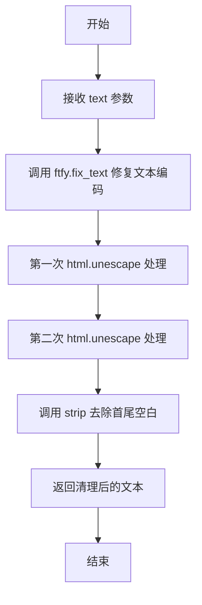

#### 带注释源码

```
def basic_clean(text):
    # 第一步：使用 ftfy 库修复文本中的编码问题
    # ftfy 可以自动检测并修复常见的文本编码错误，如 UTF-8 编码错误、MojiBake 问题等
    text = ftfy.fix_text(text)
    
    # 第二步：使用 html.unescape 转换 HTML 实体为对应字符
    # 调用两次是为了处理嵌套的 HTML 实体编码情况
    # 例如：&amp;lt; 会先被转换为 &lt;，再被转换为 <
    text = html.unescape(html.unescape(text))
    
    # 第三步：去除文本首尾的空白字符（包括空格、换行、制表符等）
    # 并返回清理后的结果
    return text.strip()
```


### `whitespace_clean`

该函数是一个文本预处理工具函数，通过正则表达式将文本中连续的多个空白字符压缩为单个空格，并去除文本首尾的空白字符，用于清理和标准化文本格式。

参数：

- `text`：`str`，需要清理的原始文本输入

返回值：`str`，清理并标准化后的文本字符串

#### 流程图

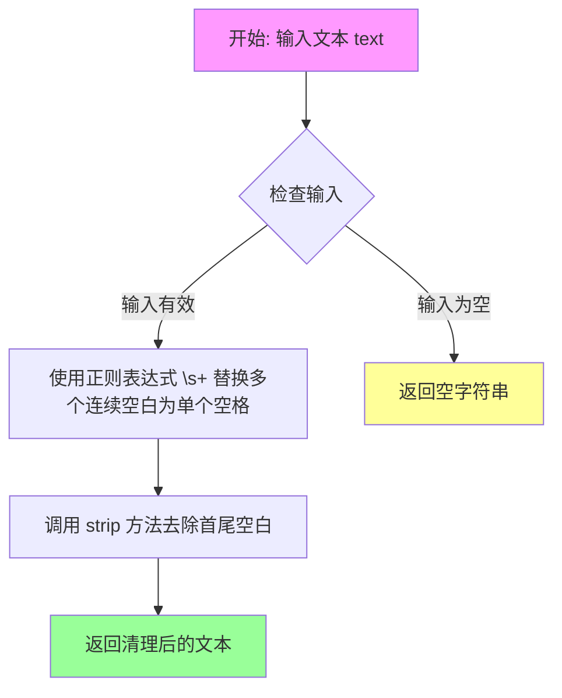

#### 带注释源码

```python
def whitespace_clean(text):
    """
    清理文本中的多余空白字符。
    
    该函数执行两步处理：
    1. 使用正则表达式将连续多个空白字符（空格、制表符、换行符等）替换为单个空格
    2. 去除文本首尾的空白字符
    
    Args:
        text: 输入的原始字符串
        
    Returns:
        清理后的字符串，多余空白已被规范化为单个空格
    """
    # 使用正则表达式 \s+ 匹配一个或多个空白字符，替换为单个空格 " "
    text = re.sub(r"\s+", " ", text)
    # 去除字符串首尾的空白字符
    text = text.strip()
    return text
```

---

#### 关键组件信息

- **正则表达式 `\s+`**：匹配一个或多个空白字符（空格、制表符\t、换行符\n等）的模式
- **`re.sub()` 函数**：Python正则表达式模块的替换函数，将匹配到的内容替换为指定字符串
- **`str.strip()` 方法**：Python字符串方法，去除字符串首尾的空白字符

#### 潜在的技术债务或优化空间

1. **未处理 None 输入**：如果传入 `None` 会抛出 `TypeError`，建议添加空值检查
2. **正则表达式编译**：如果该函数在循环中频繁调用，可以预先编译正则表达式 `re.compile(r"\s+", text)` 以提高性能
3. **Unicode 空白字符**：当前正则可能未覆盖所有 Unicode 空白字符（如不间断空格 \u00A0），可根据需求扩展

#### 其它项目

- **设计目标**：提供一个轻量级的文本清理工具，用于标准化用户输入或外部文本数据
- **错误处理**：当前版本未实现显式错误处理，依赖于 Python 内置异常
- **外部依赖**：仅依赖 Python 标准库 `regex` 或 `re` 模块
- **调用场景**：该函数被 `prompt_clean()` 函数调用，作为文本预处理管道的一部分，用于清理进入扩散模型的提示词


### `prompt_clean`

对文本进行清洗的函数，首先使用 `basic_clean` 进行基本的文本修复（如修复 HTML 实体、修复 Unicode 问题），然后使用 `whitespace_clean` 清理多余的空白字符。

参数：

- `text`：`str`，需要清洗的原始文本

返回值：`str`，清洗处理后的文本

#### 流程图

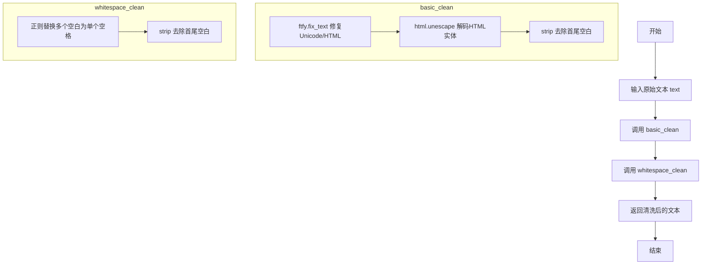

#### 带注释源码

```python
def prompt_clean(text):
    """
    对文本进行清洗处理。
    
    清洗流程：
    1. basic_clean: 使用 ftfy 修复文本中的 Unicode/HTML 问题
    2. whitespace_clean: 清理多余的空白字符
    
    Args:
        text: 需要清洗的原始文本字符串
        
    Returns:
        清洗处理后的文本字符串
    """
    # 第一步：基本清洗
    # 1. ftfy.fix_text - 修复常见的 Unicode 编码问题
    # 2. html.unescape (两次) - 解码 HTML 实体，如 &amp; -> &, &lt; -> <
    # 3. strip - 去除首尾空白字符
    text = basic_clean(text)
    
    # 第二步：空白字符清洗
    # 1. 正则表达式 \s+ 匹配一个或多个空白字符
    # 2. 替换为单个空格 " "
    # 3. strip 去除最终的首尾空白
    text = whitespace_clean(text)
    
    return text


def basic_clean(text):
    """
    基本文本清洗：修复 Unicode 问题和 HTML 实体编码。
    
    Args:
        text: 输入文本
        
    Returns:
        清洗后的文本
    """
    # 使用 ftfy 库修复文本中的编码问题（如 Mojibake 现象）
    text = ftfy.fix_text(text)
    # 两次调用 html.unescape 确保所有 HTML 实体都被解码
    text = html.unescape(html.unescape(text))
    # 去除首尾空白字符
    return text.strip()


def whitespace_clean(text):
    """
    空白字符清洗：将多个连续空白字符替换为单个空格。
    
    Args:
        text: 输入文本
        
    Returns:
        处理后的文本
    """
    # 使用正则表达式将一个或多个空白字符替换为单个空格
    text = re.sub(r"\s+", " ", text)
    # 去除首尾空白
    text = text.strip()
    return text
```


### `retrieve_latents`

该函数是一个工具函数，用于从变分自编码器（VAE）的编码器输出中提取潜在变量。它根据 `sample_mode` 参数的值，从潜在分布中采样（sample）或取众数（argmax），或者直接返回预存的潜在变量。这是 ChronoEditPipeline 中处理图像到视频生成时获取潜在表示的关键函数。

参数：

- `encoder_output`：`torch.Tensor`，编码器输出对象，包含 `latent_dist` 属性（潜在分布）或 `latents` 属性（预存潜在变量）
- `generator`：`torch.Generator | None`，可选的随机数生成器，用于从潜在分布中采样时控制随机性
- `sample_mode`：`str`，采样模式，值为 "sample"（从分布采样）或 "argmax"（取分布的众数）

返回值：`torch.Tensor`，从编码器输出中提取的潜在变量张量

#### 流程图

```mermaid
flowchart TD
    A[开始: retrieve_latents] --> B{encoder_output 是否有 latent_dist 属性?}
    B -- 是 --> C{sample_mode == 'sample'?}
    B -- 否 --> D{encoder_output 是否有 latents 属性?}
    C -- 是 --> E[返回 latent_dist.sample<br/>(使用 generator)]
    C -- 否 --> F{sample_mode == 'argmax'?}
    D -- 是 --> G[返回 encoder_output.latents]
    D -- 否 --> H[抛出 AttributeError]
    F -- 是 --> I[返回 latent_dist.mode<br/>()]
    F -- 否 --> J[返回 encoder_output.latents]
    
    E --> K[结束]
    G --> K
    I --> K
    J --> K
    H --> K
```

#### 带注释源码

```
# 从 diffusers.pipelines.stable_diffusion.pipeline_stable_diffusion_img2img.retrieve_latents 复制
def retrieve_latents(
    encoder_output: torch.Tensor,          # 编码器输出，包含潜在分布或潜在变量
    generator: torch.Generator | None = None,  # 随机数生成器，用于采样控制
    sample_mode: str = "sample"           # 采样模式：'sample' 或 'argmax'
):
    """
    从编码器输出中提取潜在变量。
    
    该函数支持三种提取方式：
    1. 从潜在分布中采样（sample_mode='sample'）
    2. 从潜在分布中取众数（sample_mode='argmax'）
    3. 直接返回预存的潜在变量（latents 属性）
    
    参数:
        encoder_output: 编码器输出对象，应包含 latent_dist 或 latents 属性
        generator: 可选的随机数生成器，用于采样时控制随机性
        sample_mode: 采样模式，'sample' 表示从分布采样，'argmax' 表示取众数
    
    返回:
        潜在变量张量
    
    异常:
        AttributeError: 当 encoder_output 既没有 latent_dist 也没有 latents 属性时抛出
    """
    
    # 检查编码器输出是否有 latent_dist 属性，且采样模式为 sample
    if hasattr(encoder_output, "latent_dist") and sample_mode == "sample":
        # 从潜在分布中采样，使用 generator 控制随机性
        return encoder_output.latent_dist.sample(generator)
    
    # 检查编码器输出是否有 latent_dist 属性，且采样模式为 argmax
    elif hasattr(encoder_output, "latent_dist") and sample_mode == "argmax":
        # 返回潜在分布的众数（最大概率对应的值）
        return encoder_output.latent_dist.mode()
    
    # 检查编码器输出是否有预存的 latents 属性
    elif hasattr(encoder_output, "latents"):
        # 直接返回预存的潜在变量
        return encoder_output.latents
    
    # 如果都不满足，抛出属性错误
    else:
        raise AttributeError("Could not access latents of provided encoder_output")
```


### `ChronoEditPipeline.__init__`

该方法是 `ChronoEditPipeline` 类的构造函数，负责初始化图像到视频生成管道所需的所有组件，包括分词器、文本编码器、图像编码器、变换器、VAE、调度器以及图像处理器等，并注册这些模块同时配置 VAE 的时空缩放因子和视频处理器。

参数：

- `tokenizer`：`AutoTokenizer`，T5 分词器，用于将文本 prompt 转换为 token 序列
- `text_encoder`：`UMT5EncoderModel`，T5 文本编码器模型，将文本 token 编码为文本嵌入
- `image_encoder`：`CLIPVisionModel`，CLIP 视觉编码器模型，用于编码输入图像
- `image_processor`：`CLIPImageProcessor`，CLIP 图像预处理器，用于处理输入图像
- `transformer`：`ChronoEditTransformer3DModel`，ChronoEdit 3D 变换器模型，用于去噪潜在表示
- `vae`：`AutoencoderKLWan`，Wan VAE 模型，用于编码和解码视频潜在表示
- `scheduler`：`FlowMatchEulerDiscreteScheduler`，流匹配欧拉离散调度器，用于去噪过程的时间步调度

返回值：`None`，构造函数不返回任何值，仅初始化实例属性

#### 流程图

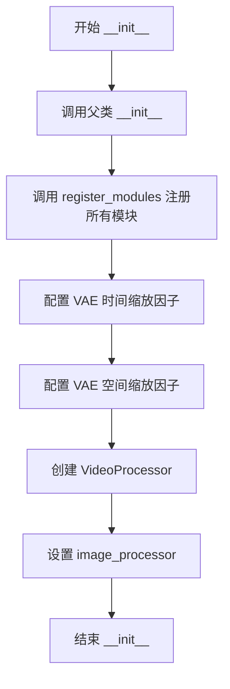

#### 带注释源码

```python
def __init__(
    self,
    tokenizer: AutoTokenizer,
    text_encoder: UMT5EncoderModel,
    image_encoder: CLIPVisionModel,
    image_processor: CLIPImageProcessor,
    transformer: ChronoEditTransformer3DModel,
    vae: AutoencoderKLWan,
    scheduler: FlowMatchEulerDiscreteScheduler,
):
    """
    初始化 ChronoEditPipeline 管道实例。

    参数:
        tokenizer: T5 分词器，用于将文本 prompt 转换为 token 序列
        text_encoder: T5 文本编码器，将文本 token 编码为文本嵌入向量
        image_encoder: CLIP 视觉编码器，用于编码输入图像为图像嵌入
        image_processor: CLIP 图像预处理器，用于预处理输入图像
        transformer: ChronoEdit 3D 变换器模型，执行潜在表示的去噪
        vae: Wan VAE 模型，负责视频的编码和解码
        scheduler: 流匹配调度器，控制去噪过程的噪声调度
    """
    # 调用父类 DiffusionPipeline 和 WanLoraLoaderMixin 的初始化方法
    # 父类负责基础 pipeline 的初始化设置
    super().__init__()

    # 使用 register_modules 方法注册所有子模块
    # 这使得 pipeline 可以统一管理各个组件的设备和 dtype
    self.register_modules(
        vae=vae,
        text_encoder=text_encoder,
        tokenizer=tokenizer,
        image_encoder=image_encoder,
        transformer=transformer,
        scheduler=scheduler,
        image_processor=image_processor,
    )

    # 配置 VAE 的时间缩放因子，用于将帧数映射到潜在空间
    # 如果 vae 存在则从配置中读取，否则使用默认值 4
    self.vae_scale_factor_temporal = self.vae.config.scale_factor_temporal if getattr(self, "vae", None) else 4
    
    # 配置 VAE 的空间缩放因子，用于将图像尺寸映射到潜在空间
    # 如果 vae 存在则从配置中读取，否则使用默认值 8
    self.vae_scale_factor_spatial = self.vae.config.scale_factor_spatial if getattr(self, "vae", None) else 8
    
    # 创建视频处理器，用于视频的预处理和后处理
    # 使用 VAE 空间缩放因子作为参数
    self.video_processor = VideoProcessor(vae_scale_factor=self.vae_scale_factor_spatial)
    
    # 保存图像处理器的引用
    # 用于处理输入图像的预处理
    self.image_processor = image_processor
```


### `ChronoEditPipeline._get_t5_prompt_embeds`

该方法用于将文本提示（prompt）编码为T5文本encoder的隐藏状态（embedding），支持批量处理和每个提示生成多个视频的场景。

参数：

- `self`：`ChronoEditPipeline`实例本身
- `prompt`：`str | list[str]`，需要编码的文本提示，可以是单个字符串或字符串列表
- `num_videos_per_prompt`：`int`，默认值1，每个提示生成的视频数量，用于复制embeddings
- `max_sequence_length`：`int`，默认值512，文本序列的最大长度，超过该长度会被截断
- `device`：`torch.device | None`，可选参数，用于指定计算设备，默认为执行设备
- `dtype`：`torch.dtype | None`，可选参数，用于指定数据类型，默认为text_encoder的数据类型

返回值：`torch.Tensor`，返回编码后的文本embeddings，形状为 `(batch_size * num_videos_per_prompt, seq_len, hidden_dim)`

#### 流程图

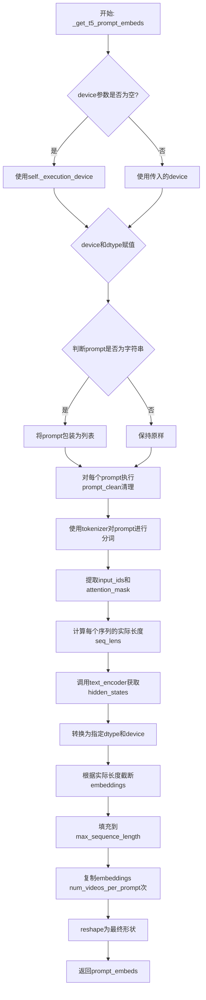

#### 带注释源码

```python
def _get_t5_prompt_embeds(
    self,
    prompt: str | list[str] = None,
    num_videos_per_prompt: int = 1,
    max_sequence_length: int = 512,
    device: torch.device | None = None,
    dtype: torch.dtype | None = None,
):
    """
    将文本提示编码为T5文本encoder的隐藏状态
    
    参数:
        prompt: 要编码的文本提示，字符串或字符串列表
        num_videos_per_prompt: 每个提示生成的视频数量
        max_sequence_length: 最大序列长度
        device: 计算设备
        dtype: 数据类型
    
    返回:
        编码后的文本embeddings张量
    """
    
    # 1. 确定设备：如果未指定，则使用执行设备
    device = device or self._execution_device
    
    # 2. 确定数据类型：如果未指定，则使用text_encoder的数据类型
    dtype = dtype or self.text_encoder.dtype

    # 3. 预处理prompt：统一转换为列表格式
    prompt = [prompt] if isinstance(prompt, str) else prompt
    
    # 4. 对每个prompt进行清理（去除多余空白、修复HTML实体等）
    prompt = [prompt_clean(u) for u in prompt]
    
    # 5. 获取批次大小
    batch_size = len(prompt)

    # 6. 使用tokenizer对prompt进行分词
    # padding="max_length": 填充到最大长度
    # truncation=True: 超过最大长度进行截断
    # add_special_tokens=True: 添加特殊 tokens（如bos/eos）
    # return_attention_mask=True: 返回attention mask
    # return_tensors="pt": 返回PyTorch张量
    text_inputs = self.tokenizer(
        prompt,
        padding="max_length",
        max_length=max_sequence_length,
        truncation=True,
        add_special_tokens=True,
        return_attention_mask=True,
        return_tensors="pt",
    )
    
    # 7. 提取input_ids和attention_mask
    text_input_ids, mask = text_inputs.input_ids, text_inputs.attention_mask
    
    # 8. 计算每个序列的实际长度（非padding部分）
    seq_lens = mask.gt(0).sum(dim=1).long()

    # 9. 调用text_encoder获取hidden states
    # text_encoder返回encoder的最后一层隐藏状态
    prompt_embeds = self.text_encoder(text_input_ids.to(device), mask.to(device)).last_hidden_state
    
    # 10. 转换到指定的dtype和device
    prompt_embeds = prompt_embeds.to(dtype=dtype, device=device)
    
    # 11. 根据实际长度截断embeddings（去除padding部分）
    prompt_embeds = [u[:v] for u, v in zip(prompt_embeds, seq_lens)]
    
    # 12. 重新填充到max_sequence_length（使用zeros填充）
    # 这是为了保持输出形状一致，方便后续处理
    prompt_embeds = torch.stack(
        [torch.cat([u, u.new_zeros(max_sequence_length - u.size(0), u.size(1))]) for u in prompt_embeds], dim=0
    )

    # 13. 为每个prompt生成多个视频复制embeddings
    # duplicate text embeddings for each generation per prompt, using mps friendly method
    _, seq_len, _ = prompt_embeds.shape
    prompt_embeds = prompt_embeds.repeat(1, num_videos_per_prompt, 1)
    
    # 14. reshape为最终形状: (batch_size * num_videos_per_prompt, seq_len, hidden_dim)
    prompt_embeds = prompt_embeds.view(batch_size * num_videos_per_prompt, seq_len, -1)

    # 15. 返回编码后的embeddings
    return prompt_embeds
```


### `ChronoEditPipeline.encode_image`

该方法负责将输入图像编码为图像嵌入向量，供后续的视频生成扩散模型使用。它使用 CLIP 图像编码器提取图像特征，并返回倒数第二层的隐藏状态作为图像条件嵌入。

参数：

- `self`：隐式参数，ChronoEditPipeline 实例本身
- `image`：`PipelineImageInput`，输入的图像，可以是 PIL.Image、torch.Tensor 或图像列表
- `device`：`torch.device | None`，可选参数，指定执行设备，默认为 None（使用 pipeline 的执行设备）

返回值：`torch.Tensor`，图像的隐藏状态嵌入向量（倒数第二层），用于后续扩散模型的图像条件输入

#### 流程图

```mermaid
flowchart TD
    A[开始 encode_image] --> B{device 参数是否为空?}
    B -->|是| C[使用 self._execution_device 作为设备]
    B -->|否| D[使用传入的 device]
    C --> E[调用 image_processor 处理图像]
    D --> E
    E --> F[将图像转换为 PyTorch 张量并移到设备]
    F --> G[调用 image_encoder 编码图像]
    G --> H[设置 output_hidden_states=True 获取所有隐藏状态]
    H --> I[返回倒数第二层隐藏状态 hidden_states[-2]]
    J[结束]
    I --> J
```

#### 带注释源码

```python
# Copied from diffusers.pipelines.wan.pipeline_wan_i2v.WanImageToVideoPipeline.encode_image
def encode_image(
    self,
    image: PipelineImageInput,
    device: torch.device | None = None,
):
    """将输入图像编码为图像嵌入向量
    
    Args:
        image: 输入的图像，支持 PIL.Image、torch.Tensor 或图像列表
        device: 可选的设备参数，如果为 None 则使用 pipeline 的默认执行设备
        
    Returns:
        torch.Tensor: 图像的嵌入向量（CLIP 模型的倒数第二层隐藏状态）
    """
    # 如果未指定设备，则使用 pipeline 的执行设备
    device = device or self._execution_device
    
    # 使用图像处理器将图像转换为模型输入格式
    # 将图像转换为 PyTorch 张量并移动到指定设备
    image = self.image_processor(images=image, return_tensors="pt").to(device)
    
    # 使用 CLIP 图像编码器编码图像，设置 output_hidden_states=True 以获取所有隐藏状态层
    image_embeds = self.image_encoder(**image, output_hidden_states=True)
    
    # 返回倒数第二层的隐藏状态（通常用作图像条件嵌入）
    # 最后一层可能包含太多任务特定的信息，而倒数第二层更具通用性
    return image_embeds.hidden_states[-2]
```


### `ChronoEditPipeline.encode_prompt`

该方法负责将文本提示（prompt）编码为文本编码器的隐藏状态（hidden states）。它处理正向提示和负向提示，用于分类器无关引导（Classifier-Free Guidance）。如果用户未提供预计算的嵌入，则调用内部方法 `_get_t5_prompt_embeds` 生成文本嵌入。

参数：

- `prompt`：`str | list[str]`，要编码的提示文本
- `negative_prompt`：`str | list[str] | None`，不参与引导图像生成的提示，若不定义则需传递 `negative_prompt_embeds`
- `do_classifier_free_guidance`：`bool`，是否使用分类器无关引导，默认为 `True`
- `num_videos_per_prompt`：`int`，每个提示要生成的视频数量，默认为 1
- `prompt_embeds`：`torch.Tensor | None`，预生成的文本嵌入，可用于轻松调整文本输入
- `negative_prompt_embeds`：`torch.Tensor | None`，预生成的负向文本嵌入
- `max_sequence_length`：`int`，文本编码器的最大序列长度，默认为 226
- `device`：`torch.device | None`，torch 设备
- `dtype`：`torch.dtype | None`，torch 数据类型

返回值：`tuple[torch.Tensor, torch.Tensor]`，返回元组包含 (prompt_embeds, negative_prompt_embeds)

#### 流程图

```mermaid
flowchart TD
    A[开始 encode_prompt] --> B{device 是否为 None}
    B -->|是| C[使用 self._execution_device]
    B -->|否| D[使用传入的 device]
    C --> E[确定 dtype]
    D --> E
    E --> F{prompt 是否为 str}
    F -->|是| G[将 prompt 转为 list]
    F -->|否| H{prompt_embeds 是否为 None}
    G --> I[batch_size = len(prompt)]
    H -->|是| J[调用 self._get_t5_prompt_embeds 生成 prompt_embeds]
    H -->|否| K[使用传入的 prompt_embeds]
    J --> L{do_classifier_free_guidance 且 negative_prompt_embeds 为 None}
    L -->|是| M[negative_prompt 设为空字符串]
    M --> N[复制 batch_size 份]
    N --> O{检查类型一致性}
    O -->|不一致| P[抛出 TypeError]
    O -->|一致| Q{检查 batch_size 一致性}
    Q -->|不一致| R[抛出 ValueError]
    Q -->|一致| S[调用 self._get_t5_prompt_embeds 生成 negative_prompt_embeds]
    L -->|否| T[直接使用传入的 negative_prompt_embeds]
    S --> U[返回 prompt_embeds, negative_prompt_embeds]
    T --> U
    K --> U
    I --> H
    R --> V[结束]
    P --> V
```

#### 带注释源码

```python
def encode_prompt(
    self,
    prompt: str | list[str],
    negative_prompt: str | list[str] | None = None,
    do_classifier_free_guidance: bool = True,
    num_videos_per_prompt: int = 1,
    prompt_embeds: torch.Tensor | None = None,
    negative_prompt_embeds: torch.Tensor | None = None,
    max_sequence_length: int = 226,
    device: torch.device | None = None,
    dtype: torch.dtype | None = None,
):
    r"""
    Encodes the prompt into text encoder hidden states.

    Args:
        prompt (`str` or `list[str]`, *optional*):
            prompt to be encoded
        negative_prompt (`str` or `list[str]`, *optional*):
            The prompt or prompts not to guide the image generation. If not defined, one has to pass
            `negative_prompt_embeds` instead. Ignored when not using guidance (i.e., ignored if `guidance_scale` is
            less than `1`).
        do_classifier_free_guidance (`bool`, *optional*, defaults to `True`):
            Whether to use classifier free guidance or not.
        num_videos_per_prompt (`int`, *optional*, defaults to 1):
            Number of videos that should be generated per prompt. torch device to place the resulting embeddings on
        prompt_embeds (`torch.Tensor`, *optional*):
            Pre-generated text embeddings. Can be used to easily tweak text inputs, *e.g.* prompt weighting. If not
            provided, text embeddings will be generated from `prompt` input argument.
        negative_prompt_embeds (`torch.Tensor`, *optional*):
            Pre-generated negative text embeddings. Can be used to easily tweak text inputs, *e.g.* prompt
            weighting. If not provided, negative_prompt_embeds will be generated from `negative_prompt` input
            argument.
        device: (`torch.device`, *optional*):
            torch device
        dtype: (`torch.dtype`, *optional*):
            torch dtype
    """
    # 如果未指定 device，则使用执行设备
    device = device or self._execution_device

    # 将单个字符串 prompt 转为列表，统一处理
    prompt = [prompt] if isinstance(prompt, str) else prompt
    # 计算 batch_size：如果传入了 prompt 则使用其长度，否则使用 prompt_embeds 的 batch 维度
    if prompt is not None:
        batch_size = len(prompt)
    else:
        batch_size = prompt_embeds.shape[0]

    # 如果未提供 prompt_embeds，则调用内部方法生成
    if prompt_embeds is None:
        prompt_embeds = self._get_t5_prompt_embeds(
            prompt=prompt,
            num_videos_per_prompt=num_videos_per_prompt,
            max_sequence_length=max_sequence_length,
            device=device,
            dtype=dtype,
        )

    # 如果启用分类器无关引导且未提供负向嵌入，则生成负向嵌入
    if do_classifier_free_guidance and negative_prompt_embeds is None:
        # 默认负向 prompt 为空字符串
        negative_prompt = negative_prompt or ""
        # 将负向 prompt 扩展为 batch_size 份
        negative_prompt = batch_size * [negative_prompt] if isinstance(negative_prompt, str) else negative_prompt

        # 类型检查：负向 prompt 类型需与正向 prompt 一致
        if prompt is not None and type(prompt) is not type(negative_prompt):
            raise TypeError(
                f"`negative_prompt` should be the same type to `prompt`, but got {type(negative_prompt)} !="
                f" {type(prompt)}."
            )
        # batch_size 一致性检查
        elif batch_size != len(negative_prompt):
            raise ValueError(
                f"`negative_prompt`: {negative_prompt} has batch size {len(negative_prompt)}, but `prompt`:"
                f" {prompt} has batch size {batch_size}. Please make sure that passed `negative_prompt` matches"
                " the batch size of `prompt`."
            )

        # 生成负向 prompt 嵌入
        negative_prompt_embeds = self._get_t5_prompt_embeds(
            prompt=negative_prompt,
            num_videos_per_prompt=num_videos_per_prompt,
            max_sequence_length=max_sequence_length,
            device=device,
            dtype=dtype,
        )

    # 返回正向和负向的 prompt 嵌入
    return prompt_embeds, negative_prompt_embeds
```


### `ChronoEditPipeline.check_inputs`

该方法用于验证图像到视频生成管道的输入参数是否合法，确保用户提供的prompt、negative_prompt、image、height、width等参数符合模型要求，并在参数不符合要求时抛出详细的错误信息。

参数：

- `prompt`：`str | list[str]`，用户提供的文本提示，用于指导视频生成
- `negative_prompt`：`str | list[str] | None`，不希望出现在生成视频中的负面提示
- `image`：`PipelineImageInput`，用于条件化生成的输入图像
- `height`：`int`，生成视频的高度
- `width`：`int`，生成视频的宽度
- `prompt_embeds`：`torch.Tensor | None`，预生成的文本嵌入，与prompt互斥
- `negative_prompt_embeds`：`torch.Tensor | None`，预生成的负面文本嵌入，与negative_prompt互斥
- `image_embeds`：`torch.Tensor | None`，预生成的图像嵌入，与image互斥
- `callback_on_step_end_tensor_inputs`：`list[str] | None`，在推理步骤结束时需要回调的张量输入列表

返回值：`None`，该方法仅进行参数验证，不返回任何值

#### 流程图

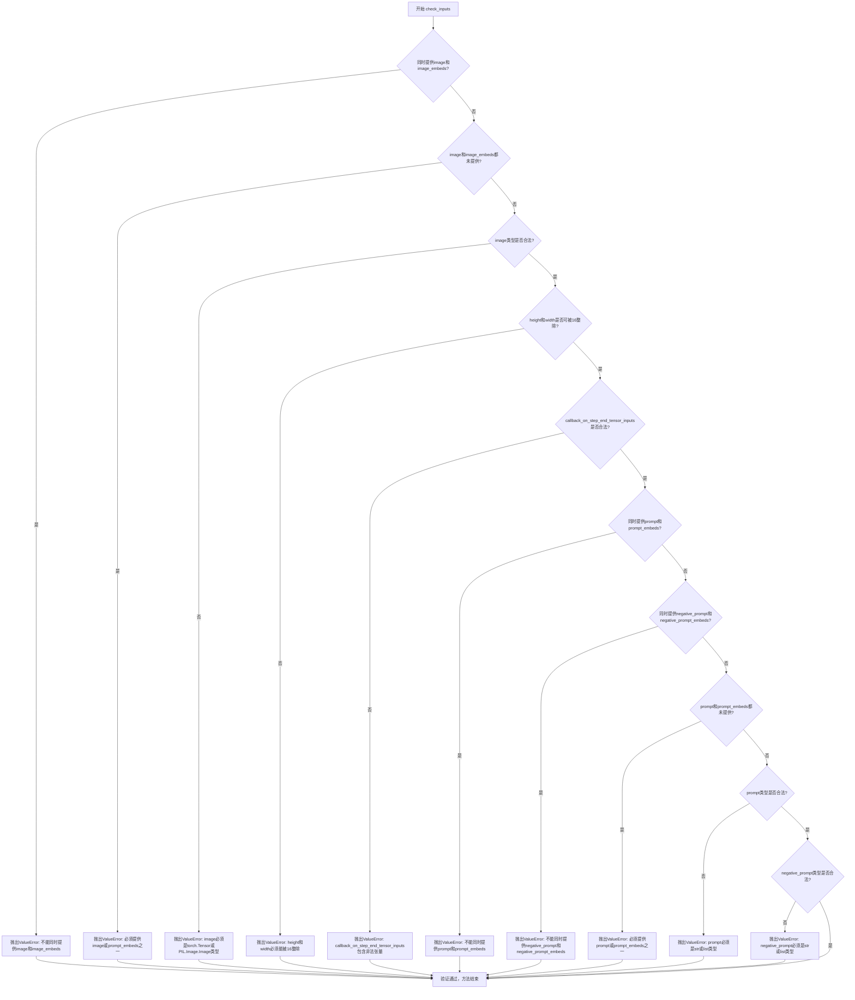

#### 带注释源码

```python
def check_inputs(
    self,
    prompt,
    negative_prompt,
    image,
    height,
    width,
    prompt_embeds=None,
    negative_prompt_embeds=None,
    image_embeds=None,
    callback_on_step_end_tensor_inputs=None,
):
    """
    检查输入参数的合法性，确保用户提供的参数符合管道要求。
    该方法会在管道调用开始前被调用，用于提前发现并报告参数错误。
    """
    
    # 检查1: 不能同时提供image和image_embeds，两者只能选择其一
    if image is not None and image_embeds is not None:
        raise ValueError(
            f"Cannot forward both `image`: {image} and `image_embeds`: {image_embeds}. Please make sure to"
            " only forward one of the two."
        )
    
    # 检查2: image和image_embeds不能同时为空，必须至少提供一个
    if image is None and image_embeds is None:
        raise ValueError(
            "Provide either `image` or `prompt_embeds`. Cannot leave both `image` and `image_embeds` undefined."
        )
    
    # 检查3: image的类型必须是torch.Tensor或PIL.Image.Image之一
    if image is not None and not isinstance(image, torch.Tensor) and not isinstance(image, PIL.Image.Image):
        raise ValueError(f"`image` has to be of type `torch.Tensor` or `PIL.Image.Image` but is {type(image)}")
    
    # 检查4: height和width必须能被16整除，这是模型架构的要求
    if height % 16 != 0 or width % 16 != 0:
        raise ValueError(f"`height` and `width` have to be divisible by 16 but are {height} and {width}.")

    # 检查5: callback_on_step_end_tensor_inputs中的所有key必须在允许列表中
    if callback_on_step_end_tensor_inputs is not None and not all(
        k in self._callback_tensor_inputs for k in callback_on_step_end_tensor_inputs
    ):
        raise ValueError(
            f"`callback_on_step_end_tensor_inputs` has to be in {self._callback_tensor_inputs}, but found {[k for k in callback_on_step_end_tensor_inputs if k not in self._callback_tensor_inputs]}"
        )

    # 检查6: prompt和prompt_embeds不能同时提供
    if prompt is not None and prompt_embeds is not None:
        raise ValueError(
            f"Cannot forward both `prompt`: {prompt} and `prompt_embeds`: {prompt_embeds}. Please make sure to"
            " only forward one of the two."
        )
    # 检查7: negative_prompt和negative_prompt_embeds不能同时提供
    elif negative_prompt is not None and negative_prompt_embeds is not None:
        raise ValueError(
            f"Cannot forward both `negative_prompt`: {negative_prompt} and `negative_prompt_embeds`: {negative_prompt_embeds}. Please make sure to"
            " only forward one of the two."
        )
    # 检查8: prompt和prompt_embeds不能同时为空
    elif prompt is None and prompt_embeds is None:
        raise ValueError(
            "Provide either `prompt` or `prompt_embeds`. Cannot leave both `prompt` and `prompt_embeds` undefined."
        )
    # 检查9: prompt的类型必须是str或list
    elif prompt is not None and (not isinstance(prompt, str) and not isinstance(prompt, list)):
        raise ValueError(f"`prompt` has to be of type `str` or `list` but is {type(prompt)}")
    # 检查10: negative_prompt的类型必须是str或list
    elif negative_prompt is not None and (
        not isinstance(negative_prompt, str) and not isinstance(negative_prompt, list)
    ):
        raise ValueError(f"`negative_prompt` has to be of type `str` or `list` but is {type(negative_prompt)}")
```


### `ChronoEditPipeline.prepare_latents`

该方法负责为视频生成准备潜在变量（latents）和条件信息。它首先根据VAE的缩放因子计算潜在空间的尺寸，然后初始化随机潜在张量或使用提供的潜在张量。接着将输入图像转换为视频条件表示，通过VAE编码获取潜在条件，并创建时间掩码来表示第一帧。最后返回处理后的潜在变量和包含掩码与潜在条件的元组。

参数：

- `self`：隐含参数，ChronoEditPipeline 实例本身
- `image`：`PipelineImageInput`，输入图像，用于条件视频生成
- `batch_size`：`int`，批次大小，指定同时处理的样本数量
- `num_channels_latents`：`int`，默认为 16，潜在变量的通道数
- `height`：`int`，默认为 480，生成视频的高度
- `width`：`int`，默认为 832，生成视频的宽度
- `num_frames`：`int`，默认为 81，生成视频的帧数
- `dtype`：`torch.dtype | None`，潜在张量的数据类型
- `device`：`torch.device | None`，计算设备
- `generator`：`torch.Generator | list[torch.Generator] | None`，随机数生成器，用于确保可重复性
- `latents`：`torch.Tensor | None`，预生成的潜在张量，如果提供则使用，否则随机生成

返回值：`tuple[torch.Tensor, torch.Tensor]`，返回两个张量组成的元组：(1) latents：初始化的潜在变量张量，形状为 (batch_size, num_channels_latents, num_latent_frames, latent_height, latent_width)；(2) 第二个张量由 mask_lat_size 和 latent_condition 拼接而成，形状为 (batch_size, 1 + num_channels_latents, num_frames, latent_height, latent_width)

#### 流程图

```mermaid
flowchart TD
    A[开始 prepare_latents] --> B[计算潜在空间尺寸]
    B --> C[num_latent_frames = (num_frames - 1) // vae_scale_factor_temporal + 1]
    B --> D[latent_height = height // vae_scale_factor_spatial]
    B --> E[latent_width = width // vae_scale_factor_spatial]
    D --> F[构建 shape]
    E --> F
    C --> F
    F --> G{latents 是否为 None?}
    G -->|是| H[使用 randn_tensor 生成随机潜在张量]
    G -->|否| I[将 latents 移动到指定设备和数据类型]
    H --> J[扩展 image 维度并填充零创建视频条件]
    I --> J
    J --> K[计算 latents_mean 和 latents_std]
    K --> L{generator 是列表吗?}
    L -->|是| M[遍历 generator 列表编码视频条件]
    L -->|否| N[直接编码视频条件并重复 batch_size 次]
    M --> O[获取 latent_condition]
    N --> O
    O --> P[标准化 latent_condition]
    P --> Q[创建时间掩码 mask_lat_size]
    Q --> R[重复第一帧掩码以匹配时间维度]
    R --> S[重塑和转置掩码]
    S --> T[拼接 mask_lat_size 和 latent_condition]
    T --> U[返回 latents 和条件张量]
```

#### 带注释源码

```python
def prepare_latents(
    self,
    image: PipelineImageInput,
    batch_size: int,
    num_channels_latents: int = 16,
    height: int = 480,
    width: int = 832,
    num_frames: int = 81,
    dtype: torch.dtype | None = None,
    device: torch.device | None = None,
    generator: torch.Generator | list[torch.Generator] | None = None,
    latents: torch.Tensor | None = None,
) -> tuple[torch.Tensor, torch.Tensor]:
    # 计算潜在帧数：根据时间缩放因子将帧数转换为潜在空间中的帧数
    # 例如：num_frames=81, vae_scale_factor_temporal=4 -> num_latent_frames=21
    num_latent_frames = (num_frames - 1) // self.vae_scale_factor_temporal + 1
    
    # 计算潜在空间的高度和宽度：通过空间缩放因子将像素尺寸转换为潜在尺寸
    latent_height = height // self.vae_scale_factor_spatial
    latent_width = width // self.vae_scale_factor_spatial

    # 定义潜在张量的形状：(batch, channels, temporal_frames, height, width)
    shape = (batch_size, num_channels_latents, num_latent_frames, latent_height, latent_width)
    
    # 验证生成器列表长度与批次大小是否匹配
    if isinstance(generator, list) and len(generator) != batch_size:
        raise ValueError(
            f"You have passed a list of generators of length {len(generator)}, but requested an effective batch"
            f" size of {batch_size}. Make sure the batch size matches the length of the generators."
        )

    # 如果未提供 latents，则随机生成；否则使用提供的 latents 并转换到指定设备
    if latents is None:
        latents = randn_tensor(shape, generator=generator, device=device, dtype=dtype)
    else:
        latents = latents.to(device=device, dtype=dtype)

    # 将图像扩展一个维度以匹配视频格式，然后在时间维度上填充零
    # 将单帧图像扩展为多帧视频条件，第一帧为原始图像，后续帧为零
    image = image.unsqueeze(2)  # [batch_size, channels, 1, height, width]
    video_condition = torch.cat(
        [image, image.new_zeros(image.shape[0], image.shape[1], num_frames - 1, height, width)], dim=2
    )
    video_condition = video_condition.to(device=device, dtype=self.vae.dtype)

    # 从 VAE 配置中获取潜在变量的均值和标准差，用于归一化
    # 将均值和标准差reshape为 (1, z_dim, 1, 1, 1) 以便广播
    latents_mean = (
        torch.tensor(self.vae.config.latents_mean)
        .view(1, self.vae.config.z_dim, 1, 1, 1)
        .to(latents.device, latents.dtype)
    )
    latents_std = 1.0 / torch.tensor(self.vae.config.latents_std).view(1, self.vae.config.z_dim, 1, 1, 1).to(
        latents.device, latents.dtype
    )

    # 使用 VAE 编码视频条件获取潜在表示
    # 支持多个生成器的采样模式
    if isinstance(generator, list):
        latent_condition = [
            retrieve_latents(self.vae.encode(video_condition), sample_mode="argmax") for _ in generator
        ]
        latent_condition = torch.cat(latent_condition)
    else:
        latent_condition = retrieve_latents(self.vae.encode(video_condition), sample_mode="argmax")
        # 为每个批次样本复制潜在条件
        latent_condition = latent_condition.repeat(batch_size, 1, 1, 1, 1)

    # 将潜在条件转换到指定数据类型
    latent_condition = latent_condition.to(dtype)
    # 使用均值和标准差对潜在条件进行标准化
    latent_condition = (latent_condition - latents_mean) * latents_std

    # 创建时间掩码，用于标识第一帧位置
    # 初始化全1掩码，然后除第一帧外全部设为0
    mask_lat_size = torch.ones(batch_size, 1, num_frames, latent_height, latent_width)
    mask_lat_size[:, :, list(range(1, num_frames))] = 0
    # 提取第一帧掩码并沿时间维度重复
    first_frame_mask = mask_lat_size[:, :, 0:1]
    first_frame_mask = torch.repeat_interleave(first_frame_mask, dim=2, repeats=self.vae_scale_factor_temporal)
    # 拼接第一帧掩码和其余帧掩码
    mask_lat_size = torch.concat([first_frame_mask, mask_lat_size[:, :, 1:, :]], dim=2)
    # 重塑掩码以匹配潜在条件的时间维度
    mask_lat_size = mask_lat_size.view(batch_size, -1, self.vae_scale_factor_temporal, latent_height, latent_width)
    mask_lat_size = mask_lat_size.transpose(1, 2)
    mask_lat_size = mask_lat_size.to(latent_condition.device)

    # 返回初始化的潜在变量和包含掩码与潜在条件的拼接张量
    return latents, torch.concat([mask_lat_size, latent_condition], dim=1)
```


### ChronoEditPipeline.__call__

图像到视频生成管道的主调用方法，接收输入图像和文本提示词，通过去噪扩散过程生成视频帧序列。

参数：

- `self`：隐含参数，ChronoEditPipeline 实例本身
- `image`：`PipelineImageInput`，输入图像，用于条件生成视频。必须是图像、图像列表或 torch.Tensor
- `prompt`：`str | list[str]`，用于引导视频生成的文本提示词，若不定义则需传递 prompt_embeds
- `negative_prompt`：`str | list[str]`，不用于引导视频生成的提示词，若不定义则需传递 negative_prompt_embeds，在不使用引导时忽略
- `height`：`int`，默认 480，生成视频的高度
- `width`：`int`，默认 832，生成视频的宽度
- `num_frames`：`int`，默认 81，生成视频的帧数
- `num_inference_steps`：`int`，默认 50，去噪步数，更多步数通常导致更高质量的视频，但推理速度更慢
- `guidance_scale`：`float`，默认 5.0，分类器自由扩散引导中的引导尺度，值越大越接近文本提示，通常以较低图像质量为代价
- `num_videos_per_prompt`：`int | None`，默认 1，每个提示词生成的视频数量
- `generator`：`torch.Generator | list[torch.Generator] | None`，用于生成确定性结果的随机生成器
- `latents`：`torch.Tensor | None`，预生成的噪声潜在向量，若不提供则使用随机生成器采样
- `prompt_embeds`：`torch.Tensor | None`，预生成的文本嵌入，可用于轻松调整文本输入
- `negative_prompt_embeds`：`torch.Tensor | None`，预生成的负面文本嵌入
- `image_embeds`：`torch.Tensor | None`，预生成的图像嵌入
- `output_type`：`str | None`，默认 "np"，生成视频的输出格式，可选 PIL.Image 或 np.array
- `return_dict`：`bool`，默认 True，是否返回 ChronoEditPipelineOutput 而非元组
- `attention_kwargs`：`dict[str, Any] | None`，传递给注意力处理器的 kwargs 字典
- `callback_on_step_end`：`Callable | PipelineCallback | MultiPipelineCallbacks | None`，每个去噪步骤结束时调用的回调函数
- `callback_on_step_end_tensor_inputs`：`list[str]`，默认 ["latents"]，回调函数的张量输入列表
- `max_sequence_length`：`int`，默认 512，文本编码器的最大序列长度
- `enable_temporal_reasoning`：`bool`，默认 False，是否启用时间推理
- `num_temporal_reasoning_steps`：`int`，默认 0，启用时间推理的步数

返回值：`ChronoEditPipelineOutput` 或 `tuple`，若 return_dict 为 True 返回 ChronoEditPipelineOutput，否则返回元组，第一个元素是生成的视频帧列表

#### 流程图

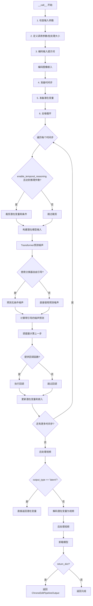

#### 带注释源码

```python
@torch.no_grad()
@replace_example_docstring(EXAMPLE_DOC_STRING)
def __call__(
    self,
    image: PipelineImageInput,
    prompt: str | list[str] = None,
    negative_prompt: str | list[str] = None,
    height: int = 480,
    width: int = 832,
    num_frames: int = 81,
    num_inference_steps: int = 50,
    guidance_scale: float = 5.0,
    num_videos_per_prompt: int | None = 1,
    generator: torch.Generator | list[torch.Generator] | None = None,
    latents: torch.Tensor | None = None,
    prompt_embeds: torch.Tensor | None = None,
    negative_prompt_embeds: torch.Tensor | None = None,
    image_embeds: torch.Tensor | None = None,
    output_type: str | None = "np",
    return_dict: bool = True,
    attention_kwargs: dict[str, Any] | None = None,
    callback_on_step_end: Callable[[int, int, None], PipelineCallback | MultiPipelineCallbacks] | None = None,
    callback_on_step_end_tensor_inputs: list[str] = ["latents"],
    max_sequence_length: int = 512,
    enable_temporal_reasoning: bool = False,
    num_temporal_reasoning_steps: int = 0,
):
    """
    The call function to the pipeline for generation.
    """
    # 如果提供了回调对象，从回调对象获取张量输入列表
    if isinstance(callback_on_step_end, (PipelineCallback, MultiPipelineCallbacks)):
        callback_on_step_end_tensor_inputs = callback_on_step_end.tensor_inputs

    # 1. 检查输入参数是否正确，错误则抛出异常
    self.check_inputs(
        prompt,
        negative_prompt,
        image,
        height,
        width,
        prompt_embeds,
        negative_prompt_embeds,
        image_embeds,
        callback_on_step_end_tensor_inputs,
    )

    # 如果未启用时间推理，将帧数设为5；否则使用传入的帧数
    num_frames = 5 if not enable_temporal_reasoning else num_frames

    # 验证帧数是否符合VAE时间因子要求
    if num_frames % self.vae_scale_factor_temporal != 1:
        logger.warning(
            f"`num_frames - 1` has to be divisible by {self.vae_scale_factor_temporal}. Rounding to the nearest number."
        )
        # 调整帧数到满足要求的值
        num_frames = num_frames // self.vae_scale_factor_temporal * self.vae_scale_factor_temporal + 1
    num_frames = max(num_frames, 1)

    # 设置引导尺度和注意力 kwargs
    self._guidance_scale = guidance_scale
    self._attention_kwargs = attention_kwargs
    self._current_timestep = None
    self._interrupt = False

    device = self._execution_device

    # 2. 确定批处理大小
    if prompt is not None and isinstance(prompt, str):
        batch_size = 1
    elif prompt is not None and isinstance(prompt, list):
        batch_size = len(prompt)
    else:
        batch_size = prompt_embeds.shape[0]

    # 3. 编码输入提示词为文本嵌入
    prompt_embeds, negative_prompt_embeds = self.encode_prompt(
        prompt=prompt,
        negative_prompt=negative_prompt,
        do_classifier_free_guidance=self.do_classifier_free_guidance,
        num_videos_per_prompt=num_videos_per_prompt,
        prompt_embeds=prompt_embeds,
        negative_prompt_embeds=negative_prompt_embeds,
        max_sequence_length=max_sequence_length,
        device=device,
    )

    # 编码图像嵌入
    transformer_dtype = self.transformer.dtype
    prompt_embeds = prompt_embeds.to(transformer_dtype)
    if negative_prompt_embeds is not None:
        negative_prompt_embeds = negative_prompt_embeds.to(transformer_dtype)

    # 如果未提供图像嵌入，则从输入图像编码
    if image_embeds is None:
        image_embeds = self.encode_image(image, device)
    image_embeds = image_embeds.repeat(batch_size, 1, 1)
    image_embeds = image_embeds.to(transformer_dtype)

    # 4. 准备时间步
    self.scheduler.set_timesteps(num_inference_steps, device=device)
    timesteps = self.scheduler.timesteps

    # 5. 准备潜在变量
    num_channels_latents = self.vae.config.z_dim
    # 预处理输入图像
    image = self.video_processor.preprocess(image, height=height, width=width).to(device, dtype=torch.float32)
    # 准备初始噪声和条件
    latents, condition = self.prepare_latents(
        image,
        batch_size * num_videos_per_prompt,
        num_channels_latents,
        height,
        width,
        num_frames,
        torch.float32,
        device,
        generator,
        latents,
    )

    # 6. 去噪循环
    num_warmup_steps = len(timesteps) - num_inference_steps * self.scheduler.order
    self._num_timesteps = len(timesteps)

    with self.progress_bar(total=num_inference_steps) as progress_bar:
        for i, t in enumerate(timesteps):
            # 检查是否中断
            if self.interrupt:
                continue

            # 时间推理逻辑：在特定步骤裁剪潜在变量
            if enable_temporal_reasoning and i == num_temporal_reasoning_steps:
                # 保留首尾帧
                latents = latents[:, :, [0, -1]]
                condition = condition[:, :, [0, -1]]

                # 裁剪调度器的模型输出
                for j in range(len(self.scheduler.model_outputs)):
                    if self.scheduler.model_outputs[j] is not None:
                        if latents.shape[-3] != self.scheduler.model_outputs[j].shape[-3]:
                            self.scheduler.model_outputs[j] = self.scheduler.model_outputs[j][:, :, [0, -1]]
                # 裁剪最后的采样
                if self.scheduler.last_sample is not None:
                    self.scheduler.last_sample = self.scheduler.last_sample[:, :, [0, -1]]

            self._current_timestep = t
            # 拼接潜在变量和条件作为模型输入
            latent_model_input = torch.cat([latents, condition], dim=1).to(transformer_dtype)
            timestep = t.expand(latents.shape[0])

            # 使用Transformer预测噪声
            noise_pred = self.transformer(
                hidden_states=latent_model_input,
                timestep=timestep,
                encoder_hidden_states=prompt_embeds,
                encoder_hidden_states_image=image_embeds,
                attention_kwargs=attention_kwargs,
                return_dict=False,
            )[0]

            # 分类器自由引导：预测无条件噪声并结合
            if self.do_classifier_free_guidance:
                noise_uncond = self.transformer(
                    hidden_states=latent_model_input,
                    timestep=timestep,
                    encoder_hidden_states=negative_prompt_embeds,
                    encoder_hidden_states_image=image_embeds,
                    attention_kwargs=attention_kwargs,
                    return_dict=False,
                )[0]
                # 应用引导尺度
                noise_pred = noise_uncond + guidance_scale * (noise_pred - noise_uncond)

            # 调度器执行去噪步骤：x_t -> x_t-1
            latents = self.scheduler.step(noise_pred, t, latents, return_dict=False)[0]

            # 步骤结束时的回调处理
            if callback_on_step_end is not None:
                callback_kwargs = {}
                for k in callback_on_step_end_tensor_inputs:
                    callback_kwargs[k] = locals()[k]
                callback_outputs = callback_on_step_end(self, i, t, callback_kwargs)

                # 更新回调返回的值
                latents = callback_outputs.pop("latents", latents)
                prompt_embeds = callback_outputs.pop("prompt_embeds", prompt_embeds)
                negative_prompt_embeds = callback_outputs.pop("negative_prompt_embeds", negative_prompt_embeds)

            # 更新进度条
            if i == len(timesteps) - 1 or ((i + 1) > num_warmup_steps and (i + 1) % self.scheduler.order == 0):
                progress_bar.update()

            # XLA 设备优化
            if XLA_AVAILABLE:
                xm.mark_step()

    self._current_timestep = None

    # 后处理：解码潜在变量为视频
    if not output_type == "latent":
        # 反标准化潜在变量
        latents = latents.to(self.vae.dtype)
        latents_mean = (
            torch.tensor(self.vae.config.latents_mean)
            .view(1, self.vae.config.z_dim, 1, 1, 1)
            .to(latents.device, latents.dtype)
        )
        latents_std = 1.0 / torch.tensor(self.vae.config.latents_std).view(1, self.vae.config.z_dim, 1, 1, 1).to(
            latents.device, latents.dtype
        )
        latents = latents / latents_std + latents_mean
        
        # 时间推理模式下的特殊解码逻辑
        if enable_temporal_reasoning and latents.shape[2] > 2:
            video_edit = self.vae.decode(latents[:, :, [0, -1]], return_dict=False)[0]
            video_reason = self.vae.decode(latents[:, :, :-1], return_dict=False)[0]
            video = torch.cat([video_reason, video_edit[:, :, 1:]], dim=2)
        else:
            video = self.vae.decode(latents, return_dict=False)[0]
        
        # 后处理视频为指定格式
        video = self.video_processor.postprocess_video(video, output_type=output_type)
    else:
        video = latents

    # 卸载所有模型
    self.maybe_free_model_hooks()

    # 返回结果
    if not return_dict:
        return (video,)

    return ChronoEditPipelineOutput(frames=video)
```


### `ChronoEditPipeline.guidance_scale`

该属性是一个只读的属性 getter 方法，用于获取 Classifier-Free Diffusion Guidance（无分类器自由扩散引导）的 `guidance_scale` 参数值。该参数控制生成内容与文本提示的相关性，值越大生成的图像与提示越相关，但可能牺牲图像质量。

参数：无

返回值：`float`，返回 `self._guidance_scale` 的值。该值在 pipeline 的 `__call__` 方法中被设置，用于控制无分类器自由引导的强度。值大于 1 时启用引导，值越高生成的视频与文本提示越紧密相关，通常以牺牲图像质量为代价。

#### 流程图

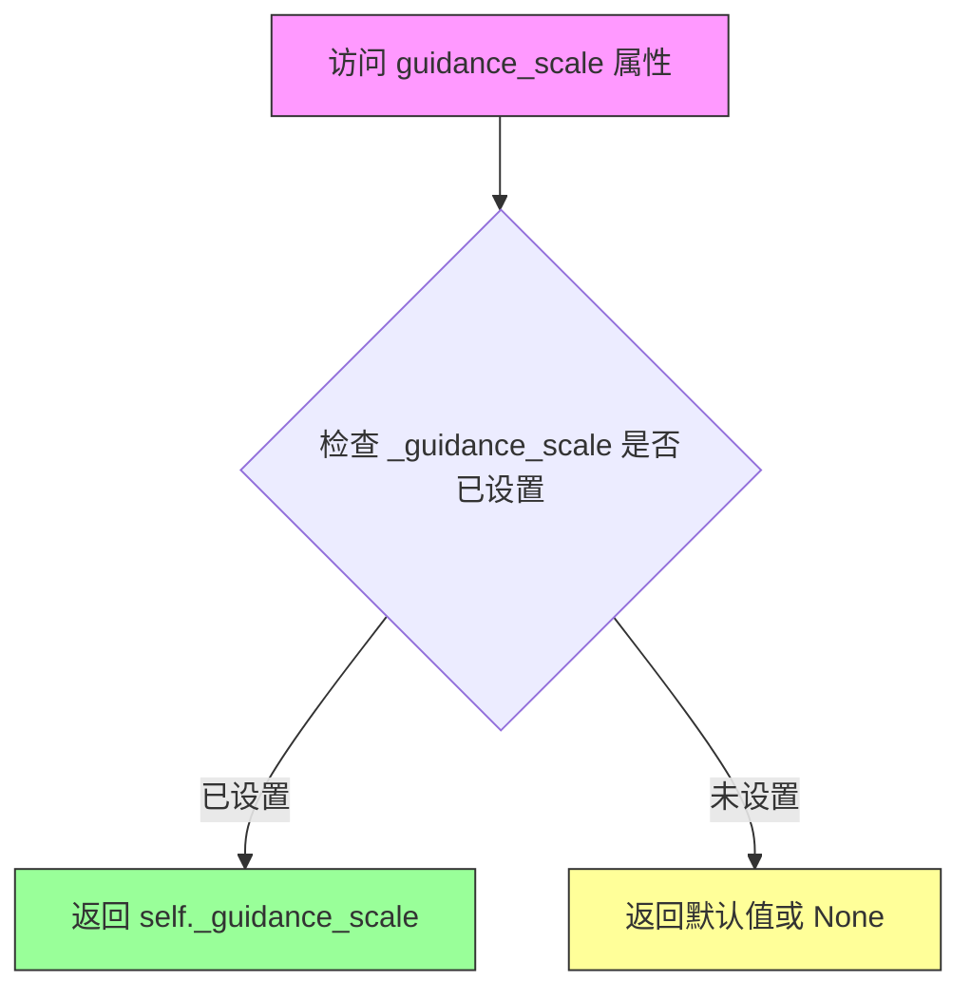

#### 带注释源码

```python
@property
def guidance_scale(self):
    """
    属性 getter 方法：获取 guidance_scale 参数值。
    
    guidance_scale 定义在 Classifier-Free Diffusion Guidance 论文中
    (https://arxiv.org/abs/2207.12598)，在Imagen论文中被定义为权重w。
    公式: noise_pred = noise_uncond + guidance_scale * (noise_pred - noise_uncond)
    
    当 guidance_scale > 1 时启用无分类器引导，
    值越高生成的视频与文本提示越相关，
    通常以牺牲图像/视频质量为代价。
    
    Returns:
        float: 当前设置的 guidance_scale 值。
               该值在 __call__ 方法中被初始化为默认参数值 (默认为 5.0)。
    """
    return self._guidance_scale
```

#### 关联信息

| 项目 | 描述 |
|------|------|
| 所属类 | `ChronoEditPipeline` |
| 属性类型 | 只读属性 (Read-only Property) |
| 关联私有变量 | `self._guidance_scale` |
| 关联属性 | `do_classifier_free_guidance` (基于 guidance_scale 判断是否启用引导) |
| 默认值设置位置 | `__call__` 方法中的 `self._guidance_scale = guidance_scale` |
| 使用位置 | `__call__` 方法的去噪循环中用于计算 `noise_pred` |


### `ChronoEditPipeline.do_classifier_free_guidance`

该属性用于判断当前管道是否启用了无分类器引导（Classifier-Free Guidance）。当 `guidance_scale` 大于 1 时返回 `True`，表示模型将在推理过程中同时考虑条件和无条件预测，以提升生成质量。

参数：无（此属性不接受任何参数）

返回值：`bool`，当 guidance_scale 大于 1 时返回 `True`，表示启用了无分类器引导；否则返回 `False`

#### 流程图

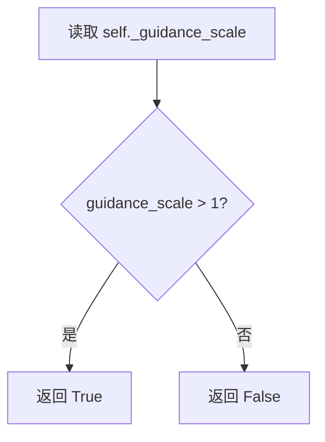

#### 带注释源码

```python
@property
def do_classifier_free_guidance(self) -> bool:
    """
    属性：判断是否启用无分类器引导（Classifier-Free Guidance）
    
    无分类器引导是一种提高生成质量的推理技术，通过在有条件和无条件
    两种情况下进行预测，然后根据 guidance_scale 权重进行组合。
    
    返回值：
        bool：如果 guidance_scale > 1，则启用 CFG，返回 True；
              否则返回 False
    """
    return self._guidance_scale > 1
```


### `ChronoEditPipeline.num_timesteps`

该属性是一个只读的 getter 属性，用于返回 DiffusionPipeline 在去噪过程中所使用的时间步总数。该值在 `__call__` 方法执行时被设置，取决于推理步骤的数量（`num_inference_steps`）和时间步调度器的配置。

参数：

- （无参数 - 这是一个属性访问器）

返回值：`int`，返回去噪过程中时间步的总数（即推理步数）

#### 流程图

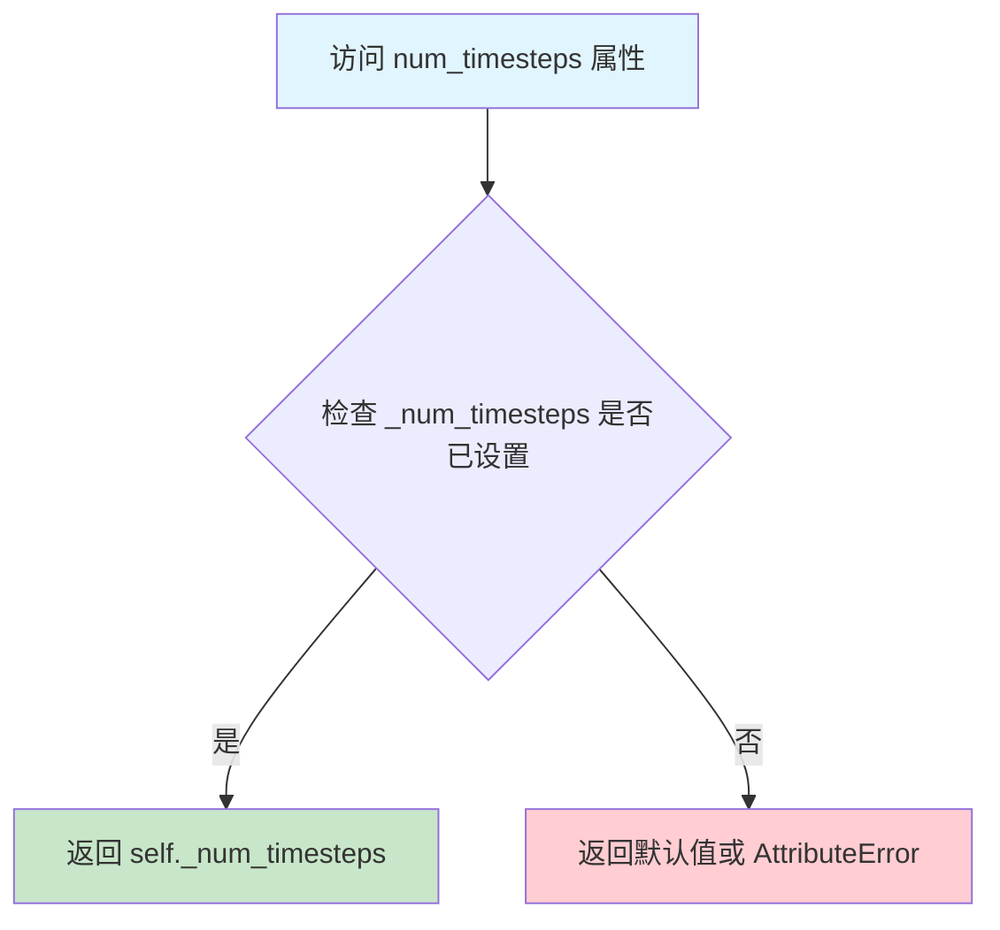

#### 带注释源码

```python
@property
def num_timesteps(self):
    """
    只读属性，返回去噪过程中使用的时间步总数。
    
    该属性在 __call__ 方法中被设置：
    self._num_timesteps = len(timesteps)
    
    其中 timesteps 来自 scheduler.set_timesteps(num_inference_steps, device=device)
    
    Returns:
        int: 去噪推理过程中的时间步数量，通常等于 num_inference_steps
    """
    return self._num_timesteps
```


### `ChronoEditPipeline.current_timestep`

该属性是 ChronoEditPipeline 类中的一个只读属性，用于获取当前去噪循环中的时间步（timestep）。在扩散模型的推理过程中，时间步表示当前去噪的阶段，数值通常从大到小变化（例如从 1000 到 0），用于控制噪声去除的进程。

参数：

- 该属性无显式参数（隐式参数 `self` 为类的实例）

返回值：`Any`（具体类型为 `torch.Tensor` 或 `None`），返回当前的去噪时间步。在推理开始时被设置为具体的 timestep 值，推理结束后重置为 `None`。

#### 流程图

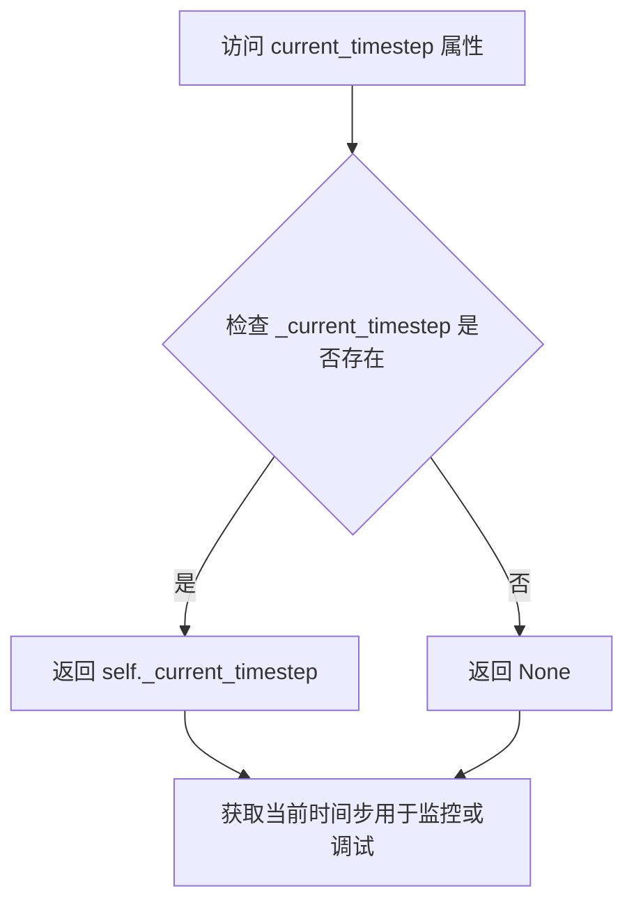

#### 带注释源码

```python
@property
def current_timestep(self):
    """
    只读属性，返回当前的去噪时间步（timestep）。
    
    在 __call__ 方法的去噪循环中，每次迭代开始时会更新此值：
        self._current_timestep = t
    
    此属性允许外部代码监控扩散过程的进度。
    推理流程结束后会被重置为 None：
        self._current_timestep = None
    """
    return self._current_timestep
```


### `ChronoEditPipeline.interrupt`

该属性是ChronoEditPipeline类的一个只读属性，用于获取当前pipeline的中断状态标志。在去噪循环（denoising loop）中，通过检查该属性来判断是否需要立即中断当前的生成过程。

参数：
- 无（该属性不接受任何显式参数）

返回值：`bool`，返回pipeline的中断状态标志。当返回`True`时，表示外部已请求中断生成过程；当返回`False`时，表示继续正常生成。

#### 流程图

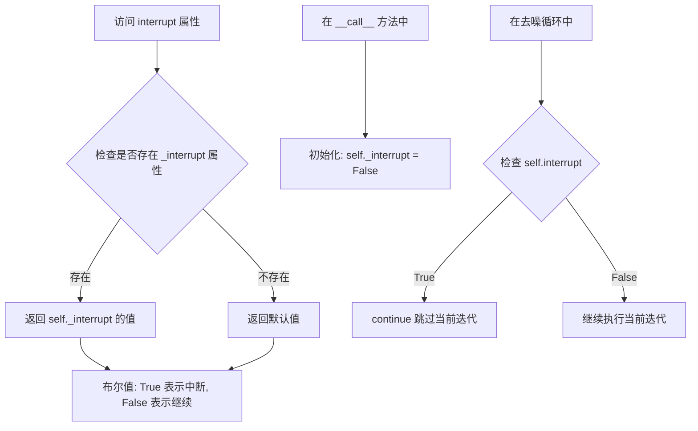

#### 带注释源码

```python
@property
def interrupt(self):
    """
    只读属性，用于获取pipeline的中断状态标志。
    
    该属性在去噪循环中被检查（位于 __call__ 方法的 denoising loop 中），
    用于实现外部中断pipeline执行的功能。当设置为 True 时，
    当前的去噪步骤会被跳过，从而实现即时中断生成过程的效果。
    
    Returns:
        bool: 中断状态标志。True 表示请求中断，False 表示继续正常生成。
    """
    return self._interrupt
```

#### 上下文使用示例

```python
# 在 __call__ 方法中初始化
self._interrupt = False  # 初始化为非中断状态

# 在去噪循环中检查中断状态
with self.progress_bar(total=num_inference_steps) as progress_bar:
    for i, t in enumerate(timesteps):
        if self.interrupt:  # 检查中断标志
            continue  # 如果请求中断，则跳过当前迭代
        # ... 继续去噪逻辑
```


### `ChronoEditPipeline.attention_kwargs`

这是一个属性访问器（property），用于获取在管道调用时传递的注意力机制参数（attention_kwargs）。该属性允许在推理过程中动态传递额外的关键字参数给注意力处理器（AttentionProcessor），以支持自定义的注意力计算逻辑。

参数：无（属性访问器不接受显式参数，`self` 是隐式参数）

返回值：`dict[str, Any] | None`，返回存储在管道实例中的注意力关键字参数字典。如果未在调用管道时传递 `attention_kwargs`，则返回 `None`。

#### 流程图

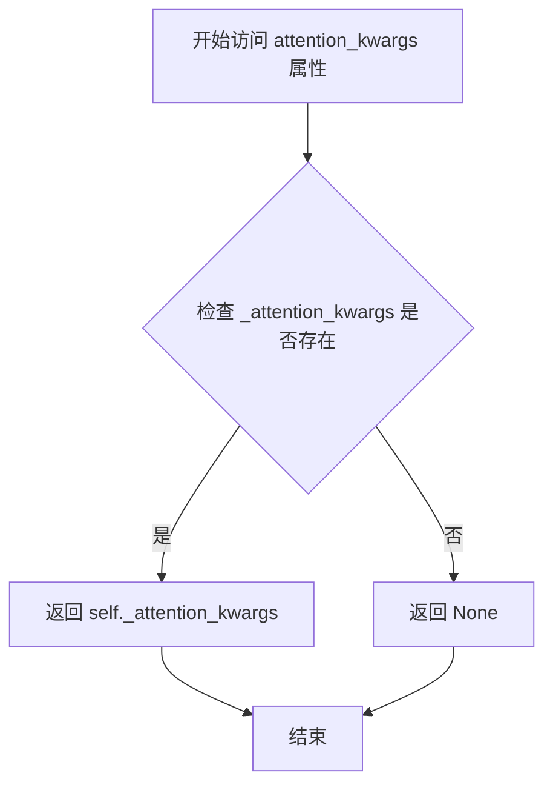

#### 带注释源码

```python
@property
def attention_kwargs(self):
    """
    属性访问器：获取注意力关键字参数
    
    该属性返回在管道调用时通过 attention_kwargs 参数传递的字典。
    该字典通常包含传递给 AttentionProcessor 的额外参数，用于自定义
    注意力机制的行为，例如：
    -额外的注意力掩码
    -注意力dropout控制
    -自定义的注意力模式
    
    返回值:
        dict[str, Any] | None: 注意力关键字参数字典，如果未设置则返回 None
        
    示例:
        # 在调用管道时可以传递 attention_kwargs
        output = pipe(
            image=image,
            prompt=prompt,
            attention_kwargs={"some_custom_param": value}
        )
        
        # 可以在调用后通过属性获取
        current_kwargs = pipe.attention_kwargs
    """
    return self._attention_kwargs
```

## 关键组件


### 张量索引与掩码管理

在 `prepare_latents` 方法中，通过张量索引操作创建了帧掩码，用于标识第一帧和后续帧。通过 `torch.repeat_interleave` 和 `torch.concat` 操作实现了时间维度的掩码扩展，确保在去噪过程中只处理关键帧。

### 潜在变量检索与反量化支持

`retrieve_latents` 函数支持从 VAE 编码器输出中以不同模式（sample/argmax）检索潜在变量。在 `prepare_latents` 中通过 `(latent_condition - latents_mean) * latents_std` 实现反量化操作，将潜在变量从 latent space 转换回标准分布。

### 时间推理与条件编码

在 `__call__` 方法的去噪循环中，当 `enable_temporal_reasoning` 启用时，通过张量索引 `latents[:, :, [0, -1]]` 只保留首尾帧进行时间推理。条件编码通过 `torch.cat([latents, condition], dim=1)` 在通道维度上拼接潜在变量和条件变量。

### 图像嵌入与条件注入

`encode_image` 方法使用 CLIP 图像编码器生成图像条件嵌入。在主循环中通过 `encoder_hidden_states_image=image_embeds` 参数将图像条件注入到 Transformer 中，实现图像到视频的条件生成。

### VAE 视频后处理与潜在空间操作

在生成完成后，通过 `latents / latents_std + latents_mean` 进行逆潜在空间变换。根据 `enable_temporal_reasoning` 标志选择性解码：对推理部分解码完整 latent，对编辑部分只解码首尾帧然后拼接。


## 问题及建议


### 已知问题

- **硬编码值不一致**: `prepare_latents` 方法中 `num_channels_latents` 参数默认值为 16，但在 `__call__` 方法中实际使用的是 `self.vae.config.z_dim`，存在逻辑不一致
- **参数校验错误信息误导**: `check_inputs` 方法中的错误信息 `"Provide either prompt or prompt_embeds"` 实际上是在检查 `image` 和 `image_embeds`，错误信息与实际检查内容不匹配
- **模块注册不完整**: `model_cpu_offload_seq` 定义了模型卸载顺序，但未包含 `image_processor`，可能导致图像处理器无法正确卸载
- **未使用的参数**: `retrieve_latents` 函数接受 `sample_mode` 参数，但在代码中仅使用 `"argmax"` 模式，其他模式分支未被使用
- **潜在的属性访问错误**: `__init__` 中使用 `getattr(self, "vae", None)` 进行安全访问，但在 `prepare_latents` 等方法中直接使用 `self.vae` 而未做防御性检查
- **重复代码模式**: 多个方法标注为 "Copied from" 或 "modified from"，表明存在代码重复，可以考虑提取公共基类或混入类
- **Tokenizer 未注册**: `tokenizer` 在 `__init__` 方法的参数列表中但未在 `register_modules` 中注册，而 `_get_t5_prompt_embeds` 方法直接使用 `self.tokenizer`

### 优化建议

- **统一配置管理**: 将 `num_channels_latents` 等配置值统一从 VAE 配置中获取，移除硬编码的默认值
- **修正错误信息**: 修改 `check_inputs` 中相关的错误信息，使其与实际验证逻辑一致
- **完善模块卸载序列**: 将 `image_processor` 添加到 `model_cpu_offload_seq` 中，或明确记录为何不需要卸载
- **清理未使用代码**: 移除 `retrieve_latents` 中未使用的 `sample_mode` 分支，或保留并实现对应功能
- **统一属性访问模式**: 在所有方法中使用一致的 `vae` 访问方式，建议在类初始化时确保 `vae` 存在或使用守卫检查
- **提取公共逻辑**: 将 "Copied from" 的代码提取为基类方法或工具函数，减少代码重复并便于维护
- **添加缓存机制**: 对于 `encode_prompt` 和 `encode_image` 等耗时操作，可以考虑添加可选的结果缓存机制
- **增强类型提示**: 部分方法参数缺少类型注解（如 `check_inputs` 的参数），建议补充完整以提高代码可读性和 IDE 支持

## 其它


### 设计目标与约束

该管道旨在实现基于图像条件的视频生成任务，核心目标是将静态图像（Image）转换为动态视频序列。设计约束包括：1) 输入图像尺寸必须能被16整除；2) 帧数配置需满足vae_scale_factor_temporal的约束条件；3) 文本提示长度受max_sequence_length限制（默认512）；4) 必须使用支持CUDA的设备运行以确保推理性能；5) 模型权重需要根据不同组件选择合适的dtype（transformer使用bfloat16，vae使用float32）。

### 错误处理与异常设计

代码中的错误处理主要通过check_inputs方法实现，涵盖以下场景：1) image和image_embeds不能同时提供；2) image和image_embeds至少需要提供一个；3) image类型必须是torch.Tensor或PIL.Image.Image；4) height和width必须能被16整除；5) prompt和prompt_embeds不能同时提供；6) negative_prompt和negative_prompt_embeds不能同时提供；7) callback_on_step_end_tensor_inputs中的项必须在_callback_tensor_inputs列表中；8) prompt和negative_prompt类型必须是str或list。此外，prepare_latents方法中对generator列表长度与batch_size不匹配的情况进行了校验。异常处理采用ValueError抛出明确错误信息的方式。

### 数据流与状态机

管道的数据流遵循以下流程：首先通过encode_prompt处理文本提示生成prompt_embeds和negative_prompt_embeds；然后通过encode_image处理输入图像生成image_embeds；接着调用prepare_latents准备初始噪声和条件变量；在去噪循环中，scheduler根据预测的噪声逐步更新latents；最后通过vae.decode将潜在表示解码为视频帧。状态管理方面，管道通过_guidance_scale、_attention_kwargs、_current_timestep、_interrupt、_num_timesteps等属性维护运行状态，并通过callback机制支持外部状态回调。

### 外部依赖与接口契约

主要外部依赖包括：1) transformers库提供的AutoTokenizer、CLIPImageProcessor、CLIPVisionModel、UMT5EncoderModel；2) diffusers自身的DiffusionPipeline基类、VideoProcessor、PipelineImageInput等；3) PIL用于图像处理；4) regex和html用于文本清洗；5) ftfy用于文本修复。接口契约方面，__call__方法接受image、prompt、negative_prompt、height、width、num_frames、num_inference_steps、guidance_scale等参数，返回ChronoEditPipelineOutput或tuple。管道继承自WanLoraLoaderMixin，支持LoRA权重加载。

### 性能考虑与优化空间

性能优化点包括：1) 使用torch.no_grad()装饰器禁用梯度计算；2) 支持XLA设备加速（XLA_AVAILABLE）；3) 模型CPU卸载序列配置（model_cpu_offload_seq）；4) 支持generator参数实现可重复生成；5) 支持num_videos_per_prompt进行批量生成。潜在优化空间：1) 可以添加torch.compile加速；2) 可以实现KV缓存机制减少重复计算；3) 可以添加混合精度推理选项；4) 可以实现分块解码以减少内存占用；5) 可以添加推理过程中的自适应批处理。

### 配置与参数说明

关键配置参数：1) vae_scale_factor_temporal和vae_scale_factor_spatial用于潜在空间到像素空间的转换；2) model_cpu_offload_seq定义了模型卸载顺序；3) _callback_tensor_inputs定义了可回调的张量输入。运行时参数在__call__中定义，包括image（必需）、prompt（可选）、negative_prompt（可选）、height（默认480）、width（默认832）、num_frames（默认81）、num_inference_steps（默认50）、guidance_scale（默认5.0）、enable_temporal_reasoning（默认False）、num_temporal_reasoning_steps（默认0）等。

### 安全与合规考虑

代码遵循Apache 2.0许可证。negative_prompt参数用于过滤不适当内容。output_type参数支持返回潜在表示而非解码视频，便于安全审核。由于涉及视频生成，需注意可能的内容生成政策约束。

### 版本兼容性

代码依赖于diffusers库的最新API，包括PipelineCallback和MultiPipelineCallbacks回调机制。需要Python 3.8+环境。torch版本需支持 dtype（如bfloat16）。transformers库版本需要支持UMT5EncoderModel和CLIPVisionModel。

### 使用示例与最佳实践

代码中提供了完整的EXAMPLE_DOC_STRING示例，演示了从模型加载到视频生成的全流程。最佳实践包括：1) 使用nvidia/ChronoEdit-14B-Diffusers预训练模型；2) 根据输入图像计算合适的height和width；3) 使用export_to_video导出生成结果；4) 当enable_temporal_reasoning为False时，num_frames自动设为5以优化性能。

### 已知限制

1) 输入图像尺寸必须能被16整除；2) num_frames必须满足(num_frames-1) % vae_scale_factor_temporal == 0的条件；3) 文本提示长度超过max_sequence_length会被截断；4) 推理需要大量GPU内存（14B参数模型）；5) 目前仅支持图像到视频的单向转换，不支持视频编辑。

### 监控与日志

使用diffusers的logging模块记录关键信息，包括：1) num_frames不满足条件时的警告日志；2) 模型加载和卸载的日志；3) 推理进度的progress_bar展示。XLA环境下使用xm.mark_step()进行显式计算图编译。

### 资源管理

资源管理机制包括：1) maybe_free_model_hooks()在推理结束后卸载所有模型；2) 使用model_cpu_offload_seq定义卸载顺序；3) 支持torch.cuda.empty_cache()清理缓存（通过maybe_free_model_hooks）。内存优化方面，管道在不同阶段使用不同的dtype（float32用于预处理，bfloat16用于transformer推理）。

### 并发与异步处理

当前实现为同步处理，通过progress_bar提供进度反馈。XLA环境下使用mark_step()进行异步执行。callback机制支持在每个去噪步骤结束后执行自定义操作，可用于实现异步监控或中间结果处理。

### 缓存策略

潜在优化点包括：1) prompt_embeds和negative_prompt_embeds可缓存避免重复编码；2) image_embeds可缓存；3) scheduler的model_outputs在temporal reasoning场景下需要特殊处理（见代码第344-351行）。当前实现仅在单次调用中缓存，未持久化。

    