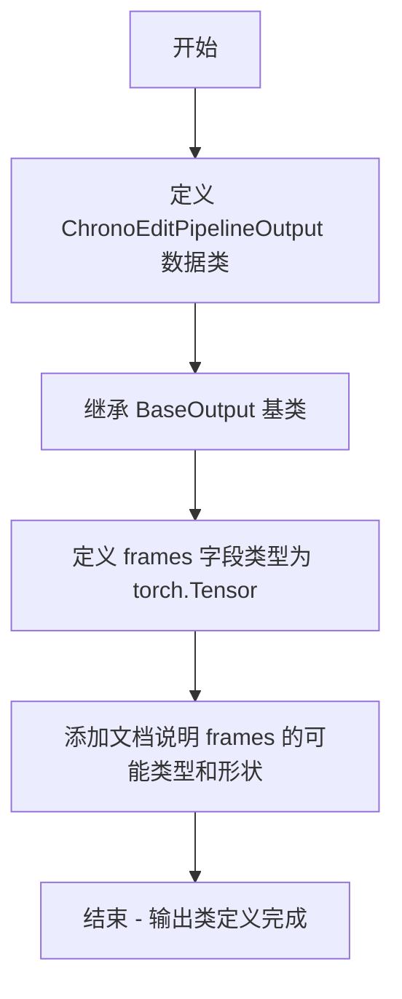

# `diffusers\src\diffusers\pipelines\chronoedit\pipeline_output.py` 详细设计文档

这是一个用于 ChronoEdit 视频生成管道的输出数据类，定义了管道执行后返回的视频帧数据结构，支持 torch.Tensor、numpy 数组或 PIL 图像列表多种格式，用于封装批量视频生成的结果。

## 整体流程



## 类结构

```
BaseOutput (diffusers.utils 基类)
└── ChronoEditPipelineOutput (数据类)
```

## 全局变量及字段


### `ChronoEditPipelineOutput.frames`
    
视频输出张量，包含批量视频帧数据，形状为(batch_size, num_frames, channels, height, width)，也可为NumPy数组或PIL图像列表

类型：`torch.Tensor`
    
    

## 全局函数及方法


## 关键组件


### ChronoEditPipelineOutput 类

用于ChronoEdit视频生成管道的输出数据类，继承自diffusers库的BaseOutput基类，封装了生成视频帧的张量数据。

### frames 字段

存储去噪后的视频帧数据，支持torch.Tensor、np.ndarray或PIL.Image列表格式，形状为(batch_size, num_frames, channels, height, width)。

### BaseOutput 父类

diffusers库提供的基类输出结构，定义了pipeline输出类的标准接口和序列化方法。

### dataclass 装饰器

Python数据类装饰器，自动生成__init__、__repr__、__eq__等方法，简化数据模型的定义。

### 量化策略支持

frames字段类型设计支持多种格式（Tensor/NumPy/PIL），为后续量化处理和多格式输出提供灵活性。

### 张量索引设计

通过嵌套列表结构支持batch级别的帧序列访问，允许按batch_size和num_frames维度进行索引操作。


## 问题及建议


### 已知问题

-   **类型声明与文档不一致**：文档字符串中说明`frames`参数可以是`torch.Tensor`、`np.ndarray`或`list[list[PIL.Image.Image]]`三种类型，但实际字段类型仅声明为`torch.Tensor`，存在类型安全隐患
-   **缺少运行时类型验证**：由于类型提示与实际允许的类型不符，且没有`__post_init__`方法进行运行时检查，可能导致运行时错误
-   **未使用的导入**：`torch`被导入但未在类型声明中正确使用（若要支持多种类型，应使用`Union`类型）
-   **BaseOutput继承必要性不明**：虽然继承自`BaseOutput`，但代码中未体现任何父类特性的使用，需确认继承的实际价值

### 优化建议

-   修正类型声明以匹配文档，使用`Union[torch.Tensor, np.ndarray, list]`或`Any`类型，并从`typing`模块导入相应类型
-   添加`__post_init__`方法验证`frames`参数的类型和基本属性（如维度、形状等）
-   评估`BaseOutput`继承的必要性，若无实际用途可考虑移除以简化继承链
-   考虑为`frames`字段添加默认值`None`，或将类改为支持可选输出，增强灵活性
-   如需保持严格的类型安全，可使用`pydantic`替代`dataclass`以获得更强大的验证能力

## 其它


### 设计目标与约束

本代码的设计目标是定义ChronoEditPipeline的输出数据结构，统一管道输出格式，便于后续处理和渲染。设计约束包括：frames字段必须为torch.Tensor类型，以确保与深度学习框架的兼容性；类必须继承自BaseOutput以符合diffusers库的接口规范；使用@dataclass装饰器简化数据类的实现。

### 错误处理与异常设计

由于本类为纯数据容器，不涉及复杂逻辑，错误处理主要依赖类型检查。调用方在构造该输出对象时应确保frames参数类型正确。若传入非torch.Tensor类型，可能在后续处理中引发类型错误。建议在管道输出阶段添加类型验证逻辑，确保frames为torch.Tensor且维度符合预期（batch_size, num_frames, channels, height, width）。

### 外部依赖与接口契约

本类依赖两个外部组件：1）torch库提供的torch.Tensor类型；2）diffusers.utils.BaseOutput基类。接口契约要求：frames字段必须为torch.Tensor类型，其余字段可通过继承BaseOutput获得。调用方应按照输出类的数据结构访问frames属性，不应直接修改输出对象的内容。

### 性能考虑

作为纯数据类，本代码本身不涉及性能开销。性能主要体现在frames张量的内存占用和传输效率上。建议在不需要保留梯度的情况下使用.detach()方法分离计算图，以减少内存占用。对于大批量视频处理，应考虑使用分块处理或流式输出策略。

### 兼容性考虑

本代码兼容Python 3.7+及PyTorch 1.0+版本。与diffusers库版本兼容性需确保BaseOutput类存在于使用的diffusers版本中。建议在项目依赖中明确指定diffusers版本范围，以避免接口变更导致的兼容性问题。

### 测试策略

建议包含以下测试用例：1）基本构造测试，验证frames字段正确赋值；2）类型验证测试，确保frames为torch.Tensor；3）序列化测试，验证可被正确序列化和反序列化；4）集成测试，与实际管道结合验证输出格式正确性。

### 使用示例

```python
import torch
from diffusers import ChronoEditPipelineOutput

# 构造输出对象
frames = torch.randn(1, 16, 3, 512, 512)
output = ChronoEditPipelineOutput(frames=frames)

# 访问输出
result_frames = output.frames
print(f"Output shape: {result_frames.shape}")
```

### 版本历史和变更记录

初始版本v1.0：定义ChronoEditPipelineOutput类，继承BaseOutput，仅包含frames字段，用于存储视频帧序列。


    