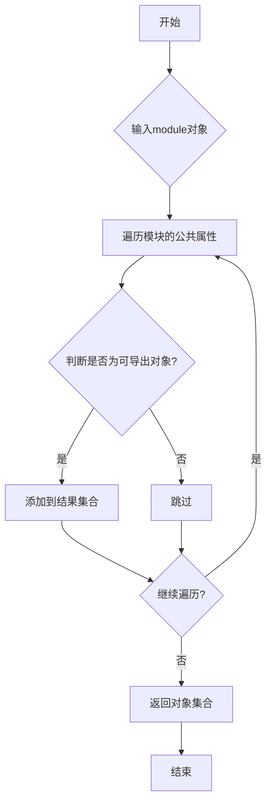
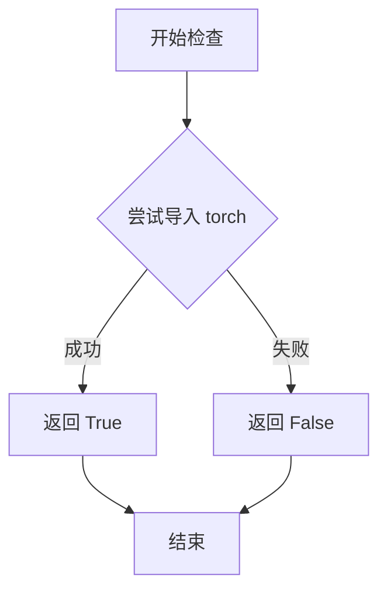
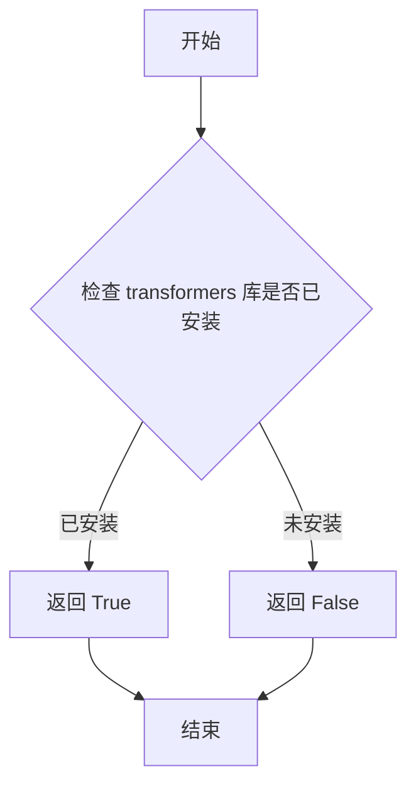

# `diffusers\src\diffusers\pipelines\cogvideo\__init__.py` 详细设计文档

这是Diffusers库中CogVideoX模块的延迟导入初始化文件，采用_LazyModule机制实现可选依赖（torch和transformers）的动态加载，当依赖不可用时自动回退到虚拟对象以保持API兼容性，并导出CogVideoX系列的四个视频处理管道：CogVideoXPipeline、CogVideoXFunControlPipeline、CogVideoXImageToVideoPipeline和CogVideoXVideoToVideoPipeline。

## 整体流程

```mermaid
graph TD
    A[模块加载] --> B{TYPE_CHECKING 或 DIFFUSERS_SLOW_IMPORT?}
    B -- 是 --> C{is_transformers_available() && is_torch_available()?}
    C -- 否 --> D[抛出 OptionalDependencyNotAvailable]
    D --> E[导入 dummy_torch_and_transformers_objects]
    C -- 是 --> F[从子模块导入真实管道类]
    B -- 否 --> G[创建 _LazyModule 实例]
    G --> H[将 _dummy_objects 设置到 sys.modules]
```

## 类结构

```
CogVideoX模块
├── CogVideoXPipeline (文本到视频管道)
├── CogVideoXFunControlPipeline (功能控制管道)
├── CogVideoXImageToVideoPipeline (图像到视频管道)
└── CogVideoXVideoToVideoPipeline (视频到视频管道)
```

## 全局变量及字段


### `_dummy_objects`
    
存储虚拟对象的字典，用于在可选依赖不可用时提供替代对象。

类型：`dict`
    


### `_import_structure`
    
定义模块导入结构的字典，映射子模块到其导出的类或函数名列表。

类型：`dict`
    


### `DIFFUSERS_SLOW_IMPORT`
    
标志，指示是否启用慢速导入模式以进行类型检查。

类型：`bool`
    


### `OptionalDependencyNotAvailable`
    
可选依赖项不可用时抛出的异常类。

类型：`exception`
    


### `_LazyModule`
    
延迟加载模块的类，用于按需导入模块以提高效率。

类型：`class`
    


### `get_objects_from_module`
    
从指定模块中提取所有公共对象的函数。

类型：`function`
    


### `is_torch_available`
    
检查PyTorch库是否已安装并可导入的函数。

类型：`function`
    


### `is_transformers_available`
    
检查Transformers库是否已安装并可导入的函数。

类型：`function`
    


### `TYPE_CHECKING`
    
类型检查标志，在类型检查期间为True，否则为False。

类型：`bool`
    


    

## 全局函数及方法


### `get_objects_from_module`

该函数是一个工具函数，用于从给定模块中提取所有可导出对象（类、函数等），常用于延迟加载（lazy loading）机制中获取dummy对象或占位对象，以便在依赖不可用时保持模块接口完整性。

参数：

- `module`：`module`，要提取对象的模块对象，通常为dummy模块或实际模块

返回值：`dict` 或可迭代对象，包含模块中所有的导出对象，键为对象名称，值为对象本身

#### 流程图



#### 带注释源码

```python
# 从 utils 模块导入的辅助函数
# 用于从模块中提取所有可导出对象
from ...utils import get_objects_from_module

# 使用示例：
# 当 OptionalDependencyNotAvailable 异常被触发时
# 从 dummy_torch_and_transformers_objects 模块获取虚拟对象
_dummy_objects = {}

try:
    if not (is_transformers_available() and is_torch_available()):
        raise OptionalDependencyNotAvailable()
except OptionalDependencyNotAvailable:
    # 导入 dummy 模块（包含空的占位类/函数）
    from ...utils import dummy_torch_and_transformers_objects
    
    # 使用 get_objects_from_module 提取 dummy 模块中的所有对象
    # 返回一个包含对象名称到对象映射的字典或类似结构
    _dummy_objects.update(get_objects_from_module(dummy_torch_and_transformers_objects))
else:
    # 依赖可用时，定义实际的导入结构
    _import_structure["pipeline_cogvideox"] = ["CogVideoXPipeline"]
    # ... 其他 pipeline 类
```

#### 关键组件信息

| 组件名称 | 一句话描述 |
|---------|-----------|
| `_dummy_objects` | 存储虚拟/占位对象的字典，用于依赖不可用时保持模块接口 |
| `_import_structure` | 定义模块的导入结构，用于延迟加载机制 |
| `_LazyModule` | 自定义模块类，实现延迟加载功能 |
| `OptionalDependencyNotAvailable` | 可选依赖不可用时的异常类 |

#### 潜在技术债务与优化空间

1. **隐式依赖处理**：依赖可用性的检查逻辑分散在多处（try-except 块和 TYPE_CHECK 条件），可考虑统一封装
2. **魔法字符串**：模块名称（如 `dummy_torch_and_transformers_objects`）硬编码，可提取为配置常量
3. **重复代码**：两次检查 `is_transformers_available() and is_torch_available()`，可合并为统一入口

#### 其它说明

**设计目标与约束**：
- 实现可选依赖的优雅降级，当 torch/transformers 不可用时仍能导入模块（获得 dummy 对象）
- 支持类型检查时的静态导入（TYPE_CHECKING）和运行时的延迟导入

**错误处理**：
- 使用 `OptionalDependencyNotAvailable` 异常标记可选依赖不可用状态
- 通过 try-except 捕获异常并回退到 dummy 对象

**外部依赖**：
- 依赖 `transformers` 和 `torch` 库
- 依赖 `diffusers` 内部的 `dummy_torch_and_transformers_objects` 模块


### `is_torch_available`

该函数用于检测当前环境中 PyTorch 库是否已安装并可用，返回布尔值以决定后续的条件导入逻辑。

参数：无

返回值：`bool`，如果 PyTorch 可用返回 `True`，否则返回 `False`

#### 流程图



#### 带注释源码

```
# 此函数定义位于 ...utils 模块中
# 以下为调用方代码示例

from ...utils import is_torch_available

# 在 __init__.py 中的使用方式
try:
    if not (is_transformers_available() and is_torch_available()):
        raise OptionalDependencyNotAvailable()
except OptionalDependencyNotAvailable:
    # 导入虚拟对象作为占位符
    from ...utils import dummy_torch_and_transformers_objects
    _dummy_objects.update(get_objects_from_module(dummy_torch_and_transformers_objects))
else:
    # 当 torch 和 transformers 都可用时，导入实际的 pipeline 类
    _import_structure["pipeline_cogvideox"] = ["CogVideoXPipeline"]
    _import_structure["pipeline_cogvideox_fun_control"] = ["CogVideoXFunControlPipeline"]
    _import_structure["pipeline_cogvideox_image2video"] = ["CogVideoXImageToVideoPipeline"]
    _import_structure["pipeline_cogvideox_video2video"] = ["CogVideoXVideoToVideoPipeline"]
```

> **注意**：由于 `is_torch_available` 函数的实际实现源码不在当前代码片段中，以上信息基于代码上下文推断。该函数通常在 `diffusers` 库的 `src/diffusers/utils/` 目录下的 `__init__.py` 或 `import_utils.py` 文件中定义，其核心逻辑是通过尝试 `import torch` 来判断 PyTorch 是否可用。


### `is_transformers_available`

该函数用于检查 `transformers` 库在当前环境中是否可用（已安装），返回一个布尔值表示依赖是否满足。

参数：
- 无

返回值：`bool`，返回 `True` 表示 `transformers` 库可用，返回 `False` 表示不可用。

#### 流程图



#### 带注释源码

```python
# is_transformers_available 是从 ...utils 导入的函数
# 该函数的具体实现不在当前文件中
# 其作用是运行时检查 transformers 库是否可用

# 使用示例（在当前文件中）:
if not (is_transformers_available() and is_torch_available()):
    # 当 transformers 或 torch 不可用时
    raise OptionalDependencyNotAvailable()
```

> **注意**: 由于 `is_transformers_available` 是从 `...utils` 导入的外部函数，该代码片段仅展示其在当前文件中的使用方式，而非函数本身的完整实现。该函数通常在 `diffusers` 库的 `src/diffusers/utils/__init__.py` 或类似位置定义，其核心逻辑是通过尝试导入 `transformers` 模块来判断库是否可用。

## 关键组件


### 可选依赖检查与处理

负责检查`torch`和`transformers`两个可选依赖是否同时可用，如果不可用则导入虚拟对象以保持模块接口一致性

### 延迟加载机制

使用`_LazyModule`实现模块的惰性加载，仅在实际使用时才加载具体的Pipeline类，优化启动性能和内存占用

### 导入结构映射

定义模块的公开接口结构，将字符串名称映射到实际的Pipeline类名，支持延迟导入和模块动态解析

### 虚拟对象回退

当可选依赖不可用时，提供虚假的Pipeline类对象作为占位符，确保库在缺少依赖时仍可被导入（虽然功能受限）

### CogVideoXPipeline

CogVideoX视频生成主管道，支持文本到视频的生成任务

### CogVideoXFunControlPipeline

CogVideoX_fun_control管道，支持带功能控制的视频生成，可能包含姿态、深度等控制信号

### CogVideoXImageToVideoPipeline

CogVideoX图像到视频管道，支持基于输入图像生成动态视频内容

### CogVideoXVideoToVideoPipeline

CogVideoX视频到视频管道，支持对已有视频进行重生成或风格转换等处理


## 问题及建议


### 已知问题

-   **重复的依赖检查逻辑**：第10-16行和第26-32行存在完全相同的可选依赖检查代码（`if not (is_transformers_available() and is_torch_available()): raise OptionalDependencyNotAvailable()`），违反了DRY原则。
-   **无效代码路径**：第16行`_dummy_objects.update(get_objects_from_module(dummy_torch_and_transformers_objects))`仅在依赖不可用时执行，但如果依赖可用（else分支），这些_dummy_objects永远不会被使用，造成资源浪费和逻辑混乱。
-   **魔法字符串硬编码**：pipeline名称（如"pipeline_cogvideox"）直接以字符串形式散布在代码中，缺乏集中管理，容易导致拼写错误或维护困难。
-   **类型注解缺失**：全局变量`_import_structure`和`_dummy_objects`缺乏明确的类型注解，影响代码可读性和静态分析工具的有效性。
-   **TYPE_CHECKING与DIFFUSERS_SLOW_IMPORT混合使用**：将两个不同语义的条件合并处理，可能导致在某些导入场景下行为不符合预期。
-   **缺乏错误处理机制**：当底层模块导入失败或`get_objects_from_module`返回异常时，没有try-except保护，可能导致程序崩溃。

### 优化建议

-   **提取依赖检查逻辑**：将可选依赖检查封装为单独的函数或变量，避免重复代码。例如：`_dependencies_available = is_transformers_available() and is_torch_available()`。
-   **清理无效代码**：当依赖可用时，可以移除或注释掉无用的_dummy_objects相关逻辑，或者将其移到独立的fallback模块中。
-   **集中管理pipeline名称**：定义常量或配置文件来管理所有pipeline名称，例如`PIPELINE_NAMES = {"pipeline_cogvideox": [...], ...}`。
-   **添加类型注解**：为_import_structure和_dummy_objects添加类型注解，如`_import_structure: Dict[str, List[str]]`。
-   **分离导入条件**：根据TYPE_CHECKING和DIFFUSERS_SLOW_IMPORT的不同语义，分别处理两种导入场景。
-   **增强错误处理**：在关键导入路径添加try-except块，并提供有意义的错误信息或降级策略。
-   **添加日志记录**：在导入过程中添加日志记录点，便于排查导入问题。


## 其它


### 设计目标与约束

本模块采用延迟加载（Lazy Loading）机制，旨在优化Diffusers库的导入性能，仅在用户实际使用CogVideoX管道时才加载相关模块。设计约束包括：必须同时满足torch和transformers两个可选依赖才能正常加载，否则回退到虚拟对象（Dummy Objects）；遵循Diffusers库的_import_structure约定，确保与包结构保持一致；使用_TYPE_CHECKING或DIFFUSERS_SLOW_IMPORT标志控制类型检查时的行为。

### 错误处理与异常设计

模块使用OptionalDependencyNotAvailable异常来处理可选依赖不可用的情况。当torch或transformers任一依赖缺失时，捕获该异常并从dummy_torch_and_transformers_objects模块导入虚拟对象，填充_dummy_objects字典，确保模块在缺少依赖时仍可被导入但调用时会抛出正确的错误。所有实际导入操作被包装在try-except块中，实现优雅降级。

### 数据流与状态机

模块初始化时首先定义_import_structure字典和_dummy_objects字典，随后检查依赖可用性。根据DIFFUSERS_SLOW_IMPORT或TYPE_CHECKING标志决定加载模式：如果为True则立即导入真实类；否则使用_LazyModule包装，实现运行时延迟加载。模块最终通过setattr将虚拟对象绑定到sys.modules，确保API一致性。整个流程为单次初始化，无状态机循环。

### 外部依赖与接口契约

本模块依赖以下外部组件：torch（可选）、transformers（可选）、diffusers.utils中的_LazyModule、get_objects_from_module、OptionalDependencyNotAvailable等工具函数。模块导出四个管道类：CogVideoXPipeline、CogVideoXFunControlPipeline、CogVideoXImageToVideoPipeline、CogVideoXVideoToVideoPipeline。所有导出类遵循Diffusers标准的Pipeline接口契约。

### 版本兼容性信息

本模块设计用于Diffusers库的最新版本，依赖torch和transformers的兼容性由is_torch_available和is_transformers_available函数检查。建议使用Python 3.8+环境，torch 1.9.0+和transformers 4.20.0+版本以获得最佳兼容性。

### 性能考虑

采用_LazyModule实现延迟加载可将初始导入时间从O(n)降低到O(1)，其中n为管道数量。仅当用户执行from diffusers import CogVideoXPipeline等显式导入时才触发模块加载。虚拟对象的存在避免了在依赖缺失时导入失败，提升了库的可用性。

### 安全考虑

模块本身不涉及用户输入处理或网络请求，主要安全风险在于依赖的torch和transformers库。应确保使用官方PyPI发布的稳定版本，避免使用来路不明的自定义依赖。模块通过sys.modules动态注入对象时应确保命名空间隔离。

### 测试策略

建议包含以下测试用例：1）完整依赖环境下的导入测试；2）缺少任一依赖时的回退测试；3）TYPE_CHECKING模式下的类型导入测试；4）LazyModule延迟加载行为验证；5）虚拟对象调用时的错误提示测试。可使用pytest和unittest框架实现。

### 配置说明

本模块无需显式配置。行为受以下环境变量影响：DIFFUSERS_SLOW_IMPORT设置为True时启用完整导入模式；PYTHONPATH需包含diffusers包路径。管道参数配置由各个Pipeline类自行定义，不在本模块范围内。

### 使用示例

```python
# 标准导入（延迟加载）
from diffusers import CogVideoXPipeline

# 类型检查导入
from typing import TYPE_CHECKING
if TYPE_CHECKING:
    from diffusers import CogVideoXImageToVideoPipeline

# 完整导入模式
import os
os.environ["DIFFUSERS_SLOW_IMPORT"] = "1"
from diffusers import CogVideoXVideoToVideoPipeline
```

    