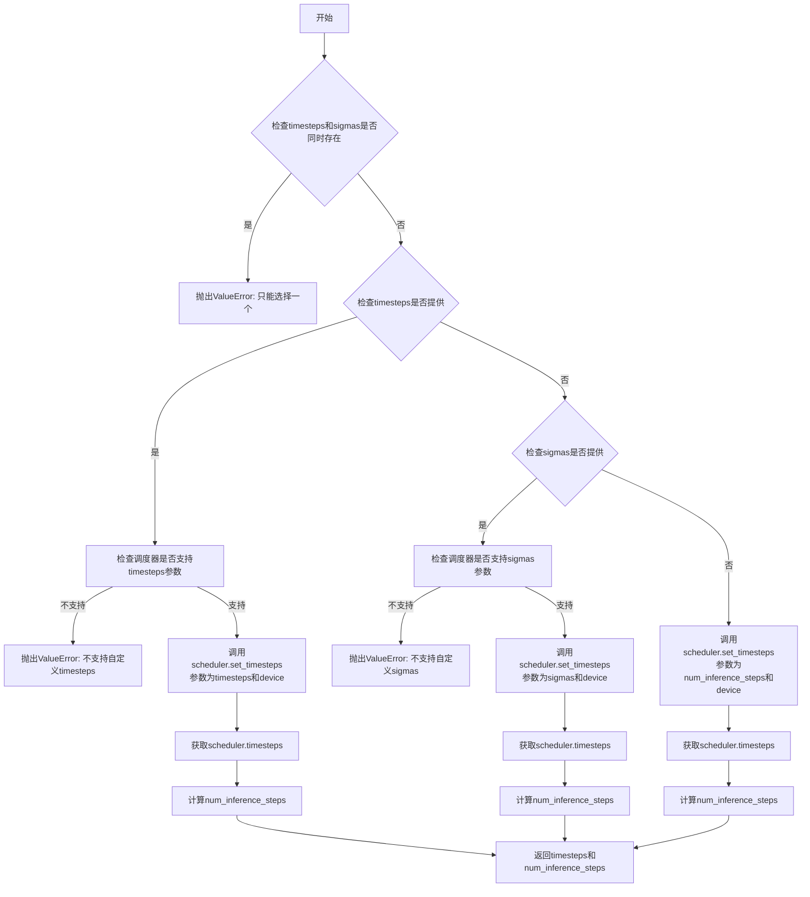
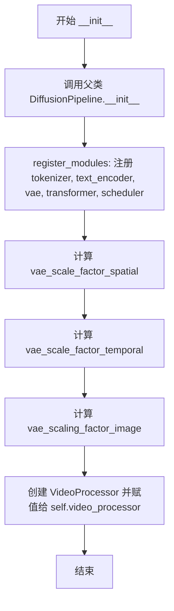
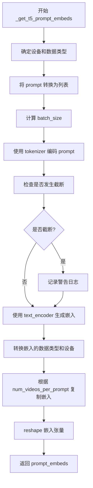
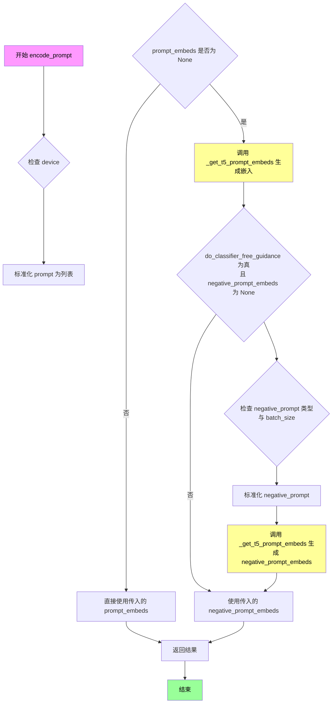
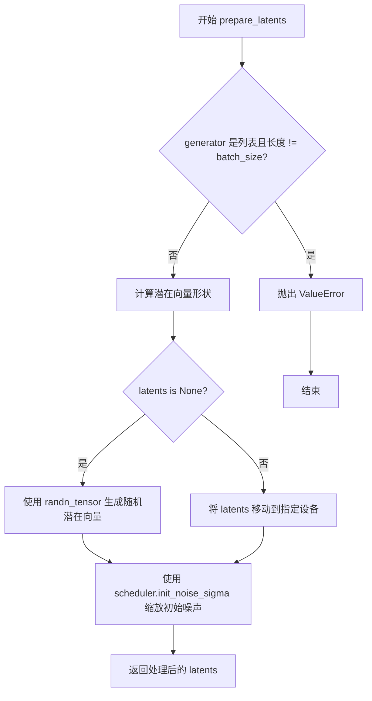
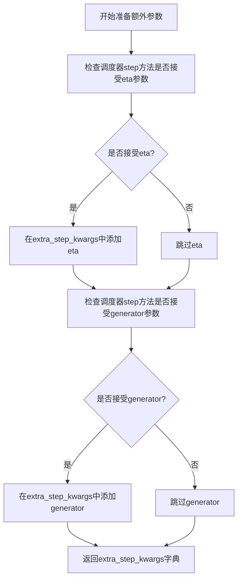
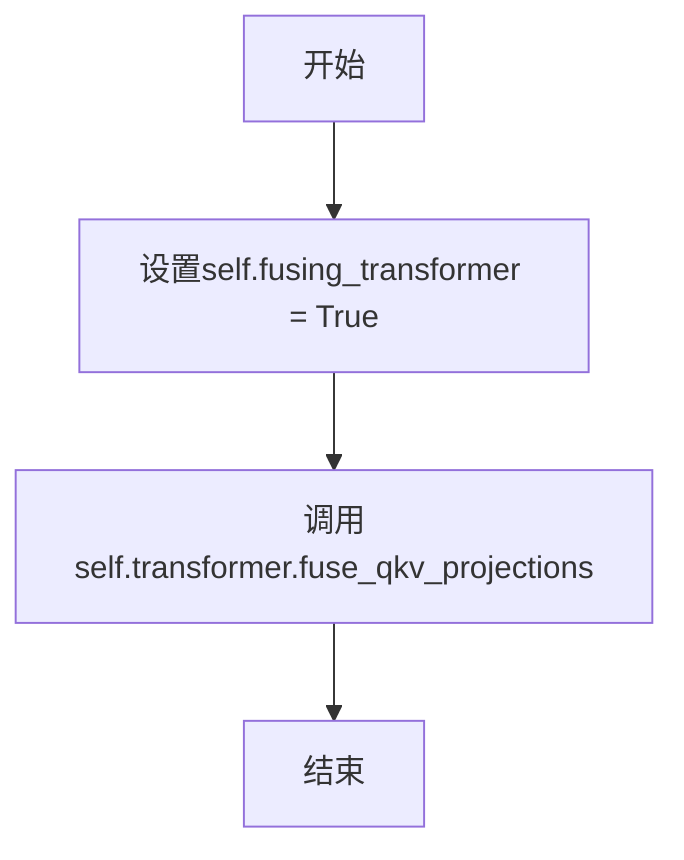
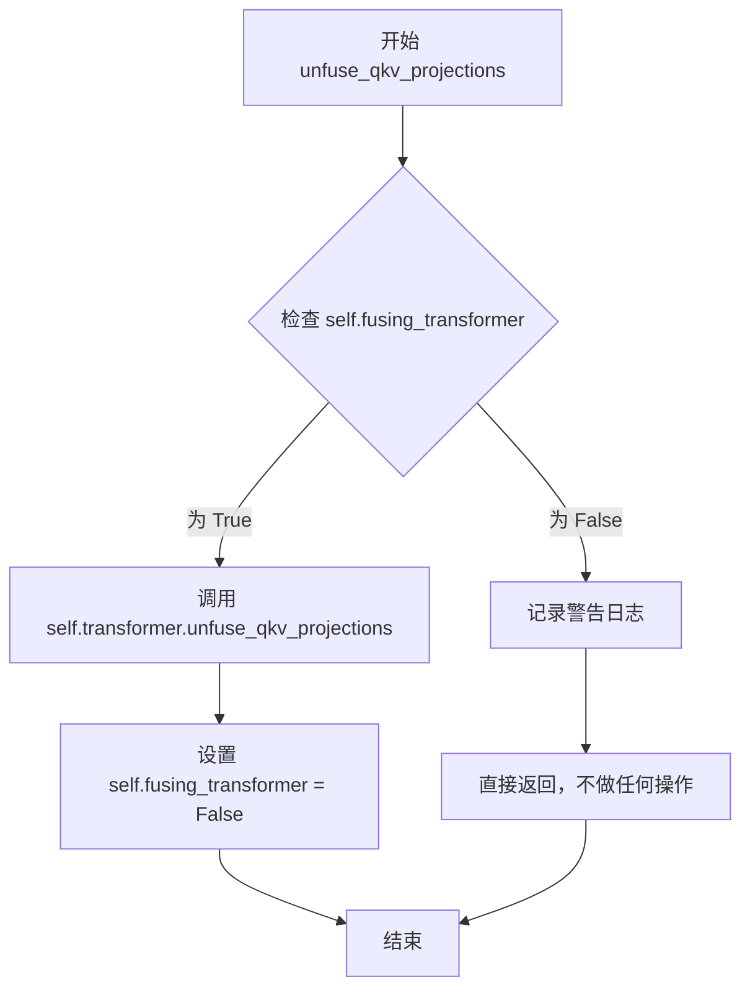
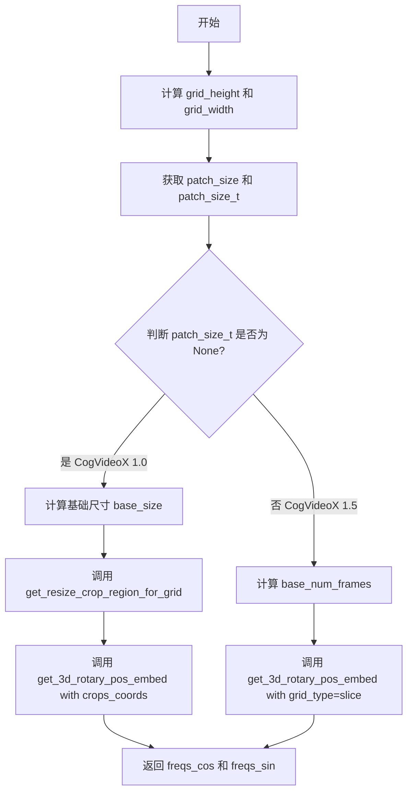
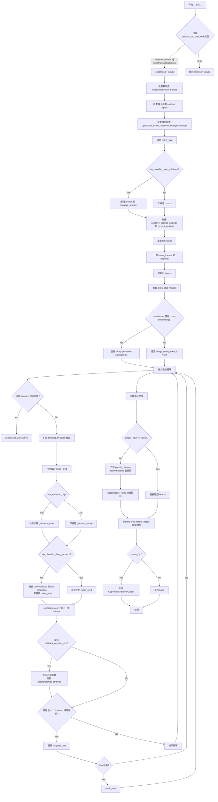

# `diffusers\src\diffusers\pipelines\cogvideo\pipeline_cogvideox.py` 详细设计文档

CogVideoXPipeline是一个用于文本到视频生成的扩散管道,继承自DiffusionPipeline,结合T5文本编码器、VAE视频编码器/解码器和CogVideoXTransformer3DModel变换器模型,通过扩散采样过程从文本提示生成视频。

## 整体流程

```mermaid
graph TD
A[开始: __call__] --> B[检查输入参数 check_inputs]
B --> C[获取batch_size]
C --> D[编码提示词 encode_prompt]
D --> E[准备时间步 retrieve_timesteps]
E --> F[准备潜在向量 prepare_latents]
F --> G[准备额外调度器参数 prepare_extra_step_kwargs]
G --> H{是否使用旋转位置嵌入?}
H -- 是 --> I[创建旋转嵌入 _prepare_rotary_positional_embeddings]
H -- 否 --> J[设为None]
I --> J
J --> K[去噪循环开始]
K --> L{遍历每个时间步}
L --> M[扩展输入并进行分类器自由引导]
M --> N[调用transformer预测噪声]
N --> O{是否使用动态cfg?]
O -- 是 --> P[动态计算guidance_scale]
O -- 否 --> Q[使用静态guidance_scale]
P --> R[执行分类器自由引导]
Q --> R
R --> S[调度器执行去噪步骤]
S --> T[执行回调函数]
T --> U{是否还有时间步?}
U -- 是 --> L
U -- 否 --> V[解码潜在向量 decode_latents]
V --> W[后处理视频 video_processor.postprocess_video]
W --> X[释放模型钩子 maybe_free_model_hooks]
X --> Y[返回CogVideoXPipelineOutput]
```

## 类结构

```
DiffusionPipeline (基类)
├── CogVideoXLoraLoaderMixin (LoRA加载Mixin)
└── CogVideoXPipeline (主类)
```

## 全局变量及字段


### `EXAMPLE_DOC_STRING`
    
示例文档字符串，包含代码使用示例

类型：`str`
    


### `logger`
    
日志记录器，用于记录管道运行过程中的信息

类型：`Logger`
    


### `XLA_AVAILABLE`
    
Torch XLA可用性标志，指示是否支持TPU加速

类型：`bool`
    


### `CogVideoXPipeline.tokenizer`
    
T5分词器，用于将文本提示转换为token序列

类型：`T5Tokenizer`
    


### `CogVideoXPipeline.text_encoder`
    
T5文本编码器，用于将token序列编码为文本嵌入

类型：`T5EncoderModel`
    


### `CogVideoXPipeline.vae`
    
视频VAE编解码器，用于在潜在空间和像素空间之间转换视频

类型：`AutoencoderKLCogVideoX`
    


### `CogVideoXPipeline.transformer`
    
视频生成变换器，在扩散过程中对视频潜在向量进行去噪

类型：`CogVideoXTransformer3DModel`
    


### `CogVideoXPipeline.scheduler`
    
扩散调度器，控制去噪过程中的时间步调度

类型：`CogVideoXDDIMScheduler | CogVideoXDPMScheduler`
    


### `CogVideoXPipeline.vae_scale_factor_spatial`
    
VAE空间缩放因子，用于计算视频帧的空间尺寸

类型：`int`
    


### `CogVideoXPipeline.vae_scale_factor_temporal`
    
VAE时间缩放因子，用于计算视频帧的时间维度

类型：`int`
    


### `CogVideoXPipeline.vae_scaling_factor_image`
    
VAE图像缩放因子，用于归一化潜在向量

类型：`float`
    


### `CogVideoXPipeline.video_processor`
    
视频处理器，用于视频后处理和格式转换

类型：`VideoProcessor`
    


### `CogVideoXPipeline.model_cpu_offload_seq`
    
模型CPU卸载顺序，指定模型组件的卸载优先级

类型：`str`
    


### `CogVideoXPipeline._callback_tensor_inputs`
    
回调张量输入列表，指定哪些张量可传递给回调函数

类型：`list`
    


### `CogVideoXPipeline._guidance_scale`
    
引导尺度，控制分类器自由引导的强度

类型：`float`
    


### `CogVideoXPipeline._num_timesteps`
    
时间步数，记录扩散过程的总步数

类型：`int`
    


### `CogVideoXPipeline._attention_kwargs`
    
注意力参数字典，存储注意力机制的额外配置

类型：`dict`
    


### `CogVideoXPipeline._current_timestep`
    
当前时间步，记录扩散过程中的当前步

类型：`int`
    


### `CogVideoXPipeline._interrupt`
    
中断标志，用于控制管道执行的中断状态

类型：`bool`
    


### `CogVideoXPipeline.fusing_transformer`
    
变换器融合标志，指示QKV投影是否已融合

类型：`bool`
    
    

## 全局函数及方法


### `get_resize_crop_region_for_grid`

该函数用于计算将源图像（视频帧）调整大小并裁剪到目标尺寸时的裁剪区域。它通过保持宽高比来调整图像大小，然后计算中心裁剪的坐标，确保图像内容最大化保留。

参数：

- `src`：`tuple`，源图像的尺寸，格式为 (height, width)
- `tgt_width`：`int`，目标宽度
- `tgt_height`：`int`，目标高度

返回值：`tuple`，包含两个坐标元组：
  - 第一个元素为裁剪区域的左上角坐标 (crop_top, crop_left)
  - 第二个元素为裁剪区域的右下角坐标 (crop_top + resize_height, crop_left + resize_width)

#### 流程图

```mermaid
flowchart TD
    A[开始] --> B[获取目标尺寸 tw, th 和源尺寸 h, w]
    B --> C[计算源宽高比 r = h / w]
    C --> D{判断 r > th / tw}
    D -->|是| E[设置 resize_height = th]
    D -->|否| F[设置 resize_width = tw]
    E --> G[计算 resize_width = round(th / h * w)]
    F --> H[计算 resize_height = round(tw / w * h)]
    G --> I[计算裁剪左上角坐标 crop_top, crop_left]
    H --> I
    I --> J[计算裁剪右下角坐标]
    J --> K[返回裁剪区域坐标]
```

#### 带注释源码

```python
# Similar to diffusers.pipelines.hunyuandit.pipeline_hunyuandit.get_resize_crop_region_for_grid
def get_resize_crop_region_for_grid(src, tgt_width, tgt_height):
    """
    计算调整大小和裁剪区域，用于将源图像调整到目标尺寸
    
    参数:
        src: 源图像尺寸元组 (height, width)
        tgt_width: 目标宽度
        tgt_height: 目标高度
    
    返回:
        裁剪区域坐标 ((crop_top, crop_left), (crop_bottom, crop_right))
    """
    # 目标尺寸
    tw = tgt_width
    th = tgt_height
    
    # 解包源图像尺寸 (高度, 宽度)
    h, w = src
    
    # 计算源图像宽高比
    r = h / w
    
    # 根据宽高比决定调整策略：保持宽高比，将图像缩放到能填满目标尺寸
    if r > (th / tw):
        # 源图像更高（相对于目标尺寸），以高度为基准调整
        resize_height = th  # 高度填满目标高度
        resize_width = int(round(th / h * w))  # 按比例计算宽度
    else:
        # 源图像更宽，以宽度为基准调整
        resize_width = tw  # 宽度填满目标宽度
        resize_height = int(round(tw / w * h))  # 按比例计算高度

    # 计算中心裁剪的左上角坐标
    # 使裁剪区域在目标区域内居中
    crop_top = int(round((th - resize_height) / 2.0))
    crop_left = int(round((tw - resize_width) / 2.0))

    # 返回裁剪区域的左上角和右下角坐标
    # 格式: ((top, left), (bottom, right))
    return (crop_top, crop_left), (crop_top + resize_height, crop_left + resize_width)
```


### `retrieve_timesteps`

该函数用于从扩散调度器获取时间步序列。它调用调度器的 `set_timesteps` 方法并检索设置后的时间步，同时处理自定义时间步（timesteps）或自定义sigmas的情况，支持将额外的关键字参数传递给调度器。

参数：

- `scheduler`：`SchedulerMixin`，要获取时间步的调度器对象
- `num_inference_steps`：`int | None`，生成样本时使用的扩散步数，如果使用此参数，则 `timesteps` 必须为 `None`
- `device`：`str | torch.device | None`，时间步要移动到的设备，如果为 `None` 则不移动
- `timesteps`：`list[int] | None`，用于覆盖调度器时间步间隔策略的自定义时间步，如果传递了 `timesteps`，则 `num_inference_steps` 和 `sigmas` 必须为 `None`
- `sigmas`：`list[float] | None`，用于覆盖调度器时间步间隔策略的自定义sigmas，如果传递了 `sigmas`，则 `num_inference_steps` 和 `timesteps` 必须为 `None`
- `**kwargs`：任意关键字参数，将传递给 `scheduler.set_timesteps`

返回值：`tuple[torch.Tensor, int]`，第一个元素是调度器的时间步调度，第二个元素是推理步数

#### 流程图



#### 带注释源码

```python
# 从稳定扩散管道复制的函数
def retrieve_timesteps(
    scheduler,
    num_inference_steps: int | None = None,
    device: str | torch.device | None = None,
    timesteps: list[int] | None = None,
    sigmas: list[float] | None = None,
    **kwargs,
):
    r"""
    调用调度器的 `set_timesteps` 方法并在调用后从调度器检索时间步。
    处理自定义时间步。任何 kwargs 将被提供给 `scheduler.set_timesteps`。

    参数:
        scheduler (`SchedulerMixin`):
            要获取时间步的调度器。
        num_inference_steps (`int`):
            使用预训练模型生成样本时使用的扩散步数。如果使用此参数，
            `timesteps` 必须为 `None`。
        device (`str` 或 `torch.device`, *可选*):
            时间步应移动到的设备。如果为 `None`，则不移动时间步。
        timesteps (`list[int]`, *可选*):
            用于覆盖调度器时间步间隔策略的自定义时间步。如果传递了 `timesteps`，
            则 `num_inference_steps` 和 `sigmas` 必须为 `None`。
        sigmas (`list[float]`, *可选*):
            用于覆盖调度器时间步间隔策略的自定义 sigmas。如果传递了 `sigmas`，
            则 `num_inference_steps` 和 `timesteps` 必须为 `None`。

    返回值:
        `tuple[torch.Tensor, int]`: 元组，其中第一个元素是调度器的时间步调度，
        第二个元素是推理步数。
    """
    # 检查是否同时提供了timesteps和sigmas，这是不允许的
    if timesteps is not None and sigmas is not None:
        raise ValueError("只能传递 `timesteps` 或 `sigmas` 之一。请选择一个来设置自定义值")
    
    # 处理自定义timesteps的情况
    if timesteps is not None:
        # 检查调度器的set_timesteps方法是否接受timesteps参数
        accepts_timesteps = "timesteps" in set(inspect.signature(scheduler.set_timesteps).parameters.keys())
        if not accepts_timesteps:
            raise ValueError(
                f"当前调度器类 {scheduler.__class__} 的 `set_timesteps` 不支持自定义"
                f" 时间步调度。请检查您是否使用了正确的调度器。"
            )
        # 调用调度器的set_timesteps方法，传入自定义timesteps
        scheduler.set_timesteps(timesteps=timesteps, device=device, **kwargs)
        # 获取调度器内部的时间步
        timesteps = scheduler.timesteps
        # 计算推理步数
        num_inference_steps = len(timesteps)
    
    # 处理自定义sigmas的情况
    elif sigmas is not None:
        # 检查调度器的set_timesteps方法是否接受sigmas参数
        accept_sigmas = "sigmas" in set(inspect.signature(scheduler.set_timesteps).parameters.keys())
        if not accept_sigmas:
            raise ValueError(
                f"当前调度器类 {scheduler.__class__} 的 `set_timesteps` 不支持自定义"
                f" sigmas 调度。请检查您是否使用了正确的调度器。"
            )
        # 调用调度器的set_timesteps方法，传入自定义sigmas
        scheduler.set_timesteps(sigmas=sigmas, device=device, **kwargs)
        # 获取调度器内部的时间步
        timesteps = scheduler.timesteps
        # 计算推理步数
        num_inference_steps = len(timesteps)
    
    # 没有提供自定义timesteps或sigmas，使用默认行为
    else:
        # 调用调度器的set_timesteps方法，使用num_inference_steps
        scheduler.set_timesteps(num_inference_steps, device=device, **kwargs)
        # 获取调度器内部的时间步
        timesteps = scheduler.timesteps
    
    # 返回时间步和推理步数
    return timesteps, num_inference_steps
```


### `CogVideoXPipeline.__init__`

该方法是 `CogVideoXPipeline` 类的构造函数，用于初始化文本到视频生成管道的核心组件，包括分词器、文本编码器、VAE模型、Transformer模型和调度器，并配置相关的缩放因子和视频处理器。

参数：

- `tokenizer`：`T5Tokenizer`，T5分词器，用于将文本prompt编码为token序列
- `text_encoder`：`T5EncoderModel`，T5文本编码器模型，用于将token序列转换为文本嵌入向量
- `vae`：`AutoencoderKLCogVideoX`，CogVideoX的变分自编码器，用于编码和解码视频 latent 表示
- `transformer`：`CogVideoXTransformer3DModel`，CogVideoX的3D Transformer模型，用于去噪视频latent
- `scheduler`：`CogVideoXDDIMScheduler | CogVideoXDPMScheduler`，调度器，用于控制去噪过程中的时间步

返回值：`None`，构造函数不返回任何值，仅初始化实例属性

#### 流程图



#### 带注释源码

```
def __init__(
    self,
    tokenizer: T5Tokenizer,  # T5分词器
    text_encoder: T5EncoderModel,  # T5文本编码器
    vae: AutoencoderKLCogVideoX,  # CogVideoX VAE模型
    transformer: CogVideoXTransformer3DModel,  # CogVideoX 3D Transformer
    scheduler: CogVideoXDDIMScheduler | CogVideoXDPMScheduler,  # 去噪调度器
):
    # 调用父类 DiffusionPipeline 的初始化方法
    super().__init__()

    # 注册所有模块到 pipeline 中，使其可通过 pipeline.xxx 访问
    self.register_modules(
        tokenizer=tokenizer, 
        text_encoder=text_encoder, 
        vae=vae, 
        transformer=transformer, 
        scheduler=scheduler
    )
    
    # 计算VAE空间缩放因子: 基于VAE block_out_channels数量计算
    # CogVideoX 默认为 8 (2^(4-1)=8, 假设有4个block)
    self.vae_scale_factor_spatial = (
        2 ** (len(self.vae.config.block_out_channels) - 1) if getattr(self, "vae", None) else 8
    )
    
    # 计算VAE时间缩放因子: 基于时间压缩比
    # CogVideoX 默认为 4
    self.vae_scale_factor_temporal = (
        self.vae.config.temporal_compression_ratio if getattr(self, "vae", None) else 4
    )
    
    # 获取VAE图像缩放因子
    # CogVideoX 默认为 0.7
    self.vae_scaling_factor_image = self.vae.config.scaling_factor if getattr(self, "vae", None) else 0.7

    # 创建视频后处理器，用于将VAE解码后的latent转换为最终视频输出
    self.video_processor = VideoProcessor(vae_scale_factor=self.vae_scale_factor_spatial)
```


### `CogVideoXPipeline._get_t5_prompt_embeds`

该函数是 CogVideoX 管道中的私有方法，主要用于将文本提示（prompt）转换为 T5 编码器可以处理的嵌入向量（embeddings）。它负责 tokenizer 编码、文本嵌入计算、类型转换以及为每个提示生成多个视频时的嵌入复制等核心功能。

参数：

- `self`：CogVideoXPipeline 实例，隐式参数
- `prompt`：`str | list[str] = None`，输入的文本提示，可以是单个字符串或字符串列表
- `num_videos_per_prompt`：`int = 1`，每个提示生成的视频数量，用于复制嵌入向量
- `max_sequence_length`：`int = 226`，最大序列长度，默认为 226 个 token
- `device`：`torch.device | None = None`，指定计算设备，若为 None 则使用执行设备
- `dtype`：`torch.dtype | None = None`，指定数据类型，若为 None 则使用文本编码器的数据类型

返回值：`torch.Tensor`，返回形状为 `(batch_size * num_videos_per_prompt, seq_len, hidden_dim)` 的提示嵌入张量

#### 流程图



#### 带注释源码

```python
def _get_t5_prompt_embeds(
    self,
    prompt: str | list[str] = None,
    num_videos_per_prompt: int = 1,
    max_sequence_length: int = 226,
    device: torch.device | None = None,
    dtype: torch.dtype | None = None,
):
    # 确定设备：如果未指定，则使用管道的执行设备
    device = device or self._execution_device
    # 确定数据类型：如果未指定，则使用文本编码器的数据类型
    dtype = dtype or self.text_encoder.dtype

    # 将单个字符串转换为列表，统一处理方式
    prompt = [prompt] if isinstance(prompt, str) else prompt
    # 计算批次大小
    batch_size = len(prompt)

    # 使用 tokenizer 将文本转换为 token IDs
    # padding="max_length": 填充到最大长度
    # max_length=max_sequence_length: 限制最大序列长度
    # truncation=True: 超过最大长度的部分进行截断
    # add_special_tokens=True: 添加特殊 tokens（如 start/end tokens）
    # return_tensors="pt": 返回 PyTorch 张量
    text_inputs = self.tokenizer(
        prompt,
        padding="max_length",
        max_length=max_sequence_length,
        truncation=True,
        add_special_tokens=True,
        return_tensors="pt",
    )
    text_input_ids = text_inputs.input_ids
    
    # 使用最长填充获取未截断的 token IDs，用于检测截断
    untruncated_ids = self.tokenizer(prompt, padding="longest", return_tensors="pt").input_ids

    # 检查是否发生了截断
    # 如果未截断的序列长度 >= 截断后的长度，且两者不相等，说明有内容被截断
    if untruncated_ids.shape[-1] >= text_input_ids.shape[-1] and not torch.equal(text_input_ids, untruncated_ids):
        # 解码被截断的部分并记录警告
        removed_text = self.tokenizer.batch_decode(untruncated_ids[:, max_sequence_length - 1 : -1])
        logger.warning(
            "The following part of your input was truncated because `max_sequence_length` is set to "
            f" {max_sequence_length} tokens: {removed_text}"
        )

    # 使用 T5 文本编码器生成文本嵌入
    # text_encoder 返回隐藏状态，取第一个元素即为嵌入
    prompt_embeds = self.text_encoder(text_input_ids.to(device))[0]
    # 转换嵌入的数据类型和设备到指定值
    prompt_embeds = prompt_embeds.to(dtype=dtype, device=device)

    # 复制文本嵌入以匹配每个提示生成的视频数量
    # 使用 mps 友好的方法进行复制
    _, seq_len, _ = prompt_embeds.shape
    # 在序列维度上重复 num_videos_per_prompt 次
    prompt_embeds = prompt_embeds.repeat(1, num_videos_per_prompt, 1)
    # reshape 为 (batch_size * num_videos_per_prompt, seq_len, hidden_dim)
    prompt_embeds = prompt_embeds.view(batch_size * num_videos_per_prompt, seq_len, -1)

    return prompt_embeds
```


### `CogVideoXPipeline.encode_prompt`

该方法负责将文本提示词（prompt）和负面提示词（negative_prompt）编码为文本编码器的隐藏状态向量（embeddings），支持无分类器自由引导（Classifier-Free Guidance），并在仅提供提示词时自动生成对应的嵌入向量。

参数：

- `prompt`：`str | list[str]`，要编码的文本提示词，支持单个字符串或字符串列表
- `negative_prompt`：`str | list[str] | None`，用于引导生成不应出现内容的负面提示词，当不启用引导时该参数被忽略
- `do_classifier_free_guidance`：`bool`，是否启用无分类器自由引导，默认为 True
- `num_videos_per_prompt`：`int`，每个提示词需要生成的视频数量，默认为 1
- `prompt_embeds`：`torch.Tensor | None`，预生成的提示词嵌入向量，可用于快速调整文本输入
- `negative_prompt_embeds`：`torch.Tensor | None`，预生成的负面提示词嵌入向量
- `max_sequence_length`：`int`，编码时使用的最大序列长度，默认为 226
- `device`：`torch.device | None`，指定计算设备
- `dtype`：`torch.dtype | None`，指定计算数据类型

返回值：`tuple[torch.Tensor, torch.Tensor]`，返回编码后的提示词嵌入向量和负面提示词嵌入向量组成的元组

#### 流程图



#### 带注释源码

```python
def encode_prompt(
    self,
    prompt: str | list[str],
    negative_prompt: str | list[str] | None = None,
    do_classifier_free_guidance: bool = True,
    num_videos_per_prompt: int = 1,
    prompt_embeds: torch.Tensor | None = None,
    negative_prompt_embeds: torch.Tensor | None = None,
    max_sequence_length: int = 226,
    device: torch.device | None = None,
    dtype: torch.dtype | None = None,
):
    r"""
    Encodes the prompt into text encoder hidden states.

    Args:
        prompt (`str` or `list[str]`, *optional*):
            prompt to be encoded
        negative_prompt (`str` or `list[str]`, *optional*):
            The prompt or prompts not to guide the image generation. If not defined, one has to pass
            `negative_prompt_embeds` instead. Ignored when not using guidance (i.e., ignored if `guidance_scale` is
            less than `1`).
        do_classifier_free_guidance (`bool`, *optional*, defaults to `True`):
            Whether to use classifier free guidance or not.
        num_videos_per_prompt (`int`, *optional*, defaults to 1):
            Number of videos that should be generated per prompt. torch device to place the resulting embeddings on
        prompt_embeds (`torch.Tensor`, *optional*):
            Pre-generated text embeddings. Can be used to easily tweak text inputs, *e.g.* prompt weighting. If not
            provided, text embeddings will be generated from `prompt` input argument.
        negative_prompt_embeds (`torch.Tensor`, *optional*):
            Pre-generated negative text embeddings. Can be used to easily tweak text inputs, *e.g.* prompt
            weighting. If not provided, negative_prompt_embeds will be generated from `negative_prompt` input
            argument.
        device: (`torch.device`, *optional*):
            torch device
        dtype: (`torch.dtype`, *optional*):
            torch dtype
    """
    # 确定执行设备，如果未指定则使用管道默认设备
    device = device or self._execution_device

    # 将单个字符串转换为列表，便于批量处理
    prompt = [prompt] if isinstance(prompt, str) else prompt
    if prompt is not None:
        batch_size = len(prompt)  # 获取批次大小
    else:
        batch_size = prompt_embeds.shape[0]  # 从已有嵌入获取批次大小

    # 如果未提供提示词嵌入，则从原始提示词生成
    if prompt_embeds is None:
        prompt_embeds = self._get_t5_prompt_embeds(
            prompt=prompt,
            num_videos_per_prompt=num_videos_per_prompt,
            max_sequence_length=max_sequence_length,
            device=device,
            dtype=dtype,
        )

    # 如果启用无分类器自由引导且未提供负面提示词嵌入，则生成负面提示词嵌入
    if do_classifier_free_guidance and negative_prompt_embeds is None:
        # 默认使用空字符串作为负面提示词
        negative_prompt = negative_prompt or ""
        # 将单个字符串或字符串列表扩展为批次大小
        negative_prompt = batch_size * [negative_prompt] if isinstance(negative_prompt, str) else negative_prompt

        # 类型检查：确保 negative_prompt 与 prompt 类型一致
        if prompt is not None and type(prompt) is not type(negative_prompt):
            raise TypeError(
                f"`negative_prompt` should be the same type to `prompt`, but got {type(negative_prompt)} !="
                f" {type(prompt)}."
            )
        # 批次大小检查：确保 negative_prompt 与 prompt 批次大小一致
        elif batch_size != len(negative_prompt):
            raise ValueError(
                f"`negative_prompt`: {negative_prompt} has batch size {len(negative_prompt)}, but `prompt`:"
                f" {prompt} has batch size {batch_size}. Please make sure that passed `negative_prompt` matches"
                " the batch size of `prompt`."
            )

        # 生成负面提示词嵌入
        negative_prompt_embeds = self._get_t5_prompt_embeds(
            prompt=negative_prompt,
            num_videos_per_prompt=num_videos_per_prompt,
            max_sequence_length=max_sequence_length,
            device=device,
            dtype=dtype,
        )

    return prompt_embeds, negative_prompt_embeds
```


### `CogVideoXPipeline.prepare_latents`

准备视频生成所需的初始潜在向量（latents），根据指定的批量大小、帧数、分辨率等参数生成或处理潜在向量，并应用调度器要求的初始噪声标准差进行缩放。

参数：

- `batch_size`：`int`，批量大小，即一次生成多少个视频样本
- `num_channels_latents`：`int`，潜在向量的通道数，由 transformer 模型的输入通道数决定
- `num_frames`：`int`，要生成的视频帧数
- `height`：`int`，生成视频的高度（像素）
- `width`：`int`，生成视频的宽度（像素）
- `dtype`：`torch.dtype`，潜在向量的数据类型（如 torch.float32）
- `device`：`torch.device`，潜在向量所在的设备（CPU 或 CUDA）
- `generator`：`torch.Generator | list[torch.Generator] | None`，随机数生成器，用于确保可重复性；若为列表则长度需与 batch_size 匹配
- `latents`：`torch.FloatTensor | None`，可选的预生成潜在向量；若为 None 则随机生成

返回值：`torch.Tensor`，形状为 `(batch_size, latent_frames, num_channels_latents, latent_height, latent_width)` 的潜在向量张量，其中 `latent_frames = (num_frames - 1) // vae_scale_factor_temporal + 1`

#### 流程图



#### 带注释源码

```python
def prepare_latents(
    self, batch_size, num_channels_latents, num_frames, height, width, dtype, device, generator, latents=None
):
    # 验证：如果传入生成器列表，其长度必须与批量大小匹配
    if isinstance(generator, list) and len(generator) != batch_size:
        raise ValueError(
            f"You have passed a list of generators of length {len(generator)}, but requested an effective batch"
            f" size of {batch_size}. Make sure the batch size matches the length of the generators."
        )

    # 计算潜在向量的形状，考虑 VAE 的时序和空间缩放因子
    # 时序维度：num_frames -> latent_frames = (num_frames - 1) // temporal_scale + 1
    # 空间维度：height/width -> latent_h/w = dimension // spatial_scale_factor
    shape = (
        batch_size,
        (num_frames - 1) // self.vae_scale_factor_temporal + 1,
        num_channels_latents,
        height // self.vae_scale_factor_spatial,
        width // self.vae_scale_factor_spatial,
    )

    # 如果未提供潜在向量，则使用随机张量生成初始噪声
    if latents is None:
        latents = randn_tensor(shape, generator=generator, device=device, dtype=dtype)
    else:
        # 否则将已有的潜在向量移动到目标设备
        latents = latents.to(device)

    # 根据调度器的要求缩放初始噪声标准差
    # 不同调度器（如 DDIM、DPM-Solver）可能使用不同的初始化噪声参数
    latents = latents * self.scheduler.init_noise_sigma
    return latents
```


### `CogVideoXPipeline.decode_latents`

该方法负责将经过扩散过程生成的潜在向量（latents）通过VAE解码器转换为实际的视频帧。它首先对潜在向量的维度进行调整以适配解码器的输入格式，然后利用预定义的缩放因子对潜在向量进行反归一化处理，最后调用VAE的decode方法完成从潜在空间到像素空间的转换。

参数：

- `self`：`CogVideoXPipeline` 类实例，管道对象本身
- `latents`：`torch.Tensor`，形状为 `[batch_size, num_frames, num_channels, height, width]` 的潜在向量张量，待解码的视频潜在表示

返回值：`torch.Tensor`，解码后的视频帧张量，形状为 `[batch_size, num_channels, num_frames, height, width]`，包含实际的像素值

#### 流程图

```mermaid
flowchart TD
    A[输入: latents] --> B[permute维度重排<br/>将维度从Batch/Time/Channel/Height/Width<br/>转换为Batch/Channel/Time/Height/Width]
    B --> C[反缩放处理<br/>latents = 1 / vae_scaling_factor_image * latents]
    C --> D[VAE解码<br/>调用 self.vae.decode(latents).sample]
    D --> E[输出: frames 视频帧]
    
    F[vae_scaling_factor_image<br/>来自VAE配置] --> C
    G[VAE模型<br/>AutoencoderKLCogVideoX] --> D
```

#### 带注释源码

```python
def decode_latents(self, latents: torch.Tensor) -> torch.Tensor:
    """
    将潜在向量解码为视频帧。
    
    该方法是CogVideoX管道生成流程的最后阶段之一，负责将经过扩散模型去噪处理后的
    潜在表示转换为实际的视频像素数据。
    
    参数:
        latents (torch.Tensor): 
            形状为 [batch_size, num_frames, num_channels, height, width] 的潜在张量。
            这些潜在向量是通过扩散过程生成的需要被解码的中间表示。
    
    返回:
        torch.Tensor: 
            形状为 [batch_size, num_channels, num_frames, height, width] 的解码后视频帧张量。
            包含实际的像素值，可以直接用于视频显示或保存。
    """
    # 第一步：维度重排
    # 将潜在向量从 [batch_size, num_frames, num_channels, height, width] 
    # 重新排列为 [batch_size, num_channels, num_frames, height, width]
    # 以适配VAE解码器的期望输入格式
    latents = latents.permute(0, 2, 1, 3, 4)
    
    # 第二步：反归一化处理
    # VAE在编码时会将数据缩放，这里需要逆向操作
    # vae_scaling_factor_image 通常为 0.7（来自VAE配置）
    # 通过除以这个因子来恢复原始数据的尺度
    latents = 1 / self.vae_scaling_factor_image * latents
    
    # 第三步：VAE解码
    # 调用VAE的decode方法将潜在向量解码为实际的视频帧
    # .sample 表示从解码器的分布中采样得到具体的像素值
    frames = self.vae.decode(latents).sample
    
    # 返回解码后的视频帧
    return frames
```

#### 关联的类成员信息

**类字段：**

- `self.vae`：`AutoencoderKLCogVideoX` 类型，CogVideoX的变分自编码器模型，负责潜在向量与像素空间的相互转换
- `self.vae_scaling_factor_image`：`float` 类型，来自VAE配置的缩放因子（通常为0.7），用于编码/解码时的归一化和反归一化

**调用关系：**

该方法在管道的 `__call__` 方法中被调用，时机是在扩散去噪过程完成后、输出最终视频前。具体位置在 `__call__` 方法的末尾，当 `output_type != "latent"` 时执行此解码操作。


### `CogVideoXPipeline.prepare_extra_step_kwargs`

该方法用于准备调度器（scheduler）的额外参数。由于不同调度器具有不同的签名接口，该方法通过反射检查调度器的 `step` 方法是否接受 `eta` 和 `generator` 参数，从而动态构建需要传递给调度器的额外关键字参数字典。

参数：

- `self`：`CogVideoXPipeline` 实例，管道对象本身
- `generator`：`torch.Generator | list[torch.Generator] | None`，用于生成确定性随机数的生成器对象
- `eta`：`float`，DDIM 调度器的参数 η，对应 DDIM 论文中的 η，取值范围应在 [0, 1] 之间

返回值：`dict`，包含额外参数的字典，可能包含 `eta` 和/或 `generator` 键值对，供调度器的 `step` 方法使用

#### 流程图



#### 带注释源码

```python
def prepare_extra_step_kwargs(self, generator, eta):
    """
    准备调度器额外参数。

    由于并非所有调度器都具有相同的签名接口，此方法通过检查调度器的 step 方法
    来确定其支持哪些额外参数，从而动态构建需要传递给调度器的参数字典。

    Args:
        generator: torch.Generator | list[torch.Generator] | None
            用于生成确定性随机数的生成器。如果提供，则可以确保多次运行生成相同结果。
        eta: float
            DDIM 调度器专用参数 η，对应 DDIM 论文中的参数。
            仅当调度器支持此参数时才会传递，其他调度器会忽略此参数。
            取值范围应在 [0, 1] 之间。

    Returns:
        dict: 包含额外参数的字典，可能包含 'eta' 和/或 'generator' 键值对。
    """
    # 使用 inspect 模块检查调度器 step 方法的签名参数
    # 获取调度器 step 方法的所有参数名集合
    accepts_eta = "eta" in set(inspect.signature(self.scheduler.step).parameters.keys())
    
    # 初始化空字典用于存储额外参数
    extra_step_kwargs = {}
    
    # 如果调度器接受 eta 参数，则将其添加到 extra_step_kwargs 中
    if accepts_eta:
        extra_step_kwargs["eta"] = eta

    # 检查调度器 step 方法是否接受 generator 参数
    accepts_generator = "generator" in set(inspect.signature(self.scheduler.step).parameters.keys())
    
    # 如果调度器接受 generator 参数，则将其添加到 extra_step_kwargs 中
    if accepts_generator:
        extra_step_kwargs["generator"] = generator
    
    # 返回构建好的参数字典，供调度器 step 方法使用
    return extra_step_kwargs
```


### `CogVideoXPipeline.check_inputs`

该方法用于验证传入文本转视频生成管道的输入参数有效性，包括高度、宽度、提示词、负提示词、嵌入向量等，确保用户提供的参数符合模型要求，否则抛出相应的 ValueError 异常。

参数：

- `prompt`：`str | list[str] | None`，要引导视频生成的提示词，若提供则不能与 `prompt_embeds` 同时使用
- `height`：`int`，生成视频的高度（像素），必须能被 8 整除
- `width`：`int`，生成视频的宽度（像素），必须能被 8 整除
- `negative_prompt`：`str | list[str] | None`，不引导视频生成的提示词，若提供则不能与 `negative_prompt_embeds` 同时使用
- `callback_on_step_end_tensor_inputs`：`list[str] | None`，在推理步骤结束时回调的 Tensor 输入列表，必须是 `_callback_tensor_inputs` 中的元素
- `prompt_embeds`：`torch.FloatTensor | None`，预生成的文本嵌入，不能与 `prompt` 同时使用
- `negative_prompt_embeds`：`torch.FloatTensor | None`，预生成的负向文本嵌入，不能与 `negative_prompt` 同时使用

返回值：`None`，该方法不返回任何值，仅通过抛出 ValueError 异常来处理无效输入。

#### 流程图

```mermaid
flowchart TD
    A[开始 check_inputs] --> B{height % 8 == 0 且 width % 8 == 0?}
    B -->|否| C[抛出 ValueError: height 和 width 必须能被 8 整除]
    B -->|是| D{callback_on_step_end_tensor_inputs 不为空?}
    D -->|是| E{callback_on_step_end_tensor_inputs 中的元素都在 _callback_tensor_inputs 中?}
    D -->|否| F{prompt 和 prompt_embeds 都存在?}
    E -->|否| G[抛出 ValueError: callback_on_step_end_tensor_inputs 无效]
    E -->|是| F
    F -->|是| H[抛出 ValueError: 不能同时提供 prompt 和 prompt_embeds]
    F -->|否| I{prompt 和 prompt_embeds 都为空?}
    I -->|是| J[抛出 ValueError: 必须提供 prompt 或 prompt_embeds 之一]
    I -->|否| K{prompt 不是 str 或 list 类型?}
    K -->|是| L[抛出 ValueError: prompt 类型错误]
    K -->|否| M{prompt 和 negative_prompt_embeds 同时存在?}
    M -->|是| N[抛出 ValueError: 不能同时提供 prompt 和 negative_prompt_embeds]
    M -->|否| O{negative_prompt 和 negative_prompt_embeds 同时存在?}
    O -->|是| P[抛出 ValueError: 不能同时提供 negative_prompt 和 negative_prompt_embeds]
    O -->|否| Q{prompt_embeds 和 negative_prompt_embeds 都存在?}
    Q -->|是| R{prompt_embeds 形状 != negative_prompt_embeds 形状?]
    Q -->|否| S[结束验证通过]
    R -->|是| T[抛出 ValueError: prompt_embeds 和 negative_prompt_embeds 形状不匹配]
    R -->|否| S
```

#### 带注释源码

```python
# 复制自 diffusers.pipelines.latte.pipeline_latte.LattePipeline.check_inputs
def check_inputs(
    self,
    prompt,                          # str | list[str] | None: 输入提示词
    height,                          # int: 视频高度
    width,                           # int: 视频宽度
    negative_prompt,                 # str | list[str] | None: 负向提示词
    callback_on_step_end_tensor_inputs,  # list[str] | None: 回调张量输入列表
    prompt_embeds=None,              # torch.FloatTensor | None: 预计算的提示词嵌入
    negative_prompt_embeds=None,     # torch.FloatTensor | None: 预计算的负向提示词嵌入
):
    """
    检查输入参数的有效性。
    
    该方法验证以下内容：
    1. height 和 width 必须能被 8 整除
    2. callback_on_step_end_tensor_inputs 必须是有效的张量输入
    3. prompt 和 prompt_embeds 不能同时提供
    4. 必须提供 prompt 或 prompt_embeds 之一
    5. prompt 必须是 str 或 list 类型
    6. prompt 和 negative_prompt_embeds 不能同时提供
    7. negative_prompt 和 negative_prompt_embeds 不能同时提供
    8. prompt_embeds 和 negative_prompt_embeds 形状必须匹配
    
    若任何检查失败，将抛出 ValueError 异常。
    """
    # 检查高度和宽度是否可以被 8 整除
    # 视频生成模型通常要求尺寸是 8 的倍数（与 VAE 的下采样因子相关）
    if height % 8 != 0 or width % 8 != 0:
        raise ValueError(f"`height` and `width` have to be divisible by 8 but are {height} and {width}.")

    # 检查回调张量输入是否有效
    # 确保回调函数只能访问允许的张量，防止内存泄漏或安全问题
    if callback_on_step_end_tensor_inputs is not None and not all(
        k in self._callback_tensor_inputs for k in callback_on_step_end_tensor_inputs
    ):
        raise ValueError(
            f"`callback_on_step_end_tensor_inputs` has to be in {self._callback_tensor_inputs}, but found {[k for k in callback_on_step_end_tensor_inputs if k not in self._callback_tensor_inputs]}"
        )
    
    # 检查 prompt 和 prompt_embeds 不能同时提供
    # 两者都提供会造成输入歧义
    if prompt is not None and prompt_embeds is not None:
        raise ValueError(
            f"Cannot forward both `prompt`: {prompt} and `prompt_embeds`: {prompt_embeds}. Please make sure to"
            " only forward one of the two."
        )
    # 检查必须提供 prompt 或 prompt_embeds 之一
    elif prompt is None and prompt_embeds is None:
        raise ValueError(
            "Provide either `prompt` or `prompt_embeds`. Cannot leave both `prompt` and `prompt_embeds` undefined."
        )
    # 检查 prompt 类型是否正确
    elif prompt is not None and (not isinstance(prompt, str) and not isinstance(prompt, list)):
        raise ValueError(f"`prompt` has to be of type `str` or `list` but is {type(prompt)}")

    # 检查 prompt 和 negative_prompt_embeds 不能同时提供
    if prompt is not None and negative_prompt_embeds is not None:
        raise ValueError(
            f"Cannot forward both `prompt`: {prompt} and `negative_prompt_embeds`:"
            f" {negative_prompt_embeds}. Please make sure to only forward one of the two."
        )

    # 检查 negative_prompt 和 negative_prompt_embeds 不能同时提供
    if negative_prompt is not None and negative_prompt_embeds is not None:
        raise ValueError(
            f"Cannot forward both `negative_prompt`: {negative_prompt} and `negative_prompt_embeds`:"
            f" {negative_prompt_embeds}. Please make sure to only forward one of the two."
        )

    # 检查 prompt_embeds 和 negative_prompt_embeds 形状是否匹配
    # 在使用 classifier-free guidance 时，两者的形状必须完全一致
    if prompt_embeds is not None and negative_prompt_embeds is not None:
        if prompt_embeds.shape != negative_prompt_embeds.shape:
            raise ValueError(
                "`prompt_embeds` and `negative_prompt_embeds` must have the same shape when passed directly, but"
                f" got: `prompt_embeds` {prompt_embeds.shape} != `negative_prompt_embeds`"
                f" {negative_prompt_embeds.shape}."
            )
```


### `CogVideoXPipeline.fuse_qkv_projections`

启用融合QKV投影，通过设置内部标志并调用transformer的同名方法来实现。

参数：

- 该方法无参数（仅包含self）

返回值：`None`，无返回值，仅执行融合操作

#### 流程图



#### 带注释源码

```python
def fuse_qkv_projections(self) -> None:
    r"""Enables fused QKV projections."""
    # 标记transformer已启用QKV融合状态
    self.fusing_transformer = True
    # 实际执行transformer模型中的QKV投影融合
    self.transformer.fuse_qkv_projections()
```


### `CogVideoXPipeline.unfuse_qkv_projections`

该方法用于解除QKV投影的融合状态，将Transformer模型的QKV投影从融合模式恢复到分离模式，以便在需要时进行单独的Q、K、V投影计算。

参数：
- 无（仅包含 self 参数）

返回值：`None`，无返回值

#### 流程图



#### 带注释源码

```python
def unfuse_qkv_projections(self) -> None:
    r"""Disable QKV projection fusion if enabled."""
    # 检查Transformer是否已经融合了QKV投影
    if not self.fusing_transformer:
        # 如果未融合，记录警告日志提示用户没有需要解除的操作
        logger.warning("The Transformer was not initially fused for QKV projections. Doing nothing.")
    else:
        # 如果已融合，调用transformer的unfuse_qkv_projections方法解除融合
        self.transformer.unfuse_qkv_projections()
        # 更新实例变量，标记Transformer已解除融合状态
        self.fusing_transformer = False
```


### `CogVideoXPipeline._prepare_rotary_positional_embeddings`

该方法负责准备旋转位置嵌入（Rotary Positional Embeddings），用于视频生成模型中，以编码空间和时间的相对位置信息。该方法根据输入的图像高度、宽度和帧数计算网格大小，并根据不同的 CogVideoX 版本（1.0 或 1.5）采用不同的嵌入计算策略。

参数：

- `self`：CogVideoXPipeline 实例本身
- `height`：`int`，生成图像的高度（像素）
- `width`：`int`，生成图像的宽度（像素）
- `num_frames`：`int`，生成的视频帧数
- `device`：`torch.device`，计算设备（CPU 或 CUDA）

返回值：`tuple[torch.Tensor, torch.Tensor]`，包含两个张量——freqs_cos（余弦频率）和 freqs_sin（正弦频率），用于旋转位置嵌入

#### 流程图



#### 带注释源码

```python
def _prepare_rotary_positional_embeddings(
    self,
    height: int,
    width: int,
    num_frames: int,
    device: torch.device,
) -> tuple[torch.Tensor, torch.Tensor]:
    """
    准备旋转位置嵌入，用于视频生成模型的注意力机制。
    
    Args:
        height: 图像高度
        width: 图像宽度  
        num_frames: 视频帧数
        device: 计算设备
    
    Returns:
        freqs_cos, freqs_sin: 旋转嵌入的余弦和正弦部分
    """
    # 计算空间网格维度：高度和宽度分别除以 VAE 缩放因子和 patch 大小
    grid_height = height // (self.vae_scale_factor_spatial * self.transformer.config.patch_size)
    grid_width = width // (self.vae_scale_factor_spatial * self.transformer.config.patch_size)

    # 获取 transformer 的 patch 大小参数
    p = self.transformer.config.patch_size        # 空间 patch 大小
    p_t = self.transformer.config.patch_size_t    # 时间 patch 大小（可能为 None）

    # 计算基础尺寸（模型训练时的分辨率）
    base_size_width = self.transformer.config.sample_width // p
    base_size_height = self.transformer.config.sample_height // p

    if p_t is None:
        # CogVideoX 1.0 版本：使用裁剪坐标方式
        # 获取调整大小和裁剪区域坐标
        grid_crops_coords = get_resize_crop_region_for_grid(
            (grid_height, grid_width), base_size_width, base_size_height
        )
        # 生成 3D 旋转位置嵌入
        freqs_cos, freqs_sin = get_3d_rotary_pos_embed(
            embed_dim=self.transformer.config.attention_head_dim,
            crops_coords=grid_crops_coords,
            grid_size=(grid_height, grid_width),
            temporal_size=num_frames,
            device=device,
        )
    else:
        # CogVideoX 1.5 版本：使用切片方式，支持动态分辨率
        # 计算时间维度的基础帧数（考虑 patch 填充）
        base_num_frames = (num_frames + p_t - 1) // p_t

        # 生成 3D 旋转位置嵌入，使用切片模式
        freqs_cos, freqs_sin = get_3d_rotary_pos_embed(
            embed_dim=self.transformer.config.attention_head_dim,
            crops_coords=None,
            grid_size=(grid_height, grid_width),
            temporal_size=base_num_frames,
            grid_type="slice",
            max_size=(base_size_height, base_size_width),
            device=device,
        )

    return freqs_cos, freqs_sin
```


### `CogVideoXPipeline.__call__`

CogVideoX 视频生成管道的主生成方法，接收文本提示、负向提示、生成参数等输入，通过去噪循环将文本嵌入和噪声潜在向量转换为最终的视频帧，支持分类器自由引导、动态配置、回调机制等多种高级功能。

参数：

- `prompt`：`str | list[str] | None`，引导视频生成的文本提示，若未定义则需提供 `prompt_embeds`
- `negative_prompt`：`str | list[str] | None`，不希望出现在视频中的负向提示，用于分类器自由引导
- `height`：`int | None`，生成视频的高度（像素），默认值为 `transformer.config.sample_height * vae_scale_factor_spatial`
- `width`：`int | None`，生成视频的宽度（像素），默认值为 `transformer.config.sample_width * vae_scale_factor_spatial`
- `num_frames`：`int | None`，要生成的帧数，必须能被 `vae_scale_factor_temporal` 整除，默认 48 帧
- `num_inference_steps`：`int`，去噪迭代步数，步数越多生成质量越高但推理速度越慢，默认 50
- `timesteps`：`list[int] | None`，自定义时间步序列，用于支持自定义调度的去噪过程，必须降序排列
- `guidance_scale`：`float`，分类器自由引导比例，值越大生成的视频与文本提示相关性越高，默认 6.0
- `use_dynamic_cfg`：`bool`，是否启用动态配置引导，在去噪过程中动态调整引导比例，默认 False
- `num_videos_per_prompt`：`int`，每个提示词生成的视频数量，默认 1（代码中硬编码为 1）
- `eta`：`float`，DDIM 调度器的 η 参数，用于控制噪声水平，仅 DDIM 调度器有效，默认 0.0
- `generator`：`torch.Generator | list[torch.Generator] | None`，随机数生成器，用于确保生成可复现
- `latents`：`torch.FloatTensor | None`，预生成的噪声潜在向量，可用于复用相同的噪声生成不同提示词的视频
- `prompt_embeds`：`torch.FloatTensor | None`，预编码的文本嵌入，可直接提供以避免重复编码
- `negative_prompt_embeds`：`torch.FloatTensor | None`，预编码的负向文本嵌入
- `output_type`：`str`，输出格式，可选 "pil"（PIL 图像）或 "latent"（潜在向量），默认 "pil"
- `return_dict`：`bool`，是否返回字典格式的输出对象，默认 True
- `attention_kwargs`：`dict[str, Any] | None`，传递给注意力处理器的额外关键字参数
- `callback_on_step_end`：`Callable | PipelineCallback | MultiPipelineCallbacks | None`，每个去噪步骤结束后调用的回调函数
- `callback_on_step_end_tensor_inputs`：`list[str]`，回调函数可访问的张量输入列表，默认 ["latents"]
- `max_sequence_length`：`int`，编码提示的最大序列长度，默认 226，需与 `transformer.config.max_text_seq_length` 一致

返回值：`CogVideoXPipelineOutput | tuple`，当 `return_dict=True` 时返回包含生成视频帧的 `CogVideoXPipelineOutput` 对象，否则返回元组（第一个元素为视频帧列表）

#### 流程图



#### 带注释源码

```python
@torch.no_grad()
@replace_example_docstring(EXAMPLE_DOC_STRING)
def __call__(
    self,
    prompt: str | list[str] | None = None,
    negative_prompt: str | list[str] | None = None,
    height: int | None = None,
    width: int | None = None,
    num_frames: int | None = None,
    num_inference_steps: int = 50,
    timesteps: list[int] | None = None,
    guidance_scale: float = 6,
    use_dynamic_cfg: bool = False,
    num_videos_per_prompt: int = 1,
    eta: float = 0.0,
    generator: torch.Generator | list[torch.Generator] | None = None,
    latents: torch.FloatTensor | None = None,
    prompt_embeds: torch.FloatTensor | None = None,
    negative_prompt_embeds: torch.FloatTensor | None = None,
    output_type: str = "pil",
    return_dict: bool = True,
    attention_kwargs: dict[str, Any] | None = None,
    callback_on_step_end: Callable[[int, int], None] | PipelineCallback | MultiPipelineCallbacks | None = None,
    callback_on_step_end_tensor_inputs: list[str] = ["latents"],
    max_sequence_length: int = 226,
) -> CogVideoXPipelineOutput | tuple:
    """
    Function invoked when calling the pipeline for generation.
    """

    # 1. 处理回调函数：如果使用 PipelineCallback 或 MultiPipelineCallbacks，获取其定义的 tensor_inputs
    if isinstance(callback_on_step_end, (PipelineCallback, MultiPipelineCallbacks)):
        callback_on_step_end_tensor_inputs = callback_on_step_end.tensor_inputs

    # 2. 设置默认参数：从 transformer 配置中获取默认高度、宽度和帧数
    height = height or self.transformer.config.sample_height * self.vae_scale_factor_spatial
    width = width or self.transformer.config.sample_width * self.vae_scale_factor_spatial
    num_frames = num_frames or self.transformer.config.sample_frames

    # 强制设为 1（代码中硬编码，可能是为了兼容性）
    num_videos_per_prompt = 1

    # 3. 检查输入参数合法性
    self.check_inputs(
        prompt,
        height,
        width,
        negative_prompt,
        callback_on_step_end_tensor_inputs,
        prompt_embeds,
        negative_prompt_embeds,
    )
    
    # 设置内部状态变量
    self._guidance_scale = guidance_scale
    self._attention_kwargs = attention_kwargs
    self._current_timestep = None
    self._interrupt = False

    # 4. 确定批次大小
    if prompt is not None and isinstance(prompt, str):
        batch_size = 1
    elif prompt is not None and isinstance(prompt, list):
        batch_size = len(prompt)
    else:
        batch_size = prompt_embeds.shape[0]

    # 获取执行设备
    device = self._execution_device

    # 5. 确定是否使用分类器自由引导（guidance_scale > 1.0）
    do_classifier_free_guidance = guidance_scale > 1.0

    # 6. 编码输入提示词
    prompt_embeds, negative_prompt_embeds = self.encode_prompt(
        prompt,
        negative_prompt,
        do_classifier_free_guidance,
        num_videos_per_prompt=num_videos_per_prompt,
        prompt_embeds=prompt_embeds,
        negative_prompt_embeds=negative_prompt_embeds,
        max_sequence_length=max_sequence_length,
        device=device,
    )
    
    # 如果使用 CFG，将负向和正向提示连接在一起
    if do_classifier_free_guidance:
        prompt_embeds = torch.cat([negative_prompt_embeds, prompt_embeds], dim=0)

    # 7. 准备时间步
    if XLA_AVAILABLE:
        timestep_device = "cpu"
    else:
        timestep_device = device
    
    timesteps, num_inference_steps = retrieve_timesteps(
        self.scheduler, num_inference_steps, timestep_device, timesteps
    )
    self._num_timesteps = len(timesteps)

    # 8. 准备潜在向量
    # 计算潜在帧数（考虑时间压缩比）
    latent_frames = (num_frames - 1) // self.vae_scale_factor_temporal + 1

    # 对于 CogVideoX 1.5，需要 padding 到 patch_size_t 的倍数
    patch_size_t = self.transformer.config.patch_size_t
    additional_frames = 0
    if patch_size_t is not None and latent_frames % patch_size_t != 0:
        additional_frames = patch_size_t - latent_frames % patch_size_t
        num_frames += additional_frames * self.vae_scale_factor_temporal

    # 获取潜在向量通道数
    latent_channels = self.transformer.config.in_channels
    
    # 初始化或使用提供的 latents
    latents = self.prepare_latents(
        batch_size * num_videos_per_prompt,
        latent_channels,
        num_frames,
        height,
        width,
        prompt_embeds.dtype,
        device,
        generator,
        latents,
    )

    # 9. 准备调度器额外参数（如 eta 和 generator）
    extra_step_kwargs = self.prepare_extra_step_kwargs(generator, eta)

    # 10. 创建旋转位置嵌入（如果 transformer 使用）
    image_rotary_emb = (
        self._prepare_rotary_positional_embeddings(height, width, latents.size(1), device)
        if self.transformer.config.use_rotary_positional_embeddings
        else None
    )

    # 11. 去噪循环
    num_warmup_steps = max(len(timesteps) - num_inference_steps * self.scheduler.order, 0)

    with self.progress_bar(total=num_inference_steps) as progress_bar:
        # 用于 DPM-solver++ 的变量
        old_pred_original_sample = None
        
        # 遍历每个时间步
        for i, t in enumerate(timesteps):
            # 检查是否中断
            if self._interrupt:
                continue

            self._current_timestep = t
            
            # 为 CFG 复制 latent 到 batch 维度
            latent_model_input = torch.cat([latents] * 2) if do_classifier_free_guidance else latents
            latent_model_input = self.scheduler.scale_model_input(latent_model_input, t)

            # 广播时间步到 batch 维度（兼容 ONNX/Core ML）
            timestep = t.expand(latent_model_input.shape[0])

            # 预测噪声
            with self.transformer.cache_context("cond_uncond"):
                noise_pred = self.transformer(
                    hidden_states=latent_model_input,
                    encoder_hidden_states=prompt_embeds,
                    timestep=timestep,
                    image_rotary_emb=image_rotary_emb,
                    attention_kwargs=attention_kwargs,
                    return_dict=False,
                )[0]
            noise_pred = noise_pred.float()

            # 动态 CFG（如果启用）
            if use_dynamic_cfg:
                self._guidance_scale = 1 + guidance_scale * (
                    (1 - math.cos(math.pi * ((num_inference_steps - t.item()) / num_inference_steps) ** 5.0)) / 2
                )
            
            # 执行分类器自由引导
            if do_classifier_free_guidance:
                noise_pred_uncond, noise_pred_text = noise_pred.chunk(2)
                noise_pred = noise_pred_uncond + self.guidance_scale * (noise_pred_text - noise_pred_uncond)

            # 计算上一步的 latent
            if not isinstance(self.scheduler, CogVideoXDPMScheduler):
                latents = self.scheduler.step(noise_pred, t, latents, **extra_step_kwargs, return_dict=False)[0]
            else:
                latents, old_pred_original_sample = self.scheduler.step(
                    noise_pred,
                    old_pred_original_sample,
                    t,
                    timesteps[i - 1] if i > 0 else None,
                    latents,
                    **extra_step_kwargs,
                    return_dict=False,
                )
            
            # 转换为 prompt_embeds 的数据类型
            latents = latents.to(prompt_embeds.dtype)

            # 调用回调函数（如果提供）
            if callback_on_step_end is not None:
                callback_kwargs = {}
                for k in callback_on_step_end_tensor_inputs:
                    callback_kwargs[k] = locals()[k]
                callback_outputs = callback_on_step_end(self, i, t, callback_kwargs)

                # 允许回调修改 latents 和 embeddings
                latents = callback_outputs.pop("latents", latents)
                prompt_embeds = callback_outputs.pop("prompt_embeds", prompt_embeds)
                negative_prompt_embeds = callback_outputs.pop("negative_prompt_embeds", negative_prompt_embeds)

            # 更新进度条
            if i == len(timesteps) - 1 or ((i + 1) > num_warmup_steps and (i + 1) % self.scheduler.order == 0):
                progress_bar.update()

            # XLA 特定：标记步骤
            if XLA_AVAILABLE:
                xm.mark_step()

    self._current_timestep = None

    # 12. 后处理
    if not output_type == "latent":
        # 去除 CogVideoX 1.5 的填充帧
        latents = latents[:, additional_frames:]
        # 解码潜在向量到视频
        video = self.decode_latents(latents)
        # 后处理视频格式
        video = self.video_processor.postprocess_video(video=video, output_type=output_type)
    else:
        video = latents

    # 13. 卸载模型
    self.maybe_free_model_hooks()

    # 14. 返回结果
    if not return_dict:
        return (video,)

    return CogVideoXPipelineOutput(frames=video)
```

## 关键组件


### 文本编码与嵌入模块 (Text Encoding & Embedding)

负责将文本提示编码为T5文本嵌入，用于条件视频生成。包含_get_t5_prompt_embeds方法，使用T5Tokenizer和T5EncoderModel生成文本表示，支持批量生成和分类器自由引导。

### 潜在向量处理模块 (Latent Processing)

负责初始化、准备和反量化潜在向量。prepare_latents方法根据批量大小、帧数、通道数和分辨率生成噪声潜在向量；decode_latents方法使用VAE将潜在向量解码为视频帧，包含缩放因子调整。

### 旋转位置嵌入模块 (Rotary Positional Embeddings)

通过_prepare_rotary_positional_embeddings方法生成3D旋转位置嵌入，支持CogVideoX 1.0和1.5两个版本，处理空间和时间维度的位置信息，用于transformer的注意力机制。

### 噪声预测与去噪模块 (Noise Prediction & Denoising)

在去噪循环中执行核心推理逻辑，使用transformer模型预测噪声，结合分类器自由引导(CFG)和动态CFG策略，根据时间步调整引导权重，实现文本条件的视频生成。

### QKV投影融合模块 (QKV Projection Fusion)

提供fuse_qkv_projections和unfuse_qkv_projections方法，用于融合transformer中的QKV投影以提高推理效率，支持动态开启和关闭融合功能。

### VAE缩放因子管理 (VAE Scale Factor Management)

管理VAE的空间缩放因子(self.vae_scale_factor_spatial)、时间缩放因子(self.vae_scale_factor_temporal)和图像缩放因子(self.vae_scaling_factor_image)，用于潜在向量和像素空间之间的转换。

### 时间步检索与调度模块 (Timestep Retrieval & Scheduling)

retrieve_timesteps函数负责从调度器获取扩散时间步，支持自定义时间步和sigma值，处理T5Tokenizer和T5EncoderModel的不同配置。

### 视频后处理模块 (Video Post-processing)

使用VideoProcessor对生成的视频帧进行后处理，支持多种输出格式(PIL图像、numpy数组、latent)，处理CogVideoX 1.5版本中的填充帧裁剪。

### 回调与中断机制 (Callback & Interrupt Mechanism)

支持在每个去噪步骤结束时执行回调函数(callback_on_step_end)，允许用户干预生成过程；interrupt属性用于中断推理循环。

### 输入验证模块 (Input Validation)

check_inputs方法验证管道输入参数的有效性，包括高度和宽度对齐、提示词类型检查、嵌入维度匹配等，确保参数正确性。


## 问题及建议


### 已知问题

- **硬编码参数覆盖问题**：在 `__call__` 方法中，第595行 `num_videos_per_prompt = 1` 硬编码覆盖了用户传入的参数值，导致 `num_videos_per_prompt` 参数实际不生效，这是一个功能性bug。
- **类型检查不够健壮**：第268行使用 `type(prompt) is not type(negative_prompt)` 进行类型比较，无法处理继承类情况，应使用 `isinstance()` 替代。
- **潜在的未定义变量风险**：在 `encode_prompt` 方法中，如果 `prompt` 为 `None` 且 `prompt_embeds` 存在，后续使用 `prompt` 时可能触发潜在问题（第262行附近）。
- **重复代码冗余**：`retrieve_timesteps`、`prepare_extra_step_kwargs`、`check_inputs`、`get_resize_crop_region_for_grid` 等函数从其他pipeline复制，缺乏统一抽象，导致维护成本增加。
- **XLA支持不完整**：第593行仅在循环外部调用 `xm.mark_step()`，在条件分支（如 `self.interrupt`）跳过主循环时可能导致XLA设备同步问题。

### 优化建议

- **修复参数覆盖bug**：删除或修正第595行的硬编码，使用传入的 `num_videos_per_prompt` 参数值。
- **改进类型检查逻辑**：使用 `isinstance()` 替代 `type()` 进行类型比较，提高代码鲁棒性。
- **提取公共模块**：将重复的辅助函数（如 `retrieve_timesteps`、`check_inputs` 等）提取到公共基类或工具模块中，避免代码冗余。
- **增强输入验证**：在 `prepare_latents` 和 `decode_latents` 中添加更多边界检查（如 `num_frames` 合法性、`latents` 形状兼容性等）。
- **优化XLA同步逻辑**：将 `xm.mark_step()` 移入循环内部或在关键分支点添加同步调用，确保跨设备状态一致性。
- **缓存计算结果**：对于不变的值（如 `vae_scale_factor_spatial`、`vae_scale_factor_temporal` 等），可在 `__init__` 中计算一次并缓存，避免重复计算。
- **完善错误信息**：当前部分错误提示可读性较差，建议提供更详细的调试信息（如当前值 vs 期望值）。

## 其它


### 设计目标与约束

**设计目标**：实现一个高性能的文本到视频生成Pipeline，利用CogVideoX模型（基于T5文本编码器和3D Transformer架构）将自然语言描述转换为动态视频内容。该Pipeline遵循Hugging Face Diffusers库的标准化接口设计，支持条件扩散模型的推理流程。

**设计约束**：
- **分辨率约束**：输出高度和宽度必须能被8整除，默认高度480像素，宽度720像素
- **帧数约束**：生成的帧数必须能被`vae_scale_factor_temporal`整除，CogVideoX 1.0默认生成48帧（6秒×8fps+1）
- **序列长度约束**：文本编码最大序列长度为226个token，需与transformer配置中的`max_text_seq_length`保持一致
- **设备约束**：支持CPU和CUDA设备，XLA设备需要特殊处理（timestep需要放在CPU上）
- **数据类型约束**：推荐使用float16（torch.float16）以提高推理速度并降低显存占用

### 错误处理与异常设计

**输入验证错误**：
- 当`height`或`width`不能被8整除时，抛出`ValueError`并提示具体数值
- 当`callback_on_step_end_tensor_inputs`包含非法键时，抛出`ValueError`并列出非法键
- 当同时传入`prompt`和`prompt_embeds`时，抛出`ValueError`提示只能选择其中一种
- 当`negative_prompt`和`negative_prompt_embeds`同时传入时，抛出`ValueError`
- 当`prompt_embeds`和`negative_prompt_embeds`形状不匹配时，抛出`ValueError`
- 当`negative_prompt`与`prompt`类型不一致时，抛出`TypeError`
- 当`negative_prompt`与`prompt`批大小不匹配时，抛出`ValueError`

**生成器验证错误**：
- 当传入的生成器列表长度与批大小不匹配时，抛出`ValueError`

**调度器兼容性错误**：
- 当传入自定义`timesteps`但调度器不支持时，抛出`ValueError`提示检查调度器类型
- 当传入自定义`sigmas`但调度器不支持时，抛出`ValueError`

**警告处理**：
- 当文本长度超过`max_sequence_length`时，使用logger.warning记录被截断的内容
- 当尝试解冻未融合的QKV投影时，使用logger.warning提示

### 数据流与状态机

**主数据流**：
```
用户输入(prompt) 
→ 文本编码(encode_prompt) 
→ 潜在向量初始化(prepare_latents) 
→ 去噪循环(denoising loop) 
→ 潜在向量解码(decode_latents) 
→ 视频后处理(video_processor.postprocess_video) 
→ 最终视频输出
```

**去噪循环状态机**：
```
初始化状态(timesteps准备)
→ 循环开始(for each timestep t)
    → 状态1: 准备模型输入(scale_model_input)
    → 状态2: 噪声预测(transformer forward)
    → 状态3: 条件引导(guidance apply)
    → 状态4: 采样步骤(scheduler.step)
    → 状态5: 回调处理(callback_on_step_end)
    → 状态6: 进度更新(progress_bar update)
→ 循环结束
→ 后处理状态
```

**关键状态变量**：
- `_guidance_scale`：条件引导强度，默认6.0
- `_num_timesteps`：推理步数
- `_current_timestep`：当前时间步
- `_attention_kwargs`：注意力机制额外参数
- `_interrupt`：中断标志位

### 外部依赖与接口契约

**核心依赖**：
- `transformers`: T5EncoderModel和T5Tokenizer用于文本编码
- `torch`: 深度学习框架
- `diffusers`: DiffusionPipeline基类和调度器
- `torch_xla`: 当XLA可用时的TPU支持

**模块依赖**：
- `...models`: AutoencoderKLCogVideoX（VAE）, CogVideoXTransformer3DModel（Transformer）
- `...models.embeddings`: get_3d_rotary_pos_embed（位置编码）
- `...schedulers`: CogVideoXDDIMScheduler, CogVideoXDPMScheduler
- `...video_processor`: VideoProcessor（视频后处理）
- `...loaders`: CogVideoXLoraLoaderMixin（LoRA加载支持）
- `...callbacks`: PipelineCallback, MultiPipelineCallbacks

**接口契约**：
- Pipeline必须实现`__call__`方法作为主要推理入口
- Pipeline必须实现`encode_prompt`方法进行文本编码
- Pipeline必须实现`prepare_latents`方法初始化潜在向量
- Pipeline必须实现`decode_latents`方法将潜在向量解码为视频
- Pipeline必须实现`check_inputs`方法验证输入参数合法性

### 性能优化与考量

**显存优化**：
- 使用`model_cpu_offload_seq`实现模型按序CPU卸载："text_encoder->transformer->vae"
- 使用float16数据类型减少显存占用
- VAE解码支持分块处理以降低峰值显存

**推理速度优化**：
- 支持QKV投影融合（`fuse_qkv_projections`）以提高Transformer推理效率
- 支持动态CFG（`use_dynamic_cfg`）在推理过程中动态调整引导强度
- XLA设备支持通过`xm.mark_step()`实现即时编译优化

**批处理支持**：
- 支持`num_videos_per_prompt`参数实现单prompt生成多个视频
- 文本嵌入自动复制以匹配批处理维度

### 安全性与合规性

**内容安全**：
- 通过`negative_prompt`支持内容过滤和负面提示
- 引导比例（guidance_scale）控制生成内容与文本的相关性

**模型安全**：
- T5文本编码器为冻结状态（frozen），防止微调破坏预训练权重
- LoRA支持通过`CogVideoXLoraLoaderMixin`实现轻量级定制

### 配置参数详解

**主要配置参数**：
- `prompt`: 文本提示，支持字符串或字符串列表
- `negative_prompt`: 负面提示，用于引导排除不需要的内容
- `height/width`: 输出分辨率，默认480×720
- `num_frames`: 生成帧数，默认48帧
- `num_inference_steps`: 推理步数，默认50步
- `guidance_scale`: 引导比例，默认6.0
- `use_dynamic_cfg`: 是否使用动态CFG，默认False
- `output_type`: 输出格式，支持"pil"、numpy数组或潜在向量
- `max_sequence_length`: 最大文本序列长度，默认226

### 使用示例与最佳实践

**基础用法**：
```python
import torch
from diffusers import CogVideoXPipeline
from diffusers.utils import export_to_video

pipe = CogVideoXPipeline.from_pretrained("THUDM/CogVideoX-2b", torch_dtype=torch.float16).to("cuda")
video = pipe(prompt="A panda playing guitar in bamboo forest", guidance_scale=6, num_inference_steps=50).frames[0]
export_to_video(video, "output.mp4", fps=8)
```

**高级用法 - 自定义调度器**：
```python
from diffusers import CogVideoXDPMScheduler
pipe.scheduler = CogVideoXDPMScheduler.from_config(pipe.scheduler.config)
```

**LoRA微调**：
```python
pipe.load_lora_weights("path/to/lora")
```

### 版本差异与兼容性

**CogVideoX 1.0 vs 1.5**：
- 1.0版本：`patch_size_t`为None，使用传统的网格裁剪策略
- 1.5版本：`patch_size_t`非None，需要对潜在帧进行填充以满足时间patch要求

**调度器兼容性**：
- 支持CogVideoXDDIMScheduler（默认）
- 支持CogVideoXDPMScheduler（需要特殊处理old_pred_original_sample）

### 限制与注意事项

**当前限制**：
- 仅支持文本到视频生成，不支持图像到视频或视频到视频
- 不支持实时生成，推理时间取决于硬件配置
- 批处理大小受显存限制

**注意事项**：
- 首次推理需要加载模型，建议使用float16以节省显存
- 生成的视频帧数必须满足VAE时间压缩比例的整除要求
- 使用XLA设备时，timestep需要放在CPU上
- LoRA权重加载后需要手动卸载以释放显存


    