# `diffusers\src\diffusers\pipelines\cogvideo\pipeline_cogvideox_fun_control.py` 详细设计文档

CogVideoXFunControlPipeline 是一个用于受控文本到视频生成的扩散管道，继承自 DiffusionPipeline，支持通过控制视频（control_video）来引导视频生成，同时结合文本提示（prompt）实现多模态控制。该管道集成了 T5 文本编码器、CogVideoXTransformer3DModel 变换器模型、VAE 变分自编码器以及 Karras 扩散调度器，实现了从文本提示和控制信号到视频帧的端到端生成过程。

## 整体流程

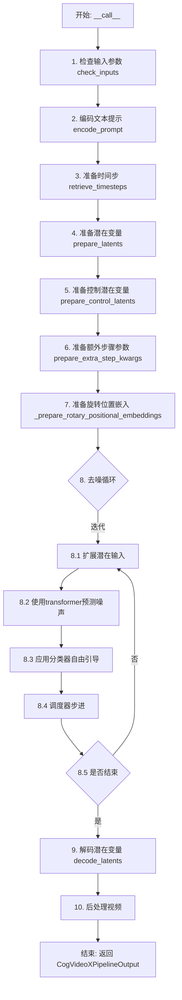

## 类结构

```
DiffusionPipeline (基类)
└── CogVideoXFunControlPipeline (主管道类)
    └── CogVideoXLoraLoaderMixin (LoRA加载混合)
```

## 全局变量及字段


### `XLA_AVAILABLE`
    
是否支持XLA加速

类型：`bool`
    


### `logger`
    
日志记录器

类型：`logging.Logger`
    


### `EXAMPLE_DOC_STRING`
    
示例文档字符串

类型：`str`
    


### `CogVideoXFunControlPipeline.vae`
    
VAE模型，用于编解码视频潜在表示

类型：`AutoencoderKLCogVideoX`
    


### `CogVideoXFunControlPipeline.text_encoder`
    
T5文本编码器，用于编码文本提示

类型：`T5EncoderModel`
    


### `CogVideoXFunControlPipeline.tokenizer`
    
T5分词器

类型：`T5Tokenizer`
    


### `CogVideoXFunControlPipeline.transformer`
    
CogVideoX变换器模型

类型：`CogVideoXTransformer3DModel`
    


### `CogVideoXFunControlPipeline.scheduler`
    
扩散调度器

类型：`KarrasDiffusionSchedulers`
    


### `CogVideoXFunControlPipeline.video_processor`
    
视频处理器

类型：`VideoProcessor`
    


### `CogVideoXFunControlPipeline.vae_scale_factor_spatial`
    
VAE空间缩放因子

类型：`int`
    


### `CogVideoXFunControlPipeline.vae_scale_factor_temporal`
    
VAE时间缩放因子

类型：`int`
    


### `CogVideoXFunControlPipeline.vae_scaling_factor_image`
    
VAE图像缩放因子

类型：`float`
    


### `CogVideoXFunControlPipeline.model_cpu_offload_seq`
    
模型CPU卸载顺序

类型：`str`
    


### `CogVideoXFunControlPipeline._callback_tensor_inputs`
    
回调张量输入列表

类型：`list`
    


### `CogVideoXFunControlPipeline._optional_components`
    
可选组件列表

类型：`list`
    


### `CogVideoXFunControlPipeline._guidance_scale`
    
引导尺度（内部状态）

类型：`float`
    


### `CogVideoXFunControlPipeline._num_timesteps`
    
时间步数（内部状态）

类型：`int`
    


### `CogVideoXFunControlPipeline._attention_kwargs`
    
注意力参数字典（内部状态）

类型：`dict`
    


### `CogVideoXFunControlPipeline._current_timestep`
    
当前时间步（内部状态）

类型：`int`
    


### `CogVideoXFunControlPipeline._interrupt`
    
中断标志（内部状态）

类型：`bool`
    


### `CogVideoXFunControlPipeline.fusing_transformer`
    
QKV融合状态标志

类型：`bool`
    
    

## 全局函数及方法


### `get_resize_crop_region_for_grid`

该函数用于根据目标尺寸计算图像 resize 后的裁剪区域。它通过保持原始图像的宽高比，将图像缩放到目标尺寸，然后计算中心裁剪的左上角和右下角坐标，确保图像内容居中。

参数：

- `src`：`tuple[int, int]`，源图像的尺寸，格式为 `(height, width)`
- `tgt_width`：`int`，目标宽度（以像素为单位）
- `tgt_height`：`int`，目标高度（以像素为单位）

返回值：`tuple[tuple[int, int], tuple[int, int]]`，返回两个坐标点元组：
- 第一个元素 `(crop_top, crop_left)` 是裁剪区域的左上角坐标
- 第二个元素 `(crop_top + resize_height, crop_left + resize_width)` 是裁剪区域的右下角坐标

#### 流程图

```mermaid
flowchart TD
    A[开始] --> B[获取目标尺寸<br/>tw = tgt_width<br/>th = tgt_height]
    B --> C[获取源尺寸<br/>h, w = src]
    C --> D[计算源图像宽高比<br/>r = h / w]
    D --> E{判断 r > th / tw}
    E -->|是| F[图像较瘦高]
    E -->|否| G[图像较宽扁]
    F --> H[resize_height = th<br/>resize_width = round(th / h * w)]
    G --> I[resize_width = tw<br/>resize_height = round(tw / w * h)]
    H --> J[计算裁剪左上角坐标]
    I --> J
    J --> K[crop_top = round((th - resize_height) / 2.0)<br/>crop_left = round((tw - resize_width) / 2.0)]
    K --> L[计算裁剪区域<br/>左上角: (crop_top, crop_left)<br/>右下角: (crop_top + resize_height, crop_left + resize_width)]
    L --> M[返回裁剪坐标]
```

#### 带注释源码

```python
def get_resize_crop_region_for_grid(src, tgt_width, tgt_height):
    """
    根据目标尺寸计算图像resize后的裁剪区域。
    
    该函数通过以下步骤计算裁剪区域：
    1. 根据目标宽高比和源图像的宽高比，决定是高度受限还是宽度受限
    2. 计算resize后的尺寸，保持原始宽高比
    3. 计算居中裁剪的左上角坐标
    
    Args:
        src: 源图像尺寸，格式为 (height, width) 的元组
        tgt_width: 目标宽度
        tgt_height: 目标高度
    
    Returns:
        两个坐标点元组：
        - (crop_top, crop_left): 裁剪区域左上角坐标
        - (crop_top + resize_height, crop_left + resize_width): 裁剪区域右下角坐标
    """
    # 目标尺寸
    tw = tgt_width
    th = tgt_height
    
    # 源图像尺寸：h 为高度，w 为宽度
    h, w = src
    
    # 计算源图像的宽高比（高度/宽度）
    r = h / w
    
    # 判断源图像是"瘦高型"还是"宽扁型"
    # 如果 r > th/tw，说明源图像比目标图像更瘦高，宽度将成为限制因素
    if r > (th / tw):
        # 图像较瘦高：以高度为基准进行缩放
        resize_height = th                          # 目标高度
        resize_width = int(round(th / h * w))      # 按比例计算宽度
    else:
        # 图像较宽扁：以宽度为基准进行缩放
        resize_width = tw                          # 目标宽度
        resize_height = int(round(tw / w * h))     # 按比例计算高度
    
    # 计算居中裁剪的左上角坐标
    # 使用 round 进行四舍五入，确保裁剪区域尽可能居中
    crop_top = int(round((th - resize_height) / 2.0))    # 垂直居中
    crop_left = int(round((tw - resize_width) / 2.0))    # 水平居中
    
    # 返回裁剪区域的坐标
    # 第一个元素：左上角坐标 (top, left)
    # 第二个元素：右下角坐标 (top + height, left + width)
    return (crop_top, crop_left), (crop_top + resize_height, crop_left + resize_width)
```


### `retrieve_timesteps`

该函数是扩散模型管道中的时间步检索工具函数，用于调用调度器的 `set_timesteps` 方法并从中获取时间步序列。它支持自定义时间步和自定义 sigmas，并能根据传入的参数自动推断推理步数。

参数：

- `scheduler`：`SchedulerMixin`，执行时间步设置的调度器对象
- `num_inference_steps`：`int | None`，生成样本时使用的扩散步数，若使用此参数则 `timesteps` 必须为 `None`
- `device`：`str | torch.device | None`，时间步应移动到的设备，默认为 `None`（不移动）
- `timesteps`：`list[int] | None`，用于覆盖调度器时间步间隔策略的自定义时间步，若传入此参数则 `num_inference_steps` 和 `sigmas` 必须为 `None`
- `sigmas`：`list[float] | None`，用于覆盖调度器时间步间隔策略的自定义 sigmas，若传入此参数则 `num_inference_steps` 和 `timesteps` 必须为 `None`
- `**kwargs`：任意关键字参数，将传递给调度器的 `set_timesteps` 方法

返回值：`tuple[torch.Tensor, int]`，第一个元素是调度器的时间步序列，第二个元素是推理步数

#### 流程图

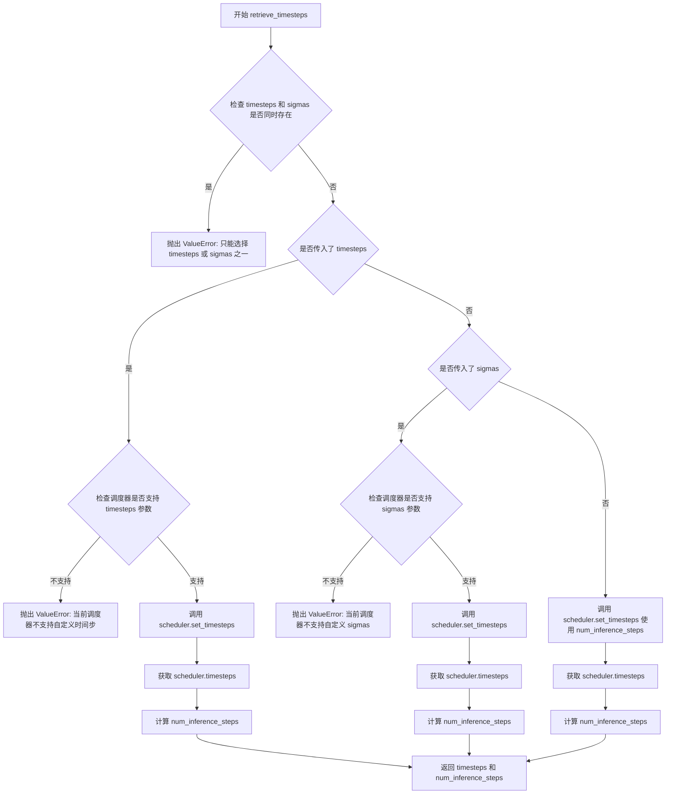

#### 带注释源码

```python
# Copied from diffusers.pipelines.stable_diffusion.pipeline_stable_diffusion.retrieve_timesteps
def retrieve_timesteps(
    scheduler,
    num_inference_steps: int | None = None,
    device: str | torch.device | None = None,
    timesteps: list[int] | None = None,
    sigmas: list[float] | None = None,
    **kwargs,
):
    r"""
    Calls the scheduler's `set_timesteps` method and retrieves timesteps from the scheduler after the call. Handles
    custom timesteps. Any kwargs will be supplied to `scheduler.set_timesteps`.

    Args:
        scheduler (`SchedulerMixin`):
            The scheduler to get timesteps from.
        num_inference_steps (`int`):
            The number of diffusion steps used when generating samples with a pre-trained model. If used, `timesteps`
            must be `None`.
        device (`str` or `torch.device`, *optional*):
            The device to which the timesteps should be moved to. If `None`, the timesteps are not moved.
        timesteps (`list[int]`, *optional*):
            Custom timesteps used to override the timestep spacing strategy of the scheduler. If `timesteps` is passed,
            `num_inference_steps` and `sigmas` must be `None`.
        sigmas (`list[float]`, *optional*):
            Custom sigmas used to override the timestep spacing strategy of the scheduler. If `sigmas` is passed,
            `num_inference_steps` and `timesteps` must be `None`.

    Returns:
        `tuple[torch.Tensor, int]`: A tuple where the first element is the timestep schedule from the scheduler and the
        second element is the number of inference steps.
    """
    # 检查是否同时传入了 timesteps 和 sigmas，两者只能选其一
    if timesteps is not None and sigmas is not None:
        raise ValueError("Only one of `timesteps` or `sigmas` can be passed. Please choose one to set custom values")
    
    # 处理自定义时间步的情况
    if timesteps is not None:
        # 检查调度器是否支持 timesteps 参数
        accepts_timesteps = "timesteps" in set(inspect.signature(scheduler.set_timesteps).parameters.keys())
        if not accepts_timesteps:
            raise ValueError(
                f"The current scheduler class {scheduler.__class__}'s `set_timesteps` does not support custom"
                f" timestep schedules. Please check whether you are using the correct scheduler."
            )
        # 调用调度器的 set_timesteps 方法设置自定义时间步
        scheduler.set_timesteps(timesteps=timesteps, device=device, **kwargs)
        # 从调度器获取设置后的时间步
        timesteps = scheduler.timesteps
        # 计算推理步数
        num_inference_steps = len(timesteps)
    # 处理自定义 sigmas 的情况
    elif sigmas is not None:
        # 检查调度器是否支持 sigmas 参数
        accept_sigmas = "sigmas" in set(inspect.signature(scheduler.set_timesteps).parameters.keys())
        if not accept_sigmas:
            raise ValueError(
                f"The current scheduler class {scheduler.__class__}'s `set_timesteps` does not support custom"
                f" sigmas schedules. Please check whether you are using the correct scheduler."
            )
        # 调用调度器的 set_timesteps 方法设置自定义 sigmas
        scheduler.set_timesteps(sigmas=sigmas, device=device, **kwargs)
        # 从调度器获取设置后的时间步
        timesteps = scheduler.timesteps
        # 计算推理步数
        num_inference_steps = len(timesteps)
    # 默认情况：使用 num_inference_steps 设置时间步
    else:
        scheduler.set_timesteps(num_inference_steps, device=device, **kwargs)
        timesteps = scheduler.timesteps
    
    # 返回时间步序列和推理步数
    return timesteps, num_inference_steps
```


### `CogVideoXFunControlPipeline.__init__`

该方法是 `CogVideoXFunControlPipeline` 类的构造函数，负责初始化视频生成管道所需的所有核心组件，包括分词器、文本编码器、VAE、Transformer模型和调度器，并设置VAE的缩放因子和视频处理器。

参数：

- `tokenizer`：`T5Tokenizer`，用于将文本提示编码为token序列
- `text_encoder`：`T5EncoderModel`，冻结的文本编码器，用于生成文本嵌入
- `vae`：`AutoencoderKLCogVideoX`，变分自编码器，用于编码和解码视频潜在表示
- `transformer`：`CogVideoXTransformer3DModel`，文本条件的3D Transformer模型，用于去噪视频潜在表示
- `scheduler`：`KarrasDiffusionSchedulers`，调度器，与Transformer配合使用去噪视频潜在表示

返回值：无（`None`），构造函数不返回值

#### 流程图

```mermaid
flowchart TD
    A[开始 __init__] --> B[调用 super().__init__]
    B --> C[register_modules: 注册 tokenizer, text_encoder, vae, transformer, scheduler]
    C --> D[计算 vae_scale_factor_spatial]
    D --> E[计算 vae_scale_factor_temporal]
    E --> F[计算 vae_scaling_factor_image]
    F --> G[创建 VideoProcessor]
    G --> H[结束 __init__]
```

#### 带注释源码

```python
def __init__(
    self,
    tokenizer: T5Tokenizer,
    text_encoder: T5EncoderModel,
    vae: AutoencoderKLCogVideoX,
    transformer: CogVideoXTransformer3DModel,
    scheduler: KarrasDiffusionSchedulers,
):
    """
    初始化 CogVideoXFunControlPipeline 管道
    
    Args:
        tokenizer: T5分词器
        text_encoder: T5文本编码器模型
        vae: CogVideoX变分自编码器
        transformer: CogVideoX 3D Transformer模型
        scheduler: Karras扩散调度器
    """
    # 调用父类 DiffusionPipeline 的初始化方法
    super().__init__()

    # 注册所有模块，使管道可以访问和管理这些组件
    self.register_modules(
        tokenizer=tokenizer, text_encoder=text_encoder, vae=vae, transformer=transformer, scheduler=scheduler
    )
    
    # 计算VAE空间缩放因子，基于VAE的block_out_channels数量
    # 如果VAE存在，使用2^(len(block_out_channels)-1)，否则默认为8
    self.vae_scale_factor_spatial = (
        2 ** (len(self.vae.config.block_out_channels) - 1) if getattr(self, "vae", None) else 8
    )
    
    # 计算VAE时间缩放因子，使用配置中的temporal_compression_ratio，默认为4
    self.vae_scale_factor_temporal = (
        self.vae.config.temporal_compression_ratio if getattr(self, "vae", None) else 4
    )
    
    # 获取VAE的图像缩放因子，默认为0.7
    self.vae_scaling_factor_image = self.vae.config.scaling_factor if getattr(self, "vae", None) else 0.7

    # 创建视频处理器，用于预处理和后处理视频数据
    self.video_processor = VideoProcessor(vae_scale_factor=self.vae_scale_factor_spatial)
```


### `CogVideoXFunControlPipeline._get_t5_prompt_embeds`

该方法用于将文本提示（prompt）通过T5编码器转换为高维文本嵌入向量（text embeddings），是CogVideoX视频生成管道中的核心文本编码组件，支持批量处理和多视频生成。

参数：

-  `prompt`：`str | list[str]`，输入的文本提示，可以是单个字符串或字符串列表
-  `num_videos_per_prompt`：`int`，每个提示需要生成的视频数量，用于复制文本嵌入
-  `max_sequence_length`：`int`，T5编码器的最大序列长度，默认226个token
-  `device`：`torch.device | None`，计算设备，默认为执行设备
-  `dtype`：`torch.dtype | None`，输出的数据类型，默认为text_encoder的数据类型

返回值：`torch.Tensor`，形状为`(batch_size * num_videos_per_prompt, seq_len, hidden_size)`的文本嵌入张量

#### 流程图

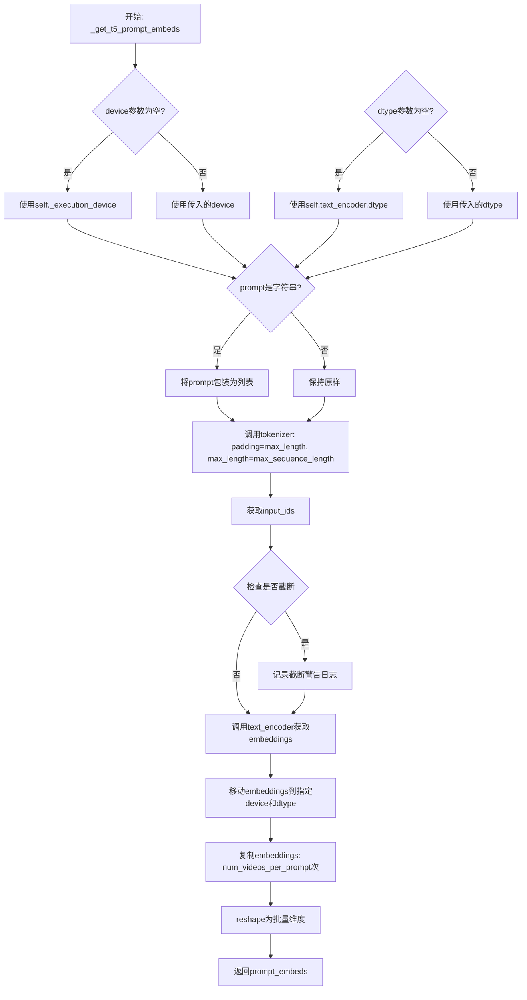

#### 带注释源码

```python
def _get_t5_prompt_embeds(
    self,
    prompt: str | list[str] = None,
    num_videos_per_prompt: int = 1,
    max_sequence_length: int = 226,
    device: torch.device | None = None,
    dtype: torch.dtype | None = None,
):
    # 确定计算设备，若未指定则使用管道的执行设备
    device = device or self._execution_device
    # 确定数据类型，若未指定则使用text_encoder的数据类型
    dtype = dtype or self.text_encoder.dtype

    # 标准化输入：将单个字符串转换为列表，便于批量处理
    prompt = [prompt] if isinstance(prompt, str) else prompt
    # 计算批次大小
    batch_size = len(prompt)

    # 使用T5 Tokenizer对prompt进行tokenize
    # padding="max_length"：填充到最大长度
    # truncation=True：截断超过最大长度的序列
    # add_special_tokens=True：添加特殊token（如[SOS], [EOS]等）
    # return_tensors="pt"：返回PyTorch张量
    text_inputs = self.tokenizer(
        prompt,
        padding="max_length",
        max_length=max_sequence_length,
        truncation=True,
        add_special_tokens=True,
        return_tensors="pt",
    )
    # 获取tokenized后的input_ids
    text_input_ids = text_inputs.input_ids
    
    # 进行无截断的tokenize，用于检测是否有内容被截断
    untruncated_ids = self.tokenizer(prompt, padding="longest", return_tensors="pt").input_ids

    # 检查是否有内容因超过max_sequence_length而被截断
    if untruncated_ids.shape[-1] >= text_input_ids.shape[-1] and not torch.equal(text_input_ids, untruncated_ids):
        # 解码被截断的部分用于日志警告
        removed_text = self.tokenizer.batch_decode(untruncated_ids[:, max_sequence_length - 1 : -1])
        logger.warning(
            "The following part of your input was truncated because `max_sequence_length` is set to "
            f" {max_sequence_length} tokens: {removed_text}"
        )

    # 使用T5文本编码器获取文本嵌入
    # 输入：tokenized的input_ids
    # 输出：形状为(batch_size, seq_len, hidden_size)的隐藏状态
    prompt_embeds = self.text_encoder(text_input_ids.to(device))[0]
    
    # 将embedings转换为指定的dtype和device
    prompt_embeds = prompt_embeds.to(dtype=dtype, device=device)

    # 为每个prompt生成多个视频而复制文本嵌入
    # 获取序列长度
    _, seq_len, _ = prompt_embeds.shape
    
    # 在序列维度之前重复embeddings（对应num_videos_per_prompt）
    # 例如：原始形状(batch, seq_len, hidden) -> (batch, num_videos*seq_len, hidden)
    prompt_embeds = prompt_embeds.repeat(1, num_videos_per_prompt, 1)
    
    # 重塑为最终的批量维度
    # 从(batch, num_videos*seq_len, hidden) -> (batch*num_videos, seq_len, hidden)
    prompt_embeds = prompt_embeds.view(batch_size * num_videos_per_prompt, seq_len, -1)

    return prompt_embeds
```


### `CogVideoXFunControlPipeline.encode_prompt`

该方法负责将文本提示词（prompt）和负提示词（negative_prompt）编码为文本编码器的隐藏状态（embeddings），支持无分类器自由引导（Classifier-Free Guidance），并返回编码后的提示词嵌入和负提示词嵌入供后续的视频生成过程使用。

参数：

-  `self`：`CogVideoXFunControlPipeline` 实例本身
-  `prompt`：`str | list[str]`，要编码的提示词，可以是单个字符串或字符串列表
-  `negative_prompt`：`str | list[str] | None`，不引导图像生成的提示词，如果未定义则需传递 `negative_prompt_embeds`
-  `do_classifier_free_guidance`：`bool`，是否使用无分类器自由引导，默认为 `True`
-  `num_videos_per_prompt`：`int`，每个提示词生成的视频数量，默认为 1
-  `prompt_embeds`：`torch.Tensor | None`，预生成的文本嵌入，可用于轻松调整文本输入
-  `negative_prompt_embeds`：`torch.Tensor | None`，预生成的负文本嵌入
-  `max_sequence_length`：`int`，最大序列长度，默认为 226
-  `device`：`torch.device | None`，torch 设备
-  `dtype`：`torch.dtype | None`，torch 数据类型

返回值：`tuple[torch.Tensor, torch.Tensor]`，返回包含提示词嵌入和负提示词嵌入的元组

#### 流程图

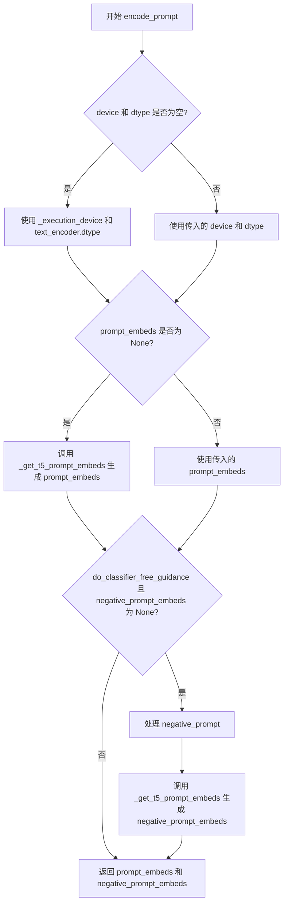

#### 带注释源码

```python
def encode_prompt(
    self,
    prompt: str | list[str],
    negative_prompt: str | list[str] | None = None,
    do_classifier_free_guidance: bool = True,
    num_videos_per_prompt: int = 1,
    prompt_embeds: torch.Tensor | None = None,
    negative_prompt_embeds: torch.Tensor | None = None,
    max_sequence_length: int = 226,
    device: torch.device | None = None,
    dtype: torch.dtype | None = None,
):
    r"""
    Encodes the prompt into text encoder hidden states.

    Args:
        prompt (`str` or `list[str]`, *optional*):
            prompt to be encoded
        negative_prompt (`str` or `list[str]`, *optional*):
            The prompt or prompts not to guide the image generation. If not defined, one has to pass
            `negative_prompt_embeds` instead. Ignored when not using guidance (i.e., ignored if `guidance_scale` is
            less than `1`).
        do_classifier_free_guidance (`bool`, *optional*, defaults to `True`):
            Whether to use classifier free guidance or not.
        num_videos_per_prompt (`int`, *optional*, defaults to 1):
            Number of videos that should be generated per prompt. torch device to place the resulting embeddings on
        prompt_embeds (`torch.Tensor`, *optional*):
            Pre-generated text embeddings. Can be used to easily tweak text inputs, *e.g.* prompt weighting. If not
            provided, text embeddings will be generated from `prompt` input argument.
        negative_prompt_embeds (`torch.Tensor`, *optional*):
            Pre-generated negative text embeddings. Can be used to easily tweak text inputs, *e.g.* prompt
            weighting. If not provided, negative_prompt_embeds will be generated from `negative_prompt` input
            argument.
        device: (`torch.device`, *optional*):
            torch device
        dtype: (`torch.dtype`, *optional*):
            torch dtype
    """
    # 确定设备，优先使用传入的设备，否则使用执行设备
    device = device or self._execution_device

    # 将单个字符串转换为列表，统一处理方式
    prompt = [prompt] if isinstance(prompt, str) else prompt
    
    # 根据 prompt 是否存在确定批大小
    if prompt is not None:
        batch_size = len(prompt)
    else:
        # 如果 prompt 为 None，则从 prompt_embeds 获取批大小
        batch_size = prompt_embeds.shape[0]

    # 如果没有传入 prompt_embeds，则从 prompt 生成
    if prompt_embeds is None:
        prompt_embeds = self._get_t5_prompt_embeds(
            prompt=prompt,
            num_videos_per_prompt=num_videos_per_prompt,
            max_sequence_length=max_sequence_length,
            device=device,
            dtype=dtype,
        )

    # 如果使用无分类器自由引导且没有传入 negative_prompt_embeds，则生成负提示词嵌入
    if do_classifier_free_guidance and negative_prompt_embeds is None:
        # 如果 negative_prompt 为 None，设置为空字符串
        negative_prompt = negative_prompt or ""
        # 将负提示词扩展为批大小长度
        negative_prompt = batch_size * [negative_prompt] if isinstance(negative_prompt, str) else negative_prompt

        # 类型检查：确保 negative_prompt 与 prompt 类型一致
        if prompt is not None and type(prompt) is not type(negative_prompt):
            raise TypeError(
                f"`negative_prompt` should be the same type to `prompt`, but got {type(negative_prompt)} !="
                f" {type(prompt)}."
            )
        # 批大小检查：确保 negative_prompt 与 prompt 批大小一致
        elif batch_size != len(negative_prompt):
            raise ValueError(
                f"`negative_prompt`: {negative_prompt} has batch size {len(negative_prompt)}, but `prompt`:"
                f" {prompt} has batch size {batch_size}. Please make sure that passed `negative_prompt` matches"
                " the batch size of `prompt`."
            )

        # 从 negative_prompt 生成负提示词嵌入
        negative_prompt_embeds = self._get_t5_prompt_embeds(
            prompt=negative_prompt,
            num_videos_per_prompt=num_videos_per_prompt,
            max_sequence_length=max_sequence_length,
            device=device,
            dtype=dtype,
        )

    # 返回提示词嵌入和负提示词嵌入
    return prompt_embeds, negative_prompt_embeds
```


### `CogVideoXFunControlPipeline.prepare_latents`

该方法负责为视频生成准备初始的潜在向量（latents）。它根据指定的批大小、帧数、视频尺寸和潜在通道数计算潜在张量的形状，若未提供现有潜在向量则使用随机噪声生成，否则将现有潜在向量移动到指定设备。最后，根据调度器的初始噪声标准差对潜在向量进行缩放，以适配扩散模型的噪声调度策略。

参数：

- `batch_size`：`int`，批大小，指定一次生成多少个视频样本
- `num_channels_latents`：`int`，潜在通道数，对应于变分自编码器（VAE）潜在空间的通道维度
- `num_frames`：`int`，视频帧数，指定生成视频的总帧数
- `height`：`int`，生成视频的高度（像素）
- `width`：`int`，生成视频的宽度（像素）
- `dtype`：`torch.dtype`，潜在张量的数据类型（如 `torch.float32`）
- `device`：`torch.device`，潜在张量存放的设备（如 CPU 或 CUDA）
- `generator`：`torch.Generator` 或 `list[torch.Generator]`，可选，用于生成确定性随机噪声的生成器
- `latents`：`torch.Tensor`，可选，若提供则直接使用该张量作为初始潜在向量，否则随机生成

返回值：`torch.Tensor`，返回处理后的潜在张量，形状为 `(batch_size, num_latent_frames, num_channels_latents, latent_height, latent_width)`

#### 流程图

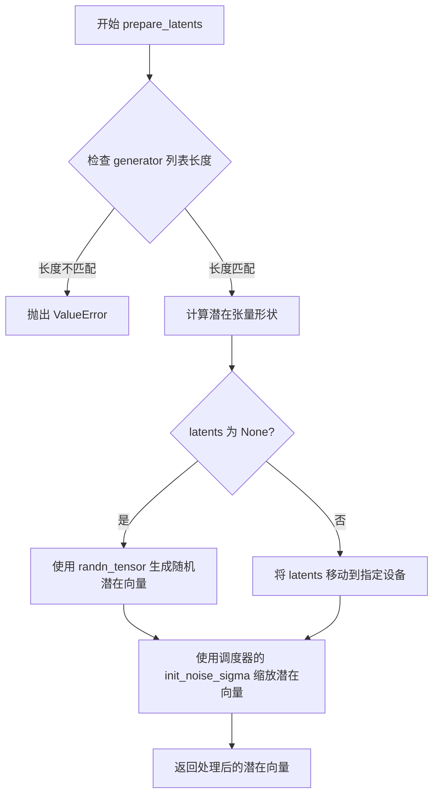

#### 带注释源码

```
def prepare_latents(
    self, batch_size, num_channels_latents, num_frames, height, width, dtype, device, generator, latents=None
):
    # 检查传入的生成器列表长度是否与批大小匹配
    # 如果不匹配则抛出明确的错误信息，帮助用户定位问题
    if isinstance(generator, list) and len(generator) != batch_size:
        raise ValueError(
            f"You have passed a list of generators of length {len(generator)}, but requested an effective batch"
            f" size of {batch_size}. Make sure the batch size matches the length of the generators."
        )

    # 计算潜在张量的形状，考虑 VAE 的时序和空间缩放因子
    # 潜在帧数通过时序压缩比计算：(num_frames - 1) // vae_scale_factor_temporal + 1
    # 潜在高度和宽度通过空间缩放因子计算：height // vae_scale_factor_spatial
    shape = (
        batch_size,
        (num_frames - 1) // self.vae_scale_factor_temporal + 1,
        num_channels_latents,
        height // self.vae_scale_factor_spatial,
        width // self.vae_scale_factor_spatial,
    )

    # 根据是否提供 latents 决定生成方式
    if latents is None:
        # 使用 randn_tensor 生成标准正态分布的随机潜在向量
        # 支持确定性生成（通过 generator 参数）
        latents = randn_tensor(shape, generator=generator, device=device, dtype=dtype)
    else:
        # 如果提供了 latents，确保它位于正确的设备上
        latents = latents.to(device)

    # 根据调度器的要求缩放初始噪声
    # 不同的调度器（如 DDIM、DDPM、Karras）可能需要不同的初始噪声标准差
    # 这确保了与调度器的无缝集成
    latents = latents * self.scheduler.init_noise_sigma
    return latents
```


### `CogVideoXFunControlPipeline.prepare_control_latents`

该方法用于准备控制潜向量（control latents），将输入的掩码（mask）和被掩码图像（masked_image）编码为VAE latent空间中的表示，以便在CogVideoX视频生成管道中进行控制视频生成。

参数：

- `self`：`CogVideoXFunControlPipeline` 实例，方法所属的管道对象
- `mask`：`torch.Tensor | None`，可选输入的掩码张量，形状为 [batch, channels, height, width]，用于指示控制区域
- `masked_image`：`torch.Tensor | None`，可选的被掩码图像张量，形状为 [batch, channels, height, width]，用于提供控制图像内容

返回值：`tuple[torch.Tensor, torch.Tensor]`，返回两个张量组成的元组：
  - 第一个元素是编码后的掩码 latent，如果输入为 `None` 则返回 `None`
  - 第二个元素是编码后的被掩码图像 latent，如果输入为 `None` 则返回 `None`

#### 流程图

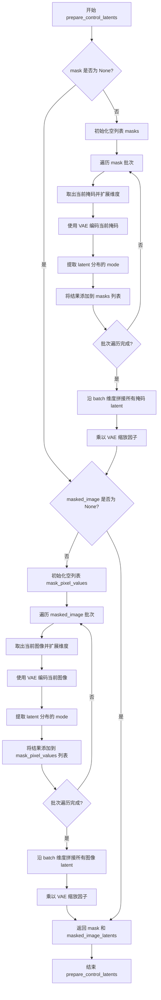

#### 带注释源码

```python
# Adapted from https://github.com/aigc-apps/CogVideoX-Fun/blob/2a93e5c14e02b2b5921d533fd59fc8c0ed69fb24/cogvideox/pipeline/pipeline_cogvideox_control.py#L366
def prepare_control_latents(
    self, mask: torch.Tensor | None = None, masked_image: torch.Tensor | None = None
) -> tuple[torch.Tensor, torch.Tensor]:
    """
    准备控制潜向量，将掩码和被掩码图像编码到 VAE latent 空间。
    
    该方法接收可选的 mask 和 masked_image 输入，将它们通过 VAE 编码为 latent 表示。
    编码过程中会提取 VAE 分布的 mode（均值），并应用 VAE 的缩放因子。
    
    Args:
        mask: 掩码张量，形状为 [batch, channels, height, width]，用于控制生成区域
        masked_image: 被掩码的图像张量，形状为 [batch, channels, height, width]，用于提供控制图像内容
    
    Returns:
        tuple[torch.Tensor, torch.Tensor]: 编码后的 (mask_latent, masked_image_latent) 元组
    """
    # 处理 mask 输入
    if mask is not None:
        # 用于存储每个批次样本的编码后掩码
        masks = []
        # 逐个处理批次中的每个掩码
        for i in range(mask.size(0)):
            # 取出第 i 个掩码并在其前添加批次维度
            current_mask = mask[i].unsqueeze(0)
            # 使用 VAE 编码掩码，获取潜在表示
            # encode 返回一个分布对象 [0] 获取其均值/方差
            current_mask = self.vae.encode(current_mask)[0]
            # 从 VAE 分布中提取 mode（即均值），用于确定性编码
            current_mask = current_mask.mode()
            # 将当前编码后的掩码添加到列表中
            masks.append(current_mask)
        # 将所有批次的掩码 latent 沿批次维度拼接
        mask = torch.cat(masks, dim=0)
        # 应用 VAE 配置中的缩放因子进行归一化
        mask = mask * self.vae.config.scaling_factor

    # 处理 masked_image 输入
    if masked_image is not None:
        # 用于存储每个批次样本的编码后图像 latent
        mask_pixel_values = []
        # 逐个处理批次中的每个被掩码图像
        for i in range(masked_image.size(0)):
            # 取出第 i 个图像并在其前添加批次维度
            mask_pixel_value = masked_image[i].unsqueeze(0)
            # 使用 VAE 编码图像，获取潜在表示
            mask_pixel_value = self.vae.encode(mask_pixel_value)[0]
            # 从 VAE 分布中提取 mode，用于确定性编码
            mask_pixel_value = mask_pixel_value.mode()
            # 将当前编码后的图像 latent 添加到列表中
            mask_pixel_values.append(mask_pixel_value)
        # 将所有批次的图像 latent 沿批次维度拼接
        masked_image_latents = torch.cat(mask_pixel_values, dim=0)
        # 应用 VAE 配置中的缩放因子进行归一化
        masked_image_latents = masked_image_latents * self.vae.config.scaling_factor
    else:
        # 如果没有提供 masked_image，则设为 None
        masked_image_latents = None

    # 返回编码后的掩码 latent 和被掩码图像 latent
    return mask, masked_image_latents
```


### `CogVideoXFunControlPipeline.decode_latents`

该方法负责将CogVideoX模型的潜在表示（latents）解码为实际的视频帧图像。它通过重新排列潜在表示的维度、应用VAE缩放因子，然后调用VAE解码器来生成最终的图像帧。

参数：

- `self`：`CogVideoXFunControlPipeline`，Pipeline实例本身
- `latents`：`torch.Tensor`，需要解码的潜在表示张量，形状为 [batch_size, num_frames, num_channels, height, width]

返回值：`torch.Tensor`，解码后的视频帧，形状为 [batch_size, num_channels, num_frames, height, width]

#### 流程图

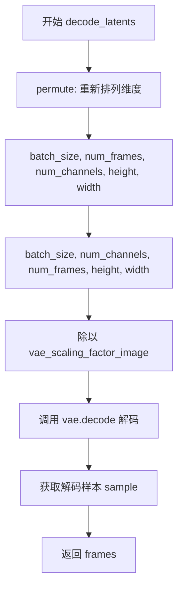

#### 带注释源码

```python
def decode_latents(self, latents: torch.Tensor) -> torch.Tensor:
    """
    解码潜在表示为视频帧。
    
    参数:
        latents: 需要解码的潜在表示，形状为 [batch_size, num_frames, num_channels, height, width]
    
    返回:
        解码后的视频帧
    """
    # 将潜在表示的维度从 [batch_size, num_frames, num_channels, height, width]
    # 重新排列为 [batch_size, num_channels, num_frames, height, width]
    # 这是因为 VAE 解码器期望通道维度在时间维度之前
    latents = latents.permute(0, 2, 1, 3, 4)  # [batch_size, num_channels, num_frames, height, width]
    
    # 根据 VAE 的缩放因子对潜在表示进行缩放
    # 这是为了将潜在表示恢复到适当的数值范围，以便解码器能够正确处理
    latents = 1 / self.vae_scaling_factor_image * latents

    # 使用 VAE 解码器将潜在表示解码为实际的图像帧
    # decode 方法返回的是一个 VAEOutput 对象，包含 sample 属性
    frames = self.vae.decode(latents).sample
    
    # 返回解码后的视频帧
    return frames
```


### CogVideoXFunControlPipeline.prepare_extra_step_kwargs

该方法用于为调度器（scheduler）的 `step` 方法准备额外的关键字参数。由于不同的调度器具有不同的签名，此方法通过检查调度器的 `step` 方法是否接受特定参数（如 `eta` 和 `generator`）来动态构建参数字典，确保兼容性。

参数：

- `self`：隐式参数，属于 `CogVideoXFunControlPipeline` 类本身
- `generator`：`torch.Generator | list[torch.Generator] | None`，用于控制随机数生成，确保推理过程可复现
- `eta`：`float`，DDIM 调度器专用的噪声调度参数（η），对应 DDIM 论文中的 η 参数，取值范围应为 [0, 1]；其他调度器会忽略此参数

返回值：`dict[str, Any]`，返回包含调度器 `step` 方法所需额外参数（如 `eta` 和/或 `generator`）的字典

#### 流程图

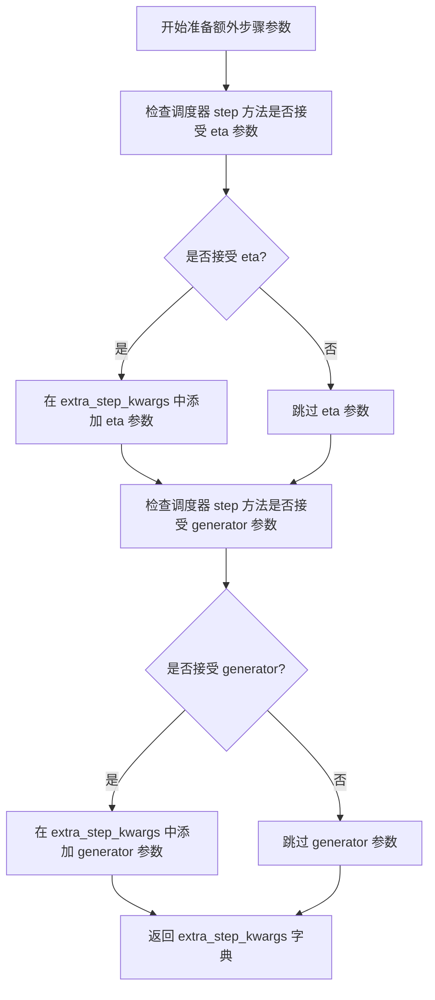

#### 带注释源码

```python
# 复制自 diffusers.pipelines.stable_diffusion.pipeline_stable_diffusion.StableDiffusionPipeline.prepare_extra_step_kwargs
def prepare_extra_step_kwargs(self, generator, eta):
    # 准备调度器 step 的额外参数，因为并非所有调度器都具有相同的签名
    # eta (η) 仅用于 DDIMScheduler，其他调度器将忽略此参数
    # eta 对应 DDIM 论文 (https://huggingface.co/papers/2010.02502) 中的 η
    # 取值范围应为 [0, 1]

    # 通过检查调度器 step 方法的签名来判断是否接受 eta 参数
    accepts_eta = "eta" in set(inspect.signature(self.scheduler.step).parameters.keys())
    # 初始化空字典用于存储额外参数
    extra_step_kwargs = {}
    # 如果调度器接受 eta 参数，则将其添加到参数字典中
    if accepts_eta:
        extra_step_kwargs["eta"] = eta

    # 检查调度器是否接受 generator 参数
    accepts_generator = "generator" in set(inspect.signature(self.scheduler.step).parameters.keys())
    # 如果调度器接受 generator 参数，则将其添加到参数字典中
    if accepts_generator:
        extra_step_kwargs["generator"] = generator
    
    # 返回构建好的参数字典，供调度器 step 方法使用
    return extra_step_kwargs
```


### `CogVideoXFunControlPipeline.check_inputs`

该方法用于验证扩散管道输入参数的有效性，确保用户提供的提示词、高度、宽度、嵌入向量和控制视频参数符合管道要求，若不符合则抛出相应的 `ValueError` 异常。

**参数：**

- `prompt`：提示词，支持字符串或字符串列表形式
- `height`：生成视频的高度（像素），必须能被 8 整除
- `width`：生成视频的宽度（像素），必须能被 8 整除
- `negative_prompt`：负面提示词，用于指导不生成的内容
- `callback_on_step_end_tensor_inputs`：回调函数可使用的张量输入列表
- `prompt_embeds`：预计算的提示词嵌入向量（可选）
- `negative_prompt_embeds`：预计算的负面提示词嵌入向量（可选）
- `control_video`：控制视频（Image.Image 列表），用于条件生成
- `control_video_latents`：预计算的控制视频潜在变量

**返回值：** `None`，该方法无返回值，仅通过抛出异常来处理验证失败的情况。

#### 流程图

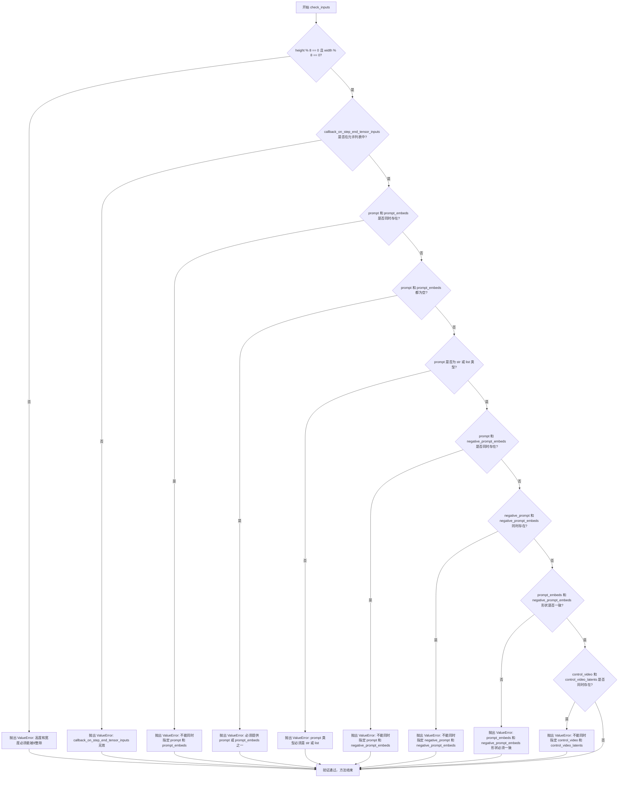

#### 带注释源码

```python
def check_inputs(
    self,
    prompt,
    height,
    width,
    negative_prompt,
    callback_on_step_end_tensor_inputs,
    prompt_embeds=None,
    negative_prompt_embeds=None,
    control_video=None,
    control_video_latents=None,
):
    """
    验证扩散管道输入参数的有效性。

    参数:
        prompt: 文本提示词，字符串或字符串列表
        height: 生成图像的高度（像素）
        width: 生成图像的宽度（像素）
        negative_prompt: 负面提示词
        callback_on_step_end_tensor_inputs: 回调函数可使用的张量输入列表
        prompt_embeds: 预计算的文本嵌入向量
        negative_prompt_embeds: 预计算的负面文本嵌入向量
        control_video: 控制视频帧列表
        control_video_latents: 预计算的控制视频潜在变量
    """
    # 验证高度和宽度是否能被 8 整除（CogVideoX 模型要求）
    if height % 8 != 0 or width % 8 != 0:
        raise ValueError(f"`height` and `width` have to be divisible by 8 but are {height} and {width}.")

    # 验证回调函数张量输入是否在允许列表中
    if callback_on_step_end_tensor_inputs is not None and not all(
        k in self._callback_tensor_inputs for k in callback_on_step_end_tensor_inputs
    ):
        raise ValueError(
            f"`callback_on_step_end_tensor_inputs` has to be in {self._callback_tensor_inputs}, but found {[k for k in callback_on_step_end_tensor_inputs if k not in self._callback_tensor_inputs]}"
        )
    
    # 验证 prompt 和 prompt_embeds 互斥（只能提供其中之一）
    if prompt is not None and prompt_embeds is not None:
        raise ValueError(
            f"Cannot forward both `prompt`: {prompt} and `prompt_embeds`: {prompt_embeds}. Please make sure to"
            " only forward one of the two."
        )
    
    # 验证至少提供 prompt 或 prompt_embeds 之一
    elif prompt is None and prompt_embeds is None:
        raise ValueError(
            "Provide either `prompt` or `prompt_embeds`. Cannot leave both `prompt` and `prompt_embeds` undefined."
        )
    
    # 验证 prompt 类型是否合法
    elif prompt is not None and (not isinstance(prompt, str) and not isinstance(prompt, list)):
        raise ValueError(f"`prompt` has to be of type `str` or `list` but is {type(prompt)}")

    # 验证 prompt 和 negative_prompt_embeds 互斥
    if prompt is not None and negative_prompt_embeds is not None:
        raise ValueError(
            f"Cannot forward both `prompt`: {prompt} and `negative_prompt_embeds`:"
            f" {negative_prompt_embeds}. Please make sure to only forward one of the two."
        )

    # 验证 negative_prompt 和 negative_prompt_embeds 互斥
    if negative_prompt is not None and negative_prompt_embeds is not None:
        raise ValueError(
            f"Cannot forward both `negative_prompt`: {negative_prompt} and `negative_prompt_embeds`:"
            f" {negative_prompt_embeds}. Please make sure to only forward one of the two."
        )

    # 验证 prompt_embeds 和 negative_prompt_embeds 形状一致性
    if prompt_embeds is not None and negative_prompt_embeds is not None:
        if prompt_embeds.shape != negative_prompt_embeds.shape:
            raise ValueError(
                "`prompt_embeds` and `negative_prompt_embeds` must have the same shape when passed directly, but"
                f" got: `prompt_embeds` {prompt_embeds.shape} != `negative_prompt_embeds`"
                f" {negative_prompt_embeds.shape}."
            )

    # 验证 control_video 和 control_video_latents 互斥
    if control_video is not None and control_video_latents is not None:
        raise ValueError(
            "Cannot pass both `control_video` and `control_video_latents`. Please make sure to pass only one of these parameters."
        )
```


### `CogVideoXFunControlPipeline.fuse_qkv_projections`

启用融合的 QKV（Query-Key-Value）投影，用于优化 Transformer 模型中的注意力机制计算性能。

参数：
- 无（仅包含 `self` 参数）

返回值：`None`，无返回值描述

#### 流程图

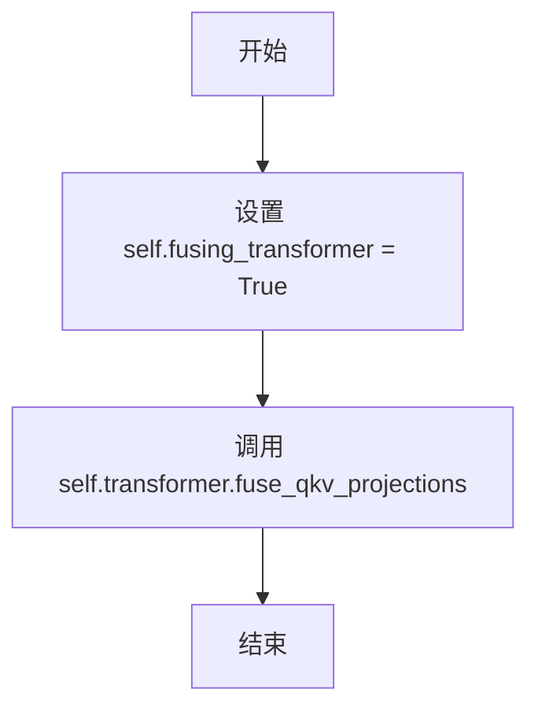

#### 带注释源码

```python
def fuse_qkv_projections(self) -> None:
    r"""Enables fused QKV projections."""
    # 标记 Transformer 已经启用了 QKV 融合
    self.fusing_transformer = True
    # 调用 Transformer 模型的 fuse_qkv_projections 方法
    # 该方法会将 QKV 投影合并为一个单一的矩阵运算
    # 以提高计算效率并减少内存访问次数
    self.transformer.fuse_qkv_projections()
```


### `CogVideoXFunControlPipeline.unfuse_qkv_projections`

该方法用于禁用 QKV 投影融合。当 Transformer 的 QKV 投影已通过 `fuse_qkv_projections` 方法融合时，调用此方法可以将其解融回原始的独立投影模式。

参数： 无（仅包含 `self` 参数）

返回值：`None`，无返回值

#### 流程图

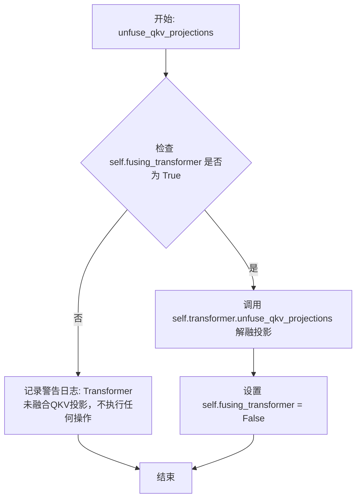

#### 带注释源码

```python
def unfuse_qkv_projections(self) -> None:
    r"""Disable QKV projection fusion if enabled."""
    # 检查 Transformer 的 QKV 投影融合状态标志
    if not self.fusing_transformer:
        # 如果 Transformer 未进行 QKV 融合，则记录警告日志并直接返回
        logger.warning("The Transformer was not initially fused for QKV projections. Doing nothing.")
    else:
        # 调用 Transformer 模型的 unfuse_qkv_projections 方法执行实际的解融操作
        self.transformer.unfuse_qkv_projections()
        # 重置融合状态标志为 False
        self.fusing_transformer = False
```


### `CogVideoXFunControlPipeline._prepare_rotary_positional_embeddings`

该方法用于为CogVideoX视频生成模型准备3D旋转位置嵌入（Rotary Positional Embeddings），根据视频的高度、宽度和帧数计算空间和时间维度的旋转位置编码，支持CogVideoX 1.0和1.5两个版本的模型架构差异。

参数：

- `height`：`int`，生成视频的高度（像素值）
- `width`：`int`，生成视频的宽度（像素值）
- `num_frames`：`int`，生成视频的帧数
- `device`：`torch.device`，计算设备（CPU或CUDA）

返回值：`tuple[torch.Tensor, torch.Tensor]`，返回两个张量——freqs_cos（余弦频率）和freqs_sin（正弦频率），用于后续Transformer模型中的旋转位置嵌入

#### 流程图

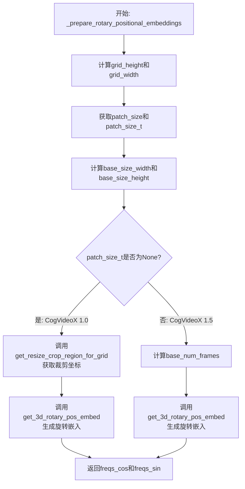

#### 带注释源码

```python
def _prepare_rotary_positional_embeddings(
    self,
    height: int,
    width: int,
    num_frames: int,
    device: torch.device,
) -> tuple[torch.Tensor, torch.Tensor]:
    """
    准备3D旋转位置嵌入，用于CogVideoX Transformer模型。
    
    该方法根据视频的spatial和temporal维度计算旋转位置编码，
    支持CogVideoX 1.0和1.5两个版本的模型。
    """
    
    # 计算grid维度：视频尺寸除以VAE缩放因子和patch大小的乘积
    grid_height = height // (self.vae_scale_factor_spatial * self.transformer.config.patch_size)
    grid_width = width // (self.vae_scale_factor_spatial * self.transformer.config.patch_size)

    # 获取transformer配置的patch参数
    p = self.transformer.config.patch_size       # 空间patch大小
    p_t = self.transformer.config.patch_size_t   # 时间patch大小（1.5版本才有）

    # 计算基础尺寸（样本空间的尺寸）
    base_size_width = self.transformer.config.sample_width // p
    base_size_height = self.transformer.config.sample_height // p

    # 根据是否为CogVideoX 1.5版本（有patch_size_t参数）选择不同的处理逻辑
    if p_t is None:
        # CogVideoX 1.0版本处理流程
        # 获取resize和crop区域坐标，用于处理不同宽高比的视频
        grid_crops_coords = get_resize_crop_region_for_grid(
            (grid_height, grid_width), base_size_width, base_size_height
        )
        
        # 调用3D旋转位置嵌入生成函数
        freqs_cos, freqs_sin = get_3d_rotary_pos_embed(
            embed_dim=self.transformer.config.attention_head_dim,
            crops_coords=grid_crops_coords,
            grid_size=(grid_height, grid_width),
            temporal_size=num_frames,
            device=device,
        )
    else:
        # CogVideoX 1.5版本处理流程
        # 计算调整后的帧数，确保能被时间patch大小整除
        base_num_frames = (num_frames + p_t - 1) // p_t

        # 调用3D旋转位置嵌入生成函数，使用slice模式
        freqs_cos, freqs_sin = get_3d_rotary_pos_embed(
            embed_dim=self.transformer.config.attention_head_dim,
            crops_coords=None,
            grid_size=(grid_height, grid_width),
            temporal_size=base_num_frames,
            grid_type="slice",
            max_size=(base_size_height, base_size_width),
            device=device,
        )

    # 返回余弦和正弦频率张量
    return freqs_cos, freqs_sin
```


### CogVideoXFunControlPipeline.__call__

该方法是CogVideoXFunControlPipeline的核心推理方法，实现基于扩散模型的文本到视频（text-to-video）生成功能。通过接收文本提示（prompt）和可选的控制视频（control_video），利用T5文本编码器、CogVideoX Transformer 3D模型和VAE解码器，在多个去噪步骤中逐步从随机噪声中恢复出与文本语义一致的视频内容。支持Classifier-Free Guidance（CFG）以提升生成质量，并可通过控制视频条件实现可控的视频生成。

参数：

- `prompt`：`str | list[str] | None`，用于引导视频生成的文本提示，若未定义则必须传入`prompt_embeds`
- `negative_prompt`：`str | list[str] | None`，不希望出现在生成视频中的负面提示，用于引导视频生成。若未定义且不启用guidance则忽略
- `control_video`：`list[PIL.Image.Image] | None`，控制视频帧列表，用于条件生成。必须为图像/帧列表，若不提供则必须提供`control_video_latents`
- `height`：`int | None`，生成视频的高度（像素），默认值为`self.transformer.config.sample_height * self.vae_scale_factor_spatial`
- `width`：`int | None`，生成视频的宽度（像素），默认值为`self.transformer.config.sample_width * self.vae_scale_factor_spatial`
- `num_inference_steps`：`int`，去噪步数，默认为50，步数越多通常生成质量越高但推理速度越慢
- `timesteps`：`list[int] | None`，自定义时间步，用于支持自定义调度器的去噪过程，若不定义则使用默认行为
- `guidance_scale`：`float`，CFG引导尺度，定义为Imagen论文中的w参数，默认为6.0，大于1时启用引导
- `use_dynamic_cfg`：`bool`，是否使用动态CFG，默认为False
- `num_videos_per_prompt`：`int`，每个提示生成的视频数量，默认为1
- `generator`：`torch.Generator | list[torch.Generator] | None`，随机数生成器，用于确保生成的可重复性
- `latents`：`torch.Tensor | None`，预生成的噪声潜在向量，若不提供则使用随机生成器采样
- `control_video_latents`：`torch.Tensor | None`，预生成的控制视频潜在向量，若不提供则必须提供`control_video`
- `prompt_embeds`：`torch.Tensor | None`，预生成的文本嵌入，可用于微调文本输入，若不提供则从prompt生成
- `negative_prompt_embeds`：`torch.Tensor | None`，预生成的负面文本嵌入，可用于微调文本输入
- `output_type`：`str`，输出格式，默认为"pil"，可选PIL.Image.Image或np.array
- `return_dict`：`bool`，是否返回字典格式的结果，默认为True
- `attention_kwargs`：`dict[str, Any] | None`，注意力处理器所需的额外参数字典
- `callback_on_step_end`：`Callable | PipelineCallback | MultiPipelineCallbacks | None`，每个去噪步骤结束时调用的回调函数
- `callback_on_step_end_tensor_inputs`：`list[str]`，回调函数需要的张量输入列表，默认为["latents"]
- `max_sequence_length`：`int`，编码提示的最大序列长度，默认为226

返回值：`CogVideoXPipelineOutput | tuple`，若`return_dict`为True返回`CogVideoXPipelineOutput`，否则返回包含生成视频的元组

#### 流程图

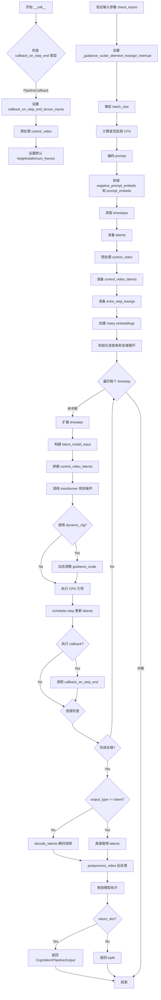

#### 带注释源码

```python
@torch.no_grad()
@replace_example_docstring(EXAMPLE_DOC_STRING)
def __call__(
    self,
    prompt: str | list[str] | None = None,
    negative_prompt: str | list[str] | None = None,
    control_video: list[Image.Image] | None = None,
    height: int | None = None,
    width: int | None = None,
    num_inference_steps: int = 50,
    timesteps: list[int] | None = None,
    guidance_scale: float = 6,
    use_dynamic_cfg: bool = False,
    num_videos_per_prompt: int = 1,
    eta: float = 0.0,
    generator: torch.Generator | list[torch.Generator] | None = None,
    latents: torch.Tensor | None = None,
    control_video_latents: torch.Tensor | None = None,
    prompt_embeds: torch.Tensor | None = None,
    negative_prompt_embeds: torch.Tensor | None = None,
    output_type: str = "pil",
    return_dict: bool = True,
    attention_kwargs: dict[str, Any] | None = None,
    callback_on_step_end: Callable[[int, int], None] | PipelineCallback | MultiPipelineCallbacks | None = None,
    callback_on_step_end_tensor_inputs: list[str] = ["latents"],
    max_sequence_length: int = 226,
) -> CogVideoXPipelineOutput | tuple:
    """
    Function invoked when calling the pipeline for generation.

    Args:
        prompt (`str` or `list[str]`, *optional*):
            The prompt or prompts to guide the image generation. If not defined, one has to pass `prompt_embeds`.
            instead.
        negative_prompt (`str` or `list[str]`, *optional*):
            The prompt or prompts not to guide the image generation. If not defined, one has to pass
            `negative_prompt_embeds` instead. Ignored when not using guidance (i.e., ignored if `guidance_scale` is
            less than `1`).
        control_video (`list[PIL.Image.Image]`):
            The control video to condition the generation on. Must be a list of images/frames of the video. If not
            provided, `control_video_latents` must be provided.
        height (`int`, *optional*, defaults to self.transformer.config.sample_height * self.vae_scale_factor_spatial):
            The height in pixels of the generated image. This is set to 480 by default for the best results.
        width (`int`, *optional*, defaults to self.transformer.config.sample_height * self.vae_scale_factor_spatial):
            The width in pixels of the generated image. This is set to 720 by default for the best results.
        num_inference_steps (`int`, *optional*, defaults to 50):
            The number of denoising steps. More denoising steps usually lead to a higher quality image at the
            expense of slower inference.
        timesteps (`list[int]`, *optional*):
            Custom timesteps to use for the denoising process with schedulers which support a `timesteps` argument
            in their `set_timesteps` method. If not defined, the default behavior when `num_inference_steps` is
            passed will be used. Must be in descending order.
        guidance_scale (`float`, *optional*, defaults to 6.0):
            Guidance scale as defined in [Classifier-Free Diffusion
            Guidance](https://huggingface.co/papers/2207.12598). `guidance_scale` is defined as `w` of equation 2.
            of [Imagen Paper](https://huggingface.co/papers/2205.11487). Guidance scale is enabled by setting
            `guidance_scale > 1`. Higher guidance scale encourages to generate images that are closely linked to
            the text `prompt`, usually at the expense of lower image quality.
        num_videos_per_prompt (`int`, *optional*, defaults to 1):
            The number of videos to generate per prompt.
        generator (`torch.Generator` or `list[torch.Generator]`, *optional*):
            One or a list of [torch generator(s)](https://pytorch.org/docs/stable/generated/torch.Generator.html)
            to make generation deterministic.
        latents (`torch.Tensor`, *optional*):
            Pre-generated noisy latents, sampled from a Gaussian distribution, to be used as inputs for video
            generation. Can be used to tweak the same generation with different prompts. If not provided, a latents
            tensor will be generated by sampling using the supplied random `generator`.
        control_video_latents (`torch.Tensor`, *optional*):
            Pre-generated control latents, sampled from a Gaussian distribution, to be used as inputs for
            controlled video generation. If not provided, `control_video` must be provided.
        prompt_embeds (`torch.Tensor`, *optional*):
            Pre-generated text embeddings. Can be used to easily tweak text inputs, *e.g.* prompt weighting. If not
            provided, text embeddings will be generated from `prompt` input argument.
        negative_prompt_embeds (`torch.Tensor`, *optional*):
            Pre-generated negative text embeddings. Can be used to easily tweak text inputs, *e.g.* prompt
            weighting. If not provided, negative_prompt_embeds will be generated from `negative_prompt` input
            argument.
        output_type (`str`, *optional*, defaults to `"pil"`):
            The output format of the generate image. Choose between
            [PIL](https://pillow.readthedocs.io/en/stable/): `PIL.Image.Image` or `np.array`.
        return_dict (`bool`, *optional*, defaults to `True`):
            Whether or not to return a [`~pipelines.stable_diffusion_xl.StableDiffusionXLPipelineOutput`] instead
            of a plain tuple.
        attention_kwargs (`dict`, *optional*):
            A kwargs dictionary that if specified is passed along to the `AttentionProcessor` as defined under
            `self.processor` in
            [diffusers.models.attention_processor](https://github.com/huggingface/diffusers/blob/main/src/diffusers/models/attention_processor.py).
        callback_on_step_end (`Callable`, *optional*):
            A function that calls at the end of each denoising steps during the inference. The function is called
            with the following arguments: `callback_on_step_end(self: DiffusionPipeline, step: int, timestep: int,
            callback_kwargs: Dict)`. `callback_kwargs` will include a list of all tensors as specified by
            `callback_on_step_end_tensor_inputs`.
        callback_on_step_end_tensor_inputs (`list`, *optional*):
            The list of tensor inputs for the `callback_on_step_end` function. The tensors specified in the list
            will be passed as `callback_kwargs` argument. You will only be able to include variables listed in the
            `._callback_tensor_inputs` attribute of your pipeline class.
        max_sequence_length (`int`, defaults to `226`):
            Maximum sequence length in encoded prompt. Must be consistent with
            `self.transformer.config.max_text_seq_length` otherwise may lead to poor results.

    Examples:

    Returns:
        [`~pipelines.cogvideo.pipeline_cogvideox.CogVideoXPipelineOutput`] or `tuple`:
        [`~pipelines.cogvideo.pipeline_cogvideox.CogVideoXPipelineOutput`] if `return_dict` is True, otherwise a
        `tuple`. When returning a tuple, the first element is a list with the generated images.
    """

    # 1. 如果 callback_on_step_end 是 PipelineCallback 或 MultiPipelineCallbacks 类型
    #    则从中提取 tensor_inputs 用于回调
    if isinstance(callback_on_step_end, (PipelineCallback, MultiPipelineCallbacks)):
        callback_on_step_end_tensor_inputs = callback_on_step_end.tensor_inputs

    # 2. 预处理 control_video：如果传入的是 PIL Image 列表，则包装成列表的列表
    if control_video is not None and isinstance(control_video[0], Image.Image):
        control_video = [control_video]

    # 3. 设置默认的 height、width 和 num_frames
    #    如果未提供，则从 transformer 配置和 VAE 缩放因子计算
    height = height or self.transformer.config.sample_height * self.vae_scale_factor_spatial
    width = width or self.transformer.config.sample_width * self.vae_scale_factor_spatial
    num_frames = len(control_video[0]) if control_video is not None else control_video_latents.size(2)

    # 4. 强制设置 num_videos_per_prompt 为 1（代码中硬编码）
    num_videos_per_prompt = 1

    # 5. 检查输入参数的有效性
    self.check_inputs(
        prompt,
        height,
        width,
        negative_prompt,
        callback_on_step_end_tensor_inputs,
        prompt_embeds,
        negative_prompt_embeds,
        control_video,
        control_video_latents,
    )
    
    # 6. 初始化内部状态变量
    self._guidance_scale = guidance_scale
    self._attention_kwargs = attention_kwargs
    self._current_timestep = None
    self._interrupt = False

    # 7. 确定 batch_size
    if prompt is not None and isinstance(prompt, str):
        batch_size = 1
    elif prompt is not None and isinstance(prompt, list):
        batch_size = len(prompt)
    else:
        batch_size = prompt_embeds.shape[0]

    device = self._execution_device

    # 8. 判断是否启用 Classifier-Free Guidance (CFG)
    #    guidance_scale > 1.0 时启用
    do_classifier_free_guidance = guidance_scale > 1.0

    # 9. 编码输入的 prompt 生成文本嵌入
    prompt_embeds, negative_prompt_embeds = self.encode_prompt(
        prompt,
        negative_prompt,
        do_classifier_free_guidance,
        num_videos_per_prompt=num_videos_per_prompt,
        prompt_embeds=prompt_embeds,
        negative_prompt_embeds=negative_prompt_embeds,
        max_sequence_length=max_sequence_length,
        device=device,
    )
    
    # 10. 如果启用 CFG，将 negative 和 positive embeddings 拼接
    if do_classifier_free_guidance:
        prompt_embeds = torch.cat([negative_prompt_embeds, prompt_embeds], dim=0)

    # 11. 准备 timesteps
    if XLA_AVAILABLE:
        timestep_device = "cpu"
    else:
        timestep_device = device
    timesteps, num_inference_steps = retrieve_timesteps(
        self.scheduler, num_inference_steps, timestep_device, timesteps
    )
    self._num_timesteps = len(timesteps)

    # 12. 计算 latent frames 数量
    latent_frames = (num_frames - 1) // self.vae_scale_factor_temporal + 1

    # 13. 检查 CogVideoX 1.5 的 patch_size_t 兼容性
    patch_size_t = self.transformer.config.patch_size_t
    if patch_size_t is not None and latent_frames % patch_size_t != 0:
        raise ValueError(
            f"The number of latent frames must be divisible by `{patch_size_t=}` but the given video "
            f"contains {latent_frames=}, which is not divisible."
        )

    # 14. 准备初始 latents
    latent_channels = self.transformer.config.in_channels // 2
    latents = self.prepare_latents(
        batch_size * num_videos_per_prompt,
        latent_channels,
        num_frames,
        height,
        width,
        prompt_embeds.dtype,
        device,
        generator,
        latents,
    )

    # 15. 如果没有提供 control_video_latents，则从 control_video 预处理生成
    if control_video_latents is None:
        control_video = self.video_processor.preprocess_video(control_video, height=height, width=width)
        control_video = control_video.to(device=device, dtype=prompt_embeds.dtype)

    # 16. 准备 control video latents
    _, control_video_latents = self.prepare_control_latents(None, control_video)
    control_video_latents = control_video_latents.permute(0, 2, 1, 3, 4)

    # 17. 准备调度器的额外参数
    extra_step_kwargs = self.prepare_extra_step_kwargs(generator, eta)

    # 18. 如果使用旋转位置嵌入，创建 rotary embeddings
    image_rotary_emb = (
        self._prepare_rotary_positional_embeddings(height, width, latents.size(1), device)
        if self.transformer.config.use_rotary_positional_embeddings
        else None
    )

    # 19. 去噪循环
    num_warmup_steps = max(len(timesteps) - num_inference_steps * self.scheduler.order, 0)

    with self.progress_bar(total=num_inference_steps) as progress_bar:
        # DPM-solver++ 需要保存上一次的 pred_original_sample
        old_pred_original_sample = None
        for i, t in enumerate(timesteps):
            # 检查是否中断
            if self.interrupt:
                continue

            self._current_timestep = t
            
            # 20. 扩展 latents 以匹配 CFG 需要的双倍维度
            latent_model_input = torch.cat([latents] * 2) if do_classifier_free_guidance else latents
            latent_model_input = self.scheduler.scale_model_input(latent_model_input, t)

            # 21. 拼接 control video latents
            latent_control_input = (
                torch.cat([control_video_latents] * 2) if do_classifier_free_guidance else control_video_latents
            )
            latent_model_input = torch.cat([latent_model_input, latent_control_input], dim=2)

            # 22. 扩展 timestep 以匹配 batch 维度
            timestep = t.expand(latent_model_input.shape[0])

            # 23. 使用 transformer 预测噪声
            with self.transformer.cache_context("cond_uncond"):
                noise_pred = self.transformer(
                    hidden_states=latent_model_input,
                    encoder_hidden_states=prompt_embeds,
                    timestep=timestep,
                    image_rotary_emb=image_rotary_emb,
                    attention_kwargs=attention_kwargs,
                    return_dict=False,
                )[0]
            noise_pred = noise_pred.float()

            # 24. 动态 CFG（可选）
            if use_dynamic_cfg:
                self._guidance_scale = 1 + guidance_scale * (
                    (1 - math.cos(math.pi * ((num_inference_steps - t.item()) / num_inference_steps) ** 5.0)) / 2
                )
            
            # 25. 执行 CFG 引导
            if do_classifier_free_guidance:
                noise_pred_uncond, noise_pred_text = noise_pred.chunk(2)
                noise_pred = noise_pred_uncond + self.guidance_scale * (noise_pred_text - noise_pred_uncond)

            # 26. 通过 scheduler.step 计算上一步的 latents
            latents = self.scheduler.step(noise_pred, t, latents, **extra_step_kwargs, return_dict=False)[0]
            latents = latents.to(prompt_embeds.dtype)

            # 27. 执行回调函数（如果提供）
            if callback_on_step_end is not None:
                callback_kwargs = {}
                for k in callback_on_step_end_tensor_inputs:
                    callback_kwargs[k] = locals()[k]
                callback_outputs = callback_on_step_end(self, i, t, callback_kwargs)

                # 更新回调返回的 latents 和 embeddings
                latents = callback_outputs.pop("latents", latents)
                prompt_embeds = callback_outputs.pop("prompt_embeds", prompt_embeds)
                negative_prompt_embeds = callback_outputs.pop("negative_prompt_embeds", negative_prompt_embeds)

            # 28. 更新进度条
            if i == len(timesteps) - 1 or ((i + 1) > num_warmup_steps and (i + 1) % self.scheduler.order == 0):
                progress_bar.update()

            # XLA 设备同步
            if XLA_AVAILABLE:
                xm.mark_step()

    # 29. 清理当前时间步
    self._current_timestep = None

    # 30. 如果不是输出 latent，则解码生成视频
    if not output_type == "latent":
        video = self.decode_latents(latents)
        video = self.video_processor.postprocess_video(video=video, output_type=output_type)
    else:
        video = latents

    # 31. 释放所有模型
    self.maybe_free_model_hooks()

    # 32. 返回结果
    if not return_dict:
        return (video,)

    return CogVideoXPipelineOutput(frames=video)
```

## 关键组件


### CogVideoXFunControlPipeline

主 pipeline 类，继承自 DiffusionPipeline 和 CogVideoXLoraLoaderMixin，用于实现基于 CogVideoX 模型的可控文本到视频生成，支持通过 control_video 进行条件控制。

### 视频预处理与后处理 (VideoProcessor)

负责将输入视频转换为模型所需格式并进行后处理转换，通过 vae_scale_factor 进行空间尺度调整。

### T5 文本编码 (encode_prompt / _get_t5_prompt_embeds)

使用 T5EncoderModel 和 T5Tokenizer 将文本 prompt 编码为高维嵌入向量，支持 classifier-free guidance 的双嵌入生成。

### 潜在变量管理 (prepare_latents / decode_latents)

根据视频帧数和分辨率生成初始噪声 latent，并通过 VAE 解码器将 latent 转换为最终视频帧。

### 控制条件处理 (prepare_control_latents)

对输入的 control_video 进行 VAE 编码，生成控制条件 latent，支持可选的 mask 和 masked_image 处理。

### QKV 投影融合 (fuse_qkv_projections / unfuse_qkv_projections)

提供 transformer 模型的 QKV 投影融合优化，可通过 `fusing_transformer` 标志控制，用于提升推理效率。

### 旋转位置嵌入 (_prepare_rotary_positional_embeddings)

根据视频尺寸和帧数生成 3D 旋转位置嵌入，支持 CogVideoX 1.0 和 1.5 两个版本的不同处理逻辑。

### 时间步检索 (retrieve_timesteps)

从调度器获取去噪时间步，支持自定义 timesteps 和 sigmas，兼容不同类型的扩散调度器。

### 条件去噪循环 (__call__)

核心推理方法，实现完整的视频生成流程，包括：输入验证、prompt 编码、latent 初始化、时间步循环去噪、动态 CFG 控制、回调处理和最终视频解码。


## 问题及建议


### 已知问题

-   **`control_video` 参数处理存在逻辑缺陷**：代码第 707 行 `if control_video is not None and isinstance(control_video[0], Image.Image): control_video = [control_video]` 与第 714 行 `num_frames = len(control_video[0])` 的逻辑不一致，可能导致 `control_video` 为单个 `Image.Image` 时处理异常
-   **`num_videos_per_prompt` 参数被硬编码覆盖**：尽管函数接收 `num_videos_per_prompt` 参数，但在第 710 行被无条件硬编码为 `1`，导致传入的参数被忽略
-   **`prepare_control_latents` 未使用预计算的 control_video_latents**：在主流程中忽略了 `control_video_latents` 参数，始终重新计算 control latents，造成计算浪费
-   **循环编码效率低下**：`prepare_control_latents` 方法中逐个样本调用 `vae.encode`，未利用批处理能力，性能可优化
-   **变量遮蔽问题**：函数参数 `control_video` 在方法内部被重新赋值 (`control_video = [control_video]`)，影响代码可读性和调试
-   **缺少空值校验**：未对 `control_video` 和 `control_video_latents` 同时为 `None` 的情况进行校验

### 优化建议

-   修复 `control_video` 参数处理逻辑，统一数据格式假设，避免运行时类型错误
-   移除第 710 行的硬编码，恢复使用传入的 `num_videos_per_prompt` 参数
-   在 `__call__` 方法中增加对 `control_video_latents` 为 `None` 的条件判断，避免重复编码
-   将 `prepare_control_latents` 中的循环改为批量处理，利用 VAE 的批处理能力提升性能
-   统一使用 `control_video_latents` 参数而非重新计算，增强 API 契约的清晰度
-   添加 `control_video` 和 `control_video_latents` 同时为空的显式错误提示
-   考虑将 `get_resize_crop_region_for_grid` 和 `retrieve_timesteps` 提取到基类或工具模块，避免代码重复

## 其它


### 设计目标与约束

本管道旨在实现基于文本提示和控制视频的条件视频生成，继承DiffusionPipeline框架，支持CogVideoX 1.0和1.5版本。主要约束包括：输入高度和宽度必须能被8整除；控制视频帧数需满足VAE时间压缩比例要求；最大序列长度默认为226，需与transformer配置一致；仅支持PyTorch设备执行，不支持PyTorch XLA加速（XLA设备仅用于timestep处理）。

### 错误处理与异常设计

代码中实现了多层次错误检查：输入验证阶段检查height/width可除性、callback_on_step_end_tensor_inputs合法性、prompt与prompt_embeds互斥、negative_prompt与negative_prompt_embeds互斥、prompt_embeds与negative_prompt_embeds形状一致性、control_video与control_video_latents互斥；调度器兼容性检查验证set_timesteps方法是否支持timesteps或sigmas参数；latent帧数必须能被patch_size_t整除。异常处理采用ValueError直接抛出，logger.warning用于非致命性警告（如文本截断）。

### 数据流与状态机

数据流经过以下阶段：1)输入预处理阶段（prompt编码、控制视频预处理、latent初始化）；2)调度器初始化阶段（设置timesteps）；3)去噪循环阶段（每步执行transformer前向、CFGguidance、scheduler.step）；4)后处理阶段（latent解码、视频后处理）。状态机包含：初始化状态→编码状态→去噪状态（可中断）→完成状态。关键状态变量包括_guidance_scale、_attention_kwargs、_current_timestep、_interrupt。

### 外部依赖与接口契约

核心依赖包括：transformers库的T5EncoderModel和T5Tokenizer；diffusers库的AutoencoderKLCogVideoX、CogVideoXTransformer3DModel、KarrasDiffusionSchedulers；自定义模块包括callbacks、loaders、models.embeddings、pipelines.pipeline_utils、schedulers、utils、video_processor。管道实现了标准DiffusionPipeline接口，预期返回CogVideoXPipelineOutput或(video,)元组。

### 配置与参数说明

关键配置参数：vae_scale_factor_spatial（空间缩放因子，默认8）、vae_scale_factor_temporal（时间压缩比，默认4）、vae_scaling_factor_image（图像缩放因子，默认0.7）、model_cpu_offload_seq（模型卸载顺序："text_encoder->vae->transformer->vae"）。调用参数中height默认值为transformer.config.sample_height * vae_scale_factor_spatial，width默认值为transformer.config.sample_width * vae_scale_factor_spatial，num_inference_steps默认50，guidance_scale默认6.0。

### 性能考虑与优化空间

性能优化点：支持fuse_qkv_projections进行QKV融合加速；支持torch_xla的mark_step进行XLA设备优化；使用cache_context减少重复计算；支持模型CPU卸载（maybe_free_model_hooks）；支持动态CFG（use_dynamic_cfg参数）。潜在优化空间：prepare_control_latents中使用循环而非批处理，可改为批量编码；control_video_latents在每步都进行拼接操作，可预计算；缺少VAE tile分块解码处理长视频。

### 版本兼容性

代码通过patch_size_t参数区分CogVideoX 1.0（patch_size_t为None）和1.5版本；支持动态序列长度（max_sequence_length参数）；调度器通过inspect检查兼容性；rotary positional embeddings根据版本选择不同计算方式。

### 安全与隐私

文本编码使用T5模型，需注意输入prompt可能包含敏感信息；视频处理涉及用户私有数据（control_video），管道本身不持久化数据；模型加载需网络连接下载预训练权重，存在数据泄露风险。

### 并发与异步支持

当前实现为同步阻塞执行，不支持异步调用；进度通过progress_bar展示；支持callback机制实现每步结束时的自定义处理；不支持多线程并发生成多个视频（需外部管理）。

    