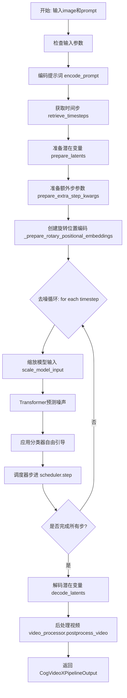
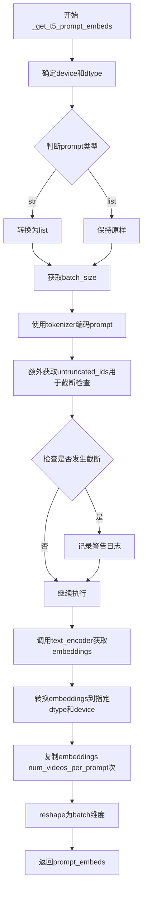
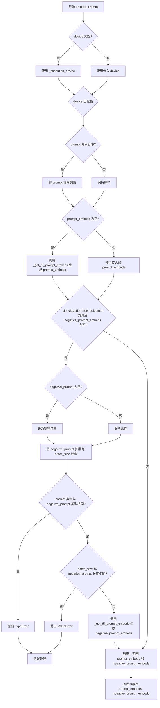
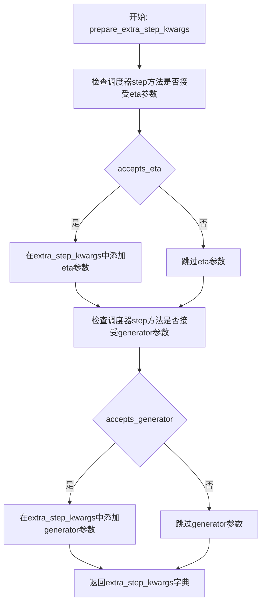
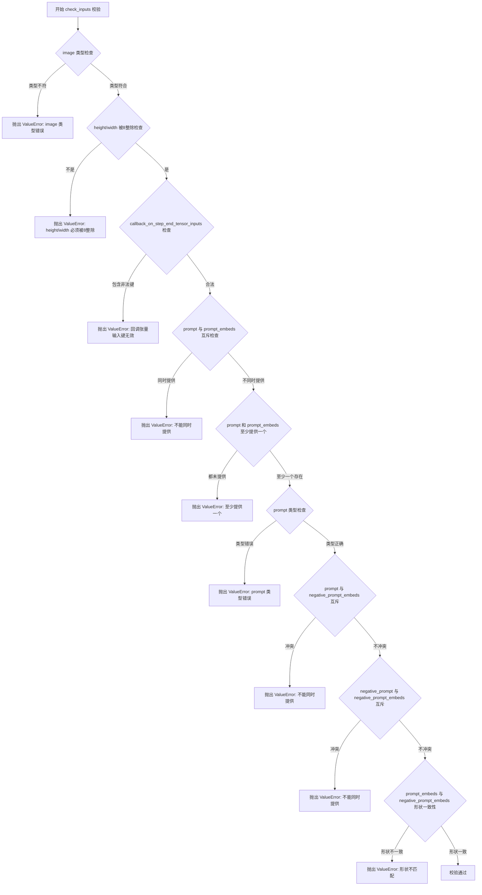
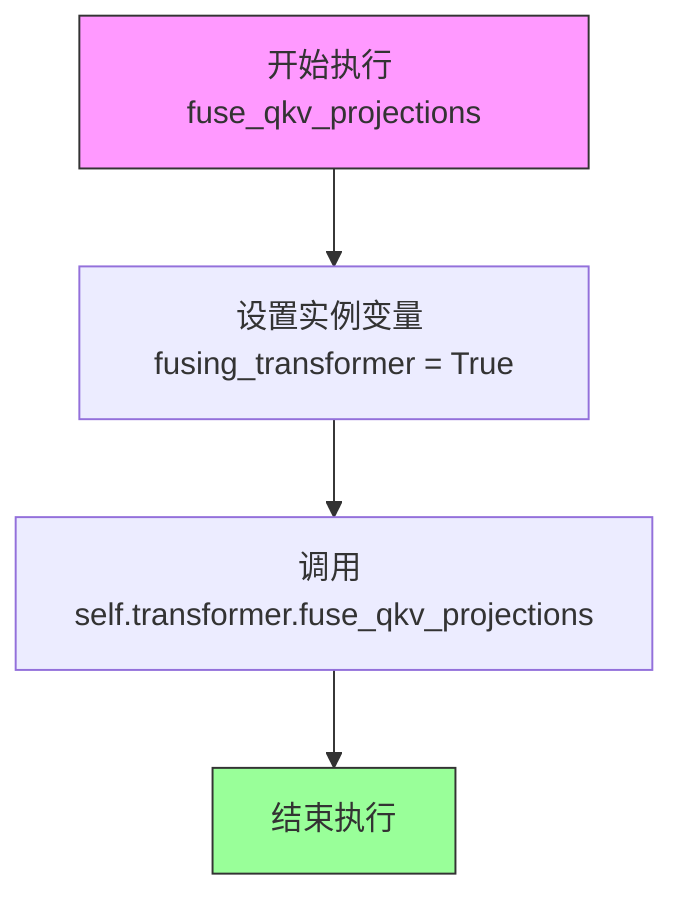
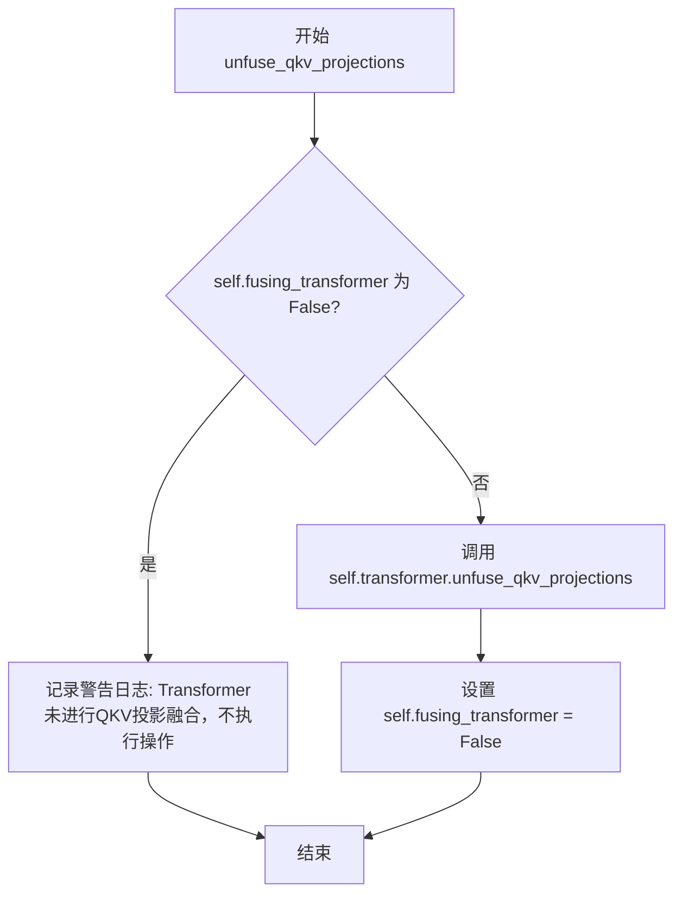
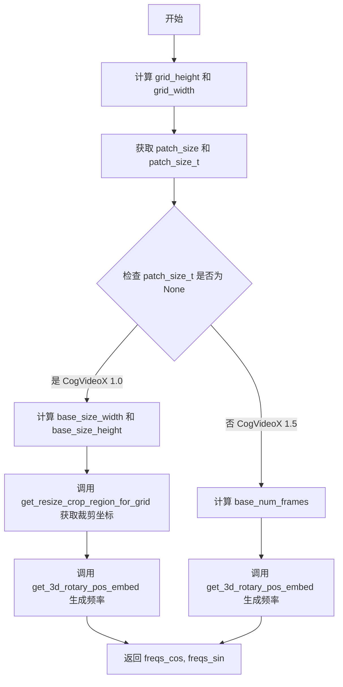

```mermaid
flowchart TD
    A[开始] --> B[获取目标尺寸: tw=tgt_width, th=tgt_height]
    B --> C[从src解包出h, w]
    C --> D[计算源图像纵横比 r = h / w]
    D --> E{判断 r > th / tw}
    E -->|是| F[设置resize_height = th, resize_width = round&#40;th / h * w&#41;]
    E -->|否| G[设置resize_width = tw, resize_height = round&#40;tw / w * h&#41;]
    F --> H[计算裁剪左上角坐标]
    G --> H
    H --> I[crop_top = round&#40;&#40;th - resize_height&#41; / 2.0&#41;]
    I --> J[crop_left = round&#40;&#40;tw - resize_width&#41; / 2.0&#41;]
    J --> K[返回裁剪区域: &#40;crop_top, crop_left&#41;, &#40;crop_top+resize_height, crop_left+resize_width&#41;]
    K --> L[结束]
```

```mermaid
flowchart TD
    A[开始 __call__] --> B[检查回调参数]
    B --> C[设置默认高度、宽度、帧数]
    C --> D[验证输入 check_inputs]
    D --> E[获取batch_size]
    E --> F[编码提示词 encode_prompt]
    F --> G{是否使用引导?}
    G -->|是| H[拼接负向和正向embeddings]
    G -->|否| I[仅使用正向embeddings]
    H --> J[准备时间步 retrieve_timesteps]
    I --> J
    J --> K[计算帧数和padding]
    K --> L[预处理图像 video_processor.preprocess]
    L --> M[准备潜在向量 prepare_latents]
    M --> N[准备额外调度器参数 prepare_extra_step_kwargs]
    N --> O{transformer使用旋转位置编码?}
    O -->|是| P[创建旋转嵌入 _prepare_rotary_positional_embeddings]
    O -->|否| Q[旋转嵌入为None]
    P --> R[创建ofs嵌入]
    Q --> R
    R --> S[初始化进度条和DPM变量]
    S --> T[遍历时间步]
    T --> U{当前步是否被中断?}
    U -->|是| V[继续下一轮]
    U -->|否| W[扩展batch维度]
    W --> X[缩放模型输入 scheduler.scale_model_input]
    X --> Y[拼接image_latents]
    Y --> Z[扩展timestep]
    Z --> AA[transformer预测噪声]
    AA --> AB{是否动态CFG?}
    AB -->|是| AC[计算动态guidance_scale]
    AB -->|否| AD[保持原guidance_scale]
    AC --> AE{分类器自由引导?}
    AD --> AE
    AE -->|是| AF[分离uncond和text预测并应用引导]
    AE -->|否| AG[直接使用预测]
    AF --> AH[scheduler.step更新latents]
    AG --> AH
    AH --> AI[回调处理 callback_on_step_end]
    AI --> AJ[更新进度条]
    AJ --> AK{是否最后一步或warmup完成?}
    AK -->|否| V
    AK -->|是| AL[检查输出类型]
    AL --> AM{output_type == 'latent'?}
    AM -->|否| AN[去除padding帧]
    AM -->|是| AO[直接使用latents作为video]
    AN --> AP[解码潜在向量 decode_latents]
    AP --> AQ[后处理视频 video_processor.postprocess_video]
    AO --> AR[释放模型钩子 maybe_free_model_hooks]
    AQ --> AR
    AR --> AS{return_dict?}
    AS -->|是| AT[返回CogVideoXPipelineOutput]
    AS -->|否| AU[返回tuple]
    AT --> AV[结束]
    AU --> AV
```

# `diffusers\src\diffusers\pipelines\cogvideo\pipeline_cogvideox_image2video.py` 详细设计文档

CogVideoXImageToVideoPipeline 是一个用于图像到视频生成的扩散管道,接收静态图像和文本提示词,通过预训练的 CogVideoX 模型(VAE、T5文本编码器、Transformer)进行多步去噪处理,最终生成与文本描述相符的动态视频。

## 整体流程



## 类结构

```
DiffusionPipeline (基类)
└── CogVideoXImageToVideoPipeline
    └── CogVideoXLoraLoaderMixin
```

## 全局变量及字段


### `XLA_AVAILABLE`
    
Indicates whether PyTorch XLA is available for TPU support.

类型：`bool`
    


### `logger`
    
Logger instance for recording pipeline events and errors.

类型：`logging.Logger`
    


### `EXAMPLE_DOC_STRING`
    
Documentation string containing usage examples for the pipeline.

类型：`str`
    


### `CogVideoXImageToVideoPipeline.tokenizer`
    
Tokenizer for converting text prompts into token IDs.

类型：`T5Tokenizer`
    


### `CogVideoXImageToVideoPipeline.text_encoder`
    
T5 text encoder for generating text embeddings.

类型：`T5EncoderModel`
    


### `CogVideoXImageToVideoPipeline.vae`
    
VAE model for encoding and decoding video latents.

类型：`AutoencoderKLCogVideoX`
    


### `CogVideoXImageToVideoPipeline.transformer`
    
3D transformer model for denoising video latents.

类型：`CogVideoXTransformer3DModel`
    


### `CogVideoXImageToVideoPipeline.scheduler`
    
Scheduler for controlling the diffusion process.

类型：`CogVideoXDDIMScheduler | CogVideoXDPMScheduler`
    


### `CogVideoXImageToVideoPipeline.vae_scale_factor_spatial`
    
Spatial scaling factor for the VAE.

类型：`int`
    


### `CogVideoXImageToVideoPipeline.vae_scale_factor_temporal`
    
Temporal scaling factor for the VAE.

类型：`int`
    


### `CogVideoXImageToVideoPipeline.vae_scaling_factor_image`
    
Image scaling factor for the VAE.

类型：`float`
    


### `CogVideoXImageToVideoPipeline.video_processor`
    
Processor for handling video input and output.

类型：`VideoProcessor`
    


### `CogVideoXImageToVideoPipeline._guidance_scale`
    
Guidance scale for classifier-free guidance.

类型：`float`
    


### `CogVideoXImageToVideoPipeline._num_timesteps`
    
Number of denoising steps for inference.

类型：`int`
    


### `CogVideoXImageToVideoPipeline._attention_kwargs`
    
Additional keyword arguments for attention processing.

类型：`dict`
    


### `CogVideoXImageToVideoPipeline._current_timestep`
    
Current timestep during the denoising process.

类型：`int`
    


### `CogVideoXImageToVideoPipeline._interrupt`
    
Flag to interrupt the denoising process.

类型：`bool`
    


### `CogVideoXImageToVideoPipeline._optional_components`
    
List of optional pipeline components.

类型：`list`
    


### `CogVideoXImageToVideoPipeline.model_cpu_offload_seq`
    
Sequence for offloading models to CPU.

类型：`str`
    


### `CogVideoXImageToVideoPipeline._callback_tensor_inputs`
    
List of tensor inputs for callbacks.

类型：`list`
    
    

## 全局函数及方法


### `get_resize_crop_region_for_grid`

该函数用于计算图像在调整大小和裁剪到目标尺寸时的裁剪区域。它根据源图像和目标图像的纵横比关系，首先计算保持纵横比的最大可能调整后尺寸，然后在目标框中心进行对称裁剪，返回裁剪区域的左上角和右下角坐标。

参数：

- `src`：Tuple[int, int]，源图像的高度和宽度 (h, w)
- `tgt_width`：int，目标宽度
- `tgt_height`：int，目标高度

返回值：Tuple[Tuple[int, int], Tuple[int, int]]，返回两个坐标元组——第一个是裁剪区域的左上角坐标 (crop_top, crop_left)，第二个是裁剪区域的右下角坐标 (crop_top + resize_height, crop_left + resize_width)

#### 流程图



#### 带注释源码

```python
# Similar to diffusers.pipelines.hunyuandit.pipeline_hunyuandit.get_resize_crop_region_for_grid
def get_resize_crop_region_for_grid(src, tgt_width, tgt_height):
    """
    计算图像调整大小和裁剪区域，用于将源图像适配到目标尺寸。
    
    该函数实现了等比缩放+中心裁剪的策略：
    1. 先计算保持纵横比的最大可缩放尺寸
    2. 然后计算居中裁剪的坐标
    
    参数:
        src: 源图像尺寸，格式为 (height, width) 的元组
        tgt_width: 目标宽度
        tgt_height: 目标高度
    
    返回:
        两个坐标元组: 
        - 第一个是裁剪区域左上角坐标 (crop_top, crop_left)
        - 第二个是裁剪区域右下角坐标 (crop_top + resize_height, crop_left + resize_width)
    """
    # 目标尺寸
    tw = tgt_width
    th = tgt_height
    # 解包源图像尺寸：高度和宽度
    h, w = src
    # 计算源图像的纵横比 (height / width)
    r = h / w
    
    # 根据纵横比判断应该以宽度还是高度为基准进行缩放
    if r > (th / tw):
        # 源图像比目标图像更"高"，以高度为基准缩放
        # 高度填满目标高度，宽度按比例计算
        resize_height = th
        resize_width = int(round(th / h * w))
    else:
        # 源图像比目标图像更"宽"，以宽度为基准缩放
        # 宽度填满目标宽度，高度按比例计算
        resize_width = tw
        resize_height = int(round(tw / w * h))

    # 计算居中裁剪的左上角坐标
    # 使得裁剪区域在目标框中居中
    crop_top = int(round((th - resize_height) / 2.0))
    crop_left = int(round((tw - resize_width) / 2.0))

    # 返回裁剪区域的左上角和右下角坐标
    # 左上角: (crop_top, crop_left)
    # 右下角: (crop_top + resize_height, crop_left + resize_width)
    return (crop_top, crop_left), (crop_top + resize_height, crop_left + resize_width)
```


### `retrieve_timesteps`

该函数是扩散模型Pipeline中的时间步（timesteps）检索工具函数，负责调用调度器（scheduler）的`set_timesteps`方法来设置推理过程中的时间步，并返回设置后的时间步数组和推理步数。它支持三种模式：使用自定义timesteps、使用自定义sigmas，或使用默认的num_inference_steps。

参数：

- `scheduler`：`SchedulerMixin`，要获取时间步的调度器对象
- `num_inference_steps`：`int | None`，扩散模型的推理步数，当使用timesteps或sigmas时必须为None
- `device`：`str | torch.device | None`，时间步要移动到的设备，如果为None则不移动
- `timesteps`：`list[int] | None`，自定义时间步，用于覆盖调度器的默认时间步间隔策略
- `sigmas`：`list[float] | None`，自定义sigmas值，用于覆盖调度器的默认时间步间隔策略
- `**kwargs`：任意关键字参数，将传递给scheduler的set_timesteps方法

返回值：`tuple[torch.Tensor, int]`，第一个元素是调度器的时间步数组，第二个元素是推理步数

#### 流程图

```mermaid
flowchart TD
    A[开始] --> B{检查timesteps和sigmas是否同时存在}
    B -->|是| C[抛出ValueError: 只能指定timesteps或sigmas之一]
    B -->|否| D{检查timesteps是否不为None}
    D -->|是| E[检查scheduler.set_timesteps是否支持timesteps参数]
    E -->|不支持| F[抛出ValueError: 当前scheduler不支持自定义timesteps]
    E -->|支持| G[调用scheduler.set_timesteps传入timesteps和device]
    G --> H[获取scheduler.timesteps]
    H --> I[计算num_inference_steps = len(timesteps)]
    D -->|否| J{检查sigmas是否不为None}
    J -->|是| K[检查scheduler.set_timesteps是否支持sigmas参数]
    K -->|不支持| L[抛出ValueError: 当前scheduler不支持自定义sigmas]
    K -->|支持| M[调用scheduler.set_timesteps传入sigmas和device]
    M --> N[获取scheduler.timesteps]
    N --> O[计算num_inference_steps = len(timesteps)]
    J -->|否| P[调用scheduler.set_timesteps传入num_inference_steps和device]
    P --> Q[获取scheduler.timesteps]
    Q --> R[返回timesteps和num_inference_steps]
    I --> R
    O --> R
    C --> Z[结束]
    F --> Z
    L --> Z
```

#### 带注释源码

```python
# Copied from diffusers.pipelines.stable_diffusion.pipeline_stable_diffusion.retrieve_timesteps
def retrieve_timesteps(
    scheduler,
    num_inference_steps: int | None = None,
    device: str | torch.device | None = None,
    timesteps: list[int] | None = None,
    sigmas: list[float] | None = None,
    **kwargs,
):
    r"""
    Calls the scheduler's `set_timesteps` method and retrieves timesteps from the scheduler after the call. Handles
    custom timesteps. Any kwargs will be supplied to `scheduler.set_timesteps`.

    Args:
        scheduler (`SchedulerMixin`):
            The scheduler to get timesteps from.
        num_inference_steps (`int`):
            The number of diffusion steps used when generating samples with a pre-trained model. If used, `timesteps`
            must be `None`.
        device (`str` or `torch.device`, *optional*):
            The device to which the timesteps should be moved to. If `None`, the timesteps are not moved.
        timesteps (`list[int]`, *optional*):
            Custom timesteps used to override the timestep spacing strategy of the scheduler. If `timesteps` is passed,
            `num_inference_steps` and `sigmas` must be `None`.
        sigmas (`list[float]`, *optional*):
            Custom sigmas used to override the timestep spacing strategy of the scheduler. If `sigmas` is passed,
            `num_inference_steps` and `timesteps` must be `None`.

    Returns:
        `tuple[torch.Tensor, int]`: A tuple where the first element is the timestep schedule from the scheduler and the
        second element is the number of inference steps.
    """
    # 检查timesteps和sigmas不能同时传递，只能选择其中一个
    if timesteps is not None and sigmas is not None:
        raise ValueError("Only one of `timesteps` or `sigmas` can be passed. Please choose one to set custom values")
    
    # 分支1: 使用自定义timesteps
    if timesteps is not None:
        # 通过inspect检查scheduler.set_timesteps方法是否接受timesteps参数
        accepts_timesteps = "timesteps" in set(inspect.signature(scheduler.set_timesteps).parameters.keys())
        if not accepts_timesteps:
            raise ValueError(
                f"The current scheduler class {scheduler.__class__}'s `set_timesteps` does not support custom"
                f" timestep schedules. Please check whether you are using the correct scheduler."
            )
        # 调用scheduler的set_timesteps方法设置自定义时间步
        scheduler.set_timesteps(timesteps=timesteps, device=device, **kwargs)
        # 从scheduler获取设置后的timesteps
        timesteps = scheduler.timesteps
        # 计算实际的推理步数
        num_inference_steps = len(timesteps)
    
    # 分支2: 使用自定义sigmas
    elif sigmas is not None:
        # 通过inspect检查scheduler.set_timesteps方法是否接受sigmas参数
        accept_sigmas = "sigmas" in set(inspect.signature(scheduler.set_timesteps).parameters.keys())
        if not accept_sigmas:
            raise ValueError(
                f"The current scheduler class {scheduler.__class__}'s `set_timesteps` does not support custom"
                f" sigmas schedules. Please check whether you are using the correct scheduler."
            )
        # 调用scheduler的set_timesteps方法设置自定义sigmas
        scheduler.set_timesteps(sigmas=sigmas, device=device, **kwargs)
        # 从scheduler获取设置后的timesteps
        timesteps = scheduler.timesteps
        # 计算实际的推理步数
        num_inference_steps = len(timesteps)
    
    # 分支3: 使用默认的num_inference_steps
    else:
        # 调用scheduler的set_timesteps方法，使用默认推理步数
        scheduler.set_timesteps(num_inference_steps, device=device, **kwargs)
        # 从scheduler获取设置后的timesteps
        timesteps = scheduler.timesteps
    
    # 返回时间步数组和推理步数
    return timesteps, num_inference_steps
```


### `retrieve_latents`

这是一个全局函数，用于从编码器输出（encoder_output）中检索潜在的表示（latents）。该函数支持从潜在分布中采样（sample 模式）、从潜在分布中获取最可能值（argmax 模式），或者直接返回预计算的 latents 属性。这是 CogVideoX 图像到视频管道中从 VAE 编码器获取潜在向量的关键步骤。

参数：

- `encoder_output`：`torch.Tensor`，编码器输出对象，通常包含 `latent_dist` 属性（潜在分布）或 `latents` 属性（预计算的潜在向量）
- `generator`：`torch.Generator | None`，可选的 PyTorch 随机数生成器，用于确保采样过程的可重复性
- `sample_mode`：`str`，采样模式，默认为 "sample"。可选值包括 "sample"（从分布中采样）和 "argmax"（获取分布的众数）

返回值：`torch.Tensor`，从编码器输出中提取的潜在表示张量

#### 流程图

```mermaid
flowchart TD
    A[开始: retrieve_latents] --> B{encoder_output 是否有 latent_dist 属性?}
    B -- 是 --> C{sample_mode == 'sample'?}
    B -- 否 --> E{encoder_output 是否有 latents 属性?}
    C -- 是 --> D[返回 encoder_output.latent_dist.sample<br/>(generator)]
    C -- 否 --> F{sample_mode == 'argmax'?}
    F -- 是 --> G[返回 encoder_output.latent_dist.mode<br/>()]
    F -- 否 --> H[抛出 AttributeError]
    E -- 是 --> I[返回 encoder_output.latents]
    E -- 否 --> H
    D --> J[结束]
    G --> J
    I --> J
    H --> J
```

#### 带注释源码

```
# 从 diffusers 库中复制过来的函数，用于从编码器输出中检索潜在向量
# Copied from diffusers.pipelines.stable_diffusion.pipeline_stable_diffusion_img2img.retrieve_latents
def retrieve_latents(
    encoder_output: torch.Tensor,  # 编码器输出，包含潜在分布或预计算的潜在向量
    generator: torch.Generator | None = None,  # 可选的随机数生成器，用于采样时控制随机性
    sample_mode: str = "sample"  # 采样模式：'sample' 从分布采样，'argmax' 取众数
):
    # 检查 encoder_output 是否具有 latent_dist 属性（表示输出是潜在分布）
    if hasattr(encoder_output, "latent_dist") and sample_mode == "sample":
        # 如果是采样模式，从潜在分布中采样得到潜在向量
        # 使用 generator 可以确保采样的可重复性（如果提供了 generator）
        return encoder_output.latent_dist.sample(generator)
    # 如果是 argmax 模式，获取潜在分布的众数（即最可能的值）
    elif hasattr(encoder_output, "latent_dist") and sample_mode == "argmax":
        return encoder_output.latent_dist.mode()
    # 检查 encoder_output 是否直接具有 latents 属性（预计算的潜在向量）
    elif hasattr(encoder_output, "latents"):
        return encoder_output.latents
    # 如果无法从 encoder_output 中获取潜在表示，抛出属性错误
    else:
        raise AttributeError("Could not access latents of provided encoder_output")
```


### `CogVideoXImageToVideoPipeline.__init__`

这是 CogVideoX Image-to-Video 管道 pipeline 的初始化方法，负责接收并注册各种模型组件（tokenizer、text_encoder、vae、transformer、scheduler），并计算 VAE 的缩放因子以及初始化视频处理器。

参数：

- `tokenizer`：`T5Tokenizer`，用于将文本 prompt 转换为 token 序列的分词器
- `text_encoder`：`T5EncoderModel`，用于将 token 序列编码为文本嵌入的 T5 编码器模型
- `vae`：`AutoencoderKLCogVideoX`，用于编码/解码视频 latent 表示的变分自编码器
- `transformer`：`CogVideoXTransformer3DModel`，用于去噪视频 latent 的 3D 变换器模型
- `scheduler`：`CogVideoXDDIMScheduler | CogVideoXDPMScheduler`，用于控制去噪过程的调度器

返回值：无（`None`），该方法为构造函数，仅初始化对象状态

#### 流程图

```mermaid
flowchart TD
    A[开始 __init__] --> B[调用 super().__init__]
    B --> C[register_modules: 注册 tokenizer, text_encoder, vae, transformer, scheduler]
    C --> D{self.vae 存在?}
    D -->|是| E[计算 vae_scale_factor_spatial: 2 ** (len(vae.config.block_out_channels) - 1)]
    D -->|否| F[vae_scale_factor_spatial = 8]
    E --> G[计算 vae_scale_factor_temporal: vae.config.temporal_compression_ratio]
    F --> G
    G --> H[计算 vae_scaling_factor_image: vae.config.scaling_factor]
    H --> I[创建 VideoProcessor 并赋值给 self.video_processor]
    I --> J[结束 __init__]
```

#### 带注释源码

```python
def __init__(
    self,
    tokenizer: T5Tokenizer,
    text_encoder: T5EncoderModel,
    vae: AutoencoderKLCogVideoX,
    transformer: CogVideoXTransformer3DModel,
    scheduler: CogVideoXDDIMScheduler | CogVideoXDPMScheduler,
):
    # 调用父类 DiffusionPipeline 的初始化方法
    # 继承基础管道功能（如设备管理、模型加载等）
    super().__init__()

    # 将传入的模型组件注册到管道中
    # 这些组件可通过 self.tokenizer, self.text_encoder 等访问
    self.register_modules(
        tokenizer=tokenizer,
        text_encoder=text_encoder,
        vae=vae,
        transformer=transformer,
        scheduler=scheduler,
    )

    # 计算 VAE 空间缩放因子
    # 用于将像素空间坐标转换为 latent 空间坐标
    # 基于 VAE 的 block_out_channels 数量计算（通常是 4 个 block，对应 factor=8）
    self.vae_scale_factor_spatial = (
        2 ** (len(self.vae.config.block_out_channels) - 1) if getattr(self, "vae", None) else 8
    )

    # 计算 VAE 时间缩放因子
    # 用于将帧数转换为 latent 帧数（时间维度压缩）
    # CogVideoX 默认 temporal_compression_ratio 为 4
    self.vae_scale_factor_temporal = (
        self.vae.config.temporal_compression_ratio if getattr(self, "vae", None) else 4
    )

    # 计算 VAE 的图像缩放因子
    # 用于在编码/解码 latent 时进行缩放
    # CogVideoX 默认 scaling_factor 为 0.7
    self.vae_scaling_factor_image = self.vae.config.scaling_factor if getattr(self, "vae", None) else 0.7

    # 创建视频后处理器
    # 用于将解码后的 latent 转换为最终的视频帧（支持 PIL、numpy 等格式）
    self.video_processor = VideoProcessor(vae_scale_factor=self.vae_scale_factor_spatial)
```


### `CogVideoXImageToVideoPipeline._get_t5_prompt_embeds`

该方法用于将文本提示（prompt）编码为T5文本编码器的隐藏状态（embeddings），为CogVideoX图像到视频生成管道提供文本条件特征。

参数：

- `self`：`CogVideoXImageToVideoPipeline`实例本身
- `prompt`：`str | list[str]`，要编码的文本提示，可以是单个字符串或字符串列表
- `num_videos_per_prompt`：`int`，每个提示生成的视频数量，默认为1，用于批量生成时复制embeddings
- `max_sequence_length`：`int`，编码的最大序列长度，默认为226，控制tokenizer的max_length参数
- `device`：`torch.device | None`，指定计算设备，默认为None则使用self._execution_device
- `dtype`：`torch.dtype | None`，指定返回embeddings的数据类型，默认为None则使用text_encoder的dtype

返回值：`torch.Tensor`，返回形状为`(batch_size * num_videos_per_prompt, seq_len, hidden_dim)`的文本embeddings张量

#### 流程图



#### 带注释源码

```python
def _get_t5_prompt_embeds(
    self,
    prompt: str | list[str] = None,
    num_videos_per_prompt: int = 1,
    max_sequence_length: int = 226,
    device: torch.device | None = None,
    dtype: torch.dtype | None = None,
):
    # 确定设备：如果未指定device，则使用pipeline的执行设备
    device = device or self._execution_device
    # 确定数据类型：如果未指定dtype，则使用text_encoder的数据类型
    dtype = dtype or self.text_encoder.dtype

    # 如果prompt是单个字符串，转换为列表；否则保持原样
    # 这样可以统一处理单提示和多提示的情况
    prompt = [prompt] if isinstance(prompt, str) else prompt
    # 获取批处理大小
    batch_size = len(prompt)

    # 使用tokenizer将文本prompt转换为token IDs
    # padding="max_length"：填充到最大长度
    # max_length=max_sequence_length：最大序列长度
    # truncation=True：截断超长序列
    # add_special_tokens=True：添加特殊_tokens（如bos/eos）
    # return_tensors="pt"：返回PyTorch张量
    text_inputs = self.tokenizer(
        prompt,
        padding="max_length",
        max_length=max_sequence_length,
        truncation=True,
        add_special_tokens=True,
        return_tensors="pt",
    )
    # 获取编码后的input_ids
    text_input_ids = text_inputs.input_ids
    # 额外获取未截断的token IDs，用于检测是否有内容被截断
    untruncated_ids = self.tokenizer(prompt, padding="longest", return_tensors="pt").input_ids

    # 检查是否发生了截断
    # 如果未截断的序列长度 >= 截断后的长度，并且两者不相等，说明有内容被截断
    if untruncated_ids.shape[-1] >= text_input_ids.shape[-1] and not torch.equal(text_input_ids, untruncated_ids):
        # 解码被截断的部分用于日志记录
        removed_text = self.tokenizer.batch_decode(untruncated_ids[:, max_sequence_length - 1 : -1])
        # 发出警告，告知用户输入被截断
        logger.warning(
            "The following part of your input was truncated because `max_sequence_length` is set to "
            f" {max_sequence_length} tokens: {removed_text}"
        )

    # 调用T5文本编码器获取文本embeddings
    # text_encoder返回的是一个输出对象，[0]获取hidden_states
    prompt_embeds = self.text_encoder(text_input_ids.to(device))[0]
    # 将embeddings转换到指定的dtype和device
    prompt_embeds = prompt_embeds.to(dtype=dtype, device=device)

    # 为每个prompt生成多个视频时复制text embeddings
    # 这是一种MPS友好的方法
    # 获取embeddings的序列长度
    _, seq_len, _ = prompt_embeds.shape
    # 沿着第一个维度（batch维度）重复embeddings
    prompt_embeds = prompt_embeds.repeat(1, num_videos_per_prompt, 1)
    # 重塑为最终的batch大小
    # 从 (batch_size, seq_len, hidden_dim) 变为 (batch_size * num_videos_per_prompt, seq_len, hidden_dim)
    prompt_embeds = prompt_embeds.view(batch_size * num_videos_per_prompt, seq_len, -1)

    # 返回处理后的prompt embeddings
    return prompt_embeds
```


### `CogVideoXImageToVideoPipeline.encode_prompt`

该方法将文本提示（prompt）编码为文本编码器（T5 Encoder）的隐藏状态（hidden states），支持正向提示和负向提示的编码，并处理分类器自由引导（Classifier-Free Guidance）的文本嵌入准备。

参数：

- `prompt`：`str | list[str]`，要编码的提示词，可以是单个字符串或字符串列表
- `negative_prompt`：`str | list[str] | None`，不期望的提示词，用于引导生成排除相关内容，如果不定义则需传递 `negative_prompt_embeds`
- `do_classifier_free_guidance`：`bool`，是否使用分类器自由引导，默认为 True
- `num_videos_per_prompt`：`int`，每个提示词生成的视频数量，默认为 1
- `prompt_embeds`：`torch.Tensor | None`，预生成的文本嵌入，可用于轻松调整文本输入
- `negative_prompt_embeds`：`torch.Tensor | None`，预生成的负向文本嵌入
- `max_sequence_length`：`int`，编码提示的最大序列长度，默认为 226
- `device`：`torch.device | None`，torch 设备
- `dtype`：`torch.dtype | None`，torch 数据类型

返回值：`tuple[torch.Tensor, torch.Tensor]`，返回编码后的提示嵌入和负向提示嵌入元组

#### 流程图



#### 带注释源码

```python
def encode_prompt(
    self,
    prompt: str | list[str],
    negative_prompt: str | list[str] | None = None,
    do_classifier_free_guidance: bool = True,
    num_videos_per_prompt: int = 1,
    prompt_embeds: torch.Tensor | None = None,
    negative_prompt_embeds: torch.Tensor | None = None,
    max_sequence_length: int = 226,
    device: torch.device | None = None,
    dtype: torch.dtype | None = None,
):
    r"""
    Encodes the prompt into text encoder hidden states.

    Args:
        prompt (`str` or `list[str]`, *optional*):
            prompt to be encoded
        negative_prompt (`str` or `list[str]`, *optional*):
            The prompt or prompts not to guide the image generation. If not defined, one has to pass
            `negative_prompt_embeds` instead. Ignored when not using guidance (i.e., ignored if `guidance_scale` is
            less than `1`).
        do_classifier_free_guidance (`bool`, *optional*, defaults to `True`):
            Whether to use classifier free guidance or not.
        num_videos_per_prompt (`int`, *optional*, defaults to 1):
            Number of videos that should be generated per prompt. torch device to place the resulting embeddings on
        prompt_embeds (`torch.Tensor`, *optional*):
            Pre-generated text embeddings. Can be used to easily tweak text inputs, *e.g.* prompt weighting. If not
            provided, text embeddings will be generated from `prompt` input argument.
        negative_prompt_embeds (`torch.Tensor`, *optional*):
            Pre-generated negative text embeddings. Can be used to easily tweak text inputs, *e.g.* prompt
            weighting. If not provided, negative_prompt_embeds will be generated from `negative_prompt` input
            argument.
        device: (`torch.device`, *optional*):
            torch device
        dtype: (`torch.dtype`, *optional*):
            torch dtype
    """
    # 确定设备，优先使用传入的 device，否则使用执行设备
    device = device or self._execution_device

    # 如果 prompt 是字符串，转换为列表；如果是列表则保持不变
    prompt = [prompt] if isinstance(prompt, str) else prompt
    
    # 计算 batch_size：如果传入了 prompt 则根据其长度计算，否则使用 prompt_embeds 的 batch 维度
    if prompt is not None:
        batch_size = len(prompt)
    else:
        batch_size = prompt_embeds.shape[0]

    # 如果未提供 prompt_embeds，则通过 _get_t5_prompt_embeds 方法生成
    if prompt_embeds is None:
        prompt_embeds = self._get_t5_prompt_embeds(
            prompt=prompt,
            num_videos_per_prompt=num_videos_per_prompt,
            max_sequence_length=max_sequence_length,
            device=device,
            dtype=dtype,
        )

    # 如果启用分类器自由引导且未提供负向提示嵌入，则生成负向提示嵌入
    if do_classifier_free_guidance and negative_prompt_embeds is None:
        # 如果未提供负向提示，默认为空白字符串
        negative_prompt = negative_prompt or ""
        # 将负向提示扩展为与 batch_size 相同的长度
        negative_prompt = batch_size * [negative_prompt] if isinstance(negative_prompt, str) else negative_prompt

        # 类型检查：确保 prompt 和 negative_prompt 类型一致
        if prompt is not None and type(prompt) is not type(negative_prompt):
            raise TypeError(
                f"`negative_prompt` should be the same type to `prompt`, but got {type(negative_prompt)} !="
                f" {type(prompt)}."
            )
        # 批大小检查：确保 negative_prompt 与 prompt 的批大小一致
        elif batch_size != len(negative_prompt):
            raise ValueError(
                f"`negative_prompt`: {negative_prompt} has batch size {len(negative_prompt)}, but `prompt`:"
                f" {prompt} has batch size {batch_size}. Please make sure that passed `negative_prompt` matches"
                " the batch size of `prompt`."
            )

        # 生成负向提示嵌入
        negative_prompt_embeds = self._get_t5_prompt_embeds(
            prompt=negative_prompt,
            num_videos_per_prompt=num_videos_per_prompt,
            max_sequence_length=max_sequence_length,
            device=device,
            dtype=dtype,
        )

    # 返回编码后的提示嵌入和负向提示嵌入
    return prompt_embeds, negative_prompt_embeds
```


### `CogVideoXImageToVideoPipeline.prepare_latents`

该方法负责为 CogVideoX 图像到视频生成管道准备潜在向量（latents）和图像潜在向量（image_latents）。它首先验证生成器输入，计算基于时间压缩的帧数，然后确定潜在向量的形状；对于 CogVideoX1.5 版本还会调整形状以适应 patch_size_t。接着通过 VAE 编码输入图像获取图像潜在向量，应用缩放因子，创建填充，必要时调整 patch_size_t，最后如果未提供潜在向量则生成随机潜在向量，并按照调度器的初始噪声标准差进行缩放。

参数：

- `self`：`CogVideoXImageToVideoPipeline` 类的实例方法
- `image`：`torch.Tensor`，输入图像张量，用于编码生成图像潜在向量
- `batch_size`：`int`，批量大小，默认为 1，指定要生成的视频数量
- `num_channels_latents`：`int`，潜在通道数，默认为 16，控制潜在空间的维度
- `num_frames`：`int`，帧数，默认为 13，指定要生成的视频帧数
- `height`：`int`，高度，默认为 60，输入图像的目标高度（像素）
- `width`：`int`，宽度，默认为 90，输入图像的目标宽度（像素）
- `dtype`：`torch.dtype | None`，数据类型，用于指定潜在向量的精度
- `device`：`torch.device | None`，设备，指定计算设备（CPU/CUDA）
- `generator`：`torch.Generator | None`，随机生成器，用于确保可重复性
- `latents`：`torch.Tensor | None`，预定义的潜在向量，如果为 None 则随机生成

返回值：`tuple[torch.Tensor, torch.Tensor]`，返回两个张量——第一个是噪声潜在向量（latents），第二个是图像潜在向量（image_latents），两者都用于扩散模型的去噪过程

#### 流程图

```mermaid
flowchart TD
    A[开始 prepare_latents] --> B{验证 generator 列表长度}
    B -->|长度不匹配| C[抛出 ValueError]
    B -->|验证通过| D[计算 num_frames: (num_frames - 1) // vae_scale_factor_temporal + 1]
    D --> E[计算 shape: (batch_size, num_frames, num_channels_latents, height//vae_scale_factor_spatial, width//vae_scale_factor_spatial)]
    E --> F{CogVideoX1.5?}
    F -->|是| G[调整 shape: shape[1] += shape[1] % patch_size_t]
    F -->|否| H[跳过调整]
    G --> I[image.unsqueeze(2) 添加帧维度]
    H --> I
    I --> J{generator 是列表?}
    J -->|是| K[为每个 batch 编码图像]
    J -->|否| L[批量编码所有图像]
    K --> M[retrieve_latents 提取潜在向量]
    L --> M
    M --> N[拼接并重排列: (B, F, C, H, W)]
    N --> O{invert_scale_latents?}
    O -->|否| P[乘以 vae_scaling_factor_image]
    O -->|是| Q[除以 vae_scaling_factor_image]
    P --> R[创建 padding_shape: (batch_size, num_frames-1, ...)]
    Q --> R
    R --> S[创建零填充 latent_padding]
    S --> T[拼接: torch.cat([image_latents, latent_padding], dim=1)]
    T --> U{patch_size_t 不为 None?}
    U -->|是| V[提取首帧并重新拼接]
    U -->|否| W{latents is None?}
    V --> W
    W -->|是| X[randn_tensor 生成随机潜在向量]
    W -->|否| Y[latents.to(device)]
    X --> Z[乘以 scheduler.init_noise_sigma]
    Y --> Z
    Z --> AA[返回 (latents, image_latents)]
```

#### 带注释源码

```python
def prepare_latents(
    self,
    image: torch.Tensor,
    batch_size: int = 1,
    num_channels_latents: int = 16,
    num_frames: int = 13,
    height: int = 60,
    width: int = 90,
    dtype: torch.dtype | None = None,
    device: torch.device | None = None,
    generator: torch.Generator | None = None,
    latents: torch.Tensor | None = None,
):
    # 验证：如果传入多个生成器，其数量必须与批处理大小匹配
    if isinstance(generator, list) and len(generator) != batch_size:
        raise ValueError(
            f"You have passed a list of generators of length {len(generator)}, but requested an effective batch"
            f" size of {batch_size}. Make sure the batch size matches the length of the generators."
        )

    # 计算潜在帧数：考虑时间压缩比率
    # CogVideoX 使用时间压缩来减少帧数，例如 4:1 的压缩比
    num_frames = (num_frames - 1) // self.vae_scale_factor_temporal + 1
    
    # 确定潜在向量的形状：[batch, frames, channels, height, width]
    # 注意：高度和宽度需要除以 VAE 空间缩放因子进行下采样
    shape = (
        batch_size,
        num_frames,
        num_channels_latents,
        height // self.vae_scale_factor_spatial,
        width // self.vae_scale_factor_spatial,
    )

    # CogVideoX1.5 特定处理：需要为 patch_size_t 添加填充
    # 这确保潜在帧数可被时间 patch 大小整除
    if self.transformer.config.patch_size_t is not None:
        shape = shape[:1] + (shape[1] + shape[1] % self.transformer.config.patch_size_t,) + shape[2:]

    # 为图像张量添加帧维度：[B, C, H, W] -> [B, C, F, H, W]
    # 因为 VAE 编码器期望 5D 输入（批量、通道、帧、高度、宽度）
    image = image.unsqueeze(2)  # [B, C, F, H, W]

    # 使用 VAE 编码图像为潜在向量
    if isinstance(generator, list):
        # 多个生成器：逐个处理每个图像
        image_latents = [
            retrieve_latents(self.vae.encode(image[i].unsqueeze(0)), generator[i]) for i in range(batch_size)
        ]
    else:
        # 单个生成器：批量处理所有图像
        image_latents = [retrieve_latents(self.vae.encode(img.unsqueeze(0)), generator) for img in image]

    # 拼接并重排列维度：[B, C, F, H, W] -> [B, F, C, H, W]
    image_latents = torch.cat(image_latents, dim=0).to(dtype).permute(0, 2, 1, 3, 4)  # [B, F, C, H, W]

    # 应用 VAE 缩放因子
    # invert_scale_latents 标志处理训练时未正确乘以缩放因子的情况
    if not self.vae.config.invert_scale_latents:
        image_latents = self.vae_scaling_factor_image * image_latents
    else:
        # CogVideoX 团队训练时忘记乘以缩放因子，这里用倒数来补偿
        image_latents = 1 / self.vae_scaling_factor_image * image_latents

    # 创建填充形状：除了第一帧外的其余帧
    # 第一帧由输入图像编码得到，后续帧需要填充
    padding_shape = (
        batch_size,
        num_frames - 1,
        num_channels_latents,
        height // self.vae_scale_factor_spatial,
        width // self.vae_scale_factor_spatial,
    )

    # 创建零填充并与图像潜在向量拼接
    latent_padding = torch.zeros(padding_shape, device=device, dtype=dtype)
    image_latents = torch.cat([image_latents, latent_padding], dim=1)

    # CogVideoX1.5 额外处理：确保首帧对齐到 patch_size_t 边界
    if self.transformer.config.patch_size_t is not None:
        first_frame = image_latents[:, : image_latents.size(1) % self.transformer.config.patch_size_t, ...]
        image_latents = torch.cat([first_frame, image_latents], dim=1)

    # 准备噪声潜在向量
    if latents is None:
        # 随机生成初始噪声潜在向量
        latents = randn_tensor(shape, generator=generator, device=device, dtype=dtype)
    else:
        # 使用提供的潜在向量（移动到指定设备）
        latents = latents.to(device)

    # 根据调度器的要求缩放初始噪声
    # 不同调度器对初始噪声有不同的标准差要求
    latents = latents * self.scheduler.init_noise_sigma
    
    # 返回两个潜在向量：
    # 1. latents: 随机初始化的噪声潜在向量，用于扩散去噪过程
    # 2. image_latents: 从输入图像编码得到的图像潜在向量，作为条件输入
    return latents, image_latents
```


### `CogVideoXImageToVideoPipeline.decode_latents`

该方法负责将模型输出的潜在表示（latents）解码为实际的视频帧数据。它通过 VAE（变分自编码器）的解码器将潜在空间中的表示转换回像素空间，生成可供查看或保存的视频帧序列。

参数：

- `self`：类实例本身，包含 VAE 模型和缩放因子配置
- `latents`：`torch.Tensor`，输入的潜在表示张量，形状通常为 [batch_size, num_frames, num_channels, height, width]

返回值：`torch.Tensor`，解码后的视频帧张量，形状为 [batch_size, num_channels, num_frames, height, width]

#### 流程图

```mermaid
flowchart TD
    A[输入 latents<br/>batch_size × num_frames × num_channels × height × width] --> B[维度重排 permute<br/>batch_size × num_channels × num_frames × height × width]
    B --> C[应用 VAE 缩放因子<br/>latents = 1 / vae_scaling_factor_image × latents]
    C --> D[VAE 解码<br/>self.vae.decode(latents)]
    D --> E[获取解码样本<br/>.sample]
    E --> F[返回视频帧<br/>batch_size × num_channels × num_frames × height × width]
```

#### 带注释源码

```python
def decode_latents(self, latents: torch.Tensor) -> torch.Tensor:
    """
    解码潜在表示为视频帧
    
    参数:
        latents: 来自扩散模型的潜在表示，形状为 [batch_size, num_frames, num_channels, height, width]
        
    返回:
        解码后的视频帧，形状为 [batch_size, num_channels, num_frames, height, width]
    """
    # 步骤1: 调整张量维度顺序
    # 原始形状: [batch_size, num_frames, num_channels, height, width]
    # 目标形状: [batch_size, num_channels, num_frames, height, width]
    # 这是因为 VAE 解码器期望通道维度在时间维度之前
    latents = latents.permute(0, 2, 1, 3, 4)
    
    # 步骤2: 反向缩放潜在表示
    # 在编码时，latents 会乘以 vae_scaling_factor_image 进行缩放
    # 解码时需要除以该因子进行还原
    # 公式: latents = (1 / scaling_factor) * latents
    latents = 1 / self.vae_scaling_factor_image * latents
    
    # 步骤3: 使用 VAE 解码器将潜在表示解码为视频帧
    # self.vae.decode() 返回一个包含 sample 属性的对象
    # .sample 包含解码后的像素空间表示
    frames = self.vae.decode(latents).sample
    
    # 步骤4: 返回解码后的视频帧
    return frames
```


### `CogVideoXImageToVideoPipeline.get_timesteps`

该方法用于根据图像到视频转换的强度参数（strength）调整推理时间步。它计算初始时间步数量，然后从原始时间步序列中截取对应的子集，以实现基于输入图像生成视频时的噪声调度控制。

参数：

- `num_inference_steps`：`int`，总推理步数，即扩散模型进行去噪的总迭代次数
- `timesteps`：`list[int]` 或 `torch.Tensor`，原始时间步序列，通常由调度器生成并按降序排列
- `strength`：`float`，强度参数，范围通常在0到1之间，用于控制图像到视频转换的影响程度，值越大表示对原始图像的依赖越强
- `device`：`str` 或 `torch.device`，计算设备，用于指定张量存放位置

返回值：`tuple[torch.Tensor, int]`，返回一个元组，其中第一个元素是调整后的时间步序列（torch.Tensor），第二个元素是调整后的推理步数（int）

#### 流程图

```mermaid
flowchart TD
    A[开始] --> B[计算初始时间步 init_timestep]
    B --> C{min int num_inference_steps * strength 与 num_inference_steps 的大小}
    C -->|取较小值| D[init_timestep = min结果]
    D --> E[计算起始索引 t_start]
    E --> F{t_start 与 0 比较}
    F -->|取较大值| G[t_start = max结果]
    G --> H[截取时间步序列]
    H --> I[timesteps = timesteps[t_start * scheduler.order:]]
    I --> J[计算剩余推理步数]
    J --> K[remaining_steps = num_inference_steps - t_start]
    K --> L[返回 timesteps 和 remaining_steps]
    L --> Z[结束]
```

#### 带注释源码

```python
# Copied from diffusers.pipelines.animatediff.pipeline_animatediff_video2video.AnimateDiffVideoToVideoPipeline.get_timesteps
def get_timesteps(self, num_inference_steps, timesteps, strength, device):
    """
    根据强度参数调整推理时间步，用于图像到视频的转换任务
    
    参数:
        num_inference_steps: 总推理步数
        timesteps: 原始时间步序列
        strength: 强度参数，控制图像到视频的影响程度
        device: 计算设备
    """
    # get the original timestep using init_timestep
    # 计算初始时间步数量，根据强度参数和总推理步数确定
    # strength 越大，init_timestep 越大，保留的原始时间步越多
    init_timestep = min(int(num_inference_steps * strength), num_inference_steps)

    # 计算起始索引，从时间步序列的末尾开始往前数
    # 这样可以实现从原始图像开始逐步去噪的效果
    t_start = max(num_inference_steps - init_timestep, 0)
    
    # 根据调度器的阶数（order）调整时间步序列
    # 乘以 order 是因为某些调度器（如 DDIM）需要考虑多步展开
    timesteps = timesteps[t_start * self.scheduler.order :]

    # 返回调整后的时间步序列和剩余的推理步数
    return timesteps, num_inference_steps - t_start
```


### `CogVideoXImageToVideoPipeline.prepare_extra_step_kwargs`

该方法用于准备扩散模型调度器（scheduler）的额外关键字参数。由于不同的调度器（如DDIMScheduler、DPMSeeder等）具有不同的签名接口，此方法通过反射机制检查当前调度器的`step`方法是否支持`eta`和`generator`参数，并动态构建对应的参数字典，确保与各种调度器兼容。

参数：

- `self`：`CogVideoXImageToVideoPipeline` 实例本身，管道对象
- `generator`：`torch.Generator | list[torch.Generator] | None`，可选的随机数生成器，用于确保生成过程的可重复性。如果为`None`，则使用随机噪声
- `eta`：`float`，DDIM调度器的η参数，仅当调度器支持时才会被传递。η对应DDIM论文中的η参数，取值范围应在[0, 1]之间，默认为0.0

返回值：`dict`，包含调度器`step`方法所需的关键字参数字典。可能包含`eta`键（当调度器支持时）和`generator`键（当调度器支持时）

#### 流程图



#### 带注释源码

```python
# 复制自 diffusers.pipelines.stable_diffusion.pipeline_stable_diffusion.StableDiffusionPipeline.prepare_extra_step_kwargs
def prepare_extra_step_kwargs(self, generator, eta):
    """
    准备调度器的额外关键字参数，因为并非所有调度器都具有相同的签名。
    eta (η) 仅在 DDIMScheduler 中使用，对于其他调度器将被忽略。
    eta 对应 DDIM 论文 (https://huggingface.co/papers/2010.02502) 中的 η，
    取值应在 [0, 1] 范围内。
    """
    
    # 使用反射检查调度器的 step 方法是否接受 eta 参数
    accepts_eta = "eta" in set(inspect.signature(self.scheduler.step).parameters.keys())
    
    # 初始化额外的参数字典
    extra_step_kwargs = {}
    
    # 如果调度器支持 eta 参数，则将其添加到 extra_step_kwargs
    if accepts_eta:
        extra_step_kwargs["eta"] = eta

    # 检查调度器是否接受 generator 参数
    accepts_generator = "generator" in set(inspect.signature(self.scheduler.step).parameters.keys())
    
    # 如果调度器支持 generator 参数，则将其添加到 extra_step_kwargs
    if accepts_generator:
        extra_step_kwargs["generator"] = generator
    
    # 返回构建好的参数字典，供调度器 step 方法使用
    return extra_step_kwargs
```


### `CogVideoXImageToVideoPipeline.check_inputs`

该方法用于验证图像转视频管道（Image-to-Video Pipeline）的输入参数有效性，确保所有输入符合模型处理的要求，并在参数不符合规范时抛出明确的错误信息。

参数：

- `self`：`CogVideoXImageToVideoPipeline`，Pipeline实例自身
- `image`：`torch.Tensor | PIL.Image.Image | list[PIL.Image.Image]`，输入的图像数据，支持张量、PIL图像或图像列表
- `prompt`：`str | list[str] | None`，文本提示词，用于指导视频生成
- `height`：`int`，生成视频的高度（像素）
- `width`：`int`，生成视频的宽度（像素）
- `negative_prompt`：`str | list[str] | None`，负面提示词，用于引导模型避免生成相关内容
- `callback_on_step_end_tensor_inputs`：`list[str] | None`，在每个去噪步骤结束时回调的张量输入列表
- `latents`：`torch.Tensor | None`，可选的预生成噪声潜在变量
- `prompt_embeds`：`torch.Tensor | None`，可选的预计算文本嵌入向量
- `negative_prompt_embeds`：`torch.Tensor | None`，可选的预计算负面文本嵌入向量

返回值：`None`，该方法不返回任何值，仅通过抛出 `ValueError` 异常来处理无效输入。

#### 流程图



#### 带注释源码

```python
def check_inputs(
    self,
    image,
    prompt,
    height,
    width,
    negative_prompt,
    callback_on_step_end_tensor_inputs,
    latents=None,
    prompt_embeds=None,
    negative_prompt_embeds=None,
):
    # 校验 image 参数类型：必须为 torch.Tensor、PIL.Image.Image 或 list[PIL.Image.Image] 之一
    if (
        not isinstance(image, torch.Tensor)
        and not isinstance(image, PIL.Image.Image)
        and not isinstance(image, list)
    ):
        raise ValueError(
            "`image` has to be of type `torch.Tensor` or `PIL.Image.Image` or `list[PIL.Image.Image]` but is"
            f" {type(image)}"
        )

    # 校验 height 和 width 必须能被 8 整除（VAE 编码要求）
    if height % 8 != 0 or width % 8 != 0:
        raise ValueError(f"`height` and `width` have to be divisible by 8 but are {height} and {width}.")

    # 校验回调张量输入必须在允许列表中
    if callback_on_step_end_tensor_inputs is not None and not all(
        k in self._callback_tensor_inputs for k in callback_on_step_end_tensor_inputs
    ):
        raise ValueError(
            f"`callback_on_step_end_tensor_inputs` has to be in {self._callback_tensor_inputs}, but found {[k for k in callback_on_step_end_tensor_inputs if k not in self._callback_tensor_inputs]}"
        )
    
    # 校验 prompt 和 prompt_embeds 不能同时提供（互斥）
    if prompt is not None and prompt_embeds is not None:
        raise ValueError(
            f"Cannot forward both `prompt`: {prompt} and `prompt_embeds`: {prompt_embeds}. Please make sure to"
            " only forward one of the two."
        )
    
    # 校验 prompt 和 prompt_embeds 至少提供一个
    elif prompt is None and prompt_embeds is None:
        raise ValueError(
            "Provide either `prompt` or `prompt_embeds`. Cannot leave both `prompt` and `prompt_embeds` undefined."
        )
    
    # 校验 prompt 的类型（必须为 str 或 list）
    elif prompt is not None and (not isinstance(prompt, str) and not isinstance(prompt, list)):
        raise ValueError(f"`prompt` has to be of type `str` or `list` but is {type(prompt)}")

    # 校验 prompt 和 negative_prompt_embeds 不能同时提供
    if prompt is not None and negative_prompt_embeds is not None:
        raise ValueError(
            f"Cannot forward both `prompt`: {prompt} and `negative_prompt_embeds`:"
            f" {negative_prompt_embeds}. Please make sure to only forward one of the two."
        )

    # 校验 negative_prompt 和 negative_prompt_embeds 不能同时提供
    if negative_prompt is not None and negative_prompt_embeds is not None:
        raise ValueError(
            f"Cannot forward both `negative_prompt`: {negative_prompt} and `negative_prompt_embeds`:"
            f" {negative_prompt_embeds}. Please make sure to only forward one of the two."
        )

    # 校验 prompt_embeds 和 negative_prompt_embeds 形状一致性
    if prompt_embeds is not None and negative_prompt_embeds is not None:
        if prompt_embeds.shape != negative_prompt_embeds.shape:
            raise ValueError(
                "`prompt_embeds` and `negative_prompt_embeds` must have the same shape when passed directly, but"
                f" got: `prompt_embeds` {prompt_embeds.shape} != `negative_prompt_embeds`"
                f" {negative_prompt_embeds.shape}."
            )
```


### `CogVideoXImageToVideoPipeline.fuse_qkv_projections`

启用融合的QKV投影操作，用于优化Transformer模型中的注意力计算性能。

参数：

- 该函数无显式参数（隐式参数 `self` 为类实例自身）

返回值：`None`，无返回值（该方法直接修改对象内部状态）

#### 流程图



#### 带注释源码

```python
# Copied from diffusers.pipelines.cogvideo.pipeline_cogvideox.CogVideoXPipeline.fuse_qkv_projections
def fuse_qkv_projections(self) -> None:
    r"""Enables fused QKV projections."""
    # 设置实例变量标记，表示Transformer已启用QKV投影融合
    # 这个标志用于后续判断是否需要执行解融合操作（unfuse_qkv_projections）
    self.fusing_transformer = True
    # 调用内部Transformer模型的fuse_qkv_projections方法
    # 该方法会将Query、Key、Value三个矩阵合并为一个QKV矩阵
    # 在推理时使用融合计算可以减少内存访问并提升计算效率
    self.transformer.fuse_qkv_projections()
```


### `CogVideoXImageToVideoPipeline.unfuse_qkv_projections`

禁用QKV投影融合（如果已启用）。该方法用于在图像到视频生成完成后，解锁Transformer模型中的QKV投影融合，以恢复非融合模式下的注意力计算。

参数：

- `self`：隐式参数，CogVideoXImageToVideoPipeline类的实例，表示当前管道对象

返回值：`None`，无返回值

#### 流程图



#### 带注释源码

```python
# Copied from diffusers.pipelines.cogvideo.pipeline_cogvideox.CogVideoXPipeline.unfuse_qkv_projections
def unfuse_qkv_projections(self) -> None:
    r"""Disable QKV projection fusion if enabled."""
    # 检查Transformer是否处于融合状态
    if not self.fusing_transformer:
        # 如果未融合，记录警告日志并直接返回，不执行任何操作
        logger.warning("The Transformer was not initially fused for QKV projections. Doing nothing.")
    else:
        # 如果已融合，则调用Transformer的unfuse_qkv_projections方法进行解融
        self.transformer.unfuse_qkv_projections()
        # 更新实例变量，标记Transformer已解融
        self.fusing_transformer = False
```


### `CogVideoXImageToVideoPipeline._prepare_rotary_positional_embeddings`

该方法用于为 CogVideoX 图像到视频管道准备旋转位置嵌入（Rotary Positional Embeddings）。它根据输入图像的高度、宽度和帧数计算 3D 旋转位置嵌入的频率向量，用于 Transformer 模型中的自注意力机制，支持 CogVideoX 1.0 和 1.5 两个版本。

参数：

- `height`：`int`，输入图像的高度（像素单位）
- `width`：`int`，输入图像的宽度（像素单位）
- `num_frames`：`int`，生成的视频帧数
- `device`：`torch.device`，计算设备（CPU/CUDA）

返回值：`tuple[torch.Tensor, torch.Tensor]`，包含两个张量——余弦频率 `freqs_cos` 和正弦频率 `freqs_sin`，用于后续 Transformer 的旋转位置嵌入

#### 流程图



#### 带注释源码

```python
def _prepare_rotary_positional_embeddings(
    self,
    height: int,
    width: int,
    num_frames: int,
    device: torch.device,
) -> tuple[torch.Tensor, torch.Tensor]:
    # 计算空间维度上的网格高度和宽度
    # 将像素尺寸转换为 Transformer 补丁网格尺寸
    grid_height = height // (self.vae_scale_factor_spatial * self.transformer.config.patch_size)
    grid_width = width // (self.vae_scale_factor_spatial * self.transformer.config.patch_size)

    # 获取 Transformer 的补丁配置
    p = self.transformer.config.patch_size          # 空间补丁大小
    p_t = self.transformer.config.patch_size_t     # 时间补丁大小（1.5版本才有）

    # 计算基础尺寸（训练时的采样分辨率）
    base_size_width = self.transformer.config.sample_width // p
    base_size_height = self.transformer.config.sample_height // p

    if p_t is None:
        # ========== CogVideoX 1.0 处理分支 ==========
        # 1.0 版本使用裁剪坐标来适应不同分辨率
        grid_crops_coords = get_resize_crop_region_for_grid(
            (grid_height, grid_width), base_size_width, base_size_height
        )
        
        # 生成 3D 旋转位置嵌入（支持空间裁剪）
        freqs_cos, freqs_sin = get_3d_rotary_pos_embed(
            embed_dim=self.transformer.config.attention_head_dim,  # 注意力头维度
            crops_coords=grid_crops_coords,                         # 裁剪坐标
            grid_size=(grid_height, grid_width),                   # 网格大小
            temporal_size=num_frames,                              # 时间维度大小
            device=device,
        )
    else:
        # ========== CogVideoX 1.5 处理分支 ==========
        # 1.5 版本使用时间补丁，需要调整帧数以适配补丁大小
        base_num_frames = (num_frames + p_t - 1) // p_t

        # 生成 3D 旋转位置嵌入（使用切片网格类型）
        freqs_cos, freqs_sin = get_3d_rotary_pos_embed(
            embed_dim=self.transformer.config.attention_head_dim,  # 注意力头维度
            crops_coords=None,                                     # 不使用裁剪
            grid_size=(grid_height, grid_width),                   # 网格大小
            temporal_size=base_num_frames,                         # 调整后的时间维度
            grid_type="slice",                                     # 切片网格类型
            max_size=(base_size_height, base_size_width),          # 最大尺寸
            device=device,
        )

    # 返回余弦和正弦频率向量，供后续 Transformer 使用
    return freqs_cos, freqs_sin
```


### `CogVideoXImageToVideoPipeline.__call__`

该方法是CogVideoX图像到视频生成管道的主入口函数，接收输入图像和文本提示，通过扩散模型的去噪过程生成对应的视频序列。

参数：

- `image`：`PipelineImageInput`，用于条件生成视频的输入图像，可以是图像、图像列表或torch.Tensor
- `prompt`：`str | list[str] | None`，引导视频生成的文本提示，若不指定则需传入prompt_embeds
- `negative_prompt`：`str | list[str] | None`，不引导视频生成的负面提示，用于无分类器自由引导
- `height`：`int | None`，生成视频的高度（像素），默认为transformer配置值×vae空间缩放因子
- `width`：`int | None`，生成视频的宽度（像素），默认为transformer配置值×vae空间缩放因子
- `num_frames`：`int`，要生成的帧数，默认为49，必须能被vae时间缩放因子整除
- `num_inference_steps`：`int`，去噪步数，步数越多生成质量越高但推理越慢，默认为50
- `timesteps`：`list[int] | None`，自定义时间步，用于支持timesteps的调度器
- `guidance_scale`：`float`，分类器自由引导权重，值越大越依赖文本引导，默认为6
- `use_dynamic_cfg`：`bool`，是否使用动态cfg调整
- `num_videos_per_prompt`：`int`，每个提示生成的视频数量，默认为1
- `eta`：`float`，DDIM调度器的噪声参数，范围[0,1]，默认为0.0
- `generator`：`torch.Generator | list[torch.Generator] | None`，随机数生成器，用于确定性生成
- `latents`：`torch.FloatTensor | None`，预生成的噪声潜在向量，若不提供则使用随机生成
- `prompt_embeds`：`torch.FloatTensor | None`，预生成的文本嵌入，用于快速调试或提示加权
- `negative_prompt_embeds`：`torch.FloatTensor | None`，预生成的负面文本嵌入
- `output_type`：`str`，输出格式，可选"pil"或"latent"，默认为"pil"
- `return_dict`：`bool`，是否返回CogVideoXPipelineOutput对象而非元组，默认为True
- `attention_kwargs`：`dict[str, Any] | None`，传递给注意力处理器的额外参数字典
- `callback_on_step_end`：`Callable | PipelineCallback | MultiPipelineCallbacks | None`，每步结束时的回调函数
- `callback_on_step_end_tensor_inputs`：`list[str]`，回调函数接收的张量输入列表，默认为["latents"]
- `max_sequence_length`：`int`，编码提示的最大序列长度，默认为226

返回值：`CogVideoXPipelineOutput | tuple`，生成的视频帧序列，若return_dict为True返回CogVideoXPipelineOutput对象，否则返回(video,)元组

#### 流程图



#### 带注释源码

```python
@torch.no_grad()
@replace_example_docstring(EXAMPLE_DOC_STRING)
def __call__(
    self,
    image: PipelineImageInput,
    prompt: str | list[str] | None = None,
    negative_prompt: str | list[str] | None = None,
    height: int | None = None,
    width: int | None = None,
    num_frames: int = 49,
    num_inference_steps: int = 50,
    timesteps: list[int] | None = None,
    guidance_scale: float = 6,
    use_dynamic_cfg: bool = False,
    num_videos_per_prompt: int = 1,
    eta: float = 0.0,
    generator: torch.Generator | list[torch.Generator] | None = None,
    latents: torch.FloatTensor | None = None,
    prompt_embeds: torch.FloatTensor | None = None,
    negative_prompt_embeds: torch.FloatTensor | None = None,
    output_type: str = "pil",
    return_dict: bool = True,
    attention_kwargs: dict[str, Any] | None = None,
    callback_on_step_end: Callable[[int, int], None] | PipelineCallback | MultiPipelineCallbacks | None = None,
    callback_on_step_end_tensor_inputs: list[str] = ["latents"],
    max_sequence_length: int = 226,
) -> CogVideoXPipelineOutput | tuple:
    """
    Function invoked when calling the pipeline for generation.
    ...
    """
    # 处理回调：如果传入的是PipelineCallback或MultiPipelineCallbacks对象，提取其tensor_inputs
    if isinstance(callback_on_step_end, (PipelineCallback, MultiPipelineCallbacks)):
        callback_on_step_end_tensor_inputs = callback_on_step_end.tensor_inputs

    # 设置默认分辨率和帧数：从transformer配置中获取默认值
    height = height or self.transformer.config.sample_height * self.vae_scale_factor_spatial
    width = width or self.transformer.config.sample_width * self.vae_scale_factor_spatial
    num_frames = num_frames or self.transformer.config.sample_frames

    # 强制设置为1，可能是因为I2V pipeline不支持多视频生成
    num_videos_per_prompt = 1

    # 1. 验证输入参数合法性
    self.check_inputs(
        image=image,
        prompt=prompt,
        height=height,
        width=width,
        negative_prompt=negative_prompt,
        callback_on_step_end_tensor_inputs=callback_on_step_end_tensor_inputs,
        latents=latents,
        prompt_embeds=prompt_embeds,
        negative_prompt_embeds=negative_prompt_embeds,
    )
    # 存储引导_scale和注意力参数供属性访问
    self._guidance_scale = guidance_scale
    self._current_timestep = None
    self._attention_kwargs = attention_kwargs
    self._interrupt = False

    # 2. 根据prompt或prompt_embeds确定batch_size
    if prompt is not None and isinstance(prompt, str):
        batch_size = 1
    elif prompt is not None and isinstance(prompt, list):
        batch_size = len(prompt)
    else:
        batch_size = prompt_embeds.shape[0]

    device = self._execution_device

    # 判断是否使用分类器自由引导（CFG）：当guidance_scale > 1时启用
    do_classifier_free_guidance = guidance_scale > 1.0

    # 3. 编码输入提示词为文本嵌入
    prompt_embeds, negative_prompt_embeds = self.encode_prompt(
        prompt=prompt,
        negative_prompt=negative_prompt,
        do_classifier_free_guidance=do_classifier_free_guidance,
        num_videos_per_prompt=num_videos_per_prompt,
        prompt_embeds=prompt_embeds,
        negative_prompt_embeds=negative_prompt_embeds,
        max_sequence_length=max_sequence_length,
        device=device,
    )
    # 如果启用CFG，将负向和正向嵌入拼接在一起（负向在前，正向在后）
    if do_classifier_free_guidance:
        prompt_embeds = torch.cat([negative_prompt_embeds, prompt_embeds], dim=0)

    # 4. 准备时间步调度
    # XLA设备使用CPU处理时间步以避免兼容性问题
    if XLA_AVAILABLE:
        timestep_device = "cpu"
    else:
        timestep_device = device
    timesteps, num_inference_steps = retrieve_timesteps(
        self.scheduler, num_inference_steps, timestep_device, timesteps
    )
    self._num_timesteps = len(timesteps)

    # 5. 准备潜在向量
    # 计算潜在帧数（考虑时间压缩比）
    latent_frames = (num_frames - 1) // self.vae_scale_factor_temporal + 1

    # CogVideoX 1.5需要padding到patch_size_t的倍数
    patch_size_t = self.transformer.config.patch_size_t
    additional_frames = 0
    if patch_size_t is not None and latent_frames % patch_size_t != 0:
        additional_frames = patch_size_t - latent_frames % patch_size_t
        # 增加额外帧数到总帧数
        num_frames += additional_frames * self.vae_scale_factor_temporal

    # 预处理输入图像并移至目标设备
    image = self.video_processor.preprocess(image, height=height, width=width).to(
        device, dtype=prompt_embeds.dtype
    )

    # 获取潜在通道数（Transformer输入通道数的一半）
    latent_channels = self.transformer.config.in_channels // 2
    # 准备初始噪声和图像潜在向量
    latents, image_latents = self.prepare_latents(
        image,
        batch_size * num_videos_per_prompt,
        latent_channels,
        num_frames,
        height,
        width,
        prompt_embeds.dtype,
        device,
        generator,
        latents,
    )

    # 6. 准备调度器额外参数（如DDIM的eta）
    extra_step_kwargs = self.prepare_extra_step_kwargs(generator, eta)

    # 7. 如果使用旋转位置编码，创建旋转嵌入
    image_rotary_emb = (
        self._prepare_rotary_positional_embeddings(height, width, latents.size(1), device)
        if self.transformer.config.use_rotary_positional_embeddings
        else None
    )

    # 8. 创建ofs嵌入（如果transformer配置了ofs_embed_dim）
    ofs_emb = None if self.transformer.config.ofs_embed_dim is None else latents.new_full((1,), fill_value=2.0)

    # 8. 去噪循环：核心生成过程
    num_warmup_steps = max(len(timesteps) - num_inference_steps * self.scheduler.order, 0)

    with self.progress_bar(total=num_inference_steps) as progress_bar:
        # DPM-solver++ 需要保存上一步的原始预测
        old_pred_original_sample = None
        for i, t in enumerate(timesteps):
            # 检查是否中断（用户可设置interrupt标志停止生成）
            if self.interrupt:
                continue

            self._current_timestep = t
            # 扩展latents用于CFG（复制两份：一份uncond，一份cond）
            latent_model_input = torch.cat([latents] * 2) if do_classifier_free_guidance else latents
            # 调度器缩放输入（根据当前时间步调整噪声水平）
            latent_model_input = self.scheduler.scale_model_input(latent_model_input, t)

            # 同样扩展image_latents用于CFG
            latent_image_input = torch.cat([image_latents] * 2) if do_classifier_free_guidance else image_latents
            # 将image_latents拼接到latent_model_input作为条件
            latent_model_input = torch.cat([latent_model_input, latent_image_input], dim=2)

            # 扩展时间步到batch维度（兼容ONNX/Core ML）
            timestep = t.expand(latent_model_input.shape[0])

            # 使用transformer预测噪声
            with self.transformer.cache_context("cond_uncond"):
                noise_pred = self.transformer(
                    hidden_states=latent_model_input,
                    encoder_hidden_states=prompt_embeds,
                    timestep=timestep,
                    ofs=ofs_emb,
                    image_rotary_emb=image_rotary_emb,
                    attention_kwargs=attention_kwargs,
                    return_dict=False,
                )[0]
            noise_pred = noise_pred.float()

            # 动态CFG：根据当前进度调整引导强度
            if use_dynamic_cfg:
                self._guidance_scale = 1 + guidance_scale * (
                    (1 - math.cos(math.pi * ((num_inference_steps - t.item()) / num_inference_steps) ** 5.0)) / 2
                )
            # 应用分类器自由引导
            if do_classifier_free_guidance:
                noise_pred_uncond, noise_pred_text = noise_pred.chunk(2)
                noise_pred = noise_pred_uncond + self.guidance_scale * (noise_pred_text - noise_pred_uncond)

            # 调度器执行一步去噪：x_t -> x_{t-1}
            if not isinstance(self.scheduler, CogVideoXDPMScheduler):
                latents = self.scheduler.step(noise_pred, t, latents, **extra_step_kwargs, return_dict=False)[0]
            else:
                # DPM-solver++ 需要额外的上一帧原始预测
                latents, old_pred_original_sample = self.scheduler.step(
                    noise_pred,
                    old_pred_original_sample,
                    t,
                    timesteps[i - 1] if i > 0 else None,
                    latents,
                    **extra_step_kwargs,
                    return_dict=False,
                )
            # 保持与prompt_embeds相同的dtype
            latents = latents.to(prompt_embeds.dtype)

            # 执行回调函数（如果提供）
            if callback_on_step_end is not None:
                callback_kwargs = {}
                for k in callback_on_step_end_tensor_inputs:
                    callback_kwargs[k] = locals()[k]
                callback_outputs = callback_on_step_end(self, i, t, callback_kwargs)

                # 允许回调修改latents和embeddings
                latents = callback_outputs.pop("latents", latents)
                prompt_embeds = callback_outputs.pop("prompt_embeds", prompt_embeds)
                negative_prompt_embeds = callback_outputs.pop("negative_prompt_embeds", negative_prompt_embeds)

            # 更新进度条：在最后一步或warmup后每scheduler.order步更新
            if i == len(timesteps) - 1 or ((i + 1) > num_warmup_steps and (i + 1) % self.scheduler.order == 0):
                progress_bar.update()

            # XLA设备需要标记计算步
            if XLA_AVAILABLE:
                xm.mark_step()

    self._current_timestep = None

    # 9. 解码生成视频
    if not output_type == "latent":
        # 去除为CogVideoX 1.5添加的padding帧
        latents = latents[:, additional_frames:]
        # 解码潜在向量到视频帧
        video = self.decode_latents(latents)
        # 后处理：转换为PIL或numpy数组
        video = self.video_processor.postprocess_video(video=video, output_type=output_type)
    else:
        video = latents

    # 释放模型钩子（如果启用了CPU卸载）
    self.maybe_free_model_hooks()

    # 10. 返回结果
    if not return_dict:
        return (video,)

    return CogVideoXPipelineOutput(frames=video)
```

## 关键组件


### CogVideoXImageToVideoPipeline

CogVideoX图像到视频生成的主管道类，继承自DiffusionPipeline和CogVideoXLoraLoaderMixin，实现了从输入图像生成视频的核心功能。该管道支持文本提示条件生成、分类器自由引导、动态CFG、QKV投影融合等高级特性。

### prepare_latents

负责准备去噪过程的潜在向量，包括将输入图像编码为潜在表示、处理批量生成、添加潜在填充、处理CogVideoX 1.5的patch_size_t要求，以及初始化随机噪声潜在向量。包含张量索引操作和惰性加载机制。

### decode_latents

将潜在向量解码为实际视频帧，执行潜在向量的维度重排、反缩放处理，并调用VAE解码器进行重建。

### encode_prompt

编码文本提示为嵌入向量，支持分类器自由引导（CFG），处理批量提示、负向提示，生成用于条件生成的文本嵌入。

### _get_t5_prompt_embeds

使用T5编码器将文本提示转换为向量表示，处理文本标记化、截断、填充，以及文本嵌入的复制以支持批量生成。

### retrieve_timesteps

从调度器检索时间步，支持自定义时间步和sigmas配置，检查调度器是否支持自定义时间表，并调用set_timesteps方法设置去噪时间表。

### retrieve_latents

从编码器输出中检索潜在表示，支持多种模式（sample/argmax），处理latent_dist属性或直接返回latents属性，体现惰性加载特性。

### _prepare_rotary_positional_embeddings

准备旋转位置嵌入用于注意力机制，支持CogVideoX 1.0和1.5两个版本，处理网格裁剪坐标计算，生成cos和sin频率向量。

### check_inputs

验证输入参数的有效性，包括图像类型检查、尺寸可被8整除检查、提示词和嵌入的一致性检查、回调张量输入检查等错误处理机制。

### get_timesteps

根据推理步骤数和图像到视频强度（strength）计算实际使用的时间步，用于控制从图像开始的去噪程度。

### prepare_extra_step_kwargs

为调度器步骤准备额外参数，检查调度器是否支持eta和generator参数，处理不同调度器的签名差异。

### fuse_qkv_projections / unfuse_qkv_projections

启用/禁用QKV投影融合以提高推理效率，通过transformer模块的融合方法实现计算优化。

### video_processor

VideoProcessor实例，负责图像和视频的预处理与后处理，包括尺寸调整、归一化、格式转换等操作。

### __call__ (去噪循环)

核心推理方法，包含完整的图像到视频生成流程：输入验证、提示编码、时间步准备、潜在向量准备、旋转嵌入创建、去噪循环（支持动态CFG）、潜在向量解码、模型卸载等阶段。


## 问题及建议


### 已知问题

- **硬编码参数被忽略**：`num_videos_per_prompt` 参数在 `__call__` 方法中被强制设为1 (`num_videos_per_prompt = 1`)，忽略了用户传入的值，导致该参数形同虚设。
- **魔法数字散布**：大量硬编码值如 `max_sequence_length=226`、`num_frames=49`、`guidance_scale=6`、`num_inference_steps=50`、默认缩放因子 `0.7` 等散落在代码各处，缺乏统一配置管理。
- **代码重复**：多个函数和方法（如 `retrieve_timesteps`、`retrieve_latents`、`_get_t5_prompt_embeds`、`fuse_qkv_projections` 等）标注为 "Copied from"，通过复制粘贴而非继承或mixin复用，违反DRY原则。
- **generator列表处理逻辑脆弱**：`prepare_latents` 方法中当 `generator` 为列表时，仅检查长度是否等于 `batch_size`，但未验证每个 generator 设备的有效性。
- **属性缺少私有存储**：多个 `@property` 装饰器（`guidance_scale`、`num_timesteps`、`attention_kwargs`、`current_timestep`、`interrupt`）直接读取不存在的私有属性（如 `self._guidance_scale`），首次访问会引发 `AttributeError`。
- **条件分支冗余**：在 `encode_prompt` 中对 `prompt` 类型的多次检查可以合并简化。
- **潜在除零/边界问题**：`get_timesteps` 方法中 `num_inference_steps` 为0时可能导致异常；`prepare_latents` 中 `patch_size_t` 相关计算未充分校验边界条件。

### 优化建议

- **修复参数传递**：移除 `num_videos_per_prompt = 1` 的强制覆盖，使用用户传入的值或提供明确的默认值。
- **提取配置类**：创建配置对象或使用 `dataclass` 集中管理所有硬编码的超参数和阈值，提升可维护性和可测试性。
- **重构继承/混入结构**：将复用的方法提取到基类或 mixin 中，消除 "Copied from" 模式；或使用组合模式替代继承。
- **完善属性初始化**：在 `__init__` 或 `__call__` 起始处初始化所有私有属性（如 `self._guidance_scale`、`self._num_timesteps`、`self._attention_kwargs`、`self._current_timestep`、`self._interrupt`）。
- **增强输入校验**：在 `get_timesteps` 和 `prepare_latents` 中增加对零值、负值及边界条件的显式校验和错误提示。
- **简化条件逻辑**：合并 `encode_prompt` 中对 `prompt` 类型的重复判断，使用早期返回模式简化嵌套条件。
- **统一generator处理**：抽取 generator 验证逻辑为独立方法或工具函数，提高复用性和可读性。

## 其它


### 设计目标与约束

本管道旨在实现高质量的图像到视频生成任务，利用CogVideoX模型的条件生成能力，从静态图像生成动态视频序列。设计约束包括：输入图像尺寸必须能被8整除；生成的视频帧数必须能被时间压缩比整除；支持CogVideoX 1.0和1.5两个版本；最大序列长度为226个tokens；仅支持Python环境，不支持ONNX导出。

### 错误处理与异常设计

管道在多个关键点实现了输入验证和错误处理：check_inputs方法验证图像类型（支持torch.Tensor、PIL.Image.Image或列表）、尺寸整除性、prompt与prompt_embeds互斥性、negative_prompt_embeds与prompt的互斥性、embeds形状一致性等；retrieve_timesteps检查timesteps和sigmas的互斥性以及scheduler是否支持自定义调度；prepare_latents验证generator列表长度与batch_size匹配；encode_prompt检查negative_prompt与prompt类型一致性及batch_size匹配。所有异常均抛出ValueError并附带明确的错误信息和建议。

### 数据流与状态机

管道执行流程遵循以下状态转换：初始化状态→输入验证状态→Prompt编码状态→时间步准备状态→潜在向量准备状态→去噪循环状态→解码状态→输出状态。去噪循环内部包含：噪声预测状态→Guidance应用状态→调度器步进状态→回调执行状态。关键状态变量包括_guidance_scale、_num_timesteps、_current_timestep、_attention_kwargs和_interrupt，其中interrupt标志允许外部中断去噪循环。

### 外部依赖与接口契约

核心依赖包括：transformers库提供的T5EncoderModel和T5Tokenizer用于文本编码；diffusers自身的AutoencoderKLCogVideoX（VAE）、CogVideoXTransformer3DModel（Transformer）、CogVideoXDDIMScheduler和CogVideoXDPMScheduler（调度器）；PIL库处理图像；torch提供张量运算。接口契约规定：image参数接受PipelineImageInput类型；prompt接受str或list[str]；返回CogVideoXPipelineOutput或tuple；所有模型组件需预先加载到兼容设备。

### 性能考虑与优化空间

管道支持多项性能优化：模型CPU卸载（model_cpu_offload_seq指定卸载顺序）；QKV投影融合（fuse_qkv_projections/unfuse_qkv_projections）；XLA加速支持（is_torch_xla_available）；梯度禁用（@torch.no_grad）；潜在向量缓存（cache_context）。潜在优化方向包括：批量推理时的内存复用；中间潜在向量的显存优化；调度器步进的计算图剪枝；更高效的旋转位置嵌入计算。

### 安全性考虑

管道在处理用户输入时采取以下安全措施：文本截断保护（max_sequence_length限制）；输入类型检查防止恶意数据类型；设备检查确保模型在兼容设备运行；Generator随机性控制保证可复现性。敏感信息处理方面不涉及用户数据持久化，所有处理均在内存中完成。

### 并发与异步处理

当前实现为同步执行，不支持真正的异步并发。但提供了以下机制支持并发场景：callback_on_step_end支持在每个去噪步骤后执行自定义操作；MultiPipelineCallbacks支持多回调链式调用；Generator列表支持为batch中每个样本提供独立随机种子。XLA环境下使用xm.mark_step()进行设备同步。

### 配置参数详解

关键配置参数包括：vae_scale_factor_spatial（空间压缩比，默认8）、vae_scale_factor_temporal（时间压缩比，默认4）、vae_scaling_factor_image（VAE图像缩放因子，默认0.7）、num_frames（生成帧数，默认49）、num_inference_steps（推理步数，默认50）、guidance_scale（Classifier-Free Guidance权重，默认6）、use_dynamic_cfg（动态CFG启用标志）、patch_size_t（CogVideoX 1.5的时间patch大小）。

### 使用示例与最佳实践

标准使用流程：1）通过from_pretrained加载预训练模型；2）调用pipeline时传入image和prompt；3）可选配置height、width、num_frames、num_inference_steps等参数；4）使用export_to_video导出结果。最佳实践：使用bfloat16精度加速推理；在GPU上运行；根据需求调整guidance_scale（更高值更符合prompt但可能降低质量）；使用Dynamic CFG增强动态场景效果。

### 已知限制

本管道存在以下已知限制：仅支持图像到视频生成，不支持纯文本生成；输出视频帧数受num_frames和vae_scale_factor_temporal约束；CogVideoX 1.5版本需要额外处理patch_size_t对齐；不支持视频到视频的转换；最大分辨率受模型配置限制；不支持实时流式输出；多prompt生成时num_videos_per_prompt被强制设为1。

### 版本兼容性

管道兼容CogVideoX 1.0和1.5版本，主要差异体现在：1.0版本使用2D旋转位置嵌入，1.5版本使用3D并支持slice grid type；1.5版本需要patch_size_t参数进行时间维度对齐；1.5版本latent需要padding处理。通过transformer.config.patch_size_t是否为None判断版本。

### 资源管理

管道实现了自动资源管理：模型生命周期通过DiffusionPipeline基类管理；maybe_free_model_hooks在推理结束后自动卸载模型；VideoProcessor处理图像/视频的预处理和后处理；XLA环境下使用mark_step确保设备同步。显存峰值出现在去噪循环中间阶段，建议预留充足显存。

### 测试考虑

管道测试应覆盖：输入类型验证（各类非法输入应抛出明确异常）；尺寸约束验证（height/width必须能被8整除）；多版本模型兼容性测试；数值精度验证（输出帧的合理性检查）；中断机制功能验证；Callback回调功能验证；内存泄漏检测；多设备（CPU/GPU/XLA）兼容性测试。


    