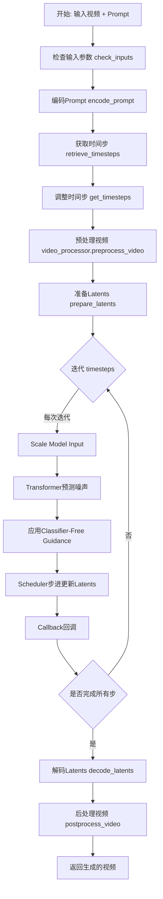
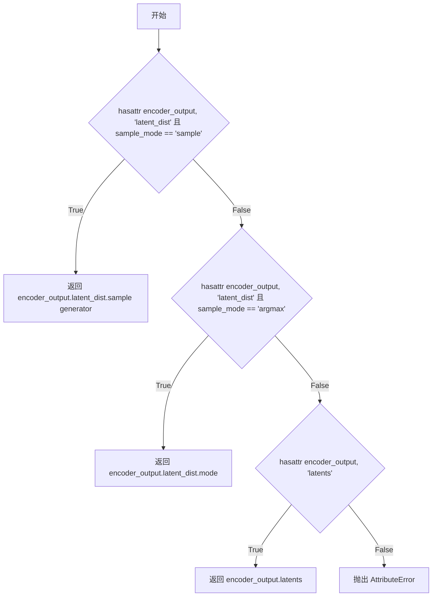
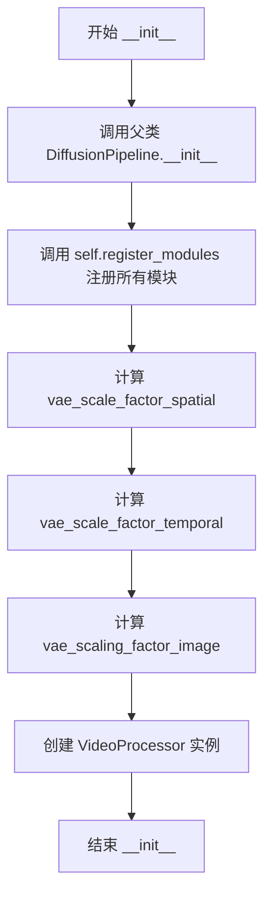
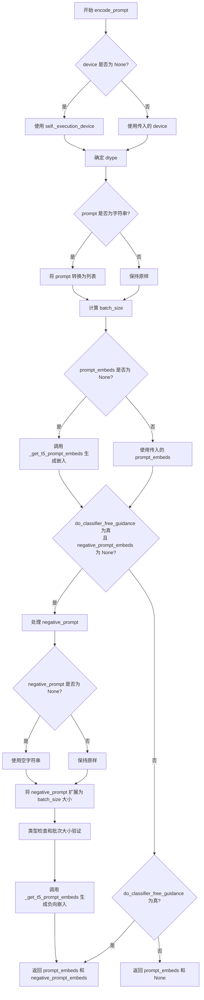
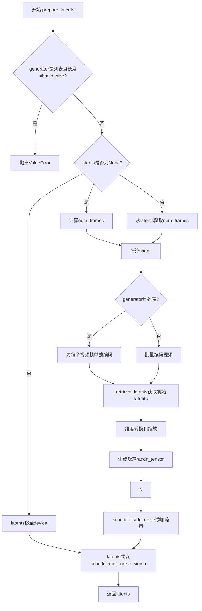
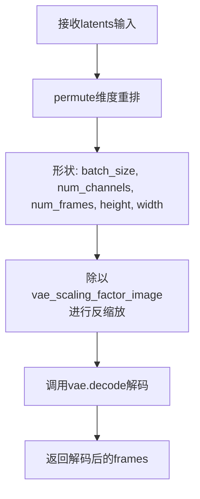
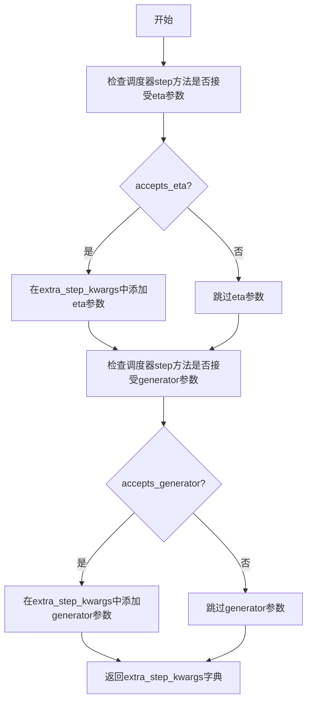
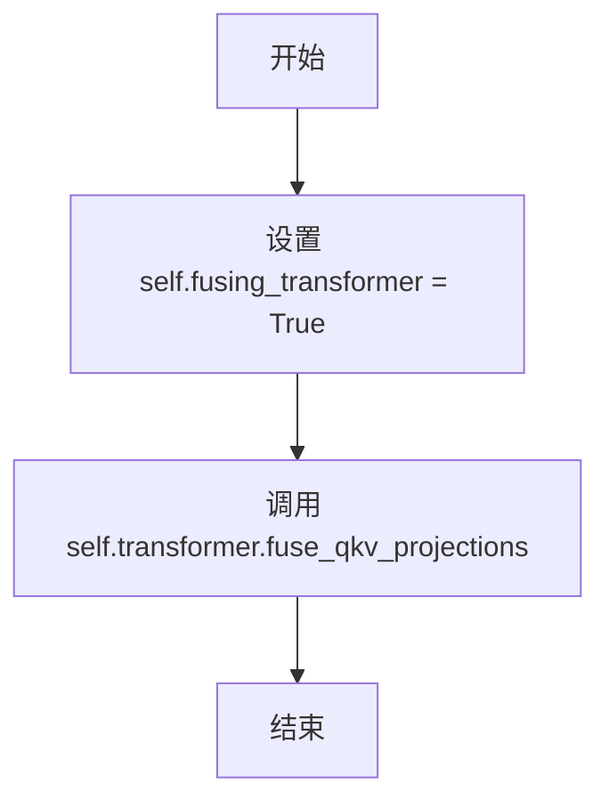
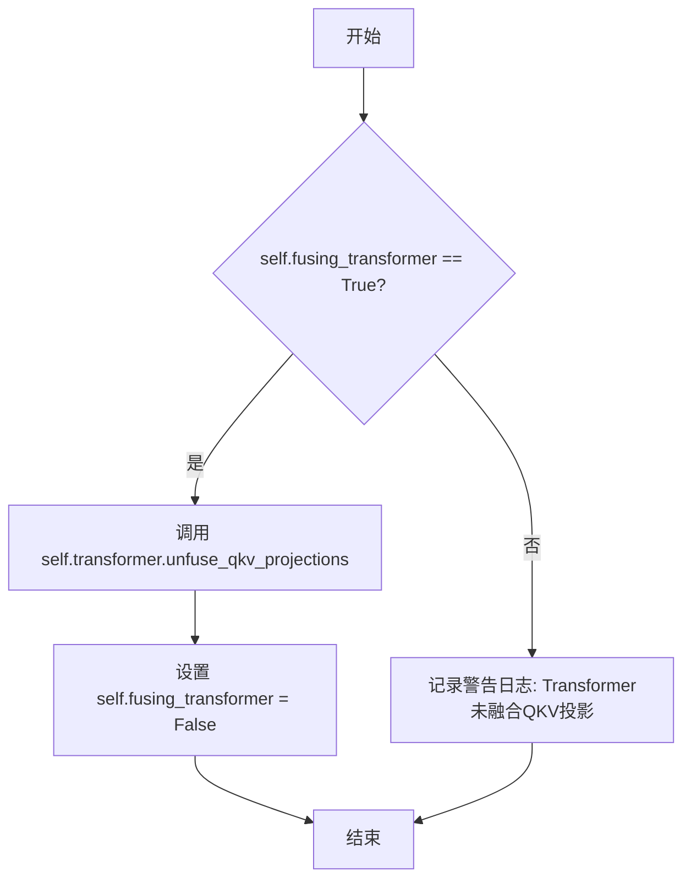
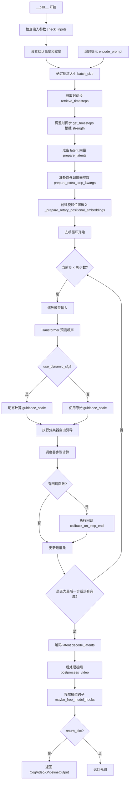

# `diffusers\src\diffusers\pipelines\cogvideo\pipeline_cogvideox_video2video.py` 详细设计文档

CogVideoXVideoToVideoPipeline是一个用于视频到视频（Video-to-Video）生成的扩散Pipeline，继承自DiffusionPipeline和CogVideoXLoraLoaderMixin。它接收输入视频和文本prompt，通过VAE编码视频到latent空间，使用T5编码器编码文本，利用Transformer进行去噪处理，并结合CogVideoXDDIMScheduler或CogVideoXDPMScheduler完成扩散过程，最终生成风格化或修改后的新视频。

## 整体流程



## 类结构

```
DiffusionPipeline (基类)
├── CogVideoXLoraLoaderMixin (Mixin类)
│   └── CogVideoXVideoToVideoPipeline
```

## 全局变量及字段


### `XLA_AVAILABLE`
    
标志位，指示是否可以使用 PyTorch XLA (Accelerated Linear Algebra) 进行加速计算

类型：`bool`
    


### `logger`
    
模块级日志记录器对象，用于输出管道运行时的日志信息

类型：`logging.Logger`
    


### `EXAMPLE_DOC_STRING`
    
包含 CogVideoX 视频到视频管道使用示例的文档字符串，展示如何加载模型和处理视频

类型：`str`
    


### `CogVideoXVideoToVideoPipeline._optional_components`
    
可选组件列表，定义管道中可选的模型组件

类型：`list`
    


### `CogVideoXVideoToVideoPipeline.model_cpu_offload_seq`
    
模型 CPU 卸载顺序的字符串定义，指定 text_encoder->transformer->vae 的卸载顺序

类型：`str`
    


### `CogVideoXVideoToVideoPipeline._callback_tensor_inputs`
    
回调函数中可用的张量输入名称列表，包含 latents、prompt_embeds、negative_prompt_embeds

类型：`list`
    


### `CogVideoXVideoToVideoPipeline.tokenizer`
    
T5 文本分词器，用于将文本提示转换为模型可处理的 token 序列

类型：`T5Tokenizer`
    


### `CogVideoXVideoToVideoPipeline.text_encoder`
    
冻结的 T5 文本编码器模型，用于将文本提示编码为嵌入向量

类型：`T5EncoderModel`
    


### `CogVideoXVideoToVideoPipeline.vae`
    
变分自编码器 (VAE) 模型，用于将视频编码到潜在空间并从潜在表示解码回视频

类型：`AutoencoderKLCogVideoX`
    


### `CogVideoXVideoToVideoPipeline.transformer`
    
CogVideoX 3D 变换器模型，作为去噪网络根据文本嵌入和噪声潜在表示生成视频

类型：`CogVideoXTransformer3DModel`
    


### `CogVideoXVideoToVideoPipeline.scheduler`
    
扩散调度器，用于控制去噪过程中的噪声调度策略，支持 DDIM 和 DPM 调度器

类型：`CogVideoXDDIMScheduler | CogVideoXDPMScheduler`
    


### `CogVideoXVideoToVideoPipeline.video_processor`
    
视频处理器，用于视频帧的预处理和后处理操作

类型：`VideoProcessor`
    


### `CogVideoXVideoToVideoPipeline.vae_scale_factor_spatial`
    
VAE 空间缩放因子，用于将潜在空间的坐标映射回像素空间

类型：`int`
    


### `CogVideoXVideoToVideoPipeline.vae_scale_factor_temporal`
    
VAE 时间缩放因子，用于在时间维度上进行潜在空间的压缩和解压缩

类型：`int`
    


### `CogVideoXVideoToVideoPipeline.vae_scaling_factor_image`
    
VAE 图像缩放因子，用于在编码和解码过程中缩放潜在表示

类型：`float`
    


### `CogVideoXVideoToVideoPipeline._guidance_scale`
    
无分类器引导比例参数，控制文本提示对生成结果的影响程度

类型：`float`
    


### `CogVideoXVideoToVideoPipeline._num_timesteps`
    
扩散过程中的推理步数，记录当前管道的去噪步数

类型：`int`
    


### `CogVideoXVideoToVideoPipeline._attention_kwargs`
    
注意力机制的额外关键字参数字典，用于传递给注意力处理器

类型：`dict | None`
    


### `CogVideoXVideoToVideoPipeline._current_timestep`
    
当前推理的时间步，用于跟踪去噪循环中的当前位置

类型：`int | None`
    


### `CogVideoXVideoToVideoPipeline._interrupt`
    
中断标志，用于在去噪循环中请求提前终止推理过程

类型：`bool`
    
    

## 全局函数及方法


### `get_resize_crop_region_for_grid`

该函数用于计算在将图像调整到目标尺寸时，保持宽高比进行缩放后的裁剪区域。它根据源图像和目标尺寸计算出缩放后的尺寸以及居中裁剪的坐标。

参数：

- `src`：tuple，源图像的尺寸，格式为 (height, width)
- `tgt_width`：int，目标宽度（目标图像的宽度）
- `tgt_height`：int，目标高度（目标图像的高度）

返回值：tuple，返回两个坐标点 ((crop_top, crop_left), (crop_top + resize_height, crop_left + resize_width))，分别表示裁剪区域的左上角和右下角坐标

#### 流程图

```mermaid
flowchart TD
    A[Start] --> B[提取源尺寸 h, w]
    B --> C[计算源宽高比 r = h / w]
    C --> D{判断 r > th / tw?}
    D -->|是| E[设置 resize_height = th]
    D -->|否| F[设置 resize_width = tw]
    E --> G[计算 resize_width = round<br/>th / h * w]
    F --> H[计算 resize_height = round<br/>tw / w * h]
    G --> I[计算裁剪顶部<br/>crop_top = round<br/>th - resize_height / 2]
    H --> I
    I --> J[计算裁剪左侧<br/>crop_left = round<br/>tw - resize_width / 2]
    J --> K[返回裁剪区域坐标<br/>左上: (crop_top, crop_left)<br/>右下: (crop_top+resize_height, crop_left+resize_width)]
```

#### 带注释源码

```python
# Similar to diffusers.pipelines.hunyuandit.pipeline_hunyuandit.get_resize_crop_region_for_grid
def get_resize_crop_region_for_grid(src, tgt_width, tgt_height):
    """
    计算图像缩放后的裁剪区域，使其在目标尺寸内居中显示
    
    参数:
        src: 源图像尺寸元组 (height, width)
        tgt_width: 目标宽度
        tgt_height: 目标高度
    
    返回:
        ((crop_top, crop_left), (crop_bottom, crop_right)): 裁剪区域坐标
    """
    tw = tgt_width  # 目标宽度
    th = tgt_height  # 目标高度
    h, w = src  # 解包源图像的高度和宽度
    
    r = h / w  # 计算源图像的宽高比
    
    # 根据宽高比决定缩放方向
    # 如果源图像比目标图像更"高"（宽高比大于目标宽高比）
    if r > (th / tw):
        resize_height = th  # 高度填满目标高度
        # 保持宽高比计算宽度: new_width = target_height * (original_width / original_height)
        resize_width = int(round(th / h * w))
    else:
        # 源图像比目标图像更"宽"或相同
        resize_width = tw  # 宽度填满目标宽度
        # 保持宽高比计算高度: new_height = target_width * (original_height / original_width)
        resize_height = int(round(tw / w * h))

    # 计算居中裁剪的顶部位置
    # 确保裁剪区域在目标框内垂直居中
    crop_top = int(round((th - resize_height) / 2.0))
    
    # 计算居中裁剪的左侧位置
    # 确保裁剪区域在目标框内水平居中
    crop_left = int(round((tw - resize_width) / 2.0))

    # 返回裁剪区域的坐标
    # 第一个元组是左上角坐标 (top, left)
    # 第二个元组是右下角坐标 (top + height, left + width)
    return (crop_top, crop_left), (crop_top + resize_height, crop_left + resize_width)
```


### `retrieve_timesteps`

该函数是扩散管道中的工具函数，负责调用调度器的 `set_timesteps` 方法并从中获取 timesteps。它支持自定义 timesteps 或 sigmas，也会验证调度器是否支持所请求的功能。

参数：

- `scheduler`：`SchedulerMixin`，要获取 timesteps 的调度器对象
- `num_inference_steps`：`int | None`，生成样本时使用的扩散步数，如果使用此参数则 `timesteps` 必须为 `None`
- `device`：`str | torch.device | None`，timesteps 要移动到的设备，如果为 `None` 则不移动
- `timesteps`：`list[int] | None`，自定义 timesteps，用于覆盖调度器的时间步间隔策略，如果传入则 `num_inference_steps` 和 `sigmas` 必须为 `None`
- `sigmas`：`list[float] | None`，自定义 sigmas，用于覆盖调度器的时间步间隔策略，如果传入则 `num_inference_steps` 和 `timesteps` 必须为 `None`
- `**kwargs`：任意关键字参数，将传递给调度器的 `set_timesteps` 方法

返回值：`tuple[torch.Tensor, int]`，元组包含调度器的时间步 schedule 和推理步数

#### 流程图

```mermaid
flowchart TD
    A[开始] --> B{检查timesteps和sigmas是否同时存在}
    B -->|是| C[抛出ValueError: 只能选择一个]
    B -->|否| D{检查timesteps是否不为None}
    D -->|是| E[检查scheduler.set_timesteps是否接受timesteps参数]
    E -->|否| F[抛出ValueError: 当前调度器不支持自定义timesteps]
    E -->|是| G[调用scheduler.set_timesteps<br/>参数: timesteps=timesteps, device=device, **kwargs]
    G --> H[获取scheduler.timesteps]
    H --> I[计算num_inference_steps = len(timesteps)]
    I --> J[返回timesteps, num_inference_steps]
    
    D -->|否| K{检查sigmas是否不为None}
    K -->|是| L[检查scheduler.set_timesteps是否接受sigmas参数]
    L -->|否| M[抛出ValueError: 当前调度器不支持自定义sigmas]
    L -->|是| N[调用scheduler.set_timesteps<br/>参数: sigmas=sigmas, device=device, **kwargs]
    N --> O[获取scheduler.timesteps]
    O --> P[计算num_inference_steps = len(timesteps)]
    P --> J
    
    K -->|否| Q[调用scheduler.set_timesteps<br/>参数: num_inference_steps, device=device, **kwargs]
    Q --> R[获取scheduler.timesteps]
    R --> J
    
    J --> S[结束]
```

#### 带注释源码

```python
# 从 diffusers.pipelines.stable_diffusion.pipeline_stable_diffusion 复制
def retrieve_timesteps(
    scheduler,  # SchedulerMixin: 调度器对象，用于生成时间步
    num_inference_steps: int | None = None,  # int | None: 扩散推理步数
    device: str | torch.device | None = None,  # str | torch.device | None: 时间步要移动到的设备
    timesteps: list[int] | None = None,  # list[int] | None: 自定义时间步列表
    sigmas: list[float] | None = None,  # list[float] | None: 自定义sigma列表
    **kwargs,  # 任意关键字参数，传递给调度器的set_timesteps方法
):
    r"""
    调用调度器的 `set_timesteps` 方法并在调用后从中检索时间步。支持自定义时间步。
    任何 kwargs 将被传递给 `scheduler.set_timesteps`。

    参数:
        scheduler (`SchedulerMixin`):
            要从中获取时间步的调度器。
        num_inference_steps (`int`):
            使用预训练模型生成样本时使用的扩散步数。如果使用此参数，`timesteps` 必须为 `None`。
        device (`str` 或 `torch.device`, *可选*):
            时间步应移动到的设备。如果为 `None`，时间步不会移动。
        timesteps (`list[int]`, *可选*):
            用于覆盖调度器时间步间隔策略的自定义时间步。如果传入 `timesteps`，
            `num_inference_steps` 和 `sigmas` 必须为 `None`。
        sigmas (`list[float]`, *可选*):
            用于覆盖调度器时间步间隔策略的自定义sigmas。如果传入 `sigmas`，
            `num_inference_steps` 和 `timesteps` 必须为 `None`。

    返回:
        `tuple[torch.Tensor, int]`: 元组，其中第一个元素是调度器的时间步schedule，
        第二个元素是推理步数。
    """
    # 验证：timesteps 和 sigmas 不能同时指定
    if timesteps is not None and sigmas is not None:
        raise ValueError("Only one of `timesteps` or `sigmas` can be passed. Please choose one to set custom values")
    
    # 处理自定义 timesteps 的情况
    if timesteps is not None:
        # 检查调度器是否支持 timesteps 参数
        accepts_timesteps = "timesteps" in set(inspect.signature(scheduler.set_timesteps).parameters.keys())
        if not accepts_timesteps:
            raise ValueError(
                f"The current scheduler class {scheduler.__class__}'s `set_timesteps` does not support custom"
                f" timestep schedules. Please check whether you are using the correct scheduler."
            )
        # 调用调度器的 set_timesteps 方法
        scheduler.set_timesteps(timesteps=timesteps, device=device, **kwargs)
        # 获取调度器的时间步
        timesteps = scheduler.timesteps
        # 计算推理步数
        num_inference_steps = len(timesteps)
    # 处理自定义 sigmas 的情况
    elif sigmas is not None:
        # 检查调度器是否支持 sigmas 参数
        accept_sigmas = "sigmas" in set(inspect.signature(scheduler.set_timesteps).parameters.keys())
        if not accept_sigmas:
            raise ValueError(
                f"The current scheduler class {scheduler.__class__}'s `set_timesteps` does not support custom"
                f" sigmas schedules. Please check whether you are using the correct scheduler."
            )
        # 调用调度器的 set_timesteps 方法
        scheduler.set_timesteps(sigmas=sigmas, device=device, **kwargs)
        # 获取调度器的时间步
        timesteps = scheduler.timesteps
        # 计算推理步数
        num_inference_steps = len(timesteps)
    # 使用默认的 num_inference_steps
    else:
        scheduler.set_timesteps(num_inference_steps, device=device, **kwargs)
        timesteps = scheduler.timesteps
    
    # 返回时间步和推理步数
    return timesteps, num_inference_steps
```


### retrieve_latents

从编码器输出中检索潜在变量（latents），支持从潜在分布中采样或取模式值，也可以直接获取预计算的潜在变量。

参数：

- `encoder_output`：`torch.Tensor`，编码器输出对象，包含 `latent_dist` 属性或 `latents` 属性
- `generator`：`torch.Generator | None`，可选的随机数生成器，用于采样时的随机性控制
- `sample_mode`：`str`，采样模式，默认为 `"sample"`，可选值为 `"sample"`（从分布采样）或 `"argmax"`（取分布模式值）

返回值：`torch.Tensor`，检索到的潜在变量张量

#### 流程图



#### 带注释源码

```
# 从编码器输出中检索潜在变量的函数
# 位于: diffusers.pipelines.cogvideo.pipeline_cogvideo_video_to_video.retrieve_latents
def retrieve_latents(
    encoder_output: torch.Tensor, 
    generator: torch.Generator | None = None, 
    sample_mode: str = "sample"
):
    # 情况1: 如果 encoder_output 有 latent_dist 属性且采样模式为 "sample"
    # 则从潜在分布中进行随机采样
    if hasattr(encoder_output, "latent_dist") and sample_mode == "sample":
        return encoder_output.latent_dist.sample(generator)
    
    # 情况2: 如果 encoder_output 有 latent_dist 属性且采样模式为 "argmax"
    # 则取潜在分布的模式值（均值或最可能值）
    elif hasattr(encoder_output, "latent_dist") and sample_mode == "argmax":
        return encoder_output.latent_dist.mode()
    
    # 情况3: 如果 encoder_output 直接有 latents 属性
    # 则直接返回预计算的潜在变量
    elif hasattr(encoder_output, "latents"):
        return encoder_output.latents
    
    # 错误情况: 无法从 encoder_output 中获取潜在变量
    else:
        raise AttributeError("Could not access latents of provided encoder_output")
```


### `CogVideoXVideoToVideoPipeline.__init__`

这是 CogVideoXVideoToVideoPipeline 类的构造函数，负责初始化视频到视频（Video-to-Video）生成管道。它接收分词器、文本编码器、VAE、变压器模型和调度器等核心组件，并注册这些模块，同时计算 VAE 的缩放因子和初始化视频处理器。

参数：

- `tokenizer`：`T5Tokenizer`，用于将文本提示转换为令牌序列
- `text_encoder`：`T5EncoderModel`，冻结的文本编码器，用于生成文本嵌入
- `vae`：`AutoencoderKLCogVideoX`，变分自编码器，用于将视频编码和解码到潜在表示
- `transformer`：`CogVideoXTransformer3DModel`，文本条件的 3D 变压器模型，用于对编码的视频潜在表示进行去噪
- `scheduler`：`CogVideoXDDIMScheduler | CogVideoXDPMScheduler`，与变压器结合使用以对编码视频潜在表示进行去噪的调度器

返回值：无（`None`），构造函数不返回值，仅初始化对象状态

#### 流程图



#### 带注释源码

```python
def __init__(
    self,
    tokenizer: T5Tokenizer,
    text_encoder: T5EncoderModel,
    vae: AutoencoderKLCogVideoX,
    transformer: CogVideoXTransformer3DModel,
    scheduler: CogVideoXDDIMScheduler | CogVideoXDPMScheduler,
):
    # 调用父类 DiffusionPipeline 的初始化方法
    # 设置管道的基本框架和配置
    super().__init__()

    # 使用 register_modules 方法注册所有核心组件
    # 这使得管道能够跟踪和管理这些模块
    self.register_modules(
        tokenizer=tokenizer, 
        text_encoder=text_encoder, 
        vae=vae, 
        transformer=transformer, 
        scheduler=scheduler
    )

    # 计算 VAE 空间缩放因子
    # 基于 VAE 块输出通道数的深度计算，用于空间维度的缩放
    # 如果 VAE 不存在，默认值为 8
    self.vae_scale_factor_spatial = (
        2 ** (len(self.vae.config.block_out_channels) - 1) if getattr(self, "vae", None) else 8
    )
    
    # 计算 VAE 时间缩放因子
    # 基于 VAE 的时间压缩比，用于时间维度的缩放
    # 如果 VAE 不存在，默认值为 4
    self.vae_scale_factor_temporal = (
        self.vae.config.temporal_compression_ratio if getattr(self, "vae", None) else 4
    )
    
    # 计算 VAE 图像缩放因子
    # 用于对潜在表示进行缩放的系数
    # 如果 VAE 不存在，默认值为 0.7
    self.vae_scaling_factor_image = self.vae.config.scaling_factor if getattr(self, "vae", None) else 0.7

    # 创建视频处理器实例
    # 用于预处理输入视频和后处理输出视频
    # 使用空间缩放因子进行初始化
    self.video_processor = VideoProcessor(vae_scale_factor=self.vae_scale_factor_spatial)
```


### `CogVideoXVideoToVideoPipeline._get_t5_prompt_embeds`

该方法负责将文本提示（prompt）编码为T5文本编码器的嵌入向量（prompt embeddings），支持单个字符串或字符串列表输入，并可生成多个视频所需的重复嵌入。

参数：

- `self`：类的实例方法隐含参数
- `prompt`：`str | list[str]`，需要编码的文本提示，可以是单个字符串或字符串列表
- `num_videos_per_prompt`：`int`，每个提示要生成的视频数量，默认为1，用于复制embeddings
- `max_sequence_length`：`int`，最大序列长度，默认为226，控制tokenization的最大长度
- `device`：`torch.device | None`，指定计算设备，默认为None则使用执行设备
- `dtype`：`torch.dtype | None`，指定数据类型，默认为None则使用text_encoder的数据类型

返回值：`torch.Tensor`，编码后的文本嵌入向量，形状为 `(batch_size * num_videos_per_prompt, seq_len, hidden_dim)`

#### 流程图

```mermaid
flowchart TD
    A[开始 _get_t5_prompt_embeds] --> B{device 是否为 None?}
    B -- 是 --> C[device = self._execution_device]
    B -- 否 --> D{dtype 是否为 None?}
    D -- 是 --> E[dtype = self.text_encoder.dtype]
    D -- 否 --> F[处理输入]
    C --> F
    E --> F
    F --> G{prompt 是否为字符串?}
    G -- 是 --> H[prompt = [prompt]]
    G -- 否 --> I[计算 batch_size]
    H --> I
    I --> J[调用 tokenizer 进行编码]
    J --> K[获取截断警告信息]
    K --> L[text_encoder 生成 prompt_embeds]
    L --> M[转换 dtype 和 device]
    M --> N[复制 embeddings 维度]
    N --> O[调整形状]
    O --> P[返回 prompt_embeds]
```

#### 带注释源码

```python
def _get_t5_prompt_embeds(
    self,
    prompt: str | list[str] = None,
    num_videos_per_prompt: int = 1,
    max_sequence_length: int = 226,
    device: torch.device | None = None,
    dtype: torch.dtype | None = None,
):
    """
    将文本提示编码为T5文本编码器的嵌入向量
    
    参数:
        prompt: 要编码的文本提示，字符串或字符串列表
        num_videos_per_prompt: 每个提示生成的视频数量
        max_sequence_length: 最大序列长度
        device: 计算设备
        dtype: 数据类型
    
    返回:
        编码后的文本嵌入向量
    """
    # 确定设备：若未指定则使用执行设备
    device = device or self._execution_device
    # 确定数据类型：若未指定则使用text_encoder的数据类型
    dtype = dtype or self.text_encoder.dtype

    # 标准化输入：将字符串转换为列表，统一处理方式
    prompt = [prompt] if isinstance(prompt, str) else prompt
    # 计算批次大小
    batch_size = len(prompt)

    # 使用T5 tokenizer对prompt进行tokenize处理
    # padding="max_length": 填充到最大长度
    # max_length=max_sequence_length: 限制最大序列长度
    # truncation=True: 超过长度的部分进行截断
    # add_special_tokens=True: 添加特殊Tokens如<s>、</s>等
    # return_tensors="pt": 返回PyTorch张量
    text_inputs = self.tokenizer(
        prompt,
        padding="max_length",
        max_length=max_sequence_length,
        truncation=True,
        add_special_tokens=True,
        return_tensors="pt",
    )
    # 获取tokenize后的输入IDs
    text_input_ids = text_inputs.input_ids
    # 使用最长填充方式获取未截断的IDs，用于检测是否发生了截断
    untruncated_ids = self.tokenizer(prompt, padding="longest", return_tensors="pt").input_ids

    # 检测截断：如果未截断的序列长度大于截断后的长度，且两者不相等，则输出警告
    if untruncated_ids.shape[-1] >= text_input_ids.shape[-1] and not torch.equal(text_input_ids, untruncated_ids):
        # 解码被截断的部分用于日志输出
        removed_text = self.tokenizer.batch_decode(untruncated_ids[:, max_sequence_length - 1 : -1])
        logger.warning(
            "The following part of your input was truncated because `max_sequence_length` is set to "
            f" {max_sequence_length} tokens: {removed_text}"
        )

    # 将token IDs传入T5文本编码器，获取隐藏状态输出
    # [0]表示获取第一个输出元素（hidden_states）
    prompt_embeds = self.text_encoder(text_input_ids.to(device))[0]
    # 将嵌入转换到指定的设备和数据类型
    prompt_embeds = prompt_embeds.to(dtype=dtype, device=device)

    # 复制文本嵌入以匹配生成的视频数量
    # 这是一种MPS友好的方法，避免使用复杂的索引操作
    _, seq_len, _ = prompt_embeds.shape
    # 在第1维度（视频维度）重复num_videos_per_prompt次
    prompt_embeds = prompt_embeds.repeat(1, num_videos_per_prompt, 1)
    # 调整形状为 (batch_size * num_videos_per_prompt, seq_len, hidden_dim)
    prompt_embeds = prompt_embeds.view(batch_size * num_videos_per_prompt, seq_len, -1)

    return prompt_embeds
```


### `CogVideoXVideoToVideoPipeline.encode_prompt`

该方法将文本提示（prompt）和负向提示（negative_prompt）编码为文本编码器的隐藏状态向量（embeddings）。如果启用了无分类器自由引导（classifier-free guidance），它会同时生成正向和负向的提示嵌入，以便在后续的去噪过程中引导生成更符合提示内容的视频。

参数：

- `self`：CogVideoXVideoToVideoPipeline 实例本身
- `prompt`：`str | list[str]`，要编码的文本提示，可以是单个字符串或字符串列表
- `negative_prompt`：`str | list[str] | None`，可选的负向提示，用于引导模型避免生成某些内容，如果不指定且启用了引导，则使用空字符串
- `do_classifier_free_guidance`：`bool`，是否启用无分类器自由引导，默认为 True
- `num_videos_per_prompt`：`int`，每个提示要生成的视频数量，默认为 1
- `prompt_embeds`：`torch.Tensor | None`，预生成的文本嵌入，可用于轻松调整文本输入（如提示加权），如果未提供，则从 `prompt` 参数生成
- `negative_prompt_embeds`：`torch.Tensor | None`，预生成的负向文本嵌入，如果未提供，则从 `negative_prompt` 参数生成
- `max_sequence_length`：`int`，编码提示的最大序列长度，默认为 226
- `device`：`torch.device | None`，要将结果嵌入放置到的 torch 设备，如果为 None，则使用执行设备
- `dtype`：`torch.dtype | None`，torch 数据类型

返回值：`tuple[torch.Tensor, torch.Tensor]`，返回两个张量——第一个是编码后的提示嵌入（prompt_embeds），第二个是编码后的负向提示嵌入（negative_prompt_embeds）。如果未启用引导或未提供负向提示，negative_prompt_embeds 可能为 None。

#### 流程图



#### 带注释源码

```python
def encode_prompt(
    self,
    prompt: str | list[str],
    negative_prompt: str | list[str] | None = None,
    do_classifier_free_guidance: bool = True,
    num_videos_per_prompt: int = 1,
    prompt_embeds: torch.Tensor | None = None,
    negative_prompt_embeds: torch.Tensor | None = None,
    max_sequence_length: int = 226,
    device: torch.device | None = None,
    dtype: torch.dtype | None = None,
):
    r"""
    Encodes the prompt into text encoder hidden states.

    Args:
        prompt (`str` or `list[str]`, *optional*):
            prompt to be encoded
        negative_prompt (`str` or `list[str]`, *optional*):
            The prompt or prompts not to guide the image generation. If not defined, one has to pass
            `negative_prompt_embeds` instead. Ignored when not using guidance (i.e., ignored if `guidance_scale` is
            less than `1`).
        do_classifier_free_guidance (`bool`, *optional*, defaults to `True`):
            Whether to use classifier free guidance or not.
        num_videos_per_prompt (`int`, *optional*, defaults to 1):
            Number of videos that should be generated per prompt. torch device to place the resulting embeddings on
        prompt_embeds (`torch.Tensor`, *optional*):
            Pre-generated text embeddings. Can be used to easily tweak text inputs, *e.g.* prompt weighting. If not
            provided, text embeddings will be generated from `prompt` input argument.
        negative_prompt_embeds (`torch.Tensor`, *optional*):
            Pre-generated negative text embeddings. Can be used to easily tweak text inputs, *e.g.* prompt
            weighting. If not provided, negative_prompt_embeds will be generated from `negative_prompt` input
            argument.
        device: (`torch.device`, *optional*):
            torch device
        dtype: (`torch.dtype`, *optional*):
            torch dtype
    """
    # 确定设备：如果未提供，则使用管道的执行设备
    device = device or self._execution_device

    # 将 prompt 标准化为列表格式
    prompt = [prompt] if isinstance(prompt, str) else prompt
    
    # 计算批次大小：根据是否有 prompt 或 prompt_embeds
    if prompt is not None:
        batch_size = len(prompt)
    else:
        batch_size = prompt_embeds.shape[0]

    # 如果未提供 prompt_embeds，则从 prompt 生成
    if prompt_embeds is None:
        prompt_embeds = self._get_t5_prompt_embeds(
            prompt=prompt,
            num_videos_per_prompt=num_videos_per_prompt,
            max_sequence_length=max_sequence_length,
            device=device,
            dtype=dtype,
        )

    # 如果启用无分类器自由引导且未提供负向嵌入，则生成负向嵌入
    if do_classifier_free_guidance and negative_prompt_embeds is None:
        # 如果未提供负向提示，则使用空字符串
        negative_prompt = negative_prompt or ""
        # 将负向提示扩展为与批次大小匹配
        negative_prompt = batch_size * [negative_prompt] if isinstance(negative_prompt, str) else negative_prompt

        # 类型检查：确保 prompt 和 negative_prompt 类型一致
        if prompt is not None and type(prompt) is not type(negative_prompt):
            raise TypeError(
                f"`negative_prompt` should be the same type to `prompt`, but got {type(negative_prompt)} !="
                f" {type(prompt)}."
            )
        # 批次大小检查：确保负向提示与正向提示的批次大小一致
        elif batch_size != len(negative_prompt):
            raise ValueError(
                f"`negative_prompt`: {negative_prompt} has batch size {len(negative_prompt)}, but `prompt`:"
                f" {prompt} has batch size {batch_size}. Please make sure that passed `negative_prompt` matches"
                " the batch size of `prompt`."
            )

        # 生成负向提示嵌入
        negative_prompt_embeds = self._get_t5_prompt_embeds(
            prompt=negative_prompt,
            num_videos_per_prompt=num_videos_per_prompt,
            max_sequence_length=max_sequence_length,
            device=device,
            dtype=dtype,
        )

    return prompt_embeds, negative_prompt_embeds
```


### `CogVideoXVideoToVideoPipeline.prepare_latents`

该方法是CogVideoX视频到视频管道的潜在向量准备函数，负责将输入视频编码为潜在表示，并根据时间步添加噪声以支持视频扩散模型的推理过程。

参数：

- `self`：`CogVideoXVideoToVideoPipeline`实例，管道对象本身
- `video`：`torch.Tensor | None`，输入视频张量，形状为[batch, channels, frames, height, width]
- `batch_size`：`int = 1`，批处理大小
- `num_channels_latents`：`int = 16`，潜在空间的通道数
- `height`：`int = 60`，视频高度（像素）
- `width`：`int = 90`，视频宽度（像素）
- `dtype`：`torch.dtype | None`，目标数据类型
- `device`：`torch.device | None`，目标设备
- `generator`：`torch.Generator | None`，随机数生成器，用于确定性生成
- `latents`：`torch.Tensor | None`，预生成的潜在向量，若为None则从视频编码生成
- `timestep`：`torch.Tensor | None`，时间步，用于添加噪声

返回值：`torch.Tensor`，处理后的潜在向量，形状为[batch, frames, channels, height/vae_scale_factor, width/vae_scale_factor]

#### 流程图



#### 带注释源码

```python
def prepare_latents(
    self,
    video: torch.Tensor | None = None,
    batch_size: int = 1,
    num_channels_latents: int = 16,
    height: int = 60,
    width: int = 90,
    dtype: torch.dtype | None = None,
    device: torch.device | None = None,
    generator: torch.Generator | None = None,
    latents: torch.Tensor | None = None,
    timestep: torch.Tensor | None = None,
):
    # 检查generator列表长度是否与batch_size匹配
    if isinstance(generator, list) and len(generator) != batch_size:
        raise ValueError(
            f"You have passed a list of generators of length {len(generator)}, but requested an effective batch"
            f" size of {batch_size}. Make sure the batch size matches the length of the generators."
        )

    # 计算视频帧数：如果latents为None则从video计算，否则从latents获取
    num_frames = (video.size(2) - 1) // self.vae_scale_factor_temporal + 1 if latents is None else latents.size(1)

    # 确定潜在向量的shape：[batch, frames, channels, height/空间缩放因子, width/空间缩放因子]
    shape = (
        batch_size,
        num_frames,
        num_channels_latents,
        height // self.vae_scale_factor_spatial,
        width // self.vae_scale_factor_spatial,
    )

    if latents is None:
        # 需要从视频编码生成潜在向量
        if isinstance(generator, list):
            # 多个generator时，为每个样本单独编码
            init_latents = [
                retrieve_latents(self.vae.encode(video[i].unsqueeze(0)), generator[i]) for i in range(batch_size)
            ]
        else:
            # 单一generator时，批量编码
            init_latents = [retrieve_latents(self.vae.encode(vid.unsqueeze(0)), generator) for vid in video]

        # 合并并调整维度顺序：[B, F, C, H, W]，然后应用VAE缩放因子
        init_latents = torch.cat(init_latents, dim=0).to(dtype).permute(0, 2, 1, 3, 4)  # [B, F, C, H, W]
        init_latents = self.vae_scaling_factor_image * init_latents

        # 生成随机噪声并通过scheduler添加噪声到初始潜在向量
        noise = randn_tensor(shape, generator=generator, device=device, dtype=dtype)
        latents = self.scheduler.add_noise(init_latents, noise, timestep)
    else:
        # 直接使用提供的latents，只需移至目标设备
        latents = latents.to(device)

    # 根据scheduler要求的初始噪声标准差进行缩放
    latents = latents * self.scheduler.init_noise_sigma
    return latents
```


### `CogVideoXVideoToVideoPipeline.decode_latents`

该方法负责将CogVideoX模型生成的潜在表示（latents）解码为实际的视频帧。它首先对latents的维度进行重新排列以适应VAE的输入格式，然后通过除以VAE的图像缩放因子进行反标准化，最后利用VAE解码器将潜在表示转换为可视化的视频帧。

参数：

- `self`：CogVideoXVideoToVideoPipeline实例本身，包含VAE模型和缩放因子配置
- `latents`：`torch.Tensor`，输入的潜在表示张量，形状为 [batch_size, num_frames, num_channels, height, width]

返回值：`torch.Tensor`，解码后的视频帧张量，形状为 [batch_size, channels, num_frames, height, width]

#### 流程图



#### 带注释源码

```python
def decode_latents(self, latents: torch.Tensor) -> torch.Tensor:
    """
    解码潜在表示为视频帧
    
    参数:
        latents: 输入的潜在表示张量，形状为 [batch_size, num_frames, num_channels, height, width]
    
    返回:
        解码后的视频帧张量
    """
    # 对latents进行维度重排
    # 从 [batch_size, num_frames, num_channels, height, width]
    # 转换为 [batch_size, num_channels, num_frames, height, width]
    # 以适配VAE的4D图像解码器（通常期望 [B, C, H, W] 格式）
    latents = latents.permute(0, 2, 1, 3, 4)
    
    # 反缩放latents
    # VAE在编码时会乘以scaling_factor来归一latents，解码时需要除以该因子还原
    latents = 1 / self.vae_scaling_factor_image * latents

    # 使用VAE解码器将latents解码为视频帧
    # vae.decode接受latents并返回包含sample属性的EncoderDecoderOutput
    frames = self.vae.decode(latents).sample
    
    # 返回解码后的视频帧
    return frames
```


### `CogVideoXVideoToVideoPipeline.get_timesteps`

该方法用于在视频到视频（Video-to-Video）推理过程中根据强度（strength）参数调整去噪时间步。它通过计算实际需要执行的推理步数，并从原始时间步序列中截取对应的子序列，从而实现对原视频的保留程度控制——strength 越低，保留原视频内容越多，生成的视频变化越小。

参数：

- `self`：`CogVideoXVideoToVideoPipeline` 实例本身
- `num_inference_steps`：`int`，推理过程中的总去噪步数
- `timesteps`：`torch.Tensor`，调度器生成的完整时间步序列（通常为从大到小的递减序列）
- `strength`：`float`，强度参数，取值范围 [0, 1]，用于控制原视频与生成视频之间的差异程度
- `device`：`torch.device`，计算设备

返回值：`tuple[torch.Tensor, int]`，第一个元素为调整后的时间步子序列（torch.Tensor），第二个元素为实际需要执行的推理步数（int）

#### 流程图

```mermaid
flowchart TD
    A[开始 get_timesteps] --> B[计算 init_timestep = min(num_inference_steps * strength, num_inference_steps)]
    B --> C[计算 t_start = max(num_inference_steps - init_timestep, 0)]
    C --> D[截取时间步: timesteps[t_start * scheduler.order :]]
    E[返回调整后的 timesteps 和 num_inference_steps - t_start]
    D --> E
```

#### 带注释源码

```python
def get_timesteps(self, num_inference_steps, timesteps, strength, device):
    # 根据强度参数计算初始时间步数
    # strength 越低，init_timestep 越小，意味着保留更多原视频信息
    # 例如：num_inference_steps=50, strength=0.8 时，init_timestep = min(40, 50) = 40
    init_timestep = min(int(num_inference_steps * strength), num_inference_steps)

    # 计算起始索引，确定从时间步序列的哪个位置开始
    # t_start 表示跳过前 t_start 个时间步（即保留了原视频的部分）
    # 例如：num_inference_steps=50, init_timestep=40 时，t_start = 10
    t_start = max(num_inference_steps - init_timestep, 0)

    # 根据调度器的阶数（order）截取时间步序列
    # scheduler.order 通常为 1（对于 DDIM）或更高（对于 DPM-Solver 等）
    # 乘以 order 是为了保证与调度器的多步采样策略对齐
    timesteps = timesteps[t_start * self.scheduler.order :]

    # 返回调整后的时间步和实际需要执行的推理步数
    # 剩余步数 = 总步数 - 跳过的步数
    return timesteps, num_inference_steps - t_start
```


### `CogVideoXVideoToVideoPipeline.prepare_extra_step_kwargs`

该方法用于准备调度器（scheduler）的额外参数。由于不同调度器具有不同的签名，该方法通过检查调度器的 `step` 方法是否接受 `eta` 和 `generator` 参数来动态构建额外参数字典，确保与各种调度器兼容。

参数：

- `self`：隐式参数，指向 `CogVideoXVideoToVideoPipeline` 类的实例。
- `generator`：`torch.Generator | list[torch.Generator] | None`，用于控制随机数生成的可选生成器，以确保推理过程的可重复性。
- `eta`：`float`，DDIM 调度器使用的噪声尺度参数（η），取值范围为 [0, 1]。对于其他调度器，此参数将被忽略。

返回值：`dict`，包含调度器 `step` 方法所需额外参数的字典，可能包含 `eta` 和/或 `generator` 键。

#### 流程图



#### 带注释源码

```python
def prepare_extra_step_kwargs(self, generator, eta):
    # 准备调度器步骤的额外参数，因为并非所有调度器都具有相同的签名
    # eta (η) 仅在 DDIMScheduler 中使用，对于其他调度器将被忽略。
    # eta 对应于 DDIM 论文 (https://huggingface.co/papers/2010.02502) 中的 η
    # 取值应在 [0, 1] 之间

    # 使用 inspect 模块检查调度器的 step 方法是否接受 eta 参数
    accepts_eta = "eta" in set(inspect.signature(self.scheduler.step).parameters.keys())
    
    # 初始化空字典用于存储额外参数
    extra_step_kwargs = {}
    
    # 如果调度器接受 eta 参数，则将其添加到 extra_step_kwargs 中
    if accepts_eta:
        extra_step_kwargs["eta"] = eta

    # 检查调度器是否接受 generator 参数
    accepts_generator = "generator" in set(inspect.signature(self.scheduler.step).parameters.keys())
    
    # 如果调度器接受 generator 参数，则将其添加到 extra_step_kwargs 中
    if accepts_generator:
        extra_step_kwargs["generator"] = generator
    
    # 返回构建好的额外参数字典
    return extra_step_kwargs
```


### `CogVideoXVideoToVideoPipeline.check_inputs`

该方法用于验证视频到视频生成管道的输入参数有效性，包括检查高度/宽度的对齐、强度值范围、回调张量输入、提示词与嵌入的一致性以及视频与潜在变量的互斥性，确保所有输入参数符合管道要求。

参数：

- `prompt`：`str | list[str] | None`，用户提供的文本提示词，用于指导视频生成
- `height`：`int`，生成视频的高度（像素），必须能被8整除
- `width`：`int`，生成视频的宽度（像素），必须能被8整除
- `strength`：`float`，控制生成视频与原视频差异程度的强度值，范围[0.0, 1.0]
- `negative_prompt`：`str | list[str] | None`，用于指导生成的反向提示词
- `callback_on_step_end_tensor_inputs`：`list[str] | None`，每步结束后回调函数需要接收的张量输入列表
- `video`：`list[Image.Image] | torch.Tensor | None`，输入视频帧列表，用于作为生成的条件
- `latents`：`torch.Tensor | None`，预生成的潜在变量，与video互斥
- `prompt_embeds`：`torch.Tensor | None`，预生成的提示词嵌入，与prompt互斥
- `negative_prompt_embeds`：`torch.Tensor | None`，预生成的反向提示词嵌入

返回值：`None`，该方法不返回任何值，仅通过抛出异常来处理验证失败的情况

#### 流程图

```mermaid
flowchart TD
    A[开始 check_inputs] --> B{height % 8 == 0<br/>width % 8 == 0?}
    B -->|否| C[抛出ValueError:<br/>height和width必须能被8整除]
    B -->|是| D{strength在[0, 1]范围内?}
    D -->|否| E[抛出ValueError:<br/>strength必须在0.0到1.0之间]
    D -->|是| F{callback_on_step_end_tensor_inputs<br/>是否在允许列表中?}
    F -->|否| G[抛出ValueError:<br/>回调张量输入无效]
    F -->|是| H{prompt和prompt_embeds<br/>同时提供?}
    H -->|是| I[抛出ValueError:<br/>不能同时提供prompt和prompt_embeds]
    H -->|否| J{prompt和prompt_embeds<br/>都未提供?}
    J -->|是| K[抛出ValueError:<br/>必须提供prompt或prompt_embeds之一]
    J -->|否| L{prompt类型是否<br/>str或list?}
    L -->|否| M[抛出ValueError:<br/>prompt类型无效]
    L -->|是| N{prompt和<br/>negative_prompt_embeds<br/>同时提供?}
    N -->|是| O[抛出ValueError:<br/>不能同时提供]
    N -->|否| P{negative_prompt和<br/>negative_prompt_embeds<br/>同时提供?}
    P -->|是| Q[抛出ValueError:<br/>不能同时提供]
    P -->|否| R{prompt_embeds和<br/>negative_prompt_embeds<br/>形状是否一致?}
    R -->|否| S[抛出ValueError:<br/>嵌入形状不匹配]
    R -->|是| T{video和latents<br/>同时提供?}
    T -->|是| U[抛出ValueError:<br/>不能同时提供video和latents]
    T -->|是| V[验证通过]
    
    C --> W[结束]
    E --> W
    G --> W
    I --> W
    K --> W
    M --> W
    O --> W
    Q --> W
    S --> W
    U --> W
    V --> W
```

#### 带注释源码

```python
def check_inputs(
    self,
    prompt,
    height,
    width,
    strength,
    negative_prompt,
    callback_on_step_end_tensor_inputs,
    video=None,
    latents=None,
    prompt_embeds=None,
    negative_prompt_embeds=None,
):
    """
    验证视频到视频管道输入参数的有效性
    
    该方法执行一系列验证检查，确保所有输入参数符合管道要求。
    如果任何检查失败，将抛出带有详细错误信息的ValueError。
    
    参数:
        prompt: 文本提示词，可以是字符串或字符串列表
        height: 生成视频的高度（像素）
        width: 生成视频的宽度（像素）
        strength: 生成强度，控制与原视频的差异程度
        negative_prompt: 反向提示词
        callback_on_step_end_tensor_inputs: 回调函数接收的张量输入列表
        video: 输入视频帧列表
        latents: 预生成的潜在变量
        prompt_embeds: 预生成的提示词嵌入
        negative_prompt_embeds: 预生成的反向提示词嵌入
    """
    
    # 检查1: 验证高度和宽度是否可以被8整除
    # CogVideoX模型要求视频尺寸为8的倍数
    if height % 8 != 0 or width % 8 != 0:
        raise ValueError(f"`height` and `width` have to be divisible by 8 but are {height} and {width}.")

    # 检查2: 验证强度值是否在有效范围内 [0.0, 1.0]
    # strength控制原视频与生成视频之间的差异程度
    if strength < 0 or strength > 1:
        raise ValueError(f"The value of strength should in [0.0, 1.0] but is {strength}")

    # 检查3: 验证回调张量输入是否在允许的列表中
    # 只有特定的张量才能在每步结束后传递给回调函数
    if callback_on_step_end_tensor_inputs is not None and not all(
        k in self._callback_tensor_inputs for k in callback_on_step_end_tensor_inputs
    ):
        raise ValueError(
            f"`callback_on_step_end_tensor_inputs` has to be in {self._callback_tensor_inputs}, but found {[k for k in callback_on_step_end_tensor_inputs if k not in self._callback_tensor_inputs]}"
        )
    
    # 检查4: 验证prompt和prompt_embeds不能同时提供
    # 两者都是文本表示方式，只能选择其中一种
    if prompt is not None and prompt_embeds is not None:
        raise ValueError(
            f"Cannot forward both `prompt`: {prompt} and `prompt_embeds`: {prompt_embeds}. Please make sure to"
            " only forward one of the two."
        )
    
    # 检查5: 验证至少提供prompt或prompt_embeds之一
    # 必须有文本输入才能指导生成过程
    elif prompt is None and prompt_embeds is None:
        raise ValueError(
            "Provide either `prompt` or `prompt_embeds`. Cannot leave both `prompt` and `prompt_embeds` undefined."
        )
    
    # 检查6: 验证prompt的类型
    # prompt必须是字符串或字符串列表
    elif prompt is not None and (not isinstance(prompt, str) and not isinstance(prompt, list)):
        raise ValueError(f"`prompt` has to be of type `str` or `list` but is {type(prompt)}")

    # 检查7: 验证prompt和negative_prompt_embeds不能同时提供
    # negative_prompt_embeds是预生成的嵌入，与prompt不能混用
    if prompt is not None and negative_prompt_embeds is not None:
        raise ValueError(
            f"Cannot forward both `prompt`: {prompt} and `negative_prompt_embeds`:"
            f" {negative_prompt_embeds}. Please make sure to only forward one of the two."
        )

    # 检查8: 验证negative_prompt和negative_prompt_embeds不能同时提供
    # 两者都是负向提示的表示方式，只能选择其中一种
    if negative_prompt is not None and negative_prompt_embeds is not None:
        raise ValueError(
            f"Cannot forward both `negative_prompt`: {negative_prompt} and `negative_prompt_embeds`:"
            f" {negative_prompt_embeds}. Please make sure to only forward one of the two."
        )

    # 检查9: 验证prompt_embeds和negative_prompt_embeds形状一致性
    # 两者形状必须完全匹配才能正确用于分类器自由引导
    if prompt_embeds is not None and negative_prompt_embeds is not None:
        if prompt_embeds.shape != negative_prompt_embeds.shape:
            raise ValueError(
                "`prompt_embeds` and `negative_prompt_embeds` must have the same shape when passed directly, but"
                f" got: `prompt_embeds` {prompt_embeds.shape} != `negative_prompt_embeds`"
                f" {negative_prompt_embeds.shape}."
            )

    # 检查10: 验证video和latents不能同时提供
    # 两者都是用于初始化潜在空间的输入，只能选择其中一种
    if video is not None and latents is not None:
        raise ValueError("Only one of `video` or `latents` should be provided")
```


### `CogVideoXVideoToVideoPipeline.fuse_qkv_projections`

启用Transformer模型中的融合QKV投影，以优化注意力机制的计算效率。

参数：

- 该方法无显式参数（隐式参数 `self` 为类的实例）

返回值：`None`，无返回值（该方法直接修改对象内部状态）

#### 流程图



#### 带注释源码

```python
def fuse_qkv_projections(self) -> None:
    r"""Enables fused QKV projections."""
    # 标记Transformer已进入QKV融合状态，用于后续状态跟踪
    self.fusing_transformer = True
    # 调用底层Transformer模型的fuse_qkv_projections方法
    # 实际执行QKV投影融合操作，将Query、Key、Value三个投影合并为一个融合投影
    # 这一操作通常可以减少内存访问开销并提升计算效率
    self.transformer.fuse_qkv_projections()
```


### `CogVideoXVideoToVideoPipeline.unfuse_qkv_projections`

该方法用于禁用 QKV 投影融合（如果之前已启用）。它会检查内部的融合状态标志，如果 Transformer 已被融合，则调用底层 transformer 对象的 unfuse_qkv_projections 方法来分离 QKV 投影，否则记录一条警告信息。

参数：

- 无参数（仅包含隐式参数 `self`）

返回值：`None`，无返回值

#### 流程图



#### 带注释源码

```python
# Copied from diffusers.pipelines.cogvideo.pipeline_cogvideox.CogVideoXPipeline.unfuse_qkv_projections
def unfuse_qkv_projections(self) -> None:
    r"""Disable QKV projection fusion if enabled."""
    # 检查 Transformer 是否处于 QKV 投影融合状态
    if not self.fusing_transformer:
        # 如果未融合，记录警告信息并直接返回，不执行任何操作
        logger.warning("The Transformer was not initially fused for QKV projections. Doing nothing.")
    else:
        # 如果已融合，调用底层 transformer 对象的 unfuse_qkv_projections 方法
        self.transformer.unfuse_qkv_projections()
        # 重置融合状态标志为 False
        self.fusing_transformer = False
```


### `CogVideoXVideoToVideoPipeline._prepare_rotary_positional_embeddings`

该方法负责为视频生成任务准备旋转位置嵌入（Rotary Positional Embeddings）。它首先根据输入视频的像素尺寸、VAE 缩放因子和Transformer的patch大小计算空间网格尺寸。随后，它根据配置判断当前模型是 CogVideoX 1.0 还是 1.5 版本，并据此调用 `get_3d_rotary_pos_embed` 工具函数生成用于注意力机制的正弦和余弦频率张量。

参数：

- `self`：类的实例，隐含参数。
- `height`：`int`，输入视频的高度（像素）。
- `width`：`int`，输入视频的宽度（像素）。
- `num_frames`：`int`，输入视频的总帧数。
- `device`：`torch.device`，用于创建输出张量的设备（如 CUDA 或 CPU）。

返回值：`tuple[torch.Tensor, torch.Tensor]`，返回两个张量，分别是旋转位置嵌入的余弦部分（freqs_cos）和正弦部分（freqs_sin）。

#### 流程图

```mermaid
flowchart TD
    A[开始计算旋转位置嵌入] --> B[计算 grid_height 和 grid_width]
    B --> C[获取 patch_size p 和 patch_size_t p_t]
    C --> D[获取 base_size_width 和 base_size_height]
    D --> E{检查 p_t 是否为 None?}
    
    %% CogVideoX 1.0 分支
    E -->|是 (1.0)| F[调用 get_resize_crop_region_for_grid]
    F --> G[调用 get_3d_rotary_pos_embed]
    G --> J[返回 freqs_cos, freqs_sin]
    
    %% CogVideoX 1.5 分支
    E -->|否 (1.5)| H[计算 base_num_frames]
    H --> I[调用 get_3d_rotary_pos_embed (type='slice')]
    I --> J
```

#### 带注释源码

```python
def _prepare_rotary_positional_embeddings(
    self,
    height: int,
    width: int,
    num_frames: int,
    device: torch.device,
) -> tuple[torch.Tensor, torch.Tensor]:
    # 1. 计算网格尺寸：将像素尺寸除以 VAE 空间缩放因子和 Transformer 的 patch 大小
    grid_height = height // (self.vae_scale_factor_spatial * self.transformer.config.patch_size)
    grid_width = width // (self.vae_scale_factor_spatial * self.transformer.config.patch_size)

    # 2. 获取配置中的 patch 大小参数
    p = self.transformer.config.patch_size        # 空间 patch 大小
    p_t = self.transformer.config.patch_size_t    # 时间 patch 大小 (1.0 为 None, 1.5 有值)

    # 3. 计算 Transformer 输入序列的基础分辨率
    base_size_width = self.transformer.config.sample_width // p
    base_size_height = self.transformer.config.sample_height // p

    # 4. 根据是否存在时间 patch 大小区分 CogVideoX 版本
    if p_t is None:
        # --- CogVideoX 1.0 处理逻辑 ---
        # 计算裁剪坐标以适应不同的分辨率
        grid_crops_coords = get_resize_crop_region_for_grid(
            (grid_height, grid_width), base_size_width, base_size_height
        )
        # 生成 3D 旋转嵌入
        freqs_cos, freqs_sin = get_3d_rotary_pos_embed(
            embed_dim=self.transformer.config.attention_head_dim,
            crops_coords=grid_crops_coords,
            grid_size=(grid_height, grid_width),
            temporal_size=num_frames,
            device=device,
        )
    else:
        # --- CogVideoX 1.5 处理逻辑 ---
        # 计算基础帧数，确保时间维度对齐
        base_num_frames = (num_frames + p_t - 1) // p_t

        # 生成 3D 旋转嵌入 (使用 slice 模式)
        freqs_cos, freqs_sin = get_3d_rotary_pos_embed(
            embed_dim=self.transformer.config.attention_head_dim,
            crops_coords=None,
            grid_size=(grid_height, grid_width),
            temporal_size=base_num_frames,
            grid_type="slice",
            max_size=(base_size_height, base_size_width),
            device=device,
        )

    return freqs_cos, freqs_sin
```


### `CogVideoXVideoToVideoPipeline.__call__`

该方法是CogVideoX视频到视频生成管道的主入口函数，接收输入视频帧和文本提示，通过去噪扩散过程生成基于原视频和文本描述的转换后视频。

参数：

- `video`：`list[Image.Image] | None`，输入视频帧列表，用于条件生成
- `prompt`：`str | list[str] | None`，引导视频生成的文本提示
- `negative_prompt`：`str | list[str] | None`，不引导图像生成的负面提示
- `height`：`int | None`，生成视频的高度（像素），默认基于transformer配置
- `width`：`int | None`，生成视频的宽度（像素），默认基于transformer配置
- `num_inference_steps`：`int`，去噪步数，默认为50
- `timesteps`：`list[int] | None`，自定义时间步序列
- `strength`：`float`，原始视频与生成视频之间的差异程度，默认为0.8
- `guidance_scale`：`float`，分类器自由引导比例，默认为6
- `use_dynamic_cfg`：`bool`，是否使用动态CFG
- `num_videos_per_prompt`：`int`，每个提示生成的视频数量，默认为1
- `eta`：`float`，DDIM调度器参数η，默认为0.0
- `generator`：`torch.Generator | list[torch.Generator] | None`，随机数生成器
- `latents`：`torch.FloatTensor | None`，预生成的噪声latent向量
- `prompt_embeds`：`torch.FloatTensor | None`，预生成的文本嵌入
- `negative_prompt_embeds`：`torch.FloatTensor | None`，预生成的负面文本嵌入
- `output_type`：`str`，输出格式，默认为"pil"
- `return_dict`：`bool`，是否返回字典格式，默认为True
- `attention_kwargs`：`dict[str, Any] | None`，注意力机制额外参数
- `callback_on_step_end`：`Callable | PipelineCallback | MultiPipelineCallbacks | None`，每步结束时的回调函数
- `callback_on_step_end_tensor_inputs`：`list[str]`，回调函数需要的张量输入列表
- `max_sequence_length`：`int`，编码提示的最大序列长度，默认为226

返回值：`CogVideoXPipelineOutput | tuple`，生成的视频帧列表或元组

#### 流程图



#### 带注释源码

```python
@torch.no_grad()
@replace_example_docstring(EXAMPLE_DOC_STRING)
def __call__(
    self,
    video: list[Image.Image] = None,
    prompt: str | list[str] | None = None,
    negative_prompt: str | list[str] | None = None,
    height: int | None = None,
    width: int | None = None,
    num_inference_steps: int = 50,
    timesteps: list[int] | None = None,
    strength: float = 0.8,
    guidance_scale: float = 6,
    use_dynamic_cfg: bool = False,
    num_videos_per_prompt: int = 1,
    eta: float = 0.0,
    generator: torch.Generator | list[torch.Generator] | None = None,
    latents: torch.FloatTensor | None = None,
    prompt_embeds: torch.FloatTensor | None = None,
    negative_prompt_embeds: torch.FloatTensor | None = None,
    output_type: str = "pil",
    return_dict: bool = True,
    attention_kwargs: dict[str, Any] | None = None,
    callback_on_step_end: Callable[[int, int], None] | PipelineCallback | MultiPipelineCallbacks | None = None,
    callback_on_step_end_tensor_inputs: list[str] = ["latents"],
    max_sequence_length: int = 226,
) -> CogVideoXPipelineOutput | tuple:
    """
    管道生成调用的主入口函数
    """
    # 如果使用回调类，则获取其tensor_inputs
    if isinstance(callback_on_step_end, (PipelineCallback, MultiPipelineCallbacks)):
        callback_on_step_end_tensor_inputs = callback_on_step_end.tensor_inputs

    # 设置默认高度和宽度（基于transformer配置和VAE缩放因子）
    height = height or self.transformer.config.sample_height * self.vae_scale_factor_spatial
    width = width or self.transformer.config.sample_width * self.vae_scale_factor_spatial
    # 获取视频帧数或从latents获取
    num_frames = len(video) if latents is None else latents.size(1)

    num_videos_per_prompt = 1

    # 1. 检查输入参数合法性
    self.check_inputs(
        prompt=prompt,
        height=height,
        width=width,
        strength=strength,
        negative_prompt=negative_prompt,
        callback_on_step_end_tensor_inputs=callback_on_step_end_tensor_inputs,
        video=video,
        latents=latents,
        prompt_embeds=prompt_embeds,
        negative_prompt_embeds=negative_prompt_embeds,
    )
    self._guidance_scale = guidance_scale
    self._attention_kwargs = attention_kwargs
    self._current_timestep = None
    self._interrupt = False

    # 2. 确定批次大小
    if prompt is not None and isinstance(prompt, str):
        batch_size = 1
    elif prompt is not None and isinstance(prompt, list):
        batch_size = len(prompt)
    else:
        batch_size = prompt_embeds.shape[0]

    device = self._execution_device

    # 判断是否使用分类器自由引导（guidance_scale > 1.0）
    do_classifier_free_guidance = guidance_scale > 1.0

    # 3. 编码输入提示词
    prompt_embeds, negative_prompt_embeds = self.encode_prompt(
        prompt,
        negative_prompt,
        do_classifier_free_guidance,
        num_videos_per_prompt=num_videos_per_prompt,
        prompt_embeds=prompt_embeds,
        negative_prompt_embeds=negative_prompt_embeds,
        max_sequence_length=max_sequence_length,
        device=device,
    )
    # 拼接负面和正面提示嵌入
    if do_classifier_free_guidance:
        prompt_embeds = torch.cat([negative_prompt_embeds, prompt_embeds], dim=0)

    # 4. 获取时间步序列
    if XLA_AVAILABLE:
        timestep_device = "cpu"
    else:
        timestep_device = device
    timesteps, num_inference_steps = retrieve_timesteps(
        self.scheduler, num_inference_steps, timestep_device, timesteps
    )
    # 根据strength调整时间步
    timesteps, num_inference_steps = self.get_timesteps(num_inference_steps, timesteps, strength, device)
    latent_timestep = timesteps[:1].repeat(batch_size * num_videos_per_prompt)
    self._num_timesteps = len(timesteps)

    # 5. 准备latent向量
    latent_frames = (num_frames - 1) // self.vae_scale_factor_temporal + 1

    # 检查latent帧数是否能被patch_size_t整除（CogVideoX 1.5）
    patch_size_t = self.transformer.config.patch_size_t
    if patch_size_t is not None and latent_frames % patch_size_t != 0:
        raise ValueError(
            f"The number of latent frames must be divisible by `{patch_size_t=}` but the given video "
            f"contains {latent_frames=}, which is not divisible."
        )

    if latents is None:
        # 预处理视频
        video = self.video_processor.preprocess_video(video, height=height, width=width)
        video = video.to(device=device, dtype=prompt_embeds.dtype)

    latent_channels = self.transformer.config.in_channels
    latents = self.prepare_latents(
        video,
        batch_size * num_videos_per_prompt,
        latent_channels,
        height,
        width,
        prompt_embeds.dtype,
        device,
        generator,
        latents,
        latent_timestep,
    )

    # 6. 准备调度器额外参数
    extra_step_kwargs = self.prepare_extra_step_kwargs(generator, eta)

    # 7. 创建旋转位置嵌入
    image_rotary_emb = (
        self._prepare_rotary_positional_embeddings(height, width, latents.size(1), device)
        if self.transformer.config.use_rotary_positional_embeddings
        else None
    )

    # 8. 去噪循环
    num_warmup_steps = max(len(timesteps) - num_inference_steps * self.scheduler.order, 0)

    with self.progress_bar(total=num_inference_steps) as progress_bar:
        # 用于DPM-solver++
        old_pred_original_sample = None
        for i, t in enumerate(timesteps):
            # 检查中断标志
            if self._interrupt:
                continue

            self._current_timestep = t
            # 为分类器自由引导复制latent
            latent_model_input = torch.cat([latents] * 2) if do_classifier_free_guidance else latents
            latent_model_input = self.scheduler.scale_model_input(latent_model_input, t)

            # 扩展时间步以匹配批次维度
            timestep = t.expand(latent_model_input.shape[0])

            # 使用Transformer预测噪声
            with self.transformer.cache_context("cond_uncond"):
                noise_pred = self.transformer(
                    hidden_states=latent_model_input,
                    encoder_hidden_states=prompt_embeds,
                    timestep=timestep,
                    image_rotary_emb=image_rotary_emb,
                    attention_kwargs=attention_kwargs,
                    return_dict=False,
                )[0]
            noise_pred = noise_pred.float()

            # 执行引导
            if use_dynamic_cfg:
                # 动态计算guidance_scale
                self._guidance_scale = 1 + guidance_scale * (
                    (1 - math.cos(math.pi * ((num_inference_steps - t.item()) / num_inference_steps) ** 5.0)) / 2
                )
            if do_classifier_free_guidance:
                # 分离无条件和有条件预测，执行引导
                noise_pred_uncond, noise_pred_text = noise_pred.chunk(2)
                noise_pred = noise_pred_uncond + self.guidance_scale * (noise_pred_text - noise_pred_uncond)

            # 计算上一步的噪声样本 x_t -> x_t-1
            if not isinstance(self.scheduler, CogVideoXDPMScheduler):
                latents = self.scheduler.step(noise_pred, t, latents, **extra_step_kwargs, return_dict=False)[0]
            else:
                # DPM调度器特殊处理
                latents, old_pred_original_sample = self.scheduler.step(
                    noise_pred,
                    old_pred_original_sample,
                    t,
                    timesteps[i - 1] if i > 0 else None,
                    latents,
                    **extra_step_kwargs,
                    return_dict=False,
                )
            latents = latents.to(prompt_embeds.dtype)

            # 执行回调函数
            if callback_on_step_end is not None:
                callback_kwargs = {}
                for k in callback_on_step_end_tensor_inputs:
                    callback_kwargs[k] = locals()[k]
                callback_outputs = callback_on_step_end(self, i, t, callback_kwargs)

                # 更新latents和prompt_embeds
                latents = callback_outputs.pop("latents", latents)
                prompt_embeds = callback_outputs.pop("prompt_embeds", prompt_embeds)
                negative_prompt_embeds = callback_outputs.pop("negative_prompt_embeds", negative_prompt_embeds)

            # 更新进度条
            if i == len(timesteps) - 1 or ((i + 1) > num_warmup_steps and (i + 1) % self.scheduler.order == 0):
                progress_bar.update()

            # XLA设备特殊处理
            if XLA_AVAILABLE:
                xm.mark_step()

    self._current_timestep = None

    # 9. 解码latent到视频
    if not output_type == "latent":
        video = self.decode_latents(latents)
        video = self.video_processor.postprocess_video(video=video, output_type=output_type)
    else:
        video = latents

    # 释放所有模型的钩子
    self.maybe_free_model_hooks()

    # 10. 返回结果
    if not return_dict:
        return (video,)

    return CogVideoXPipelineOutput(frames=video)
```

## 关键组件


### 张量索引与惰性加载

在`prepare_latents`方法中实现，通过条件判断实现延迟加载——仅当`latents`为`None`时才调用`vae.encode`进行编码，否则直接使用提供的latents，避免不必要的计算。

### 反量化支持

`retrieve_latents`函数支持从encoder_output中提取潜在表示，支持三种模式：通过`latent_dist.sample()`采样、通过`latent_dist.mode()`取模、以及直接访问`latents`属性，实现灵活的潜在向量获取。

### 量化策略

使用T5EncoderModel和AutoencoderKLCogVideoX模型，支持通过`torch_dtype`参数指定量化数据类型（如`torch.bfloat16`），在`encode_prompt`和`prepare_latents`方法中保持dtype传递以维持量化状态。

### 调度器支持

同时支持CogVideoXDDIMScheduler和CogVideoXDPMScheduler两种调度器，在`prepare_extra_step_kwargs`中通过参数检查动态适配不同调度器的签名，在去噪循环中根据调度器类型执行不同的step逻辑。

### LoRA加载器混合

通过继承CogVideoXLoraLoaderMixin实现LoRA权重加载功能，支持动态加载和融合LoRA权重到transformer模型中。

### 视频预处理与后处理

VideoProcessor类负责视频的预处理（resize、normalize）和后处理（解码后的格式转换），在`__call__`方法中通过`video_processor.preprocess_video`和`postprocess_video`调用。

### 动态CFG实现

通过`use_dynamic_cfg`参数和`use_dynamic_cfg`标志位实现动态引导系数，在去噪循环中根据当前步数动态计算guidance_scale，实现随时间变化的CFG策略。

### 回调系统

支持PipelineCallback和MultiPipelineCallbacks回调机制，在每个去噪步骤结束后执行`callback_on_step_end`，并通过`callback_on_step_end_tensor_inputs`控制传递的tensor参数。

### XLA设备支持

通过`is_torch_xla_available()`检测并支持XLA设备，使用`xm.mark_step()`进行计算图标记，实现TPU/XLA后端兼容。

### 旋转位置嵌入

`_prepare_rotary_positional_embeddings`方法根据VAE和transformer的配置计算3D旋转位置嵌入，支持CogVideoX 1.0和1.5两个版本的不同网格处理逻辑。

### QKV投影融合

提供`fuse_qkv_projections`和`unfuse_qkv_projections`方法，支持将transformer的QKV投影融合为单次矩阵乘法，提升推理效率。

### 时间步检索与调整

`retrieve_timesteps`函数封装了调度器的`set_timesteps`方法，支持自定义timesteps和sigmas；`get_timesteps`方法根据strength参数调整起始时间步，实现视频到视频的强度控制。

## 问题及建议


### 已知问题

-   **参数覆盖问题**：在 `__call__` 方法中（第276行），`num_videos_per_prompt = 1` 这行代码将传入的 `num_videos_per_prompt` 参数硬编码覆盖为1，导致调用时传入的参数值被忽略，功能形同虚设。
-   **批处理优化缺失**：在 `prepare_latents` 方法中（第289-295行），视频帧的编码采用逐帧循环处理的方式（`for vid in video`），未利用批量编码进行优化，在处理长视频时效率较低且增加内存开销。
-   **潜在空值风险**：在 `prepare_latents` 方法中，当 `latents` 不为 None 时（第281行），代码未对 `timestep` 参数进行 None 检查就直接使用，可能导致后续计算出现异常。
-   **边界条件处理不足**：`get_timesteps` 方法（第330-332行）中当 `strength` 为0或接近0时，计算逻辑可能产生非预期的结果，且未对极端值进行保护。
- **输入验证不完整**：`check_inputs` 方法仅检查 `video` 是否为 None，未验证视频帧数量是否有效、视频帧尺寸是否合法等关键边界条件。
- **资源清理时机问题**：在 `__call__` 方法的去噪循环中（第470-475行），callback 执行后的 tensor 更新操作可能导致部分中间结果无法及时释放，在显存受限环境下可能引发 OOM。

### 优化建议

-   **移除硬编码**：删除第276行的 `num_videos_per_prompt = 1`，确保使用传入的参数值，使该参数功能正常可用。
-   **实现批量编码**：重构 `prepare_latents` 中的视频编码逻辑，将多帧视频一次性输入 VAE 进行编码而非逐帧循环，提升推理速度并降低显存峰值。
-   **增强参数校验**：在 `prepare_latents` 中添加 `timestep` 的 None 检查；在 `check_inputs` 中增加对视频帧数量、尺寸合法性、负数维度等的校验。
-   **优化边界处理**：在 `get_timesteps` 中对 `strength` 为0或1的特殊情况进行明确处理，避免除零或索引越界。
-   **改进资源管理**：在去噪循环结束后、decode 之前，显式释放不再需要的大尺寸中间变量（如 `prompt_embeds` 的拼接结果），或使用上下文管理器管理显存。

## 其它


### 设计目标与约束

本管道的设计目标是实现高质量的视频到视频（Video-to-Video）生成，基于输入视频和文本提示词生成符合描述的目标视频。核心约束包括：1）输入视频帧数必须能被 `patch_size_t` 整除以适配 CogVideoX 1.5 架构；2）高度和宽度必须能被 8 整除；3）`strength` 参数控制在 [0, 1] 范围内；4）支持 CPU 和 CUDA/XLA 设备；5）最大序列长度限制为 226 个 token；6）仅支持单 GPU 推理，未提供分布式训练支持。

### 错误处理与异常设计

管道在多个关键点实现了完善的错误检查机制：1）`check_inputs` 方法验证输入参数合法性，包括高度/宽度 divisibility 检查、`strength` 范围验证、prompt 与 prompt_embeds 互斥检查、video 与 latents 互斥检查、negative_prompt 与 negative_prompt_embeds 互斥检查、以及 prompt_embeds 与 negative_prompt_embeds shape 一致性检查；2）`retrieve_timesteps` 函数检查调度器是否支持自定义 timesteps 或 sigmas 参数；3）`prepare_latents` 验证 generator 列表长度与 batch_size 匹配；4）潜在帧数 divisibility 检查确保适配 1.5 版本架构。所有错误均抛出 `ValueError` 并携带描述性错误信息。

### 数据流与状态机

管道执行遵循以下数据流状态机：1）**初始化态**：加载模型组件（VAE、T5 编码器、Transformer、调度器）并注册模块；2）**输入验证态**：执行 `check_inputs` 验证所有输入参数；3）**编码态**：将 prompt 编码为 text embeddings，若启用 CFG 则同时生成 negative embeddings 并拼接；4）**潜在准备态**：使用 VAE 编码输入视频为潜在表示，或直接使用提供的 latents；5）**去噪循环态**：遍历 timesteps，执行噪声预测和潜在向量更新，包含动态 CFG 计算（可选）；6）**解码态**：将最终潜在向量解码为视频帧；7）**输出态**：后处理视频并返回结果。状态转换由 `__call__` 方法中的 `self._guidance_scale`、`self._num_timesteps`、`self._current_timestep`、`self._interrupt` 等属性跟踪。

### 外部依赖与接口契约

本管道依赖以下外部组件：1）**Transformers 库**：提供 `T5EncoderModel` 和 `T5Tokenizer` 用于文本编码；2）**Diffusers 库核心组件**：`DiffusionPipeline` 基类、`AutoencoderKLCogVideoX` VAE 模型、`CogVideoXTransformer3DModel` Transformer 模型、`CogVideoXDDIMScheduler` 和 `CogVideoXDPMScheduler` 调度器；3）**PyTorch**：张量运算和 GPU 计算；4）**PIL/Pillow**：图像处理；5）**可选依赖**：`torch_xla` 用于 XLA 设备支持。接口契约包括：输入 `video` 为 `list[PIL.Image.Image]` 或 `torch.Tensor`；输出为 `CogVideoXPipelineOutput`（包含 `frames` 属性）或 tuple；`prompt_embeds` 和 `negative_prompt_embeds` 必须为 `torch.FloatTensor` 且 shape 一致；`latents` 必须与目标视频尺寸兼容。

### 性能优化策略

当前实现包含以下性能优化：1）**CPU offload 序列**：通过 `model_cpu_offload_seq = "text_encoder->transformer->vae"` 指定模型卸载顺序；2）**QKV 投影融合**：`fuse_qkv_projections` 和 `unfuse_qkv_projections` 方法支持注意力机制计算优化；3）**条件/非条件批量处理**：使用 `cache_context` 优化 CFG 下的双分支计算；4）**XLA 支持**：可选使用 XLA 加速（`xm.mark_step()`）；5）**原地操作**：部分操作使用 inplace 修饰符减少内存拷贝。潜在优化方向：支持模型并行、动态批处理、混合精度推理缓存优化。

### 配置与参数管理

管道通过以下机制管理配置：1）**模型配置**：从预训练模型加载 `transformer.config`、`vae.config` 获取架构参数（patch_size、sample_height、sample_width、in_channels 等）；2）**调度器配置**：从调度器 config 继承时间步策略；3）**运行时参数**：通过 `__call__` 方法参数动态传入（guidance_scale、strength、num_inference_steps 等）；4）**VAE 缩放因子**：自动计算 `vae_scale_factor_spatial`、`vae_scale_factor_temporal` 和 `vae_scaling_factor_image`；5）**可选组件**：`_optional_components` 支持可选模块加载。

### 测试与验证建议

建议补充以下测试用例：1）输入验证测试：各种非法输入组合的异常抛出验证；2）输出形状验证：不同输入尺寸下的输出帧数、分辨率验证；3）设备兼容性测试：CPU、CUDA、XLA 设备运行验证；4）调度器兼容性测试：DDIM 和 DPM 调度器切换验证；5）精度对比测试：不同 dtype（float32/bfloat16）下的输出质量对比；6）端到端测试：使用示例视频和 prompt 的完整生成流程验证；7）内存使用测试：大尺寸视频处理的内存峰值监控；8）并发测试：多次调用的结果一致性验证。

### 日志与监控

管道使用 `logging.get_logger(__name__)` 获取 logger 实现日志记录：1）**警告日志**：当输入因 `max_sequence_length` 被截断时输出警告信息；2）**QKV 融合警告**：当对未融合的 Transformer 调用 `unfuse_qkv_projections` 时输出警告；3）**进度条**：使用 `progress_bar` 跟踪去噪循环进度。建议补充：性能指标日志（推理时间、内存使用）、中间结果采样日志、异常堆栈信息增强。

    