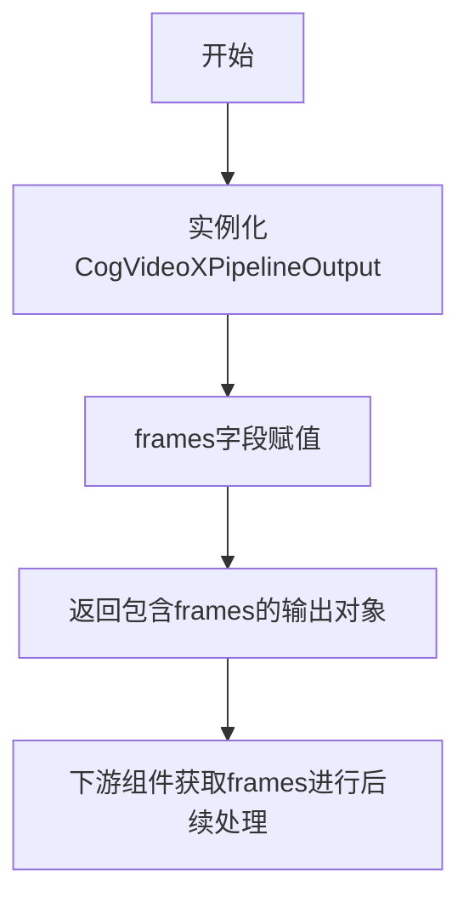
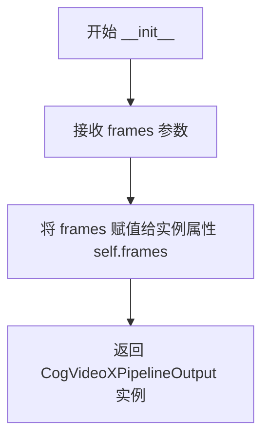
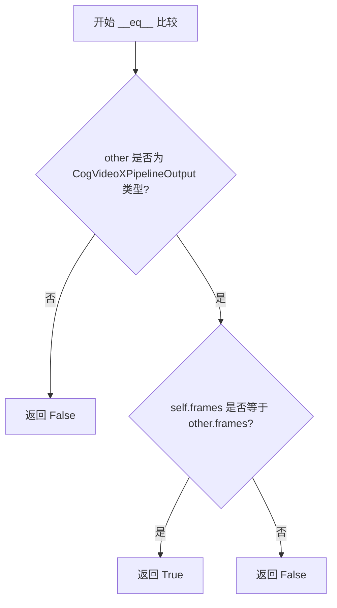

# `diffusers\src\diffusers\pipelines\cogvideo\pipeline_output.py` 详细设计文档

这是一个用于CogVideo管道的输出类，继承自diffusers库的BaseOutput，作为数据容器封装视频帧结果，支持torch.Tensor、numpy数组或PIL图像列表等多种格式的frames数据输出。

## 整体流程



## 类结构

```
BaseOutput (diffusers.utils基类)
└── CogVideoXPipelineOutput (数据类)
```

## 全局变量及字段


### `CogVideoXPipelineOutput.frames`
    
视频帧输出，可为torch.Tensor、np.ndarray或list[list[PIL.Image.Image]]格式

类型：`torch.Tensor`
    
    

## 全局函数及方法


### `CogVideoXPipelineOutput.__init__`

这是 CogVideoX 管道输出类的初始化方法，由 `@dataclass` 装饰器自动生成，用于创建包含视频帧序列的输出对象。

参数：

- `frames`：`torch.Tensor`，视频输出帧列表，形状为 `(batch_size, num_frames, channels, height, width)`，也可以是 NumPy 数组或嵌套的 PIL 图像列表

返回值：`CogVideoXPipelineOutput`，返回初始化后的管道输出实例对象

#### 流程图



#### 带注释源码

```python
def __init__(self, frames: torch.Tensor) -> None:
    """
    初始化 CogVideoXPipelineOutput 实例。

    Args:
        frames (torch.Tensor): 视频输出帧，可以是以下格式之一：
            - torch.Tensor: 形状为 (batch_size, num_frames, channels, height, width)
            - np.ndarray: 同上形状的 NumPy 数组
            - list[list[PIL.Image.Image]]: 嵌套列表，每项为 batch_size 个 PIL 图像序列

    Returns:
        None: __init__ 方法返回 None，实例通过构造函数返回
    """
    # dataclass 自动生成：self.frames = frames
    # 将传入的 frames 参数存储为实例属性，供后续处理使用
    self.frames = frames
```


### CogVideoXPipelineOutput.__repr__

这是一个由 `@dataclass` 装饰器自动生成的方法（隐式方法）。它不需要显式调用，当尝试打印该类的实例（例如 `print(instance)`）或调用 `repr(instance)` 时自动触发。该方法用于生成并返回一个包含类名以及所有字段（`frames`）名称和值的格式化字符串，以便于调试和日志记录。

参数：

- `self`：`CogVideoXPipelineOutput`，代表当前类的实例对象本身。

返回值：`str`，返回该数据类实例的字符串表示形式，通常格式为 `ClassName(field1=value1, field2=value2, ...)`。

#### 流程图

```mermaid
flowchart TD
    A[开始 __repr__] --> B[获取 self 实例的字段值]
    B --> C{遍历所有字段}
    C -->|字段: frames| D[获取 self.frames 的值]
    D --> E[格式化字段名和值: 'frames=value']
    E --> F[拼接为字符串: 'CogVideoXPipelineOutput(frames=...)']
    F --> G[返回字符串]
    G --> H[结束]
```

#### 带注释源码

```python
# 注意：虽然代码中未显式书写此方法，但 @dataclass 装饰器会自动在类定义时生成此方法。
# 下面是 Python 解释器在运行时会生成的 __repr__ 方法的逻辑模拟：

def __repr__(self):
    """
    返回对象的字符串表示。
    自动由 dataclass 装饰器生成。
    """
    # 1. 获取类名
    return f"CogVideoXPipelineOutput(frames={self.frames!r})"
    # !r 表示使用 repr() 来格式化值，这样可以显示出 tensor 的类型和设备信息，
    # 而不是仅仅显示数值。例如：frames tensor([[[[...]]]]...)
```


### `CogVideoXPipelineOutput.__eq__`

由 `@dataclass` 装饰器自动生成的相等性比较方法，用于比较两个 `CogVideoXPipelineOutput` 实例是否相等。

参数：

- `self`：`CogVideoXPipelineOutput`，当前实例（隐式参数）
- `other`：`Any`，与当前实例进行比较的对象，可以是任何类型

返回值：`bool`，如果两个实例相等返回 `True`，否则返回 `False`

#### 流程图



#### 带注释源码

```python
def __eq__(self, other: object) -> bool:
    """
    比较两个 CogVideoXPipelineOutput 实例是否相等。
    由 @dataclass 自动生成，基于所有字段进行比较。
    
    Args:
        other: 与当前实例进行比较的对象
        
    Returns:
        bool: 如果两个实例的所有字段都相等返回 True，否则返回 False
    """
    # dataclass 自动生成的比较逻辑
    # 1. 首先检查类型是否相同
    # 2. 如果类型相同，递归比较所有字段（此处为 frames 字段）
    return (
        isinstance(other, CogVideoXPipelineOutput) and 
        self.frames == other.frames
    )
```

> **注意**：由于 `frames` 字段的类型是 `torch.Tensor`，其相等性比较依赖于 PyTorch 的 `__eq__` 实现，通常是比较张量的形状和数值内容。

## 关键组件


### CogVideoXPipelineOutput

CogVideoXPipelineOutput 是一个数据类，继承自 BaseOutput，用于封装 CogVideo 管道生成的视频帧输出结果。

### frames

torch.Tensor 类型的帧数据成员，用于存储批量视频帧的张量数据，支持多种格式（列表、NumPy 数组或 PyTorch 张量）。

### BaseOutput

来自 diffusers.utils 的基类，为管道输出提供标准化的数据结构接口。


## 问题及建议


### 已知问题

-   **类型注解与文档不一致**: `frames`字段的文档说明支持`torch.Tensor`、`np.ndarray`或`list[list[PIL.Image.Image]]`三种类型，但类型注解仅声明为`torch.Tensor`，未使用`Union`类型反映实际可接受的多类型场景
-   **缺少输入验证**: 未在`__post_init__`方法中对`frames`的类型、维度或形状进行校验，可能导致后续处理时出现难以追踪的运行时错误
-   **无默认值处理机制**: 未考虑`frames`为`None`或空值的场景，缺乏防御性编程
-   **序列化支持不明确**: 作为输出类，未明确声明对不同序列化格式（pickle、json）的支持策略
-   **文档注释冗余**: 文档字符串中包含了较为完整的参数说明，但作为简单的数据类可能过度设计

### 优化建议

-   **修正类型注解**: 使用`Union[torch.Tensor, np.ndarray, list[list[PIL.Image.Image]]]`或`TypeVar`定义更精确的类型约束，使类型注解与文档描述保持一致
-   **添加数据验证**: 实现`__post_init__`方法，验证`frames`不为空、类型符合预期，必要时可添加形状或维度的范围检查
-   **考虑Optional类型**: 如业务场景允许frames为空，明确使用`Optional[torch.Tensor]`并添加None的文档说明
-   **简化文档**: 如项目不需要如此详细的参数说明，可简化文档字符串以减少维护成本
-   **添加类型别名**: 定义`VideoFrames`类型别名以提高代码可读性和可维护性
-   **考虑添加工厂方法**: 如创建实例逻辑较复杂，可添加类方法作为构造器


## 其它


### 设计目标与约束

设计目标：定义 CogVideoX 视频生成管道的标准输出格式，提供统一的帧数据封装结构，支持多种帧数据格式（PIL 图像列表、NumPy 数组、PyTorch 张量）的封装。

设计约束：
- 必须继承自 BaseOutput 以符合 diffusers 库的输出规范
- frames 字段类型固定为 torch.Tensor，限制了其他格式的直接支持
- 使用 @dataclass 装饰器简化数据类实现

### 错误处理与异常设计

由于该类仅为数据容器，不涉及复杂逻辑，因此错误处理主要依赖于：
- 类型检查：frames 字段应在赋值时保证为 torch.Tensor 类型
- 数据验证：外部调用者负责验证 frames 的形状和数值范围
- 继承链异常：BaseOutput 的异常处理机制将被继承

### 外部依赖与接口契约

外部依赖：
- torch：用于张量类型定义
- diffusers.utils.BaseOutput：基础输出类，提供序列化支持

接口契约：
- 输入：frames 参数必须为 torch.Tensor 类型
- 输出：包含 frames 属性的对象，支持索引访问
- 序列化：继承 BaseOutput 的 to_dict 和 from_dict 方法

### 性能考虑

由于仅为轻量级数据类，性能开销主要在：
- 内存占用：取决于 frames 张量的实际大小
- 复制开销：dataclass 默认生成的 __init__ 可能产生浅拷贝
- 序列化：BaseOutput 提供的序列化方法性能依赖 torch.save/load

### 扩展性设计

当前设计支持以下扩展：
- 字段扩展：可添加额外的输出属性（如 noise_pred、latents 等中间结果）
- 类型扩展：可通过泛型支持不同的帧类型
- 方法扩展：可添加数据预处理/后处理方法

### 使用示例

```python
# 基本实例化
output = CogVideoXPipelineOutput(frames=torch.randn(1, 16, 3, 256, 256))

# 访问输出
frames = output.frames

# 序列化
output_dict = output.to_dict()
```

### 版本兼容性

- Python 版本：无特殊要求，遵循 diffusers 库要求
- PyTorch 版本：需与 diffusers 兼容
- diffusers 版本：需继承正确版本的 BaseOutput

### 测试考虑

建议测试：
- 类型验证：frames 必须为 torch.Tensor
- 形状验证：支持批量维度
- 序列化测试：to_dict/from_dict 往返一致性
- 继承验证：确保继承自 BaseOutput

### 文档完整性

当前文档字符串（docstring）包含：
- 类功能说明
- frames 参数说明
- 支持的数据格式说明（但代码中仅支持 torch.Tensor）

建议：更新 docstring 以准确反映实际支持的类型（当前文档与实现不一致）

    