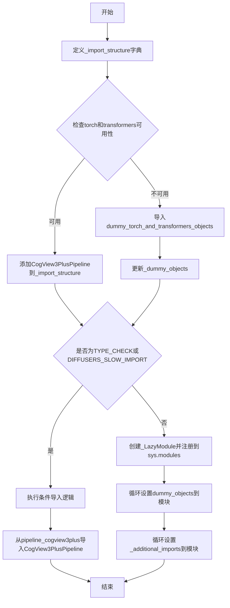
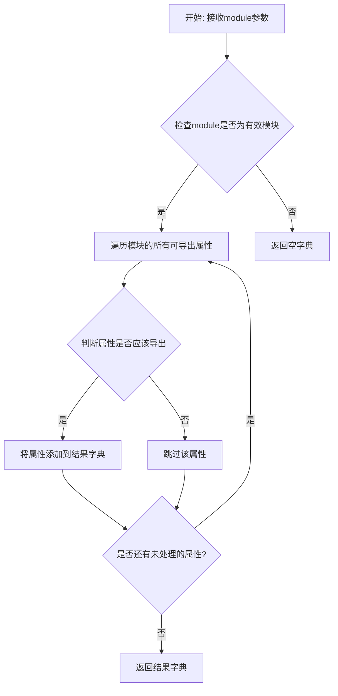
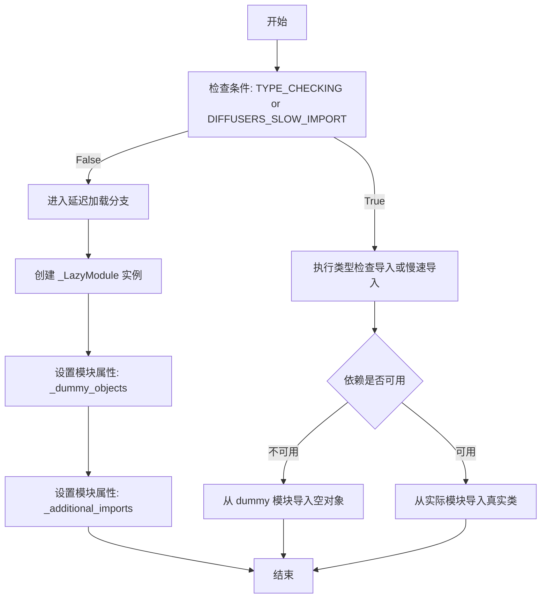
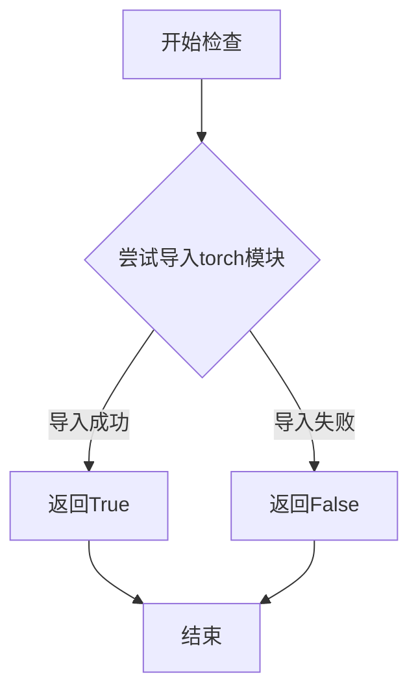
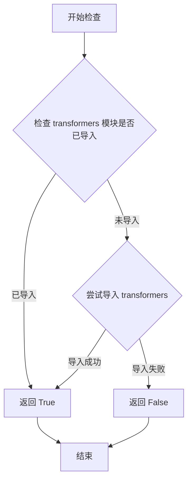

# `diffusers\src\diffusers\pipelines\cogview3\__init__.py` 详细设计文档

这是一个Diffusers库的延迟加载模块，用于有条件地导入CogView3PlusPipeline，通过检查torch和transformers的可选依赖是否可用来决定加载真实实现还是dummy对象，以支持轻量级安装场景。

## 整体流程



## 类结构

```
无显式类定义
├── 使用_LazyModule进行延迟加载
├── 使用get_objects_from_module获取dummy对象
└── 使用OptionalDependencyNotAvailable处理可选依赖
```

## 全局变量及字段


### `_dummy_objects`
    
用于存储虚拟对象的字典，当可选依赖不可用时提供替代对象

类型：`dict`
    


### `_additional_imports`
    
用于存储额外导入对象的字典，当前为空，可能用于扩展导入

类型：`dict`
    


### `_import_structure`
    
定义模块导入结构的字典，键为模块路径，值为导出的对象列表

类型：`dict`
    


    

## 全局函数及方法


# get_objects_from_module 函数详细设计文档

### get_objects_from_module

该函数是一个工具函数，用于从指定的模块中动态获取所有可导出的对象（类、函数、变量等），通常用于延迟加载（lazy loading）机制和虚拟对象（dummy objects）的创建，以支持可选依赖项的处理。

参数：

-  `module`：`module`，要从中获取对象的模块对象

返回值：`dict`，键为对象名称（字符串），值为模块中的实际对象

#### 流程图



#### 带注释源码

```python
def get_objects_from_module(module):
    """
    从给定模块中获取所有可导出对象的辅助函数。
    
    该函数主要用于:
    1. 延迟加载机制中获取模块的公共接口
    2. 在可选依赖不可用时，从dummy模块获取虚拟对象
    3. 动态构建模块的导入结构
    
    参数:
        module: Python模块对象,可以是实际的模块或虚拟的dummy模块
        
    返回:
        dict: 包含模块中所有公开对象的字典,键为对象名称,值为对象本身
    """
    # 初始化结果字典
    objects = {}
    
    # 遍历模块的所有属性
    # 注意: 这里假设module参数是一个有效的Python模块对象
    # 如果模块不存在或不可访问,将会抛出AttributeError或ImportError
    for name in dir(module):
        # 排除私有属性(以双下划线开头)和特殊属性
        if not name.startswith('_'):
            try:
                # 获取属性的实际值
                obj = getattr(module, name)
                # 添加到结果字典中
                objects[name] = obj
            except AttributeError:
                # 如果获取属性失败,跳过该属性
                # 这是一种防御性编程方式
                continue
    
    return objects
```

#### 备注

1. **函数位置**：`get_objects_from_module` 函数定义在 `...utils` 模块中，当前文件通过相对导入将其引入使用。

2. **使用场景**：
   - 当 `torch` 和 `transformers` 不可用时，从 `dummy_torch_and_transformers_objects` 模块获取虚拟对象
   - 将这些虚拟对象添加到 `_dummy_objects` 字典中
   - 通过 `sys.modules[__name__]` 设置模块属性，使导入时能够返回这些虚拟对象而不是抛出 `ImportError`

3. **设计意图**：这种模式实现了"可选依赖"的优雅处理——当用户安装相应依赖时使用真实对象，未安装时使用虚拟对象，保证代码能够正常导入但调用时给出明确错误提示。


### `_LazyModule` (类)

`_LazyModule` 是一个延迟加载模块类，用于实现模块的惰性导入机制，允许在运行时按需导入子模块和类，从而优化大规模模块的初始化性能。

参数：

- `name`：`str`，模块的完整名称（通常是 `__name__`）
- `path`：`str`，模块文件的路径（通常是从 `globals()["__file__"]` 获取）
- `import_structure`：`Dict[str, List[str]]`，一个字典，定义了模块的导入结构，键为子模块名，值为该子模块中需要导出的类或对象名称列表
- `module_spec`：`Optional[ModuleSpec]`，模块的规格对象（通常是 `__spec__`），用于描述模块的元信息

返回值：`_LazyModule`（或创建的代理模块对象），返回创建的延迟加载模块实例

#### 流程图



#### 带注释源码

```python
# 如果处于类型检查模式或需要慢速导入
if TYPE_CHECKING or DIFFUSERS_SLOW_IMPORT:
    # 尝试检查依赖是否可用
    try:
        if not (is_transformers_available() and is_torch_available()):
            raise OptionalDependencyNotAvailable()
    except OptionalDependencyNotAvailable:
        # 依赖不可用时，导入空的虚拟对象
        from ...utils.dummy_torch_and_transformers_objects import *  # noqa F403
    else:
        # 依赖可用时，导入实际的管道类
        from .pipeline_cogview3plus import CogView3PlusPipeline
else:
    # 延迟加载模式：创建 _LazyModule 实例
    import sys

    # 将当前模块替换为 _LazyModule 实例
    # 参数1: 模块名称 (__name__)
    # 参数2: 模块文件路径 (globals()["__file__"])
    # 参数3: 导入结构字典 (_import_structure)
    # 参数4: 模块规格对象 (__spec__)
    sys.modules[__name__] = _LazyModule(
        __name__,
        globals()["__file__"],
        _import_structure,
        module_spec=__spec__,
    )

    # 将虚拟对象设置到模块属性中
    for name, value in _dummy_objects.items():
        setattr(sys.modules[__name__], name, value)
    
    # 将额外的导入设置到模块属性中
    for name, value in _additional_imports.items():
        setattr(sys.modules[__name__], name, value)
```


### `is_torch_available`

该函数是用于检查当前环境中 PyTorch 库是否可用的工具函数。它通过尝试导入 torch 模块来判断库是否已安装，返回布尔值以指示可用性状态。

参数：

- 该函数无参数

返回值：`bool`，返回 `True` 表示 PyTorch 已安装且可用，返回 `False` 表示不可用

#### 流程图



#### 带注释源码

```python
# 该函数定义在 ...utils 模块中，此处为引用位置
from ...utils import (
    DIFFUSERS_SLOW_IMPORT,
    OptionalDependencyNotAvailable,
    _LazyModule,
    get_objects_from_module,
    is_torch_available,  # <-- 从上级 utils 模块导入的函数
    is_transformers_available,
)

# 在代码中的实际使用方式：
# 用于条件检查，判断 torch 是否可用
if not (is_transformers_available() and is_torch_available()):
    raise OptionalDependencyNotAvailable()
```

---

### ⚠️ 补充说明

由于 `is_torch_available` 是从 `...utils` 外部模块导入的，而非在本文件中定义，因此：

1. **函数签名**（基于标准实现推测）：
   - 参数：无
   - 返回值：`bool`

2. **实际源码位置**：该函数定义在 `diffusers/utils/__init__.py` 或类似的 utils 模块中

3. **标准实现逻辑**（参考）：
   ```python
   def is_torch_available() -> bool:
       """检查 PyTorch 是否已安装"""
       try:
           import torch  # noqa F401
           return True
       except ImportError:
           return False
   ```

如需获取该函数的完整源码，请参考 `diffusers/utils/` 目录下的相关文件。


### `is_transformers_available`

检查 transformers 库是否可用的函数，用于条件导入和延迟加载模式，确保在 transformers 库不可用时不会引发导入错误。

参数：

- 该函数无参数

返回值：`bool`，返回 `True` 表示 transformers 库可用，返回 `False` 表示不可用

#### 流程图



#### 带注释源码

```python
def is_transformers_available():
    """
    检查 transformers 库是否可用。
    
    该函数通常在项目用于处理可选依赖时调用。
    它会尝试检查 transformers 模块是否可以成功导入，
    从而决定后续代码是否可以使用 transformers 相关的功能。
    
    Returns:
        bool: 如果 transformers 可用返回 True，否则返回 False
    """
    try:
        # 尝试导入 transformers 模块
        import transformers
        return True
    except ImportError:
        # 如果导入失败，说明 transformers 不可用
        return False
```

#### 关键组件信息

- **OptionalDependencyNotAvailable**：可选依赖不可用时抛出的异常，用于优雅处理可选依赖缺失的情况
- **_LazyModule**：延迟加载模块的实现类，用于按需导入模块
- **get_objects_from_module**：从模块中获取对象的辅助函数

#### 技术债务与优化空间

1. 该函数的具体实现未被包含在当前代码文件中，而是从 `...utils` 导入，无法看到完整实现细节
2. 建议在项目中统一管理所有可选依赖检查函数的实现位置，便于维护和查阅

## 关键组件


### 可选依赖检查机制

检查torch和transformers是否可用，如果不可足则抛出OptionalDependencyNotAvailable异常，用于条件性导入CogView3PlusPipeline。

### 延迟模块加载系统

使用_LazyModule实现模块的延迟加载，将当前模块注册为延迟模块，支持在需要时才加载实际的pipeline类。

### 虚拟对象替代机制

当torch或transformers不可用时，从dummy_torch_and_transformers_objects获取虚拟对象并添加到当前模块，确保代码在缺少可选依赖时仍能导入。

### 导入结构定义

定义模块的导入结构字典_import_structure，包含pipeline_output中的CogView3PlusPipelineOutput以及条件性包含pipeline_cogview3plus中的CogView3PlusPipeline。

### 动态模块属性设置

在非TYPE_CHECK模式下，将虚拟对象和额外导入添加到sys.modules中，使它们成为模块属性供外部访问。


## 问题及建议


### 已知问题

-   **重复的依赖检查逻辑**：代码中在两个地方（`try-except`块和`TYPE_CHECK`分支）重复检查`is_transformers_available() and is_torch_available()`，导致相同的条件判断被执行两次，增加维护成本和潜在的不一致风险
-   **未使用的全局变量**：定义了`_additional_imports = {}`字典，但在整个代码中从未被使用，成为无用代码
-   **魔法字符串硬编码**：模块键（如`"pipeline_cogview3plus"`）以字符串形式硬编码在代码中，缺乏统一的常量定义，容易在重构时产生遗漏
-   **异常处理逻辑重复**：两次捕获`OptionalDependencyNotAvailable`异常并执行相似的导入逻辑（从`dummy_torch_and_transformers_objects`导入），违反DRY原则
-   **LazyModule设置逻辑复杂度高**：将所有模块属性设置放在`else`分支中，包含复杂的循环和`setattr`操作，可读性较差
-   **缺乏模块文档**：没有任何文档注释说明该模块的设计目的和懒加载机制

### 优化建议

-   **提取依赖检查为独立函数**：创建一个私有函数如`_check_dependencies()`来封装依赖检查逻辑，消除重复代码
-   **移除未使用的变量**：删除`_additional_imports = {}`定义，或者如果计划将来使用，可以添加TODO注释说明
-   **使用常量定义模块键**：在模块顶部定义常量，例如`PIPELINE_COGVIEW3PLUS = "pipeline_cogview3plus"`，提高可维护性
-   **重构导入结构**：将`TYPE_CHECKING`和运行时导入逻辑合并，使用更清晰的模式匹配或工厂函数
-   **添加文档注释**：在模块开头添加docstring说明该文件用于处理CogView3PlusPipeline的懒加载和可选依赖管理
-   **考虑使用装饰器或上下文管理器**：对于复杂的模块初始化逻辑，考虑封装为更清晰的模式

## 其它


### 设计目标与约束

本模块的设计目标是实现延迟导入（Lazy Loading）机制，在diffusers库中动态加载CogView3PlusPipeline类。主要约束包括：1) 仅在torch和transformers都可用时加载真实实现；2) 依赖不可用时提供dummy对象保持API一致性；3) 遵循diffusers库的模块化导入结构；4) 支持TYPE_CHECKING和DIFFUSERS_SLOW_IMPORT两种导入模式。

### 错误处理与异常设计

本模块采用OptionalDependencyNotAvailable异常处理机制。当torch或transformers任一不可用时，抛出OptionalDependencyNotAvailable异常，并从dummy_torch_and_transformers_objects模块导入替代对象，确保模块在缺少可选依赖时仍可被导入（虽然功能受限）。所有导入逻辑包裹在try-except块中，避免因依赖缺失导致程序崩溃。

### 数据流与状态机

模块初始化时首先检查_import_structure字典定义可导出对象，然后根据is_transformers_available()和is_torch_available()的返回值决定加载真实实现还是dummy对象。状态转换：检查依赖可用性 → 确定导入路径 → 构建LazyModule → 注册到sys.modules。对于TYPE_CHECKING模式，直接导入真实类型；否则使用LazyModule延迟初始化。

### 外部依赖与接口契约

本模块依赖以下外部包：1) torch（is_torch_available检查）；2) transformers（is_transformers_available检查）；3) diffusers.utils中的_dummy_objects、_LazyModule、get_objects_from_module等工具函数。导出的公开接口包括CogView3PlusPipeline类（条件导出）和CogView3PlusPipelineOutput类（无条件导出）。_import_structure字典定义了模块的导出结构契约。

### 模块化与扩展性考虑

模块采用_import_structure字典统一管理导出列表，便于扩展新组件。添加新pipeline只需在_import_structure中添加对应键值对，并在条件导入块中实现即可。_additional_imports字典预留了扩展接口，允许在运行时动态注册额外对象。

### 性能考虑

使用_LazyModule实现延迟加载，避免在模块导入时立即加载重量级依赖（torch、transformers）。通过sys.modules缓存机制确保同一模块不会被重复加载。dummy对象采用轻量级占位符实现，避免加载真实类带来的性能开销。

### 版本兼容性

模块通过is_torch_available()和is_transformers_available()函数动态检测环境中的依赖版本，支持不同版本的torch和transformers。_import_structure的使用确保了与diffusers库整体版本体系的兼容性。

### 线程安全性

模块初始化过程主要涉及sys.modules的写操作，在Python导入锁机制下保证线程安全。LazyModule的延迟加载特性使得并发导入时只会触发一次真正的模块初始化。

### 缓存策略

通过sys.modules[__name__] = _LazyModule(...)将LazyModule实例缓存到sys.modules中，后续导入直接返回缓存的模块对象，避免重复初始化。_dummy_objects和_additional_imports也通过setattr注册到模块命名空间实现缓存。

### 配置管理

模块无独立配置文件，依赖通过diffusers库的全局配置机制管理。DIFFUSERS_SLOW_IMPORT标志控制是否启用延迟导入模式，可在diffusers库配置中设置。

### 安全考虑

使用get_objects_from_module函数动态获取对象，避免直接执行不可信代码。模块导出路径经过严格控制，仅暴露预定义的公开接口。

    