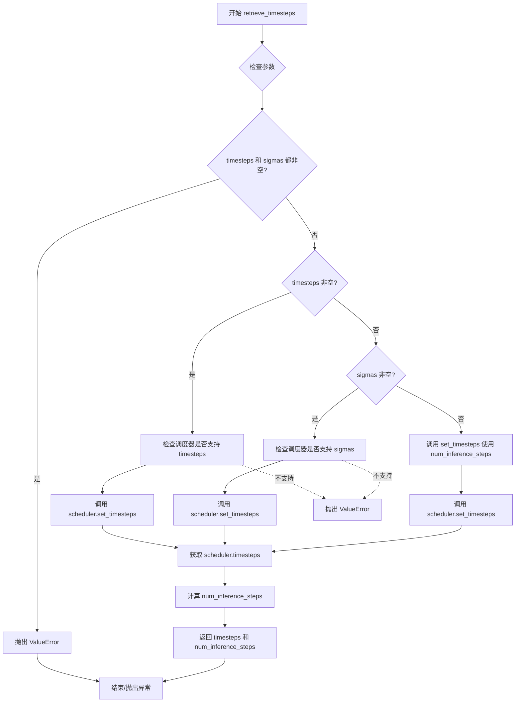
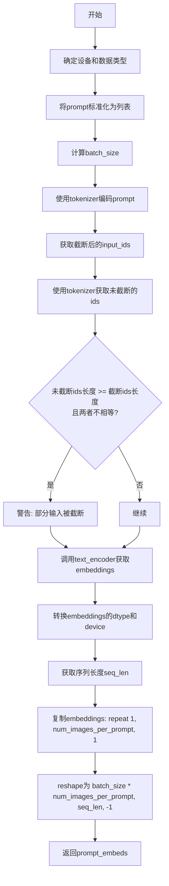
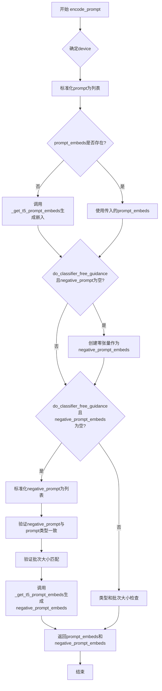
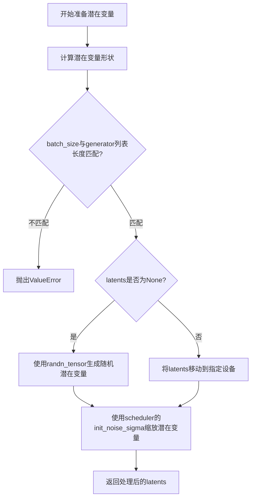
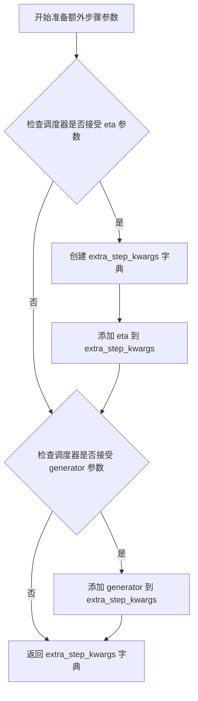
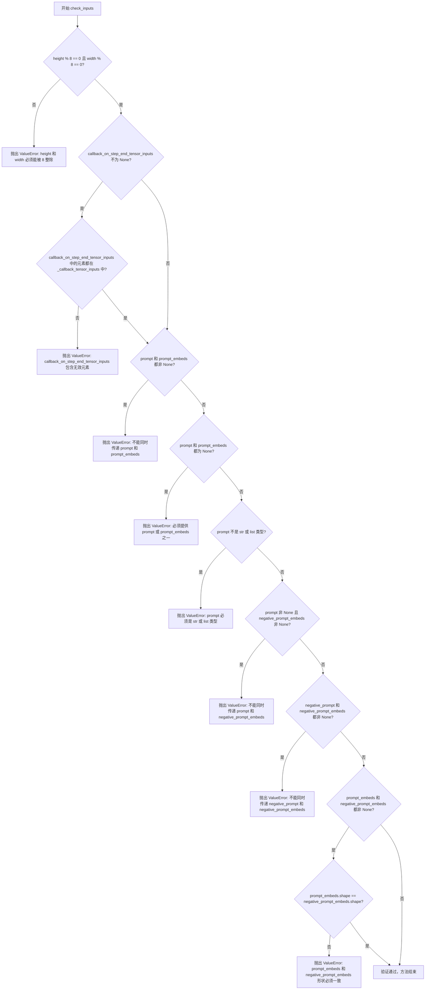
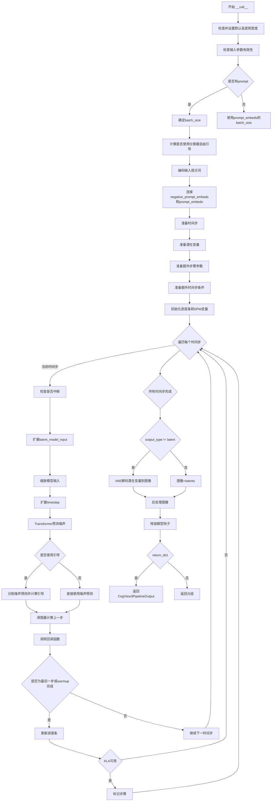
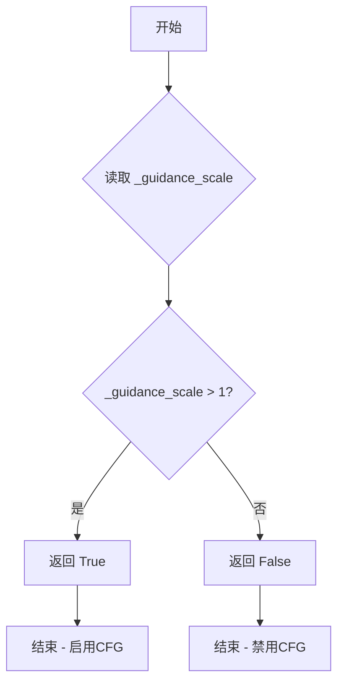
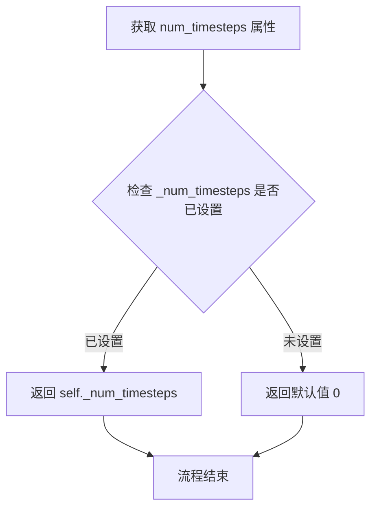
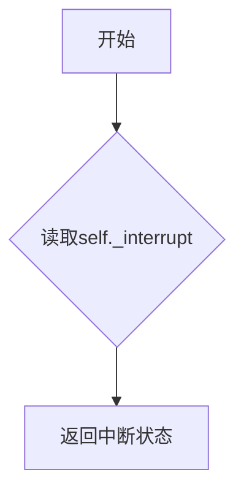

# `diffusers\src\diffusers\pipelines\cogview3\pipeline_cogview3plus.py` 详细设计文档

CogView3PlusPipeline是一个基于CogView3Plus模型的文本到图像生成Pipeline，集成了T5文本编码器、CogView3PlusTransformer2DModel变换器和VAE模型，支持Classifier-Free Guidance机制，能够根据文本提示生成高质量图像。

## 整体流程

```mermaid
graph TD
    A[开始: 调用 __call__] --> B[1. 检查输入参数 check_inputs]
B --> C[2. 获取batch_size和device]
C --> D[3. 编码输入提示 encode_prompt]
D --> E[4. 准备时间步 retrieve_timesteps]
E --> F[5. 准备潜在变量 prepare_latents]
F --> G[6. 准备额外步骤参数 prepare_extra_step_kwargs]
G --> H[7. 准备额外时间步条件]
H --> I{8. 去噪循环}
I -->|循环开始| J[扩展时间步]
J --> K[调用transformer预测噪声]
K --> L{执行Classifier-Free Guidance?}
L -->|是| M[计算有条件和无条件噪声预测]
L -->|否| N[直接使用预测噪声]
M --> O[scheduler.step更新latents]
N --> O
O --> P{执行回调?]
P -->|是| Q[执行callback_on_step_end]
P -->|否| R[更新进度条]
Q --> R
R --> S{循环结束?}
S -->|否| I
S -->|是| T[9. VAE解码 latent->image]
T --> U[10. 后处理图像]
U --> V[11. 释放模型钩子]
V --> W[返回CogView3PipelineOutput]
```

## 类结构

```
DiffusionPipeline (基类)
└── CogView3PlusPipeline
```

## 全局变量及字段


### `EXAMPLE_DOC_STRING`
    
包含CogView3PlusPipeline使用示例的文档字符串

类型：`str`
    


### `XLA_AVAILABLE`
    
指示是否可以使用PyTorch XLA进行加速的布尔标志

类型：`bool`
    


### `logger`
    
用于记录模块日志的日志记录器实例

类型：`logging.Logger`
    


### `retrieve_timesteps`
    
获取调度器时间步的辅助函数，支持自定义timesteps和sigmas

类型：`function`
    


### `CogView3PlusPipeline.tokenizer`
    
用于将文本提示编码为token的T5分词器

类型：`T5Tokenizer`
    


### `CogView3PlusPipeline.text_encoder`
    
冻结的T5文本编码器，用于将token转换为文本嵌入

类型：`T5EncoderModel`
    


### `CogView3PlusPipeline.vae`
    
变分自编码器，用于图像与潜在表示之间的编码和解码

类型：`AutoencoderKL`
    


### `CogView3PlusPipeline.transformer`
    
文本条件的Transformer模型，用于对图像潜在表示进行去噪

类型：`CogView3PlusTransformer2DModel`
    


### `CogView3PlusPipeline.scheduler`
    
扩散调度器，用于控制去噪过程中的时间步和噪声预测

类型：`CogVideoXDDIMScheduler | CogVideoXDPMScheduler`
    


### `CogView3PlusPipeline.vae_scale_factor`
    
VAE缩放因子，用于计算潜在空间与像素空间的转换比例

类型：`int`
    


### `CogView3PlusPipeline.image_processor`
    
图像后处理器，用于将潜在表示转换为最终图像输出

类型：`VaeImageProcessor`
    


### `CogView3PlusPipeline._optional_components`
    
可选组件列表，定义为空的类属性

类型：`list`
    


### `CogView3PlusPipeline.model_cpu_offload_seq`
    
模型CPU卸载顺序，指定text_encoder->transformer->vae的卸载流程

类型：`str`
    


### `CogView3PlusPipeline._callback_tensor_inputs`
    
回调函数可访问的张量输入列表，包含latents和prompt_embeds

类型：`list`
    


### `CogView3PlusPipeline._guidance_scale`
    
无分类器自由指导的强度比例，用于控制文本提示对生成图像的影响程度

类型：`float (property)`
    


### `CogView3PlusPipeline._num_timesteps`
    
当前推理过程使用的总时间步数

类型：`int (property)`
    


### `CogView3PlusPipeline._interrupt`
    
中断标志，用于在推理过程中停止生成过程

类型：`bool (property)`
    
    

## 全局函数及方法


### `retrieve_timesteps`

该函数是扩散管道中的时间步检索工具函数，用于调用调度器的 `set_timesteps` 方法并从调度器中获取更新后的时间步。它支持自定义时间步和自定义 sigma 值，并能根据调度器的能力自动适配不同的参数接口。

参数：

- `scheduler`：`SchedulerMixin`，用于获取时间步的调度器对象
- `num_inference_steps`：`int | None`，生成样本时使用的扩散步数，如果使用此参数则 `timesteps` 必须为 `None`
- `device`：`str | torch.device | None`，时间步应移动到的设备，如果为 `None` 则不移动
- `timesteps`：`list[int] | None`，用于覆盖调度器时间步间隔策略的自定义时间步，如果传入此参数则 `num_inference_steps` 和 `sigmas` 必须为 `None`
- `sigmas`：`list[float] | None`，用于覆盖调度器时间步间隔策略的自定义 sigmas，如果传入此参数则 `num_inference_steps` 和 `timesteps` 必须为 `None`
- `**kwargs`：任意关键字参数，将传递给调度器的 `set_timesteps` 方法

返回值：`tuple[torch.Tensor, int]`，元组包含调度器的时间步调度张量和推理步数

#### 流程图



#### 带注释源码

```python
# Copied from diffusers.pipelines.stable_diffusion.pipeline_stable_diffusion.retrieve_timesteps
def retrieve_timesteps(
    scheduler,
    num_inference_steps: int | None = None,
    device: str | torch.device | None = None,
    timesteps: list[int] | None = None,
    sigmas: list[float] | None = None,
    **kwargs,
):
    r"""
    Calls the scheduler's `set_timesteps` method and retrieves timesteps from the scheduler after the call. Handles
    custom timesteps. Any kwargs will be supplied to `scheduler.set_timesteps`.

    Args:
        scheduler (`SchedulerMixin`):
            The scheduler to get timesteps from.
        num_inference_steps (`int`):
            The number of diffusion steps used when generating samples with a pre-trained model. If used, `timesteps`
            must be `None`.
        device (`str` or `torch.device`, *optional*):
            The device to which the timesteps should be moved to. If `None`, the timesteps are not moved.
        timesteps (`list[int]`, *optional*):
            Custom timesteps used to override the timestep spacing strategy of the scheduler. If `timesteps` is passed,
            `num_inference_steps` and `sigmas` must be `None`.
        sigmas (`list[float]`, *optional*):
            Custom sigmas used to override the timestep spacing strategy of the scheduler. If `sigmas` is passed,
            `num_inference_steps` and `timesteps` must be `None`.

    Returns:
        `tuple[torch.Tensor, int]`: A tuple where the first element is the timestep schedule from the scheduler and the
        second element is the number of inference steps.
    """
    # 检查是否同时传递了 timesteps 和 sigmas，两者只能选择其一
    if timesteps is not None and sigmas is not None:
        raise ValueError("Only one of `timesteps` or `sigmas` can be passed. Please choose one to set custom values")
    
    # 处理自定义时间步的情况
    if timesteps is not None:
        # 使用 inspect 检查调度器的 set_timesteps 方法是否支持 timesteps 参数
        accepts_timesteps = "timesteps" in set(inspect.signature(scheduler.set_timesteps).parameters.keys())
        if not accepts_timesteps:
            raise ValueError(
                f"The current scheduler class {scheduler.__class__}'s `set_timesteps` does not support custom"
                f" timestep schedules. Please check whether you are using the correct scheduler."
            )
        # 调用调度器的 set_timesteps 方法设置自定义时间步
        scheduler.set_timesteps(timesteps=timesteps, device=device, **kwargs)
        # 从调度器获取更新后的时间步
        timesteps = scheduler.timesteps
        # 计算推理步数
        num_inference_steps = len(timesteps)
    # 处理自定义 sigmas 的情况
    elif sigmas is not None:
        # 使用 inspect 检查调度器的 set_timesteps 方法是否支持 sigmas 参数
        accept_sigmas = "sigmas" in set(inspect.signature(scheduler.set_timesteps).parameters.keys())
        if not accept_sigmas:
            raise ValueError(
                f"The current scheduler class {scheduler.__class__}'s `set_timesteps` does not support custom"
                f" sigmas schedules. Please check whether you are using the correct scheduler."
            )
        # 调用调度器的 set_timesteps 方法设置自定义 sigmas
        scheduler.set_timesteps(sigmas=sigmas, device=device, **kwargs)
        # 从调度器获取更新后的时间步
        timesteps = scheduler.timesteps
        # 计算推理步数
        num_inference_steps = len(timesteps)
    # 默认情况：使用 num_inference_steps 设置时间步
    else:
        scheduler.set_timesteps(num_inference_steps, device=device, **kwargs)
        timesteps = scheduler.timesteps
    
    # 返回时间步张量和推理步数
    return timesteps, num_inference_steps
```


### CogView3PlusPipeline.__init__

这是 `CogView3PlusPipeline` 类的构造函数，用于初始化 CogView3Plus 文本到图像生成管道。该方法接收分词器、文本编码器、VAE、Transformer 和调度器等核心组件，并通过 `register_modules` 注册这些模块，同时计算 VAE 缩放因子并初始化图像处理器。

参数：

- `tokenizer`：`T5Tokenizer`，用于将文本 prompt 转换为 token 序列
- `text_encoder`：`T5EncoderModel`，用于将 token 序列编码为文本嵌入向量
- `vae`：`AutoencoderKL`，变分自编码器，用于将潜在表示编码/解码为图像
- `transformer`：`CogView3PlusTransformer2DModel`，核心的去噪 Transformer 模型，用于从噪声图像中逐步恢复出目标图像
- `scheduler`：`CogVideoXDDIMScheduler | CogVideoXDPMScheduler`，扩散调度器，控制去噪过程中的时间步和噪声调度

返回值：`None`，构造函数不返回值，仅初始化实例属性

#### 流程图

```mermaid
flowchart TD
    A[开始 __init__] --> B[调用 super().__init__ 初始化基类]
    B --> C[调用 register_modules 注册 tokenizer, text_encoder, vae, transformer, scheduler]
    C --> D[计算 vae_scale_factor<br/>2 ** (len(vae.config.block_out_channels) - 1)]
    D --> E[使用 vae_scale_factor 初始化 VaeImageProcessor]
    E --> F[结束 __init__]
```

#### 带注释源码

```python
def __init__(
    self,
    tokenizer: T5Tokenizer,
    text_encoder: T5EncoderModel,
    vae: AutoencoderKL,
    transformer: CogView3PlusTransformer2DModel,
    scheduler: CogVideoXDDIMScheduler | CogVideoXDPMScheduler,
):
    """
    初始化 CogView3PlusPipeline 管道
    
    参数:
        tokenizer: T5 分词器，用于文本预处理
        text_encoder: T5 文本编码器，用于生成文本嵌入
        vae: 变分自编码器，用于图像的编码和解码
        transformer: CogView3Plus Transformer 模型，用于去噪生成
        scheduler: 扩散调度器，控制去噪过程
    """
    # 1. 调用父类 DiffusionPipeline 的初始化方法
    #    设置基本的管道配置和设备管理
    super().__init__()

    # 2. 注册所有模块到管道中
    #    这些模块将通过 self.module_name 方式访问
    #    同时保存到 self.config 中以便序列化
    self.register_modules(
        tokenizer=tokenizer, 
        text_encoder=text_encoder, 
        vae=vae, 
        transformer=transformer, 
        scheduler=scheduler
    )
    
    # 3. 计算 VAE 缩放因子
    #    基于 VAE 的 block_out_channels 计算下采样倍数
    #    例如: [128, 256, 512, 512] -> 2**(4-1) = 8
    self.vae_scale_factor = 2 ** (len(self.vae.config.block_out_channels) - 1) if getattr(self, "vae", None) else 8

    # 4. 初始化图像后处理器
    #    用于将 VAE 输出的潜空间表示转换为可视图像
    #    以及处理图像的各种输出格式(PIL/numpy/torch)
    self.image_processor = VaeImageProcessor(vae_scale_factor=self.vae_scale_factor)
```


### `CogView3PlusPipeline._get_t5_prompt_embeds`

该方法用于将文本提示（prompt）转换为T5文本编码器的嵌入向量（prompt embeddings），支持批量处理和单次生成多张图像的嵌入复制。

参数：

- `self`：`CogView3PlusPipeline` 实例本身
- `prompt`：`str | list[str]`，待编码的文本提示，可以是单个字符串或字符串列表
- `num_images_per_prompt`：`int = 1`，每个提示生成的图像数量，用于复制嵌入向量
- `max_sequence_length`：`int = 256`，编码序列的最大长度，超过该长度将被截断
- `device`：`torch.device | None`，指定计算设备，默认为执行设备
- `dtype`：`torch.dtype | None`，指定数据类型，默认为文本编码器的数据类型

返回值：`torch.Tensor`，形状为 `(batch_size * num_images_per_prompt, seq_len, hidden_size)` 的文本嵌入张量

#### 流程图



#### 带注释源码

```python
def _get_t5_prompt_embeds(
    self,
    prompt: str | list[str] = None,
    num_images_per_prompt: int = 1,
    max_sequence_length: int = 226,
    device: torch.device | None = None,
    dtype: torch.dtype | None = None,
):
    # 确定计算设备：如果未指定device，则使用pipeline的默认执行设备
    device = device or self._execution_device
    # 确定数据类型：如果未指定dtype，则使用文本编码器的数据类型
    dtype = dtype or self.text_encoder.dtype

    # 将单个字符串prompt转换为列表，便于统一处理
    prompt = [prompt] if isinstance(prompt, str) else prompt
    # 计算批处理大小
    batch_size = len(prompt)

    # 使用T5 tokenizer将prompt编码为PyTorch张量
    # padding="max_length": 填充到最大长度
    # max_length=max_sequence_length: 最大序列长度
    # truncation=True: 超过最大长度的部分将被截断
    # add_special_tokens=True: 添加特殊token（如 EOS）
    # return_tensors="pt": 返回PyTorch张量
    text_inputs = self.tokenizer(
        prompt,
        padding="max_length",
        max_length=max_sequence_length,
        truncation=True,
        add_special_tokens=True,
        return_tensors="pt",
    )
    text_input_ids = text_inputs.input_ids
    
    # 使用"longest" padding获取未截断的input_ids，用于检测是否有内容被截断
    untruncated_ids = self.tokenizer(prompt, padding="longest", return_tensors="pt").input_ids

    # 检查是否发生了截断：如果未截断的ids长度 >= 截断后的长度，且两者不相等
    if untruncated_ids.shape[-1] >= text_input_ids.shape[-1] and not torch.equal(text_input_ids, untruncated_ids):
        # 解码被截断的部分（从max_sequence_length-1到最后一个token）
        removed_text = self.tokenizer.batch_decode(untruncated_ids[:, max_sequence_length - 1 : -1])
        # 记录警告信息
        logger.warning(
            "The following part of your input was truncated because `max_sequence_length` is set to "
            f" {max_sequence_length} tokens: {removed_text}"
        )

    # 调用T5文本编码器获取文本嵌入
    # text_encoder返回隐藏状态，索引[0]获取隐藏状态张量
    prompt_embeds = self.text_encoder(text_input_ids.to(device))[0]
    # 将嵌入向量转换到指定的dtype和device
    prompt_embeds = prompt_embeds.to(dtype=dtype, device=device)

    # 获取嵌入的序列维度信息
    # shape: (batch_size, seq_len, hidden_size)
    _, seq_len, _ = prompt_embeds.shape
    
    # 为每个prompt复制num_images_per_prompt份嵌入向量
    # 使用repeat方法在维度1（图像维度）上复制
    prompt_embeds = prompt_embeds.repeat(1, num_images_per_prompt, 1)
    # reshape为 (batch_size * num_images_per_prompt, seq_len, hidden_size)
    # 以兼容后续的图像生成流程
    prompt_embeds = prompt_embeds.view(batch_size * num_images_per_prompt, seq_len, -1)

    # 返回处理后的文本嵌入
    return prompt_embeds
```


### `CogView3PlusPipeline.encode_prompt`

该方法用于将文本提示（prompt）和可选的负向提示（negative_prompt）编码为文本编码器的隐藏状态（hidden states），以便后续用于图像生成过程。该方法是CogView3Plus文本到图像生成管道的核心组成部分，支持分类器自由引导（Classifier-Free Guidance）机制。

参数：

- `prompt`：`str | list[str]`，要编码的文本提示
- `negative_prompt`：`str | list[str] | None`，不希望用于引导图像生成的提示，当不使用引导时会被忽略
- `do_classifier_free_guidance`：`bool`，是否使用分类器自由引导（默认为True）
- `num_images_per_prompt`：`int`，每个提示要生成的图像数量（默认为1）
- `prompt_embeds`：`torch.Tensor | None`，预生成的文本嵌入，可用于轻松调整文本输入
- `negative_prompt_embeds`：`torch.Tensor | None`，预生成的负向文本嵌入
- `max_sequence_length`：`int`，编码提示的最大序列长度（默认为224）
- `device`：`torch.device | None`，torch设备
- `dtype`：`torch.dtype | None`，torch数据类型

返回值：`tuple[torch.Tensor, torch.Tensor]`，返回编码后的提示嵌入和负向提示嵌入元组

#### 流程图



#### 带注释源码

```python
def encode_prompt(
    self,
    prompt: str | list[str],
    negative_prompt: str | list[str] | None = None,
    do_classifier_free_guidance: bool = True,
    num_images_per_prompt: int = 1,
    prompt_embeds: torch.Tensor | None = None,
    negative_prompt_embeds: torch.Tensor | None = None,
    max_sequence_length: int = 224,
    device: torch.device | None = None,
    dtype: torch.dtype | None = None,
):
    r"""
    Encodes the prompt into text encoder hidden states.

    Args:
        prompt (`str` or `list[str]`, *optional*):
            prompt to be encoded
        negative_prompt (`str` or `list[str]`, *optional*):
            The prompt or prompts not to guide the image generation. If not defined, one has to pass
            `negative_prompt_embeds` instead. Ignored when not using guidance (i.e., ignored if `guidance_scale` is
            less than `1`).
        do_classifier_free_guidance (`bool`, *optional*, defaults to `True`):
            Whether to use classifier free guidance or not.
        num_images_per_prompt (`int`, *optional*, defaults to 1):
            Number of images that should be generated per prompt. torch device to place the resulting embeddings on
        prompt_embeds (`torch.Tensor`, *optional*):
            Pre-generated text embeddings. Can be used to easily tweak text inputs, *e.g.* prompt weighting. If not
            provided, text embeddings will be generated from `prompt` input argument.
        negative_prompt_embeds (`torch.Tensor`, *optional*):
            Pre-generated negative text embeddings. Can be used to easily tweak text inputs, *e.g.* prompt
            weighting. If not provided, negative_prompt_embeds will be generated from `negative_prompt` input
            argument.
        max_sequence_length (`int`, defaults to `224`):
            Maximum sequence length in encoded prompt. Can be set to other values but may lead to poorer results.
        device: (`torch.device`, *optional*):
            torch device
        dtype: (`torch.dtype`, *optional*):
            torch dtype
    """
    # 确定执行设备，如果未指定则使用默认执行设备
    device = device or self._execution_device

    # 将prompt标准化为列表格式，如果是单个字符串则转为列表
    prompt = [prompt] if isinstance(prompt, str) else prompt
    
    # 根据prompt或prompt_embeds确定批次大小
    if prompt is not None:
        batch_size = len(prompt)
    else:
        batch_size = prompt_embeds.shape[0]

    # 如果未提供prompt_embeds，则调用_get_t5_prompt_embeds方法生成
    if prompt_embeds is None:
        prompt_embeds = self._get_t5_prompt_embeds(
            prompt=prompt,
            num_images_per_prompt=num_images_per_prompt,
            max_sequence_length=max_sequence_length,
            device=device,
            dtype=dtype,
        )

    # 如果使用分类器自由引导且未提供negative_prompt，则创建零嵌入
    if do_classifier_free_guidance and negative_prompt is None:
        negative_prompt_embeds = prompt_embeds.new_zeros(prompt_embeds.shape)

    # 如果使用分类器自由引导且未提供negative_prompt_embeds，则生成负向嵌入
    if do_classifier_free_guidance and negative_prompt_embeds is None:
        # 标准化negative_prompt为列表
        negative_prompt = batch_size * [negative_prompt] if isinstance(negative_prompt, str) else negative_prompt

        # 类型检查：确保negative_prompt与prompt类型一致
        if prompt is not None and type(prompt) is not type(negative_prompt):
            raise TypeError(
                f"`negative_prompt` should be the same type to `prompt`, but got {type(negative_prompt)} !="
                f" {type(prompt)}."
            )
        # 批次大小检查：确保negative_prompt与prompt的批次大小一致
        elif batch_size != len(negative_prompt):
            raise ValueError(
                f"`negative_prompt`: {negative_prompt} has batch size {len(negative_prompt)}, but `prompt`:"
                f" {prompt} has batch size {batch_size}. Please make sure that passed `negative_prompt` matches"
                " the batch size of `prompt`."
            )

        # 调用_get_t5_prompt_embeds生成negative_prompt_embeds
        negative_prompt_embeds = self._get_t5_prompt_embeds(
            prompt=negative_prompt,
            num_images_per_prompt=num_images_per_prompt,
            max_sequence_length=max_sequence_length,
            device=device,
            dtype=dtype,
        )

    # 返回编码后的prompt_embeds和negative_prompt_embeds
    return prompt_embeds, negative_prompt_embeds
```


### `CogView3PlusPipeline.prepare_latents`

该方法用于为扩散过程准备潜在变量（latents）。它根据指定的批次大小、通道数和图像尺寸计算潜在张量的形状，如果未提供潜在变量则使用随机噪声生成，否则使用提供的潜在变量并将其移动到指定设备，最后根据调度器的初始噪声标准差对潜在变量进行缩放。

参数：

-  `batch_size`：`int`，生成的图像批次大小
-  `num_channels_latents`：`int`，潜在变量的通道数，通常来自transformer配置中的in_channels
-  `height`：`int`，生成图像的高度（像素）
-  `width`：`int`，生成图像的宽度（像素）
-  `dtype`：`torch.dtype`，潜在变量的数据类型
-  `device`：`torch.device`，潜在变量存放的设备
-  `generator`：`torch.Generator | list[torch.Generator] | None`，用于生成确定性随机数的生成器
-  `latents`：`torch.Tensor | None`，可选的预生成潜在变量，如果为None则随机生成

返回值：`torch.Tensor`，处理后的潜在变量张量

#### 流程图



#### 带注释源码

```python
def prepare_latents(
    self,
    batch_size: int,
    num_channels_latents: int,
    height: int,
    width: int,
    dtype: torch.dtype,
    device: torch.device,
    generator: torch.Generator | list[torch.Generator] | None,
    latents: torch.Tensor | None = None,
) -> torch.Tensor:
    """
    准备用于扩散过程的潜在变量张量。
    
    参数:
        batch_size: 批次大小，决定生成多少个图像
        num_channels_latents: 潜在变量的通道数
        height: 生成图像的高度
        width: 生成图像的宽度
        dtype: 潜在变量的数据类型
        device: 计算设备
        generator: 随机数生成器，用于确保可重复性
        latents: 可选的预生成潜在变量，如果为None则随机生成
    
    返回:
        处理后的潜在变量张量
    """
    # 计算潜在变量的形状，考虑VAE的缩放因子
    # 形状为 (batch_size, num_channels_latents, height/vae_scale_factor, width/vae_scale_factor)
    shape = (
        batch_size,
        num_channels_latents,
        int(height) // self.vae_scale_factor,
        int(width) // self.vae_scale_factor,
    )
    
    # 验证generator列表长度是否与批次大小匹配
    if isinstance(generator, list) and len(generator) != batch_size:
        raise ValueError(
            f"You have passed a list of generators of length {len(generator)}, but requested an effective batch"
            f" size of {batch_size}. Make sure the batch size matches the length of the generators."
        )

    # 如果没有提供潜在变量，则生成随机噪声
    if latents is None:
        latents = randn_tensor(shape, generator=generator, device=device, dtype=dtype)
    else:
        # 如果提供了潜在变量，确保其在正确的设备上
        latents = latents.to(device)

    # 根据调度器的要求缩放初始噪声
    # 这是扩散过程中的标准做法，不同调度器可能有不同的缩放策略
    latents = latents * self.scheduler.init_noise_sigma
    
    return latents
```


### `CogView3PlusPipeline.prepare_extra_step_kwargs`

该方法用于为调度器（scheduler）准备额外的关键字参数。由于不同的调度器具有不同的签名接口，此方法通过检查调度器的 `step` 方法是否接受特定参数（如 `eta` 和 `generator`），来动态构建并返回需要传递给调度器步骤方法的参数字典。

参数：

- `generator`：`torch.Generator | list[torch.Generator] | None`，用于控制生成随机数的生成器，以确保推理过程的可重复性
- `eta`：`float`，DDIM 调度器的噪声参数（η），对应 DDIM 论文中的参数，取值范围通常为 [0, 1]；其他调度器会忽略此参数

返回值：`dict`，包含调度器 `step` 方法所需额外参数的字典，可能包含 `eta` 和/或 `generator` 键

#### 流程图



#### 带注释源码

```python
# 复制自 diffusers.pipelines.stable_diffusion.pipeline_stable_diffusion.StableDiffusionPipeline.prepare_extra_step_kwargs
def prepare_extra_step_kwargs(self, generator, eta):
    # 为调度器步骤准备额外的关键字参数，因为并非所有调度器都具有相同的签名
    # eta (η) 仅与 DDIMScheduler 一起使用，对于其他调度器将被忽略
    # eta 对应 DDIM 论文 (https://huggingface.co/papers/2010.02502) 中的 η
    # 取值应在 [0, 1] 范围内

    # 通过检查调度器 step 方法的签名参数来判断是否接受 eta 参数
    accepts_eta = "eta" in set(inspect.signature(self.scheduler.step).parameters.keys())
    # 初始化空字典用于存储额外参数
    extra_step_kwargs = {}
    # 如果调度器接受 eta 参数，则将其添加到 extra_step_kwargs 中
    if accepts_eta:
        extra_step_kwargs["eta"] = eta

    # 检查调度器是否接受 generator 参数
    accepts_generator = "generator" in set(inspect.signature(self.scheduler.step).parameters.keys())
    # 如果调度器接受 generator 参数，则将其添加到 extra_step_kwargs 中
    if accepts_generator:
        extra_step_kwargs["generator"] = generator
    
    # 返回构建好的参数字典
    return extra_step_kwargs
```


### `CogView3PlusPipeline.check_inputs`

该方法用于验证文本生成图像管道的输入参数有效性，确保 `height` 和 `width` 能被 8 整除、回调张量输入在允许列表中、`prompt` 与 `prompt_embeds` 不同时传递、`negative_prompt` 与 `negative_prompt_embeds` 不同时传递，且 `prompt_embeds` 与 `negative_prompt_embeds` 形状一致。如果任何验证失败，将抛出 `ValueError` 异常。

参数：

- `prompt`：`str | list[str] | None`，要验证的提示词
- `height`：`int`，生成图像的高度
- `width`：`int`，生成图像的宽度
- `negative_prompt`：`str | list[str] | None`，负面提示词
- `callback_on_step_end_tensor_inputs`：`list[str] | None`，回调函数可访问的张量输入列表
- `prompt_embeds`：`torch.FloatTensor | None`，预计算的提示词嵌入
- `negative_prompt_embeds`：`torch.FloatTensor | None`，预计算的负面提示词嵌入

返回值：`None`，该方法仅进行参数验证，验证通过则继续执行，验证失败则抛出 `ValueError` 异常

#### 流程图



#### 带注释源码

```python
# 验证管道输入参数的有效性
def check_inputs(
    self,
    prompt,                       # 输入的提示词，字符串或字符串列表
    height,                       # 生成图像的高度（像素）
    width,                        # 生成图像的宽度（像素）
    negative_prompt,              # 负面提示词，用于无分类器引导
    callback_on_step_end_tensor_inputs,  # 回调函数可访问的张量输入列表
    prompt_embeds=None,           # 预计算的提示词嵌入向量
    negative_prompt_embeds=None, # 预计算的负面提示词嵌入向量
):
    # 验证 1: 检查高度和宽度是否能被 8 整除
    # VAE 使用 8 倍下采样，因此输出尺寸必须是 8 的倍数
    if height % 8 != 0 or width % 8 != 0:
        raise ValueError(f"`height` and `width` have to be divisible by 8 but are {height} and {width}.")

    # 验证 2: 检查回调张量输入是否在允许的列表中
    # 只有在 _callback_tensor_inputs 中列出的张量才能在回调函数中使用
    if callback_on_step_end_tensor_inputs is not None and not all(
        k in self._callback_tensor_inputs for k in callback_on_step_end_tensor_inputs
    ):
        raise ValueError(
            f"`callback_on_step_end_tensor_inputs` has to be in {self._callback_tensor_inputs}, but found {[k for k in callback_on_step_end_tensor_inputs if k not in self._callback_tensor_inputs]}"
        )
    
    # 验证 3: 检查 prompt 和 prompt_embeds 不能同时提供
    # 两者都提供会导致重复和潜在的冲突
    if prompt is not None and prompt_embeds is not None:
        raise ValueError(
            f"Cannot forward both `prompt`: {prompt} and `prompt_embeds`: {prompt_embeds}. Please make sure to"
            " only forward one of the two."
        )
    
    # 验证 4: 至少需要提供 prompt 或 prompt_embeds 之一
    # 管道需要文本条件来指导图像生成
    elif prompt is None and prompt_embeds is None:
        raise ValueError(
            "Provide either `prompt` or `prompt_embeds`. Cannot leave both `prompt` and `prompt_embeds` undefined."
        )
    
    # 验证 5: 检查 prompt 的类型是否有效
    # 必须是字符串或字符串列表
    elif prompt is not None and (not isinstance(prompt, str) and not isinstance(prompt, list)):
        raise ValueError(f"`prompt` has to be of type `str` or `list` but is {type(prompt)}")

    # 验证 6: 不能同时提供 prompt 和 negative_prompt_embeds
    if prompt is not None and negative_prompt_embeds is not None:
        raise ValueError(
            f"Cannot forward both `prompt`: {prompt} and `negative_prompt_embeds`:"
            f" {negative_prompt_embeds}. Please make sure to only forward one of the two."
        )

    # 验证 7: 不能同时提供 negative_prompt 和 negative_prompt_embeds
    if negative_prompt is not None and negative_prompt_embeds is not None:
        raise ValueError(
            f"Cannot forward both `negative_prompt`: {negative_prompt} and `negative_prompt_embeds`:"
            f" {negative_prompt_embeds}. Please make sure to only forward one of the two."
        )

    # 验证 8: 如果同时提供了 prompt_embeds 和 negative_prompt_embeds，检查形状是否一致
    # 两者必须具有相同的批次大小和序列长度，以确保正确的分类器自由引导
    if prompt_embeds is not None and negative_prompt_embeds is not None:
        if prompt_embeds.shape != negative_prompt_embeds.shape:
            raise ValueError(
                "`prompt_embeds` and `negative_prompt_embeds` must have the same shape when passed directly, but"
                f" got: `prompt_embeds` {prompt_embeds.shape} != `negative_prompt_embeds`"
                f" {negative_prompt_embeds.shape}."
            )
```


### CogView3PlusPipeline.__call__

这是CogView3PlusPipeline的核心推理方法，通过多步去噪过程将文本提示转换为图像。该方法实现了完整的文本到图像生成流程，包括输入验证、提示编码、潜在变量初始化、去噪循环和最终图像解码。

参数：

- `prompt`：`str | list[str] | None`，用于引导图像生成的提示词。如果未定义，则必须传递`prompt_embeds`
- `negative_prompt`：`str | list[str] | None`，不用于引导图像生成的提示词。如果未定义，必须传递`negative_prompt_embeds`
- `height`：`int | None`，生成图像的高度（像素），默认`self.transformer.config.sample_size * self.vae_scale_factor`
- `width`：`int | None`，生成图像的宽度（像素），默认`self.transformer.config.sample_size * self.vae_scale_factor`
- `num_inference_steps`：`int`，去噪步数，默认50
- `timesteps`：`list[int] | None`，自定义时间步，用于支持自定义时间步调度器
- `guidance_scale`：`float`，分类器自由引导比例，默认5.0
- `num_images_per_prompt`：`int`，每个提示词生成的图像数量，默认1
- `eta`：`float`，DDIM调度器参数η，仅DDIM调度器使用
- `generator`：`torch.Generator | list[torch.Generator] | None`，随机数生成器，用于生成确定性结果
- `latents`：`torch.FloatTensor | None`，预生成的噪声潜在变量
- `prompt_embeds`：`torch.FloatTensor | None`，预生成的文本嵌入
- `negative_prompt_embeds`：`torch.FloatTensor | None`，预生成的负面文本嵌入
- `original_size`：`tuple[int, int] | None`，原始尺寸，用于SDXL微条件
- `crops_coords_top_left`：`tuple[int, int]`，裁剪坐标起点，默认(0, 0)
- `output_type`：`str`，输出格式，可选"pil"或"latent"，默认"pil"
- `return_dict`：`bool`，是否返回字典格式输出，默认True
- `callback_on_step_end`：`Callable | PipelineCallback | MultiPipelineCallbacks | None`，每个去噪步骤结束时的回调函数
- `callback_on_step_end_tensor_inputs`：`list[str]`，回调函数接收的张量输入列表，默认["latents"]
- `max_sequence_length`：`int`，编码提示的最大序列长度，默认224

返回值：`CogView3PipelineOutput | tuple`，返回生成的图像列表或CogView3PipelineOutput对象

#### 流程图



#### 带注释源码

```python
@torch.no_grad()
@replace_example_docstring(EXAMPLE_DOC_STRING)
def __call__(
    self,
    prompt: str | list[str] | None = None,
    negative_prompt: str | list[str] | None = None,
    height: int | None = None,
    width: int | None = None,
    num_inference_steps: int = 50,
    timesteps: list[int] | None = None,
    guidance_scale: float = 5.0,
    num_images_per_prompt: int = 1,
    eta: float = 0.0,
    generator: torch.Generator | list[torch.Generator] | None = None,
    latents: torch.FloatTensor | None = None,
    prompt_embeds: torch.FloatTensor | None = None,
    negative_prompt_embeds: torch.FloatTensor | None = None,
    original_size: tuple[int, int] | None = None,
    crops_coords_top_left: tuple[int, int] = (0, 0),
    output_type: str = "pil",
    return_dict: bool = True,
    callback_on_step_end: Callable[[int, int], None] | PipelineCallback | MultiPipelineCallbacks | None = None,
    callback_on_step_end_tensor_inputs: list[str] = ["latents"],
    max_sequence_length: int = 224,
) -> CogView3PipelineOutput | tuple:
    """
    Function invoked when calling the pipeline for generation.
    """
    # 处理回调函数，提取tensor_inputs
    if isinstance(callback_on_step_end, (PipelineCallback, MultiPipelineCallbacks)):
        callback_on_step_end_tensor_inputs = callback_on_step_end.tensor_inputs

    # 设置默认高度和宽度，基于transformer配置和vae缩放因子
    height = height or self.transformer.config.sample_size * self.vae_scale_factor
    width = width or self.transformer.config.sample_size * self.vae_scale_factor

    # 设置默认原始尺寸为目标尺寸
    original_size = original_size or (height, width)
    target_size = (height, width)

    # 1. 检查输入参数有效性
    self.check_inputs(
        prompt,
        height,
        width,
        negative_prompt,
        callback_on_step_end_tensor_inputs,
        prompt_embeds,
        negative_prompt_embeds,
    )
    # 设置引导比例和中断标志
    self._guidance_scale = guidance_scale
    self._interrupt = False

    # 2. 确定默认调用参数，计算batch_size
    if prompt is not None and isinstance(prompt, str):
        batch_size = 1
    elif prompt is not None and isinstance(prompt, list):
        batch_size = len(prompt)
    else:
        batch_size = prompt_embeds.shape[0]

    # 获取执行设备
    device = self._execution_device

    # 确定是否使用分类器自由引导
    do_classifier_free_guidance = guidance_scale > 1.0

    # 3. 编码输入提示词
    prompt_embeds, negative_prompt_embeds = self.encode_prompt(
        prompt,
        negative_prompt,
        self.do_classifier_free_guidance,
        num_images_per_prompt=num_images_per_prompt,
        prompt_embeds=prompt_embeds,
        negative_prompt_embeds=negative_prompt_embeds,
        max_sequence_length=max_sequence_length,
        device=device,
    )
    # 如果使用引导，将negative和positive embeddings连接
    if self.do_classifier_free_guidance:
        prompt_embeds = torch.cat([negative_prompt_embeds, prompt_embeds], dim=0)

    # 4. 准备时间步
    # XLA设备使用CPU处理时间步
    if XLA_AVAILABLE:
        timestep_device = "cpu"
    else:
        timestep_device = device
    timesteps, num_inference_steps = retrieve_timesteps(
        self.scheduler, num_inference_steps, timestep_device, timesteps
    )
    self._num_timesteps = len(timesteps)

    # 5. 准备潜在变量
    latent_channels = self.transformer.config.in_channels
    latents = self.prepare_latents(
        batch_size * num_images_per_prompt,
        latent_channels,
        height,
        width,
        prompt_embeds.dtype,
        device,
        generator,
        latents,
    )

    # 6. 准备额外步骤参数
    extra_step_kwargs = self.prepare_extra_step_kwargs(generator, eta)

    # 7. 准备额外时间步条件（用于SDXL微条件）
    original_size = torch.tensor([original_size], dtype=prompt_embeds.dtype)
    target_size = torch.tensor([target_size], dtype=prompt_embeds.dtype)
    crops_coords_top_left = torch.tensor([crops_coords_top_left], dtype=prompt_embeds.dtype)

    # 如果使用引导，复制这些条件用于uncond和cond
    if self.do_classifier_free_guidance:
        original_size = torch.cat([original_size, original_size])
        target_size = torch.cat([target_size, target_size])
        crops_coords_top_left = torch.cat([crops_coords_top_left, crops_coords_top_left])

    # 重复这些条件以匹配batch大小
    original_size = original_size.to(device).repeat(batch_size * num_images_per_prompt, 1)
    target_size = target_size.to(device).repeat(batch_size * num_images_per_prompt, 1)
    crops_coords_top_left = crops_coords_top_left.to(device).repeat(batch_size * num_images_per_prompt, 1)

    # 8. 去噪循环
    # 计算预热步数
    num_warmup_steps = max(len(timesteps) - num_inference_steps * self.scheduler.order, 0)

    # 创建进度条
    with self.progress_bar(total=num_inference_steps) as progress_bar:
        # DPM-solver++ 需要保存上一次的原始样本预测
        old_pred_original_sample = None
        # 遍历每个时间步
        for i, t in enumerate(timesteps):
            # 检查是否中断
            if self.interrupt:
                continue

            # 为分类器自由引导准备latent输入
            latent_model_input = torch.cat([latents] * 2) if self.do_classifier_free_guidance else latents
            # 缩放模型输入
            latent_model_input = self.scheduler.scale_model_input(latent_model_input, t)

            # 扩展时间步以匹配batch维度（兼容ONNX/Core ML）
            timestep = t.expand(latent_model_input.shape[0])

            # 使用Transformer预测噪声
            noise_pred = self.transformer(
                hidden_states=latent_model_input,
                encoder_hidden_states=prompt_embeds,
                timestep=timestep,
                original_size=original_size,
                target_size=target_size,
                crop_coords=crops_coords_top_left,
                return_dict=False,
            )[0]
            noise_pred = noise_pred.float()

            # 执行引导
            if self.do_classifier_free_guidance:
                noise_pred_uncond, noise_pred_text = noise_pred.chunk(2)
                noise_pred = noise_pred_uncond + self.guidance_scale * (noise_pred_text - noise_pred_uncond)

            # 计算上一步的噪声样本 x_t -> x_t-1
            if not isinstance(self.scheduler, CogVideoXDPMScheduler):
                latents = self.scheduler.step(noise_pred, t, latents, **extra_step_kwargs, return_dict=False)[0]
            else:
                # DPM-scheduler特殊处理
                latents, old_pred_original_sample = self.scheduler.step(
                    noise_pred,
                    old_pred_original_sample,
                    t,
                    timesteps[i - 1] if i > 0 else None,
                    latents,
                    **extra_step_kwargs,
                    return_dict=False,
                )
            # 确保latents类型与prompt_embeds一致
            latents = latents.to(prompt_embeds.dtype)

            # 调用回调函数
            if callback_on_step_end is not None:
                callback_kwargs = {}
                for k in callback_on_step_end_tensor_inputs:
                    callback_kwargs[k] = locals()[k]
                callback_outputs = callback_on_step_end(self, i, t, callback_kwargs)

                # 更新回调返回的latents和embeddings
                latents = callback_outputs.pop("latents", latents)
                prompt_embeds = callback_outputs.pop("prompt_embeds", prompt_embeds)
                negative_prompt_embeds = callback_outputs.pop("negative_prompt_embeds", negative_prompt_embeds)

            # 在最后一步或warmup完成后更新进度条
            if i == len(timesteps) - 1 or ((i + 1) > num_warmup_steps and (i + 1) % self.scheduler.order == 0):
                progress_bar.update()

            # XLA设备标记步骤
            if XLA_AVAILABLE:
                xm.mark_step()

    # 9. 解码潜在变量为图像
    if not output_type == "latent":
        image = self.vae.decode(latents / self.vae.config.scaling_factor, return_dict=False, generator=generator)[
            0
        ]
    else:
        image = latents

    # 后处理图像
    image = self.image_processor.postprocess(image, output_type=output_type)

    # 释放所有模型
    self.maybe_free_model_hooks()

    # 返回结果
    if not return_dict:
        return (image,)

    return CogView3PipelineOutput(images=image)
```


### `CogView3PlusPipeline.guidance_scale`

这是一个属性方法（property），用于获取分类器自由引导（Classifier-Free Guidance）的比例/尺度值。该值控制文本提示对生成图像的影响程度，值越大生成的图像与文本提示越相关，但可能导致图像质量下降。

参数：无

返回值：`float`，返回引导比例值，用于在去噪循环中调整无条件和有条件噪声预测的权重。

#### 流程图

```mermaid
graph TD
    A[访问 guidance_scale 属性] --> B{检查 _guidance_scale 是否存在}
    B -->|是| C[返回 self._guidance_scale]
    B -->|否| D[返回默认值或抛出 AttributeError]
    
    C --> E[在去噪循环中用于计算: noise_pred = noise_pred_uncond + guidance_scale × (noise_pred_text - noise_pred_uncond)]
```

#### 带注释源码

```python
@property
def guidance_scale(self):
    """
    属性方法：获取分类器自由引导（Classifier-Free Guidance）的比例/尺度。
    
    guidance_scale 定义类似于 Imagen 论文中方程 (2) 的引导权重 w：
    https://huggingface.co/papers/2205.11487
    
    guidance_scale = 1 表示不进行分类器自由引导。
    guidance_scale > 1 启用分类器自由引导，鼓励生成与文本提示更紧密相关的图像。
    
    该值在 __call__ 方法中被设置：
        self._guidance_scale = guidance_scale
    
    在去噪循环中的使用方式：
        noise_pred = noise_pred_uncond + self.guidance_scale * (noise_pred_text - noise_pred_uncond)
    
    Returns:
        float: 引导比例值，默认在 __call__ 中设置为 5.0
    """
    return self._guidance_scale
```


### `CogView3PlusPipeline.do_classifier_free_guidance`

该属性用于判断当前是否启用了分类器无关引导（Classifier-Free Guidance，CFG）。它通过比较`guidance_scale`与1的大小关系来返回布尔值，当`guidance_scale > 1`时表示启用CFG，否则表示禁用。

参数：无

返回值：`bool`，返回是否启用分类器无关引导

#### 流程图



#### 带注释源码

```python
@property
def do_classifier_free_guidance(self):
    """
    属性：判断是否启用分类器无关引导（Classifier-Free Guidance）
    
    该属性实现了Imagen论文中关于guidance weight的逻辑：
    - guidance_scale = 1 时：不做分类器无关引导
    - guidance_scale > 1 时：启用分类器无关引导
    
    对应 Imagen 论文 (https://huggingface.co/papers/2205.11487) 中的方程(2)，
    其中 guidance_scale 对应论文中的权重 w。
    
    Returns:
        bool: 如果 guidance_scale > 1 则返回 True，表示启用分类器无关引导；
             否则返回 False，表示不启用分类器无关引导。
    """
    return self._guidance_scale > 1
```


### `CogView3PlusPipeline.num_timesteps`

该属性用于获取推理过程中使用的时间步（timesteps）数量。在管道调用（`__call__`）期间，时间步由调度器（scheduler）的 `set_timesteps` 方法生成，并通过 `retrieve_timesteps` 函数获取，随后将时间步列表的长度存储在 `_num_timesteps` 实例变量中。

参数：无需参数

返回值：`int`，返回推理过程中使用的时间步数量（即推理步数）。

#### 流程图



#### 带注释源码

```python
@property
def num_timesteps(self):
    """
    属性方法：获取推理过程中使用的时间步数量。
    
    该属性返回在管道调用期间设置的时间步数量。在 __call__ 方法中，
    通过 retrieve_timesteps 函数获取调度器的时间步列表，并将列表长度
    存储在 self._num_timesteps 变量中。
    
    Returns:
        int: 推理过程中使用的时间步数量。如果尚未调用管道，则返回默认值 0。
    """
    return self._num_timesteps
```


### `CogView3PlusPipeline.interrupt`

该属性是CogView3PlusPipeline管道的中断控制标志，用于在去噪循环中检查是否需要提前终止图像生成过程。

参数：该属性为getter属性，无参数。

返回值：`bool`，返回当前的中断状态标志。当返回 `True` 时，表示管道已被请求中断；当返回 `False` 时，表示管道继续正常运行。

#### 流程图



#### 带注释源码

```python
@property
def interrupt(self):
    """
    中断属性 getter 方法。
    
    该属性用于获取管道的当前中断状态。在 __call__ 方法的去噪循环中，
    会检查此属性来决定是否跳过当前迭代。当外部调用者设置 self._interrupt = True 时，
    管道将在下一次循环检查时提前退出生成过程。
    
    Returns:
        bool: 当前的中断标志状态。False 表示正常运行，True 表示请求中断。
    """
    return self._interrupt
```

## 关键组件


### CogView3PlusPipeline

主要的文本到图像生成管道类，继承自DiffusionPipeline，整合了VAE、文本编码器、Transformer和调度器来完成图像生成任务。

### retrieve_timesteps

辅助函数，用于获取调度器的时间步序列。支持自定义timesteps或sigmas，并验证调度器是否支持相应参数。

### 张量索引与惰性加载

通过`randn_tensor`在需要时生成随机潜在向量，支持传入预生成的latents以实现可重现生成，体现了惰性加载的设计模式。

### 反量化支持

VAE解码器使用`scaling_factor`对潜在向量进行缩放后解码，将潜在空间表示转换回像素空间图像。

### 量化策略

通过`dtype`参数控制文本嵌入和潜在向量的精度，支持bfloat16等量化类型以优化内存使用和推理速度。

### 文本编码系统

使用T5EncoderModel和T5Tokenizer将文本提示编码为高维嵌入向量，支持最长序列长度224个token。

### VAE图像处理器

VaeImageProcessor负责将解码后的图像张量后处理为PIL.Image或numpy数组格式输出。

### 调度器系统

支持CogVideoXDDIMScheduler和CogVideoXDPMScheduler两种调度器，用于控制扩散过程的时间步进和噪声预测。

### 分类器自由引导(CFG)

通过`guidance_scale`参数控制无分类器引导强度，将条件噪声预测与无条件噪声预测分离以增强文本对齐。

### 时间步条件编码

将original_size、target_size和crops_coords_top_left作为额外条件输入Transformer，实现类似SDXL的微条件控制。

### 回调系统

支持PipelineCallback和MultiPipelineCallbacks，允许用户在每个去噪步骤结束后执行自定义逻辑和张量修改。


## 问题及建议


### 已知问题

-   **魔数使用不一致**：`max_sequence_length` 在不同方法中使用不同的默认值（`226` 在 `_get_t5_prompt_embeds`，`224` 在 `encode_prompt` 和 `__call__`），容易造成混淆
-   **代码重复与复用不当**：多个方法带有 "Copied from" 注释，表明代码是从其他 pipeline 复制而来，未进行适当的抽象和复用，导致维护困难
-   **冗余的条件判断**：在 `encode_prompt` 方法中，当 `do_classifier_free_guidance=False` 但提供了 `negative_prompt` 时，仍然会执行 negative_prompt_embeds 的处理逻辑，造成不必要的计算
-   **XLA 设备处理硬编码**：timesteps 设备被硬编码设置为 "cpu"，这可能不是最优选择，且缺乏对 XLA 可用性的动态适配策略
-   **调度器特殊处理**：代码中对 `CogVideoXDPMScheduler` 有特殊分支处理（`if not isinstance(self.scheduler, CogVideoXDPMScheduler)`），表明调度器接口设计存在不一致
-   **回调机制使用 locals()**：`callback_on_step_end` 中使用 `locals()[k]` 获取变量，这种方式脆弱且易引入 bug，变量作用域改变时容易出错
-   **属性重复定义**：`guidance_scale` 和 `do_classifier_free_guidance` 的计算逻辑在类属性和方法中重复出现（`self.do_classifier_free_guidance` 多次使用）
- **类型注解不一致**：部分参数使用 `|` 联合类型语法，部分使用 `Optional`，混用会导致代码风格不统一
- **未使用的类属性**：`_optional_components = []` 定义但未被实际使用

### 优化建议

-   统一 `max_sequence_length` 的默认值为单一常量，消除歧义
-   将复制来的通用函数抽取到共享模块或基类中，通过继承或组合复用，减少代码冗余
-   优化 `encode_prompt` 中的条件逻辑，提前检查并在不需要时跳过 negative_prompt 处理
-   将 XLA 设备处理抽象为工具函数或配置项，支持更灵活的设备策略
-   统一调度器接口，消除特殊分支处理，或通过策略模式重构调度逻辑
-   改进回调机制，使用显式的变量传递替代 `locals()`，增强代码可读性和可维护性
-   统一类型注解风格，全部采用 Python 3.10+ 的 `|` 联合类型或统一使用 `Optional`
-   清理未使用的类属性，或明确其用途
-   考虑将 guidance_scale 相关逻辑提取为独立方法或属性，避免重复定义


## 其它


### 设计目标与约束

本Pipeline的设计目标是实现高效的文本到图像生成，基于CogView3Plus模型架构。核心约束包括：支持标准扩散模型推理流程、兼容HuggingFace Diffusers库设计规范、支持分类器自由引导（CFG）提高生成质量、集成T5文本编码器处理文本提示、默认输出1024x1024分辨率图像、仅支持PyTorch深度学习框架。

### 错误处理与异常设计

代码中实现了多层次错误处理机制：

1. **输入验证**：`check_inputs`方法全面检查参数合法性，包括高度宽度必须能被8整除、prompt和prompt_embeds不能同时提供、negative_prompt和negative_prompt_embeds不能同时提供、embeds形状必须匹配等。

2. **调度器兼容性检查**：`retrieve_timesteps`函数验证调度器是否支持自定义timesteps或sigmas参数，不支持时抛出`ValueError`。

3. **生成器批次验证**：`prepare_latents`方法检查生成器列表长度与批次大小是否匹配。

4. **设备处理**：XLA可用性检查用于特殊处理TPU设备。

异常类型主要采用`ValueError`和`TypeError`，通过明确的错误消息指导用户修正输入。

### 数据流与状态机

**主要数据流**：

1. **文本编码流程**：prompt → T5Tokenizer → text_encoder → prompt_embeds
2. **潜在向量初始化**：随机噪声 → prepare_latents → latents
3. **去噪循环**：latents → transformer预测噪声 → scheduler.step → 更新latents（多次迭代）
4. **图像解码**：latents → VAE.decode → 图像
5. **后处理**：原始图像 → image_processor.postprocess → 最终输出

**状态转移**：
- 初始化状态 → 检查输入 → 编码提示 → 准备潜在向量 → 去噪循环 → 解码 → 后处理 → 完成

### 外部依赖与接口契约

**核心依赖**：
- `transformers`：T5EncoderModel和T5Tokenizer用于文本编码
- `torch`：深度学习框架
- `diffusers`：DiffusionPipeline基类、调度器、VAE等基础组件
- `torch_xla`（可选）：TPU支持

**接口契约**：
- Pipeline继承自`DiffusionPipeline`，需实现`__call__`方法
- 支持从预训练模型加载：`CogView3PlusPipeline.from_pretrained()`
- 输出格式：支持"pil"和"latent"两种模式
- 返回值：默认返回`CogView3PipelineOutput`对象，包含images列表

### 性能考虑

1. **模型卸载**：使用`model_cpu_offload_seq`定义模型卸载顺序（text_encoder→transformer→vae）
2. **内存优化**：支持torch.no_grad()减少显存占用
3. **批处理支持**：num_images_per_prompt参数支持批量生成
4. **XLA支持**：可选的TPU加速支持
5. **进度条**：集成progress_bar监控推理进度

### 安全性考虑

1. **依赖官方模型**：仅支持从HuggingFace Hub加载官方预训练模型
2. **无恶意代码**：纯推理Pipeline，不包含用户数据处理
3. **遵循Apache 2.0许可**：开源合规使用

### 配置参数说明

| 参数名 | 类型 | 默认值 | 说明 |
|--------|------|--------|------|
| height | int | 1024 | 输出图像高度 |
| width | int | 1024 | 输出图像宽度 |
| num_inference_steps | int | 50 | 去噪步数 |
| guidance_scale | float | 5.0 | 分类器自由引导权重 |
| num_images_per_prompt | int | 1 | 每个提示生成的图像数 |
| max_sequence_length | int | 224 | T5编码最大序列长度 |
| output_type | str | "pil" | 输出格式(pil/latent) |

### 使用示例

```python
import torch
from diffusers import CogView3PlusPipeline

# 加载模型
pipe = CogView3PlusPipeline.from_pretrained("THUDM/CogView3-Plus-3B", torch_dtype=torch.bfloat16)
pipe.to("cuda")

# 生成图像
prompt = "A photo of an astronaut riding a horse on mars"
image = pipe(prompt).images[0]
image.save("output.png")

# 使用负面提示
negative_prompt = "blurry, low quality"
image = pipe(prompt, negative_prompt=negative_prompt).images[0]

# 自定义参数
image = pipe(
    prompt,
    height=512,
    width=512,
    num_inference_steps=30,
    guidance_scale=7.5
).images[0]
```

### 版本历史与变更记录

- 2025年：初始版本，基于CogView3Plus模型架构
- 继承自DiffusionPipeline基类，保持与diffusers库的一致性
- 从CogVideoX和Stable Diffusion Pipeline借鉴了多个方法实现

### 参考资料

- CogView3Plus论文：基于T5文本编码器的文本到图像扩散模型
- Imagen论文：分类器自由引导权重定义参考
- DDIM论文：η参数来源
- Diffusers库文档：Pipeline设计规范
- HuggingFace T5文档：文本编码器规范

    