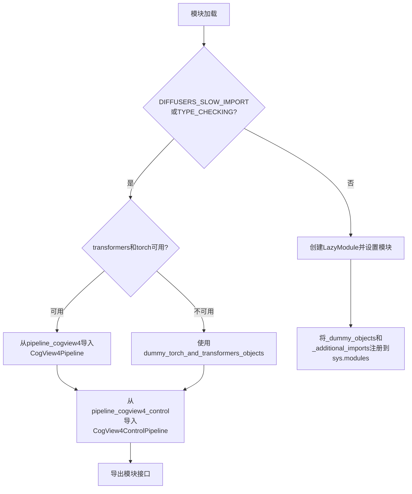
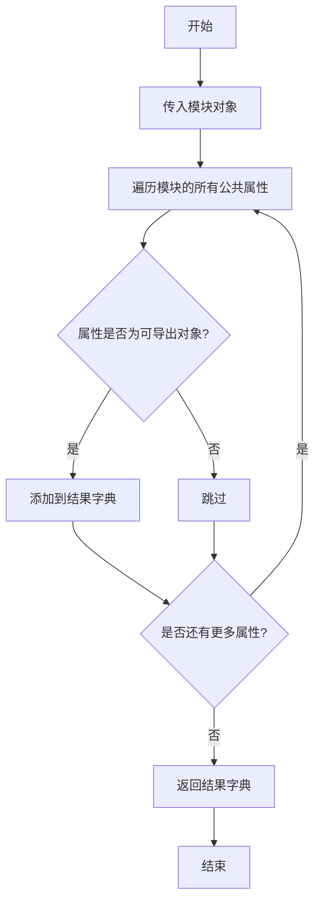
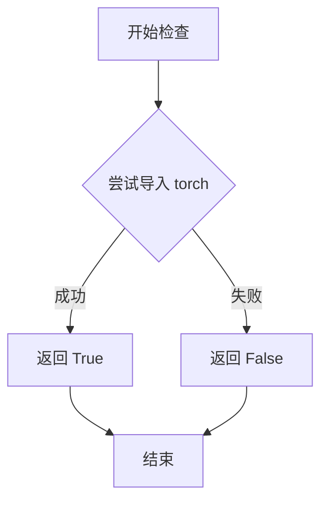
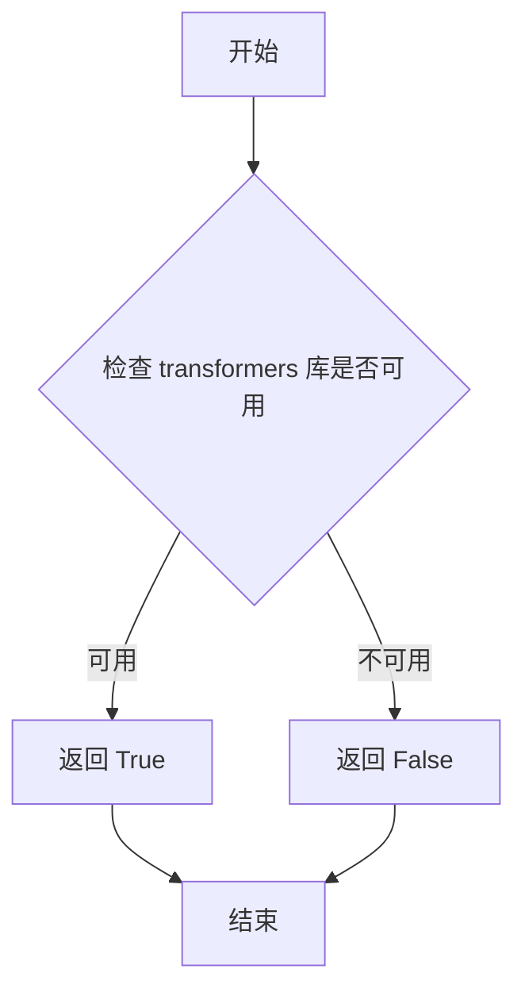
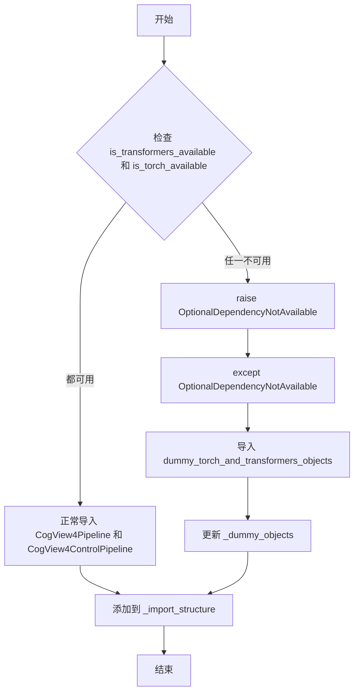

# `diffusers\src\diffusers\pipelines\cogview4\__init__.py` 详细设计文档

这是一个Diffusers库中CogView4系列模型的延迟导入初始化模块，通过条件加载机制动态管理CogView4Pipeline和CogView4ControlPipeline的导入，并根据torch和transformers依赖的可用性智能切换真实模块或虚拟对象，确保在不同环境下的兼容性。

## 整体流程



## 类结构

```
PipelineInitModule (本模块)
├── _LazyModule (延迟加载机制)
├── CogView4Pipeline (真实/虚拟)
├── CogView4ControlPipeline (真实/虚拟)
└── CogView4PlusPipelineOutput (始终可用)
```

## 全局变量及字段


### `_dummy_objects`
    
用于存储虚拟对象的字典，当可选依赖不可用时使用

类型：`dict`
    


### `_additional_imports`
    
用于存储额外导入的字典

类型：`dict`
    


### `_import_structure`
    
定义模块的导入结构，包含管道输出和管道类

类型：`dict`
    


### `DIFFUSERS_SLOW_IMPORT`
    
标志是否使用慢速导入模式的布尔值

类型：`bool`
    


### `_LazyModule.__name__`
    
模块的名称

类型：`str`
    


### `_LazyModule.__file__`
    
模块文件的路径

类型：`str`
    


### `_LazyModule._import_structure`
    
模块的导入结构定义

类型：`dict`
    


### `_LazyModule.__spec__`
    
模块的规格对象

类型：`ModuleSpec`
    
    

## 全局函数及方法


### `get_objects_from_module`

该函数是 Diffusioners 库中的一个工具函数，用于从指定模块中动态获取所有可导出对象（通常是类或函数），并返回一个字典，键为对象名称，值为对象本身。在代码中用于延迟加载机制，当某些可选依赖（如 torch 和 transformers）不可用时，从 dummy 模块中获取替代对象。

参数：

- `module`：`Module`，要从中提取对象的模块，代码中传入 `dummy_torch_and_transformers_objects`

返回值：`Dict[str, Any]`，返回包含模块中所有可导出对象的字典，键为对象名称，值为对象实例

#### 流程图



#### 带注释源码

```
# 从 utils 模块导入 get_objects_from_module 函数
# 该函数用于从模块中提取所有非下划线开头的对象
from ...utils import (
    DIFFUSERS_SLOW_IMPORT,
    OptionalDependencyNotAvailable,
    _LazyModule,
    get_objects_from_module,  # <-- 目标函数
    is_torch_available,
    is_transformers_available,
)

# 初始化空字典用于存储虚拟对象
_dummy_objects = {}

# 尝试检查可选依赖是否可用
try:
    if not (is_transformers_available() and is_torch_available()):
        raise OptionalDependencyNotAvailable()
except OptionalDependencyNotAvailable:
    # 如果依赖不可用，从 dummy 模块获取虚拟对象
    from ...utils import dummy_torch_and_transformers_objects
    
    # 调用 get_objects_from_module 提取 dummy 模块中的所有对象
    # 返回格式: {对象名: 对象}
    _dummy_objects.update(get_objects_from_module(dummy_torch_and_transformers_objects))
else:
    # 如果依赖可用，定义实际的导入结构
    _import_structure["pipeline_cogview4"] = ["CogView4Pipeline"]
    _import_structure["pipeline_cogview4_control"] = ["CogView4ControlPipeline"]

# ... 后续代码使用 _LazyModule 实现延迟加载 ...
```


### `is_torch_available`

检查当前环境中 PyTorch 库是否可用的函数，用于条件导入和依赖检查。

参数：

- 无参数

返回值：`bool`，如果 PyTorch 可用则返回 `True`，否则返回 `False`

#### 流程图



#### 带注释源码

```python
def is_torch_available():
    """
    检查 PyTorch 是否已在当前环境中安装并可用。
    
    该函数通常在 __init__.py 中用于条件导入，
    只有当 torch 可用时才导入相关的类和模块。
    
    Returns:
        bool: 如果 torch 可以被成功导入则返回 True，否则返回 False
    """
    try:
        import torch
        return True
    except ImportError:
        return False
```


### `is_transformers_available`

检查 `transformers` 库是否可用，用于条件导入和可选依赖处理。

参数：

- 无

返回值：`bool`，返回 `True` 表示 `transformers` 库已安装且可用，返回 `False` 表示不可用

#### 流程图



#### 带注释源码

```
# 注：is_transformers_available 函数并非在本文件中定义
# 而是从 ...utils 模块导入的 utility 函数
# 以下为该函数在当前代码中的典型使用方式

# 从上级目录的 utils 模块导入
from ...utils import is_transformers_available

# 使用示例（在 try-except 块中进行条件导入）
try:
    # 检查 transformers 和 torch 是否都可用
    if not (is_transformers_available() and is_torch_available()):
        raise OptionalDependencyNotAvailable()
except OptionalDependencyNotAvailable:
    # 如果任一依赖不可用，导入 dummy 对象作为后备
    from ...utils import dummy_torch_and_transformers_objects
    _dummy_objects.update(get_objects_from_module(dummy_torch_and_transformers_objects))
else:
    # 如果依赖可用，导入实际的 Pipeline 类
    _import_structure["pipeline_cogview4"] = ["CogView4Pipeline"]
    _import_structure["pipeline_cogview4_control"] = ["CogView4ControlPipeline"]
```

---

> **说明**：`is_transformers_available` 函数定义在 `...utils` 模块中，当前代码文件仅引用了该函数。该函数通常通过尝试导入 `transformers` 包并捕获 `ImportError` 来实现，返回布尔值表示依赖可用性。如需查看完整源码，请查阅 `diffusers` 库的 `utils` 模块实现。


### `OptionalDependencyNotAvailable`

描述：这是一个异常类，用于表示可选依赖项不可用。在代码中，当检测到必需的依赖项（如 `torch` 和 `transformers`）不可用时，会抛出此异常，以便程序能够优雅地处理缺失依赖的情况，并回退到替代实现（如虚拟对象）。

参数：

- 无参数（代码中使用 `raise OptionalDependencyNotAvailable()` 未传递任何参数）

返回值：不适用（异常类无返回值）

#### 流程图



#### 带注释源码

```python
# 从 utils 模块导入 OptionalDependencyNotAvailable
# 它是一个异常类，用于标记可选依赖项不可用的情况
from ...utils import OptionalDependencyNotAvailable

# 在代码中的使用方式：
try:
    # 检查必需的可选依赖项是否可用
    if not (is_transformers_available() and is_torch_available()):
        # 如果任一依赖不可用，抛出异常
        raise OptionalDependencyNotAvailable()
except OptionalDependencyNotAvailable:
    # 捕获异常，导入虚拟对象作为替代
    from ...utils import dummy_torch_and_transformers_objects  # noqa F403
    _dummy_objects.update(get_objects_from_module(dummy_torch_and_transformers_objects))
else:
    # 如果依赖可用，正常导入实际模块
    _import_structure["pipeline_cogview4"] = ["CogView4Pipeline"]
    _import_structure["pipeline_cogview4_control"] = ["CogView4ControlPipeline"]
```

## 关键组件


### Lazy Loading 机制

使用 `_LazyModule` 实现模块的惰性加载，允许在真正需要时才导入实际模块，提高导入速度和内存使用效率。

### Optional Dependency Handling 可选依赖处理

通过 `is_torch_available()` 和 `is_transformers_available()` 检查torch和transformers是否可用，使用 `OptionalDependencyNotAvailable` 异常处理依赖缺失情况。

### Import Structure 定义

定义 `_import_structure` 字典结构，明确模块的导出内容，包括 `CogView4Pipeline`、`CogView4ControlPipeline` 和 `CogView4PipelineOutput`。

### Dummy Objects 虚拟对象机制

当可选依赖不可用时，从 `dummy_torch_and_transformers_objects` 导入虚拟对象，确保代码在没有依赖的环境中也能正常导入而不报错。

### TYPE_CHECKING 条件导入

通过 `TYPE_CHECKING` 或 `DIFFUSERS_SLOW_IMPORT` 标志控制类型检查时的导入行为，实现运行时和类型检查时的不同导入逻辑。

### 模块动态注册

使用 `sys.modules[__name__]` 和 `setattr` 动态注册模块及虚拟对象到系统模块缓存中。


## 问题及建议


### 已知问题

-   **重复代码块**：检查 `is_transformers_available()` 和 `is_torch_available()` 的逻辑在 try-except 块中重复了两次（第14-19行和第25-30行），违反了 DRY 原则。
-   **未使用的变量**：`_additional_imports` 字典被初始化但从未被赋值或使用（第10行），属于冗余代码。
-   **通配符导入**：`from ...utils.dummy_torch_and_transformers_objects import *`（第30行）使用通配符导入，会污染命名空间，可能导入未明确需要的对象。
-   **缺乏文档**：整个模块缺少模块级文档字符串（docstring），无法快速了解模块职责。
-   **魔法字符串**：模块路径和导入结构字符串分散在代码中，缺乏统一管理。

### 优化建议

-   **抽取依赖检查逻辑**：将可选依赖检查封装为辅助函数或工具方法，避免代码重复。
-   **清理冗余变量**：移除未使用的 `_additional_imports` 字典，或在需要时再定义。
-   **显式替代通配符**：将 `import *` 改为显式导入特定对象，提高代码可读性和可维护性。
-   **添加文档字符串**：在模块顶部添加描述性文档，说明模块职责、依赖关系和导出内容。
-   **统一导入结构**：将 `_import_structure` 的定义集中管理，便于后续扩展和维护。

## 其它


### 设计目标与约束

该模块作为CogView4Pipeline的延迟加载入口文件，遵循diffusers库的模块化设计规范，支持可选依赖(torch、transformers)的动态导入，通过_LazyModule实现模块的惰性加载以优化导入性能。

### 错误处理与异常设计

使用OptionalDependencyNotAvailable异常处理可选依赖不可用的情况。当torch或transformers任一不可用时，导入dummy对象作为替代，确保模块在任何环境下都能被导入而不引发ImportError。

### 外部依赖与接口契约

本模块依赖以下外部包：torch、transformers、diffusers库的utils模块(_LazyModule、get_objects_from_module、OptionalDependencyNotAvailable等)。导出接口包括CogView4Pipeline和CogView4ControlPipeline两个类，以及CogView4PlusPipelineOutput。

### 模块初始化流程

模块首次导入时执行完整初始化，通过_LazyModule替换自身到sys.modules，后续访问子模块时触发延迟加载。TYPE_CHECKING或DIFFUSERS_SLOW_IMPORT为真时执行即时导入，否则使用延迟导入机制。

### 延迟加载机制

利用_LazyModule的惰性特性，将_import_structure中定义的子模块路径映射到实际实现，仅在用户访问特定属性时触发模块加载，减少主程序启动时的导入开销。

### 类型检查支持

通过TYPE_CHECKING条件分支，在类型检查器(如mypy)运行时导入真实类定义，而非dummy对象，确保静态类型检查的准确性。

    