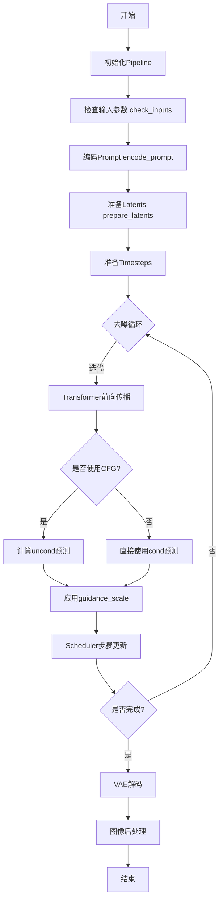
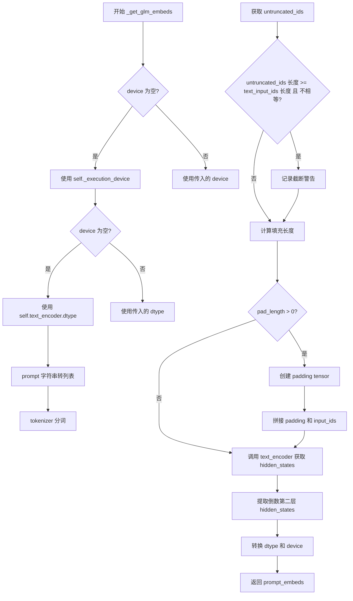
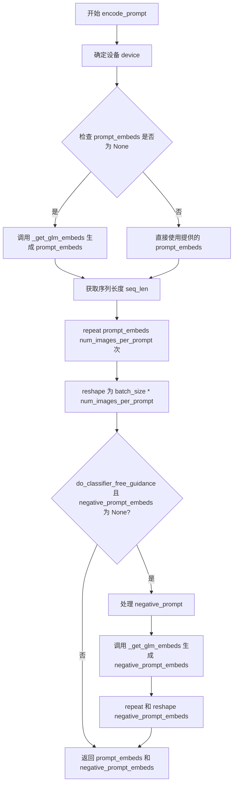
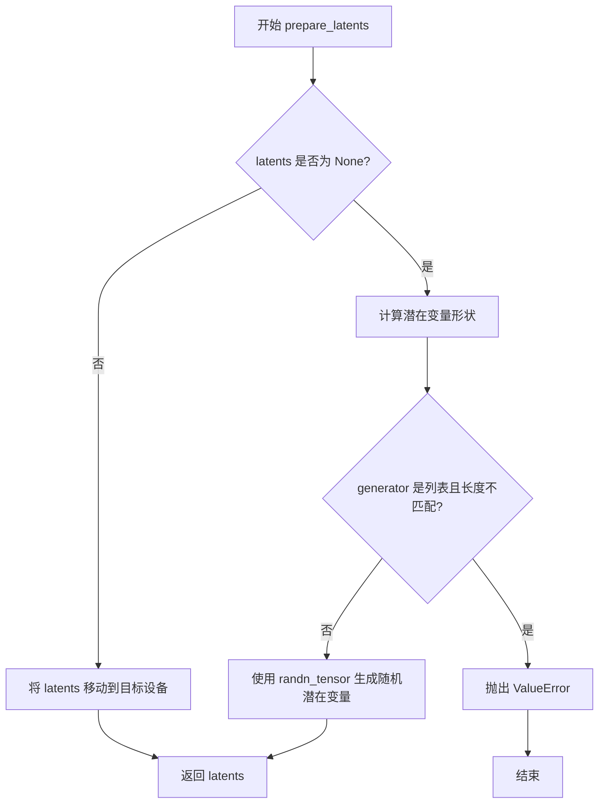
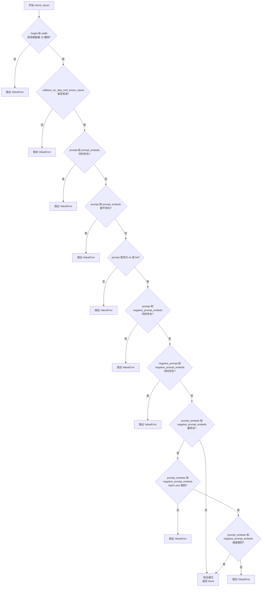
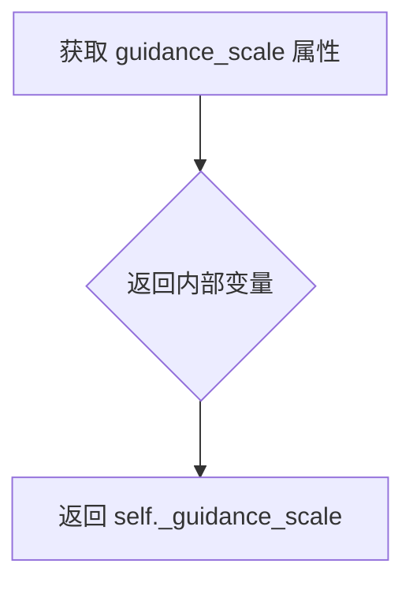
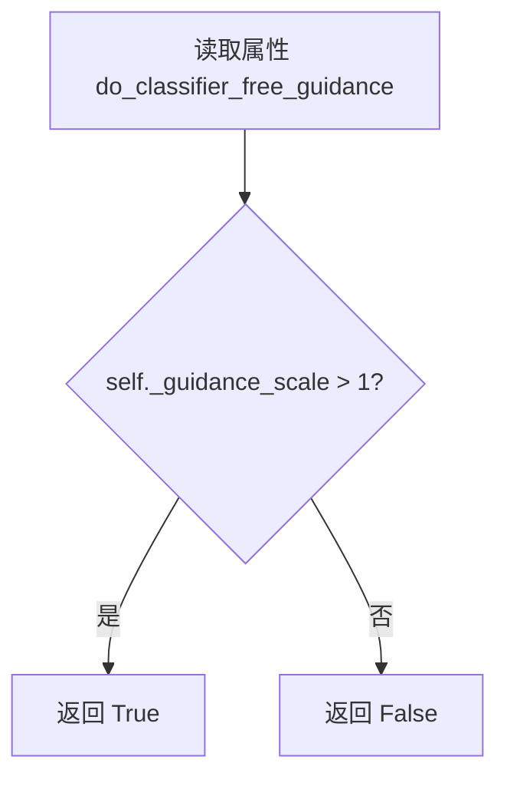
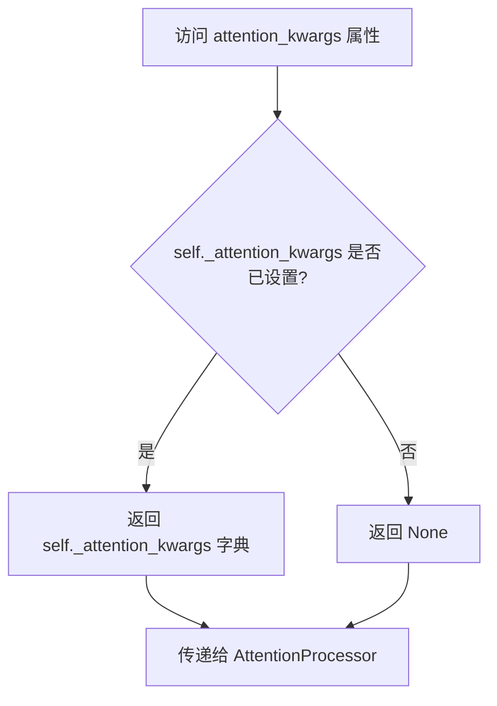
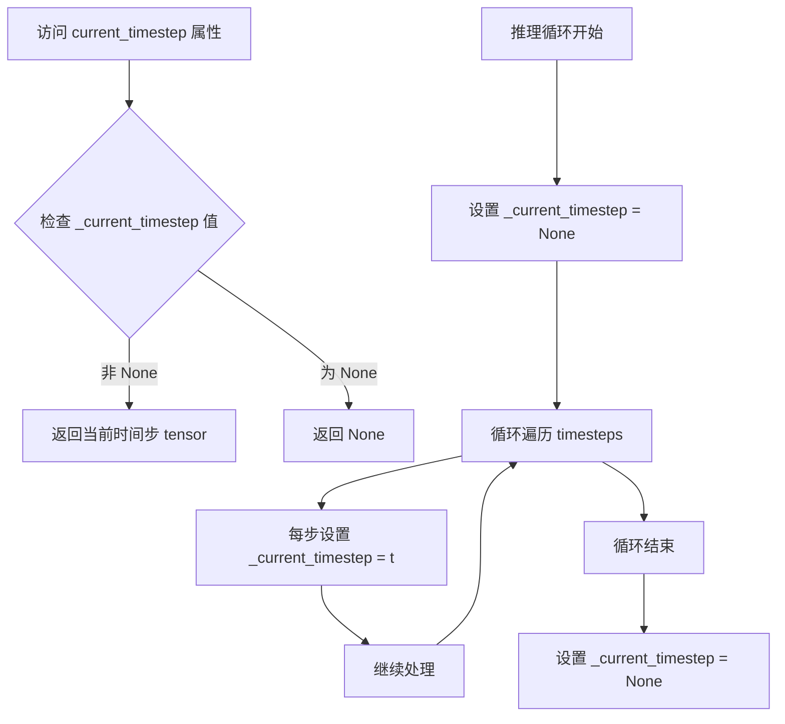
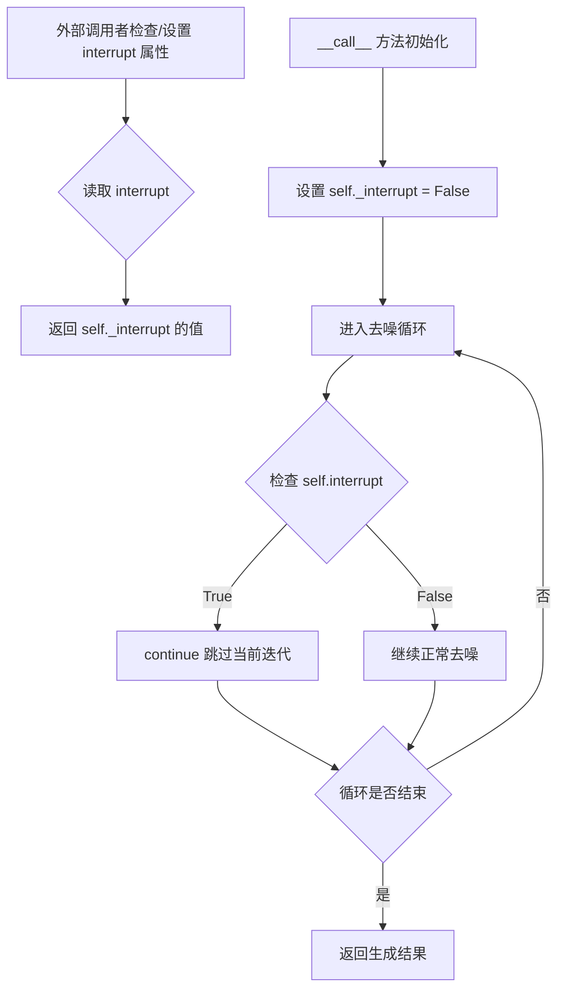

# `diffusers\src\diffusers\pipelines\cogview4\pipeline_cogview4.py` 详细设计文档

CogView4文本到图像生成Pipeline，继承自DiffusionPipeline，通过变分自编码器(VAE)和Transformer模型将文本提示编码为图像，支持分类器自由引导(CFG)和多种调度器，用于生成与文本描述相符的高质量图像。

## 整体流程



## 类结构

```
DiffusionPipeline (基类)
├── CogView4LoraLoaderMixin (Mixin)
└── CogView4Pipeline
```

## 全局变量及字段


### `logger`
    
模块级别的日志记录器，用于记录警告和信息

类型：`logging.Logger`
    


### `EXAMPLE_DOC_STRING`
    
示例文档字符串，包含使用CogView4Pipeline进行文本到图像生成的使用示例

类型：`str`
    


### `XLA_AVAILABLE`
    
指示是否支持PyTorch XLA（用于TPU加速）的布尔标志

类型：`bool`
    


### `calculate_shift`
    
根据图像序列长度计算mu shift参数的辅助函数，用于调整调度器

类型：`Callable[[int, int, float, float], float]`
    


### `retrieve_timesteps`
    
从调度器检索时间步的辅助函数，支持自定义时间步和sigma

类型：`Callable`
    


### `CogView4Pipeline.tokenizer`
    
预训练的分词器，用于将文本提示转换为token序列

类型：`AutoTokenizer`
    


### `CogView4Pipeline.text_encoder`
    
冻结的文本编码器模型（GLM-4-9b），用于将文本转换为嵌入向量

类型：`GlmModel`
    


### `CogView4Pipeline.vae`
    
变分自编码器模型，用于将图像编码到潜在空间并从潜在空间解码图像

类型：`AutoencoderKL`
    


### `CogView4Pipeline.transformer`
    
CogView4主变换器模型，用于在去噪过程中根据文本嵌入预测噪声

类型：`CogView4Transformer2DModel`
    


### `CogView4Pipeline.scheduler`
    
流匹配欧拉离散调度器，用于控制去噪过程的时间步进

类型：`FlowMatchEulerDiscreteScheduler`
    


### `CogView4Pipeline.vae_scale_factor`
    
VAE缩放因子，基于VAE块输出通道数计算，用于潜在空间和像素空间之间的转换

类型：`int`
    


### `CogView4Pipeline.image_processor`
    
图像后处理器，用于将VAE输出的潜在表示转换并后处理为最终图像

类型：`VaeImageProcessor`
    


### `CogView4Pipeline._optional_components`
    
可选组件列表，定义管道中可选的模块（当前为空）

类型：`list`
    


### `CogView4Pipeline.model_cpu_offload_seq`
    
模型CPU卸载顺序字符串，定义从文本编码器到变换器再到VAE的卸载序列

类型：`str`
    


### `CogView4Pipeline._callback_tensor_inputs`
    
回调张量输入列表，定义在推理步骤回调中可传递的张量名称

类型：`list`
    
    

## 全局函数及方法


### `calculate_shift`

该函数用于计算扩散模型调度器中的shift参数，根据图像序列长度与基准序列长度的比例，通过平方根缩放后进行线性插值，生成适合不同分辨率图像的去噪调度参数。

参数：

- `image_seq_len`：`int` 或 `float`，图像序列长度，即图像经VAE编码并分块后的序列token数量
- `base_seq_len`：`int`，基准序列长度，默认为256，用于归一化计算
- `base_shift`：`float`，基础shift值，默认为0.25，作为线性插值的下界
- `max_shift`：`float`，最大shift值，默认为0.75，用于控制调度器的最大偏移程度

返回值：`float`，计算得到的shift值（mu），用于传递给调度器的`set_timesteps`方法

#### 流程图

```mermaid
flowchart TD
    A[开始 calculate_shift] --> B[计算比例系数 m = sqrt(image_seq_len / base_seq_len)]
    B --> C[计算 mu = m * max_shift + base_shift]
    C --> D[返回 mu 值]
    
    style A fill:#f9f,stroke:#333
    style D fill:#9f9,stroke:#333
```

#### 带注释源码

```python
def calculate_shift(
    image_seq_len,              # 图像序列长度（输入）
    base_seq_len: int = 256,    # 基准序列长度，默认256
    base_shift: float = 0.25,   # 基础shift值，默认0.25
    max_shift: float = 0.75,    # 最大shift值，默认0.75
) -> float:
    """
    计算扩散模型调度器的shift参数。
    
    该函数根据图像序列长度动态计算适合的shift值，用于SDXL/CogView4等
    扩散模型的噪声调度器配置，使调度器能够适应不同分辨率的图像生成。
    
    计算公式：
        m = sqrt(image_seq_len / base_seq_len)
        mu = m * max_shift + base_shift
    
    Args:
        image_seq_len: 图像序列长度，由 (height // vae_scale_factor) * 
                      (width // vae_scale_factor) // (patch_size ** 2) 计算得出
        base_seq_len: 基准序列长度，用于归一化
        base_shift: 基础shift值，调度器shift的下界
        max_shift: 最大shift值，用于控制调度器的最大偏移
    
    Returns:
        float: 计算得到的mu值，用于调度器配置
    """
    # 计算比例系数m：对图像序列长度与基准序列长度的比值开平方根
    # 使用平方根可以使较大和较小的图像都能获得合理的shift值
    m = (image_seq_len / base_seq_len) ** 0.5
    
    # 计算最终的mu值：通过线性组合将比例系数映射到 [base_shift, base_shift + max_shift] 范围
    mu = m * max_shift + base_shift
    
    # 返回计算得到的shift值
    return mu
```


### `retrieve_timesteps`

该函数是 CogView4 .pipeline 中的时间步检索工具函数，用于调用调度器的 `set_timesteps` 方法并从中获取时间步序列。它支持自定义时间步（timesteps）和自定义 sigmas，能够根据不同的参数组合灵活配置扩散推理过程，并返回最终的时间步张量和推理步数。

参数：

- `scheduler`：`SchedulerMixin`，调度器对象，用于获取时间步序列
- `num_inference_steps`：`int | None`，扩散模型生成样本时使用的推理步数，如果使用此参数，则 `timesteps` 必须为 `None`
- `device`：`str | torch.device | None`，时间步应移动到的设备，如果为 `None` 则不移动
- `timesteps`：`list[int] | None`，用于覆盖调度器时间步间隔策略的自定义时间步，如果传入此参数，则 `num_inference_steps` 和 `sigmas` 必须为 `None`
- `sigmas`：`list[float] | None`，用于覆盖调度器时间步间隔策略的自定义 sigmas，如果传入此参数，则 `num_inference_steps` 和 `timesteps` 必须为 `None`
- `**kwargs`：任意关键字参数，将传递给 `scheduler.set_timesteps` 方法

返回值：`tuple[torch.Tensor, int]`，元组中第一个元素是来自调度器的时间步调度序列，第二个元素是推理步数

#### 流程图

```mermaid
flowchart TD
    A[开始: retrieve_timesteps] --> B{检查 scheduler.set_timesteps 支持情况}
    B --> C[获取方法签名中的 timesteps 参数支持情况]
    B --> D[获取方法签名中的 sigmas 参数支持情况]
    
    C --> E{timesteps 和 sigmas 都不为 None?}
    E -->|是| F{scheduler 支持 timesteps 或 sigmas?}
    F -->|否| G[抛出 ValueError: 当前调度器不支持自定义时间步或 sigma]
    F -->|是| H[调用 set_timesteps 设置 timesteps 和 sigmas]
    H --> I[获取 scheduler.timesteps]
    I --> J[计算 num_inference_steps = len(timesteps)]
    J --> K[返回 timesteps, num_inference_steps]
    
    E -->|否| L{timesteps 不为 None 且 sigmas 为 None?}
    L -->|是| M{scheduler 支持 timesteps?}
    M -->|否| N[抛出 ValueError: 当前调度器不支持自定义时间步]
    M -->|是| O[调用 set_timesteps 设置 timesteps]
    O --> I
    
    L -->|否| P{timesteps 为 None 且 sigmas 不为 None?}
    P -->|是| Q{scheduler 支持 sigmas?}
    Q -->|否| R[抛出 ValueError: 当前调度器不支持自定义 sigmas]
    Q -->|是| S[调用 set_timesteps 设置 sigmas]
    S --> I
    
    P -->|否| T[调用 set_timesteps 设置 num_inference_steps]
    T --> I
    
    K --> Z[结束]
    
    style G fill:#ffcccc
    style N fill:#ffcccc
    style R fill:#ffcccc
    style Z fill:#ccffcc
```

#### 带注释源码

```python
def retrieve_timesteps(
    scheduler,
    num_inference_steps: int | None = None,
    device: str | torch.device | None = None,
    timesteps: list[int] | None = None,
    sigmas: list[float] | None = None,
    **kwargs,
):
    r"""
    Calls the scheduler's `set_timesteps` method and retrieves timesteps from the scheduler after the call. Handles
    custom timesteps. Any kwargs will be supplied to `scheduler.set_timesteps`.

    Args:
        scheduler (`SchedulerMixin`):
            The scheduler to get timesteps from.
        num_inference_steps (`int`):
            The number of diffusion steps used when generating samples with a pre-trained model. If used, `timesteps`
            must be `None`.
        device (`str` or `torch.device`, *optional*):
            The device to which the timesteps should be moved to. If `None`, the timesteps are not moved.
        timesteps (`list[int]`, *optional*):
            Custom timesteps used to override the timestep spacing strategy of the scheduler. If `timesteps` is passed,
            `num_inference_steps` and `sigmas` must be `None`.
        sigmas (`list[float]`, *optional*):
            Custom sigmas used to override the timestep spacing strategy of the scheduler. If `sigmas` is passed,
            `num_inference_steps` and `timesteps` must be `None`.

    Returns:
        `tuple[torch.Tensor, int]`: A tuple where the first element is the timestep schedule from the scheduler and the
        second element is the number of inference steps.
    """
    # 使用 inspect 模块检查 scheduler.set_timesteps 方法的签名
    # 判断该方法是否支持 timesteps 参数
    accepts_timesteps = "timesteps" in set(inspect.signature(scheduler.set_timesteps).parameters.keys())
    # 判断该方法是否支持 sigmas 参数
    accepts_sigmas = "sigmas" in set(inspect.signature(scheduler.set_timesteps).parameters.keys())

    # 情况1: 同时提供了自定义 timesteps 和 sigmas
    if timesteps is not None and sigmas is not None:
        # 检查调度器是否支持自定义时间步或 sigma
        if not accepts_timesteps and not accepts_sigmas:
            raise ValueError(
                f"The current scheduler class {scheduler.__class__}'s `set_timesteps` does not support custom"
                f" timestep or sigma schedules. Please check whether you are using the correct scheduler."
            )
        # 调用 set_timesteps 同时设置 timesteps 和 sigmas，并传递 device 和其他 kwargs
        scheduler.set_timesteps(timesteps=timesteps, sigmas=sigmas, device=device, **kwargs)
        # 从调度器获取生成的时间步序列
        timesteps = scheduler.timesteps
        # 推理步数等于时间步序列的长度
        num_inference_steps = len(timesteps)
    # 情况2: 只提供了自定义 timesteps
    elif timesteps is not None and sigmas is None:
        # 检查调度器是否支持自定义时间步
        if not accepts_timesteps:
            raise ValueError(
                f"The current scheduler class {scheduler.__class__}'s `set_timesteps` does not support custom"
                f" timestep schedules. Please check whether you are using the correct scheduler."
            )
        # 调用 set_timesteps 设置 timesteps，并传递 device 和其他 kwargs
        scheduler.set_timesteps(timesteps=timesteps, device=device, **kwargs)
        # 从调度器获取生成的时间步序列
        timesteps = scheduler.timesteps
        # 计算推理步数
        num_inference_steps = len(timesteps)
    # 情况3: 只提供了自定义 sigmas
    elif timesteps is None and sigmas is not None:
        # 检查调度器是否支持自定义 sigmas
        if not accepts_sigmas:
            raise ValueError(
                f"The current scheduler class {scheduler.__class__}'s `set_timesteps` does not support custom"
                f" sigmas schedules. Please check whether you are using the correct scheduler."
            )
        # 调用 set_timesteps 设置 sigmas，并传递 device 和其他 kwargs
        scheduler.set_timesteps(sigmas=sigmas, device=device, **kwargs)
        # 从调度器获取生成的时间步序列
        timesteps = scheduler.timesteps
        # 计算推理步数
        num_inference_steps = len(timesteps)
    # 情况4: 既没有提供 timesteps 也没有提供 sigmas，使用默认行为
    else:
        # 调用 set_timesteps 只设置 num_inference_steps，并传递 device 和其他 kwargs
        scheduler.set_timesteps(num_inference_steps, device=device, **kwargs)
        # 从调度器获取生成的时间步序列
        timesteps = scheduler.timesteps
    
    # 返回时间步序列和推理步数
    return timesteps, num_inference_steps
```


### `CogView4Pipeline.__init__`

该方法是 `CogView4Pipeline` 类的构造函数，负责初始化文本到图像生成管道的所有核心组件。它接收 tokenizer、text_encoder、vae、transformer 和 scheduler 五个必要的模型组件，通过父类 `DiffusionPipeline` 的注册机制将这些模块注册到管道中，并基于 VAE 的配置计算图像缩放因子，同时初始化图像后处理器。

参数：

- `self`：隐式参数，管道实例本身
- `tokenizer`：`AutoTokenizer`，用于将文本 prompt 转换为 token 序列的分词器
- `text_encoder`：`GlmModel`，冻结的文本编码器 CogView4 使用 glm-4-9b-hf
- `vae`：`AutoencoderKL`，变分自编码器模型，用于将图像编码和解码为潜在表示
- `transformer`：`CogView4Transformer2DModel`，文本条件的 CogView4Transformer2DModel，用于对编码的图像潜在表示进行去噪
- `scheduler`：`FlowMatchEulerDiscreteScheduler`，与 transformer 结合使用以对编码的图像潜在表示进行去噪的调度器

返回值：`None`，该方法为初始化方法，不返回任何值，仅初始化实例属性

#### 流程图

```mermaid
flowchart TD
    A[开始 __init__] --> B[调用 super().__init__ 初始化基础管道]
    B --> C[调用 register_modules 注册 tokenizer text_encoder vae transformer scheduler]
    C --> D[计算 vae_scale_factor: 2 ** len(vae.config.block_out_channels - 1)]
    D --> E[初始化 VaeImageProcessor 并赋值给 self.image_processor]
    E --> F[结束 __init__]
```

#### 带注释源码

```python
def __init__(
    self,
    tokenizer: AutoTokenizer,
    text_encoder: GlmModel,
    vae: AutoencoderKL,
    transformer: CogView4Transformer2DModel,
    scheduler: FlowMatchEulerDiscreteScheduler,
):
    """
    初始化 CogView4Pipeline 管道实例
    
    参数:
        tokenizer: 用于文本编码的分词器
        text_encoder: 冻结的文本编码器模型 (GLM)
        vae: 变分自编码器模型
        transformer: CogView4 主变换器模型
        scheduler: 扩散调度器
    """
    # 调用父类 DiffusionPipeline 的初始化方法
    # 设置管道的基本属性和配置
    super().__init__()

    # 使用 register_modules 方法将所有模型组件注册到管道中
    # 这样管道就可以统一管理这些模型的加载、保存和设备转移
    self.register_modules(
        tokenizer=tokenizer, 
        text_encoder=text_encoder, 
        vae=vae, 
        transformer=transformer, 
        scheduler=scheduler
    )
    
    # 计算 VAE 缩放因子
    # 基于 VAE 的 block_out_channels 配置计算下采样倍数
    # 公式: 2^(len(block_out_channels) - 1)
    # 如果 VAE 不存在则默认为 8
    self.vae_scale_factor = 2 ** (len(self.vae.config.block_out_channels) - 1) if getattr(self, "vae", None) else 8
    
    # 初始化图像处理器
    # 用于将 VAE 输出的潜在表示转换为最终图像
    # 并处理图像的后处理操作（如归一化、格式转换等）
    self.image_processor = VaeImageProcessor(vae_scale_factor=self.vae_scale_factor)
```


### `CogView4Pipeline._get_glm_embeds`

该方法负责将文本提示（prompt）转换为 GLM 文本编码器的隐藏状态嵌入向量。它首先对输入进行分词和填充处理，然后调用文本编码器模型生成嵌入表示。

参数：

- `self`：`CogView4Pipeline` 实例本身
- `prompt`：`str | list[str]`，要编码的文本提示，可以是单个字符串或字符串列表
- `max_sequence_length`：`int = 1024`，最大序列长度，默认为 1024 个 token
- `device`：`torch.device | None`，指定计算设备，默认为 None（使用执行设备）
- `dtype`：`torch.dtype | None`，指定数据类型，默认为 None（使用文本编码器的 dtype）

返回值：`torch.Tensor`，文本嵌入向量，形状为 `(batch_size, seq_len, hidden_dim)`

#### 流程图



#### 带注释源码

```python
def _get_glm_embeds(
    self,
    prompt: str | list[str] = None,
    max_sequence_length: int = 1024,
    device: torch.device | None = None,
    dtype: torch.dtype | None = None,
):
    """
    将文本 prompt 编码为 GLM 模型的嵌入向量
    
    参数:
        prompt: 输入文本，可以是单字符串或字符串列表
        max_sequence_length: 最大序列长度
        device: 计算设备
        dtype: 数据类型
    
    返回:
        prompt_embeds: 编码后的文本嵌入向量
    """
    # 确定设备：优先使用传入的 device，否则使用 pipeline 的执行设备
    device = device or self._execution_device
    # 确定数据类型：优先使用传入的 dtype，否则使用文本编码器的 dtype
    dtype = dtype or self.text_encoder.dtype

    # 统一将 prompt 转为列表格式，便于批处理
    prompt = [prompt] if isinstance(prompt, str) else prompt

    # 使用 tokenizer 对 prompt 进行分词
    # padding="longest": 使用批次中最长序列的长度进行填充
    # max_length: 设置最大序列长度
    # truncation: 超过最大长度进行截断
    # add_special_tokens: 添加特殊 token（如 [CLS], [SEP] 等）
    # return_tensors="pt": 返回 PyTorch 张量
    text_inputs = self.tokenizer(
        prompt,
        padding="longest",  # not use max length
        max_length=max_sequence_length,
        truncation=True,
        add_special_tokens=True,
        return_tensors="pt",
    )
    text_input_ids = text_inputs.input_ids
    
    # 获取未截断的 token ids，用于检测是否发生了截断
    untruncated_ids = self.tokenizer(prompt, padding="longest", return_tensors="pt").input_ids
    
    # 检查是否发生了截断，如果是则记录警告信息
    if untruncated_ids.shape[-1] >= text_input_ids.shape[-1] and not torch.equal(text_input_ids, untruncated_ids):
        # 解码被截断的部分
        removed_text = self.tokenizer.batch_decode(untruncated_ids[:, max_sequence_length - 1 : -1])
        logger.warning(
            "The following part of your input was truncated because `max_sequence_length` is set to "
            f" {max_sequence_length} tokens: {removed_text}"
        )
    
    # 计算当前序列长度和需要填充的长度
    # 填充到 16 的倍数，可能是为了满足模型的并行计算要求
    current_length = text_input_ids.shape[1]
    pad_length = (16 - (current_length % 16)) % 16
    
    # 如果需要填充，则在序列前面添加 padding token
    if pad_length > 0:
        pad_ids = torch.full(
            (text_input_ids.shape[0], pad_length),
            fill_value=self.tokenizer.pad_token_id,
            dtype=text_input_ids.dtype,
            device=text_input_ids.device,
        )
        # 在序列前面拼接 padding
        text_input_ids = torch.cat([pad_ids, text_input_ids], dim=1)
    
    # 调用 GLM 文本编码器获取隐藏状态
    # output_hidden_states=True: 返回所有层的隐藏状态
    # hidden_states[-2]: 取倒数第二层（通常是最后一层之前的层）
    prompt_embeds = self.text_encoder(text_input_ids.to(device), output_hidden_states=True).hidden_states[-2]

    # 将嵌入向量转换到指定的 dtype 和 device
    prompt_embeds = prompt_embeds.to(dtype=dtype, device=device)
    return prompt_embeds
```


### `CogView4Pipeline.encode_prompt`

该方法用于将文本提示（prompt）编码为文本编码器的隐藏状态（hidden states），为后续的图像生成提供文本特征表示。支持 classifier-free guidance（无分类器自由引导）技术，可以同时处理正向提示和负向提示，并支持批量生成多张图像。

参数：

- `self`：`CogView4Pipeline` 实例本身
- `prompt`：`str | list[str]`，要编码的文本提示，可以是单个字符串或字符串列表
- `negative_prompt`：`str | list[str] | None`，可选，用于引导图像生成的负向提示，如果不使用 guidance 则可忽略
- `do_classifier_free_guidance`：`bool`，是否启用 classifier-free guidance，默认为 True
- `num_images_per_prompt`：`int`，每个提示生成的图像数量，默认为 1
- `prompt_embeds`：`torch.Tensor | None`，可选，预生成的文本嵌入，如果提供则直接使用而不从 prompt 生成
- `negative_prompt_embeds`：`torch.Tensor | None`，可选，预生成的负向文本嵌入
- `device`：`torch.device | None`，可选，指定计算设备，默认为执行设备
- `dtype`：`torch.dtype | None`，可选，指定数据类型
- `max_sequence_length`：`int`，编码提示的最大序列长度，默认为 1024

返回值：`tuple[torch.Tensor, torch.Tensor]`，返回两个张量：第一个是编码后的 prompt embeddings，第二个是编码后的 negative prompt embeddings（如果没有提供或未启用 guidance 则为 None）

#### 流程图



#### 带注释源码

```python
def encode_prompt(
    self,
    prompt: str | list[str],
    negative_prompt: str | list[str] | None = None,
    do_classifier_free_guidance: bool = True,
    num_images_per_prompt: int = 1,
    prompt_embeds: torch.Tensor | None = None,
    negative_prompt_embeds: torch.Tensor | None = None,
    device: torch.device | None = None,
    dtype: torch.dtype | None = None,
    max_sequence_length: int = 1024,
):
    r"""
    Encodes the prompt into text encoder hidden states.

    Args:
        prompt (`str` or `list[str]`, *optional*):
            prompt to be encoded
        negative_prompt (`str` or `list[str]`, *optional*):
            The prompt or prompts not to guide the image generation. If not defined, one has to pass
            `negative_prompt_embeds` instead. Ignored when not using guidance (i.e., ignored if `guidance_scale` is
            less than `1`).
        do_classifier_free_guidance (`bool`, *optional*, defaults to `True`):
            Whether to use classifier free guidance or not.
        num_images_per_prompt (`int`, *optional*, defaults to 1):
            Number of images that should be generated per prompt. torch device to place the resulting embeddings on
        prompt_embeds (`torch.Tensor`, *optional*):
            Pre-generated text embeddings. Can be used to easily tweak text inputs, *e.g.* prompt weighting. If not
            provided, text embeddings will be generated from `prompt` input argument.
        negative_prompt_embeds (`torch.Tensor`, *optional*):
            Pre-generated negative text embeddings. Can be used to easily tweak text inputs, *e.g.* prompt
            weighting. If not provided, negative_prompt_embeds will be generated from `negative_prompt` input
            argument.
        device: (`torch.device`, *optional*):
            torch device
        dtype: (`torch.dtype`, *optional*):
            torch dtype
        max_sequence_length (`int`, defaults to `1024`):
            Maximum sequence length in encoded prompt. Can be set to other values but may lead to poorer results.
    """
    # 确定设备，如果未指定则使用执行设备
    device = device or self._execution_device

    # 将单个字符串转换为列表，统一处理方式
    prompt = [prompt] if isinstance(prompt, str) else prompt
    
    # 确定批处理大小：如果有 prompt 则使用其长度，否则使用 prompt_embeds 的批次大小
    if prompt is not None:
        batch_size = len(prompt)
    else:
        batch_size = prompt_embeds.shape[0]

    # 如果未提供 prompt_embeds，则调用内部方法 _get_glm_embeds 生成
    if prompt_embeds is None:
        prompt_embeds = self._get_glm_embeds(prompt, max_sequence_length, device, dtype)

    # 获取序列长度
    seq_len = prompt_embeds.size(1)
    
    # 扩展 prompt_embeds 以支持每个 prompt 生成多个图像
    # repeat(1, num_images_per_prompt, 1) 在序列维度重复
    prompt_embeds = prompt_embeds.repeat(1, num_images_per_prompt, 1)
    # reshape 为 (batch_size * num_images_per_prompt, seq_len, hidden_dim)
    prompt_embeds = prompt_embeds.view(batch_size * num_images_per_prompt, seq_len, -1)

    # 处理 classifier-free guidance
    if do_classifier_free_guidance and negative_prompt_embeds is None:
        # 如果未提供 negative_prompt，则使用空字符串
        negative_prompt = negative_prompt or ""
        
        # 将 negative_prompt 扩展为与 prompt 相同的批处理大小
        negative_prompt = batch_size * [negative_prompt] if isinstance(negative_prompt, str) else negative_prompt

        # 类型检查：negative_prompt 应与 prompt 类型一致
        if prompt is not None and type(prompt) is not type(negative_prompt):
            raise TypeError(
                f"`negative_prompt` should be the same type to `prompt`, but got {type(negative_prompt)} !="
                f" {type(prompt)}."
            )
        # 批处理大小检查
        elif batch_size != len(negative_prompt):
            raise ValueError(
                f"`negative_prompt`: {negative_prompt} has batch size {len(negative_prompt)}, but `prompt`:"
                f" {prompt} has batch size {batch_size}. Please make sure that passed `negative_prompt` matches"
                " the batch size of `prompt`."
            )

        # 生成 negative_prompt_embeds
        negative_prompt_embeds = self._get_glm_embeds(negative_prompt, max_sequence_length, device, dtype)

        # 同样扩展 negative_prompt_embeds
        seq_len = negative_prompt_embeds.size(1)
        negative_prompt_embeds = negative_prompt_embeds.repeat(1, num_images_per_prompt, 1)
        negative_prompt_embeds = negative_prompt_embeds.view(batch_size * num_images_per_prompt, seq_len, -1)

    # 返回处理后的 embeddings
    return prompt_embeds, negative_prompt_embeds
```


### `CogView4Pipeline.prepare_latents`

该方法负责为 CogView4 文本到图像生成管道准备初始潜在变量（latents）。如果调用者已提供了潜在变量，则将其移动到目标设备；否则根据指定的批次大小、通道数、图像尺寸和数据类型随机生成新的潜在变量。

参数：

- `batch_size`：`int`，批次大小，指定要生成的图像数量
- `num_channels_latents`：`int`，潜在变量的通道数，对应于 Transformer 模型的输入通道数
- `height`：`int`，目标图像的高度（像素），用于计算潜在变量的空间维度
- `width`：`int`，目标图像的宽度（像素），用于计算潜在变量的空间维度
- `dtype`：`torch.dtype`，生成的潜在变量的数据类型
- `device`：`torch.device`，生成潜在变量所在的设备
- `generator`：`torch.Generator | list[torch.Generator] | None`，用于确保可重复生成的随机数生成器，可以是单个或多个生成器列表
- `latents`：`torch.Tensor | None`，可选的预生成潜在变量，如果为 None 则随机生成

返回值：`torch.Tensor`，准备好用于去噪过程的潜在变量张量，形状为 (batch_size, num_channels_latents, height // vae_scale_factor, width // vae_scale_factor)

#### 流程图



#### 带注释源码

```python
def prepare_latents(
    self,
    batch_size: int,                          # 批次大小
    num_channels_latents: int,                 # 潜在变量的通道数
    height: int,                               # 图像高度（像素）
    width: int,                                # 图像宽度（像素）
    dtype: torch.dtype,                        # 潜在变量的数据类型
    device: torch.device,                      # 设备
    generator: torch.Generator | list[torch.Generator] | None,  # 随机生成器
    latents: torch.Tensor | None = None,       # 可选的预生成潜在变量
) -> torch.Tensor:
    """
    准备用于去噪过程的潜在变量。
    
    如果提供了 latents 参数，则将其移动到指定设备；
    否则根据形状和数据类型随机生成新的潜在变量。
    """
    # 如果已经提供了潜在变量，直接返回（移动到目标设备）
    if latents is not None:
        return latents.to(device)

    # 计算潜在变量的形状
    # 空间维度需要除以 vae_scale_factor（VAE 的下采样因子）
    shape = (
        batch_size,
        num_channels_latents,
        int(height) // self.vae_scale_factor,
        int(width) // self.vae_scale_factor,
    )

    # 验证生成器列表长度与批次大小是否匹配
    if isinstance(generator, list) and len(generator) != batch_size:
        raise ValueError(
            f"You have passed a list of generators of length {len(generator)}, but requested an effective batch"
            f" size of {batch_size}. Make sure the batch size matches the length of the generators."
        )

    # 使用 randn_tensor 生成随机潜在变量（符合正态分布）
    latents = randn_tensor(shape, generator=generator, device=device, dtype=dtype)
    
    return latents
```


### CogView4Pipeline.check_inputs

该方法用于验证文本生成图像管道的输入参数是否合法，包括检查高度和宽度的像素限制、回调张量输入的有效性、提示词与嵌入的互斥性，以及提示词与负提示词嵌入的一致性。

参数：

- `self`：`CogView4Pipeline` 实例本身
- `prompt`：`str | list[str] | None`，用户输入的文本提示词，用于指导图像生成
- `height`：`int`，生成图像的高度（像素），必须能被 16 整除
- `width`：`int`，生成图像的宽度（像素），必须能被 16 整除
- `negative_prompt`：`str | list[str] | None`，不参与指导图像生成的负向提示词
- `callback_on_step_end_tensor_inputs`：`list[str] | None`，在每个去噪步骤结束时需要传递的张量输入列表
- `prompt_embeds`：`torch.FloatTensor | None`，预生成的文本嵌入向量，与 prompt 互斥
- `negative_prompt_embeds`：`torch.FloatTensor | None`，预生成的负向文本嵌入向量，与 negative_prompt 互斥

返回值：`None`，该方法仅进行参数验证，不返回任何值，若验证失败则抛出 ValueError

#### 流程图



#### 带注释源码

```python
def check_inputs(
    self,
    prompt,
    height,
    width,
    negative_prompt,
    callback_on_step_end_tensor_inputs,
    prompt_embeds=None,
    negative_prompt_embeds=None,
):
    """
    验证管道输入参数的合法性，确保所有必需参数正确传递且参数之间无冲突。
    该方法会在 __call__ 方法开始时被调用，用于在生成前进行参数校验。
    
    参数:
        prompt: 用户提供的文本提示词，可以是单个字符串或字符串列表
        height: 生成图像的高度，必须为 16 的倍数
        width: 生成图像的宽度，必须为 16 的倍数
        negative_prompt: 可选的负向提示词，用于引导模型避免生成某些内容
        callback_on_step_end_tensor_inputs: 回调函数可访问的张量输入列表
        prompt_embeds: 预计算的文本嵌入，与 prompt 互斥
        negative_prompt_embeds: 预计算的负向文本嵌入，与 negative_prompt 互斥
    
    异常:
        ValueError: 当任一参数不满足要求时抛出
    """
    # 检查高度和宽度是否为 16 的倍数，这是 VAE 和 Transformer 的要求
    if height % 16 != 0 or width % 16 != 0:
        raise ValueError(f"`height` and `width` have to be divisible by 16 but are {height} and {width}.")

    # 验证回调张量输入是否在允许的列表中
    if callback_on_step_end_tensor_inputs is not None and not all(
        k in self._callback_tensor_inputs for k in callback_on_step_end_tensor_inputs
    ):
        raise ValueError(
            f"`callback_on_step_end_tensor_inputs` has to be in {self._callback_tensor_inputs}, but found {[k for k in callback_on_step_end_tensor_inputs if k not in self._callback_tensor_inputs]}"
        )
    
    # 确保 prompt 和 prompt_embeds 不同时提供，两者功能相同只能选其一
    if prompt is not None and prompt_embeds is not None:
        raise ValueError(
            f"Cannot forward both `prompt`: {prompt} and `prompt_embeds`: {prompt_embeds}. Please make sure to"
            " only forward one of the two."
        )
    # 确保至少提供 prompt 或 prompt_embeds 之一
    elif prompt is None and prompt_embeds is None:
        raise ValueError(
            "Provide either `prompt` or `prompt_embeds`. Cannot leave both `prompt` and `prompt_embeds` undefined."
        )
    # 验证 prompt 的类型必须是字符串或列表
    elif prompt is not None and (not isinstance(prompt, str) and not isinstance(prompt, list)):
        raise ValueError(f"`prompt` has to be of type `str` or `list` but is {type(prompt)}")

    # 确保 prompt 和 negative_prompt_embeds 不同时提供
    if prompt is not None and negative_prompt_embeds is not None:
        raise ValueError(
            f"Cannot forward both `prompt`: {prompt} and `negative_prompt_embeds`:"
            f" {negative_prompt_embeds}. Please make sure to only forward one of the two."
        )

    # 确保 negative_prompt 和 negative_prompt_embeds 不同时提供
    if negative_prompt is not None and negative_prompt_embeds is not None:
        raise ValueError(
            f"Cannot forward both `negative_prompt`: {negative_prompt} and `negative_prompt_embeds`:"
            f" {negative_prompt_embeds}. Please make sure to only forward one of the two."
        )

    # 如果同时提供了 prompt_embeds 和 negative_prompt_embeds，验证它们的批次大小是否一致
    if prompt_embeds is not None and negative_prompt_embeds is not None:
        if prompt_embeds.shape[0] != negative_prompt_embeds.shape[0]:
            raise ValueError(
                "`prompt_embeds` and `negative_prompt_embeds` must have the same batch size when passed directly, but"
                f" got: `prompt_embeds` {prompt_embeds.shape} and `negative_prompt_embeds`"
                f" {negative_prompt_embeds.shape}."
            )
        # 验证它们的维度（最后一个维度）是否一致
        if prompt_embeds.shape[-1] != negative_prompt_embeds.shape[-1]:
            raise ValueError(
                "`prompt_embeds` and `negative_prompt_embeds` must have the same dimension when passed directly, but"
                f" got: `prompt_embeds` {prompt_embeds.shape} and `negative_prompt_embeds`"
                f" {negative_prompt_embeds.shape}."
            )
```


### `CogView4Pipeline.guidance_scale`

该属性是一个只读的 getter 方法，用于获取当前管道的 guidance_scale 值，该值控制分类器自由引导（Classifier-Free Guidance）的强度，值越大生成的图像与文本提示的相关性越高，但可能牺牲图像质量。

参数：无（属性不接收参数）

返回值：`float`，返回当前的 guidance_scale 数值，用于控制文本引导强度

#### 流程图



#### 带注释源码

```python
@property
def guidance_scale(self):
    """
    属性 getter: 获取当前的 guidance_scale 值
    
    guidance_scale 控制分类器自由引导的权重，参考 Imagen 论文中的方程 (2)。
    guidance_scale = 1 表示不使用分类器自由引导。
    该值通常在调用 __call__ 方法时通过参数传入并存储在 self._guidance_scale 中。
    
    Returns:
        float: 当前的 guidance_scale 值，用于控制文本提示对图像生成的影响程度
    """
    return self._guidance_scale
```


### `CogView4Pipeline.do_classifier_free_guidance`

该属性是一个只读属性，用于判断当前是否启用无分类器自由引导（Classifier-Free Guidance, CFG）机制。它通过比较内部存储的 `_guidance_scale` 与 1 的大小关系来返回布尔值，当 guidance_scale 大于 1 时表示启用 CFG 引导。

参数：此属性无参数

返回值：`bool`，返回是否启用无分类器自由引导。返回 `True` 表示启用 CFG（guidance_scale > 1），返回 `False` 表示不启用 CFG（guidance_scale <= 1）

#### 流程图



#### 带注释源码

```python
@property
def do_classifier_free_guidance(self):
    """
    属性：判断是否启用无分类器自由引导（Classifier-Free Guidance）

    该属性通过检查 guidance_scale 是否大于 1 来确定是否启用 CFG。
    在扩散模型的推理过程中，CFG 是一种常用的技术，通过同时考虑
    条件生成（prompt）和无条件生成（negative prompt）的预测结果，
    来提高生成图像与文本提示的一致性。

    当 guidance_scale > 1 时：
    - 在 denoising loop 中会执行两次 transformer 前向传播
    - 一次使用 prompt_embeds（条件生成）
    - 一次使用 negative_prompt_embeds（无条件生成）
    - 最终噪声预测 = noise_pred_uncond + guidance_scale * (noise_pred_cond - noise_pred_uncond)

    当 guidance_scale <= 1 时：
    - 只执行一次 transformer 前向传播（使用 prompt_embeds）
    - 等同于不使用 CFG 引导

    Returns:
        bool: 如果 guidance_scale > 1 返回 True，否则返回 False
    """
    return self._guidance_scale > 1
```


### `CogView4Pipeline.num_timesteps`

这是一个只读属性（property），用于获取推理过程中的时间步（timesteps）数量。该属性在调用 `__call__` 方法生成图像时自动设置，存储了实际使用的时间步总数。

参数：无（属性访问器不接受显式参数）

返回值：`int`，返回推理过程中使用的时间步总数。

#### 流程图

```mermaid
flowchart TD
    A[访问 num_timesteps 属性] --> B{属性是否存在}
    B -->|是| C[返回 self._num_timesteps]
    B -->|否| D[返回 None 或引发 AttributeError]
    
    C --> E[获取推理时间步数量]
    
    F[Pipeline.__call__ 执行] --> G[设置 self._num_timesteps = len(timesteps)]
    G --> E
```

#### 带注释源码

```python
@property
def num_timesteps(self):
    """
    只读属性，返回推理过程中使用的时间步数量。
    
    该属性在 pipeline 的 __call__ 方法中被赋值。当调用 pipeline 生成图像时，
    会根据 num_inference_steps 参数和调度器计算实际的时间步序列，并将其长度
    存储在 _num_timesteps 属性中。
    
    Returns:
        int: 推理过程中使用的时间步总数。通常等于 num_inference_steps，
            除非使用了自定义的时间步或调度器进行了调整。
    """
    return self._num_timesteps
```

#### 相关上下文信息

**赋值位置**（在 `__call__` 方法中）：

```python
# 在 __call__ 方法中，时间步数量在准备完时间步后被设置
timesteps, num_inference_steps = retrieve_timesteps(
    self.scheduler, num_inference_steps, timestep_device, timesteps, sigmas, mu=mu
)
self._num_timesteps = len(timesteps)  # 设置时间步数量
```

**使用场景**：

- 在进度条显示中计算预热步骤数：`num_warmup_steps = max(len(timesteps) - num_inference_steps * self.scheduler.order, 0)`
- 用户可能需要查询已执行的推理步骤数量用于监控或调试


### `CogView4Pipeline.attention_kwargs`

该属性是一个只读属性，用于返回在管道调用过程中设置的注意力机制参数字典（attention_kwargs）。该字典会被传递给 `AttentionProcessor` 以控制注意力机制的行为。

参数：无（该属性不接受任何参数，仅使用隐式的 `self`）

返回值：`dict[str, Any] | None`，返回注意力机制的关键字参数字典，如果未设置则返回 `None`

#### 流程图



#### 带注释源码

```python
@property
def attention_kwargs(self):
    """
    属性 getter：获取注意力机制的关键字参数。

    该属性返回在调用 pipeline 时设置的 _attention_kwargs 字典。
    这个字典包含传递给 AttentionProcessor 的额外参数，用于自定义
    注意力机制的行为，例如注意力掩码、dropout 控制等。

    返回值:
        dict[str, Any] | None: 注意力参数字典，如果未设置则为 None
    """
    return self._attention_kwargs
```


### `CogView4Pipeline.current_timestep`

这是一个简单的属性 getter，用于获取当前去噪循环中的时间步。在扩散模型的推理过程中，该属性在每个去噪步骤开始时被更新，使外部能够实时获取当前的处理进度。

参数：

- （无参数，作为属性访问）

返回值：`torch.Tensor | None`，返回当前推理过程中的时间步。如果当前不在推理过程中，则返回 `None`。

#### 流程图



#### 带注释源码

```python
@property
def current_timestep(self):
    """
    属性 getter: 获取当前推理过程中的时间步
    
    该属性在 __call__ 方法的去噪循环中被更新:
    - 循环开始前初始化为 None
    - 每个去噪步骤开始时被设置为当前时间步 t
    - 循环结束后重置为 None
    
    用途: 允许外部代码（如回调函数）查询当前推理进度，
         了解扩散模型当前处于哪个去噪阶段。
    
    Returns:
        torch.Tensor | None: 当前时间步张量，未在推理过程中时返回 None
    """
    return self._current_timestep
```


### `CogView4Pipeline.interrupt`

该属性是一个布尔型 getter 属性，用于获取或设置管道的中间中断状态。它允许外部调用者在去噪循环执行过程中动态地停止图像生成流程。当属性值为 `True` 时，去噪循环会跳过当前迭代继续执行，从而实现安全的中断机制。

参数：无（属性 getter不接受外部参数）

返回值：`bool`，表示是否请求中断去噪过程。`True` 表示请求中断，`False` 表示继续正常执行。

#### 流程图



#### 带注释源码

```python
@property
def interrupt(self):
    """
    中断属性 getter。
    
    该属性用于控制 CogView4Pipeline 的去噪循环是否应该中断。
    在 __call__ 方法的去噪循环中，会检查此属性的值：
    
        for i, t in enumerate(timesteps):
            if self.interrupt:
                continue
            # ... 继续去噪逻辑
    
    当设置为 True 时，循环会跳过当前迭代但不会完全终止，
    而是继续遍历剩余的时间步，直到循环自然结束或发生错误。
    这种设计允许实现优雅的渐进式中断。
    
    Returns:
        bool: 中断标志。如果为 True，表示已请求中断去噪过程；
              如果为 False，表示继续正常执行。
    """
    return self._interrupt
```

#### 相关上下文源码

在 `__call__` 方法中对该属性的使用：

```python
# 在 __call__ 方法的初始化部分
self._interrupt = False  # 初始化中断标志为 False

# 在去噪循环中检查中断状态
with self.progress_bar(total=num_inference_steps) as progress_bar:
    for i, t in enumerate(timesteps):
        if self.interrupt:  # 检查中断标志
            continue       # 跳过当前迭代，继续循环
        
        # ... 正常的去噪逻辑
```


### CogView4Pipeline.__call__

文本到视频/图像生成的主入口方法，接收文本提示词和其他生成参数，通过编码提示词、准备潜在向量、执行去噪循环（包含条件和非条件推理）、最后解码潜在向量为图像，返回生成的图像或包含图像的输出对象。

参数：

- `prompt`：`str | list[str] | None`，用于引导图像生成的文本提示词，若未定义则需提供 prompt_embeds
- `negative_prompt`：`str | list[str] | None`，不引导图像生成的文本提示词，若未使用引导（guidance_scale < 1）则忽略
- `height`：`int | None`，生成图像的高度（像素），默认由 self.transformer.config.sample_size * self.vae_scale_factor 决定
- `width`：`int | None`，生成图像的宽度（像素），默认由 self.transformer.config.sample_size * self.vae_scale_factor 决定
- `num_inference_steps`：`int`，去噪步数，更多步数通常能获得更高质量的图像，但推理速度更慢，默认值为 50
- `timesteps`：`list[int] | None`，用于去噪过程的自定义时间步，需调度器支持 set_timesteps 方法的 timesteps 参数
- `sigmas`：`list[float] | None`，用于去噪过程的自定义 sigmas，需调度器支持 set_timesteps 方法的 sigmas 参数
- `guidance_scale`：`float`，分类器自由引导（CFG）中的引导比例，值为 1 时表示不使用引导，大于 1 时启用引导，默认值为 5.0
- `num_images_per_prompt`：`int`，每个提示词生成的图像数量，默认值为 1
- `generator`：`torch.Generator | list[torch.Generator] | None`，用于确保生成确定性的随机数生成器
- `latents`：`torch.FloatTensor | None`，预生成的噪声潜在向量，用于图像生成，若未提供则使用随机 generator 生成
- `prompt_embeds`：`torch.FloatTensor | None`，预生成的文本嵌入，可用于调整文本输入
- `negative_prompt_embeds`：`torch.FloatTensor | None`，预生成的负面文本嵌入
- `original_size`：`tuple[int, int] | None`，原始尺寸，用于图像缩放处理，默认值为 (1024, 1024)
- `crops_coords_top_left`：`tuple[int, int]`，裁剪坐标起始点，用于生成看起来被"裁剪"的图像，默认值为 (0, 0)
- `output_type`：`str`，生成图像的输出格式，可选 "pil" 或 "np.array"，默认值为 "pil"
- `return_dict`：`bool`，是否返回 CogView4PipelineOutput 对象而非元组，默认值为 True
- `attention_kwargs`：`dict[str, Any] | None`，传递给 AttentionProcessor 的关键字参数字典
- `callback_on_step_end`：`Callable[[int, int], None] | PipelineCallback | MultiPipelineCallbacks | None`，每个去噪步骤结束时要调用的回调函数
- `callback_on_step_end_tensor_inputs`：`list[str]`，回调函数使用的张量输入列表，默认值为 ["latents"]
- `max_sequence_length`：`int`，编码提示词的最大序列长度，默认值为 1024

返回值：`CogView4PipelineOutput | tuple`，当 return_dict 为 True 时返回 CogView4PipelineOutput 对象，否则返回元组，第一个元素是生成的图像列表

#### 流程图

```mermaid
flowchart TD
    A[开始 __call__] --> B{检查 callback_on_step_end 类型}
    B -->|PipelineCallback| C[设置 callback_on_step_end_tensor_inputs]
    C --> D[设置 height 和 width]
    D --> E[设置 original_size 和 target_size]
    E --> F[调用 check_inputs 验证输入]
    F --> G[设置引导比例和注意力参数]
    G --> H[确定 batch_size]
    H --> I[调用 encode_prompt 编码提示词]
    I --> J[调用 prepare_latents 准备潜在向量]
    J --> K[准备额外的时间步条件]
    K --> L[计算 timesteps 和 sigmas]
    L --> M[调用 retrieve_timesteps 获取最终时间步]
    M --> N[进入去噪循环]
    
    N --> O{循环结束?}
    O -->|否| P[检查是否中断]
    P -->|是| Q[继续]
    P -->|否| R[设置当前时间步]
    R --> S[转换 latent_model_input 类型]
    S --> T[扩展 timestep]
    T --> U{执行分类器自由引导?}
    
    U -->|是| V[条件推理 - cache_context cond]
    V --> W[调用 transformer 获得 noise_pred_cond]
    W --> X[非条件推理 - cache_context uncond]
    X --> Y[调用 transformer 获得 noise_pred_uncond]
    Y --> Z[计算 noise_pred = noise_pred_uncond + guidance_scale * (noise_pred_cond - noise_pred_uncond)]
    
    U -->|否| AA[直接条件推理]
    AA --> AB[计算 noise_pred = noise_pred_cond]
    
    Z --> AC[调用 scheduler.step 更新 latents]
    AB --> AC
    
    AC --> AD{有 callback_on_step_end?}
    AD -->|是| AE[执行回调函数]
    AE --> AF[更新 latents 和 prompt_embeds]
    AD -->|否| AG{处于最后一步或热身完成?}
    
    AF --> AG
    
    AG -->|是| AH[更新进度条]
    AH --> AI{XLA 可用?}
    AI -->|是| AJ[调用 xm.mark_step]
    AI -->|否| O
    
    AJ --> O
    
    O -->|是| AK{output_type == latent?}
    AK -->|否| AL[latents 转换并解码]
    AL --> AM[调用 vae.decode]
    AK -->|是| AN[image = latents]
    
    AM --> AO[后处理图像]
    AN --> AO
    
    AO --> AP[释放模型钩子]
    AP --> AQ{return_dict?}
    AQ -->|是| AR[返回 CogView4PipelineOutput]
    AQ -->|否| AS[返回元组]
    
    AR --> AT[结束]
    AS --> AT
```

#### 带注释源码

```python
@torch.no_grad()
@replace_example_docstring(EXAMPLE_DOC_STRING)
def __call__(
    self,
    prompt: str | list[str] | None = None,
    negative_prompt: str | list[str] | None = None,
    height: int | None = None,
    width: int | None = None,
    num_inference_steps: int = 50,
    timesteps: list[int] | None = None,
    sigmas: list[float] | None = None,
    guidance_scale: float = 5.0,
    num_images_per_prompt: int = 1,
    generator: torch.Generator | list[torch.Generator] | None = None,
    latents: torch.FloatTensor | None = None,
    prompt_embeds: torch.FloatTensor | None = None,
    negative_prompt_embeds: torch.FloatTensor | None = None,
    original_size: tuple[int, int] | None = None,
    crops_coords_top_left: tuple[int, int] = (0, 0),
    output_type: str = "pil",
    return_dict: bool = True,
    attention_kwargs: dict[str, Any] | None = None,
    callback_on_step_end: Callable[[int, int], None] | PipelineCallback | MultiPipelineCallbacks | None = None,
    callback_on_step_end_tensor_inputs: list[str] = ["latents"],
    max_sequence_length: int = 1024,
) -> CogView4PipelineOutput | tuple:
    """
    Function invoked when calling the pipeline for generation.

    Args:
        prompt (`str` or `list[str]`, *optional*):
            The prompt or prompts to guide the image generation. If not defined, one has to pass `prompt_embeds`.
        negative_prompt (`str` or `list[str]`, *optional*):
            The prompt or prompts not to guide the image generation. If not defined, one has to pass
            `negative_prompt_embeds` instead. Ignored when not using guidance (i.e., ignored if `guidance_scale` is
            less than `1`).
        height (`int`, *optional*, defaults to self.transformer.config.sample_size * self.vae_scale_factor):
            The height in pixels of the generated image. If not provided, it is set to 1024.
        width (`int`, *optional*, defaults to self.transformer.config.sample_size * self.vae_scale_factor):
            The width in pixels of the generated image. If not provided it is set to 1024.
        num_inference_steps (`int`, *optional*, defaults to `50`):
            The number of denoising steps. More denoising steps usually lead to a higher quality image at the
            expense of slower inference.
        timesteps (`list[int]`, *optional*):
            Custom timesteps to use for the denoising process with schedulers which support a `timesteps` argument
            in their `set_timesteps` method. If not defined, the default behavior when `num_inference_steps` is
            passed will be used. Must be in descending order.
        sigmas (`list[float]`, *optional*):
            Custom sigmas to use for the denoising process with schedulers which support a `sigmas` argument in
            their `set_timesteps` method. If not defined, the default behavior when `num_inference_steps` is passed
            will be used.
        guidance_scale (`float`, *optional*, defaults to `5.0`):
            Guidance scale as defined in [Classifier-Free Diffusion
            Guidance](https://huggingface.co/papers/2207.12598). `guidance_scale` is defined as `w` of equation 2.
            of [Imagen Paper](https://huggingface.co/papers/2205.11487). Guidance scale is enabled by setting
            `guidance_scale > 1`. Higher guidance scale encourages to generate images that are closely linked to
            the text `prompt`, usually at the expense of lower image quality.
        num_images_per_prompt (`int`, *optional*, defaults to `1`):
            The number of images to generate per prompt.
        generator (`torch.Generator` or `list[torch.Generator]`, *optional*):
            One or a list of [torch generator(s)](https://pytorch.org/docs/stable/generated/torch.Generator.html)
            to make generation deterministic.
        latents (`torch.FloatTensor`, *optional*):
            Pre-generated noisy latents, sampled from a Gaussian distribution, to be used as inputs for image
            generation. Can be used to tweak the same generation with different prompts. If not provided, a latents
            tensor will be generated by sampling using the supplied random `generator`.
        prompt_embeds (`torch.FloatTensor`, *optional*):
            Pre-generated text embeddings. Can be used to easily tweak text inputs, *e.g.* prompt weighting. If not
            provided, text embeddings will be generated from `prompt` input argument.
        negative_prompt_embeds (`torch.FloatTensor`, *optional*):
            Pre-generated negative text embeddings. Can be used to easily tweak text inputs, *e.g.* prompt
            weighting. If not provided, negative_prompt_embeds will be generated from `negative_prompt` input
            argument.
        original_size (`tuple[int]`, *optional*, defaults to (1024, 1024)):
            If `original_size` is not the same as `target_size` the image will appear to be down- or upsampled.
            `original_size` defaults to `(height, width)` if not specified. Part of SDXL's micro-conditioning as
            explained in section 2.2 of
            [https://huggingface.co/papers/2307.01952](https://huggingface.co/papers/2307.01952).
        crops_coords_top_left (`tuple[int]`, *optional*, defaults to (0, 0)):
            `crops_coords_top_left` can be used to generate an image that appears to be "cropped" from the position
            `crops_coords_top_left` downwards. Favorable, well-centered images are usually achieved by setting
            `crops_coords_top_left` to (0, 0). Part of SDXL's micro-conditioning as explained in section 2.2 of
            [https://huggingface.co/papers/2307.01952](https://huggingface.co/papers/2307.01952).
        output_type (`str`, *optional*, defaults to `"pil"`):
            The output format of the generate image. Choose between
            [PIL](https://pillow.readthedocs.io/en/stable/): `PIL.Image.Image` or `np.array`.
        return_dict (`bool`, *optional*, defaults to `True`):
            Whether or not to return a [`~pipelines.stable_diffusion_xl.StableDiffusionXLPipelineOutput`] instead
            of a plain tuple.
        attention_kwargs (`dict`, *optional*):
            A kwargs dictionary that if specified is passed along to the `AttentionProcessor` as defined under
            `self.processor` in
            [diffusers.models.attention_processor](https://github.com/huggingface/diffusers/blob/main/src/diffusers/models/attention_processor.py).
        callback_on_step_end (`Callable`, *optional*):
            A function that calls at the end of each denoising steps during the inference. The function is called
            with the following arguments: `callback_on_step_end(self: DiffusionPipeline, step: int, timestep: int,
            callback_kwargs: Dict)`. `callback_kwargs` will include a list of all tensors as specified by
            `callback_on_step_end_tensor_inputs`.
        callback_on_step_end_tensor_inputs (`list`, *optional*):
            The list of tensor inputs for the `callback_on_step_end` function. The tensors specified in the list
            will be passed as `callback_kwargs` argument. You will only be able to include variables listed in the
            `._callback_tensor_inputs` attribute of your pipeline class.
        max_sequence_length (`int`, defaults to `224`):
            Maximum sequence length in encoded prompt. Can be set to other values but may lead to poorer results.

    Examples:

    Returns:
        [`~pipelines.cogview4.pipeline_CogView4.CogView4PipelineOutput`] or `tuple`:
        [`~pipelines.cogview4.pipeline_CogView4.CogView4PipelineOutput`] if `return_dict` is True, otherwise a
        `tuple`. When returning a tuple, the first element is a list with the generated images.
    """

    # 如果 callback_on_step_end 是 PipelineCallback 或 MultiPipelineCallbacks 类型
    # 则从中获取 tensor_inputs 作为回调的张量输入列表
    if isinstance(callback_on_step_end, (PipelineCallback, MultiPipelineCallbacks)):
        callback_on_step_end_tensor_inputs = callback_on_step_end.tensor_inputs

    # 设置默认的 height 和 width（如果未提供）
    # 使用 transformer 配置的 sample_size 乘以 vae_scale_factor
    height = height or self.transformer.config.sample_size * self.vae_scale_factor
    width = width or self.transformer.config.sample_size * self.vae_scale_factor

    # 设置原始尺寸和目标尺寸
    original_size = original_size or (height, width)
    target_size = (height, width)

    # 检查输入参数的有效性，如果不符合要求则抛出错误
    self.check_inputs(
        prompt,
        height,
        width,
        negative_prompt,
        callback_on_step_end_tensor_inputs,
        prompt_embeds,
        negative_prompt_embeds,
    )
    # 存储引导比例和注意力参数供后续使用
    self._guidance_scale = guidance_scale
    self._attention_kwargs = attention_kwargs
    self._current_timestep = None
    self._interrupt = False

    # 根据 prompt 类型确定批次大小
    if prompt is not None and isinstance(prompt, str):
        batch_size = 1
    elif prompt is not None and isinstance(prompt, list):
        batch_size = len(prompt)
    else:
        batch_size = prompt_embeds.shape[0]

    # 获取执行设备
    device = self._execution_device

    # 编码输入提示词为文本嵌入
    prompt_embeds, negative_prompt_embeds = self.encode_prompt(
        prompt,
        negative_prompt,
        self.do_classifier_free_guidance,
        num_images_per_prompt=num_images_per_prompt,
        prompt_embeds=prompt_embeds,
        negative_prompt_embeds=negative_prompt_embeds,
        max_sequence_length=max_sequence_length,
        device=device,
    )

    # 准备潜在向量（初始化噪声或使用提供的 latents）
    latent_channels = self.transformer.config.in_channels
    latents = self.prepare_latents(
        batch_size * num_images_per_prompt,
        latent_channels,
        height,
        width,
        torch.float32,
        device,
        generator,
        latents,
    )

    # 准备额外的时间步条件（原始尺寸、目标尺寸、裁剪坐标）
    original_size = torch.tensor([original_size], dtype=prompt_embeds.dtype, device=device)
    target_size = torch.tensor([target_size], dtype=prompt_embeds.dtype, device=device)
    crops_coords_top_left = torch.tensor([crops_coords_top_left], dtype=prompt_embeds.dtype, device=device)

    # 将条件张量重复到批次维度以匹配潜在向量数量
    original_size = original_size.repeat(batch_size * num_images_per_prompt, 1)
    target_size = target_size.repeat(batch_size * num_images_per_prompt, 1)
    crops_coords_top_left = crops_coords_top_left.repeat(batch_size * num_images_per_prompt, 1)

    # 计算图像序列长度用于调度器参数调整
    image_seq_len = ((height // self.vae_scale_factor) * (width // self.vae_scale_factor)) // (
        self.transformer.config.patch_size**2
    )
    # 生成默认时间步或使用提供的时间步
    timesteps = (
        np.linspace(self.scheduler.config.num_train_timesteps, 1.0, num_inference_steps)
        if timesteps is None
        else np.array(timesteps)
    )
    timesteps = timesteps.astype(np.int64).astype(np.float32)
    # 计算默认 sigmas 或使用提供的 sigmas
    sigmas = timesteps / self.scheduler.config.num_train_timesteps if sigmas is None else sigmas
    # 计算时间步偏移 mu，用于调整不同分辨率下的采样
    mu = calculate_shift(
        image_seq_len,
        self.scheduler.config.get("base_image_seq_len", 256),
        self.scheduler.config.get("base_shift", 0.25),
        self.scheduler.config.get("max_shift", 0.75),
    )
    # 确定时间步设备（XLA 可用时使用 CPU）
    if XLA_AVAILABLE:
        timestep_device = "cpu"
    else:
        timestep_device = device
    # 从调度器获取最终的时间步
    timesteps, num_inference_steps = retrieve_timesteps(
        self.scheduler, num_inference_steps, timestep_device, timesteps, sigmas, mu=mu
    )
    self._num_timesteps = len(timesteps)

    # 获取 transformer 的数据类型
    transformer_dtype = self.transformer.dtype
    # 计算热身步数（用于进度条显示）
    num_warmup_steps = max(len(timesteps) - num_inference_steps * self.scheduler.order, 0)

    # 创建进度条并开始去噪循环
    with self.progress_bar(total=num_inference_steps) as progress_bar:
        for i, t in enumerate(timesteps):
            # 检查是否中断，如果中断则跳过当前迭代
            if self.interrupt:
                continue

            # 设置当前时间步
            self._current_timestep = t
            # 将潜在向量转换为 transformer 所需的数据类型
            latent_model_input = latents.to(transformer_dtype)

            # 扩展时间步以匹配潜在向量的批次维度（兼容 ONNX/Core ML）
            timestep = t.expand(latents.shape[0])

            # 使用条件提示进行推理（缓存上下文以优化性能）
            with self.transformer.cache_context("cond"):
                noise_pred_cond = self.transformer(
                    hidden_states=latent_model_input,
                    encoder_hidden_states=prompt_embeds,
                    timestep=timestep,
                    original_size=original_size,
                    target_size=target_size,
                    crop_coords=crops_coords_top_left,
                    attention_kwargs=attention_kwargs,
                    return_dict=False,
                )[0]

            # 执行分类器自由引导
            if self.do_classifier_free_guidance:
                # 使用非条件提示进行推理
                with self.transformer.cache_context("uncond"):
                    noise_pred_uncond = self.transformer(
                        hidden_states=latent_model_input,
                        encoder_hidden_states=negative_prompt_embeds,
                        timestep=timestep,
                        original_size=original_size,
                        target_size=target_size,
                        crop_coords=crops_coords_top_left,
                        attention_kwargs=attention_kwargs,
                        return_dict=False,
                    )[0]
                # 计算最终的噪声预测：非条件 + 引导比例 * (条件 - 非条件)
                noise_pred = noise_pred_uncond + self.guidance_scale * (noise_pred_cond - noise_pred_uncond)
            else:
                noise_pred = noise_pred_cond

            # 使用调度器步骤更新潜在向量
            latents = self.scheduler.step(noise_pred, t, latents, return_dict=False)[0]

            # 如果提供了回调函数，则在步骤结束时调用
            if callback_on_step_end is not None:
                callback_kwargs = {}
                for k in callback_on_step_end_tensor_inputs:
                    callback_kwargs[k] = locals()[k]
                callback_outputs = callback_on_step_end(self, i, self.scheduler.sigmas[i], callback_kwargs)
                # 从回调输出中获取更新后的 latents 和嵌入
                latents = callback_outputs.pop("latents", latents)
                prompt_embeds = callback_outputs.pop("prompt_embeds", prompt_embeds)
                negative_prompt_embeds = callback_outputs.pop("negative_prompt_embeds", negative_prompt_embeds)

            # 如果是最后一步或完成热身且达到调度器阶数的倍数，则更新进度条
            if i == len(timesteps) - 1 or ((i + 1) > num_warmup_steps and (i + 1) % self.scheduler.order == 0):
                progress_bar.update()

            # 如果 XLA 可用，标记步骤以优化 TPU 执行
            if XLA_AVAILABLE:
                xm.mark_step()

    # 清除当前时间步
    self._current_timestep = None

    # 如果不需要潜在向量输出，则解码为图像
    if not output_type == "latent":
        # 转换潜在向量数据类型并除以缩放因子
        latents = latents.to(self.vae.dtype) / self.vae.config.scaling_factor
        # 使用 VAE 解码潜在向量
        image = self.vae.decode(latents, return_dict=False, generator=generator)[0]
    else:
        image = latents

    # 对图像进行后处理（根据输出类型转换为 PIL 或 numpy）
    image = self.image_processor.postprocess(image, output_type=output_type)

    # 释放所有模型的钩子（用于模型卸载）
    self.maybe_free_model_hooks()

    # 根据 return_dict 返回结果
    if not return_dict:
        return (image,)

    return CogView4PipelineOutput(images=image)
```

## 关键组件


### 张量索引与惰性加载

在去噪循环中使用 `self.transformer.cache_context("cond")` 和 `self.transformer.cache_context("uncond")` 实现条件与无条件推理的缓存上下文管理，支持 Transformer 模型的惰性计算与内存优化。

### 反量化支持

通过 `transformer_dtype = self.transformer.dtype` 获取 Transformer 数据类型，`latents = latents.to(transformer_dtype)` 进行潜在向量类型转换，以及 `latents = latents.to(self.vae.dtype) / self.vae.config.scaling_factor` 在 VAE 解码前进行缩放因子反量化，支持不同精度张量的动态转换。

### 量化策略

支持多种 dtype 处理，包括 `torch.bfloat16`（示例中演示）、通过 `dtype` 参数灵活指定编码器与解码器精度、利用 `prompt_embeds.to(dtype=dtype, device=device)` 进行嵌入向量的动态量化适配。

### GLM 文本编码与填充对齐

`_get_glm_embeds` 方法实现 GLM 模型文本编码，并通过 `(16 - (current_length % 16)) % 16` 计算填充长度，将输入序列填充至 16 的倍数以满足 Transformer 架构要求。

### 时间步检索与调度

`retrieve_timesteps` 函数提供通用的调度器时间步获取接口，支持自定义 timesteps 和 sigmas 参数，并处理不同调度器的时间步设置策略。

### 偏移量计算

`calculate_shift` 函数根据图像序列长度计算 Flow Match 调度器的偏移参数 mu，使用公式 `m = (image_seq_len / base_seq_len) ** 0.5` 和 `mu = m * max_shift + base_shift` 实现自适应序列长度调整。

### 潜在向量准备与噪声生成

`prepare_latents` 方法管理潜在向量的初始化，支持外部传入 latents 或使用 `randn_tensor` 生成随机噪声，并处理 generator 列表的批量一致性验证。

### 条件图像生成主流程

`__call__` 方法实现完整的文本到图像生成流水线，包括输入验证、提示编码、潜在向量准备、时间步调度、去噪循环（支持分类器自由引导）、VAE 解码与后处理。

### 输入验证与参数检查

`check_inputs` 方法全面验证输入参数合法性，包括图像尺寸16整除性、回调张量有效性、提示与嵌入的互斥性检查、批次大小一致性等多维度校验。

### 微条件编码

支持 original_size、target_size、crops_coords_top_left 等微条件参数，通过 `torch.tensor` 构造并沿批次维度重复，为 SDXL 风格的图像尺寸条件化提供支持。


## 问题及建议


### 已知问题

-   **硬编码的 padding 长度**：`_get_glm_embeds` 方法中 `(16 - (current_length % 16)) % 16` 硬编码了 16，如果 tokenizer 的 patch 语义改变需要同步修改
-   **类型检查使用 `type()` 而非 `isinstance`**：`encode_prompt` 中 `type(prompt) is not type(negative_prompt)` 不是最佳实践，可能导致继承类型判断失败
-   **dtype 硬编码**：`prepare_latents` 方法中硬编码使用 `torch.float32` 生成 latents，而不是使用 transformer 的 dtype，可能导致类型不匹配
-   **重复的 tensor 创建**：在 `__call__` 方法中，`original_size`、`target_size`、`crops_coords_top_left` 在每个推理步骤中都被重复引用，但实际只使用了第一次的值
-   **参数默认值不一致**：`max_sequence_length` 参数在方法签名中默认值为 `1024`，但文档示例字符串中写的是 `224`
-   **API 参数过多**：`__call__` 方法有超过 20 个参数，过于复杂，可考虑使用配置对象或 Builder 模式
-   **缺少 tokenizer 的 pad_token 检查**：使用 `self.tokenizer.pad_token_id` 时没有检查 tokenizer 是否配置了 pad_token
-   **潜在的空处理**：`encode_prompt` 中当 `prompt` 为 `None` 时依赖于 `prompt_embeds`，但 `batch_size` 计算逻辑在两种情况下的处理可以更清晰

### 优化建议

-   将 padding 长度抽取为类常量或配置参数，提高可维护性
-   使用 `isinstance()` 替换类型检查，提高对继承类型的兼容性
-   使用 `self.transformer.dtype` 或 `dtype` 参数替代 `torch.float32`，保持数据类型一致性
-   将条件张量 `original_size`、`target_size`、`crops_coords_top_left` 在循环前一次性展开，避免循环中重复操作
-   统一 `max_sequence_length` 的默认值与文档描述，建议使用 `1024` 或在文档中明确说明不同值的影响
-   考虑使用 `@dataclass` 或 `PipelineConfig` 类封装大量参数，减少方法签名复杂度
-   在使用 `pad_token_id` 前添加检查或提供默认值，增强鲁棒性
-   简化 `encode_prompt` 中的 batch_size 计算逻辑，统一 `prompt` 为 `None` 时的处理流程

## 其它


### 设计目标与约束

该Pipeline的设计目标是为CogView4模型提供文本到图像的生成能力。基于DiffusionPipeline基类实现，遵循HuggingFace diffusers库的接口规范。核心约束包括：输入的height和width必须能被16整除；max_sequence_length默认为1024；支持分类器自由引导（CFG）机制，guidance_scale默认值为5.0；仅支持推理模式（@torch.no_grad()装饰器）；设备支持CPU和CUDA，额外支持XLA加速。

### 错误处理与异常设计

Pipeline在多个关键位置实现了输入验证和错误处理。在check_inputs方法中检查：height和width的16倍整除性；callback_on_step_end_tensor_inputs的有效性；prompt和prompt_embeds的互斥性；negative_prompt和negative_prompt_embeds的互斥性；embeds的batch size和维度一致性。retrieve_timesteps函数检查scheduler是否支持自定义timesteps或sigmas。encode_prompt方法验证negative_prompt与prompt的类型和batch size匹配。prepare_latents方法验证generator列表长度与batch size匹配。所有异常均抛出明确的ValueError并附带详细的错误信息。

### 数据流与状态机

数据流经过以下阶段：1) 初始化阶段：加载tokenizer、text_encoder、vae、transformer和scheduler；2) 输入处理阶段：encode_prompt将文本转换为embedding，prepare_latents初始化或接收潜在向量；3) 去噪循环阶段：对每个timestep，transformer执行条件和非条件预测，根据guidance_scale计算最终噪声预测，scheduler更新latents；4) 解码阶段：vae将latents解码为图像；5) 后处理阶段：image_processor对输出进行格式转换。状态机主要由scheduler管理，pipeline维护_num_timesteps、_current_timestep、_guidance_scale、_attention_kwargs和_interrupt等状态。

### 外部依赖与接口契约

主要外部依赖包括：transformers库提供AutoTokenizer和GlmModel；diffusers库的DiffusionPipeline基类、AutoencoderKL、CogView4Transformer2DModel、FlowMatchEulerDiscreteScheduler、VaeImageProcessor等；numpy用于数值计算；torch用于张量操作；torch_xla用于XLA加速（可选）。接口契约方面：__call__方法接受prompt、negative_prompt、height、width、num_inference_steps、guidance_scale等参数，返回CogView4PipelineOutput或tuple；encode_prompt方法返回prompt_embeds和negative_prompt_embeds元组；pipeline支持callback机制进行每步回调。

### 性能考虑与优化空间

性能优化措施包括：支持XLA加速（通过torch_xla）；支持模型CPU offload（model_cpu_offload_seq）；支持梯度检查点（transformer.cache_context）；使用torch.no_grad()禁用梯度计算。潜在优化空间：当前每次推理都重新编码prompt，可以缓存prompt_embeds；guidance_scale执行两次transformer前向传播，可以考虑使用预测引导等技术减少计算量；vaedecode在最后一步执行，可以考虑流式解码；缺少混合精度训练的动态调整；缺少批处理优化。

### 资源管理与生命周期

资源管理方面：模型通过register_modules注册，支持diffusers的标准模型加载和保存机制；通过model_cpu_offload_seq支持模型卸载顺序（text_encoder->transformer->vae）；maybe_free_model_hooks()在推理结束后释放所有模型钩子；XLA环境下使用xm.mark_step()同步计算图。内存优化：使用float32进行latents计算，vae解码时转换为vae.dtype；transformer使用独立的transformer_dtype进行推理；prompt_embeds根据设备动态调整。

### 版本兼容性与配置参数

版本兼容性通过以下方式保证：使用可选组件检查（is_torch_xla_available）；scheduler配置通过config字典获取（支持base_image_seq_len、base_shift、max_shift等参数）；支持自定义timesteps和sigmas。主要配置参数包括：vae_scale_factor根据vae.config.block_out_channels自动计算；默认图像尺寸为transformer.config.sample_size * vae_scale_factor；num_inference_steps默认50；guidance_scale默认5.0；max_sequence_length默认1024；output_type支持"pil"和"latent"。

### 线程安全与并发考虑

当前实现并非线程安全：实例属性（如_guidance_scale、_attention_kwargs、_current_timestep、_interrupt）在推理过程中被修改。如需并发使用，每个线程应创建独立的pipeline实例。随机数生成通过generator参数支持确定性推理，但全局torch.manual_seed等操作会影响所有线程。

### 安全性考虑

安全性措施包括：输入验证防止无效参数；prompt_embeds和latents在设备间传输时确保正确；dtype转换防止精度问题；支持classifier-free guidance防止不良内容生成。潜在安全风险：模型本身的内容生成策略需要在调用层实现；prompt注入攻击需要在上层应用防护。

### 测试与调试考虑

测试要点包括：check_inputs的各种边界条件测试；encode_prompt的单字符串和列表输入测试；prepare_latents的generator参数测试；去噪循环的完整流程测试；callback机制的调用测试。调试支持：logger.warning输出截断提示；progress_bar显示进度；callback_on_step_end支持运行时检查中间状态。

### 部署与运维建议

部署建议：模型文件较大（THUDM/CogView4-6B），需要足够的磁盘空间；建议使用模型量化或offload减少显存占用；XLA环境需要安装torch_xla包。运维建议：监控GPU显存使用；记录推理时间；支持graceful中断（interrupt属性）；定期更新依赖库版本以获取性能优化。


    